# Propositional Logic / zeroth-order logic

**Propositional Logic:** Propositional Logic, is a formal system in
logic that deals with statements or propositions as whole, indivisible
units. In this system, each proposition is considered atomic, meaning it
does not analyze the internal structure or content of the proposition
itself.

The primary focus of 0th-order logic is on how these propositions relate
to one another through logical connectives such as AND (∧), OR (∨), NOT
(¬), and IMPLIES (→). It is a foundational form of logic, where the
truth or falsity of complex statements is determined by the truth values
of their constituent propositions.

Unlike first-order logic, propositional logic does not deal with
non-logical objects, predicates about them, or quantifiers. However, all
the machinery of propositional logic is included in first-order logic
and higher-order logics. In this sense, propositional logic is the
foundation of first-order logic and higher-order logic.

The most thoroughly researched branch of propositional logic is
[classical truth-functional propositional logic]{.underline}

## Truth

When studying logic and mathematics, it is important to understand what
truth is and what forms of truth exist.

In the study of philosophy, there are 6 distinct types of truth.

**Logical Truth**: Always true due to logical structure; used in logic
and math.

**Empirical Truth**: True based on observation; used in science and
daily life.

**Necessary Truth**: True in all possible worlds due to inherent nature;
used in philosophy and logic.

**Analytic Truth:** True by definition; used in conceptual analysis.

**Synthetic Truth:** True based on actual facts; used in empirical
sciences.

**Contingent Truth:** True under specific conditions; used in everyday
reasoning and empirical studies.

In propositional and first order logic, we are only concerned with
**logical truths** and **necessary truths**.

### Logical Truth

**Logical Truth:** Logical truth refers to a statement or proposition
that is [true in all possible scenarios, purely based on its logical
structure rather than any specific facts or content about the
world]{.underline}. It is a foundational concept in formal logic,
philosophy, and mathematics, where the focus is on the form of reasoning
rather than empirical content.

Logical truths are often expressed in symbolic language, but they don't
need to be. They can also be expressed using ordinary language.

The reason that symbolic language is preferred in propositional logic is
that symbolic language offers significant advantages when it comes to
making generalized statements. Symbolic language eliminates the
ambiguity of natural language and clearly expresses the truth functional
nature of each logical form expressed.

**Comparison with Other Types of Truths**

**Versus Empirical Truth:** Unlike empirical truths, which are based on
observations or experiences and can vary depending on the state of the
world, logical truths are independent of the actual world. They are true
regardless of any empirical facts.

**Versus Necessary Truth:** *All logical truths are necessary truths*,
but not all necessary truths are logical truths[. Necessary truths are
true in all possible worlds, often because of the meanings of the
concepts involved]{.underline}, such as \"All bachelors are unmarried.\"
**Logical truths, on the other hand, are true due to their logical
form.**

**Versus Analytic Truth:** Analytic truths are true by definition or
based on the meanings of words. Logical truths may overlap with analytic
truths, but they are more broadly applicable, as they are not tied to
specific definitions but rather to the logical structure.

### Necessary Truth

**Necessary Truth:** Necessary truth refers to a statement or
proposition that must be true in all possible worlds or under any
conceivable circumstances. Unlike contingent truths, which are true only
under certain conditions, necessary truths hold universally and cannot
be false. [They are true by necessity, meaning their truth is not
dependent on specific facts or conditions in the world but on the nature
of the concepts or relationships they describe.]{.underline}

**Necessary Truths encompass both analytic and synthetic truths.**

In the traditional framework, necessary truths are divided into analytic
(true by definition) and synthetic (true by virtue of the way the world
is) truths. **These two categories are often considered exhaustive.**

#### Analytic Necessary Truths

**Analytic Necessary Truths:**

These are truths that are true by definition. Their necessity comes from
the meanings of the terms involved.

Example: \"All bachelors are unmarried.\"

Explanation: This is necessarily true because \"bachelor\" is defined as
an unmarried man. The truth of the statement is self-evident once you
understand the terms.

#### Synthetic Necessary Truths

**Synthetic Necessary Truths:**

These are truths that are necessarily true but not by virtue of the
meanings of words alone. They often involve empirical or metaphysical
facts.

Example: \"Water is H2O.\"

Explanation: This is a necessary truth because, in any possible world
where water exists, it must be composed of H2O. However, this truth is
not analytic because it is not true by definition; it was discovered
through empirical investigation.

### Analytic Truth

**Analytic Truth:** Analytic truths are inherently true because the
predicate is contained within the subject, making them tautological in
nature.

**Analytic truths** are true by definition. The truth of the statement
is guaranteed by the meanings of the words used.

**Analytic truths** are typically known a priori, meaning they can be
known independently of any experience. You do not need to observe or
investigate the world to know that an analytic truth is true;
understanding the meanings of the words is sufficient.

**Analytic truths** are often tautological, meaning they are statements
that repeat the same idea in different words. Because of this, they are
considered true in a trivial sense.

**Distinction from Synthetic Truth:**

[The real crux of the difference between these two types of truths lies
in how we come to know them.]{.underline} With analytic truths, all you
need is a good understanding of the concepts or definitions involved.
You can figure them out just by thinking about the meanings of the
words---no need to step outside and check the world.

But synthetic truths are more tied to reality. They aren't true just
because of the way we define words; they're true because that's the way
things actually are in the world. To know these truths, you have to
engage with the world, gather evidence, and sometimes, even conduct
experiments.

### Synthetic Truth

**Synthetic Truth:**

### Empirical Truth

**Empirical Truth:** Empirical truth refers to statements or
propositions that are true because they accurately describe the way the
world is, based on observation, experience, or experiment.

**Unlike analytic truths, which are true by definition, or necessary
truths, which hold in all possible worlds, empirical truths are
contingent on the actual state of affairs.**

While empirical truths are vital for understanding the world, they have
their limits. Since they depend on observation and experience, they can
be subject to change as new evidence emerges. What's considered an
empirical truth today might be revised or even overturned tomorrow if
new data suggests otherwise. This is especially true in science, where
empirical truths are often provisional, pending further research.

### Contingent Truth

**Contingent Truth**: Contingent truth refers to a type of truth that is
dependent on the way the world actually is, rather than being true in
all possible worlds or by definition. In other words, a contingent truth
is a statement that could have been false if circumstances were
different. Contingent truths are true in our world, but they are not
necessarily true in every conceivable situation or possible world.

**Characteristics of Contingent Truth:**

1.  **Dependence on Facts:**

    -   Contingent truths are true because of the specific state of
        affairs in the world. They rely on actual facts, events, or
        conditions that could have been different.

    -   Example: \"The Eiffel Tower is in Paris\" is a contingent truth.
        It is true in the actual world because the Eiffel Tower is
        indeed located in Paris, but it could have been built in a
        different city, making the statement false in that scenario.

2.  **Possibility of Being False:**

    -   Unlike necessary truths, which are true in all possible worlds,
        contingent truths could be false in some possible worlds.

    -   Example: \"Water boils at 100°C at sea level\" is a contingent
        truth that depends on the specific physical conditions, such as
        atmospheric pressure. If these conditions were different, the
        boiling point of water would also be different.

3.  **Contrast with Necessary Truth:**

    -   Necessary truths are true in all possible worlds, by virtue of
        logic or the nature of the concepts involved (e.g., \"2 + 2 =
        4\").

    -   Contingent truths, on the other hand, are true in the actual
        world but could be false in other possible worlds. For example,
        \"Humans exist\" is a contingent truth because, while humans do
        exist in the actual world, it is conceivable that humans might
        not have evolved, making the statement false in some other
        possible world.

4.  **Empirical Nature:**

    -   Many contingent truths are empirical, meaning they are known
        through observation or experience. These truths are discovered
        by examining the world around us, rather than through pure
        reasoning or logical deduction.

    -   Example: \"The sky is blue\" is an empirical contingent truth.
        It is true under normal daylight conditions due to the way the
        Earth\'s atmosphere scatters light, but it would not be true at
        night or on a cloudy day.

## Proposition

**Proposition: Propositions** are declarative statements that have a
truth value, which can either be true or false, but not both.

Propositions in propositional logic respect the *[bi-variance
principle]{.underline}* and the *[principle of the excluded
middle]{.underline}*. This is why their truth value can assume only 2
values and why each proposition can be assigned only a single
value---not both or neither.

Declarative statements make assertions or declare some fact about the
state of affairs of something.

Examples:

-   \"The sky is blue.\"

-   \"She is a doctor.\"

-   \"Paris is the capital of France.\"

-   \"The meeting starts at 10 AM.\"

Propositions are the fundamental units of reasoning and logical
analysis.

They assert facts about the world that could either be true or false.

Propositions can be represented symbolically using letters:

-   \"The sky is blue.\" : **B**

-   \"She is a doctor.\" : **D**

-   \"Paris is the capital of France.\" : **F**

-   \"The meeting starts at 10 AM.\" : **M**

Propositions are sometimes called statements.

Propositions or statements can either be:

-   **Atomic:** Atomic propositions are the simplest form of
    propositions. They do not contain any logical connectives and cannot
    be broken down into simpler propositions. Each atomic proposition is
    a declarative statement that is either true or false.

-   **Compound:** Compound propositions are formed by combining two or
    more atomic propositions using logical connectives. The truth value
    of a compound proposition depends on the truth values of its
    component propositions and the specific logical connectives used.

**[Propositional logic is concerned with the *[form and structure of
propositions]{.underline}* rather than their content or the actual truth
of their components in the real world.]{.mark}**

### Validity

**Validity:** When we talk about a single proposition being valid, we
usually mean that it is a **tautology**---a statement that is true in
all possible circumstances. This means the proposition cannot be false,
regardless of the truth values of any variables it might contain**.**

### Unsatisfiable

**Unsatisfiable:** If a proposition is unsatisfiable, it means that
there is no possible scenario or interpretation under which the
proposition can be true. In other words, the proposition is false in
every possible situation, regardless of the truth values assigned to its
components.

Unsatisfiability is a key concept in logic and relates to the idea of a
**contradiction**.

### Contingent

**Contingent:** Contingency refers to the status of a proposition that
is neither necessarily true nor necessarily false. A contingent
proposition is one that could be true in some circumstances and false in
others, depending on the particular state of the world or the specific
assignment of truth values to its components.

In a truth table, a contingent proposition will have at least one row
where it is true and at least one row where it is false.

Most statements we encounter in everyday life are contingent. We often
make decisions based on contingent truths, which are context-dependent
and require us to consider the specific conditions at hand.

## Truth Function

**Truth Function**: In logic, a truth function is a function that
accepts truth values as input and produces a truth value as output. They
play a crucial role in propositional logic by defining how compound
statements (or propositions) are constructed from atomic ones.

## Logical / Propositional Constants

Logical / Propositional Constants: In the context of propositional
logic, **contradiction** and **tautology** are often referred to as
logical constants or propositional constants because their truth values
are fixed, regardless of the truth values of any propositions they are
combined with.

### Contradiction

**Contradiction:** A contradiction (also known as a logical falsehood)
is a proposition that is always false.

It is denoted by symbols such as **⊥**(falsum/up-tack) or false.

Example: The statement

𝑃 ∧ ¬𝑃 (It is raining and it is not raining) is a contradiction because
it can never be true.

### Tautology

**Tautology**: A tautology (also known as a logical truth) is a
proposition that is always true. It is denoted by symbols such as
**⊤(verum / down-tack**) or true.

Example: The statement

𝑃 ∨ ¬𝑃 (It is raining or it is not raining) is a tautology because it is
always true.

#### Proving that a proposition is a Tautology

There are 2 methods that can be used:

-   Truth table method

-   Simplification / Manipulation of Logical Equivalences

##### Truth table method of proving a Tautology:

To prove a tautology using a truth table, it is required to demonstrate
that the formula is true for every possible combination of assignments
of truth values to the constituent parts of the formula.

For a formula containing n number of variables, it will require a truth
table having $2^{n}$ rows.

If a formula has 3 variables, it will require a truth table with 8 rows.

{width="6.372604986876641in"
height="3.6268022747156605in"}

## Compound Proposition / Statement

**Compound Proposition / Statement:** A compound proposition (or
compound statement) is a proposition that is formed by combining one or
more simpler propositions, called atomic propositions, using logical
connectives. The truth value of a compound proposition is determined by
the truth values of its component propositions and the specific logical
connectives used.

## Propositional / Logical Connectives / Operators

**Logical Connectives:** Logical connectives, also known as logical
operators, are symbols or words used to connect propositions (or
statements) to form compound propositions.

They determine the truth value of the compound proposition based on the
truth values of the individual propositions

{width="2.9989424759405074in"
height="2.314063867016623in"}

### Unary Logical Connectives / Unary Operators

**Unary Logical Connectives / Unary Operators:** A unary logical
connective (or unary operator) is a logical operator that [operates on a
single proposition (or statement)]{.underline} to produce a new
proposition.

In classical logic, the most common unary logical connective is
**negation**.

#### Negation

**Negation:** Negation is a fundamental unary logical connective that
inverts the truth value of a proposition.

In ordinary language, negation is referred to as *['NOT']{.underline}*.

Symbolically, we express negation with: ¬

Example: If 𝑃 is a proposition, ¬𝑃 denotes its **negation**.

{width="6.5in"
height="0.9777777777777777in"}

Properties of Negation:

**Double Negation:** Within a system of classical logic, double
negation, that is, the negation of the negation of a proposition 𝑃, is
logically equivalent to 𝑃.

Expressed in symbolic terms: ¬¬𝑃 ≡ 𝑃

**Distributivity:** De Morgan\'s laws provide a way of distributing
negation over conjunction and disjunction.

**¬(𝑃 ∧ 𝑄) ≡ (¬𝑃 ∨ ¬𝑄)**

**¬(𝑃 ∨ 𝑄) ≡ (¬𝑃 ∧ ¬𝑄)**

**Negation of Quantifiers:** In first-order logic, there are two
quantifiers, one is the universal quantifier

**∀** (means \"for all\") and the other is the existential quantifier
**∃** (means \"there exists\").

The negation of one quantifier is the other quantifier (¬∀𝑥𝑃(𝑥) ≡
∃𝑥¬𝑃(𝑥) and ¬∃𝑥𝑃(𝑥) ≡ ∀𝑥¬𝑃(𝑥)).

### Properties of Binary Operations

**Properties of Binary Operations**

#### Associative Property / Associativity

Associativity refers to the ability to group operations in any order
without changing the outcome.

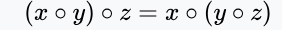{width="2.9379101049868765in"
height="0.3125437445319335in"}

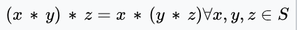{width="3.6142694663167103in"
height="0.37243000874890636in"}

#### Commutative property / Commutativity

**Commutative property / Commutativity:**

In mathematics, a binary operation is commutative if changing the order
of the operands does not change the result.

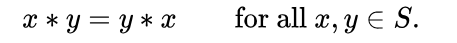{width="2.8735870516185478in"
height="0.2703805774278215in"}

#### Distributive Property / Distributivity

**Distributive Property:**

**∀a∀b∀c( a × (b+c) = (a×b) + (a×c) )**

### Binary Logical Connectives / Binary Operators

**Binary Logical Connectives / Binary Operators:** Binary logical
connectives, also known as binary logical operators, are used to
[combine two propositions (or statements) to form a compound
proposition]{.underline}. The truth value of the resulting compound
proposition is determined by the truth values of the individual
propositions and the specific binary connective used.

#### Logical Equivalence

**Logical Equivalence** Logical equality is a logical operator that
corresponds to equality in Boolean algebra and to the **logical
biconditional** in propositional calculus. It gives the functional value
true if both functional arguments have the same logical value, and false
if they are different. The symbol for logical equivalence is **≡.**

{width="4.671176727909011in"
height="1.065987532808399in"}

**Logical equivalence tells you whether two statements are always true
or always false together. If they are, they are logically equivalent.**

-   **Proposition 𝑃: \"Light A is on.\"**

-   **Proposition 𝑄: \"Light B is on.\"**

If both lights are on (𝑃 is true and 𝑄 is true), then 𝑃 ≡ 𝑄 is true.

If both lights are off (𝑃 is false and 𝑄 is false), then 𝑃 ≡ 𝑄 is true.

{width="1.5604166666666666in"
height="1.1736111111111112in"}

The Venn diagram of A EQ B (red part is true)

#### Conjunction

**Conjunction**: In logic and mathematics ∧ is the truth-functional
operator of conjunction or logical conjunction.

This is also known as 'AND'

A logical conjunction is a binary operation, typically the values of two
propositions, that produces a value of true if and only if both of its
operands are true.

{width="1.7249726596675417in"
height="1.928746719160105in"}

{width="1.5604166666666666in"
height="1.1736111111111112in"} {width="1.5260115923009623in"
height="1.5260115923009623in"}

#### Disjunction

**Disjunction:** In logic, disjunction, also known as **logical
disjunction** or **logical or** or **logical addition** or **inclusive
disjunction**, is a logical connective typically notated as ∨ and read
aloud as \"or\".

In classical logic, disjunction is given a truth functional semantics
according to which a formula 𝜙 ∨ 𝜓 is true unless both are false.

{width="1.790452755905512in"
height="1.7400174978127734in"}

{width="2.295138888888889in"
height="2.295138888888889in"}

#### Exclusive Disjunction / Exclusive OR

**Exclusive OR:**

Exclusive disjunction essentially means \'either one, but not both nor
none\'. In other words, the statement is true if and only if one is true
and the other is false.

[It gains the name \"exclusive or\" because the meaning of \"or\" is
ambiguous when both operands are true.]{.underline}

*[**XOR** excludes that case]{.underline}*. Some informal ways of
describing **XOR** are \"one or the other but not both\", \"either one
or the other\", and \"A or B, but not A and B\".

Symbolically, XOR is expressed as: $\mathbf{\oplus ,\  ≢}$**, ...**

{width="6.5in"
height="2.4243055555555557in"}

{width="1.5604166666666666in"
height="1.1736111111111112in"}

#### Conditional Statement / Material Condition / Material Implication / Hypothetical Proposition

**Conditional Statement / Material condition / Material Implication:**

A conditional statement, also known as an implication, is a fundamental
concept in logic that expresses a relationship between two propositions.
It is often written in the form \"if 𝑃, then 𝑄\" and is denoted by the
symbol →

The term material implication / material condition is particularly
important because it differentiates the usage of the conditional
statement in logic from how it is normally understood in normal
language.

In a conditional formula A → B

-   The sub formula **A** is referred to as the **antecedent**

-   **B** is called the consequent of the **conditional**.

{width="1.8460837707786526in"
height="1.813601268591426in"}

The logical cases where the antecedent A is false and A → B is true, are
called \"vacuous truths\". Examples are \...

-   \... with **B** false: \"If Marie Curie is a sister of Galileo
    Galilei, then Galileo Galilei is a brother of Marie Curie\",

-   \... with **B** true: \"If Marie Curie is a sister of Galileo
    Galilei, then Marie Curie has a sibling.\".

{width="6.5in" height="1.875in"}

##### Vacuous Truth

**Vacuous Truth:** Vacuous truth refers to a conditional statement
(implication) that is considered true solely because its antecedent (the
\"if\" part) is false, regardless of the truth value of the consequent
(the \"then\" part).

A vacuous truth is a conditional or universal statement (a universal
statement that can be converted to a conditional statement) that is
*[true because the antecedent cannot be satisfied]{.underline}*.

Examples common to everyday speech include conditional phrases used as
*[idioms of improbability]{.underline}* like \"when hell freezes over
\...\" and \"when pigs can fly \...\", indicating that not before the
given (impossible) condition is met will the speaker accept some
respective (typically false or absurd) proposition.

##### Inverse

**Inverse:** In logic, an inverse is a type of conditional sentence
which is an immediate inference made from another conditional sentence.

Given a conditional sentence of the form **P → Q**, the inverse refers
to the sentence **¬P → ¬Q**

For example, substituting propositions in natural language for logical
variables, the inverse of the following conditional proposition

\"If it\'s raining, then Sam will meet Jack at the movies.\"

would be

\"If it\'s not raining, then Sam will not meet Jack at the movies.\"

##### Converse

The converse of a categorical or implicational statement is the result
of reversing its two constituent statements.

For the implication **P → Q**, the converse is **Q → P**.

##### Contrapositive

**T**he contrapositive of a statement has its antecedent and consequent
inverted and flipped.

Conditional statement **P → Q**

In formulas: the contrapositive of **P →** **Q** is **¬Q → ¬P**

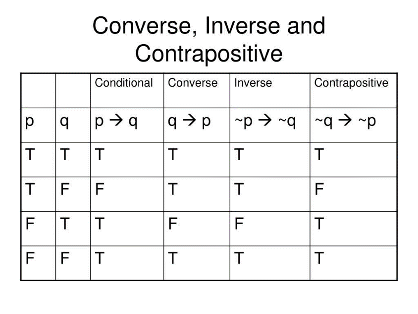{width="3.7924092300962378in"
height="2.844306649168854in"}

#### Logical Biconditional / Biconditional Statement

**Logical Biconditional / Biconditional Statement:** The biconditional,
also known as the equivalence operator, is a logical connective that
combines two propositions and states that both **propositions** have the
same truth value.

In other words, 𝑃 ↔ 𝑄 is true if both 𝑃 and 𝑄 are either true or false.

In the propositional interpretation, 𝑃 ↔ 𝑄 means that P implies Q and Q
implies P; in other words, the propositions are logically equivalent, in
the sense that both are either jointly true or jointly false.

Again, this does not mean that they need to have the same meaning, as P
could be \"the triangle ABC has two equal sides\" and Q could be \"the
triangle ABC has two equal angles\". In general, the antecedent is the
premise, or the cause, and the consequent is the consequence.

When an implication is translated by a hypothetical (or conditional)
judgment, the antecedent is called the hypothesis (or the condition) and
the consequent is called the thesis.

{width="3.0315463692038493in"
height="2.0848720472440947in"}

{width="2.0727580927384075in"
height="2.0334634733158357in"}

### Connective Precedence

Just like in mathematics, parentheses can be used in compound
expressions to indicate the order in which the operators are to be
evaluated. In the absence of parentheses, the order of evaluation is
determined by precedence rules.

{width="2.0108956692913385in"
height="2.044978127734033in"}

# Predicate Logic / first-order logic

**Predicate Logic / first-order logic:**

# Mathematical Notations

## Equivalence Symbols

### Equality ( = )

**Type:** Object-level symbol.

**Meaning:** Two mathematical objects are the same.

**Used with:** Sets, numbers, functions, etc.

### Equivalence (⟺)

**Type:** Meta-level notation in mathematics writing.

**Meaning:** "These two statements are equivalent" or "by definition,
one holds iff the other holds."

**Not part of formal logic syntax** --- shorthand used in derivations.

### Congruence (≡)

**Type:** Varies by context.

**Meaning:**

-   In algebra/number theory: congruence (e.g. a≡b (mod n)

-   In logic: syntactic identity (two expressions are literally the
    same)

-   In analysis: sometimes used for "identically equal" functions

# Set Theory

**Set Theory:** Set theory is the branch of mathematical logic that
studies Sets, which can be informally described as collections of
objects.

There are 2 primary branches of set theory:

-   **Naïve Set Theory**: Naive set theory is an informal approach to
    set theory that was developed in the late 19th century before the
    formalization of set theory by mathematicians such as Ernst
    **Zermelo** and **Abraham Fraenkel**. The term \"naive\"
    distinguishes it from more rigorous, formalized versions of set
    theory, like **Zermelo-Fraenkel** set theory (ZF), which are used to
    avoid certain paradoxes that arise in naive set theory.

-   **Axiomatic Set Theory**: To resolve the issues of naive set theory,
    mathematicians developed more rigorous frameworks for set theory.
    The most widely accepted is **Zermelo-Fraenkel** set theory (ZF),
    often extended with the **Axiom of Choice (ZFC).** These systems use
    axioms to carefully define the properties of sets and restrict the
    kinds of sets that can be formed, thereby avoiding the paradoxes
    inherent in naive set theory.

## Set

**Set:** A set is a collection of "*things*." These ***things*** are
called elements of the set.

Elements are normally written with lower case letters and sets are
normally written with upper case letters.

We write **a ∈ A** for \"a is an element of a set A\", and **a ∉ A**,
for \"a is not an element of a set A\".

**∅** or **{}** denotes the empty set, which contains no element.

{width="3.3458934820647417in"
height="1.433109142607174in"}

**Set elements are unique.** An element is either in the set or not in
the set. [It makes no sense to say that an element is in the set
multiple times]{.mark}. It may be listed multiple times, but this is
extraneous.

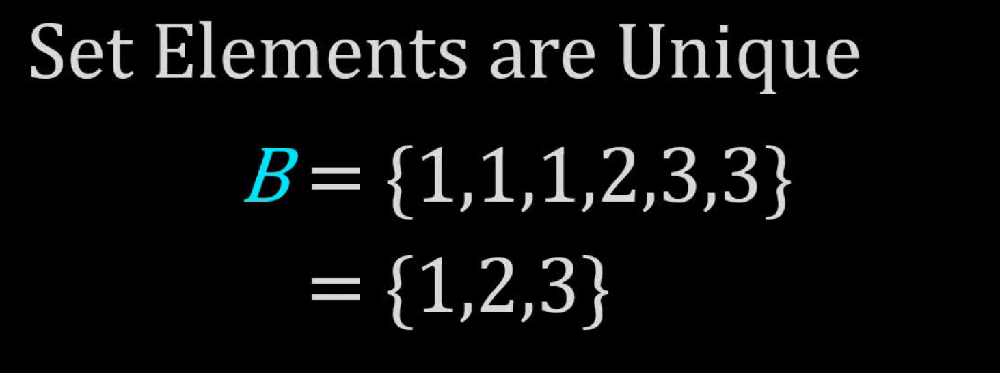{width="2.506751968503937in"
height="0.9354790026246719in"}

**Sets are unordered.** They can be written in any order you wish, but
conceptually, [order is meaningless and not included in the formal
definition of a set]{.mark}.

## Set Membership / Set Elements

**Set Membership / Set Elements:** An element of a set is a distinct
object that belongs to the set.

Writing A = {1,2,3,4} means that the elements of the set are 1,2,3,4.

Sets can themselves be elements. B = {1,2,{1,2}}. The members of the set
B are 1,2 and the set {1,2}.

Set membership is a binary relation denoted by the symbol: **∈**

{width="6.5in"
height="1.398611111111111in"}

## Roster Notation

Roster notation (also known as **enumeration notation**) involves
explicitly listing out all the elements of the set within curly braces.

{width="6.5in"
height="1.9423611111111112in"}

## Set-Builder Notation

Set-builder notation describes the elements of a set by specifying a
property or condition that the elements of the set satisfy, rather than
listing them out.

## Empty Set

The empty set, denoted as $\varnothing\ $ and sometimes $\{\}$, is a set
with no members at all.

Although the empty set has no members, it can be a member of other sets.
Thus $\varnothing \neq \{\varnothing\}$

## Subset

A is a subset of B, (denoted A ⊆ B ), if every element of A is also an
element of B.

If A is not a subset of B, we write A ⊈ B.

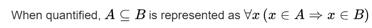{width="4.598778433945757in"
height="0.3512959317585302in"}

## Proper Subset

We can say that A is proper subset of B when there exists an element in
B that does not exist in A. Everything in A is also in B, but B contains
something not in A.

∃x( x ∈ B ∧ x ∉ A)

{width="5.750527121609799in"
height="1.8664643482064742in"}

## Set Equality

Two sets are **equal** iff they have the **same members**. Formally
**(Axiom of Extensionality):**

$$A = B\text{\:\,\:\,} \Longleftrightarrow \text{\:\,\:\,}\forall x\text{\:\,}(x \in A\text{\:\,} \Longleftrightarrow \text{\:\,}x \in B)
$$

Equivalently (very handy in proofs):

A = B ⟺ ( A ⊆ B) ∧ ( B ⊆ A )

**How to prove sets** $\mathbf{A = B}\mathbf{\ }$**in practice:**

1.  **Show** $A \subseteq B$**:** take an arbitrary $x \in A$, prove
    $x \in B$.

2.  **Show** $B \subseteq A$**:** take an arbitrary $x \in B$, prove
    $x \in A$.\
    Done---by double containment.

**Common proof pattern (template)**

To show $A = B$: let $x$ be arbitrary

-   If $x \in A$, then ... hence $x \in B$

-   If $x \in B$, then ... hence $x \in A$

> Therefore $A = B$

## Pigeonhole Principle (PHP)

If $m\ $objects (pigeons) are placed into $n$ containers (holes) with
$m > n$, then at least one container holds **two or more** objects.

**Proof (counting).**\
Assume every container holds at most one object. Then there are at most
$n$ objects total. But $m > n$.

Contradiction. ∎

**Theorem (Generalized PHP).**

Placing $m\ $objects into $n\ $containers guarantees some container has
at least:

$$\lceil\frac{m}{n}\rceil
$$

objects.

*Average view.* The average load is $m/n$. Some load is $\geq$the
average, thus $\geq \lceil m/n\rceil$.

## Cardinality

**Cardinality:** Let A be a set. then the number of elements in the set
A is called **cardinality** of the set A, and is denoted by **\|A\|**

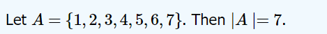{width="2.77707239720035in"
height="0.2901421697287839in"}

{width="2.4054932195975502in"
height="1.8637445319335084in"}

### Finite vs. Infinite Sets

**Core definitions**

**Set equality (Extensionality):**

$$A = B\text{\:\,} \Longleftrightarrow \text{\:\,}\forall x\text{ }(x \in A \leftrightarrow x \in B)$$

**Subset:**

$A \subseteq B\text{\:\,} \Longleftrightarrow \text{\:\,}\forall x\text{ }(x \in A \Rightarrow x \in B)$.

**Proper subset**:

$$A \subsetneq B$$

**Functions and size (cardinality)**

**Injection (one-to-one):**

$f:A \rightarrow B$ with $x \neq y \Rightarrow f(x) \neq f(y)$

**Surjection (onto):**

$$\forall b \in B,\text{ }\exists a \in A:f(a) = b$$

**Bijection:**

both injective & surjective; write $A \cong B$ or
$\mid A \mid = \mid B \mid$

**Size comparisons (all sets):**

-   $\mid A \mid \leq \mid B \mid$iff there exists an **injection**
    $A \rightarrow B$.

-   $\mid A \mid \geq \mid B \mid$iff there exists an **injection**
    $B \rightarrow A$(equivalently, a surjection $A \rightarrow B$).

-   **Schröder--Bernstein:** injections both ways
    $A \hookrightarrow B$and $B \hookrightarrow A$⇒ bijection
    $A \cong B$.

#### Finite Set

**Definition (cardinal):**

A set $S$ is **finite** if $S \cong \{ 0,1,\ldots,n - 1\}$ for some
$n \in \mathbb{N}$; ($\cong$ is bijection symbol)

$\mid S \mid = n$.

#### Infinite Set

## Universal Set

The universal set is a fundamental concept in set theory, which refers
to the set that contains all the objects or elements under consideration
for a particular discussion or problem. In other words, the universal
set is the \"superset\" of all the sets involved in a specific context.

The universal set, often denoted by 𝑈, is the set that includes every
element that is being considered in a given discussion or problem
domain. All other sets in that context are subsets of the universal set.

{width="3.2870734908136483in"
height="1.9075142169728785in"}

**Special Considerations:**

The Concept of an **Absolute Universal Set**:

In some discussions, the idea of an \"absolute\" universal
set---containing all possible sets---leads to paradoxes, such as
Russell\'s Paradox. To avoid these issues, most modern set theories,
like Zermelo-Fraenkel set theory, do not include an absolute universal
set.

**Instead, the universal set is always defined relative to a particular
context or domain of discourse.**

## Set Operations

**Set Operations**

### Set Union

**Set Union:** The union of two sets A and B is the set of elements
which are in both **A** and **B**.

∀x( x ∈ (A∪B) ↔ ( x ∈ A ∨ x ∈ B ))

{width="2.732963692038495in"
height="2.683568460192476in"}

### Set Intersection

**Set Intersection:**

∀x( x∈ (A∩B) ↔ ( x ∈ A ∧ x ∈ B))

{width="3.239613954505687in"
height="2.3637893700787402in"}

#### Set Difference / Relative Set Compliment

**Set Difference:** The set difference between **B** and **A** is
written as: $\mathbf{B \smallsetminus A}$.

It is the set of all elements in **B** that are not in **A** (**the
relative complement of** $\mathbf{A}$ **in** $\mathbf{B}$)

∀x( x ∈ (B∖A) ↔ ( x ∈ B ∧ x ∉ A) )

{width="3.5174496937882767in"
height="3.432577646544182in"}

### Set Compliment

#### Absolute Set Compliment

**Absolute Set Compliment:** The set compliment is the set of all
elements from the domain of discourse which are NOT in A.

∀x( x ∈ A′ ↔ ( x∈ U ∧ x ∉ A) )

{width="2.2295811461067365in"
height="0.3145702099737533in"}

{width="3.2097386264216974in"
height="2.347321741032371in"}

## Ordered Pairs (Kuratowski's definition)

**Ordered pair:** Formally, an ordered pair with **first
coordinate** *a*, and **second coordinate** *b*, usually denoted by
**(*a*, *b*),** can be defined as the
set $\mathbf{\{\{ a\},\{ a,b\}\}}.$

**What an ordered pair must satisfy**

We want a set-theoretic object ⟨a,b⟩ so that

$$\langle a,b\rangle = \langle c,d\rangle\text{\:\,} \Longleftrightarrow \text{\:\,}a = c\text{ and }b = d.
$$

The naive set $\{ a,b\}$fails (it ignores order: $\{ a,b\} = \{ b,a\}$).

**Kuratowski's definition:**

⟨a,b⟩:={{a},{a,b}} 

**Why it works (key property)**

**Assume** $\mathbf{\{\{ a\},\{ a,b\}\} = \{\{ c\},\{ c,d\}\}}$

Since $\{ a\}$is an element on the left, it must equal $\{ c\}$or
$\{ c,d\}$

In either case we get $a = c\ $(if $\{ a\} = \left\{ c \right\}$ then
$a = c$

if $\{ a\} = \{ c,d\}$then that set is a singleton, so $c = d = a$)

With $a = c$ now fixed, the other elements must match, so
$\{ a,b\} = \{ c,d\} = \{ a,d\}$, hence $b = d$

Thus equality of the sets forces $a = c$and $b = d$. Conversely, if
$a = c$and $b = d$, the two sides are literally the same set

*(Edge case* $a = b$*: then* $\langle a,a\rangle = \{\{ a\}\}$*; the
same argument still gives* $c = a$ *and* $d = a\ $*)*

**Cartesian Product:** The Cartesian product of two sets **A** and
**B**, written **A X B**, is the set of all ordered pairs in which the
first element belongs to **A** and the second belongs to **B**.

{width="2.6780489938757657in"
height="0.393999343832021in"}

**The cardinality of \|A X B\| = \|A\|\|B\|**

A table can be created by taking the Cartesian product of a set of rows
and a set of columns. If the Cartesian product **rows** *×* **columns**
is taken, the cells of the table contain ordered pairs of the form (row
value, column value).\[4\]

{width="2.23003280839895in"
height="2.1924475065616797in"}

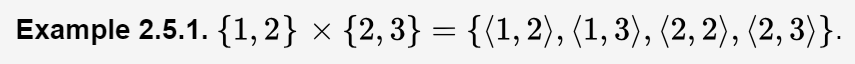{width="4.502731846019247in"
height="0.33722331583552057in"}

# Prime Factorization

**Prime Factorization:** Prime factorization is a process of factoring a
**composite number** in terms of **prime numbers**.

*[[Every composite number has a unique prime factorization---this is
guaranteed by the Fundamental Theorem of
Arithmetic.]{.mark}]{.underline}*

Because every composite number has a unique prime factorization, there
is only one way to reduce a composite number into a product of primes.

## Factor tree method of prime factorization

**Factor tree method of prime factorization:**

To find the prime factorization of the given number using factor tree
method, follow the below steps:

-   **Step 1:** Consider the given number as the root of the tree

-   **Step 2:** Write down the pair of factors as the branches of a tree

-   **Step 3:** Again factorize the composite factors, and write down
    the factors pairs as the branches

-   **Step 4:** Repeat the step, until to find the prime factors of all
    the composite factors

{width="3.5698304899387576in"
height="1.1668175853018372in"}

# Partial Fraction Decomposition

**Partial Fraction Decomposition:** Partial fraction decomposition is a
method used to express a rational function (a fraction where the
numerator and the denominator are both polynomials) as a sum of simpler
fractions, known as partial fractions. This technique is particularly
useful for integrating rational functions and solving differential
equations.

[Partial fraction decomposition is the inverse process of finding the
lowest common denominator.]{.mark}

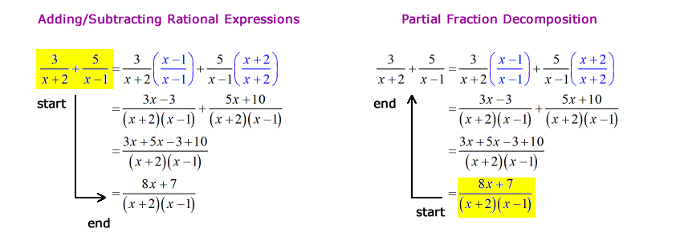{width="5.427798556430446in"
height="1.9339435695538059in"}

{width="4.817334864391951in"
height="3.3963232720909886in"}

So what if we have factors not falling into one of these 4 forms above?

*[When dealing with higher-degree factors (such as cubic or higher), you
can use polynomial long division or other algebraic techniques to reduce
the problem to a form that can then be handled by the four
cases.]{.mark}*

# Symbolic Methods vs. Numerical Methods

## Symbolic Methods

**Symbolic Methods:** Symbolic methods involve manipulating mathematical
expressions algebraically to find exact solutions. These methods rely on
**symbolic computation**, where the results are expressed in terms of
algebraic formulas.

Ex:

-   **Quadratic Formula**

-   **Cubic and Quartic Formulas**

-   **Factoring**

**Advantages:**

-   **Precision:** Solutions are exact and not subject to rounding
    errors.

-   **Insight:** Provides deeper understanding of the mathematical
    structure of the problem.

**Disadvantages:**

**Complexity:** Symbolic solutions can be very complex, especially for
higher-degree polynomials.

**Limitations:** *[[General symbolic solutions are not available for
polynomials of degree five or higher due to the **Abel-Ruffini
theorem**.]{.underline}]{.mark}*

## Numerical Methods

**Numerical Methods:** Numerical methods involve approximating solutions
through iterative algorithms and numerical computations. The results are
given as approximate numerical values.

Ex:

-   **Newton's Method**

-   **Bisection Method**

-   **Secant Method**

  -----------------------------------------------------------------------
  Aspect            Symbolic Methods      Numerical Methods
  ----------------- --------------------- -------------------------------
  Nature of         Exact, closed-form    Approximate, iterative
  Solution          solutions             solutions

  Precision         Exact (subject to     Approximate (with controllable
                    algebraic             accuracy)
                    manipulation)         

  Applicability     Limited to certain    Broad applicability to various
                    classes of problems   types of problems

  Complexity        Can be complex,       Iterative, often simpler
                    especially for higher algorithms
                    degrees               

  Convergence       Guaranteed for        Convergence depends on the
                    solvable forms        method and problem

  Insight           Provides deeper       Practical and efficient for
                    mathematical          computational tasks
                    understanding         

  Example           **Quadratic formula,  **Newton's method, bisection
  Techniques        factoring, Cardano's  method, secant method**
                    method**              
  -----------------------------------------------------------------------

# Functions & Relations

## Relation

**Relation:** A **relation** is a set of ordered pairs, where each pair
consists of an element from one set, called the **domain**, and an
element from another set, called the **codomain**.

The relation specifies a relationship between these elements, indicating
how elements from the **domain** are associated with elements in the
**codomain**.

**Definition**: A relation **𝑅** from set **𝐴** to set **𝐵** is a
[subset](#subset) of the [Cartesian
product](#ordered-pairs-kuratowskis-definition) **𝐴×𝐵**, which means

**𝑅 ⊆ 𝐴×𝐵**

Each element of **𝑅** is an ordered pair **(𝑎,𝑏)** where **𝑎 ∈ 𝐴** and
**𝑏 ∈ 𝐵**.

We may state that **x** bears relation **R** to **y** by writing **xRy**

Key Concepts

1.  **Domain, Codomain**, **Range, Image**

-   The **domain** of a relation is the set of all possible first
    elements (inputs) in the ordered pairs.

-   The **codomain** (or target set) is the set of all possible second
    elements (outputs) in the ordered pairs.

-   The **range** is the set of *[actual outputs]{.underline}* in the
    relation, which is a subset of the codomain.

-   The **image** a relation, often used in the context of specific
    subsets of the domain, is the set of actual outputs that the
    relation produces when applied to a particular subset of its domain.
    For a given subset of the domain, the image refers to the outputs
    that the function generates from that subset.

**In summary:**

**Domain**: All possible inputs.

**Codomain**: All possible outputs (as defined for the function or
relation).

**Range**: The ***[actual outputs produced by the
relation]{.underline}*** over its entire domain (a subset of the
codomain).

**Image**: The set of actual outputs for a specific subset of inputs
(may be the same as the range if considering the whole domain).

2.  **Ordered Pairs**

-   An **ordered pair** (𝑎,𝑏) consists of two elements, where 𝑎 is from
    the domain and 𝑏 is from the codomain. The order of elements
    matters, meaning (𝑎,𝑏) ≠ (𝑏,𝑎) unless 𝑎 = 𝑏.

3.  Types of Relation

-   **Function**: A special type of relation where each element in the
    domain is associated with exactly one element in the codomain. For
    every 𝑎 in the domain, there is a unique 𝑏 in the codomain such that
    (𝑎,𝑏) is in the relation.

### Properties of Relations

**Properties of Relations**

#### Reflexive Property

**Reflexive Property:** A relation R on a set A is said to be reflexive
if every element of A is related to itself. In other words, for all a in
A, the pair **(a,a)** is in the relation R.

∀a ∈ A(a ∈ A → R(a, a))

The reflexive property of relations can be understood from a directed
graph by looking for a loop on each element going back to itself.

The reflexive property of relations can be understood from a matrix by
looking for a diagonal connecting from top left corner to bottom right
corner

{width="4.799899387576553in"
height="2.527127077865267in"}

#### Symmetric Property

**Symmetric Property:**

A relation **R** on a set **A** is said to be **symmetric** if, whenever
an element a is related to an element **b**, then **b** is also related
to **a**.

In other words, if **(a,b) ∈ R** and **(b,c) ∈ R**, then **(a,c)** must
also be in **R**.

∀a,b ∈ A ( R(a,b) → R(b,a) )

#### Transitive Property

**Transitive Property:**

A relation **R** on a set **A** is said to be **transitive** if,
whenever an element **a** is related to an element **b** and **b** is
related to an element **c**, then **a** must also be related to **c**.

In other words, if **(a,b) ∈ R** and **(b,c) ∈ R** then **(a,c)** must
also be in **R**.

∀a,b,c ∈ A ( ( R(a,b) ∧ R(b,c) ) → R(a,c) )

### Equivalence Relation

**Equivalence Relation:** An equivalence relation is a way to formally
define when two elements of a set can be considered \"equivalent\" or
\"similar\" in some sense, according to specific criteria.

Equivalence relations are fundamental in mathematics because they allow
us to group elements of a set into distinct classes of equivalent items,
which simplifies the study and understanding of complex structures.

A relation **R** on a set **A** is called an **equivalence relation** if
it satisfies the following three properties:

1.  **Reflexivity:**

∀a ∈ A : (a,a) ∈ R

This means that every element is related to itself.

2.  **Symmetry:**

∀a,b ∈ A (R(a,b)→R(b,a))

This means that if a is related to b, then b is also related to a.

3.  **Transitivity:**

∀a,b,c ∈ A (( R(a,b) ∧ R(b,c) ) → R(a,c))

This means that if a is related to b and b is related to c, then a is
also related to c.

**Key Concepts and Why They Matter:**

**1. Partitioning a Set:**

**Definition:** An equivalence relation partitions a set into
equivalence classes. Each equivalence class is a subset of the original
set, containing elements that are all equivalent to each other under the
given relation.

**Importance:** This partitioning allows us to break down large or
complex sets into smaller, more manageable subsets. Instead of dealing
with individual elements, we can work with entire classes, which
simplifies many problems in mathematics.

**Example:** Consider the set of all integers. The equivalence relation
\"congruence modulo 3\" divides this set into three equivalence classes:
numbers that leave a remainder of 0, 1, or 2 when divided by 3. Instead
of analyzing each integer separately, we can study the properties of
these three classes.

**Why Equivalence Relations Matter:**

-   **Classification and Simplification:** They provide a systematic way
    to classify and simplify mathematical objects by grouping elements
    that share a common property. This is particularly valuable in
    reducing complexity.

-   **Revealing Structure:** Equivalence relations often reveal hidden
    structure in a set, allowing us to understand it more deeply by
    studying its equivalence classes rather than individual elements.

-   **Generalization:** They generalize the concept of equality,
    enabling broader comparisons and connections between different
    mathematical entities.

-   **Applications Across Mathematics:** They are fundamental in many
    areas of mathematics and its applications, from abstract algebra and
    geometry to computer science and topology.

## Function

**Function:** A function is a relation that uniquely associates each
element of a set, called the **domain**, with exactly one element of
another set, called the **codomain**.

A function **f** from a set **X** (called the **domain**) to a set **Y**
(called the **codomain**) is a **rule or mapping** that **assigns to
each element** **x** in **X** **exactly one element** **y** in **Y**.

The element **y** is called the **image** of **x** under the function
**f**, and it is often denoted as **f(x)**.

Precise definition of a function:

A function is formed by three sets, the **domain** **X,** the
**codomain** **Y**, and the **graph R** that satisfy the three following
conditions.

{width="3.877329396325459in"
height="1.0339545056867891in"}

**1. Domain of a Function:**

The **domain** of a function **f : X → Y** is the set **X**. It includes
[all the possible inputs]{.underline} that the function can accept.

**Example**: For the function **f(x) =** $\sqrt{\mathbf{x}}$, the domain
is **X = { x ∈ R ∣ x ≥ 0 }**, because the square root function is only
defined for non-negative real numbers.

**2. Codomain of a Function:**

The **codomain** of a function **f : X → Y**, which includes [all
possible outputs that the function is allowed to produce according to
its definition]{.underline}.

The **codomain** is specified as part of the function\'s definition,
[even if not all elements of the **codomain** are actually reached by
the function.]{.mark}

**3. Range of a Function:**

The range of a function **f : X → Y** is the [set of all actual
outputs]{.underline} that the function produces when applied to every
element in its domain **X**.

The range is therefore a subset of the codomain.

**4. Image of a Function:**

The **image** of a function is similar to the **range** but often refers
to the outputs corresponding to a specific subset of the domain. If the
subset in question is the entire **domain**, then the **image** and the
**range** are the same. For a particular subset **A ⊆ X**, the image of
**A** under **f** is denoted as **f(A)**.

{width="7.024145888013998in"
height="0.9335498687664042in"}

### Domain

The domain of a function **f** is the set **X**, which includes all the
possible inputs for the function. In terms of ordered pairs, the domain
is the set of all possible first values (the input values) in those
pairs.

Dom(f) = A ⟺ ∀x(x ∈ A ↔ ∃y f(x)=y)

Dom(f) = { x ∣ ∃y f(x) = y}

### Codomain

The **codomain** of a function **f : X → Y**

includes [all possible outputs that the function is allowed to produce
according to its definition]{.underline}

The **codomain** is specified as part of the function\'s definition,
even if not all elements of the **codomain** are actually reached by the
function. This contrasts with range, which represents the actually
mapped values of the **codomain**.

Cod(f) = B ⟺ ∀x ∈ Dom(f) ,∃y ∈ B (f(x)=y)

### Range

The range of a function **f : X → Y** is the [set of all actual
outputs]{.underline} that the function produces when applied to every
element in its domain **X**. The range is therefore a subset of the
codomain.

Range(f) = { y ∈ Cod(f) ∣ ∃x ∈ Dom(f), f(x) = y}

Range(f) = { f(x) ∣ x ∈ Dom(f) }

Explanation:

-   **∀y**: For all elements **y** in the codomain.

-   **y ∈ Range (f)↔ ∃x ( x ∈ X ∧ f(x)=y)**:

    -   This states that **y** is in the **range** of the function **f**
        iff. there exists an element **x** in the domain **X** such that
        **(x) = y**.

    -   In other words, for each **y** in the **range**, there is at
        least one **x** in the **domain** that maps to **y**.

### Image

The **image** of a function is similar to the **range** but often refers
to the outputs corresponding to a specific subset of the domain.

*[If the subset in question is the entire **domain**, then the **image**
and the **range** are the same.]{.underline}*

For a particular subset **A ⊆ X**, the image of **A** under **f** is
denoted as **f(A)**.

### Preimage

The **preimage** of a set under a function is a concept that refers to
the set of all elements in the domain that map to a given subset of the
codomain.

In other words, for a function:

**f : X → Y** and a subset **B** of the codomain **Y**, the preimage of
**B** under **f** is the set of all elements in the domain **X** that
**f** maps into **B**.

$f^{- 1}(B)$= { x ∈ X ∣ f(x) ∈ B }

The **preimage** of a set **B** under a function **f** is the set of all
elements in the domain **X** that map to elements in **B** in the
codomain **Y**.

One should not be mislead by the notation into thinking of the preimage
as having to do with an inverse of **f**. The preimage is define whether
f has an inverse or not. **Note that however** if f does have an
inverse, then the preimage is exactly the image of Y under the inverse
map.

### Injection (one-to-one)

**Injection:** A function is **injective** if every element in the
domain maps to one and only one element in the codomain.

∀x~1~​∀x~2~​( (f(x~1~​) = f(x~2~​) ) → ( x~1~​ = x~2~​) )

*For every x~1~,x~2~ if f(x~1~) = f(x~2~), then x~1~ must equal x~2~*

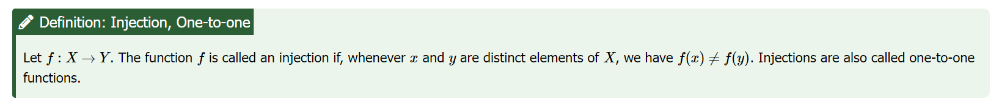{width="6.877759186351706in"
height="0.7360586176727909in"}

{width="3.7375885826771653in"
height="2.8031911636045495in"}

### Surjection (onto)

**Surjection:** A surjective function is a function whose image is equal
to it's codomain.

A surjective function is one whose codomain is equal to its range.

{width="3.8034733158355207in"
height="1.0977766841644794in"}

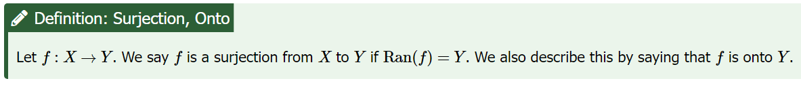{width="6.941247812773403in"
height="0.7452941819772528in"}

{width="4.018518153980753in"
height="3.013888888888889in"}

{width="2.1412674978127733in"
height="3.7978226159230095in"}

### Bijection (injective and surjective)

A function is bijective if and only if it is
both **injective** **(or *one-to-one*)---**meaning that each element in
the codomain is mapped to from at most one element of the
domain---and **surjective** **(or *onto*)---**meaning that each element
of the codomain is mapped to from at least one element of the domain. 

{width="5.550710848643919in"
height="2.474691601049869in"}

### Invertibility

**Let f: A → B**

**f is invertible if there exists a function g: B → A such that:**

∀x ∈ A, g(f(x)) = x ∧ ∀y ∈ B, f(g(y)) = y.

**In this case, g is called the inverse of f, written f\^−1**

## **Schröder--Bernstein (Cantor--Bernstein) Theorem**

**Statement.**

If there are injections $f:A \rightarrow B$ and $g:B \rightarrow A$,
then there exists a bijection $h:A \rightarrow B$

(So $\mid A \mid \leq \mid B \mid \ $and
$\mid B \mid \leq \mid A \mid \ $together imply
$\mid A \mid = \mid B \mid$. No Choice needed.)

# Complex Numbers

**Complex Numbers:** A Complex Number is a combination of a Real Number
and an Imaginary Number.

Complex numbers allow solutions to all polynomial equations, even those
that have no solutions in real numbers.

For example, the equation
$\mathbf{(x + 1)}^{\mathbf{2}}\mathbf{= \  - 9}$ has no real solution,
because the square of a real number cannot be negative but has the two
nonreal complex solutions **-1+3i** and **-1-3i**.

{width="1.2611515748031497in"
height="0.6549332895888014in"}

{width="2.330994094488189in"
height="2.1023436132983377in"}

## Complex Plane

**Complex Plane:**

In the complex plane, there is a real axis and a
perpendicular, imaginary axis.

The complex number 𝑎+𝑏𝑖 is graphed on this plane just as the ordered
pair (*a*,*b*) would be graphed on the Cartesian coordinate plane.

The real axis corresponds to the 𝑥-axis and the imaginary axis
corresponds to the *y*-axis.

{width="3.170236220472441in"
height="3.1787456255468065in"}

Polar Form / Trigonometric form of Complex Number

**Polar Form / Trigonometric form of Complex Numbers:** The polar form
of a complex number is a different way to represent a complex number
apart from rectangular form.

The horizontal axis denotes the real axis, and the vertical axis denotes
the imaginary.

{width="2.8282206911636045in"
height="2.0528772965879267in"}

## Imaginary Unit

**Imaginary Unit:**

{width="1.9093099300087488in"
height="1.4317782152230971in"}

# Linear Functions d=1

**Linear Functions:** A linear function is a function that can be used
to express a constant rate of change.

*[[This constant rate of change is reflected in the function\'s slope,
which remains the same regardless of the interval over which it is
measured.]{.underline}]{.mark}*

Linear functions have a maximum degree of 1.

When graphed, a linear function will create a straight line.

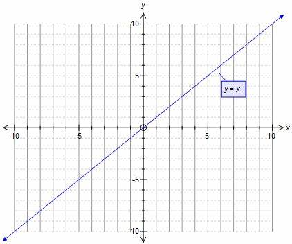{width="3.3436504811898513in"
height="2.7890168416447945in"}

## Linear Equation Forms

Linear Equation Forms

### Slope-Intercept Form

**Slope-Intercept Form**

f(x) = mx + b

-   **f(x)** (or **y**) is the output or dependent variable.

-   𝑥 is the input or independent variable.

-   𝑚 is the slope of the line, representing the constant rate of
    change.

-   𝑏 is the y-intercept, representing the value of 𝑓(𝑥) when 𝑥 = 0.

### Calculating Slope

**Calculating Slope:**

The slope, or rate of change, of a function *m* can be calculated
according to the following:

{width="6.5in"
height="1.0270833333333333in"}

### Standard Form

**Standard Form:**

Why use standard form?

The standard form of a line can be particularly helpful when solving a
system of equations. For instance, when using the elimination method to
solve a system of equations, we can easily align the variables using
standard form.

{width="3.8277832458442695in"
height="1.0532830271216098in"}

### Point-Slope Form

**Point-Slope Form:**

{width="2.5252034120734907in"
height="0.9881233595800525in"}

## Parallel Lines

Parallel Lines are lines having the same slope M

M = M

## Perpendicular Lines

Perpendicular Lines are lines having a slope equal to the negative
reciprocal

M \* M = -1

# Matrices

**Matrices:** A matrix is a rectangular array of numbers, symbols, or
expressions arranged in rows and columns.

A ***m*** x ***n*** matrix is a rectangular grid of numbers with ***m***
rows and ***n*** columns.

A square matrix is a ***m*** x ***m*** matrix for some ***m***, or a
***n*** x ***n*** matrix for some ***n***.

The ***i,j*** entry of a matrix means the number in row ***i*** and
column ***j***.

[It is important to get these in the correct order:]{.mark} Usually when
you give **(x,y)** coordinates, **x** refers to the horizontal direction
and **y** refers to the vertical direction.

When we talk about the ***I,j*** entry of a matrix, however, the first
number [***i*** refers to the row number (i.e. the vertical
direction)]{.mark} [and the second number ***j*** refers to the column
number (i.e. the horizontal direction).]{.mark}

{width="4.501009405074366in"
height="3.714294619422572in"}

## Matrix Addition

{width="6.846433727034121in"
height="1.63334208223972in"}

## Matrix Multiplication

# Systems of Linear Equations

**Systems of Linear Equations:** A system of linear equations is a
collection of two or more linear equations involving the same set of
variables.

[The goal of solving a system of linear equations is to find the values
of the variables that satisfy all the equations simultaneously.]{.mark}

***[[The solution to a system of linear equations is the point where all
equations intersect.]{.underline}]{.mark}***

{width="4.872146762904637in"
height="3.5281419510061243in"}

The double subscripting on the coefficients *a~ij~* of the unknowns
gives their location in the system---the first subscript indicates the
equation in which the coefficient occurs, and the second indicates which
unknown it multiplies. Thus, *a*~12~ is in the first equation and
multiplies *x*~2~.

## Methods to solve systems of linear equations

**Methods to solve systems of linear equations**

## Substitution Method

**Substitution Method:**

# Polynomial Functions

**Polynomial Functions:**

$$a_{n}x^{n} + a_{n - 1}x^{n - 1} + \ldots + a_{2}x^{2} + a_{1}x^{1} + a_{0}$$

This can be expressed more concisely by using summation notation:

$$\sum_{k = 0}^{n}{a_{k}x^{k}}$$

-   The domain of a **polynomial** **function** is (−∞,∞)

-   **Polynomials** may not have negative power indeterminants /
    variables: $x^{- 2}$

-   The graphs of **polynomial** **functions** are smooth and continuous
    at all points.

-   The **degree** of the **polynomial** is the highest power appearing
    in the **polynomial**.

-   The roots/zeros/solutions of **polynomial** **functions** are those
    values of ***x*** for which ***P(x) = 0***

-   A **polynomial** of degree ***n*** could have up to ***n-many
    possible roots***, but it could have less.

## Quadratic Functions d=2

**Quadratic Functions:**

### Standard Form of a Quadratic Equation

**Standard Form of a Quadratic Equation**

$$f(x) = ax^{2} + bx + c$$

Where a,b,c are real numbers and $a \neq 0$

A quadratic equation is a **polynomial** equation having degree of 2.

### Vertex Form of a Quadratic Equation

**Vertex Form of a Quadratic Equation**

The vertex form of a quadratic equation allows you to read the
vertex/axis of symmetry directly from the equation.

$$f(x) = a(x - h)^{2} + k$$

{width="2.817275809273841in"
height="2.428685476815398in"}

$$f(x) = x^{2}$$

The graph of quadratic function is called a parabola.

Quadratic functions are symmetric around a line called the **axis of
symmetry**.

### Axis of Symmetry

**Axis of Symmetry:** Every parabola has an axis of symmetry which is
the line that divides the graph into two perfect halves.

$$x = \frac{- b}{2a}$$

{width="1.3190321522309711in"
height="0.8631627296587927in"}

### Methods for Solving Quadratic Equations

**Methods for Solving Quadratic Equations**

#### What does it mean to "solve" a quadratic / polynomial?

**What does it mean to "solve" a quadratic / polynomial?**

Solving a polynomial means finding all the values of the variable that
make the polynomial equal to zero.

[These values are called the \"**roots**\" or \"**zeros**\" of the
polynomial.]{.mark}

The roots/solutions/zeroes of a polynomial occur at the x-intercepts.

[For polynomials of degree five or higher, exact algebraic solutions may
not always be possible]{.mark} (***[Abel-Ruffini theorem]{.underline}***
states that there is no general solution in radicals for polynomials of
degree five or higher). In such cases, numerical and graphical methods
are often used.

### Zero Product Property

**Zero Product Property:** The Zero Product Property is crucial for
solving polynomial equations that can be factored. Once a polynomial
equation is factored into a product of binomials, each binomial is set
to zero to find the solutions.

The zero product property states that if two or more factors are
multiplied and the product is zero, then a least one of those factors is
also zero.

If ab = 0, then either a = 0 or b = 0

{width="4.137584208223972in"
height="2.152338145231846in"}

[The zero product property can be used to solve polynomial equations of
**[any degree]{.underline}** as long as the polynomial can be factored
into a product of simpler polynomials.]{.mark}

### Special Factoring Forms

**Special Factoring Forms:**

  ---------------------------------------------------------------------------------
  Special Factoring     Expression                Factored Form
  Form                                            
  --------------------- ------------------------- ---------------------------------
  Difference of Squares $$a^{2} - b^{2}$$         $$(a - b)(a + b)$$

  Perfect Square        $$a^{2} + 2ab + b^{2}$$   $${(a + b)}^{2}$$
  Trinomial (Sum)                                 

  Perfect Square        $$a^{2} - 2ab + b^{2}$$   $$(a - b)^{2}$$
  Trinomial                                       
  (Difference)                                    

  Sum of Cubes          $$a^{3} + b^{3}$$         $$(a + b)(a^{2} - ab + b^{2})$$

  Difference of Cubes   $$a^{3} - b^{3}$$         $$(a + b)(a^{2} + ab + b^{2})$$

  Factoring by Grouping $$ax + ay + bx + by$$     $$(a + b)(x + y)$$

  Quadratic Trinomial   $${ax}^{2} + bx + c$$     $$(px + q)(rx + s)$$

  Factoring out the GCF $$ab + ac$$               $$a(b + c)$$
  ---------------------------------------------------------------------------------

### Square Root Property

**Square Root Property:** When there is no linear term in the equation,
another method of solving a quadratic equation is by using the square
root property.

{width="3.9653838582677166in"
height="1.3319619422572178in"}

### Completing the Square

**Completing the Square: [Not all quadratic equations can be factored or
can be solved *[in their original form]{.underline}* using the square
root property.]{.mark}**

In this case, it is necessary to transform the equation such that it is
expressed as something that can be factored as a perfect square.

**[All Quadratic equations can be solved using this method.]{.mark}**

### Quadratic Formula

**Quadratic Formula:** The fourth method of solving a quadratic equation
is by using the quadratic formula, a formula that will solve all
quadratic equations.

{width="2.8713702974628172in"
height="0.7533803587051618in"}

**[All Quadratic equations can be solved using this method.]{.mark}**

#### Discriminant

**Discriminant:** The quadratic formula not only generates the solutions
to a quadratic equation, it tells us about the nature of the solutions.

The discriminant tells us whether the solutions are real numbers or
complex numbers, and how many solutions of each type to expect.

Discriminant:

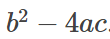{width="2.0599978127734033in"
height="0.7303652668416448in"}

{width="6.5in"
height="1.7208333333333334in"}

## Cubic Functions d=3

**Cubic Functions**: a cubic function is a function of the form

$$\mathbf{f}\left( \mathbf{x} \right)\mathbf{= a}\mathbf{x}^{\mathbf{3}}\mathbf{+ b}\mathbf{x}^{\mathbf{2}}\mathbf{+ cx + d}$$

A cubic function is a polynomial function of degree 3. So a cubic
function may have a maximum of 3 roots. i.e., it may intersect the
x-axis at a maximum of 3 points.

***[[Since complex roots always occur in pairs, a cubic function always
has either 1 or 3 real zeros. It cannot have 2 real
zeros.]{.underline}]{.mark}***

{width="3.5734153543307086in"
height="3.3858891076115487in"}

### Domain / Range of Cubic Function

**Domain / Range of Cubic Functions:**

-   The domain of a cubic function is *R*.

-   The range of a cubic function is *R*.

### Y-Intercepts of a Cubic Function

**Y-Intercepts of a Cubic function:**

A cubic function always has exactly one y-intercept.

To find the y-intercept of a cubic function, we just substitute x = 0
and solve for y-value.

### Cardano's Method

**Cardano's Method:**

## Polynomial Degree

**Polynomial Degree:** The degree of the polynomial is defined as the
highest power the variable is raised to in the polynomial.

The degree also dictates *[how many zeros a polynomial]{.underline} can
have* and *[what the end behavior is]{.underline}*.

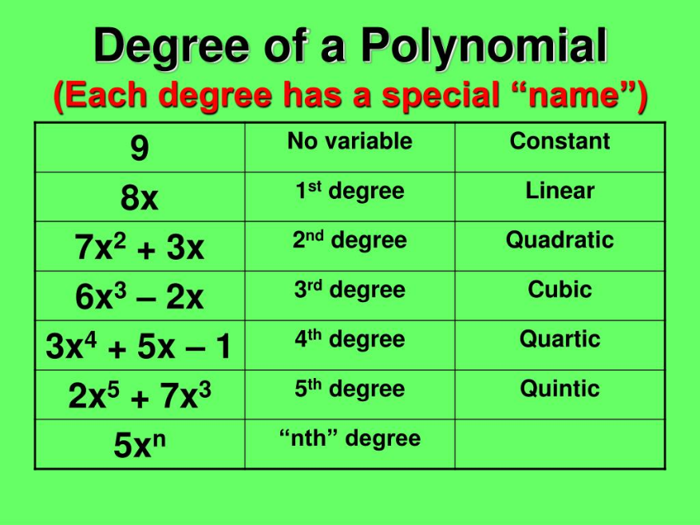{width="3.974025590551181in"
height="2.980518372703412in"}

## Turning Points

Understanding the Relationship between Degree and Turning Points

**Turning points:** A turning point is a point of the graph where the
graph changes from increasing to decreasing (rising to falling) or
decreasing to increasing (falling to rising).

[A polynomial of degree **n** will have at most **n−1** turning
points.]{.mark}

{width="3.375096237970254in"
height="2.266233595800525in"}

Graph of f(x)= $x^{4} - x^{3} - 4x^{2} + 4x$

This function is a 4th degree polynomial function and has 3 turning
points. The maximum number of turning points of a polynomial function is
always one less than the degree of the function.

## End Behavior

**End Behavior:** A polynomial's end-behavior is completely determined
by its leading term.

**Even power, positive leading coefficient:**

{width="2.8901235783027124in"
height="2.245705380577428in"}

$$\mathbf{x \rightarrow \infty,\ f}\left( \mathbf{x} \right)\mathbf{\rightarrow \ \infty}$$

$$\mathbf{x \rightarrow - \infty,\ f}\left( \mathbf{x} \right)\mathbf{\rightarrow \ \infty}$$

**Even power, negative leading coefficient:**

{width="2.0997397200349956in"
height="1.8864851268591427in"}

$$\mathbf{x \rightarrow \infty,\ f}\left( \mathbf{x} \right)\mathbf{\rightarrow \  - \infty}$$

$$\mathbf{x \rightarrow - \infty,\ f}\left( \mathbf{x} \right)\mathbf{\rightarrow - \infty}$$

**Odd power, positive leading coefficient:**

{width="2.2673293963254593in"
height="1.8364818460192476in"}

$$\mathbf{x \rightarrow \infty,\ f}\left( \mathbf{x} \right)\mathbf{\rightarrow \ \infty}$$

$$\mathbf{x \rightarrow - \infty,\ f}\left( \mathbf{x} \right)\mathbf{\rightarrow - \infty}$$

**Odd power, negative leading coefficient:**

{width="1.8627220034995626in"
height="1.5899004811898512in"}

$$\mathbf{x \rightarrow \infty,\ f}\left( \mathbf{x} \right)\mathbf{\rightarrow \ \infty}$$

$$\mathbf{x \rightarrow - \infty,\ f}\left( \mathbf{x} \right)\mathbf{\rightarrow \ \infty}$$

## Factor Multiplicity

**Factor Multiplicity:** The multiplicity of a factor determines how the
graph behaves at the x-intercept.

-   If the multiplicity of a zero is even, the *[graph will touch the
    x-axis]{.underline}* at that zero. *[(think about]{.underline}*
    $x^{2}$*[)]{.underline}*

-   If the multiplicity of a zero is odd, the *[graph will cross the
    x-axis]{.underline}* at that zero.

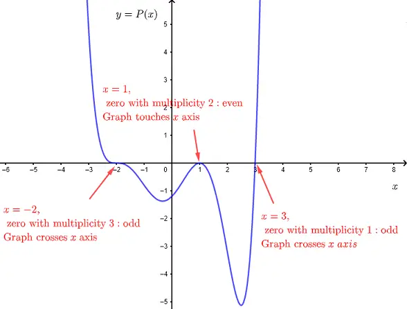{width="3.779141513560805in"
height="2.866492782152231in"}

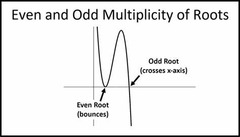{width="3.2515332458442696in"
height="1.8521391076115485in"}

{width="6.5in"
height="4.128472222222222in"}

## The Fundamental Theorem of Algebra

**The Fundamental Theorem of Algebra:**

The Fundamental Theorem of Algebra tells us that every polynomial
function with degree greater than 1 has at least one
*[complex]{.underline}* zero.

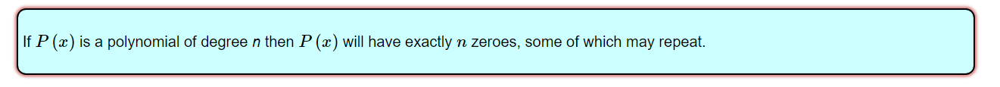{width="7.296418416447944in"
height="0.6353182414698163in"}

Every polynomial:
$f(x) = \ a_{n}x^{n} + a_{n - 1}x^{n - 1} + \ldots + a_{1}x^{1} + a_{0}$
of degree n can be factored as

$f(x) = m*\left( x - c_{1} \right)*\left( x - c_{2} \right)\ldots(x - c_{n})$
*[(m multiplied by a series of linear factors...)]{.underline}*

Every polynomial of degree ***n*** has at most ***n*** roots. (However,
these roots may be real or complex.)

The factor ***(x-c)*** for a root ***c*** could appear multiple times in
the above product. We could write $\mathbf{(x - c)}^{\mathbf{k}}$ as a
factor of ***f.***

If ***f(x)
=***$\mathbf{\ }\mathbf{a}_{\mathbf{n}}\mathbf{x}^{\mathbf{n}}\mathbf{+}\mathbf{a}_{\mathbf{n - 1}}\mathbf{x}^{\mathbf{n - 1}}\mathbf{+ \ldots +}\mathbf{a}_{\mathbf{1}}\mathbf{x}^{\mathbf{1}}\mathbf{+}\mathbf{a}_{\mathbf{0}}$
has only real coefficients, and ***c = a+bi*** is a complex root of
***f***, then the complex conjugate ***c = a-bi*** is also a root of
***f***. (Complex roots containing the imaginary unit always appear in
pairs / conjugates)

## Zero Product Property

**Zero Product Property:** The Zero Product Property is used for solving
polynomial equations that can be factored. Once a polynomial equation is
factored into a product of binomials, each binomial is set to zero to
find the solutions.

The zero product property states that if two or more factors are
multiplied and the product is zero, then a least one of those factors is
also zero.

If ab = 0, then either a = 0 or b = 0

## The Remainder Theorem

**The Remainder Theorem:**

**p(x)/(x-a) = q(x) + r(x)**

**p(x) = (x-a)·q(x) + r(x),**

**Dividend = (Divisor × Quotient) + Remainder**

**p(x) = (x-a)·q(x) + r**

**Observe what happens when we have x equal to a:**

**p(a) = (a-a)·q(a) + r**

**p(a) = (0)·q(a) + r**

**p(a) = r**

**Therefore, when p(x) is evaluated at a, p(a) will give the
remainder.**

**If p(a) = 0, a is a root / solution to the equation.**

**p(x): polynomial**

**(x-a): linear factor**

**q(x): quotient at x**

**r(x): Remainder at x**

**What is the point of the Remainder Theorem?**

The point of the Remainder Theorem is that *[there is a simpler, quicker
way to evaluate a polynomial p(x) at a given value of x, and this
simpler way is to not evaluate p(x) at all, but to instead do the
synthetic division at that same value of x.]{.underline}*

The last number in the synthetic-division result is the value you\'re
wanting, being the evaluated value of the polynomial.

## The Rational Roots Theorem

**The Rational Roots Theorem**: If a polynomial function

{width="3.15625in"
height="0.22916666666666666in"}

written in descending order of the exponents, has integer coefficients,
then any *[rational zero]{.underline}* must be of the form [± p/
q,]{.mark}

Where [p]{.mark} and [q]{.mark} are integers and:

-   [p]{.mark} is a factor of the constant term a~0~

-   [q]{.mark} is a factor of the leading coefficient a~n~

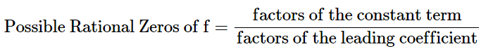{width="3.8590244969378826in"
height="0.44733377077865266in"}

[The Rational Zero Theorem helps us to narrow down the number of
possible rational zeros using the ratio of the factors of the constant
term and factors of the leading coefficient of the polynomial]{.mark}

[Of course, not all zeros will be rational. The rational zeroes theorem
will not help find irrational zeroes of a polynomial.]{.mark}

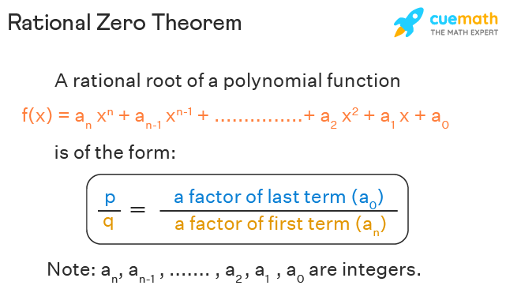{width="3.601227034120735in"
height="2.1910739282589677in"}

### How to use it

-   Determine all factors of the constant term and all factors of the
    leading coefficient.

-   Determine all possible values of $\frac{p}{q}\ $, where p is a
    factor of the constant term and q is a factor of the leading
    coefficient. ***[Be sure to include both positive and negative
    candidates.]{.underline}***

-   Determine which possible zeros are actual zeros by evaluating each
    case of f($\frac{p}{q}$).

{width="4.199729877515311in"
height="0.23421587926509185in"}

{width="4.35509842519685in"
height="0.5653258967629047in"}

{width="6.5in"
height="1.8840277777777779in"}

So what about the irrational roots of a polynomial? How do we find those
when the rational roots theorem fails?

For polynomial of degree 2, you can use the quadratic formula.

## Polynomial Long Division

**Polynomial Long Division:**

{width="6.5in"
height="1.0354166666666667in"}

Where:

-   **d(x)** is the divisor where the degree of d(x) must be less than
    or equal the degree of f(x)

-   **q(x)** is the quotient

-   **r(x)** is the remainder where r(x) is either equal zero, or has a
    degree less than d(x)

$$\frac{f(x)}{d(x)} = q(x) + \frac{r(x)}{d(x)}$$

If r(x) is 0, then d(x) is a factor of f, so it divides evenly leaving
no remainder.

*[[Polynomial long division may always be performed---so long as the
degree of the divisor is equal to or less than the degree of the
dividend f(x). This is the only restriction.]{.mark}]{.underline}*

*Algorithm: Divide, multiply, subtract, repeat as needed.*

{width="3.721097987751531in"
height="2.2084076990376205in"}

Divisor: The quantity by which another quantity is divided

Dividend: The quantity that is being divided.

## Synthetic Division

**Synthetic Division:**

Can you always use synthetic division for dividing polynomials?

-   No, if the degree of the denominator is not 1, then you cannot use
    synthetic division. If the degree of the denominator is greater than
    1, then you must use polynomial long division.

## Descartes Rule of Signs

**Descartes Rule of Signs**: **Descartes\' Rule of Signs** is a theorem
that provides a way to determine the possible number of positive and
negative ***[real]{.underline}*** roots (zeros) of a polynomial
equation.

It gives an upper bound on the number of positive and negative roots and
helps in identifying potential root structures without solving the
polynomial.

-   The number of positive real zeros is equal to the number of sign
    changes in f(x), minus an even integer.

-   The number of negative real zeros is equal to the number of sign
    changes in f(-x), minus an even integer.

Because we also know the maximum number of possible roots (By the
Fundamental Theorem of Algebra), knowing the maximum possible number of
real roots also gives insight into the number of possible imaginary
roots as well.

## Binomial Expansion Theorem

The Binomial Expansion theorem allows you to calculate the expansion of
any binomial for any degree n.

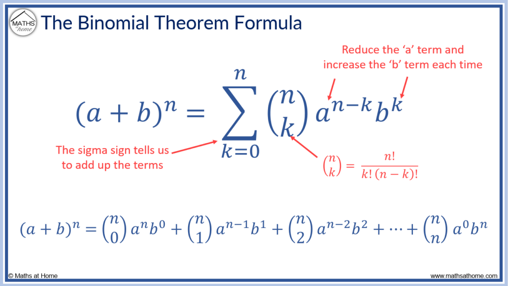{width="4.668223972003499in"
height="2.6304352580927386in"}

# Rational Functions

**Rational Functions:** A rational function is an expression of the form
$\frac{P(x)}{Q(x)}\ $, *p,q* are polynomials and q is not 0.

$$f(x) = \ \frac{a_{n}x^{n} + a_{n - 1}x^{n - 1} + \ldots + a_{1}x^{1}{+ a}_{0}}{b_{n}x^{n} + b_{n - 1}x^{n - 1} + \ldots + b_{1}x^{1}{+ b}_{0}}$$

## Domain

**Domain:** The domain of a rational function is the set of all real
numbers (or complex numbers) for which the function is defined.

[Since a rational function is a ratio of two polynomials, it is defined
everywhere except where the denominator is zero.]{.mark}

Those locations where the denominator is zero are responsible for
creating vertical asymptotes in the graph.

## Range

**Range:** The range of a rational function is the set of all possible
y-values (outputs) that the function can produce. To determine the
range, you need to consider the behavior of the function across its
domain, particularly focusing on any asymptotes, critical points, and
intervals where the function is defined.

Here are key steps and considerations for finding the range of a
rational function:

-   Identify the Domain: The first step in finding the range is to
    identify the domain of the function, which is the set of all
    x-values for which the function is defined. Rational functions are
    undefined where their denominators are zero.

-   Find Vertical Asymptotes: Vertical asymptotes occur where the
    denominator of the rational function is zero, but the numerator is
    not zero. These points indicate where the function tends to infinity
    or negative infinity.

-   Determine Horizontal or Oblique Asymptotes: Horizontal or oblique
    asymptotes describe the behavior of the function as x approaches
    positive or negative infinity. They indicate y-values that the
    function approaches but does not necessarily reach.

-   Analyze the Function\'s Behavior: Consider the function\'s behavior
    around asymptotes, zeros of the numerator (where the function
    crosses the x-axis), and any other critical points (such as turning
    points) identified through calculus techniques like finding
    derivatives.

-   Combine Findings to Determine the Range: Based on the asymptotic
    behavior, zeros, and critical points, determine which y-values the
    function can take. Note if any values are excluded due to asymptotes
    or other factors.

## Proper / Improper Rational Function

**Proper / Improper Rational Function:**

Just as with normal fractions, rational functions also have the concept
of 'proper' and 'improper.'

-   A rational function is considered **improper** if the degree of the
    numerator is greater than or equal to the degree of the denominator.

$$\frac{x^{3} + 1}{x^{2}}$$

*N\<D*

-   A rational function is considered **proper** when the degree of the
    numerator is less than the degree of the denominator.

$$\frac{x^{2} + 1}{x^{5}}$$

*N\>D*

**Handling Improper Rational Functions**

To work with improper rational functions, one common technique is to use
polynomial long division to rewrite the function as a polynomial plus a
proper rational function.

## Finding x-intercepts

**Finding x-intercepts:** Factor numerator and solve for x.

{width="6.5in" height="2.3625in"}

## Finding y-intercept

**Finding y-intercept:** To find the y-intercept of a rational function,
you need to evaluate the function at *𝑥 = 0*. The y-intercept is the
point where the graph of the function crosses the y-axis, which
corresponds to 𝑥 = 0.

{width="5.502858705161855in"
height="4.03660542432196in"}

## Vertical Asymptote

**Vertical Asymptote:** A vertical asymptote of a graph is a vertical
line x = a, where the graph tends toward a positive or negative infinity
as the input value approaches to the line x =a from either the left or
right side.

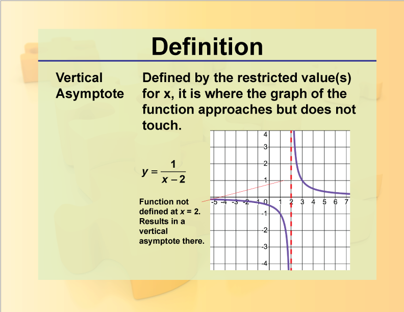{width="3.508332239720035in"
height="2.7109831583552055in"}

Above, the line ***x = 2*** is the vertical asymptote. ***x = 2*** is
undefined in ***f(x)***, producing division by zero / vertical
asymptote.

x → $a^{-}$ , f(x) → ± ∞

OR

x → $a^{+}$ , f(x) → ± ∞

[[The vertical asymptote is caused by having values in the denominator
which result in division by zero / are undefined.]{.underline}]{.mark}

### Finding the vertical asymptote

**Finding the vertical asymptote:**

**Set the denominator equal to zero and solve for x.**

{width="4.916435914260718in"
height="3.0901060804899387in"}

## Horizontal Asymptote

**Horizontal Asymptote:** A horizontal asymptote of a graph is a
horizontal line y = b, where the graph approaches the line as the input
value increases/decreases without bound.

How do you find the horizontal asymptote?

$$f(x) = \ \frac{ax^{n} + \ldots + a}{bx^{m} + \ldots + b}$$

Where a,b are the leading co-efficient of the polynomials having degree
n,m respectively.

  -----------------------------------------------------------------------
  numerator \<         Horizontal Asymptote is the x-axis
  denominator          
  -------------------- --------------------------------------------------
  numerator =          Horizontal Asymptote is the line y = a/b
  denominator          

  numerator \>         Slant / Oblique Asymptote
  denominator          
  -----------------------------------------------------------------------

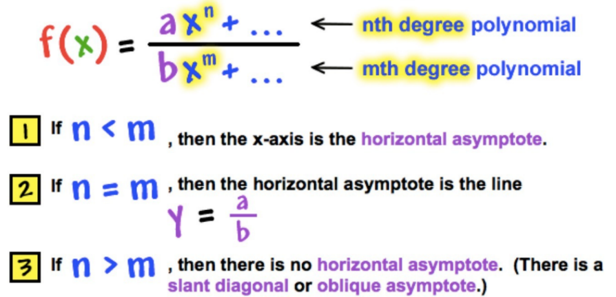{width="3.939019028871391in"
height="1.902597331583552in"}

### Numerator \< Denominator (proper fraction)

Numerator \< Denominator

Horizontal asymptote: y = 0

{width="6.5in" height="2.75in"}

$$f(x)\  = \ \frac{x^{2} + 1}{x^{3}}$$

This is a proper fraction, where the denominator is greater than the
numerator. This produces a horizontal asymptote at ***y = 0***.

### Numerator = Denominator

Numerator = Denominator

Horizontal asymptote : y = 1/1

{width="6.5in"
height="2.5909722222222222in"}

### Numerator \> Denominator (improper fraction)

Numerator \> Denominator

{width="6.5in"
height="2.2840277777777778in"}

Num\>Denom by 1

*(Because the degree of the numerator exceeds the degree of the
denominator by 1, the graph of the asymptote will be linear: **mx +
b**)*

{width="6.5in"
height="2.910416666666667in"}

Num\>Denom by 2

*(Because the degree of the numerator exceeds the degree of the
denominator by 2, the graph of the asymptote will be quadratic:
**x\^2**)*

{width="6.5in" height="3.2375in"}

Num\>Denom by 3

*(Because the degree of the numerator exceeds the degree of the
denominator by 3, the graph of the asymptote will be quadratic:
**x\^***3*)*

Use Polynomial Long Division to find the asymptote of a rational
function.

The amount by which the degree of the numerator exceeds the degree of
the denominator determines the type of asymptotic behavior displayed.

-   If numerator \> denominator by degree of 1, the asymptote will be
    linear.

-   If numerator \> denominator by degree of 2, the asymptote will be
    quadratic.

-   If numerator \> denominator by degree of 3, the asymptote will look
    like a polynomial of degree 3

-   If numerator \> denominator by degree of 4, the asymptote will look
    like polynomial of degree 4

#### Procedure for Identifying Horizontal Asymptotes when Deg(Numerator) \> Deg(Denominator)

**Procedure for Identifying Horizontal Asymptotes (Deg(Px) \> Deg(Qx))**

Perform Polynomial Long Division

-   Divide the numerator *𝑃(𝑥)* by the denominator *𝑄(𝑥)* to find the
    quotient.

-   The quotient represents the asymptote. If the quotient is linear, it
    will be an oblique/linear asymptote; if it\'s of higher degree, it
    will be a polynomial asymptote resembling the equation of the
    polynomial retrieved by long division.

## Hole / Discontinuity / Removable Discontinuity

**Hole / Discontinuity / Removable Discontinuity:**

Holes / Discontinuities occur when there is a common factor between the
numerator and the denominator.

$$f(x) = \ \frac{x^{2} - 2}{x^{2} - 2x - 3} = \ \frac{(x + 1)(x - 1)}{(x + 1)(x - 3)}$$

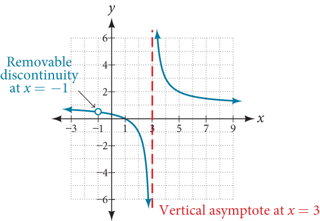{width="3.1392530621172354in"
height="2.1773173665791776in"}

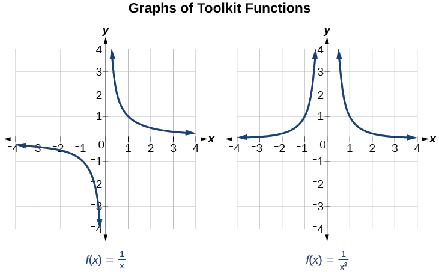{width="5.321503718285214in"
height="3.297729658792651in"}

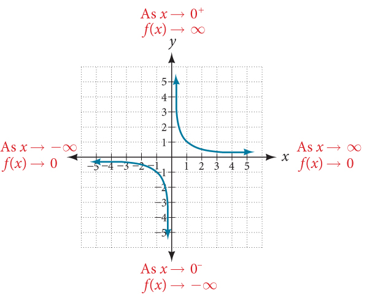{width="4.357142388451444in"
height="3.50465769903762in"}

# Exponential Functions

**Exponential Functions:**

Exponential Functions have the following form

$\mathbf{f}\left( \mathbf{x} \right)\mathbf{= a*}\mathbf{B}^{\mathbf{x}}\mathbf{+ c}$

*When **a \> 1**, the function is an **exponential growth function***

*When **0 \< a \< 1**, the function is an **exponential decay
function***

*c is a vertical shift*

## Domain

**Domain of Exponential function:**

$( - \infty,\infty)$ or all real numbers

## Range

**Range of Exponential function:**

$\mathbf{(}0\mathbf{,\infty)}$ or all real numbers greater than 0

{width="5.906675415573053in"
height="3.6531791338582678in"}

{width="6.5in"
height="3.423611111111111in"}

## x-intercepts

**x-intercepts:**

For the general case of an exponential, where no vertical shift is
occurring, there will be no x-intercept.

The general form of the exponential function has a horizontal asymptote
at y = 0.

For cases where a vertical shift for
$\mathbf{f}\left( \mathbf{x} \right)\mathbf{= a*}\mathbf{B}^{\mathbf{x}}\mathbf{+ c}$
and c \< 0

# Logarithms

**A logarithm is the inverse of an exponential function.**

Let a ∈ R, a\>0, a≠1

loga​ : (0,∞)→R

∀x ∈ R, ∀y ∈ (0,∞), (y = a\^x ↔ x = log a ​(y)).

# Geometry & Trigonometry

## Triangle

**Triangle:** A triangle is a polygon with 3 corners and 3 edges /
sides.

The corners are called **Vertices.**

Sometimes an arbitrary edge is chosen to be the **Base**, in which case
the opposite vertex is taken to be the **Apex.**

### Area of Triangle

**Area of Triangle: ½ bh**

{width="1.253436132983377in"
height="2.09632217847769in"}

### Angle Sum Property

**Angle Sum Property:** The sum of the three interior angles of any
triangle must equal 180.

{width="3.220858486439195in"
height="2.4803258967629045in"}

### Exterior Angles in a Triangle

**Exterior Angles in a Triangle:**

-   Every triangle has 6 exterior angles, two at each vertex.

-   Angles 1 through 6 are exterior angles.

-   Notice that the \"outside\" angles that are \"vertical\" to the
    angles inside the triangle are NOT called exterior angles of a
    triangle.

{width="2.2254330708661416in"
height="1.4369936570428696in"}

### Measure of an Exterior Angle of a Triangle

**Measure of an exterior angle of a triangle:** The measure of an
exterior angle of a triangle is equal to the sum of the non-adjacent
interior angles of the triangle.

-   An exterior ∠ is equal to the addition of the two non-adjacent Δ
    angles.

-   140º = 60º + 80º; 120º = 80º + 40º;

-   100º = 60º + 40º

-   An exterior angle is supplementary to its adjacent Δ angle. 140º is
    supp to 40º

-   The 2 exterior angles at each vertex are = in measure because they
    are vertical angles.

-   The exterior angles (taken one at a vertex) always total 360º

{width="2.5938101487314085in"
height="1.6674496937882766in"}

### Triangle Inequality 

**Triangle Inequality:** For all triangles, p + q \> r

The sum of any two sides must be greater than the third side.

{width="1.3593372703412074in"
height="0.856765091863517in"}

We cannot use the triangle inequality to find the exact lengths of the
sides of a triangle, but when two sides are known, the triangle
inequality allows us to find upper and lower bounds for the length of
the third side.

### Pythagorean Theorem

Pythagorean Theorem: It states that in a right-angled triangle, the
square of the length of the hypotenuse (the side opposite the right
angle) is equal to the sum of the squares of the lengths of the other
two sides

${a^{2} + b^{2} = c}^{2}$

Where:

-   𝑐 is the length of the hypotenuse.

-   𝑎 and b are the lengths of the other two sides.

The Pythagorean theorem establishes relationships between the sides of
right triangles and their hypotenuse. It can be used to solve unknown
side lengths when two sides are known.

{width="4.077671697287839in"
height="1.8597845581802275in"}

### Law of Sines

**Law of Sines:** The law of sines establishes relationships that hold
true for ALL triangles, not only right triangles. This is important to
understand, because the trig functions only relate the angles and sides
of RIGHT ANGLED triangles. To establish relationships on oblique /
non-right-angled triangles, we must use the **Law of Sines**.

$$\frac{a}{sin\ A} = \frac{b}{sin\ B} = \frac{c}{sin\ C}$$

The ratios between all angles and their opposite side lengths are
directly proportional to each other.

[The Sine Law is applicable to ALL TRIANGLES. Some sources will say it
is used for oblique triangles only. This is not the case.]{.mark}

### Law of Cosines

**Law of Cosines:** The **Law of Cosines** is a formula used to relate
the lengths of the sides of any triangle to the cosine of one of its
angles.

*[[It generalizes the Pythagorean theorem for all types of triangles,
including those without a right angle.]{.underline}]{.mark}*

**You can start thinking about using the cosine law when you have an
oblique triangle, but you do not have the information necessary to apply
the law of sines.**

**There are 2 situations in which you have enough information to apply
the law of cosines.**

**SAS -- Side, Angle, Side**

**SSS -- Side, Side, Side**

**You must have 2 sides known with a known angle included between them**

**OR**

**You must have all 3 sides.**

The law of cosines can be remembered as a "extended" Pythagorean
Theorem.

Pythagorean Theorem: a\^2 + b\^2 = c\^2.

Law(s) of Cosines:

$$b^{2} + c^{2} - 2bc*\cos(a) = a^{2}$$

$$a^{2} + c^{2} - 2ac*\cos(b) = b^{2}$$

$$a^{2} + b^{2} - 2ab*\cos(c) = c^{2}$$

{width="2.5421434820647417in"
height="1.285090769903762in"}

**All of the writings above are specifically solved for a side.**

**The cosine law can also be used to find an angle.**

### Comparison of Law of Sines / Law of Cosines to Trigonometric functions

**Comparison of Law of Sines / Law of Cosines to Trigonometric
functions**

The basic trigonometric functions (sine, cosine, and tangent) are used
for right-angled triangles

The Law of Sines extends the basic trigonometric functions to apply to
any triangle, not just right-angled ones. It is particularly useful in
oblique triangles when:

-   **You have two angles and a side (AAS or ASA).**

-   **You have two sides and a non-included angle (SSA).**

$$\frac{a}{sin\ A} = \frac{b}{sin\ B} = \frac{c}{sin\ C}$$

### Similarity

**Similarity:** *[Similar shapes are the same shape, but they are a
different size.]{.mark}*

The corresponding sides are in the same ratio and the corresponding
angles are the same. Similar triangles are not "equivalent" because
equivalence in geometry is expressed using congruence.

Similar triangles are different only in scale, so similar triangles
could be resized to become congruent.

*[[Same angles, different---but proportional---side
lengths.]{.underline}]{.mark}*

{width="3.6096773840769902in"
height="2.071707130358705in"}

#### Proving Similar triangles

##### AA (Angle-Angle) similarity

**AA (Angle-Angle) similarity:** If a pair of triangles have 2
corresponding angles that are the same, then we can prove that these
triangles are similar. We can do this by using the Angle Sum Property.

If the interior angles of a triangle are always equal to 180° AND IF we
have a pair of triangles having 2 congruent angles, then by extension,
the third angle must also be congruent.

##### SSS (Side-Side-Side) similarity

**SSS (Side-Side-Side) similarity:** If 3 sides of a triangle are
proportional to three sides of a different triangle then the triangles
are similar.

{width="2.1562215660542434in"
height="1.1765463692038496in"}

$$\frac{BC}{EF} = \frac{AC}{DF} = \frac{AB}{DE}$$

##### SAS (Side-Angle-Side) similarity

**SAS (Side-Angle-Side) similarity:** If any two sides and the angle
contained between them are equivalent to the same two sides and included
angle of a different triangle, then these 2 triangles are similar.

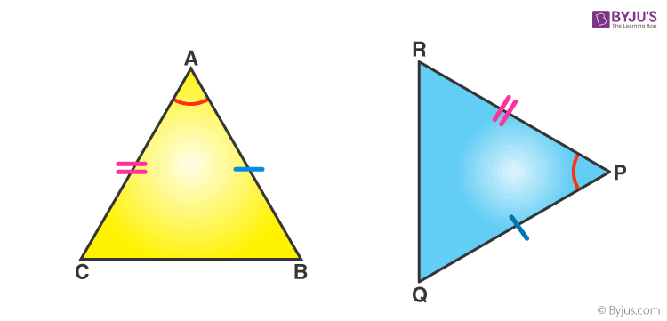{width="2.438266622922135in"
height="1.1736187664041995in"}

### Congruence

**Congruence:** Congruent shapes are exactly the same shape and the same
size. Congruence is equality expressed geometrically. Congruent shapes
may be made to sit together using transposition.

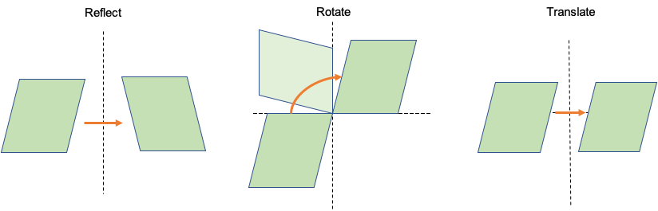{width="5.509713473315836in"
height="1.7719346019247595in"}

*[[Congruent shapes have the same ANGLES AND the same
SIDES.]{.underline}]{.mark}*

{width="3.892642169728784in"
height="2.9822790901137357in"}

#### Proving Congruence (not done)

**Proving Congruence**

#### Congruence Statement

**Congruence Statement:**

#### SSS (Side-Side-Side) Congruence

**SSS (Side-Side-Side) Congruence:**

If all the three sides of one triangle are equivalent to the
corresponding three sides of the second triangle, then the two triangles
are said to be congruent by SSS rule.

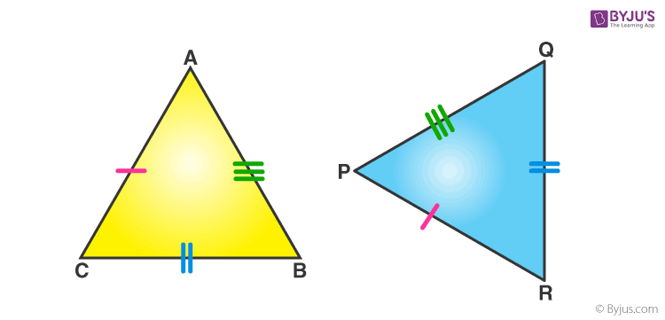{width="2.3121391076115487in"
height="1.1129101049868766in"}

#### Side-Angle-Side Congruence

**Side-Angle-Side Congruence:**

If any two sides and the angle included between the sides of one
triangle are equivalent to the corresponding two sides and the angle
between the sides of the second triangle, then the two triangles are
said to be congruent by SAS rule.

{width="2.427746062992126in"
height="1.1685553368328958in"}

### Types of Triangles

**Types of Triangles:** Triangles are broadly categorized into 2 types:

-   Triangles based on the lengths of their sides

-   Triangles based on their interior angles

  -----------------------------------------------------------------------
  **Based on their Sides**           **Based on their Angles**
  ---------------------------------- ------------------------------------
  Scalene Triangle                   Acute Triangle

  Isosceles Triangle                 Obtuse Triangle

  Equilateral Triangle               Right Triangle
  -----------------------------------------------------------------------

#### Types of Triangles: Based on Side length

**Types of Triangles: Based on Side length**

According to the lengths of their sides, triangles can be classified
into three types which are:

##### Scalene

**Scalene:** Triangle has all side lengths *[different]{.underline}*.

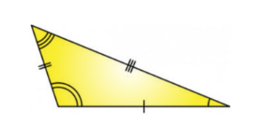{width="1.3251531058617674in"
height="0.7047265966754156in"}

##### Isosceles

**Isosceles:** Triangle with 2 sides having the same length.

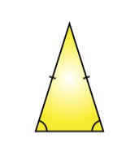{width="0.9349715660542433in"
height="1.0443252405949257in"}

##### Equilateral

**Equilateral:** Triangle with *[all sides having the same
length.]{.underline}*

{width="1.0245395888013997in"
height="0.8475054680664917in"}

#### Types of Triangles: Based on Angles

**Types of Triangles: Based on Angles**

Triangles can be classified into three types with respect to their
interior angles which are:

##### Acute

**Acute triangle:** Triangle with *all 3 interior angles less than 90°*.

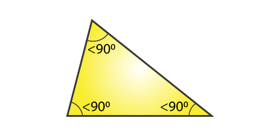{width="2.236528871391076in"
height="1.0829505686789151in"}

##### Obtuse

**Obtuse triangle:** Triangle which has *one interior angle greater than
90°*.

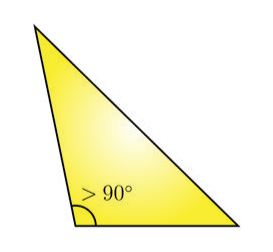{width="1.2553040244969378in"
height="1.1587423447069116in"}

##### Right

**Right triangle:** Triangle that contains a 90° interior angle.

-   A right triangle has one right angle. (A right angle measures
    exactly 90º.)

-   A \"box\" is used to indicate the location of the right angle.

-   The longest side of the right triangle (across from the \"box\") is
    called the \"hypotenuse\".

-   The remaining two sides are referred to as \"legs\", which may, or
    may not, be of equal length.

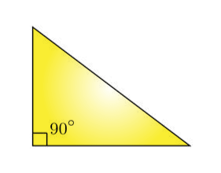{width="1.5828226159230097in"
height="1.2392202537182853in"}

###### Types of Right Triangles

There are 2 types of right triangles

####### Scalene Right Triangle

**Scalene Right Triangle:**

-   A right triangle has one angle equal to 90 degrees.

-   A scalene triangle has all sides of different lengths and all angles
    of different measures.

-   Therefore, a scalene right triangle is a right triangle where all
    three sides have different lengths, and the two non-right angles are
    different.

{width="1.9845100612423447in"
height="1.0982655293088364in"}

Some scalene right triangles are known as 30-60-90 triangles.

####### Isosceles Right Triangle

**Isosceles Right Triangle:**

-   One angle is 90 degrees (right angle).

-   The other two angles are equal, each measuring 45 degrees.

Summary:

Based on Side length: **Scalene**, **Isosceles**, **Equilateral**

Based on Angles: **Right**, **Obtuse**, **Acute**.

{width="2.8556036745406823in"
height="1.7087860892388451in"}

#### Oblique Triangle

**Oblique Triangles:** An oblique triangle is a triangle that does not
contain any right angles. Logically, we know that if a triangle is not a
right triangle, then it must be either an Obtuse or Acute triangle.

[**Oblique triangles** are triangles that are either Obtuse or
Acute.]{.mark}

[Relationships between oblique triangles can be understood using the law
of sines and law of cosines.]{.mark}

### Special Triangles

**Special Triangles:** A special right triangle is a right triangle with
some regular feature that makes calculations on the triangle easier, or
for which simple formulas exist.

Why are special triangles considered 'special' ?

*[The fact that the sides of these special triangles are represented by
integers or simple square roots, [rather than irrational
numbers]{.underline}, is a significant reason why they are considered
special.]{.mark}*

***[The trigonometric ratios for most angles are irrational
numbers.]{.mark}***

The angles 30°, 60°, 45° are "special" because we can easily find exact
values for their trig ratios, and use those exact values to find exact
lengths for the sides of triangles with those angles.

#### 45-45-90 (Isosceles right triangle)

**45-45-90:** A **45-45-90** triangle is a special type of right
triangle where the two non-right angles are both 45 degrees. This makes
the triangle ***isosceles***, as the two legs opposite the 45-degree
angles are of equal length.

*[[All 45-45-90 triangles are isosceles right
triangles.]{.underline}]{.mark}*

{width="1.8159514435695538in"
height="1.7802012248468941in"}

**Properties**

-   Each leg **x** is of equal length

-   If each leg is **x**, hypotenuse is **x**$\sqrt{\mathbf{2}}$

[45-45-90 triangles can also be expressed as π/4 -- π/4 -- π/2]{.mark}

#### 30-60-90 (Scalene right triangle)

**30-60-90:**

{width="1.846626202974628in"
height="1.9014709098862643in"}

**Properties**

-   The side lengths are in the ratio 1 :$\sqrt{3}$: 2

-   The sides are represented by simple square roots, making the
    relationships between the sides straightforward and easy to work
    with.

In a 30°-60°-90° triangle, notice how the size of the angles corresponds
to the size of the sides.

The largest side will always be opposite to the largest angle.
Similarly, the smallest side would always be opposite to the smallest
angle.

[30-60-90 triangles can also be expressed in radians as π/6 -- π/3 --
π/2]{.mark}

## Circle

**Circle:** A circle is a shape consisting of all points in a plane that
are at a given distance from the center.

### General Equation

General equation: (x-h)^2^ + (y-k)^2^ = r^2^

{width="3.549666447944007in"
height="3.116444663167104in"}

### π Pi

π **Pi:** Pi is a constant that represents the ratio of a circle's
circumference to it's diameter. Pi is an irrational number and equals
approximately 3.14159

π = Circumference / diameter

### Circumference

**Circumference:** The distance around the boundary of a circle is
called the circumference.

C = π d

C = 2 πr

{width="2.688147419072616in"
height="2.012270341207349in"}

### Radius

Radius**:** The distance from the center of a circle to any point on the
boundary is called the **radius**. The radius is half of the diameter;
2r=d

Radius = d/2

The length of the radius can also be calculated using the distance
formula:

{width="2.1220603674540683in"
height="0.32270997375328087in"}

.{width="1.5981375765529309in"
height="1.1963188976377952in"}

### Diameter

**Diameter:** The distance across a circle through the center is called
the diameter.

D = 2r

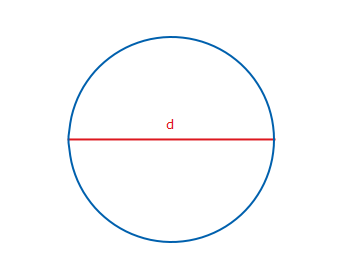{width="2.75371062992126in"
height="2.061349518810149in"}

### Sector

**Sector:** The area inside a circle and bounded by two radii is a
**sector**.

The area of the sector is: (1/2) \* r^2^θ

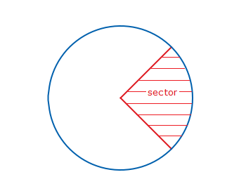{width="2.5460126859142607in"
height="1.9058727034120735in"}

### Arc

**Arc:** The length between two points around the circumference of a
circle is an arc.

### Arc Length

**Arc length**: The distance between two points on a curve.

Arc length is: rθ

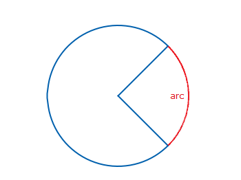{width="2.8282206911636045in"
height="2.1171248906386704in"}

**Area of a Circle:** Area is the total amount of space taken up by a
flat, 2D shape. It is the measurement of a shape's size on a surface.
Therefore, the area of a circle is the measurement of the interior space
occupied by a circle.

{width="4.960122484689414in"
height="2.3221423884514434in"}

## Line

Lines: A line is an infinitely long object with no width, depth or
curvature. It is an abstract geometric form that represents perfect
straightness on a cartesian coordinate plane.

### Types of Lines

**Types of Lines**

+-----------+--------------------------+------------------------------+
| **P       | {widt | the distance between the two |
|           | h="1.2174475065616799in" | straight lines is the same   |
|           | height=                  | at all points.               |
|           | "0.43056102362204723in"} |                              |
+===========+==========================+==============================+
| **Perpen  | {widt | to each other if they meet,  |
|           | h="2.0659612860892387in" | or intersect at 90°.         |
|           | height                   |                              |
|           | ="0.5463320209973753in"} |                              |
+-----------+--------------------------+------------------------------+
| **V       | {width | that is perpendicular to the |
|           | ="0.30611001749781275in" | surface or another line that |
|           | height                   | is considered as the base.   |
|           | ="0.6805041557305337in"} | In coordinate geometry, the  |
|           |                          | *[vertical lines are         |
|           |                          | parallel to the y-axis and   |
|           |                          | are perpendicular to the     |
|           |                          | horizontal lines and the     |
|           |                          | x-axis]{.underline}*         |
+-----------+--------------------------+------------------------------+
| **Hor     | {widt | straight line that goes from |
|           | h="0.9178543307086614in" | left to right or right to    |
|           | height                   | left. In coordinate          |
|           | ="0.6933792650918635in"} | geometry, a line is said to  |
|           |                          | be horizontal if two points  |
|           |                          | on the line have the same Y- |
|           |                          | coordinate points. It comes  |
|           |                          | from the term "horizon*[".   |
|           |                          | It means that the horizontal |
|           |                          | lines are always parallel to |
|           |                          | the horizon or the           |
|           |                          | x-axis.]{.underline}*        |
+-----------+--------------------------+------------------------------+
| *         | {widt | intersects a                 |
|           | h="1.2577548118985127in" | ***[curve]{.underline}*** at |
|           | height                   | a minimum of two distinct    |
|           | ="0.9766097987751531in"} | points                       |
+-----------+--------------------------+------------------------------+
| **Tran    | {widt | passes through two lines in  |
|           | h="2.3204779090113736in" | the same plane at two        |
|           | height                   | distinct points.             |
|           | ="1.0490791776027997in"} |                              |
|           |                          | Transversals may intersect   |
|           |                          | parallel or non-parallel     |
|           |                          | lines---it does not matter.  |
+-----------+--------------------------+------------------------------+
| **        | {widt | that touches a curve at a    |
|           | h="1.6569903762029747in" | single point ***[without     |
|           | heig                     | crossing]{.underline}*** it  |
|           | ht="0.92791447944007in"} | at that point.               |
+-----------+--------------------------+------------------------------+

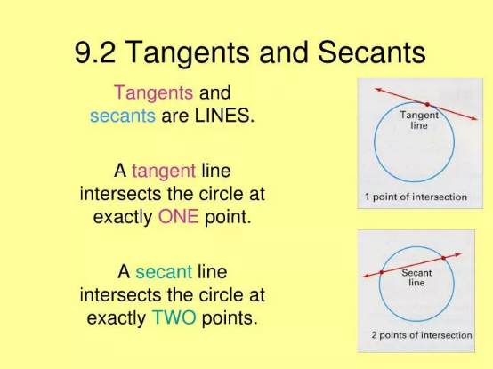{width="2.5102241907261593in"
height="1.882668416447944in"}

## Angle

**Angle:** An angle is the union of two rays having a common endpoint.
The endpoint is called the vertex of the angle, and the two rays are the
sides of the angle.

{width="2.8773009623797026in"
height="1.4544039807524058in"}

Angle creation is a dynamic process. We start with two rays lying on top
of one another. We leave one fixed in place and rotate the other.

The fixed ray is the **initial side**, and the rotated ray is the
**terminal side**. In order to identify the different sides, we indicate
the rotation with a small arc and arrow close to the vertex.

{width="2.9931616360454942in"
height="1.518092738407699in"}

**Positive and Negative Angles:**

**Positive Angle:** An angle is positive when it's initial side begins
on the positive x axis and rotates counter-clockwise.

**Negative Angle:** An angle is negative when its initial side begins on
the positive x axis and rotates clockwise.

{width="2.6518416447944007in"
height="2.1914074803149606in"}

**Naming an angle:** Angles are named using 3 points.

{width="1.623134295713036in"
height="1.4162346894138234in"}

The **vertex** is always the center point in the name of the angle. It
will be surrounded by the arm names.

Angle BOR is equal to angle ROB. Only the central, vertex letter is
required to be fixed in one place.

### Types of Angles

**Types of Angles:**

  -----------------------------------------------------------------------
  **Acute**              **Angle \< 90**°
  ---------------------- ------------------------------------------------
  **Obtuse**             **90**° **\< Angle \< 180**°

  **Right**              **90**°

  **Straight**           **180**°

  **Reflex**             **Angle \> 180**°

  **Complete angle /     **360**°
  Full Angle**           

  **Coterminal**         **Any angle sharing the same position, separated
                         by multiples of 360.**
  -----------------------------------------------------------------------

{width="3.2147244094488188in"
height="1.9401356080489938in"}{width="2.4352307524059493in"
height="1.9325743657042869in"}

### Angle Relationships

**Angle Relationships**

+--------------+-------------------+-----------------------------------+
| Congruent    |                   |                                   |
+==============+===================+===================================+
| Adjacent     | ![]               | Two angles which share a common   |
|              | (./media/image151 | vertex and side, but have no      |
|              | .png){width="1.06 | common interior points.           |
|              | 13495188101487in" |                                   |
|              | height="0.667     |                                   |
|              | 4464129483815in"} |                                   |
+--------------+-------------------+-----------------------------------+
| Vertical     | ![]               | The angles opposite each other    |
|              | (./media/image152 | when two lines cross. Angles 1    |
|              | .png){width="0.81 | and 3 are vertically opposite     |
|              | 93886701662292in" | angles and they are always        |
|              | height="0.65      | equals. Same goes for angles 2    |
|              | 6441382327209in"} | and 4.                            |
|              |                   |                                   |
|              |                   | ***[[Vertical angles are named    |
|              |                   | such because they share a         |
|              |                   | vertex.]{.underline}]{.mark}***   |
|              |                   |                                   |
|              |                   | ***[[Vertical angles are formed   |
|              |                   | whenever lines intersect at a     |
|              |                   | point.]{.underline}]{.mark}***    |
+--------------+-------------------+-----------------------------------+
| C            | {width="0.7 | another line, called the          |
|              | 83834208223972in" | transversal. One is internal and  |
|              | height="1.187     | the other external. They are      |
|              | 6279527559055in"} | equals if the two intersected     |
|              |                   | lines by the transversal are      |
|              |                   | parallel. 1 is external and 2 is  |
|              |                   | internal.                         |
+--------------+-------------------+-----------------------------------+
| C            | ![]               | Two angles are called             |
| omplementary | (./media/image154 | complementary when their sum is   |
|              | .png){width="0.77 | 90º. In the figure, the and       |
|              | 73961067366579in" | angles together form a right      |
|              | height="0.741     | angle.                            |
|              | 1176727909011in"} |                                   |
+--------------+-------------------+-----------------------------------+
| S            | ![]               | Two angles are called             |
| upplementary | (./media/image155 | supplementary when their sum is   |
|              | .png){width="1.19 | 180º.                             |
|              | 63188976377952in" |                                   |
|              | height="0.478     |                                   |
|              | 5279965004374in"} |                                   |
+--------------+-------------------+-----------------------------------+
| Alternate    | ![]               | Angles that are on opposite sides |
| Exterior     | (./media/image156 | of the transversal of two other   |
|              | .png){width="0.84 | lines. Both are external. They    |
|              | 04899387576553in" | are equals if the two intersected |
|              | height="1.128     | lines by the transversal are      |
|              | 1747594050744in"} | parallel. In the figure, angles 1 |
|              |                   | and 4 are alternate exterior      |
|              |                   | angles.                           |
+--------------+-------------------+-----------------------------------+
| Alternate    | ![]               | Angles that are on opposite sides |
| Interior     | (./media/image157 | of the transversal of two other   |
|              | .png){width="0.97 | lines. Both are internal. They    |
|              | 42311898512686in" | are equals if the two intersected |
|              | height="1.126     | lines by the transversal are      |
|              | 2784339457568in"} | parallel. In the figure, angles 2 |
|              |                   | and 3 are alternate interior      |
|              |                   | angles.                           |
+--------------+-------------------+-----------------------------------+

## Angle Measurements

### Degree

**Degree:** A degree, usually denoted by °, is a measurement of a plane
angle in which one full rotation is 360°.

1° is equal to π /180.

1° is equal to 1/360 of a circular rotation.

{width="2.245696631671041in"
height="2.596758530183727in"}

### Minute

**Minute:** When measuring angles, a minute is 1/60^th^ of a degree. The
symbol for minute is '

1° = 60'

### Second

**Second:** When measuring angles, a second is 1/60^th^ of a minute. The
symbol for second is ''.

1' = 60''

### Radian

**Radian:** One radian is defined as the *[angle]{.underline}*
**subtended** from the center of a circle which intercepts an arc equal
in length to the radius of the circle.

Radian is a measurement of ANGLE.

1 Radian is 1 "radius-worth" of angle.

***[If you take a radius of 1 and "stretch it out" along the boundary of
the unit circle, this arc length subtends an angle equal to 1
radius.]{.underline}***

Radian is a UNITLESS MEASUREMENT. It is unitless because it is the
result of dividing two distances having the same unit, so the units
cancel out and a dimensionless number is left.

**Subtended angle:** In geometry, an angle is subtended by an arc, line
segment or any other section of a curve, when its two rays pass through
the endpoints of that arc, line segment or curve section.

{width="2.5281102362204724in"
height="1.5825010936132984in"}

{width="2.588956692913386in"
height="2.588956692913386in"}

{width="2.8343558617672793in"
height="2.8375218722659667in"}

### Reference Angle

**Reference Angle:** The reference angle is the smallest possible angle
made by the terminal side of the given angle with the x-axis.

[It is always an acute angle (except when it is exactly 90
degrees).]{.mark}

A reference angle is always positive irrespective of which side of the
axis it is falling.

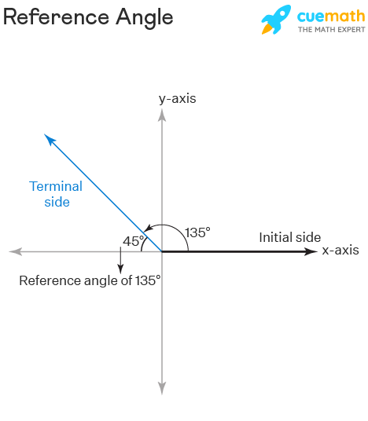{width="2.4971095800524936in"
height="2.8615168416447943in"}

A reference angle is an angle falling within quadrant 1 which is
equivalent by reflection to an angle in some other quadrant.

[This concept is useful because it allows you to work with any angle by
referring to their equivalent angle in the first quadrant.]{.mark}

**Rules for Reference Angles in Each Quadrant**

  ----------------------------------------------------------------------------
  **Quadrant**   **Angle, θ**      **Reference Angle     **Reference Angle
                                   Formula in Degrees**  Formula in Radians**
  -------------- ----------------- --------------------- ---------------------
  **I**          **lies between 0° **θ**                 **θ**
                 and 90°**                               

  **II**         **lies between    **180 - θ**           **π - θ**
                 90° and 180°**                          

  **III**        **lies between    **θ - 180**           **θ - π**
                 180° and 270°**                         

  **IV**         **lies between    **360 - θ**           **2π - θ**
                 270° and 360°**                         
  ----------------------------------------------------------------------------

## Trigonometric Functions

**Trigonometric Functions: Trigonometric functions** are real functions
which relate an angle θ of a right-angled triangle to ratios of two of
its side lengths.

-   Trig functions relate an angle θ of a right triangle to the ratios
    of 2 of its side lengths.

There are 6 basic trig functions which have as their domain value the
angle of a right triangle and have a numerical value representing the
ratio of 2 sides of a right triangle as their range.

-   **Domain**: The domain values of θ are angles in degrees or radians
    from a right triangle

-   **Range**: A numerical value representing the ratio of 2 sides of a
    right-angled triangle.

Consider an angle in standard position, such that the point (x, y) on
the terminal side of the angle is a point on a circle with radius 1:

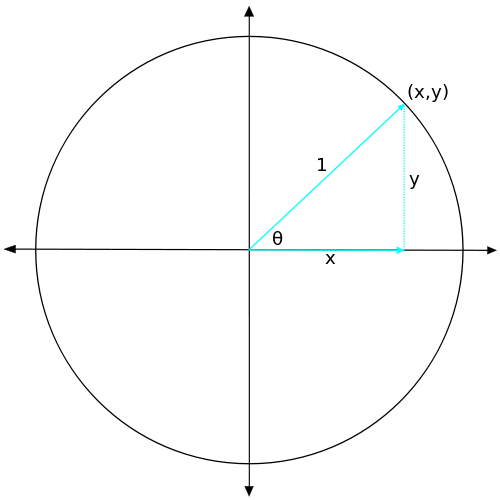{width="2.883436132983377in"
height="2.883436132983377in"}

This circle is called the unit circle. With r = 1, we can define the
trigonometric functions in the unit circle:

{width="3.2504538495188102in"
height="1.6460629921259842in"}

### Sine

**Sine (sin):** The output is the *[y-coordinate of the corresponding
point on the unit circle.]{.underline}*

The sine of an angle θ equals the **y-value** of the endpoint on the
unit circle of an arc of length *t*.

#### Graphing Sine

**Graphing Sine:**

$$A\ sin(Bx + C) + D$$

**\|A\|** is the **amplitude**

**2pi/\|B\|** is the **period**

**C** is the **phase shift**

**D** is the **vertical shift**

**Amplitude:** The amplitude determines the height of the wave from the
midline (vertical displacement) to the peak or trough.

{width="3.896104549431321in"
height="2.6883114610673666in"}

**Period / Wavelength:** The period is the length of one complete cycle
of the wave.

The period is given by : 2pi / \|B\|

{width="5.573099300087489in"
height="1.8116885389326334in"}

**Phase Shift:** The phase shift determines the *[horizontal
displacement of the wave]{.underline}*, along x-axis.

The phase shift is given by -C/B

The phase shift effectively controls where on the x-axis the graph
begins. Normally, the graph begins at the origin, but phase shift will
result in some horizontal displacement along the x-axis.

**Vertical Shift:** The vertical shift moves the entire wave up or down
along the y-axis.

{width="3.256143919510061in"
height="1.5717158792650918in"}

{width="3.6473206474190727in"
height="1.9528969816272965in"}

### Cosine

**Cosine (cos):** The output is the *[x-coordinate of the corresponding
point on the unit circle]{.underline}*.

The cosine function of an angle θ equals the **x-value** of the endpoint
on the unit circle of an arc of length *t*.

### Tangent

**Tangent (tan):** The output is the ratio of the y-coordinate to the
x-coordinate of the corresponding point on the unit circle:
$\frac{y}{x}$

The tangent of an angle is the ratio of the y-value to the x-value of
the corresponding point on the unit circle.

### Cotangent

**Cotangent:** The cotangent function is the reciprocal of the tangent
function.

The output is the ratio of the y-coordinate to the x-coordinate of the
corresponding point on the unit circle: y/x

### Secant

**Secant:** The secant function is the reciprocal of the cosine
function.

The secant of angle t is equal to 1/cost = 1/x , x≠0.

### Cosecant

**Cosecant:** The cosecant is the reciprocal of the sine function.

The cosecant of angle t is equal to 1/sin(t) = 1/y , y≠0.

{width="3.8607622484689412in"
height="3.2036909448818895in"}

[Key Elements of the Diagram:]{.underline}

**Unit Circle:** The circle shown is the unit circle, which has a radius
of 1. Any point on the unit circle satisfies the equation:
$x^{2} + y^{2} = 1$

**Angle θ:** The angle θ is measured from the positive x-axis to a line
segment that intersects the circle:

{width="1.7552055993000875in"
height="1.7330686789151357in"}

**sin θ:** Represented by the vertical line segment from the point on
the circle down to the x-axis.

It is the y-coordinate of the point on the unit circle

{width="1.5766874453193351in"
height="1.704174321959755in"}

**cos θ:** Represented by the horizontal line segment from the origin to
the point directly below the intersection of the circle and the angle 𝜃.

It is the x-coordinate of the point on the unit circle.

**tan θ:** Represented by the line segment extending from the circle to
the tangent line that touches the unit circle at the x-coordinate: x =
1.

It is the ratio of the sine to the cosine (sin 𝜃/cos 𝜃).

**cot 𝜃:** Represented by the line segment extending from the circle to
the tangent line that touches the unit circle at the y-coordinate: y=1.

It is the ratio of the cosine to the sine (cos 𝜃/sin 𝜃).

## Trigonometric Identities

**Trigonometric Identities:**

**sin 𝜃 :** $\frac{\mathbf{opp}}{\mathbf{hyp}}$

**cos 𝜃 :** $\frac{\mathbf{adj}}{\mathbf{hyp}}$

**tan 𝜃 :** $\frac{\mathbf{opp}}{\mathbf{adj}}$ **= sinx/cosx**

**cot 𝜃 :** $\frac{\mathbf{1}}{\mathbf{tan\ }\mathbf{\theta}}$ **=**
$\frac{\mathbf{adj}}{\mathbf{opp}}$

**sec 𝜃 :** $\frac{\mathbf{1}}{\mathbf{cos\ }\mathbf{\theta}}$

**csc 𝜃 :** $\frac{\mathbf{1}}{\mathbf{sin\ }\mathbf{\theta}}$

### Pythagorean Identities

**Pythagorean Identities:** For any angle 𝜃

1.  $\sin^{2}\theta + \cos^{2}\theta = 1$

2.  ${1 + cot}^{2}\theta = \ \csc^{2}\theta$

3.  ${1 + tan}^{2}\theta = \ \sec^{2}\theta$

{width="7.029012467191601in"
height="4.591386701662292in"}

### Sum & Difference Identities

**Sum & Difference Identities:** The sum and difference identities allow
you to express trigonometric functions of non-standard angles *[in terms
of the trigonometric functions of standard angles (e.g., 0°, 30°, 45°,
60°, 90°, etc.)]{.underline}*. These identities are particularly useful
for angles that can be expressed as sums or differences of these
standard angles.

**[Some angles do not appear on the unit circle, but can be made by
adding or subtracting angles which are found in the unit
circle.]{.mark}**

### Double Angle Formulas

**Double Angle Formulas**: A \"double angle\" refers to an angle that is
twice the measure of another angle. In trigonometry, double angle
formulas are used to express trigonometric functions of twice an angle
(2A) in terms of trigonometric functions of the original angle (A).

These formulas simplify expressions and solve problems involving angles
that are multiples of a given angle.

### Half Angle Formulas

**Half Angle Formulas:** The half-angle formulas are trigonometric
identities that express the trigonometric functions of half an angle in
terms of the trigonometric functions of the original angle.

### Sum-to-product Formulas

**Sum-to-product Formulas:** The **sum-to-product** and
**product-to-sum** formulas are trigonometric identities that allow you
to convert sums or differences of trigonometric functions into products
and vice versa.

### Product-to-sum Formulas

**Product-to-sum Formulas:** The **sum-to-product** and
**product-to-sum** formulas are trigonometric identities that allow you
to convert sums or differences of trigonometric functions into products
and vice versa.

## Unit Circle

**Unit Circle:** A unit circle has a center at (0,0) and radius 1. The
length of the intercepted arc is equal to the radian measure of the
central angle t.

### Formula of a Unit Circle

**Formula of a Unit Circle:** x^2^ + y^2^ = 1

### Coordinates of the point on a circle at a given angle

**Coordinates of the point on a circle at a given angle**

On a circle of radius r at an angle of θ, we can find the coordinates of
the point (x,y) on a Circle at that angle using:

x = r \* cos(θ)

y = r \* sin(θ)

**Sine and Cosine on the Unit Circle:**

(x,y)=(cos(θ),sin(θ))

[Therefore, for any angle 𝜃, the outputs of the sine and cosine
functions (sin(𝜃) and cos(θ)) represent the y and x coordinates,
respectively, of a point on the unit circle. This fundamental
relationship between the unit circle and the trigonometric functions is
a cornerstone of trigonometry.]{.mark}

### Drawing the Unit Circle

**Drawing the Unit Circle**

1)  Divide circle by **30**°**.**

{width="3.1472386264216974in"
height="3.020475721784777in"}

2)  Finish by dividing by **45**° **markers.** Notice how the **45**°
    interval markers divide the **central 30**° **segment** into 2 equal
    parts**.**

{width="4.533742344706912in"
height="3.5029932195975504in"}

3)  **Because** π **= 180**°**,** when we divide by **30**°**,** we
    produce **6 segments. Each segment will equal** π**/6.**

The entire circle should be labeled by counting in π/6 intervals.

{width="5.405352143482065in"
height="3.907975721784777in"}

4)  **Because** π **= 180**, when we divide by **45 degrees,** we
    produce **4 segments. Each segment will equal** π**/4.**

The entire circle should be labeled by counting up in π/4 intervals.

{width="3.582821522309711in"
height="2.590317147856518in"}

**After reducing to lowest terms, the following circle is produced:**

{width="3.4339041994750654in"
height="3.361817585301837in"}

**Looking at the circle divided by** π**/3 can also be useful, because
some segments will reduce to a multiple of 1/3^rd^.**

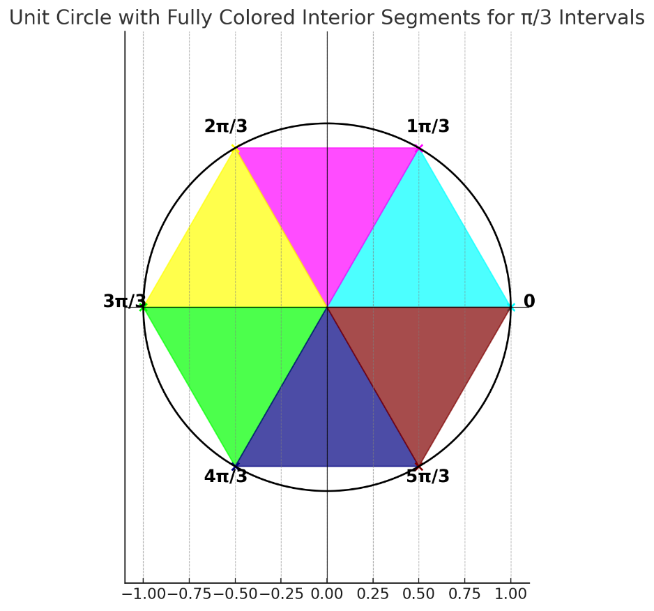{width="4.25153324584427in"
height="3.9703674540682417in"}

{width="3.6192443132108485in"
height="3.6192443132108485in"}

{width="4.410880358705162in"
height="3.9377471566054245in"}

## Defining Sine and Cosine Functions

{width="2.926380139982502in"
height="1.3586482939632545in"}

# Vector

**Vector:** A vector is a geometric object that has **magnitude
(length/size)** and **direction**.

It has an **initial point**, where it begins, and a **terminal point**,
where it ends.

Geometrically, we can picture a vector as a directed line segment, whose
length is the magnitude of the vector and with an arrow indicating the
direction.

{width="2.292361111111111in"
height="0.9152777777777777in"}

## Writing Vectors

**Writing Vectors:**

-   Lower case, boldfaced type, with or without an arrow on top such as
    **v**, **u**, **w**, $\overrightarrow{\mathbf{v}}$,
    $\overrightarrow{\mathbf{u}}$**,** $\overrightarrow{\mathbf{w}}$

-   If starting at the point A, a vector moves toward point B, we can
    write $\overrightarrow{\mathbf{AB}}$ to represent the vector.

-   Given an initial point **(0,0)** and terminal point **(a,b)**, a
    vector may be represented as **\<a,b\>**

    -   The symbol **⟨a,b⟩** has special significance. It is called the
        standard position. A vector located in the standard position
        will have an initial point **(0,0)** and terminal point
        **(a,b).**

## Position Vector

**Position Vector:** A position vector is a vector that represents the
position of a point in space relative to a reference origin. It is also
called a location vector or radius vector.

The position vector is typically defined with respect to the origin of
the coordinate system. The origin is the point where all the coordinates
are zero.

[The position vector will "point" from the origin of the coordinate
system to the terminal point.]{.mark}

There are many advantages to converting vectors into position vectors:

### Calculate the Position Vector

**Calculate the Position Vector**

{width="3.2581922572178477in"
height="1.1399617235345583in"}

## Unit Vector

**Unit Vector:** Similarly to the unit circle, a unit vector has a
magnitude of 1.

A vector can be scaled "off" the unit vector.

[Because scalars only change the magnitude of a vector and not the
direction, the vector will still be oriented in the same direction after
having been scaled.]{.mark}

A unit vector is similar to a position vector, except it has the
additional restriction that the magnitude must be 1.

### Unit Vector vs Position Vector

**Unit Vector vs Position Vector**

## Magnitude

**Magnitude:** The magnitude of a vector is depicted by two vertical
bars surrounding the vector:

\|\|a\|\|

**Vector magnitude** is calculated using the distance formula:

$$\left| |a| \right| = \sqrt{x^{2} + y^{2}}$$

## Scalar

**Scalars:** A scalar is just a number, having size/magnitude only.
Remember, vectors have magnitude and direction. Scalars lack direction
and only have magnitude.

Scalars are often used to "scale" vectors by a constant factor.

## Vector Operations

**Vector Operations**

### Vector Addition

**Vector Addition**

# Permutation

**Permutation: Permutation** refers to an arrangement of elements in a
specific order.

**Permutation Formula**

$$P(n,r) = \ \frac{n!}{(n - r)!}$$

**n:** The total number of items or elements in the set from which
selections are made. It represents the size of the entire set.

**r:** The number of items or elements to be selected or arranged. It
represents the size of the subset or the number of positions to fill.

**(n-r)!:** The number of ways to arrange the remaining *n -- r*
elements not chosen.

## Permutations with Repetitions

**Permutations with Repetitions:**

# Combination

**Combination: Combination** refers to a selection of items from a
larger set, where the order of selection does not matter. Unlike
permutations, where order is important, combinations consider only the
selection itself and not ordering.

**Combination Formula**

$$C(n,r) = \binom{\mathbf{n}}{\mathbf{r}} = \ \frac{n!}{r!(n - r)!}$$

**n:** The total number of items or elements in the set from which
selections are made. It represents the size of the entire set.

**r:** The number of items or elements to be selected or arranged. It
represents the size of the subset or the number of positions to fill.

**(n-r)!:** The number of ways to arrange the remaining *n -- r*
elements not chosen.
