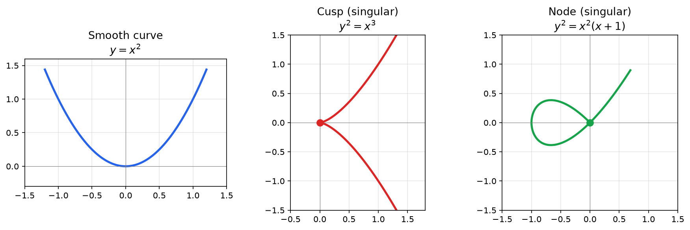

Algebraic geometry studies the shapes defined by polynomial equations. If you have worked through [conic sections](./conic-sections), you already know several examples: a circle is the set of points satisfying $x^2 + y^2 = 1$, a parabola satisfies $y = x^2$, and a hyperbola satisfies $\frac{x^2}{a^2} - \frac{y^2}{b^2} = 1$. Algebraic geometry takes this idea and runs with it: what can we say about the shapes defined by *any* system of polynomial equations, in any number of variables, in any dimension?

This page builds the path from polynomial equations to the **real log canonical threshold (RLCT)**, the central quantity in singular learning theory (SLT). The route is: polynomial equations define geometric shapes (varieties), those shapes can have singular points where the geometry is irregular, and the severity of those singularities is measured by the RLCT, which controls how well a neural network generalizes.

## From Conic Sections to Algebraic Geometry

### Shapes You Already Know

Every conic section is a curve defined by a second-degree polynomial equation in two variables. Written in the form $f(x, y) = 0$:

| Curve | Equation | Polynomial |
|-------|----------|-----------|
| Circle | $x^2 + y^2 = 1$ | $f(x,y) = x^2 + y^2 - 1$ |
| Ellipse | $\frac{x^2}{4} + y^2 = 1$ | $f(x,y) = \frac{x^2}{4} + y^2 - 1$ |
| Parabola | $y = x^2$ | $f(x,y) = y - x^2$ |
| Hyperbola | $x^2 - y^2 = 1$ | $f(x,y) = x^2 - y^2 - 1$ |

Each of these curves is the **zero set** of a polynomial: the set of all points $(x, y)$ where the polynomial evaluates to zero. Algebraic geometry begins with a simple question: what happens when we allow *any* polynomial, of *any* degree, in *any* number of variables?

### Why Polynomials?

Polynomials are the simplest class of functions that can define interesting shapes. They are:

- **Easy to compute with.** Addition, multiplication, and evaluation are straightforward.
- **Rich enough to be interesting.** Despite their simplicity, polynomial equations define an enormous variety of geometric objects: curves, surfaces, solids, and higher-dimensional shapes with intricate structure.
- **Algebraically closed under basic operations.** The sum, difference, and product of polynomials are polynomials. This means the algebraic tools we develop work cleanly.

The surprise is how much geometry is packed into polynomial equations. A single polynomial in two variables can define curves with loops, cusps, self-crossings, and isolated points. A system of polynomials in many variables can define shapes of extraordinary complexity.

## Affine Varieties

### Definition

The central objects of algebraic geometry are **varieties**: the solution sets of systems of polynomial equations.

**Definition.** Given polynomials $f_1, f_2, \ldots, f_k$ in $n$ variables, the **affine variety** defined by these polynomials is

$$
V(f_1, \ldots, f_k) = \{ x \in \mathbb{R}^n : f_1(x) = 0, \, f_2(x) = 0, \, \ldots, \, f_k(x) = 0 \}
$$

In words: a variety is the set of all points where every polynomial in the system simultaneously vanishes.

### Examples

**One equation, two variables (curves in the plane):**

- $V(x^2 + y^2 - 1)$ is the unit circle.
- $V(y - x^2)$ is a parabola.
- $V(xy)$ is the union of the x-axis and the y-axis (two intersecting lines). The polynomial $xy$ vanishes whenever $x = 0$ or $y = 0$.
- $V(y^2 - x^3)$ is a curve with a cusp at the origin (we will study this carefully later).

**Two equations, two variables (points in the plane):**

- $V(x, y) = \{(0, 0)\}$, a single point. The only point where both $x = 0$ and $y = 0$.
- $V(x^2 + y^2 - 1, \, y - x) = \{(\frac{1}{\sqrt{2}}, \frac{1}{\sqrt{2}}), (-\frac{1}{\sqrt{2}}, -\frac{1}{\sqrt{2}})\}$, two points where the line $y = x$ intersects the circle.

**One equation, three variables (surfaces in space):**

- $V(x^2 + y^2 + z^2 - 1)$ is the unit sphere.
- $V(z - x^2 - y^2)$ is a paraboloid.
- $V(x^2 + y^2 - z^2)$ is a cone.

### Dimension

The **dimension** of a variety is what you would expect intuitively:

- A single point (or a finite set of points) is **0-dimensional**.
- A curve is **1-dimensional**: you need one number (a parameter) to specify your position on it.
- A surface is **2-dimensional**: you need two numbers.

More precisely, the dimension of a variety in $\mathbb{R}^n$ is typically $n$ minus the number of "independent" equations that define it. A single equation in $\mathbb{R}^2$ generically defines a 1-dimensional curve. Two independent equations in $\mathbb{R}^2$ generically define a 0-dimensional set (finitely many points). One equation in $\mathbb{R}^3$ defines a 2-dimensional surface.

This is only a rough rule. The precise definition of dimension requires algebraic tools (the Krull dimension of the coordinate ring), but the intuition is correct for all the examples we will encounter.

### Operations on Varieties

Varieties interact with set operations in natural ways:

**Intersection.** The intersection of two varieties is a variety. If $V = V(f_1, \ldots, f_j)$ and $W = V(g_1, \ldots, g_k)$, then

$$
V \cap W = V(f_1, \ldots, f_j, g_1, \ldots, g_k)
$$

Just combine all the equations. A point must satisfy all of them.

**Union.** The union of two varieties is a variety. If $V = V(f)$ and $W = V(g)$, then

$$
V \cup W = V(f \cdot g)
$$

The product $fg$ vanishes wherever $f$ vanishes or $g$ vanishes. For example, $V(xy) = V(x) \cup V(y)$ is the union of the two coordinate axes, as we saw.

## Ideals and the Algebra-Geometry Dictionary

### Polynomials That Vanish on a Variety

Given a variety $V$, many different polynomials vanish on it (evaluate to zero at every point of $V$). For example, the polynomial $x^2 + y^2 - 1$ vanishes on the unit circle, but so does $(x^2 + y^2 - 1)^2$, and so does $x(x^2 + y^2 - 1)$, and so does $(x^2 + y^2 - 1)(3x^5 - 7y + 2)$.

**Definition.** The **ideal** of a variety $V$ is the set of all polynomials that vanish on $V$:

$$
I(V) = \{ f \in \mathbb{R}[x_1, \ldots, x_n] : f(x) = 0 \text{ for all } x \in V \}
$$

Here $\mathbb{R}[x_1, \ldots, x_n]$ denotes the set of all polynomials in $n$ variables with real coefficients.

### What Makes an Ideal an Ideal

An ideal $I$ has two closure properties:

1. **Closed under addition.** If $f, g \in I$, then $f + g \in I$. (If $f$ and $g$ both vanish on $V$, so does their sum.)
2. **Closed under multiplication by any polynomial.** If $f \in I$ and $h$ is any polynomial, then $hf \in I$. (If $f$ vanishes on $V$, then $hf$ vanishes on $V$ too, regardless of what $h$ does.)

These are natural properties. If a polynomial vanishes on a variety, you can add two such polynomials or multiply by anything, and the result still vanishes on the variety.

### The Fundamental Correspondence

The deepest idea in algebraic geometry is a dictionary between geometry and algebra:

$$
\text{Varieties (geometry)} \longleftrightarrow \text{Ideals (algebra)}
$$

Every variety $V$ determines an ideal $I(V)$ (the polynomials vanishing on it). Conversely, every ideal $I$ determines a variety $V(I)$ (the common zeros of the polynomials in $I$). These two operations are (almost) inverse to each other.

This correspondence is powerful because it lets you **translate geometric questions into algebraic questions**. Want to know if two varieties intersect? Check if the sum of their ideals contains the constant polynomial 1 (if it does, the intersection is empty). Want to know the dimension of a variety? Compute the Krull dimension of the quotient ring. Want to check if a variety is irreducible (cannot be written as a union of two proper subvarieties)? Check if the ideal is prime.

### Hilbert's Nullstellensatz

The formal statement of this correspondence is **Hilbert's Nullstellensatz** ("zero-locus theorem"), one of the foundational results of algebraic geometry.

**Theorem (Nullstellensatz, simplified).** Over an algebraically closed field (like $\mathbb{C}$, but not $\mathbb{R}$), the operations $V(\cdot)$ and $I(\cdot)$ set up a bijection between varieties and radical ideals.

The technical details (radical ideals, algebraic closure) are important for the full theory but are not essential for our purposes. The key takeaway is:

> **The algebra-geometry dictionary is not just a metaphor. It is a precise mathematical theorem.** Studying the polynomial algebra of a variety tells you everything about its geometry, and vice versa.

This dictionary is what makes algebraic geometry so powerful and so different from differential geometry or topology, where the tools are analytic rather than algebraic.

## Singular Points

### Smooth vs. Singular

Consider a curve in the plane defined by $f(x, y) = 0$. At most points on the curve, the curve is "smooth": it has a well-defined tangent line, and if you zoom in far enough, the curve looks like a straight line. These are **smooth points** (also called **regular points**).

But some points are different. At a **singular point**, the curve does something irregular: it crosses itself, comes to a sharp point, or exhibits some other failure of smoothness. Near a singular point, the curve does *not* look like a straight line, no matter how far you zoom in.

### The Jacobian Criterion

How do we detect singular points? The answer comes from calculus.

For a variety defined by a single equation $f(x, y) = 0$, a point $(a, b)$ on the variety is **singular** if both partial derivatives vanish there:

$$
\frac{\partial f}{\partial x}(a, b) = 0 \quad \text{and} \quad \frac{\partial f}{\partial y}(a, b) = 0
$$

If at least one partial derivative is nonzero, the point is smooth, and the tangent line is given by the gradient direction.

More generally, for a variety defined by $k$ equations $f_1, \ldots, f_k$ in $n$ variables, form the **Jacobian matrix**:

$$
J(x) = \begin{pmatrix} \frac{\partial f_1}{\partial x_1} & \cdots & \frac{\partial f_1}{\partial x_n} \\ \vdots & \ddots & \vdots \\ \frac{\partial f_k}{\partial x_1} & \cdots & \frac{\partial f_k}{\partial x_n} \end{pmatrix}
$$

A point $x_0$ on the variety is **singular** if the Jacobian matrix has rank less than the expected rank (which is the codimension of the variety: $n$ minus the dimension). At a smooth point, the Jacobian has full expected rank, and the variety looks like flat space locally (by the implicit function theorem from [multivariable calculus](./multivariable-calculus)).

### Examples of Singularities

**The cusp: $y^2 = x^3$.**

Write $f(x, y) = y^2 - x^3$. The partial derivatives are:

$$
\frac{\partial f}{\partial x} = -3x^2, \qquad \frac{\partial f}{\partial y} = 2y
$$

At the origin $(0, 0)$: both partials are zero, so $(0, 0)$ is singular. The curve comes to a sharp point (a cusp) at the origin. If you approach the origin along the curve, the tangent direction is not well-defined.

**The node: $y^2 = x^2(x + 1)$.**

Write $f(x, y) = y^2 - x^2(x + 1) = y^2 - x^3 - x^2$. The partial derivatives are:

$$
\frac{\partial f}{\partial x} = -3x^2 - 2x, \qquad \frac{\partial f}{\partial y} = 2y
$$

At the origin $(0, 0)$: both partials are zero, so $(0, 0)$ is singular. But this singularity is different from the cusp. The curve crosses itself at the origin (a node), creating two distinct tangent directions.

**Smooth curve: $y = x^2$.**

Write $f(x, y) = y - x^2$. The partial derivatives are:

$$
\frac{\partial f}{\partial x} = -2x, \qquad \frac{\partial f}{\partial y} = 1
$$

The partial $\frac{\partial f}{\partial y} = 1$ is never zero, so every point on this curve is smooth. There are no singularities. The parabola is a perfectly smooth curve everywhere.

### Why Singular Points Matter

At a smooth point, a variety locally looks like flat Euclidean space. All smooth points of a given dimension are locally identical: one piece of smooth curve looks like any other. This means smooth points are geometrically "boring" in a precise sense.

All the interesting geometry lives at the singular points. Cusps, nodes, crossings, pinch points: these are where the variety's global structure manifests locally. And as we will see, it is precisely these singular points that control the behavior of learning machines.

## Why Singularities Matter for SLT

### The Parameter-to-Distribution Map

In statistical learning, a model with parameters $w$ defines a probability distribution $p(x | w)$ for each parameter value $w$. The map

$$
w \mapsto p(x | w)
$$

sends each point in parameter space to a probability distribution. This map is the bridge between algebraic geometry and learning theory.

### The True Parameter Set Is a Variety

Suppose the true data-generating distribution is $q(x)$. The set of "true" parameters, those that make the model perfectly match the data, is

$$
W_0 = \{ w : p(x | w) = q(x) \text{ for all } x \}
$$

This is the set of parameters where the Kullback-Leibler divergence $K(w) = \int q(x) \log \frac{q(x)}{p(x|w)} dx$ equals zero. Since $K(w)$ can be expressed (or approximated) in terms of polynomial-like functions of $w$, the set $W_0$ behaves like an algebraic variety.

For a simple example, consider a linear regression model $y = w_1 x + w_0$ with true relationship $y = 3x + 2$. Then $W_0 = \{(w_0, w_1) : w_0 = 2, w_1 = 3\}$, a single point. This is a smooth, 0-dimensional variety. No singularities.

### Neural Networks Have Singular Parameter Sets

For neural networks, $W_0$ is typically not a single point but a complicated variety with singularities. The reasons are structural:

**Parameter symmetry.** In a two-layer network, you can permute the hidden neurons without changing the function the network computes. If the network has $h$ hidden units, there are $h!$ permutations, so at least $h!$ parameter values give the same function.

**Redundant neurons.** If a hidden neuron has weight zero (or two neurons are identical), the network is effectively using fewer neurons than its architecture specifies. The set of parameters where this happens forms a subvariety of $W_0$, and this subvariety typically has singularities.

**Rank degeneracy.** For models involving matrix products (like deep linear networks), the set of parameters where the product has a particular rank is a determinantal variety, a classical object in algebraic geometry known to have singularities.

### The Fisher Information Matrix as Jacobian

The **Fisher information matrix** at a parameter $w$ is

$$
I(w) = \int q(x) \left( \frac{\partial}{\partial w} \log p(x|w) \right) \left( \frac{\partial}{\partial w} \log p(x|w) \right)^T dx
$$

This matrix plays the role of the Jacobian for the parameter-to-distribution map. At a smooth point of $W_0$, the Fisher information matrix is positive definite (full rank). At a singular point, it becomes degenerate (not full rank).

Classical statistics (the theory behind BIC, asymptotic normality of the MLE, and standard confidence intervals) assumes the Fisher information matrix is nondegenerate. This assumption is equivalent to assuming that $W_0$ is a smooth point of the statistical model. For neural networks, this assumption fails, and classical statistics breaks down.

This is the central problem that SLT solves: how to do statistical inference when the Fisher information is degenerate, i.e., when the true parameter set has singularities.

## Resolution of Singularities

### The Problem

The free energy integral in SLT is

$$
Z_n = \int \exp(-nL_n(w)) \varphi(w) \, dw
$$

where $L_n(w)$ is the empirical loss function and $\varphi(w)$ is the prior density. Near a singular point $w_0 \in W_0$, the loss function $L_n(w)$ vanishes in a complicated way that depends on the geometry of the singularity. Standard techniques (like Laplace's method, which approximates the integral using a Taylor expansion) require the loss to vanish quadratically, like $(w - w_0)^T A (w - w_0)$ for a positive definite matrix $A$. At a singularity, the loss vanishes in a more complex pattern, and these standard techniques fail.

To analyze the integral, we need to transform the singularity into something tractable. This is what resolution of singularities does.

### Hironaka's Theorem

**Theorem (Hironaka, 1964).** Every algebraic variety can be transformed into a smooth variety by a finite sequence of **blowups**.

Heisuke Hironaka received the Fields Medal for this result. It guarantees that no matter how complicated a singularity is, it can always be resolved.

### Blowup: The Intuition

A **blowup** replaces a singular point with a space of directions. The idea is easiest to see with a concrete example.

Consider the node $V(y^2 - x^2)$, which is two lines crossing at the origin. At the origin, the two lines are "tangled together": you cannot separate them locally. A blowup replaces the origin with a circle of directions (the projectivized tangent space). Each direction on this circle corresponds to a different way of approaching the origin. The two lines approach the origin from different directions, so after the blowup, they are separated: they pass through different points on the new circle.

More concretely, the blowup introduces new coordinates $(u, v)$ related to $(x, y)$ by something like $x = u$, $y = uv$. In the new coordinates, the equation $y^2 = x^2$ becomes $u^2 v^2 = u^2$, which factors as $u^2(v^2 - 1) = 0$. The factor $u^2 = 0$ is the "exceptional divisor" (the new circle of directions), and $v^2 - 1 = 0$ gives $v = \pm 1$, which are two separate smooth points. The crossing has been resolved.

You do not need to know how to compute blowups in practice. The essential facts are:

1. **Resolution is always possible** (Hironaka's theorem).
2. **After resolution, the variety is smooth**, and integrals near the former singularity can be computed using change of variables.
3. **The resolution introduces new coordinates** in which the loss function takes a standard form (a product of powers of the new coordinates).

### Normal Form After Resolution

After resolving the singularity, the loss function $K(w)$ (the KL divergence) near $W_0$ takes the form

$$
K(g(u)) = u_1^{2k_1} u_2^{2k_2} \cdots u_d^{2k_d}
$$

in the new coordinates $u = (u_1, \ldots, u_d)$, where $g$ is the blowup map and $k_1, \ldots, k_d$ are non-negative integers $k_j$ (some may be zero) called the **multiplicities**. (After a monomial resolution these exponents are integers; the ratios $(h_j + 1)/(2k_j)$ that follow are rational.) The Jacobian of the blowup map introduces an additional factor:

$$
|J_g(u)| = u_1^{h_1} u_2^{h_2} \cdots u_d^{h_d}
$$

The integral near the singularity then becomes

$$
\int u_1^{2k_1 + h_1} u_2^{2k_2 + h_2} \cdots u_d^{2k_d + h_d} \, du
$$

which is a product of one-dimensional integrals, each of which can be evaluated explicitly. This is the technical heart of SLT: resolution of singularities transforms an intractable integral into a tractable one.

## The Real Log Canonical Threshold (RLCT)

### Definition

The **real log canonical threshold** (RLCT), denoted $\lambda$, is the quantity extracted from the normal form after resolution. It is defined as

$$
\lambda = \min_j \frac{h_j + 1}{2k_j}
$$

where the minimum is taken over all coordinate directions $j$, across the charts covering the exceptional set of a single resolution. Crucially, the resulting value $\lambda$ is a **resolution invariant**: although the exponents $k_j$ and $h_j$ depend on which resolution you choose, the minimal ratio does not. This invariance is what makes $\lambda$ well-defined. (Equivalently and intrinsically, $\lambda$ is the smallest pole of the zeta function $\zeta(z) = \int K(w)^{-z} \varphi(w) \, dw$, a definition that never refers to a resolution at all.)

In simpler terms: after you resolve the singularity and write the integral in normal form, the integral's leading asymptotic behavior as $n \to \infty$ is controlled by the "worst" (smallest) exponent ratio. That smallest ratio is $\lambda$.

### What the RLCT Measures

The RLCT measures how "sharp" or "severe" a singularity is. It controls the rate at which the posterior distribution concentrates around $W_0$ as the sample size $n$ increases.

**No singularity (smooth point).** When $W_0$ is a single smooth point (as in linear regression), $\lambda = d/2$, where $d$ is the number of parameters. This is the classical case.

**Mild singularity.** When $W_0$ has a mild singularity (a simple symmetry or a small amount of redundancy), $\lambda$ is slightly less than $d/2$.

**Severe singularity.** When $W_0$ has a severe singularity (many symmetries, highly redundant parameterization), $\lambda \ll d/2$. The model is effectively much simpler than its parameter count suggests.

The RLCT is sometimes called the **learning coefficient** because it controls the learning behavior of the model. A smaller $\lambda$ means the model's effective complexity is lower, which means it generalizes better (all else being equal).

### The Key Insight for Deep Learning

For neural networks, $\lambda$ can be dramatically smaller than $d/2$. Illustratively, a network with $d = 10{,}000$ parameters might have $\lambda = 50$, so that it behaves like a model with only 100 effective parameters (this figure is schematic, not a measured value). SLT gives a principled reason why an overparameterized model **can** generalize despite its raw parameter count: the singularity structure of the parameter space can make the effective complexity $\lambda$ far below $d/2$.

A caveat on scope: these results are established for the Bayesian regime, under the realizability assumption (the true distribution lies in the model class, so $W_0$ is non-empty) and for specific choices of prior. They should be read as an explanation for why overparameterized models *can* generalize, not a blanket guarantee that any given trained network will.

Classical model selection criteria like BIC assume $\lambda = d/2$ (no singularity). Under that assumption they would predict that a 10,000-parameter network should overfit terribly. SLT, by correctly accounting for the singularity structure, offers an explanation for why (in this regime) it need not.

## Watanabe's Main Theorem

### Statement

With the RLCT defined, we can state the central result of singular learning theory. The **free energy** $F_n$ (the negative log marginal likelihood) satisfies

$$
F_n = nL_n(w_0) + \lambda \ln n - (m - 1) \ln \ln n + O_p(1)
$$

where:

- $n$ is the number of data points.
- $L_n(w_0)$ is the training loss at the optimal parameters.
- $\lambda$ is the RLCT, the effective model complexity.
- $m$ is the **multiplicity**: the order of the pole of the zeta function at $\lambda$, equal to the number of coordinate directions attaining the minimal ratio.
- $O_p(1)$ denotes a term that is bounded in probability.

### Connection to Classical Theory

When $\lambda = d/2$ and $m = 1$ (the regular case, no singularity), Watanabe's formula reduces to

$$
F_n \approx nL_n(\hat{w}) + \frac{d}{2} \ln n
$$

This is the **Bayesian Information Criterion (BIC)**, the standard result from classical statistics. So classical theory is a special case of SLT, valid only when the model has no singularities. SLT is the generalization that handles all models, including those with singularities.

### The WAIC/WBIC Connection

Watanabe also showed that two computable quantities approximate the free energy:

**WAIC** (Widely Applicable Information Criterion): a corrected training loss that estimates the generalization error. Unlike AIC, it is valid even for singular models.

**WBIC** (Widely Applicable Bayesian Information Criterion): defined as the posterior expectation of the negative log-likelihood at inverse temperature $\beta = 1/\ln n$,

$$
\text{WBIC} = E_w^{\beta}\left[ -\sum_{i=1}^n \log p(x_i | w) \right] = E_w^{\beta}\left[ n L_n(w) \right]
$$

where the expectation is over the tempered posterior $\propto \exp(-\beta n L_n(w)) \varphi(w)$. Watanabe proved that

$$
\text{WBIC} = n L_n(\hat{w}) + \lambda \ln n + o(\log n)
$$

so the $\lambda \ln n$ term is the leading correction beyond the loss term. This provides a practical way to estimate the RLCT from data.

These connections are developed further in [Bayesian inference](./bayesian-inference).

### The Local Learning Coefficient

In practice, we often want to estimate $\lambda$ during training, not just at convergence. The **local learning coefficient** $\hat{\lambda}$ (Lau et al., 2024) estimates the RLCT at the current parameter value during training, using SGLD (stochastic gradient Langevin dynamics) samples.

Changes in $\hat{\lambda}$ during training correspond to **phase transitions**: moments when the network's effective structure changes qualitatively.

- A **decrease** in $\hat{\lambda}$ means the model has found a more efficient representation (lower effective complexity for the same function). The singularity structure has become more severe.
- An **increase** in $\hat{\lambda}$ means the model has moved to a region of parameter space with less symmetry or redundancy.

**Research connection.** In developmental interpretability, these phase transitions correspond to concrete structural changes in the network: attention heads specializing for particular tasks, circuits forming to implement specific algorithms, and redundant components collapsing into more efficient configurations. Tracking $\hat{\lambda}$ across training provides a principled, theory-grounded way to detect and characterize these structural changes, without relying on ad hoc metrics.

## Examples of RLCT Computation

### Linear Regression

**Model:** $y = w^T x + \epsilon$, with $d$ parameters.

**True parameter set:** $W_0 = \{w^*\}$, a single point (assuming the true model is in the model class).

**RLCT:** $\lambda = d/2$.

This is the regular (non-singular) case. The Fisher information matrix is positive definite, and BIC gives the correct model complexity penalty. SLT and classical statistics agree.

### Reduced Rank Regression

**Model:** $Y = ABX + \epsilon$, where $A$ is $m \times r$ and $B$ is $r \times n$.

**True parameter set:** The set of $(A, B)$ pairs such that $AB = M^*$ (the true matrix). This is a matrix variety defined by rank constraints.

**RLCT:** $\lambda < d/2$, where $d$ is the total number of entries in $A$ and $B$. The exact value depends on the true rank and the dimensions. When the true rank is less than the model rank, the parameter set has singularities (at points where $A$ or $B$ drops rank), and the RLCT reflects this.

This is a key example because deep linear networks are a special case. The RLCT of a deep linear network depends on the architecture (number and size of layers) and the true rank, providing quantitative predictions about how architecture affects generalization.

### Two-Layer Neural Network with ReLU

**Model:** $f(x; w) = \sum_{j=1}^{h} a_j \, \text{ReLU}(b_j x + c_j)$

**True parameter set:** If the true function can be represented by $h^* < h$ neurons, then $W_0$ is a variety with singularities caused by the $h - h^*$ redundant neurons (which can have arbitrary weights that cancel out or duplicate existing neurons).

**RLCT:** $\lambda$ depends on the number of redundant neurons. More redundancy means a more severe singularity, which means a smaller $\lambda$, which means better generalization (the model is penalized less for the redundant parameters). This is the opposite of what classical theory (BIC) would predict.

### Mixture Models

**Model:** $p(x | w) = \sum_{j=1}^{k} \pi_j \, \mathcal{N}(x; \mu_j, \sigma_j^2)$

If the true distribution is a mixture of $k^*$ components and we fit $k > k^*$ components, the extra components can either duplicate existing ones or have their mixing weights go to zero. Both create singularities. The RLCT depends on the ratio $k / k^*$ and controls how severely the model is penalized for the extra components.

## Summary: The Full SLT Path

The mathematical path from polynomial equations to developmental interpretability passes through a sequence of connected ideas:

1. **Polynomial equations** define zero sets (from [conic sections](./conic-sections), you know examples like circles and parabolas).

2. **Algebraic geometry** studies these zero sets systematically. The solution set of a system of polynomial equations is called a variety.

3. **The algebra-geometry dictionary** (ideals and varieties) lets you translate geometric questions into algebraic ones. The Nullstellensatz makes this precise.

4. **Singular points** are where a variety fails to be smooth: cusps, nodes, self-crossings. The Jacobian criterion detects them.

5. **In SLT**, the set of true parameters $W_0$ is a variety in parameter space. For neural networks, it has singularities caused by symmetries and redundancies.

6. **Resolution of singularities** (Hironaka's theorem) transforms any variety into a smooth one via blowups. This transforms intractable integrals into tractable ones.

7. **The RLCT** $\lambda$ is extracted from the resolved singularity. It measures effective model complexity, replacing the naive parameter count $d/2$.

8. **Watanabe's theorem** expresses the free energy (and hence generalization) in terms of $\lambda$. When $\lambda = d/2$, this reduces to BIC. For singular models (neural networks), $\lambda < d/2$, explaining why they generalize well.

9. **The local learning coefficient** $\hat{\lambda}$ tracks the RLCT during training. Its changes mark phase transitions where the network's structure changes qualitatively.

10. **Developmental interpretability** uses $\hat{\lambda}$ to detect and characterize structural changes during training: heads specializing, circuits forming, redundancy collapsing. The algebraic geometry of the parameter space provides a principled lens for understanding how neural networks learn.

This path, from the circle equation $x^2 + y^2 = 1$ to tracking phase transitions in transformer training, is the mathematical backbone of singular learning theory.
