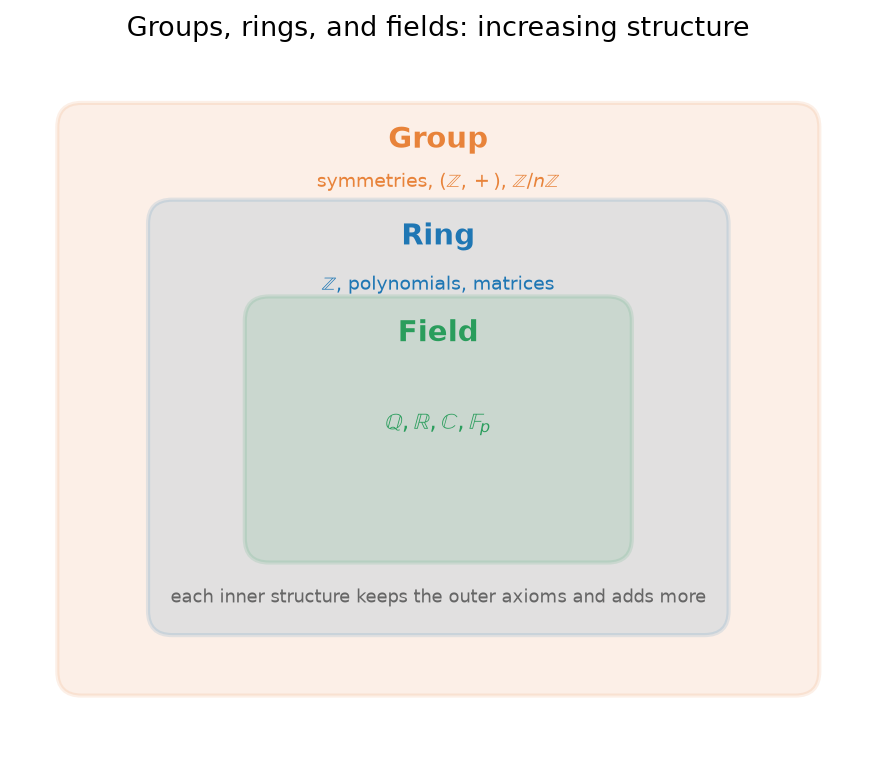

## Why name the obvious?

When you rewrite $2 + 3$ as $3 + 2$, factor $6x + 6y$ into $6(x+y)$, or cancel the $5$ in $5a = 5b$ to conclude $a = b$, you are using rules so familiar they feel like nothing at all. But each of these moves rests on a specific property of numbers, and those properties are neither obvious nor automatic. Change the setting slightly (to matrices, to remainders after division, to symmetries of a shape) and some of them quietly fail.

This page does two things. First, it names the small set of properties that ordinary arithmetic silently assumes, the ones the rest of this site takes for granted whenever it rearranges, factors, or cancels. Second, it shows that these same properties reappear on many different sets, and that mathematicians have given names to the recurring patterns: **group**, **ring**, **field**. Learning that vocabulary is worthwhile because it explains *why* algebra works, and because the same handful of laws unify structures you meet in [Linear Algebra Foundations](./linear-algebra-foundations), [Number Theory](./number-theory), and [Set Theory](./set-theory).

We work throughout with the number systems introduced on [Number Systems](./number-systems): the integers $\mathbb{Z}$, rationals $\mathbb{Q}$, reals $\mathbb{R}$, and complex numbers $\mathbb{C}$.

## The field axioms of the real numbers

The real numbers come equipped with two operations, addition ($+$, read "plus") and multiplication ($\times$ or $\cdot$, read "times"). Every rule of high-school algebra is a consequence of a short list of axioms these operations obey. An **axiom** is a property we take as a starting assumption rather than prove.

Let $a$, $b$, $c$ be any real numbers. The axioms come in matched pairs, one for each operation.

- **Closure.** Adding or multiplying two reals gives a real. The set does not "leak." Example: $2 + 3 = 5$ and $2 \cdot 3 = 6$ are both real.
- **Associativity.** Grouping does not matter: $(a+b)+c = a+(b+c)$. So we can write $a+b+c$ without parentheses. Example: $(1+2)+3 = 1+(2+3) = 6$.
- **Commutativity.** Order does not matter: $a+b = b+a$. Example: $4 \cdot 5 = 5 \cdot 4 = 20$.
- **Identity.** There is a special element that leaves everything unchanged. For addition it is $0$ (since $a+0 = a$); for multiplication it is $1$ (since $a \cdot 1 = a$).
- **Inverses.** Every element can be "undone." For addition, each $a$ has an additive inverse $-a$ with $a + (-a) = 0$. For multiplication, each $a \neq 0$ has a multiplicative inverse $1/a$ with $a \cdot (1/a) = 1$. (Zero is excluded here, for a reason we derive below.)

These ten properties (five for each operation) govern the operations separately. One further axiom links them:

- **Distributivity.** Multiplication distributes over addition: $a(b+c) = ab + ac$. Example: $3(4+5) = 3\cdot 4 + 3 \cdot 5 = 12 + 15 = 27$. This is the single axiom that lets us expand brackets and, read backwards, factor.

The full list, side by side:

| Axiom | Addition | Multiplication |
|---|---|---|
| Closure | $a+b \in \mathbb{R}$ | $a\cdot b \in \mathbb{R}$ |
| Associativity | $(a+b)+c = a+(b+c)$ | $(ab)c = a(bc)$ |
| Commutativity | $a+b = b+a$ | $ab = ba$ |
| Identity | $a+0 = a$ | $a\cdot 1 = a$ |
| Inverses | $a + (-a) = 0$ | $a\cdot(1/a) = 1,\ a\neq 0$ |
| Distributivity | $a(b+c) = ab + ac$ | (links $+$ and $\times$) |

A set with two operations satisfying all of these axioms is called a **field**. The rationals $\mathbb{Q}$, the reals $\mathbb{R}$, and the complex numbers $\mathbb{C}$ are all fields: they satisfy every axiom above. The integers $\mathbb{Z}$ satisfy all of them except one. Every integer has an additive inverse (the negative), but $2$ has no *integer* multiplicative inverse, since $1/2$ is not an integer. So $\mathbb{Z}$ fails only the multiplicative-inverse axiom. This single failure is exactly what separates a **ring** (defined below) from a field.

## The order axioms

The field axioms say nothing about *size*: they hold equally for $\mathbb{C}$, where "less than" makes no sense. The real numbers carry extra structure, a notion of order written $<$ (read "is less than"), governed by its own axioms. For all real $a$, $b$, $c$:

- **Trichotomy.** Exactly one of $a < b$, $a = b$, or $a > b$ holds. Any two reals can be compared, and in exactly one way.
- **Transitivity.** If $a < b$ and $b < c$, then $a < c$. Order chains together.
- **Compatibility with addition.** If $a < b$, then $a + c < b + c$. Adding the same amount to both sides preserves the inequality.
- **Compatibility with multiplication.** If $a < b$ and $c > 0$, then $ac < bc$. Multiplying by a *positive* number preserves the inequality. If instead $c < 0$, the inequality *flips*: $ac > bc$.

That last rule is the one people forget: multiplying or dividing an inequality by a negative number reverses its direction. From $-2 < 3$, multiplying by $-1$ gives $2 > -3$. These axioms and their consequences are developed further, with worked examples, on [Inequalities](./inequalities). A field carrying such an order is called an **ordered field**; $\mathbb{Q}$ and $\mathbb{R}$ are ordered fields, while $\mathbb{C}$ is not.

## Derived rules: consequences, not assumptions

A striking feature of the axioms is how much they force. Many rules that feel like separate facts are actually *theorems*, provable from the list above. Nothing new needs to be assumed. Here are the most useful, with short derivations.

**Multiplying by zero gives zero: $a \cdot 0 = 0$.** This is not an axiom; $0$ is only defined as the additive identity. We derive it. Since $0 + 0 = 0$ (identity), distributivity gives

$$a \cdot 0 = a\cdot(0 + 0) = a\cdot 0 + a \cdot 0.$$

Now add the additive inverse $-(a\cdot 0)$ to both sides. The left side becomes $0$, and the right side becomes $a\cdot 0$, so $0 = a\cdot 0$. The only thing we used was distributivity and the existence of additive inverses.

**Negation is multiplication by $-1$: $(-1)\cdot a = -a$.** We check that $(-1)\cdot a$ behaves like the additive inverse of $a$, which is unique (see below). Compute $a + (-1)\cdot a = 1\cdot a + (-1)\cdot a = (1 + (-1))\cdot a = 0 \cdot a = 0$, using the identity, distributivity, and the previous result. So $(-1)\cdot a$ added to $a$ gives $0$, which means it *is* $-a$.

**A negative times a negative is positive: $(-1)(-1) = 1$.** Apply the rule just proved with $a = -1$: $(-1)\cdot(-1) = -(-1)$. And $-(-1) = 1$, because $1$ is the additive inverse of $-1$ (their sum is $0$) and inverses are unique. Hence $(-1)(-1) = 1$. This is why the "two negatives make a positive" rule is not an arbitrary convention: it is forced by distributivity.

**Cancellation law.** If $a \neq 0$ and $ab = ac$, then $b = c$. Because $a \neq 0$, it has a multiplicative inverse $1/a$. Multiply both sides by it: $(1/a)(ab) = (1/a)(ac)$, so by associativity $b = c$. Cancellation is not a primitive move; it is "multiply both sides by the inverse" in disguise. Note the crucial hypothesis $a \neq 0$: you may never cancel a factor that could be zero.

**Uniqueness of identities and inverses.** Suppose $0$ and $0'$ were both additive identities. Then $0 = 0 + 0' = 0'$ (using each as the identity in turn), so there is only one. The same argument gives a unique multiplicative identity. Inverses are unique too: if $b$ and $b'$ are both additive inverses of $a$, then $b = b + 0 = b + (a + b') = (b + a) + b' = 0 + b' = b'$. This uniqueness is what lets us write "$-a$" and "$1/a$" as if they name single, definite elements.

**Why division by zero is undefined.** Division by $a$ means multiplication by the inverse $1/a$, the element satisfying $a \cdot (1/a) = 1$. For $a = 0$ we would need some $x$ with $0 \cdot x = 1$. But we just proved $0 \cdot x = 0$ for every $x$, and $0 \neq 1$ in any field. No such $x$ exists, so $1/0$ names nothing. Division by zero is left undefined not by fiat but because the axioms make the required element impossible.

## A bridge to abstract algebra

Look again at what we actually used. The derivations above never mentioned that $a$ was a *number*. They used only associativity, identities, inverses, and distributivity. So the same reasoning must work on *any* set whose operations obey those laws, whether the elements are numbers, matrices, functions, or symmetries. This is the central move of abstract algebra: instead of proving a fact over and over on each new set, name the pattern once and prove things about the pattern.

The three patterns you meet first are the group, the ring, and the field. Each is just a set together with operations satisfying a prescribed subset of the axioms above.

### Group

A **group** is a set $G$ with one operation (call it $*$) satisfying three axioms: the operation is *associative*, there is an *identity* element $e$ with $e * a = a * e = a$, and every element $a$ has an *inverse* $a^{-1}$ with $a * a^{-1} = e$. That is all. If the operation is also commutative ($a * b = b * a$), the group is called **abelian** (after Niels Abel). A group is the minimal setting in which "undoing" always makes sense.

Examples:

- $(\mathbb{Z}, +)$: the integers under addition. The identity is $0$, the inverse of $n$ is $-n$. Abelian.
- The nonzero rationals $\mathbb{Q}^{\times} = \mathbb{Q}\setminus\{0\}$ under multiplication. The identity is $1$, the inverse of $p/q$ is $q/p$. Abelian. (Zero must be removed, since it has no inverse.)
- Symmetries of a square, or permutations of a finite set, under composition. Here order usually matters, so these groups are *not* abelian: doing rotation-then-flip differs from flip-then-rotation.
- $\mathbb{Z}/n\mathbb{Z}$, the integers modulo $n$, under addition. This is "clock arithmetic," where $n \equiv 0$. It is the working setting of modular arithmetic on [Number Theory](./number-theory), and it is a finite abelian group.

### Ring

A **ring** is a set $R$ with *two* operations, $+$ and $\times$, such that $R$ is an abelian group under $+$ (giving $0$, negatives, commutativity of addition), multiplication is associative, and multiplication distributes over addition. What a ring does *not* require is multiplicative inverses, or even commutativity of multiplication. So a ring is a field with the multiplicative-inverse axiom (and possibly commutativity of $\times$) dropped.

Examples:

- $\mathbb{Z}$, the integers. A commutative ring that is not a field, precisely because $2$ has no integer inverse.
- Polynomials with real coefficients, $\mathbb{R}[x]$. Sums and products of polynomials are polynomials, and all the ring axioms hold, but $x$ has no polynomial inverse. See [Polynomial Functions](./polynomial-functions).
- $n \times n$ matrices over $\mathbb{R}$, under matrix addition and multiplication. This is a ring in which multiplication is *not* commutative ($AB \neq BA$ in general), a natural example of a **noncommutative ring**. See [Matrices](./matrices).
- $\mathbb{Z}/n\mathbb{Z}$ again, now with both addition and multiplication modulo $n$: a finite commutative ring.

### Field

A **field** is a commutative ring in which every nonzero element has a multiplicative inverse. Equivalently, it is a set satisfying the full field-axiom table from the top of this page. Fields are the sets where you can add, subtract, multiply, and divide (except by zero) freely, which is exactly the arithmetic you are used to.

Examples:

- $\mathbb{Q}$, $\mathbb{R}$, $\mathbb{C}$: the familiar number fields.
- $\mathbb{F}_p = \mathbb{Z}/p\mathbb{Z}$ for a *prime* $p$: a finite field with exactly $p$ elements. When (and only when) the modulus is prime, every nonzero residue has an inverse, so the ring $\mathbb{Z}/p\mathbb{Z}$ becomes a field. For instance in $\mathbb{F}_5$, the inverse of $2$ is $3$, since $2 \cdot 3 = 6 \equiv 1 \pmod 5$.

Summary:

| Structure | Operations | Key extra requirement | Examples |
|---|---|---|---|
| Group | one ($*$) | identity and inverses; associative | $(\mathbb{Z},+)$; $\mathbb{Q}^\times$; permutations; $\mathbb{Z}/n\mathbb{Z}$ |
| Ring | two ($+$, $\times$) | abelian group under $+$; $\times$ associative and distributes | $\mathbb{Z}$; $\mathbb{R}[x]$; $n\times n$ matrices; $\mathbb{Z}/n\mathbb{Z}$ |
| Field | two ($+$, $\times$) | commutative ring; every nonzero element has a $\times$-inverse | $\mathbb{Q}$, $\mathbb{R}$, $\mathbb{C}$; $\mathbb{F}_p$ |

The three sit in a strict hierarchy. Every field is a ring (it just satisfies extra axioms). Every ring is an abelian group under its addition (that is part of the definition of a ring). So each structure is a special case of the one before, gaining power by demanding more.

## Where these structures show up

The payoff of this vocabulary is that once you recognize a structure, everything already proved about it is yours for free. A few places on this site where the same patterns recur:

- **Vector spaces are defined over a field.** The scalars you multiply vectors by must come from a field so that division and linear combinations behave. This is why the definition on [Linear Algebra Foundations](./linear-algebra-foundations) begins "let $F$ be a field."
- **Rings and their ideals are the working objects of geometry.** [Algebraic Geometry](./algebraic-geometry) studies solution sets of polynomial equations by studying the rings of polynomials that cut them out, translating geometric questions into ring theory.
- **Modular arithmetic is just the ring $\mathbb{Z}/n\mathbb{Z}$.** Every fact about remainders in [Number Theory](./number-theory) is a statement about this finite ring, and it is a field exactly when $n$ is prime.
- **Boolean algebra obeys the same laws.** The union and intersection of [set operations](./set-theory), and the "or" and "and" of [logical connectives](./propositional-logic-zeroth-order-logic), satisfy their own commutative, associative, and distributive laws, mirroring the axioms above. The abstract pattern there is called a Boolean algebra, and recognizing the shared structure is why the same simplification tricks work for sets, logic, and arithmetic alike.
- **Binary and hexadecimal** on [Number Bases](./number-bases) are the integers $\mathbb{Z}$ written differently: the underlying ring is unchanged, only the notation for its elements differs.

The lesson is not that abstraction is fancy, but that it is economical. Naming the pattern once means never having to reprove closure, cancellation, or "negative times negative" again on each new set you meet.
