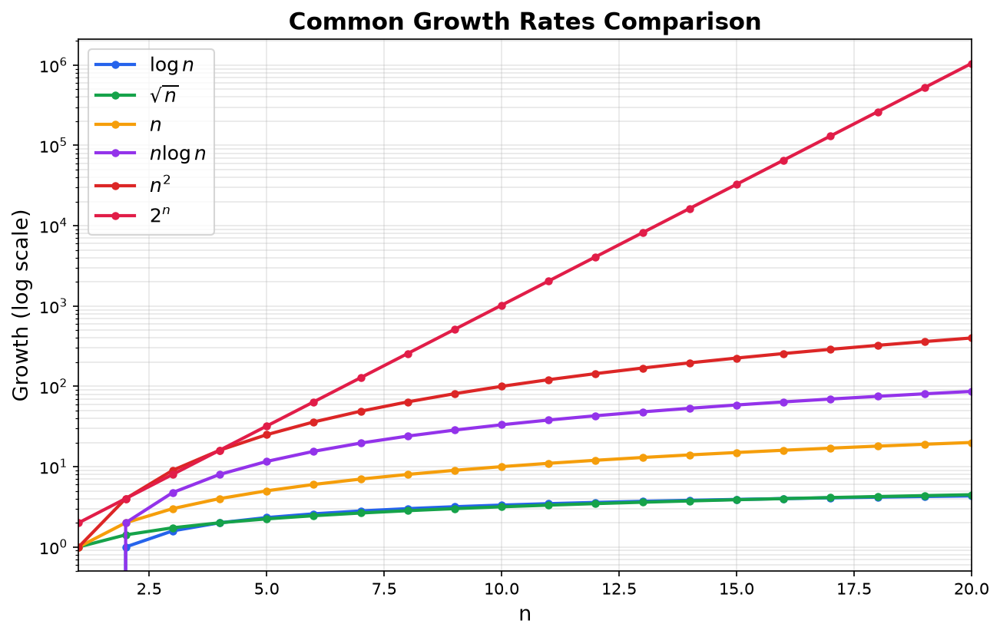

> [!abstract] Prerequisites & where this leads
> **Builds on:** [Functions & Relations](./functions-relations) · [Exponential Functions](./exponential-functions)
> **Leads to:** [Real Analysis](./real-analysis) · [Graph Theory](./graph-theory)

## Why We Need Asymptotic Notation

How long does an algorithm take to run? The exact answer depends on the hardware, programming language, compiler optimizations, and many other factors that have nothing to do with the algorithm itself. If we measure wall-clock time, the same algorithm might take 2 seconds on one machine and 0.5 seconds on another.

What we really want is a way to describe **how an algorithm scales** as the input size grows, ignoring constant factors and machine-specific details. Asymptotic notation gives us this language. Instead of saying "this algorithm takes $3n^2 + 7n + 15$ nanoseconds," we say it runs in $O(n^2)$ time, capturing the essential growth rate while discarding the constants that vary by implementation.

This abstraction is powerful because it lets us compare algorithms meaningfully. An $O(n \log n)$ sorting algorithm will eventually beat an $O(n^2)$ one, no matter how fast the hardware running the quadratic algorithm is. For large enough inputs, the growth rate always dominates.

## Big-O Notation (Upper Bound)

**Definition:** We say $f(n) = O(g(n))$ if there exist positive constants $c$ and $n_0$ such that:

$$
f(n) \leq c \cdot g(n) \quad \text{for all } n \geq n_0
$$

**Intuition:** $f$ grows **no faster than** $g$, up to a constant factor, once $n$ is large enough. Big-O provides an **upper bound** on the growth rate.

The constants $c$ and $n_0$ exist but we do not care about their specific values. The definition only requires that *some* valid pair exists.

**Example:** Show that $3n^2 + 5n + 7 = O(n^2)$.

We need $3n^2 + 5n + 7 \leq c \cdot n^2$ for some $c$ and all $n \geq n_0$.

For $n \geq 1$: $5n \leq 5n^2$ and $7 \leq 7n^2$, so:

$$
3n^2 + 5n + 7 \leq 3n^2 + 5n^2 + 7n^2 = 15n^2
$$

Choosing $c = 15$ and $n_0 = 1$ satisfies the definition. Therefore $3n^2 + 5n + 7 = O(n^2)$. $\checkmark$

**A note on the "equals" sign:** The notation $f(n) = O(g(n))$ is standard but slightly misleading, since $O(g(n))$ is really a set of functions. The statement means "$f$ is a member of the set $O(g(n))$." Some authors write $f(n) \in O(g(n))$ to be more precise.

## Big-Omega Notation (Lower Bound)

**Definition:** We say $f(n) = \Omega(g(n))$ if there exist positive constants $c$ and $n_0$ such that:

$$
f(n) \geq c \cdot g(n) \quad \text{for all } n \geq n_0
$$

**Intuition:** $f$ grows **at least as fast as** $g$. Big-Omega provides a **lower bound** on the growth rate.

**Example:** $3n^2 + 5n + 7 = \Omega(n^2)$ because $3n^2 + 5n + 7 \geq 3n^2 \geq 3 \cdot n^2$ for all $n \geq 1$. Choose $c = 3$ and $n_0 = 1$.

Big-Omega is particularly useful for stating that a problem **requires** at least a certain amount of work. For instance, any comparison-based sorting algorithm must make $\Omega(n \log n)$ comparisons in the worst case.

## Big-Theta Notation (Tight Bound)

**Definition:** We say $f(n) = \Theta(g(n))$ if $f(n) = O(g(n))$ **and** $f(n) = \Omega(g(n))$.

Equivalently, there exist positive constants $c_1$, $c_2$, and $n_0$ such that:

$$
c_1 \cdot g(n) \leq f(n) \leq c_2 \cdot g(n) \quad \text{for all } n \geq n_0
$$

**Intuition:** $f$ and $g$ grow at the **same rate** (up to constant factors). Big-Theta is the most precise of the three notations.

**Example:** $3n^2 + 5n + 7 = \Theta(n^2)$ because we showed both $O(n^2)$ and $\Omega(n^2)$ above.

![Three panels defining the asymptotic bounds by comparing f(n) = 3n²+5n+7 (blue) to constant multiples of g(n) = n². The left Big-O panel plots f staying below the red dashed curve 4n² once n passes the threshold n-zero = 7, marking the crossing point; this is the upper bound. The middle Big-Omega panel plots f staying above the green dashed curve 3n² for all n; this is the lower bound. The right Big-Theta panel shows f squeezed inside the shaded band between 3n² and 4n² for n at least 7; this is the tight two-sided bound. Each notation is just f compared to a scaled copy of g, valid past some starting point n-zero.](./media/asymp-bounds-definition.png)

The pictures make the definitions concrete: Big-O pins $f$ *under* a scaled $g$, Big-Omega pins it *above* one, and Big-Theta traps it *between* two. Each holds only "eventually," past the threshold $n_0$ (here the upper bound $4n^2$ only overtakes $f$ from $n = 7$ onward, which is exactly what "for all $n \geq n_0$" allows).

**Summary of the three notations:**

| Notation | Meaning | Analogy |
|----------|---------|---------|
| $f = O(g)$ | $f$ grows no faster than $g$ | $f \leq g$ (up to constants) |
| $f = \Omega(g)$ | $f$ grows at least as fast as $g$ | $f \geq g$ (up to constants) |
| $f = \Theta(g)$ | $f$ grows at the same rate as $g$ | $f \approx g$ (up to constants) |

## Common Growth Rates

Listed from slowest to fastest growth:

$$
O(1) \subset O(\log n) \subset O(\sqrt{n}) \subset O(n) \subset O(n \log n) \subset O(n^2) \subset O(n^3) \subset O(2^n) \subset O(n!) \subset O(n^n)
$$

| Growth Rate | Name | Example Algorithm |
|-------------|------|-------------------|
| $O(1)$ | Constant | Array index lookup, hash table access |
| $O(\log n)$ | Logarithmic | Binary search |
| $O(\sqrt{n})$ | Square root | Trial division primality test |
| $O(n)$ | Linear | Linear search, single loop over input |
| $O(n \log n)$ | Linearithmic | Merge sort, heap sort |
| $O(n^2)$ | Quadratic | Bubble sort, insertion sort, nested loops |
| $O(n^3)$ | Cubic | Naive matrix multiplication |
| $O(2^n)$ | Exponential | Brute-force subset enumeration |
| $O(n!)$ | Factorial | Brute-force permutation enumeration |
| $O(n^n)$ | Super-exponential | (Rarely encountered in practice) |



**Explore the growth rates interactively.** The widget below overlays the common complexity classes so you can watch eventual dominance take over: toggle curves on and off, drag the input-size slider, and switch to a log-scale y-axis to see the whole family at once. The value table updates to the current $n$, and a crossover marker shows where $O(n^2)$ (read "big-O of n squared") first overtakes $O(n \log n)$ (read "big-O of n log n").

<iframe src="/static/interactive/asymp-growth-explorer.html" width="100%" height="580" style="border:none;"></iframe>

To appreciate the difference: for $n = 1{,}000{,}000$, $\log_2 n \approx 20$. The gap between $O(n)$ and $O(n^2)$ is the gap between processing a million items and processing a trillion pairs. The gap between $O(n^2)$ and $O(2^n)$ is the gap between "slow" and "physically impossible."

## Rules for Determining Big-O

These rules let you quickly determine the Big-O of a function or algorithm:

### 1. Drop Lower-Order Terms

Only the fastest-growing term matters:

$$
n^3 + n^2 + n = O(n^3)
$$

$$
2^n + n^5 + 100n = O(2^n)
$$

### 2. Drop Constant Factors

Constants do not affect the growth rate:

$$
5n^2 = O(n^2), \quad 1000n = O(n), \quad \frac{n}{3} = O(n)
$$

### 3. Nested Loops Multiply

If an outer loop runs $n$ times and an inner loop runs $n$ times for each iteration:

$$
O(n) \times O(n) = O(n^2)
$$

More generally, a loop running $O(n)$ times with $O(m)$ work per iteration is $O(nm)$.


Each cell is one iteration: the outer loop picks the row, the inner loop sweeps the columns, and filling the whole $n \times n$ grid takes $n^2$ steps. That is why an $O(n)$ loop nested inside another $O(n)$ loop is $O(n^2)$.

### 4. Sequential Steps Add

If you do one operation taking $O(n)$ and then another taking $O(n^2)$, the total is:

$$
O(n) + O(n^2) = O(n^2)
$$

The slower step dominates.

### 5. Logarithmic Bases Do Not Matter

$$
O(\log_2 n) = O(\log_{10} n) = O(\ln n) = O(\log n)
$$

Since $\log_a n = \frac{\log_b n}{\log_b a}$, different bases differ only by a constant factor.

### Worked Example: Analyzing a Code Fragment

Consider this pseudocode:

```
for i = 1 to n:
    for j = 1 to n:
        print(i, j)          // O(1) per iteration

for k = 1 to n:
    print(k)                 // O(1) per iteration
```

- The nested loop: $O(n) \times O(n) = O(n^2)$
- The single loop: $O(n)$
- Total: $O(n^2) + O(n) = O(n^2)$

## Analyzing Algorithms

### Linear Search: $O(n)$

Scan through an array of $n$ elements to find a target. In the worst case (target is last or absent), you examine all $n$ elements.

### Binary Search: $O(\log n)$

Search a sorted array by repeatedly halving the search space. After $k$ steps, the remaining space has size $n / 2^k$. The search ends when $n / 2^k = 1$, so $k = \log_2 n$. For a concrete instance, an array of $n = 32$ elements is halved $32 \to 16 \to 8 \to 4 \to 2 \to 1$, which is $\log_2 32 = 5$ steps.


The number of halvings needed to shrink $n$ down to $1$ is exactly $\log_2 n$, which is why the running time is $O(\log n)$: doubling the array size adds just **one** more step. That is the slowest-growing useful complexity class, and it is why sorted data is so valuable.

### Sorting

**Comparison-based sorts** (those that only compare pairs of elements) have a provable lower bound of $\Omega(n \log n)$. The argument: with $n!$ possible orderings, a decision tree needs at least $\log_2(n!) = \Theta(n \log n)$ comparisons to distinguish among them.

- **Merge sort** achieves $O(n \log n)$ by dividing the array in half, sorting each half recursively, and merging in $O(n)$ time. Its recurrence is $T(n) = 2T(n/2) + O(n)$. See [Sequences & Series](./sequences-and-series) for solving such recurrences.
- **Bubble sort** and **insertion sort** run in $O(n^2)$ worst case.

### Matrix Multiplication

The naive algorithm for multiplying two $n \times n$ matrices uses three nested loops: $O(n^3)$. Strassen's algorithm reduces this to approximately $O(n^{2.807})$ by cleverly reducing the number of sub-multiplications.

## Formal Proofs with Big-O

To rigorously prove $f(n) = O(g(n))$, you must exhibit specific constants $c$ and $n_0$ and show the inequality holds.

**Example:** Prove $n \log n = O(n^2)$.

For $n \geq 1$, $\log_2 n \leq n$ (since $n \leq 2^n$ implies $\log_2 n \leq n$; the base does not affect the conclusion because changing base only rescales by a constant, as shown above). Therefore:

$$
n \log n \leq n \cdot n = n^2
$$

Choosing $c = 1$ and $n_0 = 1$: $n \log n \leq 1 \cdot n^2$ for all $n \geq 1$. $\checkmark$

**Example:** Prove $2^n \neq O(n^k)$ for any fixed $k$ (exponential grows faster than any polynomial).

Suppose for contradiction that $2^n \leq c \cdot n^k$ for all $n \geq n_0$. Taking logarithms: $n \leq \log_2 c + k \log_2 n$. But $n$ grows faster than $k \log_2 n$, so for large enough $n$ the inequality fails. Contradiction.

## Connection to Calculus

Big-O has an equivalent characterization using limits. For positive functions $f$ and $g$:

$$
f(n) = O(g(n)) \iff \limsup_{n \to \infty} \frac{f(n)}{g(n)} < \infty
$$

$$
f(n) = \Omega(g(n)) \iff \liminf_{n \to \infty} \frac{f(n)}{g(n)} > 0
$$

$$
f(n) = \Theta(g(n)) \iff 0 < \liminf_{n \to \infty} \frac{f(n)}{g(n)} \leq \limsup_{n \to \infty} \frac{f(n)}{g(n)} < \infty
$$

The characterization for $\Theta$ uses $\liminf$ and $\limsup$ because $\Theta$ does not require the ratio $f/g$ to converge. For instance $f(n) = (2 + \sin n)\,n$ is $\Theta(n)$ even though $f(n)/n = 2 + \sin n$ oscillates in $[1, 3]$ and has no limit. As a convenient (one-directional) special case: **if** $\lim_{n \to \infty} f(n)/g(n)$ exists and lies in $(0, \infty)$, then $f = \Theta(g)$.

This provides a quick test. For example:

$$
\lim_{n \to \infty} \frac{3n^2 + 5n}{n^2} = \lim_{n \to \infty} \left(3 + \frac{5}{n}\right) = 3
$$

Since the limit is a positive finite constant, $3n^2 + 5n = \Theta(n^2)$.

To compare two functions, L'Hopital's rule (see [Calculus](./calculus)) is often useful:

$$
\lim_{n \to \infty} \frac{n^2}{2^n} = \lim_{n \to \infty} \frac{2n}{2^n \ln 2} = \lim_{n \to \infty} \frac{2}{2^n (\ln 2)^2} = 0
$$

This confirms $n^2 = O(2^n)$ (and that $n^2$ grows strictly slower than $2^n$).

## Little-o and Little-omega

For completeness, there are also **strict** asymptotic notations:

- $f(n) = o(g(n))$ means $f$ grows **strictly slower** than $g$: $\lim_{n \to \infty} \frac{f(n)}{g(n)} = 0$.
- $f(n) = \omega(g(n))$ means $f$ grows **strictly faster** than $g$: $\lim_{n \to \infty} \frac{f(n)}{g(n)} = \infty$.

The difference: $n = O(n)$ is true (a function is its own upper bound), but $n = o(n)$ is false (a function does not grow strictly slower than itself).

**Worked examples (the limit decides).** Little-o and little-omega are settled by computing a single limit:

- $n = o(n^2)$ because $\displaystyle\lim_{n \to \infty} \frac{n}{n^2} = \lim_{n \to \infty} \frac{1}{n} = 0$. The linear function grows strictly slower than the quadratic.
- $2n \ne o(n)$ because $\displaystyle\lim_{n \to \infty} \frac{2n}{n} = 2 \ne 0$. Here $2n = O(n)$ and $2n = \Theta(n)$ (same growth rate), but the limit is a nonzero constant, so the growth is *not* strictly slower: little-o fails.
- $n^2 = \omega(n \log n)$ because $\displaystyle\lim_{n \to \infty} \frac{n^2}{n \log n} = \lim_{n \to \infty} \frac{n}{\log n} = \infty$. The quadratic grows strictly faster than linearithmic.

The pattern: a limit of $0$ means little-o (strictly slower), a limit of $\infty$ means little-omega (strictly faster), and a finite nonzero limit means $\Theta$ (same rate, and therefore *neither* little-o nor little-omega).

## Where It Shows Up in Machine Learning

Asymptotic notation describes the computational cost of ML algorithms as data or model size grows:

- **Stochastic gradient descent (SGD):** $O(n)$ per epoch, where $n$ is the number of training examples. Each example is visited once per epoch.
- **Computing the Hessian matrix:** $O(p^2)$ where $p$ is the number of parameters. The Hessian is a $p \times p$ matrix of second derivatives.
- **Matrix inversion:** $O(p^3)$ via standard methods. This is why second-order optimization (Newton's method) is impractical for large neural networks.
- **Transformer self-attention:** $O(n^2 d)$ where $n$ is the sequence length and $d$ is the embedding dimension. The quadratic dependence on $n$ motivates research into efficient attention mechanisms.
- **k-nearest neighbors prediction:** $O(nd)$ per query by brute force (compare against all $n$ training points in $d$ dimensions). Tree-based methods reduce this to $O(d \log n)$ on average.

Understanding these costs guides architectural choices: when $n$ or $p$ is large, the difference between $O(n)$ and $O(n^2)$ determines whether a method is practical.
