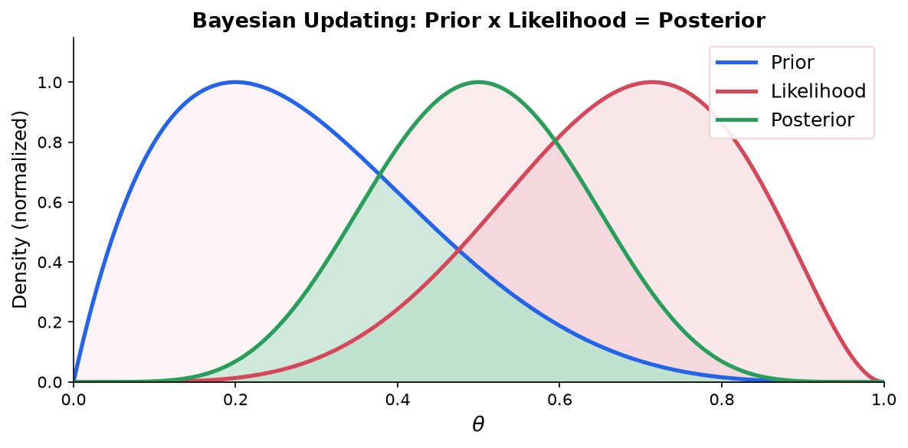

> [!abstract] Prerequisites & where this leads <!-- slt-nav -->
> **Builds on:** [Probability](./probability) · [Statistics](./statistics) · [Information Theory](./information-theory)
> **Leads to:** [Singular Learning Theory](./singular-learning-theory)

Bayesian inference is the framework for reasoning about uncertainty by treating unknown quantities as probability distributions rather than fixed values. Instead of asking "what is the best parameter?", Bayesian inference asks "what is the distribution of the parameter given the data?" This page builds on [Bayes' theorem and probability distributions](./probability) and on [MLE and MAP estimation from statistics](./statistics). It provides the foundation for understanding singular learning theory (SLT), which is fundamentally a Bayesian framework.

## The Bayesian Framework

### Review: Bayes' Theorem

Recall from [probability](./probability) that Bayes' theorem relates conditional probabilities:

$$
P(\theta | D) = \frac{P(D | \theta) \, P(\theta)}{P(D)}
$$

This equation has four components, each with a distinct role:

**Prior** $P(\theta)$: What you believe about the parameter $\theta$ before seeing any data. This encodes existing knowledge, assumptions, or deliberate ignorance. A prior over $\theta$ is a full probability distribution, not a single number.

**Likelihood** $P(D | \theta)$: The probability of observing data $D$ if the parameter value were $\theta$. This is the same likelihood function used in [MLE](./statistics), but now evaluated across all possible values of $\theta$, not just the maximizer.

**Posterior** $P(\theta | D)$: The updated belief about $\theta$ after seeing the data. This is the central object of Bayesian inference. It is a full distribution, not a point estimate.

**Evidence (marginal likelihood)** $P(D)$: The total probability of the data, averaged over all possible parameter values:

$$
P(D) = \int P(D | \theta) \, P(\theta) \, d\theta
$$

This acts as a normalizing constant, ensuring the posterior integrates to 1. Computing this integral is usually the hard part of Bayesian inference.

### From Point Estimates to Distributions

[MLE](./statistics) finds the single value $\hat{\theta}$ that maximizes $P(D | \theta)$. It ignores the prior entirely.

[MAP estimation](./statistics) finds the single value $\hat{\theta}$ that maximizes $P(\theta | D) \propto P(D | \theta) P(\theta)$. It uses the prior but still returns a point estimate.

Full Bayesian inference keeps the entire posterior distribution $P(\theta | D)$. This is a fundamental shift:

| Method | Uses prior? | Output | Uncertainty? |
|--------|-------------|--------|-------------|
| MLE | No | Single point $\hat{\theta}$ | No |
| MAP | Yes | Single point $\hat{\theta}$ | No |
| Full Bayes | Yes | Distribution $P(\theta \mid D)$ | Yes |

Why does this matter? A point estimate tells you nothing about how confident you should be. If the posterior is sharply peaked, you are confident. If it is broad and flat, the data has not narrowed things down much. Only the full posterior captures this distinction.

The posterior is always a compromise between the prior and the likelihood. With little data, the posterior stays close to the prior. With lots of data, the likelihood dominates and the posterior concentrates around the MLE. In the limit of infinite data, the prior becomes irrelevant and all three methods (MLE, MAP, full Bayes) converge to the same answer.

## Choosing Priors

The prior $P(\theta)$ is what distinguishes Bayesian inference from frequentist methods. Choosing a prior is both a modeling decision and, for some, a source of controversy.

### Informative Priors

An informative prior encodes genuine knowledge about the parameter. If you are estimating the height of adult humans and you know from previous studies that heights cluster around 170 cm with a standard deviation of about 10 cm, you might use:

$$
\theta \sim \mathcal{N}(170, 10^2)
$$

This rules out absurd values (negative heights, heights of 500 cm) and concentrates the prior where you expect the answer to be. Informative priors are powerful when you have real domain knowledge, and they can dramatically improve estimates when data is scarce.

### Non-informative (Diffuse) Priors

A non-informative prior tries to encode ignorance, letting the data speak for itself.

**Uniform prior:** Assign equal probability to all values. For a parameter on $[0, 1]$, use $P(\theta) = 1$. For an unbounded parameter, a uniform prior is improper (it does not integrate to a finite value), but the posterior may still be proper if the likelihood is strong enough.

**Jeffreys' prior:** A prior that is invariant under reparameterization. If you switch from $\theta$ to $\phi = g(\theta)$, Jeffreys' prior gives consistent results regardless of which parameterization you use. It is defined as:

$$
P(\theta) \propto \sqrt{\det I(\theta)}
$$

where $I(\theta)$ is the Fisher information matrix. For a Bernoulli model, Jeffreys' prior is $\text{Beta}(1/2, 1/2)$, which places more weight near 0 and 1 than a uniform prior does.

### Conjugate Priors

A prior is **conjugate** to a likelihood if the posterior has the same distributional form as the prior. This is enormously convenient because it gives a closed-form posterior: you just update the prior's parameters.

| Likelihood | Conjugate Prior | Posterior |
|---|---|---|
| Bernoulli / Binomial | $\text{Beta}(\alpha, \beta)$ | $\text{Beta}(\alpha + k, \beta + n - k)$ |
| Normal (known $\sigma^2$) | $\text{Normal}(\mu_0, \sigma_0^2)$ | $\text{Normal}(\mu_n, \sigma_n^2)$ |
| Poisson | $\text{Gamma}(\alpha, \beta)$ | $\text{Gamma}(\alpha + \sum x_i, \beta + n)$ |
| Normal (known $\mu$) | $\text{Inverse-Gamma}(\alpha, \beta)$ | $\text{Inverse-Gamma}(\alpha + n/2, \beta + \frac{1}{2}\sum(x_i - \mu)^2)$ |

Conjugate priors are computationally tractable, but they constrain the form of your prior belief. For complex models, conjugate priors rarely exist.

### Worked Example: Beta-Binomial

Suppose you want to estimate the probability $\theta$ that a coin lands heads. You start with a $\text{Beta}(2, 2)$ prior, which is symmetric and mildly concentrated around $\theta = 0.5$. The Beta distribution has PDF:

$$
P(\theta) = \frac{\theta^{\alpha - 1}(1 - \theta)^{\beta - 1}}{B(\alpha, \beta)}
$$

You flip the coin $n = 10$ times and observe $k = 7$ heads. The likelihood is:

$$
P(D | \theta) = \binom{n}{k} \theta^k (1 - \theta)^{n - k} = \binom{10}{7} \theta^7 (1 - \theta)^3
$$

Since the Beta prior is conjugate to the Binomial likelihood, the posterior is:

$$
P(\theta | D) = \text{Beta}(\alpha + k, \beta + n - k) = \text{Beta}(2 + 7, 2 + 3) = \text{Beta}(9, 5)
$$

The posterior mean is $\frac{\alpha + k}{\alpha + \beta + n} = \frac{9}{14} \approx 0.643$. Compare this to the MLE of $7/10 = 0.7$. The posterior mean is pulled toward the prior mean of $0.5$ (the prior "shrinks" the estimate). With more data, this shrinkage effect diminishes.

**How the posterior evolves with data:** After 0 observations, your belief is $\text{Beta}(2, 2)$. After 1 head: $\text{Beta}(3, 2)$. After 1 head and 1 tail: $\text{Beta}(3, 3)$. After 7 heads and 3 tails: $\text{Beta}(9, 5)$. Each new observation updates the parameters incrementally. The prior parameters $\alpha$ and $\beta$ can be interpreted as "pseudo-counts": consistent with the update rule above (each observed head adds 1 to $\alpha$), the prior acts like having already seen $\alpha$ pseudo-heads and $\beta$ pseudo-tails before any data arrived. This gives a prior mean of $\alpha / (\alpha + \beta)$ and a prior "sample size" of $\alpha + \beta$. (A different, mode-based convention instead reads the prior as $\alpha - 1$ heads and $\beta - 1$ tails, since the mode of $\text{Beta}(\alpha, \beta)$ is $(\alpha - 1)/(\alpha + \beta - 2)$; we use the mean-based $\alpha/\beta$ form here for consistency with the posterior update.)

### Empirical Bayes

Empirical Bayes is a pragmatic compromise between full Bayesian inference and frequentist methods. Instead of choosing the prior subjectively, you estimate the prior from the data itself.

The idea: if you have many related estimation problems (e.g., estimating the skill of thousands of baseball players), you use the overall distribution of observed outcomes to set the prior, then apply Bayes' theorem to each individual case. This "borrows strength" across the dataset.

Formally, you choose the prior hyperparameters $\eta$ by maximizing the marginal likelihood:

$$
\hat{\eta} = \arg\max_\eta \int P(D | \theta) P(\theta | \eta) \, d\theta
$$

Then you use $P(\theta | \hat{\eta})$ as the prior for individual inference. This is not fully Bayesian (a true Bayesian would put a prior on $\eta$ too), but it works well in practice and is widely used in genomics, insurance, and hierarchical models.

## Posterior Computation

The central computational challenge of Bayesian inference is evaluating the posterior:

$$
P(\theta | D) = \frac{P(D | \theta) \, P(\theta)}{\int P(D | \theta) \, P(\theta) \, d\theta}
$$

The numerator is easy to compute pointwise. The denominator, the evidence integral, is the bottleneck. For all but the simplest models, this integral has no closed-form solution.

### Conjugate Priors (Exact)

When the prior is conjugate to the likelihood, the posterior has a known form and the evidence integral cancels out. This was shown in the Beta-Binomial example above. Conjugate solutions are exact, fast, and limited to specific likelihood-prior pairs.

### Grid Approximation

Discretize the parameter space into a grid of values $\theta_1, \theta_2, \ldots, \theta_K$. At each grid point, compute:

$$
P(\theta_j | D) \propto P(D | \theta_j) \, P(\theta_j)
$$

Then normalize so the values sum to 1. This gives an approximate posterior over the grid.

Grid approximation is intuitive and exact in the limit of fine grids, but it scales catastrophically with dimension. A grid with 100 points per dimension requires $100^d$ evaluations. For $d = 10$ parameters, that is $10^{20}$ evaluations. Grid approximation is practical only for 1 or 2 parameters.

### Laplace Approximation

Approximate the posterior as a Gaussian centered at the MAP estimate $\hat{\theta}$, with covariance given by the inverse of the Hessian of the negative log-posterior:

$$
P(\theta | D) \approx \mathcal{N}\!\left(\hat{\theta}, \, \left[-\nabla^2 \log P(\theta | D) \big|_{\theta = \hat{\theta}}\right]^{-1}\right)
$$

This is a second-order Taylor expansion of the log-posterior around its mode. It works well when the posterior is approximately Gaussian (unimodal, symmetric).

**Where Laplace approximation fails (the SLT connection):** The negative Hessian of the log-posterior, $-\nabla^2 \log P(\theta | D)$, is the observed Fisher information (for a posterior it includes the prior's curvature contribution alongside the likelihood's). At a singularity, where the map from parameters to distributions is not one-to-one, the Hessian is degenerate (has zero eigenvalues). The Gaussian approximation becomes meaningless because the posterior is fundamentally non-Gaussian near singularities. This is exactly the situation that singular learning theory addresses.

### Markov Chain Monte Carlo (MCMC)

MCMC is the workhorse of modern Bayesian computation. The idea: construct a Markov chain whose stationary distribution is the posterior $P(\theta | D)$. Run the chain long enough, and the samples $\theta^{(1)}, \theta^{(2)}, \ldots, \theta^{(T)}$ approximate the posterior. You can then estimate any quantity of interest (mean, variance, quantiles) using sample averages.

#### Metropolis-Hastings Algorithm

The Metropolis-Hastings algorithm is the most general MCMC method:

1. Start at some initial value $\theta^{(0)}$.
2. At step $t$, propose a new value $\theta^*$ from a proposal distribution $q(\theta^* | \theta^{(t)})$. A common choice is $\theta^* \sim \mathcal{N}(\theta^{(t)}, \sigma^2)$ (random walk proposal).
3. Compute the acceptance ratio:

$$
r = \frac{P(D | \theta^*) \, P(\theta^*)}{P(D | \theta^{(t)}) \, P(\theta^{(t)})} \cdot \frac{q(\theta^{(t)} | \theta^*)}{q(\theta^* | \theta^{(t)})}
$$

4. Accept $\theta^*$ with probability $\min(1, r)$. If accepted, set $\theta^{(t+1)} = \theta^*$. Otherwise, set $\theta^{(t+1)} = \theta^{(t)}$.
5. Repeat.

The key insight: you never need to compute $P(D)$. The evidence cancels in the ratio. You only need to evaluate the unnormalized posterior $P(D | \theta) P(\theta)$ at two points.

For a symmetric proposal ($q(\theta^* | \theta) = q(\theta | \theta^*)$, e.g., a Gaussian random walk), the second fraction equals 1 and the algorithm simplifies to the original Metropolis algorithm.

#### Gibbs Sampling

Gibbs sampling is a special case of MCMC for multivariate posteriors. Instead of proposing a new value for all parameters simultaneously, update each parameter one at a time, conditional on the current values of all other parameters:

1. Start with initial values $(\theta_1^{(0)}, \theta_2^{(0)}, \ldots, \theta_d^{(0)})$.
2. At step $t$, sample each parameter from its full conditional distribution:
   - $\theta_1^{(t+1)} \sim P(\theta_1 | \theta_2^{(t)}, \ldots, \theta_d^{(t)}, D)$
   - $\theta_2^{(t+1)} \sim P(\theta_2 | \theta_1^{(t+1)}, \theta_3^{(t)}, \ldots, \theta_d^{(t)}, D)$
   - Continue through all parameters.
3. Repeat.

Gibbs sampling requires knowing the full conditional distributions in closed form. This is possible when the model has conjugate structure, which is why conjugate priors remain relevant even in complex models.

#### Practical Considerations

**Burn-in:** The chain needs time to reach the stationary distribution. Discard the first several hundred or thousand samples as "burn-in."

**Mixing:** A well-mixing chain explores the posterior efficiently, moving around the high-probability region. Poor mixing (the chain gets stuck in one area) means you need many more samples to get a representative picture of the posterior.

**Convergence diagnostics:** Run multiple chains from different starting points. If they converge to the same distribution, you have evidence (though not proof) that the chains have reached stationarity. The Gelman-Rubin statistic $\hat{R}$ compares within-chain and between-chain variance; values close to 1.0 indicate convergence.

**Autocorrelation:** Consecutive MCMC samples are correlated (each sample depends on the previous one). The effective sample size is smaller than the total number of samples. Thinning (keeping every $k$-th sample) reduces storage but does not improve estimates; running the chain longer is generally better.

### Variational Inference (VI)

Variational inference takes a completely different approach to posterior computation. Instead of sampling from the posterior, approximate it with a simpler distribution and optimize.

**The idea:** Choose a family of distributions $\mathcal{Q}$ (e.g., all Gaussians, or all factorized distributions). Find the member $q^*(\theta) \in \mathcal{Q}$ that is closest to the true posterior $P(\theta | D)$, measured by KL divergence:

$$
q^*(\theta) = \arg\min_{q \in \mathcal{Q}} D_{KL}\!\left(q(\theta) \| P(\theta | D)\right)
$$

Direct minimization of this KL divergence is intractable (it requires knowing $P(\theta | D)$, which is what we are trying to compute). Instead, we maximize the **Evidence Lower Bound (ELBO)**:

$$
\text{ELBO}(q) = \mathbb{E}_{q}\!\left[\log P(D | \theta)\right] - D_{KL}\!\left(q(\theta) \| P(\theta)\right)
$$

The ELBO satisfies:

$$
\log P(D) = \text{ELBO}(q) + D_{KL}\!\left(q(\theta) \| P(\theta | D)\right)
$$

Since $D_{KL} \geq 0$, the ELBO is always a lower bound on $\log P(D)$. Maximizing the ELBO is equivalent to minimizing $D_{KL}(q \| P(\theta | D))$.

**Interpreting the ELBO:** The first term $\mathbb{E}_q[\log P(D | \theta)]$ encourages $q$ to place mass on parameter values that explain the data well (data fit). The second term $-D_{KL}(q \| P(\theta))$ penalizes $q$ for deviating from the prior (complexity penalty). This is a principled tradeoff between fitting the data and staying close to prior beliefs.

**Connection to [information theory](./information-theory):** The ELBO involves entropy and KL divergence directly. Maximizing the ELBO can be seen as finding the distribution $q$ that balances the information in the data against the information in the prior, measured in nats or bits.

#### Mean-Field Approximation

The most common variational family assumes the parameters are independent in the approximation:

$$
q(\theta) = \prod_{i=1}^d q_i(\theta_i)
$$

This is called the **mean-field** approximation. Each factor $q_i$ is optimized independently, often yielding closed-form update equations when the model has conjugate structure. The mean-field assumption is strong; it cannot capture correlations between parameters in the posterior. But it makes optimization tractable for high-dimensional problems.

#### VI vs. MCMC

| | MCMC | Variational Inference |
|---|---|---|
| Output | Exact samples (asymptotically) | Approximate distribution |
| Speed | Slow (sequential sampling) | Fast (optimization) |
| Scalability | Struggles with large datasets | Scales well (mini-batch updates) |
| Guarantees | Converges to true posterior | Converges to best approximation in $\mathcal{Q}$ |
| Correlation | Captures posterior correlations | Mean-field ignores correlations |

In practice, VI is preferred for large-scale ML problems (topic models, variational autoencoders), while MCMC is preferred when accuracy matters more than speed (small-data scientific inference, model checking).

## Bayesian Prediction

### Posterior Predictive Distribution

Once you have the posterior $P(\theta | D)$, you can make predictions for new data $x_{\text{new}}$ by averaging over all plausible parameter values:

$$
P(x_{\text{new}} | D) = \int P(x_{\text{new}} | \theta) \, P(\theta | D) \, d\theta
$$

This is the **posterior predictive distribution**. It is a core advantage of the Bayesian approach.

**Contrast with point estimation:** A frequentist or MAP approach predicts using a single $\hat{\theta}$: $P(x_{\text{new}} | \hat{\theta})$. This ignores parameter uncertainty. The Bayesian posterior predictive averages over all $\theta$ values, weighted by how plausible each one is given the data.

**Practical consequences:**

- Predictions are more conservative (wider intervals) when data is scarce, because the posterior is broad and many parameter values contribute.
- As data accumulates, the posterior concentrates and the posterior predictive approaches the plug-in prediction $P(x_{\text{new}} | \hat{\theta})$.
- The posterior predictive automatically incorporates parameter uncertainty into prediction uncertainty. A point estimate cannot do this.

### Worked Example: Predictive Distribution for the Beta-Binomial

Continuing the coin example with posterior $\text{Beta}(9, 5)$. What is the probability that the next flip is heads?

$$
P(x_{\text{new}} = H | D) = \int_0^1 \theta \cdot P(\theta | D) \, d\theta = \mathbb{E}[\theta | D] = \frac{9}{9 + 5} = \frac{9}{14} \approx 0.643
$$

The MLE would predict $0.7$. The Bayesian prediction is pulled toward $0.5$ by the prior, reflecting the remaining uncertainty.

### Connection to Model Averaging

The posterior predictive is a form of **Bayesian model averaging**: instead of selecting one model (one parameter value), you average over all models weighted by their posterior probability. In deep learning, ensemble methods (training multiple models and averaging their predictions) approximate this idea. Dropout at test time (MC dropout) can also be interpreted as an approximate Bayesian posterior predictive.

## Bayesian Model Selection

### Marginal Likelihood (Model Evidence)

When comparing two models $M_1$ and $M_2$, the Bayesian framework uses the **marginal likelihood** (also called model evidence):

$$
P(D | M) = \int P(D | \theta, M) \, P(\theta | M) \, d\theta
$$

This is the same evidence integral $P(D)$ from Bayes' theorem, but now made explicit as a function of the model. It answers: "How probable is the data under this model, averaging over all possible parameter values?"

### Bayes Factor

The **Bayes factor** compares two models:

$$
\text{BF}_{12} = \frac{P(D | M_1)}{P(D | M_2)}
$$

A Bayes factor of 10 means the data is 10 times more probable under $M_1$ than $M_2$.

The Bayes factor has a built-in **Occam's razor** effect. A complex model with many parameters spreads its prior probability thinly over a large parameter space. If the data is consistent with a simple model, the simple model will have higher marginal likelihood because it concentrates its prior probability on the region that actually generates the data. The complex model "wastes" prior probability on parameter configurations that do not match the data.

### BIC as an Approximation

The **Bayesian Information Criterion** approximates $-2 \log P(D | M)$ using the Laplace approximation:

$$
\text{BIC} = -2 \log P(D | \hat{\theta}) + d \log n
$$

where $d$ is the number of parameters and $n$ is the number of data points. The first term measures data fit; the second term penalizes model complexity. Lower BIC indicates a better model.

BIC is derived by applying the Laplace approximation to the log marginal likelihood. Specifically:

$$
\log P(D | M) \approx \log P(D | \hat{\theta}) + \log P(\hat{\theta}) - \frac{d}{2} \log n + \frac{d}{2} \log(2\pi) + \frac{1}{2} \log \det H^{-1}
$$

Dropping the terms that do not grow with $n$ and multiplying by $-2$ gives BIC.

### Where BIC Fails: The SLT Connection

BIC assumes the posterior is approximately Gaussian, which requires:

1. The MAP estimate $\hat{\theta}$ is an interior point of the parameter space.
2. The Hessian $H$ at $\hat{\theta}$ is nonsingular (positive definite).
3. The model is **identifiable**: distinct parameter values give distinct distributions.

For **singular models**, these assumptions fail. A model is singular when the map from parameters to probability distributions is not one-to-one. This happens when:

- **Neural networks:** Permuting hidden units, or setting a weight to zero, gives the same function with different parameters. The set of optimal parameters is not a single point but a complex algebraic variety.
- **Mixture models:** Swapping component labels, or setting a mixing weight to zero, creates singularities.
- **Hidden Markov models, Bayesian networks, deep learning:** All singular.

At singularities, the Fisher information matrix is degenerate (rank-deficient), the Hessian has zero eigenvalues, and the posterior is fundamentally non-Gaussian. The Laplace approximation fails, and BIC gives the wrong complexity penalty.

**Singular learning theory** replaces the parameter count $d$ in BIC with $2\lambda$, where $\lambda$ is the **real log canonical threshold (RLCT)**:

$$
F_n \approx nL_n(w_0) + \lambda \log n - (m - 1) \log \log n + O_p(1)
$$

where $F_n = -\log Z_n$ is the Bayesian free energy, $L_n(w_0)$ is the training loss at the optimal parameter, $\lambda$ is the RLCT, and $m$ is the multiplicity of the singularity.

For regular (non-singular) models, $\lambda = d/2$ and this reduces to BIC. For singular models, $\lambda < d/2$, meaning the model is effectively simpler than its parameter count suggests.

### WAIC and WBIC

Watanabe introduced information criteria that work correctly for singular models:

**WAIC (Widely Applicable Information Criterion):** An asymptotically correct estimate of the generalization loss, even for singular models. It uses the full posterior (via MCMC samples) rather than a point estimate:

$$
\text{WAIC} = -2 \sum_{i=1}^n \log \mathbb{E}_{\theta | D}[P(x_i | \theta)] + 2 \sum_{i=1}^n \text{Var}_{\theta | D}[\log P(x_i | \theta)]
$$

The first term is a Bayesian measure of data fit. The second term is an effective number of parameters, computed from the posterior variance of the log-likelihood at each data point.

**WBIC (Widely Applicable Bayesian Information Criterion):** Estimates the log marginal likelihood (and hence the RLCT $\lambda$) by evaluating the expected log-likelihood at an inverse temperature $\beta = 1/\log n$:

$$
\text{WBIC} = \mathbb{E}_{\theta \sim P_\beta(\theta | D)}\left[-\sum_{i=1}^n \log P(x_i | \theta)\right]
$$

where $P_\beta(\theta | D) \propto P(D | \theta)^\beta P(\theta)$ is the tempered posterior. This is the tempered-posterior expectation of the negative log-likelihood, so WBIC estimates $-\log P(D | M)$. Consistent with Watanabe's fundamental formula, $\text{WBIC} \approx n L_n + \lambda \log n$, so it can be used to extract $\lambda$ from MCMC samples.

## Bayesian Neural Networks

### Placing Priors on Weights

A Bayesian neural network places a prior distribution over the network weights $w$:

$$
w \sim P(w)
$$

A common choice is an isotropic Gaussian prior: $w_i \sim \mathcal{N}(0, \sigma_w^2)$ independently for each weight. Given training data $D$, the posterior over weights is:

$$
P(w | D) \propto P(D | w) \, P(w)
$$

The posterior is intractable for neural networks. The parameter space is high-dimensional (millions or billions of weights), the likelihood surface is highly non-convex, and the model is singular (many distinct parameter values give the same input-output function).

### Connection to Regularization

L2 regularization (weight decay) is equivalent to a Gaussian prior on the weights. The regularized loss:

$$
\mathcal{L}_{\text{reg}}(w) = -\log P(D | w) + \frac{\lambda}{2} \|w\|^2
$$

is exactly the negative log-posterior under a Gaussian prior $P(w) = \mathcal{N}(0, \lambda^{-1} I)$:

$$
-\log P(w | D) = -\log P(D | w) - \log P(w) + \text{const} = -\log P(D | w) + \frac{\lambda}{2}\|w\|^2 + \text{const}
$$

So MAP estimation with a Gaussian prior = minimizing L2-regularized loss. Similarly, L1 regularization corresponds to a Laplace prior on the weights. This Bayesian interpretation of regularization (already mentioned in [optimization](./optimization) and [statistics](./statistics)) gains its full meaning here: regularization is not just a computational trick, it is a statement about your prior beliefs.

### Approximate Bayesian Methods for Neural Networks

Since the exact posterior is intractable, several approximations are used:

**Variational inference (Bayes by Backprop):** Parameterize $q(w) = \prod_i \mathcal{N}(w_i | \mu_i, \sigma_i^2)$ and optimize $(\mu_i, \sigma_i)$ to maximize the ELBO. Each forward pass samples weights from $q$, giving stochastic predictions. This doubles the number of parameters (each weight has a mean and variance).

**MC Dropout:** Gal and Ghahramani (2016) showed that applying dropout at test time and averaging predictions approximates variational inference with a specific prior. This gives uncertainty estimates for free in any dropout-trained network.

**Laplace approximation:** Fit a Gaussian to the posterior at the MAP estimate using the Hessian. Fast but potentially inaccurate, especially for singular models (see above).

### Why Bayesian Neural Networks Matter

The primary motivation is **uncertainty quantification**. A standard neural network outputs a prediction but gives no indication of whether it is confident or guessing. A Bayesian neural network provides a distribution over predictions:

- High variance in the predictive distribution signals uncertainty (the model has not seen similar inputs).
- Low variance signals confidence (many plausible weight configurations give similar predictions).

This is critical for safety-sensitive applications (medical diagnosis, autonomous driving) where knowing what the model does not know is as important as knowing what it does know.

## Connection to Singular Learning Theory

Singular learning theory (SLT) is the study of Bayesian inference for singular statistical models, and it provides the correct generalization of classical (regular) Bayesian asymptotics to neural networks and other modern ML models.

### The Free Energy

The central quantity in SLT is the **Bayesian free energy**:

$$
F_n = -\log Z_n
$$

where $Z_n$ is the partition function (marginal likelihood):

$$
Z_n = \int P(D | w) \, \varphi(w) \, dw = \int \prod_{i=1}^n P(x_i | w) \, \varphi(w) \, dw
$$

Here $\varphi(w)$ is the prior density and $P(D | w) = \prod_{i=1}^n P(x_i | w)$ is the dataset likelihood (the product already runs over all $n$ observations, so no extra exponent is needed). The free energy $F_n$ is (up to sign) the log marginal likelihood, which is the central object of Bayesian model selection.

### Watanabe's Fundamental Formula

For singular models, Watanabe proved:

$$
F_n = nL_n(w_0) + \lambda \log n - (m - 1) \log \log n + O_p(1)
$$

The terms in this formula:

- $nL_n(w_0)$: the minimum training loss, scaled by $n$
- $\lambda$: the **real log canonical threshold (RLCT)**, a rational number determined by the geometry of the singularity
- $m$: the **multiplicity**, capturing the "depth" of the singularity
- $O_p(1)$: bounded in probability (does not grow with $n$)

### The RLCT as Effective Complexity

The RLCT $\lambda$ replaces the role of $d/2$ (half the parameter count) in classical theory:

- For regular models: $\lambda = d/2$, and the formula reduces to BIC.
- For singular models: $\lambda < d/2$. The model is **effectively simpler** than its parameter count suggests.

This is a deep insight into why neural networks generalize. A neural network with millions of parameters might have an RLCT much smaller than $d/2$, meaning the Bayesian complexity penalty is far less severe than BIC would predict. The geometry of the loss landscape, not just the number of parameters, determines generalization.

### The Local Learning Coefficient

In developmental interpretability, the **local learning coefficient** $\hat{\lambda}$ estimates the RLCT during training. It measures the effective complexity of the model at the current point in parameter space.

Changes in $\hat{\lambda}$ during training correspond to **phase transitions**: qualitative shifts in what the model has learned. When $\hat{\lambda}$ drops, the model has moved to a region of parameter space with simpler geometry (lower effective complexity). These transitions can be detected and interpreted, providing a principled tool for understanding how neural networks develop their capabilities during training.

The connection runs full circle: Bayes' theorem gives the posterior, the posterior determines the free energy, the free energy is controlled by the RLCT, and the RLCT reveals the geometry of learning. Bayesian inference is not just a framework for estimation; in the singular setting, it is the framework for understanding generalization itself.

For the full theory assembled in one place, with Watanabe's fundamental formula and a worked RLCT calculation, see the [Singular Learning Theory](./singular-learning-theory) capstone.
