> [!abstract] Prerequisites & where this leads <!-- slt-nav -->
> **Builds on:** [Functions & Relations](./functions-relations)
> **Leads to:** [Multivariable Calculus](./multivariable-calculus) · [Sequences & Series](./sequences-and-series) · [Real Analysis](./real-analysis)

Calculus is the mathematics of change. Where algebra studies fixed relationships (what is $y$ when $x = 3$?), calculus asks: how fast is $y$ changing as $x$ changes? And if we know how fast something is changing, can we figure out how much total change has accumulated? These two questions give rise to the two halves of calculus: **derivatives** (rates of change) and **integrals** (accumulated totals). Both are built on a single foundational idea: the **limit**.

## Limits

### What a Limit Is

Imagine you are walking toward a wall. You take a step that covers half the remaining distance. Then another step covering half. Then another. You never actually touch the wall, but you get arbitrarily close. The wall is the **limit** of your position.

In mathematics, a limit describes the value a function approaches as its input approaches some number. The function does not need to actually reach that value; what matters is the trend.

**Example:** Consider the function $f(x) = \frac{x^2 - 1}{x - 1}$. If you plug in $x = 1$, you get $\frac{0}{0}$, which is undefined. But watch what happens as $x$ gets close to 1:

| $x$ | $f(x)$ |
|-----|---------|
| 0.9 | 1.9 |
| 0.99 | 1.99 |
| 0.999 | 1.999 |
| 1.001 | 2.001 |
| 1.01 | 2.01 |
| 1.1 | 2.1 |

The values are approaching 2. We say the limit is 2, even though $f(1)$ itself is undefined.

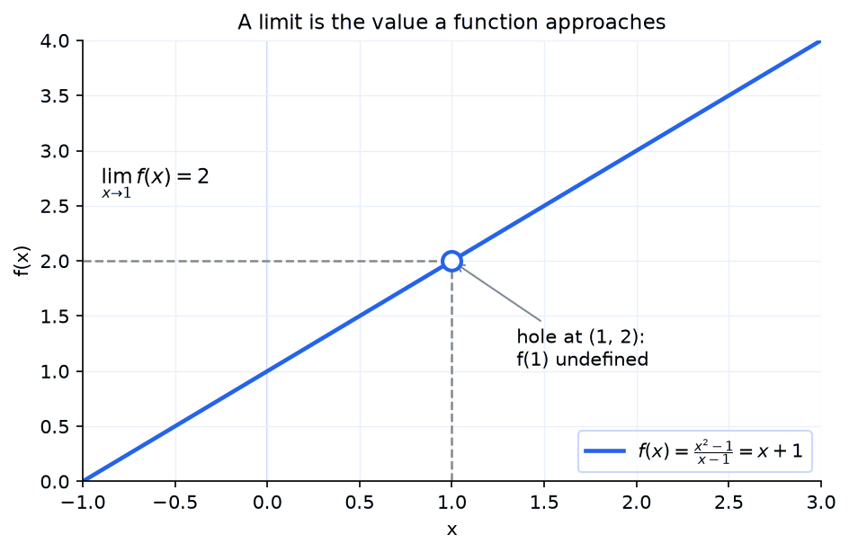

### Limit Notation

We write:

$$
\lim_{x \to a} f(x) = L
$$

This reads: "the limit of $f(x)$ as $x$ approaches $a$ equals $L$." It means that as $x$ gets closer and closer to $a$ (from either side), $f(x)$ gets closer and closer to $L$.

For the example above: $\lim_{x \to 1} \frac{x^2 - 1}{x - 1} = 2$.

We can verify this by factoring: $\frac{x^2 - 1}{x - 1} = \frac{(x-1)(x+1)}{x-1} = x + 1$ (when $x \neq 1$). So as $x \to 1$, this approaches $1 + 1 = 2$.

### One-Sided Limits

Sometimes a function approaches different values from the left and right. The **left-hand limit** uses values less than $a$:

$$
\lim_{x \to a^-} f(x)
$$

The **right-hand limit** uses values greater than $a$:

$$
\lim_{x \to a^+} f(x)
$$

The overall limit $\lim_{x \to a} f(x)$ exists only if both one-sided limits exist and are equal.

**Example:** The function $f(x) = \frac{|x|}{x}$ equals $-1$ for negative $x$ and $+1$ for positive $x$. So $\lim_{x \to 0^-} f(x) = -1$ and $\lim_{x \to 0^+} f(x) = 1$. Since these differ, $\lim_{x \to 0} f(x)$ does not exist.

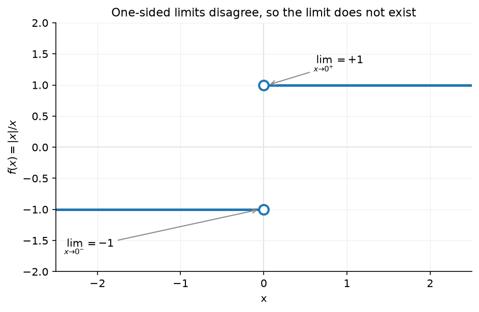

### Infinite Limits (Vertical Asymptotes)

Sometimes a function does not approach a finite number; instead it grows without bound. We write:

$$
\lim_{x \to a} f(x) = \infty \quad \text{or} \quad \lim_{x \to a} f(x) = -\infty
$$

Here $\infty$ (read "infinity") is the symbol for unbounded growth. Technically, these limits "do not exist" (infinity is not a real number), but writing $= \infty$ communicates that the function blows up in a specific direction.

**Example:** $f(x) = \frac{1}{x^2}$ near $x = 0$:

$$
\lim_{x \to 0} \frac{1}{x^2} = \infty
$$

As $x$ gets close to 0 from either side, $x^2$ gets tiny and positive, so $1/x^2$ gets huge. The graph shoots upward. The line $x = 0$ is a **vertical asymptote**.

**Example where the two sides disagree:** $f(x) = \frac{1}{x}$ near $x = 0$:

$$
\lim_{x \to 0^+} \frac{1}{x} = +\infty \quad \text{and} \quad \lim_{x \to 0^-} \frac{1}{x} = -\infty
$$

From the right, $x$ is small and positive, so $1/x$ is large and positive. From the left, $x$ is small and negative, so $1/x$ is large and negative. The function goes to $+\infty$ on one side and $-\infty$ on the other. This is why the graph of $1/x$ has two separate branches.

### When a Limit Does Not Exist

A limit fails to exist in three situations:

**1. Left and right limits disagree** (jump discontinuity):

$$
\lim_{x \to 0} \frac{|x|}{x} \text{ does not exist because left limit} = -1 \neq 1 = \text{right limit}
$$

**2. Function blows up to infinity** (vertical asymptote):

$$
\lim_{x \to 0} \frac{1}{x} \text{ does not exist (goes to } +\infty \text{ from right, } -\infty \text{ from left)}
$$

**3. Function oscillates without settling** (oscillation):

Consider $f(x) = \sin(1/x)$ near $x = 0$. As $x$ gets closer to 0, $1/x$ gets larger and the sine oscillates faster and faster between -1 and 1, never settling on any value. The limit does not exist because the function never approaches a single number.

### Limit Laws

If $\lim_{x \to a} f(x) = L$ and $\lim_{x \to a} g(x) = M$ (both limits exist and are finite), then:

| Law | Formula |
|---|---|
| **Sum** | $\lim_{x \to a} [f(x) + g(x)] = L + M$ |
| **Difference** | $\lim_{x \to a} [f(x) - g(x)] = L - M$ |
| **Constant multiple** | $\lim_{x \to a} [c \cdot f(x)] = c \cdot L$ |
| **Product** | $\lim_{x \to a} [f(x) \cdot g(x)] = L \cdot M$ |
| **Quotient** | $\lim_{x \to a} \frac{f(x)}{g(x)} = \frac{L}{M}$, provided $M \neq 0$ |
| **Power** | $\lim_{x \to a} [f(x)]^n = L^n$ |
| **Root** | $\lim_{x \to a} \sqrt[n]{f(x)} = \sqrt[n]{L}$, provided $L \geq 0$ for even $n$ |

These laws formalize why direct substitution works for most functions: if a function is built from simpler pieces using addition, multiplication, etc., you can compute the limit of each piece separately and combine the results.

### Limits at Infinity

What happens to a function as $x$ grows without bound? This connects to the [end behavior of rational functions](./rational-functions) you have already studied.

$$
\lim_{x \to \infty} \frac{1}{x} = 0
$$

As $x$ gets larger and larger, $\frac{1}{x}$ gets closer and closer to 0. The line $y = 0$ is a **horizontal asymptote**.

For rational functions, the rule you already know still applies:

- If the degree of the numerator is less than the denominator, the limit at infinity is 0.
- If the degrees are equal, the limit is the ratio of leading coefficients.
- If the numerator's degree is greater, the limit is $\pm\infty$ (no horizontal asymptote).

### Computing Limits

**Direct substitution:** Try plugging in $a$. If you get a real number, that is the limit.

$$
\lim_{x \to 3} (x^2 + 1) = 9 + 1 = 10
$$

**Factoring:** If direct substitution gives $\frac{0}{0}$, factor and cancel:

$$
\lim_{x \to 2} \frac{x^2 - 4}{x - 2} = \lim_{x \to 2} \frac{(x-2)(x+2)}{x-2} = \lim_{x \to 2} (x + 2) = 4
$$

**Rationalizing:** For expressions with square roots, multiply by the conjugate:

$$
\lim_{x \to 0} \frac{\sqrt{x + 4} - 2}{x} = \lim_{x \to 0} \frac{(\sqrt{x+4} - 2)(\sqrt{x+4} + 2)}{x(\sqrt{x+4} + 2)} = \lim_{x \to 0} \frac{x + 4 - 4}{x(\sqrt{x+4} + 2)} = \lim_{x \to 0} \frac{1}{\sqrt{x+4} + 2} = \frac{1}{4}
$$

### Limits of Piecewise Functions

For piecewise functions, evaluate the limit from each side using the piece that applies on that side.

**Example:**

$$
f(x) = \begin{cases} x + 1 & \text{if } x < 2 \\ 5 & \text{if } x = 2 \\ x^2 & \text{if } x > 2 \end{cases}
$$

- $\lim_{x \to 2^-} f(x) = 2 + 1 = 3$ (use the $x + 1$ piece)
- $\lim_{x \to 2^+} f(x) = 2^2 = 4$ (use the $x^2$ piece)
- Since $3 \neq 4$, $\lim_{x \to 2} f(x)$ does not exist

Note that $f(2) = 5$, but neither one-sided limit equals 5. The function value at a point and the limit at that point are independent concepts.

### Important Trigonometric Limits

Two limits involving trigonometric functions come up repeatedly in calculus. They are needed to derive the derivatives of sine and cosine.

$$
\lim_{x \to 0} \frac{\sin x}{x} = 1
$$

This says that for small angles (in radians), $\sin x \approx x$. You cannot prove this by plugging in ($\frac{\sin 0}{0} = \frac{0}{0}$). It requires a geometric argument using the unit circle, or the squeeze theorem (below).

$$
\lim_{x \to 0} \frac{1 - \cos x}{x} = 0
$$

This says that $\cos x \approx 1$ for small $x$ (the cosine curve is flat near $x = 0$).

**Example:** Evaluate $\lim_{x \to 0} \frac{\sin(3x)}{x}$.

Rewrite to match the known limit: $\frac{\sin(3x)}{x} = 3 \cdot \frac{\sin(3x)}{3x}$. As $x \to 0$, $3x \to 0$, so $\frac{\sin(3x)}{3x} \to 1$. The answer is $3 \cdot 1 = 3$.

### The Squeeze Theorem

**Squeeze Theorem (Sandwich Theorem):** If $g(x) \leq f(x) \leq h(x)$ for all $x$ near $a$ (except possibly at $a$ itself), and:

$$
\lim_{x \to a} g(x) = \lim_{x \to a} h(x) = L
$$

then $\lim_{x \to a} f(x) = L$ as well.

The intuition: if $f$ is trapped between two functions that both approach $L$, then $f$ has no choice but to approach $L$ too.

**Example:** Show that $\lim_{x \to 0} x^2 \sin(1/x) = 0$.

We cannot compute this limit by direct substitution because $\sin(1/x)$ oscillates wildly near 0. But we know $-1 \leq \sin(1/x) \leq 1$, so:

$$
-x^2 \leq x^2 \sin(1/x) \leq x^2
$$

Both $-x^2$ and $x^2$ approach 0 as $x \to 0$. By the squeeze theorem, $x^2 \sin(1/x) \to 0$.

This is noteworthy because $\sin(1/x)$ alone has no limit at 0 (it oscillates forever), but multiplying by $x^2$ "squeezes" the oscillation down to nothing.

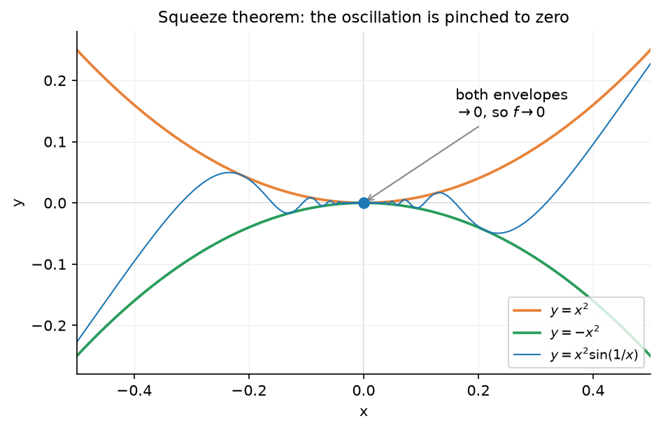

### Indeterminate Forms

When direct substitution gives $\frac{0}{0}$ or $\frac{\infty}{\infty}$, the result is called an **indeterminate form**. The limit might be any number (or might not exist). You need algebraic manipulation (or L'Hopital's rule, below) to find the actual limit.

The seven indeterminate forms:

| Form | Example | Why it is indeterminate |
|---|---|---|
| $\frac{0}{0}$ | $\lim_{x \to 1} \frac{x^2-1}{x-1}$ | Could be any number (this one is 2) |
| $\frac{\infty}{\infty}$ | $\lim_{x \to \infty} \frac{x^2}{e^x}$ | Depends on which grows faster (this one is 0) |
| $0 \cdot \infty$ | $\lim_{x \to 0^+} x \ln x$ | Rewrite as $\frac{0}{0}$ or $\frac{\infty}{\infty}$ to evaluate |
| $\infty - \infty$ | $\lim_{x \to \infty} (x - \sqrt{x^2+1})$ | Could be any number |
| $0^0$ | $\lim_{x \to 0^+} x^x$ | This one is 1, but other $0^0$ forms can differ |
| $1^\infty$ | $\lim_{x \to \infty} (1 + 1/x)^x$ | This one is $e$ |
| $\infty^0$ | $\lim_{x \to \infty} x^{1/x}$ | This one is 1 |

**Not indeterminate** (these always have the same answer):

| Form | Result | Why |
|---|---|---|
| $\frac{k}{0}$ (where $k \neq 0$) | $\pm \infty$ or DNE | Nonzero divided by tiny = huge |
| $0^{+\infty}$ | $0$ | Base approaching $0$ from above ($0^+$) raised to $+\infty$ = 0 |
| $\infty \cdot \infty$ | $\infty$ | Both factors are huge |

### L'Hopital's Rule (Preview)

This rule requires derivatives, which we define in the next section. But the idea is simple: if $\lim_{x \to a} \frac{f(x)}{g(x)}$ gives $\frac{0}{0}$ or $\frac{\infty}{\infty}$, then:

$$
\lim_{x \to a} \frac{f(x)}{g(x)} = \lim_{x \to a} \frac{f'(x)}{g'(x)}
$$

Replace the numerator and denominator with their derivatives, then try the limit again. We will use this after learning what $f'(x)$ means.

### Continuity

A function is **continuous** at a point $a$ if three things hold:

1. $f(a)$ is defined
2. $\lim_{x \to a} f(x)$ exists
3. $\lim_{x \to a} f(x) = f(a)$

In plain language: you can draw the graph through that point without lifting your pen. Polynomials, exponentials, and sine/cosine are continuous everywhere. Rational functions are continuous everywhere except where the denominator is zero.

**Why continuity matters:** Most theorems in calculus require the function to be continuous. For optimization, continuity guarantees that a continuous function on a closed interval actually achieves its maximum and minimum values (the Extreme Value Theorem).

### Types of Discontinuities

When a function fails to be continuous at a point, the nature of the failure falls into one of four categories. Understanding these types clarifies what "not continuous" really means.

**1. Removable discontinuity (hole):** The limit $\lim_{x \to a} f(x)$ exists, but $f(a)$ is either undefined or does not equal the limit. The graph has a "hole" at that point.

**Example:** $f(x) = \frac{x^2 - 1}{x - 1}$. At $x = 1$, the function is undefined ($\frac{0}{0}$). But $\lim_{x \to 1} f(x) = \lim_{x \to 1} \frac{(x-1)(x+1)}{x-1} = \lim_{x \to 1} (x+1) = 2$. The limit exists; the function simply has a hole at $(1, 2)$.

This is called "removable" because you can fix it by defining (or redefining) $f(1) = 2$. The resulting function would be continuous.

**2. Jump discontinuity:** Both one-sided limits $\lim_{x \to a^-} f(x)$ and $\lim_{x \to a^+} f(x)$ exist, but they are not equal. The graph "jumps" from one value to another.

**Example:** The floor function $\lfloor x \rfloor$ (which rounds down to the nearest integer) has jump discontinuities at every integer. At $x = 2$: $\lim_{x \to 2^-} \lfloor x \rfloor = 1$ and $\lim_{x \to 2^+} \lfloor x \rfloor = 2$. The function jumps from 1 to 2.

The $\frac{|x|}{x}$ example from earlier is also a jump discontinuity at $x = 0$: the function jumps from $-1$ to $+1$.

**3. Infinite discontinuity:** The function approaches $\pm\infty$ from at least one side. The graph has a vertical asymptote.

**Example:** $f(x) = \frac{1}{x}$ at $x = 0$. As $x \to 0^+$, $f(x) \to +\infty$, and as $x \to 0^-$, $f(x) \to -\infty$. The function blows up rather than approaching a finite value.

**4. Oscillating discontinuity:** The function oscillates too wildly to approach any value, finite or infinite. No limit exists.

**Example:** $f(x) = \sin(1/x)$ at $x = 0$. As $x \to 0$, $1/x$ grows without bound, and $\sin(1/x)$ oscillates between $-1$ and $1$ infinitely many times. The function never settles on any value.

**Which discontinuities can be "fixed"?** Only removable discontinuities can be repaired by redefining $f(a)$ to equal the limit. Jump, infinite, and oscillating discontinuities are inherent to the function's behavior and cannot be removed by changing the value at a single point.

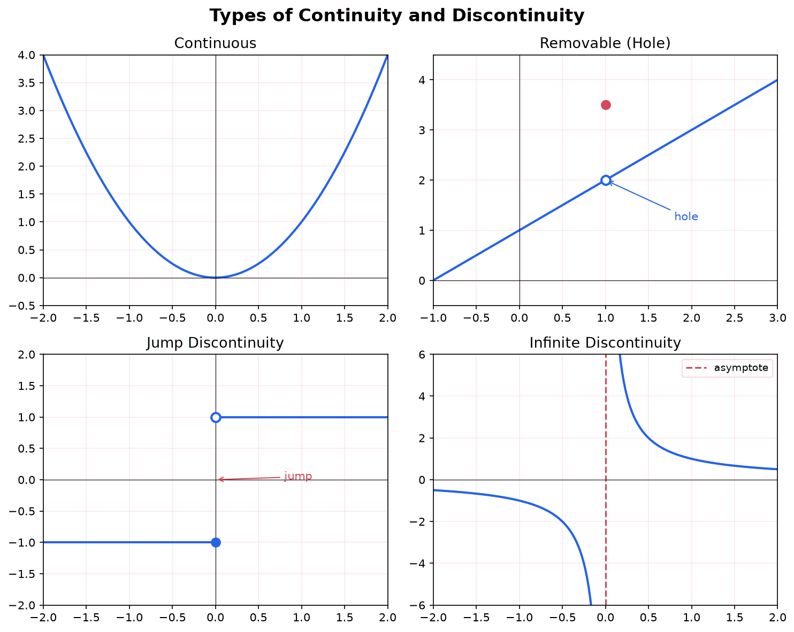

### Intermediate Value Theorem

The **Intermediate Value Theorem (IVT)** formalizes an intuitive property of continuous functions: they cannot "skip over" values.

**Statement:** If $f$ is continuous on the closed interval $[a,b]$ and $N$ is any number between $f(a)$ and $f(b)$, then there exists at least one $c \in (a,b)$ such that $f(c) = N$.

**Intuition:** If you start below sea level and end up above sea level, and you walk continuously (no teleporting), then at some point you must be exactly at sea level. A continuous function that starts at one value and ends at another must hit every value in between.

**Example:** Prove that $x^3 - x - 1 = 0$ has a solution between $x = 1$ and $x = 2$.

Let $f(x) = x^3 - x - 1$. This is a polynomial, so it is continuous everywhere.

- $f(1) = 1 - 1 - 1 = -1 < 0$
- $f(2) = 8 - 2 - 1 = 5 > 0$

Since $f$ is continuous on $[1,2]$, $f(1) < 0$, and $f(2) > 0$, the IVT guarantees there exists a $c \in (1,2)$ with $f(c) = 0$. That $c$ is a root of the equation.

**Connection to computing:** The IVT is the theoretical foundation of the **bisection method** for finding roots numerically. The algorithm repeatedly cuts the interval in half, checking the sign of $f$ at the midpoint to determine which half contains the root. Each step halves the interval, guaranteeing convergence. This is one of the simplest and most reliable root-finding algorithms in numerical computing.

![Intermediate Value Theorem for f of x equals x cubed minus x minus 1 on the interval from 1 to 2. The curve starts at the point (1, negative 1), which is below the horizontal axis, and ends at the point (2, 5), which is above it. A dashed green line marks the target value N equals zero. Because the continuous curve starts below zero and ends above zero, it must cross the zero line at some interior point c, marked in purple at approximately x equals 1.325, where f of c equals zero, a guaranteed root.](./media/calc-ivt.png)

---

## Derivatives

### The Big Idea

A **derivative** measures how fast a function's output changes as its input changes. If you are driving and your position is a function of time, the derivative of position is your speed. If your speed is changing, the derivative of speed is your acceleration.

In machine learning, the derivative tells you: "if I nudge this parameter slightly, how much does the loss change?" That information is exactly what you need to improve the model.

### From Average to Instantaneous Rate of Change

You already know how to compute the slope of a line between two points (from [linear functions](./linear-functions)). Given two points on a curve, the slope of the line connecting them is the **average rate of change**:

$$
\text{average rate of change} = \frac{f(b) - f(a)}{b - a}
$$

This line connecting two points on the curve is called a **secant line**. Now imagine sliding $b$ closer and closer to $a$. The secant line rotates and approaches a line that just touches the curve at the single point $a$. This limiting line is the **tangent line**, and its slope is the **instantaneous rate of change**, which is the derivative.

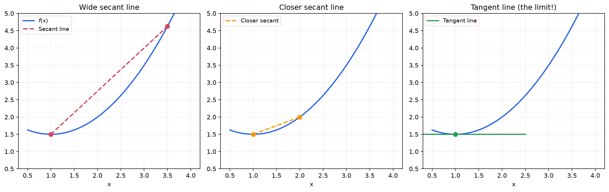

Explore this limit directly below. Drag the point along the curve to see the tangent line and its slope $f'(x)$; switch to secant mode and shrink $h$ to watch the secant slope converge to the derivative.

<iframe src="/static/interactive/calc-tangent-explorer.html" width="100%" height="620" style="border:none;"></iframe>

### The Limit Definition of the Derivative

The derivative of $f$ at the point $x$, written $f'(x)$ (read "f prime of x"), is:

$$
f'(x) = \lim_{h \to 0} \frac{f(x + h) - f(x)}{h}
$$

Here, $h$ is the tiny gap between $x$ and the nearby point $x + h$. The fraction $\frac{f(x+h) - f(x)}{h}$ is the slope of the secant line. As $h$ shrinks toward 0, this slope approaches the slope of the tangent line.

**Worked example:** Find the derivative of $f(x) = x^2$.

$$
f'(x) = \lim_{h \to 0} \frac{(x+h)^2 - x^2}{h} = \lim_{h \to 0} \frac{x^2 + 2xh + h^2 - x^2}{h} = \lim_{h \to 0} \frac{2xh + h^2}{h} = \lim_{h \to 0} (2x + h) = 2x
$$

So the derivative of $x^2$ is $2x$. At $x = 3$, the slope of the tangent line is $2(3) = 6$. This means that near $x = 3$, a tiny increase in $x$ produces about 6 times as much increase in $x^2$.

### Differentiability

A function is **differentiable** at $a$ if the derivative $f'(a)$ exists, meaning the limit in the definition above produces a finite value. Differentiability is a stronger condition than continuity.

**Differentiable implies continuous:** If $f$ is differentiable at $a$, then $f$ is continuous at $a$. The converse is false: a function can be continuous at a point without being differentiable there.

There are four ways a function can be continuous but NOT differentiable at a point:

**1. Corner:** The function $f(x) = |x|$ is continuous at $x = 0$ (no break in the graph), but the graph has a sharp corner there. The one-sided slopes are finite but disagree: the slope from the left is $-1$ and the slope from the right is $+1$. Since these disagree, the derivative does not exist.

**Worked example:** Show $f(x) = |x|$ is not differentiable at $x = 0$ using the limit definition.

$$
f'(0) = \lim_{h \to 0} \frac{|0 + h| - |0|}{h} = \lim_{h \to 0} \frac{|h|}{h}
$$

From the right ($h > 0$): $\frac{|h|}{h} = \frac{h}{h} = 1$.

From the left ($h < 0$): $\frac{|h|}{h} = \frac{-h}{h} = -1$.

The left-hand and right-hand limits disagree ($1 \neq -1$), so the limit does not exist and $f$ is not differentiable at $x = 0$.

**2. Cusp:** A cusp differs from a corner in that the one-sided slopes are not finite: they diverge to $+\infty$ and $-\infty$. The function $f(x) = x^{2/3}$ is continuous at $x = 0$, but its difference quotient blows up. Using the limit definition:

$$
f'(0) = \lim_{h \to 0} \frac{h^{2/3} - 0}{h} = \lim_{h \to 0} \frac{1}{h^{1/3}}
$$

From the right ($h > 0$) this tends to $+\infty$, and from the left ($h < 0$) it tends to $-\infty$. The two sides pull apart to opposite infinities, tracing the characteristic sharp point, so the derivative does not exist.

**3. Vertical tangent:** The function $f(x) = x^{1/3}$ (the cube root) is continuous at $x = 0$, but its tangent line there is vertical (infinite slope). Using the limit definition:

$$
f'(0) = \lim_{h \to 0} \frac{h^{1/3}}{h} = \lim_{h \to 0} \frac{1}{h^{2/3}} = \infty
$$

The limit is infinite, not a finite number, so the derivative does not exist.

**4. Oscillation:** The function $f(x) = x\sin(1/x)$ (with $f(0) = 0$) is continuous at $x = 0$ (by the squeeze theorem, since $|x\sin(1/x)| \leq |x| \to 0$). However, the difference quotient $\frac{f(h) - f(0)}{h} = \sin(1/h)$ oscillates between $-1$ and $1$ as $h \to 0$, so the derivative does not exist.

In machine learning, non-differentiable points arise with activation functions like ReLU ($f(x) = \max(0, x)$), which has a corner at $x = 0$. In practice, the derivative is defined to be 0 or 1 at the corner, and this works well because a single point does not affect training.

### Derivative Notation

Several notations all mean the same thing:

| Notation | Name | Read as |
|----------|------|---------|
| $f'(x)$ | Lagrange notation | "f prime of x" |
| $\frac{dy}{dx}$ | Leibniz notation | "dy dx" or "the derivative of y with respect to x" |
| $\frac{d}{dx}[f(x)]$ | Operator notation | "d dx of f of x" |
| $Df(x)$ | Euler notation | "D f of x" |

Leibniz notation ($\frac{dy}{dx}$) is especially useful because it reminds you what variable you are differentiating with respect to, and it behaves nicely in the chain rule.

### Basic Derivative Rules

Instead of using the limit definition every time, we use rules:

**Constant rule:** The derivative of a constant is zero.

$$
\frac{d}{dx}[c] = 0
$$

A constant does not change, so its rate of change is zero.

**Power rule:** For any real number $n$:

$$
\frac{d}{dx}[x^n] = n x^{n-1}
$$

Bring the exponent down as a coefficient, then reduce the exponent by 1.

| Function | Derivative |
|----------|-----------|
| $x^2$ | $2x$ |
| $x^3$ | $3x^2$ |
| $x^{10}$ | $10x^9$ |
| $x^{1/2} = \sqrt{x}$ | $\frac{1}{2}x^{-1/2} = \frac{1}{2\sqrt{x}}$ |
| $x^{-1} = \frac{1}{x}$ | $-x^{-2} = -\frac{1}{x^2}$ |

**Constant multiple rule:** Constants factor out.

$$
\frac{d}{dx}[c \cdot f(x)] = c \cdot f'(x)
$$

**Sum/difference rule:** Differentiate term by term.

$$
\frac{d}{dx}[f(x) \pm g(x)] = f'(x) \pm g'(x)
$$

**Worked example:** Find $\frac{d}{dx}[3x^4 - 5x^2 + 7x - 2]$.

$$
= 3(4x^3) - 5(2x) + 7(1) - 0 = 12x^3 - 10x + 7
$$

### Product Rule

When two functions are multiplied together:

$$
\frac{d}{dx}[f(x) \cdot g(x)] = f'(x) \cdot g(x) + f(x) \cdot g'(x)
$$

The derivative of a product is not the product of the derivatives. You must use this rule.

**Worked example:** Find the derivative of $x^2 \sin(x)$. Label the two factors and their derivatives, then drop them into the formula:

- $f(x) = x^2$, so $f'(x) = 2x$;
- $g(x) = \sin x$, so $g'(x) = \cos x$.

Then $(fg)' = f'g + fg'$ gives

$$
\frac{d}{dx}[x^2 \sin x] = \underbrace{2x}_{f'} \cdot \underbrace{\sin x}_{g} + \underbrace{x^2}_{f} \cdot \underbrace{\cos x}_{g'} = 2x \sin x + x^2 \cos x.
$$

**Worked example (product rule with a chain rule inside):** Find the derivative of $x^2 \sin(3x)$. The setup is the same, but now the factor $g(x) = \sin(3x)$ itself needs the [chain rule](#the-chain-rule) to differentiate: $g'(x) = \cos(3x) \cdot 3 = 3\cos(3x)$. With $f = x^2$ and $f' = 2x$,

$$
\frac{d}{dx}[x^2 \sin(3x)] = 2x \sin(3x) + x^2 \cdot 3\cos(3x) = 2x \sin(3x) + 3x^2 \cos(3x).
$$

The product and chain rules routinely nest like this; keep them straight by differentiating each factor on its own (with whatever rule *that* factor needs) before assembling the product-rule sum.

### Quotient Rule

For a fraction of two functions:

$$
\frac{d}{dx}\left[\frac{f(x)}{g(x)}\right] = \frac{f'(x) \cdot g(x) - f(x) \cdot g'(x)}{[g(x)]^2}
$$

A common mnemonic: "low d-high minus high d-low, over the square of what's below."

**Worked example:** Find the derivative of $\frac{x^2}{x + 1}$. Label numerator and denominator (the mnemonic's "high" and "low"):

- $f(x) = x^2$ (high), so $f'(x) = 2x$;
- $g(x) = x + 1$ (low), so $g'(x) = 1$.

The rule $\dfrac{f'g - fg'}{g^2}$ ("low d-high minus high d-low, over low squared") gives

$$
\frac{d}{dx}\left[\frac{x^2}{x+1}\right] = \frac{\overbrace{2x}^{f'}(x+1) - \overbrace{x^2}^{f}(1)}{(x+1)^2} = \frac{2x^2 + 2x - x^2}{(x+1)^2} = \frac{x^2 + 2x}{(x+1)^2} = \frac{x(x+2)}{(x+1)^2}.
$$

The order in the numerator matters: it is $f'g - fg'$, **not** $fg' - f'g$, so unlike the product rule the quotient rule is *not* symmetric in $f$ and $g$ (swapping them flips the sign). As a sanity check, the factored numerator $x(x+2)$ is negative exactly for $-2 < x < 0$, so the function is decreasing on that interval and increasing outside it, which is just what the graph of $x^2/(x+1)$ does.

### The Chain Rule

The chain rule is arguably the single most important rule in calculus for machine learning. **Backpropagation, the algorithm that trains neural networks, is the chain rule applied repeatedly.**

**The problem:** How do you differentiate a composite function, that is, a function inside another function? For example, what is the derivative of $(3x + 1)^5$? You cannot just use the power rule because the thing being raised to the 5th power is not $x$; it is $3x + 1$.

**The idea:** If $y = f(g(x))$, think of it as a chain of operations. First $g$ transforms $x$ into an intermediate value $u = g(x)$. Then $f$ transforms $u$ into the final output $y = f(u)$. The rate at which $y$ changes with $x$ is the rate at which $y$ changes with $u$, multiplied by the rate at which $u$ changes with $x$:

$$
\frac{dy}{dx} = \frac{dy}{du} \cdot \frac{du}{dx}
$$

Or equivalently:

$$
[f(g(x))]' = f'(g(x)) \cdot g'(x)
$$

In words: differentiate the outer function (leaving the inner function alone), then multiply by the derivative of the inner function.

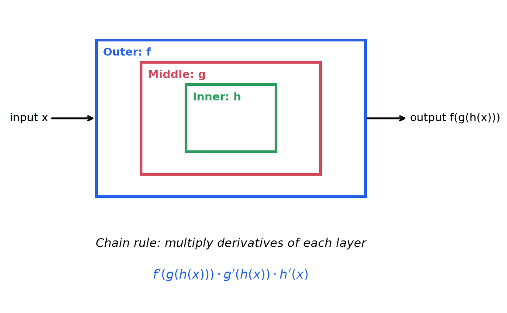

**Worked example 1:** Find $\frac{d}{dx}[(3x + 1)^5]$.

- Outer function: $u^5$, derivative: $5u^4$
- Inner function: $3x + 1$, derivative: $3$
- Chain rule: $5(3x + 1)^4 \cdot 3 = 15(3x + 1)^4$

**Worked example 2:** Find $\frac{d}{dx}[e^{x^2}]$.

- Outer function: $e^u$, derivative: $e^u$
- Inner function: $x^2$, derivative: $2x$
- Chain rule: $e^{x^2} \cdot 2x = 2x \, e^{x^2}$

**Worked example 3 (triple chain):** Find $\frac{d}{dx}[\sin(e^{3x})]$.

Think of this as three nested layers: $\sin(\cdot)$ wrapping $e^{(\cdot)}$ wrapping $3x$.

- Outermost derivative: $\cos(e^{3x})$
- Middle derivative: $e^{3x}$
- Innermost derivative: $3$
- Result: $\cos(e^{3x}) \cdot e^{3x} \cdot 3 = 3e^{3x}\cos(e^{3x})$

**Why this is backpropagation:** A neural network computes $y = f_n(f_{n-1}(\ldots f_2(f_1(x))\ldots))$, where each $f_i$ is a layer. To find how changing a weight in layer $k$ affects the output, you multiply the derivatives of all layers from $k$ to $n$. This chain of multiplications is exactly the chain rule, applied backward from output to input. That is backpropagation.

### Derivatives of Exponential Functions

The function $e^x$ is special because it is its own derivative:

$$
\frac{d}{dx}[e^x] = e^x
$$

This is one reason $e$ appears everywhere in mathematics. For a general base:

$$
\frac{d}{dx}[a^x] = a^x \ln(a)
$$

Using the chain rule: $\frac{d}{dx}[e^{kx}] = ke^{kx}$.

### Derivatives of Logarithmic Functions

$$
\frac{d}{dx}[\ln x] = \frac{1}{x}
$$

$$
\frac{d}{dx}[\log_a x] = \frac{1}{x \ln a}
$$

**Worked example:** $\frac{d}{dx}[\ln(x^2 + 1)] = \frac{1}{x^2 + 1} \cdot 2x = \frac{2x}{x^2 + 1}$ (chain rule).

### Derivatives of Trigonometric Functions

$$
\frac{d}{dx}[\sin x] = \cos x \qquad \frac{d}{dx}[\cos x] = -\sin x \qquad \frac{d}{dx}[\tan x] = \sec^2 x
$$

Note the negative sign on cosine. The derivatives of sine and cosine cycle: $\sin \to \cos \to -\sin \to -\cos \to \sin \to \ldots$

The remaining three trigonometric derivatives are:

$$
\frac{d}{dx}[\cot x] = -\csc^2 x \qquad \frac{d}{dx}[\sec x] = \sec x \tan x \qquad \frac{d}{dx}[\csc x] = -\csc x \cot x
$$

These can be derived using the quotient rule. For example, $\sec x = \frac{1}{\cos x}$, so by the quotient rule:

$$
\frac{d}{dx}[\sec x] = \frac{0 \cdot \cos x - 1 \cdot (-\sin x)}{\cos^2 x} = \frac{\sin x}{\cos^2 x} = \frac{1}{\cos x} \cdot \frac{\sin x}{\cos x} = \sec x \tan x
$$

**Complete table of trigonometric derivatives:**

| Function | Derivative |
|----------|-----------|
| $\sin x$ | $\cos x$ |
| $\cos x$ | $-\sin x$ |
| $\tan x$ | $\sec^2 x$ |
| $\cot x$ | $-\csc^2 x$ |
| $\sec x$ | $\sec x \tan x$ |
| $\csc x$ | $-\csc x \cot x$ |

Notice a pattern: the "co-" functions (cosine, cotangent, cosecant) all have negative signs in their derivatives.

### Derivatives of Inverse Trigonometric Functions

The inverse trigonometric functions arise naturally when solving for angles, and their derivatives appear frequently as integration results.

$$
\frac{d}{dx}[\arcsin x] = \frac{1}{\sqrt{1-x^2}} \qquad \frac{d}{dx}[\arccos x] = -\frac{1}{\sqrt{1-x^2}} \qquad \frac{d}{dx}[\arctan x] = \frac{1}{1+x^2}
$$

The remaining three:

$$
\frac{d}{dx}[\text{arccot}\, x] = -\frac{1}{1+x^2} \qquad \frac{d}{dx}[\text{arcsec}\, x] = \frac{1}{|x|\sqrt{x^2-1}} \qquad \frac{d}{dx}[\text{arccsc}\, x] = -\frac{1}{|x|\sqrt{x^2-1}}
$$

These derivatives are derived using implicit differentiation. For example, if $y = \arcsin x$, then $\sin y = x$. Differentiating both sides: $\cos y \cdot y' = 1$, so $y' = \frac{1}{\cos y} = \frac{1}{\sqrt{1 - \sin^2 y}} = \frac{1}{\sqrt{1 - x^2}}$.

**Why these matter for integration:** Knowing these derivatives in reverse means we can integrate certain expressions. For instance, $\int \frac{1}{1+x^2} \, dx = \arctan x + C$ and $\int \frac{1}{\sqrt{1-x^2}} \, dx = \arcsin x + C$. These integrals appear often enough to be listed in standard integral tables.

### Higher-Order Derivatives

The derivative of the derivative is the **second derivative**, written $f''(x)$ or $\frac{d^2y}{dx^2}$.

- If $f(x)$ is position, $f'(x)$ is velocity, and $f''(x)$ is acceleration.
- The second derivative tells you about **concavity**: whether the function curves upward ($f'' > 0$, concave up) or downward ($f'' < 0$, concave down).

**Example:** $f(x) = x^3 - 3x$, so $f'(x) = 3x^2 - 3$ and $f''(x) = 6x$.

At $x = 1$: $f''(1) = 6 > 0$, so the curve is concave up (bowl-shaped) there.

At $x = -1$: $f''(-1) = -6 < 0$, so the curve is concave down (hill-shaped) there.

### Implicit Differentiation

Sometimes you cannot solve for $y$ explicitly. For example, $x^2 + y^2 = 25$ defines a circle, but $y$ is not a single function of $x$ (each $x$ strictly between $-5$ and $5$ has two $y$-values, one on the top half and one on the bottom). You can still find $\frac{dy}{dx}$ by differentiating both sides with respect to $x$, treating $y$ as an unknown function of $x$ and applying the **chain rule** every time you differentiate a $y$ term.

The step people trip on is $\frac{d}{dx}(y^2)$. Since $y$ is itself a function of $x$, this is a *composite*, and the chain rule gives

$$
\frac{d}{dx}(y^2) = 2y \cdot \frac{dy}{dx},
$$

the outer square differentiating to $2y$, times the derivative of the inside, $\frac{dy}{dx}$. It is $2y \, y'$, **not** just $2y$; forgetting that $\frac{dy}{dx}$ factor is the classic mistake. Now differentiate the circle term by term:

$$
\frac{d}{dx}(x^2) + \frac{d}{dx}(y^2) = \frac{d}{dx}(25) \implies 2x + 2y\frac{dy}{dx} = 0 \implies \frac{dy}{dx} = -\frac{x}{y}.
$$

The slope depends on *both* coordinates, as it must, since a given $x$ can lie on the upper or lower semicircle. At the point $(3, 4)$ on the circle, $\frac{dy}{dx} = -\frac{3}{4}$: a gentle downward tangent. Sanity check: the radius to $(3, 4)$ has slope $\frac{4}{3}$, and the tangent slope $-\frac{3}{4}$ is its negative reciprocal, so the tangent is perpendicular to the radius, exactly as a circle's tangent should be. At the mirror point $(3, -4)$ the slope flips to $-\frac{3}{-4} = +\frac{3}{4}$.

### Logarithmic Differentiation

Some functions are extremely difficult to differentiate using the standard rules. **Logarithmic differentiation** simplifies them by taking the natural logarithm of both sides before differentiating.

**Technique:**
1. Start with $y = f(x)$.
2. Take $\ln$ of both sides: $\ln y = \ln f(x)$.
3. Simplify the right side using logarithm properties.
4. Differentiate both sides implicitly (the left side becomes $\frac{y'}{y}$).
5. Solve for $y'$ and substitute back.

**When to use it:**
- Variables appear in both the base and the exponent (like $x^x$).
- The function is a complicated product or quotient of many terms.

**Worked example 1:** Find the derivative of $y = x^x$ (for $x > 0$).

The power rule does not apply (the exponent is not constant). The exponential rule does not apply (the base is not constant). Take logarithms:

$$
\ln y = x \ln x
$$

Differentiate both sides with respect to $x$:

$$
\frac{y'}{y} = \ln x + x \cdot \frac{1}{x} = \ln x + 1
$$

Solve for $y'$:

$$
y' = y(\ln x + 1) = x^x(\ln x + 1)
$$

**Worked example 2:** Find the derivative of $y = \frac{x^2 \sqrt{x+1}}{(x-3)^4}$.

Using the quotient and product rules directly would be messy. Instead, take logarithms:

$$
\ln y = 2\ln x + \frac{1}{2}\ln(x+1) - 4\ln(x-3)
$$

Differentiate:

$$
\frac{y'}{y} = \frac{2}{x} + \frac{1}{2(x+1)} - \frac{4}{x-3}
$$

Multiply both sides by $y$:

$$
y' = \frac{x^2\sqrt{x+1}}{(x-3)^4}\left[\frac{2}{x} + \frac{1}{2(x+1)} - \frac{4}{x-3}\right]
$$

This is much cleaner than applying the product and quotient rules directly to the original expression.

---

## Applications of Derivatives

### Finding Maxima and Minima

A function can have a maximum or minimum only where its derivative equals zero (or where the derivative does not exist). These points are called **critical points**.

**First derivative test:** Find where $f'(x) = 0$. Check the sign of $f'$ on either side:

- If $f'$ changes from positive to negative: local maximum
- If $f'$ changes from negative to positive: local minimum
- If $f'$ does not change sign: neither (an inflection point)

**Worked example:** Find the extrema of $f(x) = x^3 - 3x$.

$f'(x) = 3x^2 - 3 = 3(x^2 - 1) = 3(x - 1)(x + 1)$

Critical points: $x = -1$ and $x = 1$.

- For $x < -1$: $f'(x) > 0$ (increasing)
- For $-1 < x < 1$: $f'(x) < 0$ (decreasing)
- For $x > 1$: $f'(x) > 0$ (increasing)

So $x = -1$ is a local maximum ($f(-1) = 2$) and $x = 1$ is a local minimum ($f(1) = -2$).

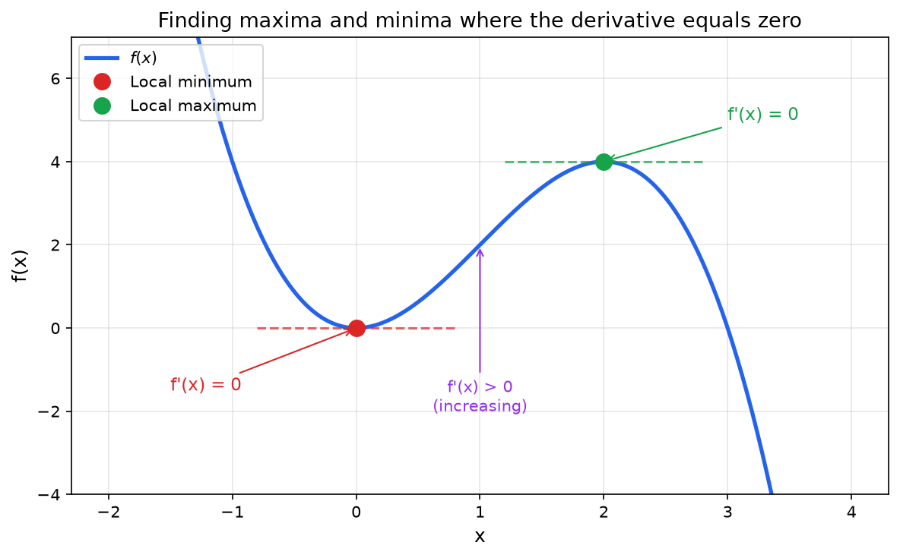

### Concavity and the Second Derivative Test

The **second derivative test** provides a faster way to classify critical points:

- If $f'(c) = 0$ and $f''(c) > 0$: local minimum (concave up, bowl-shaped)
- If $f'(c) = 0$ and $f''(c) < 0$: local maximum (concave down, hill-shaped)
- If $f'(c) = 0$ and $f''(c) = 0$: the test is inconclusive

An **inflection point** is where concavity changes (from concave up to concave down or vice versa). It occurs where $f''(x) = 0$ (and the concavity actually changes).

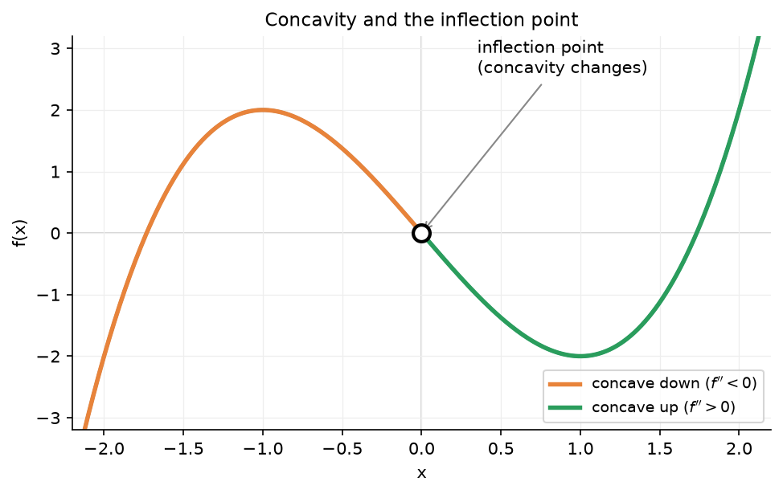

### Optimization

Finding maxima and minima is exactly what optimization is about.

**Example:** A farmer has 100 meters of fencing and wants to enclose the largest possible rectangular area. If the rectangle has width $x$ and length $y$, then $2x + 2y = 100$, so $y = 50 - x$. The area is:

$$
A(x) = x(50 - x) = 50x - x^2
$$

$$
A'(x) = 50 - 2x = 0 \implies x = 25
$$

So the maximum area is $A(25) = 25 \cdot 25 = 625$ square meters. The optimal rectangle is a square.

**Connection to ML:** In machine learning, the "fencing" is replaced by model parameters, and the "area" is replaced by a loss function. Finding the minimum of the loss function uses the same idea: find where the derivative is zero (or use gradient descent to walk toward that point).

### Related Rates

When two quantities are linked by an equation and both change over time, differentiating the equation with respect to time $t$ relates their *rates*. The reliable recipe never varies: **(1)** write the relation between the quantities, **(2)** differentiate both sides with respect to $t$ (every variable is a function of time, so each one picks up the chain rule), and **(3)** substitute the known numbers only at the very end. Plugging numbers in too early is the most common way these problems go wrong.

**Example: an inflating balloon.** A spherical balloon's radius grows at $\frac{dr}{dt} = 2$ cm/s. How fast is the volume growing when $r = 5$ cm?

*Relation:* $V = \frac{4}{3}\pi r^3$. *Differentiate with respect to $t$* (both $V$ and $r$ depend on $t$, so the right side needs the chain rule, $\frac{d}{dt}(r^3) = 3r^2 \frac{dr}{dt}$):

$$
\frac{dV}{dt} = \frac{4}{3}\pi \cdot 3r^2 \frac{dr}{dt} = 4\pi r^2 \frac{dr}{dt}.
$$

*Substitute the knowns last*, $r = 5$ and $\frac{dr}{dt} = 2$:

$$
\frac{dV}{dt} = 4\pi (5)^2 (2) = 200\pi \approx 628 \text{ cm}^3/\text{s}.
$$

The coefficient $4\pi r^2$ is exactly the sphere's surface area, so the volume grows as fast as the surface can push outward, a tidy reasonableness check.

**Example: a sliding ladder.** A 10 ft ladder leans against a wall while its base is pulled away at $\frac{dx}{dt} = 1$ ft/s. How fast is the top sliding *down* when the base is $x = 6$ ft from the wall? Now the relation is an *implicit* one, the Pythagorean constraint $x^2 + y^2 = 10^2$. Differentiating with respect to $t$:

$$
2x\frac{dx}{dt} + 2y\frac{dy}{dt} = 0 \implies \frac{dy}{dt} = -\frac{x}{y}\frac{dx}{dt}.
$$

When $x = 6$, the height is $y = \sqrt{100 - 36} = 8$, so $\frac{dy}{dt} = -\frac{6}{8}(1) = -0.75$ ft/s. The negative sign says the top moves *down* at $0.75$ ft/s, exactly what should happen as the base slides out.

### Linear Approximation

Near a point $a$, a differentiable function is well-approximated by its tangent line:

$$
f(x) \approx f(a) + f'(a)(x - a)
$$

This is the simplest version of a Taylor approximation. It says: start at the known value $f(a)$, then adjust by the slope times how far you moved.

**Example:** Approximate $\sqrt{4.1}$ without a calculator.

Let $f(x) = \sqrt{x}$, $a = 4$. Then $f(4) = 2$, $f'(x) = \frac{1}{2\sqrt{x}}$, $f'(4) = \frac{1}{4}$.

$$
\sqrt{4.1} \approx 2 + \frac{1}{4}(0.1) = 2.025
$$

The actual value is $2.02485...$, so the approximation is quite good.

![Linear approximation of the square root function near a equals 4. The blue curve is f of x equals square root of x and the red dashed line is its tangent at the point (4, 2). Because the tangent hugs the curve near the point of tangency, the tangent's height is a good estimate of the curve's height nearby. A zoomed inset shows the differential triangle: a horizontal step dx equals 0.1 from x equals 4 to x equals 4.1, the tangent's vertical rise dy equals 0.025, and the small green gap between the tangent and the actual curve, the approximation error delta y minus dy of about 0.00015, since the concave-down curve falls just below its tangent. This gives square root of 4.1 approximately 2.025.](./media/calc-linear-approx.png)

The inset previews the **differential** covered two sections below: $dy = f'(a)\,dx$ is the tangent's rise, and it approximates the true change $\Delta y$ with an error that shrinks quadratically as $dx \to 0$.

### Curve Sketching

Calculus gives us a systematic procedure for sketching the graph of a function by combining all the tools developed so far. Follow these steps:

1. **Domain:** Determine where the function is defined. Look for division by zero, square roots of negatives, logarithms of non-positives.
2. **Intercepts:** Find $x$-intercepts (set $f(x) = 0$) and the $y$-intercept (evaluate $f(0)$).
3. **Symmetry:** Check if $f$ is even ($f(-x) = f(x)$, symmetric about the $y$-axis) or odd ($f(-x) = -f(x)$, symmetric about the origin).
4. **Asymptotes:** Find vertical asymptotes (where the denominator is zero), horizontal asymptotes ($\lim_{x \to \pm\infty} f(x)$), and slant asymptotes if applicable.
5. **First derivative analysis:** Compute $f'(x)$. Find critical points where $f' = 0$ or $f'$ is undefined. Determine where $f$ is increasing ($f' > 0$) and decreasing ($f' < 0$). Identify local maxima and minima.
6. **Second derivative analysis:** Compute $f''(x)$. Find where $f'' = 0$. Determine concavity: concave up ($f'' > 0$) and concave down ($f'' < 0$). Identify inflection points.
7. **Plot key points and sketch:** Combine all information to draw the graph.

**Complete worked example:** Sketch $f(x) = \frac{x^2}{x^2 - 1}$.

**Step 1, Domain:** The denominator $x^2 - 1 = (x-1)(x+1)$ is zero when $x = \pm 1$. So the domain is all real numbers except $x = -1$ and $x = 1$.

**Step 2, Intercepts:** Setting $f(x) = 0$: $\frac{x^2}{x^2-1} = 0$ requires $x^2 = 0$, so $x = 0$. The only intercept is the origin $(0, 0)$.

**Step 3, Symmetry:** $f(-x) = \frac{(-x)^2}{(-x)^2 - 1} = \frac{x^2}{x^2 - 1} = f(x)$. The function is even, so it is symmetric about the $y$-axis. We only need to analyze $x \geq 0$ and mirror.

**Step 4, Asymptotes:**
- Vertical: $x = 1$ and $x = -1$ (where the denominator is zero).
- Horizontal: $\lim_{x \to \pm\infty} \frac{x^2}{x^2 - 1} = \lim_{x \to \pm\infty} \frac{1}{1 - 1/x^2} = 1$. So $y = 1$ is a horizontal asymptote.

**Step 5, First derivative:**

$$
f'(x) = \frac{2x(x^2-1) - x^2(2x)}{(x^2-1)^2} = \frac{2x^3 - 2x - 2x^3}{(x^2-1)^2} = \frac{-2x}{(x^2-1)^2}
$$

Critical point: $f'(x) = 0$ when $x = 0$. The denominator $(x^2-1)^2$ is always positive (where defined), so the sign of $f'$ depends only on $-2x$:
- For $x < 0$ (where defined): $f'(x) > 0$ (increasing)
- For $x > 0$ (where defined): $f'(x) < 0$ (decreasing)

So $x = 0$ is a local maximum with $f(0) = 0$.

**Step 6, Second derivative:** By the quotient rule (omitting the algebra):

$$
f''(x) = \frac{2(3x^2 + 1)}{(x^2 - 1)^3}
$$

The numerator $2(3x^2 + 1)$ is always positive. The sign of $f''$ depends on $(x^2 - 1)^3$:
- For $|x| < 1$: $x^2 - 1 < 0$, so $f'' < 0$ (concave down)
- For $|x| > 1$: $x^2 - 1 > 0$, so $f'' > 0$ (concave up)

No inflection points (the concavity changes at $x = \pm 1$, but the function is not defined there).

**Step 7, Sketch:** The function passes through the origin with a local maximum of 0 there. It is concave down between the vertical asymptotes $x = -1$ and $x = 1$. Outside the asymptotes, it is concave up and approaches $y = 1$ from above. Near $x = 1^+$, $f(x) \to +\infty$. Near $x = 1^-$, $f(x) \to -\infty$ (the numerator is positive and the denominator is small and negative).

### Differentials

If $y = f(x)$, the **differential** $dy$ is defined as:

$$
dy = f'(x) \, dx
$$

Here $dx$ represents a small change in $x$, and $dy$ represents the corresponding approximate change in $y$, as predicted by the tangent line. The differential formalizes the idea behind linear approximation: the actual change $\Delta y = f(x + dx) - f(x)$ is approximately equal to $dy = f'(x) \, dx$ when $dx$ is small.

**Example:** Estimate the change in area of a circle when the radius changes from 5 to 5.1.

The area is $A = \pi r^2$, so $dA = 2\pi r \, dr$. With $r = 5$ and $dr = 0.1$:

$$
dA = 2\pi(5)(0.1) = \pi \approx 3.14
$$

The area increases by approximately $\pi$ square units. (The exact change is $\pi(5.1)^2 - \pi(5)^2 = \pi(26.01 - 25) = 1.01\pi \approx 3.17$, so the approximation is close.)

Differentials provide the notation that makes substitution in integrals work naturally: writing $du = g'(x) \, dx$ in u-substitution is using differentials.

### Mean Value Theorem

The Mean Value Theorem (MVT) is one of the most important theoretical results in calculus. It says that under mild conditions, the instantaneous rate of change must equal the average rate of change at some point.

**Rolle's Theorem (special case):** If $f$ is continuous on $[a,b]$, differentiable on $(a,b)$, and $f(a) = f(b)$, then there exists at least one $c \in (a,b)$ with $f'(c) = 0$.

The intuition: if a function starts and ends at the same height, it must have a horizontal tangent somewhere in between (it has to "turn around").

**Mean Value Theorem:** If $f$ is continuous on $[a,b]$ and differentiable on $(a,b)$, then there exists at least one $c \in (a,b)$ such that:

$$
f'(c) = \frac{f(b) - f(a)}{b - a}
$$

In words: at some point, the instantaneous rate of change equals the average rate of change over the interval.

**Intuition:** If you drive 60 miles in 1 hour, your average speed is 60 mph. The MVT says that at some moment during the trip, your speedometer read exactly 60 mph. You might have gone faster or slower at other times, but at least once, you hit exactly the average.

Rolle's Theorem is the special case where $f(a) = f(b)$, making the average rate of change zero.

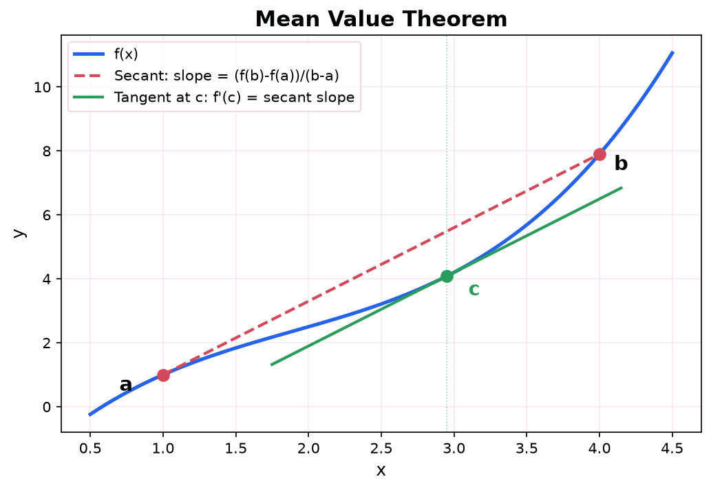

**Worked example: finding the guaranteed $c$.** The theorem promises a $c$ exists; here is how you actually produce it. Take $f(x) = x^2$ on $[1, 3]$. The average rate of change is

$$
\frac{f(3) - f(1)}{3 - 1} = \frac{9 - 1}{2} = 4,
$$

so the MVT guarantees some $c \in (1, 3)$ with $f'(c) = 4$. Since $f'(x) = 2x$, solve $2c = 4$ to get $c = 2$, which indeed lies in $(1, 3)$. Geometrically, the tangent line at $x = 2$ (slope $4$) is parallel to the secant joining $(1, 1)$ and $(3, 9)$ (also slope $4$), which is exactly what the picture above shows.

Here $c = 2$ is the midpoint of $[1, 3]$, but that is a special feature of quadratics, not a general rule. For $f(x) = x^3$ on $[0, 2]$ the average rate is $\frac{8 - 0}{2} = 4$, and $f'(c) = 3c^2 = 4$ gives $c = \frac{2}{\sqrt{3}} \approx 1.155$, off-center. The theorem asserts *existence*, not location.

**Why the MVT matters:** It is the theoretical foundation for many calculus results:

- If $f'(x) > 0$ on an interval, then $f$ is increasing. (Proof: for any $a < b$ in the interval, the MVT gives $f(b) - f(a) = f'(c)(b-a) > 0$, so $f(b) > f(a)$.)
- If $f'(x) = 0$ everywhere on an interval, then $f$ is constant. (The MVT forces $f(b) - f(a) = 0$ for any $a, b$.)
- Two antiderivatives of the same function differ by a constant. (Their difference has zero derivative, so by the above, it is constant.)

### L'Hopital's Rule

L'Hopital's Rule provides a powerful method for evaluating limits that give indeterminate forms. The preview in the Limits section introduced the idea; here is the full treatment.

**Formal statement:** If $\lim_{x \to a} f(x) = 0$ and $\lim_{x \to a} g(x) = 0$ (the $\frac{0}{0}$ case), or if both limits are $\pm\infty$ (the $\frac{\infty}{\infty}$ case), and if $g'(x) \neq 0$ near $a$, then:

$$
\lim_{x \to a} \frac{f(x)}{g(x)} = \lim_{x \to a} \frac{f'(x)}{g'(x)}
$$

provided the limit on the right exists (or is $\pm\infty$). The rule also applies when $a = \pm\infty$.

The idea: replace the numerator and denominator with their derivatives, then evaluate the new limit. If the new limit is still indeterminate, apply the rule again.

**Worked example 1 ($\frac{0}{0}$):** Evaluate $\lim_{x \to 0} \frac{\sin x}{x}$.

Check: $\sin 0 = 0$ and $x \to 0$, so this is $\frac{0}{0}$. Apply L'Hopital's Rule:

$$
\lim_{x \to 0} \frac{\sin x}{x} = \lim_{x \to 0} \frac{\cos x}{1} = \cos 0 = 1
$$

This confirms the important trigonometric limit we stated earlier.

**Worked example 2 ($\frac{\infty}{\infty}$, applied twice):** Evaluate $\lim_{x \to \infty} \frac{x^2}{e^x}$.

Check: as $x \to \infty$, both $x^2 \to \infty$ and $e^x \to \infty$. This is $\frac{\infty}{\infty}$. Apply L'Hopital's Rule:

$$
\lim_{x \to \infty} \frac{x^2}{e^x} = \lim_{x \to \infty} \frac{2x}{e^x}
$$

Still $\frac{\infty}{\infty}$. Apply again:

$$
= \lim_{x \to \infty} \frac{2}{e^x} = 0
$$

This confirms that exponential growth dominates polynomial growth.

**Worked example 3 ($0 \cdot \infty$ rewritten):** Evaluate $\lim_{x \to 0^+} x \ln x$.

This is $0 \cdot (-\infty)$, which is indeterminate. Rewrite as a fraction:

$$
x \ln x = \frac{\ln x}{1/x}
$$

Now as $x \to 0^+$, $\ln x \to -\infty$ and $1/x \to \infty$. This is $\frac{-\infty}{\infty}$. Apply L'Hopital's Rule:

$$
\lim_{x \to 0^+} \frac{\ln x}{1/x} = \lim_{x \to 0^+} \frac{1/x}{-1/x^2} = \lim_{x \to 0^+} \frac{x^2}{-x} = \lim_{x \to 0^+} (-x) = 0
$$

So $\lim_{x \to 0^+} x \ln x = 0$. The function approaches zero, even though $\ln x$ goes to $-\infty$, because $x$ goes to zero fast enough to dominate.

**When NOT to use L'Hopital's Rule:** The rule only applies to indeterminate forms $\frac{0}{0}$ or $\frac{\infty}{\infty}$. Applying it to a non-indeterminate form gives wrong answers. For example:

$$
\lim_{x \to 0} \frac{x + 1}{x + 2} = \frac{1}{2} \quad \text{(by direct substitution)}
$$

If you incorrectly apply L'Hopital's Rule here, you get $\frac{1}{1} = 1$, which is wrong. Always verify the indeterminate form before applying the rule.

---

## Integrals

### The Big Idea

If derivatives answer "how fast is it changing?", integrals answer "how much total has accumulated?" They are two sides of the same coin, connected by the Fundamental Theorem of Calculus.

**Example from everyday life:** If you know your speed at every moment of a trip, the integral of your speed gives you the total distance traveled. If you know rain is falling at a changing rate, the integral of the rate gives the total amount of rain.

### Riemann Sums: Building Intuition

How do you find the area under a curve? Approximate it with rectangles.

1. Divide the interval into $n$ equal pieces
2. On each piece, build a rectangle whose height is the function value
3. Add up the areas of all rectangles

As you use more and more rectangles, the approximation gets better. In the limit (as $n \to \infty$), you get the exact area.

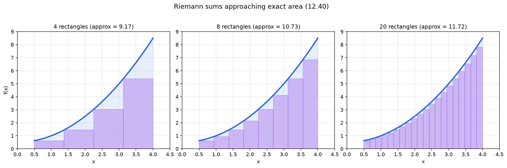

Try it below: choose a function and rule (left, right, midpoint, trapezoid) and slide the number of rectangles up to watch the sum converge to the exact integral, with the error shrinking as $n$ grows.

<iframe src="/static/interactive/calc-riemann-sums.html" width="100%" height="640" style="border:none;"></iframe>

**Worked example: a Riemann sum by hand.** Estimate the area under $f(x) = x^2$ on $[0, 1]$ with $n = 4$ rectangles. Each has width $\Delta x = \frac{1 - 0}{4} = 0.25$. Using **left** endpoints $x = 0,\, 0.25,\, 0.5,\, 0.75$, the heights are $f(x) = 0,\, 0.0625,\, 0.25,\, 0.5625$, so

$$
L_4 = (0 + 0.0625 + 0.25 + 0.5625)(0.25) = 0.875 \times 0.25 = 0.21875.
$$

This *under*estimates, because $x^2$ is increasing, so each left-endpoint height is the lowest the function reaches on its subinterval. Using **right** endpoints $x = 0.25,\, 0.5,\, 0.75,\, 1$ instead gives heights $0.0625,\, 0.25,\, 0.5625,\, 1$ and

$$
R_4 = (0.0625 + 0.25 + 0.5625 + 1)(0.25) = 1.875 \times 0.25 = 0.46875,
$$

an *over*estimate. The true area is sandwiched between them, $0.21875 < \text{area} < 0.46875$, and as $n \to \infty$ the two sums squeeze onto the exact value $\int_0^1 x^2 \, dx = \frac{1}{3} \approx 0.3333$ (which the Fundamental Theorem below confirms in one line). Even at $n = 4$ the pair already brackets it.

### The Definite Integral

The **definite integral** of $f(x)$ from $a$ to $b$ is the limit of these Riemann sums:

$$
\int_a^b f(x) \, dx = \lim_{n \to \infty} \sum_{i=1}^{n} f(x_i) \Delta x
$$

The whole expression $\int_a^b f(x) \, dx$ is read "the integral from a to b of f of x, d x," and $\sum_{i=1}^{n}$ (the summation sign, a capital Greek sigma) is read "the sum from i equals 1 to n." The symbol $\int$ is an elongated S (for "sum"). The $dx$ indicates what variable we are integrating with respect to. The numbers $a$ and $b$ are the **limits of integration** (lower and upper bounds).

Geometrically, $\int_a^b f(x) \, dx$ is the signed area between the curve $y = f(x)$ and the $x$-axis. Area above the axis counts as positive; area below counts as negative.

### The Fundamental Theorem of Calculus

This theorem is the central result of calculus. It says that differentiation and integration are inverse operations.

**Part 1:** If $f$ is continuous on $[a, b]$ and $F(x) = \int_a^x f(t) \, dt$ for $x \in [a, b]$, then $F$ is differentiable and $F'(x) = f(x)$.

In words: the derivative of the integral gives back the original function.

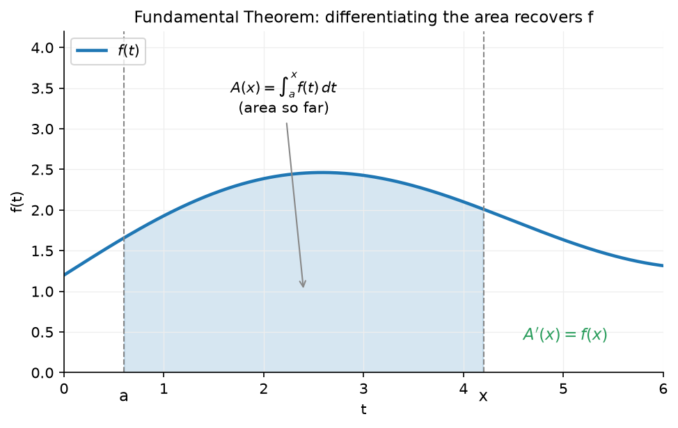

**Part 2:** If $f$ is continuous on $[a, b]$ and $F$ is any antiderivative of $f$ (meaning $F' = f$), then:

$$
\int_a^b f(x) \, dx = F(b) - F(a)
$$

In words: to compute a definite integral, find an antiderivative, plug in the upper bound, plug in the lower bound, and subtract.

**Example:** $\int_0^3 x^2 \, dx$. An antiderivative of $x^2$ is $\frac{x^3}{3}$.

$$
\int_0^3 x^2 \, dx = \frac{3^3}{3} - \frac{0^3}{3} = 9 - 0 = 9
$$

### Properties of Definite Integrals

These properties follow from the definition and the Fundamental Theorem. They simplify computation and help build intuition about integrals.

**Linearity:** Constants factor out, and integrals split over sums:

$$
\int_a^b [cf(x) + dg(x)] \, dx = c\int_a^b f(x) \, dx + d\int_a^b g(x) \, dx
$$

**Additivity over intervals:** You can split an integral at any intermediate point:

$$
\int_a^b f(x) \, dx + \int_b^c f(x) \, dx = \int_a^c f(x) \, dx
$$

**Reversal of limits:** Swapping the limits of integration negates the integral:

$$
\int_b^a f(x) \, dx = -\int_a^b f(x) \, dx
$$

**Zero-width interval:**

$$
\int_a^a f(x) \, dx = 0
$$

**Comparison property:** If $f(x) \geq g(x)$ for all $x$ in $[a,b]$, then:

$$
\int_a^b f(x) \, dx \geq \int_a^b g(x) \, dx
$$

A larger function has more area under its curve.

**Symmetry properties** (for integrals centered at the origin):

- If $f$ is an **even** function ($f(-x) = f(x)$): $\int_{-a}^{a} f(x) \, dx = 2\int_0^a f(x) \, dx$
- If $f$ is an **odd** function ($f(-x) = -f(x)$): $\int_{-a}^{a} f(x) \, dx = 0$

The odd function result is particularly useful: the positive and negative areas cancel exactly. For example, $\int_{-1}^{1} x^3 \, dx = 0$ without any computation, because $x^3$ is odd.

### Indefinite Integrals (Antiderivatives)

An **indefinite integral** is the general antiderivative:

$$
\int f(x) \, dx = F(x) + C
$$

where $C$ is an arbitrary constant (the **constant of integration**). This is because the derivative of a constant is zero, so any constant can be added to an antiderivative and it is still an antiderivative.

### Basic Integration Rules

These are the derivative rules in reverse:

| Function | Integral |
|----------|----------|
| $x^n$ (for $n \neq -1$) | $\frac{x^{n+1}}{n+1} + C$ |
| $\frac{1}{x}$ | $\ln |x| + C$ |
| $e^x$ | $e^x + C$ |
| $a^x$ | $\frac{a^x}{\ln a} + C$ |
| $\sin x$ | $-\cos x + C$ |
| $\cos x$ | $\sin x + C$ |
| $\sec^2 x$ | $\tan x + C$ |

**Constant multiple:** $\int c \cdot f(x) \, dx = c \int f(x) \, dx$

**Sum/difference:** $\int [f(x) \pm g(x)] \, dx = \int f(x) \, dx \pm \int g(x) \, dx$

**Worked example:** $\int (3x^2 + 2x - 5) \, dx = x^3 + x^2 - 5x + C$

### U-Substitution

U-substitution is the reverse of the chain rule. When you see a composite function inside an integral, substitute the inner function.

**Method:**
1. Identify an inner function $u = g(x)$
2. Compute $du = g'(x) \, dx$
3. Rewrite the integral in terms of $u$ and $du$
4. Integrate, then substitute back

**Worked example:** $\int 2x \cdot e^{x^2} \, dx$

Let $u = x^2$, so $du = 2x \, dx$.

$$
\int 2x \cdot e^{x^2} \, dx = \int e^u \, du = e^u + C = e^{x^2} + C
$$

**Worked example 2:** $\int \frac{x}{x^2 + 1} \, dx$

Let $u = x^2 + 1$, so $du = 2x \, dx$, meaning $x \, dx = \frac{1}{2} du$.

$$
\int \frac{x}{x^2 + 1} \, dx = \frac{1}{2} \int \frac{1}{u} \, du = \frac{1}{2} \ln|u| + C = \frac{1}{2} \ln(x^2 + 1) + C
$$

### Integration by Parts

Integration by parts handles products of functions. It comes from the product rule for derivatives run in reverse.

$$
\int u \, dv = uv - \int v \, du
$$

**How to choose $u$ and $dv$:** Use the **LIATE** rule as a guide for choosing $u$ (the thing you differentiate). Pick whichever comes first in this list:

1. **L**ogarithmic functions ($\ln x$)
2. **I**nverse trig functions
3. **A**lgebraic functions ($x^n$)
4. **T**rigonometric functions
5. **E**xponential functions ($e^x$)

**Worked example:** $\int x \, e^x \, dx$

Let $u = x$ (algebraic), $dv = e^x \, dx$. Then $du = dx$, $v = e^x$.

$$
\int x \, e^x \, dx = x \, e^x - \int e^x \, dx = x \, e^x - e^x + C = e^x(x - 1) + C
$$

**Worked example (the $\int \ln x \, dx$ trick):** There is no visible product here, yet LIATE still applies. Take $u = \ln x$ (logarithmic, first in the list) and let $dv = dx$ be the "leftover" $1 \, dx$. Then $du = \frac{1}{x} \, dx$ and $v = x$, so

$$
\int \ln x \, dx = \underbrace{x \ln x}_{uv} - \int x \cdot \frac{1}{x} \, dx = x \ln x - \int 1 \, dx = x \ln x - x + C.
$$

The move worth remembering: a lone function can always be written as (itself) $\times \, dx$, which is what lets integration by parts apply to it at all.

**Worked example (a cyclic integral):** For $\int e^x \cos x \, dx$, parts appears to go in circles, and the fix is to *let* it. Take $u = \cos x$, $dv = e^x \, dx$, so $du = -\sin x \, dx$ and $v = e^x$:

$$
\int e^x \cos x \, dx = e^x \cos x + \int e^x \sin x \, dx.
$$

Apply parts *again* to the new integral, with $u = \sin x$, $dv = e^x \, dx$:

$$
\int e^x \sin x \, dx = e^x \sin x - \int e^x \cos x \, dx.
$$

Substituting the second line into the first, the original integral $I = \int e^x \cos x \, dx$ reappears on the right:

$$
I = e^x \cos x + e^x \sin x - I.
$$

Rather than loop forever, treat this as an *equation* and solve: $2I = e^x(\cos x + \sin x)$, so

$$
\int e^x \cos x \, dx = \frac{e^x(\cos x + \sin x)}{2} + C.
$$

When integration by parts regenerates the integral you began with, stop integrating and solve algebraically. (Differentiating the answer returns $e^x \cos x$, confirming it.)

**Where it shows up:** Integration by parts is used in information theory to derive properties of entropy. It also appears when computing expected values of continuous random variables.

### Common Integrals Reference Table

| Integral | Result |
|----------|--------|
| $\int x^n \, dx$ | $\frac{x^{n+1}}{n+1} + C$ (for $n \neq -1$) |
| $\int \frac{1}{x} \, dx$ | $\ln |x| + C$ |
| $\int e^x \, dx$ | $e^x + C$ |
| $\int e^{kx} \, dx$ | $\frac{1}{k} e^{kx} + C$ |
| $\int \ln x \, dx$ | $x \ln x - x + C$ |
| $\int \sin x \, dx$ | $-\cos x + C$ |
| $\int \cos x \, dx$ | $\sin x + C$ |
| $\int \frac{1}{1 + x^2} \, dx$ | $\arctan x + C$ |
| $\int \frac{1}{\sqrt{1 - x^2}} \, dx$ | $\arcsin x + C$ |

### The Gaussian Integral

One of the most important integrals in mathematics and statistics:

$$
\int_{-\infty}^{\infty} e^{-x^2} \, dx = \sqrt{\pi}
$$

This integral cannot be solved with any of the techniques above (there is no elementary antiderivative of $e^{-x^2}$). It is evaluated using a clever trick involving polar coordinates. We state it as a fact.

**Why it matters:** The normal distribution (bell curve) is $f(x) = \frac{1}{\sigma\sqrt{2\pi}} e^{-(x - \mu)^2 / (2\sigma^2)}$. The $\sqrt{2\pi}$ in the denominator is there precisely to make the total area under the curve equal 1 (as required for a probability distribution). That normalization constant comes from the Gaussian integral.

### Improper Integrals

An **improper integral** has either an infinite limit of integration or an integrand with a discontinuity. You handle them with limits:

$$
\int_1^{\infty} \frac{1}{x^2} \, dx = \lim_{b \to \infty} \int_1^b \frac{1}{x^2} \, dx = \lim_{b \to \infty} \left[-\frac{1}{x}\right]_1^b = \lim_{b \to \infty} \left(-\frac{1}{b} + 1\right) = 1
$$

The integral **converges** (gives a finite answer). Not all improper integrals converge:

$$
\int_1^{\infty} \frac{1}{x} \, dx = \lim_{b \to \infty} [\ln x]_1^b = \lim_{b \to \infty} (\ln b - 0) = \infty
$$

This integral **diverges** (blows up).

**Where it shows up:** Every probability density function must satisfy $\int_{-\infty}^{\infty} f(x) \, dx = 1$. This is an improper integral. The fact that it converges to 1 is what makes $f$ a valid probability distribution. When you study continuous probability distributions, you will constantly evaluate improper integrals.

### Area Between Curves

When you know how to find the area under a single curve, the next natural question is: what is the area between two curves?

If $f(x) \geq g(x)$ on the interval $[a,b]$, then the area between the two curves is:

$$
A = \int_a^b [f(x) - g(x)] \, dx
$$

The idea is simple: the area between the curves equals the area under the top curve minus the area under the bottom curve.

**Worked example:** Find the area between $y = x$ and $y = x^2$.

First, find where the curves intersect: $x = x^2$ gives $x^2 - x = 0$, so $x(x - 1) = 0$, meaning $x = 0$ and $x = 1$.

On $[0, 1]$, the line $y = x$ is above the parabola $y = x^2$ (check: at $x = 1/2$, $x = 0.5$ and $x^2 = 0.25$). So:

$$
A = \int_0^1 [x - x^2] \, dx = \left[\frac{x^2}{2} - \frac{x^3}{3}\right]_0^1 = \frac{1}{2} - \frac{1}{3} = \frac{1}{6}
$$

When finding area between curves, always identify the intersection points first (they become your limits of integration) and determine which function is on top.

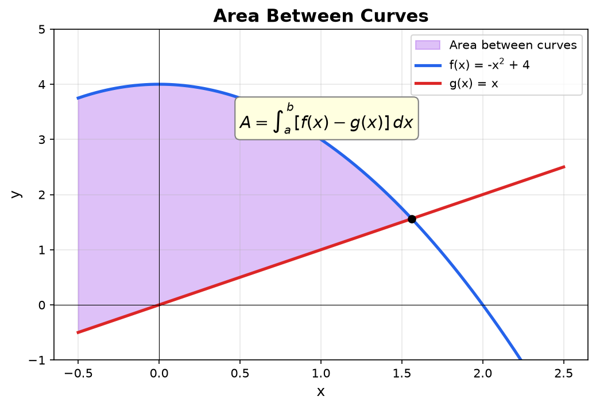

Sometimes it is simpler to integrate with respect to $y$ rather than $x$. This happens when the curves are more naturally expressed as functions of $y$, or when integrating with respect to $x$ would require splitting the region into multiple pieces. In that case, use $A = \int_c^d [x_{\text{right}}(y) - x_{\text{left}}(y)] \, dy$.

### Average Value of a Function

Given a function on an interval, what single constant value would give the same "total accumulation"? That is the average value.

$$
f_{\text{avg}} = \frac{1}{b-a}\int_a^b f(x) \, dx
$$

The intuition: $\int_a^b f(x) \, dx$ gives the area under the curve. Dividing by the width $(b - a)$ gives the height of a rectangle with the same area. That height is the average value.

**Example:** Suppose the temperature over a 24-hour day is modeled by $T(t) = 20 + 5\sin(\pi t/12)$ degrees (where $t$ is in hours from midnight). Find the average temperature from $t = 0$ to $t = 24$.

$$
T_{\text{avg}} = \frac{1}{24}\int_0^{24} \left[20 + 5\sin\left(\frac{\pi t}{12}\right)\right] dt
$$

$$
= \frac{1}{24}\left[20t - 5 \cdot \frac{12}{\pi}\cos\left(\frac{\pi t}{12}\right)\right]_0^{24}
$$

$$
= \frac{1}{24}\left[\left(480 - \frac{60}{\pi}\cos(2\pi)\right) - \left(0 - \frac{60}{\pi}\cos(0)\right)\right]
$$

$$
= \frac{1}{24}\left[480 - \frac{60}{\pi} + \frac{60}{\pi}\right] = \frac{480}{24} = 20
$$

The average temperature is 20 degrees. The sine term integrates to zero over a full period, so the average equals the constant term, which makes intuitive sense.

![Average value of the temperature model T of t equals 20 plus 5 sine of pi t over 12 over a 24-hour day. The blue curve rises to 25 degrees around hour 6 and falls to 15 degrees around hour 18. A red horizontal line marks the average value of 20 degrees. The region between the curve and the mean line where the curve is above 20 (roughly hours 0 to 12) is shaded green and marked with a plus sign; the region where the curve is below 20 (roughly hours 12 to 24) is shaded purple and marked with a minus sign. The two shaded areas are equal, so the deviations above and below cancel, which is why the mean line is exactly the height of the rectangle with the same area as the integral.](./media/calc-average-value.png)

### Numerical Integration

In practice, many integrals have no elementary antiderivative. The function $e^{-x^2}$, for example, cannot be integrated symbolically (as noted in the Gaussian integral section). When exact antiderivatives are unavailable, we approximate the integral numerically.

**Trapezoid Rule:** Instead of using rectangles (as in Riemann sums), use trapezoids. A trapezoid connecting two adjacent function values better captures the shape of the curve.

Divide $[a,b]$ into $n$ equal subintervals of width $\Delta x = \frac{b-a}{n}$, with endpoints $x_0, x_1, \ldots, x_n$. The trapezoid rule gives:

$$
\int_a^b f(x) \, dx \approx \frac{\Delta x}{2}\left[f(x_0) + 2f(x_1) + 2f(x_2) + \cdots + 2f(x_{n-1}) + f(x_n)\right]
$$

The first and last terms get weight 1; all interior terms get weight 2. This comes from averaging the left-endpoint and right-endpoint Riemann sums.

**Simpson's Rule:** Instead of connecting points with straight lines (trapezoids), connect every three consecutive points with a parabola. This generally gives a much better approximation for the same number of function evaluations.

$$
\int_a^b f(x) \, dx \approx \frac{\Delta x}{3}\left[f(x_0) + 4f(x_1) + 2f(x_2) + 4f(x_3) + 2f(x_4) + \cdots + 4f(x_{n-1}) + f(x_n)\right]
$$

Simpson's rule requires an even number of subintervals ($n$ must be even). The coefficients alternate: $1, 4, 2, 4, 2, \ldots, 4, 1$.

**Error bounds:** The trapezoid rule has error of order $O(h^2)$ where $h = \Delta x$. Doubling the number of points cuts the error by a factor of 4. Simpson's rule has error of order $O(h^4)$, so doubling the points cuts the error by a factor of 16. Simpson's rule is remarkably accurate for smooth functions.

![Two side-by-side panels approximating the integral of e to the minus x squared from 0 to 2, a function with no elementary antiderivative, using four subintervals. The left panel shows the trapezoid rule: each subinterval is capped by a straight red line connecting adjacent function values, and these straight tops visibly deviate from the blue curve, overshooting where the curve bends. The right panel shows Simpson's rule: each pair of subintervals is capped by a green parabola fitted through three points, and these parabolic tops hug the curve so closely they are almost indistinguishable from it. The visual gap between the two methods illustrates why the trapezoid error is order h squared while Simpson's error is the much smaller order h to the fourth.](./media/calc-numerical-integration.png)

**Worked example: trapezoid and Simpson on the figure's integral.** Estimate $\int_0^2 e^{-x^2} \, dx$ (the integral drawn above, which has no elementary antiderivative) with $n = 4$, so $\Delta x = \frac{2 - 0}{4} = 0.5$ and the nodes are $x = 0, 0.5, 1, 1.5, 2$. The five function values are

$$
f(0) = 1,\quad f(0.5) = e^{-0.25} \approx 0.7788,\quad f(1) = e^{-1} \approx 0.3679,\quad f(1.5) = e^{-2.25} \approx 0.1054,\quad f(2) = e^{-4} \approx 0.0183.
$$

**Trapezoid** (endpoint weights $1$, interior weights $2$):

$$
T_4 = \frac{0.5}{2}\big[1 + 2(0.7788) + 2(0.3679) + 2(0.1054) + 0.0183\big] \approx 0.25 \times 3.5225 \approx 0.8806.
$$

**Simpson** (weights $1, 4, 2, 4, 1$; note $n = 4$ is even, as the rule requires):

$$
S_4 = \frac{0.5}{3}\big[1 + 4(0.7788) + 2(0.3679) + 4(0.1054) + 0.0183\big] \approx 0.1667 \times 5.2909 \approx 0.8818.
$$

The true value is $\approx 0.8821$. So from the *same five function evaluations*, the trapezoid rule is off by about $0.0015$ while Simpson is off by only about $0.0003$, roughly five times closer, exactly the $O(h^2)$-versus-$O(h^4)$ accuracy gap the picture above illustrates.

**Connection to computing:** This is exactly what numerical software (NumPy's `numpy.trapz`, SciPy's `scipy.integrate.quad`) does when computing integrals. The `quad` function uses adaptive versions of these methods, automatically choosing more points where the function changes rapidly.

### Integration with Partial Fractions

When integrating a rational function (a polynomial divided by a polynomial), decompose it using [Partial Fraction Decomposition](./partial-fraction-decomposition), then integrate each simpler fraction.

**Example:** Evaluate $\int \frac{1}{x^2-1} \, dx$.

Factor the denominator: $x^2 - 1 = (x-1)(x+1)$. Decompose:

$$
\frac{1}{x^2-1} = \frac{1}{(x-1)(x+1)} = \frac{1}{2}\left(\frac{1}{x-1} - \frac{1}{x+1}\right)
$$

Now integrate each term:

$$
\int \frac{1}{x^2-1} \, dx = \frac{1}{2}\ln|x-1| - \frac{1}{2}\ln|x+1| + C = \frac{1}{2}\ln\left|\frac{x-1}{x+1}\right| + C
$$

Partial fractions turn a difficult rational integral into a sum of simple logarithmic or arctangent integrals.

### Taylor and Maclaurin Series

A smooth function can be approximated by polynomials of increasing degree. The **Taylor series** provides the best polynomial approximation of any desired degree near a given point.

**Motivation:** We already saw that linear approximation uses the tangent line to approximate a function near a point. But a straight line only captures the slope, not the curvature. A quadratic approximation (parabola) would capture the curvature too. A cubic would capture even more. The Taylor series takes this idea to its logical conclusion: use a polynomial of infinite degree for a perfect representation.

**Taylor series of $f(x)$ centered at $a$:**

$$
f(x) = \sum_{n=0}^{\infty} \frac{f^{(n)}(a)}{n!}(x-a)^n = f(a) + f'(a)(x-a) + \frac{f''(a)}{2!}(x-a)^2 + \frac{f'''(a)}{3!}(x-a)^3 + \cdots
$$

Each term uses the $n$th derivative of $f$ at $a$, divided by $n!$ (the factorial), multiplied by $(x - a)^n$. The factorials ensure the $n$th derivative of the Taylor polynomial matches the $n$th derivative of $f$ at the center $a$.

A **Maclaurin series** is the special case where $a = 0$:

$$
f(x) = \sum_{n=0}^{\infty} \frac{f^{(n)}(0)}{n!}x^n
$$

Slide the degree $N$ below to watch the Taylor polynomial hug the function ever more closely near the center, and for $\ln(1+x)$ and $\frac{1}{1-x}$ see it *fail* to converge outside the interval of convergence no matter how high $N$ goes.

<iframe src="/static/interactive/taylor-series.html" width="100%" height="640" style="border:none;"></iframe>

**Worked example: deriving the series for $e^x$ from scratch.** The Maclaurin recipe needs the values $f(0), f'(0), f''(0), \ldots$ For $f(x) = e^x$ this is as easy as it gets, because $e^x$ is its own derivative: every derivative is $e^x$ again, so at $x = 0$ every one of them equals $e^0 = 1$:

$$
f(0) = f'(0) = f''(0) = f'''(0) = \cdots = 1.
$$

Dropping these into $\sum_{n=0}^{\infty} \frac{f^{(n)}(0)}{n!}x^n$, every coefficient becomes $\frac{1}{n!}$:

$$
e^x = \frac{1}{0!} + \frac{1}{1!}x + \frac{1}{2!}x^2 + \frac{1}{3!}x^3 + \cdots = 1 + x + \frac{x^2}{2} + \frac{x^3}{6} + \cdots = \sum_{n=0}^{\infty} \frac{x^n}{n!}.
$$

To watch it work numerically, estimate $e = e^1$ by truncating after a few terms: $1 + 1 + \frac{1}{2} + \frac{1}{6} + \frac{1}{24} + \frac{1}{120} = 2.71\overline{6}$, already within about $0.0016$ of $e \approx 2.71828$. Each additional term shrinks the gap quickly because the factorial denominators blow up.

For a function whose derivatives are less trivial, the same machinery applies: for $\sin x$ the derivatives at $0$ cycle through $\sin 0, \cos 0, -\sin 0, -\cos 0 = 0, 1, 0, -1$ and then repeat, which is precisely why only the odd powers survive, with alternating signs, producing the $\sin x$ series listed just below.

**Key Maclaurin series to know:**

$$
e^x = 1 + x + \frac{x^2}{2!} + \frac{x^3}{3!} + \cdots = \sum_{n=0}^{\infty} \frac{x^n}{n!} \quad \text{(converges for all } x\text{)}
$$

$$
\sin x = x - \frac{x^3}{3!} + \frac{x^5}{5!} - \cdots = \sum_{n=0}^{\infty} \frac{(-1)^n x^{2n+1}}{(2n+1)!} \quad \text{(converges for all } x\text{)}
$$

$$
\cos x = 1 - \frac{x^2}{2!} + \frac{x^4}{4!} - \cdots = \sum_{n=0}^{\infty} \frac{(-1)^n x^{2n}}{(2n)!} \quad \text{(converges for all } x\text{)}
$$

$$
\frac{1}{1-x} = 1 + x + x^2 + x^3 + \cdots = \sum_{n=0}^{\infty} x^n \quad \text{(converges for } |x| < 1\text{)}
$$

$$
\ln(1+x) = x - \frac{x^2}{2} + \frac{x^3}{3} - \frac{x^4}{4} + \cdots = \sum_{n=1}^{\infty} \frac{(-1)^{n+1} x^n}{n} \quad \text{(converges for } |x| \leq 1\text{)}
$$

**Taylor polynomials as approximations:** In practice, we truncate the series at degree $n$ to get the $n$th-degree Taylor polynomial $T_n(x)$. The linear approximation $f(x) \approx f(a) + f'(a)(x-a)$ is the degree-1 Taylor polynomial. Higher degrees give more accuracy over a wider range.

Notice the pattern: the first-degree Taylor polynomial is the tangent line. The second-degree polynomial adds a parabolic correction for curvature. Each additional term refines the approximation further.

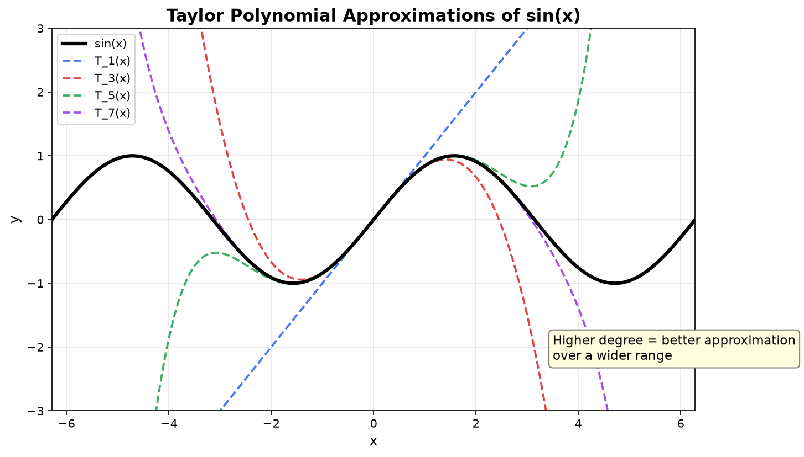

**Connection to ML:** Taylor expansion is used throughout optimization theory. The second-order Taylor expansion of a loss function $L(\theta)$ around the current parameters gives:

$$
L(\theta) \approx L(\theta_0) + \nabla L(\theta_0)^T (\theta - \theta_0) + \frac{1}{2}(\theta - \theta_0)^T H (\theta - \theta_0)
$$

where $H$ is the Hessian matrix (matrix of second derivatives). Minimizing this quadratic approximation gives Newton's method for optimization. Standard gradient descent uses only the first-order term; methods like Adam and L-BFGS incorporate second-order information for faster convergence.

---

## Summary of Key Results

### Essential Derivative Rules

| Rule | Formula |
|------|---------|
| Power rule | $(x^n)' = nx^{n-1}$ |
| Product rule | $(fg)' = f'g + fg'$ |
| Quotient rule | $(f/g)' = (f'g - fg')/g^2$ |
| Chain rule | $[f(g(x))]' = f'(g(x)) \cdot g'(x)$ |
| Exponential | $(e^x)' = e^x$ |
| Logarithm | $(\ln x)' = 1/x$ |

### Essential Integral Results

| Function | Antiderivative |
|----------|---------------|
| $x^n$ | $x^{n+1}/(n+1) + C$ |
| $1/x$ | $\ln |x| + C$ |
| $e^x$ | $e^x + C$ |

### Fundamental Theorem of Calculus

$$
\int_a^b f(x) \, dx = F(b) - F(a) \quad \text{where } F' = f
$$

### What Comes Next

This page covers single-variable calculus: functions of one input. In [Multivariable Calculus](./multivariable-calculus), we extend these ideas to functions of several variables, introducing partial derivatives, gradient vectors, and gradient descent. Those topics connect directly to the [matrix calculus](./linear-algebra-computation) already covered in the linear algebra section.
