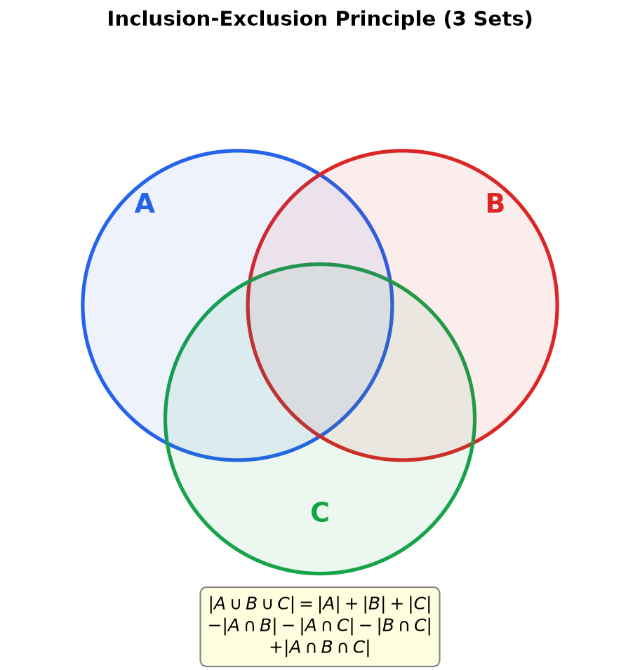
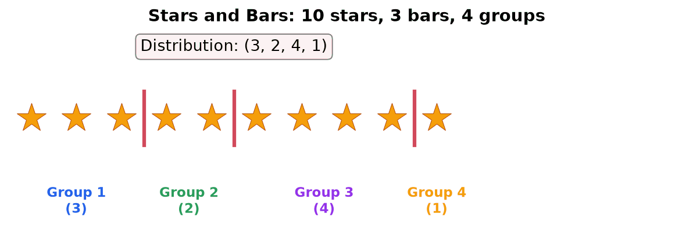

Suppose you have 5 people (Alice, Bob, Carol, Dave, and Eve) and you need to choose 3 of them to form a team. When order does not matter, counting these selections is what combinations are for.

> [!abstract] Prerequisites & where this leads
> **Builds on:** [Permutations](./permutation) · [Set Theory](./set-theory)
> **Leads to:** [Probability](./probability) · [Statistics](./statistics)

## Why Combinations?

Suppose you have 5 people (Alice, Bob, Carol, Dave, and Eve) and you need to choose 3 of them to form a team. How many different teams are possible?

At first, you might count ordered selections. Using [permutations](permutation.md), there are $P(5,3) = 5 \times 4 \times 3 = 60$ ways to pick 3 people in order. But a team is not an ordered arrangement. The team {Alice, Bob, Carol} is the same team as {Carol, Alice, Bob}; the order you list them does not matter.

So how many times has each team been counted? Every group of 3 people can be arranged in $3! = 3 \times 2 \times 1 = 6$ different orders. That means each unique team appears 6 times in the 60 ordered selections.

To get the number of distinct teams, divide out the duplicate orderings:

$$
\frac{60}{6} = 10
$$

There are 10 possible teams. The key insight is: **when order does not matter, divide the permutation count by $r!$** to remove the repeated arrangements within each selection.

![A diagram showing why a combination divides the ordered count by r factorial. On the left, a box lists the six orderings of the same three people A, B, C: ABC, ACB, BAC, BCA, CAB, CBA. A large arrow labeled order does not matter points right to a single set brace-A comma B comma C, one team. Below, the arithmetic reads: P of 5,3 equals 5 times 4 times 3 equals 60 ordered selections, divided by 3 factorial equals 6 orderings per team, giving the boxed result C of 5,3 equals 60 over 6 equals 10 teams.](./media/comb-choose-divide.png)

The picture is the whole idea of a combination in one glance: the $60$ ordered selections fall into groups of $6$ (the $3!$ ways to reorder each team), and collapsing each group to a single unordered team leaves $60/6 = 10$.

**Combination:** A combination refers to a selection of items from a larger set, where the **order does not matter**. Unlike permutations, where order is important, combinations consider only which items are selected, not the arrangement.

**Combination Formula (without repetition):**

$$C(n,r) = \binom{n}{r} = \frac{n!}{r!\,(n-r)!}$$

This is defined for integers with $0 \leq r \leq n$ (you cannot choose more items than the set contains; by convention $\binom{n}{r} = 0$ when $r > n$ or $r < 0$).

Alternate notation: $_nC_r$ or $C_r^n$ or $\binom{n}{r}$

**Where:**

- **n:** The total number of items in the set
- **r:** The number of items to select
- **r!:** Divides out the arrangements within the selection (since order doesn't matter)

**Relationship to Permutations:**

$$C(n,r) = \frac{P(n,r)}{r!}$$

Combinations are permutations divided by the number of ways to arrange r items, because order doesn't matter.

**Examples:**

1. **How many ways can you choose 3 books from a shelf of 5 books?**

   $$C(5,3) = \frac{5!}{3!\,2!} = \frac{120}{6 \times 2} = 10$$

2. **A pizza shop offers 10 toppings. How many 3-topping pizzas can you make?**

   $$C(10,3) = \frac{10!}{3!\,7!} = \frac{10 \times 9 \times 8}{3 \times 2 \times 1} = 120$$

3. **A committee of 4 people must be formed from a group of 12. How many ways?**

   $$C(12,4) = \frac{12!}{4!\,8!} = \frac{12 \times 11 \times 10 \times 9}{4 \times 3 \times 2 \times 1} = \frac{11880}{24} = 495$$

## Properties of Combinations

**Symmetry Property:**

$$\binom{n}{r} = \binom{n}{n-r}$$

Choosing r items is the same as choosing which (n-r) items to leave out.

**Example:** $\binom{5}{2} = \binom{5}{3} = 10$


**Worked example: both sides really are equal.** Compute each directly:
$$\binom{5}{2} = \frac{5!}{2!\,3!} = \frac{5 \times 4}{2 \times 1} = 10, \qquad \binom{5}{3} = \frac{5!}{3!\,2!} = \frac{5 \times 4 \times 3}{3 \times 2 \times 1} = 10.$$
The two fractions have the *same* denominator $2!\,3!$, just written in the other order, so the values are forced to match. But the arithmetic is not the real reason; the **bijection** is: from a group of $5$, every choice of the $2$ people to put *on* the team simultaneously names the $3$ people to leave *off*, and vice versa. Choosing whom to include and choosing whom to exclude are the same act, so the two counts cannot differ. This is also why $\binom{n}{0} = \binom{n}{n} = 1$ (one way to take everyone, one way to take no one) and why every row of Pascal's triangle reads the same forwards and backwards.

**Pascal's Identity:**

$$\binom{n}{r} = \binom{n-1}{r-1} + \binom{n-1}{r}$$

This forms Pascal's Triangle:

```
         1
       1   1
     1   2   1
   1   3   3   1
 1   4   6   4   1
1  5  10  10  5  1
```

Each number is the sum of the two numbers above it.


Explore this interactively below. Hover or tap any cell to see it as $C(n,k)$ ("n choose k") and the two parent cells that sum to it, use the panel to compute $C(n,r)$ ("n choose r") with the worked cancellation, and note that each row $n$ sums to $2^n$.

<iframe src="/static/interactive/comb-pascal-triangle.html" width="100%" height="600" style="border:none;"></iframe>

**Worked example: verifying and explaining Pascal's identity.** Take the highlighted cell $\binom{4}{2}$. Computing the three coefficients directly gives $\binom{4}{2} = 6$, $\binom{3}{1} = 3$, and $\binom{3}{2} = 3$, so the identity $\binom{4}{2} = \binom{3}{1} + \binom{3}{2}$ reads $6 = 3 + 3$. But this is no numerical coincidence; it has a clean combinatorial reason. To choose $2$ people from a group of $4$, single out one particular person, say Alice, and split every possible team by whether she is on it:
- **Alice is on the team:** you still need $1$ more from the remaining $3$ people, which is $\binom{3}{1} = 3$ ways.
- **Alice is off the team:** you need all $2$ from the remaining $3$, which is $\binom{3}{2} = 3$ ways.

Every team falls into exactly one of these two cases and none is counted twice, so $\binom{4}{2} = \binom{3}{1} + \binom{3}{2}$. The identical "is the singled-out element in or out?" split proves the general identity $\binom{n}{r} = \binom{n-1}{r-1} + \binom{n-1}{r}$, which is precisely why each entry of Pascal's triangle is the sum of the two directly above it.

### Connection to the Binomial Theorem

The **binomial theorem** says the binomial coefficients are literally the numbers that appear when you expand a power of a sum:
$$(a + b)^n = \sum_{k=0}^{n} \binom{n}{k} a^{n-k} b^k = \binom{n}{0}a^n + \binom{n}{1}a^{n-1}b + \cdots + \binom{n}{n}b^n.$$
The reason is again just counting. Expanding $(a+b)^n = (a+b)(a+b)\cdots(a+b)$ means choosing either $a$ or $b$ from each of the $n$ factors; the term $a^{n-k}b^k$ is produced once for every way to pick which $k$ of the $n$ factors contribute a $b$, and there are exactly $\binom{n}{k}$ such choices.

**Worked example: $(1 + x)^4$.** Setting $a = 1$ and $b = x$, the coefficients are row $4$ of Pascal's triangle, $\binom{4}{0}, \binom{4}{1}, \binom{4}{2}, \binom{4}{3}, \binom{4}{4} = 1, 4, 6, 4, 1$:
$$(1 + x)^4 = 1 + 4x + 6x^2 + 4x^3 + x^4.$$
The coefficient of $x^2$, namely $6 = \binom{4}{2}$, counts "the ways to pick the two factors that each donate an $x$." Two quick checks confirm it: setting $x = 1$ gives $2^4 = 1 + 4 + 6 + 4 + 1 = 16$ (a row of Pascal's triangle sums to $2^n$, which counts *all* subsets of $n$ items), and setting $x = -1$ gives $0 = 1 - 4 + 6 - 4 + 1$ (the alternating sum is zero for $n \geq 1$, because a set has equally many even-sized and odd-sized subsets).

## Combinations with Repetition

**Formula:** When items can be selected more than once:

$$C(n+r-1,\, r) = \binom{n+r-1}{r} = \frac{(n+r-1)!}{r!\,(n-1)!}$$

Where:
- **n:** Number of different types of items
- **r:** Number of items to select (repetition allowed)

**Example:** How many ways can you select 3 donuts from 5 types if you can choose the same type multiple times?

$$C(5+3-1,\, 3) = C(7,3) = \frac{7!}{3!\,4!} = 35$$

**Why $n + r - 1$? (a stars-and-bars preview.)** That $+\,r-1$ is not arbitrary. Picture a selection of $3$ donuts from $5$ types as $3$ **stars** (the donuts) together with $5 - 1 = 4$ **bars** that divide them into the $5$ type-slots. For example,
$$\star\,\star \,\mid\; \mid \star \mid\; \mid \qquad \text{means } 2 \text{ of type 1},\ 0 \text{ of type 2},\ 1 \text{ of type 3},\ 0 \text{ of types 4 and 5},$$
which totals $2 + 0 + 1 + 0 + 0 = 3$ donuts. Every possible order is exactly one such arrangement of $3 + 4 = 7$ symbols, and an arrangement is pinned down by choosing which $3$ of the $7$ positions hold stars, giving $\binom{7}{3} = 35$. In general, $r$ stars and $n - 1$ bars make $n + r - 1$ symbols, and choosing the $r$ star-positions yields $\binom{n + r - 1}{r}$, which is where the formula comes from. (The full method, including minimum-per-type constraints, is developed in [Stars and Bars](#stars-and-bars-distributing-identical-objects) below.)

## Permutation vs Combination Summary

| Aspect | Permutation | Combination |
|--------|-------------|-------------|
| **Order matters?** | Yes | No |
| **Formula** | $\frac{n!}{(n-r)!}$ | $\frac{n!}{r!\,(n-r)!}$ |
| **Example** | Arranging books | Selecting books |
| **Relationship** | $C(n,r) = \frac{P(n,r)}{r!}$ | $P(n,r) = C(n,r) \times r!$ |

**Key Question to Ask:** Does the order of selection matter?

- **Yes** → Use Permutation
- **No** → Use Combination

## Inclusion-Exclusion Principle

When counting elements that belong to at least one of several sets, simply adding the set sizes overcounts elements that belong to more than one set. The **inclusion-exclusion principle** corrects for this overcounting.

### Two Sets

$$
|A \cup B| = |A| + |B| - |A \cap B|
$$

We add the sizes, then subtract the intersection (which was counted twice).

### Three Sets

$$
|A \cup B \cup C| = |A| + |B| + |C| - |A \cap B| - |A \cap C| - |B \cap C| + |A \cap B \cap C|
$$

We add individual sizes, subtract pairwise intersections (overcounted), then add back the triple intersection (subtracted too many times).

The pattern continues for more sets: add singles, subtract pairs, add triples, subtract quadruples, and so on.



With alternating signs, the general formula for $n$ sets is:

$$
\left|\bigcup_{i=1}^{n} A_i\right| = \sum_{i} |A_i| - \sum_{i<j} |A_i \cap A_j| + \sum_{i<j<k} |A_i \cap A_j \cap A_k| - \cdots + (-1)^{n+1}|A_1 \cap \cdots \cap A_n|
$$

### Worked Example: Divisibility

**Problem:** How many integers from 1 to 100 are divisible by 2, 3, or 5?

Let $A$ = multiples of 2, $B$ = multiples of 3, $C$ = multiples of 5.

Counting each set:

- $|A| = \lfloor 100/2 \rfloor = 50$
- $|B| = \lfloor 100/3 \rfloor = 33$
- $|C| = \lfloor 100/5 \rfloor = 20$

Pairwise intersections (multiples of both):

- $|A \cap B| = \lfloor 100/6 \rfloor = 16$
- $|A \cap C| = \lfloor 100/10 \rfloor = 10$
- $|B \cap C| = \lfloor 100/15 \rfloor = 6$

Triple intersection:

- $|A \cap B \cap C| = \lfloor 100/30 \rfloor = 3$

By inclusion-exclusion:

$$
|A \cup B \cup C| = 50 + 33 + 20 - 16 - 10 - 6 + 3 = 74
$$

So 74 integers from 1 to 100 are divisible by at least one of 2, 3, or 5.

### Worked Example: Derangements

A **derangement** is a permutation where no element appears in its original position. For example, if you have letters A, B, C in positions 1, 2, 3, then (B, C, A) is a derangement but (B, A, C) is not (since C is still in position 3).

**Problem:** How many derangements $D_n$ of $\{1, 2, \ldots, n\}$ exist?

Let $A_i$ = the set of permutations that fix element $i$ (i.e., element $i$ stays in position $i$). We want the number of permutations that are in none of these sets.

The total number of permutations is $n!$. By inclusion-exclusion:

$$
D_n = n! - |A_1 \cup A_2 \cup \cdots \cup A_n|
$$

The key observations:

- $|A_i| = (n-1)!$ (fix one element, permute the rest)
- $|A_i \cap A_j| = (n-2)!$ (fix two elements, permute the rest)
- In general, the intersection of any $k$ of these sets has size $(n-k)!$, and there are $\binom{n}{k}$ ways to choose which $k$ elements are fixed.

Applying inclusion-exclusion:

$$
D_n = n! - \binom{n}{1}(n-1)! + \binom{n}{2}(n-2)! - \binom{n}{3}(n-3)! + \cdots + (-1)^n \binom{n}{n}(0)!
$$

Since $\binom{n}{k}(n-k)! = \frac{n!}{k!}$, this simplifies to:

$$
D_n = n! \sum_{k=0}^{n} \frac{(-1)^k}{k!}
$$

For large $n$, the sum approaches $e^{-1}$, so $D_n \approx n!/e$. Roughly $1/e \approx 36.8\%$ of all permutations are derangements.

**Small values:** $D_1 = 0$, $D_2 = 1$, $D_3 = 2$, $D_4 = 9$, $D_5 = 44$.

## Stars and Bars (Distributing Identical Objects)

### The Problem

How many ways can you distribute $n$ identical items into $k$ distinct bins (where bins can be empty)?

For example, distributing 5 identical balls into 3 labeled boxes. Since the balls are identical, all that matters is how many go in each box, not which ones.

### The Visual Model

Represent the $n$ items as stars ($\star$) and use $k-1$ bars ($|$) to separate them into $k$ groups. Each arrangement of stars and bars corresponds to one distribution.

For 5 balls into 3 boxes, one arrangement is:

$$
\star \star \, | \, \star \, | \, \star \star
$$

This means 2 balls in box 1, 1 ball in box 2, 2 balls in box 3.

Another arrangement:

$$
| \, \star \star \star \star \star \, |
$$

This means 0 balls in box 1, 5 balls in box 2, 0 balls in box 3.

### The Formula

The total number of symbols is $n + k - 1$ (that is, $n$ stars and $k-1$ bars). We need to choose positions for the $k-1$ bars (or equivalently, choose positions for the $n$ stars). Here $k \geq 1$ (there must be at least one bin) and $n \geq 0$.

$$
\binom{n + k - 1}{k - 1} = \binom{n + k - 1}{n}
$$

### Worked Example: Balls in Boxes

**Problem:** How many ways can you put 10 identical balls into 4 distinct boxes?

Here $n = 10$ and $k = 4$:

$$
\binom{10 + 4 - 1}{4 - 1} = \binom{13}{3} = \frac{13 \times 12 \times 11}{3 \times 2 \times 1} = 286
$$



### With Minimum Constraints

**Problem:** How many ways can you put 10 identical balls into 4 boxes if each box must have at least 1 ball?

First place 1 ball in each box to satisfy the constraint. This uses up 4 balls, leaving 6 balls to distribute freely among 4 boxes. Now apply stars and bars with $n = 6$ and $k = 4$:

$$
\binom{6 + 4 - 1}{4 - 1} = \binom{9}{3} = \frac{9 \times 8 \times 7}{3 \times 2 \times 1} = 84
$$

More generally, if each of $k$ bins must have at least $m_i$ items, first place the minimums, then distribute the remaining items freely.

### Connection to Combinations with Repetition

Note that stars and bars gives the same formula as combinations with repetition (discussed earlier). Choosing $r$ items from $n$ types with repetition is the same as distributing $r$ identical selections among $n$ categories.

## Pigeonhole Principle

The **pigeonhole principle** states: if you place more than $n$ items into $n$ containers, at least one container holds more than one item. Despite its simplicity, this principle is surprisingly powerful for proving existence results.

### Basic Form

If $n + 1$ (or more) objects are placed into $n$ boxes, then some box contains at least 2 objects.

**Worked Example:** In any group of 13 people, at least 2 share a birth month.

There are 12 months (the "boxes") and 13 people (the "items"). Since $13 > 12$, by the pigeonhole principle, at least two people must share the same birth month. $\blacksquare$


Note that the pigeonhole principle guarantees existence but does not tell us which month has the collision or which two people share it.

### Generalized Pigeonhole Principle

If $n$ items are placed into $k$ boxes (with $k \geq 1$), then at least one box contains at least $\lceil n/k \rceil$ items, where $\lceil \cdot \rceil$ is the ceiling function.

**Intuition:** If every box had fewer than $\lceil n/k \rceil$ items, the total would be less than $n$, which is a contradiction.

**Worked Example:** A drawer has red, blue, green, and yellow socks. How many socks must you pull out (in the dark) to guarantee a matching pair?

There are 4 colors (boxes). To guarantee 2 socks of the same color, you need $\lceil n/4 \rceil \geq 2$, which means $n \geq 5$. Pull out 5 socks and at least two must share a color.

### Worked Example: Points in a Unit Square

**Problem:** Among any 5 points placed in a unit square (side length 1), at least 2 are within distance $\frac{\sqrt{2}}{2}$ of each other.

**Proof:** Divide the unit square into 4 smaller squares, each with side length $\frac{1}{2}$.

![A unit square of side 1 divided by its vertical and horizontal midlines into four sub-squares each of side one-half. Five points are plotted inside: three sub-squares contain one point each, and the top-right sub-square, lightly shaded, contains two points connected by a short line segment. The shared sub-square's diagonal is labeled as the square root of one-half squared plus one-half squared, which equals root two over two, about 0.707, the maximum possible distance between the two points sharing that quarter.](./media/comb-pigeonhole-square.png)

By the pigeonhole principle, 5 points into 4 sub-squares means at least 2 points land in the same sub-square. The maximum distance between two points in a square of side $\frac{1}{2}$ is its diagonal:

$$
\sqrt{\left(\frac{1}{2}\right)^2 + \left(\frac{1}{2}\right)^2} = \sqrt{\frac{1}{2}} = \frac{\sqrt{2}}{2} \approx 0.707
$$

Therefore, at least two of the five points are within distance $\frac{\sqrt{2}}{2}$. $\blacksquare$

