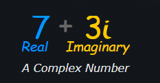
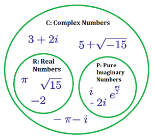
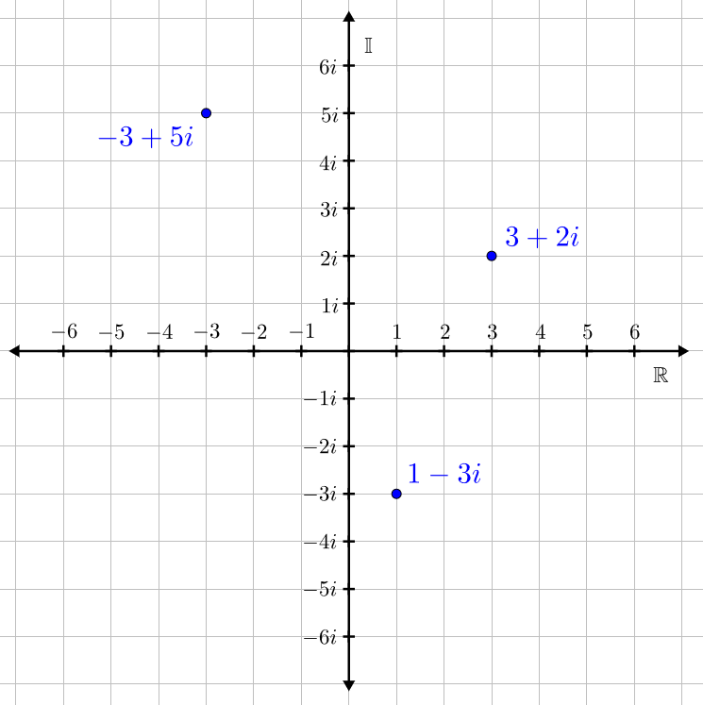
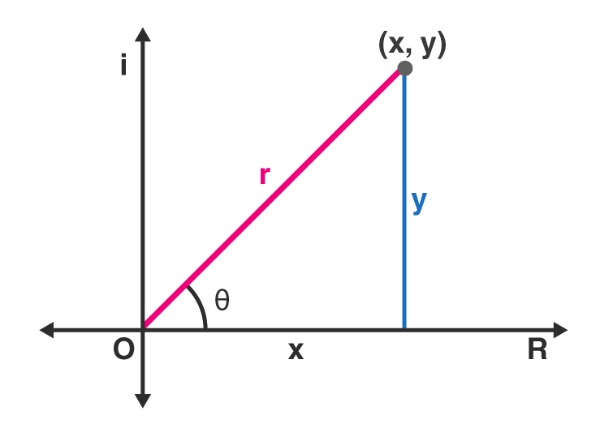
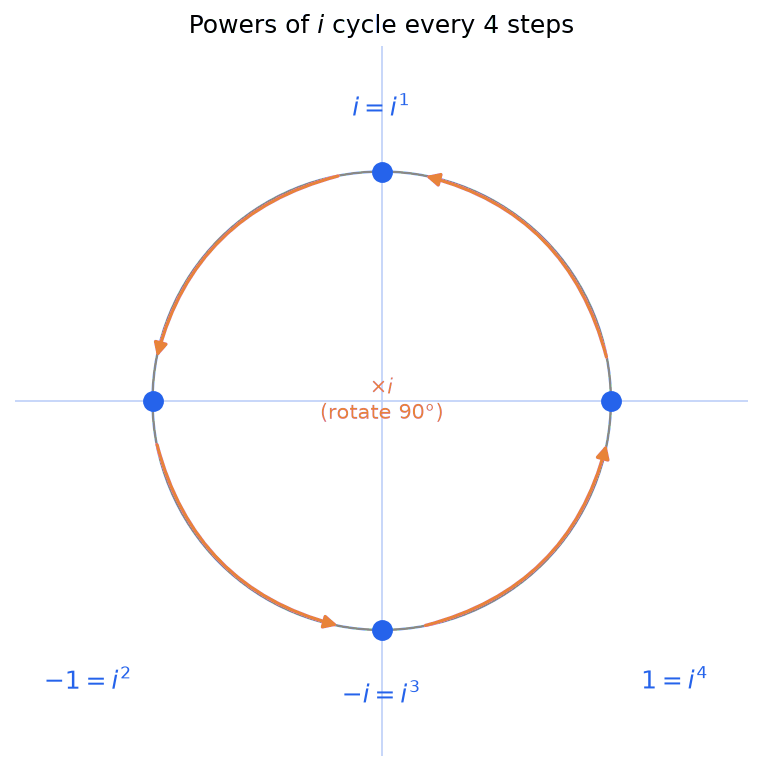
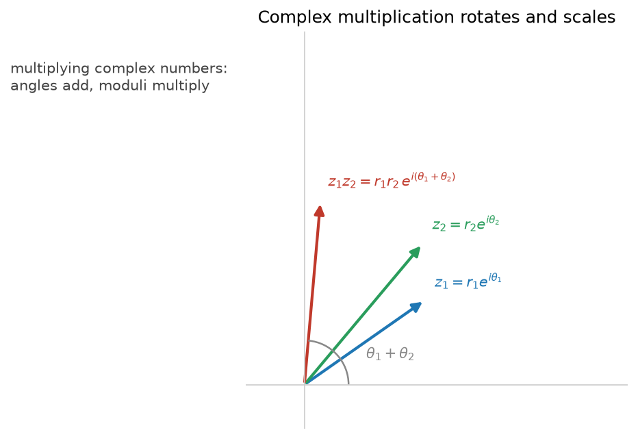

## The Problem: Some Equations Have No Real Solution

Try solving this equation: $x^2 = -1$. You need a number that, when multiplied by itself, gives $-1$. But any positive number squared is positive, and any negative number squared is also positive, and $0^2 = 0$. No real number works. The equation has no solution among the real numbers.

Complex numbers extend the real numbers to ensure every [polynomial](./polynomial-functions) has roots, as guaranteed by the Fundamental Theorem of Algebra.

### What If We Invented a Solution?

Mathematicians faced this problem for centuries. Their breakthrough was to simply **define** a new number, called $i$, with the property that $i^2 = -1$. This is not a number you can find on the ordinary number line; it is an extension of the number system, created to fill a gap.

Once you have $i$, you can build more new numbers. For example, $2i$ is a number whose square is $-4$ (since $(2i)^2 = 4i^2 = 4 \cdot (-1) = -4$). Numbers like $i$, $2i$, $-3i$, and $\frac{1}{2}i$ are called **imaginary numbers**.

### From Real to Imaginary to Complex

- **Real numbers** are the familiar numbers on the number line: $1, -3, 0.5, \pi, \sqrt{2}$.
- **Imaginary numbers** are real multiples of $i$: $2i, -7i, \frac{\sqrt{3}}{2}i$.
- **Complex numbers** combine both: a real part plus an imaginary part, written as $a + bi$ where $a$ and $b$ are real numbers.

Every real number is also a complex number (with $b = 0$), and every imaginary number is also a complex number (with $a = 0$).

### Why Mathematicians Did This

The primary motivation was the **Fundamental Theorem of Algebra**: every polynomial equation of degree $n$ has exactly $n$ roots (counting multiplicity) if we allow complex numbers. Without complex numbers, equations like $x^2 + 1 = 0$ have no roots at all. With complex numbers, every polynomial can be completely factored, and the theory of equations becomes clean and complete.

## Definition

**Complex number:** A complex number is a combination of a real number and an imaginary number, written in the form $a + bi$ where $a$ and $b$ are real and $i^2 = -1$. The real number $a$ is the **real part** and the real number $b$ is the **imaginary part**.

Complex numbers allow solutions to all polynomial equations, even those that have no solutions among the real numbers.

For example, the equation $(x + 1)^2 = -9$ has no real solution, because the square of a real number cannot be negative. Over the complex numbers it has the two nonreal solutions $-1 + 3i$ and $-1 - 3i$, since $(-1 + 3i + 1)^2 = (3i)^2 = 9i^2 = -9$.

## Complex Plane

**Complex plane:** The complex plane is a two-dimensional plane used to visualize complex numbers geometrically. It has a horizontal **real axis** and a perpendicular vertical **imaginary axis**.

A complex number $a + bi$ is plotted on this plane just as the ordered pair $(a, b)$ would be plotted on the Cartesian coordinate plane: the real part $a$ gives the horizontal coordinate, and the imaginary part $b$ gives the vertical coordinate. In this correspondence the real axis plays the role of the $x$-axis and the imaginary axis plays the role of the $y$-axis.

### Polar (Trigonometric) Form

**Polar form (trigonometric form):** The polar form is an alternative way to describe a complex number, using its distance from the origin and its angle rather than its real and imaginary parts. Instead of locating the point by horizontal and vertical coordinates, polar form locates it by the length $r$ of the segment from the origin to the point and the angle $\theta$ that segment makes with the positive real axis.

## Imaginary Unit

**Imaginary unit:** The imaginary unit $i$ is the number defined by the property

$$i^2 = -1, \qquad \text{equivalently} \qquad i = \sqrt{-1}.$$

No real number satisfies this equation, so $i$ is not a point on the ordinary number line; it is a new number introduced to extend the real number system. Defining $i$ this way is exactly what makes square roots of negative numbers possible: for any positive real $c$, we have $\sqrt{-c} = i\sqrt{c}$, because $(i\sqrt{c})^2 = i^2 c = -c$.

For example, $\sqrt{-9} = i\sqrt{9} = 3i$, and $\sqrt{-5} = i\sqrt{5}$.

**Powers of i:**

The powers of $i$ follow a cyclic pattern:

- $i^1 = i$
- $i^2 = -1$
- $i^3 = i^2 \cdot i = -1 \cdot i = -i$
- $i^4 = i^2 \cdot i^2 = (-1)(-1) = 1$
- $i^5 = i^4 \cdot i = 1 \cdot i = i$ (cycle repeats)

**General Formula:** To find $i^n$, divide $n$ by 4 and use the remainder:
- Remainder 0: $i^n = 1$
- Remainder 1: $i^n = i$
- Remainder 2: $i^n = -1$
- Remainder 3: $i^n = -i$

**Example:** Find $i^{47}$

$47 \div 4 = 11$ remainder $3$

Therefore: $i^{47} = i^3 = -i$

**Negative exponents:** The same cycle runs backwards. Since $i \cdot (-i) = -i^2 = 1$, the reciprocal of $i$ is

$$i^{-1} = \frac{1}{i} = -i.$$

To evaluate $i^n$ for a negative integer $n$, take the remainder of $n$ divided by $4$ but choose the non-negative remainder (in $\{0, 1, 2, 3\}$), which is the same as adding a multiple of $4$ to $n$ until the exponent is non-negative, then reading off the value above.

**Example:** Find $i^{-9}$. Adding $12$ (a multiple of $4$) gives $i^{-9} = i^{-9 + 12} = i^{3} = -i$. Equivalently, $-9 = 4(-3) + 3$, so the non-negative remainder is $3$ and $i^{-9} = i^3 = -i$.

## Standard Form (Rectangular Form)

**Standard Form:** A complex number in standard form is written as:

$$z = a + bi$$

Where:
- $a$ = real part, denoted $\text{Re}(z)$
- $b$ = imaginary part, denoted $\text{Im}(z)$
- Both $a$ and $b$ are real numbers

**Examples:**
- $3 + 4i$ (real part: 3, imaginary part: 4)
- $-2 + 5i$ (real part: -2, imaginary part: 5)
- $7$ (real part: 7, imaginary part: 0, purely real)
- $-3i$ (real part: 0, imaginary part: -3, purely imaginary)

## Operations with Complex Numbers

### Addition and Subtraction

**Addition:** Add real parts and imaginary parts separately.

$$(a + bi) + (c + di) = (a + c) + (b + d)i$$

**Example 1:** $(3 + 4i) + (2 + 5i) = 5 + 9i$

**Example 2:** $(-1 + 3i) + (4 - 2i) = 3 + i$

**Subtraction:** Subtract real parts and imaginary parts separately.

$$(a + bi) - (c + di) = (a - c) + (b - d)i$$

**Example 1:** $(7 + 2i) - (3 + 5i) = 4 - 3i$

**Example 2:** $(5 - 4i) - (-2 + 3i) = 7 - 7i$

### Multiplication

**Multiplication:** Use FOIL and remember $i^2 = -1$.

$$(a + bi)(c + di) = ac + adi + bci + bdi^2 = (ac - bd) + (ad + bc)i$$

**Example 1:** $(3 + 2i)(1 + 4i)$

$$= 3 + 12i + 2i + 8i^2 = 3 + 14i - 8 = -5 + 14i$$

**Example 2:** $(2 + 3i)(2 - 3i) = 4 - 9i^2 = 4 + 9 = 13$

### Division

**Division:** Multiply by conjugate of denominator.

$$\frac{a + bi}{c + di} = \frac{a + bi}{c + di} \cdot \frac{c - di}{c - di}$$

**Example:** $\frac{2 + 3i}{1 + 2i}$

$$= \frac{(2 + 3i)(1 - 2i)}{(1 + 2i)(1 - 2i)} = \frac{8 - i}{5} = \frac{8}{5} - \frac{1}{5}i$$

## Complex Conjugate

**Complex Conjugate:** The conjugate of $z = a + bi$ is:

$$\bar{z} = a - bi$$

**Properties:**

1. $z \cdot \bar{z} = a^2 + b^2$ (always real!)
2. $z + \bar{z} = 2a$
3. $z - \bar{z} = 2bi$

**Use:** Eliminates $i$ from denominators in division.

## Modulus (Absolute Value)

**Modulus:** The modulus of $z = a + bi$ is:

$$|z| = \sqrt{a^2 + b^2}$$

Distance from origin in complex plane.

**Examples:**

1. $|3 + 4i| = \sqrt{9 + 16} = 5$
2. $|-2 + 5i| = \sqrt{4 + 25} = \sqrt{29}$

## Polar Form

**Polar Form:** 

$$z = r(\cos\theta + i\sin\theta) = re^{i\theta}$$

Where:
- $r = |z| = \sqrt{a^2 + b^2}$ (modulus)
- $\theta = \arg(z)$ (argument, the angle from the positive real axis)

**Finding the argument (quadrant adjustment):** The bare formula $\theta = \arctan(b/a)$ is not enough, because $\arctan$ always returns an angle in $(-\tfrac{\pi}{2}, \tfrac{\pi}{2})$, covering only quadrants I and IV (where $a > 0$). It cannot distinguish $a + bi$ from $-a - bi$, since both give the same ratio $b/a$, and it is undefined when $a = 0$. You must adjust based on the quadrant of the point $(a, b)$:

- **Quadrant I or IV** ($a > 0$): $\theta = \arctan(b/a)$
- **Quadrant II or III** ($a < 0$): $\theta = \arctan(b/a) + \pi$
- **$a = 0$, $b > 0$** (positive imaginary axis): $\theta = \tfrac{\pi}{2}$
- **$a = 0$, $b < 0$** (negative imaginary axis): $\theta = -\tfrac{\pi}{2}$

Most calculators and programming languages package this rule as the two-argument function $\operatorname{atan2}(b, a)$, which returns the correct angle in $(-\pi, \pi]$ for every $(a, b) \neq (0, 0)$. Prefer $\operatorname{atan2}(b, a)$ over $\arctan(b/a)$ whenever it is available.

**Converting:**

**Rectangular to Polar:**
1. $r = \sqrt{a^2 + b^2}$
2. $\theta = \operatorname{atan2}(b, a)$, or apply the quadrant-adjustment rule above

**Polar to Rectangular:**
1. $a = r\cos\theta$
2. $b = r\sin\theta$

## Euler's Formula

**Euler's Formula:** For any real number $\theta$:

$$e^{i\theta} = \cos\theta + i\sin\theta$$

This single equation connects three seemingly unrelated areas of mathematics: exponential functions, trigonometry, and complex numbers. It says that raising $e$ to an imaginary power produces a point on the unit circle in the complex plane, with the angle $\theta$ measured in radians from the positive real axis.

**Why it works:** The key insight comes from Taylor series. The Taylor series for $e^x$, $\sin x$, and $\cos x$ are:

$$e^x = 1 + x + \frac{x^2}{2!} + \frac{x^3}{3!} + \frac{x^4}{4!} + \cdots$$

$$\cos x = 1 - \frac{x^2}{2!} + \frac{x^4}{4!} - \cdots$$

$$\sin x = x - \frac{x^3}{3!} + \frac{x^5}{5!} - \cdots$$

Substituting $ix$ into the series for $e^x$ and using the fact that $i^2 = -1$, $i^3 = -i$, $i^4 = 1$, the real terms collect into $\cos x$ and the imaginary terms collect into $i\sin x$.

### Euler's Identity

Setting $\theta = \pi$ in Euler's formula gives:

$$e^{i\pi} + 1 = 0$$

This is often called "the most beautiful equation in mathematics" because it ties together five fundamental constants: $e$ (the base of natural logarithms), $i$ (the imaginary unit), $\pi$ (the ratio of a circle's circumference to its diameter), $1$ (the multiplicative identity), and $0$ (the additive identity).

### Polar Form Using Euler's Formula

With Euler's formula, the polar form of a complex number becomes especially compact:

$$z = r(\cos\theta + i\sin\theta) = re^{i\theta}$$

This exponential notation makes multiplication, division, and exponentiation of complex numbers straightforward, as the next section shows.

## Multiplication and Division in Polar Form

Polar form transforms multiplication and division of complex numbers into simple operations on moduli and angles.

### Multiplication

To multiply two complex numbers in polar form, multiply their moduli and add their angles:

$$r_1 e^{i\theta_1} \cdot r_2 e^{i\theta_2} = r_1 r_2 \, e^{i(\theta_1 + \theta_2)}$$

In trigonometric notation:

$$[r_1(\cos\theta_1 + i\sin\theta_1)] \cdot [r_2(\cos\theta_2 + i\sin\theta_2)] = r_1 r_2 [\cos(\theta_1 + \theta_2) + i\sin(\theta_1 + \theta_2)]$$

**Example:** Multiply $z_1 = 3e^{i\pi/6}$ and $z_2 = 2e^{i\pi/3}$

$$z_1 \cdot z_2 = 3 \cdot 2 \, e^{i(\pi/6 + \pi/3)} = 6e^{i\pi/2}$$

Converting back to rectangular form: $6(\cos\frac{\pi}{2} + i\sin\frac{\pi}{2}) = 6(0 + i) = 6i$

**Geometric interpretation:** Multiplying by $z_2 = 2e^{i\pi/3}$ scales the distance from the origin by 2 and rotates the point by $\pi/3$ radians (60 degrees) counterclockwise.

Drag $z_1$ and $z_2$ below to feel the rule directly: the product's length is the product of the lengths, and its angle is the sum of the angles, so multiplying is rotating-and-scaling.

<iframe src="/static/interactive/complex-multiplication-rotation.html" width="100%" height="600" style="border:none;"></iframe>

### Division

To divide two complex numbers in polar form, divide their moduli and subtract their angles:

$$\frac{r_1 e^{i\theta_1}}{r_2 e^{i\theta_2}} = \frac{r_1}{r_2} e^{i(\theta_1 - \theta_2)}$$

**Example:** Divide $z_1 = 4e^{i\cdot 5\pi/6}$ by $z_2 = 2e^{i\pi/3}$

$$\frac{z_1}{z_2} = \frac{4}{2} e^{i(5\pi/6 - \pi/3)} = 2e^{i\pi/2}$$

Converting back: $2(\cos\frac{\pi}{2} + i\sin\frac{\pi}{2}) = 2i$

**Geometric interpretation:** Dividing by $z_2 = 2e^{i\pi/3}$ scales the distance from the origin by $\frac{1}{2}$ and rotates the point by $\pi/3$ radians clockwise.

## De Moivre's Theorem

Polar form uses concepts from [Geometry & Trigonometry](./geometry-trigonometry): the angle $\theta$ and the modulus $r$.

**De Moivre's Theorem:** For any integer $n$:

$$[r(\cos\theta + i\sin\theta)]^n = r^n(\cos(n\theta) + i\sin(n\theta))$$

**Example:** $(1 + i)^{10}$

Convert: $r = \sqrt{2}$, $\theta = \pi/4$

$$(1 + i)^{10} = (\sqrt{2})^{10}(\cos\frac{10\pi}{4} + i\sin\frac{10\pi}{4}) = 32i$$

## nth Roots

The $n$ distinct $n$th roots of $z = r(\cos\theta + i\sin\theta)$:

$$z_k = \sqrt[n]{r}\left(\cos\frac{\theta + 2\pi k}{n} + i\sin\frac{\theta + 2\pi k}{n}\right)$$

For $k = 0, 1, 2, \ldots, n-1$

**Example:** Find the three cube roots of $8i$.

**Step 1: Write $8i$ in polar form.** Here $a = 0$ and $b = 8$, so the modulus is $r = \sqrt{0^2 + 8^2} = 8$. The point lies on the positive imaginary axis, so the argument is $\theta = \tfrac{\pi}{2}$. Thus $8i = 8\left(\cos\tfrac{\pi}{2} + i\sin\tfrac{\pi}{2}\right)$.

**Step 2: Apply the $n$th-root formula with $n = 3$.** Using

$$z_k = \sqrt[3]{r}\left(\cos\frac{\theta + 2\pi k}{3} + i\sin\frac{\theta + 2\pi k}{3}\right),$$

the modulus of each root is $\sqrt[3]{8} = 2$, and the angles are $\dfrac{\pi/2 + 2\pi k}{3}$ for $k = 0, 1, 2$.

**Step 3: Evaluate each root.**

For $k = 0$: the angle is $\dfrac{\pi/2}{3} = \dfrac{\pi}{6}$, so

$$z_0 = 2\left(\cos\tfrac{\pi}{6} + i\sin\tfrac{\pi}{6}\right) = 2\left(\tfrac{\sqrt{3}}{2} + \tfrac{1}{2}i\right) = \sqrt{3} + i.$$

For $k = 1$: the angle is $\dfrac{\pi/2 + 2\pi}{3} = \dfrac{5\pi}{6}$, so

$$z_1 = 2\left(\cos\tfrac{5\pi}{6} + i\sin\tfrac{5\pi}{6}\right) = 2\left(-\tfrac{\sqrt{3}}{2} + \tfrac{1}{2}i\right) = -\sqrt{3} + i.$$

For $k = 2$: the angle is $\dfrac{\pi/2 + 4\pi}{3} = \dfrac{3\pi}{2}$, so

$$z_2 = 2\left(\cos\tfrac{3\pi}{2} + i\sin\tfrac{3\pi}{2}\right) = 2\left(0 - i\right) = -2i.$$

The three cube roots of $8i$ are therefore $\sqrt{3} + i$, $-\sqrt{3} + i$, and $-2i$. Geometrically they are equally spaced around a circle of radius $2$, separated by $\tfrac{2\pi}{3}$ radians (120 degrees). You can check the first: $(\sqrt{3} + i)^3 = 8i$.

## The Complex Exponential and Logarithm

Euler's formula extends the exponential to any complex input. Writing $z = x + iy$,

$$e^z = e^{x + iy} = e^x(\cos y + i\sin y),$$

so $e^z$ has modulus $e^x$ and argument $y$. This is the natural setting for the complex **logarithm**, the inverse of $e^z$.

**Definition.** For a nonzero complex number $z = re^{i\theta}$ (modulus $r = |z|$, argument $\theta$),

$$\ln z = \ln r + i\theta = \ln|z| + i\arg(z).$$

The real part is the ordinary natural log of the modulus; the imaginary part is the angle.

**It is multivalued.** Because the argument is only defined up to full turns (rotating by $2\pi$ lands on the same point), the logarithm has infinitely many values:

$$\ln z = \ln|z| + i(\theta + 2\pi k), \qquad k \in \mathbb{Z}.$$

Restricting the argument to $(-\pi, \pi]$ selects the single **principal value**, written $\operatorname{Log} z$.

**Example.** $\ln(-1)$: here $|-1| = 1$ and $\arg(-1) = \pi$, so

$$\ln(-1) = \ln 1 + i\pi = i\pi,$$

which is Euler's identity $e^{i\pi} = -1$ read backwards. This is *why* the real logarithm is undefined for negative numbers: their logarithms are complex, not real (the full set of values is $i\pi + 2\pi i k$). See the pointer from [Logarithms](./logarithms#undefined-values).

**Example.** $\ln(2i)$: here $|2i| = 2$ and $\arg(2i) = \tfrac{\pi}{2}$, so the principal value is $\operatorname{Log}(2i) = \ln 2 + i\tfrac{\pi}{2}$.

## Complex Zeros of Polynomials

Complex numbers complete the picture of polynomial factoring. Over the real numbers, some polynomials cannot be factored completely (for example, $x^2 + 1$ has no real roots). Over the complex numbers, every polynomial factors into linear terms.

### Conjugate Pairs Theorem

**Conjugate Pairs Theorem:** If a polynomial has **real coefficients** and $a + bi$ (with $b \neq 0$) is a root, then its conjugate $a - bi$ is also a root.

This happens because complex conjugation "passes through" real coefficients. If you substitute $a + bi$ into a polynomial with real coefficients and get zero, then substituting $a - bi$ also gives zero; the conjugation distributes over addition and multiplication, and real coefficients are unchanged by conjugation.

**Consequence:** Nonreal complex roots of real-coefficient polynomials always come in pairs. This means a polynomial of odd degree with real coefficients must have at least one real root (since complex roots pair up, at least one root is left over).

### Factoring Completely over $\mathbb{C}$

The Fundamental Theorem of Algebra (see [Polynomial Functions](./polynomial-functions)) guarantees that every polynomial of degree $n$ has exactly $n$ roots in $\mathbb{C}$, counting multiplicity. This means every polynomial can be written as a product of linear factors over the complex numbers:

$$p(x) = a_n(x - r_1)(x - r_2) \cdots (x - r_n)$$

where $r_1, r_2, \ldots, r_n$ are the (possibly repeated, possibly complex) roots.

**Example:** Factor $p(x) = x^4 - 1$ completely over $\mathbb{C}$.

Over $\mathbb{R}$, we get: $x^4 - 1 = (x^2 - 1)(x^2 + 1) = (x-1)(x+1)(x^2+1)$

The factor $x^2 + 1$ has no real roots, but over $\mathbb{C}$ its roots are $i$ and $-i$:

$$x^4 - 1 = (x - 1)(x + 1)(x - i)(x + i)$$

**Example:** Find all zeros of $p(x) = x^3 - x^2 + x - 1$.

Factor by grouping: $x^2(x - 1) + 1(x - 1) = (x-1)(x^2 + 1)$

The real root is $x = 1$. The factor $x^2 + 1 = 0$ gives $x = \pm i$.

All zeros: $1, i, -i$. Note that $i$ and $-i$ form a conjugate pair.

Complete factorization: $p(x) = (x - 1)(x - i)(x + i)$

## Where Complex Numbers Show Up

Complex numbers are far more than a device for solving quadratics; they are the natural language for anything involving rotation, oscillation, or frequency.

- **Rotations in the plane.** Multiplying by $e^{i\theta}$ rotates a point about the origin by angle $\theta$ (and multiplying by $re^{i\theta}$ also scales by $r$). This makes complex multiplication the cleanest description of 2D rotation, and it is the ancestor of quaternions for 3D rotation in graphics and robotics.
- **The Fourier transform.** Signals are decomposed into complex exponentials $e^{2\pi i f t}$, one per frequency. The **Fast Fourier Transform (FFT)** is one of the most important algorithms in computing, underpinning audio and image processing, data compression, and fast convolution. The [$n$th roots of unity](#nth-roots) above are exactly the sample points the FFT evaluates.
- **Waves and oscillations.** Alternating-current circuits, quantum mechanics (whose state amplitudes are complex numbers), and any oscillating system are described with complex exponentials, because $e^{i\omega t}$ packages amplitude and phase into a single number.
- **Machine learning.** Fourier features and spectral methods bring complex analysis into ML; convolution (a core neural-network operation) is multiplication in the frequency domain, and complex-valued networks are used for signal-heavy domains.

