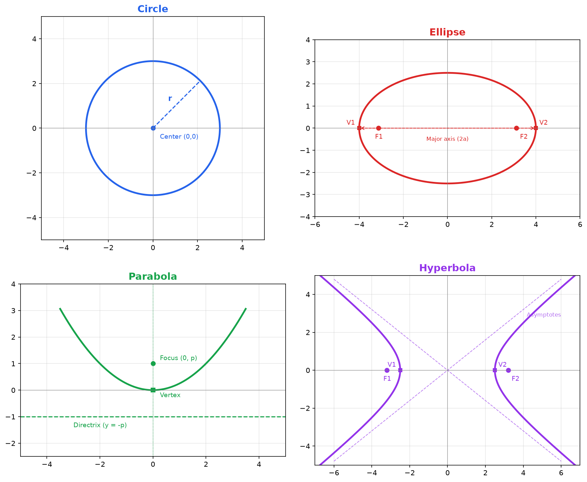

## What Are Conic Sections?

A **conic section** is the curve formed when a plane intersects a double-napped cone (two identical cones joined at their tips). By varying the angle and position of the slicing plane, we get four distinct curves:

1. **Circle**: the plane cuts perpendicular to the cone's axis
2. **Ellipse**: the plane cuts at an angle, but still intersects only one nappe
3. **Parabola**: the plane is parallel to one edge (slant height) of the cone
4. **Hyperbola**: the plane cuts through both nappes of the cone

### Why Do Conics Matter?

Conic sections appear throughout science, engineering, and mathematics:

- **Planetary orbits** are ellipses (Kepler's First Law)
- **Satellite dishes** and **headlights** use parabolic reflectors to focus signals and light
- **GPS and LORAN navigation** rely on hyperbolic curves to determine position
- **Cross-sections of cylinders** cut at an angle produce ellipses
- **Machine learning**: the contour lines of a 2D Gaussian distribution are ellipses, with the covariance matrix controlling their shape

---

## Parabolas

### Definition

A **parabola** is the set of all points in the plane that are equidistant from a fixed point called the **focus** and a fixed line called the **directrix**.

For any point $P$ on the parabola:

$$
\text{distance}(P, \text{focus}) = \text{distance}(P, \text{directrix})
$$

### Standard Forms

**Vertical axis of symmetry** (opens up or down):

$$
(x - h)^2 = 4p(y - k)
$$

- Vertex: $(h, k)$
- Focus: $(h, k + p)$
- Directrix: $y = k - p$
- Opens **up** if $p > 0$, **down** if $p < 0$

**Horizontal axis of symmetry** (opens left or right):

$$
(y - k)^2 = 4p(x - h)
$$

- Vertex: $(h, k)$
- Focus: $(h + p, k)$
- Directrix: $x = h - p$
- Opens **right** if $p > 0$, **left** if $p < 0$

### Key Features

- **Vertex**: the turning point of the parabola, located midway between the focus and directrix
- **Axis of symmetry**: the line through the vertex and focus
- **Latus rectum**: the chord through the focus perpendicular to the axis of symmetry; its length is $|4p|$

### Connection to $y = ax^2$

The familiar form $y = ax^2$ is the special case with vertex at the origin. Setting $(x - 0)^2 = 4p(y - 0)$ gives $x^2 = 4py$, so $y = \frac{x^2}{4p}$. Comparing with $y = ax^2$:

$$
a = \frac{1}{4p} \quad \Longleftrightarrow \quad p = \frac{1}{4a}
$$

### Graphing Procedure

1. Write the equation in standard form $(x-h)^2 = 4p(y-k)$ or $(y-k)^2 = 4p(x-h)$
2. Identify the vertex $(h, k)$
3. Determine $p$ and the direction the parabola opens
4. Plot the focus and draw the directrix
5. Find the endpoints of the latus rectum (each is $|2p|$ units from the focus along the latus rectum)
6. Sketch the curve through the vertex and latus rectum endpoints

### Worked Example: Find Focus and Directrix

**Problem**: Find the focus and directrix of $y = 2x^2$.

**Solution**: Rewrite as $x^2 = \frac{1}{2}y$. Comparing with $x^2 = 4py$:

$$
4p = \frac{1}{2} \implies p = \frac{1}{8}
$$

Since $p > 0$, the parabola opens upward.

- **Vertex**: $(0, 0)$
- **Focus**: $(0, \frac{1}{8})$
- **Directrix**: $y = -\frac{1}{8}$

### Worked Example: Write Equation from Focus and Directrix

**Problem**: Find the equation of a parabola with focus $(0, 3)$ and directrix $y = -3$.

**Solution**: The vertex is midway between the focus and directrix:

$$
\text{Vertex} = \left(0, \frac{3 + (-3)}{2}\right) = (0, 0)
$$

The focus is above the vertex, so the parabola opens upward with $p = 3$.

$$
x^2 = 4(3)y = 12y
$$

$$
y = \frac{x^2}{12}
$$

### Applications

- **Parabolic reflectors**: Any signal arriving parallel to the axis of a parabolic dish reflects to the focus. This is why satellite dishes, radio telescopes, and car headlights (in reverse) use parabolic shapes.
- **Projectile motion**: The path of a projectile under gravity (ignoring air resistance) is a parabola.

---

## Ellipses

### Definition

An **ellipse** is the set of all points in the plane where the **sum** of the distances to two fixed points (the **foci**) is constant.

For any point $P$ on the ellipse with foci $F_1$ and $F_2$:

$$
d(P, F_1) + d(P, F_2) = 2a
$$

where $2a$ is the length of the major axis.

### Standard Form

$$
\frac{(x - h)^2}{a^2} + \frac{(y - k)^2}{b^2} = 1
$$

- **Center**: $(h, k)$
- If $a > b$: the **major axis is horizontal**
  - Vertices: $(h \pm a, k)$
  - Co-vertices: $(h, k \pm b)$
  - Foci: $(h \pm c, k)$
- If $b > a$: the **major axis is vertical**
  - Vertices: $(h, k \pm b)$
  - Co-vertices: $(h \pm a, k)$
  - Foci: $(h, k \pm c)$

### The Relationship $c^2 = a^2 - b^2$

The distance $c$ from the center to each focus satisfies:

$$
c^2 = a^2 - b^2
$$

where $a$ is the semi-major axis and $b$ is the semi-minor axis. Since the foci lie inside the ellipse, $c < a$, which guarantees $a^2 - b^2 > 0$.

### Eccentricity

The **eccentricity** of an ellipse measures how elongated it is:

$$
e = \frac{c}{a}, \quad 0 \leq e < 1
$$

- $e = 0$: the ellipse is a circle ($c = 0$, so $a = b$)
- As $e \to 1$: the ellipse becomes more elongated and "cigar-shaped"
- Earth's orbit has $e \approx 0.017$ (nearly circular)
- Pluto's orbit has $e \approx 0.25$ (noticeably elliptical)

### Graphing Procedure

1. Write in standard form and identify the center $(h, k)$
2. Determine $a$ and $b$ (the larger denominator is $a^2$ for the major axis direction)
3. Plot the center, vertices, and co-vertices
4. Compute $c = \sqrt{a^2 - b^2}$ and plot the foci
5. Sketch the ellipse through the four plotted points

### Worked Example: Graph and Find Foci

**Problem**: Graph $\frac{x^2}{25} + \frac{y^2}{9} = 1$ and find the foci.

**Solution**: This is centered at the origin with $a^2 = 25$ and $b^2 = 9$.

Since $25 > 9$, the major axis is horizontal.

- $a = 5$, $b = 3$
- **Vertices**: $(\pm 5, 0)$
- **Co-vertices**: $(0, \pm 3)$
- $c = \sqrt{25 - 9} = \sqrt{16} = 4$
- **Foci**: $(\pm 4, 0)$
- **Eccentricity**: $e = \frac{4}{5} = 0.8$

### Worked Example: Equation from Foci and Vertices

**Problem**: Write the equation of an ellipse with foci $(0, \pm 3)$ and vertices $(0, \pm 5)$.

**Solution**: The foci and vertices lie on the $y$-axis, so the major axis is vertical.

- $c = 3$, $a = 5$
- $b^2 = a^2 - c^2 = 25 - 9 = 16$

$$
\frac{x^2}{16} + \frac{y^2}{25} = 1
$$

### Connection to Machine Learning

The contour lines (level curves) of a 2D Gaussian distribution

$$
f(x, y) = \frac{1}{2\pi|\Sigma|^{1/2}} \exp\left(-\frac{1}{2} \mathbf{x}^T \Sigma^{-1} \mathbf{x}\right)
$$

are ellipses. The **eigenvalues** of the covariance matrix $\Sigma$ determine the lengths of the ellipse's axes, and the **eigenvectors** determine the orientation. Understanding ellipses is essential for visualizing Gaussian distributions, Mahalanobis distance, and confidence regions.

---

## Hyperbolas

### Definition

A **hyperbola** is the set of all points in the plane where the **absolute difference** of the distances to two fixed points (the **foci**) is constant.

For any point $P$ on the hyperbola with foci $F_1$ and $F_2$:

$$
|d(P, F_1) - d(P, F_2)| = 2a
$$

### Standard Forms

**Horizontal transverse axis** (opens left and right):

$$
\frac{(x - h)^2}{a^2} - \frac{(y - k)^2}{b^2} = 1
$$

- Center: $(h, k)$
- Vertices: $(h \pm a, k)$
- Foci: $(h \pm c, k)$
- Asymptotes: $y - k = \pm \frac{b}{a}(x - h)$

**Vertical transverse axis** (opens up and down):

$$
\frac{(y - k)^2}{a^2} - \frac{(x - h)^2}{b^2} = 1
$$

- Center: $(h, k)$
- Vertices: $(h, k \pm a)$
- Foci: $(h, k \pm c)$
- Asymptotes: $y - k = \pm \frac{a}{b}(x - h)$

### The Relationship $c^2 = a^2 + b^2$

Unlike the ellipse, the foci of a hyperbola lie **outside** the vertices, so:

$$
c^2 = a^2 + b^2
$$

This means $c > a$ always.

### Eccentricity

$$
e = \frac{c}{a}, \quad e > 1
$$

- As $e \to 1^+$: the hyperbola's branches are narrow and close together
- As $e$ increases: the branches open wider

### Asymptotes and the Box Method

The asymptotes are lines that the hyperbola approaches but never touches. To graph a hyperbola:

1. Plot the center $(h, k)$
2. From the center, mark $a$ units along the transverse axis and $b$ units along the conjugate axis
3. Draw a rectangle (the "box") with these dimensions, centered at $(h, k)$
4. Draw the diagonals of the box; these are the asymptotes
5. Plot the vertices on the transverse axis
6. Sketch each branch approaching the asymptotes

### Worked Example: Graph and Find Asymptotes

**Problem**: Graph $\frac{x^2}{16} - \frac{y^2}{9} = 1$ and find the asymptotes and foci.

**Solution**: Center is at the origin. The positive term is under $x^2$, so the transverse axis is horizontal.

- $a^2 = 16$, so $a = 4$
- $b^2 = 9$, so $b = 3$
- **Vertices**: $(\pm 4, 0)$
- $c = \sqrt{16 + 9} = \sqrt{25} = 5$
- **Foci**: $(\pm 5, 0)$
- **Asymptotes**: $y = \pm \frac{3}{4}x$
- **Eccentricity**: $e = \frac{5}{4} = 1.25$

### Worked Example: Equation from Vertices and Foci

**Problem**: Write the equation of a hyperbola with vertices $(0, \pm 4)$ and foci $(0, \pm 5)$.

**Solution**: Vertices and foci are on the $y$-axis, so the transverse axis is vertical.

- $a = 4$, $c = 5$
- $b^2 = c^2 - a^2 = 25 - 16 = 9$

$$
\frac{y^2}{16} - \frac{x^2}{9} = 1
$$

### Applications

- **GPS and LORAN**: These systems determine position by measuring the difference in arrival times of signals from two known transmitters. Each time difference defines a hyperbola, and the intersection of two hyperbolas gives the location.
- **Sonic booms**: The shock wave from a supersonic aircraft forms a cone; its intersection with the ground is a hyperbola.

---

## Circles

A **circle** is a special case of the ellipse where $a = b$ (eccentricity $e = 0$). Since circles appear extensively in geometry and trigonometry, this section focuses on the algebraic forms.

### Standard Form

$$
(x - h)^2 + (y - k)^2 = r^2
$$

- **Center**: $(h, k)$
- **Radius**: $r$

### General Form

$$
x^2 + y^2 + Dx + Ey + F = 0
$$

To convert to standard form, complete the square for both $x$ and $y$.

### Worked Example: Convert to Standard Form

**Problem**: Convert $x^2 + y^2 - 6x + 4y - 3 = 0$ to standard form and identify the center and radius.

**Solution**: Group and complete the square:

$$
(x^2 - 6x) + (y^2 + 4y) = 3
$$

$$
(x^2 - 6x + 9) + (y^2 + 4y + 4) = 3 + 9 + 4
$$

$$
(x - 3)^2 + (y + 2)^2 = 16
$$

- **Center**: $(3, -2)$
- **Radius**: $r = 4$

---

## The General Second-Degree Equation

Every conic section (including degenerate cases) can be written in the form:

$$
Ax^2 + Bxy + Cy^2 + Dx + Ey + F = 0
$$

### Identifying the Conic (When $B = 0$)

When there is no $xy$ term, classification is straightforward:

| Condition | Conic |
|---|---|
| $A = C$ (and both nonzero) | Circle |
| $A \neq C$, same sign | Ellipse |
| $A$ and $C$ opposite signs | Hyperbola |
| $A = 0$ or $C = 0$ (not both) | Parabola |

### The Discriminant (When $B \neq 0$)

When the equation includes an $xy$ term, the **discriminant** $B^2 - 4AC$ determines the type:

| Discriminant | Conic |
|---|---|
| $B^2 - 4AC < 0$ | Ellipse (or circle) |
| $B^2 - 4AC = 0$ | Parabola |
| $B^2 - 4AC > 0$ | Hyperbola |

The $xy$ term indicates the conic has been **rotated** from standard position. Removing it requires a rotation of axes, which is typically covered in more advanced courses.

### Degenerate Conics

Sometimes the general equation does not produce a curve at all. These **degenerate cases** occur when the plane passes through the apex of the cone:

- **A single point**: e.g., $x^2 + y^2 = 0$ (only the origin satisfies this)
- **A single line**: e.g., $x^2 = 0$ (the $y$-axis)
- **Two intersecting lines**: e.g., $x^2 - y^2 = 0$, which factors as $(x-y)(x+y) = 0$
- **The empty set**: e.g., $x^2 + y^2 = -1$ (no real solutions)

---

## Completing the Square to Identify Conics

When given a general second-degree equation, completing the square transforms it into a recognizable standard form.

### Worked Example: Classify and Graph

**Problem**: Classify and graph $4x^2 + 9y^2 - 16x + 18y - 11 = 0$.

**Step 1**: Group by variable and factor out the leading coefficients:

$$
4(x^2 - 4x) + 9(y^2 + 2y) = 11
$$

**Step 2**: Complete the square in each group:

$$
4(x^2 - 4x + 4) + 9(y^2 + 2y + 1) = 11 + 16 + 9
$$

$$
4(x - 2)^2 + 9(y + 1)^2 = 36
$$

**Step 3**: Divide both sides by 36 to get standard form:

$$
\frac{(x - 2)^2}{9} + \frac{(y + 1)^2}{4} = 1
$$

**Classification**: This is an **ellipse**.

- **Center**: $(2, -1)$
- $a^2 = 9$, $b^2 = 4$, so $a = 3$, $b = 2$
- Major axis is horizontal (since $9 > 4$)
- **Vertices**: $(2 \pm 3, -1) = (-1, -1)$ and $(5, -1)$
- **Co-vertices**: $(2, -1 \pm 2) = (2, -3)$ and $(2, 1)$
- $c = \sqrt{9 - 4} = \sqrt{5} \approx 2.24$
- **Foci**: $(2 \pm \sqrt{5}, -1)$
- **Eccentricity**: $e = \frac{\sqrt{5}}{3} \approx 0.745$

---

## Summary of Standard Forms

| Conic | Standard Form | Key Relationship |
|---|---|---|
| Circle | $(x-h)^2 + (y-k)^2 = r^2$ | All points distance $r$ from center |
| Ellipse | $\frac{(x-h)^2}{a^2} + \frac{(y-k)^2}{b^2} = 1$ | $c^2 = a^2 - b^2$ |
| Parabola | $(x-h)^2 = 4p(y-k)$ | $a = \frac{1}{4p}$ |
| Hyperbola | $\frac{(x-h)^2}{a^2} - \frac{(y-k)^2}{b^2} = 1$ | $c^2 = a^2 + b^2$ |

| Conic | Eccentricity | Shape Interpretation |
|---|---|---|
| Circle | $e = 0$ | Perfect symmetry in all directions |
| Ellipse | $0 < e < 1$ | Closer to 0 means more circular |
| Parabola | $e = 1$ | The boundary case between ellipse and hyperbola |
| Hyperbola | $e > 1$ | Larger $e$ means wider opening |

> **Unifying perspective**: All conic sections can be defined as the locus of points where the ratio of distance-to-focus to distance-to-directrix equals the eccentricity $e$. The value of $e$ determines the shape: $e < 1$ gives an ellipse, $e = 1$ a parabola, and $e > 1$ a hyperbola.
