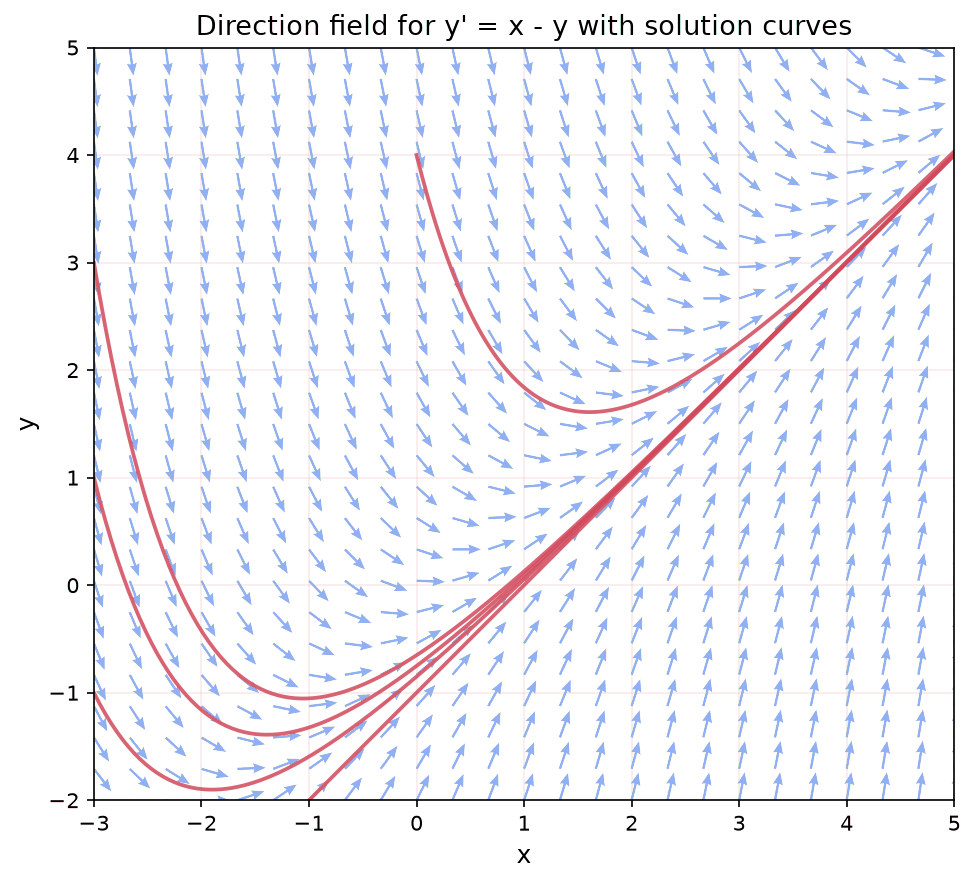

A differential equation is an equation that involves a function and its derivatives. Where algebra asks "solve for $x$" and the answer is a number, a differential equation asks "solve for $y(x)$" and the answer is a function.

You already know the prototype: if $\frac{dy}{dx} = 2x$, what function $y$ has derivative $2x$? From [Calculus](./calculus), the answer is $y = x^2 + C$, where $C$ is any constant. That is a differential equation, and you just solved it by integrating. But most differential equations are not so simple, because the equation can involve $y$ itself (not just $x$), creating a relationship between a function and its own rate of change.

Differential equations are the language of dynamics. Anything that evolves over time (populations, temperatures, electrical circuits, neural network training) is governed by differential equations. In ML, gradient descent is a differential equation on the parameter space, and understanding its behavior requires the tools developed here.

This page builds on [Calculus](./calculus) (derivatives, integrals), [Multivariable Calculus](./multivariable-calculus) (partial derivatives, gradients), and [Linear Algebra Foundations](./linear-algebra-foundations) (eigenvalues, matrix operations).

## What is a Differential Equation?

### The Basic Idea

A **differential equation** (DE) is any equation that contains derivatives of an unknown function. The goal is to find the function itself.

**Example 1:** $\frac{dy}{dx} = 2x$. This says "find a function whose derivative is $2x$." Integrating both sides: $y = x^2 + C$.

**Example 2:** $\frac{dy}{dx} = y$. This says "find a function that equals its own derivative." The answer is $y = Ce^x$, since $\frac{d}{dx}(Ce^x) = Ce^x$.

**Example 3:** $\frac{dy}{dx} = -y$. Find a function whose derivative is its own negation. Answer: $y = Ce^{-x}$, since $\frac{d}{dx}(Ce^{-x}) = -Ce^{-x} = -y$.

Notice the pattern: the solution to a DE is a **function** (or family of functions), not a number.

### ODE vs PDE

An **ordinary differential equation** (ODE) involves a function of one variable and its ordinary derivatives:

$$
\frac{dy}{dx} + 3y = \sin(x)
$$

A **partial differential equation** (PDE) involves a function of multiple variables and partial derivatives:

$$
\frac{\partial u}{\partial t} = k \frac{\partial^2 u}{\partial x^2}
$$

This is the heat equation: it describes how temperature $u(x, t)$ changes in both space and time. PDEs arise in physics and deep learning (e.g., the neural tangent kernel theory uses PDEs), but this page focuses on ODEs.

### Order and Linearity

The **order** of a DE is the highest derivative that appears:

- $y' + 2y = 0$ is first-order (highest derivative is $y'$)
- $y'' + 3y' + 2y = 0$ is second-order (highest derivative is $y''$)
- $y''' = y$ is third-order

A DE is **linear** if the unknown function $y$ and its derivatives appear only to the first power and are not multiplied together:

- $y'' + 3y' + 2y = \sin(x)$ is linear
- $y' + y^2 = 0$ is nonlinear (because of $y^2$)
- $(y')^2 + y = 0$ is nonlinear (because of $(y')^2$)
- $yy' = 1$ is nonlinear (because $y$ and $y'$ are multiplied)

Linear DEs are much easier to solve and have a well-developed theory. Nonlinear DEs are harder but arise constantly in applications (including ML).

### General and Particular Solutions

The **general solution** of a DE is the family of all solutions, typically containing arbitrary constants. The number of constants equals the order of the DE.

**Example:** The general solution of $y'' + y = 0$ is $y = C_1 \cos(x) + C_2 \sin(x)$, with two constants (because it is second-order).

A **particular solution** is one specific solution obtained by choosing values for the constants.

### Initial Value Problems

An **initial value problem** (IVP) is a DE together with conditions that pin down the constants:

$$
\frac{dy}{dx} = 2x, \quad y(0) = 5
$$

The general solution is $y = x^2 + C$. Applying $y(0) = 5$: $5 = 0 + C$, so $C = 5$. The particular solution is $y = x^2 + 5$.

For an $n$th-order ODE, you need $n$ initial conditions (typically the value of $y$ and its first $n-1$ derivatives at a single point) to determine a unique solution.

## First-Order ODEs

### Separable Equations

A first-order ODE is **separable** if it can be written as:

$$
\frac{dy}{dx} = f(x) \cdot g(y)
$$

The strategy: separate the variables (put all $y$ terms on one side, all $x$ terms on the other), then integrate both sides.

$$
\frac{1}{g(y)} \, dy = f(x) \, dx \quad \Rightarrow \quad \int \frac{1}{g(y)} \, dy = \int f(x) \, dx
$$

**Worked example:** Solve $\frac{dy}{dx} = xy$.

Separate: $\frac{1}{y} \, dy = x \, dx$.

Integrate both sides:

$$
\int \frac{1}{y} \, dy = \int x \, dx
$$

$$
\ln|y| = \frac{x^2}{2} + C_1
$$

Exponentiate:

$$
|y| = e^{x^2/2 + C_1} = e^{C_1} \cdot e^{x^2/2}
$$

Writing $C = \pm e^{C_1}$ (which absorbs the sign and the constant):

$$
y = Ce^{x^2/2}
$$

**Verification:** $\frac{dy}{dx} = C \cdot x \cdot e^{x^2/2} = x \cdot (Ce^{x^2/2}) = xy$. Confirmed.

**Worked example with IVP:** Solve $\frac{dy}{dx} = \frac{x}{y}$, with $y(0) = 2$.

Separate: $y \, dy = x \, dx$.

Integrate: $\frac{y^2}{2} = \frac{x^2}{2} + C$.

Apply $y(0) = 2$: $\frac{4}{2} = 0 + C$, so $C = 2$.

Solution: $y^2 = x^2 + 4$, or $y = \sqrt{x^2 + 4}$ (taking the positive root since $y(0) = 2 > 0$).

### First-Order Linear Equations

A **first-order linear ODE** has the standard form:

$$
\frac{dy}{dx} + P(x)y = Q(x)
$$

The method uses an **integrating factor** $\mu(x) = e^{\int P(x) \, dx}$.

**Why it works:** Multiply both sides by $\mu(x)$:

$$
\mu(x) \frac{dy}{dx} + \mu(x) P(x) y = \mu(x) Q(x)
$$

The left side is exactly $\frac{d}{dx}[\mu(x) \cdot y]$ by the product rule (this is why we chose $\mu$ the way we did). So:

$$
\frac{d}{dx}[\mu(x) \cdot y] = \mu(x) Q(x)
$$

Integrate both sides:

$$
\mu(x) \cdot y = \int \mu(x) Q(x) \, dx + C
$$

$$
y = \frac{1}{\mu(x)} \left[ \int \mu(x) Q(x) \, dx + C \right]
$$

**Worked example:** Solve $\frac{dy}{dx} + 2y = e^{-x}$.

Here $P(x) = 2$ and $Q(x) = e^{-x}$.

Integrating factor: $\mu(x) = e^{\int 2 \, dx} = e^{2x}$.

Multiply through: $\frac{d}{dx}[e^{2x} y] = e^{2x} \cdot e^{-x} = e^x$.

Integrate: $e^{2x} y = e^x + C$.

Solve for $y$:

$$
y = e^{-x} + Ce^{-2x}
$$

**Verification:** $y' = -e^{-x} - 2Ce^{-2x}$, so $y' + 2y = (-e^{-x} - 2Ce^{-2x}) + 2(e^{-x} + Ce^{-2x}) = e^{-x}$. Confirmed.

**Worked example with IVP:** Solve $\frac{dy}{dx} - 3y = 6$, with $y(0) = 1$.

Standard form: $P(x) = -3$, $Q(x) = 6$.

Integrating factor: $\mu = e^{-3x}$.

$$
\frac{d}{dx}[e^{-3x} y] = 6e^{-3x}
$$

$$
e^{-3x} y = -2e^{-3x} + C
$$

$$
y = -2 + Ce^{3x}
$$

Apply $y(0) = 1$: $1 = -2 + C$, so $C = 3$. Solution: $y = -2 + 3e^{3x}$.

### Exact Equations

An equation $M(x,y) \, dx + N(x,y) \, dy = 0$ is **exact** if there exists a function $F(x,y)$ such that $\frac{\partial F}{\partial x} = M$ and $\frac{\partial F}{\partial y} = N$. The solution is then $F(x,y) = C$.

The test for exactness: $\frac{\partial M}{\partial y} = \frac{\partial N}{\partial x}$ (this is the equality of mixed partial derivatives from [Multivariable Calculus](./multivariable-calculus)).

**Example:** $(2xy + 3) \, dx + (x^2 + 4y) \, dy = 0$.

Check: $\frac{\partial}{\partial y}(2xy + 3) = 2x$ and $\frac{\partial}{\partial x}(x^2 + 4y) = 2x$. Equal, so it is exact.

Find $F$: $\frac{\partial F}{\partial x} = 2xy + 3 \Rightarrow F = x^2y + 3x + h(y)$.

Then $\frac{\partial F}{\partial y} = x^2 + h'(y) = x^2 + 4y$, so $h'(y) = 4y$, giving $h(y) = 2y^2$.

Solution: $x^2y + 3x + 2y^2 = C$.

### Direction Fields and Slope Fields

A first-order ODE $\frac{dy}{dx} = f(x, y)$ assigns a slope to every point $(x, y)$ in the plane. If you draw a short line segment with that slope at each point, you get a **direction field** (or slope field). Solution curves are paths that follow the field everywhere, like leaves floating on a river.

The figure shows the direction field for $y' = x - y$. At each point, the small arrow shows the slope the DE prescribes. The red curves are solutions starting from different initial conditions. Notice how every solution eventually approaches the line $y = x - 1$ (which you can verify is the particular solution where the slope $x - y = 1$ matches the derivative of $y = x - 1$, which is also 1).

**Connection to ML:** Direction fields are vector fields. In gradient descent, the negative gradient $-\nabla L(\theta)$ defines a vector field on parameter space, and the training trajectory is a curve that follows this field. The "flow" of gradient descent is exactly the same concept.

The interactive plot below shows the slope surface for $y' = x - y$ in 3D (the z-axis is the slope value at each point) with solution curves projected onto the floor of the plot. Rotate the view to see how the slope surface determines each solution's trajectory.

<iframe src="/static/interactive/direction-field-interactive.html" width="100%" height="550" style="border:none;"></iframe>

### Euler's Method

When a DE cannot be solved analytically, we approximate the solution numerically. **Euler's method** is the simplest approach: start at the initial point and take small steps, using the DE to compute the slope at each step.

Given $\frac{dy}{dx} = f(x, y)$, $y(x_0) = y_0$, and step size $h$:

$$
y_{n+1} = y_n + h \cdot f(x_n, y_n)
$$

$$
x_{n+1} = x_n + h
$$

**Worked example:** Approximate $y(1)$ for $y' = y$, $y(0) = 1$, using $h = 0.5$.

| Step | $x_n$ | $y_n$ | $f(x_n, y_n) = y_n$ | $y_{n+1} = y_n + 0.5 \cdot y_n$ |
|------|--------|--------|----------------------|----------------------------------|
| 0 | 0 | 1 | 1 | 1.5 |
| 1 | 0.5 | 1.5 | 1.5 | 2.25 |
| 2 | 1.0 | 2.25 | | |

Euler gives $y(1) \approx 2.25$. The exact solution is $y = e^x$, so $y(1) = e \approx 2.718$. The approximation is off because $h = 0.5$ is large; smaller $h$ improves accuracy.

**Connection to ML:** Euler's method is exactly the update rule of gradient descent! The ODE for gradient flow is $\frac{d\theta}{dt} = -\nabla L(\theta)$, and discretizing with step size $\eta$ gives $\theta_{n+1} = \theta_n - \eta \nabla L(\theta_n)$. This is Euler's method with $h = \eta$ and $f(\theta) = -\nabla L(\theta)$. More sophisticated ODE solvers (Runge-Kutta, adaptive methods) inspire more sophisticated optimizers.

## Second-Order Linear ODEs with Constant Coefficients

### The Homogeneous Case

The general form is:

$$
ay'' + by' + cy = 0
$$

where $a, b, c$ are constants. This is the workhorse equation of physics and engineering.

**Key insight:** Try $y = e^{rx}$ as a solution (the exponential function is the natural guess because its derivatives are multiples of itself). Substituting:

$$
ar^2 e^{rx} + br e^{rx} + c e^{rx} = 0
$$

Factor out $e^{rx}$ (which is never zero):

$$
ar^2 + br + c = 0
$$

This is the **characteristic equation**. It is a quadratic in $r$, solved by the quadratic formula. The roots of this equation determine the form of the general solution.

If you studied [Sequences & Series](./sequences-and-series), you may recognize this: the characteristic equation for a linear recurrence relation $a \cdot s_{n+2} + b \cdot s_{n+1} + c \cdot s_n = 0$ is exactly the same polynomial $ar^2 + br + c = 0$. Discrete sequences and continuous functions obey the same algebraic structure.

### Case 1: Two Distinct Real Roots

If $b^2 - 4ac > 0$, the characteristic equation has two distinct real roots $r_1$ and $r_2$:

$$
y = C_1 e^{r_1 x} + C_2 e^{r_2 x}
$$

**Worked example:** Solve $y'' - 5y' + 6y = 0$.

Characteristic equation: $r^2 - 5r + 6 = 0 \Rightarrow (r - 2)(r - 3) = 0 \Rightarrow r = 2, 3$.

General solution: $y = C_1 e^{2x} + C_2 e^{3x}$.

### Case 2: Repeated Root

If $b^2 - 4ac = 0$, there is one repeated root $r = -b/(2a)$:

$$
y = (C_1 + C_2 x) e^{rx}
$$

The factor of $x$ in the second term is needed because we need two linearly independent solutions, and $e^{rx}$ alone only gives one.

**Worked example:** Solve $y'' - 4y' + 4y = 0$.

Characteristic equation: $r^2 - 4r + 4 = 0 \Rightarrow (r - 2)^2 = 0 \Rightarrow r = 2$ (repeated).

General solution: $y = (C_1 + C_2 x) e^{2x}$.

### Case 3: Complex Conjugate Roots

If $b^2 - 4ac < 0$, the roots are complex conjugates $r = \alpha \pm \beta i$:

$$
y = e^{\alpha x}(C_1 \cos \beta x + C_2 \sin \beta x)
$$

This is where oscillation comes from. The exponential $e^{\alpha x}$ controls growth or decay, while $\cos$ and $\sin$ produce oscillation with frequency $\beta$.

**Why complex roots give sines and cosines:** From Euler's formula, $e^{i\beta x} = \cos(\beta x) + i\sin(\beta x)$. The complex exponential solutions $e^{(\alpha + \beta i)x}$ and $e^{(\alpha - \beta i)x}$ can be combined to produce purely real solutions involving $\cos$ and $\sin$. This is one of the deepest connections in mathematics: exponentials and trigonometric functions are the same thing in the complex plane. (See [Complex Numbers](./complex-numbers) for more on Euler's formula.)

**Worked example:** Solve $y'' + 2y' + 5y = 0$.

Characteristic equation: $r^2 + 2r + 5 = 0$.

$$
r = \frac{-2 \pm \sqrt{4 - 20}}{2} = \frac{-2 \pm \sqrt{-16}}{2} = -1 \pm 2i
$$

So $\alpha = -1$, $\beta = 2$.

General solution: $y = e^{-x}(C_1 \cos 2x + C_2 \sin 2x)$.

This is a decaying oscillation: the $e^{-x}$ factor makes the amplitude shrink over time, while $\cos 2x$ and $\sin 2x$ produce the back-and-forth motion.

### The Non-Homogeneous Case

When the right side is nonzero:

$$
ay'' + by' + cy = g(x)
$$

The **general solution** is:

$$
y = y_h + y_p
$$

where $y_h$ is the general solution of the homogeneous equation ($g(x) = 0$) and $y_p$ is any particular solution of the full equation.

**Method of undetermined coefficients:** Guess a form for $y_p$ based on the form of $g(x)$:

| $g(x)$ | Guess for $y_p$ |
|---------|-----------------|
| $e^{kx}$ | $Ae^{kx}$ |
| $\sin(kx)$ or $\cos(kx)$ | $A\cos(kx) + B\sin(kx)$ |
| Polynomial of degree $n$ | Polynomial of degree $n$ |
| $e^{kx}\sin(mx)$ | $e^{kx}(A\cos(mx) + B\sin(mx))$ |

If the guess overlaps with $y_h$, multiply by $x$ (or $x^2$ if needed) to ensure independence.

**Worked example:** Solve $y'' - 3y' + 2y = 4e^{3x}$.

Homogeneous: $r^2 - 3r + 2 = 0 \Rightarrow r = 1, 2$. So $y_h = C_1 e^x + C_2 e^{2x}$.

Guess $y_p = Ae^{3x}$. Then $y_p' = 3Ae^{3x}$, $y_p'' = 9Ae^{3x}$.

Substitute: $9Ae^{3x} - 9Ae^{3x} + 2Ae^{3x} = 4e^{3x}$, giving $2A = 4$, so $A = 2$.

General solution: $y = C_1 e^x + C_2 e^{2x} + 2e^{3x}$.

### Connection to Eigenvalues

The characteristic equation $ar^2 + br + c = 0$ is finding the eigenvalues of the system. We can rewrite any second-order ODE $y'' + by' + cy = 0$ as a system of first-order ODEs by setting $y_1 = y$ and $y_2 = y'$:

$$
\begin{pmatrix} y_1' \\ y_2' \end{pmatrix} = \begin{pmatrix} 0 & 1 \\ -c & -b \end{pmatrix} \begin{pmatrix} y_1 \\ y_2 \end{pmatrix}
$$

The eigenvalues of the matrix $\begin{pmatrix} 0 & 1 \\ -c & -b \end{pmatrix}$ are exactly the roots of $r^2 + br + c = 0$. The characteristic equation for the DE and the characteristic polynomial for the matrix are the same thing.

## Systems of ODEs

### From Scalar to Vector

Many real systems have multiple interacting quantities. Instead of a single equation, we have a **system**:

$$
x_1' = 3x_1 - 2x_2
$$

$$
x_2' = x_1 + x_2
$$

In matrix form: $\mathbf{x}' = A\mathbf{x}$, where:

$$
\mathbf{x} = \begin{pmatrix} x_1 \\ x_2 \end{pmatrix}, \quad A = \begin{pmatrix} 3 & -2 \\ 1 & 1 \end{pmatrix}
$$

### Solution via Eigenvalues

The solution is built from eigenvalues and eigenvectors of $A$. If $A$ has eigenvalues $\lambda_1, \lambda_2$ with eigenvectors $\mathbf{v}_1, \mathbf{v}_2$, the general solution is:

$$
\mathbf{x}(t) = C_1 e^{\lambda_1 t} \mathbf{v}_1 + C_2 e^{\lambda_2 t} \mathbf{v}_2
$$

**Why this works:** If $\mathbf{x} = e^{\lambda t} \mathbf{v}$, then $\mathbf{x}' = \lambda e^{\lambda t} \mathbf{v}$ and $A\mathbf{x} = e^{\lambda t} A\mathbf{v} = e^{\lambda t} \lambda \mathbf{v}$. These are equal when $A\mathbf{v} = \lambda \mathbf{v}$, which is the eigenvalue equation. Each eigenvector gives a solution, and the general solution is a linear combination (by linearity of the DE).

### Stability

The eigenvalues of $A$ completely determine the long-term behavior:

| Eigenvalue condition | Behavior | Name |
|---------------------|----------|------|
| All $\text{Re}(\lambda_i) < 0$ | All solutions decay to zero | **Asymptotically stable** |
| Some $\text{Re}(\lambda_i) > 0$ | Some solutions grow without bound | **Unstable** |
| All $\text{Re}(\lambda_i) \leq 0$, some $= 0$ | Solutions stay bounded but may not decay | **Marginally stable** |
| $\text{Re}(\lambda_i) = 0$ (purely imaginary) | Solutions oscillate forever | **Center** |

### Phase Portraits

For $2 \times 2$ systems, we can visualize trajectories in the $(x_1, x_2)$ plane. The pattern depends on the eigenvalues:

- **Stable node** (both $\lambda < 0$, real): all trajectories converge to the origin
- **Unstable node** (both $\lambda > 0$, real): all trajectories diverge from the origin
- **Saddle point** ($\lambda_1 < 0 < \lambda_2$): trajectories approach along one eigenvector, diverge along the other
- **Stable spiral** (complex $\lambda$ with $\text{Re} < 0$): trajectories spiral inward
- **Unstable spiral** (complex $\lambda$ with $\text{Re} > 0$): trajectories spiral outward
- **Center** (purely imaginary $\lambda$): trajectories form closed ellipses

### Connection to Training Dynamics

In ML, loss during training can be modeled as a dynamical system. Near a critical point $\theta^*$ (where $\nabla L = 0$), the gradient flow $\frac{d\theta}{dt} = -\nabla L(\theta)$ can be linearized:

$$
\frac{d\theta}{dt} \approx -H(\theta - \theta^*)
$$

where $H$ is the Hessian matrix $\nabla^2 L(\theta^*)$. This is exactly the system $\mathbf{x}' = -H\mathbf{x}$ (with $\mathbf{x} = \theta - \theta^*$).

The eigenvalues of $-H$ (which are the negatives of the Hessian eigenvalues) determine convergence:
- If all Hessian eigenvalues are **positive** (minimum), all eigenvalues of $-H$ are negative, so training converges: the critical point is stable.
- If some Hessian eigenvalue is **negative** (saddle point), the corresponding eigenvalue of $-H$ is positive, so training escapes: the critical point is unstable.
- If a Hessian eigenvalue is **zero** (flat direction), the linearized flow neither converges nor diverges in that direction. These flat directions are central to singular learning theory, where the geometry of the loss landscape near degenerate critical points determines generalization.

## Existence and Uniqueness

### The Picard-Lindelof Theorem

Not every IVP has a solution, and when it does, the solution might not be unique. The **Picard-Lindelof theorem** (also called the Cauchy-Lipschitz theorem) gives sufficient conditions.

**Theorem:** Consider the IVP $y' = f(x, y)$, $y(x_0) = y_0$. If $f$ is continuous in both arguments and **Lipschitz continuous** in $y$ (meaning $|f(x, y_1) - f(x, y_2)| \leq L|y_1 - y_2|$ for some constant $L$) in a neighborhood of $(x_0, y_0)$, then the IVP has a **unique** solution in some interval around $x_0$.

The Lipschitz condition controls how fast $f$ can change with respect to $y$. It prevents $f$ from being so "wild" that multiple solution curves can pass through the same point.

### When Uniqueness Fails

**Example:** Consider $y' = \sqrt{|y|}$, with $y(0) = 0$.

One solution is $y(x) = 0$ for all $x$ (since $\sqrt{0} = 0$).

Another solution is:

$$
y(x) = \begin{cases} 0 & x \leq 0 \\ \frac{x^2}{4} & x > 0 \end{cases}
$$

Check: for $x > 0$, $y' = x/2$ and $\sqrt{y} = \sqrt{x^2/4} = x/2$. So $y' = \sqrt{y}$. Both functions satisfy the DE and the initial condition $y(0) = 0$.

Why does uniqueness fail? The function $f(x, y) = \sqrt{|y|}$ is not Lipschitz at $y = 0$: its derivative $\frac{1}{2\sqrt{|y|}}$ blows up as $y \to 0$. The Picard-Lindelof conditions are not met.

### Connection to ML

In ML, the existence of a well-defined gradient flow requires the loss function to satisfy Lipschitz conditions. If $\nabla L(\theta)$ is Lipschitz continuous (meaning the Hessian is bounded), then the gradient flow ODE $\frac{d\theta}{dt} = -\nabla L(\theta)$ has a unique solution trajectory from any starting point. This is why smoothness assumptions on the loss function matter for optimization theory. When the loss landscape has sharp features (non-Lipschitz gradients), training can behave unpredictably.

## Laplace Transforms

The **Laplace transform** converts a differential equation into an algebraic equation, which is often easier to solve.

### Definition

For a function $f(t)$ defined for $t \geq 0$:

$$
\mathcal{L}\{f(t)\} = F(s) = \int_0^\infty e^{-st} f(t) \, dt
$$

The transform takes a function of $t$ (time domain) and produces a function of $s$ (frequency domain).

### Key Property: Transforming Derivatives

The power of the Laplace transform is that it turns differentiation into multiplication:

$$
\mathcal{L}\{f'(t)\} = sF(s) - f(0)
$$

$$
\mathcal{L}\{f''(t)\} = s^2 F(s) - sf(0) - f'(0)
$$

Derivatives become polynomial operations in $s$. This converts a DE (involving derivatives) into an algebraic equation (involving polynomials), which can be solved with algebra.

### The Solve-by-Transform Workflow

1. Take the Laplace transform of both sides of the DE
2. Solve the resulting algebraic equation for $F(s)$
3. Find $f(t)$ by taking the inverse Laplace transform

**Worked example:** Solve $y'' + y = 0$, with $y(0) = 1$, $y'(0) = 0$.

Transform: $s^2 Y(s) - s \cdot 1 - 0 + Y(s) = 0$.

$$
Y(s)(s^2 + 1) = s
$$

$$
Y(s) = \frac{s}{s^2 + 1}
$$

From the table below, $\mathcal{L}^{-1}\left\{\frac{s}{s^2 + 1}\right\} = \cos(t)$.

Solution: $y(t) = \cos(t)$.

### Table of Common Laplace Transforms

| $f(t)$ | $F(s) = \mathcal{L}\{f(t)\}$ |
|---------|-------------------------------|
| $1$ | $\frac{1}{s}$ |
| $t^n$ | $\frac{n!}{s^{n+1}}$ |
| $e^{at}$ | $\frac{1}{s - a}$ |
| $\sin(\omega t)$ | $\frac{\omega}{s^2 + \omega^2}$ |
| $\cos(\omega t)$ | $\frac{s}{s^2 + \omega^2}$ |
| $e^{at}\sin(\omega t)$ | $\frac{\omega}{(s-a)^2 + \omega^2}$ |
| $e^{at}\cos(\omega t)$ | $\frac{s-a}{(s-a)^2 + \omega^2}$ |
| $t \cdot e^{at}$ | $\frac{1}{(s-a)^2}$ |

**Connection:** Laplace transforms are closely related to Fourier transforms (set $s = i\omega$) and appear in control theory and signal processing. In ML, Fourier analysis of neural network features and the neural tangent kernel both draw on these transform techniques.

## Key Applications

### Exponential Growth and Decay

The simplest DE: $y' = ky$, with solution $y = Ce^{kt}$.

- $k > 0$: exponential growth (population growth, compound interest, viral spread)
- $k < 0$: exponential decay (radioactive decay, cooling, forgetting)
- $k = 0$: nothing changes

**Newton's law of cooling:** The rate of temperature change is proportional to the difference from ambient temperature:

$$
\frac{dT}{dt} = -k(T - T_{\text{ambient}})
$$

Setting $u = T - T_{\text{ambient}}$ gives $u' = -ku$, so $u = u_0 e^{-kt}$, and $T(t) = T_{\text{ambient}} + (T_0 - T_{\text{ambient}})e^{-kt}$.

### The Harmonic Oscillator

$$
y'' + \omega^2 y = 0
$$

Characteristic equation: $r^2 + \omega^2 = 0 \Rightarrow r = \pm \omega i$. Complex roots with $\alpha = 0$, $\beta = \omega$.

$$
y = C_1 \cos(\omega t) + C_2 \sin(\omega t)
$$

This describes anything that oscillates without friction: a mass on a spring, a pendulum (for small angles), an LC circuit. The constant $\omega$ is the angular frequency.

With damping ($y'' + 2\gamma y' + \omega^2 y = 0$), the characteristic roots become $r = -\gamma \pm \sqrt{\gamma^2 - \omega^2}$. Three regimes:
- **Underdamped** ($\gamma < \omega$): complex roots, oscillation with exponential decay
- **Critically damped** ($\gamma = \omega$): repeated root, fastest return to equilibrium without oscillation
- **Overdamped** ($\gamma > \omega$): two negative real roots, slow return without oscillation

### The Logistic Equation

$$
\frac{dy}{dt} = ry\left(1 - \frac{y}{K}\right)
$$

This models population growth with a carrying capacity $K$. When $y$ is small, growth is approximately exponential ($y' \approx ry$). As $y$ approaches $K$, the factor $(1 - y/K)$ slows growth to zero.

This is separable. Using partial fractions to integrate:

$$
y(t) = \frac{K}{1 + \left(\frac{K - y_0}{y_0}\right)e^{-rt}}
$$

The solution is an **S-shaped curve** (sigmoid). At $t = 0$ it starts at $y_0$, grows roughly exponentially, then levels off at $K$.

**Connection to ML:** The logistic function $\sigma(x) = \frac{1}{1 + e^{-x}}$ used as an activation function in neural networks is the solution to the logistic DE $\sigma' = \sigma(1 - \sigma)$ (with $r = 1$, $K = 1$). The sigmoid's S-shape, its saturation at 0 and 1, and the derivative formula $\sigma' = \sigma(1-\sigma)$ all follow directly from this differential equation.

### Neural ODEs

A residual network computes:

$$
h_{t+1} = h_t + f(h_t, \theta_t)
$$

This is Euler's method (with step size 1) applied to the ODE:

$$
\frac{dh}{dt} = f(h(t), \theta(t))
$$

**Neural ODEs** (Chen et al., 2018) make this connection explicit: instead of stacking discrete layers, define a continuous-depth network by specifying $f$ as a neural network and solving the ODE with an adaptive numerical solver. Benefits include:
- Continuous-depth models with constant memory cost (via the adjoint method for backpropagation)
- Adaptive computation: the solver takes more steps where the dynamics are complex
- Invertible by construction (run the ODE backwards in time)
- Natural framework for modeling time series and dynamical systems

### Training Dynamics and Gradient Flow

Gradient descent with learning rate $\eta$ updates parameters by:

$$
\theta_{n+1} = \theta_n - \eta \nabla L(\theta_n)
$$

In the continuous-time limit ($\eta \to 0$), this becomes the **gradient flow** ODE:

$$
\frac{d\theta}{dt} = -\nabla L(\theta)
$$

This is a first-order ODE on the parameter space. The loss function acts as a potential: the parameters flow "downhill" on the loss landscape. Fixed points of this flow are critical points of $L$ (where $\nabla L = 0$).

The stability analysis from the Systems section applies directly: near a critical point, the linearized dynamics involve the Hessian $H = \nabla^2 L$. The eigenvalues of $H$ determine whether training converges to that point (all positive: stable minimum), escapes (some negative: unstable saddle), or stalls (zero eigenvalues: degenerate directions).

In **singular learning theory** (Watanabe), the critical points of the loss function for neural networks are generically degenerate (the Hessian has zero eigenvalues). The classical stability analysis breaks down, and the geometry of the singularity (measured by the real log canonical threshold, or RLCT) replaces eigenvalue analysis as the key quantity governing generalization. The RLCT can be understood as measuring how "sharp" or "flat" the loss landscape is near a singularity, going beyond what the Hessian spectrum alone captures.

## Summary of Solution Methods

| Equation type | Form | Solution method |
|--------------|------|-----------------|
| Separable | $y' = f(x)g(y)$ | Separate variables, integrate |
| First-order linear | $y' + P(x)y = Q(x)$ | Integrating factor $\mu = e^{\int P \, dx}$ |
| Exact | $M \, dx + N \, dy = 0$, $M_y = N_x$ | Find potential function $F$ |
| Constant-coefficient homogeneous | $ay'' + by' + cy = 0$ | Characteristic equation |
| Constant-coefficient non-homogeneous | $ay'' + by' + cy = g(x)$ | Undetermined coefficients + homogeneous |
| System | $\mathbf{x}' = A\mathbf{x}$ | Eigenvalues and eigenvectors of $A$ |
| Any (with IVP) | $y' = f(x,y)$, $y(x_0) = y_0$ | Laplace transform or numerical methods |
