> [!abstract] Prerequisites & where this leads
> **Builds on:** [Set Theory](./set-theory)
> **Leads to:** [Geometry & Trigonometry](./geometry-trigonometry) · [Conic Sections](./conic-sections)

Geometry is the study of shape, size, position, and space. This page builds the subject the way Euclid did around 300 BCE: starting from a handful of primitive notions and self-evident assumptions, then deriving everything else step by step. This is **synthetic** (axiom-based) geometry, as opposed to the **coordinate** (algebraic) approach on the [Geometry & Trigonometry](./geometry-trigonometry) page, where points become number pairs. Start here for the vocabulary and the logical scaffolding; go there for measurement with coordinates and trigonometry.

## The Building Blocks: Point, Line, Plane

Every mathematical system has to start somewhere. If you try to define every term using earlier terms, you eventually run in a circle or never stop. Euclidean geometry breaks the regress by leaving three terms **undefined**, describing them only by how they behave. These are the primitive notions from which everything else is built.

- A **point** has a location but no size: no length, width, or thickness. It marks a position. We label points with capital letters: $A$, $B$, $P$.
- A **line** is straight, has no thickness, and extends without end in both directions. It has one dimension (length). A line is determined by any two distinct points on it, so the line through $A$ and $B$ is written $\overleftrightarrow{AB}$ (read "line AB").
- A **plane** is a flat surface with no thickness that extends without end in two dimensions. It is determined by any three points not all on the same line.

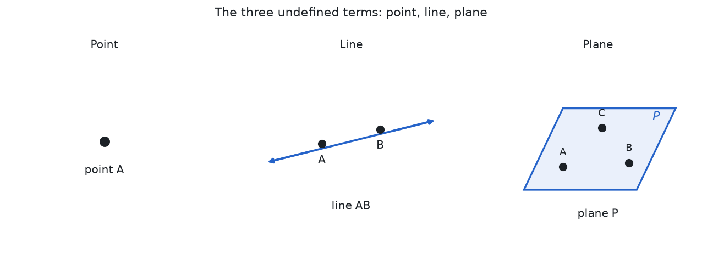

Two more words describe how these relate. Points that lie on one common line are **collinear** (read "co-linear"); points that lie in one common plane are **coplanar**. Two lines that cross share exactly one point, called their point of **intersection**.

## Segments, Rays, and Distance

From a line we carve out the two most useful finite and half-infinite pieces.

- A **line segment** $\overline{AB}$ (read "segment AB") is the portion of a line between two **endpoints** $A$ and $B$, including both endpoints. It has a finite length.
- A **ray** $\overrightarrow{AB}$ (read "ray AB") starts at an endpoint $A$ and extends without end through $B$. The starting point $A$ is the ray's **vertex**.
- Two rays that share a vertex and point in exactly opposite directions, together forming a straight line, are **opposite rays**.

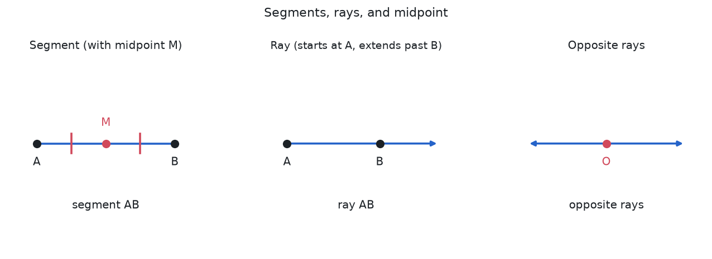

The **distance** between two points is the length of the segment joining them, written $AB$ or $|AB|$. Two segments with equal length are **congruent**, written $\overline{AB} \cong \overline{CD}$ (the symbol $\cong$ is read "is congruent to"). The **midpoint** $M$ of $\overline{AB}$ is the point that divides it into two congruent halves, so $AM = MB$. A line, ray, or segment through the midpoint is a **segment bisector** ("bisect" means to cut into two equal parts).

## Angles

An **angle** is the figure formed by two rays that share a common vertex. The two rays are the angle's **sides** and the shared point is its **vertex**. The angle formed by rays $\overrightarrow{BA}$ and $\overrightarrow{BC}$ is written $\angle ABC$ or just $\angle B$ (the symbol $\angle$ is read "angle," and the vertex letter always goes in the middle).

We measure how "open" an angle is in **degrees**, written with the symbol $°$. One full turn is $360°$, a half turn is $180°$, and a quarter turn is $90°$. Angles are classified by size:

- **Acute** angle: between $0°$ and $90°$.
- **Right** angle: exactly $90°$, marked with a small square at the vertex.
- **Obtuse** angle: between $90°$ and $180°$.
- **Straight** angle: exactly $180°$ (the two sides are opposite rays).
- **Reflex** angle: between $180°$ and $360°$.

### Angle Pairs

Angles that occur together have special names, and each name carries a fact you can use.

- **Complementary** angles are two angles whose measures add to $90°$. If one measures $35°$, its complement measures $55°$.
- **Supplementary** angles are two angles whose measures add to $180°$. If one measures $110°$, its supplement measures $70°$.
- **Adjacent** angles share a vertex and a side but do not overlap.
- A **linear pair** is two adjacent angles whose non-shared sides are opposite rays. A linear pair is always supplementary (they add to $180°$).
- **Vertical angles** are the two opposite angles formed when two lines cross. Vertical angles are always congruent (equal).

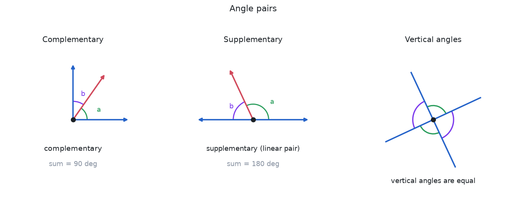

A ray that splits an angle into two congruent angles is an **angle bisector**.

**Worked example (complement and supplement).** An angle measures $37°$. Find its complement and its supplement.

The complement is whatever completes a **right** angle ($90°$), so subtract from $90°$:
$$ 90° - 37° = 53°. $$
The supplement is whatever completes a **straight** angle ($180°$), so subtract from $180°$:
$$ 180° - 37° = 143°. $$
Check each: $37° + 53° = 90°$ ✓ and $37° + 143° = 180°$ ✓. Notice the supplement is exactly $90°$ larger than the complement ($143° - 53° = 90°$), because a straight angle is $90°$ more than a right angle.

**Worked example (linear pair and vertical angles).** Two lines cross, and one of the four angles they make measures $110°$. Find the other three.

- The angle **next to** the $110°$ one forms a **linear pair** with it (their outer sides make a straight line), so the two are supplementary: the neighbor is $180° - 110° = 70°$.
- The angle **vertically opposite** the $110°$ one is a vertical angle, so it is congruent: also $110°$.
- The last angle is vertical to the $70°$ one, so it is $70°$.

The four angles are $110°, 70°, 110°, 70°$, sweeping once around the crossing point. Check they total a full turn: $110° + 70° + 110° + 70° = 360°$ ✓.

## Euclid's Postulates

Euclid organized geometry into theorems proved from a short list of **postulates** (assumptions taken as true without proof) and **common notions** (general logical truths, such as "things equal to the same thing are equal to each other"). His five postulates are:

1. A straight line segment can be drawn joining any two points.
2. Any straight line segment can be extended indefinitely into a line.
3. Given any segment, a circle can be drawn with that segment as radius and one endpoint as center.
4. All right angles are equal to one another.
5. **The parallel postulate:** through a point not on a given line, there is exactly one line parallel to the given line.

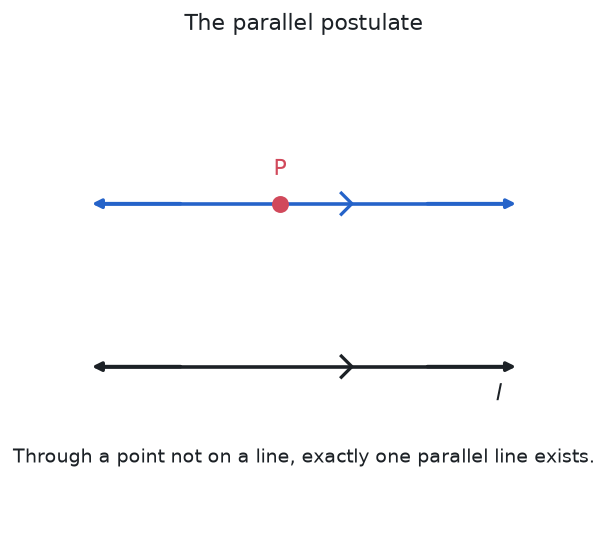

The first four postulates are simple and were never controversial. The fifth, the parallel postulate, is different: it is less obvious, and for two thousand years mathematicians tried to derive it from the other four. They failed, because it cannot be derived. Replacing it with alternatives produces perfectly consistent **non-Euclidean geometries** (on a sphere there are no parallels; on a saddle-shaped surface there are many). Everything on this page assumes the Euclidean fifth postulate.

## Parallel and Perpendicular Lines

Two lines in a plane are **parallel**, written $\ell \parallel m$ (the symbol $\parallel$ is read "is parallel to"), if they never meet no matter how far they are extended. Two lines are **perpendicular**, written $\ell \perp m$ (the symbol $\perp$ is read "is perpendicular to"), if they meet at a right angle. In three dimensions, two lines that are not parallel and never meet are called **skew**.

A **transversal** is a line that crosses two or more other lines. When a transversal crosses two parallel lines, it creates eight angles with important relationships:

- **Corresponding angles** (same position at each intersection) are congruent.
- **Alternate interior angles** (between the parallels, on opposite sides of the transversal) are congruent.
- **Alternate exterior angles** (outside the parallels, on opposite sides) are congruent.
- **Co-interior angles**, also called same-side interior angles (between the parallels, on the same side) are supplementary.

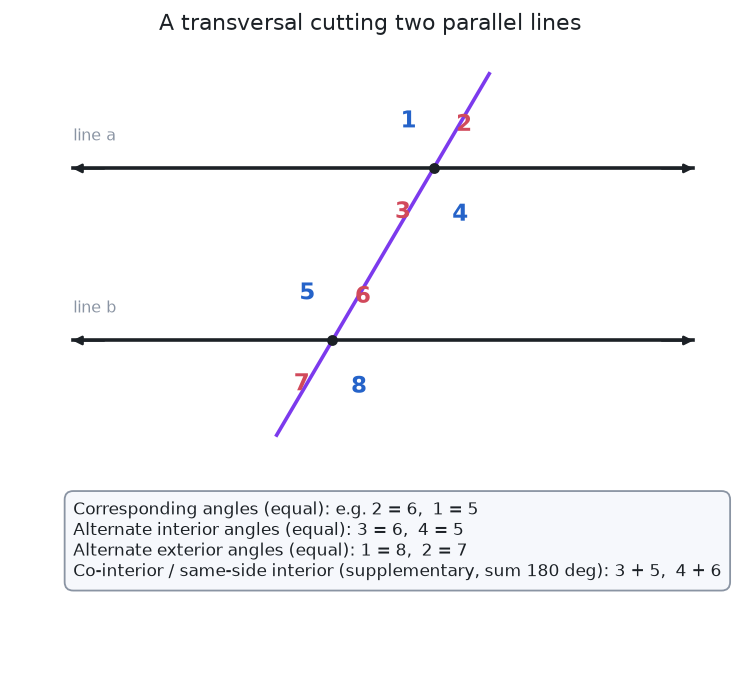

These equalities run both ways: if a transversal makes a pair of corresponding (or alternate) angles equal, the two lines must be parallel. That converse is how parallelism is proved in practice.

**Worked example (all eight angles from one).** A transversal cuts two parallel lines, and one of the eight angles measures $65°$. Find all the others.

At each crossing the four angles are $65°$ and its supplement $180° - 65° = 115°$ (a $65°$ angle and the linear pair beside it), with vertical angles matching. Because the lines are **parallel**, angles carry across from one crossing to the other:
- every angle **corresponding** to the $65°$ one (same position at the other crossing) is $65°$;
- every **alternate interior** and **alternate exterior** angle equal to it is $65°$;
- every **co-interior** (same-side interior) angle is its supplement, $115°$.

So the eight angles are four $65°$ and four $115°$. Check a co-interior pair: $65° + 115° = 180°$ ✓, as required for same-side interior angles.

**Worked example (the converse: proving two lines parallel).** A transversal crosses two lines, and the two **alternate interior** angles it forms both measure $72°$. Are the lines parallel?

Yes. The alternate-interior-angle relationship runs both ways, so *equal* alternate interior angles force the lines to be parallel. (Had the angles been $72°$ and $73°$ instead, the lines would not be parallel: the co-interior angles on one side would total $72° + 108° = 180°$ while on the other they would total $73° + 108° = 181° \ne 180°$, so the lines would meet on the first side.) This converse is exactly how you *prove* lines parallel from an angle measurement.

## Polygons

A **polygon** is a closed plane figure made of straight line segments joined end to end. Each segment is a **side** and each corner is a **vertex** (plural **vertices**). Polygons are named by their number of sides.

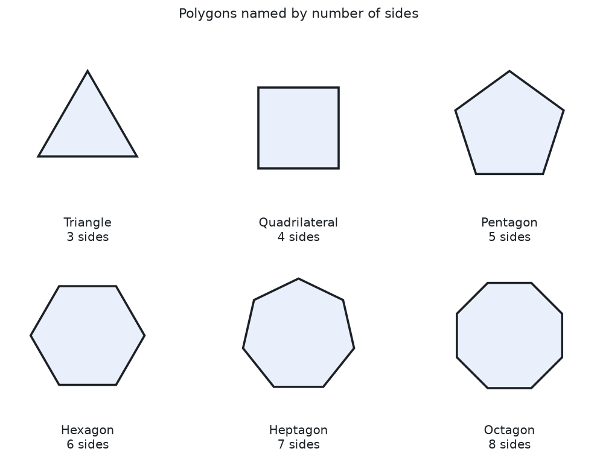

A polygon is **convex** if every interior angle is less than $180°$ (no vertex points inward); otherwise it is **concave**. A polygon is **regular** if all its sides are congruent and all its angles are congruent (like a square or a regular hexagon).

### Angle Sums

Pick any vertex of a polygon with $n$ sides and draw diagonals to every other vertex. This splits the polygon into exactly $n - 2$ triangles. Since each triangle's angles sum to $180°$ (the next section proves this), the interior angles of the whole polygon sum to:

$$
\text{interior angle sum} = (n - 2) \times 180°
$$

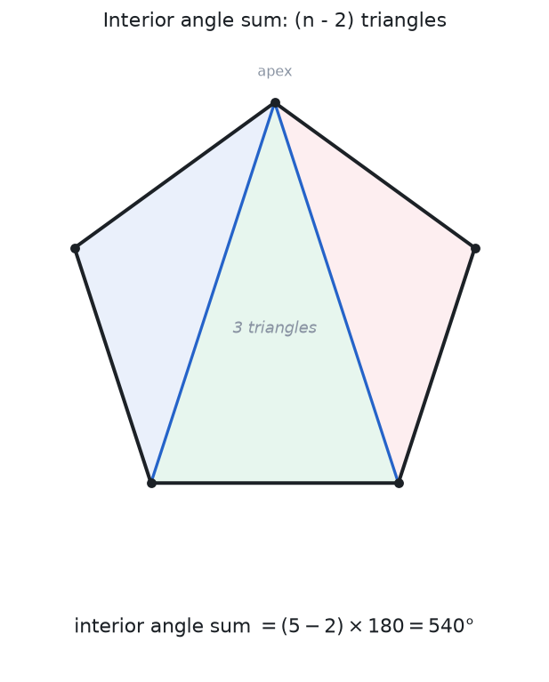

For a pentagon ($n = 5$) the sum is $(5 - 2) \times 180° = 540°$; for an octagon ($n = 8$) it is $(8 - 2) \times 180° = 1080°$. In a **regular** polygon all angles are equal, so each interior angle measures $\dfrac{(n-2) \times 180°}{n}$: a regular hexagon has interior angles of $\dfrac{720°}{6} = 120°$. No matter the number of sides, the **exterior angles** (one per vertex, turning from each side to the next) always sum to exactly $360°$, one full turn.

**Worked example (a regular pentagon, step by step).** Find each interior angle of a regular pentagon.

Set $n = 5$. From one vertex, draw the diagonals to the two non-adjacent vertices; this cuts the pentagon into $n - 2 = 3$ triangles, and those triangles' angles are exactly the pentagon's interior angles. Each triangle contributes $180°$, so
$$ \text{interior sum} = 3 \times 180° = (5-2)\times 180° = 540°. $$
"Regular" means all five angles are equal, so divide the total evenly:
$$ \text{each angle} = \frac{540°}{5} = 108°. $$
Check: $5 \times 108° = 540°$ ✓.

**Worked example (a missing angle).** Four of the five interior angles of a pentagon measure $100°$, $120°$, $95°$, and $110°$. Find the fifth.

The five angles sum to $540°$ (from above), so the fifth is
$$ 540° - 100° - 120° - 95° - 110° = 115°. $$
Check: $100° + 120° + 95° + 110° + 115° = 540°$ ✓. (This pentagon is *not* regular — its angles differ — but the total is fixed regardless.)

## Triangles

The triangle is the simplest polygon and the foundation of the rest of geometry, because every polygon can be cut into triangles.

Triangles are classified two ways. **By sides:** *scalene* (no equal sides), *isosceles* (two equal sides), or *equilateral* (all three equal). **By angles:** *acute* (all angles less than $90°$), *right* (one $90°$ angle), or *obtuse* (one angle greater than $90°$).

### The Angle Sum

**The angles of any triangle sum to $180°$.** To see why, draw a line through one vertex parallel to the opposite side. The two "outer" angles at that vertex are equal to the triangle's other two angles (alternate interior angles with the parallel line), and together with the vertex angle they form a straight angle of $180°$. So the three triangle angles sum to $180°$.

**Worked example.** Two angles of a triangle measure $55°$ and $70°$. Find the third.

The three angles must total $180°$, so subtract the two known angles:
$$ 180° - 55° - 70° = 55°. $$
Check: $55° + 70° + 55° = 180°$ ✓. Two of the angles came out equal ($55°$), and equal angles sit opposite equal sides, so this triangle is **isosceles** — the interior-angle arithmetic has told us something about the *sides* without measuring them.

### Congruence

Two triangles are **congruent** (written with $\cong$) if they have the same size and shape, so one can be laid exactly on top of the other. You do not need to check all six parts (three sides and three angles); a few matching parts force the rest. The shortcuts are:

- **SSS** (side-side-side): all three pairs of sides equal.
- **SAS** (side-angle-side): two sides and the angle between them equal.
- **ASA** (angle-side-angle): two angles and the side between them equal.
- **AAS** (angle-angle-side): two angles and a non-included side equal.
- **HL** (hypotenuse-leg): for right triangles only, the hypotenuse and one leg equal.

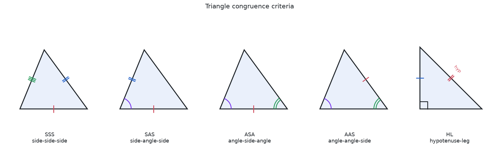

Note that there is no "SSA" or "AAA" congruence rule: SSA can produce two different triangles (the ambiguous case discussed under the [Law of Sines](./geometry-trigonometry)), and AAA fixes only the shape, not the size.

**Worked example (SSS, and what congruence buys you).** Triangle $ABC$ has sides $AB = 6$, $BC = 8$, $CA = 7$. Triangle $DEF$ has $DE = 6$, $EF = 8$, $FD = 7$. Are they congruent, and what follows?

All three pairs of sides are equal ($6 = 6$, $8 = 8$, $7 = 7$), which is exactly the **SSS** criterion, so $\triangle ABC \cong \triangle DEF$. Congruence then forces the three *angles* to match as well, a fact abbreviated **CPCTC** ("corresponding parts of congruent triangles are congruent"): $\angle A = \angle D$, $\angle B = \angle E$, $\angle C = \angle F$. The payoff: three side measurements pinned down the entire triangle, angles included, with nothing left to check.

**Worked example (SAS, and the SSA trap).** Suppose $AB = 5$, the angle at $B$ is $40°$, and $BC = 7$.

Because the $40°$ angle lies *between* the two given sides, this is **SAS**: the angle and its two arms leave no freedom, so the third side $AC$ and the whole triangle are determined, and any two triangles built from these three facts are congruent. Contrast the **SSA** arrangement — say $AB = 5$, $BC = 7$, and a $40°$ angle *not* between them: swinging side $BC$ can land in two different places, giving two non-congruent triangles. That ambiguity is exactly why SAS is a valid rule and SSA is not.

### Similarity

Two triangles are **similar**, written $\triangle ABC \sim \triangle DEF$ (the symbol $\sim$ is read "is similar to"), if they have the same shape but not necessarily the same size: equal corresponding angles and proportional corresponding sides. The shortcuts are **AA** (two equal angles force the third, so the triangles are similar), **SSS~** (all sides in the same ratio), and **SAS~** (two sides in ratio with the included angle equal). Congruence is the special case of similarity where the ratio is $1$.

**Worked example (AA, then solve for a side).** In $\triangle ABC$ and $\triangle DEF$, $\angle A = \angle D = 50°$ and $\angle B = \angle E = 60°$. Given $AB = 8$, $BC = 6$, and $DE = 12$, find $EF$.

First, similarity: two pairs of equal angles force the third ($\angle C = \angle F = 180° - 50° - 60° = 70°$), so by **AA**, $\triangle ABC \sim \triangle DEF$. Similar triangles have all sides in one common ratio. Find it from the pair we know both of, $AB$ and its corresponding side $DE$:
$$ k = \frac{DE}{AB} = \frac{12}{8} = \frac{3}{2}. $$
Every side of $DEF$ is $\frac{3}{2}$ times its match in $ABC$, so the side corresponding to $BC$ is
$$ EF = k \times BC = \frac{3}{2} \times 6 = 9. $$
Check the ratios agree: $\dfrac{DE}{AB} = \dfrac{12}{8} = 1.5$ and $\dfrac{EF}{BC} = \dfrac{9}{6} = 1.5$ ✓. Equal ratios are the signature of similar triangles.

## Quadrilaterals

A **quadrilateral** is a four-sided polygon. Its interior angles always sum to $(4 - 2) \times 180° = 360°$. Special quadrilaterals form a family, each a special case of a more general one.

- A **trapezoid** has at least one pair of parallel sides.
- A **parallelogram** has two pairs of parallel sides; opposite sides and opposite angles are equal, and the diagonals bisect each other.
- A **rectangle** is a parallelogram with four right angles.
- A **rhombus** is a parallelogram with four equal sides.
- A **square** is both a rectangle and a rhombus: four equal sides and four right angles.
- A **kite** has two pairs of adjacent equal sides.

Reading the chart downward, each shape inherits every property of the shapes above it: a square is a rectangle, so it has four right angles, and it is a rhombus, so it has four equal sides.

**Worked example (all angles of a parallelogram).** In parallelogram $ABCD$, $\angle A = 65°$. Find the other three angles.

Apply the parallelogram facts in order:
- Opposite angles are equal, so $\angle C = \angle A = 65°$.
- Adjacent angles ($A$ and $B$) are co-interior between a pair of parallel sides, hence supplementary: $\angle B = 180° - 65° = 115°$.
- Opposite again, so $\angle D = \angle B = 115°$.

The four angles are $65°, 115°, 65°, 115°$. Check against the quadrilateral total: $65° + 115° + 65° + 115° = 360°$ ✓, matching $(4-2)\times 180°$.

## Circles

A **circle** is the set of all points in a plane at a fixed distance (the **radius**, $r$) from a fixed point (the **center**). It is the first curved figure, and it comes with its own vocabulary.

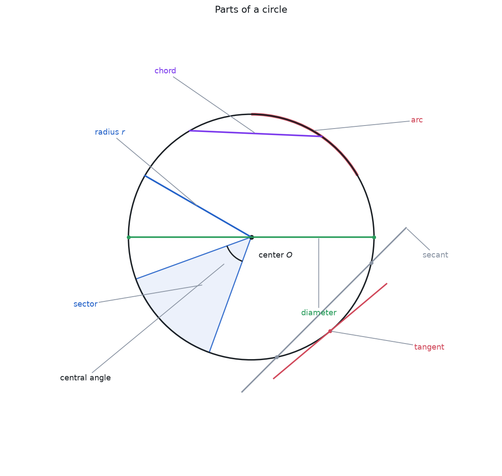

- A **chord** is a segment joining two points on the circle.
- A **diameter** is a chord through the center; it has length $2r$ and is the longest chord.
- An **arc** is a portion of the circle itself; a **sector** is the pie-slice region between two radii and an arc.
- A **tangent** line touches the circle at exactly one point; a **secant** line crosses it at two.
- A **central angle** has its vertex at the center; an **inscribed angle** has its vertex on the circle.

**The inscribed angle theorem:** an inscribed angle is half the central angle that subtends (opens onto) the same arc.

A famous special case is **Thales' theorem**: if the subtended arc is a semicircle (the central angle is the $180°$ straight angle of a diameter), the inscribed angle is exactly $90°$. Any triangle inscribed in a circle with one side as a diameter is therefore a right triangle.

**Worked example (inscribed angle).** A central angle subtends an arc of $120°$. What does an inscribed angle opening onto that same arc measure?

By the inscribed angle theorem, the inscribed angle is half the central angle for the same arc:
$$ \frac{120°}{2} = 60°. $$
The same rule delivers Thales' theorem as the special case where the arc is a semicircle: a $180°$ arc gives an inscribed angle of $\frac{180°}{2} = 90°$ ✓, so a triangle drawn on a diameter is right-angled.

## Perimeter, Area, and Volume

**Perimeter** is the total distance around a two-dimensional figure (the circumference for a circle). **Area** is the amount of surface a flat figure covers, measured in square units. Every area formula below can be derived by cutting and rearranging the shape into a rectangle.

For example, a trapezoid with parallel sides of length $6$ and $10$ and height $4$ has area $\frac{1}{2}(6 + 10)(4) = 32$ square units, and a circle of radius $5$ has area $\pi (5)^2 = 25\pi \approx 78.54$ square units.

**Volume** is the amount of space a three-dimensional solid occupies, measured in cubic units.

A sphere of radius $3$ has volume $\frac{4}{3}\pi (3)^3 = 36\pi \approx 113.10$ cubic units. Notice that a cone is exactly one third of the cylinder with the same base and height, and a pyramid is one third of the corresponding prism.

## Solids and Euler's Formula

A **polyhedron** (plural **polyhedra**) is a solid whose faces are all flat polygons. Its flat surfaces are **faces**, the segments where faces meet are **edges**, and the corners are **vertices**. For any convex polyhedron these three counts obey **Euler's formula**:

$$
V - E + F = 2
$$

where $V$ is the number of vertices, $E$ the number of edges, and $F$ the number of faces.

A cube has $V = 8$, $E = 12$, $F = 6$, and indeed $8 - 12 + 6 = 2$. There are exactly **five** regular convex polyhedra, the **Platonic solids**: the tetrahedron, cube, octahedron, dodecahedron, and icosahedron. Other common solids include **prisms** (two parallel congruent bases joined by rectangles), **pyramids** (a base and a single apex), **cylinders**, **cones**, and **spheres**.

## Transformations and Symmetry

A **transformation** moves or resizes a figure. A **rigid motion** (or **isometry**) preserves distance, so the image is congruent to the original. There are three basic rigid motions, plus a fourth that combines two of them:

- **Translation:** slide every point the same distance in the same direction.
- **Rotation:** turn every point by the same angle about a fixed center.
- **Reflection:** flip every point across a fixed line (the mirror).
- **Glide reflection:** a reflection followed by a translation along the mirror line.

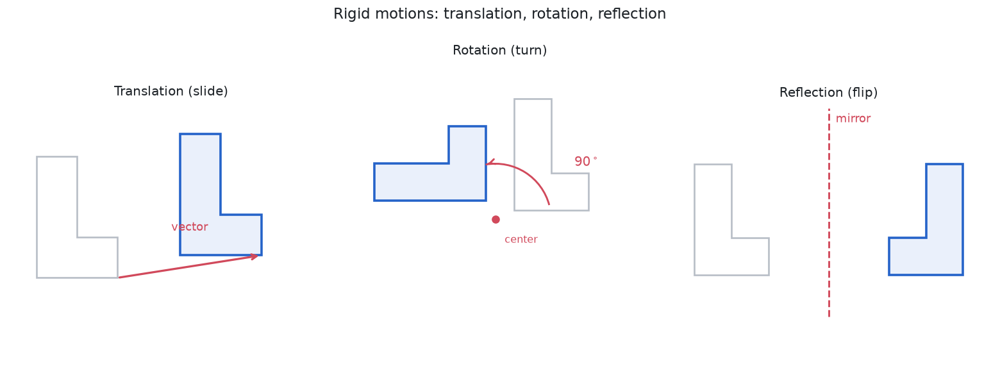

Two figures are congruent exactly when some sequence of rigid motions maps one onto the other.

**Worked example (a translation preserves distance).** *(Using coordinates, previewing the [coordinate approach](./geometry-trigonometry); a point $(x, y)$ sits $x$ right and $y$ up.)* Slide the segment from $A = (1, 2)$ to $B = (4, 6)$ by the translation "$5$ right, $1$ down," that is, add $(5, -1)$ to every point. Then
$$ A' = (1+5,\ 2-1) = (6, 1), \qquad B' = (4+5,\ 6-1) = (9, 5). $$
Measure both segments with the distance formula $\sqrt{(\Delta x)^2 + (\Delta y)^2}$:
$$ AB = \sqrt{(4-1)^2 + (6-2)^2} = \sqrt{9 + 16} = \sqrt{25} = 5, $$
$$ A'B' = \sqrt{(9-6)^2 + (5-1)^2} = \sqrt{9 + 16} = 5. $$
The lengths are equal, confirming that a translation is a **rigid motion** (it preserves distance), so $\overline{A'B'} \cong \overline{AB}$ ✓. Every rigid motion has this length-preserving property; that is precisely why the image is congruent to the original.

A transformation that instead scales a figure by a fixed ratio about a center point is a **dilation**; it preserves shape but not size, producing a figure that is **similar** to the original.

**Worked example (a dilation scales size but keeps shape).** Dilate the right triangle with legs $3$ and $4$ (hypotenuse $5$, since $3^2 + 4^2 = 9 + 16 = 25 = 5^2$) by a factor of $k = 2$ about a center.

Every length multiplies by $k = 2$, so the legs become $6$ and $8$ and the hypotenuse becomes $10$. This is still a right triangle: $6^2 + 8^2 = 36 + 64 = 100 = 10^2$ ✓. The **angles are unchanged**, because all sides grew by the same factor: $\frac{6}{3} = \frac{8}{4} = \frac{10}{5} = 2$, so the new triangle is **similar** to the old with ratio $2:1$. One subtlety worth seeing: **area** does *not* scale by $2$ but by $k^2 = 4$. The original area is $\frac{1}{2}(3)(4) = 6$ and the image area is $\frac{1}{2}(6)(8) = 24 = 4 \times 6$ ✓. Lengths scale by $k$; areas scale by $k^2$.

**Symmetry** is when a figure maps onto itself under a transformation. A figure has **line (reflection) symmetry** if reflecting it across some line leaves it unchanged, and **rotational symmetry** if rotating it by some angle less than a full turn leaves it unchanged.

**Worked example (symmetries of a regular hexagon).** Count the ways a regular hexagon maps onto itself.

- **Line (reflection) symmetry:** it has $6$ axes. Three run through opposite pairs of *vertices*, and three through the midpoints of opposite *sides*. (In general a regular $n$-gon has exactly $n$ axes of reflection.)
- **Rotational symmetry:** rotating about the center by $\frac{360°}{6} = 60°$ sends each vertex to the next and leaves the figure unchanged. So do its multiples $120°, 180°, 240°, 300°$ — five distinct non-trivial rotations, and the $360°$ turn brings everything back to start.

Counting them up: $6$ reflections and $6$ rotations (including the do-nothing $360°$) give $12$ symmetries in all. That total, $2n = 12$, is why a regular hexagon's symmetries form the **dihedral group of order $12$** — a first concrete example of the [group theory of symmetry](./algebraic-structures).

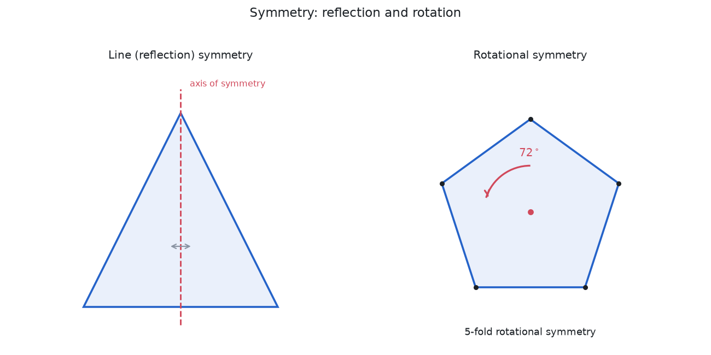

## Where This Leads

From these foundations the subject branches in several directions. Placing points on a coordinate grid turns geometry into algebra: distances, midpoints, slopes, and the trigonometry of triangles all live on the [Geometry & Trigonometry](./geometry-trigonometry) page. The circle and the other curves cut from a cone are studied as equations in [Conic Sections](./conic-sections). Relaxing the parallel postulate opens the non-Euclidean geometries that underlie modern physics, and treating rigid motions as an algebraic system of their own leads to the group theory of symmetry in [Algebraic Structures](./algebraic-structures).
