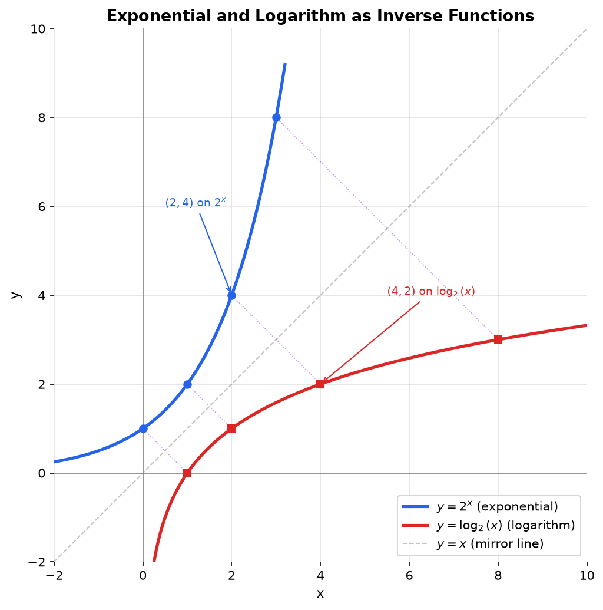

## What Is Exponential Growth?

**Exponential growth** describes a quantity that multiplies by a fixed factor in each time period, rather than increasing by a fixed amount. When something doubles every hour, or halves every year, or grows by 5% each month, that is exponential behavior.

### Real-World Examples

Exponential functions appear throughout science and everyday life:

- **Population growth:** A bacteria colony that doubles every 20 minutes grows from 1,000 to over 1,000,000 in just a few hours.
- **Radioactive decay:** A radioactive substance loses a fixed percentage of its atoms each year, so the amount remaining shrinks exponentially.
- **Compound interest:** Money in a savings account grows exponentially because interest is earned on previously earned interest.

### How Fast Exponentials Grow

To feel how powerful exponential growth is, look at the powers of 2:

| $x$ | $2^x$ | Approximate size |
|---|---|---|
| 1 | 2 | |
| 5 | 32 | |
| 10 | 1,024 | About a thousand |
| 20 | 1,048,576 | About a million |
| 30 | 1,073,741,824 | About a billion |
| 40 | 1,099,511,627,776 | About a trillion |

Starting from 2, you reach a trillion in just 40 doublings. This is why exponential growth is so dangerous (epidemics, credit card debt) and so powerful (compound interest, Moore's law).

### How Exponentials Differ from Polynomials

In a polynomial like $x^3$, the base ($x$) varies while the exponent ($3$) is fixed. In an exponential function like $2^x$, the base ($2$) is fixed while the exponent ($x$) varies. This distinction is fundamental: polynomial growth is always eventually overtaken by exponential growth, no matter how large the polynomial's degree. A function that merely doubles ($2^x$) will eventually outpace $x^{100}$, $x^{1000}$, or any polynomial.

With that context, here is the formal definition.

## Definition

**Exponential Functions:** An exponential function is a function where the variable appears in the exponent.

## General Form

$$f(x) = a \cdot b^x + c$$

Where:
- **a:** Vertical stretch/compression factor (also affects growth/decay rate)
- **b:** Base (must be positive, $b > 0$ and $b \neq 1$)
- **x:** The exponent (independent variable)
- **c:** Vertical shift

**Special case (parent function):** $f(x) = b^x$

## Growth vs Decay

**Exponential Growth:** When $b > 1$

The function increases as x increases.

**Example:** $f(x) = 2^x$ doubles for every unit increase in x

**Exponential Decay:** When $0 < b < 1$

The function decreases as x increases.

**Example:** $f(x) = \left(\frac{1}{2}\right)^x$ halves for every unit increase in x

**Note:** $\left(\frac{1}{2}\right)^x = 2^{-x}$ (decay can be written with negative exponents)

### Growth Rate vs Growth Factor

This distinction trips people up constantly.

- **Growth factor:** The base $b$. This is what you multiply by each period.
- **Growth rate:** The percentage change per period, which is $r = b - 1$.

If something grows by 5% per year, the growth rate is $r = 0.05$ and the growth factor is $b = 1 + r = 1.05$. The function is $f(t) = a \cdot 1.05^t$, not $f(t) = a \cdot 0.05^t$.

If something decays by 3% per year, the decay rate is $r = 0.03$ and the growth factor is $b = 1 - r = 0.97$. The function is $f(t) = a \cdot 0.97^t$.

| Description | Rate $r$ | Factor $b$ | Function |
|---|---|---|---|
| Grows 5% per year | 0.05 | 1.05 | $a \cdot 1.05^t$ |
| Doubles each period | 1.00 | 2.00 | $a \cdot 2^t$ |
| Decays 3% per year | 0.03 | 0.97 | $a \cdot 0.97^t$ |
| Halves each period | 0.50 | 0.50 | $a \cdot 0.5^t$ |

## The Natural Exponential Function

### Where $e$ Comes From

Imagine you put \$1 in a bank that pays 100% annual interest. How much do you have after one year?

- **Compounded once** (annually): $1 \cdot (1 + 1)^1 = \$2.00$
- **Compounded twice** (semi-annually): $1 \cdot (1 + 1/2)^2 = \$2.25$
- **Compounded 4 times** (quarterly): $1 \cdot (1 + 1/4)^4 = \$2.4414$
- **Compounded 12 times** (monthly): $1 \cdot (1 + 1/12)^{12} = \$2.6130$
- **Compounded 365 times** (daily): $1 \cdot (1 + 1/365)^{365} = \$2.7146$
- **Compounded continuously** ($n \to \infty$): $\lim_{n \to \infty}(1 + 1/n)^n = \$2.71828...$

That limit is $e$. No matter how frequently you compound, you never exceed this number. It is the natural limit of compound growth.

$$
e = \lim_{n \to \infty}\left(1 + \frac{1}{n}\right)^n \approx 2.71828
$$

### Why $e$ Is the "Natural" Base

**$e$ is special because the exponential function $e^x$ is its own derivative:**

$$
\frac{d}{dx}e^x = e^x
$$

No other base has this property. For any other base, $\frac{d}{dx}b^x = b^x \cdot \ln(b)$, which introduces a constant factor. The base $e$ is the one where that factor equals 1.

This is why calculus, physics, and ML use $e^x$ instead of $2^x$ or $10^x$. The math is simply cleaner.

### The Two Forms of Exponential Functions

Any exponential function can be written two ways:

$$
f(x) = a \cdot b^x \quad \text{or equivalently} \quad f(x) = a \cdot e^{kx}
$$

They are related by $k = \ln(b)$, or equivalently $b = e^k$.

**Example:** $f(x) = 5 \cdot 2^x$ can be rewritten as $f(x) = 5 \cdot e^{x \ln 2} = 5 \cdot e^{0.693x}$.

The $b^x$ form is intuitive for applications ("doubles every hour" means $b = 2$). The $e^{kx}$ form is what calculus and ML use because it makes derivatives and integrals simpler. The parameter $k$ is the **continuous growth rate**:

- $k > 0$: growth
- $k < 0$: decay
- $|k|$ tells you how fast

### Continuous Compound Interest

$$
A = Pe^{rt}
$$

Where $P$ = principal, $r$ = annual rate, $t$ = time in years. This is the continuous compounding limit of the discrete formula $A = P(1 + r/n)^{nt}$.

## Domain and Range

**Domain:** $(-\infty, \infty)$ or $\mathbb{R}$ (all real numbers)

Exponential functions accept any real number as input.

Throughout, the base satisfies $b > 0$ and $b \neq 1$ (otherwise $b^x$ is not a well-defined exponential function).

**Range (for $f(x) = a \cdot b^x + c$ with $a > 0$):**

- If $c = 0$: Range is $(0, \infty)$
- If $c > 0$: Range is $(c, \infty)$
- If $c < 0$: Range is $(c, \infty)$

**General rule:** Range is $(c, \infty)$ when $a > 0$, or $(-\infty, c)$ when $a < 0$

## Intercepts

### y-intercept

**Finding the y-intercept:** Set $x = 0$

$$f(0) = a \cdot b^0 + c = a \cdot 1 + c = a + c$$

**Example:** For $f(x) = 3 \cdot 2^x - 1$

$f(0) = 3 \cdot 2^0 - 1 = 3 - 1 = 2$

y-intercept is $(0, 2)$

### x-intercept

**Finding x-intercept:** Set $f(x) = 0$ and solve for x

$$0 = a \cdot b^x + c$$
$$b^x = -\frac{c}{a}$$

**Important cases:**

1. **If $c = 0$:** No x-intercept (function never crosses x-axis, has horizontal asymptote at $y = 0$)

2. **If $-\frac{c}{a} > 0$:** One x-intercept exists
   
   Solve: $x = \log_b\left(-\frac{c}{a}\right)$

3. **If $-\frac{c}{a} \leq 0$:** No x-intercept (cannot take log of negative/zero)

**Example:** Find x-intercept of $f(x) = 2^x - 4$

$0 = 2^x - 4$

$2^x = 4$

$x = \log_2(4) = 2$

x-intercept is $(2, 0)$

## Horizontal Asymptote

**Horizontal Asymptote:** $y = c$

As $x \to \infty$ or $x \to -\infty$, the function approaches $y = c$ but never reaches it (unless $b = 1$, which is not a valid exponential).

**For growth ($b > 1$):**
- As $x \to \infty$: $f(x) \to \infty$
- As $x \to -\infty$: $f(x) \to c$

**For decay ($0 < b < 1$):**
- As $x \to \infty$: $f(x) \to c$
- As $x \to -\infty$: $f(x) \to \infty$

## Properties of Exponents

**Product Rule:** $b^x \cdot b^y = b^{x+y}$

**Quotient Rule:** $\frac{b^x}{b^y} = b^{x-y}$

**Power Rule:** $(b^x)^y = b^{xy}$

**Zero Exponent:** $b^0 = 1$ (for any $b \neq 0$)

**Negative Exponent:** $b^{-x} = \frac{1}{b^x}$

**Fractional Exponent:** $b^{1/n} = \sqrt[n]{b}$

## Examples

**Example 1: Exponential Growth**

Population of bacteria: $P(t) = 100 \cdot 2^t$

- Initial population: $P(0) = 100$
- After 1 hour: $P(1) = 200$
- After 3 hours: $P(3) = 800$

**Example 2: Exponential Decay**

Radioactive substance: $A(t) = 50 \cdot (0.5)^t$

- Initial amount: $A(0) = 50$ grams
- After 1 half-life: $A(1) = 25$ grams
- After 2 half-lives: $A(2) = 12.5$ grams

**Example 3: Vertical Shift**

$f(x) = 2^x - 3$

- Horizontal asymptote: $y = -3$
- y-intercept: $f(0) = 1 - 3 = -2$
- x-intercept: Solve $2^x = 3$, so $x = \log_2(3) \approx 1.585$

**Example 4: Compound Interest**

$$A = P\left(1 + \frac{r}{n}\right)^{nt}$$

Where:
- P = principal (\$1000)
- r = annual rate (5% = 0.05)
- n = compounds per year (12 for monthly)
- t = years (10)

$$A = 1000\left(1 + \frac{0.05}{12}\right)^{12 \cdot 10} \approx \$1647.01$$

## Doubling Time and Half-Life

Two of the most common questions about exponential functions: "How long until it doubles?" and "How long until half is left?"

### Doubling Time

For a function $f(t) = a \cdot b^t$ with $b > 1$, the **doubling time** $T_d$ is how long it takes for the value to double:

$$
a \cdot b^{T_d} = 2a \implies b^{T_d} = 2 \implies T_d = \frac{\ln 2}{\ln b}
$$

In the $e^{kx}$ form: $T_d = \frac{\ln 2}{k} \approx \frac{0.693}{k}$

**The Rule of 70:** A quick approximation. If something grows at $r\%$ per period, the doubling time is approximately $70/r$ periods.

- 7% annual growth: doubles in about 10 years
- 10% annual growth: doubles in about 7 years
- 1% annual growth: doubles in about 70 years

### Half-Life

For a function $f(t) = a \cdot b^t$ with $0 < b < 1$, the **half-life** $T_{1/2}$ is how long it takes for the value to halve:

$$
T_{1/2} = \frac{\ln 2}{|\ln b|} = \frac{\ln 2}{|k|}
$$

The formula is the same as doubling time because halving and doubling are inverse processes.

**Example:** Carbon-14 has a half-life of about 5,730 years. If a sample starts with 100 grams:

- After 5,730 years: 50 grams
- After 11,460 years: 25 grams
- After 17,190 years: 12.5 grams

The decay function: $A(t) = 100 \cdot (1/2)^{t/5730} = 100 \cdot e^{-0.000121t}$

## Solving Exponential Equations

To solve an equation where the variable is in the exponent, you need [logarithms](./logarithms). The key idea: **a logarithm undoes an exponential**, just like subtraction undoes addition.

### When Both Sides Have the Same Base

If you can write both sides with the same base, just set the exponents equal:

$$
2^{3x} = 2^7 \implies 3x = 7 \implies x = 7/3
$$

**Example:** Solve $4^x = 8$.

Rewrite: $2^{2x} = 2^3$, so $2x = 3$, so $x = 3/2$.

### When Bases Differ: Use Logarithms

Take the logarithm of both sides. Any base works, but $\ln$ (natural log) is standard.

**Example:** Solve $3^x = 20$.

$$
\ln(3^x) = \ln(20) \implies x \ln 3 = \ln 20 \implies x = \frac{\ln 20}{\ln 3} = \frac{3.00}{1.10} \approx 2.727
$$

**Example:** When will a \$1,000 investment at 6% annual interest reach \$5,000?

$$
1000 \cdot 1.06^t = 5000
$$

$$
1.06^t = 5
$$

$$
t = \frac{\ln 5}{\ln 1.06} = \frac{1.609}{0.0583} \approx 27.6 \text{ years}
$$

### When the Equation Has $e$

Use $\ln$ directly, since $\ln(e^x) = x$:

$$
e^{2x} = 15 \implies 2x = \ln 15 \implies x = \frac{\ln 15}{2} \approx 1.354
$$

## The Exponential-Logarithm Connection

Exponential functions and logarithms are **inverses** of each other. If $f(x) = b^x$, then $f^{-1}(x) = \log_b(x)$. They undo each other:

$$
b^{\log_b(x)} = x \quad \text{and} \quad \log_b(b^x) = x
$$

**What this means:** The exponential asks "what do I get when I raise $b$ to the power $x$?" The logarithm asks the reverse: "what power do I raise $b$ to in order to get $x$?"

| Exponential form | Logarithmic form | In words |
|---|---|---|
| $2^3 = 8$ | $\log_2 8 = 3$ | "2 to what power gives 8? Answer: 3" |
| $10^2 = 100$ | $\log_{10} 100 = 2$ | "10 to what power gives 100? Answer: 2" |
| $e^1 = e$ | $\ln e = 1$ | "$e$ to what power gives $e$? Answer: 1" |
| $5^0 = 1$ | $\log_5 1 = 0$ | "5 to what power gives 1? Answer: 0" |

**Graphically:** The graph of $y = \log_b(x)$ is the graph of $y = b^x$ reflected across the line $y = x$. Every point $(a, b)$ on the exponential becomes $(b, a)$ on the logarithm.

For a deeper treatment of logarithms (properties, change of base, applications), see [Logarithms](./logarithms).

## Transformations

Starting with $f(x) = b^x$:

- **Vertical stretch:** $af(x) = a \cdot b^x$
- **Horizontal shift:** $f(x - h) = b^{x-h}$ (shift right by $h$)
- **Vertical shift:** $f(x) + k = b^x + k$ (shift up by $k$)
- **Reflection across x-axis:** $-f(x) = -b^x$
- **Reflection across y-axis:** $f(-x) = b^{-x}$ (converts growth to decay)

**Example:** Transform $f(x) = 2^x$ to $g(x) = -3 \cdot 2^{x-1} + 5$

1. Shift right 1: $2^{x-1}$
2. Stretch vertically by 3: $3 \cdot 2^{x-1}$
3. Reflect across x-axis: $-3 \cdot 2^{x-1}$
4. Shift up 5: $-3 \cdot 2^{x-1} + 5$

