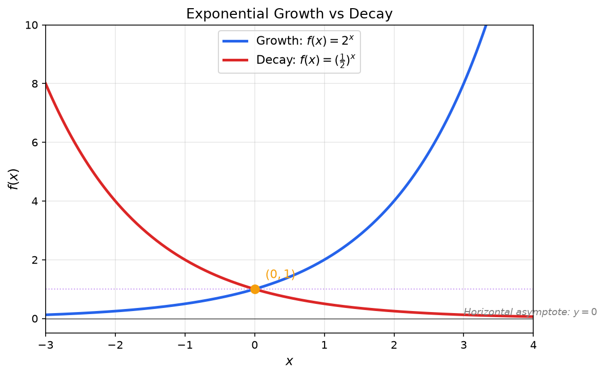

**Exponential Functions:** An exponential function is a function where the variable appears in the exponent.

## General Form

$$f(x) = a \cdot b^x + c$$

Where:
- **a:** Vertical stretch/compression factor (also affects growth/decay rate)
- **b:** Base (must be positive, $b > 0$ and $b \neq 1$)
- **x:** The exponent (independent variable)
- **c:** Vertical shift

**Special case (parent function):** $f(x) = b^x$

## Growth vs Decay

**Exponential Growth:** When $b > 1$

The function increases as x increases.

**Example:** $f(x) = 2^x$ doubles for every unit increase in x

**Exponential Decay:** When $0 < b < 1$

The function decreases as x increases.

**Example:** $f(x) = \left(\frac{1}{2}\right)^x$ halves for every unit increase in x

**Note:** $\left(\frac{1}{2}\right)^x = 2^{-x}$ (decay can be written with negative exponents)

## The Natural Exponential Function

**Natural Exponential:** $f(x) = e^x$

Where $e \approx 2.71828$ (Euler's number)

**Why $e$ is important:**
- Appears naturally in continuous growth/decay problems
- Has unique property: its derivative equals itself
- Used in compound interest, population growth, radioactive decay

**Example:** Continuous compound interest formula:

$$A = Pe^{rt}$$

Where P = principal, r = rate, t = time

## Domain and Range

**Domain:** $(-\infty, \infty)$ or $\mathbb{R}$ (all real numbers)

Exponential functions accept any real number as input.

**Range (for $f(x) = a \cdot b^x + c$ with $a > 0$):**

- If $c = 0$: Range is $(0, \infty)$
- If $c > 0$: Range is $(c, \infty)$
- If $c < 0$: Range is $(c, \infty)$

**General rule:** Range is $(c, \infty)$ when $a > 0$, or $(-\infty, c)$ when $a < 0$

## Intercepts

### y-intercept

**Finding the y-intercept:** Set $x = 0$

$$f(0) = a \cdot b^0 + c = a \cdot 1 + c = a + c$$

**Example:** For $f(x) = 3 \cdot 2^x - 1$

$f(0) = 3 \cdot 2^0 - 1 = 3 - 1 = 2$

y-intercept is $(0, 2)$

### x-intercept

**Finding x-intercept:** Set $f(x) = 0$ and solve for x

$$0 = a \cdot b^x + c$$
$$b^x = -\frac{c}{a}$$

**Important cases:**

1. **If $c = 0$:** No x-intercept (function never crosses x-axis, has horizontal asymptote at $y = 0$)

2. **If $-\frac{c}{a} > 0$:** One x-intercept exists
   
   Solve: $x = \log_b\left(-\frac{c}{a}\right)$

3. **If $-\frac{c}{a} \leq 0$:** No x-intercept (cannot take log of negative/zero)

**Example:** Find x-intercept of $f(x) = 2^x - 4$

$0 = 2^x - 4$

$2^x = 4$

$x = \log_2(4) = 2$

x-intercept is $(2, 0)$

## Horizontal Asymptote

**Horizontal Asymptote:** $y = c$

As $x \to \infty$ or $x \to -\infty$, the function approaches $y = c$ but never reaches it (unless $b = 1$, which is not a valid exponential).

**For growth ($b > 1$):**
- As $x \to \infty$: $f(x) \to \infty$
- As $x \to -\infty$: $f(x) \to c$

**For decay ($0 < b < 1$):**
- As $x \to \infty$: $f(x) \to c$
- As $x \to -\infty$: $f(x) \to \infty$

## Properties of Exponents

**Product Rule:** $b^x \cdot b^y = b^{x+y}$

**Quotient Rule:** $\frac{b^x}{b^y} = b^{x-y}$

**Power Rule:** $(b^x)^y = b^{xy}$

**Zero Exponent:** $b^0 = 1$ (for any $b \neq 0$)

**Negative Exponent:** $b^{-x} = \frac{1}{b^x}$

**Fractional Exponent:** $b^{1/n} = \sqrt[n]{b}$

## Examples

**Example 1: Exponential Growth**

Population of bacteria: $P(t) = 100 \cdot 2^t$

- Initial population: $P(0) = 100$
- After 1 hour: $P(1) = 200$
- After 3 hours: $P(3) = 800$

**Example 2: Exponential Decay**

Radioactive substance: $A(t) = 50 \cdot (0.5)^t$

- Initial amount: $A(0) = 50$ grams
- After 1 half-life: $A(1) = 25$ grams
- After 2 half-lives: $A(2) = 12.5$ grams

**Example 3: Vertical Shift**

$f(x) = 2^x - 3$

- Horizontal asymptote: $y = -3$
- y-intercept: $f(0) = 1 - 3 = -2$
- x-intercept: Solve $2^x = 3$, so $x = \log_2(3) \approx 1.585$

**Example 4: Compound Interest**

$$A = P\left(1 + \frac{r}{n}\right)^{nt}$$

Where:
- P = principal ($1000)
- r = annual rate (5% = 0.05)
- n = compounds per year (12 for monthly)
- t = years (10)

$$A = 1000\left(1 + \frac{0.05}{12}\right)^{12 \cdot 10} \approx \$1647.01$$

## Transformations

Starting with $f(x) = b^x$:

- **Vertical stretch:** $af(x) = a \cdot b^x$
- **Horizontal shift:** $f(x - h) = b^{x-h}$ (shift right by $h$)
- **Vertical shift:** $f(x) + k = b^x + k$ (shift up by $k$)
- **Reflection across x-axis:** $-f(x) = -b^x$
- **Reflection across y-axis:** $f(-x) = b^{-x}$ (converts growth to decay)

**Example:** Transform $f(x) = 2^x$ to $g(x) = -3 \cdot 2^{x-1} + 5$

1. Shift right 1: $2^{x-1}$
2. Stretch vertically by 3: $3 \cdot 2^{x-1}$
3. Reflect across x-axis: $-3 \cdot 2^{x-1}$
4. Shift up 5: $-3 \cdot 2^{x-1} + 5$

