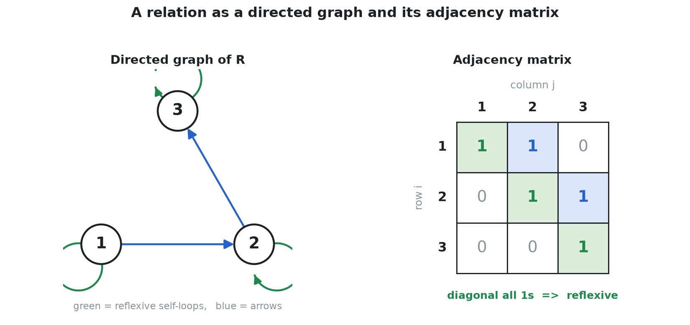
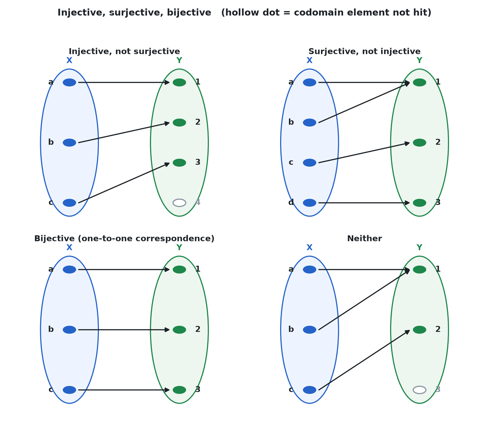
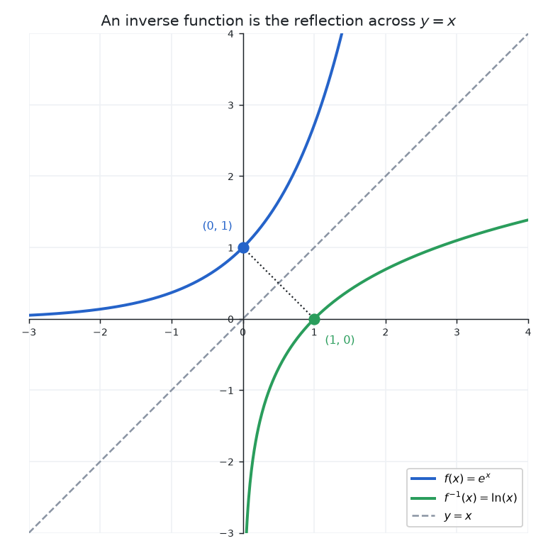
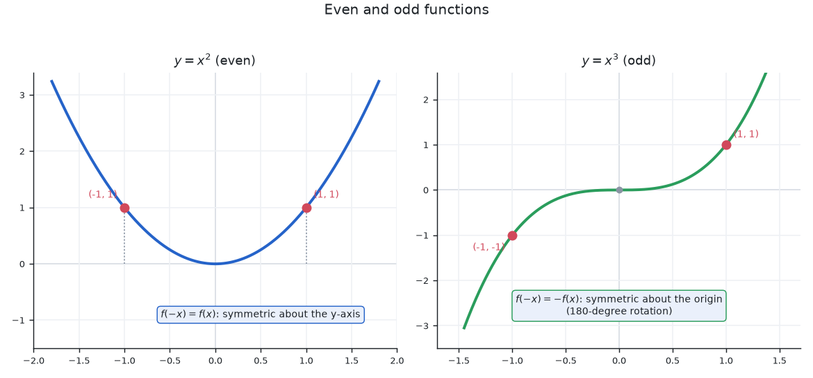
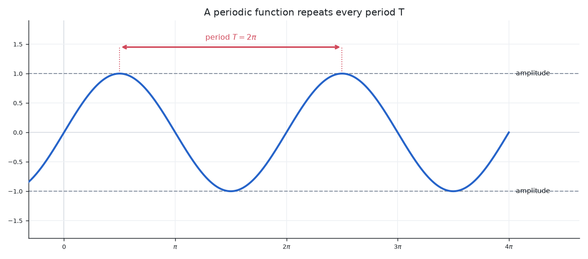
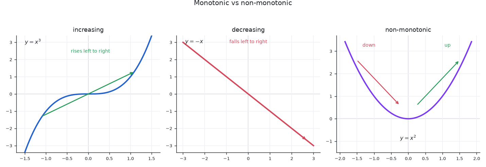
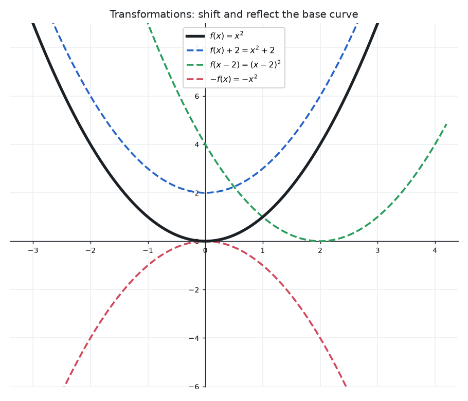

> [!abstract] Prerequisites & where this leads <!-- slt-nav -->
> **Builds on:** [Set Theory](./set-theory)
> **Leads to:** [Calculus](./calculus) · [Statistics](./statistics)

## Why Study Functions?

Much of mathematics, science, and everyday life involves understanding how one quantity depends on another. When you check the weather forecast, you are looking at a relationship between time and temperature. When you calculate how far you travel at a given speed, you are connecting distance to time. These input-output relationships are everywhere, and **functions** are the mathematical tool we use to describe them precisely.

Before we define functions formally, we need a broader concept: the **relation**.

**Relation (informal):** A relation is any rule or association that pairs elements from one set with elements of another. For example, "is the capital of" is a relation that pairs cities with countries (Ottawa with Canada, Tokyo with Japan).

**Function (informal):** A function is a special kind of relation where each input is paired with exactly one output. If you input a specific time into a temperature function, you get back one temperature, not two or three.

Consider a simple example: suppose you are driving at a constant 60 miles per hour. The distance you have traveled depends on the time you have been driving:

| Time (hours) | Distance (miles) |
|---|---|
| 1 | 60 |
| 2 | 120 |
| 3 | 180 |

Each input (time) produces exactly one output (distance), so this is a function. We could write it as $f(t) = 60t$.

The friendliest way to picture a function is as a **machine**: you drop an input in one end, the machine applies its rule, and exactly one output comes out the other end. Put in $t = 2$ hours, the machine multiplies by 60, and out comes 120 miles, every single time.

The single most important word in that sentence is **exactly one**. That is the whole difference between a function and a more general relation.

Not every relation is a function. For instance, the relation "is a student at" might pair one person with multiple schools (if they transferred). A function requires that each input maps to a single output.

Look at the two pictures above. On the left, every input has **exactly one** arrow leaving it, so it is a function. On the right, the input $a$ has **two** arrows leaving it, so it is a relation but *not* a function. Notice that it is perfectly fine for two different inputs to share an output (both $b$ and $c$ point to $3$ on the left); what is forbidden is one input pointing to two outputs.

With this intuition in place, we can now state the formal definitions.

## Relation

**Relation:** A **relation** is a set of ordered pairs, where each pair
consists of an element from one set, called the **domain**, and an
element from another set, called the **codomain**.

The relation specifies a relationship between these elements, indicating
how elements from the **domain** are associated with elements in the
**codomain**.

**Definition**: A relation **𝑅** from set **𝐴** to set **𝐵** is a
subset of the Cartesian product **𝐴×𝐵**, which means

$R \subseteq A \times B$

Each element of $R$ is an ordered pair $(a,b)$ where $a \in A$ and
$b \in B$.

We may state that **x** bears relation **R** to **y** by writing **xRy**

Do not let the formal language hide how simple this is. The **Cartesian product** $A \times B$ is the set of *all* possible ordered pairs (every element of $A$ paired with every element of $B$). A relation is nothing more than a **choice of which of those pairs you keep**. Picture the pairs as a grid of dots, one dot per possible pair; a relation just circles some of the dots.

![Two panels illustrating a relation as a subset of a Cartesian product. On the left, a three by three grid of dots for A equals the set 1, 2, 3 on the horizontal axis and B equals the set x, y, z on the vertical axis; all nine possible pairs are shown as faint grey dots, and the four pairs in the relation R, namely (1,y), (1,z), (2,x), and (3,z), are overplotted as larger circled blue dots. On the right, the same relation drawn as blue arrows between an A oval and a B oval: 1 to y, 1 to z, 2 to x, 3 to z. The caption notes that a function is the special case with exactly one chosen dot in each row.](./media/fr-relation-cartesian.png)

**Worked example.** Let $A = \{1, 2, 3\}$ and $B = \{x, y, z\}$. There are $|A| \times |B| = 3 \times 3 = 9$ possible pairs in $A \times B$. Suppose we keep the relation
$$R = \{(1, y),\ (1, z),\ (2, x),\ (3, z)\}.$$
This is a perfectly good relation (a subset of the 9 dots). Is it a function? **No**: the input $1$ appears in two pairs, $(1,y)$ and $(1,z)$, so $1$ has two outputs. In the grid picture, the row above $1$ has two circled dots. A function would require exactly one circled dot per input column.

Key Concepts

1.  **Domain, Codomain**, **Range, Image**

-   The **domain** of a relation is the set of all possible first
    elements (inputs) in the ordered pairs.

-   The **codomain** (or target set) is the set of all possible second
    elements (outputs) in the ordered pairs.

-   The **range** is the set of *actual outputs* in the
    relation, which is a subset of the codomain.

-   The **image** a relation, often used in the context of specific
    subsets of the domain, is the set of actual outputs that the
    relation produces when applied to a particular subset of its domain.
    For a given subset of the domain, the image refers to the outputs
    that the function generates from that subset.

**In summary:**

**Domain**: All possible inputs.

**Codomain**: All possible outputs (as defined for the function or
relation).

**Range**: The ***actual outputs produced by the
relation*** over its entire domain (a subset of the
codomain).

**Image**: The set of actual outputs for a specific subset of inputs
(may be the same as the range if considering the whole domain).

2.  **Ordered Pairs**

-   An **ordered pair** (𝑎,𝑏) consists of two elements, where 𝑎 is from
    the domain and 𝑏 is from the codomain. The order of elements
    matters, meaning (𝑎,𝑏) ≠ (𝑏,𝑎) unless 𝑎 = 𝑏.

3.  Types of Relation

-   **Function**: A special type of relation where each element in the
    domain is associated with exactly one element in the codomain. For
    every 𝑎 in the domain, there is a unique 𝑏 in the codomain such that
    (𝑎,𝑏) is in the relation.

### Properties of Relations

**Properties of Relations**

#### Reflexive Property

**Reflexive Property:** A relation R on a set A is said to be reflexive
if every element of A is related to itself. In other words, for all a in
A, the pair **(a,a)** is in the relation R.

$$
\forall a \in A \, (a \in A \to R(a, a))
$$

The reflexive property of relations can be understood from a directed
graph by looking for a loop on each element going back to itself.

The reflexive property of relations can be understood from a matrix by
looking for a diagonal connecting from top left corner to bottom right
corner

#### Symmetric Property

**Symmetric Property:**

A relation **R** on a set **A** is said to be **symmetric** if, whenever
an element a is related to an element **b**, then **b** is also related
to **a**.

In other words, if $(a,b) \in R$, then $(b,a)$ must
also be in $R$.

$$
\forall a,b \in A \, ( R(a,b) \to R(b,a) )
$$

#### Transitive Property

**Transitive Property:**

A relation **R** on a set **A** is said to be **transitive** if,
whenever an element **a** is related to an element **b** and **b** is
related to an element **c**, then **a** must also be related to **c**.

In other words, if $(a,b) \in R$ and $(b,c) \in R$ then $(a,c)$ must
also be in $R$.

$$
\forall a,b,c \in A \, ( ( R(a,b) \wedge R(b,c) ) \to R(a,c) )
$$

#### Antisymmetric Property

**Antisymmetric Property:** A relation **R** on a set **A** is **antisymmetric** if whenever both (a,b) and (b,a) are in R, then a must equal b.

$$
\forall a,b \in A \, ( (R(a,b) \wedge R(b,a)) \to a = b )
$$

**Example:** The "less than or equal to" relation (≤) on real numbers is antisymmetric:
- If a ≤ b and b ≤ a, then a = b

**Non-example:** The relation "x and y have the same absolute value" on integers is NOT antisymmetric:
- $(2,-2)$ and $(-2,2)$ both hold (since $|2| = |-2|$), but $2 \neq -2$

#### Asymmetric Property

**Asymmetric Property:** A relation **R** on a set **A** is **asymmetric** if whenever (a,b) is in R, then (b,a) cannot be in R.

$$
\forall a,b \in A \, ( R(a,b) \to \neg R(b,a) )
$$

**Example:** The "less than" relation (<) on real numbers is asymmetric:
- If a < b, then b ≮ a (b is not less than a)

**Note:** Asymmetric implies antisymmetric, but not vice versa.

#### Irreflexive Property

**Irreflexive Property:** A relation **R** on a set **A** is **irreflexive** if no element is related to itself.

$$
\forall a \in A \, ( \neg R(a,a) )
$$

**Example:** The "less than" relation (<) on real numbers is irreflexive:
- No number is less than itself

**Note:** Irreflexive is NOT the same as "not reflexive." A relation can be neither reflexive nor irreflexive.

### Summary of Relation Properties

The properties above, collected for reference ($R$ is a relation on a set $A$):

| Property | Condition | Typical example |
|---|---|---|
| Reflexive | $\forall a,\ a\,R\,a$ | $=$, $\le$, $\subseteq$ |
| Irreflexive | $\forall a,\ \neg(a\,R\,a)$ | $<$, $\ne$ |
| Symmetric | $a\,R\,b \Rightarrow b\,R\,a$ | $=$, "is a sibling of" |
| Antisymmetric | $a\,R\,b \wedge b\,R\,a \Rightarrow a = b$ | $\le$, $\subseteq$, divides |
| Asymmetric | $a\,R\,b \Rightarrow \neg(b\,R\,a)$ | $<$, $\subsetneq$ |
| Transitive | $a\,R\,b \wedge b\,R\,c \Rightarrow a\,R\,c$ | $=$, $<$, $\le$, $\subseteq$ |

An **equivalence relation** is reflexive + symmetric + transitive; a **partial order** is reflexive + antisymmetric + transitive. Build a relation below and see which properties it has (and whether it is an equivalence or a partial order), with its directed graph drawn live:

<iframe src="/static/interactive/relation-properties-checker.html" width="100%" height="660" style="border:none;"></iframe>

### Partial Order

**Partial Order:** A relation **R** on a set **A** is a **partial order** if it is:
1. **Reflexive:** Every element is related to itself
2. **Antisymmetric:** If a R b and b R a, then a = b
3. **Transitive:** If a R b and b R c, then a R c

Notation: Often written as ≤ or ⊑

**Examples:**

1. **Subset relation** ($\subseteq$) on sets:
   - Every set is a subset of itself (reflexive)
   - If $A \subseteq B$ and $B \subseteq A$, then $A = B$ (antisymmetric)
   - If $A \subseteq B$ and $B \subseteq C$, then $A \subseteq C$ (transitive)

2. **"Divides" relation (|)** on positive integers:
   - Every number divides itself (reflexive)
   - If a|b and b|a, then a = b (antisymmetric)
   - If a|b and b|c, then a|c (transitive)

3. **Less than or equal (≤)** on real numbers

**Partially ordered set (poset):** A set **A** together with a partial order relation is called a poset, denoted (A, ≤).

**Why "partial"?** Not every pair of elements needs to be comparable. For example, with subset relation, {1,2} and {3,4} are incomparable (neither is a subset of the other).

### Hasse Diagrams

**Hasse Diagram:** A visual representation of a finite partially ordered set (poset) that shows the ordering relationships between elements.

**Construction Rules:**
1. Place elements vertically - if a ≤ b, place b above a
2. Draw a line from a to b if a < b and there is no c such that a < c < b (direct covering)
3. Omit reflexive loops (implied by definition)
4. Omit transitive edges (can be inferred)

**Example 1 - Divisibility on {1, 2, 3, 4, 6, 12}:**

Reading the diagram:
- 1 divides everything (bottom)
- 12 is divisible by everything (top)
- 2 divides 4 and 6 (connected below)
- 3 divides 6 (connected below)
- 4 and 3 are incomparable (no path between them)

**Example 2 - Subset relation on P({a, b}) (power set of {a, b}):**

Reading the diagram:
- {} (empty set) is at the bottom (subset of all)
- {a, b} is at the top (contains all elements)
- {a} and {b} are incomparable (neither is subset of the other)
- Transitivity implied: $\{\} \subseteq \{a\} \subseteq \{a, b\}$

**Example 3 - Divisibility on {1, 2, 3, 5, 6, 10, 15, 30}:**

This eight-element divisibility order has exactly the shape of the power set of $\{2, 3, 5\}$ (send each divisor to its set of prime factors): $1 \leftrightarrow \varnothing$, $6 \leftrightarrow \{2,3\}$, $30 \leftrightarrow \{2,3,5\}$, and so on. Two posets with the same Hasse diagram are called **order-isomorphic**.

**Key Properties:**

1. **Maximal Elements:** Elements with no elements above them
   - In divisibility example: 12 is maximal
   - In power set example: {a, b} is maximal

2. **Minimal Elements:** Elements with no elements below them
   - In divisibility example: 1 is minimal
   - In power set example: {} is minimal

3. **Greatest Element (Top):** Element greater than or equal to all others
   - Exists if there's a single maximal element comparable to everything
   - Example: {a, b} in power set

4. **Least Element (Bottom):** Element less than or equal to all others
   - Exists if there's a single minimal element comparable to everything
   - Example: {} in power set, 1 in divisibility

5. **Covering Relation:** In the diagram, a covers b (written a ⋗ b) if a > b and there is no c with a > c > b
   - Hasse diagrams show only covering relations

**Reading Hasse Diagrams:**

- **Comparable:** Two elements are comparable if there's a path between them (going up or down)
- **Incomparable:** Two elements are incomparable if there's no path between them
- **To find a ≤ b:** Check if you can go upward from a to reach b

**Applications:**
- Visualizing partial orders
- Finding maximal/minimal elements
- Identifying chains (totally ordered subsets)
- Analyzing lattice structures

### Total Order (Linear Order)

**Total Order:** A partial order where **every pair** of elements is comparable.

A relation **R** on **A** is a total order if it is:
1. Reflexive
2. Antisymmetric  
3. Transitive
4. **Total:** $\forall a,b \in A \, ( R(a,b) \vee R(b,a) )$

**Examples:**
- ≤ on real numbers (you can always compare two numbers)
- Alphabetical order on strings

**Non-example:**
- Subset relation ($\subseteq$) is NOT a total order because some sets are incomparable

### Lattices, Bounds, and Chains

A partial order comes with a natural vocabulary for "how high or low you can reach."

**Bounds.** Let $S$ be a subset of a poset $(A, \leq)$. An **upper bound** of $S$ is an element $u \in A$ with $s \leq u$ for every $s \in S$; a **lower bound** is defined dually. The **least upper bound** (or **supremum**, or **join**), written $\sup S$ or $\bigvee S$, is the smallest of all the upper bounds, when one exists; the **greatest lower bound** (**infimum**, **meet**), $\inf S$ or $\bigwedge S$, is the largest lower bound. These are the order-theoretic twins of the supremum and infimum from [Real Analysis](./real-analysis): the completeness axiom of $\mathbb{R}$ is exactly the statement that every nonempty subset of $\mathbb{R}$ with an upper bound has a *least* upper bound.

**Lattices.** A **lattice** is a poset in which *every pair* of elements $a, b$ has both a join $a \vee b$ and a meet $a \wedge b$. Not every poset qualifies: two elements can have several upper bounds but no single *least* one.

![Three panels on order structure: first, the lattice of subsets of the set a, b, c ordered by inclusion, with the join of set-a and set-b equal to set a-b (their union) and their meet equal to the empty set (their intersection) highlighted; second, a four-element diamond poset with a and b below two incomparable elements c and d that are both upper bounds of a-and-b with no least one, so it is not a lattice; third, the same subset cube with a green chain running from the empty set up to a-b-c and a red antichain of the three singletons which are pairwise incomparable](./media/fr-lattice-chains.png)

Examples of lattices:

- The **power set** $(\mathcal{P}(X), \subseteq)$, with $A \vee B = A \cup B$ and $A \wedge B = A \cap B$. (This regularity is why the [power-set Hasse diagram](./set-theory#power-set) is so symmetric.)
- The **divisors** of a number under "divides", with $a \vee b = \operatorname{lcm}(a, b)$ and $a \wedge b = \gcd(a, b)$.
- The real numbers $(\mathbb{R}, \leq)$, with $a \vee b = \max(a, b)$ and $a \wedge b = \min(a, b)$.

A lattice is **bounded** if it has a greatest element $\top$ and a least element $\bot$, and **complete** if *every* subset (not just every pair) has a join and a meet. Power sets are complete lattices; $\mathbb{R}$ is not, since $\mathbb{R}$ itself has no upper bound.

**Chains and antichains.** A **chain** is a subset that is *totally* ordered (any two of its elements are comparable); in a Hasse diagram it is a path you can walk straight up. An **antichain** is a subset in which *no* two distinct elements are comparable. In the divisibility poset on $\{1, 2, 3, 4, 6, 12\}$, the set $\{1, 2, 4, 12\}$ is a chain (each divides the next), while $\{4, 6\}$ and $\{2, 3\}$ are antichains. Chains are the bridge to **Zorn's Lemma** on the [Set Theory](./set-theory) page: the hypothesis "every chain has an upper bound" is what forces a maximal element to exist, and Zorn's lemma is the workhorse behind existence proofs (a basis for every vector space, maximal ideals, and more).

### Equivalence Relation

**Equivalence Relation:** An equivalence relation is a way to formally
define when two elements of a set can be considered "equivalent" or
"similar" in some sense, according to specific criteria.

Equivalence relations are fundamental in mathematics because they allow
us to group elements of a set into distinct classes of equivalent items,
which simplifies the study and understanding of complex structures.

A relation **R** on a set **A** is called an **equivalence relation** if
it satisfies the following three properties:

1.  **Reflexivity:**

$$
\forall a \in A : (a,a) \in R
$$

This means that every element is related to itself.

2.  **Symmetry:**

$$
\forall a,b \in A \, (R(a,b) \to R(b,a))
$$

This means that if a is related to b, then b is also related to a.

3.  **Transitivity:**

$$
\forall a,b,c \in A \, (( R(a,b) \wedge R(b,c) ) \to R(a,c))
$$

This means that if a is related to b and b is related to c, then a is
also related to c.

**Key Concepts and Why They Matter:**

**1. Partitioning a Set:**

**Definition:** An equivalence relation partitions a set into
equivalence classes. Each equivalence class is a subset of the original
set, containing elements that are all equivalent to each other under the
given relation.

**Importance:** This partitioning allows us to break down large or
complex sets into smaller, more manageable subsets. Instead of dealing
with individual elements, we can work with entire classes, which
simplifies many problems in mathematics.

**Example:** Consider the set of all integers. The equivalence relation
"congruence modulo 3" divides this set into three equivalence classes:
numbers that leave a remainder of 0, 1, or 2 when divided by 3. Instead
of analyzing each integer separately, we can study the properties of
these three classes.

**Why Equivalence Relations Matter:**

-   **Classification and Simplification:** They provide a systematic way
    to classify and simplify mathematical objects by grouping elements
    that share a common property. This is particularly valuable in
    reducing complexity.

-   **Revealing Structure:** Equivalence relations often reveal hidden
    structure in a set, allowing us to understand it more deeply by
    studying its equivalence classes rather than individual elements.

-   **Generalization:** They generalize the concept of equality,
    enabling broader comparisons and connections between different
    mathematical entities.

-   **Applications Across Mathematics:** They are fundamental in many
    areas of mathematics and its applications, from abstract algebra and
    geometry to computer science and topology.

### Equivalence Classes

**Equivalence Class:** Given an equivalence relation **R** on a set **A** and an element $a \in A$, the equivalence class of **a** is the set of all elements in **A** that are related to **a** under **R**.

**Notation:** $[a]_R$ or simply $[a]$

**Definition:** $[a] = \{x \in A \mid (a,x) \in R\}$ or $[a] = \{x \in A \mid aRx\}$

**Example 1 - Congruence modulo 3:**
- Let **R** be "congruence modulo 3" on integers: $a R b$ if $3 \mid (a-b)$
- $[0] = \{\ldots, -6, -3, 0, 3, 6, 9, \ldots\}$ (all multiples of 3)
- $[1] = \{\ldots, -5, -2, 1, 4, 7, 10, \ldots\}$ (numbers with remainder 1)
- $[2] = \{\ldots, -4, -1, 2, 5, 8, 11, \ldots\}$ (numbers with remainder 2)
- Note: $[3] = [0]$, $[4] = [1]$, $[5] = [2]$ (classes repeat)

**Example 2 - Same age relation:**
- Let **R** be "has the same age" on a set of people
- $[Alice] = \{\text{all people who are the same age as Alice}\}$
- If Alice is 25, then $[Alice] = \{\text{all 25-year-olds}\}$

**Properties of Equivalence Classes:**

1. **Non-empty:** Every equivalence class contains at least one element (itself)
   - $a \in [a]$ (by reflexivity)

2. **Partition property:** Either $[a] = [b]$ or $[a] \cap [b] = \emptyset$
   - Two equivalence classes are either identical or completely disjoint
   - No element belongs to more than one equivalence class

3. **Union equals the whole set:** $\bigcup_{a \in A} [a] = A$
   - Every element belongs to some equivalence class

4. **Representative element:** Any element of an equivalence class can serve as its representative
   - If $b \in [a]$, then $[b] = [a]$

### Quotient Set (Set of Equivalence Classes)

**Quotient Set:** The set of all distinct equivalence classes under an equivalence relation **R** on set **A**.

**Notation:** $A/R$ (read as "A modulo R" or "A mod R")

**Definition:** $A/R = \{[a] \mid a \in A\}$

**Example 1 - Integers modulo 3:**
- $\mathbb{Z}/R = \{[0], [1], [2]\}$
- Only three distinct equivalence classes

**Example 2 - Rational numbers:**
- Consider fractions: $(a,b) R (c,d)$ if $ad = bc$ (equivalent fractions)
- $\mathbb{Z} \times \mathbb{Z}^* / R = \mathbb{Q}$ (the rational numbers)
- $[(2,3)] = [(4,6)] = [(6,9)] = \ldots$ (all representations of 2/3)

**Example 3 - Points on a circle:**
- Let **R** be "has the same distance from origin" on $\mathbb{R}^2$
- Each equivalence class is a circle
- The quotient set represents all possible distances (all non-negative reals)

### Composition of Relations

**Composition of Relations:** Given relations $R \subseteq A \times B$ and $S \subseteq B \times C$, the composition $S \circ R$ is a relation from **A** to **C**.

**Definition:** $(a,c) \in S \circ R$ if and only if there exists $b \in B$ such that $(a,b) \in R$ and $(b,c) \in S$

**Notation:** $S \circ R$ (read as "S composed with R" or "S after R")

**Note:** Order matters - apply **R** first, then **S**

**Example 1:**
- Let $R = \{(1,2), (1,3), (2,4)\}$ on $A = \{1,2,3\}$ to $B = \{2,3,4\}$
- Let $S = \{(2,5), (3,6), (4,5)\}$ on $B = \{2,3,4\}$ to $C = \{5,6\}$
- $S \circ R$:
  - $(1,2) \in R$ and $(2,5) \in S$ → $(1,5) \in S \circ R$
  - $(1,3) \in R$ and $(3,6) \in S$ → $(1,6) \in S \circ R$
  - $(2,4) \in R$ and $(4,5) \in S$ → $(2,5) \in S \circ R$
- Result: $S \circ R = \{(1,5), (1,6), (2,5)\}$

![Composition of relations shown as three columns of nodes. Column A on the left holds 1, 2, 3; column B in the middle holds 2, 3, 4; column C on the right holds 5, 6. Blue solid arrows for R go from A to B: 1 to 2, 1 to 3, 2 to 4. Green solid arrows for S go from B to C: 2 to 5, 3 to 6, 4 to 5. Purple dashed arcs arch over the top directly from A to C for the composite S after R: 1 to 5 via 2, 1 to 6 via 3, and 2 to 5 via 4. The caption gives S composed with R equals the set of pairs (1,5), (1,6), (2,5).](./media/fr-composition-relations.png)

To build $S \circ R$ from the picture, start at a node in $A$, walk one blue $R$-arrow to $B$, then continue along a green $S$-arrow to $C$; the pair (start, end) belongs to the composite. Every path from $A$ through $B$ to $C$ is one dashed purple arrow.

**Example 2 - Parent relation:**
- Let **P** be "is a parent of"
- $P \circ P$ means "is a grandparent of"
- If $(a,b) \in P$ (a is parent of b) and $(b,c) \in P$ (b is parent of c), then $(a,c) \in P \circ P$ (a is grandparent of c)

**Properties:**
- Composition is **associative:** $(T \circ S) \circ R = T \circ (S \circ R)$
- Composition is generally **not commutative:** $S \circ R \neq R \circ S$

**Composition and Relation Properties:**
- If **R** and **S** are both **transitive**, $S \circ R$ may not be transitive. For example, let $R = \{(1,2),(3,4)\}$ and $S = \{(2,3),(4,5)\}$; both are transitive (no two pairs chain together). But $S \circ R = \{(1,3),(3,5)\}$, which contains $(1,3)$ and $(3,5)$ yet not $(1,5)$, so it is not transitive
- If **R** is **reflexive** and **transitive**, then $R \circ R = R$

### Closure of Relations

**Closure:** The closure of a relation **R** with respect to a property **P** is the smallest relation that:
1. Contains **R** as a subset
2. Has property **P**

![Four directed-graph panels on the three nodes 1, 2, 3 arranged as a triangle, illustrating closures. The first panel shows the original relation R with blue arrows 1 to 2 and 2 to 3. The second panel, the reflexive closure, adds red self-loops at 1, 2, and 3. The third panel, the symmetric closure, adds red reverse arrows 2 to 1 and 3 to 2. The fourth panel, the transitive closure, adds the red shortcut arrow 1 to 3. In every panel the original blue arrows stay and the newly added edges are drawn in red.](./media/fr-closure-relations.png)

Read "smallest" literally: you add the *fewest* new pairs that force the property to hold, and nothing more. The red edges in each panel above are exactly those forced additions.

#### Reflexive Closure

**Reflexive Closure:** The smallest reflexive relation containing **R**.

**Notation:** $r(R)$

**Definition:** $r(R) = R \cup \{(a,a) \mid a \in A\}$

**Construction:** Add all pairs $(a,a)$ for every element in the set.

**Example:**
- Let $R = \{(1,2), (2,3)\}$ on $A = \{1,2,3\}$
- $r(R) = \{(1,2), (2,3), (1,1), (2,2), (3,3)\}$

#### Symmetric Closure

**Symmetric Closure:** The smallest symmetric relation containing **R**.

**Notation:** $s(R)$

**Definition:** $s(R) = R \cup R^{-1}$ where $R^{-1} = \{(b,a) \mid (a,b) \in R\}$

**Construction:** For every pair $(a,b)$ in **R**, add $(b,a)$ if not already present.

**Example:**
- Let $R = \{(1,2), (2,3), (3,3)\}$
- $R^{-1} = \{(2,1), (3,2), (3,3)\}$
- $s(R) = \{(1,2), (2,1), (2,3), (3,2), (3,3)\}$

#### Transitive Closure

**Transitive Closure:** The smallest transitive relation containing **R**.

**Notation:** $t(R)$ or $R^+$

**Definition:** $t(R) = R \cup R^2 \cup R^3 \cup \ldots$ where $R^n = R \circ R \circ \ldots \circ R$ (n times)

**Construction:** Keep composing **R** with itself until no new pairs are added.

**Example:**
- Let $R = \{(1,2), (2,3), (3,4)\}$ on $A = \{1,2,3,4\}$
- $R^2 = R \circ R = \{(1,3), (2,4)\}$
- $R^3 = R^2 \circ R = \{(1,4)\}$
- $R^4 = R^3 \circ R = \emptyset$ (no new pairs)
- $t(R) = R \cup R^2 \cup R^3 = \{(1,2), (2,3), (3,4), (1,3), (2,4), (1,4)\}$

**Interpretation:** If you can get from **a** to **b** in one or more steps, then $(a,b)$ is in the transitive closure.

**Warshall's Algorithm:** Efficient method to compute transitive closure using matrices (not covered here).

#### Reflexive-Transitive Closure

**Reflexive-Transitive Closure:** The smallest relation that is both reflexive and transitive containing **R**.

**Notation:** $R^*$

**Definition:** $R^* = R^0 \cup R^1 \cup R^2 \cup \ldots$ where $R^0 = \{(a,a) \mid a \in A\}$

**Construction:** Add reflexivity, then compute transitive closure (or vice versa).

**Example:**
- Let $R = \{(1,2), (2,3)\}$ on $A = \{1,2,3\}$
- $R^* = \{(1,1), (2,2), (3,3), (1,2), (2,3), (1,3)\}$

**Application:** Used in defining "reachability" in graphs, regular expressions, and formal languages.

### Inverse Relations

**Inverse Relation:** Given a relation $R \subseteq A \times B$, the inverse relation $R^{-1} \subseteq B \times A$ reverses the order of all pairs.

**Definition:** $R^{-1} = \{(b,a) \mid (a,b) \in R\}$

![Two panels showing that the inverse of a relation reverses every arrow. The left panel, labeled R from A to B, has an A oval with nodes 1 and 2 on the left and a B oval with nodes 2, 3, 4 on the right, with blue arrows 1 to 2, 1 to 3, and 2 to 4. The right panel, labeled R inverse from B to A, has the B oval on the left and the A oval on the right, with red arrows 2 to 1, 3 to 1, and 4 to 2, each the reverse of an arrow in the left panel. The caption notes that reversing twice returns the original relation.](./media/fr-inverse-relation.png)

**Example:**
- Let $R = \{(1,2), (1,3), (2,4)\}$
- $R^{-1} = \{(2,1), (3,1), (4,2)\}$

**Properties:**
- $(R^{-1})^{-1} = R$
- $(S \circ R)^{-1} = R^{-1} \circ S^{-1}$ (order reverses)
- If **R** is symmetric, then $R = R^{-1}$

## Function

### Vertical Line Test

**Vertical Line Test:** A graph in the coordinate plane represents a function if and only if every vertical line intersects the graph at most once.

**Why this works:** A function assigns exactly one output to each input. A vertical line at $x = a$ passes through every point with that $x$-value. If the line crosses the graph at two or more points, then the input $a$ would map to multiple outputs, violating the definition of a function.

**Examples:**
- The graph of $y = x^2$ passes the vertical line test (each vertical line hits the parabola at most once), so it is a function.
- The graph of $x^2 + y^2 = 1$ (a circle) fails the vertical line test. For instance, the vertical line $x = 0$ intersects the circle at both $(0, 1)$ and $(0, -1)$.

**Function:** A function is a relation that uniquely associates each
element of a set, called the **domain**, with exactly one element of
another set, called the **codomain**.

A function **f** from a set **X** (called the **domain**) to a set **Y**
(called the **codomain**) is a **rule or mapping** that **assigns to
each element** **x** in **X** **exactly one element** **y** in **Y**.

The element **y** is called the **image** of **x** under the function
**f**, and it is often denoted as **f(x)**.

Precise definition of a function:

A function is formed by three sets: the **domain** $X$, the **codomain** $Y$, and the **graph** $R$ (a set of input-output pairs) satisfying three conditions:

1. **The graph is a set of pairs:** $R \subseteq X \times Y$. Each pair $(x, y) \in R$ records that $f$ sends $x$ to $y$.
2. **Totality (defined everywhere):** every input has an output. $\forall x \in X,\ \exists y \in Y,\ (x, y) \in R$.
3. **Single-valuedness (functionality):** every input has *only one* output. If $(x, y) \in R$ and $(x, y') \in R$, then $y = y'$.

Conditions 2 and 3 together say each $x \in X$ relates to *exactly one* $y$, which is precisely what separates a function from a general [relation](#relation): a relation may leave an element unpaired or pair it with several, a function does neither.

Each function type has characteristic domain restrictions. See [Rational Functions](./rational-functions) (excluded zeros of denominator), [Radical Functions](./radical-functions) (non-negative under even roots), and [Logarithms](./logarithms) (positive arguments only).

**1. Domain of a Function:**

The **domain** of a function **f : X → Y** is the set **X**. It includes
all the possible inputs that the function can accept.

**Example**: For the function **f(x) =** $\sqrt{\mathbf{x}}$, the domain
is $X = \{ x \in \mathbb{R} \mid x \geq 0 \}$, because the square root function is only
defined for non-negative real numbers.

**2. Codomain of a Function:**

The **codomain** of a function **f : X → Y**, which includes all
possible outputs that the function is allowed to produce according to
its definition.

The **codomain** is specified as part of the function's definition,
even if not all elements of the **codomain** are actually reached by
the function.

**3. Range of a Function:**

The range of a function **f : X → Y** is the set of all actual
outputs that the function produces when applied to every
element in its domain **X**.

The range is therefore a subset of the codomain.

**4. Image of a Function:**

The **image** of a function is similar to the **range** but often refers
to the outputs corresponding to a specific subset of the domain. If the
subset in question is the entire **domain**, then the **image** and the
**range** are the same. For a particular subset $A \subseteq X$, the image of
**A** under **f** is denoted as **f(A)**. For a single element $a$, the value $f(a)$ is called the **image of $a$ under $f$**.

### Domain

The domain of a function **f** is the set **X**, which includes all the
possible inputs for the function. In terms of ordered pairs, the domain
is the set of all possible first values (the input values) in those
pairs.

$$
\text{Dom}(f) = A \iff \forall x \, (x \in A \leftrightarrow \exists y \, f(x) = y)
$$

$$
\text{Dom}(f) = \{ x \mid \exists y \, f(x) = y \}
$$

### Codomain

The **codomain** of a function **f : X → Y**

includes all possible outputs that the function is allowed to produce
according to its definition

The **codomain** is specified as part of the function's definition,
even if not all elements of the **codomain** are actually reached by the
function. This contrasts with range, which represents the actually
mapped values of the **codomain**.

$$
\text{Cod}(f) = B \iff \forall x \in \text{Dom}(f), \, \exists y \in B \, (f(x) = y)
$$

### Range

The range of a function **f : X → Y** is the set of all actual
outputs that the function produces when applied to every
element in its domain **X**. The range is therefore a subset of the
codomain.

$$
\text{Range}(f) = \{ y \in \text{Cod}(f) \mid \exists x \in \text{Dom}(f), \, f(x) = y \}
$$

$$
\text{Range}(f) = \{ f(x) \mid x \in \text{Dom}(f) \}
$$

Explanation:

-   $\forall y$: For all elements **y** in the codomain.

-   $y \in \text{Range}(f) \leftrightarrow \exists x \, ( x \in X \wedge f(x) = y)$:

    -   This states that **y** is in the **range** of the function **f**
        iff. there exists an element **x** in the domain **X** such that
        **(x) = y**.

    -   In other words, for each **y** in the **range**, there is at
        least one **x** in the **domain** that maps to **y**.

### Image

The **image** of a function is similar to the **range** but often refers
to the outputs corresponding to a specific subset of the domain.

*If the subset in question is the entire **domain**, then the **image**
and the **range** are the same.*

For a particular subset $A \subseteq X$, the image of **A** under **f** is
denoted as **f(A)**.

### Preimage

The **preimage** of a set under a function is a concept that refers to
the set of all elements in the domain that map to a given subset of the
codomain.

In other words, for a function:

**f : X → Y** and a subset **B** of the codomain **Y**, the preimage of
**B** under **f** is the set of all elements in the domain **X** that
**f** maps into **B**.

$f^{-1}(B) = \{ x \in X \mid f(x) \in B \}$

The **preimage** of a set **B** under a function **f** is the set of all
elements in the domain **X** that map to elements in **B** in the
codomain **Y**.

One should not be misled by the notation into thinking of the preimage
as having to do with an inverse of **f**. The preimage is defined whether
f has an inverse or not. **Note that however** if f does have an
inverse, then the preimage is exactly the image of Y under the inverse
map.

![Two mapping-diagram panels sharing the same function, whose arrows are a to 2, b to 3, c to 3, and d to 5, between a domain oval a, b, c, d and a codomain oval 1, 2, 3, 4, 5. The left panel, image, highlights the domain subset A equals a, b in blue and pushes it forward along the arrows to the highlighted output set f of A equals 2, 3 in the codomain. The right panel, preimage, highlights the codomain subset B equals 3, 5 in green and pulls it back to the highlighted input set f inverse of B equals b, c, d, every input whose arrow lands in B. The caption stresses that the preimage is defined for any function, with no inverse required.](./media/fr-image-preimage.png)

Think of it directionally: the **image** pushes a set of *inputs* **forward** to the outputs they produce; the **preimage** pulls a set of *outputs* **backward** to every input that lands there. The forward arrows and the backward gathering use the very same function.

**Worked example (image and preimage of intervals).** Let $f(x) = x^2$ on $\mathbb{R}$.

- **Image of a set:** $f([1, 2]) = [1, 4]$. As $x$ runs over $[1,2]$, $x^2$ runs over $[1, 4]$ (squaring is increasing on the positives).
- **Preimage of a set:** $f^{-1}([1, 4]) = [-2, -1] \cup [1, 2]$. We want every $x$ with $1 \leq x^2 \leq 4$, i.e. $1 \leq |x| \leq 2$. That is *two* intervals, one positive and one negative, because both $x$ and $-x$ square to the same value. Notice the preimage here is a genuinely different-looking set from any single interval, and $f$ has no inverse, yet $f^{-1}([1,4])$ is still perfectly well defined.
- **Preimage can be empty:** $f^{-1}([-5, -1]) = \varnothing$, since no real square is negative.

### How Image and Preimage Interact with Set Operations

Image and preimage behave *very* differently under union, intersection, and complement, an asymmetry worth committing to memory.

**Preimage is the well-behaved one:** it commutes with every set operation. For subsets $B, C \subseteq Y$,
$$
f^{-1}(B \cup C) = f^{-1}(B) \cup f^{-1}(C), \quad f^{-1}(B \cap C) = f^{-1}(B) \cap f^{-1}(C), \quad f^{-1}(B^c) = \big(f^{-1}(B)\big)^c.
$$

**Image is not:** it commutes with union but only *half*-commutes with intersection. For subsets $A, D \subseteq X$,
$$
f(A \cup D) = f(A) \cup f(D), \qquad f(A \cap D) \subseteq f(A) \cap f(D),
$$
and the second inclusion can be **strict**. Take $f(x) = x^2$ on $\mathbb{R}$ with $A = (-\infty, 0]$ and $D = [0, \infty)$: then $A \cap D = \{0\}$ so $f(A \cap D) = \{0\}$, but $f(A) \cap f(D) = [0, \infty)$. The reason is non-injectivity: an output can sit in both $f(A)$ and $f(D)$ by coming from *different* inputs, one in each set. In fact $f(A \cap D) = f(A) \cap f(D)$ for all $A, D$ if and only if $f$ is injective. This is why preimages, not images, are the right tool for pulling structure back through a function.

![The parabola y equals x squared drawn in blue, used to show why the image only half-commutes with intersection. The negative half of the x-axis is highlighted blue as the set A equals the interval from minus infinity to 0, and the positive half is highlighted red as the set D equals the interval from 0 to infinity. Dashed lines from x equals minus 2 and x equals plus 2 both rise to the curve at height 4 and across to the y-axis, showing that the two different inputs minus 2 and 2 share the single output 4. On the y-axis both images f of A and f of D are the whole non-negative ray from 0 to infinity, so they overlap completely, while the domain intersection A intersect D is just the single point 0 whose image is just 0. The annotation concludes that f of the intersection equals just 0 but the intersection of the images is the whole ray, a strict gap caused by non-injectivity.](./media/fr-image-preimage-setops.png)

### Fibers and the Kernel of a Function

![Two panels illustrating fibers. The left panel, fibers of a finite map, shows a domain oval containing eight dots grouped into three colored blobs: a blue blob 1, 2, 3, a green blob 4, 5, and a purple blob 6, 7, 8, with arrows from each blob to its single target in a codomain oval holding p, q, r, so all of 1, 2, 3 map to p, both 4 and 5 map to q, and 6, 7, 8 map to r. The right panel, fibers of f of x equals x squared, plots the parabola with a horizontal line at height 4 meeting it at the points minus 2, 4 and 2, 4, marking the fiber over 4 as the set minus 2, 2. The caption states that the fibers are the equivalence classes of the kernel, where x is related to x prime exactly when f of x equals f of x prime.](./media/fr-fibers-kernel.png)

For each $y \in Y$, its preimage of a single point, $f^{-1}(\{y\}) = \{x \in X : f(x) = y\}$, is called the **fiber** over $y$. The fibers **partition the domain**: every $x$ lies in exactly one fiber (the one over $f(x)$), and fibers over different values are disjoint. That partition is precisely the [equivalence relation](#equivalence-relation) induced by $f$,
$$
x \sim x' \iff f(x) = f(x'),
$$
called the **kernel** of $f$. So *every function silently carves its domain into equivalence classes* (its fibers), and the [quotient set](#quotient-set-set-of-equivalence-classes) $X/{\sim}$ is in bijection with the range of $f$. This is the bridge between the two halves of this page: relations give rise to functions, and every function gives back an equivalence relation. ($f$ is injective exactly when every fiber has at most one element, i.e. its kernel is plain equality.)

### Injection (one-to-one)

**Injection:** A function is **injective** (also called **one-to-one**) if *different inputs always produce different outputs*, so no output is ever hit twice. Equivalently, in the contrapositive form that is easiest to use in proofs:

$\forall x_1 \forall x_2 ( (f(x_1) = f(x_2)) \rightarrow (x_1 = x_2) )$

*For every $x_1$, $x_2$: if $f(x_1) = f(x_2)$, then $x_1$ must equal $x_2$.* (Read $x_1$ as "x-sub-one".) In the mapping-diagram pictures, injective means **no two arrows land on the same codomain dot**; with the [horizontal line test](#horizontal-line-test), it means every horizontal line hits the graph at most once.

**Worked example (proving a function is injective).** Show $f(x) = 2x + 3$ on $\mathbb{R}$ is injective.

Assume $f(x_1) = f(x_2)$. Then $2x_1 + 3 = 2x_2 + 3$. Subtract 3: $2x_1 = 2x_2$. Divide by 2: $x_1 = x_2$. Since equal outputs forced equal inputs, $f$ is injective. $\blacksquare$

**Worked example (proving a function is NOT injective).** Show $f(x) = x^2$ on $\mathbb{R}$ is not injective.

It is enough to exhibit **one** collision: $f(-2) = 4 = f(2)$, yet $-2 \neq 2$. Two different inputs share an output, so $f$ is not injective. (Restricting the domain to $[0, \infty)$ removes the collision and makes it injective, which is exactly the trick used to define $\sqrt{\ }$ as an inverse.)

### Surjection (onto)

**Surjection:** A function $f : X \to Y$ is **surjective** (or **onto**) if every element of the codomain is the image of at least one input:
$$
\forall y \in Y,\ \exists x \in X,\ f(x) = y.
$$
Equivalently, the range equals the whole codomain, $\text{Range}(f) = Y$: nothing in $Y$ is left unhit. Surjectivity is a condition on the *codomain* (everything is reached), exactly complementary to injectivity, which is a condition on the *inputs* (nothing is doubled up).

**Worked example (proving a function is surjective).** Show $f(x) = 2x + 3$ as a map $\mathbb{R} \to \mathbb{R}$ is surjective.

Pick an arbitrary target $y \in \mathbb{R}$. We need an input $x$ with $f(x) = y$, so solve $2x + 3 = y$ for $x$: $x = \frac{y - 3}{2}$. This $x$ is a real number for every real $y$, and $f\!\left(\frac{y-3}{2}\right) = 2 \cdot \frac{y-3}{2} + 3 = y$. Since every $y$ is hit, $f$ is surjective. $\blacksquare$

**Worked example (surjectivity depends on the codomain).** The rule $f(x) = x^2$ is **not** surjective as a map $\mathbb{R} \to \mathbb{R}$: no input produces the output $-1$, since squares are never negative, so $(-\infty, 0)$ is left entirely unhit. But the *same rule* $f(x) = x^2$ viewed as a map $\mathbb{R} \to [0, \infty)$ **is** surjective, because every non-negative $y$ has the input $\sqrt{y}$. Surjectivity is a statement about a specific chosen codomain, not about the formula alone.

### Bijection (injective and surjective)

A function is bijective if and only if it is
both **injective** **(or *one-to-one*)---**meaning that each element in
the codomain is mapped to from at most one element of the
domain---and **surjective** **(or *onto*)---**meaning that each element
of the codomain is mapped to from at least one element of the domain. 

Formally, $f$ is bijective when it is injective *and* surjective:
$$
\underbrace{\forall x_1, x_2\ \big(f(x_1) = f(x_2) \to x_1 = x_2\big)}_{\text{injective}} \quad\wedge\quad \underbrace{\forall y \in Y\ \exists x \in X\ (f(x) = y)}_{\text{surjective}}.
$$
A bijection pairs the elements of $X$ and $Y$ perfectly, one-to-one and onto, which is exactly what makes it invertible (next) and what underlies comparing set sizes.

Define your own function on a small domain below: choose each output and watch whether it is injective, surjective, bijective, or invertible, with its image, a chosen preimage, and the mapping diagram updating live.

<iframe src="/static/interactive/finite-function-explorer.html" width="100%" height="640" style="border:none;"></iframe>

### Invertibility

**Let f: A → B**

**f is invertible if there exists a function g: B → A such that:**

$\forall x \in A, \, g(f(x)) = x \wedge \forall y \in B, \, f(g(y)) = y.$

**In this case, g is called the inverse of f, written f^−1**

**Important:** A function is invertible if and only if it is bijective (both injective and surjective).

## Well-Defined Functions

A rule counts as a **well-defined** function only if it genuinely assigns *one* output to each input, independent of any arbitrary choices made while stating the rule. The issue is easy to miss because most everyday formulas are automatically well-defined, but it becomes central the moment you define a function on a [quotient set](#quotient-set-set-of-equivalence-classes), where each input is an equivalence class named by one of its many representatives.

**Example (on the integers mod 5).** Elements of $\mathbb{Z}/5\mathbb{Z}$ are classes like $[2] = [7] = [12] = \cdots$. Consider two attempted definitions:

- $g([n]) = [2n]$ **is** well-defined: different names for the same class give the same answer, since $[7] \mapsto [14] = [4]$ and $[2] \mapsto [4]$ agree. (In general $n \equiv n' \pmod 5$ forces $2n \equiv 2n' \pmod 5$.)
- $h([n]) = n$ (return the representative itself) is **not** well-defined: $[2]$ and $[7]$ are the *same* input, yet the rule would return $2$ for one name and $7$ for the other, so it assigns two outputs to one input, not a function at all.

The rule to remember: whenever a function is defined via representatives of equivalence classes, you must check that **equivalent inputs produce equal outputs**, that is, that the rule respects the [kernel](#fibers-and-the-kernel-of-a-function). Verifying well-definedness is the first obligation for *any* construction on a quotient, throughout algebra and topology.

## Identity Function

**Identity Function:** The identity function on a set **X**, denoted **id_X** or simply **id**, is a function that maps every element to itself.

**Definition:** $id_X : X \rightarrow X$ defined by $id_X(x) = x$ for all $x \in X$

**Properties:**
- The identity function is bijective
- For any function $f: A \rightarrow B$:
  - $f \circ id_A = f$ (composing with identity on domain)
  - $id_B \circ f = f$ (composing with identity on codomain)
- The identity function is its own inverse: $id_X^{-1} = id_X$

**Example:** For the set of real numbers $\mathbb{R}$, the identity function is $id(x) = x$. So $id(5) = 5$, $id(-3.7) = -3.7$, etc.

## Inverse Functions

The exponential and logarithm are the most important pair of inverse functions. See [Exponential Functions](./exponential-functions) and [Logarithms](./logarithms).

**Inverse Function:** If a function **f: A → B** is bijective, then there exists a unique function **f^−1: B → A** called the inverse function, such that:

- $f^{-1}(f(x)) = x$ for all $x \in A$
- $f(f^{-1}(y)) = y$ for all $y \in B$

**Finding an Inverse:**

1. Start with $y = f(x)$
2. Solve for $x$ in terms of $y$
3. Swap variables: write $y = f^{-1}(x)$

**Example:** Find the inverse of $f(x) = 2x + 3$

1. Let $y = 2x + 3$
2. Solve for $x$: $x = \frac{y - 3}{2}$
3. Therefore: $f^{-1}(x) = \frac{x - 3}{2}$

**Verification:**
- $f^{-1}(f(x)) = f^{-1}(2x + 3) = \frac{(2x + 3) - 3}{2} = \frac{2x}{2} = x$ ✓
- $f(f^{-1}(x)) = f\left(\frac{x - 3}{2}\right) = 2\left(\frac{x - 3}{2}\right) + 3 = x - 3 + 3 = x$ ✓

**Properties of Inverse Functions:**

- The graph of $f^{-1}$ is the reflection of the graph of $f$ across the line $y = x$
- $(f^{-1})^{-1} = f$ (inverse of inverse is the original function)
- If $f$ and $g$ are both invertible, then $(g \circ f)^{-1} = f^{-1} \circ g^{-1}$ (reverse order)
- Domain of $f^{-1}$ = Range of $f$
- Range of $f^{-1}$ = Domain of $f$

**When Does an Inverse Exist?**

A function has an inverse if and only if it is bijective:
- **Injective** (one-to-one): No two inputs map to the same output
- **Surjective** (onto): Every element in the codomain is mapped to

**Horizontal Line Test:** A function has an inverse if and only if every horizontal line intersects its graph at most once.

## Composition of Functions

Function composition is the mathematical foundation of the chain rule in [Calculus](./calculus), which is in turn the basis of backpropagation in machine learning.

**Function Composition:** The composition of two functions **f: A → B** and **g: B → C** is a new function **g ∘ f: A → C** defined by:

$$(g \circ f)(x) = g(f(x))$$

Read as "g composed with f" or "g of f of x".

**Important:** The order matters! $g \circ f$ means "apply f first, then apply g to the result."

**Example:**

Let $f(x) = x^2$ and $g(x) = x + 3$

- $(g \circ f)(x) = g(f(x)) = g(x^2) = x^2 + 3$
- $(f \circ g)(x) = f(g(x)) = f(x + 3) = (x + 3)^2 = x^2 + 6x + 9$

Notice: $g \circ f \neq f \circ g$ (composition is not commutative in general)

**Properties of Composition:**

1. **Associativity:** $(h \circ g) \circ f = h \circ (g \circ f)$
   
   You can compose in any grouping, as long as the order stays the same.

2. **Identity:** For any function $f: A \rightarrow B$:
   - $f \circ id_A = f$
   - $id_B \circ f = f$

3. **Inverses:** If $f$ and $g$ are invertible:
   - $(g \circ f)^{-1} = f^{-1} \circ g^{-1}$ (reverse the order)

4. **Composition preserves properties:**
   - If $f$ and $g$ are both injective, then $g \circ f$ is injective
   - If $f$ and $g$ are both surjective, then $g \circ f$ is surjective
   - If $f$ and $g$ are both bijective, then $g \circ f$ is bijective

**Domain Compatibility:**

For $g \circ f$ to be defined, the range of $f$ must be a subset of the domain of $g$.

**Example with restricted domains:**

Let $f: \mathbb{R} \rightarrow \mathbb{R}^+$ where $f(x) = x^2$ (positive reals only)

Let $g: \mathbb{R}^+ \rightarrow \mathbb{R}$ where $g(x) = \ln(x)$ (natural log)

Then $(g \circ f)(x) = g(f(x)) = g(x^2) = \ln(x^2) = 2\ln|x|$

**More Composition Examples:**

**Example 1: Composition with absolute value**

Let $f(x) = x - 5$ and $g(x) = |x|$

- $(g \circ f)(x) = g(f(x)) = |x - 5|$ (distance from 5)
- $(f \circ g)(x) = f(g(x)) = |x| - 5$ (shift absolute value down 5)

**Example 2: Showing non-commutativity**

Let $f(x) = 2x$ and $g(x) = x + 1$

- $(g \circ f)(x) = g(2x) = 2x + 1$
- $(f \circ g)(x) = f(x + 1) = 2(x + 1) = 2x + 2$

These are different functions!

**Example 3: Triple composition**

Let $f(x) = x + 1$, $g(x) = x^2$, $h(x) = \sqrt{x}$

$(h \circ g \circ f)(x) = h(g(f(x))) = h(g(x + 1)) = h((x + 1)^2) = \sqrt{(x + 1)^2} = |x + 1|$

**Example 4: Composition resulting in identity**

Let $f(x) = x + 3$ and $g(x) = x - 3$

$(g \circ f)(x) = g(x + 3) = (x + 3) - 3 = x = id(x)$

This shows $g$ is the inverse of $f$.

**Decomposing Functions:**

Sometimes you need to express a complex function as a composition. This is useful for calculus (chain rule).

**Example:** Express $h(x) = \sqrt{x^2 + 1}$ as a composition.

Let $f(x) = x^2 + 1$ (inner function) and $g(x) = \sqrt{x}$ (outer function)

Then $h(x) = (g \circ f)(x) = g(f(x)) = \sqrt{x^2 + 1}$

## Arithmetic Operations on Functions

Just as numbers can be added, subtracted, multiplied, and divided, so can functions. Given two functions $f$ and $g$, we define:

**Sum:** $(f + g)(x) = f(x) + g(x)$

**Difference:** $(f - g)(x) = f(x) - g(x)$

**Product:** $(fg)(x) = f(x) \cdot g(x)$

**Quotient:** $(f/g)(x) = \frac{f(x)}{g(x)}$, defined only where $g(x) \neq 0$

The domain of each combined function is the intersection of the domains of $f$ and $g$, with the additional restriction for the quotient that $g(x) \neq 0$.

**Example:** Let $f(x) = x^2 + 1$ and $g(x) = x - 3$

- $(f + g)(x) = x^2 + 1 + x - 3 = x^2 + x - 2$
- $(f - g)(x) = x^2 + 1 - (x - 3) = x^2 - x + 4$
- $(fg)(x) = (x^2 + 1)(x - 3) = x^3 - 3x^2 + x - 3$
- $(f/g)(x) = \frac{x^2 + 1}{x - 3}$, domain: all real numbers except $x = 3$

## Difference Quotient

**Difference Quotient:** For a function $f$, the difference quotient is:

$$\frac{f(x + h) - f(x)}{h}$$

This expression computes the **average rate of change** of $f$ between the input $x$ and the input $x + h$. Geometrically, it is the slope of the **secant line** through the points $(x, f(x))$ and $(x + h, f(x + h))$.

![The parabola y equals x squared in blue with two marked points P at (1, 1) and Q at (2, 4), taking x equals 1 and h equals 1. A red secant line is drawn through P and Q. A right triangle beneath the secant marks the horizontal run h equals 1 from x equals 1 to x equals 2 and the vertical rise equal to 3 from y equals 1 to y equals 4, so the secant slope is the rise over the run, 3 over 1, which equals 2x plus h. A thin grey dashed tangent line at P with slope 2 is shown for contrast, labeled as the limit slope 2x as h approaches 0.](./media/fr-difference-quotient.png)

The difference quotient is the precursor to the derivative in [Calculus](./calculus). Taking the limit as $h \to 0$ turns the average rate of change into the instantaneous rate of change.

**Worked example:** Find the difference quotient for $f(x) = x^2$.

$$\frac{f(x+h) - f(x)}{h} = \frac{(x+h)^2 - x^2}{h}$$

Expand $(x+h)^2 = x^2 + 2xh + h^2$:

$$= \frac{x^2 + 2xh + h^2 - x^2}{h} = \frac{2xh + h^2}{h} = \frac{h(2x + h)}{h} = 2x + h$$

As $h \to 0$, the difference quotient approaches $2x$, which is the derivative of $x^2$.

## Domain Restrictions by Function Type

Different families of functions have characteristic domain restrictions:

- **Polynomials:** Domain is all real numbers $\mathbb{R}$. Polynomials are defined everywhere.
- **Rational functions:** Exclude values where the denominator equals zero. See [Rational Functions](./rational-functions).
- **Radical functions with even index:** The expression under the radical (the radicand) must be $\geq 0$. For example, $\sqrt{x - 3}$ requires $x \geq 3$. See [Radical Functions](./radical-functions).
- **Logarithmic functions:** The argument must be strictly positive ($> 0$). For example, $\ln(x + 2)$ requires $x > -2$. See [Logarithms](./logarithms).
- **Combinations:** When functions are combined (through arithmetic operations or composition), apply all relevant restrictions. For instance, $f(x) = \frac{\sqrt{x}}{x - 4}$ requires $x \geq 0$ (from the square root) and $x \neq 4$ (from the denominator), so the domain is $[0, 4) \cup (4, \infty)$.

## Function Properties

### Even and Odd Functions

**Even Function:** A function $f$ is even if $f(-x) = f(x)$ for all $x$ in the domain.

- Graph is symmetric about the y-axis
- Examples: $f(x) = x^2$, $f(x) = \cos(x)$, $f(x) = |x|$

**Odd Function:** A function $f$ is odd if $f(-x) = -f(x)$ for all $x$ in the domain.

- Graph is symmetric about the origin (180° rotational symmetry)
- Examples: $f(x) = x^3$, $f(x) = \sin(x)$, $f(x) = x$

**Note:** Most functions are neither even nor odd.

### Periodic Functions

**Periodic Function:** A function $f$ is periodic if there exists a positive number $p$ such that:

$$f(x + p) = f(x)$$

for all $x$ in the domain. The smallest such positive number $p$ is called the **period**.

**Examples:**
- $\sin(x)$ has period $2\pi$
- $\cos(x)$ has period $2\pi$
- $\tan(x)$ has period $\pi$

### Monotonic Functions

**Increasing Function:** A function $f$ is increasing on an interval if:

$$x_1 < x_2 \Rightarrow f(x_1) \leq f(x_2)$$

**Strictly Increasing:** If $x_1 < x_2 \Rightarrow f(x_1) < f(x_2)$ (strict inequality)

**Decreasing Function:** A function $f$ is decreasing on an interval if:

$$x_1 < x_2 \Rightarrow f(x_1) \geq f(x_2)$$

**Strictly Decreasing:** If $x_1 < x_2 \Rightarrow f(x_1) > f(x_2)$ (strict inequality)

**Monotonic:** A function is monotonic if it is either increasing or decreasing on its entire domain.

**Examples:**
- $f(x) = x^2$ is decreasing on $(-\infty, 0]$ and increasing on $[0, \infty)$
- $f(x) = e^x$ is strictly increasing on all of $\mathbb{R}$
- $f(x) = -x$ is strictly decreasing on all of $\mathbb{R}$

### Bounded Functions

**Bounded Above:** A function $f$ is bounded above if there exists a real number $M$ such that:

$$f(x) \leq M$$

for all $x$ in the domain.

**Bounded Below:** A function $f$ is bounded below if there exists a real number $m$ such that:

$$f(x) \geq m$$

for all $x$ in the domain.

**Bounded:** A function is bounded if it is both bounded above and bounded below.

**Examples:**
- $f(x) = \sin(x)$ is bounded: $-1 \leq \sin(x) \leq 1$
- $f(x) = x^2$ is bounded below by 0 but not bounded above
- $f(x) = e^x$ is bounded below by 0 but not bounded above

## Partial Functions

**Partial Function:** A partial function from set **A** to set **B** is a function that is not necessarily defined for every element of **A**.

Formally, a partial function $f: A \rightharpoonup B$ is a function $f: A' \rightarrow B$ where $A' \subseteq A$.

The set $A'$ is called the **domain of definition**.

**Examples:**
- $f(x) = \frac{1}{x}$ is a partial function on $\mathbb{R}$ (undefined at $x = 0$)
- $f(x) = \sqrt{x}$ is a partial function on $\mathbb{R}$ (undefined for $x < 0$ in real numbers)
- $f(x) = \log(x)$ is a partial function on $\mathbb{R}$ (undefined for $x \leq 0$)

**Total Function:** A function defined for every element in its domain. Most functions discussed in mathematics are total functions.

## One-to-One Correspondence

**One-to-One Correspondence:** Another term for a bijective function. It establishes a perfect pairing between two sets where:

1. Every element in the domain maps to exactly one element in the codomain (function property)
2. Every element in the codomain is mapped to by exactly one element in the domain (bijection)

**Significance:**

A one-to-one correspondence between sets **A** and **B** means that **A** and **B** have the same **cardinality** (size), written $|A| = |B|$.

**Examples:**

1. The function $f: \mathbb{Z} \rightarrow \mathbb{Z}$ defined by $f(x) = x + 1$ is a one-to-one correspondence from integers to integers.

2. The function $f: [0, 1] \rightarrow [0, 2]$ defined by $f(x) = 2x$ is a one-to-one correspondence showing these intervals have the same cardinality.

3. The function $f: \mathbb{N} \rightarrow \mathbb{Z}$ defined by:
   $$f(n) = \begin{cases} n/2 & \text{if } n \text{ is even} \\ -(n+1)/2 & \text{if } n \text{ is odd} \end{cases}$$
   
   This creates a bijection: 0 → 0, 1 → -1, 2 → 1, 3 → -2, 4 → 2, ...
   
   This shows that the natural numbers and integers have the same cardinality (both are countably infinite).

![A bijection between the natural numbers and the integers. The top row lists the naturals 0, 1, 2, 3, 4, 5 with an ellipsis, and the bottom row lists directly beneath each the integer it maps to: 0, minus 1, 1, minus 2, 2, minus 3, with an ellipsis. An arrow joins each natural to its integer. Even-numbered inputs map to non-negative integers along green arrows and odd-numbered inputs map to negative integers along purple arrows, so the two colors interleave and the pairing zig-zags outward from 0. The caption notes every integer is hit exactly once, so the cardinalities are equal.](./media/fr-cardinality-bijection.png)

The picture makes the counting concrete: walking left to right along the naturals, the outputs bounce $0, -1, +1, -2, +2, -3, \ldots$, sweeping outward so that *every* integer is reached exactly once. A set that can be listed this way (put in bijection with $\mathbb{N}$) is called **countably infinite**.

## Schröder–Bernstein (Cantor–Bernstein) Theorem

**Statement.** If there are injections $f : A \rightarrow B$ and $g : B \rightarrow A$, then there exists a bijection $h : A \rightarrow B$.

In cardinality language, $|A| \leq |B|$ means "there is an injection $A \to B$" and $|B| \leq |A|$ means "there is an injection $B \to A$"; the theorem says these two together force $|A| = |B|$. It is the antisymmetry law for [cardinal](#one-to-one-correspondence) sizes, the exact analogue of "$a \leq b$ and $b \leq a$ imply $a = b$" for ordinary numbers, and remarkably it needs **no** Axiom of Choice.

**Why it is not obvious.** Injections are cheap; bijections are expensive. It is often easy to *squeeze* $A$ into $B$ and $B$ into $A$ without ever seeing a clean one-to-one-and-onto pairing. For example, to prove $|[0,1]| = |(0,1)|$ the two injections are trivial: $g : (0,1) \hookrightarrow [0,1]$ is just inclusion, and $f : [0,1] \to (0,1)$, $f(x) = \frac{x+1}{3}$, lands inside $[\tfrac13, \tfrac23] \subset (0,1)$. Yet writing down an explicit bijection between a closed and an open interval by hand is fiddly. Schröder–Bernstein manufactures one for us.

### Proof (the back-and-forth chains)

The idea: trace each element's **ancestry** and let that dictate how to pair it.

Call $a \in A$ the *parent* of $b \in B$ if $f(a) = b$, and call $b \in B$ the parent of $a \in A$ if $g(b) = a$. Because $f$ and $g$ are injective, each element has **at most one** parent (follow $f^{-1}$ or $g^{-1}$). Starting from any element and walking to parents, then grandparents, and so on, produces a unique **chain** that alternates between $A$ and $B$. Walking the other way (to children, via $f$ then $g$ then $f\ldots$) extends the chain forward forever. Every element sits in exactly one such chain, so the chains **partition** $A \cup B$.

Each chain traced backward does exactly one of three things:

- **A-stopper:** it halts at an element of $A$ with no parent, i.e. an $a \in A \setminus g(B)$ (an "orphan in $A$").
- **B-stopper:** it halts at an element of $B$ with no parent, i.e. a $b \in B \setminus f(A)$ (an "orphan in $B$").
- **No stop:** it runs backward forever, or closes into a cycle.

![A two-panel schematic of the Schroder Bernstein proof. The top panel shows an A-stopper chain: blue A-nodes and red B-nodes alternate left to right, connected by f arrows going from A down to B and g arrows going from B up to A; the chain starts at an orphan a0 in A that has no g-preimage, and the bijection h is drawn as the green f arrows pairing a0 with b0, a1 with b1, a2 with b2. The bottom panel shows a B-stopper chain starting at an orphan b0 in B with no f-preimage, where h instead follows the green g arrows backward, pairing each a-node with its g-preimage b-node. The caption explains that choosing f on A-stopper chains and g-inverse on B-stopper chains covers every orphan exactly once, making h a bijection.](./media/fr-schroeder-bernstein.png)

Now define the bijection **one chain at a time**. Within a single chain the $A$-elements and $B$-elements simply alternate, so we can pair each $A$-element either with the $B$-element that $f$ sends it to, or with the $B$-element that $g$ came from. The whole trick is choosing consistently so the orphan gets covered:

$$
h(a) = \begin{cases} f(a) & \text{if } a \text{ lies on an A-stopper chain, or a no-stop chain,} \\ g^{-1}(a) & \text{if } a \text{ lies on a B-stopper chain.} \end{cases}
$$

On an A-stopper chain the orphan is in $A$, and following $f$ (the green arrows, top panel) pairs it with the next $B$-element, sweeping the whole chain into a perfect matching. On a B-stopper chain the orphan is in $B$, so we instead run $g^{-1}$ (green arrows, bottom panel), which is defined there because every $A$-element on that chain *does* have a $g$-parent. On a no-stop chain either choice works; we use $f$.

**This $h$ is a bijection.** It is enough to check it chain by chain, since the chains partition everything:

- **Well-defined:** $g^{-1}(a)$ is only used when $a$ is not an orphan in $A$, i.e. $a \in g(B)$, and injectivity of $g$ makes the preimage unique.
- **Injective:** inside one chain, $h$ walks the alternating elements off in lock-step, so it never repeats. Two different chains have disjoint $A$-parts and disjoint $B$-parts, so outputs from different chains cannot collide either.
- **Surjective:** take any $b \in B$; it lies on some chain. That chain matches $b$ to whichever adjacent $A$-element $h$ pairs it with (its $f$-parent on A-stopper/no-stop chains, its $g$-image on B-stopper chains), so $b$ is hit. In particular the orphans, the only elements at risk of being missed, are exactly the ones the case split is designed to cover.

Hence $h : A \to B$ is a bijection, and $|A| = |B|$. $\blacksquare$

A clean closed-form version of the same construction (no explicit chains) is **Banach's**: let $C_0 = A \setminus g(B)$ (the orphans in $A$), let $C_{n+1} = g(f(C_n))$, and let $C = \bigcup_{n \geq 0} C_n$ (these are precisely the $A$-elements on A-stopper chains). Then $h(a) = f(a)$ for $a \in C$ and $h(a) = g^{-1}(a)$ for $a \notin C$ is the very same bijection. The [countability](./set-theory#countable-vs-uncountable-sets) results, Cantor's diagonal proof that $\mathbb{R}$ is uncountable, and Cantor's theorem $|X| < |\mathcal{P}(X)|$ live on the [Set Theory](./set-theory) page; Schröder–Bernstein is the tool that lets you prove two infinite sets have equal size without ever exhibiting a bijection directly.

## Piecewise Functions

**Piecewise Function:** A piecewise function is a function defined by multiple sub-functions, each applying to a different interval of the domain.

**General Form:**

$$
f(x) = \begin{cases}
f_1(x) & \text{if } x \in I_1 \\
f_2(x) & \text{if } x \in I_2 \\
\vdots & \vdots \\
f_n(x) & \text{if } x \in I_n
\end{cases}
$$

Where $I_1, I_2, \ldots, I_n$ are disjoint intervals that cover the domain.

**Example 1: Absolute Value Function**

$$
|x| = \begin{cases}
x & \text{if } x \geq 0 \\
-x & \text{if } x < 0
\end{cases}
$$

**Example 2: Tax Bracket System**

$$
\text{tax}(income) = \begin{cases}
0.10 \cdot income & \text{if } income \leq 10000 \\
1000 + 0.15(income - 10000) & \text{if } 10000 < income \leq 50000 \\
7000 + 0.25(income - 50000) & \text{if } income > 50000
\end{cases}
$$

**Example 3: Heaviside Step Function**

$$
H(x) = \begin{cases}
0 & \text{if } x < 0 \\
1 & \text{if } x \geq 0
\end{cases}
$$

**Domain Considerations:**

- Ensure every point in the domain is covered by exactly one piece
- Watch for overlaps or gaps at boundary points
- Specify whether boundaries use $<$ or $\leq$

**Continuity:**

A piecewise function is continuous at a boundary point $x = a$ if:

$$\lim_{x \to a^-} f(x) = \lim_{x \to a^+} f(x) = f(a)$$

## Function Transformations

**Function Transformations** describe how to shift, stretch, compress, or reflect the graph of a function.

### Vertical Transformations

**Vertical Shift:** $f(x) + k$

- $k > 0$: Shift up by $k$ units
- $k < 0$: Shift down by $|k|$ units

**Example:** $f(x) = x^2$ becomes $f(x) = x^2 + 3$ (shift up 3 units)

**Vertical Stretch/Compression:** $af(x)$

- $|a| > 1$: Vertical stretch by factor $a$
- $0 < |a| < 1$: Vertical compression by factor $a$
- $a < 0$: Reflection across x-axis (plus stretch/compression)

**Example:** $f(x) = x^2$ becomes $f(x) = 2x^2$ (stretch by factor 2)

### Horizontal Transformations

**Horizontal Shift:** $f(x - h)$

- $h > 0$: Shift **right** by $h$ units
- $h < 0$: Shift **left** by $|h|$ units

**Example:** $f(x) = x^2$ becomes $f(x) = (x - 3)^2$ (shift right 3 units)

**Note:** The direction is counterintuitive! $f(x - h)$ shifts RIGHT.

**Horizontal Stretch/Compression:** $f(bx)$

- $|b| > 1$: Horizontal **compression** by factor $b$
- $0 < |b| < 1$: Horizontal **stretch** by factor $1/b$
- $b < 0$: Reflection across y-axis (plus stretch/compression)

**Example:** $f(x) = x^2$ becomes $f(x) = (2x)^2$ (compress by factor 1/2)

### Reflections

**Reflection across x-axis:** $-f(x)$

**Reflection across y-axis:** $f(-x)$

**Example:** $f(x) = \sqrt{x}$ becomes $f(-x) = \sqrt{-x}$ (reflection across y-axis, changes domain)

### Combined Transformations

**Order matters!** General form:

$$g(x) = a \cdot f(b(x - h)) + k$$

Apply in this order:
1. Horizontal shift by $h$
2. Horizontal stretch/compression by $b$
3. Vertical stretch/compression by $a$
4. Vertical shift by $k$

**Example:** Transform $f(x) = x^2$ to $g(x) = -2(x - 3)^2 + 1$

- Shift right 3: $(x - 3)^2$
- Stretch vertically by 2: $2(x - 3)^2$
- Reflect across x-axis: $-2(x - 3)^2$
- Shift up 1: $-2(x - 3)^2 + 1$

## Floor and Ceiling Functions

### Floor Function

**Floor Function:** $\lfloor x \rfloor$ (also called the **greatest integer function**)

Returns the largest integer **less than or equal to** $x$.

**Definition:**

$$\lfloor x \rfloor = \max\{n \in \mathbb{Z} : n \leq x\}$$

**Examples:**
- $\lfloor 3.7 \rfloor = 3$
- $\lfloor -2.3 \rfloor = -3$
- $\lfloor 5 \rfloor = 5$
- $\lfloor 0.1 \rfloor = 0$

**Properties:**
- $\lfloor x \rfloor \leq x < \lfloor x \rfloor + 1$
- $\lfloor x + n \rfloor = \lfloor x \rfloor + n$ for any integer $n$
- $\lfloor x \rfloor = x$ if and only if $x$ is an integer

### Ceiling Function

**Ceiling Function:** $\lceil x \rceil$ (also called the **least integer function**)

Returns the smallest integer **greater than or equal to** $x$.

**Definition:**

$$\lceil x \rceil = \min\{n \in \mathbb{Z} : n \geq x\}$$

**Examples:**
- $\lceil 3.7 \rceil = 4$
- $\lceil -2.3 \rceil = -2$
- $\lceil 5 \rceil = 5$
- $\lceil 0.1 \rceil = 1$

**Properties:**
- $\lceil x \rceil - 1 < x \leq \lceil x \rceil$
- $\lceil x + n \rceil = \lceil x \rceil + n$ for any integer $n$
- $\lceil x \rceil = x$ if and only if $x$ is an integer

### Relationship Between Floor and Ceiling

$$\lceil x \rceil = -\lfloor -x \rfloor$$

$$\lfloor x \rfloor = -\lceil -x \rceil$$

For non-integers: $\lceil x \rceil = \lfloor x \rfloor + 1$

## Special Function Types

### Constant Function

**Constant Function:** A function that always returns the same value regardless of input.

$$f(x) = c$$

Where $c$ is a constant.

**Properties:**
- Domain: $\mathbb{R}$ (or any set)
- Range: $\{c\}$ (single value)
- Graph: Horizontal line at $y = c$
- Derivative: $f'(x) = 0$

**Example:** $f(x) = 5$ for all $x$

### Absolute Value Function

**Absolute Value Function:** Returns the magnitude (distance from zero) of a number.

$$
f(x) = |x| = \begin{cases}
x & \text{if } x \geq 0 \\
-x & \text{if } x < 0
\end{cases}
$$

**Properties:**
- Domain: $\mathbb{R}$
- Range: $[0, \infty)$
- Even function: $|-x| = |x|$
- $|xy| = |x||y|$
- Triangle inequality: $|x + y| \leq |x| + |y|$

**Graph:** V-shaped, vertex at origin

### Signum Function

**Signum Function (Sign Function):** Returns the sign of a number.

$$
\text{sgn}(x) = \begin{cases}
-1 & \text{if } x < 0 \\
0 & \text{if } x = 0 \\
1 & \text{if } x > 0
\end{cases}
$$

**Properties:**
- Domain: $\mathbb{R}$
- Range: $\{-1, 0, 1\}$
- Odd function: $\text{sgn}(-x) = -\text{sgn}(x)$

**Relationship to absolute value:**

$$x = \text{sgn}(x) \cdot |x|$$

### Step Functions

**Step Function:** A piecewise constant function with finitely many pieces.

**Heaviside Step Function:**

$$
H(x) = \begin{cases}
0 & \text{if } x < 0 \\
1 & \text{if } x \geq 0
\end{cases}
$$

Used in signal processing, differential equations, and control theory.

**Unit Step Function (shifted):**

$$
u_a(x) = H(x - a) = \begin{cases}
0 & \text{if } x < a \\
1 & \text{if } x \geq a
\end{cases}
$$

