> [!abstract] Prerequisites & where this leads
> **Builds on:** [Euclidean Geometry](./euclidean-geometry) · [Functions & Relations](./functions-relations) · [Number Systems](./number-systems)
> **Leads to:** [Complex Numbers](./complex-numbers) · [Calculus](./calculus)

Geometry studies the properties and relationships of shapes, sizes, and positions. Trigonometry extends geometric reasoning by connecting angles to ratios, providing the tools needed to analyze periodic phenomena, wave behavior, and spatial relationships. Together they form the mathematical foundation for physics, engineering, computer graphics, and machine learning (rotation matrices, Fourier transforms, and distance metrics all rely on these ideas).

# Part 1: Geometry Foundations

## What is Geometry?

Geometry is the branch of mathematics concerned with the properties of space: points, lines, surfaces, and solids. It asks questions like "how far apart are these two points?", "what is the area enclosed by this shape?", and "when are two figures the same shape?" The coordinate geometry approach (placing shapes on a number grid) connects geometric intuition to algebraic computation, making it possible to solve geometric problems with equations.

## Coordinate Geometry

The **Cartesian plane** (or coordinate plane) consists of two perpendicular number lines: a horizontal $x$-axis and a vertical $y$-axis, intersecting at the **origin** $(0, 0)$. Every point in the plane is identified by an ordered pair $(x, y)$. For a deeper treatment of graphing on the coordinate plane, see [Graphing Functions](./graphing-functions).

### Distance Formula

The distance between two points $(x_1, y_1)$ and $(x_2, y_2)$ is derived directly from the Pythagorean theorem. Draw a right triangle whose legs are the horizontal distance $|x_2 - x_1|$ and the vertical distance $|y_2 - y_1|$. The hypotenuse of that triangle is the straight-line distance:

$$
d = \sqrt{(x_2 - x_1)^2 + (y_2 - y_1)^2}
$$

**Worked example.** Find the distance between $(1, 2)$ and $(4, 6)$.

$$
d = \sqrt{(4-1)^2 + (6-2)^2} = \sqrt{9 + 16} = \sqrt{25} = 5
$$

Note that $(3, 4, 5)$ is a Pythagorean triple, so this distance is an integer.

**Worked example.** Find the distance between $(-3, 5)$ and $(2, -7)$.

$$
d = \sqrt{(2-(-3))^2 + (-7-5)^2} = \sqrt{25 + 144} = \sqrt{169} = 13
$$

> **CS connection.** Euclidean distance is the most common distance metric in machine learning. When you compute the distance between two feature vectors $\mathbf{x}$ and $\mathbf{y}$ in $\mathbb{R}^n$, you are generalizing this formula to $n$ dimensions: $d = \sqrt{\sum_{i=1}^n (x_i - y_i)^2}$.

### Midpoint Formula

The midpoint between two points is the average of their coordinates:

$$
M = \left(\frac{x_1 + x_2}{2},\; \frac{y_1 + y_2}{2}\right)
$$

**Worked example.** Find the midpoint between $(2, 3)$ and $(8, 7)$.

$$
M = \left(\frac{2+8}{2},\; \frac{3+7}{2}\right) = (5,\; 5)
$$

**Worked example.** Find the midpoint between $(-4, 6)$ and $(2, -2)$.

$$
M = \left(\frac{-4+2}{2},\; \frac{6+(-2)}{2}\right) = (-1,\; 2)
$$

**Application.** If you know two endpoints of a diameter, the midpoint gives you the center of the circle.

## Angles

### What is an Angle?

An **angle** is formed by two rays (called **arms** or **sides**) that share a common endpoint called the **vertex**. The measure of an angle describes the amount of rotation from one ray to the other.

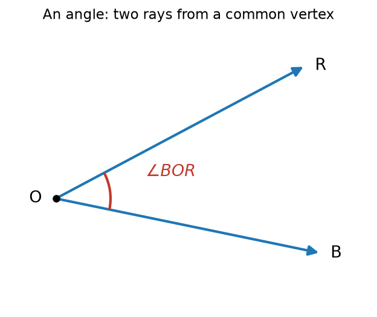

The vertex is always the center letter when naming an angle. For example, angle $BOR$ has vertex $O$ with arms extending toward $B$ and $R$.

### Measuring Angles: Degrees and Radians

**Degrees.** A full rotation is divided into $360°$. This convention dates back to Babylonian astronomy (roughly 360 days in a year).

**Degree subdivisions.** For precision, degrees are subdivided:

- 1 degree = 60 minutes (symbol: $'$), so $1° = 60'$
- 1 minute = 60 seconds (symbol: $''$), so $1' = 60''$

For example, $42°30'$ means 42 degrees and 30 minutes, which equals $42.5°$.

**Radians.** One radian is the angle subtended at the center of a circle by an arc whose length equals the radius. Since the circumference of a circle is $2\pi r$, a full rotation is $2\pi$ radians.

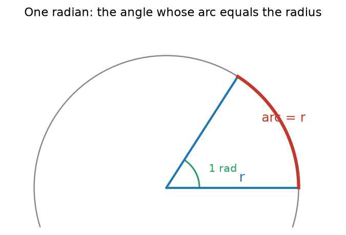

A radian is a **dimensionless** quantity because it is defined as the ratio of two lengths (arc length divided by radius), so the units cancel.

**Why radians matter for calculus.** The derivative formulas $\frac{d}{dx}\sin x = \cos x$ and $\frac{d}{dx}\cos x = -\sin x$ are only true when $x$ is measured in radians. Using degrees would introduce a scaling factor of $\frac{\pi}{180}$ in every derivative.

### Converting Between Degrees and Radians

Since $180° = \pi$ radians:

$$
\text{radians} = \text{degrees} \times \frac{\pi}{180}
$$

$$
\text{degrees} = \text{radians} \times \frac{180}{\pi}
$$

**Worked example (degrees to radians).** Convert $120°$ to radians.

$$
120° \times \frac{\pi}{180} = \frac{120\pi}{180} = \frac{2\pi}{3} \text{ radians}
$$

**Worked example (radians to degrees).** Convert $\frac{5\pi}{4}$ to degrees.

$$
\frac{5\pi}{4} \times \frac{180}{\pi} = \frac{5 \times 180}{4} = 225°
$$

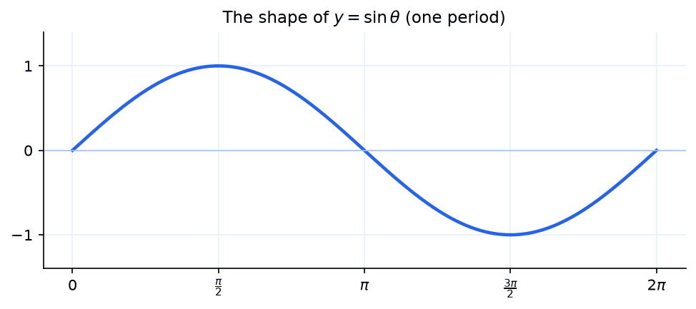

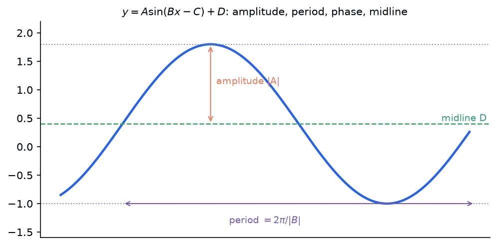

### Reference Angles

The **reference angle** is the acute angle formed between the terminal side of an angle and the $x$-axis. Reference angles are always between $0°$ and $90°$ (or $0$ and $\frac{\pi}{2}$).

**How to find the reference angle $\alpha$ for an angle $\theta$:**

| Quadrant | Range of $\theta$ | Reference angle $\alpha$ |
|---|---|---|
| I | $0° < \theta < 90°$ | $\alpha = \theta$ |
| II | $90° < \theta < 180°$ | $\alpha = 180° - \theta$ |
| III | $180° < \theta < 270°$ | $\alpha = \theta - 180°$ |
| IV | $270° < \theta < 360°$ | $\alpha = 360° - \theta$ |

The strict inequalities leave out the **quadrantal angles** ($0°$, $90°$, $180°$, $270°$), whose terminal sides lie on an axis rather than inside a quadrant. By convention their reference angles are taken to be $0°$ (for $0°$ and $180°$, whose terminal sides lie along the $x$-axis) or $90°$ (for $90°$ and $270°$, whose terminal sides lie along the $y$-axis).

**Worked example.** Find the reference angle for $\theta = 230°$.

Since $230°$ is in Quadrant III: $\alpha = 230° - 180° = 50°$.

**Worked example.** Find the reference angle for $\theta = \frac{5\pi}{3}$.

Since $\frac{5\pi}{3} \approx 300°$ is in Quadrant IV: $\alpha = 2\pi - \frac{5\pi}{3} = \frac{\pi}{3}$.

### Types of Angles

| Type | Definition |
|---|---|
| **Acute** | $0° < \theta < 90°$ |
| **Right** | $\theta = 90°$ |
| **Obtuse** | $90° < \theta < 180°$ |
| **Straight** | $\theta = 180°$ |
| **Reflex** | $180° < \theta < 360°$ |
| **Full rotation** | $\theta = 360°$ |
| **Coterminal** | Angles that share the same terminal side, differing by multiples of $360°$ |

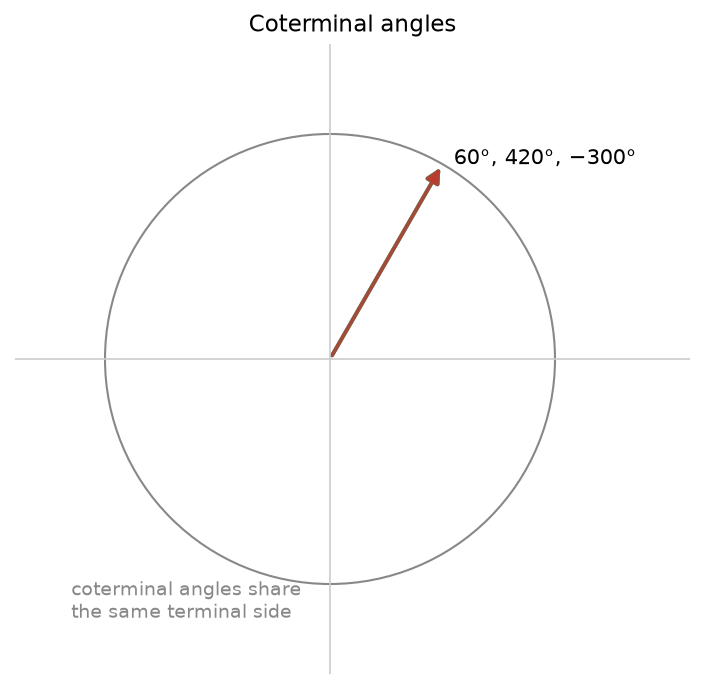

### Angle Relationships

**Complementary angles** sum to $90°$. For example, $35°$ and $55°$ are complementary.

**Supplementary angles** sum to $180°$. For example, $110°$ and $70°$ are supplementary.

**Vertical angles** are the pairs of opposite angles formed when two lines intersect. Vertical angles are always equal.

**Corresponding angles** are formed when a transversal crosses two parallel lines. Corresponding angles are equal (see the Lines section below).

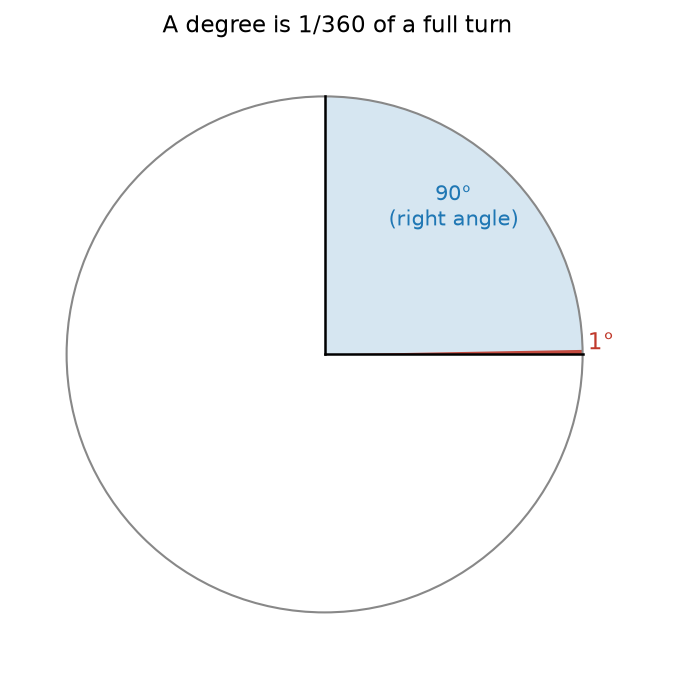

## Triangles

A **triangle** is a polygon with three vertices, three edges (sides), and three interior angles. Sometimes one edge is designated the **base**, and the opposite vertex is called the **apex**.

### Angle Sum Property

The sum of the three interior angles of any triangle equals $180°$.

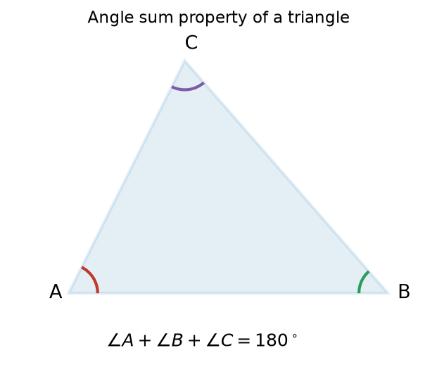

**Brief proof.** Draw a line through one vertex parallel to the opposite side. The angles formed at that vertex (by the parallel line and the two sides of the triangle) equal the other two interior angles of the triangle (by alternate interior angles). These three angles together form a straight line, so they sum to $180°$.

### Exterior Angle Theorem

An **exterior angle** of a triangle is formed by extending one side. Each exterior angle equals the sum of the two non-adjacent interior angles.

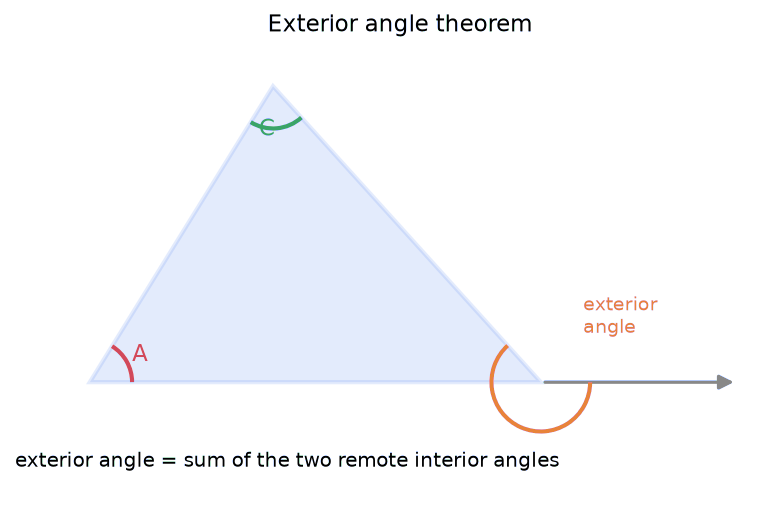

Every triangle has six exterior angles (two at each vertex). The exterior angles that are vertical to interior angles are not counted as exterior angles of the triangle.

### Area Formulas

**Base-height formula:**

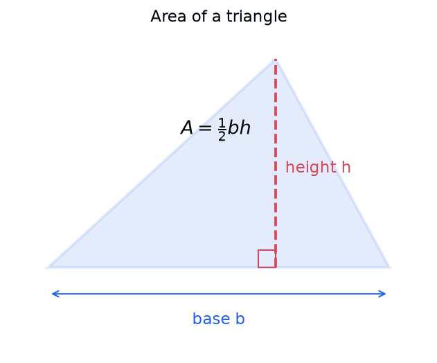

$$
A = \frac{1}{2}bh
$$

where $b$ is the base and $h$ is the perpendicular height from the base to the opposite vertex.

**Worked example.** A triangle with base $b = 12$ and perpendicular height $h = 5$ has area $A = \frac{1}{2}(12)(5) = 30$ square units. The load-bearing word is *perpendicular*: $h$ is the straight-up distance from the base to the opposite vertex, not the length of a slanted side. For a right triangle the two legs already meet at $90°$, so either leg can play the base and the other the height, e.g. legs $6$ and $8$ give $A = \frac{1}{2}(6)(8) = 24$. Use $\frac{1}{2}bh$ when you know a base and its height; use Heron's formula (next) when you only know the three side lengths.

**Heron's formula.** When you know all three side lengths $a$, $b$, $c$ but not the height:

$$
A = \sqrt{s(s-a)(s-b)(s-c)}
$$

where $s = \frac{a+b+c}{2}$ is the semi-perimeter.

**Worked example.** Find the area of a triangle with sides $a = 7$, $b = 8$, $c = 9$.

$$
s = \frac{7+8+9}{2} = 12
$$

$$
A = \sqrt{12 \cdot 5 \cdot 4 \cdot 3} = \sqrt{720} = 12\sqrt{5} \approx 26.83
$$

### Types by Sides

- **Scalene:** All three sides have different lengths; all three angles are different.
- **Isosceles:** Exactly two sides are equal; the angles opposite the equal sides are also equal (the **base angles**).
- **Equilateral:** All three sides are equal; all three angles are $60°$.

### Types by Angles

- **Acute triangle:** All three angles are less than $90°$.
- **Right triangle:** One angle is exactly $90°$.
- **Obtuse triangle:** One angle is greater than $90°$.

An **oblique triangle** is any triangle that does not contain a right angle (so it is either acute or obtuse).

### The Pythagorean Theorem

For a right triangle with legs $a$ and $b$ and hypotenuse $c$:

$$
a^2 + b^2 = c^2
$$

**Geometric intuition.** The area of the square built on the hypotenuse equals the sum of the areas of the squares built on the two legs.

**Converse.** If a triangle has sides $a$, $b$, $c$ with $a^2 + b^2 = c^2$, then the triangle is a right triangle with hypotenuse $c$.

**Worked example: finding a missing side.** The theorem solves for whichever side is unknown, but you must rearrange correctly.

*Finding the hypotenuse.* Legs $a = 5$, $b = 12$. Then $c^2 = 5^2 + 12^2 = 25 + 144 = 169$, so $c = \sqrt{169} = 13$.

*Finding a leg.* Hypotenuse $c = 10$, one leg $a = 6$. Now isolate the *unknown leg* by subtracting: $b^2 = c^2 - a^2 = 100 - 36 = 64$, so $b = 8$. The common slip is adding when you should subtract, so keep the roles straight: solving for the hypotenuse you *add* the two legs' squares, solving for a leg you *subtract* from the hypotenuse's square. Since the hypotenuse is always the longest side, $c^2 - a^2$ comes out positive, a built-in check that you set it up the right way.

### Pythagorean Triples

A **Pythagorean triple** is a set of three positive integers $(a, b, c)$ satisfying $a^2 + b^2 = c^2$.

| Triple | Verification |
|---|---|
| $(3, 4, 5)$ | $9 + 16 = 25$ |
| $(5, 12, 13)$ | $25 + 144 = 169$ |
| $(8, 15, 17)$ | $64 + 225 = 289$ |
| $(7, 24, 25)$ | $49 + 576 = 625$ |

Any multiple of a Pythagorean triple is also a Pythagorean triple. For example, $(6, 8, 10) = 2 \times (3, 4, 5)$.

### Special Right Triangles

Special right triangles have side ratios involving simple integers or square roots, making exact computation possible without a calculator.

#### 45-45-90 Triangle (Isosceles Right Triangle)

If each leg has length $1$, the hypotenuse is $\sqrt{2}$ (by the Pythagorean theorem: $1^2 + 1^2 = 2$).

**Side ratio:** $1 : 1 : \sqrt{2}$

In general, if each leg has length $x$, the hypotenuse is $x\sqrt{2}$.

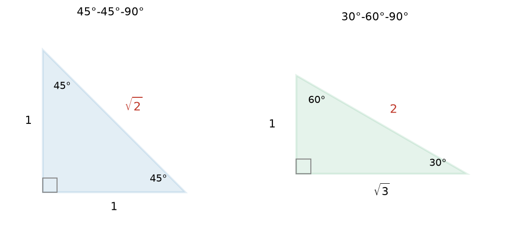

#### 30-60-90 Triangle (Scalene Right Triangle)

Start with an equilateral triangle with side length $2$. Drop a perpendicular from one vertex to the opposite side, bisecting it. This creates two 30-60-90 triangles with:

- Short leg (opposite $30°$): $1$
- Long leg (opposite $60°$): $\sqrt{3}$ (by Pythagorean theorem: $2^2 - 1^2 = 3$)
- Hypotenuse (opposite $90°$): $2$

**Side ratio:** $1 : \sqrt{3} : 2$

In general, if the short leg is $x$: long leg $= x\sqrt{3}$, hypotenuse $= 2x$.

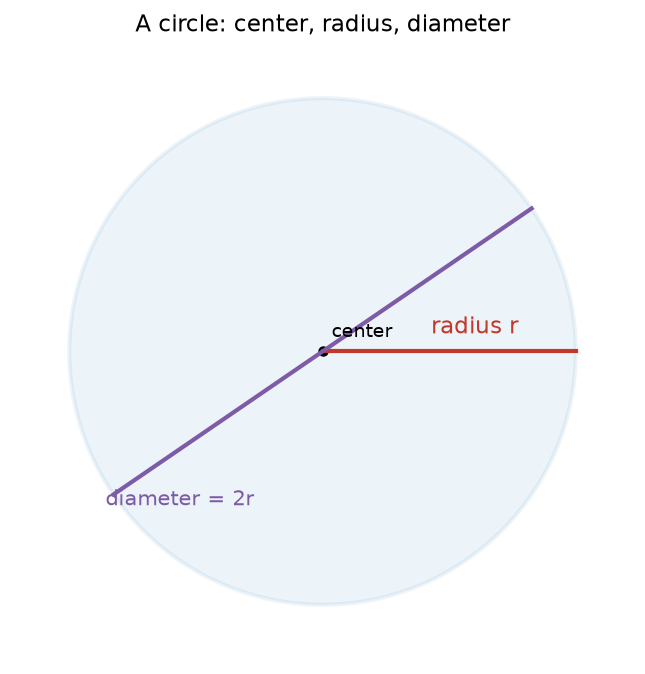

### Triangle Inequality Theorem

The sum of any two sides of a triangle must be greater than the third side:

$$
a + b > c, \quad a + c > b, \quad b + c > a
$$

This determines whether three given lengths can form a triangle. For example, sides $3, 4, 8$ cannot form a triangle because $3 + 4 = 7 < 8$.

### Similarity

**Similar triangles** have the same shape but may differ in size. Corresponding angles are equal, and corresponding sides are proportional.

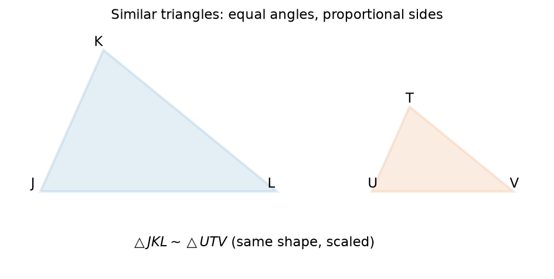

#### Proving Similarity

**AA (Angle-Angle).** If two angles of one triangle equal two angles of another, the triangles are similar. (The third angle must also match, by the angle sum property.)

**SSS (Side-Side-Side) Similarity.** If all three pairs of corresponding sides are in the same ratio, the triangles are similar.

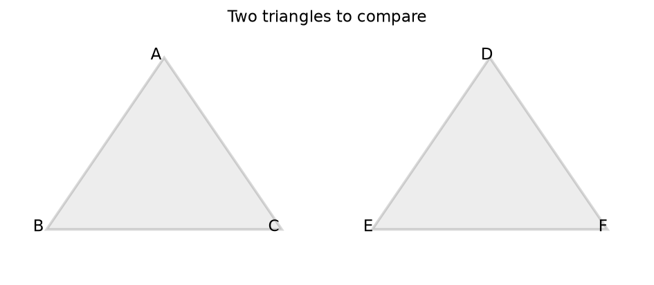

$$
\frac{BC}{EF} = \frac{AC}{DF} = \frac{AB}{DE}
$$

**SAS (Side-Angle-Side) Similarity.** If two pairs of corresponding sides are in the same ratio and the included angles are equal, the triangles are similar.

**Worked example: solving for a side with a proportion.** Suppose $\triangle ABC \sim \triangle DEF$, established by **AA** (say $\angle A = \angle D$ and $\angle B = \angle E$). In the smaller triangle $AB = 4$ and $BC = 6$, and the corresponding side $DE = 6$ in the larger one; find $EF$. First read off the **scale factor** from $ABC$ to $DEF$: $k = \frac{DE}{AB} = \frac{6}{4} = \frac{3}{2}$. Corresponding sides all scale by this same $k$, so

$$
EF = k \cdot BC = \frac{3}{2}(6) = 9.
$$

Check that all ratios agree: $\frac{DE}{AB} = \frac{6}{4} = \frac{3}{2}$ and $\frac{EF}{BC} = \frac{9}{6} = \frac{3}{2}$. ✓ (A handy corollary: areas scale by $k^2 = \frac{9}{4}$, so the larger triangle has $\frac{9}{4}$ times the area of the smaller.)

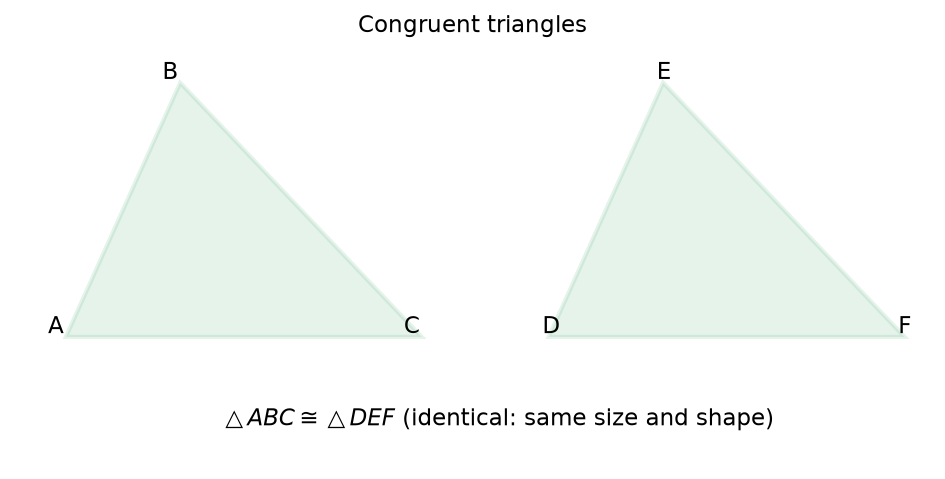

### Congruence

**Congruent triangles** are identical in both shape and size. All corresponding sides and angles are equal. Unlike similarity, congruence requires that the triangles could be placed on top of each other exactly (possibly after rotation or reflection).

#### Proving Congruence

| Criterion | What you need |
|---|---|
| **SSS** | All three pairs of corresponding sides are equal |
| **SAS** | Two pairs of sides and the included angle are equal |
| **ASA** | Two pairs of angles and the included side are equal |
| **AAS** | Two pairs of angles and a non-included side are equal |
| **HL** | Hypotenuse and one leg of two right triangles are equal |

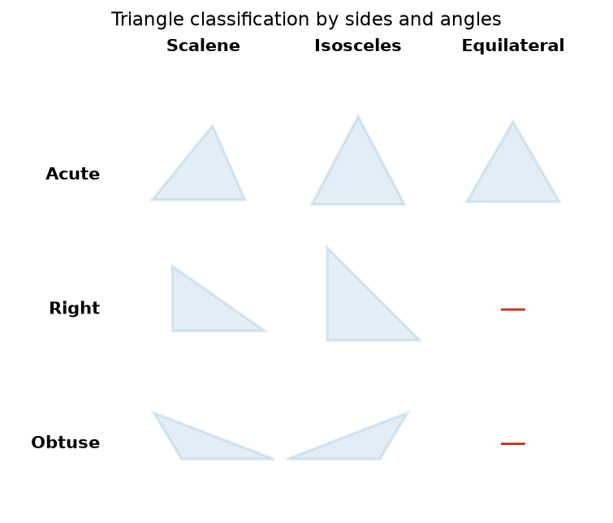

Note: **SSA** (two sides and a non-included angle) is not a valid congruence criterion because it can produce two different triangles (the "ambiguous case," discussed later under Law of Sines).

**Worked example: which criterion applies?** Two triangles satisfy $AB = DE = 5$, $\angle B = \angle E = 40°$, and $BC = EF = 7$. Are they congruent? Look at *where* the equal angle sits: $\angle B$ is between the two equal sides $AB$ and $BC$ (it is the *included* angle), so this is exactly **SAS**, and the triangles are congruent. Contrast a near-miss: if instead you were given $AB = DE = 5$, $BC = EF = 7$, and the *non-included* angle $\angle A = \angle D = 40°$, that is **SSA**, which is *not* a valid criterion, those measurements can close up into two genuinely different triangles. The moral: for SAS the equal angle must lie *between* the two equal sides; an equal angle off to the side (SSA) proves nothing.

## Circles

A **circle** is the set of all points in a plane that are a fixed distance (the **radius** $r$) from a fixed point (the **center**).

- **Radius ($r$):** distance from center to any point on the circle
- **Diameter ($d$):** distance across the circle through the center; $d = 2r$

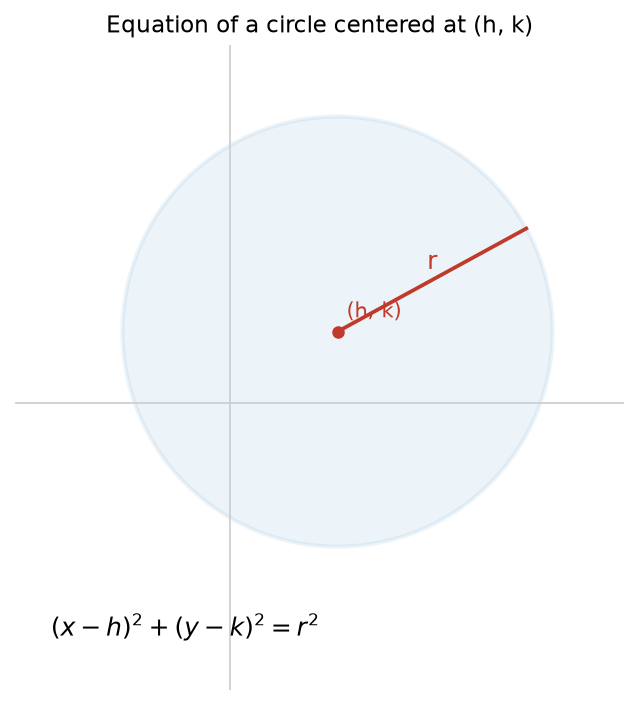

### Equation of a Circle

A circle with center $(h, k)$ and radius $r$ satisfies:

$$
(x - h)^2 + (y - k)^2 = r^2
$$

A circle centered at the origin simplifies to $x^2 + y^2 = r^2$.

**Worked example: both directions.** *Writing the equation.* A circle with center $(3, -2)$ and radius $4$ is $(x - 3)^2 + (y - (-2))^2 = 4^2$, that is

$$
(x - 3)^2 + (y + 2)^2 = 16.
$$

Watch the sign: the center's $y$-coordinate $-2$ appears as $+2$ inside the square, because the standard form *subtracts* $k$.

*Reading center and radius off a general equation* requires **completing the square**. Given $x^2 + y^2 - 6x + 4y - 3 = 0$, group the $x$- and $y$-terms and move the constant to the right: $(x^2 - 6x) + (y^2 + 4y) = 3$. Complete each square by adding $\left(\frac{6}{2}\right)^2 = 9$ and $\left(\frac{4}{2}\right)^2 = 4$ to *both* sides:

$$
(x^2 - 6x + 9) + (y^2 + 4y + 4) = 3 + 9 + 4 = 16 \implies (x - 3)^2 + (y + 2)^2 = 16.
$$

So the center is $(3, -2)$ and the radius is $\sqrt{16} = 4$, exactly the circle we started from, confirming the two directions are inverses.

### Pi

**Pi** ($\pi \approx 3.14159\ldots$) is defined as the ratio of a circle's circumference to its diameter: $\pi = \frac{C}{d}$. It is irrational (its decimal expansion never terminates or repeats).

### Circumference and Area

$$
C = 2\pi r = \pi d
$$

$$
A = \pi r^2
$$

### Arc Length

An arc is a portion of the circle's circumference. If the central angle is $\theta$ (in radians):

$$
s = r\theta
$$

This is the fundamental reason radians exist: arc length equals radius times angle, with no extra conversion factor.

**Worked example.** Find the arc length subtended by a central angle of $\frac{\pi}{3}$ on a circle of radius $6$.

$$
s = 6 \cdot \frac{\pi}{3} = 2\pi \approx 6.28
$$

### Sector Area

A sector is the "pie slice" region bounded by two radii and an arc. With $\theta$ in radians:

$$
A = \frac{1}{2}r^2\theta
$$

**Worked example.** Find the area of a sector with radius $4$ and central angle $\frac{\pi}{4}$.

$$
A = \frac{1}{2}(16)\left(\frac{\pi}{4}\right) = 2\pi \approx 6.28
$$

### Tangent Lines to Circles

A **tangent line** touches the circle at exactly one point. At the point of tangency, the tangent line is perpendicular to the radius. This property is used frequently in calculus and physics.

## Lines

### Parallel and Perpendicular Lines

**Parallel lines** never intersect and have the same slope. **Perpendicular lines** intersect at $90°$; their slopes are negative reciprocals ($m_1 \cdot m_2 = -1$).

**Worked example: slopes, parallel, and perpendicular.** The slope of the line through $(1, 2)$ and $(4, 8)$ is

$$
m = \frac{8 - 2}{4 - 1} = \frac{6}{3} = 2 \quad (\text{rise over run}).
$$

Any line **parallel** to it also has slope $2$; a line **perpendicular** to it has the *negative reciprocal* slope $-\frac{1}{2}$, and the check is that the product of perpendicular slopes is $-1$: indeed $2 \cdot \left(-\frac{1}{2}\right) = -1$. Concretely, the line through those two points is $y = 2x$ (it passes through the origin, since $2 = 2 \cdot 1$); a parallel line is $y = 2x + 5$ (same slope, shifted up); and a perpendicular line through $(1, 2)$ is $y - 2 = -\frac{1}{2}(x - 1)$, i.e. $y = -\frac{1}{2}x + \frac{5}{2}$.

### Transversals and Parallel Lines

A **transversal** is a line that crosses two or more other lines. When a transversal crosses two parallel lines, it creates eight angles with special relationships:

| Angle pair | Relationship |
|---|---|
| **Corresponding angles** | Equal (same position at each intersection) |
| **Alternate interior angles** | Equal (opposite sides of transversal, between parallel lines) |
| **Alternate exterior angles** | Equal (opposite sides of transversal, outside parallel lines) |
| **Co-interior (same-side interior) angles** | Supplementary (sum to $180°$) |

**Worked example: one angle pins down all eight.** A transversal crosses two parallel lines, and one of the eight angles measures $70°$. Every other angle is now forced:
- its **vertical** angle (directly across the same intersection) is also $70°$;
- its **corresponding** angle at the other parallel line is $70°$ (same position);
- the **alternate interior** angle is $70°$;
- its **co-interior (same-side interior)** partner is *supplementary*, $180° - 70° = 110°$;
- any angle forming a **linear pair** with the $70°$ angle is $180° - 70° = 110°$.

So across all eight angles only two values ever appear, $70°$ and its supplement $110°$, alternating around the two intersections. That is exactly why a single known angle at a transversal determines all the rest.

---

# Part 2: Trigonometry

## Right Triangle Trigonometry

Trigonometry begins with a simple question: in a right triangle, how do the ratios of the sides relate to the angles?

### The Six Trigonometric Ratios (SOH CAH TOA)

Given a right triangle with an acute angle $\theta$, label the sides relative to $\theta$:

- **Opposite:** the side across from $\theta$
- **Adjacent:** the side next to $\theta$ (not the hypotenuse)
- **Hypotenuse:** the side opposite the right angle (always the longest side)

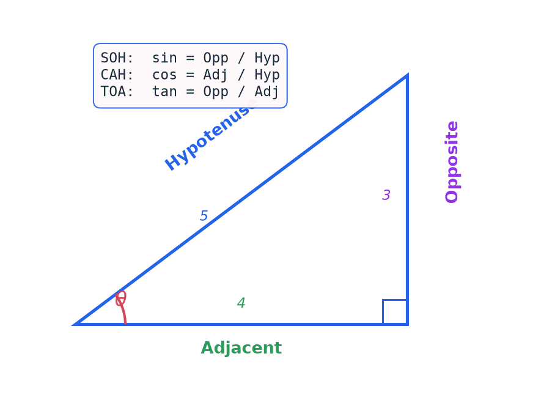

The six trigonometric functions are defined as:

$$
\sin\theta = \frac{\text{opposite}}{\text{hypotenuse}} \qquad \cos\theta = \frac{\text{adjacent}}{\text{hypotenuse}} \qquad \tan\theta = \frac{\text{opposite}}{\text{adjacent}}
$$

$$
\csc\theta = \frac{\text{hypotenuse}}{\text{opposite}} \qquad \sec\theta = \frac{\text{hypotenuse}}{\text{adjacent}} \qquad \cot\theta = \frac{\text{adjacent}}{\text{opposite}}
$$

The mnemonic **SOH CAH TOA** encodes the first three: **S**ine = **O**pposite / **H**ypotenuse, **C**osine = **A**djacent / **H**ypotenuse, **T**angent = **O**pposite / **A**djacent.

### Worked Example: Finding All Six Ratios

Given a right triangle with sides $3$, $4$, $5$, find all six trig ratios for the angle $\theta$ opposite the side of length $3$.

- Opposite $= 3$, Adjacent $= 4$, Hypotenuse $= 5$

$$
\sin\theta = \frac{3}{5} \qquad \cos\theta = \frac{4}{5} \qquad \tan\theta = \frac{3}{4}
$$

$$
\csc\theta = \frac{5}{3} \qquad \sec\theta = \frac{5}{4} \qquad \cot\theta = \frac{4}{3}
$$

### Solving Right Triangles

"Solving" a right triangle means finding all unknown sides and angles. You need at least one side and one other piece of information (another side or an acute angle).

**Worked example.** A ladder 10 ft long leans against a wall, making a $65°$ angle with the ground. How high up the wall does it reach?

The ladder is the hypotenuse ($10$ ft). The height up the wall is the side opposite the $65°$ angle. Using sine:

$$
\sin 65° = \frac{\text{height}}{10}
$$

$$
\text{height} = 10 \sin 65° \approx 10 \times 0.9063 \approx 9.06 \text{ ft}
$$

The base distance from the wall to the foot of the ladder is:

$$
\text{base} = 10\cos 65° \approx 10 \times 0.4226 \approx 4.23 \text{ ft}
$$

## The Unit Circle

Drag the point around the circle below to see how sine, cosine, and tangent are read directly off the coordinates, in both degrees and radians:

<iframe src="/static/interactive/unit-circle-explorer.html" width="100%" height="560" style="border:none;"></iframe>

### Definition

The **unit circle** is a circle of radius $1$ centered at the origin. Its equation is:

$$
x^2 + y^2 = 1
$$

### Connection to Right Triangle Trig

Place a right triangle inside the unit circle with:
- One vertex at the origin
- The hypotenuse along the radius (length $1$)
- The angle $\theta$ measured from the positive $x$-axis

Since the hypotenuse is $1$, the definitions simplify:

$$
\cos\theta = \frac{\text{adjacent}}{1} = x\text{-coordinate} \qquad \sin\theta = \frac{\text{opposite}}{1} = y\text{-coordinate}
$$

So for any angle $\theta$, the point on the unit circle is $(\cos\theta, \sin\theta)$.

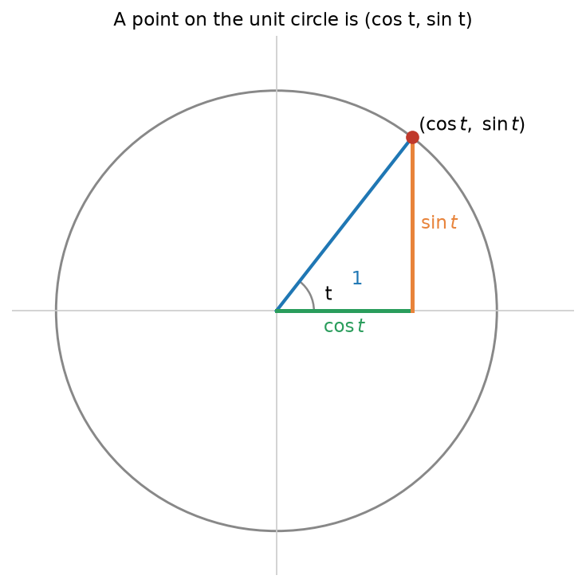

### Standard Angles on the Unit Circle

The values at every standard angle can be derived from the 30-60-90 and 45-45-90 special triangles.

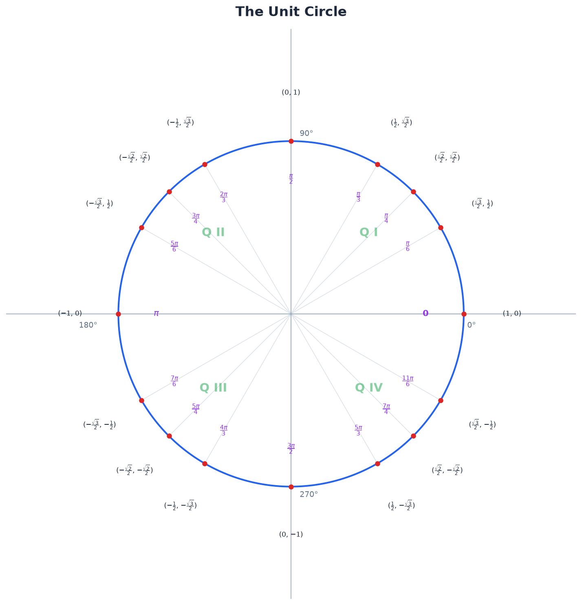

**Complete table of standard angle coordinates:**

| Degrees | Radians | $\cos\theta$ | $\sin\theta$ |
|---|---|---|---|
| $0°$ | $0$ | $1$ | $0$ |
| $30°$ | $\frac{\pi}{6}$ | $\frac{\sqrt{3}}{2}$ | $\frac{1}{2}$ |
| $45°$ | $\frac{\pi}{4}$ | $\frac{\sqrt{2}}{2}$ | $\frac{\sqrt{2}}{2}$ |
| $60°$ | $\frac{\pi}{3}$ | $\frac{1}{2}$ | $\frac{\sqrt{3}}{2}$ |
| $90°$ | $\frac{\pi}{2}$ | $0$ | $1$ |
| $120°$ | $\frac{2\pi}{3}$ | $-\frac{1}{2}$ | $\frac{\sqrt{3}}{2}$ |
| $135°$ | $\frac{3\pi}{4}$ | $-\frac{\sqrt{2}}{2}$ | $\frac{\sqrt{2}}{2}$ |
| $150°$ | $\frac{5\pi}{6}$ | $-\frac{\sqrt{3}}{2}$ | $\frac{1}{2}$ |
| $180°$ | $\pi$ | $-1$ | $0$ |
| $210°$ | $\frac{7\pi}{6}$ | $-\frac{\sqrt{3}}{2}$ | $-\frac{1}{2}$ |
| $225°$ | $\frac{5\pi}{4}$ | $-\frac{\sqrt{2}}{2}$ | $-\frac{\sqrt{2}}{2}$ |
| $240°$ | $\frac{4\pi}{3}$ | $-\frac{1}{2}$ | $-\frac{\sqrt{3}}{2}$ |
| $270°$ | $\frac{3\pi}{2}$ | $0$ | $-1$ |
| $300°$ | $\frac{5\pi}{3}$ | $\frac{1}{2}$ | $-\frac{\sqrt{3}}{2}$ |
| $315°$ | $\frac{7\pi}{4}$ | $\frac{\sqrt{2}}{2}$ | $-\frac{\sqrt{2}}{2}$ |
| $330°$ | $\frac{11\pi}{6}$ | $\frac{\sqrt{3}}{2}$ | $-\frac{1}{2}$ |
| $360°$ | $2\pi$ | $1$ | $0$ |

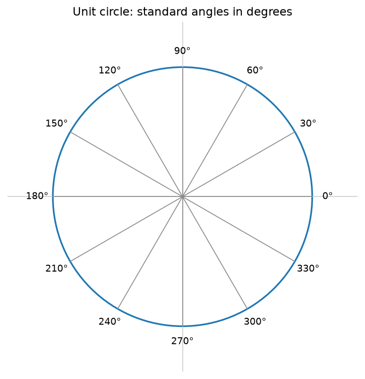

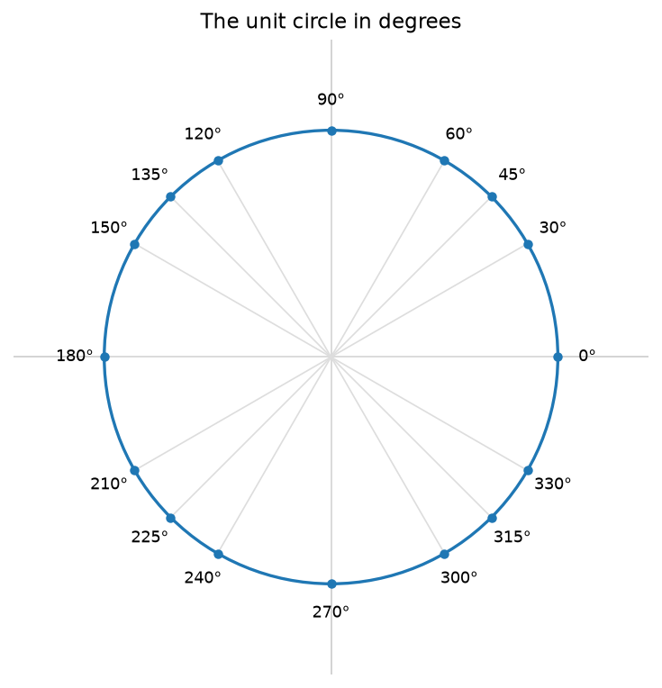

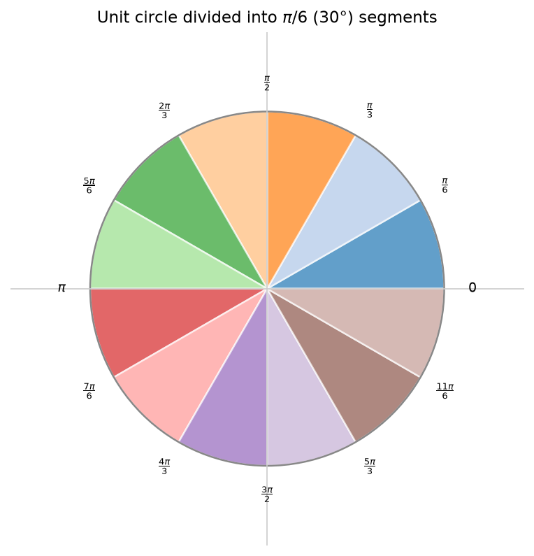

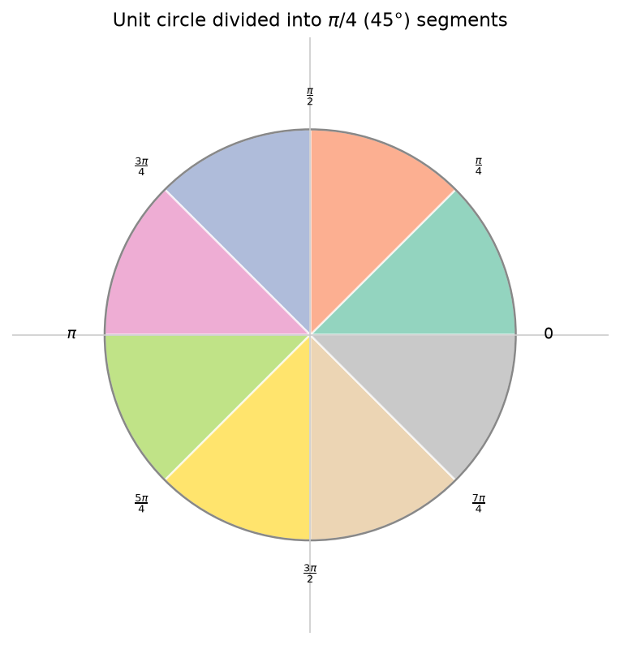

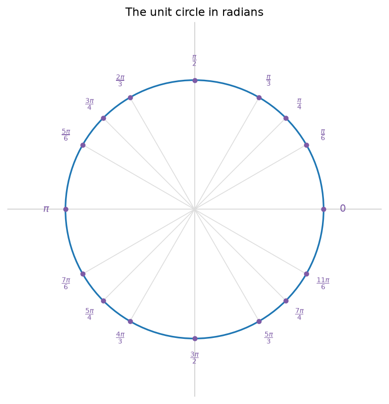

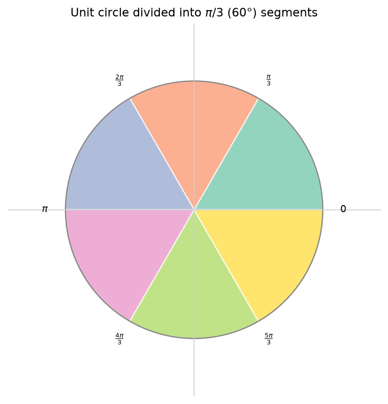

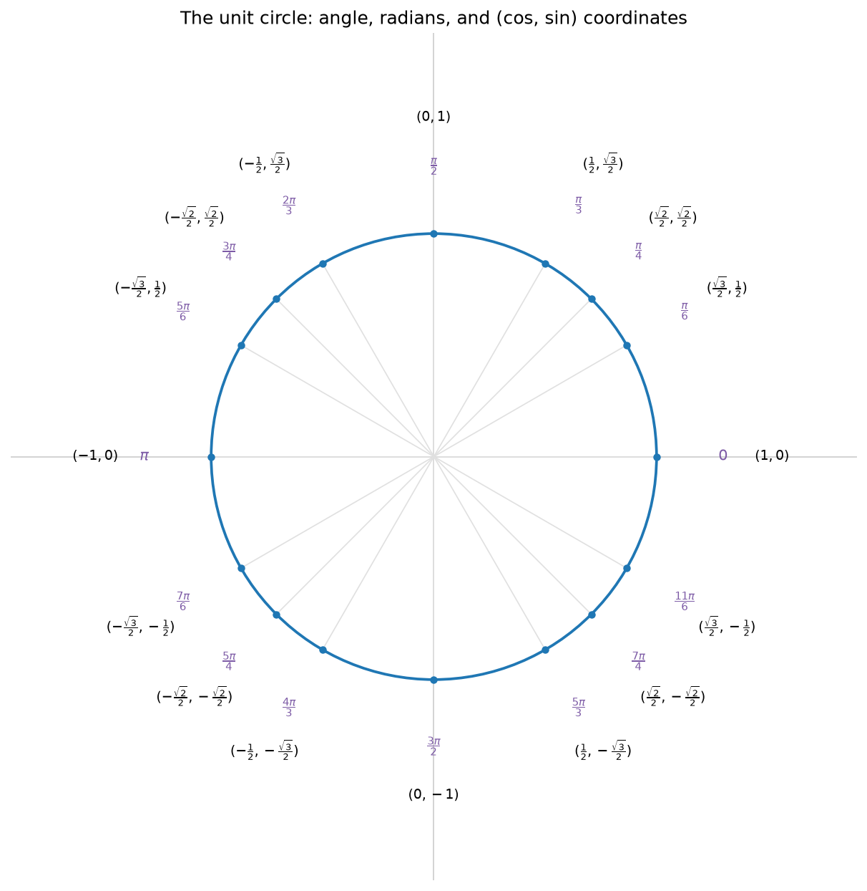

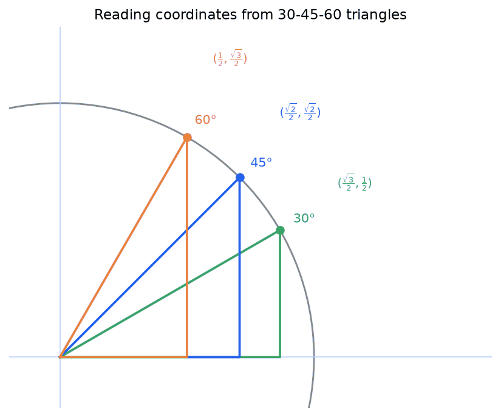

### Deriving Values from Special Triangles

**For $30°$ and $60°$:** Place a 30-60-90 triangle (sides $1, \sqrt{3}, 2$) inside the unit circle. Since the hypotenuse must equal the radius ($1$), divide every side by $2$:

- At $30°$: $\left(\frac{\sqrt{3}}{2},\; \frac{1}{2}\right)$
- At $60°$: $\left(\frac{1}{2},\; \frac{\sqrt{3}}{2}\right)$

**For $45°$:** Place a 45-45-90 triangle (sides $1, 1, \sqrt{2}$) inside the unit circle. Divide every side by $\sqrt{2}$:

- At $45°$: $\left(\frac{\sqrt{2}}{2},\; \frac{\sqrt{2}}{2}\right)$

### Signs in Each Quadrant

Since $\cos\theta$ is the $x$-coordinate and $\sin\theta$ is the $y$-coordinate:

| Quadrant | $\cos\theta$ | $\sin\theta$ | $\tan\theta$ |
|---|---|---|---|
| I ($0°$ to $90°$) | $+$ | $+$ | $+$ |
| II ($90°$ to $180°$) | $-$ | $+$ | $-$ |
| III ($180°$ to $270°$) | $-$ | $-$ | $+$ |
| IV ($270°$ to $360°$) | $+$ | $-$ | $-$ |

The mnemonic **"All Students Take Calculus"** encodes which functions are positive: **A**ll (Q I), **S**ine (Q II), **T**angent (Q III), **C**osine (Q IV).

### Using Reference Angles

To find the trig value of any angle:

1. Find the reference angle $\alpha$ (the acute angle to the $x$-axis).
2. Evaluate the trig function at $\alpha$.
3. Attach the correct sign based on the quadrant.

**Worked example.** Find $\sin(225°)$.

1. $225°$ is in Quadrant III. Reference angle: $225° - 180° = 45°$.
2. $\sin 45° = \frac{\sqrt{2}}{2}$.
3. Sine is negative in Q III.

$$
\sin(225°) = -\frac{\sqrt{2}}{2}
$$

## Trigonometric Functions as Functions

### Extending Beyond Right Triangles

Right triangle definitions only work for acute angles ($0°$ to $90°$). The unit circle definition extends trigonometric functions to all real numbers: for any angle $\theta$, $\cos\theta$ and $\sin\theta$ are the $x$- and $y$-coordinates of the corresponding point on the unit circle.

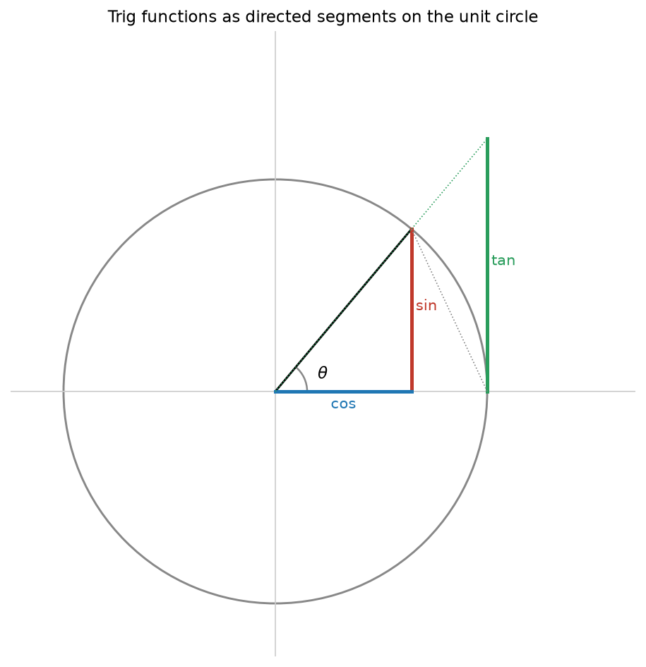

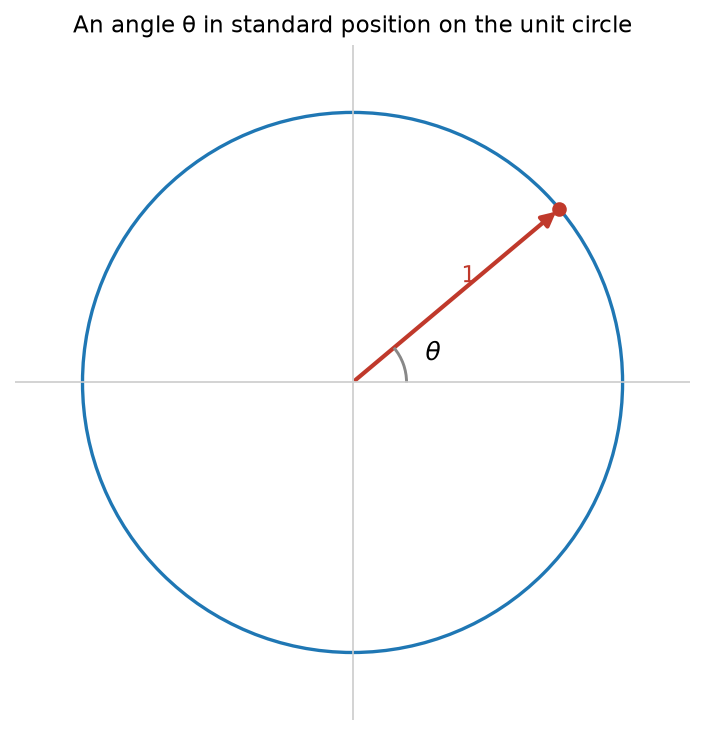

### Sine Function

$$
y = \sin\theta
$$

- **Domain:** all real numbers
- **Range:** $[-1, 1]$
- **Period:** $2\pi$ (the pattern repeats every $2\pi$)
- **Amplitude:** $1$ (the maximum displacement from the midline)
- **Key points in one period:** $(0, 0)$, $(\frac{\pi}{2}, 1)$, $(\pi, 0)$, $(\frac{3\pi}{2}, -1)$, $(2\pi, 0)$

The general sinusoidal function is $y = A\sin(B\theta - C) + D$, where:

- $|A|$ = amplitude
- $\frac{2\pi}{|B|}$ = period
- $\frac{C}{B}$ = phase shift (horizontal shift)
- $D$ = vertical shift (midline)

Drag the $A$, $B$, $C$, $D$ sliders below to see each parameter's effect: $A$ stretches the amplitude, $B$ compresses the period, $C$ shifts it horizontally, and $D$ raises the midline, all labeled live on the graph.

<iframe src="/static/interactive/geo-sinusoid-explorer.html" width="100%" height="640" style="border:none;"></iframe>

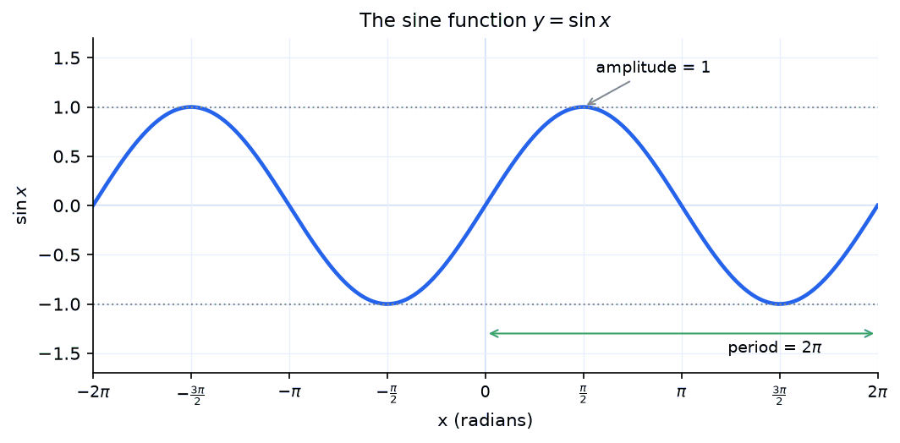

### Cosine Function

$$
y = \cos\theta
$$

- **Domain:** all real numbers
- **Range:** $[-1, 1]$
- **Period:** $2\pi$
- **Key points:** $(0, 1)$, $(\frac{\pi}{2}, 0)$, $(\pi, -1)$, $(\frac{3\pi}{2}, 0)$, $(2\pi, 1)$

The cosine function is a phase-shifted sine: $\cos\theta = \sin\left(\theta + \frac{\pi}{2}\right)$.

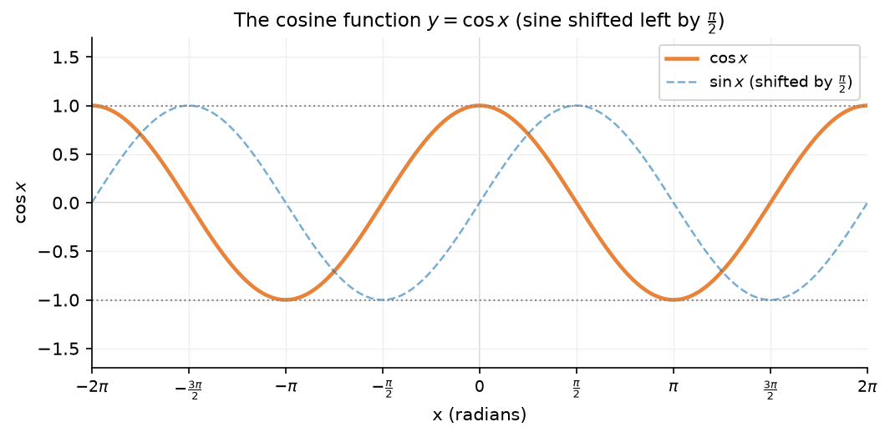

### Tangent Function

$$
y = \tan\theta = \frac{\sin\theta}{\cos\theta}
$$

- **Domain:** all real numbers except $\theta = \frac{\pi}{2} + n\pi$ (where $\cos\theta = 0$)
- **Range:** all real numbers $(-\infty, \infty)$
- **Period:** $\pi$ (not $2\pi$)
- **Vertical asymptotes** at $\theta = \frac{\pi}{2} + n\pi$ for integer $n$

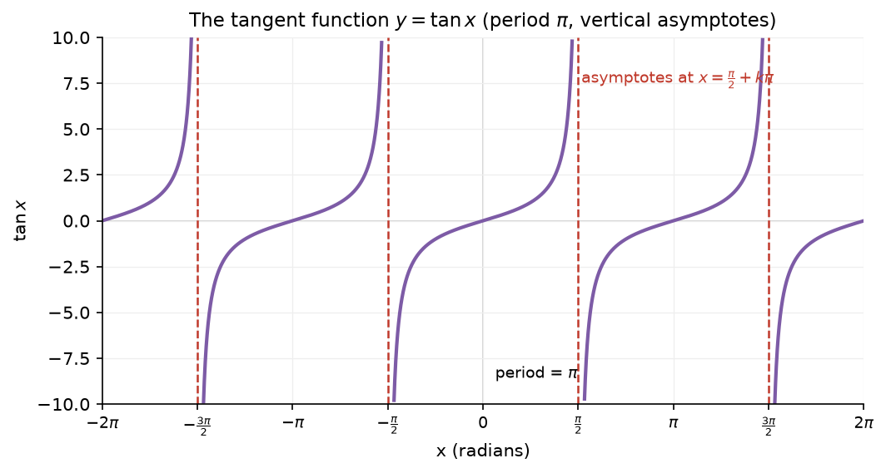

### Reciprocal Functions

| Function | Definition | Domain restriction |
|---|---|---|
| $\csc\theta = \frac{1}{\sin\theta}$ | Reciprocal of sine | Undefined where $\sin\theta = 0$ |
| $\sec\theta = \frac{1}{\cos\theta}$ | Reciprocal of cosine | Undefined where $\cos\theta = 0$ |
| $\cot\theta = \frac{\cos\theta}{\sin\theta}$ | Reciprocal of tangent | Undefined where $\sin\theta = 0$ |

**A note on defining $\cot\theta$:** The primary definition is $\cot\theta = \frac{\cos\theta}{\sin\theta}$. The alternate form $\cot\theta = \frac{1}{\tan\theta}$ agrees with it everywhere except where $\tan\theta$ is undefined. For example, at $\theta = \frac{\pi}{2}$, $\tan\theta$ is undefined so $\frac{1}{\tan\theta}$ has no value, yet $\cot\frac{\pi}{2} = \frac{\cos(\pi/2)}{\sin(\pi/2)} = \frac{0}{1} = 0$. Always fall back to the quotient definition to resolve such points.

### Even/Odd Properties

- $\cos(-\theta) = \cos\theta$ (cosine is **even**: symmetric about the $y$-axis)
- $\sin(-\theta) = -\sin\theta$ (sine is **odd**: symmetric about the origin)
- $\tan(-\theta) = -\tan\theta$ (tangent is **odd**)

## Trigonometric Identities

### Pythagorean Identities

From the unit circle equation $x^2 + y^2 = 1$ with $x = \cos\theta$ and $y = \sin\theta$:

$$
\sin^2\theta + \cos^2\theta = 1
$$

Dividing both sides by $\cos^2\theta$:

$$
\tan^2\theta + 1 = \sec^2\theta
$$

Dividing both sides by $\sin^2\theta$:

$$
1 + \cot^2\theta = \csc^2\theta
$$

You can also derive these two by rewriting everything in terms of sine and cosine and combining over a common denominator. For example,

$$
1 + \cot^2\theta = 1 + \frac{\cos^2\theta}{\sin^2\theta} = \frac{\sin^2\theta + \cos^2\theta}{\sin^2\theta} = \frac{1}{\sin^2\theta} = \csc^2\theta,
$$

which uses the first identity $\sin^2\theta + \cos^2\theta = 1$ in the numerator. The same manipulation with $\tan\theta = \sin\theta/\cos\theta$ gives $1 + \tan^2\theta = \sec^2\theta$.

### Reciprocal Identities

$$
\csc\theta = \frac{1}{\sin\theta} \qquad \sec\theta = \frac{1}{\cos\theta} \qquad \cot\theta = \frac{1}{\tan\theta}
$$

### Quotient Identities

$$
\tan\theta = \frac{\sin\theta}{\cos\theta} \qquad \cot\theta = \frac{\cos\theta}{\sin\theta}
$$

### Sum and Difference Formulas

These express trig functions of $(A \pm B)$ in terms of trig functions of $A$ and $B$ individually. They are essential for computing exact values of non-standard angles.

$$
\sin(A + B) = \sin A \cos B + \cos A \sin B
$$

$$
\sin(A - B) = \sin A \cos B - \cos A \sin B
$$

$$
\cos(A + B) = \cos A \cos B - \sin A \sin B
$$

$$
\cos(A - B) = \cos A \cos B + \sin A \sin B
$$

$$
\tan(A + B) = \frac{\tan A + \tan B}{1 - \tan A \tan B}
$$

$$
\tan(A - B) = \frac{\tan A - \tan B}{1 + \tan A \tan B}
$$

**Worked example.** Find the exact value of $\cos 75°$.

$$
\cos 75° = \cos(45° + 30°) = \cos 45° \cos 30° - \sin 45° \sin 30°
$$

$$
= \frac{\sqrt{2}}{2} \cdot \frac{\sqrt{3}}{2} - \frac{\sqrt{2}}{2} \cdot \frac{1}{2} = \frac{\sqrt{6} - \sqrt{2}}{4}
$$

### Double Angle Formulas

Setting $A = B$ in the sum formulas:

$$
\sin 2\theta = 2\sin\theta\cos\theta
$$

$$
\cos 2\theta = \cos^2\theta - \sin^2\theta
$$

The cosine double angle has two alternate forms (using $\sin^2\theta + \cos^2\theta = 1$):

$$
\cos 2\theta = 2\cos^2\theta - 1 = 1 - 2\sin^2\theta
$$

$$
\tan 2\theta = \frac{2\tan\theta}{1 - \tan^2\theta}
$$

**Worked example.** Suppose $\sin\theta = \frac{3}{5}$ with $\theta$ in the first quadrant, so $\cos\theta = \frac{4}{5}$ (from $\sin^2\theta + \cos^2\theta = 1$, taking the positive root because $\theta$ is in QI). Then

$$
\sin 2\theta = 2\sin\theta\cos\theta = 2 \cdot \frac{3}{5} \cdot \frac{4}{5} = \frac{24}{25}, \qquad \cos 2\theta = \cos^2\theta - \sin^2\theta = \frac{16}{25} - \frac{9}{25} = \frac{7}{25}.
$$

The alternate form agrees as a self-check: $1 - 2\sin^2\theta = 1 - \frac{18}{25} = \frac{7}{25}$. And $\sin^2 2\theta + \cos^2 2\theta = \frac{576 + 49}{625} = \frac{625}{625} = 1$, as every sine/cosine pair must. (Note $2\theta$ is no longer in QI: $\cos 2\theta > 0$ but you should confirm the quadrant of $2\theta$ before trusting signs in general.)

### Half Angle Formulas

Solving the double angle formulas for half the angle:

$$
\sin\frac{\theta}{2} = \pm\sqrt{\frac{1 - \cos\theta}{2}}
$$

$$
\cos\frac{\theta}{2} = \pm\sqrt{\frac{1 + \cos\theta}{2}}
$$

$$
\tan\frac{\theta}{2} = \pm\sqrt{\frac{1 - \cos\theta}{1 + \cos\theta}} = \frac{\sin\theta}{1 + \cos\theta} = \frac{1 - \cos\theta}{\sin\theta}
$$

The $\pm$ sign depends on the quadrant where $\frac{\theta}{2}$ lies.

**Worked example: the sign is the whole subtlety.** You choose the $\pm$ from the quadrant of $\frac{\theta}{2}$, *not* $\theta$. Take $\theta = 300°$, so $\cos\theta = \frac{1}{2}$. Then $\frac{\theta}{2} = 150°$, which lies in the **second quadrant**, where cosine is *negative*. The formula supplies the magnitude:

$$
\cos\frac{\theta}{2} = \pm\sqrt{\frac{1 + \cos\theta}{2}} = \pm\sqrt{\frac{1 + \frac{1}{2}}{2}} = \pm\sqrt{\frac{3}{4}} = \pm\frac{\sqrt{3}}{2},
$$

and the quadrant selects the **minus**, giving $\cos 150° = -\frac{\sqrt{3}}{2}$, which is the known value. Had we instead used $\theta = 120°$ (so $\frac{\theta}{2} = 60°$, in the first quadrant), the same formula with $\cos 120° = -\frac{1}{2}$ would give $+\sqrt{\frac{1 - 1/2}{2}} = +\frac{1}{2} = \cos 60°$, now the *plus* sign. The square root gives the size; the quadrant gives the sign.

### Sum-to-Product Formulas

$$
\sin A + \sin B = 2\sin\left(\frac{A+B}{2}\right)\cos\left(\frac{A-B}{2}\right)
$$

$$
\sin A - \sin B = 2\cos\left(\frac{A+B}{2}\right)\sin\left(\frac{A-B}{2}\right)
$$

$$
\cos A + \cos B = 2\cos\left(\frac{A+B}{2}\right)\cos\left(\frac{A-B}{2}\right)
$$

$$
\cos A - \cos B = -2\sin\left(\frac{A+B}{2}\right)\sin\left(\frac{A-B}{2}\right)
$$

### Product-to-Sum Formulas

$$
\sin A \cos B = \frac{1}{2}[\sin(A+B) + \sin(A-B)]
$$

$$
\cos A \cos B = \frac{1}{2}[\cos(A-B) + \cos(A+B)]
$$

$$
\sin A \sin B = \frac{1}{2}[\cos(A-B) - \cos(A+B)]
$$

**Worked example: applying both.** *Product-to-sum,* evaluate $\sin 75° \cos 15°$ exactly. With $A = 75°$, $B = 15°$,

$$
\sin 75° \cos 15° = \frac{1}{2}\big[\sin(75° + 15°) + \sin(75° - 15°)\big] = \frac{1}{2}[\sin 90° + \sin 60°] = \frac{1}{2}\left[1 + \frac{\sqrt{3}}{2}\right] = \frac{1}{2} + \frac{\sqrt{3}}{4} \approx 0.933.
$$

*Sum-to-product* runs the other way, turning a sum into a product (which is how you find, for instance, where $\sin A + \sin B = 0$):

$$
\sin 75° + \sin 15° = 2\sin\!\left(\frac{75° + 15°}{2}\right)\cos\!\left(\frac{75° - 15°}{2}\right) = 2\sin 45° \cos 30° = 2 \cdot \frac{\sqrt{2}}{2} \cdot \frac{\sqrt{3}}{2} = \frac{\sqrt{6}}{2} \approx 1.225.
$$

These identities are the workhorses behind adding two waves of the same frequency in physics and signal processing, where a sum of sinusoids becomes a single amplitude-modulated product.

## Proving Trigonometric Identities

### Strategy

When proving a trig identity, work on **one side only** and transform it to match the other side. Useful tactics:

1. Convert everything to sine and cosine.
2. Find common denominators when fractions are involved.
3. Multiply by a conjugate (e.g., multiply by $\frac{1 + \cos\theta}{1 + \cos\theta}$).
4. Factor expressions.
5. Use Pythagorean identities to simplify.

### Worked Example

**Prove:** $\displaystyle\frac{\sin\theta}{1 + \cos\theta} = \frac{1 - \cos\theta}{\sin\theta}$

**Proof.** Start with the left side and multiply numerator and denominator by the conjugate $(1 - \cos\theta)$:

$$
\frac{\sin\theta}{1 + \cos\theta} \cdot \frac{1 - \cos\theta}{1 - \cos\theta} = \frac{\sin\theta(1 - \cos\theta)}{1 - \cos^2\theta}
$$

By the Pythagorean identity, $1 - \cos^2\theta = \sin^2\theta$:

$$
= \frac{\sin\theta(1 - \cos\theta)}{\sin^2\theta} = \frac{1 - \cos\theta}{\sin\theta}
$$

This matches the right side. $\square$

## Law of Sines and Law of Cosines

These extend trigonometry to **oblique triangles** (triangles without a right angle). In any triangle with sides $a, b, c$ opposite angles $A, B, C$:

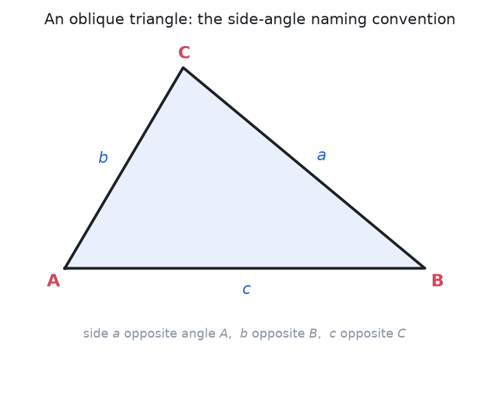

Solve any triangle interactively below. Pick a case (SSS, SAS, ASA, AAS, or the ambiguous SSA), enter the known parts, and the solver finds the rest and draws the triangle to scale, including the 0, 1, or 2 triangles that the SSA case can produce.

<iframe src="/static/interactive/geo-triangle-solver.html" width="100%" height="660" style="border:none;"></iframe>

### Law of Sines

$$
\frac{a}{\sin A} = \frac{b}{\sin B} = \frac{c}{\sin C}
$$

**When to use:** You have AAS (two angles and a non-included side), ASA (two angles and the included side), or SSA (two sides and a non-included angle).

#### The Ambiguous Case (SSA)

When given two sides and a non-included angle (SSA), there may be **zero, one, or two** triangles possible. Given side $a$ (opposite the known angle $A$), side $b$, and angle $A$:

- If $a < b\sin A$: no triangle exists ($\sin B > 1$).
- If $a = b\sin A$: exactly one (right) triangle.
- If $b\sin A < a < b$: two triangles (the ambiguous case).
- If $a \geq b$: exactly one triangle.

**Worked example.** In triangle $ABC$, $A = 30°$, $a = 8$, $b = 12$. Find angle $B$.

$$
\frac{8}{\sin 30°} = \frac{12}{\sin B}
$$

$$
\sin B = \frac{12 \sin 30°}{8} = \frac{12 \times 0.5}{8} = 0.75
$$

$$
B = \arcsin(0.75) \approx 48.6° \quad \text{or} \quad B \approx 180° - 48.6° = 131.4°
$$

Both values are valid (since $30° + 48.6° < 180°$ and $30° + 131.4° < 180°$), so there are **two** possible triangles.

The picture shows why: the altitude from $C$ to the baseline has length $h = b\sin A = 6$. Because $a = 8$ is longer than $h = 6$ but shorter than $b = 12$, the arc of radius $a$ swung from $C$ meets the baseline at two distinct points, one on each side of the foot of the altitude.

### Law of Cosines

$$
c^2 = a^2 + b^2 - 2ab\cos C
$$

Equivalently: $a^2 = b^2 + c^2 - 2bc\cos A$ and $b^2 = a^2 + c^2 - 2ac\cos B$.

**When to use:** You have SAS (two sides and the included angle) or SSS (all three sides, solving for angles).

**Connection to the Pythagorean theorem.** When $C = 90°$, $\cos 90° = 0$, so the formula reduces to $c^2 = a^2 + b^2$.

**Worked example.** In triangle $ABC$, $a = 5$, $b = 7$, $C = 42°$. Find side $c$.

$$
c^2 = 25 + 49 - 2(5)(7)\cos 42° = 74 - 70(0.7431) \approx 74 - 52.02 = 21.98
$$

$$
c \approx \sqrt{21.98} \approx 4.69
$$

### Comparison: When to Use Which

| Known information | Method |
|---|---|
| Right triangle | SOH CAH TOA |
| Two angles and a side (AAS/ASA) | Law of Sines |
| Two sides and non-included angle (SSA) | Law of Sines (watch for ambiguous case) |
| Two sides and included angle (SAS) | Law of Cosines |
| Three sides (SSS) | Law of Cosines (to find angles) |

## Inverse Trigonometric Functions

### Why We Need Them

Trig functions take angles and produce ratios. Inverse trig functions do the reverse: given a ratio, they return the angle. For example, "what angle has a sine equal to $\frac{1}{2}$?"

### Domain Restrictions

Since $\sin\theta$ is not one-to-one (many angles produce the same sine value), we must restrict the domain to create an invertible function.

| Function | Notation | Input (domain) | Output (range) |
|---|---|---|---|
| Inverse sine | $\arcsin x$ or $\sin^{-1}x$ | $[-1, 1]$ | $\left[-\frac{\pi}{2}, \frac{\pi}{2}\right]$ |
| Inverse cosine | $\arccos x$ or $\cos^{-1}x$ | $[-1, 1]$ | $[0, \pi]$ |
| Inverse tangent | $\arctan x$ or $\tan^{-1}x$ | $(-\infty, \infty)$ | $\left(-\frac{\pi}{2}, \frac{\pi}{2}\right)$ |

> **Important.** $\sin^{-1}x$ does **not** mean $\frac{1}{\sin x}$. That would be $\csc x$. The $-1$ superscript denotes the inverse function, not a reciprocal.

### Worked Examples

**Example 1.** $\arcsin\left(\frac{1}{2}\right)$

Which angle in $\left[-\frac{\pi}{2}, \frac{\pi}{2}\right]$ has sine equal to $\frac{1}{2}$? Answer: $\frac{\pi}{6}$ (i.e., $30°$).

**Example 2.** $\arctan(1)$

Which angle in $\left(-\frac{\pi}{2}, \frac{\pi}{2}\right)$ has tangent equal to $1$? Answer: $\frac{\pi}{4}$ (i.e., $45°$).

**Example 3.** $\arccos\left(-\frac{\sqrt{3}}{2}\right)$

Which angle in $[0, \pi]$ has cosine equal to $-\frac{\sqrt{3}}{2}$? Answer: $\frac{5\pi}{6}$ (i.e., $150°$).

### Compositions of Trig and Inverse Trig

**Example.** Find $\sin\left(\arccos\frac{3}{5}\right)$.

Let $\theta = \arccos\frac{3}{5}$, so $\cos\theta = \frac{3}{5}$. Construct a right triangle with adjacent $= 3$, hypotenuse $= 5$. By the Pythagorean theorem, opposite $= \sqrt{25 - 9} = 4$.

$$
\sin\left(\arccos\frac{3}{5}\right) = \sin\theta = \frac{4}{5}
$$

> **CS connection.** The $\text{atan2}(y, x)$ function, available in most programming languages, returns the correct angle in $(-\pi, \pi]$ to the point $(x, y)$. It uses the **signs of both $x$ and $y$** to place the angle in the right quadrant, which plain $\arctan\frac{y}{x}$ cannot do: $\arctan$ only sees the ratio $\frac{y}{x}$ (so it collapses opposite quadrants together and returns values only in $(-\frac{\pi}{2}, \frac{\pi}{2})$). By reading both signs, $\text{atan2}$ covers all four quadrants unambiguously, which is why it is essential for computing angles in 2D graphics, robotics, and navigation.

## Solving Trigonometric Equations

### Basic Equations

**Example.** Solve $\sin\theta = \frac{1}{2}$ for all solutions.

From the unit circle, $\sin\theta = \frac{1}{2}$ at $\theta = \frac{\pi}{6}$ and $\theta = \frac{5\pi}{6}$.

Since sine has period $2\pi$, the **general solution** is:

$$
\theta = \frac{\pi}{6} + 2n\pi \quad \text{or} \quad \theta = \frac{5\pi}{6} + 2n\pi \quad (n \in \mathbb{Z})
$$

If restricted to $[0, 2\pi)$, the solutions are $\theta = \frac{\pi}{6}$ and $\theta = \frac{5\pi}{6}$.

### Using Identities First

**Example.** Solve $2\sin^2\theta - 1 = 0$ on $[0, 2\pi)$.

$$
\sin^2\theta = \frac{1}{2} \implies \sin\theta = \pm\frac{1}{\sqrt{2}} = \pm\frac{\sqrt{2}}{2}
$$

$\sin\theta = \frac{\sqrt{2}}{2}$ at $\theta = \frac{\pi}{4}, \frac{3\pi}{4}$.

$\sin\theta = -\frac{\sqrt{2}}{2}$ at $\theta = \frac{5\pi}{4}, \frac{7\pi}{4}$.

**Solutions:** $\theta \in \left\{\frac{\pi}{4},\; \frac{3\pi}{4},\; \frac{5\pi}{4},\; \frac{7\pi}{4}\right\}$.

### Factoring

**Example.** Solve $\sin\theta\cos\theta = 0$ on $[0, 2\pi)$.

By the zero product property, either $\sin\theta = 0$ or $\cos\theta = 0$.

- $\sin\theta = 0$ at $\theta = 0, \pi$.
- $\cos\theta = 0$ at $\theta = \frac{\pi}{2}, \frac{3\pi}{2}$.

**Solutions:** $\theta \in \left\{0,\; \frac{\pi}{2},\; \pi,\; \frac{3\pi}{2}\right\}$.

### Using Quadratic Form

**Example.** Solve $2\cos^2\theta + \cos\theta - 1 = 0$ on $[0, 2\pi)$.

Let $u = \cos\theta$. The equation becomes $2u^2 + u - 1 = 0$.

$$
(2u - 1)(u + 1) = 0 \implies u = \frac{1}{2} \quad \text{or} \quad u = -1
$$

For $\cos\theta = \frac{1}{2}$: $\theta = \frac{\pi}{3}, \frac{5\pi}{3}$.

For $\cos\theta = -1$: $\theta = \pi$.

**Solutions:** $\theta \in \left\{\frac{\pi}{3},\; \pi,\; \frac{5\pi}{3}\right\}$.

### General Solutions vs. Solutions in an Interval

When a problem says "find all solutions," give the general solution with the integer parameter $n$. When a problem restricts to an interval like $[0, 2\pi)$ or $[0°, 360°)$, list only the solutions in that interval. Always check for extraneous solutions when squaring both sides or making substitutions.
