## Coordinate Geometry

### Distance Formula

**Distance Formula:** The distance between two points $(x_1, y_1)$ and $(x_2, y_2)$ in the coordinate plane is:

$$d = \sqrt{(x_2 - x_1)^2 + (y_2 - y_1)^2}$$

This is derived from the Pythagorean theorem.

**Example 1:** Find the distance between $(1, 2)$ and $(4, 6)$

$$d = \sqrt{(4 - 1)^2 + (6 - 2)^2} = \sqrt{3^2 + 4^2} = \sqrt{9 + 16} = \sqrt{25} = 5$$

**Example 2:** Find the distance between $(-3, 5)$ and $(2, -7)$

$$d = \sqrt{(2 - (-3))^2 + (-7 - 5)^2} = \sqrt{5^2 + (-12)^2} = \sqrt{25 + 144} = \sqrt{169} = 13$$

**3D Distance Formula:**

For points $(x_1, y_1, z_1)$ and $(x_2, y_2, z_2)$ in 3D space:

$$d = \sqrt{(x_2 - x_1)^2 + (y_2 - y_1)^2 + (z_2 - z_1)^2}$$

### Midpoint Formula

**Midpoint Formula:** The midpoint between two points $(x_1, y_1)$ and $(x_2, y_2)$ is:

$$M = \left(\frac{x_1 + x_2}{2}, \frac{y_1 + y_2}{2}\right)$$

The midpoint is simply the average of the x-coordinates and the average of the y-coordinates.

**Example 1:** Find the midpoint between $(2, 3)$ and $(8, 7)$

$$M = \left(\frac{2 + 8}{2}, \frac{3 + 7}{2}\right) = \left(\frac{10}{2}, \frac{10}{2}\right) = (5, 5)$$

**Example 2:** Find the midpoint between $(-4, 6)$ and $(2, -2)$

$$M = \left(\frac{-4 + 2}{2}, \frac{6 + (-2)}{2}\right) = \left(\frac{-2}{2}, \frac{4}{2}\right) = (-1, 2)$$

**3D Midpoint Formula:**

$$M = \left(\frac{x_1 + x_2}{2}, \frac{y_1 + y_2}{2}, \frac{z_1 + z_2}{2}\right)$$

**Application:** Finding the center of a circle given two endpoints of a diameter.

## Triangle

**Triangle:** A triangle is a polygon with 3 corners and 3 edges /
sides.

The corners are called **Vertices.**

Sometimes an arbitrary edge is chosen to be the **Base**, in which case
the opposite vertex is taken to be the **Apex.**

### Area of Triangle

**Area of Triangle: ½ bh**

!Area of Triangle - Definition, Formula & Examples \|
ChiliMath](./media/image106.png)

### Angle Sum Property

**Angle Sum Property:** The sum of the three interior angles of any
triangle must equal 180.

!Angle Sum Property \| Theorem \| Proof \| Examples-
Cuemath](./media/image107.png)

### Exterior Angles in a Triangle

**Exterior Angles in a Triangle:**

-   Every triangle has 6 exterior angles, two at each vertex.

-   Angles 1 through 6 are exterior angles.

-   Notice that the \"outside\" angles that are \"vertical\" to the
    angles inside the triangle are NOT called exterior angles of a
    triangle.

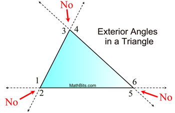

### Measure of an Exterior Angle of a Triangle

**Measure of an exterior angle of a triangle:** The measure of an
exterior angle of a triangle is equal to the sum of the non-adjacent
interior angles of the triangle.

-   An exterior ∠ is equal to the addition of the two non-adjacent Δ
    angles.

-   140º = 60º + 80º; 120º = 80º + 40º;

-   100º = 60º + 40º

-   An exterior angle is supplementary to its adjacent Δ angle. 140º is
    supp to 40º

-   The 2 exterior angles at each vertex are = in measure because they
    are vertical angles.

-   The exterior angles (taken one at a vertex) always total 360º

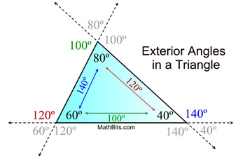

### Triangle Inequality 

**Triangle Inequality:** For all triangles, p + q \> r

The sum of any two sides must be greater than the third side.

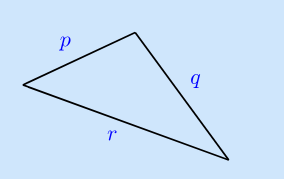

We cannot use the triangle inequality to find the exact lengths of the
sides of a triangle, but when two sides are known, the triangle
inequality allows us to find upper and lower bounds for the length of
the third side.

### Pythagorean Theorem

Pythagorean Theorem: It states that in a right-angled triangle, the
square of the length of the hypotenuse (the side opposite the right
angle) is equal to the sum of the squares of the lengths of the other
two sides

${a^{2} + b^{2} = c}^{2}$

Where:

-   𝑐 is the length of the hypotenuse.

-   𝑎 and b are the lengths of the other two sides.

The Pythagorean theorem establishes relationships between the sides of
right triangles and their hypotenuse. It can be used to solve unknown
side lengths when two sides are known.

### Law of Sines

**Law of Sines:** The law of sines establishes relationships that hold
true for ALL triangles, not only right triangles. This is important to
understand, because the trig functions only relate the angles and sides
of RIGHT ANGLED triangles. To establish relationships on oblique /
non-right-angled triangles, we must use the **Law of Sines**.

$$\frac{a}{sin A} = \frac{b}{sin\ B} = \frac{c}{sin\ C}$$

The ratios between all angles and their opposite side lengths are
directly proportional to each other.

The Sine Law is applicable to ALL TRIANGLES. Some sources will say it
is used for oblique triangles only. This is not the case.

### Law of Cosines

**Law of Cosines:** The **Law of Cosines** is a formula used to relate
the lengths of the sides of any triangle to the cosine of one of its
angles.

*It generalizes the Pythagorean theorem for all types of triangles,
including those without a right angle.*

**You can start thinking about using the cosine law when you have an
oblique triangle, but you do not have the information necessary to apply
the law of sines.**

**There are 2 situations in which you have enough information to apply
the law of cosines.**

**SAS -- Side, Angle, Side**

**SSS -- Side, Side, Side**

**You must have 2 sides known with a known angle included between them**

**OR**

**You must have all 3 sides.**

The law of cosines can be remembered as a "extended" Pythagorean
Theorem.

Pythagorean Theorem: a\^2 + b\^2 = c\^2.

Law(s) of Cosines:

$$b^{2} + c^{2} - 2bc*\cos(a) = a^{2}$$

$$a^{2} + c^{2} - 2ac*\cos(b) = b^{2}$$

$$a^{2} + b^{2} - 2ab*\cos(c) = c^{2}$$

**All of the writings above are specifically solved for a side.**

**The cosine law can also be used to find an angle.**

### Comparison of Law of Sines / Law of Cosines to Trigonometric functions

**Comparison of Law of Sines / Law of Cosines to Trigonometric
functions**

The basic trigonometric functions (sine, cosine, and tangent) are used
for right-angled triangles

The Law of Sines extends the basic trigonometric functions to apply to
any triangle, not just right-angled ones. It is particularly useful in
oblique triangles when:

-   **You have two angles and a side (AAS or ASA).**

-   **You have two sides and a non-included angle (SSA).**

$$\frac{a}{sin A} = \frac{b}{sin\ B} = \frac{c}{sin\ C}$$

### Similarity

**Similarity:** *Similar shapes are the same shape, but they are a
different size.*

The corresponding sides are in the same ratio and the corresponding
angles are the same. Similar triangles are not "equivalent" because
equivalence in geometry is expressed using congruence.

Similar triangles are different only in scale, so similar triangles
could be resized to become congruent.

*Same angles, different---but proportional---side
lengths.*

#### Proving Similar triangles

##### AA (Angle-Angle) similarity

**AA (Angle-Angle) similarity:** If a pair of triangles have 2
corresponding angles that are the same, then we can prove that these
triangles are similar. We can do this by using the Angle Sum Property.

If the interior angles of a triangle are always equal to 180° AND IF we
have a pair of triangles having 2 congruent angles, then by extension,
the third angle must also be congruent.

##### SSS (Side-Side-Side) similarity

**SSS (Side-Side-Side) similarity:** If 3 sides of a triangle are
proportional to three sides of a different triangle then the triangles
are similar.

$$\frac{BC}{EF} = \frac{AC}{DF} = \frac{AB}{DE}$$

##### SAS (Side-Angle-Side) similarity

**SAS (Side-Angle-Side) similarity:** If any two sides and the angle
contained between them are equivalent to the same two sides and included
angle of a different triangle, then these 2 triangles are similar.

### Congruence

**Congruence:** Congruent shapes are exactly the same shape and the same
size. Congruence is equality expressed geometrically. Congruent shapes
may be made to sit together using transposition.

*Congruent shapes have the same ANGLES AND the same
SIDES.*

#### Proving Congruence (not done)

**Proving Congruence**

#### Congruence Statement

**Congruence Statement:**

#### SSS (Side-Side-Side) Congruence

**SSS (Side-Side-Side) Congruence:**

If all the three sides of one triangle are equivalent to the
corresponding three sides of the second triangle, then the two triangles
are said to be congruent by SSS rule.

#### Side-Angle-Side Congruence

**Side-Angle-Side Congruence:**

If any two sides and the angle included between the sides of one
triangle are equivalent to the corresponding two sides and the angle
between the sides of the second triangle, then the two triangles are
said to be congruent by SAS rule.

### Types of Triangles

**Types of Triangles:** Triangles are broadly categorized into 2 types:

-   Triangles based on the lengths of their sides

-   Triangles based on their interior angles

  -----------------------------------------------------------------------
  **Based on their Sides**           **Based on their Angles**
  ---------------------------------- ------------------------------------
  Scalene Triangle                   Acute Triangle

  Isosceles Triangle                 Obtuse Triangle

  Equilateral Triangle               Right Triangle
  -----------------------------------------------------------------------

#### Types of Triangles: Based on Side length

**Types of Triangles: Based on Side length**

According to the lengths of their sides, triangles can be classified
into three types which are:

##### Scalene

**Scalene:** Triangle has all side lengths *different*.

##### Isosceles

**Isosceles:** Triangle with 2 sides having the same length.

##### Equilateral

**Equilateral:** Triangle with *all sides having the same
length.*

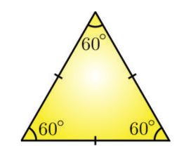

#### Types of Triangles: Based on Angles

**Types of Triangles: Based on Angles**

Triangles can be classified into three types with respect to their
interior angles which are:

##### Acute

**Acute triangle:** Triangle with *all 3 interior angles less than 90°*.

##### Obtuse

**Obtuse triangle:** Triangle which has *one interior angle greater than
90°*.

##### Right

**Right triangle:** Triangle that contains a 90° interior angle.

-   A right triangle has one right angle. (A right angle measures
    exactly 90º.)

-   A \"box\" is used to indicate the location of the right angle.

-   The longest side of the right triangle (across from the \"box\") is
    called the \"hypotenuse\".

-   The remaining two sides are referred to as \"legs\", which may, or
    may not, be of equal length.

###### Types of Right Triangles

There are 2 types of right triangles

####### Scalene Right Triangle

**Scalene Right Triangle:**

-   A right triangle has one angle equal to 90 degrees.

-   A scalene triangle has all sides of different lengths and all angles
    of different measures.

-   Therefore, a scalene right triangle is a right triangle where all
    three sides have different lengths, and the two non-right angles are
    different.

!Scalene Triangles \| Measuring, Properties, Types,
Examples,](./media/image125.png)

Some scalene right triangles are known as 30-60-90 triangles.

####### Isosceles Right Triangle

**Isosceles Right Triangle:**

-   One angle is 90 degrees (right angle).

-   The other two angles are equal, each measuring 45 degrees.

Summary:

Based on Side length: **Scalene**, **Isosceles**, **Equilateral**

Based on Angles: **Right**, **Obtuse**, **Acute**.

#### Oblique Triangle

**Oblique Triangles:** An oblique triangle is a triangle that does not
contain any right angles. Logically, we know that if a triangle is not a
right triangle, then it must be either an Obtuse or Acute triangle.

**Oblique triangles** are triangles that are either Obtuse or
Acute.

Relationships between oblique triangles can be understood using the law
of sines and law of cosines.

### Special Triangles

**Special Triangles:** A special right triangle is a right triangle with
some regular feature that makes calculations on the triangle easier, or
for which simple formulas exist.

Why are special triangles considered 'special' ?

*The fact that the sides of these special triangles are represented by
integers or simple square roots, rather than irrational
numbers, is a significant reason why they are considered
special.*

***The trigonometric ratios for most angles are irrational
numbers.***

The angles 30°, 60°, 45° are "special" because we can easily find exact
values for their trig ratios, and use those exact values to find exact
lengths for the sides of triangles with those angles.

#### 45-45-90 (Isosceles right triangle)

**45-45-90:** A **45-45-90** triangle is a special type of right
triangle where the two non-right angles are both 45 degrees. This makes
the triangle ***isosceles***, as the two legs opposite the 45-degree
angles are of equal length.

*All 45-45-90 triangles are isosceles right
triangles.*

!Mr. Escalante\'s Geometry
Class](./media/image127.jpeg)

**Properties**

-   Each leg **x** is of equal length

-   If each leg is **x**, hypotenuse is **x**$\sqrt{\mathbf{2}}$

45-45-90 triangles can also be expressed as π/4 -- π/4 -- π/2

#### 30-60-90 (Scalene right triangle)

**30-60-90:**

**Properties**

-   The side lengths are in the ratio 1 :$\sqrt{3}$: 2

-   The sides are represented by simple square roots, making the
    relationships between the sides straightforward and easy to work
    with.

In a 30°-60°-90° triangle, notice how the size of the angles corresponds
to the size of the sides.

The largest side will always be opposite to the largest angle.
Similarly, the smallest side would always be opposite to the smallest
angle.

30-60-90 triangles can also be expressed in radians as π/6 -- π/3 --
π/2

## Circle

**Circle:** A circle is a shape consisting of all points in a plane that
are at a given distance from the center.

### General Equation

General equation: (x-h)^2^ + (y-k)^2^ = r^2^

### π Pi

π **Pi:** Pi is a constant that represents the ratio of a circle's
circumference to it's diameter. Pi is an irrational number and equals
approximately 3.14159

π = Circumference / diameter

### Circumference

**Circumference:** The distance around the boundary of a circle is
called the circumference.

C = π d

C = 2 πr

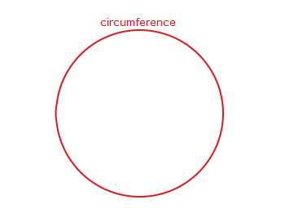

### Radius

Radius**:** The distance from the center of a circle to any point on the
boundary is called the **radius**. The radius is half of the diameter;
2r=d

Radius = d/2

The length of the radius can also be calculated using the distance
formula:

.

### Diameter

**Diameter:** The distance across a circle through the center is called
the diameter.

D = 2r

### Sector

**Sector:** The area inside a circle and bounded by two radii is a
**sector**.

The area of the sector is: (1/2) \* r^2^θ

### Arc

**Arc:** The length between two points around the circumference of a
circle is an arc.

### Arc Length

**Arc length**: The distance between two points on a curve.

Arc length is: rθ

**Area of a Circle:** Area is the total amount of space taken up by a
flat, 2D shape. It is the measurement of a shape's size on a surface.
Therefore, the area of a circle is the measurement of the interior space
occupied by a circle.

!Area of a Circle - Definition, Formula, Derivation with Solved
Examples](./media/image136.png)

## Line

Lines: A line is an infinitely long object with no width, depth or
curvature. It is an abstract geometric form that represents perfect
straightness on a cartesian coordinate plane.

### Types of Lines

**Types of Lines**

+-----------+--------------------------+------------------------------+
| **P       | {widt | the distance between the two |
|           | h="1.2174475065616799in" | straight lines is the same   |
|           | height=                  | at all points.               |
|           | "0.43056102362204723in"} |                              |
+===========+==========================+==============================+
| **Perpen  | {widt | to each other if they meet,  |
|           | h="2.0659612860892387in" | or intersect at 90°.         |
|           | height                   |                              |
|           | ="0.5463320209973753in"} |                              |
+-----------+--------------------------+------------------------------+
| **V       | {width | that is perpendicular to the |
|           | ="0.30611001749781275in" | surface or another line that |
|           | height                   | is considered as the base.   |
|           | ="0.6805041557305337in"} | In coordinate geometry, the  |
|           |                          | *vertical lines are         |
|           |                          | parallel to the y-axis and   |
|           |                          | are perpendicular to the     |
|           |                          | horizontal lines and the     |
|           |                          | x-axis*         |
+-----------+--------------------------+------------------------------+
| **Hor     | {widt | straight line that goes from |
|           | h="0.9178543307086614in" | left to right or right to    |
|           | height                   | left. In coordinate          |
|           | ="0.6933792650918635in"} | geometry, a line is said to  |
|           |                          | be horizontal if two points  |
|           |                          | on the line have the same Y- |
|           |                          | coordinate points. It comes  |
|           |                          | from the term "horizon*".   |
|           |                          | It means that the horizontal |
|           |                          | lines are always parallel to |
|           |                          | the horizon or the           |
|           |                          | x-axis.*        |
+-----------+--------------------------+------------------------------+
| *         | {widt | intersects a                 |
|           | h="1.2577548118985127in" | ***curve*** at |
|           | height                   | a minimum of two distinct    |
|           | ="0.9766097987751531in"} | points                       |
+-----------+--------------------------+------------------------------+
| **Tran    | {widt | passes through two lines in  |
|           | h="2.3204779090113736in" | the same plane at two        |
|           | height                   | distinct points.             |
|           | ="1.0490791776027997in"} |                              |
|           |                          | Transversals may intersect   |
|           |                          | parallel or non-parallel     |
|           |                          | lines---it does not matter.  |
+-----------+--------------------------+------------------------------+
| **        | {widt | that touches a curve at a    |
|           | h="1.6569903762029747in" | single point ***without     |
|           | heig                     | crossing*** it  |
|           | ht="0.92791447944007in"} | at that point.               |
+-----------+--------------------------+------------------------------+

## Angle

**Angle:** An angle is the union of two rays having a common endpoint.
The endpoint is called the vertex of the angle, and the two rays are the
sides of the angle.

!Illustration of Angle DEF, with vertex E and points D and
F.](./media/image145.jpeg)

Angle creation is a dynamic process. We start with two rays lying on top
of one another. We leave one fixed in place and rotate the other.

The fixed ray is the **initial side**, and the rotated ray is the
**terminal side**. In order to identify the different sides, we indicate
the rotation with a small arc and arrow close to the vertex.

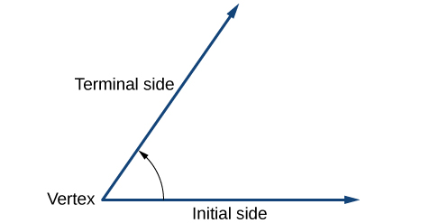

**Positive and Negative Angles:**

**Positive Angle:** An angle is positive when it's initial side begins
on the positive x axis and rotates counter-clockwise.

**Negative Angle:** An angle is negative when its initial side begins on
the positive x axis and rotates clockwise.

!Positive and Negative Angles -- Definitions with
Examples](./media/image147.jpeg)

**Naming an angle:** Angles are named using 3 points.

The **vertex** is always the center point in the name of the angle. It
will be surrounded by the arm names.

Angle BOR is equal to angle ROB. Only the central, vertex letter is
required to be fixed in one place.

### Types of Angles

**Types of Angles:**

  -----------------------------------------------------------------------
  **Acute**              **Angle \< 90**°
  ---------------------- ------------------------------------------------
  **Obtuse**             **90**° **\< Angle \< 180**°

  **Right**              **90**°

  **Straight**           **180**°

  **Reflex**             **Angle \> 180**°

  **Complete angle /     **360**°
  Full Angle**           

  **Coterminal**         **Any angle sharing the same position, separated
                         by multiples of 360.**
  -----------------------------------------------------------------------

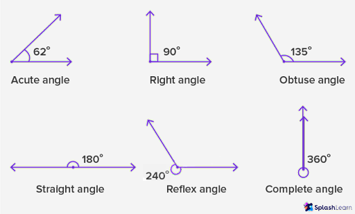

### Angle Relationships

**Angle Relationships**

+--------------+-------------------+-----------------------------------+
| Congruent    |                   |                                   |
+==============+===================+===================================+
| Adjacent     | ![]               | Two angles which share a common   |
|              | (./media/image151 | vertex and side, but have no      |
|              | .png) |                                   |
+--------------+-------------------+-----------------------------------+
| Vertical     | ![]               | The angles opposite each other    |
|              | (./media/image152 | when two lines cross. Angles 1    |
|              | .png) | and 4.                            |
|              |                   |                                   |
|              |                   | ***Vertical angles are named    |
|              |                   | such because they share a         |
|              |                   | vertex.***   |
|              |                   |                                   |
|              |                   | ***Vertical angles are formed   |
|              |                   | whenever lines intersect at a     |
|              |                   | point.***    |
+--------------+-------------------+-----------------------------------+
| C            |  | equals if the two intersected     |
|              |                   | lines by the transversal are      |
|              |                   | parallel. 1 is external and 2 is  |
|              |                   | internal.                         |
+--------------+-------------------+-----------------------------------+
| C            | ![]               | Two angles are called             |
| omplementary | (./media/image154 | complementary when their sum is   |
|              | .png) |                                   |
+--------------+-------------------+-----------------------------------+
| S            | ![]               | Two angles are called             |
| upplementary | (./media/image155 | supplementary when their sum is   |
|              | .png) |                                   |
+--------------+-------------------+-----------------------------------+
| Alternate    | ![]               | Angles that are on opposite sides |
| Exterior     | (./media/image156 | of the transversal of two other   |
|              | .png) | parallel. In the figure, angles 1 |
|              |                   | and 4 are alternate exterior      |
|              |                   | angles.                           |
+--------------+-------------------+-----------------------------------+
| Alternate    | ![]               | Angles that are on opposite sides |
| Interior     | (./media/image157 | of the transversal of two other   |
|              | .png) | parallel. In the figure, angles 2 |
|              |                   | and 3 are alternate interior      |
|              |                   | angles.                           |
+--------------+-------------------+-----------------------------------+

## Angle Measurements

### Degree

**Degree:** A degree, usually denoted by °, is a measurement of a plane
angle in which one full rotation is 360°.

1° is equal to π /180.

1° is equal to 1/360 of a circular rotation.

### Minute

**Minute:** When measuring angles, a minute is 1/60^th^ of a degree. The
symbol for minute is '

1° = 60'

### Second

**Second:** When measuring angles, a second is 1/60^th^ of a minute. The
symbol for second is ''.

1' = 60''

### Radian

**Radian:** One radian is defined as the *angle*
**subtended** from the center of a circle which intercepts an arc equal
in length to the radius of the circle.

Radian is a measurement of ANGLE.

1 Radian is 1 "radius-worth" of angle.

***If you take a radius of 1 and "stretch it out" along the boundary of
the unit circle, this arc length subtends an angle equal to 1
radius.***

Radian is a UNITLESS MEASUREMENT. It is unitless because it is the
result of dividing two distances having the same unit, so the units
cancel out and a dimensionless number is left.

**Subtended angle:** In geometry, an angle is subtended by an arc, line
segment or any other section of a curve, when its two rays pass through
the endpoints of that arc, line segment or curve section.

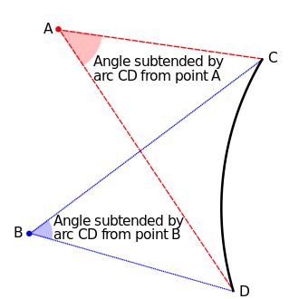

!Radian - Formula, Definition \| Radians and
Degrees](./media/image161.png)

### Reference Angle

**Reference Angle:** The reference angle is the smallest possible angle
made by the terminal side of the given angle with the x-axis.

It is always an acute angle (except when it is exactly 90
degrees).

A reference angle is always positive irrespective of which side of the
axis it is falling.

A reference angle is an angle falling within quadrant 1 which is
equivalent by reflection to an angle in some other quadrant.

This concept is useful because it allows you to work with any angle by
referring to their equivalent angle in the first quadrant.

**Rules for Reference Angles in Each Quadrant**

  ----------------------------------------------------------------------------
  **Quadrant**   **Angle, θ**      **Reference Angle     **Reference Angle
                                   Formula in Degrees**  Formula in Radians**
  -------------- ----------------- --------------------- ---------------------
  **I**          **lies between 0° **θ**                 **θ**
                 and 90°**                               

  **II**         **lies between    **180 - θ**           **π - θ**
                 90° and 180°**                          

  **III**        **lies between    **θ - 180**           **θ - π**
                 180° and 270°**                         

  **IV**         **lies between    **360 - θ**           **2π - θ**
                 270° and 360°**                         
  ----------------------------------------------------------------------------

## Trigonometric Functions

**Trigonometric Functions: Trigonometric functions** are real functions
which relate an angle θ of a right-angled triangle to ratios of two of
its side lengths.

-   Trig functions relate an angle θ of a right triangle to the ratios
    of 2 of its side lengths.

There are 6 basic trig functions which have as their domain value the
angle of a right triangle and have a numerical value representing the
ratio of 2 sides of a right triangle as their range.

-   **Domain**: The domain values of θ are angles in degrees or radians
    from a right triangle

-   **Range**: A numerical value representing the ratio of 2 sides of a
    right-angled triangle.

Consider an angle in standard position, such that the point (x, y) on
the terminal side of the angle is a point on a circle with radius 1:

This circle is called the unit circle. With r = 1, we can define the
trigonometric functions in the unit circle:

### Sine

**Sine (sin):** The output is the *y-coordinate of the corresponding
point on the unit circle.*

The sine of an angle θ equals the **y-value** of the endpoint on the
unit circle of an arc of length *t*.

#### Graphing Sine

**Graphing Sine:**

$$A sin(Bx + C) + D$$

**\|A\|** is the **amplitude**

**2pi/\|B\|** is the **period**

**C** is the **phase shift**

**D** is the **vertical shift**

**Amplitude:** The amplitude determines the height of the wave from the
midline (vertical displacement) to the peak or trough.

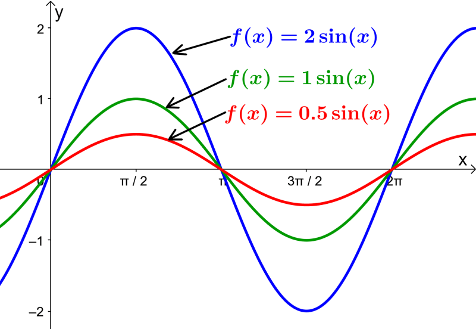

**Period / Wavelength:** The period is the length of one complete cycle
of the wave.

The period is given by : 2pi / \|B\|

!Period of the Sine Function - Formulas and Examples -
Neurochispas](./media/image166.jpeg)

**Phase Shift:** The phase shift determines the *horizontal
displacement of the wave*, along x-axis.

The phase shift is given by -C/B

The phase shift effectively controls where on the x-axis the graph
begins. Normally, the graph begins at the origin, but phase shift will
result in some horizontal displacement along the x-axis.

**Vertical Shift:** The vertical shift moves the entire wave up or down
along the y-axis.

### Cosine

**Cosine (cos):** The output is the *x-coordinate of the corresponding
point on the unit circle*.

The cosine function of an angle θ equals the **x-value** of the endpoint
on the unit circle of an arc of length *t*.

### Tangent

**Tangent (tan):** The output is the ratio of the y-coordinate to the
x-coordinate of the corresponding point on the unit circle:
$\frac{y}{x}$

The tangent of an angle is the ratio of the y-value to the x-value of
the corresponding point on the unit circle.

### Cotangent

**Cotangent:** The cotangent function is the reciprocal of the tangent
function.

The output is the ratio of the y-coordinate to the x-coordinate of the
corresponding point on the unit circle: y/x

### Secant

**Secant:** The secant function is the reciprocal of the cosine
function.

The secant of angle t is equal to 1/cost = 1/x , x≠0.

### Cosecant

**Cosecant:** The cosecant is the reciprocal of the sine function.

The cosecant of angle t is equal to 1/sin(t) = 1/y , y≠0.

Key Elements of the Diagram:

**Unit Circle:** The circle shown is the unit circle, which has a radius
of 1. Any point on the unit circle satisfies the equation:
$x^{2} + y^{2} = 1$

**Angle θ:** The angle θ is measured from the positive x-axis to a line
segment that intersects the circle:

**sin θ:** Represented by the vertical line segment from the point on
the circle down to the x-axis.

It is the y-coordinate of the point on the unit circle

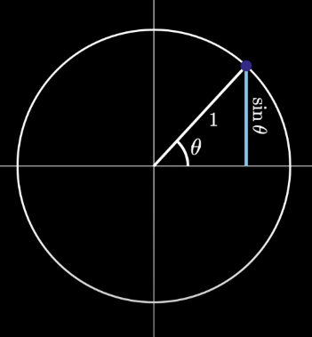

**cos θ:** Represented by the horizontal line segment from the origin to
the point directly below the intersection of the circle and the angle 𝜃.

It is the x-coordinate of the point on the unit circle.

**tan θ:** Represented by the line segment extending from the circle to
the tangent line that touches the unit circle at the x-coordinate: x =
1.

It is the ratio of the sine to the cosine (sin 𝜃/cos 𝜃).

**cot 𝜃:** Represented by the line segment extending from the circle to
the tangent line that touches the unit circle at the y-coordinate: y=1.

It is the ratio of the cosine to the sine (cos 𝜃/sin 𝜃).

## Trigonometric Identities

**Trigonometric Identities:**

**sin 𝜃 :** $\frac{\mathbf{opp}}{\mathbf{hyp}}$

**cos 𝜃 :** $\frac{\mathbf{adj}}{\mathbf{hyp}}$

**tan 𝜃 :** $\frac{\mathbf{opp}}{\mathbf{adj}}$ **= sinx/cosx**

**cot 𝜃 :** $\frac{\mathbf{1}}{\mathbf{tan }\mathbf{\theta}}$ **=**
$\frac{\mathbf{adj}}{\mathbf{opp}}$

**sec 𝜃 :** $\frac{\mathbf{1}}{\mathbf{cos }\mathbf{\theta}}$

**csc 𝜃 :** $\frac{\mathbf{1}}{\mathbf{sin }\mathbf{\theta}}$

### Pythagorean Identities

**Pythagorean Identities:** For any angle 𝜃

1.  $\sin^{2}\theta + \cos^{2}\theta = 1$

2.  ${1 + cot}^{2}\theta =  \csc^{2}\theta$

3.  ${1 + tan}^{2}\theta =  \sec^{2}\theta$

### Sum & Difference Identities

**Sum & Difference Identities:** The sum and difference identities allow
you to express trigonometric functions of non-standard angles *in terms
of the trigonometric functions of standard angles (e.g., 0°, 30°, 45°,
60°, 90°, etc.)*. These identities are particularly useful
for angles that can be expressed as sums or differences of these
standard angles.

**Some angles do not appear on the unit circle, but can be made by
adding or subtracting angles which are found in the unit
circle.**

### Double Angle Formulas

**Double Angle Formulas**: A \"double angle\" refers to an angle that is
twice the measure of another angle. In trigonometry, double angle
formulas are used to express trigonometric functions of twice an angle
(2A) in terms of trigonometric functions of the original angle (A).

These formulas simplify expressions and solve problems involving angles
that are multiples of a given angle.

### Half Angle Formulas

**Half Angle Formulas:** The half-angle formulas are trigonometric
identities that express the trigonometric functions of half an angle in
terms of the trigonometric functions of the original angle.

### Sum-to-product Formulas

**Sum-to-product Formulas:** The **sum-to-product** and
**product-to-sum** formulas are trigonometric identities that allow you
to convert sums or differences of trigonometric functions into products
and vice versa.

### Product-to-sum Formulas

**Product-to-sum Formulas:** The **sum-to-product** and
**product-to-sum** formulas are trigonometric identities that allow you
to convert sums or differences of trigonometric functions into products
and vice versa.

## Unit Circle

**Unit Circle:** A unit circle has a center at (0,0) and radius 1. The
length of the intercepted arc is equal to the radian measure of the
central angle t.

### Formula of a Unit Circle

**Formula of a Unit Circle:** x^2^ + y^2^ = 1

### Coordinates of the point on a circle at a given angle

**Coordinates of the point on a circle at a given angle**

On a circle of radius r at an angle of θ, we can find the coordinates of
the point (x,y) on a Circle at that angle using:

x = r \* cos(θ)

y = r \* sin(θ)

**Sine and Cosine on the Unit Circle:**

(x,y)=(cos(θ),sin(θ))

Therefore, for any angle 𝜃, the outputs of the sine and cosine
functions (sin(𝜃) and cos(θ)) represent the y and x coordinates,
respectively, of a point on the unit circle. This fundamental
relationship between the unit circle and the trigonometric functions is
a cornerstone of trigonometry.

### Drawing the Unit Circle

**Drawing the Unit Circle**

1)  Divide circle by **30**°**.**

!Polar Grid In Degrees With Radius 1 \| ClipArt
ETC](./media/image173.gif)

2)  Finish by dividing by **45**° **markers.** Notice how the **45**°
    interval markers divide the **central 30**° **segment** into 2 equal
    parts**.**

!Blank Unit Circle Chart Printable \| Fill in the Unit Circle
Worksheet](./media/image174.png)

3)  **Because** π **= 180**°**,** when we divide by **30**°**,** we
    produce **6 segments. Each segment will equal** π**/6.**

The entire circle should be labeled by counting in π/6 intervals.

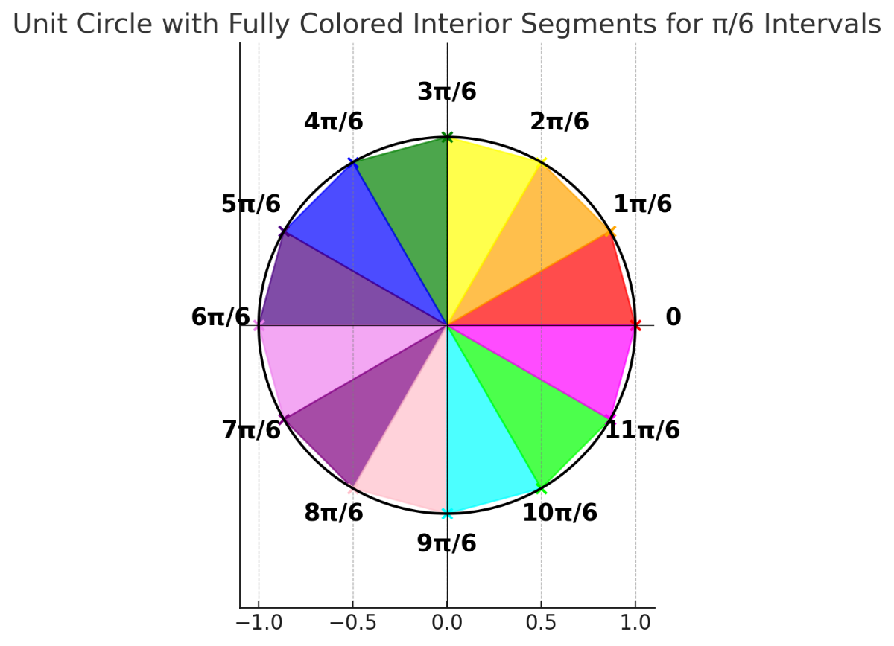

4)  **Because** π **= 180**, when we divide by **45 degrees,** we
    produce **4 segments. Each segment will equal** π**/4.**

The entire circle should be labeled by counting up in π/4 intervals.

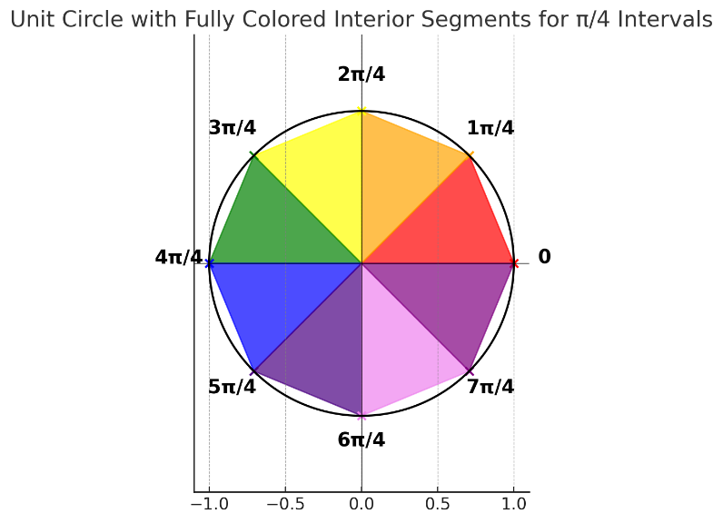

**After reducing to lowest terms, the following circle is produced:**

**Looking at the circle divided by** π**/3 can also be useful, because
some segments will reduce to a multiple of 1/3^rd^.**

!Output image](./media/image178.png)

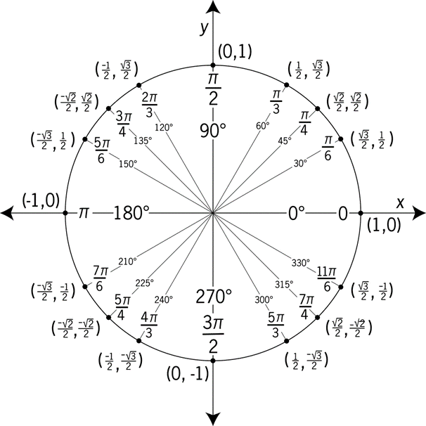

!Graph of a quarter circle with angles of 0, 30, 45, 60, and 90 degrees
inscribed. Equivalence of angles in radians shown. Points along circle
are marked. ](./media/image180.jpeg)

## Defining Sine and Cosine Functions

!Illustration of an angle t, with terminal side length equal to 1, and
an arc created by angle with length t. The terminal side of the angle
intersects the circle at the point (x,y), which is equivalent to (cos t,
sin t). ](./media/image181.jpeg)

