## What Is a Graph?

In everyday language, "graph" usually means a chart or a plot of a function (like a line on an x-y axis). In graph theory, a **graph** means something completely different: it is a collection of **dots** (called vertices or nodes) connected by **lines** (called edges or links). There are no axes, no coordinates, and no functions being plotted.

**A concrete example:** Think of a road map. Each city is a dot, and each road connecting two cities is a line. The graph does not care about exact distances or geographic positions; it only records which cities are connected.

```
  Springfield --- Shelbyville
       |               |
   Capital City --- Ogdenville
```

This is a graph with 4 vertices (cities) and 4 edges (roads).

**Why this abstraction is useful:** The same mathematical structure applies to many different real-world situations:

- **Cities and roads** (transportation networks)
- **People and friendships** (social networks)
- **Web pages and hyperlinks** (the internet)
- **Atoms and bonds** (molecular structures)
- **Tasks and dependencies** (project scheduling)

In each case, we have objects and pairwise relationships between them. By stripping away the specific context and studying the abstract structure, the same graph algorithms and theorems apply to all of these domains. A shortest-path algorithm that finds the fastest driving route can also find the fewest "degrees of separation" between two people in a social network.

## Formal Definition

**Graph Theory:** The mathematical study of graphs, which are structures used to model pairwise relations between objects. Graphs consist of vertices (nodes) connected by edges (links).

**Applications:**
- Computer networks and routing
- Social network analysis
- Transportation and logistics
- Circuit design
- Molecular structures in chemistry
- Scheduling and resource allocation

## Basic Definitions

### Graph

**Graph:** A graph $G = (V, E)$ consists of:
- $V$: A set of vertices (also called nodes)
- $E$: A set of edges (also called links or arcs)

**What graphs model:** Graphs represent relationships between objects. The objects are vertices, and the relationships are edges connecting them.

**Why graphs matter:** Unlike trees (which model hierarchy) or arrays (which model sequences), graphs model arbitrary pairwise relationships. This makes them the most flexible data structure for representing networks, dependencies, maps, social connections, and state transitions.

**Example:**

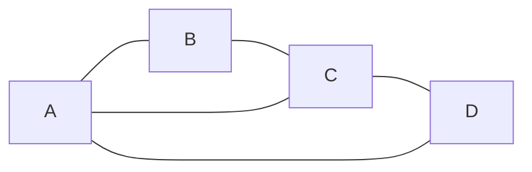

This graph has:
- $V = \{A, B, C, D\}$ (4 vertices)
- $E = \{AB, BC, CD, DA, AC\}$ (5 edges)

**Key insight:** A graph is just a formal way to say "here are some things (vertices) and here are which pairs are related (edges)." Everything else in graph theory flows from this simple idea.

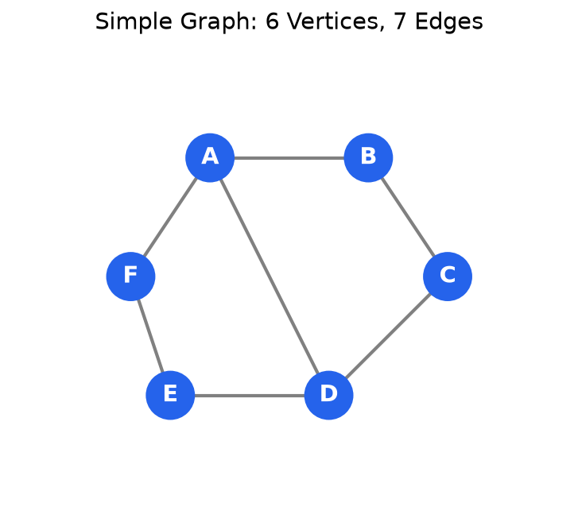

### Vertex (Node)

**Vertex:** A fundamental unit in a graph, representing an object or point.

**Notation:** Usually labeled with letters (A, B, C) or numbers (1, 2, 3)

### Edge (Link, Arc)

**Edge:** A connection between two vertices.

**Notation:** An edge between vertices $u$ and $v$ is written as $(u, v)$ or $\{u, v\}$

**Types:**
- **Undirected edge:** Connection with no direction (e.g., friendship)
- **Directed edge (arc):** Connection with direction (e.g., following on social media)

### Weighted Graphs

**Weighted Graph:** A graph where each edge has an associated numerical value called a **weight** (or cost, length, capacity).

**Edge Weight:** A number assigned to an edge, often representing:
- Distance (road networks)
- Cost (financial networks)
- Capacity (flow networks)
- Time (travel time)
- Strength (relationship strength)

**Notation:** Weight of edge $e$ is written as $w(e)$ or $w(u, v)$ for edge between $u$ and $v$.

**Example - Road network:**

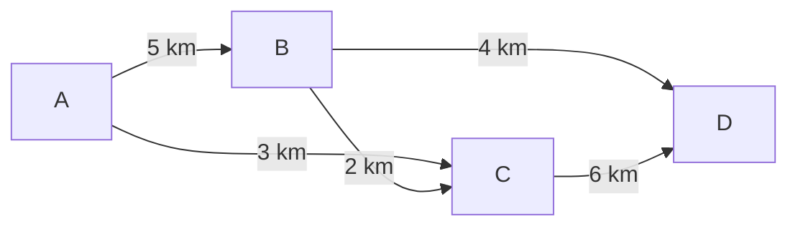

**Unweighted Graph:** A graph where all edges are considered to have equal weight (typically weight 1), or where weights are not relevant.

**Applications:**
- Finding shortest paths (navigation)
- Minimum spanning trees (network design)
- Maximum flow problems (logistics)
- Network optimization

### Directed vs Undirected Graphs

**Undirected Graph:** A graph where edges have no direction. If there is an edge between $u$ and $v$, you can traverse it in either direction.

**Formal definition:** $G = (V, E)$ where $E$ is a set of unordered pairs $\{u, v\}$

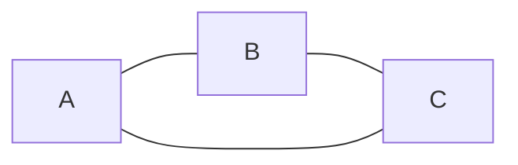

**Examples:**
- Friendship networks (mutual relationships)
- Road networks (two-way streets)
- Physical connections (cables, pipes)

**Directed Graph (Digraph):** A graph where edges have direction. An edge from $u$ to $v$ does not imply an edge from $v$ to $u$.

**Formal definition:** $G = (V, E)$ where $E$ is a set of ordered pairs $(u, v)$

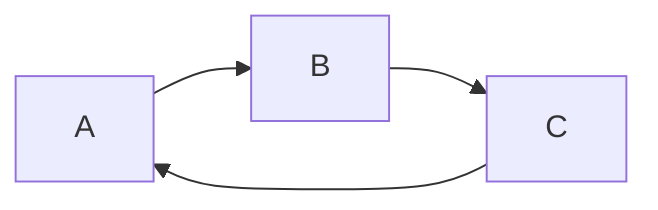

**Examples:**
- Social media follows (one-way relationships)
- Web page links
- Task dependencies
- One-way streets

### Adjacent and Incident

**Adjacent Vertices:** Two vertices are adjacent if they are connected by an edge.

**Example:**
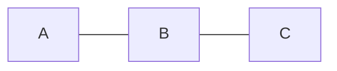

- A and B are adjacent
- B and C are adjacent
- A and C are NOT adjacent (no direct edge)

**Adjacent Edges:** Two edges are adjacent if they share a common vertex.

**Example:** In the graph above, edge AB and edge BC are adjacent (both connect to B)

**Incident:** An edge is incident to a vertex if the vertex is one of the edge's endpoints.

**Example:** In the graph above:
- Edge AB is incident to both A and B
- Edge BC is incident to both B and C

### Simple Graph, Multigraph, and Pseudograph

**Simple Graph:** A graph with:
- No loops (edges from a vertex to itself)
- No multiple edges (at most one edge between any pair of vertices)

Most graphs discussed in graph theory are simple graphs unless stated otherwise.

**Loop (Self-loop):** An edge that connects a vertex to itself.

**Example:**
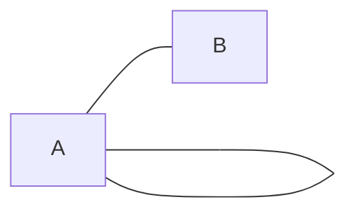

Vertex A has a loop.

**Multiple Edges (Parallel Edges):** Two or more edges connecting the same pair of vertices.

**Multigraph:** A graph that allows multiple edges between vertices but no loops.

**Pseudograph:** A graph that allows both multiple edges and loops.

**Example - Multigraph:**
- Vertices: {City A, City B}
- Edges: {Highway 1, Highway 2, Train Route} (three ways to travel between cities)

### Order and Size

**Order:** The number of vertices in a graph, denoted $|V|$ or $n$.

**Size:** The number of edges in a graph, denoted $|E|$ or $m$.

**Example:**


- Order = 3 (vertices: A, B, C)
- Size = 3 (edges: AB, BC, CA)

### Neighborhood

**Neighborhood (Open Neighborhood):** The set of all vertices adjacent to a given vertex $v$, denoted $N(v)$.

**Closed Neighborhood:** The neighborhood of $v$ plus $v$ itself, denoted $N[v] = N(v) \cup \{v\}$.

**Example:**
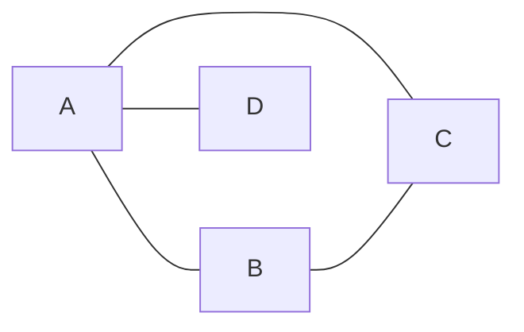

- $N(A) = \{B, C, D\}$ (neighbors of A)
- $N(B) = \{A, C\}$
- $N[A] = \{A, B, C, D\}$ (A and its neighbors)

**Note:** $\deg(v) = |N(v)|$ (degree equals size of neighborhood)

### Subgraph

**Subgraph:** A graph $H = (V', E')$ is a subgraph of $G = (V, E)$ if:
- $V' \subseteq V$ (vertices of $H$ are a subset of vertices of $G$)
- $E' \subseteq E$ (edges of $H$ are a subset of edges of $G$)

**Example:**

Original graph G:
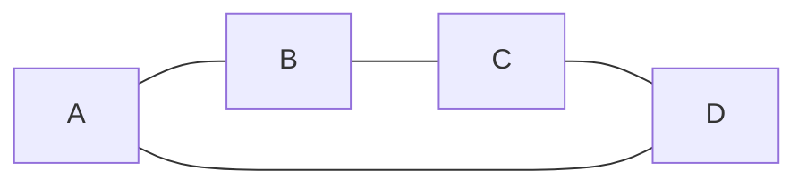

Subgraph H (vertices {A, B, C}, edges {AB, BC}):


**Induced Subgraph:** A subgraph that includes all edges from the original graph between the chosen vertices.

**Example - Induced subgraph on {A, B, C}:**


Includes the CA edge because both C and A are in the vertex set.

### Isolated, Pendant, and Null Vertices

**Isolated Vertex:** A vertex with degree 0, i.e. $\deg(v) = 0$ (no edges connected to it).

**Example:**
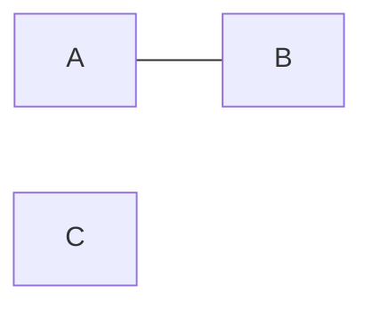

Vertex C is isolated ($\deg(C) = 0$)

**Pendant Vertex (Leaf):** A vertex with degree 1 (exactly one edge connected to it).

**Example:**
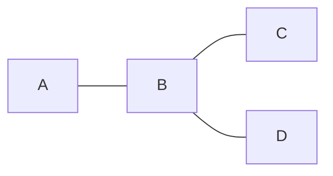

Vertices A, C, and D are pendant vertices (each has degree 1)

**Null Graph:** A graph with no edges (all vertices are isolated).

**Example:** A graph with vertices {A, B, C} but no edges

### Degree

**Degree of a Vertex:** The number of edges connected to a vertex.

**Notation:** $\deg(v)$ or $d(v)$

**Example:**


- $\deg(A) = 3$ (connected to B, C, D)
- $\deg(B) = 2$ (connected to A, C)
- $\deg(C) = 2$ (connected to A, B)
- $\deg(D) = 1$ (connected to A)

**Handshaking Lemma:** The sum of all vertex degrees equals twice the number of edges.

**Formula:**

$$
\sum_{v \in V} \deg(v) = 2|E|
$$

**Why this works:** Imagine counting edges by looking at each vertex and tallying how many edges touch it. When you do this, you count every edge exactly twice, once from each of its two endpoints. So the total count is $2|E|$.

**Intuition:** Think of a handshake between two people. If you ask everyone "how many times did you shake hands?" and sum the answers, you get twice the number of handshakes (because each handshake involves two people).

**Important corollary:** The sum of all degrees is always even. This means you cannot have a graph where every vertex has odd degree and the total number of vertices is odd.

**Common pitfall:** Students sometimes forget that loops (edges from a vertex to itself) count twice toward that vertex's degree, because a loop touches the same vertex at both endpoints.

### In-degree and Out-degree (Directed Graphs)

**In-degree:** Number of edges pointing into a vertex.

**Out-degree:** Number of edges pointing out of a vertex.

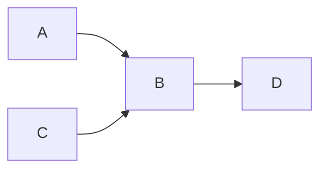

- $\deg^-(B) = 2$ (in-degree: A→B, C→B)
- $\deg^+(B) = 1$ (out-degree: B→D)

## Special Types of Graphs

### Complete Graph

**Complete Graph ($K_n$):** A graph where every pair of vertices is connected by an edge.

**$K_3$ (Triangle):**


**$K_4$:**

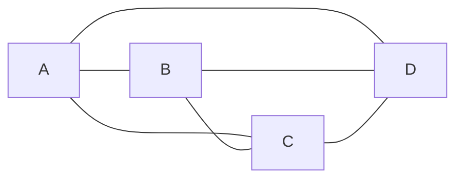

**Properties:**
- $K_n$ has $n$ vertices
- $K_n$ has $\frac{n(n-1)}{2}$ edges
- Every vertex has degree $n-1$

**Why $\frac{n(n-1)}{2}$ edges?** Each of the $n$ vertices must connect to $n-1$ other vertices. That gives $n(n-1)$ total, but we've counted each edge twice (once from each endpoint), so we divide by 2.

**Intuition:** If you have $n$ people and everyone shakes hands with everyone else exactly once, how many handshakes occur? Each person shakes $n-1$ hands, giving $n(n-1)$ handshakes from the perspective of all people, but each handshake involves two people, so the actual count is $\frac{n(n-1)}{2}$.

**Memory aid:** This is the same formula as "n choose 2" $= \binom{n}{2}$, because we're choosing 2 vertices from $n$ vertices to connect with an edge.

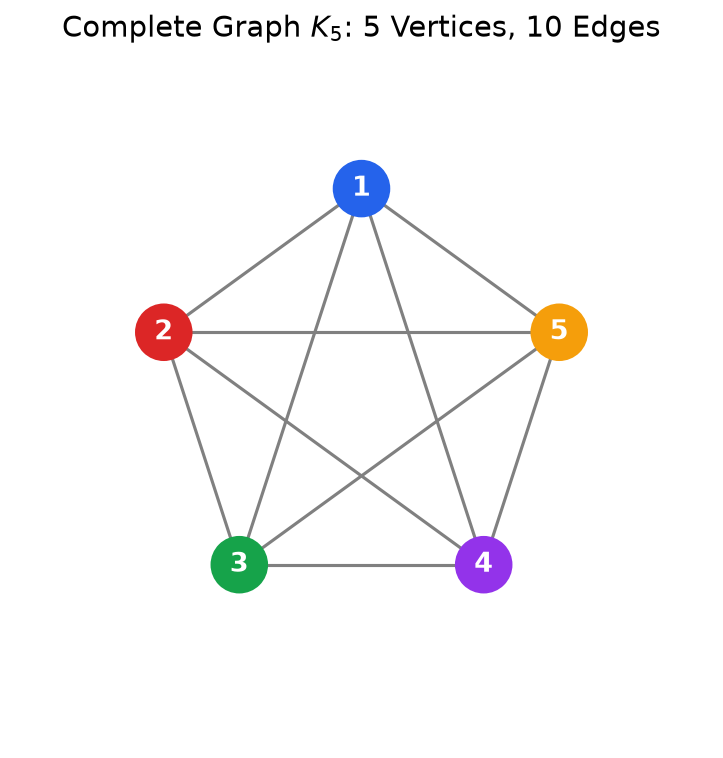

**Why every vertex has degree $n-1$?** In a complete graph, each vertex is connected to every other vertex. Since there are $n$ vertices total and we exclude the vertex itself, each vertex connects to $n-1$ others.

### Cycle Graph

**Cycle Graph ($C_n$):** A graph forming a single closed loop with $n$ vertices.

**$C_4$:**


**$C_5$:**

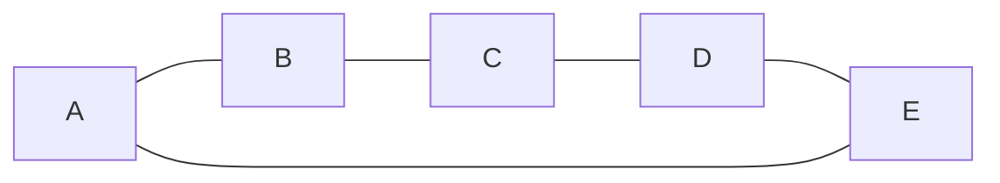

**Properties:**
- $C_n$ has $n$ vertices and $n$ edges
- Every vertex has degree 2
- Minimum cycle length is 3 (triangle)

### Path Graph

**Path Graph ($P_n$):** A graph forming a single path with $n$ vertices.

**$P_4$:**

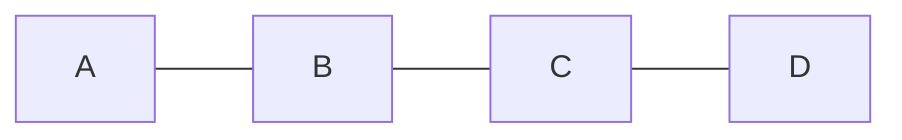

**Properties:**
- $P_n$ has $n$ vertices and $n-1$ edges
- Two vertices has degree 1 (endpoints)
- All other vertices have degree 2

### Bipartite Graph

**Bipartite Graph:** A graph whose vertices can be divided into two disjoint sets such that every edge connects a vertex in one set to a vertex in the other set.

**Example:**

```mermaid
graph LR
    A1[A] --- B1[D]
    A1 --- B2[E]
    A2[B] --- B1
    A2 --- B2
    A3[C] --- B1
    A3 --- B2
```

- Set 1: {A, B, C}
- Set 2: {D, E}
- No edges within the same set

**Complete Bipartite Graph ($K_{m,n}$):** Every vertex in one set is connected to every vertex in the other set.

**Properties:**
- Bipartite if and only if the graph contains no odd-length cycles
- Applications: Matching problems, scheduling

### Tree

**Tree:** A connected graph with no cycles.

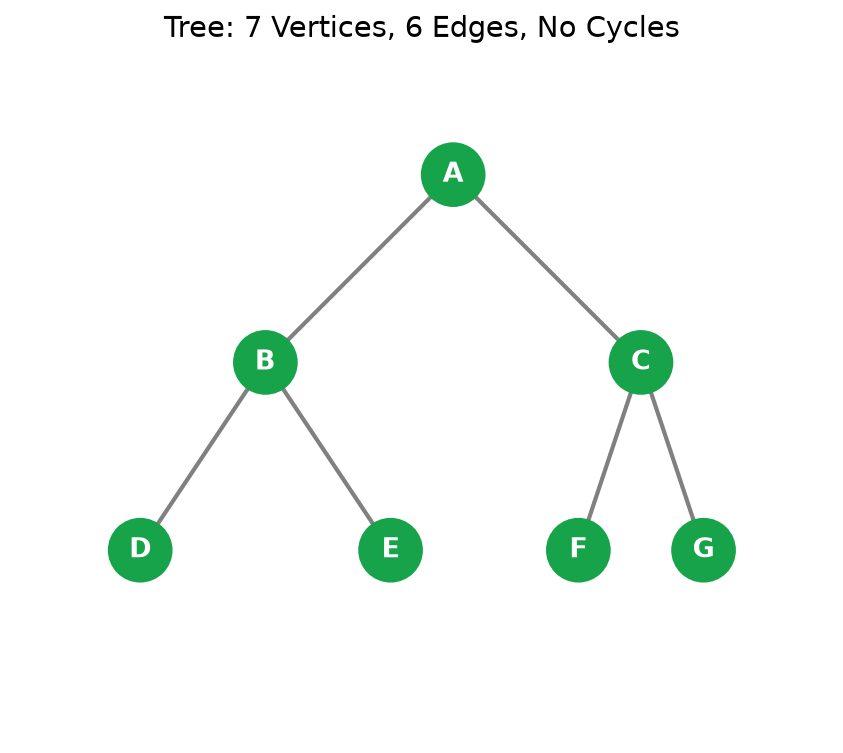

**Example:**

```mermaid
graph TD
    A --- B
    A --- C
    B --- D
    B --- E
    C --- F
```

**Properties:**
- A tree with $n$ vertices has exactly $n-1$ edges
- There is exactly one path between any two vertices
- Removing any edge disconnects the graph
- Adding any edge creates exactly one cycle

**Rooted Tree:** A tree with one vertex designated as the root.

```mermaid
graph TD
    A[Root] --> B
    A --> C
    B --> D
    B --> E
    C --> F
```

**Terms:**
- **Root:** The top vertex (A)
- **Parent:** Vertex directly above (A is parent of B and C)
- **Child:** Vertex directly below (B and C are children of A)
- **Sibling:** Vertices with the same parent (B and C are siblings)
- **Ancestor:** Any vertex on the path from a vertex to the root
- **Descendant:** Any vertex in the subtree rooted at a vertex
- **Leaf (External Node):** Vertex with no children (D, E, F)
- **Internal Node:** Vertex with at least one child (A, B, C)
- **Depth:** Distance from root to a vertex (depth of B = 1, depth of D = 2)
- **Height of node:** Maximum distance from that node to any leaf
- **Height of tree:** Maximum distance from root to any leaf (height = 2 in example)
- **Level:** All vertices at the same depth (level 0: {A}, level 1: {B, C}, level 2: {D, E, F})
- **Subtree:** A tree consisting of a vertex and all its descendants

**Properties of Rooted Trees:**
- Every vertex except the root has exactly one parent
- The root has no parent
- There is exactly one path from the root to any vertex

#### Ordered Trees

**Ordered Tree:** A rooted tree where the children of each vertex are ordered (e.g., left-to-right).

**Significance:** The order of children matters for traversal algorithms and data structure implementations.

**Example:**

```mermaid
graph TD
    A[Root] --> B[First child]
    A --> C[Second child]
    B --> D
    B --> E
```

In an ordered tree, B is specifically the "first child" of A, and C is the "second child". Swapping them creates a different ordered tree.

#### Binary Trees

**Binary Tree:** An ordered tree where each vertex has at most 2 children, designated as **left child** and **right child**.

**Example:**

```mermaid
graph TD
    A[10] --> B[5]
    A --> C[15]
    B --> D[3]
    B --> E[7]
    C --> F[12]
    C --> G[20]
```

**Key Properties:**
- Each node has 0, 1, or 2 children
- Children are distinguished as left vs right (order matters)
- Maximum nodes at level $k$: $2^k$
- Maximum nodes in tree of height $h$: $2^{h+1} - 1$

**Types of Binary Trees:**

**Full Binary Tree:** Every node has either 0 or 2 children (no nodes with exactly 1 child).

```mermaid
graph TD
    A[10] --> B[5]
    A --> C[15]
    B --> D[3]
    B --> E[7]
```

**Complete Binary Tree:** All levels are fully filled except possibly the last level, which is filled left-to-right.

```mermaid
graph TD
    A[10] --> B[5]
    A --> C[15]
    B --> D[3]
    B --> E[7]
    C --> F[12]
```

Level 2 is not full, but all nodes are as far left as possible.

**Perfect Binary Tree:** All internal nodes have exactly 2 children, and all leaves are at the same level.

```mermaid
graph TD
    A[10] --> B[5]
    A --> C[15]
    B --> D[3]
    B --> E[7]
    C --> F[12]
    C --> G[20]
```

**Properties of Perfect Binary Tree:**
- All levels completely filled
- Number of nodes: $2^{h+1} - 1$ where $h$ is height
- Number of leaves: $2^h$
- Number of internal nodes: $2^h - 1$

**Balanced Binary Tree:** A tree where the height difference between left and right subtrees of any node is at most 1.

**Importance:** Balanced trees guarantee $O(\log n)$ height, enabling efficient operations.


**Connecting the concepts:**

These binary tree types answer different questions:

- **Full binary tree:** "Does every node have 0 or 2 children?" (No half-empty nodes)
- **Complete binary tree:** "Are levels filled left-to-right with no gaps?" (Enables array representation)
- **Perfect binary tree:** "Are all leaves at the same depth?" (Maximal nodes for the height)
- **Balanced binary tree:** "Is the height difference between subtrees bounded?" (Ensures logarithmic operations)

**Why these matter:**

A **perfect binary tree** is the ideal case - maximally balanced and efficient. But maintaining this after insertions/deletions is impractical (would require constant restructuring).

A **complete binary tree** is the compromise used by heaps; it maintains good balance while allowing $O(\log n)$ insertion by always adding to the leftmost available position.

A **balanced binary tree** (like AVL) focuses on height difference, not complete filling. This is more flexible than "complete" and still guarantees $O(\log n)$ operations.

**Common confusion:** A perfect tree is always complete, and complete is always balanced, but not vice versa. These are progressively weaker conditions:

$$
\text{Perfect} \subset \text{Complete} \subset \text{Balanced}
$$

**Practical implication:** When you implement a heap, you care about "complete" (for the array representation). When you implement a BST, you care about "balanced" (for search efficiency). These serve different purposes.

#### Tree Traversals

**Tree Traversal:** A systematic way to visit every node in a tree exactly once.

**Why traversals matter:**
- Searching for values
- Copying trees
- Evaluating expressions
- Serializing/deserializing trees

**Main Traversal Methods for Binary Trees:**

**1. Preorder Traversal (Root → Left → Right)**

**Process:**
1. Visit root
2. Recursively traverse left subtree
3. Recursively traverse right subtree

**Example:**

```mermaid
graph TD
    A[1] --> B[2]
    A --> C[3]
    B --> D[4]
    B --> E[5]
    C --> F[6]
    C --> G[7]
```

Preorder: 1, 2, 4, 5, 3, 6, 7

**Uses:**
- Creating a copy of the tree
- Getting prefix expression of an expression tree
- Tree serialization

**2. Inorder Traversal (Left → Root → Right)**

**Process:**
1. Recursively traverse left subtree
2. Visit root
3. Recursively traverse right subtree

**Example (same tree):**

Inorder: 4, 2, 5, 1, 6, 3, 7

**Why this matters for BSTs:** Inorder traversal of a BST always produces values in sorted order. This is not a coincidence - it's a fundamental consequence of the BST property.

**Intuition:** Think about the BST property: everything in the left subtree is smaller, everything in the right subtree is larger. Inorder visits left first (all smaller values), then the root, then right (all larger values). This naturally produces ascending order.

**Example on BST:**
```mermaid
graph TD
    A[50] --> B[30]
    A --> C[70]
    B --> D[20]
    B --> E[40]
```

Inorder: 20, 30, 40, 50, 70 (sorted!)

This property makes inorder traversal the standard way to:
- Print BST contents in sorted order
- Check if a binary tree is a valid BST (values should be in ascending order)
- Convert BST to sorted array

**Connecting concepts:** If you build a BST from sorted data using standard insertion, you get a degenerate tree (linked list). But if you use the middle element as root recursively, you build a balanced tree. This is essentially "reverse inorder" - using sorted order to build the tree structure.

**Uses:**
- **Binary Search Trees:** Produces sorted order
- Getting infix expression of an expression tree
- Range queries in BST (visit only nodes in range)

**3. Postorder Traversal (Left → Right → Root)**

**Process:**
1. Recursively traverse left subtree
2. Recursively traverse right subtree
3. Visit root

**Example (same tree):**

Postorder: 4, 5, 2, 6, 7, 3, 1

**Uses:**
- Deleting a tree (delete children before parent)
- Getting postfix expression of an expression tree
- Evaluating expression trees

**4. Level-Order Traversal (Breadth-First)**

**Process:**
Visit nodes level by level, left to right at each level.

**Example (same tree):**

Level-order: 1, 2, 3, 4, 5, 6, 7

**Algorithm:** Use a queue
1. Enqueue root
2. While queue not empty:
   - Dequeue node, visit it
   - Enqueue its children (left, then right)

**Uses:**
- Finding shortest path to a node
- Level-wise processing
- Serialization for complete trees

**Traversal Comparison:**

| Traversal | Order | Output (example) | Common Use |
|-----------|-------|------------------|------------|
| Preorder | Root, Left, Right | 1,2,4,5,3,6,7 | Copy tree, prefix notation |
| Inorder | Left, Root, Right | 4,2,5,1,6,3,7 | BST sorted output |
| Postorder | Left, Right, Root | 4,5,2,6,7,3,1 | Delete tree, postfix notation |
| Level-order | Level by level | 1,2,3,4,5,6,7 | Shortest path, level processing |

#### Binary Search Trees (BST)

**Binary Search Tree:** A binary tree with the **BST property**:
- For every node N:
  - All values in left subtree < N's value
  - All values in right subtree > N's value

**Example:**

```mermaid
graph TD
    A[50] --> B[30]
    A --> C[70]
    B --> D[20]
    B --> E[40]
    C --> F[60]
    C --> G[80]
```

**Verification:** 
- 50: Left subtree {20,30,40} all < 50, right subtree {60,70,80} all > 50 ✓
- 30: Left {20} < 30 < Right {40} ✓
- 70: Left {60} < 70 < Right {80} ✓

**Key Property:** Inorder traversal of a BST produces values in sorted order.

Inorder: 20, 30, 40, 50, 60, 70, 80 (sorted!)

**BST Operations:**

**1. Search:** Find if a value exists

**Algorithm:**
```
Search(node, value):
    if node is null:
        return false
    if node.value == value:
        return true
    if value < node.value:
        return Search(node.left, value)
    else:
        return Search(node.right, value)
```

**Time Complexity:** 
- Best/Average: $O(\log n)$ for balanced tree
- Worst: $O(n)$ for skewed tree

**2. Insertion:** Add a new value while maintaining BST property

**Algorithm:**
```
Insert(node, value):
    if node is null:
        return new Node(value)
    if value < node.value:
        node.left = Insert(node.left, value)
    else:
        node.right = Insert(node.right, value)
    return node
```

**Example:** Insert 45 into the tree above

```mermaid
graph TD
    A[50] --> B[30]
    A --> C[70]
    B --> D[20]
    B --> E[40]
    E --> H[45]
    C --> F[60]
    C --> G[80]
```

Path: 50 → 30 → 40 → right child becomes 45

**3. Deletion:** Remove a value while maintaining BST property

Deletion is the most complex BST operation because we must maintain the BST property after removing a node. The strategy depends on how many children the node has.

**Cases:**

**Case 1: Leaf node (no children)**
Simply remove it. This cannot violate the BST property since no other nodes depend on it.

**Case 2: One child**
Replace the node with its child. Why this works: If the node we're deleting is in the correct position relative to its parent, and its subtree is valid, then promoting its child maintains the BST property. The child "inherits" its parent's position.

**Case 3: Two children (most complex)**
We cannot simply remove the node because we'd lose two subtrees. The solution is to replace the node's value with either:
- **Inorder successor:** The smallest value in the right subtree (leftmost node of right child)
- **Inorder predecessor:** The largest value in the left subtree (rightmost node of left child)

**Why this works:** The inorder successor is guaranteed to be larger than all values in the left subtree (since it comes from the right subtree) and smaller than all other values in the right subtree (since it's the minimum). This preserves the BST property.

**Example:** Delete 30 (has two children)

Original tree with 30:
```mermaid
graph TD
    A[50] --> B[30]
    A --> C[70]
    B --> D[20]
    B --> E[40]
    C --> F[60]
    C --> G[80]
```

We find the inorder successor of 30, which is 40 (smallest in right subtree). Replace 30's value with 40, then delete the original 40 node (which has no children, so Case 1 applies).

After deletion:
```mermaid
graph TD
    A[50] --> B[40]
    A --> C[70]
    B --> D[20]
    C --> F[60]
    C --> G[80]
```

**Critical insight:** We've transformed the complex "two children" case into a simpler case (leaf or one child) by finding a replacement value from the tree itself.

**Common pitfall:** Forgetting to handle the deletion of the inorder successor/predecessor. You must remove it from its original position after copying its value.

**Why not just remove and reconnect?** If we tried to remove 30 and promote one child, we'd lose the other subtree. Using the inorder successor lets us preserve both subtrees while maintaining BST order.

**BST Advantages:**
- Efficient search, insertion, deletion ($O(\log n)$ average) - all operations follow a single path from root
- Maintains sorted order naturally (inorder traversal)
- Dynamic size (unlike sorted arrays which require resizing)
- No wasted space (unlike hash tables with empty buckets)

**BST Disadvantages:**
- Can become unbalanced, degrading to $O(n)$ for all operations
- No guarantees on height without self-balancing
- Worst case occurs with sorted input (creates a linked list)
- Solution: Self-balancing trees (AVL, Red-Black)

#### Balanced Trees (AVL Trees)

**AVL Tree:** A self-balancing binary search tree where the height difference (balance factor) between left and right subtrees is at most 1 for every node.

**Balance Factor:** height(left subtree) - height(right subtree)

**Valid balance factors:** -1, 0, +1

**Example (Balanced):**

```mermaid
graph TD
    A[50] --> B[30]
    A --> C[70]
    B --> D[20]
    B --> E[40]
    C --> G[80]
```

Balance factors:
- Node 50: height(left=2) - height(right=1) = 1 ✓
- Node 30: height(left=1) - height(right=1) = 0 ✓
- Node 70: height(left=0) - height(right=1) = -1 ✓

**Rotations:** Operations to rebalance tree after insertion/deletion

When a node becomes unbalanced (balance factor > 1 or < -1), we perform rotations to restore balance. Rotations are local restructuring operations that maintain the BST property while reducing height.

**Intuition behind rotations:** Imagine a tree leaning too far to one side (like the Tower of Pisa). A rotation "straightens" the tree by promoting a lower node to become the new root of that subtree. The BST property is preserved because we carefully rearrange connections.

**Single Right Rotation (LL Case - "Left-Left" imbalance):**

The tree is "heavy" on the left side, and specifically the left-left path.

Before (unbalanced):
```
    30          Balance factors:
   /            30: +2 (left heavy)
  20            20: +1 (left heavy)
 /              10: 0
10
```

After rotation (rotate right around 30):
```
  20            Balance factors:
 /  \           20: 0 (balanced!)
10  30          10: 0, 30: 0
```

**What happened:**
1. 20 becomes the new root
2. 30 becomes 20's right child (was 20's parent)
3. If 20 had a right child, it would become 30's left child (preserving BST order: values between 20 and 30)

**Why this works:** Before rotation: 10 < 20 < 30. After rotation: 10 is left of 20, 30 is right of 20. BST property maintained, but height reduced from 3 to 2.

**Single Left Rotation (RR Case - "Right-Right" imbalance):**

Mirror image of right rotation. Tree is heavy on right side.

Before (unbalanced):
```
10              Balance factors:
  \             10: -2 (right heavy)
  20            20: -1 (right heavy)
    \           30: 0
    30
```

After rotation (rotate left around 10):
```
  20            Balance factors:
 /  \           20: 0 (balanced!)
10  30          10: 0, 30: 0
```

**Edge case to remember:** If the middle node (20) had a left child in the RR case, it becomes the right child of 10 after rotation. This is where beginners often make mistakes - forgetting to reattach the subtree.

**When to use which rotation:**

- **LL case (left-left):** New node inserted in left subtree of left child → Right rotation
- **RR case (right-right):** New node inserted in right subtree of right child → Left rotation
- **LR case (left-right):** New node inserted in right subtree of left child → Left rotation then right rotation
- **RL case (right-left):** New node inserted in left subtree of right child → Right rotation then left rotation

**The LR and RL cases require two rotations** because a single rotation would not fix the imbalance - you need to first "straighten" the zig-zag pattern into a straight line, then perform the main rotation.

**AVL Tree Properties:**
- Height always $O(\log n)$
- Guaranteed $O(\log n)$ search, insert, delete
- More rotations than Red-Black trees (stricter balance)

**Use Cases:**
- Databases (when frequent lookups, infrequent updates)
- In-memory indexes
- When predictable performance is critical

#### Heaps

**Heap:** A complete binary tree with the **heap property**:
- **Max Heap:** Parent ≥ children (root is maximum)
- **Min Heap:** Parent ≤ children (root is minimum)

**Max Heap Example:**

```mermaid
graph TD
    A[90] --> B[60]
    A --> C[80]
    B --> D[30]
    B --> E[50]
    C --> F[70]
    C --> G[40]
```

Every parent is greater than or equal to its children.

**Min Heap Example:**

```mermaid
graph TD
    A[10] --> B[20]
    A --> C[15]
    B --> D[30]
    B --> E[40]
    C --> F[25]
    C --> G[50]
```

Every parent is less than or equal to its children.

**Heap Properties:**
- **Shape property:** Must be a complete binary tree (filled level-by-level, left-to-right)
- **Heap property:** Parent-child ordering (max or min)
- **NOT a BST:** Left/right children have no ordering constraint
- **Height:** Always $O(\log n)$ (complete tree)

**Critical distinction between Heaps and BSTs:**

Many beginners confuse heaps and BSTs because both involve comparing parent and child values. The key difference:

- **BST:** Left < Parent < Right (horizontal ordering between siblings)
- **Heap:** Parent ≥ Children (vertical ordering, no sibling relationship)

In a BST, the left child must be smaller than the right child (via the parent). In a heap, there's no relationship between left and right children - only between parent and children.

**Example showing the difference:**

This is a **valid max heap** but **NOT a BST**:
```
       90
      /  \
    60    80
```

60 and 80 have no required ordering in a heap. But in a BST, if 60 is the left child, the right child must be > 90.

**Why heaps use complete trees:**

The complete tree property is not arbitrary - it enables the crucial array representation. If we allowed gaps in the tree, the parent/child index formulas (2i+1, 2i+2) would break down. The complete tree property guarantees every level is filled before moving to the next, which maps perfectly to sequential array indices.

**Conceptual model:** Think of a heap as a "priority line" where everyone has a number, and parents always have higher priority than their children. You don't care about left vs right, only about the vertical hierarchy.

**Array Representation:**

Heaps are typically stored in arrays for efficiency.

For node at index $i$:
- Parent: $\lfloor (i-1)/2 \rfloor$
- Left child: $2i + 1$
- Right child: $2i + 2$

**Example (max heap):**

```
Array: [90, 60, 80, 30, 50, 70, 40]
Index:   0   1   2   3   4   5   6

Tree structure:
       90
      /  \
    60    80
   / \   / \
  30 50 70 40
```

**Heap Operations:**

**1. Insert (Heapify Up):**
1. Add element at end (maintain complete tree)
2. Compare with parent, swap if violates heap property
3. Repeat until heap property restored

**Time:** $O(\log n)$

**2. Extract Max/Min (Heapify Down):**
1. Remove root (max/min element)
2. Move last element to root
3. Compare with children, swap with larger (max heap) or smaller (min heap) child
4. Repeat until heap property restored

**Time:** $O(\log n)$

**3. Build Heap:**
Create heap from unsorted array.

**Time:** $O(n)$ - surprisingly linear!

**Heap Applications:**
- **Priority Queues:** Efficient max/min access
- **Heap Sort:** $O(n \log n)$ sorting algorithm
- **Graph Algorithms:** Dijkstra's shortest path, Prim's MST
- **Median Maintenance:** Using two heaps
- **Top K problems:** Find K largest/smallest elements

**Heap vs BST: When to use which?**

| Feature | Heap | BST |
|---------|------|-----|
| Find min/max | $O(1)$ | $O(\log n)$ or $O(n)$ |
| Insert | $O(\log n)$ | $O(\log n)$ avg |
| Delete | $O(\log n)$ | $O(\log n)$ avg |
| Search arbitrary | $O(n)$ | $O(\log n)$ avg |
| Sorted traversal | Not possible | Inorder gives sorted |
| Use case | Priority queue | Sorted data, range queries |

**Choosing between heap and BST:**

**Use a heap when:**
- You only care about the min/max element (not arbitrary search)
- You need efficient priority queue operations
- You're implementing Dijkstra's algorithm, Prim's algorithm, or similar
- You want $O(1)$ access to the extreme element

**Use a BST when:**
- You need to search for arbitrary elements
- You want to maintain sorted order
- You need range queries (find all elements between x and y)
- You need to find predecessor/successor of an element

**Common misconception:** "Heaps are faster than BSTs because they give $O(1)$ min/max." This is only true if you exclusively need min/max. If you ever need to search for an arbitrary element, a heap requires $O(n)$ time by checking every element, while a balanced BST does it in $O(\log n)$.

**Memory layout matters:** Heaps use an array representation, which is cache-friendly (sequential memory access). BSTs use pointers, which scatter nodes across memory. For small datasets where everything fits in cache, this difference is negligible, but for large datasets, heap operations can be faster in practice even when the big-O complexity is the same.

**Edge case with heaps:** Extracting the max from a max heap is $O(\log n)$, but what if you want both min and max efficiently? You'd need two heaps (one max, one min) and need to keep them synchronized. This is a common technique for finding the median of a stream of numbers.

#### Tries (Prefix Trees)

**Trie:** A tree structure for storing strings where each path from root to leaf represents a word, and each node represents a character.

**Example (words: "cat", "car", "dog", "dodge"):**

```mermaid
graph TD
    Root --> C
    Root --> D
    C --> CA[a]
    CA --> CAT[t*]
    CA --> CAR[r*]
    D --> DO[o]
    DO --> DOG[g*]
    DOG --> DODGE[e*]
```

Nodes marked with * indicate end of word.

**Trie Properties:**
- Root represents empty string
- Each edge labeled with a character
- Path from root to node represents a prefix
- Special marker indicates complete word

**Trie Operations:**

**1. Insert:** Add a word

```
Insert("cat"):
    Start at root
    Follow/create edges: c → a → t
    Mark 't' as word end
```

**Time:** $O(m)$ where m is word length

**2. Search:** Check if word exists

```
Search("cat"):
    Start at root
    Follow edges: c → a → t
    Check if 't' is marked as word end
```

**Time:** $O(m)$

**3. Prefix Search:** Find all words with given prefix

```
PrefixSearch("ca"):
    Navigate to node 'a' (following c → a)
    Collect all words in subtree: ["cat", "car"]
```

**Trie Advantages:**
- Faster than hash table for prefix queries
- No hash collisions
- Can list all words with common prefix
- Lexicographic ordering

**Trie Disadvantages:**
- Space-intensive (many pointers)
- Not cache-friendly (pointer chasing)

**Why tries beat hash tables for prefix search:**

A hash table can tell you "is 'cat' in the dictionary" in $O(1)$ time. But ask "what words start with 'ca'?" and the hash table must check every single word - $O(n)$ time.

A trie can answer "what words start with 'ca'?" by:
1. Navigate to the 'ca' node, $O(2)$ time
2. Collect all words in that subtree, $O(k)$ where $k$ is the number of matches

This is fundamentally why autocomplete uses tries, not hash tables.

**Common pitfall:** Each trie node typically has an array or hash map of children (one per possible character). For English, that's 26 pointers per node. If most are null, you're wasting space. This is why compressed tries (radix trees) exist.

**Space-time tradeoff:** You can reduce space by using a hash map instead of an array for children at each node. This reduces space from $O(\text{ALPHABET\_SIZE} \times N)$ to $O(\text{actual branches})$, but increases lookup time slightly due to hash operations.

**Edge case:** What if you want to store not just words, but their frequencies or other metadata? Each node can store additional data. For autocomplete, you might store the frequency of each word to rank suggestions.

**Trie Applications:**
- Autocomplete systems (type-ahead search)
- Spell checkers (find words within edit distance)
- IP routing tables (longest prefix matching for network routes)
- Dictionary implementations (space-efficient for shared prefixes)
- DNA sequence analysis (finding repeated subsequences)
- T9 predictive text (phone keypad to words mapping)

**Space Optimization:**

**Compressed Trie (Radix Tree):** Merge chains of single-child nodes.

Before:
```
c → a → t → s
```

After (compressed):
```
cats
```

Saves space when many words share long prefixes.

### Forest

**Forest:** A graph consisting of multiple disconnected trees.

```mermaid
graph TD
    A --- B
    A --- C
    
    D --- E
    E --- F
```

This forest has 2 trees (components).

## Graph Representation

### Adjacency Matrix

**Adjacency Matrix:** A matrix where entry $A[i][j] = 1$ if there's an edge from vertex $i$ to vertex $j$, otherwise $0$.

**Example:**

```mermaid
graph LR
    1 --- 2
    1 --- 3
    2 --- 3
```

**Adjacency Matrix:**

|   | 1 | 2 | 3 |
|---|---|---|---|
| 1 | 0 | 1 | 1 |
| 2 | 1 | 0 | 1 |
| 3 | 1 | 1 | 0 |

**Properties:**
- Symmetric for undirected graphs
- Space complexity: $O(V^2)$
- Edge lookup: $O(1)$

### Adjacency List

**Adjacency List:** Each vertex stores a list of its adjacent vertices.

**Example (same graph):**

```
1: [2, 3]
2: [1, 3]
3: [1, 2]
```

**Properties:**
- Space complexity: $O(V + E)$ (more efficient for sparse graphs)
- Edge lookup: $O(\deg(v))$

### Edge List

**Edge List:** A simple list of all edges.

**Example:**

```
[(1,2), (1,3), (2,3)]
```

**Properties:**
- Space complexity: $O(E)$
- Simple but inefficient for many operations

## Paths and Connectivity

### Path

**Path:** A sequence of vertices where each consecutive pair is connected by an edge, with no repeated vertices.

**Example:**

```mermaid
graph LR
    A --- B
    B --- C
    C --- D
    D --- E
```

Path from A to E: A → B → C → D → E

**Path Length:** The number of edges in the path (4 edges in the example above)

### Walk

**Walk:** Like a path, but vertices and edges can be repeated.

**Example:**

```mermaid
graph LR
    A --- B
    B --- C
    C --- A
```

Walk: A → B → C → A → B (vertices A and B repeated)

### Trail

**Trail:** A walk where no edge is repeated (but vertices can be repeated).

**Example:**

```mermaid
graph LR
    A --- B
    B --- C
    C --- D
    D --- B
```

Trail: A → B → C → D → B (vertex B repeated, but all edges different)

**Note:** Every path is a trail, but not every trail is a path.

### Closed Trail (Circuit)

**Closed Trail (Circuit):** A trail that starts and ends at the same vertex.

**Example:**

```mermaid
graph LR
    A --- B
    B --- C
    C --- D
    D --- A
    A --- C
```

Circuit: A → B → C → A → D → A (starts and ends at A, no repeated edges)

**Note:** The term "circuit" is used in graph theory for closed trails. In some texts, "cycle" and "circuit" are used interchangeably, but technically:
- **Cycle:** Closed path (no repeated vertices except start/end)
- **Circuit:** Closed trail (no repeated edges, but vertices can repeat)

### Cycle

**Cycle:** A closed path where no vertices are repeated except the starting/ending vertex. Minimum length is 3 for simple cycles.

**Example:**

```mermaid
graph LR
    A --- B
    B --- C
    C --- D
    D --- A
```

Cycle: A → B → C → D → A

### Connected Graph

**Connected Graph:** A graph where there is a path between every pair of vertices.

**Connected:**

```mermaid
graph LR
    A --- B
    B --- C
    C --- D
```

**Disconnected:**

```mermaid
graph LR
    A --- B
    
    C --- D
```

**Connected Components:** Maximal connected subgraphs.

The disconnected graph above has 2 connected components: {A, B} and {C, D}.

## Graph Algorithms

### Depth-First Search (DFS)

**DFS:** Explores as far as possible along each branch before backtracking.

**Algorithm:**
1. Start at a vertex
2. Mark it as visited
3. Recursively visit all unvisited neighbors
4. Backtrack when no unvisited neighbors remain

**Example:**

```mermaid
graph TD
    A --> B
    A --> C
    B --> D
    B --> E
    C --> F
```

DFS starting from A: A → B → D → E → C → F

**Applications:**
- Finding connected components
- Detecting cycles
- Topological sorting
- Solving mazes

### Breadth-First Search (BFS)

**BFS:** Explores all neighbors at the current depth before moving to the next level.

**Algorithm:**
1. Start at a vertex, add to queue
2. While queue not empty:
   - Dequeue a vertex
   - Visit all unvisited neighbors
   - Add neighbors to queue

**Example (same graph):**

BFS starting from A: A → B → C → D → E → F

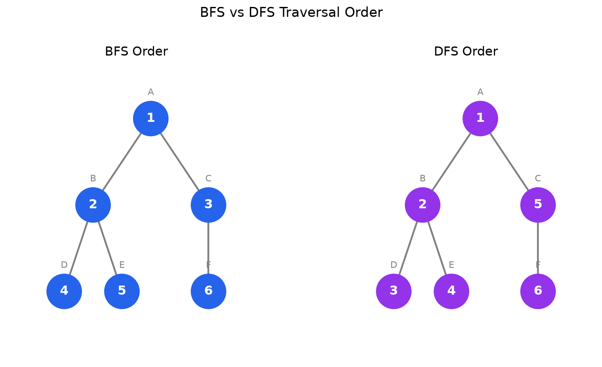

**Applications:**
- Finding shortest path (unweighted graphs)
- Level-order traversal
- Testing bipartiteness

### Shortest Path

**Shortest Path Problem:** Find the path with minimum total edge weight between two vertices.

**Dijkstra's Algorithm:** Finds shortest paths from a source vertex to all other vertices (non-negative weights only).

**Example:**

```mermaid
graph LR
    A -->|2| B
    A -->|4| C
    B -->|1| C
    B -->|7| D
    C -->|3| D
```

Shortest path from A to D: A → B → C → D (weight: 2+1+3 = 6)

### Spanning Tree

**Spanning Tree:** A subgraph that includes all vertices and is a tree (connected, no cycles).

**Example:**

Original graph:
```mermaid
graph LR
    A --- B
    A --- C
    B --- C
    B --- D
    C --- D
```

One possible spanning tree:
```mermaid
graph LR
    A --- B
    A --- C
    B --- D
```

**Properties:**
- A graph with $n$ vertices has a spanning tree with $n-1$ edges
- A connected graph can have multiple spanning trees

**Minimum Spanning Tree (MST):** A spanning tree with minimum total edge weight.

**Algorithms:**
- **Kruskal's Algorithm:** Add edges in order of increasing weight, skip if creates cycle
- **Prim's Algorithm:** Grow tree from starting vertex, always add minimum-weight edge

## Special Properties

### Eulerian Path and Circuit

**Eulerian Path:** A path that visits every edge exactly once.

**Eulerian Circuit:** An Eulerian path that starts and ends at the same vertex.

**Example (Eulerian Circuit):**

```mermaid
graph LR
    A --- B
    B --- C
    C --- D
    D --- A
```

Circuit: A → B → C → D → A (visits all 4 edges once)

**Theorem (Euler):**
- A connected graph has an **Eulerian circuit** if and only if every vertex has even degree
- A connected graph has an **Eulerian path** if and only if exactly 0 or 2 vertices have odd degree

### Hamiltonian Path and Circuit

**Hamiltonian Path:** A path that visits every vertex exactly once.

**Hamiltonian Circuit:** A Hamiltonian path that starts and ends at the same vertex.

**Example (Hamiltonian Circuit):**

```mermaid
graph LR
    A --- B
    B --- C
    C --- D
    D --- A
    A --- C
```

Circuit: A → B → C → D → A (visits all 4 vertices once)

**Note:** No simple theorem exists for determining if a Hamiltonian path/circuit exists (NP-complete problem).

### Graph Coloring

**Graph Coloring:** Assign colors to vertices such that no two adjacent vertices have the same color.

**Chromatic Number:** The minimum number of colors needed.

**Example:**

```mermaid
graph LR
    A --- B
    A --- C
    B --- C
```

This triangle needs 3 colors (chromatic number = 3):
- A: Red
- B: Blue  
- C: Green

**Applications:**
- Scheduling (avoiding conflicts)
- Register allocation in compilers
- Map coloring
- Sudoku solving

**Four Color Theorem:** Any planar graph can be colored with at most 4 colors.

