**Graphing Functions:** Graphing is the visual representation of a function on a coordinate plane. The graph shows the relationship between input values (x) and output values (y), revealing important features like intercepts, asymptotes, extrema, and overall behavior.

## The Coordinate Plane

**Coordinate Plane (Cartesian Plane):** A two-dimensional plane formed by two perpendicular number lines:
- **x-axis:** Horizontal axis (independent variable)
- **y-axis:** Vertical axis (dependent variable)
- **Origin:** The point (0, 0) where the axes intersect

**Quadrants:** The plane is divided into four regions:
- Quadrant I: x > 0, y > 0 (upper right)
- Quadrant II: x < 0, y > 0 (upper left)
- Quadrant III: x < 0, y < 0 (lower left)
- Quadrant IV: x > 0, y < 0 (lower right)

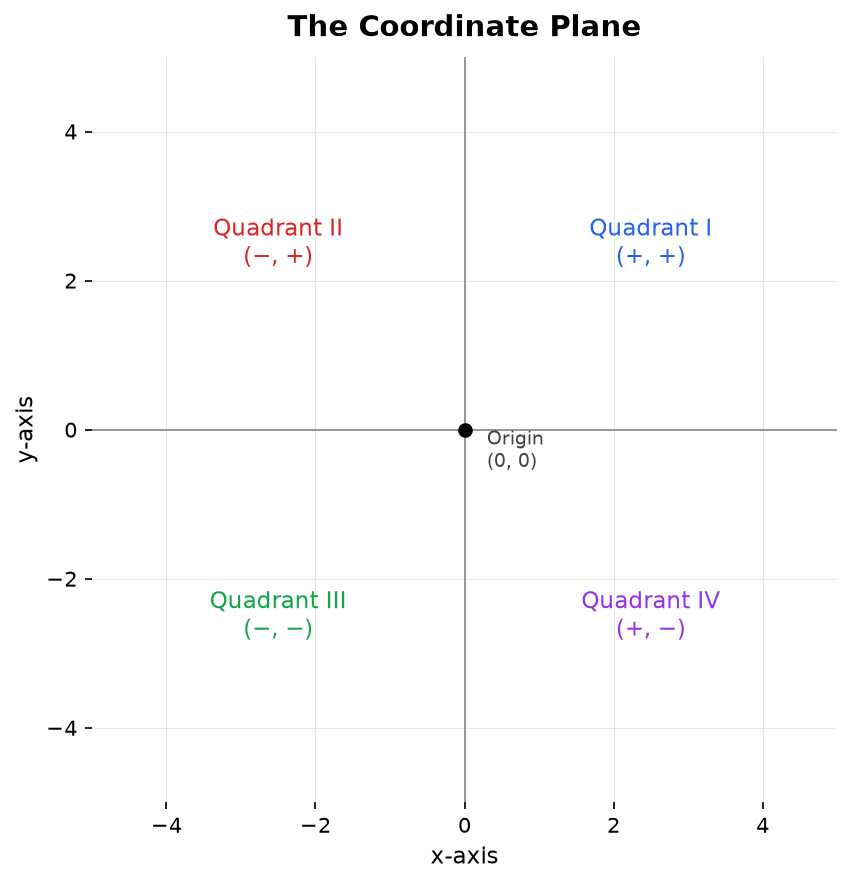

**Ordered Pair:** A point is written as (x, y) where x is the horizontal coordinate and y is the vertical coordinate.

## Key Features to Identify

When graphing any function, identify these key features:

**1. Domain and Range**
- Domain: All possible x-values (horizontal extent)
- Range: All possible y-values (vertical extent)

**2. Intercepts**
- **x-intercept(s):** Points where the graph crosses the x-axis (set y = 0)
- **y-intercept:** Point where the graph crosses the y-axis (set x = 0)

**3. Asymptotes**
- **Vertical asymptote:** Line x = a where function approaches ±∞
- **Horizontal asymptote:** Line y = b that function approaches as x → ±∞
- **Oblique/Slant asymptote:** Diagonal line that function approaches

**4. Extrema**
- **Maximum:** Highest point (locally or globally)
- **Minimum:** Lowest point (locally or globally)
- **Vertex:** The maximum or minimum of a parabola

**5. Intervals of Increase/Decrease**
- **Increasing:** Function values rise as x increases (left to right upward)
- **Decreasing:** Function values fall as x increases (left to right downward)
- **Constant:** Function values remain the same

**6. Concavity**
- **Concave up:** Graph curves upward (like ∪)
- **Concave down:** Graph curves downward (like ∩)
- **Inflection point:** Where concavity changes

**7. Symmetry**
- **Even function (y-axis symmetry):** f(-x) = f(x)
- **Odd function (origin symmetry):** f(-x) = -f(x)

**8. End Behavior**
- Behavior as x → ∞
- Behavior as x → -∞

## Graphing Linear Functions

**Linear Function:** f(x) = mx + b

**Key Features:**
- **Slope (m):** Rate of change, "rise over run"
  - m > 0: Line rises (increasing)
  - m < 0: Line falls (decreasing)
  - m = 0: Horizontal line (constant)
- **y-intercept (b):** Point (0, b)
- **x-intercept:** Solve 0 = mx + b → x = -b/m

**Graphing Steps:**
1. Identify y-intercept (0, b) - plot this point
2. Use slope m = rise/run to find a second point
3. Draw a straight line through both points

**Example:** Graph f(x) = 2x - 3

- y-intercept: (0, -3)
- Slope: m = 2 = 2/1 (rise 2, run 1)
- From (0, -3), move up 2 and right 1 to get (1, -1)
- x-intercept: 0 = 2x - 3 → x = 1.5, point (1.5, 0)
- Draw line through points

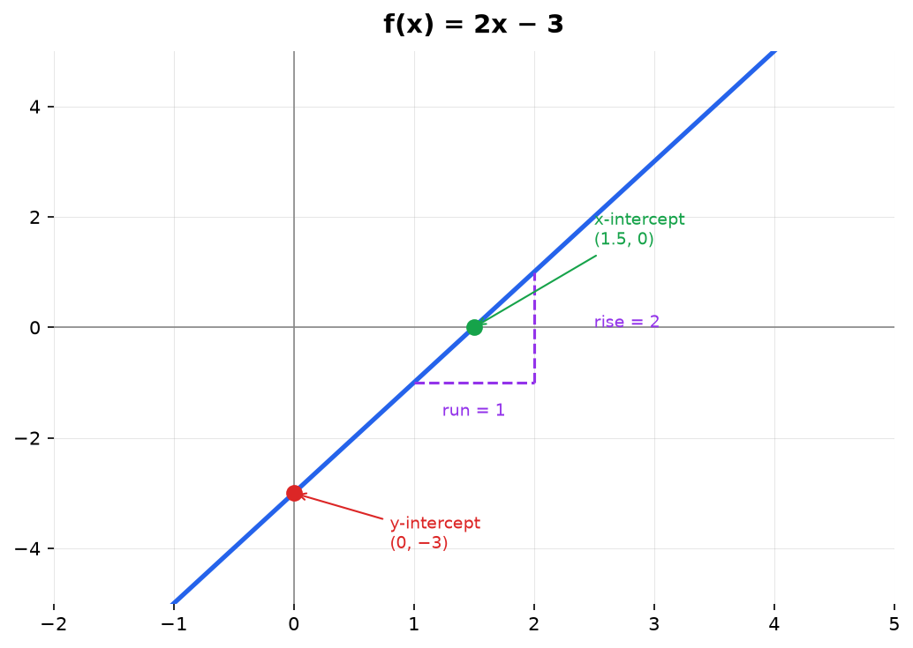

**Special Cases:**
- **Vertical line:** x = a (undefined slope, not a function)
- **Horizontal line:** y = b (slope = 0)

## Graphing Quadratic Functions

**Quadratic Function:** f(x) = ax² + bx + c

**Key Features:**
- **Parabola:** U-shaped curve
- **Opens upward:** a > 0 (minimum at vertex)
- **Opens downward:** a < 0 (maximum at vertex)
- **Vertex:** Turning point at x = -b/(2a)
  - Substitute x into f(x) to find y-coordinate
- **Axis of symmetry:** Vertical line x = -b/(2a)
- **y-intercept:** (0, c)
- **x-intercept(s):** Solve ax² + bx + c = 0 (0, 1, or 2 solutions)

**Vertex Form:** f(x) = a(x - h)² + k
- Vertex: (h, k)
- Makes graphing easier when in this form

**Graphing Steps:**
1. Find vertex: x = -b/(2a), then find y
2. Determine direction (a > 0 up, a < 0 down)
3. Find y-intercept: (0, c)
4. Find x-intercepts (if they exist): factor or quadratic formula
5. Plot vertex, intercepts, and use symmetry to find additional points
6. Draw smooth parabola

**Example:** Graph f(x) = x² - 4x + 3

- Vertex: x = -(-4)/(2·1) = 2, y = 4 - 8 + 3 = -1, vertex (2, -1)
- Opens upward (a = 1 > 0)
- y-intercept: (0, 3)
- x-intercepts: x² - 4x + 3 = 0 → (x-1)(x-3) = 0 → x = 1, 3
- Points: (1, 0), (2, -1), (3, 0)
- Symmetric points from vertex

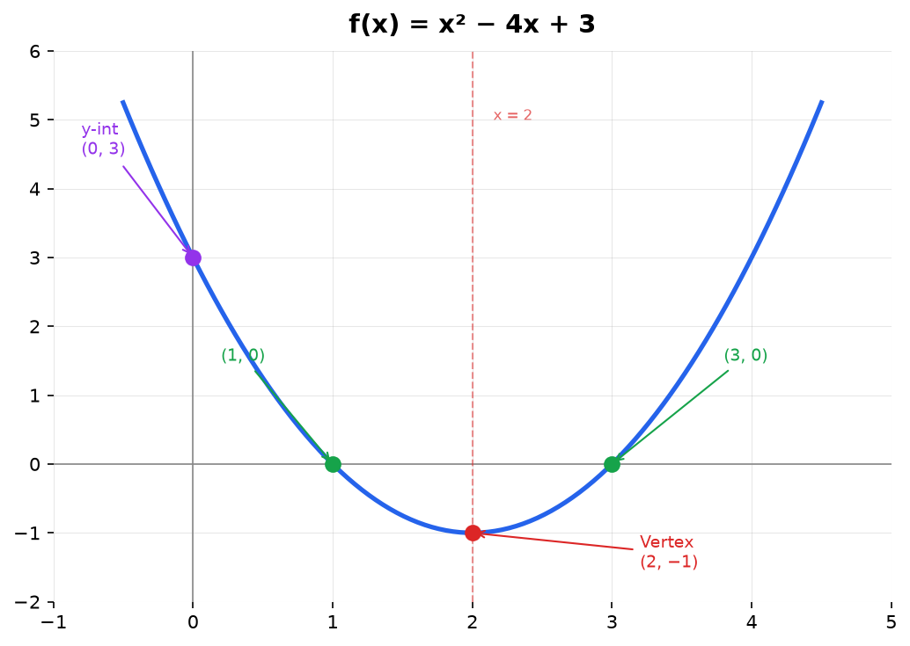

## Graphing Polynomial Functions

**Polynomial Function:** f(x) = aₙxⁿ + ... + a₁x + a₀

**Key Features:**
- **Degree n:** Determines maximum number of turning points (n-1)
- **End behavior:** Determined by leading term aₙxⁿ
  - Even degree: Both ends go same direction
  - Odd degree: Ends go opposite directions
  - Positive leading coefficient: Right end goes up
  - Negative leading coefficient: Right end goes down

**Zeros/Roots:**
- **x-intercepts:** Where f(x) = 0
- **Multiplicity:** Affects graph behavior at zeros
  - Odd multiplicity: Graph crosses x-axis
  - Even multiplicity: Graph touches x-axis (bounces)

**Graphing Steps:**
1. Find all zeros (factor if possible)
2. Determine end behavior from leading term
3. Find y-intercept: f(0)
4. Analyze multiplicity at each zero
5. Plot zeros, y-intercept, and additional points as needed
6. Connect with smooth curve following end behavior

**Example:** Graph f(x) = (x + 2)(x - 1)²

- Zeros: x = -2 (multiplicity 1, crosses), x = 1 (multiplicity 2, touches)
- Degree 3 (odd), positive leading coefficient
- End behavior: x → -∞, f(x) → -∞; x → ∞, f(x) → ∞
- y-intercept: (0, 2·1 = 2)
- At x = -2: crosses axis
- At x = 1: touches axis (turns around)

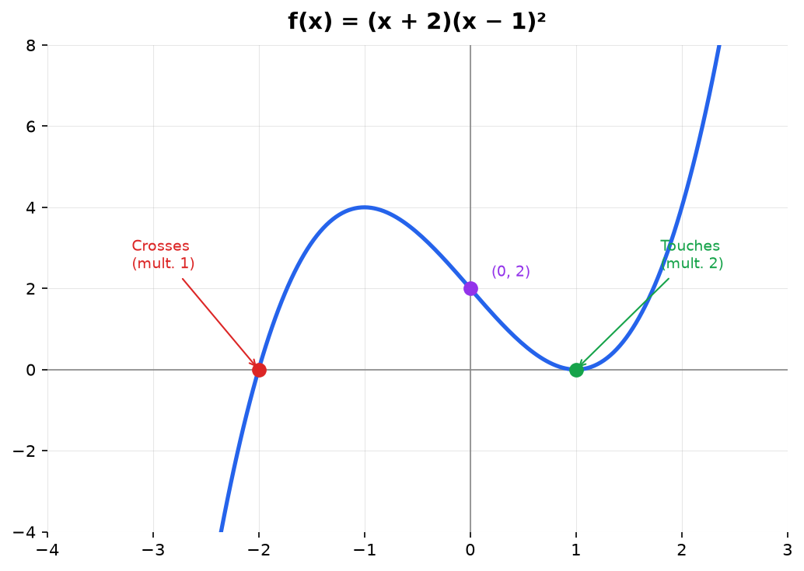

## Graphing Rational Functions

**Rational Function:** f(x) = P(x)/Q(x)

**Key Features:**
- **Vertical asymptotes:** Where Q(x) = 0 (denominator zero)
- **Holes:** Where both P(x) and Q(x) have common factor
- **Horizontal asymptote:** Compare degrees of P and Q
  - deg(P) < deg(Q): y = 0
  - deg(P) = deg(Q): y = aₙ/bₙ (ratio of leading coefficients)
  - deg(P) > deg(Q): No horizontal asymptote (may have oblique)
- **Oblique asymptote:** If deg(P) = deg(Q) + 1, use polynomial division

**Graphing Steps:**
1. Factor numerator and denominator completely
2. Identify and cancel common factors (these are holes)
3. Find vertical asymptotes: remaining zeros of denominator
4. Find horizontal/oblique asymptote based on degree
5. Find x-intercepts: zeros of numerator (excluding holes)
6. Find y-intercept: f(0) if defined
7. Test points in each region between asymptotes
8. Draw curve approaching asymptotes

**Example:** Graph f(x) = (x - 2)/(x + 1)

- No common factors, no holes
- Vertical asymptote: x = -1
- Horizontal asymptote: y = 1 (equal degrees, 1/1)
- x-intercept: (2, 0)
- y-intercept: (0, -2)
- Test regions: x < -1, -1 < x < 2, x > 2
- Curve approaches asymptotes but never touches

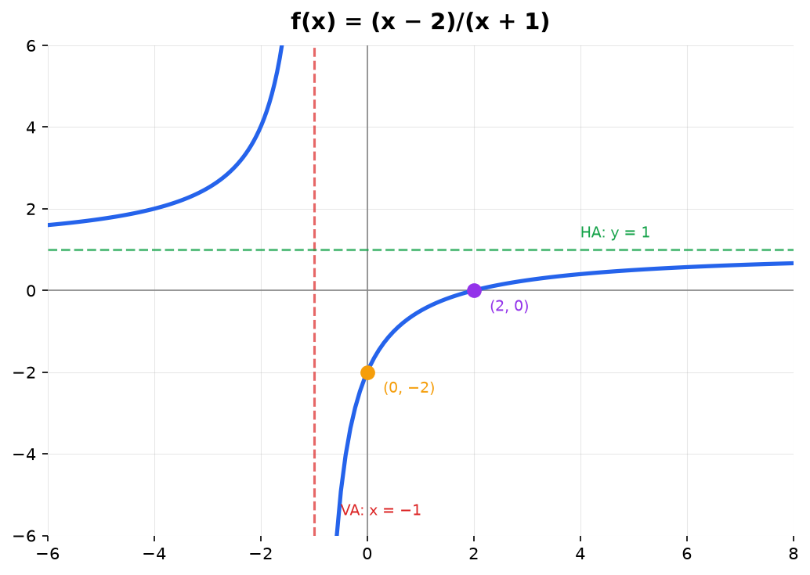

## Graphing Exponential Functions

**Exponential Function:** f(x) = a·bˣ + c

**Key Features:**
- **Growth:** b > 1 (increases exponentially)
- **Decay:** 0 < b < 1 (decreases exponentially)
- **Horizontal asymptote:** y = c
- **y-intercept:** (0, a + c)
- **No x-intercept** (unless vertically shifted to cross axis)
- **Domain:** (-∞, ∞)
- **Range:** (c, ∞) if a > 0, or (-∞, c) if a < 0

**Graphing Steps:**
1. Identify horizontal asymptote y = c
2. Find y-intercept: f(0) = a + c
3. Determine growth or decay
4. Plot several points using convenient x-values
5. Draw smooth curve approaching asymptote

**Example:** Graph f(x) = 2ˣ - 1

- Horizontal asymptote: y = -1
- y-intercept: (0, 0)
- Growth (b = 2 > 1)
- Points: (-2, -0.75), (-1, -0.5), (0, 0), (1, 1), (2, 3)
- Curve increases rapidly, approaches y = -1 as x → -∞

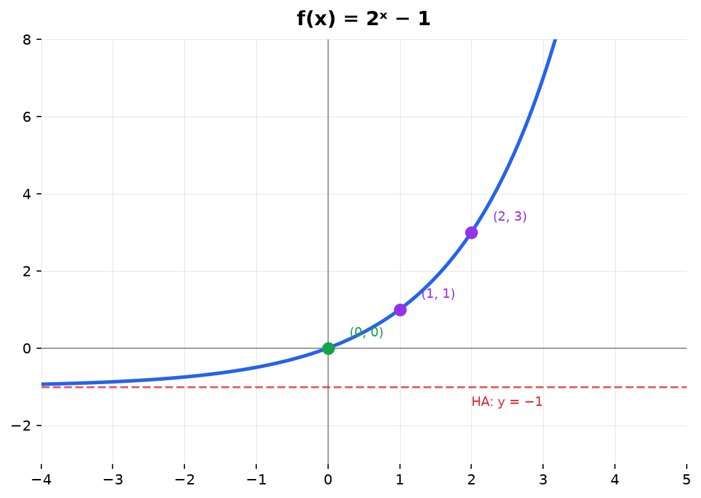

## Graphing Logarithmic Functions

**Logarithmic Function:** f(x) = a·logᵦ(x) + c

**Key Features:**
- **Vertical asymptote:** x = 0 (unless horizontally shifted)
- **x-intercept:** Where logᵦ(x) = -c/a
- **y-intercept:** None (undefined at x = 0)
- **Domain:** (0, ∞) for parent function
- **Range:** (-∞, ∞)
- **Increasing:** if a > 0 and b > 1
- **Decreasing:** if a < 0 and b > 1

**Graphing Steps:**
1. Identify vertical asymptote (usually x = 0)
2. Find x-intercept
3. Plot key point: (b, a) for parent function
4. Plot several points with convenient x-values
5. Draw smooth curve approaching asymptote

**Example:** Graph f(x) = log₂(x)

- Vertical asymptote: x = 0
- x-intercept: (1, 0) since log₂(1) = 0
- Key point: (2, 1) since log₂(2) = 1
- Points: (0.5, -1), (1, 0), (2, 1), (4, 2), (8, 3)
- Increases slowly, approaches x = 0 as x → 0⁺

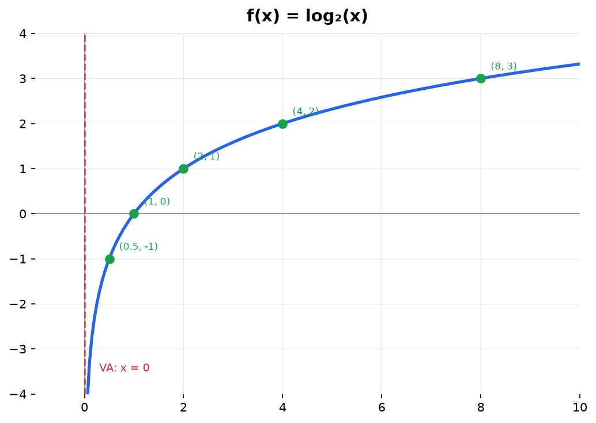

## Graphing Absolute Value Functions

**Absolute Value Function:** f(x) = a|x - h| + k

**Key Features:**
- **Vertex:** (h, k)
- **V-shape:** Sharp corner at vertex
- **Opens upward:** a > 0 (minimum at vertex)
- **Opens downward:** a < 0 (maximum at vertex)
- **Slope:** ±a on each side of vertex
- **Axis of symmetry:** x = h

**Graphing Steps:**
1. Identify vertex: (h, k)
2. Determine direction: up if a > 0, down if a < 0
3. Find x-intercepts: Solve a|x - h| + k = 0
4. Find y-intercept: f(0)
5. Use symmetry to plot points on both sides of vertex
6. Connect with V-shape

**Example:** Graph f(x) = |x - 2| - 1

- Vertex: (2, -1)
- Opens upward (a = 1)
- Slope: ±1
- x-intercepts: 0 = |x - 2| - 1 → |x - 2| = 1 → x = 1 or x = 3
- y-intercept: (0, 1)
- V-shape with vertex at (2, -1)

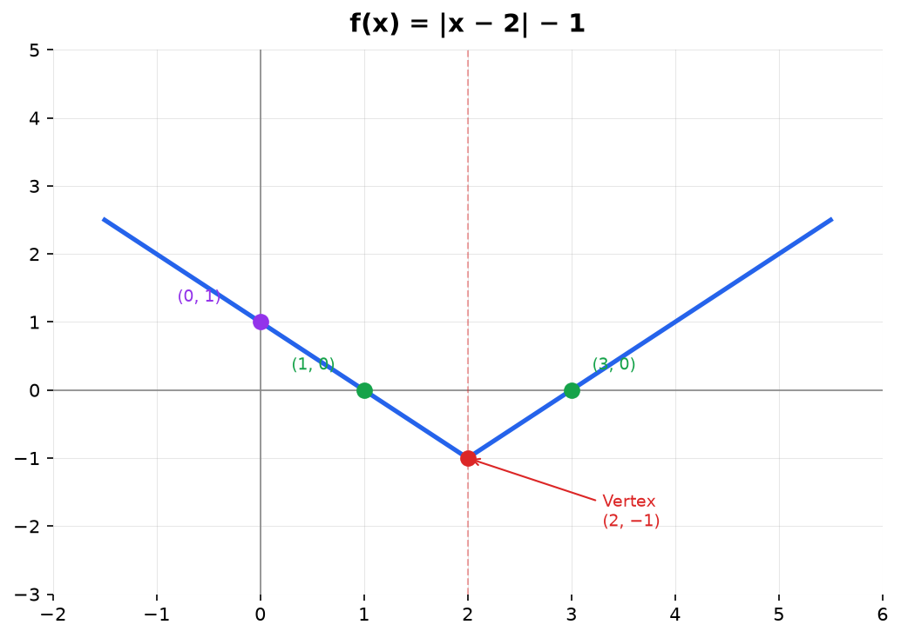

## Graphing Piecewise Functions

**Piecewise Function:** Different formulas for different intervals of x

**Graphing Steps:**
1. Identify each piece and its domain interval
2. Graph each piece separately within its interval
3. Check endpoints:
   - Open circle: Point not included (< or >)
   - Closed circle: Point included (≤ or ≥)
4. Ensure no gaps or overlaps unless specified

**Example:** Graph f(x) = {x + 1 if x < 0; x² if x ≥ 0}

- For x < 0: Graph line y = x + 1, open circle at (0, 1)
- For x ≥ 0: Graph parabola y = x², closed circle at (0, 0)
- Discontinuity at x = 0 (jump discontinuity)

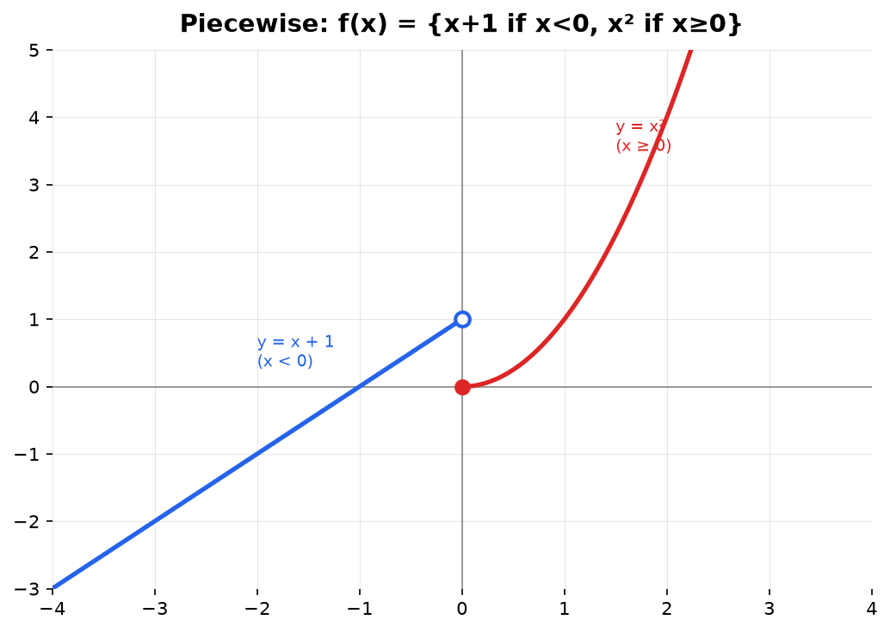

## Graphing Radical Functions

**Square Root Function:** f(x) = a√(x - h) + k

**Key Features:**
- **Starting point:** (h, k)
- **Domain:** [h, ∞)
- **Range:** [k, ∞) if a > 0
- **Increasing:** Slowly, concave down if a > 0
- **Shape:** Half-parabola on its side

**Graphing Steps:**
1. Find starting point: (h, k)
2. Determine domain: x ≥ h
3. Plot starting point
4. Calculate several points for x > h
5. Draw smooth curve starting at (h, k)

**Example:** Graph f(x) = √(x + 1) - 2

- Starting point: (-1, -2)
- Domain: [-1, ∞)
- Points: (-1, -2), (0, -1), (3, 0), (8, 1)
- Increases slowly, concave down

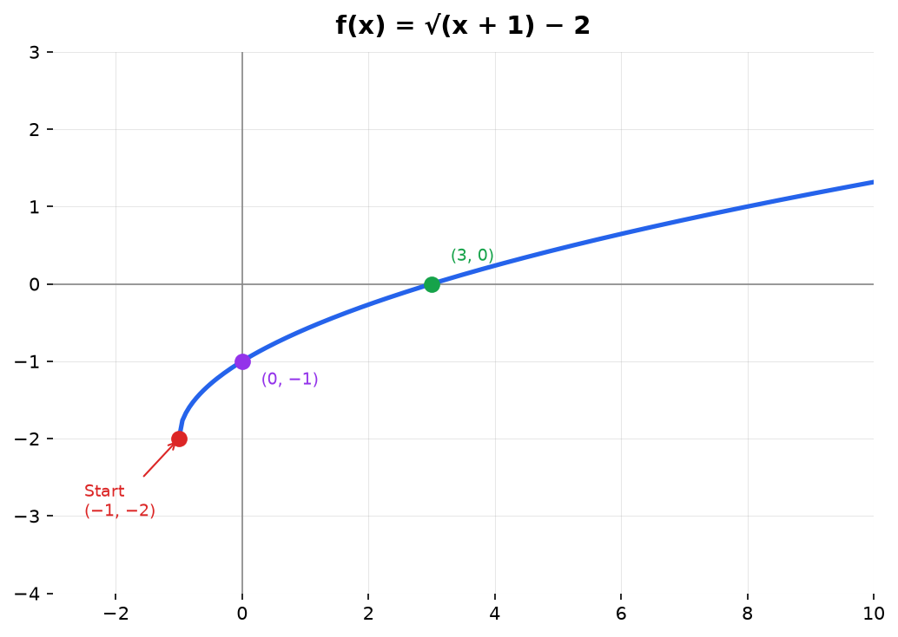

## Graphing Inequalities

**Inequality on Number Line:**
- **Open circle:** < or > (not included)
- **Closed circle:** ≤ or ≥ (included)
- **Shade:** Direction of solution

**Inequality in Two Variables:**

**Steps:**
1. Graph the boundary line/curve
   - Use dashed line for < or > (not included)
   - Use solid line for ≤ or ≥ (included)
2. Test a point not on the line (often (0, 0))
3. Shade the region containing the test point if it satisfies the inequality
4. Shade the opposite region if the test point doesn't satisfy

**Example:** Graph y < 2x + 1

- Graph y = 2x + 1 with dashed line
- Test (0, 0): 0 < 1 ✓
- Shade below the line

**System of Inequalities:**
- Graph all boundary lines
- Shade each inequality
- Solution region is where all shadings overlap

## Common Transformations Summary

Starting with parent function f(x):

**Vertical Transformations:**
- f(x) + k: Shift up k units
- f(x) - k: Shift down k units
- a·f(x): Vertical stretch by |a| (if |a| > 1) or compression (if |a| < 1)
- -f(x): Reflect across x-axis

**Horizontal Transformations:**
- f(x - h): Shift right h units
- f(x + h): Shift left h units
- f(bx): Horizontal compression by b (if |b| > 1) or stretch (if |b| < 1)
- f(-x): Reflect across y-axis

**Combined:** f(x) = a·f(b(x - h)) + k
1. Horizontal shift h
2. Horizontal stretch/compression b
3. Vertical stretch/compression a
4. Vertical shift k

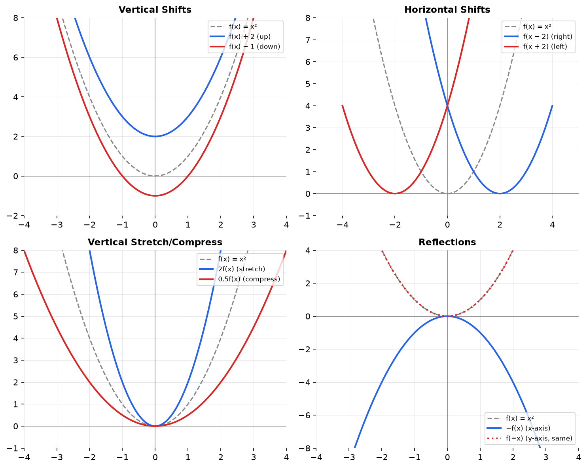

