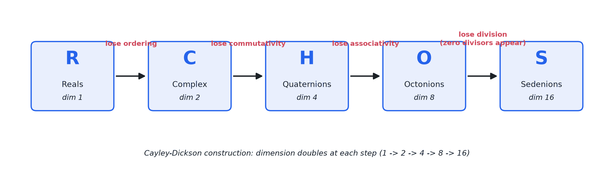
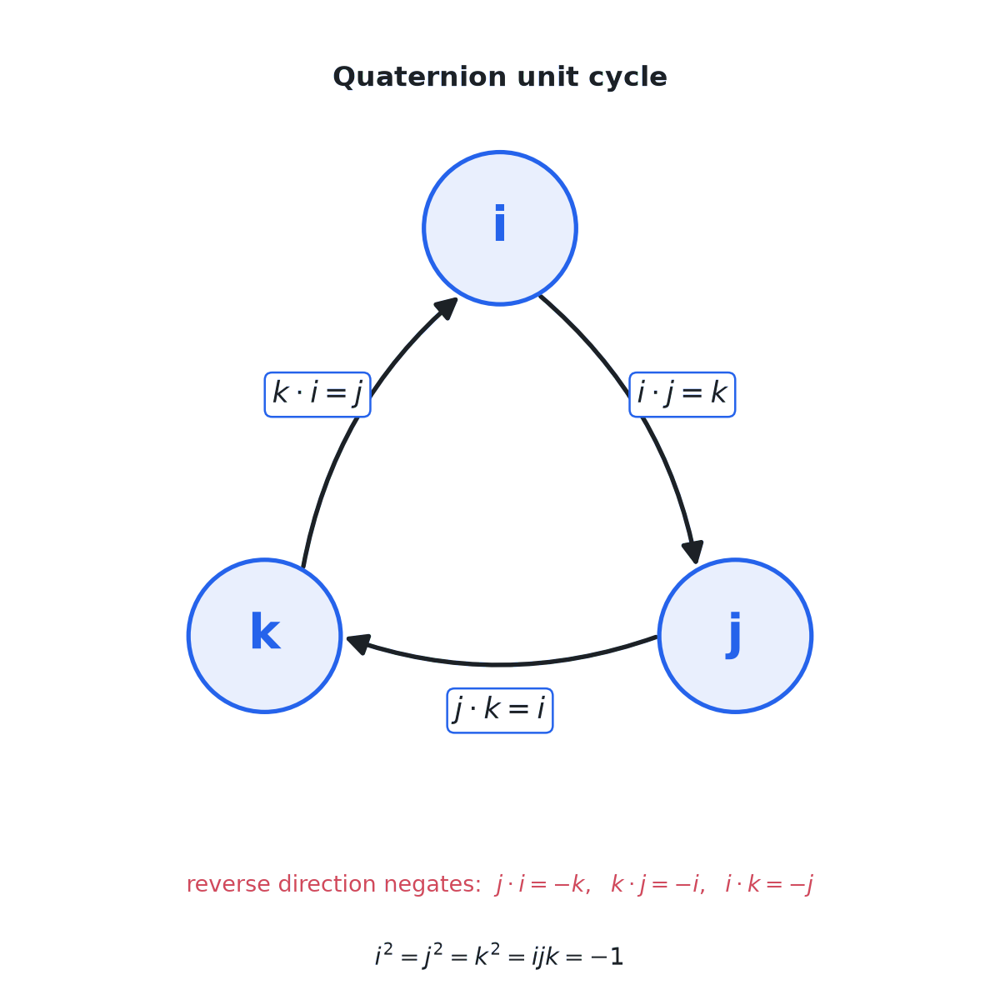
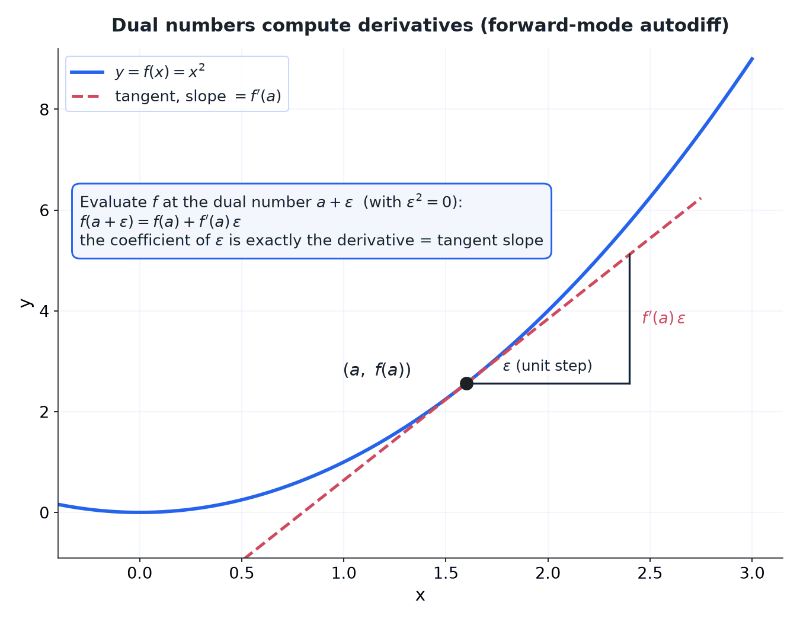

> [!abstract] Prerequisites & where this leads
> **Builds on:** [Complex Numbers](./complex-numbers) · [Algebraic Structures](./algebraic-structures)
> **Leads to:** [Optimization](./optimization) · [Linear Algebra Foundations](./linear-algebra-foundations)

The [building-up story of the number systems](./number-systems) has a natural stopping point: the complex numbers $\mathbb{C}$ are **algebraically closed** (the Fundamental Theorem of Algebra), so no polynomial equation can ever force you to invent new numbers again. Every earlier extension was driven by a "but you cannot solve..."; at $\mathbb{C}$ that pressure runs out.

So why go further at all? Because dimension and structure are their own reward. Beyond $\mathbb{C}$ the extensions no longer *add* solutions, they *trade away* an algebraic law in exchange for new geometry. This page follows two roads out. The first keeps doubling the dimension (the **Cayley–Dickson tower**: quaternions, octonions, sedenions), surrendering one law at each step. The second changes the question entirely, redefining what "size" or "closeness" of a number means (dual numbers, $p$-adics, hyperreals). One of these, the humble **dual number**, turns out to be exactly how automatic differentiation works, so this is not a detour away from machine learning but a road back into it.

## The Cayley–Dickson Construction

There is a single mechanical recipe that generates $\mathbb{C}$ from $\mathbb{R}$, then $\mathbb{H}$ from $\mathbb{C}$, then $\mathbb{O}$ from $\mathbb{H}$, and onward, each time **doubling the dimension**. It is called the **Cayley–Dickson construction**.

Start with an algebra that has a **conjugation** $x \mapsto \bar{x}$ (for the reals, $\bar{x} = x$; for the complex numbers, it flips the sign of the imaginary part). A new element is an ordered **pair** $(a, b)$ of old elements, with multiplication and conjugation defined by
$$
(a, b)\,(c, d) = (\,ac - \bar{d}\,b,\ \ d\,a + b\,\bar{c}\,), \qquad \overline{(a, b)} = (\bar{a},\, -b).
$$
Applied to $\mathbb{R}$ (where conjugation does nothing), a pair $(a, b)$ behaves exactly like $a + bi$: the formula reduces to $(a,b)(c,d) = (ac - db,\ da + bc)$, which is complex multiplication. Apply the *same* formula to pairs of complex numbers and you get the quaternions; to pairs of quaternions, the octonions; and so on. Each level is built from two copies of the level below.

The price of doubling is paid in structure. At each rung a familiar law quietly fails, and the sequence of losses is the real story of this page.

## Quaternions $\mathbb{H}$: Losing Commutativity

The **quaternions** (read "H", for William Rowan Hamilton, who carved the defining relations into a Dublin bridge in 1843) are four-dimensional numbers
$$
q = a + b\,i + c\,j + d\,k, \qquad a, b, c, d \in \mathbb{R},
$$
built from three imaginary units $i, j, k$ satisfying Hamilton's relations
$$
i^2 = j^2 = k^2 = ijk = -1.
$$
Everything else follows. Multiplying $ijk = -1$ on the right by $k$ and using $k^2 = -1$ gives $ij = k$; the full set of products cycles:
$$
ij = k, \quad jk = i, \quad ki = j, \qquad ji = -k, \quad kj = -i, \quad ik = -j.
$$

Here is the first casualty of the tower: $ij = k$ but $ji = -k$. **Quaternion multiplication is not commutative**, order matters. This is not a defect; it is exactly what a system encoding rotations *should* do, because rotations in 3D do not commute either (rotate a book 90° about two different axes in the two orders and it ends up facing differently).

Quaternions otherwise behave beautifully. The **conjugate** is $\bar{q} = a - bi - cj - dk$, the **norm** is $\lvert q \rvert = \sqrt{a^2 + b^2 + c^2 + d^2}$, and every nonzero quaternion has an inverse $q^{-1} = \bar{q}/\lvert q \rvert^2$, so $\mathbb{H}$ is a **division algebra** (you can always divide). The norm is **multiplicative**: $\lvert pq \rvert = \lvert p \rvert\,\lvert q \rvert$, the four-dimensional cousin of the identity that makes complex numbers rotate.

**Why they matter.** A **unit quaternion** ($\lvert q \rvert = 1$) rotates a 3D vector $v$ (written as a pure quaternion $0 + v_x i + v_y j + v_z k$) by the sandwich product $v \mapsto q\,v\,q^{-1}$. Compared with rotation matrices, quaternions use fewer numbers, compose by simple multiplication, interpolate smoothly (spherical linear interpolation), and avoid *gimbal lock*, which is why they are the standard representation of orientation in graphics engines, robotics, aerospace, and physics simulators.

## Octonions $\mathbb{O}$: Losing Associativity

Double once more and you reach the eight-dimensional **octonions** (read "O"), with a real part and seven imaginary units $e_1, \ldots, e_7$. They are still a **division algebra** and still **normed** ($\lvert pq \rvert = \lvert p \rvert \lvert q \rvert$), so you can divide and the norm still multiplies. But the next law is gone: **octonion multiplication is not associative**. In general
$$
(ab)c \ne a(bc).
$$
A concrete witness (in a standard basis) is $(e_1 e_2)e_4 = e_7$ while $e_1(e_2 e_4) = -e_7$: regrouping the same three factors flips the sign. (The specific indices depend on which multiplication table you fix, but *some* such triple always fails, no matter the convention.)

Octonions retain a weaker shadow of associativity called **alternativity**: any subalgebra generated by *two* elements is associative, so products only misbehave when three genuinely independent directions are involved. A common mnemonic for the seven units is the **Fano plane** (the smallest projective plane: 7 points, 7 lines), whose oriented lines encode the products $e_a e_b = e_c$.

**Why they matter.** Octonions are the largest of the exotic division algebras and show up wherever the number 8 is structurally special: the exceptional Lie groups, certain constructions in string theory and supergravity, and the geometry of $\mathbb{R}^8$. They are less a working tool than a signpost that the "nice" number systems are nearly exhausted.

## Higher Number Systems in Physics

The complex numbers, invented to solve $x^2 + 1 = 0$, turned out to be woven into physical law. It is natural to hope the higher systems are too. The honest evidence forms a spectrum from settled to tantalizingly open.

**The precedent: complex numbers are fundamental, not convenient.** It was long unclear whether quantum mechanics genuinely *needs* $i$ or merely finds it handy, since you can try to rebuild the whole theory using only real numbers. In 2021 this was settled experimentally: Renou and collaborators designed a scenario where "real quantum mechanics" and standard complex quantum mechanics predict *different* measurement statistics, and the experiments (published in *Nature*, 2021) came out for the complex version. So nature really does use complex numbers; they are not just bookkeeping. That is a strong precedent for taking the higher systems seriously rather than as mere formalism.

**Quaternions: indispensable but reducible.** The unit quaternions *are* the group $\mathrm{SU}(2)$, the symmetry group governing a spin-$\tfrac{1}{2}$ particle's state space $\mathbb{C}^2$, and the units $i, j, k$ are essentially the Pauli spin matrices (up to a factor of $i$: they correspond to $i\sigma_x, i\sigma_y, i\sigma_z$). So quaternions sit at the heart of the quantum mechanics of spin and of all 3D rotation. But everything they do, $2 \times 2$ complex matrices do equally well, so physics usually speaks the matrix language and treats quaternions as an elegant repackaging rather than a new fundamental ingredient.

**Octonions: the open frontier.** Here the appearances are striking and genuinely unexplained. The sharpest is a dimension coincidence that is really a theorem: classical superstring theory and super-Yang-Mills are consistent in spacetime dimensions **3, 4, 6, and 10** precisely, and these are exactly $\dim(\mathbb{R}) + 2,\ \dim(\mathbb{C}) + 2,\ \dim(\mathbb{H}) + 2,\ \dim(\mathbb{O}) + 2$. The reason (Baez–Huerta, "Division Algebras and Supersymmetry") is that a spinor identity supersymmetry requires holds *if and only if* a division algebra of the matching size exists, so the four division algebras *select* those four dimensions, with the celebrated 10-dimensional superstring sitting at the octonion rung. Octonions also surface in the **exceptional Jordan algebra** (the $3 \times 3$ Hermitian octonionic matrices, proposed by Jordan, von Neumann, and Wigner in 1934 as a candidate arena for quantum observables, and the unique "exceptional" one), in the $E_8 \times E_8$ heterotic string, and in a long-running program (Günaydin and Gürsey in 1973, and today Cohl Furey and Geoffrey Dixon) attempting to derive the Standard Model gauge group $\mathrm{SU}(3) \times \mathrm{SU}(2) \times \mathrm{U}(1)$ and its three particle generations from octonionic structure.

**The honest caveat.** None of the octonion story is confirmed physics. The dimension coincidences are seductive, but decades of octonion-inspired work have not yet produced a *tested* prediction the way complex quantum mechanics now has, and serious physicists are split on whether "dims 3, 4, 6, 10" is a deep clue or a beautiful accident. The very result that ends the tower is itself a caution: the good behavior bottoms out at dimension 8 for the topological reasons the next section makes precise, so the octonions may be the *last* place this magic occurs rather than the first rung of an endless supply. The disciplined stance mirrors the systems themselves: proven fundamental for $\mathbb{C}$, structural but reducible for $\mathbb{H}$, and for $\mathbb{O}$ one of the most intriguing unsettled questions in mathematical physics.

## Sedenions $\mathbb{S}$ and the End of the Line

One more doubling gives the sixteen-dimensional **sedenions** (read "S"), and here the tower breaks in a decisive way: **sedenions have zero divisors**. There exist nonzero sedenions whose product is zero, for example (in a standard basis)
$$
(e_1 + e_{10})(e_5 + e_{14}) = 0.
$$
Two nonzero numbers multiplying to zero means you can no longer always divide: $\mathbb{S}$ is **not a division algebra**. The composition property $\lvert xy \rvert = \lvert x \rvert \lvert y \rvert$ also fails. You can keep doubling forever (32 dimensions, 64, ...), but each further step only inherits and compounds these pathologies.

Two classical theorems say the good behavior really does stop where it appears to:

- **Hurwitz's theorem (1898).** The *only* normed division algebras over $\mathbb{R}$ are $\mathbb{R}, \mathbb{C}, \mathbb{H}, \mathbb{O}$, of dimensions $1, 2, 4, 8$. There is no fifth.
- **Frobenius's theorem (1877).** The only *associative* division algebras over $\mathbb{R}$ are $\mathbb{R}, \mathbb{C}, \mathbb{H}$. Demanding associativity cuts the list off one step earlier.
- **Bott–Milnor and Kervaire (1958).** Drop *every* requirement except division itself: ask only when $\mathbb{R}^n$ can carry *any* bilinear product with no zero divisors (no associativity, no norm, nothing else). The answer is *still* exactly $n = 1, 2, 4, 8$. And this one was proved not by algebra but by **topology**. Such a product forces the sphere $S^{n-1}$ to be **parallelizable** (to admit $n-1$ continuous, everywhere-linearly-independent tangent vector fields, a global "comb the hair flat" condition), and Bott, Milnor, and Kervaire proved the *only* parallelizable spheres are $S^0, S^1, S^3, S^7$. So the magic dimensions $1, 2, 4, 8$ are forced by the shape of spheres, a fact from a branch of mathematics with no visible connection to number systems until you prove the link.

Read together, the three theorems say the tower's abrupt end is a wall approached from three independent directions: normed (Hurwitz), associative (Frobenius), and purely topological (Bott–Milnor–Kervaire). Whichever comfort you refuse to give up, you land on the same short list, and the last one shows the list survives even when you give up *everything* but division.

So the whole tower, and its abrupt end, is captured by a table of what each rung gives up:

| Algebra | Dim | First loses | Still has |
|---|---|---|---|
| $\mathbb{R}$ reals | 1 | — | order, commutative, associative, division |
| $\mathbb{C}$ complex | 2 | ordering | commutative, associative, division, algebraically closed |
| $\mathbb{H}$ quaternions | 4 | commutativity | associative, division, normed |
| $\mathbb{O}$ octonions | 8 | associativity | alternative, division, normed |
| $\mathbb{S}$ sedenions | 16 | division (zero divisors) | power-associative |

Read down the **"Still has"** column and the losses turn out to be anything but random: each rung keeps a strictly *weaker* form of associativity than the last, a graceful descent rather than a collapse. Full associativity ($\mathbb{H}$) weakens to **alternativity** (any *two* elements associate, $\mathbb{O}$), which weakens to **power-associativity** (any *one* element associates with itself, so $x^n$ is unambiguous, $\mathbb{S}$). The structure degrades one notch at a time, never all at once.

![A property-retention grid with the five algebras R, C, H, O, S as rows (dimensions 1, 2, 4, 8, 16) and seven algebraic laws as columns (ordered, commutative, associative, alternative, power-associative, division, normed). Green check cells mark a law the algebra keeps and red cross cells mark a law it has lost. The red cells form a staircase stepping down the diagonal: R keeps every law, C loses only ordering, H additionally loses commutativity, O additionally loses associativity, and S loses alternativity, division, and normedness. The associative, alternative, and power-associative columns are bracketed as a single weakening chain, and the power-associative column stays green for every row, the last law left standing at the sedenions](./media/hc-degradation-chain.png)

And each surrendered law is the *price* of a gain, not pure loss, which answers the natural question "do the higher systems only lose properties?" with a firm no:

- Giving up **order** buys $\mathbb{C}$ its **algebraic closure** (every polynomial factors, the Fundamental Theorem of Algebra) and the geometry of planar rotation.
- Giving up **commutativity** buys $\mathbb{H}$ its clean algebra of **3D rotations**: the unit quaternions form the sphere $S^3$, which is exactly the group $\mathrm{SU}(2)$ double-covering the rotation group $\mathrm{SO}(3)$.
- Giving up **associativity** buys $\mathbb{O}$ its link to the **exceptional Lie groups**: the automorphism group of the octonions is precisely $G_2$, the smallest of the five exceptional groups, and the remaining four ($F_4, E_6, E_7, E_8$) arise from $\mathbb{O}$ through the Freudenthal–Tits "magic square."

So the tower is less a story of decay than of *trading* a familiar comfort for rarer, more rigid structure. The algebras themselves are completely classified and hold no remaining surprises; what is still being actively mined is their *meaning*, most visibly the ongoing program (Baez, Furey, and others) arguing that the dimensions $1, 2, 4, 8$ and the exceptional groups are the hidden algebraic skeleton of the Standard Model of particle physics.

## Sideways Extensions: Changing the Question

The Cayley–Dickson road is not the only way out of $\mathbb{C}$. These constructions keep two dimensions (or stay one-dimensional) but change what a number *does*.

### Dual Numbers and Automatic Differentiation

A **dual number** has the form $a + b\,\varepsilon$ (read "$\varepsilon$" as "epsilon") where $\varepsilon$ is a new symbol with
$$
\varepsilon^2 = 0, \qquad \varepsilon \ne 0.
$$
It looks like a complex number but with $i^2 = -1$ replaced by $\varepsilon^2 = 0$ (a *nilpotent* unit rather than an imaginary one). Multiplication just drops any $\varepsilon^2$ term:
$$
(a + b\varepsilon)(c + d\varepsilon) = ac + (ad + bc)\varepsilon.
$$

The magic appears when you feed a dual number into a function. Taylor-expand $f$ at $a$ and kill every term past first order, because they all carry $\varepsilon^2 = 0$:
$$
f(a + \varepsilon) = f(a) + f'(a)\,\varepsilon.
$$
**The coefficient of $\varepsilon$ is exactly the derivative.** Evaluating $f$ once on $a + \varepsilon$ computes both $f(a)$ and $f'(a)$ at the same time, with no limits, no finite-difference error, and no symbolic manipulation.

**Worked example.** Take $f(x) = x^3 - 2x$ and evaluate at the dual number $2 + \varepsilon$. Using $\varepsilon^2 = 0$:
$$
(2+\varepsilon)^3 = 8 + 12\varepsilon, \qquad -2(2+\varepsilon) = -4 - 2\varepsilon,
$$
$$
f(2 + \varepsilon) = (8 + 12\varepsilon) + (-4 - 2\varepsilon) = 4 + 10\varepsilon.
$$
The real part $4$ is $f(2)$; the $\varepsilon$-part $10$ is $f'(2)$, and indeed $f'(x) = 3x^2 - 2$ gives $f'(2) = 10$. This is **forward-mode automatic differentiation**, the exact mechanism many machine-learning and scientific-computing libraries use to get exact gradients through arbitrary code. The tie to [optimization](./optimization) is direct: gradient-based training runs on differentiation, and dual numbers are one clean way to compute it.

### Split-Complex Numbers

A **split-complex** (or hyperbolic) number is $a + b\,j$ with $j^2 = +1$ (but $j \ne \pm 1$). Where ordinary complex multiplication rotates and preserves circles $x^2 + y^2$, split-complex multiplication preserves the hyperbola $x^2 - y^2$, making it the natural algebra of Lorentz boosts in special relativity. It has zero divisors ($(1+j)(1-j) = 0$), so like the sedenions it is not a division algebra.

### $p$-adic Numbers $\mathbb{Q}_p$

The **$p$-adic numbers** (read "$\mathbb{Q}_p$" as "Q-p") extend the rationals in a completely different direction: not by adding roots, but by adopting a different notion of **distance**. Fix a prime $p$; two rationals are declared "close" when their difference is divisible by a high power of $p$. Completing $\mathbb{Q}$ under this metric (just as completing it under the usual distance gives $\mathbb{R}$) yields $\mathbb{Q}_p$. The result is a field where series like $1 + p + p^2 + \cdots$ converge, and it is indispensable in modern number theory, where problems are often solved "one prime at a time."

### Hyperreals and Surreals

The **hyperreal numbers** enlarge $\mathbb{R}$ with genuine **infinitesimals** (numbers smaller than every positive real but not zero) and their reciprocals, infinities, giving a rigorous foundation for the intuitive calculus of "infinitely small" quantities (non-standard analysis). The **surreal numbers**, John Conway's construction, go further still: a single ordered field containing the reals, all the ordinal infinities, and all the infinitesimals at once, built from a strikingly simple recursive game-like definition.

## Summary

Past $\mathbb{C}$, "bigger" always costs something.

- The **Cayley–Dickson tower** doubles dimension and drops a law each step: $\mathbb{H}$ loses commutativity, $\mathbb{O}$ loses associativity, $\mathbb{S}$ loses division. **Hurwitz**, **Frobenius**, and **Bott–Milnor–Kervaire** prove from three independent directions (normed, associative, purely topological) that there is nothing well-behaved past $\mathbb{O}$, and that the magic dimensions $1, 2, 4, 8$ are the only ones possible. Each law surrendered is the price of a gain: algebraic closure ($\mathbb{C}$), 3D rotations ($\mathbb{H}$), the exceptional Lie groups ($\mathbb{O}$).
- **Sideways extensions** keep the algebra small but change the meaning of a number: dual numbers ($\varepsilon^2 = 0$) compute derivatives, split-complex numbers ($j^2 = +1$) do hyperbolic geometry, $p$-adics redefine distance, and hyperreals/surreals add infinitesimals.

The lesson is the one made precise on the [algebraic structures](./algebraic-structures) page: a number system is defined as much by the axioms it *keeps* as by the ones it drops, and every system on this page is a deliberate, useful choice about which law to surrender.
