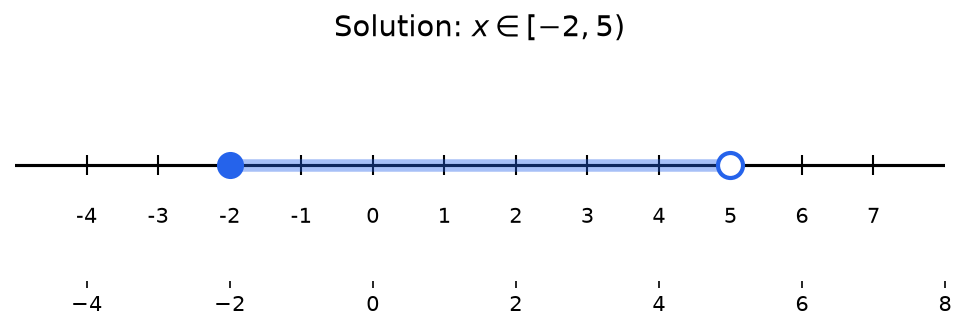
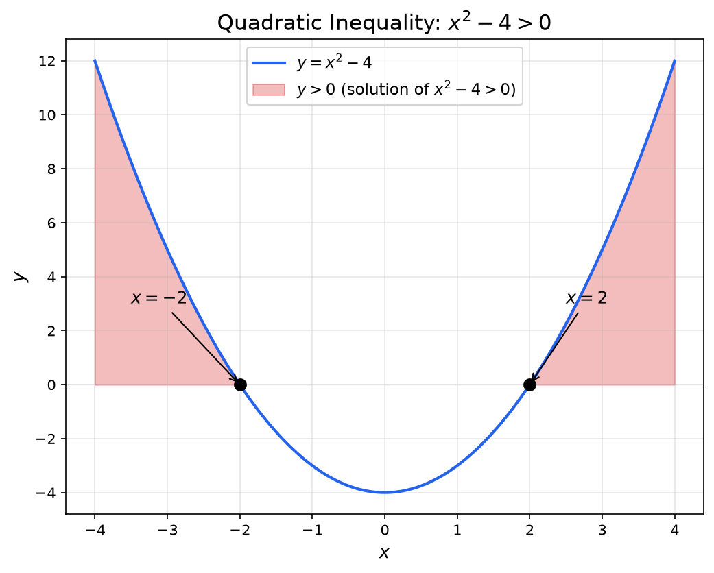

**Inequalities:** An inequality is a mathematical statement that compares two expressions using inequality symbols. Unlike equations, which state that two expressions are equal, inequalities show that one expression is greater than, less than, greater than or equal to, or less than or equal to another expression.

> [!abstract] Prerequisites & where this leads
> **Builds on:** [Linear Functions](./linear-functions) · [Order of Operations](./order-of-operations)
> **Leads to:** [Optimization](./optimization) · [Systems of Equations](./systems-of-equations)

**Inequality Symbols:**

- $<$ : less than
- $>$ : greater than
- $\leq$ : less than or equal to
- $\geq$ : greater than or equal to
- $\neq$ : not equal to

## Properties of Inequalities

**Addition/Subtraction Property:**

If $a < b$, then $a + c < b + c$ and $a - c < b - c$

You can add or subtract the same value from both sides without changing the inequality direction.

**Multiplication/Division by Positive Number:**

If $a < b$ and $c > 0$, then $ac < bc$ and $\frac{a}{c} < \frac{b}{c}$

**Multiplication/Division by Negative Number:**

If $a < b$ and $c < 0$, then $ac > bc$ and $\frac{a}{c} > \frac{b}{c}$

**Critical:** The inequality sign **reverses** when multiplying or dividing by a negative number.

**Transitive Property:**

If $a < b$ and $b < c$, then $a < c$

## Linear Inequalities

**Linear Inequality:** An inequality involving a linear expression (degree 1).

**General Form:** $ax + b < c$ (or $>$, $\leq$, $\geq$)

**Solving Steps:**

1. Isolate the variable using addition/subtraction
2. Divide/multiply by the coefficient
3. Remember to flip the sign if dividing/multiplying by a negative number

**Example 1:** Solve $3x - 5 > 7$

$3x - 5 > 7$

$3x > 12$

$x > 4$

**Solution:** $x \in (4, \infty)$

**Example 2:** Solve $-2x + 3 \leq 11$

$-2x + 3 \leq 11$

$-2x \leq 8$

$x \geq -4$ (sign flips when dividing by -2)

**Solution:** $x \in [-4, \infty)$

**Example 3:** Solve $5 - 2x < 3x + 15$

$5 - 2x < 3x + 15$

$-5x < 10$

$x > -2$ (sign flips)

**Solution:** $x \in (-2, \infty)$



**Try it:** Adjust the coefficients below to shade a solution set on the number line. The widget also has a 1-D quadratic mode and a 2-D half-plane mode (for the feasible regions in [Systems of Inequalities](#systems-of-inequalities)). An open circle marks an excluded endpoint (strict "less than" or "greater than"); a filled circle marks an included endpoint ("less than or equal to" or "greater than or equal to"). Boundary lines are dashed for strict inequalities and solid for non-strict ones.

<iframe src="/static/interactive/ineq-region-explorer.html" width="100%" height="560" style="border:none;"></iframe>

## Compound Inequalities

**Compound Inequality:** Combines two inequalities using "and" or "or".

**Conjunction (AND):** $a < x < b$ means $x > a$ AND $x < b$

**Example:** Solve $-3 < 2x + 1 < 7$

Split into two inequalities:

$-3 < 2x + 1$ AND $2x + 1 < 7$

$-4 < 2x$ AND $2x < 6$

$-2 < x$ AND $x < 3$

**Solution:** $x \in (-2, 3)$

**Disjunction (OR):** $x < a$ OR $x > b$

**Example:** Solve $x - 3 < -5$ OR $x + 2 > 8$

$x < -2$ OR $x > 6$

**Solution:** $x \in (-\infty, -2) \cup (6, \infty)$

## Quadratic Inequalities

**Quadratic Inequality:** An inequality involving a quadratic expression (degree 2). Solving quadratic inequalities requires finding the zeros first. See [Polynomial Functions](./polynomial-functions) for factoring and the quadratic formula.

**General Form:** $ax^2 + bx + c < 0$ (or $>$, $\leq$, $\geq$)

**Solving Method:**

1. Move all terms to one side (set to 0 on the other side)
2. Factor the quadratic (or use quadratic formula to find roots)
3. Find the critical points (zeros)
4. Test intervals between critical points
5. Determine which intervals satisfy the inequality

**Example 1:** Solve $x^2 - 5x + 6 < 0$

Factor: $(x - 2)(x - 3) < 0$

Critical points: $x = 2$ and $x = 3$

Test intervals:
- $x < 2$: Test $x = 0$: $(0-2)(0-3) = 6 > 0$ ✗
- $2 < x < 3$: Test $x = 2.5$: $(0.5)(-0.5) = -0.25 < 0$ ✓
- $x > 3$: Test $x = 4$: $(2)(1) = 2 > 0$ ✗

**Solution:** $x \in (2, 3)$

**Example 2:** Solve $x^2 + 2x - 8 \geq 0$

Factor: $(x + 4)(x - 2) \geq 0$

Critical points: $x = -4$ and $x = 2$

Test intervals:
- $x < -4$: Test $x = -5$: $(-1)(-7) = 7 > 0$ ✓
- $-4 < x < 2$: Test $x = 0$: $(4)(-2) = -8 < 0$ ✗
- $x > 2$: Test $x = 3$: $(7)(1) = 7 > 0$ ✓

**Solution:** $x \in (-\infty, -4] \cup [2, \infty)$

**Sign Chart Method:**

Draw a number line with critical points and test the sign of each factor in each interval.

```
         -4          2
    +  +  |  -  -  |  +  +
    +  +  |  -  -  |  +  +
    ─────────────────────
(x+4)     -    +       +
(x-2)     -    -       +
Product   +    -       +
```



## Polynomial Inequalities of Higher Degree

The sign chart method used for quadratic inequalities extends naturally to polynomials of any degree. The key idea is the same: factor completely, find the zeros, and test the sign of the product in each interval.

**Example:** Solve $x^3 - 4x > 0$

**Step 1: Factor completely**

$$x^3 - 4x = x(x^2 - 4) = x(x - 2)(x + 2)$$

**Step 2: Find critical points (zeros)**

Setting each factor to zero: $x = 0$, $x = 2$, $x = -2$

**Step 3: Set up sign chart**

The three zeros divide the number line into four intervals:

```
        -2          0          2
   ------|-----------|-----------|---------
     I       II          III        IV
```

**Step 4: Test each interval**

| Interval | Test Point | Sign of $x$ | Sign of $(x-2)$ | Sign of $(x+2)$ | Product |
|----------|------------|-------------|-----------------|-----------------|---------|
| I: $x < -2$ | $x = -3$ | $-$ | $-$ | $-$ | $-$ |
| II: $-2 < x < 0$ | $x = -1$ | $-$ | $-$ | $+$ | $+$ |
| III: $0 < x < 2$ | $x = 1$ | $+$ | $-$ | $+$ | $-$ |
| IV: $x > 2$ | $x = 3$ | $+$ | $+$ | $+$ | $+$ |

**Step 5: Select intervals where the product is positive (since we want $> 0$)**

The product is positive in intervals II and IV. Since the inequality is strict ($>$, not $\geq$), we exclude the endpoints.

**Solution:** $x \in (-2, 0) \cup (2, \infty)$

**General procedure for polynomial inequalities:**

1. Move all terms to one side so the other side is 0
2. Factor the polynomial completely
3. Find all real zeros (critical points)
4. Build a sign chart with one row per factor
5. Determine the sign of the product in each interval
6. Select the intervals that satisfy the inequality
7. Include or exclude endpoints based on whether the inequality is strict ($<$, $>$) or non-strict ($\leq$, $\geq$)

## Rational Inequalities

**Rational Inequality:** An inequality involving a rational expression (fraction with polynomials). Rational inequalities combine the techniques from [Rational Functions](./rational-functions) (finding asymptotes and zeros) with sign analysis.

**General Form:** $\frac{P(x)}{Q(x)} < 0$ (or $>$, $\leq$, $\geq$)

**Solving Method:**

1. Move all terms to one side
2. Find a common denominator if needed
3. Factor numerator and denominator
4. Find critical points (zeros of numerator and denominator)
5. **Important:** Exclude values that make denominator zero
6. Test intervals between critical points
7. Use sign chart

**Example 1:** Solve $\frac{x - 1}{x + 2} > 0$

Critical points:
- Numerator zero: $x = 1$
- Denominator zero: $x = -2$ (excluded from solution)

Test intervals:
- $x < -2$: Test $x = -3$: $\frac{-4}{-1} = 4 > 0$ ✓
- $-2 < x < 1$: Test $x = 0$: $\frac{-1}{2} = -0.5 < 0$ ✗
- $x > 1$: Test $x = 2$: $\frac{1}{4} = 0.25 > 0$ ✓

**Solution:** $x \in (-\infty, -2) \cup (1, \infty)$

**Example 2:** Solve $\frac{x^2 - 4}{x - 3} \leq 0$

Factor: $\frac{(x-2)(x+2)}{x-3} \leq 0$

Critical points: $x = -2, 2$ (zeros), $x = 3$ (excluded)

Test intervals:
- $x < -2$: negative/negative = positive ✗
- $-2 < x < 2$: positive/negative = negative ✓
- $2 < x < 3$: positive/negative = negative ✓
- $x > 3$: positive/positive = positive ✗

**Solution:** $x \in [-2, 2] \cup (2, 3)$ which simplifies to $x \in [-2, 3)$

**Note:** We include $x = -2$ and $x = 2$ (where numerator is zero) but exclude $x = 3$ (where denominator is zero).

## Absolute Value Equations

**Absolute Value Equation:** An equation involving absolute value. Recall that $|x|$ represents the distance from zero on the number line, so $|x| = a$ means "$x$ is exactly $a$ units from zero."

**Key Properties of Absolute Value:**

- $|x| \geq 0$ for all $x$ (always non-negative)
- $|x| = 0$ if and only if $x = 0$
- $|xy| = |x| \cdot |y|$ (multiplicative property)
- $|x + y| \leq |x| + |y|$ (triangle inequality)
- $|x - y|$ represents the distance between $x$ and $y$ on the number line

### Solving $|f(x)| = a$

When $a > 0$: split into two equations.

$$
|f(x)| = a \quad \Longleftrightarrow \quad f(x) = a \quad \text{or} \quad f(x) = -a
$$

When $a = 0$: solve $f(x) = 0$ (only one equation).

When $a < 0$: **no solution** (absolute value cannot be negative).

**Example 1:** Solve $|2x - 5| = 3$

Case 1: $2x - 5 = 3$ gives $x = 4$

Case 2: $2x - 5 = -3$ gives $x = 1$

**Solution:** $x \in \{1, 4\}$

**Verification:** $|2(4) - 5| = |3| = 3$ and $|2(1) - 5| = |-3| = 3$, both check out.

**Example 2:** Solve $|x + 1| = -2$

No solution. Absolute value is never negative.

### Solving $|f(x)| = |g(x)|$

Two expressions have the same absolute value when they are equal or when they are negatives of each other.

$$
|f(x)| = |g(x)| \quad \Longleftrightarrow \quad f(x) = g(x) \quad \text{or} \quad f(x) = -g(x)
$$

**Example:** Solve $|3x - 1| = |x + 5|$

Case 1: $3x - 1 = x + 5$ gives $2x = 6$, so $x = 3$

Case 2: $3x - 1 = -(x + 5)$ gives $3x - 1 = -x - 5$, so $4x = -4$, giving $x = -1$

**Solution:** $x \in \{-1, 3\}$

### Equations with Multiple Absolute Values

When an equation contains absolute value expressions added or nested, consider the sign of each expression in different intervals.

**Example:** Solve $|x - 1| + |x + 3| = 8$

Identify critical points where expressions inside absolute values change sign: $x = 1$ and $x = -3$.

**Interval 1:** $x < -3$

Both expressions are negative inside: $-(x-1) + -(x+3) = 8$

$-x + 1 - x - 3 = 8$ gives $-2x = 10$, so $x = -5$

Check: $x = -5 < -3$, so valid. $|-6| + |-2| = 6 + 2 = 8$ confirms the answer.

**Interval 2:** $-3 \leq x < 1$

$-(x-1) + (x+3) = 8$ gives $-x + 1 + x + 3 = 8$, so $4 = 8$

No solution in this interval.

**Interval 3:** $x \geq 1$

$(x-1) + (x+3) = 8$ gives $2x + 2 = 8$, so $x = 3$

Check: $x = 3 \geq 1$, valid. $|2| + |6| = 8$ confirms the answer.

**Solution:** $x \in \{-5, 3\}$

## Absolute Value Inequalities

**Absolute Value Inequality:** An inequality involving absolute value.

**Recall:** $|x|$ represents the distance from zero on the number line.

### Type 1: $|x| < a$

**Interpretation:** Distance from zero is less than $a$.

**Solution:** $-a < x < a$

**Example:** Solve $|x - 3| < 5$

$-5 < x - 3 < 5$

$-2 < x < 8$

**Solution:** $x \in (-2, 8)$

### Type 2: $|x| > a$

**Interpretation:** Distance from zero is greater than $a$.

**Solution:** $x < -a$ OR $x > a$

**Example:** Solve $|2x + 1| \geq 7$

$2x + 1 \leq -7$ OR $2x + 1 \geq 7$

$2x \leq -8$ OR $2x \geq 6$

$x \leq -4$ OR $x \geq 3$

**Solution:** $x \in (-\infty, -4] \cup [3, \infty)$

### Complex Absolute Value Inequalities

**Example:** Solve $|x + 2| < 3x - 1$

For absolute value inequalities with variable expressions, consider two cases:

**Case 1:** $x + 2 \geq 0$ (expression inside is non-negative)

Then $|x + 2| = x + 2$

$x + 2 < 3x - 1$

$3 < 2x$

$x > 1.5$

Combined with $x + 2 \geq 0$ → $x \geq -2$

This case gives: $x > 1.5$

**Case 2:** $x + 2 < 0$ (expression inside is negative)

Then $|x + 2| = -(x + 2)$

$-(x + 2) < 3x - 1$

$-x - 2 < 3x - 1$

$-1 < 4x$

$x > -0.25$

Combined with $x + 2 < 0$ → $x < -2$

This case gives: no solution (contradiction)

**Solution:** $x \in (1.5, \infty)$

## Systems of Inequalities

**System of Inequalities:** Multiple inequalities that must be satisfied simultaneously.

**Solving Method:**

1. Solve each inequality individually
2. Find the intersection of all solutions (values that satisfy ALL inequalities)
3. Graph the solution region (for two variables)

**Example 1 (one variable):** Solve the system:

$$
\begin{cases}
x + 3 > 1 \\
2x - 5 \leq 7
\end{cases}
$$

Solve each:
- $x + 3 > 1$ → $x > -2$
- $2x - 5 \leq 7$ → $2x \leq 12$ → $x \leq 6$

**Solution:** $x \in (-2, 6]$

**Example 2 (two variables):** Graph the solution region for:

$$
\begin{cases}
y < 2x + 1 \\
y \geq -x + 3
\end{cases}
$$

Steps:
1. Graph $y = 2x + 1$ (dashed line, shade below)
2. Graph $y = -x + 3$ (solid line, shade above)
3. Solution is the overlapping shaded region

**Example 3 (three inequalities):** Solve:

$$
\begin{cases}
x + y \leq 4 \\
x - y < 2 \\
x \geq 0, y \geq 0
\end{cases}
$$

This defines a bounded region in the first quadrant. The solution is the polygon formed by the intersection of all constraints.

## Interval Notation Summary

| Inequality | Interval Notation | Meaning |
|------------|-------------------|---------|
| $x < a$ | $(-\infty, a)$ | Open at $a$ |
| $x \leq a$ | $(-\infty, a]$ | Closed at $a$ |
| $x > a$ | $(a, \infty)$ | Open at $a$ |
| $x \geq a$ | $[a, \infty)$ | Closed at $a$ |
| $a < x < b$ | $(a, b)$ | Open at both |
| $a \leq x \leq b$ | $[a, b]$ | Closed at both |
| $a \leq x < b$ | $[a, b)$ | Closed at $a$, open at $b$ |
| $x < a$ OR $x > b$ | $(-\infty, a) \cup (b, \infty)$ | Union of two intervals |

