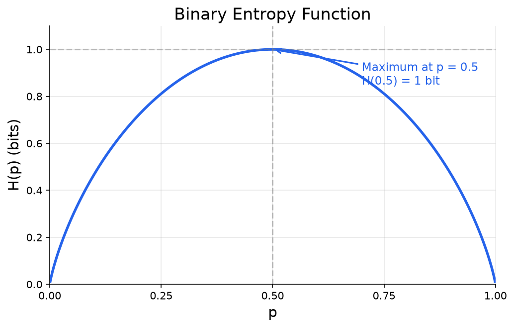
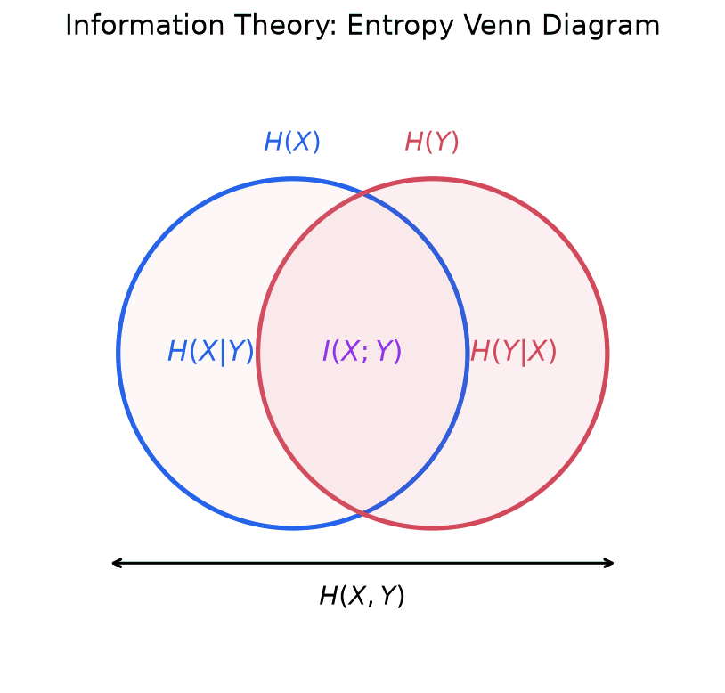

Information theory is the mathematical framework for quantifying information. It answers questions like: How much information does a message contain? How efficiently can information be transmitted? How different are two probability distributions? These questions turn out to be central to machine learning, where models must learn patterns from data, compress representations, and make predictions under uncertainty.

The field was founded by **Claude Shannon** in his 1948 paper "A Mathematical Theory of Communication." Shannon was working at Bell Labs on the problem of transmitting messages over noisy communication channels (telephone lines). He needed to define "information" precisely enough to reason about it mathematically. The framework he created has become one of the most broadly applied theories in mathematics, with applications far beyond communication: it underpins compression algorithms, cryptography, statistical inference, and modern machine learning.

## Surprise and Information Content

### The Intuition

Some events are more "informative" than others. Consider two statements:

1. "The sun rose this morning."
2. "It snowed in Phoenix in July."

The first statement tells you almost nothing because it happens every day (probability close to 1). The second is highly surprising because it almost never happens (very low probability). **Information is inversely related to probability**: the rarer an event, the more information it carries when it occurs.

This matches everyday intuition. News reports focus on unusual events precisely because those events carry more information. A headline "Dog Bites Man" is not news; "Man Bites Dog" is.

### Formal Definition

**Information content** (also called **self-information** or **surprisal**): The information content of an event $x$ with probability $p(x)$ is:

$$
I(x) = -\log_2 p(x)
$$

This is measured in **bits** (binary digits) when using base-2 logarithms. If we use the natural logarithm ($\ln$), the unit is called **nats**.

> If logarithms are unfamiliar, see [Logarithms](./logarithms) for a full treatment. The key property used here is that $\log(ab) = \log(a) + \log(b)$, which makes information from independent events additive.

### Why the Negative Logarithm?

Shannon did not choose $-\log p$ arbitrarily. He required three properties that any reasonable measure of information must satisfy:

1. **Certainty gives zero information.** If $p(x) = 1$ (the event is guaranteed), then $I(x) = -\log_2(1) = 0$. Learning that a certain event occurred tells you nothing.

2. **Rarer events give more information.** If $p(x) < p(y)$, then $I(x) > I(y)$. Since $-\log$ is a decreasing function of $p$, lower probability means higher information content.

3. **Information from independent events is additive.** If events $x$ and $y$ are independent, then $p(x, y) = p(x) \cdot p(y)$, so:

$$
I(x, y) = -\log_2[p(x) \cdot p(y)] = -\log_2 p(x) - \log_2 p(y) = I(x) + I(y)
$$

Learning that two independent events both occurred gives you the sum of their individual information. The logarithm is the **only** function satisfying all three properties (up to a choice of base, which just changes the unit).

### Worked Examples

**Fair coin flip.** Each outcome (heads or tails) has probability $p = 0.5$:

$$
I(\text{heads}) = -\log_2(0.5) = -(-1) = 1 \text{ bit}
$$

One bit is the information gained from a single fair coin flip. This is also the origin of the name "bit" in information theory: it is the amount of information from one binary choice.

**Biased coin.** Suppose $P(\text{heads}) = 0.9$ and $P(\text{tails}) = 0.1$:

$$
I(\text{heads}) = -\log_2(0.9) \approx 0.152 \text{ bits}
$$

$$
I(\text{tails}) = -\log_2(0.1) \approx 3.322 \text{ bits}
$$

Heads is expected and carries little information. Tails is surprising and carries much more.

**Fair die roll.** Each face has probability $p = 1/6$:

$$
I(\text{any face}) = -\log_2(1/6) = \log_2(6) \approx 2.585 \text{ bits}
$$

A die roll carries more information than a coin flip because there are more possible outcomes.

## Entropy

### Definition

Now we ask: on average, how much information does a random variable produce? The answer is **entropy**, the expected value of information content.

**Entropy** of a discrete random variable $X$ with possible values $x_1, x_2, \dots, x_n$ and probability mass function $p$:

$$
H(X) = -\sum_{x} p(x) \log_2 p(x)
$$

> If expected value is unfamiliar, see [Probability](./probability). The expected value $E[f(X)] = \sum_x p(x) f(x)$ is a weighted average. Entropy is just $E[I(X)] = E[-\log_2 p(X)]$.

### Intuition

Entropy measures **average uncertainty** or **average surprise**. You can think of it as:

- The average number of yes/no questions needed to identify the outcome.
- How "spread out" or "uncertain" a distribution is.
- How much information you expect to gain from observing one sample.

High entropy means the outcomes are hard to predict (lots of uncertainty). Low entropy means the outcomes are predictable.

### Properties

1. **Non-negativity:** $H(X) \geq 0$. Uncertainty is never negative.

2. **Zero entropy means certainty.** $H(X) = 0$ if and only if one outcome has probability 1 and all others have probability 0. There is no uncertainty when you already know what will happen.

3. **Maximum entropy for uniform distributions.** Among all distributions over $n$ outcomes, entropy is maximized when every outcome is equally likely: $H(X) = \log_2 n$. The uniform distribution is the "most uncertain" or "least informative" distribution.

### Worked Examples

**Fair coin.** $P(\text{H}) = P(\text{T}) = 0.5$:

$$
H(X) = -[0.5 \log_2(0.5) + 0.5 \log_2(0.5)] = -[0.5(-1) + 0.5(-1)] = 1 \text{ bit}
$$

A fair coin has maximum entropy for a binary variable: 1 bit. You need exactly one yes/no question ("Is it heads?") to determine the outcome.

**Biased coin.** $P(\text{H}) = 0.9$, $P(\text{T}) = 0.1$:

$$
H(X) = -[0.9 \log_2(0.9) + 0.1 \log_2(0.1)]
$$

$$
= -[0.9(-0.152) + 0.1(-3.322)]
$$

$$
= -[-0.137 - 0.332] = 0.469 \text{ bits}
$$

Less than 1 bit. The biased coin is more predictable, so it carries less average uncertainty.

**Fair die.** Each face has probability $1/6$:

$$
H(X) = -\sum_{i=1}^{6} \frac{1}{6} \log_2\left(\frac{1}{6}\right) = -6 \cdot \frac{1}{6} \cdot (-\log_2 6) = \log_2 6 \approx 2.585 \text{ bits}
$$

You need about 2.585 yes/no questions on average to identify which face came up.

### The Binary Entropy Function

For a binary random variable with $P(X = 1) = p$ and $P(X = 0) = 1 - p$, entropy is a function of the single parameter $p$:

$$
H(p) = -p \log_2 p - (1 - p) \log_2(1 - p)
$$

This function has a characteristic shape:

The curve confirms the properties above: entropy is maximized at $p = 0.5$ (maximum uncertainty, where both outcomes are equally likely) and drops to zero at $p = 0$ and $p = 1$ (complete certainty).

### Differential Entropy (Continuous Case)

For a continuous random variable $X$ with probability density function $p(x)$, we replace the sum with an integral. This gives **differential entropy**:

$$
h(X) = -\int_{-\infty}^{\infty} p(x) \log p(x) \, dx
$$

> If integrals are unfamiliar, see [Calculus](./calculus). The integral $\int p(x) \log p(x) \, dx$ is the continuous analog of the sum $\sum p(x) \log p(x)$.

Differential entropy can be negative (unlike discrete entropy), which makes it slightly less intuitive. However, differences in differential entropy are always meaningful.

**Entropy of the normal distribution.** For a Gaussian $X \sim \mathcal{N}(\mu, \sigma^2)$:

$$
h(X) = \frac{1}{2} \log_2(2\pi e \sigma^2)
$$

This result has a remarkable consequence: **the normal distribution has the maximum entropy among all distributions with a given mean and variance.** In other words, if all you know about a distribution is its mean and variance, the Gaussian is the "least informative" assumption you can make. It adds no extra structure beyond what the constraints require.

**Connection to ML:** This maximum-entropy property is one reason Gaussian assumptions appear so frequently in machine learning. When a model assumes Gaussian noise or Gaussian priors, it is making the most conservative (least biased) assumption given the known constraints.

## Joint and Conditional Entropy

Real problems involve multiple random variables. We need to extend entropy to handle them.

### Joint Entropy

**Joint entropy** measures the total uncertainty in a pair of random variables $(X, Y)$:

$$
H(X, Y) = -\sum_{x} \sum_{y} p(x, y) \log_2 p(x, y)
$$

where $p(x, y)$ is the joint probability distribution. This generalizes directly: it is the expected information content of observing both $X$ and $Y$ together.

### Conditional Entropy

**Conditional entropy** measures the remaining uncertainty in $Y$ after you have observed $X$:

$$
H(Y|X) = -\sum_{x} \sum_{y} p(x, y) \log_2 p(y|x)
$$

where $p(y|x)$ is the conditional probability of $Y$ given $X$. See [Probability](./probability) for conditional probability.

Intuition: if knowing $X$ tells you a lot about $Y$, then $H(Y|X)$ is small. If $X$ and $Y$ are independent, knowing $X$ tells you nothing about $Y$, so $H(Y|X) = H(Y)$.

### Chain Rule of Entropy

The chain rule connects joint and conditional entropy:

$$
H(X, Y) = H(X) + H(Y|X)
$$

In words: the total uncertainty in $(X, Y)$ equals the uncertainty in $X$ plus the remaining uncertainty in $Y$ after knowing $X$. This parallels the probability chain rule $p(x, y) = p(x) \cdot p(y|x)$.

**Special case (independence).** If $X$ and $Y$ are independent, then $H(Y|X) = H(Y)$, so:

$$
H(X, Y) = H(X) + H(Y)
$$

The total uncertainty is the sum of the individual uncertainties.

## KL Divergence (Relative Entropy)

### Definition

**Kullback-Leibler divergence** (also called **relative entropy**) measures how one probability distribution differs from another:

$$
D_{\text{KL}}(P \| Q) = \sum_{x} P(x) \log \frac{P(x)}{Q(x)}
$$

Here $P$ is typically the "true" or "reference" distribution and $Q$ is an approximation. The notation $D_{\text{KL}}(P \| Q)$ is read "the KL divergence from $P$ to $Q$" or "of $Q$ from $P$."

### What It Measures

KL divergence quantifies the **extra cost** (in bits or nats) of encoding data from distribution $P$ using a code optimized for distribution $Q$. If $Q$ perfectly matches $P$, there is no extra cost and $D_{\text{KL}} = 0$. The worse $Q$ approximates $P$, the higher the divergence.

### Properties

1. **Non-negativity (Gibbs' inequality):** $D_{\text{KL}}(P \| Q) \geq 0$ for all distributions $P$ and $Q$.

2. **Zero iff equal:** $D_{\text{KL}}(P \| Q) = 0$ if and only if $P = Q$ (the distributions are identical everywhere).

3. **Not symmetric:** $D_{\text{KL}}(P \| Q) \neq D_{\text{KL}}(Q \| P)$ in general. KL divergence is **not a distance metric** because it fails symmetry (and also fails the triangle inequality). Calling it a "distance" is a common but technically incorrect usage.

### Forward vs. Reverse KL

The asymmetry of KL divergence leads to two distinct optimization behaviors, both important in ML.

**Forward KL** $D_{\text{KL}}(P \| Q)$: Minimizing this over $Q$ penalizes $Q$ heavily wherever $P$ has probability mass but $Q$ does not. The result is **mode-covering**: $Q$ tries to cover all the modes (peaks) of $P$, even if that means spreading probability mass too broadly. This is the behavior you get with maximum likelihood estimation.

**Reverse KL** $D_{\text{KL}}(Q \| P)$: Minimizing this over $Q$ penalizes $Q$ heavily wherever $Q$ has probability mass but $P$ does not. The result is **mode-seeking**: $Q$ concentrates on one mode of $P$ and ignores others, producing a tighter but less complete approximation. This is the behavior in variational inference.

**Example:** Suppose $P$ is a bimodal distribution (two peaks). Forward KL produces a $Q$ that covers both peaks (perhaps a broad single Gaussian spanning both). Reverse KL produces a $Q$ that locks onto one peak and ignores the other.

### Worked Example

**KL divergence between two Bernoulli distributions.** Let $P$ be a coin with $P(\text{H}) = 0.7$ and $Q$ be a coin with $Q(\text{H}) = 0.5$.

$$
D_{\text{KL}}(P \| Q) = P(\text{H}) \log_2 \frac{P(\text{H})}{Q(\text{H})} + P(\text{T}) \log_2 \frac{P(\text{T})}{Q(\text{T})}
$$

$$
= 0.7 \log_2 \frac{0.7}{0.5} + 0.3 \log_2 \frac{0.3}{0.5}
$$

$$
= 0.7 \log_2(1.4) + 0.3 \log_2(0.6)
$$

$$
= 0.7(0.485) + 0.3(-0.737)
$$

$$
= 0.340 - 0.221 = 0.119 \text{ bits}
$$

Now the reverse:

$$
D_{\text{KL}}(Q \| P) = 0.5 \log_2 \frac{0.5}{0.7} + 0.5 \log_2 \frac{0.5}{0.3}
$$

$$
= 0.5(-0.485) + 0.5(0.737)
$$

$$
= -0.243 + 0.369 = 0.126 \text{ bits}
$$

Notice $D_{\text{KL}}(P \| Q) = 0.119 \neq 0.126 = D_{\text{KL}}(Q \| P)$, confirming the asymmetry.

### Connection to ML

In machine learning, we typically have a true data distribution $P_{\text{data}}$ and a model distribution $Q_\theta$ parameterized by weights $\theta$. Training the model by maximum likelihood estimation is equivalent to minimizing $D_{\text{KL}}(P_{\text{data}} \| Q_\theta)$. This is the key link between information theory and the loss functions used in practice. The next section makes this precise.

## Cross-Entropy

### Definition

**Cross-entropy** between a true distribution $P$ and a model distribution $Q$:

$$
H(P, Q) = -\sum_{x} P(x) \log Q(x)
$$

Cross-entropy measures the average number of bits needed to encode data from $P$ when using a code optimized for $Q$.

### Relationship to Entropy and KL Divergence

Cross-entropy decomposes into two parts:

$$
H(P, Q) = H(P) + D_{\text{KL}}(P \| Q)
$$

Since $H(P)$ is the entropy of the true distribution (a fixed constant that does not depend on the model), **minimizing cross-entropy with respect to $Q$ is exactly the same as minimizing KL divergence.** This is why cross-entropy works as a loss function: it drives the model distribution toward the true data distribution.

### Cross-Entropy as a Loss Function in ML

Cross-entropy is **the** standard loss function for classification in machine learning. Here is why it works and how it appears in practice.

**Binary cross-entropy** (for two classes). Given a true label $y \in \{0, 1\}$ and a predicted probability $\hat{y} = P(\text{class 1})$:

$$
\mathcal{L} = -[y \log(\hat{y}) + (1 - y) \log(1 - \hat{y})]
$$

When the true class is 1 ($y = 1$), the loss is $-\log(\hat{y})$, which penalizes low predicted probabilities. When the true class is 0 ($y = 0$), the loss is $-\log(1 - \hat{y})$, which penalizes high predicted probabilities. In both cases, confident correct predictions have low loss, and confident wrong predictions have very high loss.

**Categorical cross-entropy** (for multiple classes). Given a true label as a one-hot vector $(y_1, \dots, y_C)$ and predicted probabilities $(\hat{y}_1, \dots, \hat{y}_C)$:

$$
\mathcal{L} = -\sum_{c=1}^{C} y_c \log(\hat{y}_c)
$$

Since the true label is one-hot (only one $y_c = 1$, the rest are 0), this simplifies to $\mathcal{L} = -\log(\hat{y}_k)$ where $k$ is the correct class. The loss depends only on the predicted probability assigned to the correct class.

### Worked Example

**Binary classification.** A model predicts $\hat{y} = 0.8$ for a sample with true label $y = 1$:

$$
\mathcal{L} = -[1 \cdot \log_2(0.8) + 0 \cdot \log_2(0.2)] = -\log_2(0.8) = -(-0.322) = 0.322 \text{ bits}
$$

If the model had predicted $\hat{y} = 0.2$ instead (confidently wrong):

$$
\mathcal{L} = -\log_2(0.2) = -(-2.322) = 2.322 \text{ bits}
$$

The loss is much higher for the confident wrong prediction, which is exactly the behavior we want: the loss function strongly penalizes confident mistakes.

**Connection to the rest of the site:** Cross-entropy loss is discussed from the perspective of maximum likelihood estimation on the [Statistics](./statistics) page. The derivation here shows why MLE and cross-entropy minimization are the same thing: both minimize $D_{\text{KL}}(P_{\text{data}} \| Q_\theta)$.

## Mutual Information

### Definition

**Mutual information** measures how much information one random variable provides about another:

$$
I(X; Y) = H(X) - H(X|Y)
$$

It is the reduction in uncertainty about $X$ gained by observing $Y$. Equivalently:

$$
I(X; Y) = H(Y) - H(Y|X)
$$

$$
I(X; Y) = H(X) + H(Y) - H(X, Y)
$$

$$
I(X; Y) = D_{\text{KL}}\big(P(X, Y) \| P(X)P(Y)\big)
$$

The last form is particularly revealing: mutual information is the KL divergence between the joint distribution and the product of the marginals. It measures how far $X$ and $Y$ are from being independent.

### Properties

1. **Non-negativity:** $I(X; Y) \geq 0$, since $D_{\text{KL}} \geq 0$.

2. **Zero iff independent:** $I(X; Y) = 0$ if and only if $X$ and $Y$ are independent. Independence means $P(X, Y) = P(X)P(Y)$, so the KL divergence is zero.

3. **Symmetry:** $I(X; Y) = I(Y; X)$. Unlike KL divergence, mutual information is symmetric. Knowing $X$ tells you the same amount about $Y$ as knowing $Y$ tells you about $X$.

4. **Bounded by entropy:** $I(X; Y) \leq \min(H(X), H(Y))$. Observing $Y$ cannot reduce uncertainty in $X$ by more than the total uncertainty in $X$.

5. **Complete dependence:** $I(X; Y) = H(X)$ if and only if $X$ is completely determined by $Y$ (knowing $Y$ removes all uncertainty about $X$).

### The Information Venn Diagram

The relationships between entropy, conditional entropy, joint entropy, and mutual information can be visualized as a Venn diagram with two overlapping circles:

- Left circle: $H(X)$ (total uncertainty in $X$)
- Right circle: $H(Y)$ (total uncertainty in $Y$)
- Overlap: $I(X; Y)$ (shared information)
- Left only: $H(X|Y)$ (uncertainty in $X$ that remains after knowing $Y$)
- Right only: $H(Y|X)$ (uncertainty in $Y$ that remains after knowing $X$)
- Union of both circles: $H(X, Y)$ (total joint uncertainty)

From the diagram, you can read off the relationships:

$$
H(X, Y) = H(X) + H(Y) - I(X; Y)
$$

$$
H(X) = H(X|Y) + I(X; Y)
$$

$$
H(Y) = H(Y|X) + I(X; Y)
$$

### Connection to ML

Mutual information is used throughout machine learning:

- **Feature selection.** Features with high mutual information $I(\text{feature}; \text{target})$ carry the most predictive information about the target variable. This provides a principled criterion for choosing which features to include in a model.

- **Representation learning.** Good learned representations should have high mutual information with the target (preserving useful information) while potentially having low mutual information with irrelevant aspects of the input (discarding noise). This idea is formalized in the information bottleneck method (see the next section).

- **Clustering evaluation.** Normalized mutual information can measure how well a clustering matches ground truth labels, without depending on the specific label assignments.

## Data Processing Inequality

### Statement

If three random variables form a **Markov chain** $X \to Y \to Z$ (meaning $Z$ depends on $X$ only through $Y$), then:

$$
I(X; Z) \leq I(X; Y)
$$

In words: processing cannot create information. Each step of processing can only preserve or destroy information, never increase it.

> A Markov chain $X \to Y \to Z$ means that $Z$ is conditionally independent of $X$ given $Y$: once you know $Y$, knowing $X$ gives no additional information about $Z$. Formally, $P(Z|X, Y) = P(Z|Y)$.

### Why This Matters

The data processing inequality has a simple but profound consequence: **no deterministic or stochastic transformation can increase the information that $Y$ contains about $X$.** If you compute $Z = f(Y)$ for any function $f$, then $I(X; Z) \leq I(X; Y)$.

**Research connection:** The data processing inequality ($I(X;Z) \leq I(X;Y)$ for $X \to Y \to Z$) has a direct consequence for tokenization. When BPE merges delimiter characters with adjacent content, structural boundary information is destroyed before the model sees it. No amount of subsequent processing (attention, feedforward layers) can recover the lost information. This is why the frustration gap is permanent: the information was destroyed at the tokenizer level, before the first attention head.

### Connection to ML: The Information Bottleneck

In a neural network, data flows through successive layers:

$$
\text{Input } X \to \text{Layer 1} \to \text{Layer 2} \to \cdots \to \text{Prediction } \hat{Y}
$$

By the data processing inequality, each layer can only preserve or lose information about the input. The **information bottleneck** theory (Tishby et al., 2000) proposes that good representations achieve two goals simultaneously:

1. **Compress the input:** minimize $I(X; T)$ where $T$ is the representation. Discard information in $X$ that is not relevant to the task.

2. **Preserve information about the output:** maximize $I(T; Y)$ where $Y$ is the target. Keep the information needed for prediction.

The optimal representation is one that keeps only the information in $X$ that is relevant to predicting $Y$, throwing away everything else. This provides a theoretical framework for understanding what neural networks learn and why deeper networks can be useful: they progressively distill the input down to the most task-relevant information.

## Summary: Information Theory Concepts and Their ML Applications

| Concept | Definition | ML Application |
|---|---|---|
| Information content $I(x)$ | $-\log_2 p(x)$: surprise from observing event $x$ | Foundation for all quantities below |
| Entropy $H(X)$ | $-\sum p(x) \log p(x)$: average surprise | Measures uncertainty; maximum entropy models; decision tree splitting |
| Conditional entropy $H(Y \mid X)$ | Expected entropy of $Y$ given $X$ | Remaining uncertainty after observing features |
| KL divergence $D_{\text{KL}}(P \| Q)$ | $\sum P(x) \log \frac{P(x)}{Q(x)}$: extra bits from using $Q$ instead of $P$ | Equivalent to MLE; variational inference (ELBO); regularization |
| Cross-entropy $H(P, Q)$ | $-\sum P(x) \log Q(x)$: bits needed using code for $Q$ on data from $P$ | **The** classification loss function (binary and categorical) |
| Mutual information $I(X; Y)$ | $H(X) - H(X \mid Y)$: shared information between $X$ and $Y$ | Feature selection; representation learning; clustering evaluation |
| Data processing inequality | $I(X; Z) \leq I(X; Y)$ for $X \to Y \to Z$ | Information bottleneck theory; understanding neural network layers |

The central thread connecting all of these concepts is the relationship:

$$
H(P, Q) = H(P) + D_{\text{KL}}(P \| Q)
$$

This single equation explains why cross-entropy loss works: minimizing cross-entropy between the data distribution and the model distribution is the same as minimizing KL divergence, which is the same as maximum likelihood estimation. Information theory, statistics, and ML optimization are all perspectives on the same underlying mathematics.
