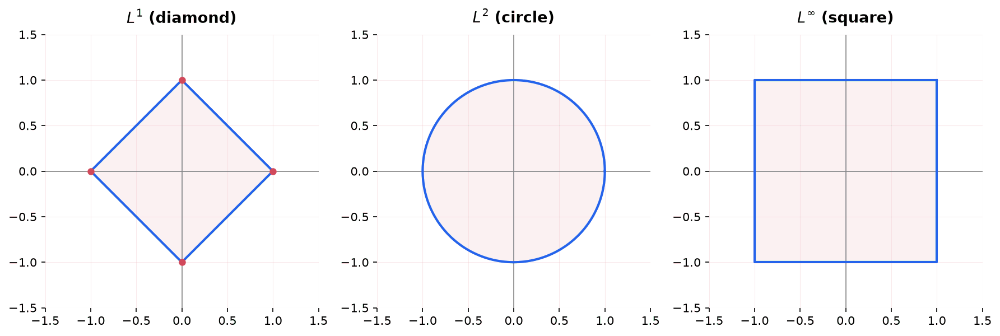
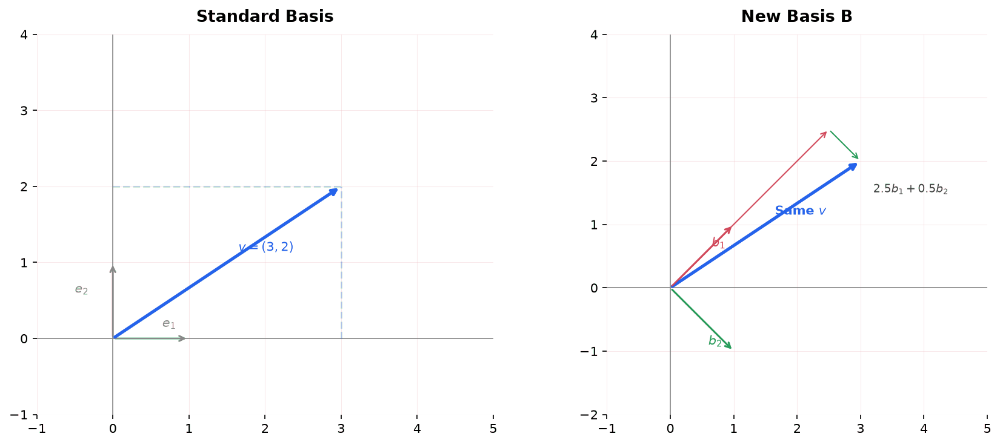
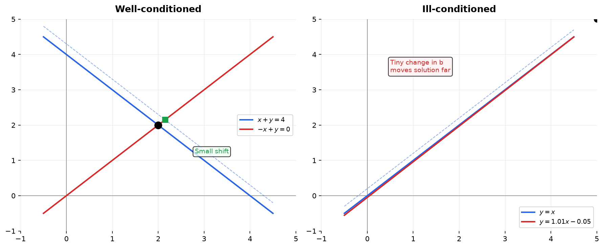
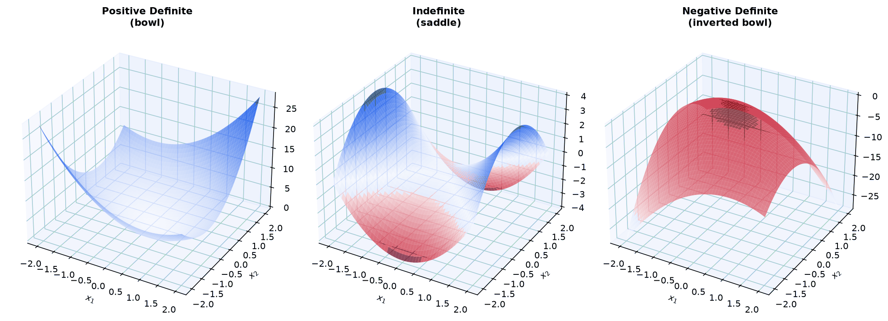
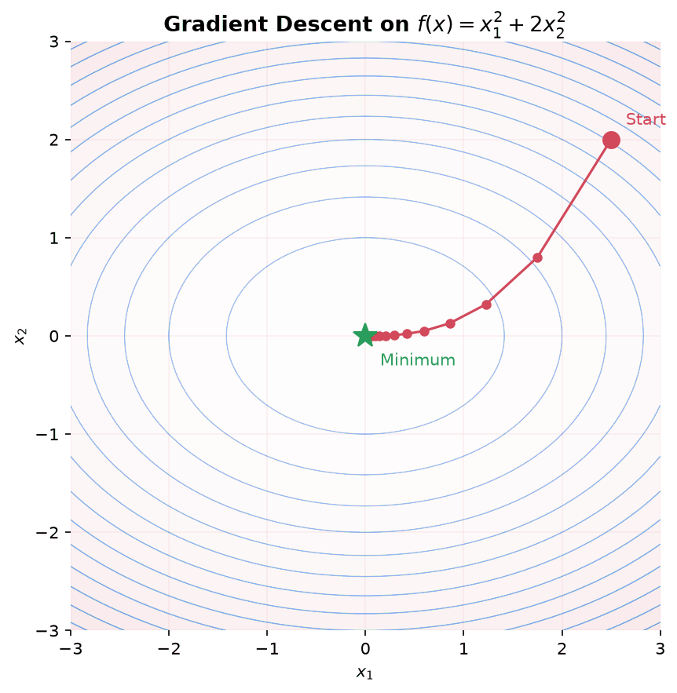

> [!abstract] Prerequisites & where this leads
> **Builds on:** [Linear Algebra Foundations](./linear-algebra-foundations) · [Vectors](./vector)
> **Leads to:** [Optimization](./optimization) · [Statistics](./statistics)

This page builds on [Linear Algebra Foundations](./linear-algebra-foundations) and covers the topics that bridge theory to actual computation: how to measure vectors, how to change perspectives, how to factor matrices for efficient solving, and how to take derivatives of matrix expressions. Each section uses ideas from the ones before it.

## Norms: Measuring Size

We already know how to compute the length of a vector using the distance formula: $\|v\| = \sqrt{v_1^2 + v_2^2}$. A **norm** generalizes this idea. It is any function that takes a vector and returns a single non-negative number representing the vector's "size."

Why do we need more than one way to measure size? Because different problems care about different things. Sometimes you care about the straight-line distance. Sometimes you care about how many components are nonzero. Sometimes you care about the largest component.

### The $L^2$ Norm (Euclidean Norm)

The familiar distance formula. It measures straight-line distance from the origin.

$$
\|v\|_2 = \sqrt{v_1^2 + v_2^2 + \cdots + v_n^2} = \sqrt{\sum_{i=1}^{n} v_i^2}
$$

Equivalently: $\|v\|_2 = \sqrt{v^T v}$

**Example:** $v = \begin{bmatrix} 3 \\ 4 \end{bmatrix}$, then $\|v\|_2 = \sqrt{9 + 16} = 5$

This is the default norm. When someone writes $\|v\|$ without a subscript, they usually mean the $L^2$ norm.

**Where it shows up:** Euclidean distance between points, cost functions in ML (mean squared error), ridge regression penalty.

### The $L^1$ Norm (Manhattan Norm)

Add up the absolute values of all components. It measures distance if you can only travel along grid lines (like walking city blocks in Manhattan).

$$
\|v\|_1 = |v_1| + |v_2| + \cdots + |v_n| = \sum_{i=1}^{n} |v_i|
$$

**Example:** $v = \begin{bmatrix} 3 \\ -4 \end{bmatrix}$, then $\|v\|_1 = 3 + 4 = 7$

**Where it shows up:** Lasso regression (L1 regularization). The L1 norm encourages **sparsity**: it pushes small coefficients to exactly zero, effectively performing feature selection. This happens because the L1 "ball" (the set of all vectors with $\|v\|_1 \leq 1$) has corners, and optimal solutions tend to land on corners where some coordinates are zero.

### The $L^\infty$ Norm (Max Norm)

Take the largest absolute value among all components.

$$
\|v\|_\infty = \max(|v_1|, |v_2|, \ldots, |v_n|)
$$

**Example:** $v = \begin{bmatrix} 3 \\ -4 \end{bmatrix}$, then $\|v\|_\infty = 4$

**Where it shows up:** Worst-case error bounds, game theory (minimax), convergence criteria in iterative algorithms.

### The General $L^p$ Norm

All three norms above are special cases of the $L^p$ norm:

$$
\|v\|_p = \left(\sum_{i=1}^{n} |v_i|^p\right)^{1/p}
$$

- $p = 1$: Manhattan norm
- $p = 2$: Euclidean norm
- $p \to \infty$: Max norm

**Example ($p = 3$).** For $v = \begin{bmatrix} 3 \\ -4 \end{bmatrix}$, $\|v\|_3 = (|3|^3 + |{-4}|^3)^{1/3} = (27 + 64)^{1/3} = 91^{1/3} \approx 4.50$. This sits between $\|v\|_\infty = 4$ and $\|v\|_2 = 5$, illustrating the general ordering $\|v\|_\infty \le \cdots \le \|v\|_2 \le \|v\|_1$ (here $4 \le 4.50 \le 5 \le 7$): larger $p$ weights the biggest component more heavily, shrinking the total toward the max.

### Comparing Norms Visually

The "unit ball" for each norm (the set of all vectors with $\|v\| \leq 1$) has a different shape in 2D:

- **$L^1$:** A diamond (rotated square) with corners at $(1,0)$, $(0,1)$, $(-1,0)$, $(0,-1)$
- **$L^2$:** A circle (the unit circle)
- **$L^\infty$:** A square with corners at $(1,1)$, $(-1,1)$, $(-1,-1)$, $(1,-1)$

These shapes explain why L1 regularization produces sparse solutions: the diamond has sharp corners where coordinates are zero, and optimization tends to find those corners.

Drag a vector below and toggle the unit balls to compare its $L^1$, $L^2$, and $L^\infty$ norms; the $p$-slider morphs the unit ball from the diamond ($p=1$) through the circle ($p=2$) toward the square ($p=\infty$), and $\|v\|_\infty \le \|v\|_2 \le \|v\|_1$ always holds.

<iframe src="/static/interactive/la-norms-explorer.html" width="100%" height="640" style="border:none;"></iframe>

### Properties Every Norm Must Have

Any function $\|\cdot\|$ that qualifies as a norm must satisfy:

1. **Non-negativity:** $\|v\| \geq 0$, and $\|v\| = 0$ only if $v = 0$
2. **Scaling:** $\|cv\| = |c| \cdot \|v\|$ for any scalar $c$
3. **Triangle inequality:** $\|u + v\| \leq \|u\| + \|v\|$

The triangle inequality says that the direct path is never longer than going through an intermediate point. It is why norms behave like "distances."

### Matrix Norms

Norms extend to matrices. The most common is the **Frobenius norm**, which treats the matrix as a long vector and takes the $L^2$ norm:

$$
\|A\|_F = \sqrt{\sum_{i,j} a_{ij}^2} = \sqrt{\text{tr}(A^T A)}
$$

**Example.** For $A = \begin{bmatrix} 2 & 1 \\ 1 & 3 \end{bmatrix}$, $\|A\|_F = \sqrt{2^2 + 1^2 + 1^2 + 3^2} = \sqrt{15} \approx 3.87$.

**Where it shows up:** Measuring how "different" two matrices are, regularization on weight matrices in neural networks.

### Distance Between Vectors

Once you have a norm, you can measure the distance between two vectors:

$$
d(u, v) = \|u - v\|
$$

Different norms give different distance functions. The L2 distance is Euclidean distance. The L1 distance is Manhattan distance. Choosing the right distance metric matters in ML algorithms like k-nearest neighbors and clustering.

**Example.** For $u = \begin{bmatrix} 1 \\ 2 \end{bmatrix}$ and $v = \begin{bmatrix} 4 \\ 6 \end{bmatrix}$, the difference is $u - v = \begin{bmatrix} -3 \\ -4 \end{bmatrix}$, so the L2 (Euclidean) distance is $\sqrt{9 + 16} = 5$ while the L1 (Manhattan) distance is $3 + 4 = 7$.

## Change of Basis

### The Idea

Every vector is written as coordinates relative to some basis. The standard basis for $\mathbb{R}^2$ is $e_1 = \begin{bmatrix} 1 \\ 0 \end{bmatrix}$, $e_2 = \begin{bmatrix} 0 \\ 1 \end{bmatrix}$. When we write $v = \begin{bmatrix} 3 \\ 2 \end{bmatrix}$, we mean $v = 3e_1 + 2e_2$.

But we could use a different basis. If $b_1 = \begin{bmatrix} 1 \\ 1 \end{bmatrix}$ and $b_2 = \begin{bmatrix} 1 \\ -1 \end{bmatrix}$, the same vector $v$ has different coordinates relative to this new basis.

The vector itself has not moved. We are just describing its position using different reference directions.

### Why Change Basis?

Sometimes a problem that looks complicated in the standard basis becomes simple in a different basis.

- **Diagonalization:** If $A = S\Lambda S^{-1}$, then $S$ is a change-of-basis matrix. In the eigenvector basis, $A$ just scales along each axis. A complicated matrix becomes diagonal.
- **PCA:** The principal components are a new basis chosen so that the first axis captures the most variance, the second axis the next most, etc. In this new basis, the data's structure is revealed.
- **Fourier transforms:** The Fourier basis decomposes signals into frequencies. A signal that looks complicated in the time domain becomes simple in the frequency domain.
- **Computer graphics:** Objects are modeled in their own coordinate system (model space), then transformed into camera space, then into screen space. Each transformation is a change of basis.

### The Change-of-Basis Matrix

Suppose we have a new basis $B = \{b_1, b_2, \ldots, b_n\}$ for $\mathbb{R}^n$. Form the matrix $P$ whose columns are the basis vectors:

$$
P = \begin{bmatrix} b_1 & b_2 & \cdots & b_n \end{bmatrix}
$$

If $[v]_B$ represents the coordinates of $v$ in the new basis, then:

$$
v = P [v]_B
$$

This says: the actual vector $v$ (in standard coordinates) equals $P$ times the coordinates in the $B$ basis. To go the other direction:

$$
[v]_B = P^{-1} v
$$

### Example

New basis: $b_1 = \begin{bmatrix} 1 \\ 1 \end{bmatrix}$, $b_2 = \begin{bmatrix} 1 \\ -1 \end{bmatrix}$

$$
P = \begin{bmatrix} 1 & 1 \\ 1 & -1 \end{bmatrix}, \quad P^{-1} = \frac{1}{2}\begin{bmatrix} 1 & 1 \\ 1 & -1 \end{bmatrix}
$$

Find coordinates of $v = \begin{bmatrix} 3 \\ 2 \end{bmatrix}$ in the new basis:

$$
[v]_B = P^{-1}v = \frac{1}{2}\begin{bmatrix} 1 & 1 \\ 1 & -1 \end{bmatrix}\begin{bmatrix} 3 \\ 2 \end{bmatrix} = \begin{bmatrix} 5/2 \\ 1/2 \end{bmatrix}
$$

Check: $\frac{5}{2}\begin{bmatrix} 1 \\ 1 \end{bmatrix} + \frac{1}{2}\begin{bmatrix} 1 \\ -1 \end{bmatrix} = \begin{bmatrix} 3 \\ 2 \end{bmatrix}$ ✓

### How a Linear Transformation Changes Basis

If $A$ is a transformation matrix in the standard basis, its representation in basis $B$ is:

$$
[A]_B = P^{-1} A P
$$

This is exactly the formula for diagonalization: $\Lambda = S^{-1} A S$. Diagonalization is a change of basis to the eigenvector basis, where the transformation becomes just scaling.

### Orthogonal Change of Basis

When the new basis vectors are orthonormal (orthogonal and unit length), $P$ is an **orthogonal matrix**: $P^{-1} = P^T$. This makes everything simpler and numerically stable, because:

- You do not need to compute an inverse (just transpose)
- Lengths and angles are preserved
- No numerical error amplification

This is why orthonormal bases are preferred in practice, which leads to the next topic.

## Gram-Schmidt Orthonormalization

### The Problem

You have a set of linearly independent vectors, but they are not orthogonal. You want an orthonormal basis that spans the same space.

### The Process

**Gram-Schmidt** takes vectors $v_1, v_2, \ldots, v_n$ and produces orthonormal vectors $q_1, q_2, \ldots, q_n$:

**Step 1:** Take the first vector and normalize it:

$$
q_1 = \frac{v_1}{\|v_1\|}
$$

**Step 2:** Subtract from $v_2$ its projection onto $q_1$, then normalize:

$$
u_2 = v_2 - (q_1^T v_2) q_1
$$

$$
q_2 = \frac{u_2}{\|u_2\|}
$$

The subtraction removes the component of $v_2$ that points in the $q_1$ direction, leaving only the part perpendicular to $q_1$.

**Step 3:** Subtract from $v_3$ its projections onto both $q_1$ and $q_2$, then normalize:

$$
u_3 = v_3 - (q_1^T v_3) q_1 - (q_2^T v_3) q_2
$$

$$
q_3 = \frac{u_3}{\|u_3\|}
$$

Continue for all remaining vectors.

### Example

Orthonormalize $v_1 = \begin{bmatrix} 1 \\ 1 \\ 0 \end{bmatrix}$, $v_2 = \begin{bmatrix} 1 \\ 0 \\ 1 \end{bmatrix}$

**Step 1:** $\|v_1\| = \sqrt{2}$, so $q_1 = \frac{1}{\sqrt{2}}\begin{bmatrix} 1 \\ 1 \\ 0 \end{bmatrix}$

**Step 2:** $q_1^T v_2 = \frac{1}{\sqrt{2}}(1 + 0 + 0) = \frac{1}{\sqrt{2}}$

$$
u_2 = \begin{bmatrix} 1 \\ 0 \\ 1 \end{bmatrix} - \frac{1}{\sqrt{2}} \cdot \frac{1}{\sqrt{2}}\begin{bmatrix} 1 \\ 1 \\ 0 \end{bmatrix} = \begin{bmatrix} 1 \\ 0 \\ 1 \end{bmatrix} - \begin{bmatrix} 1/2 \\ 1/2 \\ 0 \end{bmatrix} = \begin{bmatrix} 1/2 \\ -1/2 \\ 1 \end{bmatrix}
$$

$\|u_2\| = \sqrt{1/4 + 1/4 + 1} = \sqrt{3/2}$

$$
q_2 = \frac{1}{\sqrt{3/2}}\begin{bmatrix} 1/2 \\ -1/2 \\ 1 \end{bmatrix} = \frac{1}{\sqrt{6}}\begin{bmatrix} 1 \\ -1 \\ 2 \end{bmatrix}
$$

**Verify orthogonality:** $q_1^T q_2 = \frac{1}{\sqrt{2}} \cdot \frac{1}{\sqrt{6}}(1 - 1 + 0) = 0$ ✓

### Why Gram-Schmidt Matters

Gram-Schmidt is not just a procedure. It is the key idea behind QR factorization, which is how computers actually solve least squares problems.

## Matrix Factorizations

Matrix factorizations (also called decompositions) break a matrix into a product of simpler matrices. This is how linear algebra is actually done on computers. You almost never compute $A^{-1}$ directly; instead, you factor $A$ and use the factors to solve problems efficiently.

### LU Factorization

**What it is:** Factor a square matrix $A$ into a lower triangular matrix $L$ and an upper triangular matrix $U$:

$$
A = LU
$$

**Lower triangular** means all entries above the diagonal are zero. **Upper triangular** means all entries below the diagonal are zero.

$$
\begin{bmatrix} a & b \\ c & d \end{bmatrix} = \begin{bmatrix} 1 & 0 \\ l_{21} & 1 \end{bmatrix} \begin{bmatrix} u_{11} & u_{12} \\ 0 & u_{22} \end{bmatrix}
$$

**Where it comes from:** LU factorization is Gaussian elimination written in matrix form. The matrix $U$ is the row echelon form, and $L$ records the elimination steps.

**How it solves $Ax = b$:** Replace $A$ with $LU$:

$$
LUx = b
$$

Solve in two steps:

1. **Forward substitution:** Solve $Ly = b$ for $y$ (easy, because $L$ is triangular)
2. **Back substitution:** Solve $Ux = y$ for $x$ (easy, because $U$ is triangular)

Triangular systems are fast to solve: just work through the rows one at a time.

**Why not just use $A^{-1}$?** Computing $A^{-1}$ is expensive and numerically unstable. LU factorization is roughly 3x faster and more accurate. Every call to `numpy.linalg.solve(A, b)` uses LU internally.

**The reuse advantage:** Once you have $L$ and $U$, you can solve $Ax = b$ for many different $b$ vectors cheaply. Each new right-hand side only requires the two triangular solves, not a full factorization.

**Example:**

$$
A = \begin{bmatrix} 2 & 1 \\ 6 & 4 \end{bmatrix}
$$

Elimination: subtract 3 times row 1 from row 2:

$$
U = \begin{bmatrix} 2 & 1 \\ 0 & 1 \end{bmatrix}, \quad L = \begin{bmatrix} 1 & 0 \\ 3 & 1 \end{bmatrix}
$$

Check: $LU = \begin{bmatrix} 1 & 0 \\ 3 & 1 \end{bmatrix}\begin{bmatrix} 2 & 1 \\ 0 & 1 \end{bmatrix} = \begin{bmatrix} 2 & 1 \\ 6 & 4 \end{bmatrix} = A$ ✓

**Note:** In practice, row swaps are often needed for numerical stability. This gives $PA = LU$ where $P$ is a permutation matrix. This is called LU factorization with partial pivoting.

### QR Factorization

**What it is:** Factor any $m \times n$ matrix $A$ (with $m \geq n$) into a matrix $Q$ with orthonormal columns and an upper triangular matrix $R$:

$$
A = QR
$$

- $Q$ is $m \times n$ with orthonormal columns ($Q^T Q = I$)
- $R$ is $n \times n$ upper triangular

This is the **reduced** (or thin) QR factorization. There is also a **full** QR factorization in which $Q$ is an $m \times m$ orthogonal matrix and $R$ is $m \times n$ (padded with rows of zeros below the top $n$ rows); the reduced form simply drops the extra columns of $Q$ and the zero rows of $R$.

**Where it comes from:** Gram-Schmidt orthonormalization applied to the columns of $A$. The $Q$ columns are the orthonormalized columns of $A$, and $R$ records the coefficients.

**Worked example (assembling $Q$ and $R$).** Take $A$ whose columns are the two vectors from the [Gram-Schmidt example above](#gram-schmidt-orthonormalization): $A = \begin{bmatrix} 1 & 1 \\ 1 & 0 \\ 0 & 1 \end{bmatrix}$. Gram-Schmidt already produced the orthonormal columns $q_1 = \frac{1}{\sqrt2}\begin{bmatrix}1\\1\\0\end{bmatrix}$ and $q_2 = \frac{1}{\sqrt6}\begin{bmatrix}1\\-1\\2\end{bmatrix}$, so $Q = \begin{bmatrix} q_1 & q_2 \end{bmatrix}$. Since $Q^TQ = I$, the upper-triangular $R = Q^T A$ is just the projections of $A$'s columns onto the $q$'s:

$$
R = \begin{bmatrix} q_1^Tv_1 & q_1^Tv_2 \\ 0 & q_2^Tv_2 \end{bmatrix} = \begin{bmatrix} \sqrt2 & \tfrac{1}{\sqrt2} \\ 0 & \sqrt{3/2} \end{bmatrix}.
$$

The lower-left entry is $0$ because $q_2 \perp v_1$ (that is what Gram-Schmidt guarantees), which is exactly why $R$ comes out upper triangular. Multiplying back, $QR$ reproduces the columns $\begin{bmatrix}1\\1\\0\end{bmatrix}$ and $\begin{bmatrix}1\\0\\1\end{bmatrix}$ of $A$.

**How it solves least squares:** The least squares problem $\min \|Ax - b\|^2$ has the solution:

Using the normal equations: $\hat{x} = (A^T A)^{-1} A^T b$

Using QR: substitute $A = QR$:

$$
R\hat{x} = Q^T b
$$

This is a triangular system, which is easy to solve. No matrix inverse needed.

**Why QR over normal equations?** The normal equations require computing $A^T A$, which squares the condition number (discussed below) and can lose numerical precision. QR avoids this entirely. It is the standard method for least squares in practice.

**Where it shows up:** `numpy.linalg.lstsq` uses QR (or SVD) internally. Linear regression, polynomial fitting, any overdetermined system.

### Cholesky Factorization

**What it is:** For a symmetric positive definite matrix $A$ (defined in the next section), factor it as:

$$
A = LL^T
$$

where $L$ is lower triangular.

This is like LU but exploits the symmetry: you only need one triangular factor instead of two different ones.

**Worked example.** Factor the positive definite $A = \begin{bmatrix} 2 & 1 \\ 1 & 3 \end{bmatrix}$ (the same matrix from the positive-definite section below). Writing $L = \begin{bmatrix} \ell_{11} & 0 \\ \ell_{21} & \ell_{22} \end{bmatrix}$ and matching $LL^T = A$ entry by entry: $\ell_{11}^2 = 2 \Rightarrow \ell_{11} = \sqrt2$; then $\ell_{11}\ell_{21} = 1 \Rightarrow \ell_{21} = \tfrac{1}{\sqrt2}$; and finally $\ell_{21}^2 + \ell_{22}^2 = 3 \Rightarrow \ell_{22} = \sqrt{3 - \tfrac{1}{2}} = \sqrt{5/2}$. So

$$
L = \begin{bmatrix} \sqrt2 & 0 \\ \tfrac{1}{\sqrt2} & \sqrt{5/2} \end{bmatrix}, \qquad LL^T = \begin{bmatrix} 2 & 1 \\ 1 & 3 \end{bmatrix} = A. \checkmark
$$

The factorization succeeded (all the square roots were of positive numbers) precisely because $A$ is positive definite; on an indefinite matrix the algorithm hits a negative number under a square root and fails, which is itself a test for positive definiteness.

**Why it matters:** About 2x faster than LU and guaranteed to be numerically stable (no pivoting needed). Used whenever the matrix is symmetric positive definite, which includes:

- Covariance matrices
- Kernel matrices (Gram matrices)
- The matrix $A^T A$ in normal equations
- Hessians at local minima

**Where it shows up:** Gaussian processes, Kalman filters, sampling from multivariate normal distributions, any time you see $A^T A$.

### Summary: Which Factorization When?

| Factorization | Matrix requirements | Use case |
|---|---|---|
| LU | Square (or close) | Solving $Ax = b$, computing determinants |
| QR | Any shape ($m \geq n$) | Least squares, numerical stability |
| Cholesky | Symmetric positive definite | Fast solving when structure allows |
| Eigendecomposition | Square | Understanding transformations, PCA |
| SVD | Any shape, any rank | Low-rank approximation, pseudoinverse, PCA |

## Positive Definite Matrices

### What They Are

A symmetric matrix $A$ is **positive definite** if for every nonzero vector $x$:

$$
x^T A x > 0
$$

The expression $x^T A x$ is called a **quadratic form**. It takes a vector and produces a single number. Positive definite means this number is always positive, no matter which direction $x$ points (as long as $x \neq 0$).

**Positive semidefinite** means $x^T A x \geq 0$ (allows zero).

### Building Intuition

Think of the quadratic form $f(x) = x^T A x$ as a surface over $\mathbb{R}^n$.

- **Positive definite:** The surface is a bowl opening upward. It has a single global minimum at $x = 0$. Every direction curves up.
- **Negative definite:** The surface is a bowl opening downward. Single global maximum at $x = 0$.
- **Indefinite:** The surface is a saddle. It curves up in some directions and down in others.
- **Positive semidefinite:** A bowl that is flat along some directions (a valley bottom rather than a point bottom).

This directly connects to optimization: a function with a positive definite Hessian is convex (bowl-shaped), so gradient descent will find the global minimum.

### Equivalent Conditions

A symmetric matrix $A$ is positive definite if and only if any one of these holds:

1. $x^T A x > 0$ for all nonzero $x$
2. All eigenvalues of $A$ are positive: $\lambda_i > 0$
3. All pivots in elimination are positive
4. $A$ has a Cholesky factorization $A = LL^T$
5. $A = B^T B$ for some matrix $B$ with independent columns

These are all different windows into the same property.

### Example

$$
A = \begin{bmatrix} 2 & 1 \\ 1 & 3 \end{bmatrix}
$$

**Test via eigenvalues:** $\det(A - \lambda I) = (2-\lambda)(3-\lambda) - 1 = \lambda^2 - 5\lambda + 5 = 0$

$\lambda = \frac{5 \pm \sqrt{5}}{2} \approx 3.62, 1.38$

Both eigenvalues are positive, so $A$ is positive definite.

**Test via quadratic form:**

$$
x^T A x = \begin{bmatrix} x_1 & x_2 \end{bmatrix}\begin{bmatrix} 2 & 1 \\ 1 & 3 \end{bmatrix}\begin{bmatrix} x_1 \\ x_2 \end{bmatrix} = 2x_1^2 + 2x_1 x_2 + 3x_2^2
$$

Can this ever be zero (for nonzero $x$)? Completing the square: $2(x_1 + \frac{1}{2}x_2)^2 + \frac{5}{2}x_2^2$. Both terms are non-negative and cannot both be zero unless $x = 0$. So $x^T A x > 0$ for all nonzero $x$. ✓

### Why Positive Definiteness Matters

**Optimization:** If the Hessian matrix (matrix of second derivatives) is positive definite at a point, that point is a local minimum. If positive definite everywhere, the function is convex and has a unique global minimum. This is the condition that makes gradient descent work reliably.

**Covariance matrices:** The covariance matrix of any dataset is always positive semidefinite. Variance cannot be negative. When it is strictly positive definite, no feature is a perfect linear combination of the others.

**Kernel methods:** A valid kernel function must produce positive semidefinite Gram matrices. This is Mercer's condition, and it guarantees that the kernel corresponds to an inner product in some feature space.

**Numerical stability:** Positive definite matrices are well-behaved numerically. They always have a Cholesky factorization, their eigenvalues are bounded away from zero, and solving systems with them is fast and stable.

## Condition Number

### The Problem

Not all systems $Ax = b$ are equally easy to solve numerically. Some matrices amplify small errors in $b$ into large errors in $x$. Others keep errors under control. The condition number quantifies this.

### Definition

The **condition number** of a matrix $A$ (using the $L^2$ norm) is:

$$
\kappa(A) = \|A\| \cdot \|A^{-1}\| = \frac{\sigma_{\max}}{\sigma_{\min}}
$$

where $\sigma_{\max}$ and $\sigma_{\min}$ are the largest and smallest singular values of $A$.

For symmetric positive definite matrices, this simplifies to:

$$
\kappa(A) = \frac{\lambda_{\max}}{\lambda_{\min}}
$$

### What It Means

The condition number tells you how much a small change in $b$ can be amplified into a change in $x$:

$$
\frac{\|\Delta x\|}{\|x\|} \leq \kappa(A) \cdot \frac{\|\Delta b\|}{\|b\|}
$$

- $\kappa(A) = 1$: Perfect. Orthogonal matrices. Errors in $b$ are not amplified at all.
- $\kappa(A) \approx 1$: Well-conditioned. Safe to solve numerically.
- $\kappa(A) = 10^k$: You lose about $k$ digits of precision when solving. If you have 16 digits of floating-point precision and $\kappa = 10^8$, your answer is only accurate to about 8 digits.
- $\kappa(A) = \infty$: Singular matrix. No unique solution exists.

### Example

$$
A_1 = \begin{bmatrix} 1 & 0 \\ 0 & 1 \end{bmatrix}, \quad \kappa = 1
$$

The identity matrix. No error amplification.

$$
A_2 = \begin{bmatrix} 1 & 0 \\ 0 & 0.001 \end{bmatrix}, \quad \kappa = 1000
$$

The matrix stretches one direction much more than the other. Small perturbations in the nearly-flat direction get amplified by 1000x.

$$
A_3 = \begin{bmatrix} 1 & 1 \\ 1 & 1.0001 \end{bmatrix}, \quad \kappa \approx 40000
$$

The rows are nearly parallel. The system is nearly singular. Tiny changes in $b$ wildly change $x$.

### Why It Matters

**Normal equations:** The condition number of $A^T A$ is $\kappa(A)^2$. If $A$ has $\kappa = 10^4$, then $A^T A$ has $\kappa = 10^8$, losing 8 digits of precision. This is why QR factorization is preferred over normal equations for least squares.

**Iterative solvers:** The condition number determines how fast iterative methods (like conjugate gradient) converge. Worse condition means more iterations.

**Preconditioning:** A common technique is to find a matrix $M \approx A$ that is easy to invert, then solve $M^{-1}Ax = M^{-1}b$ instead. If $M^{-1}A$ has a better condition number, the problem becomes easier.

**Feature scaling in ML:** If features in a dataset have very different scales (e.g., age in years vs. income in dollars), the design matrix has a large condition number, and gradient descent converges slowly. Normalizing features improves the condition number.

## Sparse Matrices

### What They Are

A **sparse matrix** is a matrix where most entries are zero. The opposite is a **dense matrix**, where most entries are nonzero.

In practice, most large matrices that arise in engineering and CS are sparse:

- **Adjacency matrices:** A graph with $n$ nodes has an $n \times n$ adjacency matrix, but each node typically connects to only a few others. Most entries are zero.
- **Finite element meshes:** Each node interacts with its neighbors only.
- **Document-term matrices:** Each document contains only a fraction of all possible words.
- **Neural network layers:** Many modern architectures use sparse connections.

### Why Sparsity Matters

A dense $n \times n$ matrix stores $n^2$ numbers. A sparse matrix with $k$ nonzero entries stores only $k$ numbers (plus their positions). For large problems:

- A dense $100{,}000 \times 100{,}000$ matrix needs 80 GB of memory
- A sparse version with 10 nonzero entries per row needs only 8 MB

Matrix-vector multiplication $Ax$ takes $O(n^2)$ for dense matrices but $O(k)$ for sparse matrices (where $k$ is the number of nonzero entries). This makes problems tractable that would otherwise be impossible.

### Storage Formats

Sparse matrices are not stored as 2D arrays (that would waste memory on all the zeros). Common formats:

**Coordinate (COO):** Store a list of (row, column, value) triples for each nonzero entry. Simple but not efficient for arithmetic.

**Compressed Sparse Row (CSR):** Store all nonzero values in a flat array, with auxiliary arrays indicating where each row starts. Efficient for matrix-vector multiplication and row slicing.

**Compressed Sparse Column (CSC):** Like CSR but organized by columns. Efficient for column operations.

In Python: `scipy.sparse` provides all these formats.

### Sparse Solvers

Standard LU/QR factorization can "fill in" zeros, turning a sparse matrix dense. Sparse solvers use reordering strategies to minimize fill-in, keeping the factors sparse.

**Where it shows up:** Solving PDEs (partial differential equations) in physics and engineering, graph algorithms, recommendation systems, large-scale ML.

## Matrix Calculus

### Why We Need It

Machine learning is fundamentally about optimization: find the parameters that minimize a loss function. The loss function depends on matrices (weight matrices) and vectors (data). To minimize it, we need derivatives with respect to matrices and vectors.

Ordinary calculus gives us derivatives of scalar functions. Matrix calculus extends this to functions involving vectors and matrices.

### Gradient of a Scalar with Respect to a Vector

If $f: \mathbb{R}^n \to \mathbb{R}$ is a scalar-valued function of a vector $x = \begin{bmatrix} x_1 \\ x_2 \\ \vdots \\ x_n \end{bmatrix}$, the **gradient** is:

$$
\nabla_x f = \begin{bmatrix} \frac{\partial f}{\partial x_1} \\ \frac{\partial f}{\partial x_2} \\ \vdots \\ \frac{\partial f}{\partial x_n} \end{bmatrix}
$$

The gradient is a vector that points in the direction of steepest increase of $f$. Its negative points in the direction of steepest decrease, which is why gradient descent updates parameters as:

$$
x_{\text{new}} = x_{\text{old}} - \alpha \nabla_x f
$$

where $\alpha$ is the learning rate.

### Key Gradient Formulas

These come up constantly. Each one takes a scalar function of vectors/matrices and gives its gradient.

**Linear function:** $f(x) = a^T x$

$$
\nabla_x (a^T x) = a
$$

The gradient of a linear function is constant, which makes sense: a linear function has the same slope everywhere.

**Quadratic form:** $f(x) = x^T A x$ (where $A$ is symmetric)

$$
\nabla_x (x^T A x) = 2Ax
$$

Setting this to zero gives $Ax = 0$. When $A$ is invertible (for example, positive definite), the only solution is $x = 0$, so that is the unique critical point of the quadratic form. If $A$ is singular (for example, only positive semidefinite), then $Ax = 0$ has nonzero solutions, and every vector in the null space of $A$ is also a critical point.

**Squared norm:** $f(x) = \|x\|^2 = x^T x$

$$
\nabla_x (x^T x) = 2x
$$

This is the special case of the quadratic form with $A = I$.

**Least squares loss:** $f(x) = \|Ax - b\|^2 = (Ax - b)^T(Ax - b)$

$$
\nabla_x \|Ax - b\|^2 = 2A^T(Ax - b)
$$

Setting this to zero: $A^T A x = A^T b$, which are the normal equations. This is how the least squares formula $\hat{x} = (A^T A)^{-1} A^T b$ is derived.

**Worked example (evaluating the formulas).** Take $A = \begin{bmatrix} 2 & 1 \\ 1 & 3 \end{bmatrix}$ (symmetric), $a = \begin{bmatrix} 2 \\ 3 \end{bmatrix}$, and evaluate the gradients at $x = \begin{bmatrix} 1 \\ 1 \end{bmatrix}$:

- $\nabla(a^Tx) = a = \begin{bmatrix} 2 \\ 3 \end{bmatrix}$ (constant, independent of $x$).
- $\nabla(x^Tx) = 2x = \begin{bmatrix} 2 \\ 2 \end{bmatrix}$.
- $\nabla(x^TAx) = 2Ax = 2\begin{bmatrix} 2(1)+1(1) \\ 1(1)+3(1) \end{bmatrix} = 2\begin{bmatrix} 3 \\ 4 \end{bmatrix} = \begin{bmatrix} 6 \\ 8 \end{bmatrix}$.

The last one checks against differentiating $x^TAx = 2x_1^2 + 2x_1x_2 + 3x_2^2$ directly: $\frac{\partial}{\partial x_1} = 4x_1 + 2x_2 = 6$ and $\frac{\partial}{\partial x_2} = 2x_1 + 6x_2 = 8$ at $(1,1)$, matching $2Ax = (6, 8)$. ✓

### The Jacobian

If $f: \mathbb{R}^n \to \mathbb{R}^m$ is a vector-valued function (it takes a vector and returns a vector), the **Jacobian** is the $m \times n$ matrix of all partial derivatives:

$$
J = \begin{bmatrix}
\frac{\partial f_1}{\partial x_1} & \frac{\partial f_1}{\partial x_2} & \cdots & \frac{\partial f_1}{\partial x_n} \\
\frac{\partial f_2}{\partial x_1} & \frac{\partial f_2}{\partial x_2} & \cdots & \frac{\partial f_2}{\partial x_n} \\
\vdots & \vdots & \ddots & \vdots \\
\frac{\partial f_m}{\partial x_1} & \frac{\partial f_m}{\partial x_2} & \cdots & \frac{\partial f_m}{\partial x_n}
\end{bmatrix}
$$

Row $i$ of the Jacobian is the gradient of $f_i$. The Jacobian is the natural generalization of the derivative to vector functions.

**Example:** $f(x) = Ax$ where $A$ is a constant matrix.

$$
J = A
$$

A linear transformation is its own Jacobian, just as a linear function $f(x) = mx$ has derivative $m$.

### The Hessian

The **Hessian** of a scalar function $f: \mathbb{R}^n \to \mathbb{R}$ is the $n \times n$ matrix of second partial derivatives:

$$
H = \begin{bmatrix}
\frac{\partial^2 f}{\partial x_1^2} & \frac{\partial^2 f}{\partial x_1 \partial x_2} & \cdots \\
\frac{\partial^2 f}{\partial x_2 \partial x_1} & \frac{\partial^2 f}{\partial x_2^2} & \cdots \\
\vdots & \vdots & \ddots
\end{bmatrix}
$$

The Hessian is always symmetric (assuming continuous second derivatives). It is the Jacobian of the gradient.

**Connection to positive definiteness:** At a critical point (where $\nabla f = 0$):

- If $H$ is positive definite: local minimum (bowl curves up in every direction)
- If $H$ is negative definite: local maximum
- If $H$ is indefinite: saddle point
- If $H$ is positive semidefinite: inconclusive (need higher-order information)

**Example:** $f(x) = x^T A x$ where $A$ is symmetric.

Gradient: $\nabla f = 2Ax$

Hessian: $H = 2A$

So $f$ is convex (has a unique minimum) if and only if $A$ is positive definite. This connects quadratic forms, positive definiteness, and optimization into a single story.

### The Chain Rule for Vectors

If $f = g(h(x))$ where $h: \mathbb{R}^n \to \mathbb{R}^m$ and $g: \mathbb{R}^m \to \mathbb{R}^p$, then:

$$
\frac{\partial f}{\partial x} = \frac{\partial g}{\partial h} \cdot \frac{\partial h}{\partial x}
$$

This is matrix multiplication of Jacobians. The chain rule is what makes backpropagation work: each layer's Jacobian is multiplied by the downstream gradient to propagate gradients backward through the network.

**In a neural network:** Layer $l$ computes $h_l = \sigma(W_l h_{l-1} + b_l)$. The gradient of the loss with respect to $W_l$ requires the chain rule through every subsequent layer. Backpropagation is just the chain rule applied systematically from output to input, reusing intermediate results.

## Markov Chains

### What They Are

A **Markov chain** is a system that transitions between states, where the probability of the next state depends only on the current state (not the history). This "memoryless" property is called the **Markov property**.

### Transition Matrix

The transition probabilities are encoded in a **stochastic matrix** $P$, where entry $P_{ij}$ is the probability of moving from state $j$ to state $i$.

Each column of $P$ sums to 1 (probabilities must add up). All entries are non-negative.

**Example:** Weather model with two states (sunny, rainy):

$$
P = \begin{bmatrix} 0.8 & 0.4 \\ 0.2 & 0.6 \end{bmatrix}
$$

Column 1: If today is sunny, 80% chance tomorrow is sunny, 20% chance tomorrow is rainy.
Column 2: If today is rainy, 40% chance tomorrow is sunny, 60% chance tomorrow is rainy.

### State Evolution

If $x_0$ is the initial state distribution (a probability vector), then after one step:

$$
x_1 = Px_0
$$

After $k$ steps:

$$
x_k = P^k x_0
$$

This is just repeated matrix-vector multiplication.

**Worked example (stepping the chain).** Start certain that today is sunny, $x_0 = \begin{bmatrix} 1 \\ 0 \end{bmatrix}$, and apply the weather matrix $P = \begin{bmatrix} 0.8 & 0.4 \\ 0.2 & 0.6 \end{bmatrix}$ repeatedly:

$$
x_1 = Px_0 = \begin{bmatrix} 0.8 \\ 0.2 \end{bmatrix}, \quad x_2 = Px_1 = \begin{bmatrix} 0.72 \\ 0.28 \end{bmatrix}, \quad x_3 = Px_2 = \begin{bmatrix} 0.688 \\ 0.312 \end{bmatrix}, \quad \ldots
$$

The distribution marches toward $\begin{bmatrix} 2/3 \\ 1/3 \end{bmatrix} \approx \begin{bmatrix} 0.667 \\ 0.333 \end{bmatrix}$, the steady state computed next, and it would approach the *same* limit from any starting distribution.

### Steady State (Stationary Distribution)

A **steady state** $\pi$ is a probability vector that does not change under the transition:

$$
P\pi = \pi
$$

Set a transition matrix below, then step the chain and watch the distribution converge to this stationary $\pi$ (marked in red) regardless of where it starts, for a regular chain. The absorbing and periodic presets show the two ways convergence can fail.

<iframe src="/static/interactive/la-markov-chain.html" width="100%" height="660" style="border:none;"></iframe>

This is an eigenvalue problem! The steady state is the eigenvector of $P$ corresponding to eigenvalue $\lambda = 1$.

For the weather example:

$P\pi = \pi$ gives $0.8\pi_1 + 0.4\pi_2 = \pi_1$ and $\pi_1 + \pi_2 = 1$.

Solving: $\pi = \begin{bmatrix} 2/3 \\ 1/3 \end{bmatrix}$

In the long run, it is sunny 2/3 of the time, regardless of the starting weather.

### Connection to Eigenvalues

For a stochastic matrix:

- There is always an eigenvalue $\lambda = 1$
- All other eigenvalues satisfy $|\lambda| \leq 1$
- The rate of convergence to steady state depends on the second-largest eigenvalue $|\lambda_2|$. Smaller $|\lambda_2|$ means faster convergence.

### Where Markov Chains Show Up

**PageRank:** The web is modeled as a Markov chain where each page is a state and links are transitions. The steady-state distribution gives the page rankings. Google's original algorithm is an eigenvector computation on a massive stochastic matrix.

**Hidden Markov Models (HMMs):** The states are hidden, and you observe noisy outputs. Used in speech recognition, bioinformatics, and natural language processing.

**MCMC (Markov Chain Monte Carlo):** Construct a Markov chain whose steady state is a desired probability distribution. Used for sampling from complex distributions in Bayesian ML.

**Reinforcement learning:** State transitions in an environment are often modeled as Markov chains (or Markov decision processes when actions are involved).
