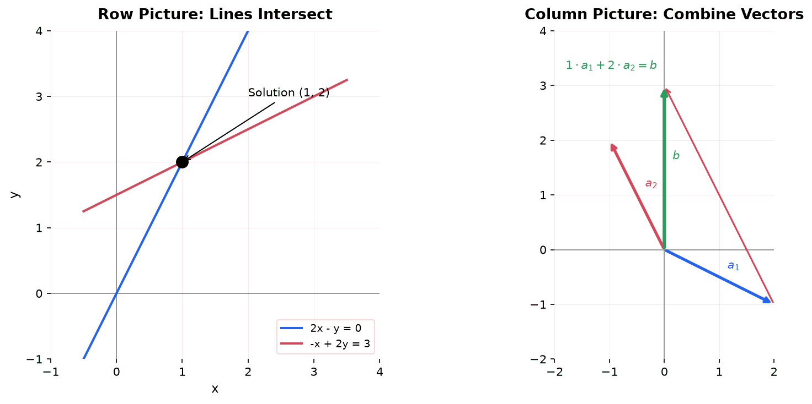
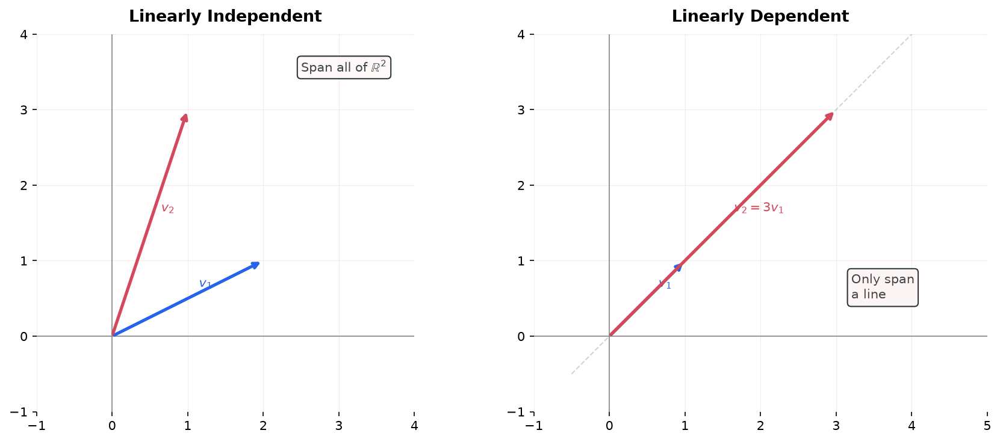
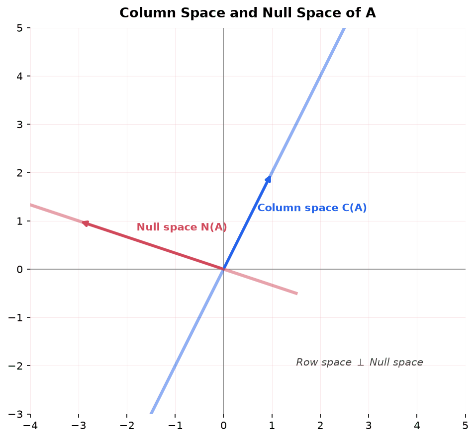
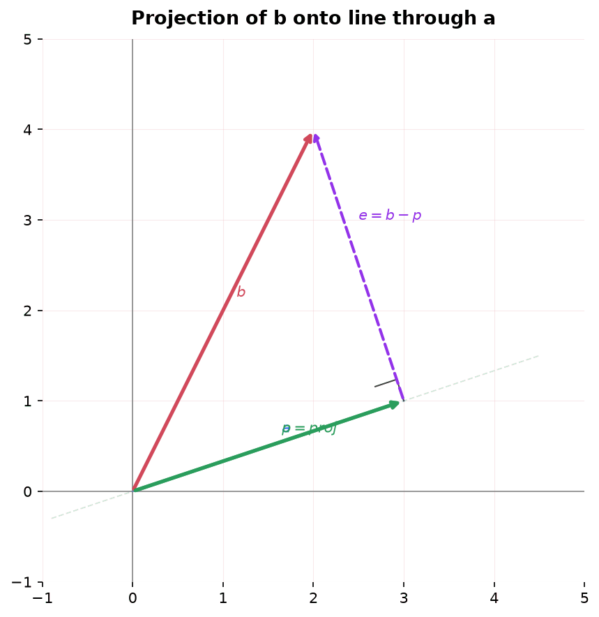
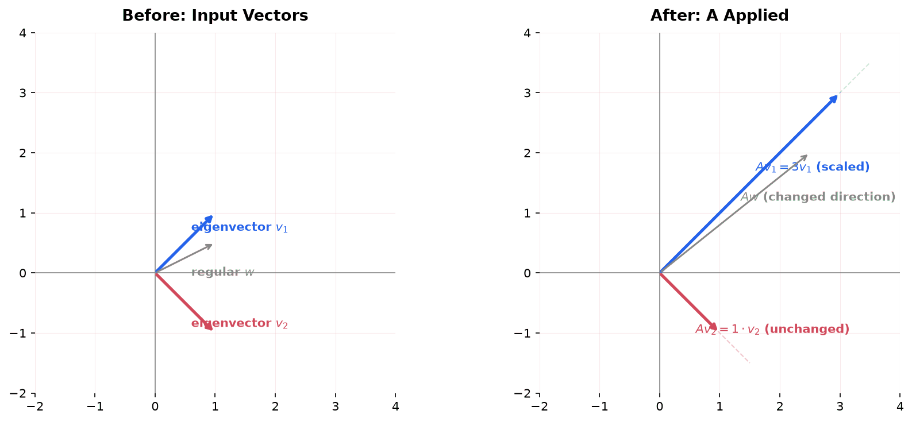
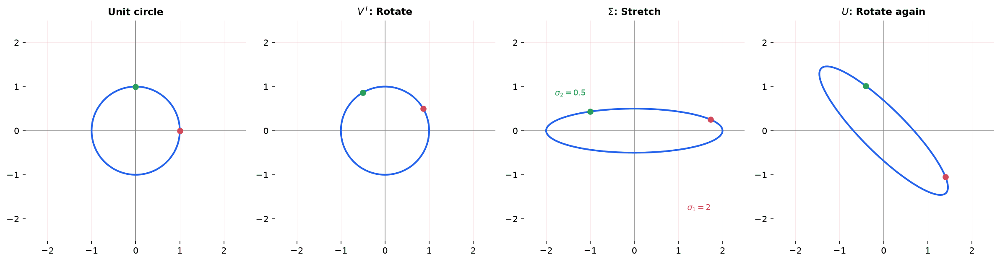

Linear algebra is the study of vectors, vector spaces, and linear transformations. It provides the language and tools for understanding systems of linear equations, data transformations, and optimization, making it the mathematical backbone of machine learning.

## Row Vectors vs Column Vectors

Before diving in, one convention to get straight. A vector can be written two ways:

**Column vector** (vertical): $\begin{bmatrix} 2 \\ -1 \\ 3 \end{bmatrix}$ . This is 3 rows and 1 column.

**Row vector** (horizontal): $\begin{bmatrix} 2 & -1 & 3 \end{bmatrix}$ . This is 1 row and 3 columns.

Same numbers, same order. The difference is orientation, and orientation determines how the vector interacts with matrices.

### Matrices Are Made of Both

A matrix can be read as a stack of row vectors (reading horizontally) or as a set of column vectors side by side (reading vertically). Both descriptions give the same matrix:

$$
A = \begin{bmatrix} 2 & -1 \\ -1 & 2 \end{bmatrix}
$$

**Reading the rows** (left to right):
- Row 1: $\begin{bmatrix} 2 & -1 \end{bmatrix}$ (a row vector)
- Row 2: $\begin{bmatrix} -1 & 2 \end{bmatrix}$ (a row vector)

**Reading the columns** (top to bottom):
- Column 1: $\begin{bmatrix} 2 \\ -1 \end{bmatrix}$ (a column vector)
- Column 2: $\begin{bmatrix} -1 \\ 2 \end{bmatrix}$ (a column vector)

This is not just notation. It matters because different operations use different slices of the matrix. When you solve $Ax = b$:

- The **row picture** reads $A$ as rows. Each row is one equation. Each equation defines a line (or plane, or hyperplane). The solution is where they intersect.
- The **column picture** reads $A$ as columns. Each column is a vector. The solution tells you how much of each column vector to combine to reach $b$.

Both views are explained in detail later on this page.

### Where Each Shows Up

**Column vectors go on the right of a matrix:** $Ax$. The matrix acts on the column vector. This is the standard setup. When someone writes $Ax = b$, both $x$ and $b$ are column vectors.

**Row vectors go on the left of a matrix:** $y^T A$. The row vector acts on the matrix from the other side. This shows up less often but becomes important for the left null space and for gradients.

### Transpose: Flipping Between Them

**The transpose** $T$ flips a column vector into a row vector and vice versa. If $x = \begin{bmatrix} 2 \\ 3 \end{bmatrix}$ is a column vector, then $x^T = \begin{bmatrix} 2 & 3 \end{bmatrix}$ is the same numbers written as a row vector.

For matrices, transpose flips rows and columns: row 1 becomes column 1, row 2 becomes column 2, etc.

**The dot product** of two column vectors $u$ and $v$ is written $u^T v$: you transpose the first one into a row, then multiply. The result is a single number (a scalar):

$$
u^T v = \begin{bmatrix} u_1 & u_2 \end{bmatrix} \begin{bmatrix} v_1 \\ v_2 \end{bmatrix} = u_1 v_1 + u_2 v_2
$$

### The Default Convention

**Convention in these notes and in most of linear algebra:** vectors are columns by default. When someone writes "let $v$ be a vector in $\mathbb{R}^n$," they mean a column vector with $n$ entries. If a row vector is needed, it will be written explicitly as $v^T$.

## From Systems of Equations to $Ax = b$

### Systems as Separate Equations

A system of linear equations is a collection of equations that must all be satisfied simultaneously. For example:

$$
\begin{cases}
2x - y = 0 \\
-x + 2y = 3
\end{cases}
$$

Each equation relates the same unknowns ($x$ and $y$) through addition, subtraction, and multiplication by constants. The goal is to find values of $x$ and $y$ that make both equations true at the same time.

### Packaging the System into a Matrix Equation

Rather than writing each equation separately, we can collect the coefficients, unknowns, and right-hand sides into matrices and vectors.

**Step 1: Extract the coefficients into a matrix $A$.** Each row of $A$ holds the coefficients from one equation:

$$
A = \begin{bmatrix} 2 & -1 \\ -1 & 2 \end{bmatrix}
$$

The first row $[2, -1]$ comes from $2x - y$. The second row $[-1, 2]$ comes from $-x + 2y$.

**But we can also read $A$ by columns.** Each column collects one variable's coefficient from every equation:

- Column 1 = $\begin{bmatrix} 2 \\ -1 \end{bmatrix}$: the $x$ coefficient in equation 1 is 2; the $x$ coefficient in equation 2 is -1. This column is "what $x$ does in every equation."
- Column 2 = $\begin{bmatrix} -1 \\ 2 \end{bmatrix}$: the $y$ coefficient in equation 1 is -1; the $y$ coefficient in equation 2 is 2. This column is "what $y$ does in every equation."

To see this, mark the coefficients in the original equations:

$$
\begin{cases}
\boxed{2}\,x + (-1)\,y = 0 \\
\boxed{-1}\,x + (2)\,y = 3
\end{cases}
$$

Read the boxed numbers top to bottom: $2, -1$. That is column 1. Now read the unboxed coefficients top to bottom: $-1, 2$. That is column 2.

So **rows = equations** and **columns = variables**. This is the key to understanding the row picture vs column picture later on this page: the row picture looks at one equation at a time, while the column picture looks at one variable at a time.

**Step 2: Collect the unknowns into a vector $x$:**

$$
x = \begin{bmatrix} x \\ y \end{bmatrix}
$$

**Step 3: Collect the right-hand sides into a vector $b$:**

$$
b = \begin{bmatrix} 0 \\ 3 \end{bmatrix}
$$

**Step 4: Write the system as a single equation:**

$$
Ax = b
$$

which expands to:

$$
\begin{bmatrix} 2 & -1 \\ -1 & 2 \end{bmatrix} \begin{bmatrix} x \\ y \end{bmatrix} = \begin{bmatrix} 0 \\ 3 \end{bmatrix}
$$

When you carry out the matrix-vector multiplication (each row of $A$ dotted with $x$), you get back the original two equations:

- Row 1: $2x + (-1)y = 0$, which is $2x - y = 0$
- Row 2: $(-1)x + 2y = 3$, which is $-x + 2y = 3$

So $Ax = b$ is not a new concept. It is a compact way of writing the same system of equations using matrices and vectors.

### Why Bother with Matrix Form?

Writing $Ax = b$ instead of listing separate equations has several advantages:

- **Generality:** The same notation works whether you have 2 equations or 2,000. You do not need to write out every equation.
- **Computation:** Matrix operations can be implemented efficiently on computers. Libraries like NumPy operate directly on $Ax = b$.
- **Deeper understanding:** The matrix form reveals structure that is invisible when staring at individual equations. The rest of this page explores that structure.

### The General Case

For a system with $m$ equations and $n$ unknowns:

$$
\begin{cases}
a_{11}x_1 + a_{12}x_2 + \cdots + a_{1n}x_n = b_1 \\
a_{21}x_1 + a_{22}x_2 + \cdots + a_{2n}x_n = b_2 \\
\vdots \\
a_{m1}x_1 + a_{m2}x_2 + \cdots + a_{mn}x_n = b_m
\end{cases}
$$

This becomes $Ax = b$ where $A$ is $m \times n$, $x$ is $n \times 1$, and $b$ is $m \times 1$.

The system does not need to be square. You can have more equations than unknowns ($m > n$, overdetermined) or more unknowns than equations ($m < n$, underdetermined). The matrix form handles all cases uniformly.

## Three Views of $Ax = b$

Now that we know what $Ax = b$ means, we can look at it from different angles. Gilbert Strang's central insight is that the same equation can be understood in fundamentally different ways, and each view reveals different information.

### The Row Picture

In the row picture, each row of $A$ defines one equation, and each equation defines a geometric object: a line in 2D, a plane in 3D, a hyperplane in higher dimensions. The solution is the point where all these objects intersect.

**Example:** Using the same system:

$$
\begin{cases}
2x - y = 0 \\
-x + 2y = 3
\end{cases}
$$

Each equation defines a line in the $xy$-plane. The first line passes through the origin with slope 2. The second line has slope 1/2 and y-intercept 3/2. They intersect at $(1, 2)$.

This is how most people first learn to think about systems of equations: draw the lines, find where they cross.

### The Column Picture

The row picture looks at $A$ horizontally: each row is one equation. The column picture looks at $A$ vertically: each column is a vector.

**What is a column vector?** Look at the matrix $A$:

$$
A = \begin{bmatrix} 2 & -1 \\ -1 & 2 \end{bmatrix}
$$

It has two columns. Read them top to bottom:

- First column: $\begin{bmatrix} 2 \\ -1 \end{bmatrix}$. This is a vector that points 2 units in the x-direction and -1 unit in the y-direction.
- Second column: $\begin{bmatrix} -1 \\ 2 \end{bmatrix}$. This is a vector that points -1 unit in the x-direction and 2 units in the y-direction.

These are just arrows on the coordinate plane. Nothing more.

**Now the key idea.** When you compute the matrix-vector product $Ax$, you are not really doing "row times column" (even though that gives the right numbers). You are actually taking the first column, scaling it by the first unknown, taking the second column, scaling it by the second unknown, and adding the results:

$$
Ax = x \cdot \text{(column 1)} + y \cdot \text{(column 2)}
$$

Written out:

$$
x \begin{bmatrix} 2 \\ -1 \end{bmatrix} + y \begin{bmatrix} -1 \\ 2 \end{bmatrix} = \begin{bmatrix} 0 \\ 3 \end{bmatrix}
$$

So the equation $Ax = b$ is really asking: **how much of each column vector do I need to add together to reach $b$?**

Think of it like mixing colors. Column 1 is one color, column 2 is another. The unknowns $x$ and $y$ are the amounts you mix. The right-hand side $b$ is the target color. "Solving $Ax = b$" means finding the recipe.

**For this example:** The answer is $x = 1$, $y = 2$. Take 1 copy of the first column plus 2 copies of the second column:

$$
1 \begin{bmatrix} 2 \\ -1 \end{bmatrix} + 2 \begin{bmatrix} -1 \\ 2 \end{bmatrix} = \begin{bmatrix} 2 - 2 \\ -1 + 4 \end{bmatrix} = \begin{bmatrix} 0 \\ 3 \end{bmatrix} = b \quad \checkmark
$$

**The geometry is completely different from the row picture.** In the row picture, you drew lines and found their intersection. In the column picture, you have arrows (the columns) and you are stretching and adding them to land on a target point. Same answer, different way of seeing it.

### Why the Column Picture Matters

The column picture leads directly to the most important questions in linear algebra:

- **Can we solve $Ax = b$?** Only if $b$ is a linear combination of the columns of $A$. The set of all such reachable $b$ vectors is the **column space**.
- **Is the solution unique?** Only if the columns are linearly independent. If they are dependent, there are multiple ways to combine them to reach $b$.
- **What if $b$ is not reachable?** Then we look for the closest reachable vector, which leads to **least squares** and **projection**, the foundation of linear regression in ML.

### The Matrix Picture

A third perspective: treat $Ax = b$ as a single matrix equation. The matrix $A$ acts as a **function** (a linear transformation) that takes the input vector $x$ and produces the output vector $b$.

Solving the system means finding the input that produces a desired output.

This view connects linear algebra to functions, transformations, and ultimately to neural networks, where each layer applies a linear transformation followed by a nonlinearity.

## Linear Combinations

**Linear Combination:** A linear combination of vectors $v_1, v_2, \ldots, v_n$ is any expression of the form:

$$
c_1 v_1 + c_2 v_2 + \cdots + c_n v_n
$$

where $c_1, c_2, \ldots, c_n$ are scalars.

**Example:** Given $v_1 = \begin{bmatrix} 1 \\ 0 \end{bmatrix}$ and $v_2 = \begin{bmatrix} 0 \\ 1 \end{bmatrix}$:

- $3v_1 + 2v_2 = \begin{bmatrix} 3 \\ 2 \end{bmatrix}$ is a linear combination
- $-v_1 + 4v_2 = \begin{bmatrix} -1 \\ 4 \end{bmatrix}$ is a linear combination
- Every vector in $\mathbb{R}^2$ can be written as a linear combination of $v_1$ and $v_2$

Linear combinations are the single most important operation in linear algebra. Matrix-vector multiplication $Ax$ is a linear combination of the columns of $A$ weighted by the entries of $x$.

## Span

**Span:** The span of a set of vectors is the set of all possible linear combinations of those vectors.

$$
\text{Span}(v_1, v_2, \ldots, v_n) = \{c_1 v_1 + c_2 v_2 + \cdots + c_n v_n \mid c_1, \ldots, c_n \in \mathbb{R}\}
$$

**Examples:**

- A single nonzero vector in $\mathbb{R}^2$ spans a line through the origin
- Two non-parallel vectors in $\mathbb{R}^2$ span all of $\mathbb{R}^2$
- Two parallel vectors in $\mathbb{R}^2$ only span a line (adding the second vector adds nothing new)
- Three vectors in $\mathbb{R}^3$ span all of $\mathbb{R}^3$ if they are not coplanar

The span of the columns of a matrix $A$ is the column space of $A$. This is the set of all vectors $b$ for which $Ax = b$ has a solution.

## Linear Independence

**Linear Independence:** Vectors $v_1, v_2, \ldots, v_n$ are linearly independent if the only solution to:

$$
c_1 v_1 + c_2 v_2 + \cdots + c_n v_n = 0
$$

is the trivial solution $c_1 = c_2 = \cdots = c_n = 0$.

If any nontrivial solution exists (some $c_i \neq 0$), the vectors are **linearly dependent**, meaning at least one vector can be written as a combination of the others.

**Geometric intuition:**

- Two vectors are linearly dependent if they are parallel (one is a scaled version of the other)
- Three vectors in $\mathbb{R}^3$ are linearly dependent if they all lie in the same plane
- $n + 1$ vectors in $\mathbb{R}^n$ are always linearly dependent

**Example:** Are $v_1 = \begin{bmatrix} 1 \\ 2 \end{bmatrix}$ and $v_2 = \begin{bmatrix} 3 \\ 6 \end{bmatrix}$ independent?

No. $v_2 = 3v_1$, so $3v_1 - v_2 = 0$ gives a nontrivial solution. They are dependent (both point in the same direction).

**Why it matters for ML:** In a dataset, linearly dependent features are redundant. If one feature is a linear combination of others, it adds no new information. This connects to dimensionality reduction and feature selection.

## Vector Spaces and Subspaces

### Vector Space

**Vector Space:** A vector space $V$ over the real numbers is a set of objects (called vectors) with two operations, addition and scalar multiplication, that satisfy these axioms:

1. **Closure under addition:** $u + v \in V$ for all $u, v \in V$
2. **Closure under scalar multiplication:** $cv \in V$ for all $c \in \mathbb{R}$, $v \in V$
3. **Additive identity:** There exists $0 \in V$ such that $v + 0 = v$
4. **Additive inverse:** For each $v$, there exists $-v$ such that $v + (-v) = 0$
5. **Commutativity:** $u + v = v + u$
6. **Associativity:** $(u + v) + w = u + (v + w)$ and $c(dv) = (cd)v$
7. **Distributivity:** $c(u + v) = cu + cv$ and $(c + d)v = cv + dv$
8. **Scalar identity:** $1v = v$

**Key examples of vector spaces:**

- $\mathbb{R}^n$: all vectors with $n$ real components
- The set of all $m \times n$ matrices
- The set of all polynomials of degree $\leq n$
- The set of all continuous functions on an interval

### Subspace

**Subspace:** A subspace is a subset of a vector space that is itself a vector space. A subset $S$ of $V$ is a subspace if and only if:

1. The zero vector is in $S$
2. $S$ is closed under addition: if $u, v \in S$, then $u + v \in S$
3. $S$ is closed under scalar multiplication: if $v \in S$ and $c \in \mathbb{R}$, then $cv \in S$

**Quick test:** If a subset does not contain the zero vector, it is not a subspace.

**Examples of subspaces of $\mathbb{R}^3$:**
- $\{0\}$ (just the origin)
- Any line through the origin
- Any plane through the origin
- All of $\mathbb{R}^3$

**Non-examples:**
- A line not through the origin (fails: $0$ not in the set)
- The positive quadrant $\{(x, y) : x \geq 0, y \geq 0\}$ (fails: not closed under scalar multiplication by negative numbers)

## Basis and Dimension

### Basis

**Basis:** A basis for a vector space $V$ is a set of vectors that:

1. **Spans** $V$ (every vector in $V$ can be written as a linear combination of basis vectors)
2. Is **linearly independent** (no vector in the set is redundant)

A basis is the minimal spanning set, or equivalently, the maximal independent set.

**Standard basis for $\mathbb{R}^n$:**

$$
e_1 = \begin{bmatrix} 1 \\ 0 \\ \vdots \\ 0 \end{bmatrix}, \quad e_2 = \begin{bmatrix} 0 \\ 1 \\ \vdots \\ 0 \end{bmatrix}, \quad \ldots, \quad e_n = \begin{bmatrix} 0 \\ 0 \\ \vdots \\ 1 \end{bmatrix}
$$

But the standard basis is not the only basis. Any $n$ linearly independent vectors in $\mathbb{R}^n$ form a basis.

**Example:** $\left\{\begin{bmatrix} 1 \\ 1 \end{bmatrix}, \begin{bmatrix} 1 \\ -1 \end{bmatrix}\right\}$ is also a basis for $\mathbb{R}^2$.

Every vector in $\mathbb{R}^2$ can be uniquely expressed as a combination: $\begin{bmatrix} 3 \\ 1 \end{bmatrix} = 2\begin{bmatrix} 1 \\ 1 \end{bmatrix} + 1\begin{bmatrix} 1 \\ -1 \end{bmatrix}$.

### Dimension

**Dimension:** The dimension of a vector space is the number of vectors in any basis.

- $\dim(\mathbb{R}^n) = n$
- A line through the origin in $\mathbb{R}^3$ has dimension 1
- A plane through the origin in $\mathbb{R}^3$ has dimension 2
- $\{0\}$ has dimension 0

**Key theorem:** Every basis for a given vector space has the same number of vectors.

## The Four Fundamental Subspaces

This is the heart of Strang's approach to linear algebra. Given an $m \times n$ matrix $A$, there are four subspaces that completely describe its behavior.

### Column Space $C(A)$

**Column Space:** The set of all linear combinations of the columns of $A$. It is a subspace of $\mathbb{R}^m$.

$$
C(A) = \{Ax : x \in \mathbb{R}^n\} = \text{Span}(\text{columns of } A)
$$

The column space answers: **which right-hand sides $b$ allow $Ax = b$ to be solved?**

$Ax = b$ has a solution if and only if $b \in C(A)$.

**Example:**

$$
A = \begin{bmatrix} 1 & 3 \\ 2 & 6 \end{bmatrix}
$$

The second column is 3 times the first. The column space is just the line through $\begin{bmatrix} 1 \\ 2 \end{bmatrix}$. Only vectors $b$ on this line allow $Ax = b$ to be solved.

**Dimension:** $\dim(C(A)) = r$ (the rank of $A$)

### Null Space $N(A)$

**Null Space (Kernel):** The set of all vectors $x$ that $A$ sends to zero.

$$
N(A) = \{x \in \mathbb{R}^n : Ax = 0\}
$$

The null space answers: **what are the "hidden" solutions?** If $x_p$ is one solution to $Ax = b$, then $x_p + x_n$ is also a solution for any $x_n \in N(A)$.

**Example:**

$$
A = \begin{bmatrix} 1 & 3 \\ 2 & 6 \end{bmatrix}
$$

$Ax = 0$ gives $x_1 + 3x_2 = 0$, so $x_1 = -3x_2$. The null space is all multiples of $\begin{bmatrix} -3 \\ 1 \end{bmatrix}$.

**Dimension:** $\dim(N(A)) = n - r$ (number of free variables)

### Row Space $C(A^T)$

**Row Space:** The set of all linear combinations of the rows of $A$ (equivalently, the column space of $A^T$). It is a subspace of $\mathbb{R}^n$.

$$
C(A^T) = \text{Span}(\text{rows of } A)
$$

**Dimension:** $\dim(C(A^T)) = r$ (same rank as column space)

Row reduction does not change the row space. The nonzero rows of the echelon form give a basis for the row space.

### Left Null Space $N(A^T)$

**Left Null Space:** The set of all vectors $y$ such that $A^T y = 0$, or equivalently $y^T A = 0$.

$$
N(A^T) = \{y \in \mathbb{R}^m : A^T y = 0\}
$$

**Dimension:** $\dim(N(A^T)) = m - r$

### The Fundamental Theorem of Linear Algebra

For an $m \times n$ matrix $A$ of rank $r$:

| Subspace | Lives in | Dimension |
|---|---|---|
| Column space $C(A)$ | $\mathbb{R}^m$ | $r$ |
| Null space $N(A)$ | $\mathbb{R}^n$ | $n - r$ |
| Row space $C(A^T)$ | $\mathbb{R}^n$ | $r$ |
| Left null space $N(A^T)$ | $\mathbb{R}^m$ | $m - r$ |

**The key relationships (Part 2 of the theorem):**

- The row space and null space are **orthogonal complements** in $\mathbb{R}^n$: every vector in $\mathbb{R}^n$ can be uniquely decomposed into a row-space component and a null-space component
- The column space and left null space are **orthogonal complements** in $\mathbb{R}^m$

This means $\mathbb{R}^n$ splits cleanly into two perpendicular subspaces: the row space (dimension $r$) and the null space (dimension $n - r$). The matrix $A$ maps the row space onto the column space, and collapses the null space to zero.

**Dimension check:** $r + (n - r) = n$ and $r + (m - r) = m$. The dimensions always add up.

## Rank

**Rank:** The rank of a matrix is the dimension of its column space (equivalently, the dimension of its row space).

$$
\text{rank}(A) = \dim(C(A)) = \dim(C(A^T))
$$

The rank equals the number of pivots in the echelon form.

**Rank tells you everything about solvability:**

| Condition | Meaning |
|---|---|
| $r = m = n$ | $A$ is invertible, $Ax = b$ has exactly one solution for every $b$ |
| $r = m < n$ | Every $b$ has a solution (infinitely many, since null space is nontrivial) |
| $r = n < m$ | $Ax = b$ has at most one solution (zero or one, depending on $b$) |
| $r < m$ and $r < n$ | Not every $b$ has a solution, and when one exists there are infinitely many |

**Full rank:** A matrix has full rank when $r = \min(m, n)$, meaning it has as many pivots as possible.

## Linear Transformations

**Linear Transformation:** A function $T: V \to W$ between vector spaces is linear if:

1. $T(u + v) = T(u) + T(v)$ for all $u, v \in V$
2. $T(cv) = cT(v)$ for all $c \in \mathbb{R}$, $v \in V$

Equivalently: $T(c_1 v_1 + c_2 v_2) = c_1 T(v_1) + c_2 T(v_2)$

**Every linear transformation from $\mathbb{R}^n$ to $\mathbb{R}^m$ can be represented as multiplication by an $m \times n$ matrix.**

To find the matrix: apply $T$ to each standard basis vector. The outputs become the columns of the matrix.

$$
A = \begin{bmatrix} T(e_1) & T(e_2) & \cdots & T(e_n) \end{bmatrix}
$$

**Examples of linear transformations in $\mathbb{R}^2$:**

**Rotation by angle $\theta$:**

$$
R_\theta = \begin{bmatrix} \cos\theta & -\sin\theta \\ \sin\theta & \cos\theta \end{bmatrix}
$$

**Reflection across the x-axis:**

$$
\begin{bmatrix} 1 & 0 \\ 0 & -1 \end{bmatrix}
$$

**Scaling by factor $k$:**

$$
\begin{bmatrix} k & 0 \\ 0 & k \end{bmatrix}
$$

**Projection onto the x-axis:**

$$
\begin{bmatrix} 1 & 0 \\ 0 & 0 \end{bmatrix}
$$

**Why this matters for ML:** A neural network layer computes $\sigma(Wx + b)$, where $W$ is a matrix (linear transformation), $b$ is a bias (translation), and $\sigma$ is a nonlinear activation. Without the nonlinearity, stacking layers would just be matrix multiplication: $W_2(W_1 x) = (W_2 W_1)x$, which collapses to a single linear transformation. The nonlinearity is what gives depth its power.

## Orthogonality

### Orthogonal Vectors

Two vectors $u$ and $v$ are **orthogonal** if their dot product is zero:

$$
u \cdot v = u^T v = 0
$$

Orthogonal vectors are perpendicular. They share no component in common.

### Orthogonal Subspaces

Two subspaces $S$ and $T$ are orthogonal if every vector in $S$ is orthogonal to every vector in $T$.

The four fundamental subspaces give two pairs of orthogonal subspaces:

- Row space $\perp$ Null space (in $\mathbb{R}^n$)
- Column space $\perp$ Left null space (in $\mathbb{R}^m$)

### Projection onto a Subspace

**Projection** is the operation of finding the closest point in a subspace to a given vector.

**Projection onto a line (1D subspace):** To project vector $b$ onto the line through vector $a$:

$$
p = \frac{a^T b}{a^T a} a
$$

**Projection onto a subspace:** To project $b$ onto the column space of $A$:

$$
p = A(A^T A)^{-1} A^T b
$$

The matrix $P = A(A^T A)^{-1} A^T$ is the **projection matrix**. It has the properties:

- $P^2 = P$ (projecting twice gives the same result)
- $P^T = P$ (symmetric)

**Why this matters for ML:** When $Ax = b$ has no solution (the usual case with real data, where you have more equations than unknowns), the best approximation is to project $b$ onto the column space and solve $Ax = Pb$ instead. This gives the **least squares** solution:

$$
\hat{x} = (A^T A)^{-1} A^T b
$$

This is exactly the formula for linear regression.

## Determinants

**Determinant:** The determinant of a square matrix is a scalar that encodes whether the matrix is invertible and how it scales volumes.

**For 2×2:**

$$
\det \begin{bmatrix} a & b \\ c & d \end{bmatrix} = ad - bc
$$

**For 3×3 (cofactor expansion along first row):**

$$
\det \begin{bmatrix} a & b & c \\ d & e & f \\ g & h & i \end{bmatrix} = a(ei - fh) - b(di - fg) + c(dh - eg)
$$

**Geometric interpretation:**

- In 2D: $|\det(A)|$ is the area of the parallelogram formed by the column vectors
- In 3D: $|\det(A)|$ is the volume of the parallelepiped formed by the column vectors
- If $\det(A) < 0$, the transformation reverses orientation (like a mirror reflection)
- If $\det(A) = 0$, the transformation collapses space into a lower dimension

**Key properties:**

- $\det(AB) = \det(A) \cdot \det(B)$
- $\det(A^T) = \det(A)$
- $\det(A^{-1}) = 1 / \det(A)$
- $\det(cA) = c^n \det(A)$ for an $n \times n$ matrix
- $A$ is invertible if and only if $\det(A) \neq 0$

## Eigenvalues and Eigenvectors

### The Core Idea

**Eigenvector:** A nonzero vector $v$ is an eigenvector of matrix $A$ if $A$ acts on it by simply scaling it:

$$
Av = \lambda v
$$

The scalar $\lambda$ is the corresponding **eigenvalue**.

Most vectors change direction when multiplied by a matrix. Eigenvectors are special: they keep pointing in the same direction (or flip 180° if $\lambda < 0$). The matrix only stretches or shrinks them.

### Finding Eigenvalues

Rearrange $Av = \lambda v$ to $(A - \lambda I)v = 0$. For a nonzero $v$ to exist, the matrix $(A - \lambda I)$ must be singular:

$$
\det(A - \lambda I) = 0
$$

This is the **characteristic equation**. It is a polynomial of degree $n$ in $\lambda$, so an $n \times n$ matrix has $n$ eigenvalues (counting multiplicity, possibly complex).

### Finding Eigenvectors

For each eigenvalue $\lambda$, find the null space of $(A - \lambda I)$. The nonzero vectors in this null space are the eigenvectors.

### Example

$$
A = \begin{bmatrix} 4 & 1 \\ 2 & 3 \end{bmatrix}
$$

**Step 1:** Characteristic equation:

$$
\det(A - \lambda I) = \det \begin{bmatrix} 4-\lambda & 1 \\ 2 & 3-\lambda \end{bmatrix} = (4-\lambda)(3-\lambda) - 2 = \lambda^2 - 7\lambda + 10 = 0
$$

$$
(\lambda - 5)(\lambda - 2) = 0
$$

Eigenvalues: $\lambda_1 = 5$, $\lambda_2 = 2$

**Step 2:** Eigenvector for $\lambda_1 = 5$:

$$
(A - 5I)v = \begin{bmatrix} -1 & 1 \\ 2 & -2 \end{bmatrix}v = 0
$$

This gives $v_1 = v_2$, so $v_1 = \begin{bmatrix} 1 \\ 1 \end{bmatrix}$ (or any scalar multiple).

**Step 3:** Eigenvector for $\lambda_2 = 2$:

$$
(A - 2I)v = \begin{bmatrix} 2 & 1 \\ 2 & 1 \end{bmatrix}v = 0
$$

This gives $2v_1 + v_2 = 0$, so $v_2 = \begin{bmatrix} 1 \\ -2 \end{bmatrix}$.

### Eigendecomposition (Diagonalization)

If $A$ has $n$ linearly independent eigenvectors, it can be factored as:

$$
A = S \Lambda S^{-1}
$$

Where:
- $S$ is the matrix whose columns are the eigenvectors
- $\Lambda$ is the diagonal matrix of eigenvalues

**Power of diagonalization:** $A^k = S \Lambda^k S^{-1}$, and $\Lambda^k$ is trivial to compute (just raise each diagonal entry to the $k$th power).

### Properties

- The sum of eigenvalues equals the trace: $\lambda_1 + \lambda_2 + \cdots + \lambda_n = \text{tr}(A)$
- The product of eigenvalues equals the determinant: $\lambda_1 \cdot \lambda_2 \cdots \lambda_n = \det(A)$
- Real symmetric matrices always have real eigenvalues and orthogonal eigenvectors
- If $A$ is symmetric, $A = Q \Lambda Q^T$ where $Q$ is orthogonal ($Q^{-1} = Q^T$), known as the **spectral theorem**

### Why Eigenvalues Matter for ML

- **Principal Component Analysis (PCA):** Find the eigenvectors of the covariance matrix. The eigenvectors with the largest eigenvalues are the directions of greatest variance in the data. Project onto those directions to reduce dimensionality.
- **Google PageRank:** The ranking vector is the dominant eigenvector of the web link matrix.
- **Stability of dynamical systems:** Eigenvalues determine whether a system converges, diverges, or oscillates.
- **Singular Value Decomposition (SVD):** Generalizes eigendecomposition to non-square matrices.

## Singular Value Decomposition (SVD)

**SVD:** Every $m \times n$ matrix $A$ (any shape, any rank) can be factored as:

$$
A = U \Sigma V^T
$$

Where:
- $U$ is $m \times m$ orthogonal (columns are left singular vectors)
- $\Sigma$ is $m \times n$ diagonal (entries are singular values $\sigma_1 \geq \sigma_2 \geq \cdots \geq 0$)
- $V$ is $n \times n$ orthogonal (columns are right singular vectors)

### Relationship to Eigendecomposition

- The columns of $V$ are eigenvectors of $A^T A$
- The columns of $U$ are eigenvectors of $AA^T$
- The singular values $\sigma_i = \sqrt{\lambda_i}$ where $\lambda_i$ are eigenvalues of $A^T A$

### Geometric Interpretation

$A$ acts on a vector in three steps:
1. $V^T$ rotates the input (change of basis)
2. $\Sigma$ stretches along each axis by the singular values
3. $U$ rotates the output (another change of basis)

Every linear transformation is a rotation, followed by a stretch, followed by another rotation.

### Low-Rank Approximation

The SVD reveals the "importance" of each component. The best rank-$k$ approximation to $A$ is:

$$
A_k = \sum_{i=1}^{k} \sigma_i u_i v_i^T
$$

This keeps only the $k$ largest singular values and their associated vectors.

**Why this matters for ML:**
- **Dimensionality reduction:** truncated SVD is the mathematical basis for PCA
- **Recommendation systems:** approximate a sparse user-item matrix with a low-rank factorization
- **Image compression:** keep only the top singular values to compress an image
- **Noise reduction:** small singular values often correspond to noise; discarding them denoises the data
- **Pseudoinverse:** $A^+ = V \Sigma^+ U^T$ generalizes the inverse to non-square and singular matrices
