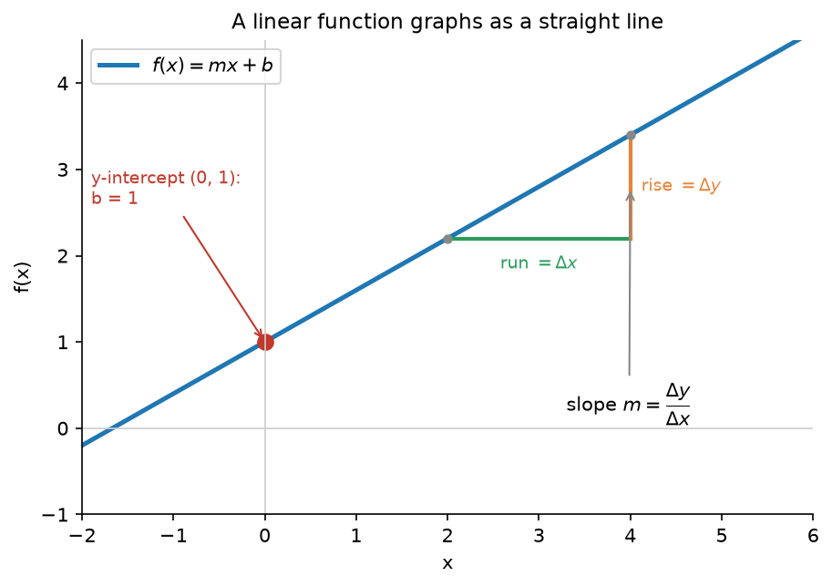

## Why Linear Functions?

Linear functions are the simplest and most important type of function, and they show up everywhere. Any time a quantity changes at a steady, predictable rate, a linear function describes it.

### What "Constant Rate of Change" Means

Imagine you are driving on a highway at exactly 60 miles per hour. After 1 hour you have gone 60 miles, after 2 hours 120 miles, after 3 hours 180 miles. The distance increases by the same amount (60 miles) for every hour that passes. That steady increase is a **constant rate of change**.

If you plotted your distance on a graph (time on the horizontal axis, distance on the vertical axis), you would see a perfectly straight line. The steepness of that line tells you your speed. A faster speed means a steeper line; a slower speed means a flatter line.

### The Visual Intuition

Every linear function, when graphed, produces a **straight line**. This is the defining visual feature. If a graph curves, bends, or changes direction, the function is not linear. Conversely, any function whose graph is a straight line can be written as a linear equation.

### Why Start Here?

Linear functions are the foundation for almost all of mathematics. Calculus uses them to approximate curves at every point (tangent lines). Statistics uses them to find trends in data (lines of best fit). Physics uses them whenever a quantity changes at a constant rate. Mastering linear functions makes every later topic easier.

## Definition

**Linear Functions:** A linear function is a function that can be used
to express a constant rate of change.

*This constant rate of change is reflected in the function's slope,
which remains the same regardless of the interval over which it is
measured.*

Linear functions have a maximum degree of 1.

In the standard sense, a linear function has degree exactly 1 (a nonzero slope). A nonzero constant function (degree 0) is a boundary case: its graph is still a straight line, but it is sometimes excluded from the definition. The rest of this page assumes the non-constant case unless noted otherwise.

When graphed, a linear function will create a straight line.

## Linear Equation Forms

### Slope-Intercept Form

**Slope-Intercept Form**

$$f(x) = mx + b$$

- $f(x)$ (or $y$) is the output or dependent variable.
- $x$ is the input or independent variable.
- $m$ is the slope of the line, representing the constant rate of change.
- $b$ is the $y$-intercept, representing the value of $f(x)$ when $x = 0$.

### Calculating Slope

**Calculating Slope:**

The slope, or rate of change, of a function *m* can be calculated
according to the following:

$$m = \frac{y_2 - y_1}{x_2 - x_1} = \frac{\Delta y}{\Delta x}$$

Where $(x_1, y_1)$ and $(x_2, y_2)$ are two distinct points on the line.

### Standard Form

**Standard Form:**

$$Ax + By = C$$

Where $A$, $B$, $C$ are real numbers and $A$ and $B$ are not both zero.

Why use standard form?

The standard form of a line can be particularly helpful when solving a
system of equations. For instance, when using the elimination method to
solve a system of equations, we can easily align the variables using
standard form.

### Point-Slope Form

**Point-Slope Form:**

$$y - y_1 = m(x - x_1)$$

Where $(x_1, y_1)$ is a known point on the line and $m$ is the slope.

### Domain and Range

**Domain and Range of Linear Functions:**

- **Domain:** $(-\infty, \infty)$ or $\mathbb{R}$ (all real numbers)
- **Range:** $(-\infty, \infty)$ or $\mathbb{R}$ (all real numbers)

A linear function (that is not constant) is defined for all real numbers and can output all real numbers.

### Finding Intercepts

**x-intercept (zero):**

To find the x-intercept, set $f(x) = 0$ and solve for $x$:

$$0 = mx + b$$

$$
x = -\frac{b}{m}
$$

(provided $m \neq 0$)

**y-intercept:**

To find the y-intercept, set $x = 0$:

$$f(0) = m(0) + b = b$$

The y-intercept is simply the constant term $b$ in slope-intercept form.

## Writing Equations from Conditions

Often you are not given an equation directly but instead given information (points, slope, relationship to another line) from which you must construct one. The strategy is always the same: find the slope $m$, find a point on the line, then use point-slope form.

### Given Two Points

**Problem:** Find the equation of the line through $(2, 5)$ and $(4, 11)$.

**Step 1.** Find the slope:

$$
m = \frac{11 - 5}{4 - 2} = \frac{6}{2} = 3
$$

**Step 2.** Use point-slope form with either point (we'll use $(2, 5)$):

$$
y - 5 = 3(x - 2)
$$

**Step 3.** Simplify to slope-intercept form:

$$
y = 3x - 6 + 5 = 3x - 1
$$

### Given a Point and Slope

**Problem:** Find the equation of the line with slope $m = -2$ passing through $(3, 7)$.

Use point-slope form directly:

$$
y - 7 = -2(x - 3)
$$

$$
y = -2x + 6 + 7 = -2x + 13
$$

### Given Parallel to a Line Through a Point

**Problem:** Find the equation of the line parallel to $y = 3x - 1$ passing through $(2, 4)$.

**Key idea:** Parallel lines have the same slope, so $m = 3$.

Use point-slope form:

$$
y - 4 = 3(x - 2)
$$

$$
y = 3x - 6 + 4 = 3x - 2
$$

### Given Perpendicular to a Line Through a Point

**Problem:** Find the equation of the line perpendicular to $y = 2x + 5$ passing through $(6, 1)$.

**Key idea:** Perpendicular lines have slopes that are negative reciprocals. The original slope is $2$, so the perpendicular slope is $m = -\frac{1}{2}$.

Use point-slope form:

$$
y - 1 = -\frac{1}{2}(x - 6)
$$

$$
y = -\frac{1}{2}x + 3 + 1 = -\frac{1}{2}x + 4
$$

## Parallel Lines

**Parallel Lines:** Two distinct lines are parallel if and only if they have the same slope.

$$
m_1 = m_2
$$

Parallel lines never intersect. In a [system of linear equations](./systems-of-linear-equations), two parallel lines mean the system has no solution (the system is inconsistent).

## Perpendicular Lines

**Perpendicular Lines:** Two lines are perpendicular if and only if the product of their slopes is $-1$ (equivalently, their slopes are negative reciprocals of each other).

$$
m_1 \cdot m_2 = -1 \quad \Longleftrightarrow \quad m_2 = -\frac{1}{m_1}
$$

Note: a horizontal line ($m = 0$) and a vertical line (undefined slope) are perpendicular, but this case is not captured by the formula above.

## Horizontal and Vertical Lines

### Horizontal Lines

**Horizontal Line:** A line of the form $y = k$, where $k$ is a constant.

- Slope: $m = 0$ (no rise, only run)
- Every point on the line has the same $y$-coordinate
- It IS a function (passes the vertical line test)
- Domain: $(-\infty, \infty)$; Range: $\{k\}$

**Example:** The line $y = 4$ passes through $(0, 4)$, $(3, 4)$, $(-2, 4)$, and every other point with $y$-coordinate $4$.

### Vertical Lines

**Vertical Line:** A line of the form $x = k$, where $k$ is a constant.

- Slope: undefined (there is rise but zero run, so $\Delta y / \Delta x$ has a zero denominator)
- Every point on the line has the same $x$-coordinate
- It is NOT a function (fails the vertical line test: one input maps to infinitely many outputs)
- Domain: $\{k\}$; Range: $(-\infty, \infty)$

**Example:** The line $x = -3$ passes through $(-3, 0)$, $(-3, 5)$, $(-3, -7)$, and every other point with $x$-coordinate $-3$.

## Direct Variation

**Direct Variation:** A relationship where $y$ varies directly as $x$ (or "$y$ is directly proportional to $x$") means

$$
y = kx
$$

where $k$ is the **constant of variation** (or constant of proportionality). Equivalently, the ratio $y/x = k$ is constant for all points in the relationship.

Graphically, direct variation is a linear function that passes through the origin (the $y$-intercept is $0$).

**Worked Example:** If $y = 12$ when $x = 3$, find $y$ when $x = 7$.

**Step 1.** Find $k$:

$$
k = \frac{y}{x} = \frac{12}{3} = 4
$$

**Step 2.** Write the variation equation: $y = 4x$.

**Step 3.** Substitute $x = 7$:

$$
y = 4(7) = 28
$$

### Inverse Variation

**Inverse Variation:** $y$ varies inversely as $x$ means

$$
y = \frac{k}{x}
$$

Equivalently, the product $xy = k$ is constant. As $x$ increases, $y$ decreases (and vice versa). The graph is a hyperbola, not a line. See [Rational Functions](./rational-functions) for more on this shape.

### Joint and Combined Variation

**Joint Variation:** $z$ varies jointly as $x$ and $y$ means $z = kxy$.

**Combined Variation:** Combines direct and inverse variation. For example, "$z$ varies directly as $x$ and inversely as $y$" means $z = \frac{kx}{y}$.

## Modeling with Linear Functions

Linear functions are natural models for any situation where a quantity changes at a constant rate. The slope and $y$-intercept always have real-world interpretations.

### Cost Functions

Many cost structures have a fixed component and a per-unit component:

$$
C(x) = mx + b
$$

where $m$ is the **variable cost** (cost per unit) and $b$ is the **fixed cost** (cost regardless of production).

**Example:** A manufacturer has fixed costs of \$500 per month and each item costs \$8 to produce. The cost function is $C(x) = 8x + 500$. The slope $8$ means each additional unit costs \$8. The $y$-intercept $500$ means costs are \$500 even if nothing is produced.

### Temperature Conversion

The relationship between Fahrenheit and Celsius is linear:

$$
F = \frac{9}{5}C + 32
$$

The slope $\frac{9}{5}$ means each degree Celsius corresponds to $1.8$ degrees Fahrenheit. The $y$-intercept $32$ means $0°C = 32°F$.

### Depreciation

An asset that loses value at a constant rate is modeled by a linear function.

**Example:** A machine purchased for \$20{,}000 depreciates by \$2{,}500 per year. Its value after $t$ years is

$$
V(t) = -2500t + 20000
$$

The slope $-2500$ represents the annual loss in value. Setting $V(t) = 0$ gives $t = 8$, so the machine is fully depreciated after 8 years.

### Interpreting Slope and Intercept in Context

Whenever you build a linear model, always ask:

- **What does the slope mean?** It is the rate of change: the amount the output changes for each one-unit increase in the input.
- **What does the $y$-intercept mean?** It is the output value when the input is zero. In some models this has a natural interpretation; in others (e.g., predicting weight from height) it may not be physically meaningful.

## Connections

Linear functions are the simplest case of [polynomial functions](./polynomial-functions) (degree 1). They are also the building blocks of [Systems of Linear Equations](./systems-of-linear-equations), where multiple linear equations are solved simultaneously.

In [Calculus](./calculus), the derivative of a linear function $f(x) = mx + b$ is simply its slope: $f'(x) = m$. More broadly, calculus uses linear functions (tangent lines) to approximate any differentiable function at a point, which is the foundation of differential calculus.

