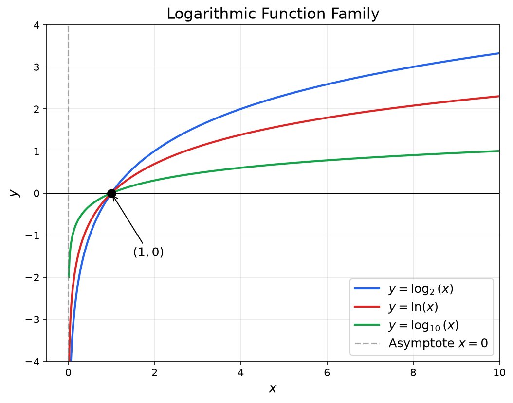
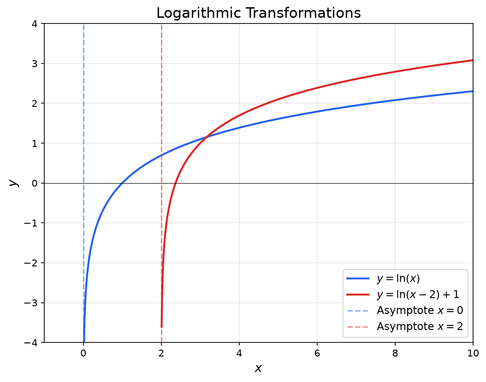
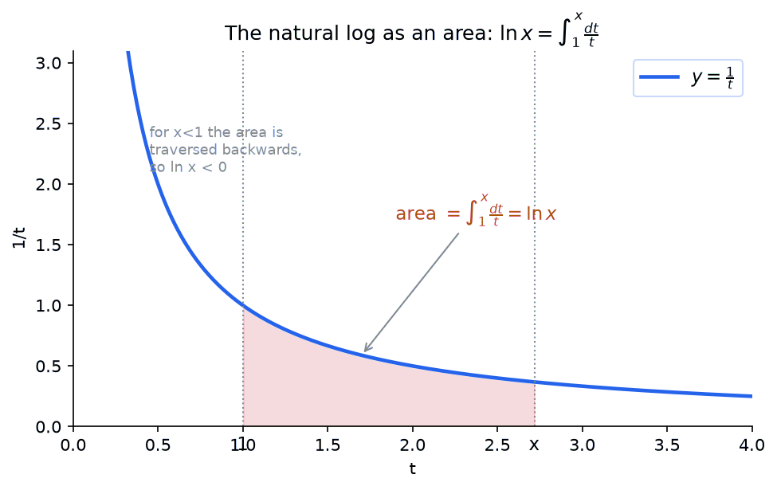

## The Problem Logarithms Solve

Consider a simple question: **2 to what power gives 8?** You can figure this out by trying: $2^1 = 2$, $2^2 = 4$, $2^3 = 8$. The answer is 3.

Now consider a harder question: **10 to what power gives 500?** The answer is not a whole number, and trial-and-error will not find it easily. We need a name and a notation for this operation, and that is exactly what a **logarithm** provides.

$$\log_{10}(500) \approx 2.699$$

This tells us $10^{2.699} \approx 500$.

> [!abstract] Prerequisites & where this leads
> **Builds on:** [Exponential Functions](./exponential-functions) · [Functions & Relations](./functions-relations)
> **Leads to:** [Calculus](./calculus) · [Information Theory](./information-theory)

### Why We Need Logarithms

We already have notation for exponentiation: $b^n = x$ means "multiply $b$ by itself $n$ times to get $x$." But what if you know $b$ and $x$, and want to find $n$? That reverse question comes up constantly. How many years until an investment doubles? How many half-lives until a substance is 1% of its original amount? Logarithms answer these questions.

### Connection to Exponentials

A logarithm is the **inverse** of an exponential function. "Inverse" here means it undoes exponentiation, just as subtraction undoes addition or division undoes multiplication.

Here is a concrete example showing both directions:

$$2^3 = 8 \qquad \Longleftrightarrow \qquad \log_2(8) = 3$$

The exponential asks: "2 raised to the 3rd power gives what?" (Answer: 8.)
The logarithm asks: "2 raised to what power gives 8?" (Answer: 3.)

With this motivation, here is the formal definition.

## Definition

**Logarithm:** A logarithm is the inverse of an exponential function. It answers the question: "To what exponent must we raise the base to get a certain number?"

Let $a \in \mathbb{R}$, $a > 0$, $a \neq 1$

$$\log_a : (0,\infty) \rightarrow \mathbb{R}$$

$$\forall x \in \mathbb{R}, \forall y \in (0,\infty), \quad y = a^x \Longleftrightarrow x = \log_a(y)$$

In words: If $y = a^x$, then $x = \log_a(y)$

**Example:** $2^3 = 8 \Longleftrightarrow \log_2(8) = 3$

### Explore the Inverse Relationship

Because a logarithm undoes an exponential, the graph of $y = \log_b(x)$ (read "y equals log base b of x") is the mirror image of $y = b^x$ (read "y equals b to the x") across the line $y = x$. The widget below makes that reflection concrete: drag the point on either curve and watch its partner appear at the swapped coordinates. Change the base $b$ with the slider, and use the lower panel to check the log laws numerically for values of $x$, $y$, and $k$ that you choose.

<iframe src="/static/interactive/log-explorer.html" width="100%" height="580" style="border:none;"></iframe>

## Common Logarithms

### Natural Logarithm (ln)

**Natural Logarithm:** The logarithm with base $e$ (Euler's number, approximately 2.71828).

$$\ln(x) = \log_e(x)$$

The natural logarithm is the inverse of $e^x$.

### Common Logarithm (log)

**Common Logarithm:** The logarithm with base 10. Often written as $\log(x)$ without a base specified.

$$\log(x) = \log_{10}(x)$$

The common logarithm is the inverse of $10^x$.

### Binary Logarithm (lg)

**Binary Logarithm:** The logarithm with base 2. Common in computer science.

$$\lg(x) = \log_2(x)$$

The binary logarithm is the inverse of $2^x$.

## Fundamental Properties

### Product Rule

$$\log_a(xy) = \log_a(x) + \log_a(y)$$

The logarithm of a product is the sum of the logarithms.

**Example:** $\log_2(8 \cdot 4) = \log_2(8) + \log_2(4) = 3 + 2 = 5$

### Quotient Rule

$$\log_a\left(\frac{x}{y}\right) = \log_a(x) - \log_a(y)$$

The logarithm of a quotient is the difference of the logarithms.

**Example:** $\log_2\left(\frac{8}{4}\right) = \log_2(8) - \log_2(4) = 3 - 2 = 1$

### Power Rule

$$\log_a(x^n) = n \cdot \log_a(x)$$

The logarithm of a power is the exponent times the logarithm of the base.

**Example:** $\log_2(8^2) = 2 \cdot \log_2(8) = 2 \cdot 3 = 6$

### Change of Base Formula

$$\log_a(x) = \frac{\log_b(x)}{\log_b(a)}$$

This allows converting between different logarithm bases. Particularly useful for converting to natural or common logarithms for calculator use.

**Example:** $\log_2(8) = \frac{\ln(8)}{\ln(2)} = \frac{2.079}{0.693} \approx 3$

#### Why the Change of Base Formula Works

The formula is not a trick; it follows directly from the definition of a logarithm. Start with the equation you want to solve:

$$a^y = x$$

where $y = \log_a(x)$ is the unknown. Take $\log_b$ of both sides (for any valid base $b$):

$$\log_b(a^y) = \log_b(x)$$

Apply the power rule on the left side:

$$y \cdot \log_b(a) = \log_b(x)$$

Solve for $y$:

$$y = \frac{\log_b(x)}{\log_b(a)}$$

Since $y = \log_a(x)$, we have the change of base formula.

#### Practical Use

Most calculators only have $\ln$ and $\log_{10}$ buttons. To compute a logarithm in any other base, use the formula with whichever base your calculator supports.

**Example:** Compute $\log_3(50)$.

$$\log_3(50) = \frac{\ln 50}{\ln 3} = \frac{3.912}{1.099} \approx 3.561$$

This tells us $3^{3.561} \approx 50$.

**Example:** Compute $\log_5(200)$.

$$\log_5(200) = \frac{\log_{10}(200)}{\log_{10}(5)} = \frac{2.301}{0.699} \approx 3.292$$

### Reciprocal and Base-Swap Identities

Two more identities follow directly from the rules above and are worth naming.

**Reciprocal of the argument.** By the quotient (or power) rule,

$$\log_a\!\left(\frac{1}{x}\right) = -\log_a(x).$$

For example, $\log_2\!\left(\tfrac{1}{8}\right) = -3$.

**Swapping base and argument.** Change of base with the roles reversed gives

$$\log_a(b) = \frac{1}{\log_b(a)}.$$

For example, $\log_2(8) = 3$ while $\log_8(2) = \tfrac{1}{3}$: swapping the base and the argument inverts the value.

## Expanding Logarithmic Expressions

**Expanding** a logarithmic expression means using the product, quotient, and power rules to rewrite a single logarithm as a sum or difference of simpler logarithms. This is the standard direction when simplifying expressions for analysis or comparison.

The three rules you apply repeatedly are:

- **Product rule:** $\log_a(xy) = \log_a x + \log_a y$
- **Quotient rule:** $\log_a\!\left(\frac{x}{y}\right) = \log_a x - \log_a y$
- **Power rule:** $\log_a(x^n) = n\log_a x$

**Example 1:** Expand $\log_2(8x^3 y)$.

Break the product into a sum, then apply the power rule:

$$\log_2(8x^3 y) = \log_2 8 + \log_2(x^3) + \log_2 y = 3 + 3\log_2 x + \log_2 y$$

**Example 2:** Expand $\ln\!\left(\frac{x^2}{e^3}\right)$.

Apply the quotient rule, then the power rule:

$$\ln\!\left(\frac{x^2}{e^3}\right) = \ln(x^2) - \ln(e^3) = 2\ln x - 3$$

**Example 3:** Expand $\log\!\left(\frac{100x^4}{y^2 z}\right)$.

$$\log\!\left(\frac{100x^4}{y^2 z}\right) = \log 100 + \log(x^4) - \log(y^2) - \log z = 2 + 4\log x - 2\log y - \log z$$

**Example 4:** Expand $\log_5\!\left(\frac{\sqrt{x}}{25y^3}\right)$.

First rewrite the square root as a power of $\frac{1}{2}$:

$$\log_5\!\left(\frac{x^{1/2}}{25y^3}\right) = \log_5(x^{1/2}) - \log_5 25 - \log_5(y^3) = \frac{1}{2}\log_5 x - 2 - 3\log_5 y$$

**Example 5:** Expand $\ln\!\left(\frac{x^2(x+1)^3}{\sqrt{x-1}}\right)$.

$$\ln\!\left(\frac{x^2(x+1)^3}{\sqrt{x-1}}\right) = 2\ln x + 3\ln(x+1) - \frac{1}{2}\ln(x-1)$$

## Condensing Logarithmic Expressions

**Condensing** is the reverse of expanding: you combine multiple logarithmic terms into a single logarithm. This is the standard first step when solving logarithmic equations, because you need a single log expression to convert to exponential form.

The same three rules apply, but in reverse:

- **Sum becomes product:** $\log_a x + \log_a y = \log_a(xy)$
- **Difference becomes quotient:** $\log_a x - \log_a y = \log_a\!\left(\frac{x}{y}\right)$
- **Coefficient becomes exponent:** $n\log_a x = \log_a(x^n)$

The typical strategy is: (1) move coefficients into exponents first, then (2) combine sums and differences.

**Example 1:** Condense $2\ln x + \ln y - \frac{1}{2}\ln z$.

Move coefficients to exponents:

$$\ln(x^2) + \ln y - \ln(z^{1/2})$$

Combine using product and quotient rules:

$$\ln\!\left(\frac{x^2 y}{\sqrt{z}}\right)$$

**Example 2:** Condense $3\log_2 x - \log_2 5$.

$$\log_2(x^3) - \log_2 5 = \log_2\!\left(\frac{x^3}{5}\right)$$

**Example 3:** Condense $\frac{1}{3}\log(x+2) + \log 4 - 2\log x$.

$$\log\!\left((x+2)^{1/3}\right) + \log 4 - \log(x^2) = \log\!\left(\frac{4\sqrt[3]{x+2}}{x^2}\right)$$

**Example 4:** Condense $\ln a + \ln b + \ln c - \ln d - \ln e$.

$$\ln\!\left(\frac{abc}{de}\right)$$

**Example 5:** Condense $\frac{1}{2}\ln(x^2 + 1) - \frac{1}{2}\ln(x^2 - 1)$.

$$\frac{1}{2}\left[\ln(x^2+1) - \ln(x^2-1)\right] = \frac{1}{2}\ln\!\left(\frac{x^2+1}{x^2-1}\right) = \ln\!\sqrt{\frac{x^2+1}{x^2-1}}$$

## Common Mistakes with Logarithms

The logarithm laws apply to products, quotients, and powers *inside* a single log. Most errors come from trying to stretch them to sums, or to logs of logs.

- **The log of a sum does not split.** $\log_a(x + y) \neq \log_a x + \log_a y$. There is no rule that simplifies $\log(x+y)$; the product rule applies to $\log(xy)$, not $\log(x+y)$.
- **A quotient of logs is not the log of a quotient.** $\dfrac{\log x}{\log y} \neq \log\!\left(\dfrac{x}{y}\right)$. The left side is a *change of base* (it equals $\log_y x$); the log of a quotient is $\log x - \log y$.
- **A power outside the log is not a power inside.** $(\log x)^n \neq \log(x^n)$. Only an exponent *inside* the log comes out front: $\log(x^n) = n\log x$. (The shorthand $\log^2 x$ conventionally means $(\log x)^2$, which is different again.)
- **A product of logs does not combine.** $\log x \cdot \log y \neq \log(xy)$; the product rule turns a log of a product into a *sum* of logs, not a product of logs.
- **The argument must stay positive.** $\log_a(x)$ has no real value for $x \le 0$, which is exactly why candidate solutions must be checked against the domain (the source of the extraneous solutions above).

## Special Values

### Identity

$$\log_a(a) = 1$$

Any base raised to the power 1 equals itself.

**Example:** $\log_2(2) = 1$, $\ln(e) = 1$, $\log(10) = 1$

### Zero

$$\log_a(1) = 0$$

Any base raised to the power 0 equals 1.

**Example:** $\log_2(1) = 0$, $\ln(1) = 0$, $\log(1) = 0$

### Undefined Values

- $\log_a(0)$ is undefined (no power of $a$ gives 0)
- $\log_a(x)$ is undefined for $x < 0$ (in real numbers)
- $\log_1(x)$ is undefined ($1^n = 1$ for all $n$)

For negative (and complex) arguments the logarithm does exist in the [complex numbers](./complex-numbers), where it becomes multivalued through Euler's formula. It is only the *real* logarithm that is restricted to positive arguments.

## Inverse Relationship

### Logarithm cancels Exponential

$$\log_a(a^x) = x$$

**Example:** $\log_2(2^5) = 5$

### Exponential cancels Logarithm

$$a^{\log_a(x)} = x$$

**Example:** $2^{\log_2(8)} = 8$

For exponential functions and the exp/log connection with graphs, see [Exponential Functions](./exponential-functions).

## Domain and Range

**Domain:** $(0, \infty)$ - Logarithms are only defined for positive real numbers.

**Range:** $(-\infty, \infty)$ - Logarithms can output any real number.

## Solving Logarithmic Equations

Logarithmic equations require careful technique because not every algebraic solution is valid. The argument of every logarithm must be positive, and this constraint can eliminate solutions that otherwise satisfy the algebra. Always check your answers against the domain.

### Type 1: Single Logarithm Equals a Number

When you have one logarithmic expression equal to a constant, convert to exponential form.

**Example:** Solve $\log_2(x + 3) = 5$.

Convert to exponential form: $x + 3 = 2^5 = 32$, so $x = 29$.

**Check:** $\log_2(29 + 3) = \log_2(32) = 5$. Valid.

**Example:** Solve $\ln(2x - 1) = 4$.

Convert: $2x - 1 = e^4$, so $x = \frac{e^4 + 1}{2} \approx 27.799$.

**Check:** $2x - 1 = e^4 > 0$. Valid.

### Type 2: Logarithm Equals Logarithm

When both sides of an equation are a single logarithm with the same base, the arguments must be equal (since $\log_a$ is a one-to-one function).

**Example:** Solve $\log(x + 1) = \log(3x - 5)$.

Set the arguments equal: $x + 1 = 3x - 5$, so $6 = 2x$, giving $x = 3$.

**Check:** $\log(3 + 1) = \log 4$ and $\log(3 \cdot 3 - 5) = \log 4$. Both arguments are positive. Valid.

### Type 3: Multiple Logarithms Combined

When an equation has multiple log terms, condense them into a single logarithm first, then solve.

**Example:** Solve $\log_2 x + \log_2(x - 2) = 3$.

Condense: $\log_2[x(x-2)] = 3$.

Convert to exponential form: $x(x - 2) = 2^3 = 8$.

Expand: $x^2 - 2x - 8 = 0$, which factors as $(x-4)(x+2) = 0$.

So $x = 4$ or $x = -2$.

**Check:** For $x = 4$: $\log_2 4 + \log_2 2 = 2 + 1 = 3$. Valid.
For $x = -2$: $\log_2(-2)$ is undefined. **Extraneous; reject.**

The only solution is $x = 4$.

### Type 4: Equations with Extraneous Solutions

Extraneous solutions arise because the algebraic steps (squaring, multiplying, etc.) can introduce values outside the domain of the original logarithmic expression. You must always verify that every log argument is positive for your candidate solution.

**Example:** Solve $\log_3(x + 6) + \log_3(x + 4) = 1$.

Condense: $\log_3[(x+6)(x+4)] = 1$.

Convert: $(x+6)(x+4) = 3^1 = 3$.

Expand: $x^2 + 10x + 24 = 3$, so $x^2 + 10x + 21 = 0$, which factors as $(x+3)(x+7) = 0$.

So $x = -3$ or $x = -7$.

**Check:** For $x = -3$: arguments are $-3+6 = 3 > 0$ and $-3+4 = 1 > 0$. Then $\log_3 3 + \log_3 1 = 1 + 0 = 1$. Valid.
For $x = -7$: argument $-7 + 6 = -1 < 0$. **Extraneous; reject.**

The only solution is $x = -3$.

**Example:** Solve $\log(x) + \log(x - 3) = 1$.

Condense: $\log[x(x-3)] = 1$.

Convert: $x(x-3) = 10$.

Expand: $x^2 - 3x - 10 = 0$, which factors as $(x-5)(x+2) = 0$.

So $x = 5$ or $x = -2$.

**Check:** For $x = 5$: $\log 5 + \log 2 = \log 10 = 1$. Valid.
For $x = -2$: $\log(-2)$ is undefined. **Extraneous; reject.**

The only solution is $x = 5$.

## Natural Logarithmic Equations

Some equations involve both exponential and logarithmic expressions with base $e$. Two common techniques deserve special attention.

### Exponential Equations Reducible to Quadratics

When an equation involves $e^{2x}$ and $e^x$, the substitution $u = e^x$ converts it into a quadratic.

**Example:** Solve $e^{2x} - 5e^x + 6 = 0$.

Let $u = e^x$, so $e^{2x} = u^2$:

$$u^2 - 5u + 6 = 0$$

Factor: $(u - 2)(u - 3) = 0$, giving $u = 2$ or $u = 3$.

Since $u = e^x$:

- $e^x = 2 \implies x = \ln 2 \approx 0.693$
- $e^x = 3 \implies x = \ln 3 \approx 1.099$

Both solutions are valid because $e^x$ is always positive, so there are no domain issues.

**Example:** Solve $e^{2x} + e^x - 6 = 0$.

Let $u = e^x$: $u^2 + u - 6 = 0$, which factors as $(u+3)(u-2) = 0$.

So $u = -3$ or $u = 2$. Since $e^x > 0$ for all $x$, the solution $u = -3$ is impossible.

From $e^x = 2$: $x = \ln 2$.

### Equations with Multiple Natural Logarithms

**Example:** Solve $\ln(x - 1) + \ln(x + 1) = \ln 8$.

Condense the left side: $\ln[(x-1)(x+1)] = \ln 8$.

Since $\ln$ is one-to-one: $(x-1)(x+1) = 8$.

Expand: $x^2 - 1 = 8$, so $x^2 = 9$, giving $x = 3$ or $x = -3$.

**Check:** For $x = 3$: $\ln 2 + \ln 4 = \ln 8$. Valid.
For $x = -3$: $\ln(-4)$ is undefined. **Extraneous; reject.**

The only solution is $x = 3$.

## Logarithmic Inequalities

Because $\log_a$ is a *monotonic* function, an inequality between logarithms turns into an inequality between their arguments, but two things need care: the **direction** of the inequality depends on the base, and the **domain** (every argument must be positive) can trim the solution.

**Base greater than 1 (increasing).** For $a > 1$, larger inputs give larger logs, so the direction is preserved:

$$\log_a(x) > c \iff x > a^c \quad(\text{with } x>0), \qquad \log_a(f) > \log_a(g) \iff f > g.$$

**Base between 0 and 1 (decreasing).** For $0 < a < 1$, larger inputs give *smaller* logs, so the direction **flips**:

$$\log_a(x) > c \iff 0 < x < a^c.$$

**Worked example (base $>1$).** Solve $\log_2(x - 1) > 3$.

Rewrite: $x - 1 > 2^3 = 8$, so $x > 9$. The domain needs $x - 1 > 0$ (i.e. $x > 1$), already implied. Solution: $x > 9$.

**Worked example (base $<1$, direction flips).** Solve $\log_{1/2}(x) \ge -2$.

Since the base $\tfrac12 < 1$, flip the direction when removing the log: $x \le \left(\tfrac12\right)^{-2} = 4$. With the domain $x > 0$, the solution is $0 < x \le 4$.

**Worked example (two logs).** Solve $\log_3(x) + \log_3(x - 2) \le 1$.

Condense: $\log_3[x(x-2)] \le 1$, so $x(x-2) \le 3^1 = 3$ (base $>1$, direction preserved). Then $x^2 - 2x - 3 \le 0$, i.e. $(x-3)(x+1) \le 0$, giving $-1 \le x \le 3$. But the domain requires $x > 0$ *and* $x - 2 > 0$, i.e. $x > 2$. Intersecting: $2 < x \le 3$.

## Graph Properties

The graph of $y = \log_a(x)$:

- Passes through the point $(1, 0)$ (since $\log_a(1) = 0$)
- Passes through the point $(a, 1)$ (since $\log_a(a) = 1$)
- Has a vertical asymptote at $x = 0$
- Increases without bound as $x \rightarrow \infty$ (for $a > 1$)
- Is concave down (for $a > 1$)
- Is the reflection of $y = a^x$ across the line $y = x$

### Base Effects

- When $a > 1$: function is increasing
- When $0 < a < 1$: function is decreasing
- Larger bases grow more slowly

### Graphing Logarithmic Functions with Transformations

The parent function $y = \log_b(x)$ (for $b > 1$) has three key reference points that are easy to plot:

| $x$ | $y = \log_b(x)$ |
|-----|-----------------|
| $\frac{1}{b}$ | $-1$ |
| $1$ | $0$ |
| $b$ | $1$ |

The vertical asymptote of the parent function is $x = 0$, and the domain is $(0, \infty)$.

**Horizontal shift:** $y = \log_b(x - h)$

Shifts the graph $h$ units to the right. The vertical asymptote moves to $x = h$, and the domain becomes $(h, \infty)$. Every key point has $h$ added to its $x$-coordinate.

**Vertical shift:** $y = \log_b(x) + k$

Shifts the graph $k$ units up. The vertical asymptote stays at $x = 0$. Every key point has $k$ added to its $y$-coordinate.

**Reflection over the $x$-axis:** $y = -\log_b(x)$

Flips the graph upside down. The asymptote and domain are unchanged, but all $y$-values are negated. The graph now decreases instead of increasing.

**Vertical stretch/compression:** $y = a\log_b(x)$

Multiplies all $y$-values by $a$. When $|a| > 1$, the graph is stretched vertically (steeper near the asymptote). When $0 < |a| < 1$, the graph is compressed. If $a < 0$, the graph is also reflected over the $x$-axis.

#### Worked Example: Graph $y = -2\log_3(x - 1) + 4$

Identify the transformations applied to the parent function $y = \log_3(x)$:

1. **Horizontal shift right by 1** (from $x - 1$): asymptote moves to $x = 1$
2. **Vertical stretch by factor 2** (from the coefficient $2$)
3. **Reflection over $x$-axis** (from the negative sign)
4. **Vertical shift up by 4** (from $+4$)

**Domain:** $(1, \infty)$

**Vertical asymptote:** $x = 1$

Transform the key points of $y = \log_3(x)$:

| Parent point | After shift right 1 | After $\times(-2)$ on $y$ | After $+4$ on $y$ |
|-------------|---------------------|---------------------------|-------------------|
| $\left(\frac{1}{3}, -1\right)$ | $\left(\frac{4}{3}, -1\right)$ | $\left(\frac{4}{3}, 2\right)$ | $\left(\frac{4}{3}, 6\right)$ |
| $(1, 0)$ | $(2, 0)$ | $(2, 0)$ | $(2, 4)$ |
| $(3, 1)$ | $(4, 1)$ | $(4, -2)$ | $(4, 2)$ |

Plot these three points and draw the curve approaching the asymptote $x = 1$ from the right. The function decreases (because of the reflection) and passes through $(2, 4)$, meaning $y = 4$ when the argument of the log is 1.

## Applications

### Solving Exponential Equations

Logarithms are used to solve equations where the variable is in the exponent. See [Exponential Functions](./exponential-functions) for more on exponential equations and their properties.

**Example:** Solve $2^x = 10$

$$x = \log_2(10) = \frac{\ln(10)}{\ln(2)} \approx 3.32$$

### Logarithmic Scales

Logarithmic scales exist to compress enormous ranges of values into manageable numbers. When a quantity can vary by factors of millions or billions, a linear scale is impractical. A logarithmic scale converts multiplicative changes into additive ones: every time the underlying quantity is multiplied by a fixed factor, the scale value increases by a fixed amount.

#### pH Scale

**pH:** A measure of acidity defined as the negative common logarithm of the hydrogen ion concentration:

$$\text{pH} = -\log_{10}[\text{H}^+]$$

The negative sign makes the scale more intuitive: higher pH means lower acidity.

**Example:** A solution has $[\text{H}^+] = 3.2 \times 10^{-4}$ mol/L. Find its pH.

$$\text{pH} = -\log_{10}(3.2 \times 10^{-4}) = -[\log_{10}(3.2) + \log_{10}(10^{-4})] = -[0.505 + (-4)] = 3.495$$

The solution has a pH of approximately 3.5, which is strongly acidic.

**Key insight:** A difference of 1 pH unit corresponds to a factor of 10 in hydrogen ion concentration. A solution with pH 3 is ten times more acidic than a solution with pH 4.

#### Richter Scale

**Richter magnitude:** A measure of earthquake strength based on the logarithm of the seismograph amplitude:

$$M = \log_{10}\!\left(\frac{A}{A_0}\right)$$

where $A$ is the measured amplitude and $A_0$ is a reference amplitude.

**Example:** How many times larger is the seismic amplitude of a magnitude 7.0 earthquake than that of a magnitude 5.0 earthquake?

The difference in magnitudes is $7.0 - 5.0 = 2.0$. Since the scale is logarithmic:

$$\frac{A_7}{A_5} = 10^{7.0 - 5.0} = 10^2 = 100$$

A magnitude 7 earthquake has 100 times the ground-motion amplitude of a magnitude 5 earthquake.

**Amplitude versus energy:** Be careful to distinguish amplitude from the energy released. The seismograph amplitude grows by a factor of $10^{\Delta M}$, but the energy released grows faster, by a factor of $10^{1.5\,\Delta M}$. So for $\Delta M = 2.0$ the amplitude ratio is $10^2 = 100$, while the energy ratio is $10^{1.5 \times 2.0} = 10^3 = 1000$. A magnitude 7 quake shakes the ground 100 times as much as a magnitude 5, but releases about 1000 times as much energy.

#### Decibel Scale

**Decibel (dB):** A measure of sound intensity relative to a reference intensity $I_0 = 10^{-12}$ W/m$^2$ (the threshold of human hearing):

$$\beta = 10\log_{10}\!\left(\frac{I}{I_0}\right)$$

The factor of 10 in front makes the numbers more convenient (without it, the unit would be the "bel").

**Example:** A jackhammer has a sound intensity of $I = 10^{-2}$ W/m$^2$. Find its decibel level.

$$\beta = 10\log_{10}\!\left(\frac{10^{-2}}{10^{-12}}\right) = 10\log_{10}(10^{10}) = 10 \cdot 10 = 100 \text{ dB}$$

**Example:** If one speaker produces 70 dB and you add a second identical speaker, what is the combined level?

Two identical speakers double the intensity. The increase in decibels is:

$$\Delta\beta = 10\log_{10}(2) \approx 10(0.301) = 3.01 \text{ dB}$$

The combined level is approximately 73 dB. Doubling the intensity adds about 3 dB, not double the decibels.

### Growth and Decay

Logarithms appear in models of:

- Population growth
- Radioactive decay
- Compound interest
- Algorithm complexity analysis

### Logarithms in Information Theory and Machine Learning

Logarithms are woven through information theory and machine learning, which makes them one of the most-used functions in the field.

- **Information is measured in logs.** The information content (the "surprise") of an outcome with probability $p$ is $-\log_2 p$ **bits**: a rarer event carries more information. Averaging this over a distribution gives the **entropy** $H = -\sum_i p_i \log_2 p_i$, the central quantity of [information theory](./information-theory).
- **Products become sums.** A model's likelihood of a dataset is a product of many probabilities, $\prod_i p_i$. Multiplying thousands of numbers below 1 underflows to zero on a computer. Taking the **log-likelihood** $\sum_i \log p_i$ turns the product into a numerically stable sum, which is why training objectives are almost always written with logs.
- **Log-loss is the standard training objective.** Minimizing **cross-entropy** (log-loss), $-\sum_i y_i \log \hat{p}_i$, is exactly maximum-likelihood estimation for a classifier (see [Logistic Regression](./statistics#logistic-regression-and-generalized-linear-models) and [Cross-Entropy](./information-theory#cross-entropy)).
- **Log scales tame magnitudes.** Learning rates, model sizes, and loss curves are routinely plotted and searched on a log scale, because the interesting behavior spans many orders of magnitude.

## Calculus of Logarithms

Logarithms are not just an algebraic convenience; the natural logarithm has an especially clean role in calculus, and this is the deepest reason base $e$ is called "natural."

### The Derivative

The natural logarithm has the simplest possible derivative:

$$\frac{d}{dx}\ln x = \frac{1}{x} \quad (x > 0).$$

For a general base, change of base $\log_a x = \dfrac{\ln x}{\ln a}$ gives

$$\frac{d}{dx}\log_a x = \frac{1}{x \ln a}.$$

The extra factor $\ln a$ equals 1 exactly when $a = e$, and that is what singles out $e$: it is the unique base whose logarithm has derivative exactly $1/x$ (equivalently, whose exponential $e^x$ is its own derivative). Every other base drags along the nuisance constant $\ln a$. See [Calculus](./calculus) for the derivative rules and for **logarithmic differentiation**, a technique that uses $\ln$ to differentiate complicated products and powers.

### The Integral

The power rule for integration, $\int x^n\,dx = \dfrac{x^{n+1}}{n+1}$, breaks down at $n = -1$ (division by zero). The logarithm fills exactly that gap:

$$\int \frac{1}{x}\,dx = \ln|x| + C.$$

The absolute value covers negative $x$ as well, since $1/x$ is defined there too.

### The Natural Log as an Area

These facts come together in a definition that many analysis texts take as the *starting point* for the natural logarithm:

$$\ln x = \int_1^x \frac{dt}{t}.$$

That is, $\ln x$ is the signed area under the curve $y = 1/t$ from $1$ to $x$.

From this one definition every property follows cleanly: $\ln 1 = 0$ (an empty interval has no area); $\ln$ is increasing (the integrand $1/t$ is positive); the product rule $\ln(ab) = \ln a + \ln b$ falls out of a substitution in the integral; and $e$ can be *defined* as the unique number with $\ln e = 1$ (where the accumulated area first reaches 1). This is the rigorous foundation sitting underneath all the algebra on this page.

## Connection to Exponential Functions

Logarithmic and exponential functions are inverses of each other. The graph of $y = \log_a(x)$ is the reflection of $y = a^x$ across the line $y = x$. This inverse relationship means that every property of logarithms has a corresponding property of exponentials, and techniques for solving exponential equations rely heavily on logarithms (and vice versa). For a full treatment of exponential functions, their graphs, growth and decay models, and the inverse relationship illustrated graphically, see [Exponential Functions](./exponential-functions).

## Essential Rules (Quick Reference)

**Logarithm laws** (base $a > 0$, $a \neq 1$; all arguments $> 0$):

| Rule | Formula |
|---|---|
| Product | $\log_a(xy) = \log_a x + \log_a y$ |
| Quotient | $\log_a\!\left(\dfrac{x}{y}\right) = \log_a x - \log_a y$ |
| Power | $\log_a(x^n) = n\log_a x$ |
| Change of base | $\log_a x = \dfrac{\log_b x}{\log_b a}$ |
| Reciprocal argument | $\log_a\!\left(\dfrac{1}{x}\right) = -\log_a x$ |
| Base swap | $\log_a b = \dfrac{1}{\log_b a}$ |

**Special values and the inverse relationship:**

| Rule | Formula |
|---|---|
| Log of the base | $\log_a a = 1$ |
| Log of 1 | $\log_a 1 = 0$ |
| Undefined | $\log_a x$ is undefined for $x \le 0$ |
| Log cancels exp | $\log_a(a^x) = x$ |
| Exp cancels log | $a^{\log_a x} = x$ |
| Named bases | $\ln = \log_e$, $\;\log = \log_{10}$, $\;\lg = \log_2$ |

**Calculus:**

| Rule | Formula |
|---|---|
| Derivative | $\dfrac{d}{dx}\ln x = \dfrac{1}{x}$, $\quad\dfrac{d}{dx}\log_a x = \dfrac{1}{x\ln a}$ |
| Integral | $\int \dfrac{1}{x}\,dx = \ln\lvert x\rvert + C$ |
| Area definition | $\ln x = \displaystyle\int_1^x \dfrac{dt}{t}$ |

**The function** $y = \log_a x$, and solving:

| Feature / Task | Value |
|---|---|
| Domain / Range | $(0, \infty)$ / $(-\infty, \infty)$ |
| Vertical asymptote | $x = 0$ |
| Key points | $(1, 0)$ and $(a, 1)$ |
| Increasing vs decreasing | increasing if $a > 1$; decreasing if $0 < a < 1$ |
| Solve $\log_a x = c$ | $x = a^c$ |
| pH / Richter / decibels | $-\log_{10}[\text{H}^+]$ / $\log_{10}(A/A_0)$ / $10\log_{10}(I/I_0)$ |

