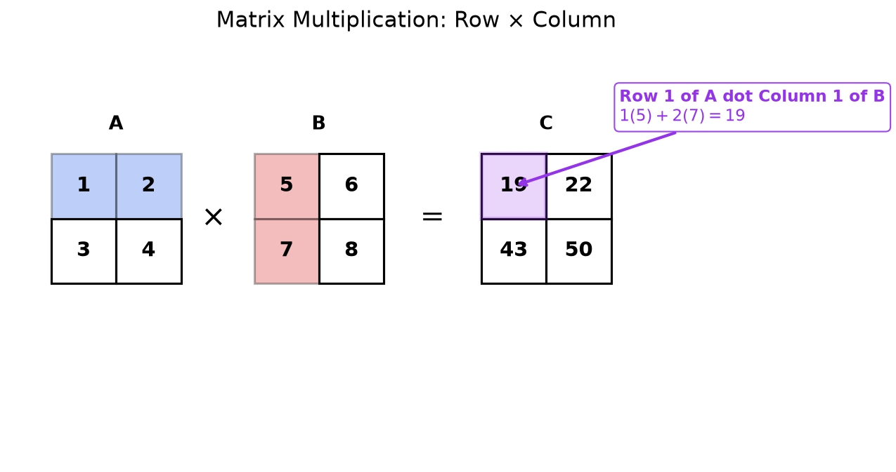

## Why Matrices?

Whenever you organize numbers into a grid, you are already thinking in matrices. A spreadsheet of monthly sales figures for five products is a matrix with 12 columns (months) and 5 rows (products). A digital photo is a matrix of pixel values. Any time information has two natural indices (row and column, input and output, equation and variable), a matrix is the right container.

The most important early use case is **systems of equations**. Suppose you need to solve:

$$
2x + 3y = 8
$$

$$
5x - y = 1
$$

The coefficients on the left side form a $2 \times 2$ grid, and we can write the entire system compactly as $A\mathbf{x} = \mathbf{b}$:

$$
\begin{bmatrix} 2 & 3 \\ 5 & -1 \end{bmatrix}
\begin{bmatrix} x \\ y \end{bmatrix}
=
\begin{bmatrix} 8 \\ 1 \end{bmatrix}
$$

For a system of 3 equations in 3 unknowns, there are 9 coefficients that naturally arrange into a $3 \times 3$ grid. Matrices give us a single symbol ($A$) to represent that entire grid, and matrix operations (addition, multiplication, inversion) let us manipulate and solve the system without rewriting every coefficient by hand.

> **Scope note:** This page covers the mechanics of matrices: how to add, multiply, transpose, and invert them. For the deeper theory of what these operations mean geometrically (linear transformations, vector spaces, eigenvalues), see [Linear Algebra Foundations](./linear-algebra-foundations).

> [!abstract] Prerequisites & where this leads
> **Builds on:** [Vectors](./vector) · [Number Systems](./number-systems)
> **Leads to:** [Linear Algebra Foundations](./linear-algebra-foundations) · [Systems of Linear Equations](./systems-of-linear-equations)

---

**Matrices:** A matrix is a rectangular array of numbers, symbols, or
expressions arranged in rows and columns.

A ***m*** x ***n*** matrix is a rectangular grid of numbers with ***m***
rows and ***n*** columns.

A square matrix is a ***m*** x ***m*** matrix for some ***m***, or a
***n*** x ***n*** matrix for some ***n***.

The ***i,j*** entry of a matrix means the number in row ***i*** and
column ***j***.

It is important to get these in the correct order: Usually when
you give **(x,y)** coordinates, **x** refers to the horizontal direction
and **y** refers to the vertical direction.

When we talk about the ***i,j*** entry of a matrix, however, the first
number ***i*** refers to the row number (i.e. the vertical
direction) and the second number ***j*** refers to the column
number (i.e. the horizontal direction).

**Matrix Notation:**

A matrix **A** with $m$ rows and $n$ columns is written:

$$
A = \begin{bmatrix}
a_{11} & a_{12} & \cdots & a_{1n} \\
a_{21} & a_{22} & \cdots & a_{2n} \\
\vdots & \vdots & \ddots & \vdots \\
a_{m1} & a_{m2} & \cdots & a_{mn}
\end{bmatrix}
$$

Or more compactly: $A = [a_{ij}]$ where $1 \leq i \leq m$ and $1 \leq j \leq n$

The one thing beginners reverse: the **first** index is the row (how far *down*), the **second** is the column (how far *across*). This is the opposite order from $(x, y)$ coordinates, so $a_{23}$ is row 2, column 3, not "across 2, up 3."

## Matrix Addition

**Matrix Addition:** Two matrices can be added if and only if they have the **same dimensions** (same number of rows and columns).

**Rule:** Add corresponding entries

$$A + B = [a_{ij}] + [b_{ij}] = [a_{ij} + b_{ij}]$$

**Example:**

$$\begin{bmatrix} 1 & 2 \\ 3 & 4 \end{bmatrix} + \begin{bmatrix} 5 & 6 \\ 7 & 8 \end{bmatrix} = \begin{bmatrix} 1+5 & 2+6 \\ 3+7 & 4+8 \end{bmatrix} = \begin{bmatrix} 6 & 8 \\ 10 & 12 \end{bmatrix}$$

**Properties:**

- **Commutative:** $A + B = B + A$
- **Associative:** $(A + B) + C = A + (B + C)$
- **Zero matrix:** $A + 0 = A$ (where 0 is the matrix of all zeros)

## Scalar Multiplication

**Scalar Multiplication:** Multiply every entry of the matrix by a scalar (constant).

$$cA = c[a_{ij}] = [ca_{ij}]$$

**Example:**

$$3 \begin{bmatrix} 1 & 2 \\ 3 & 4 \end{bmatrix} = \begin{bmatrix} 3 & 6 \\ 9 & 12 \end{bmatrix}$$

**Properties:**

- $c(A + B) = cA + cB$
- $(c + d)A = cA + dA$
- $c(dA) = (cd)A$
- $1A = A$

## Matrix Multiplication

**Matrix Multiplication:** To multiply matrices $A$ (size $m \times n$) and $B$ (size $n \times p$), the **number of columns in A must equal the number of rows in B**.

The result is a matrix $C$ of size $m \times p$.

Before multiplying, always check the shapes: write the two sizes next to each other as $(m \times n)(n \times p)$. The **inner** numbers must be equal, or the product is undefined; the **outer** numbers become the size of the result.

**Rule:** The entry $c_{ij}$ in row $i$, column $j$ of the result is the dot product of row $i$ from $A$ and column $j$ from $B$:

$$c_{ij} = \sum_{k=1}^{n} a_{ik} \cdot b_{kj}$$

**Example:**

$$\begin{bmatrix} 1 & 2 \\ 3 & 4 \end{bmatrix} \begin{bmatrix} 5 & 6 \\ 7 & 8 \end{bmatrix} = \begin{bmatrix} 1 \cdot 5 + 2 \cdot 7 & 1 \cdot 6 + 2 \cdot 8 \\ 3 \cdot 5 + 4 \cdot 7 & 3 \cdot 6 + 4 \cdot 8 \end{bmatrix} = \begin{bmatrix} 19 & 22 \\ 43 & 50 \end{bmatrix}$$

**Step-by-step:**
- $c_{11} = 1(5) + 2(7) = 5 + 14 = 19$
- $c_{12} = 1(6) + 2(8) = 6 + 16 = 22$
- $c_{21} = 3(5) + 4(7) = 15 + 28 = 43$
- $c_{22} = 3(6) + 4(8) = 18 + 32 = 50$

**Properties:**

- **NOT commutative:** $AB \neq BA$ in general
- **Associative:** $(AB)C = A(BC)$
- **Distributive:** $A(B + C) = AB + AC$
- **Identity:** $AI = IA = A$ (where $I$ is the identity matrix)

**Matrices as transformations.** When a matrix $A$ multiplies a column vector $\mathbf{x}$ (read "x-vector"), each output coordinate is a dot product of a row of $A$ with $\mathbf{x}$. Geometrically, a $2 \times 2$ matrix takes every point of the plane and moves it, so multiplication is the same as applying a linear transformation.

![Five small coordinate grids, each showing the unit square (dashed) transformed by a different two-by-two matrix, with red and green arrows marking where the basis vectors i-hat and j-hat land. Identity, matrix [[1,0],[0,1]], leaves the square unchanged. Scale, matrix [[1.5,0],[0,0.5]], stretches it wider and shorter. Rotate 90 degrees, matrix [[0,-1],[1,0]], turns the square a quarter turn. Shear, matrix [[1,1],[0,1]], slants the top of the square sideways into a parallelogram. Reflect, matrix [[-1,0],[0,1]], flips the square across the vertical axis. In every panel the two columns of the matrix are exactly the landing spots of the two basis vectors.](./media/mat-transformations.png)

The key to reading any $2 \times 2$ matrix geometrically: its **first column is where the basis vector $\hat\imath = (1,0)$ lands, and its second column is where $\hat\jmath = (0,1)$ lands.** Once you know where those two vectors go, the whole grid follows, because every point is just a combination of them.

Explore it: drag the grid and watch how the $2 \times 2$ matrix $A$ reshapes the plane; each column of $A$ shows where the unit vectors $\mathbf{i}$ (read "i-hat") and $\mathbf{j}$ (read "j-hat") land.

<iframe src="/static/interactive/linear-transformation-2d.html" width="100%" height="560" style="border:none;"></iframe>

## Identity Matrix

**Identity Matrix:** A square matrix with 1's on the main diagonal and 0's elsewhere.

$$
I_n = \begin{bmatrix}
1 & 0 & \cdots & 0 \\
0 & 1 & \cdots & 0 \\
\vdots & \vdots & \ddots & \vdots \\
0 & 0 & \cdots & 1
\end{bmatrix}
$$

**Property:** For any $n \times n$ matrix $A$: $AI = IA = A$

**Examples:**

$$I_2 = \begin{bmatrix} 1 & 0 \\ 0 & 1 \end{bmatrix}, \quad I_3 = \begin{bmatrix} 1 & 0 & 0 \\ 0 & 1 & 0 \\ 0 & 0 & 1 \end{bmatrix}$$

## Zero Matrix

**Zero Matrix:** A matrix where all entries are 0.

$$
0_{m \times n} = \begin{bmatrix}
0 & 0 & \cdots & 0 \\
0 & 0 & \cdots & 0 \\
\vdots & \vdots & \ddots & \vdots \\
0 & 0 & \cdots & 0
\end{bmatrix}
$$

**Property:** $A + 0 = A$ and $A \cdot 0 = 0$

## Matrix Transpose

**Transpose:** The transpose of a matrix $A$, denoted $A^T$, is obtained by swapping rows and columns.

If $A = [a_{ij}]$ is $m \times n$, then $A^T = [a_{ji}]$ is $n \times m$

**Example:**

$$A = \begin{bmatrix} 1 & 2 & 3 \\ 4 & 5 & 6 \end{bmatrix} \Rightarrow A^T = \begin{bmatrix} 1 & 4 \\ 2 & 5 \\ 3 & 6 \end{bmatrix}$$

**Properties:**
- $(A^T)^T = A$
- $(A + B)^T = A^T + B^T$
- $(AB)^T = B^T A^T$ (order reverses!)
- $(cA)^T = cA^T$

## Inverse Matrix

**Inverse Matrix:** For a square matrix $A$, the inverse $A^{-1}$ (if it exists) satisfies:

$$AA^{-1} = A^{-1}A = I$$

**Not all matrices have inverses.** A matrix is **invertible** (or **non-singular**) if its determinant is non-zero.

**For 2×2 matrix:**

$$A = \begin{bmatrix} a & b \\ c & d \end{bmatrix}$$

$$A^{-1} = \frac{1}{ad - bc} \begin{bmatrix} d & -b \\ -c & a \end{bmatrix}$$

Where $ad - bc$ is the **determinant** of $A$.

![Two panels giving the determinant a geometric meaning. The left panel shows the unit square (dashed) transformed into a parallelogram spanned by the two columns of a matrix, drawn as a red and a green arrow; the parallelogram's area is labeled the absolute value of the determinant, computed as the absolute value of 2 times 3 minus 1 times 1, which equals 5. The right panel shows a singular matrix whose two column arrows point along the same line, so the square collapses to a line segment of zero area, labeled columns parallel, area 0, determinant 2 times 2 minus 1 times 4 equals 0, singular with no inverse.](./media/mat-determinant-area.png)

This is *why* a zero determinant means no inverse. Geometrically the determinant is the factor by which the transformation scales area. If it is zero, the matrix has flattened the plane onto a line (or a point), crushing two dimensions into one. No transformation can un-flatten that, so there is nothing to undo it, and $A^{-1}$ cannot exist.

**General $n \times n$ method:** For larger matrices there is no such compact formula. Instead, form the augmented matrix $[A \mid I]$ and apply elementary row operations until the left block becomes the identity; the right block is then $A^{-1}$:

$$[A \mid I] \longrightarrow [I \mid A^{-1}]$$

This is Gauss-Jordan elimination applied to the identity alongside $A$ (see [Systems of Linear Equations](./systems-of-linear-equations)). If $A$ cannot be reduced to $I$ (a zero row appears on the left), then $A$ is singular and no inverse exists. Recall $A$ is invertible if and only if $\det(A) \neq 0$ (non-singular).

**Example:**

$$A = \begin{bmatrix} 2 & 3 \\ 1 & 4 \end{bmatrix}$$

Determinant: $2(4) - 3(1) = 8 - 3 = 5$

$$A^{-1} = \frac{1}{5} \begin{bmatrix} 4 & -3 \\ -1 & 2 \end{bmatrix} = \begin{bmatrix} 0.8 & -0.6 \\ -0.2 & 0.4 \end{bmatrix}$$

**Verification:**

$$AA^{-1} = \begin{bmatrix} 2 & 3 \\ 1 & 4 \end{bmatrix} \begin{bmatrix} 0.8 & -0.6 \\ -0.2 & 0.4 \end{bmatrix} = \begin{bmatrix} 1 & 0 \\ 0 & 1 \end{bmatrix} = I$$

![Three coordinate panels read left to right showing the inverse as an undo operation, for the matrix A equal to [[2,3],[1,4]] with determinant 5. The first panel shows the starting unit square. An arrow labeled times A leads to the second panel, where the square has been transformed into a slanted parallelogram. An arrow labeled times A inverse leads to the third panel, where the parallelogram has been transformed exactly back into the original unit square. The caption states that A inverse of A times x returns x.](./media/mat-inverse-undo.png)

That is what "inverse" means: $A$ reshapes the square into a parallelogram, and $A^{-1}$ is the unique transformation that reshapes it back. Applying one and then the other returns every point to where it started, which is exactly the statement $A^{-1}A = I$.

**Properties:**
- $(A^{-1})^{-1} = A$
- $(AB)^{-1} = B^{-1}A^{-1}$ (order reverses!)
- $(A^T)^{-1} = (A^{-1})^T$

