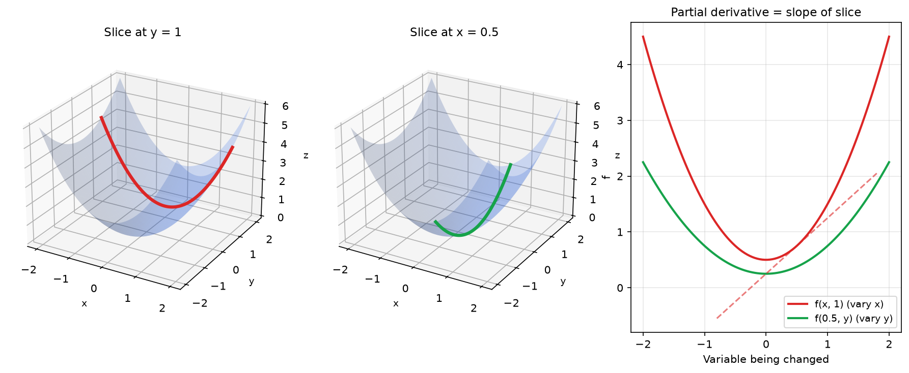
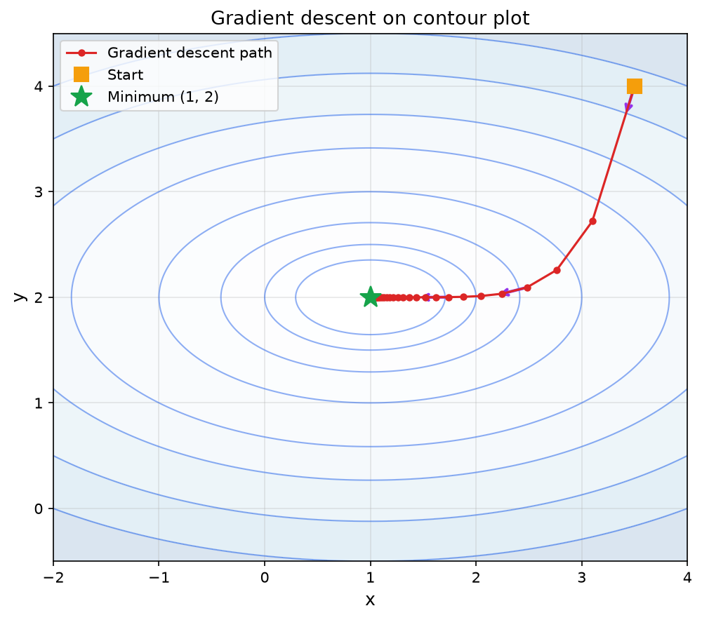

> [!abstract] Prerequisites & where this leads <!-- slt-nav -->
> **Builds on:** [Calculus](./calculus) · [Linear Algebra Foundations](./linear-algebra-foundations)
> **Leads to:** [Optimization](./optimization) · [Algebraic Geometry](./algebraic-geometry)

Single-variable calculus studies functions with one input and one output: $f(x) = x^2$. But most real problems involve many variables. A house's price depends on square footage, location, age, and number of bedrooms. A neural network's loss depends on thousands (or millions) of parameters. **Multivariable calculus** extends derivatives and integrals to functions of several variables.

This page builds on [Calculus](./calculus) (limits, derivatives, integrals) and connects forward to the [matrix calculus](./linear-algebra-computation) already covered in the linear algebra section (gradients, Jacobians, Hessians, chain rule for vectors).

## Functions of Several Variables

A function of several variables takes multiple inputs and produces one output:

$$
f(x, y) = x^2 + 3xy + y^2
$$

This function takes two numbers $x$ and $y$ and returns a single number. You can visualize it as a surface in 3D: for each point $(x, y)$ in the plane, the function value $f(x, y)$ gives the height.

More generally, $f(x_1, x_2, \ldots, x_n)$ takes $n$ inputs. In machine learning, $n$ might be the number of model parameters, and $f$ might be the loss function that measures how wrong the model's predictions are.

**Notation:** We sometimes write $f(\mathbf{x})$ where $\mathbf{x} = (x_1, x_2, \ldots, x_n)$ is a vector of inputs.

**Example:** The mean squared error loss for a linear model with parameters $w$ (weight) and $b$ (bias) on a single data point $(x_{\text{data}}, y_{\text{data}})$:

$$
L(w, b) = (wx_{\text{data}} + b - y_{\text{data}})^2
$$

This is a function of two variables, $w$ and $b$. We want to find the values of $w$ and $b$ that make $L$ as small as possible.

## Partial Derivatives

### The Idea

With one variable, the derivative $f'(x)$ tells you the rate of change. With multiple variables, you can change each variable independently. A **partial derivative** measures the rate of change with respect to one variable while holding all other variables constant.

Think of it this way: you are standing on a hilly surface. The partial derivative with respect to $x$ tells you how steep the hill is if you walk due east (changing $x$, keeping $y$ fixed). The partial derivative with respect to $y$ tells you how steep the hill is if you walk due north (changing $y$, keeping $x$ fixed).

### The Limit Definition

Just as the single-variable derivative is a limit of a difference quotient, the partial derivative is defined as a limit in which only one input is perturbed. For $f(x, y)$, the partial derivative with respect to $x$, written $\frac{\partial f}{\partial x}$ (read "partial f by partial x"), is:

$$
\frac{\partial f}{\partial x} = \lim_{h \to 0} \frac{f(x + h, y) - f(x, y)}{h}
$$

Notice that $y$ is held fixed on both sides: only the first argument moves by $h$. This is exactly the single-variable [limit definition of the derivative](./calculus) applied to the function of $x$ you get by freezing $y$. Symmetrically, the partial derivative with respect to $y$ perturbs only the second argument:

$$
\frac{\partial f}{\partial y} = \lim_{h \to 0} \frac{f(x, y + h) - f(x, y)}{h}
$$

For a function of $n$ variables $f(x_1, \ldots, x_n)$, the partial derivative with respect to $x_i$ adds $h$ to the $i$-th input alone and holds the rest fixed:

$$
\frac{\partial f}{\partial x_i} = \lim_{h \to 0} \frac{f(x_1, \ldots, x_i + h, \ldots, x_n) - f(x_1, \ldots, x_n)}{h}
$$

The computational shortcut below (treat the other variables as constants) is a direct consequence: freezing every variable except $x_i$ turns $f$ into an ordinary function of one variable, and this limit is its ordinary derivative.

### Notation and Computation

The partial derivative of $f$ with respect to $x$ is written:

$$
\frac{\partial f}{\partial x} \quad \text{or} \quad f_x
$$

The curly $\partial$ (read "partial") distinguishes this from an ordinary derivative $\frac{d}{dx}$.

**To compute $\frac{\partial f}{\partial x}$:** Treat every variable except $x$ as a constant, then differentiate with respect to $x$ using the same rules from single-variable calculus.

**Worked example:** Let $f(x, y) = x^2 + 3xy + y^2$.

$$
\frac{\partial f}{\partial x} = 2x + 3y \qquad \text{(treat } y \text{ as a constant)}
$$

$$
\frac{\partial f}{\partial y} = 3x + 2y \qquad \text{(treat } x \text{ as a constant)}
$$

**Worked example:** Let $f(x, y) = e^{xy} + \sin(x)$.

$$
\frac{\partial f}{\partial x} = y \cdot e^{xy} + \cos(x) \qquad \text{(chain rule on } e^{xy} \text{; } y \text{ is constant)}
$$

$$
\frac{\partial f}{\partial y} = x \cdot e^{xy} \qquad \text{(}\sin(x) \text{ has no } y \text{, so its partial derivative is 0)}
$$

<iframe src="/static/interactive/partial-derivative-slice.html" width="100%" height="550" style="border:none;"></iframe>

### Geometric Interpretation

If you slice the surface $z = f(x, y)$ with a plane that holds $y$ constant, you get a curve. The partial derivative $\frac{\partial f}{\partial x}$ is the slope of that curve. Similarly, slicing with $x$ constant and taking the slope gives $\frac{\partial f}{\partial y}$.

## The Gradient Vector

### Collecting All Partial Derivatives

The **gradient** of a scalar function $f(x_1, x_2, \ldots, x_n)$ is the vector of all its partial derivatives:

$$
\nabla f = \begin{bmatrix} \frac{\partial f}{\partial x_1} \\ \frac{\partial f}{\partial x_2} \\ \vdots \\ \frac{\partial f}{\partial x_n} \end{bmatrix}
$$

The symbol $\nabla$ is called "nabla" or "del." The gradient $\nabla f$ is a vector that lives in the same space as the input.

**Worked example:** For $f(x, y) = x^2 + 3xy + y^2$:

$$
\nabla f = \begin{bmatrix} 2x + 3y \\ 3x + 2y \end{bmatrix}
$$

At the point $(1, 2)$: $\nabla f(1, 2) = \begin{bmatrix} 2 + 6 \\ 3 + 4 \end{bmatrix} = \begin{bmatrix} 8 \\ 7 \end{bmatrix}$.

### The Gradient Points Uphill

The gradient has a crucial geometric property: **$\nabla f$ points in the direction of steepest increase of $f$.** Its magnitude $\|\nabla f\|$ tells you how steep that increase is.

This means $-\nabla f$ points in the direction of steepest decrease. If you want to minimize a function (like a loss function), you should move in the direction $-\nabla f$. This is the core idea behind gradient descent.

### Connection to Matrix Calculus

The gradient was already introduced in the [matrix calculus section](./linear-algebra-computation) of the linear algebra page. There, it appeared as a row vector following the numerator layout convention. Here we write it as a column vector, which is more common in optimization. The content is the same: the gradient collects all partial derivatives into one object.

## Directional Derivatives

The partial derivatives measure rates of change along the coordinate axes ($x$-direction, $y$-direction, etc.). But what if you want the rate of change in some other direction?

The **directional derivative** of $f$ in the direction of a unit vector $\mathbf{u}$ is:

$$
D_{\mathbf{u}} f = \nabla f \cdot \mathbf{u}
$$

This is the dot product of the gradient with the direction vector. It tells you how fast $f$ changes as you move in the direction $\mathbf{u}$.

**Observations:**

- When $\mathbf{u}$ points in the same direction as $\nabla f$: the directional derivative is maximized. You are going straight uphill.
- When $\mathbf{u}$ points opposite to $\nabla f$: the directional derivative is most negative. You are going straight downhill.
- When $\mathbf{u}$ is perpendicular to $\nabla f$: the directional derivative is zero. You are walking along a contour line (neither uphill nor downhill).

**Worked example:** For $f(x, y) = x^2 + y^2$, find the directional derivative at $(1, 1)$ in the direction toward the origin.

$\nabla f = \begin{bmatrix} 2x \\ 2y \end{bmatrix}$, so $\nabla f(1, 1) = \begin{bmatrix} 2 \\ 2 \end{bmatrix}$.

The direction toward the origin from $(1, 1)$ is $(-1, -1)$, normalized: $\mathbf{u} = \frac{1}{\sqrt{2}}\begin{bmatrix} -1 \\ -1 \end{bmatrix}$.

$$
D_{\mathbf{u}} f = \begin{bmatrix} 2 \\ 2 \end{bmatrix} \cdot \frac{1}{\sqrt{2}} \begin{bmatrix} -1 \\ -1 \end{bmatrix} = \frac{1}{\sqrt{2}}(-2 - 2) = -\frac{4}{\sqrt{2}} = -2\sqrt{2}
$$

The negative value confirms: moving toward the origin decreases $f$ (which makes sense since $f = x^2 + y^2$ has its minimum at the origin).

## The Multivariable Chain Rule

### Extending the Chain Rule

In single-variable calculus, if $y = f(g(x))$, then $\frac{dy}{dx} = f'(g(x)) \cdot g'(x)$. The multivariable chain rule extends this to functions of several variables.

**Case 1: One intermediate variable, one final variable.**

If $z = f(x, y)$ where $x = g(t)$ and $y = h(t)$, then:

$$
\frac{dz}{dt} = \frac{\partial f}{\partial x} \cdot \frac{dx}{dt} + \frac{\partial f}{\partial y} \cdot \frac{dy}{dt}
$$

Each path from $t$ to $z$ contributes a term. The partial derivative along that path is multiplied by the derivative of the intermediate variable with respect to $t$, and all such terms are summed.

**Worked example:** $z = x^2 y$, where $x = \cos(t)$ and $y = \sin(t)$. Find $\frac{dz}{dt}$.

$$
\frac{dz}{dt} = 2xy \cdot (-\sin t) + x^2 \cdot (\cos t) = -2\cos(t)\sin^2(t) + \cos^3(t)
$$

**Case 2: Multiple intermediate variables, multiple final variables.**

If $z = f(x_1, \ldots, x_n)$ where each $x_i = g_i(t_1, \ldots, t_m)$, then:

$$
\frac{\partial z}{\partial t_j} = \sum_{i=1}^{n} \frac{\partial f}{\partial x_i} \cdot \frac{\partial x_i}{\partial t_j}
$$

This is a sum over all paths from $t_j$ to $z$.

### Connection to Backpropagation

In a neural network, the output (loss) depends on the final layer's weights, which depend on the previous layer's outputs, which depend on the previous layer's weights, and so on. Computing $\frac{\partial \text{loss}}{\partial w}$ for a weight $w$ in an early layer requires summing over all paths from $w$ to the loss. This is exactly the multivariable chain rule, and organizing this computation efficiently is what backpropagation does.

The [matrix calculus section](./linear-algebra-computation) expresses this in matrix form: the chain rule becomes multiplication of Jacobian matrices.

## Second-Order Partial Derivatives and the Hessian

### Second Partial Derivatives

Just as the second derivative $f''(x)$ measures how the slope is changing, second partial derivatives measure how the partial derivatives themselves change.

For $f(x, y)$, there are four second-order partial derivatives:

$$
\frac{\partial^2 f}{\partial x^2} = f_{xx}, \quad \frac{\partial^2 f}{\partial y \partial x} = f_{xy}, \quad \frac{\partial^2 f}{\partial x \partial y} = f_{yx}, \quad \frac{\partial^2 f}{\partial y^2} = f_{yy}
$$

**Important fact (Clairaut's theorem):** If $f$ has continuous second partial derivatives, then the mixed partials are equal: $f_{xy} = f_{yx}$. The order of differentiation does not matter.

**Worked example:** $f(x, y) = x^3 + x^2 y + y^3$.

$$
f_x = 3x^2 + 2xy, \quad f_y = x^2 + 3y^2
$$

$$
f_{xx} = 6x + 2y, \quad f_{xy} = 2x, \quad f_{yx} = 2x, \quad f_{yy} = 6y
$$

Confirmed: $f_{xy} = f_{yx} = 2x$.

### The Hessian Matrix

The **Hessian** collects all second partial derivatives into a matrix:

$$
H = \begin{bmatrix} f_{xx} & f_{xy} \\ f_{yx} & f_{yy} \end{bmatrix}
$$

For a function of $n$ variables, the Hessian is an $n \times n$ symmetric matrix (symmetric because $f_{x_i x_j} = f_{x_j x_i}$).

The Hessian is the multivariable analog of the second derivative. In single-variable calculus:

- $f''(a) > 0$ means concave up (local minimum)
- $f''(a) < 0$ means concave down (local maximum)

For multiple variables, the Hessian plays the same role using the concept of positive definiteness from [linear algebra](./linear-algebra-computation):

- If $H$ is **positive definite** at a critical point: local minimum
- If $H$ is **negative definite** at a critical point: local maximum
- If $H$ is **indefinite** (has both positive and negative eigenvalues): saddle point

**Where it shows up:** The Hessian matrix appears in Newton's method for optimization, which uses second-order information to converge faster than gradient descent. It also determines whether a critical point of a loss function is a minimum, maximum, or saddle point.

## Double Integrals

### Extending Integration to Two Dimensions

A single integral $\int_a^b f(x) \, dx$ computes the area under a curve. A **double integral** computes the volume under a surface:

$$
\iint_R f(x, y) \, dA
$$

The double sign $\iint_R$ (read "the double integral over R") signals that we integrate over a two-dimensional region: here $R$ is a region in the $xy$-plane, and $dA$ represents a tiny piece of area.

### Computing Double Integrals

You evaluate a double integral as two nested single integrals (called an **iterated integral**):

$$
\iint_R f(x, y) \, dA = \int_a^b \left( \int_c^d f(x, y) \, dy \right) dx
$$

Integrate with respect to $y$ first (treating $x$ as constant), then integrate the result with respect to $x$.

**Worked example:** Find $\iint_R xy \, dA$ where $R$ is the rectangle $0 \leq x \leq 2$, $0 \leq y \leq 3$.

$$
\int_0^2 \left( \int_0^3 xy \, dy \right) dx = \int_0^2 \left[ \frac{xy^2}{2} \right]_0^3 dx = \int_0^2 \frac{9x}{2} \, dx = \left[ \frac{9x^2}{4} \right]_0^2 = \frac{36}{4} = 9
$$

**Where it shows up:** Double (and higher-dimensional) integrals appear when computing expected values of multivariate probability distributions, marginal distributions (integrating out variables), and normalization constants.

### Changing the Order of Integration

For a rectangular region, you can integrate in either order:

$$
\int_a^b \int_c^d f(x, y) \, dy \, dx = \int_c^d \int_a^b f(x, y) \, dx \, dy
$$

Sometimes one order is much easier to compute than the other. For non-rectangular regions, the limits of the inner integral may depend on the outer variable, and switching the order requires re-describing the region.

**Worked example:** Compute $\int_0^1 \int_0^1 (x^2 + y^2) \, dy \, dx$.

Inner integral (with respect to $y$, treating $x$ as constant):

$$
\int_0^1 (x^2 + y^2) \, dy = \left[ x^2 y + \frac{y^3}{3} \right]_0^1 = x^2 + \frac{1}{3}
$$

Outer integral:

$$
\int_0^1 \left( x^2 + \frac{1}{3} \right) dx = \left[ \frac{x^3}{3} + \frac{x}{3} \right]_0^1 = \frac{1}{3} + \frac{1}{3} = \frac{2}{3}
$$

### Connection to Probability

For a joint probability density function $f(x, y)$ of two continuous random variables, the total probability must equal 1:

$$
\iint_{\mathbb{R}^2} f(x, y) \, dA = 1
$$

To find the probability of a specific event (say, $X$ is between 1 and 3, and $Y$ is between 0 and 2), you compute:

$$
P(1 \leq X \leq 3, \, 0 \leq Y \leq 2) = \int_1^3 \int_0^2 f(x, y) \, dy \, dx
$$

To get the marginal distribution of $X$ alone (ignoring $Y$), you integrate out $Y$:

$$
f_X(x) = \int_{-\infty}^{\infty} f(x, y) \, dy
$$

This process of integrating out a variable is called **marginalization**, and it is fundamental in probability and statistics.

---

## Gradient Descent

### The Algorithm

Gradient descent is the workhorse optimization algorithm of machine learning. The idea is simple: to minimize a function $f(\mathbf{x})$, start at some point and repeatedly take small steps in the direction of steepest decrease (the negative gradient).

**Algorithm:**

1. Choose a starting point $\mathbf{x}_0$
2. Choose a **learning rate** $\alpha > 0$ (a small positive number)
3. Repeat until convergence:

$$
\mathbf{x}_{n+1} = \mathbf{x}_n - \alpha \nabla f(\mathbf{x}_n)
$$

In words: compute the gradient at your current position, scale it by the learning rate, and subtract it from your position. This moves you downhill.

### Why It Works

Since $-\nabla f$ points in the direction of steepest decrease, each step reduces the value of $f$ (provided the learning rate is small enough). Over many steps, you approach a minimum.

### The Learning Rate

The learning rate $\alpha$ controls step size:

- **Too large:** Steps overshoot the minimum. The algorithm may bounce around or diverge.
- **Too small:** Steps are tiny. The algorithm converges, but painfully slowly.
- **Just right:** Steady progress toward the minimum.

Choosing a good learning rate is a practical challenge in machine learning.

### Worked Example

Minimize $f(x, y) = (x - 1)^2 + 4(y - 2)^2$ using gradient descent with learning rate $\alpha = 0.1$.

First, compute the gradient:

$$
\nabla f = \begin{bmatrix} 2(x - 1) \\ 8(y - 2) \end{bmatrix}
$$

Start at $(x_0, y_0) = (3.5, 4)$.

**Step 1:** $\nabla f(3.5, 4) = \begin{bmatrix} 5 \\ 16 \end{bmatrix}$

$$
\begin{bmatrix} x_1 \\ y_1 \end{bmatrix} = \begin{bmatrix} 3.5 \\ 4 \end{bmatrix} - 0.1 \begin{bmatrix} 5 \\ 16 \end{bmatrix} = \begin{bmatrix} 3.0 \\ 2.4 \end{bmatrix}
$$

**Step 2:** $\nabla f(3.0, 2.4) = \begin{bmatrix} 4 \\ 3.2 \end{bmatrix}$

$$
\begin{bmatrix} x_2 \\ y_2 \end{bmatrix} = \begin{bmatrix} 3.0 \\ 2.4 \end{bmatrix} - 0.1 \begin{bmatrix} 4 \\ 3.2 \end{bmatrix} = \begin{bmatrix} 2.6 \\ 2.08 \end{bmatrix}
$$

**Step 3:** $\nabla f(2.6, 2.08) = \begin{bmatrix} 3.2 \\ 0.64 \end{bmatrix}$

$$
\begin{bmatrix} x_3 \\ y_3 \end{bmatrix} = \begin{bmatrix} 2.6 \\ 2.08 \end{bmatrix} - 0.1 \begin{bmatrix} 3.2 \\ 0.64 \end{bmatrix} = \begin{bmatrix} 2.28 \\ 2.016 \end{bmatrix}
$$

Each step moves closer to the minimum at $(1, 2)$. Notice that $y$ converges faster than $x$. The reason is the curvature, not the initial gradient size: the second derivative in the $y$-direction is $f_{yy} = 8$, four times larger than $f_{xx} = 2$ in the $x$-direction. Along $y$, each step multiplies the distance to the optimum by the contraction factor $|1 - \alpha f_{yy}| = |1 - 0.1 \cdot 8| = 0.2$, whereas along $x$ the factor is $|1 - \alpha f_{xx}| = |1 - 0.1 \cdot 2| = 0.8$. The larger second derivative (the larger Hessian eigenvalue) gives the smaller contraction factor and hence faster convergence. This mismatch between the two eigenvalues is exactly the conditioning issue that makes gradient descent slow on poorly scaled problems.

### Convergence: When Does It Stop?

Gradient descent converges when the gradient is close to zero (meaning you are near a critical point). In practice, you stop when:

- The gradient norm $\|\nabla f\|$ is below a threshold
- The change in function value $|f(\mathbf{x}_{n+1}) - f(\mathbf{x}_n)|$ is below a threshold
- You have reached a maximum number of iterations

**Convergence rate** depends on the function's properties. For a convex function with a Lipschitz-continuous gradient (the gradient does not change too abruptly), gradient descent converges at a rate of $O(1/k)$, where $k$ is the number of steps. This means halving the error requires roughly doubling the number of steps.

### Variants of Gradient Descent

Several variants improve on basic gradient descent:

**Stochastic Gradient Descent (SGD):** In machine learning, computing the gradient requires summing over all training examples, which can be expensive. SGD approximates the gradient using a single random training example (or a small batch). This is noisier but much faster per step, and the noise can actually help escape shallow local minima.

**Mini-batch Gradient Descent:** A compromise between full gradient descent and SGD. Use a random subset (batch) of training examples to estimate the gradient. Typical batch sizes are 32, 64, or 128. This reduces noise compared to SGD while remaining much cheaper than using the full dataset.

**Momentum:** Instead of using only the current gradient, incorporate the direction from previous steps. This helps accelerate through narrow valleys and reduces oscillation. The update becomes:

$$
\mathbf{v}_{n+1} = \beta \mathbf{v}_n + \alpha \nabla f(\mathbf{x}_n)
$$

$$
\mathbf{x}_{n+1} = \mathbf{x}_n - \mathbf{v}_{n+1}
$$

Here $\beta$ (typically around 0.9) controls how much of the previous velocity is retained. Think of a ball rolling downhill that builds up speed.

## Convexity

### What Makes Gradient Descent Reliable

Gradient descent finds a local minimum, but that local minimum might not be the global minimum. The good news: for **convex** functions, every local minimum is also the global minimum.

A function $f$ is **convex** if the line segment between any two points on its graph lies above (or on) the graph. Geometrically, it is "bowl-shaped" with no bumps or valleys.

**Formal definition:** $f$ is convex if for all $\mathbf{x}, \mathbf{y}$ and all $t \in [0, 1]$:

$$
f(t\mathbf{x} + (1-t)\mathbf{y}) \leq t \, f(\mathbf{x}) + (1-t) f(\mathbf{y})
$$

### Testing for Convexity

A twice-differentiable function is convex if and only if its Hessian matrix is **positive semidefinite** everywhere (all eigenvalues are non-negative). This connects to the [positive definiteness](./linear-algebra-computation) discussion in linear algebra.

**Examples of convex functions:**

- $f(x) = x^2$ (parabola)
- $f(x, y) = x^2 + y^2$ (paraboloid)
- $f(\mathbf{x}) = \|\mathbf{x}\|^2$ (squared norm)
- Linear functions $f(\mathbf{x}) = \mathbf{a}^T \mathbf{x} + b$ (also concave; they are both)

**Examples of non-convex functions:**

- $f(x) = \sin(x)$ (has bumps)
- Neural network loss functions (in general)

### Why This Matters for ML

Many classical ML models (linear regression, logistic regression, SVMs) have convex loss functions, so gradient descent is guaranteed to find the global optimum. Neural networks have non-convex loss functions, so gradient descent might get stuck in a local minimum or saddle point. Understanding convexity tells you when your optimization is trustworthy.

## Lagrange Multipliers

### Constrained Optimization

So far we have minimized a function over its entire domain. Often, though, the inputs are not free: they must satisfy a **constraint**. You might minimize a cost subject to a fixed budget, or maximize an area subject to a fixed perimeter. The general problem is to optimize $f(\mathbf{x})$ subject to $g(\mathbf{x}) = c$, where $g(\mathbf{x}) = c$ describes a curve or surface (the **constraint set**) that the solution must lie on:

$$
\text{optimize } f(\mathbf{x}) \quad \text{subject to } g(\mathbf{x}) = c
$$

You cannot simply set $\nabla f = \mathbf{0}$, because the unconstrained minimum may not lie on the constraint set at all. Instead, you look for the best point among those the constraint allows.

### The Parallel-Gradient Condition

Here is the key geometric idea. The gradient $\nabla g$ is perpendicular to the constraint surface $g(\mathbf{x}) = c$ (it points in the direction that changes $g$ fastest, which is straight off the surface). At a constrained optimum, $\nabla f$ must also be perpendicular to the constraint surface. If it were not, part of $\nabla f$ would lie along the surface, and you could move along the surface (staying feasible) in a direction that increases or decreases $f$, so you would not yet be at an optimum.

Two vectors that are both perpendicular to the same surface are parallel. Therefore, at a constrained optimum $\mathbf{x}^*$, there exists a scalar $\lambda$ (the **Lagrange multiplier**) such that the gradients are parallel:

$$
\nabla f(\mathbf{x}^*) = \lambda \nabla g(\mathbf{x}^*)
$$

Together with the constraint $g(\mathbf{x}^*) = c$, this gives a system of equations you solve for $\mathbf{x}^*$ and $\lambda$. Equivalently, form the **Lagrangian** $\mathcal{L}(\mathbf{x}, \lambda) = f(\mathbf{x}) - \lambda(g(\mathbf{x}) - c)$ and set all its partial derivatives (including the one with respect to $\lambda$, which recovers the constraint) to zero.

### Worked Example

**Problem:** Maximize $f(x, y) = xy$ subject to the constraint $x + y = 10$.

Here $g(x, y) = x + y$ and $c = 10$. Compute the gradients:

$$
\nabla f = \begin{bmatrix} y \\ x \end{bmatrix}, \qquad \nabla g = \begin{bmatrix} 1 \\ 1 \end{bmatrix}
$$

The condition $\nabla f = \lambda \nabla g$ gives $y = \lambda$ and $x = \lambda$, so $x = y$. Substituting into the constraint $x + y = 10$ yields $2x = 10$, hence $x = y = 5$. The maximum product is $f(5, 5) = 25$.

The multiplier $\lambda = 5$ has a meaning: it is the rate at which the optimal value would change if you loosened the constraint. Raising the budget from $10$ to $11$ would increase the maximum product by about $\lambda = 5$.

### Connection to Machine Learning

Constrained optimization is everywhere in ML. A **hard-margin support vector machine** maximizes the margin between two classes subject to the equality/inequality constraints that every training point sits on the correct side of the boundary. Introducing a Lagrange multiplier for each constraint turns the geometric margin problem into its **dual** form, which is what solvers actually optimize and which is what makes the "kernel trick" possible. More broadly, any equality-constrained objective (for example, requiring a probability vector to sum to $1$, or fixing the norm of a weight vector) is handled by adding $\lambda(g(\mathbf{x}) - c)$ to the loss.

For inequality constraints ($g(\mathbf{x}) \leq c$), the multipliers must be non-negative and the condition generalizes to the **Karush-Kuhn-Tucker (KKT) conditions**, which the [optimization page](./optimization) treats in full, including the SVM dual.

---

## Summary: How Everything Connects

The path from single-variable calculus to machine learning optimization forms a coherent chain:

| Single-Variable Concept | Multivariable Extension | Matrix Form ([Linear Algebra](./linear-algebra-computation)) |
|------------------------|------------------------|--------------------------------------------------------------|
| Derivative $f'(x)$ | Partial derivatives $\frac{\partial f}{\partial x_i}$ | Gradient $\nabla f$ (vector) |
| Second derivative $f''(x)$ | Second partial derivatives $f_{x_i x_j}$ | Hessian $H$ (matrix) |
| Chain rule $\frac{dy}{dx} = \frac{dy}{du} \cdot \frac{du}{dx}$ | Multivariable chain rule | Jacobian multiplication |
| $f''(a) > 0$ means local min | Hessian positive definite means local min | Eigenvalues of $H$ all positive |
| Set $f'(x) = 0$ to find extrema | Set $\nabla f = \mathbf{0}$ to find extrema | Solve $\nabla f = \mathbf{0}$ (system of equations) |

Gradient descent ties it all together: compute the gradient (from calculus), use it to take a step (linear algebra), and repeat until you reach a minimum (optimization). This is the mathematical engine behind training every neural network.
