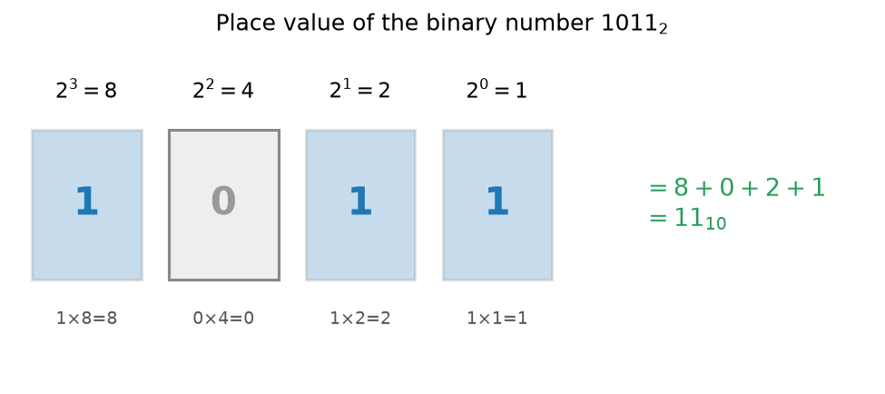

Every whole number you write down is a coded message. The string `3204` is not the number itself: it is a compact instruction for building the number out of powers of ten. This page unpacks that instruction, shows how the *same* number can be written using powers of any base (2, 8, 16, or an arbitrary base $b$), and explains why computers overwhelmingly prefer base 2. It is the computer-science-facing companion to [Number Systems](./number-systems) and [Algebraic Structures](./algebraic-structures).

> [!abstract] Prerequisites & where this leads
> **Builds on:** [Number Systems](./number-systems) · [Order of Operations](./order-of-operations)
> **Leads to:** [Prime Factorization](./prime-factorization)

## Positional Notation and Place Value

We are so used to base 10 that we forget it is a *convention*. When we write $3204$, the position of each digit tells us which power of ten it counts. Reading right to left, the columns are the ones, tens, hundreds, and thousands:

$$
3204 = 3\cdot 10^3 + 2\cdot 10^2 + 0\cdot 10^1 + 4\cdot 10^0.
$$

Let us check: $3\cdot 1000 + 2\cdot 100 + 0\cdot 10 + 4\cdot 1 = 3000 + 200 + 0 + 4 = 3204$. Good.

Two features are doing all the work here. First, the value of a digit depends on *where* it sits (its **place value**), not just on the digit itself. This is why the system is called **positional notation**. Second, the base 10 gives us exactly ten distinct digits, $0$ through $9$, and each place value is a power of ten.

Nothing forces us to use ten. Pick any integer $b \ge 2$, call it the **base** (or **radix**). Then a string of digits $d_n d_{n-1} \ldots d_1 d_0$ represents the number

$$
\sum_{k=0}^{n} d_k\, b^k = d_n b^n + d_{n-1} b^{n-1} + \cdots + d_1 b^1 + d_0 b^0,
$$

where each digit $d_k$ must lie in the set $\{0, 1, \ldots, b-1\}$. That last constraint matters: in base $b$ you have exactly $b$ legal digits, and there is no single symbol for $b$ itself. (In base 10, there is no one digit meaning "ten"; you roll over to a new place and write $10$.)

Because the same digit string means different things in different bases, we tag the base with a subscript. So $1011_2$ (read "one zero one one, base two") is a base-2 numeral, while $1011_{10}$ is an ordinary thousand-and-eleven. When the base is clear from context we drop the subscript, but on this page we will keep it whenever there is any risk of confusion. A number written with a subscript base, such as $2A_{16}$, is read digit by digit ("two, A, base sixteen"), never as a multi-digit decimal.

## Binary (base 2)

The smallest useful base is $b = 2$, called **binary**. It has only two digits, $0$ and $1$. A single binary digit is called a **bit** (a contraction of "binary digit").

Computers use binary because it maps cleanly onto physical reality. A wire is either carrying voltage or it is not; a transistor is either conducting or it is not; a magnetic region points one way or the other. Each of these two-state devices stores exactly one bit. Building reliable hardware around *two* clearly separated states is far easier than trying to distinguish ten voltage levels, so base 2 wins.

The place values in binary are the powers of two: $\ldots, 16, 8, 4, 2, 1$. To read a binary numeral, add up the place values wherever a bit is $1$.

**Worked example.** Convert $1011_2$ to decimal. Line the bits up against their place values, right to left:

$$
1011_2 = 1\cdot 2^3 + 0\cdot 2^2 + 1\cdot 2^1 + 1\cdot 2^0 = 8 + 0 + 2 + 1 = 11.
$$

So $1011_2 = 11_{10}$. The following table makes the bookkeeping explicit.

| Place value | $2^3 = 8$ | $2^2 = 4$ | $2^1 = 2$ | $2^0 = 1$ |
|---|---|---|---|---|
| Bit | $1$ | $0$ | $1$ | $1$ |
| Contribution | $8$ | $0$ | $2$ | $1$ |

Summing the contributions: $8 + 0 + 2 + 1 = 11$.

## Octal (base 8) and Hexadecimal (base 16)

Binary is natural for hardware but painful for humans: numbers of any size become long ribbons of ones and zeros that are easy to miscount. **Octal** (base 8) and **hexadecimal** (base 16) exist as compact shorthand for binary. Their appeal is arithmetical: $8 = 2^3$ and $16 = 2^4$, so one octal digit stands for exactly three bits and one hexadecimal digit stands for exactly four bits, with no messy carries between the two systems.

Octal uses the digits $0$ through $7$. Hexadecimal needs *sixteen* distinct digits, so after $0$ through $9$ it borrows letters:

$$
A = 10,\quad B = 11,\quad C = 12,\quad D = 13,\quad E = 14,\quad F = 15.
$$

Everything else works exactly as before: place values are powers of the base.

**Worked example.** Convert $2A_{16}$ to decimal. There are two hex places, the sixteens and the ones:

$$
2A_{16} = 2\cdot 16^1 + 10\cdot 16^0 = 2\cdot 16 + 10 = 32 + 10 = 42.
$$

So $2A_{16} = 42_{10}$. Remember the $A$ counts as $10$, not as a literal letter.

## Converting Between Bases

There are two directions to handle: into decimal and out of decimal. Between two non-decimal bases you can always route through decimal, but for the binary/hex pair there is a much faster shortcut, given at the end.

### From base $b$ to decimal

This is the expansion we have already been doing: write each digit against its place value $b^k$ and add. We converted $1011_2 \to 11$ and $2A_{16} \to 42$ this way. One more, in octal:

$$
157_8 = 1\cdot 8^2 + 5\cdot 8^1 + 7\cdot 8^0 = 64 + 40 + 7 = 111.
$$

So $157_8 = 111_{10}$.

### From decimal to base $b$

Going the other way uses **repeated division**. Divide the number by $b$, record the remainder, then keep dividing the quotient by $b$ until the quotient reaches $0$. The base-$b$ digits are the remainders read *from bottom to top* (last remainder first).

The reason this works: the first remainder is what is left after removing all multiples of $b$, so it is exactly the ones digit $d_0$. Dividing away that ones place and repeating peels off $d_1$, then $d_2$, and so on.

**Worked example.** Convert $75_{10}$ to binary. Divide repeatedly by $2$:

| Step | Division | Quotient | Remainder |
|---|---|---|---|
| 1 | $75 \div 2$ | $37$ | $1$ |
| 2 | $37 \div 2$ | $18$ | $1$ |
| 3 | $18 \div 2$ | $9$  | $0$ |
| 4 | $9 \div 2$  | $4$  | $1$ |
| 5 | $4 \div 2$  | $2$  | $0$ |
| 6 | $2 \div 2$  | $1$  | $0$ |
| 7 | $1 \div 2$  | $0$  | $1$ |

Reading the remainders from the bottom row up: $1, 0, 0, 1, 0, 1, 1$. So $75_{10} = 1001011_2$.

Verify by expanding back to decimal:

$$
1001011_2 = 64 + 0 + 0 + 8 + 0 + 2 + 1 = 64 + 8 + 2 + 1 = 75. \checkmark
$$

The same method targets any base; only the divisor changes. **Convert $214_{10}$ to hexadecimal** by repeated division by $16$:

| Step | Division | Quotient | Remainder |
|---|---|---|---|
| 1 | $214 \div 16$ | $13$ | $6$ |
| 2 | $13 \div 16$  | $0$  | $13 = D$ |

Reading the remainders bottom to top gives $D6_{16}$ (the remainder $13$ becomes the hex digit $D$). This matches the $214 = D6_{16}$ we found by grouping above.

### Binary, octal, and hexadecimal, the fast way

Because $16 = 2^4$, each hex digit corresponds to exactly four bits, and the correspondence is fixed regardless of the surrounding digits. So to convert binary to hex, **group the bits into fours starting from the right** (pad the leftmost group with leading zeros if needed), then translate each group of four bits into its single hex digit. To go from hex to binary, expand each hex digit into its four-bit pattern.

It helps to memorize the sixteen four-bit patterns, but you can always derive each one by place value ($8, 4, 2, 1$).

**Worked example.** Convert $11010110_2$ to hexadecimal. Split into groups of four from the right:

$$
\underbrace{1101}_{\text{left group}}\ \underbrace{0110}_{\text{right group}}.
$$

Translate each group using place values $8, 4, 2, 1$:

- $1101_2 = 8 + 4 + 0 + 1 = 13 = D_{16}$.
- $0110_2 = 0 + 4 + 2 + 0 = 6 = 6_{16}$.

Reading left to right: $11010110_2 = D6_{16}$.

Verify through decimal. The binary value is

$$
11010110_2 = 128 + 64 + 0 + 16 + 0 + 4 + 2 + 0 = 214,
$$

and the hex value is

$$
D6_{16} = 13\cdot 16 + 6 = 208 + 6 = 214. \checkmark
$$

Both give $214_{10}$, so the grouping shortcut agrees with the full conversion.

**The reverse direction (hex to binary)** just expands each hex digit into its four-bit pattern. Taking $D6_{16}$ back the other way: $D = 13 = 1101_2$ and $6 = 0110_2$, so $D6_{16} = 1101\,0110_2 = 11010110_2$, recovering the original numeral.

**Octal works the same way, but with groups of *three* bits**, because $8 = 2^3$. To convert octal to binary, expand each octal digit into three bits; to go the other way, group the bits into threes from the right. For example, take $157_8$ (which we found equals $111_{10}$ above) and expand each digit to three bits using place values $4, 2, 1$:

$$
1 = 001,\qquad 5 = 101,\qquad 7 = 111,
$$

so $157_8 = 001\,101\,111_2 = 1101111_2$. Check through decimal: $1101111_2 = 64 + 32 + 8 + 4 + 2 + 1 = 111$. ✓ (Note the two shortcuts use different group sizes: **three** bits per octal digit, **four** bits per hex digit.)

## Arithmetic in Other Bases

The grade-school addition algorithm (line up the columns, add, carry when a column overflows) is not special to base 10. It works in any base; you simply carry whenever a column reaches the base $b$ instead of reaching $10$.

**Worked example.** Add $1011_2 + 0110_2$ in binary. Work right to left, carrying a $1$ whenever a column sum reaches $2$:

- **Ones column:** $1 + 0 = 1$. Write $1$, carry $0$.
- **Twos column:** $1 + 1 = 2 = 10_2$. Write $0$, carry $1$.
- **Fours column:** $0 + 1 + 1\ (\text{carry}) = 2 = 10_2$. Write $0$, carry $1$.
- **Eights column:** $1 + 0 + 1\ (\text{carry}) = 2 = 10_2$. Write $0$, carry $1$.
- **Sixteens column:** only the leftover carry $1$ remains. Write $1$.

Reading the written bits from the leftmost carry down to the ones: $10001_2$.

Verify in decimal: $1011_2 = 11$ and $0110_2 = 6$, and indeed $11 + 6 = 17$. Checking the result, $10001_2 = 16 + 0 + 0 + 0 + 1 = 17$. $\checkmark$

## Representing Negative Numbers: Two's Complement

So far every numeral has been non-negative. Hardware, though, works with **fixed-width** registers: a fixed number of bits, say 8 or 32 or 64, and no room for a separate minus sign. The dominant scheme for encoding negatives in a fixed width is **two's complement**.

Fix a width of $n$ bits. A non-negative number is written in ordinary binary. To represent a negative number $-x$ (where $0 < x$), take the $n$-bit pattern for $x$, **flip every bit** (turn each $0$ into $1$ and each $1$ into $0$, called the *one's complement*), then **add $1$**. The most significant (leftmost) bit ends up acting as a **sign bit**: it is $0$ for non-negative values and $1$ for negative values.

An $n$-bit register spans the **asymmetric** range $-2^{n-1}$ to $2^{n-1} - 1$ (one more negative value than positive, since $0$ takes a non-negative slot). For example, 8-bit two's complement runs from $-128$ to $127$, and 32-bit from $-2^{31}$ to $2^{31} - 1$.

**Worked example.** Represent $-5$ in 8-bit two's complement.

1. Write $+5$ in 8 bits: $5 = 4 + 1$, so $+5 = 00000101_2$.
2. Flip every bit: $00000101 \to 11111010$.
3. Add $1$: $11111010 + 1 = 11111011$.

So $-5 = 11111011_2$ in 8-bit two's complement. The leading bit is $1$, correctly marking it negative.

Sanity check: adding the patterns for $+5$ and $-5$ should give zero once we discard the bit that overflows past 8 places.

$$
00000101 + 11111011 = 1\,00000000_2.
$$

The result is nine bits, but only eight fit in the register, so the leading $1$ is dropped and we are left with $00000000_2 = 0$. That is exactly the behavior we want from $5 + (-5)$.

This "wrap around and discard the overflow" property is the whole point of two's complement: **subtraction becomes addition**. To compute $a - b$, the hardware forms the two's complement of $b$ and simply adds.

**Worked example.** Compute $7 - 5$ in 8-bit as $7 + (-5)$. We have $+7 = 00000111$ and, from above, $-5 = 11111011$. Add them:

$$
00000111 + 11111011 = 1\,00000010_2.
$$

Again the sum is nine bits; discarding the overflow leaves $00000010_2 = 2$, which is exactly $7 - 5$. The same adder that computed $5 + (-5) = 0$ handled the subtraction with no special hardware.

No separate subtraction circuitry is needed, and there is only one representation of zero (unlike sign-and-magnitude schemes, which waste a pattern on "negative zero"). This is why essentially all modern processors use two's complement for signed integers.

## Fractions in Other Bases

Positional notation extends past the point (the "decimal point" in base 10, more generally the **radix point**). Digits to the *right* of the point count *negative* powers of the base. In base 10, $0.25 = 2\cdot 10^{-1} + 5\cdot 10^{-2} = \tfrac{2}{10} + \tfrac{5}{100}$. The same idea in binary uses negative powers of two:

$$
0.101_2 = 1\cdot 2^{-1} + 0\cdot 2^{-2} + 1\cdot 2^{-3} = \tfrac{1}{2} + 0 + \tfrac{1}{8} = 0.5 + 0.125 = 0.625.
$$

So $0.101_2 = 0.625_{10}$.

Here is the subtle and important part. Whether a fraction *terminates* (ends after finitely many digits) depends on the base. A fraction terminates in base $b$ exactly when its denominator, in lowest terms, is built only from the prime factors of $b$. Base 10 has primes $2$ and $5$, so tenths and fifths and their combinations terminate. Base 2 has only the prime $2$, so **only** fractions whose denominator is a power of two terminate in binary.

The classic casualty is $0.1_{10} = \tfrac{1}{10}$. Its denominator $10 = 2\cdot 5$ contains a $5$, which is not a factor of $2$, so $\tfrac{1}{10}$ cannot be written with finitely many binary digits. It becomes a *repeating* binary fraction:

$$
0.1_{10} = 0.0\,\overline{0011}_2 = 0.0001100110011\ldots_2.
$$

A computer storing $0.1$ in a finite number of bits must therefore truncate or round this repeating expansion, so the stored value is very slightly off. This is the root cause of the notorious floating-point surprise where $0.1 + 0.2$ does not come out exactly equal to $0.3$: none of the three values is representable exactly, and the small rounding errors do not cancel. Evaluated in standard double precision, $0.1 + 0.2$ returns $0.30000000000000004$, not $0.3$, so a direct equality test $0.1 + 0.2 = 0.3$ is *false*. The number is fine in decimal; the trouble is entirely an artifact of writing it in base 2.

## Where It Shows Up

- **All stored data is binary.** Text, images, audio, program instructions: everything in memory or on disk is ultimately a pattern of bits. The base is not a display choice but the physical substrate.
- **Hexadecimal is the human-readable face of binary.** Memory addresses, byte dumps in a debugger, and machine code are written in hex because each byte (8 bits) is exactly two hex digits, which is far easier to scan than eight ones and zeros.
- **Colors on the web use hex.** A CSS color like `#RRGGBB` packs three bytes (red, green, blue), each a two-digit hex value from $00$ to $FF$ (that is, $0$ to $255$).
- **Bitwise operations and masks** (AND, OR, XOR, shifts) manipulate individual bits directly, and the masks used to select or clear specific bits are almost always written in hex or binary.
- **Floating-point precision** connects the fractions section to numerical analysis: because most decimals are not exact in binary, careful scientific computing must track and bound rounding error. This ties into the treatment of real numbers and limits in [Real Analysis](./real-analysis).
