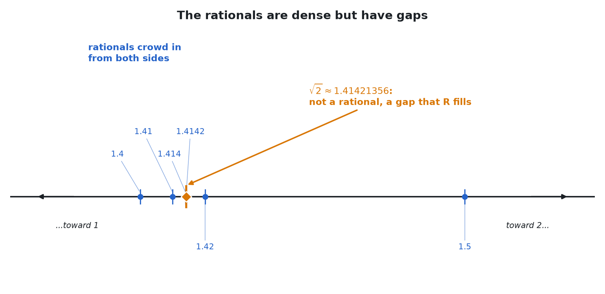
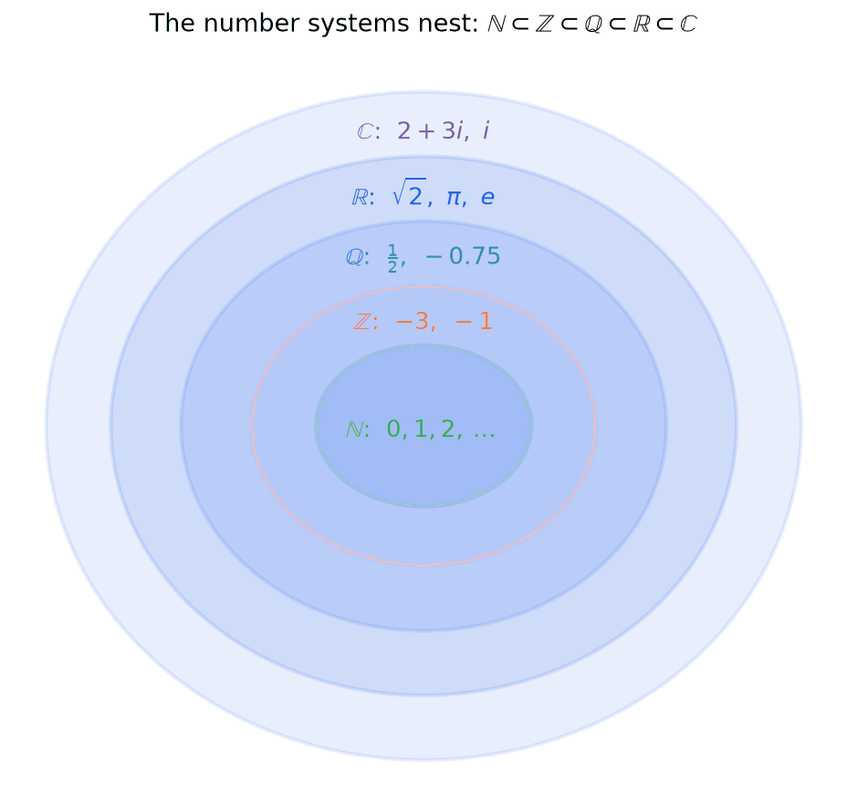
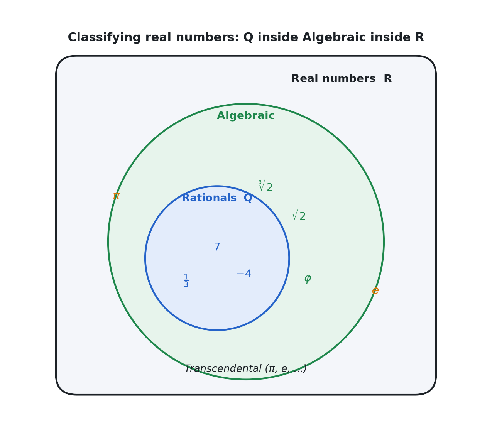

> [!abstract] Prerequisites & where this leads <!-- slt-nav -->
> **Builds on:** [Set Theory](./set-theory)
> **Leads to:** [Algebraic Structures](./algebraic-structures) · [complex-numbers](./complex-numbers)

The numbers we use every day did not arrive all at once. They were built up, one layer at a time, each new layer added to repair a specific limitation of the one before it. You can count with the natural numbers, but you cannot always subtract. You can subtract with the integers, but you cannot always divide. You can divide with the rationals, but you cannot always take a limit. Following this chain of "but you cannot..." is the cleanest way to understand what each number system is *for*.

This page tells that story, shows how the systems nest inside one another, and then classifies the numbers that live within them.

## The Building-Up Story

### Natural numbers $\mathbb{N}$

The symbol $\mathbb{N}$ is read "the natural numbers" (or just "N"). These are the counting numbers:

$$\mathbb{N} = \{0, 1, 2, 3, \ldots\}.$$

**A convention to settle first.** There is a genuine disagreement about whether $\mathbb{N}$ starts at $0$ or at $1$. Set theorists and logicians usually include $0$ (an empty collection has a count, namely zero); some analysis and number-theory texts start at $1$. **This site includes $0$**, so $\mathbb{N} = \{0, 1, 2, \ldots\}$. When we need the positive naturals only, we write $\mathbb{N}_{>0} = \{1, 2, 3, \ldots\}$ or $\mathbb{Z}^{+}$.

The naturals do everything counting requires. If you add two naturals you get a natural, and if you multiply two naturals you get a natural. In the language of [Algebraic Structures](./algebraic-structures), $\mathbb{N}$ is *closed* under addition and multiplication: the operation never takes you outside the set.

**But you cannot always subtract.** The expression $3 - 5$ has no answer inside $\mathbb{N}$. There is no natural number that counts "two fewer than nothing." Subtraction is only partially defined, and that is the limitation we fix next.

### Integers $\mathbb{Z}$

The symbol $\mathbb{Z}$ is read "the integers" (from the German *Zahlen*, "numbers"). We extend $\mathbb{N}$ by adjoining a negative for every positive number:

$$\mathbb{Z} = \{\ldots, -3, -2, -1, 0, 1, 2, 3, \ldots\}.$$

Now every subtraction has an answer: $3 - 5 = -2$, and $-2$ is a bona fide integer. Concretely, each negative number $-n$ is defined to be the thing you add to $n$ to get $0$ (its *additive inverse*). Once inverses exist, subtraction is just "add the inverse," and it is defined everywhere.

The integers are closed under addition, subtraction, and multiplication. In the vocabulary of [Algebraic Structures](./algebraic-structures), $(\mathbb{Z}, +)$ is a *group* and $(\mathbb{Z}, +, \times)$ is a *ring*.

**But you cannot always divide.** The expression $1 \div 2$ has no answer inside $\mathbb{Z}$: there is no integer $n$ with $2n = 1$. Division, like subtraction before it, is only partially defined. That is the next thing to fix.

### Rational numbers $\mathbb{Q}$

The symbol $\mathbb{Q}$ is read "the rationals" (from *quotient*). We extend $\mathbb{Z}$ by adjoining a quotient $p/q$ for every pair of integers $p$ and $q$ with $q \neq 0$:

$$\mathbb{Q} = \left\{\, \frac{p}{q} \;\middle|\; p, q \in \mathbb{Z},\; q \neq 0 \,\right\}.$$

The number $\frac{p}{q}$ is read "$p$ over $q$." Two fractions name the same rational when they cross-multiply equally: $\frac{p}{q} = \frac{r}{s}$ exactly when $ps = qr$. So $\frac{1}{2} = \frac{2}{4} = \frac{3}{6}$, all the same point.

Now every division by a nonzero number has an answer, because every nonzero rational $p/q$ has a multiplicative inverse $q/p$ (their product is $\frac{p}{q}\cdot\frac{q}{p} = 1$). In the terms of [Algebraic Structures](./algebraic-structures), $\mathbb{Q}$ is the first system on our list that is a *field*: you can add, subtract, multiply, and divide (except by zero) and never leave the set.

**Decimals: terminating and repeating.** Every rational, written as a decimal, either *terminates* or *eventually repeats* forever:

$$\tfrac{1}{4} = 0.25 \quad(\text{terminates}), \qquad \tfrac{1}{3} = 0.3333\ldots = 0.\overline{3} \quad(\text{repeats}),$$

where the bar in $0.\overline{3}$ marks the block of digits that repeats without end. This is not a coincidence: dividing $p$ by $q$ by long division produces only $q$ possible remainders, so a remainder must eventually recur, and once a remainder recurs the digits cycle. The converse holds too, as the worked example below shows.

**But there are gaps.** Consider the diagonal of a unit square. By the Pythagorean theorem its length $d$ satisfies $d^2 = 1^2 + 1^2 = 2$. There *ought* to be a number whose square is $2$, yet **no rational number squares to $2$**. The classic proof supposes $\sqrt{2} = p/q$ in lowest terms, deduces that $p$ and $q$ are both even, and hits a contradiction; it is carried out in full in [Real Analysis](./real-analysis), and the underlying style of argument appears in [Set Theory](./set-theory). The rationals are riddled with such holes: points the number line clearly wants but $\mathbb{Q}$ does not supply. That is the gap we fill next.

### Real numbers $\mathbb{R}$

The symbol $\mathbb{R}$ is read "the reals." Informally, the reals are all the points on a continuous, gapless number line, the rationals *together with* every irrational number like $\sqrt{2}$, $\pi$, and $e$ that fills the holes.

Making "gapless" precise is the whole content of the **completeness axiom**: every *nonempty* set of reals that is bounded above has a *least upper bound* inside $\mathbb{R}$. Completeness is what guarantees that $\sqrt{2}$ actually exists (it is the least upper bound of all rationals whose square is below $2$), and it is the foundation on which limits, continuity, derivatives, and integrals are built. The precise statement and its consequences are developed in [Real Analysis](./real-analysis).

$\mathbb{R}$ is a field, like $\mathbb{Q}$, but it adds completeness, and that single extra property is what makes calculus possible.

**But you still cannot solve every equation.** The equation

$$x^2 + 1 = 0$$

has no real solution, because $x^2 \geq 0$ for every real $x$, so $x^2 + 1 \geq 1 > 0$ always. No amount of filling gaps on the number line produces a square root of $-1$. That is the last limitation we fix.

### Complex numbers $\mathbb{C}$

The symbol $\mathbb{C}$ is read "the complex numbers." We adjoin a single new number $i$, read "$i$," defined by the rule

$$i^2 = -1,$$

and then take every combination $a + bi$ with $a, b \in \mathbb{R}$:

$$\mathbb{C} = \{\, a + bi \mid a, b \in \mathbb{R} \,\}.$$

Here $a$ is the *real part* and $b$ the *imaginary part*. Now $x^2 + 1 = 0$ has solutions $x = i$ and $x = -i$. The construction, arithmetic, and geometry of these numbers are covered in [Complex Numbers](./complex-numbers).

The payoff is enormous and final. The **Fundamental Theorem of Algebra** says that *every* non-constant polynomial with complex coefficients has a complex root (see [Polynomial Functions](./polynomial-functions)). We say $\mathbb{C}$ is **algebraically closed**: you can never write down a polynomial equation that forces you outside $\mathbb{C}$ to solve it. The chain of "but you cannot..." finally stops here.

**Worked example: a quadratic with no real roots, solved in $\mathbb{C}$.** Consider $x^2 - 2x + 2 = 0$. Its discriminant is $b^2 - 4ac = (-2)^2 - 4(1)(2) = 4 - 8 = -4 < 0$, so there is no real solution. Over $\mathbb{C}$ the quadratic formula still runs, now that $\sqrt{-4} = 2i$ is available:
$$
x = \frac{2 \pm \sqrt{-4}}{2} = \frac{2 \pm 2i}{2} = 1 \pm i.
$$
Check the root $x = 1 + i$ by substitution: $(1 + i)^2 = 1 + 2i + i^2 = 2i$, so $(1 + i)^2 - 2(1 + i) + 2 = 2i - 2 - 2i + 2 = 0$, confirmed. The two roots $1 + i$ and $1 - i$ are complex conjugates, and there are exactly two of them for this degree-$2$ polynomial, precisely the count the Fundamental Theorem of Algebra promises (roots with multiplicity).

## The Containment $\mathbb{N} \subset \mathbb{Z} \subset \mathbb{Q} \subset \mathbb{R} \subset \mathbb{C}$

Each system we built contains the previous one as a genuine subset. The symbol $\subset$ is read "is a subset of" (see [Set Theory](./set-theory)):

$$\mathbb{N} \subset \mathbb{Z} \subset \mathbb{Q} \subset \mathbb{R} \subset \mathbb{C}.$$

Every natural number *is* an integer, every integer *is* a rational (write $n$ as $n/1$), every rational *is* a real, and every real $a$ *is* the complex number $a + 0i$. The systems nest like Russian dolls.

It helps to watch a few sample numbers find their innermost home:

| Number | Innermost system it lives in | Why not the one before |
| --- | --- | --- |
| $7$ | $\mathbb{N}$ | it is a counting number |
| $-4$ | $\mathbb{Z}$ | negative, so not a natural |
| $\tfrac{3}{5}$ | $\mathbb{Q}$ | not a whole number |
| $\sqrt{2}$ | $\mathbb{R}$ | irrational, so not a rational |
| $2 + 3i$ | $\mathbb{C}$ | has a nonzero imaginary part |

Each containment is *strict* (the $\subset$, not $\subseteq$): each layer contains numbers the previous one lacks, which is exactly why we needed to build it.

## Classifying Real Numbers

Inside $\mathbb{R}$ there are two independent ways to sort numbers. The first asks whether a number is a fraction; the second asks whether it solves a polynomial.

### Rational vs irrational

A real number is **rational** if it can be written as $p/q$ with integers $p, q$ and $q \neq 0$, and **irrational** otherwise. The cleanest test is the decimal expansion:

- **Rational** $\iff$ its decimal *terminates* or *eventually repeats*. Examples: $\tfrac{1}{3} = 0.\overline{3}$, $\tfrac{1}{4} = 0.25$, $\tfrac{2}{7} = 0.\overline{285714}$.
- **Irrational** $\iff$ its decimal runs forever with *no* repeating block. Examples: $\sqrt{2} = 1.41421356\ldots$ and $\pi = 3.14159265\ldots$

The word "irrational" here means "not a *ratio*," not "unreasonable."

**Worked example: a repeating decimal is a fraction.** The forward direction of the rule (rational implies terminating-or-repeating) we sketched earlier by long division. The converse, that any repeating decimal is rational, is proved by a clean trick. Take $x = 0.\overline{3}$ and multiply by $10$ to shift one repeating block:

$$
\begin{aligned}
x &= 0.3333\ldots \\
10x &= 3.3333\ldots \\
10x - x &= 3.3333\ldots - 0.3333\ldots \\
9x &= 3 \\
x &= \tfrac{3}{9} = \tfrac{1}{3}.
\end{aligned}
$$

Subtracting cancels the entire infinite repeating tail, leaving an ordinary equation.

**Worked example: a two-digit repeat.** For $y = 0.\overline{27} = 0.272727\ldots$ the repeating block has length $2$, so we shift by $100$:

$$
100y - y = 27.2727\ldots - 0.2727\ldots \;\Longrightarrow\; 99y = 27 \;\Longrightarrow\; y = \tfrac{27}{99} = \tfrac{3}{11}.
$$

The pattern generalizes: a block of length $k$ calls for multiplying by $10^k$.

Try both directions below: turn any fraction into its decimal (and watch the repeating block emerge from long division), or turn a repeating decimal back into a fraction with the shift-and-subtract trick worked out step by step.

<iframe src="/static/interactive/decimal-fraction-converter.html" width="100%" height="600" style="border:none;"></iframe>

### Algebraic vs transcendental

A second, deeper classification. A real number is **algebraic** if it is a root of some nonzero polynomial with integer coefficients, and **transcendental** if it is not.

- $\sqrt{2}$ is algebraic: it is a root of $x^2 - 2 = 0$.
- The golden ratio $\varphi = \tfrac{1 + \sqrt{5}}{2}$ is algebraic: it is a root of $x^2 - x - 1 = 0$.
- Every rational $p/q$ is algebraic: it is a root of $qx - p = 0$.
- $\pi$ and $e$ are **transcendental**: no polynomial with integer coefficients has either as a root. (These facts are hard to prove; they were established in the late nineteenth century.)

The two classifications relate as follows. Every rational is algebraic, and every transcendental number is irrational, but not conversely: $\sqrt{2}$ is irrational yet still algebraic. So "algebraic" is a strictly larger, more forgiving class than "rational."

A striking fact for later: **most real numbers are transcendental.** The algebraic numbers, despite including every rational and every root you can build by hand, form a *countable* set, whereas $\mathbb{R}$ is *uncountable*. In the precise sense of the next section, the transcendental numbers vastly outnumber the algebraic ones, even though the two celebrities we can name are $\pi$ and $e$.

The two classifications nest cleanly: the rationals sit inside the algebraic numbers, which sit inside the reals, with the transcendentals filling the outermost region.

## How Big Are These Sets? (cardinality)

Infinite sets can still have different sizes, and the number systems split cleanly into two size classes. The sets $\mathbb{N}$, $\mathbb{Z}$, and $\mathbb{Q}$ are all **countably infinite**: their elements can be listed in an endless sequence, so they all have the *same* size, written $\aleph_0$ ("aleph-null"). Remarkably, this means there are exactly as many fractions as counting numbers. By contrast, $\mathbb{R}$ and $\mathbb{C}$ are **uncountable**: no list can exhaust them, so they are strictly larger than $\mathbb{Q}$. The proof that $\mathbb{R}$ cannot be listed (Cantor's diagonal argument) and the meaning of countability are developed in [Set Theory](./set-theory).

**Worked example: the first eight rationals, listed.** Arrange the positive fractions $p/q$ in a grid ($p$ picks the row, $q$ the column) and sweep along diagonals of constant $p + q$, skipping any fraction not in lowest terms because it has already appeared:
$$
\underbrace{\tfrac{1}{1}}_{1},\ \ \underbrace{\tfrac{1}{2}}_{2},\ \underbrace{\tfrac{2}{1}}_{3},\ \ \underbrace{\tfrac{1}{3}}_{4},\ \big[\tfrac{2}{2}\ \text{skip} = 1\big],\ \underbrace{\tfrac{3}{1}}_{5},\ \ \underbrace{\tfrac{1}{4}}_{6},\ \underbrace{\tfrac{2}{3}}_{7},\ \underbrace{\tfrac{3}{2}}_{8},\ \tfrac{4}{1},\ \ldots
$$
The diagonals are $p + q = 2$, then $3$, then $4$, then $5$; within each we read the fractions off in order. Every positive rational eventually collects a unique counting-number tag, so $\mathbb{Q}^{+}$ is countable, and interleaving each fraction with its negative (plus $0$) tags all of $\mathbb{Q}$. The skip step is what keeps the tagging one-to-one: without it $\tfrac{2}{2}, \tfrac{3}{3}, \ldots$ would hand out several tickets to the single number $1$.

**Worked example: why no list of reals can be complete (diagonal sketch).** Suppose someone claims a list containing *every* real in $[0, 1]$. Look at just the first three entries and their first three decimal digits:
$$
\begin{aligned}
r_1 &= 0.\mathbf{3}72\ldots \\
r_2 &= 0.1\mathbf{5}9\ldots \\
r_3 &= 0.24\mathbf{8}\ldots
\end{aligned}
$$
Build a new number $d$ by walking the **diagonal** (the bold digits $3, 5, 8$) and changing each, say by "add $1$, wrapping $9$ to $0$," giving digits $4, 6, 9$, so $d = 0.469\ldots$ Then $d$ differs from $r_1$ in place $1$, from $r_2$ in place $2$, from $r_3$ in place $3$, and running the same recipe down the whole list, $d$ differs from the $n$-th listed number in place $n$. So $d$ appears on no row: the list was incomplete. Since *every* candidate list fails the identical way, $\mathbb{R}$ is uncountable, strictly bigger than $\mathbb{Q}$. (The full argument, including the harmless $0.4999\ldots = 0.5000\ldots$ caveat, is in [Set Theory](./set-theory).)

The size of $\mathbb{R}$ has its own name: the **cardinality of the continuum**, written $\mathfrak{c}$ (read "c"), and it equals $2^{\aleph_0}$ (the number of subsets of $\mathbb{N}$). The complex numbers are no bigger: because $\mathbb{C}$ is just pairs of reals, $|\mathbb{C}| = |\mathbb{R}^2| = \mathfrak{c}$, so "adding a second dimension" does not increase cardinality. The **algebraic numbers** are countable (each is a root of one of countably many integer polynomials, each with finitely many roots), which is why the transcendentals, the uncountable remainder, are the overwhelming majority. Whether any size sits strictly *between* $\aleph_0$ and $\mathfrak{c}$ is the famous **Continuum Hypothesis**, which Gödel and Cohen showed can neither be proved nor disproved from the standard axioms of set theory.

## How the Systems Are Actually Constructed

The building-up story above is the *motivation*. But "adjoin a negative" and "adjoin a quotient" are promissory notes; a foundations course cashes them out with explicit constructions that use nothing but [sets](./set-theory) and equivalence relations. The pattern is the same at every step: **form pairs of objects from the previous system, then glue together the pairs that ought to name the same number** (an [equivalence relation](./set-theory)), so each new number is an equivalence class. The reals are the one exception, built by *completing* rather than pairing.

### The naturals, from sets

The naturals are pinned down by the **Peano axioms**: $0$ is a natural number; every $n$ has a **successor** $S(n)$; $0$ is not the successor of anything; $S$ is injective (different numbers have different successors); and **induction** holds (any set containing $0$ and closed under $S$ is all of $\mathbb{N}$). These five conditions determine $\mathbb{N}$ uniquely up to relabeling, and induction is exactly the proof principle developed in [propositional logic](./propositional-logic-zeroth-order-logic).

Set theory then supplies concrete objects to *be* the naturals, the **von Neumann encoding**: each number is the set of all smaller numbers.
$$
0 = \varnothing, \qquad S(n) = n \cup \{n\}, \qquad\text{so}\qquad 1 = \{0\},\ \ 2 = \{0, 1\},\ \ 3 = \{0, 1, 2\},\ \ldots
$$
This is elegant on two counts: the number $n$ is a set with exactly $n$ elements, and the order relation $m < n$ is simply $m \in n$. Addition and multiplication are then defined by recursion.

**Worked example: build the first five naturals.** Start from nothing and apply $S(n) = n \cup \{n\}$ over and over, each step throwing the just-built set in alongside its own elements:
$$
\begin{aligned}
0 &= \varnothing, \\
1 &= 0 \cup \{0\} = \{0\}, \\
2 &= 1 \cup \{1\} = \{0\} \cup \{1\} = \{0, 1\}, \\
3 &= 2 \cup \{2\} = \{0, 1\} \cup \{2\} = \{0, 1, 2\}, \\
4 &= 3 \cup \{3\} = \{0, 1, 2\} \cup \{3\} = \{0, 1, 2, 3\}.
\end{aligned}
$$
Two promised facts fall straight out. First, $n$ genuinely *has* $n$ elements: $4 = \{0, 1, 2, 3\}$ has four. Second, order *is* membership: the claim $2 < 4$ shows up as $2 \in 4$, because $2$ is literally one of the elements listed inside $4$. (Subset tracks order too: $2 = \{0, 1\} \subset \{0, 1, 2, 3\} = 4$.) Nothing here is assumed about "number"; it is all sets and the single successor rule.

### The integers, from pairs of naturals

An integer is meant to be a *difference* $a - b$ of naturals, but subtraction is what we lack. So represent the difference by the **pair** $(a, b)$ and declare two pairs equal when the differences they intend agree, using only addition (which we do have):
$$
\mathbb{Z} = (\mathbb{N} \times \mathbb{N}) / {\sim}, \qquad (a, b) \sim (c, d) \iff a + d = b + c.
$$
The class of $(a, b)$ is the integer "$a - b$": so $(5, 3), (2, 0), (100, 98)$ all name $+2$, while $(3, 5)$ names $-2$. Addition is componentwise, $(a,b) + (c,d) = (a+c,\, b+d)$, and multiplication is $(a,b)(c,d) = (ac + bd,\ ad + bc)$ (exactly what expanding $(a-b)(c-d)$ predicts). The naturals sit inside as the classes of $(n, 0)$.

**Worked example: which pairs name the same integer?** The rule $(a,b) \sim (c,d) \iff a + d = b + c$ is just "$a - b = c - d$ rewritten without ever subtracting." Test $(5, 3)$ against $(2, 0)$: the intended differences are $5 - 3 = 2$ and $2 - 0 = 2$, and the rule checks $5 + 0 = 3 + 2$, that is $5 = 5$. True, so $(5, 3) \sim (2, 0)$ and both name $+2$. Now contrast $(5, 3)$ with $(3, 5)$: the rule asks $5 + 5 = 3 + 3$, that is $10 = 6$, which is false, so these are *not* equivalent, and indeed $(3, 5)$ names $3 - 5 = -2$, the opposite integer. The arithmetic descends to classes cleanly: $(5, 3) + (1, 4) = (6, 7)$, whose difference $6 - 7 = -1$ matches $(+2) + (-3) = -1$, and $(5, 3)(1, 4) = (5\cdot1 + 3\cdot4,\ 5\cdot4 + 3\cdot1) = (17, 23)$, whose difference $17 - 23 = -6$ matches $(+2)(-3) = -6$.

### The rationals, from pairs of integers

A rational is meant to be a quotient $p/q$, so pair a numerator with a nonzero denominator and glue pairs by cross-multiplication (which needs only integer multiplication):
$$
\mathbb{Q} = \big(\mathbb{Z} \times (\mathbb{Z} \setminus \{0\})\big) / {\sim}, \qquad (p, q) \sim (r, s) \iff ps = qr.
$$
The class of $(p, q)$ is the fraction $p/q$, and the equivalence is precisely why $\tfrac{1}{2} = \tfrac{2}{4} = \tfrac{3}{6}$. Addition is $(p,q) + (r,s) = (ps + rq,\ qs)$ and multiplication is $(p,q)(r,s) = (pr,\ qs)$, the usual fraction rules. The integers embed as the classes of $(n, 1)$.

**Worked example: when do two fractions match?** The rule $(p, q) \sim (r, s) \iff ps = qr$ is cross-multiplication. Check $(1, 2)$ against $(2, 4)$: it asks $1 \cdot 4 = 2 \cdot 2$, that is $4 = 4$, true, so $\tfrac{1}{2} = \tfrac{2}{4}$ as it must. Check $(1, 2)$ against $(1, 3)$: now $1 \cdot 3 = 2 \cdot 1$ asks $3 = 2$, false, so $\tfrac{1}{2} \neq \tfrac{1}{3}$. The point of phrasing equality this way is that it decides using only integer *products*, never a division we have not yet built.

### The reals, by completing the rationals

Here the pattern changes: the reals fill *gaps*, and you cannot reach an irrational by any finite pairing of rationals. Two standard constructions both work.

- **Dedekind cuts.** A real number *is* a way of splitting $\mathbb{Q}$ into a downward-closed lower set $A$ with no greatest element and its complement. The cut for $\sqrt{2}$ is $A = \{x \in \mathbb{Q} : x < 0 \text{ or } x^2 < 2\}$: the number is identified with the gap it marks in the rationals. Order is just set inclusion of the lower sets, and completeness is automatic.
- **Cauchy sequences.** A real is an equivalence class of Cauchy sequences of rationals (sequences whose terms bunch arbitrarily close together), where two sequences are identified when their difference tends to $0$. This realizes $\mathbb{R}$ as the **completion** of $\mathbb{Q}$, the same move that later builds the [$p$-adic numbers](./hypercomplex-numbers) from a *different* notion of distance.

**Worked example: the cut that *is* $\sqrt{2}$.** The lower set is $A = \{x \in \mathbb{Q} : x < 0 \text{ or } x^2 < 2\}$. Sort a few rationals with that test:

- *In $A$:* $1$ (since $1^2 = 1 < 2$), $1.4$ ($1.96 < 2$), $1.41$ ($1.9881 < 2$), and every negative rational such as $-5$.
- *Not in $A$:* $1.5$ ($2.25 > 2$), $1.42$ ($2.0164 > 2$), $2$ ($4 > 2$).

So $A$ collects *every rational below $\sqrt{2}$* while never containing $\sqrt{2}$ itself (no rational squares to $2$). The decisive feature is that $A$ has **no greatest element**: given any $x \in A$ you can always nudge up to a slightly larger rational still squaring below $2$, so the "top edge" of $A$ is exactly the gap where $\sqrt{2}$ ought to sit. Declaring the real number $\sqrt{2}$ to *be* that cut is the whole idea; order between cuts is just set inclusion of their lower sets.

**Worked example: the Cauchy sequence for $\sqrt{2}$.** Take the truncated decimal approximations
$$1,\ 1.4,\ 1.41,\ 1.414,\ 1.4142,\ \ldots$$
Consecutive terms bunch together fast: the gaps are $|1.4 - 1| = 0.4$, then $|1.41 - 1.4| = 0.01$, then $|1.414 - 1.41| = 0.004$, then $|1.4142 - 1.414| = 0.0002$, shrinking below any tolerance you name (that is the *Cauchy* condition). Their squares climb toward $2$: $1.96,\ 1.9881,\ 1.999396,\ 1.99996164,\ \ldots$ The sequence plainly *wants* a limit, yet no rational is that limit, so $\mathbb{Q}$ has a hole exactly here. Promoting the sequence itself to a new number (and identifying it with any other rational sequence closing in on the same spot) fills the hole.

Both constructions yield the same object up to isomorphism, the unique complete ordered field, as [Real Analysis](./real-analysis) develops.

### The complex numbers, as a quotient ring

Finally $\mathbb{C}$ needs no mystical "invent $\sqrt{-1}$." Two equivalent concrete constructions:

- **Ordered pairs.** $\mathbb{C} = \mathbb{R} \times \mathbb{R}$ with addition componentwise and multiplication $(a, b)(c, d) = (ac - bd,\ ad + bc)$. Then $i = (0, 1)$ literally satisfies $i^2 = (0,1)(0,1) = (-1, 0) = -1$. No new axioms, just a multiplication rule.
- **A quotient ring.** $\mathbb{C} = \mathbb{R}[x] / (x^2 + 1)$: real-coefficient polynomials with the single relation $x^2 + 1 = 0$ imposed, so $x$ *becomes* a square root of $-1$. This is the [algebraic structures](./algebraic-structures) way of saying "adjoin a root of $x^2 + 1$," and it is the first rung of the [Cayley–Dickson tower](./hypercomplex-numbers).

**Worked example: multiplying as ordered pairs.** Take $(2, 3)$ and $(1, 1)$, meaning $2 + 3i$ and $1 + i$. The rule $(a, b)(c, d) = (ac - bd,\ ad + bc)$ gives
$$(2 \cdot 1 - 3 \cdot 1,\ \ 2 \cdot 1 + 3 \cdot 1) = (-1, 5),$$
that is $-1 + 5i$. Expanding the familiar way agrees: $(2 + 3i)(1 + i) = 2 + 2i + 3i + 3i^2 = 2 + 5i - 3 = -1 + 5i$. The $-bd$ term in the rule is exactly the place where $i^2 = -1$ has been absorbed, which is why the construction needs no new axiom, only this multiplication.

The whole ladder, then, is four instances of one idea (pair-and-quotient) plus one completion, turning the informal "but you cannot..." into rigorous mathematics resting on set theory alone.

## Beyond the Complex Numbers

Since $\mathbb{C}$ is algebraically closed, extending it can never buy you new roots: the original motive for building each layer runs out. You can still extend further, but now every extension *trades away* a property rather than adding one. The **quaternions** $\mathbb{H}$ are four-dimensional numbers of the form $a + bi + cj + dk$; they give up *commutativity*, so multiplication depends on order ($ij = k$ but $ji = -k$), and in exchange they encode 3D rotations so cleanly that graphics and robotics rely on them. Push further and even more structure is surrendered (the octonions lose *associativity*), while entirely different constructions such as the *$p$-adic numbers* re-imagine what "close together" means. Each such system is best understood as a specific axiom deliberately given up, a perspective made precise in [Algebraic Structures](./algebraic-structures).

For the full story, including the Cayley–Dickson construction that generates this tower, Hurwitz's theorem on why it ends at the octonions, and the "sideways" extensions like dual numbers (which power automatic differentiation), see [Hypercomplex Numbers & Beyond](./hypercomplex-numbers).

## Summary

| System | Symbol | Fixes | Key property gained |
| --- | --- | --- | --- |
| Naturals | $\mathbb{N}$ | counting | closed under $+, \times$ |
| Integers | $\mathbb{Z}$ | subtraction | additive inverses (a ring) |
| Rationals | $\mathbb{Q}$ | division | multiplicative inverses (a field) |
| Reals | $\mathbb{R}$ | gaps / limits | completeness |
| Complex | $\mathbb{C}$ | polynomial roots | algebraically closed |

The single sentence to remember: **each number system is the smallest one in which some previously impossible operation always works.** For how these operations are captured as axioms, see [Algebraic Structures](./algebraic-structures); for the way we actually write numbers down in binary and hexadecimal, see [Number Bases](./number-bases).
