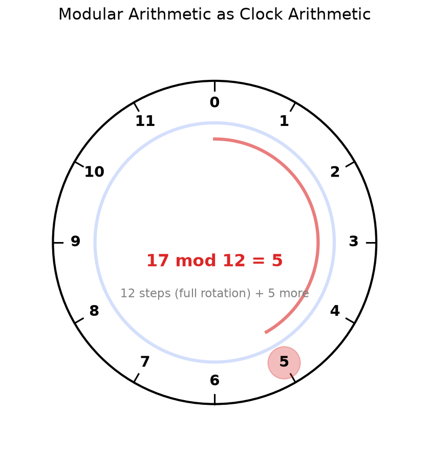

Number theory is about understanding the patterns and structure hidden in the whole numbers (0, 1, 2, 3, ...). At its core, it asks deceptively simple questions: Why can some numbers only be divided evenly by 1 and themselves? Is there a pattern to how prime numbers are distributed? These questions turn out to have deep consequences far beyond pure mathematics. Modern cryptography (RSA encryption), hash functions, and large parts of computer science rely directly on results from number theory.

**Number Theory:** The branch of mathematics dealing with properties and relationships of integers.

## Divisibility

**Divisibility:** An integer **a** is divisible by an integer **b** (where $b \neq 0$) if there exists an integer **k** such that $a = bk$.

**Notation:** $b \mid a$ (read as "b divides a")

**Example:**
- $3 \mid 12$ because $12 = 3 \times 4$
- $5 \nmid 13$ because there is no integer k such that $13 = 5k$

**Properties of Divisibility:**

1. **Reflexive:** $a \mid a$ for all $a \neq 0$
2. **Transitive:** If $a \mid b$ and $b \mid c$, then $a \mid c$
3. **Linear combination:** If $a \mid b$ and $a \mid c$, then $a \mid (bx + cy)$ for any integers x, y
4. **Product:** If $a \mid b$, then $a \mid bc$ for any integer c
5. **Division by GCD:** If $a \mid bc$ and $\gcd(a,b) = 1$, then $a \mid c$

## Greatest Common Divisor (GCD)

**Greatest Common Divisor:** The largest positive integer that divides both **a** and **b**. The GCD is used in simplifying fractions and in [Prime Factorization](./prime-factorization).

**Notation:** $\gcd(a, b)$ or $(a, b)$

**Definition:** $\gcd(a, b) = \max\{d \in \mathbb{Z}^+ : d \mid a \text{ and } d \mid b\}$

**Example:**
- $\gcd(12, 18) = 6$
- $\gcd(17, 19) = 1$ (coprime/relatively prime)

### Euclidean Algorithm

**Euclidean Algorithm:** Efficient method to compute GCD using repeated division.

**Algorithm:**
1. Divide **a** by **b** to get remainder **r**
2. Replace **a** with **b** and **b** with **r**
3. Repeat until remainder is 0
4. The last non-zero remainder is the GCD

**Example:** Find $\gcd(252, 105)$
```
252 = 105 × 2 + 42
105 = 42 × 2 + 21
42 = 21 × 2 + 0
```
$\gcd(252, 105) = 21$

### Extended Euclidean Algorithm

**Extended Euclidean Algorithm:** Finds integers **x** and **y** such that $ax + by = \gcd(a, b)$

**Example:** Express $\gcd(252, 105) = 21$ as a linear combination
- $21 = 105 - 42 \times 2$
- $21 = 105 - (252 - 105 \times 2) \times 2$
- $21 = 105 \times 5 - 252 \times 2$
- Result: $252 \times (-2) + 105 \times 5 = 21$

## Least Common Multiple (LCM)

**Least Common Multiple:** The smallest positive integer that is divisible by both **a** and **b**.

**Notation:** $\text{lcm}(a, b)$ or $[a, b]$

**Definition:** $\text{lcm}(a, b) = \min\{m \in \mathbb{Z}^+ : a \mid m \text{ and } b \mid m\}$

**Example:**
- $\text{lcm}(12, 18) = 36$
- $\text{lcm}(7, 5) = 35$

**Relationship between GCD and LCM:**
$$\gcd(a, b) \times \text{lcm}(a, b) = a \times b$$

**Example:** $\gcd(12, 18) \times \text{lcm}(12, 18) = 6 \times 36 = 216 = 12 \times 18$ ✓

## Modular Arithmetic

**Modular Arithmetic:** A system of arithmetic for integers where numbers "wrap around" after reaching a certain value (the modulus). Modular arithmetic is the foundation of modern cryptography (RSA) and hash functions in computer science.

**Intuition - Clock Arithmetic:**

Think of a 12-hour clock. When it's 10 o'clock and you add 5 hours, you get 3 o'clock (not 15 o'clock). This is modular arithmetic: $10 + 5 \equiv 3 \pmod{12}$.

The clock "wraps around" after 12. In general, modular arithmetic wraps around after reaching the modulus **n**.



**Why it matters:**
- Cryptography (RSA encryption, digital signatures)
- Hashing algorithms
- Computer science (array indexing, scheduling)
- Calendar calculations (day of week)
- Music theory (note intervals wrapping around octaves)

### Congruence

**Congruence Modulo n:** Two integers **a** and **b** are congruent modulo **n** if they have the same remainder when divided by **n**.

**Intuitive meaning:** "a and b are in the same position on the cycle"

**Notation:** $a \equiv b \pmod{n}$

**Definition:** $a \equiv b \pmod{n}$ if and only if $n \mid (a - b)$

**Example:**
- $17 \equiv 5 \pmod{12}$ because $17 - 5 = 12$ and $12 \mid 12$
- $23 \equiv 3 \pmod{10}$ because $23 - 3 = 20$ and $10 \mid 20$
- $-8 \equiv 4 \pmod{12}$ because $-8 - 4 = -12$ and $12 \mid -12$

### Properties of Congruence

Congruence is an **equivalence relation**:
1. **Reflexive:** $a \equiv a \pmod{n}$
2. **Symmetric:** If $a \equiv b \pmod{n}$, then $b \equiv a \pmod{n}$
3. **Transitive:** If $a \equiv b \pmod{n}$ and $b \equiv c \pmod{n}$, then $a \equiv c \pmod{n}$

**Arithmetic Properties:**

If $a \equiv b \pmod{n}$ and $c \equiv d \pmod{n}$, then:
1. **Addition:** $a + c \equiv b + d \pmod{n}$
2. **Subtraction:** $a - c \equiv b - d \pmod{n}$
3. **Multiplication:** $ac \equiv bd \pmod{n}$
4. **Power:** $a^k \equiv b^k \pmod{n}$ for any positive integer k

**Example:**
- $17 \equiv 5 \pmod{12}$ and $23 \equiv 11 \pmod{12}$
- Addition: $17 + 23 = 40 \equiv 4 \pmod{12}$ and $5 + 11 = 16 \equiv 4 \pmod{12}$ ✓
- Multiplication: $17 \times 23 = 391 \equiv 7 \pmod{12}$ and $5 \times 11 = 55 \equiv 7 \pmod{12}$ ✓

### Modular Addition and Multiplication Tables

**Example - Arithmetic modulo 5:**

**Addition table ($\mathbb{Z}_5$):**

| + | 0 | 1 | 2 | 3 | 4 |
|---|---|---|---|---|---|
| 0 | 0 | 1 | 2 | 3 | 4 |
| 1 | 1 | 2 | 3 | 4 | 0 |
| 2 | 2 | 3 | 4 | 0 | 1 |
| 3 | 3 | 4 | 0 | 1 | 2 |
| 4 | 4 | 0 | 1 | 2 | 3 |

**Multiplication table ($\mathbb{Z}_5$):**

| × | 0 | 1 | 2 | 3 | 4 |
|---|---|---|---|---|---|
| 0 | 0 | 0 | 0 | 0 | 0 |
| 1 | 0 | 1 | 2 | 3 | 4 |
| 2 | 0 | 2 | 4 | 1 | 3 |
| 3 | 0 | 3 | 1 | 4 | 2 |
| 4 | 0 | 4 | 3 | 2 | 1 |

### Modular Inverses

**Modular Inverse:** An integer **a** has a multiplicative inverse modulo **n** if there exists an integer **x** such that $ax \equiv 1 \pmod{n}$.

**Notation:** $a^{-1} \pmod{n}$

**Intuition:** Just like $3 \times \frac{1}{3} = 1$ in regular arithmetic, we want $3 \times ? \equiv 1$ in modular arithmetic. The "?" is the modular inverse.

**Existence:** **a** has an inverse modulo **n** if and only if $\gcd(a, n) = 1$ (a and n are coprime).

**Why coprime matters:** If $\gcd(a, n) = d > 1$, then $ax$ is always divisible by $d$, but 1 is not divisible by $d$. So $ax$ can never equal 1 (or any number congruent to 1 mod n).

**Example 1:** Find the inverse of 3 modulo 7
- We need $3x \equiv 1 \pmod{7}$
- Try values: $3 \times 1 = 3$, $3 \times 2 = 6$, $3 \times 3 = 9 \equiv 2$, $3 \times 4 = 12 \equiv 5$, $3 \times 5 = 15 \equiv 1$ ✓
- $3^{-1} \equiv 5 \pmod{7}$

**Example 2:** 6 has no inverse modulo 9
- $\gcd(6, 9) = 3 \neq 1$, so no inverse exists

**Finding inverses using Extended Euclidean Algorithm:**
- To find $a^{-1} \pmod{n}$, use extended Euclidean algorithm to find x, y such that $ax + ny = 1$
- Then $a^{-1} \equiv x \pmod{n}$

### Modular Division

**Modular Division:** To compute $\frac{a}{b} \pmod{n}$, find $b^{-1} \pmod{n}$ and compute $a \times b^{-1} \pmod{n}$.

**Example:** Compute $\frac{7}{3} \pmod{11}$
- Find $3^{-1} \pmod{11}$: $3 \times 4 = 12 \equiv 1 \pmod{11}$, so $3^{-1} \equiv 4$
- $\frac{7}{3} \equiv 7 \times 4 \equiv 28 \equiv 6 \pmod{11}$

**Note:** Division is only defined when the divisor is coprime to the modulus.

### Modular Exponentiation

**Modular Exponentiation:** Computing $a^b \pmod{n}$ efficiently.

**Naive approach:** Compute $a^b$ then take mod n (inefficient for large b)

**Efficient approach - Repeated squaring:**

**Example:** Compute $3^{13} \pmod{7}$
```
13 in binary = 1101
3^1 ≡ 3 (mod 7)
3^2 ≡ 9 ≡ 2 (mod 7)
3^4 ≡ 2^2 ≡ 4 (mod 7)
3^8 ≡ 4^2 ≡ 16 ≡ 2 (mod 7)

3^13 = 3^8 × 3^4 × 3^1 ≡ 2 × 4 × 3 ≡ 24 ≡ 3 (mod 7)
```

**Algorithm (Square-and-multiply):**
1. Express exponent in binary
2. Square base repeatedly
3. Multiply corresponding powers where binary digit is 1

### Fermat's Little Theorem

**Fermat's Little Theorem:** If **p** is prime and $\gcd(a, p) = 1$, then:
$$a^{p-1} \equiv 1 \pmod{p}$$

**Corollary:** $a^p \equiv a \pmod{p}$ for all integers a

**Application - Computing modular inverses:**
If p is prime and $\gcd(a, p) = 1$, then:
$$a^{-1} \equiv a^{p-2} \pmod{p}$$

**Example:** Find $3^{-1} \pmod{7}$
- $3^{-1} \equiv 3^{7-2} \equiv 3^5 \pmod{7}$
- $3^5 = 243 = 7 \times 34 + 5$, so $3^{-1} \equiv 5 \pmod{7}$

### Chinese Remainder Theorem

**Chinese Remainder Theorem (CRT):** Given a system of congruences with pairwise coprime moduli, there exists a unique solution modulo the product of the moduli.

**Intuition:** Imagine you know someone's position on multiple independent cycles (days of week, months, years). You can uniquely determine their position in the combined cycle.

**Real-world example:** "It's a Tuesday in March during a leap year" uniquely identifies a specific day in a 4-year cycle, even though each piece of information alone doesn't.

**Statement:** If $n_1, n_2, \ldots, n_k$ are pairwise coprime, then the system:
$$
\begin{cases}
x \equiv a_1 \pmod{n_1} \\
x \equiv a_2 \pmod{n_2} \\
\vdots \\
x \equiv a_k \pmod{n_k}
\end{cases}
$$

has a unique solution modulo $N = n_1 n_2 \cdots n_k$.

**Example:** Solve:
$$
\begin{cases}
x \equiv 2 \pmod{3} \\
x \equiv 3 \pmod{5} \\
x \equiv 2 \pmod{7}
\end{cases}
$$

**Solution:**
1. $N = 3 \times 5 \times 7 = 105$
2. $N_1 = 105/3 = 35$, $N_2 = 105/5 = 21$, $N_3 = 105/7 = 15$
3. Find inverses:
   - $35 y_1 \equiv 1 \pmod{3}$ → $2y_1 \equiv 1 \pmod{3}$ → $y_1 = 2$
   - $21 y_2 \equiv 1 \pmod{5}$ → $1y_2 \equiv 1 \pmod{5}$ → $y_2 = 1$
   - $15 y_3 \equiv 1 \pmod{7}$ → $1y_3 \equiv 1 \pmod{7}$ → $y_3 = 1$
4. $x \equiv 2(35)(2) + 3(21)(1) + 2(15)(1) \pmod{105}$
5. $x \equiv 140 + 63 + 30 \equiv 233 \equiv 23 \pmod{105}$

**Verification:**
- $23 = 7 \times 3 + 2$, so $23 \equiv 2 \pmod{3}$ ✓
- $23 = 4 \times 5 + 3$, so $23 \equiv 3 \pmod{5}$ ✓
- $23 = 3 \times 7 + 2$, so $23 \equiv 2 \pmod{7}$ ✓

**Why CRT works:**

Each congruence gives partial information about x. Since the moduli are coprime (no common factors), the constraints are independent - knowing x's remainder mod 3 tells you nothing about its remainder mod 5 or 7.

The combined information uniquely determines x within the cycle of length $3 \times 5 \times 7 = 105$. Any two numbers that satisfy all three congruences must differ by a multiple of 105.

**Simplified analogy:** If you know:
- Position in a 3-item cycle: slot 2
- Position in a 5-item cycle: slot 3  
- Position in a 7-item cycle: slot 2

There's exactly one position (23) in the combined 105-item cycle that matches all three slots.

**Applications:**
- Solving systems of linear congruences
- Fast modular exponentiation
- RSA cryptography
- Calendar calculations

## Euler's Totient Function

**Euler's Totient Function:** $\phi(n)$ counts the number of integers from 1 to n that are coprime to n.

**Definition:** $\phi(n) = |\{k \in \mathbb{Z} : 1 \leq k \leq n \text{ and } \gcd(k, n) = 1\}|$

**Intuition:** How many numbers from 1 to n can "see" n without any common factors blocking the view? These are the numbers that have modular inverses modulo n.

**Examples:**
- $\phi(1) = 1$ (only 1 is coprime to 1)
- $\phi(6) = 2$ (1 and 5 are coprime to 6)
- $\phi(7) = 6$ (1, 2, 3, 4, 5, 6 are all coprime to 7)
- $\phi(12) = 4$ (1, 5, 7, 11 are coprime to 12)

**Formula for prime p:** $\phi(p) = p - 1$

**Formula for prime power:** $\phi(p^k) = p^k - p^{k-1} = p^{k-1}(p - 1)$

**Formula for coprime integers:** If $\gcd(m, n) = 1$, then $\phi(mn) = \phi(m)\phi(n)$

**General formula using prime factorization:**
If $n = p_1^{k_1} p_2^{k_2} \cdots p_r^{k_r}$, then:
$$\phi(n) = n \left(1 - \frac{1}{p_1}\right)\left(1 - \frac{1}{p_2}\right) \cdots \left(1 - \frac{1}{p_r}\right)$$

**Example:** Find $\phi(36)$
- $36 = 2^2 \times 3^2$
- $\phi(36) = 36 \left(1 - \frac{1}{2}\right)\left(1 - \frac{1}{3}\right) = 36 \times \frac{1}{2} \times \frac{2}{3} = 12$

### Euler's Theorem

**Euler's Theorem:** If $\gcd(a, n) = 1$, then:
$$a^{\phi(n)} \equiv 1 \pmod{n}$$

**Note:** Fermat's Little Theorem is a special case where n is prime (since $\phi(p) = p - 1$).

**Application:** Computing modular inverses when n is not prime:
$$a^{-1} \equiv a^{\phi(n) - 1} \pmod{n}$$

