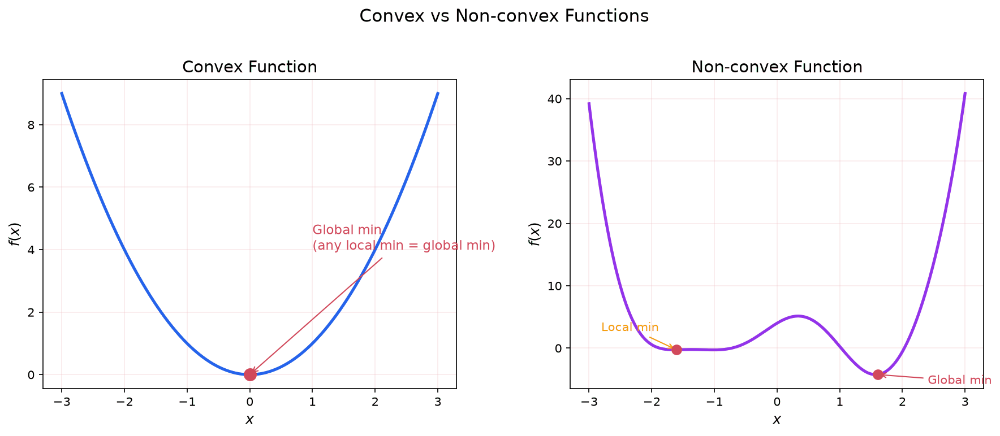
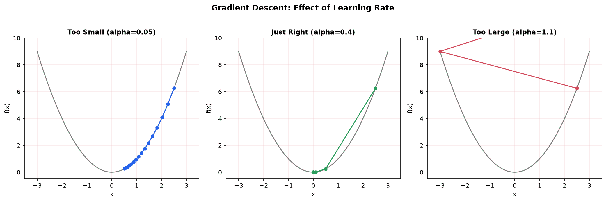
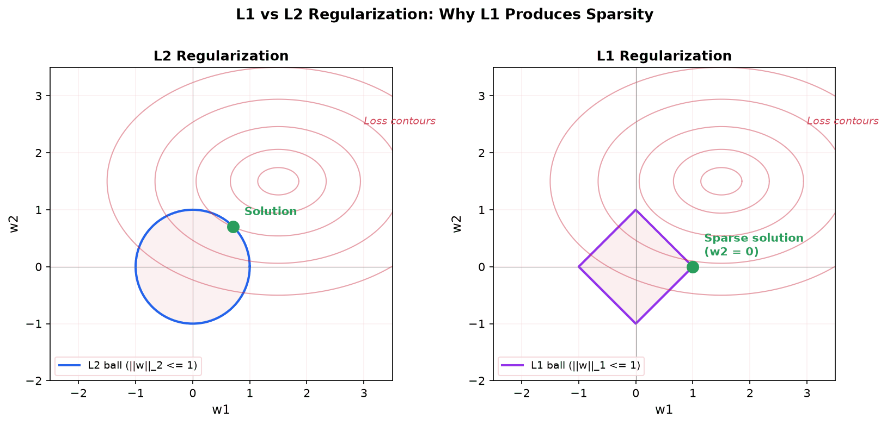

Optimization is the mathematical framework for finding the best solution from a set of possibilities. "Best" means minimizing (or maximizing) some numerical measure of quality. Almost every machine learning algorithm reduces to an optimization problem: find the model parameters that minimize a loss function.

This page builds on [Multivariable Calculus](./multivariable-calculus) (gradients, Hessians, basic gradient descent) and [Linear Algebra for Computation](./linear-algebra-computation) (positive definiteness, condition numbers, matrix calculus). Where that page introduced gradient descent as a first application, here we treat optimization as its own subject in full depth.

## What Is Optimization?

An optimization problem has three components:

1. **Objective function** $f(x)$: the function to minimize (or maximize). Also called the cost function, loss function, or energy function depending on context.
2. **Decision variables** $x$: the quantities you can adjust. In ML, these are model parameters (weights and biases).
3. **Constraints** (optional): restrictions on which values of $x$ are allowed.

The general form of a minimization problem is:

$$
\min_{x} f(x) \quad \text{subject to constraints on } x
$$

The set of all $x$ satisfying the constraints is called the **feasible set** (or feasible region). If there are no constraints, the problem is **unconstrained**.

**Maximization vs. minimization:** These are equivalent. Maximizing $f(x)$ is the same as minimizing $-f(x)$. By convention, optimization theory focuses on minimization.

**Why this matters for ML:** Training a neural network means solving $\min_\theta \mathcal{L}(\theta)$, where $\theta$ collects all weights and biases and $\mathcal{L}$ is the loss (e.g., cross-entropy). The feasible set is typically all of $\mathbb{R}^n$ (unconstrained), though regularization introduces implicit constraints.

## Unconstrained Optimization

### Critical Points

A **critical point** (or stationary point) is a point where the gradient vanishes:

$$
\nabla f(x^*) = \mathbf{0}
$$

At a critical point, there is no direction of steepest ascent or descent. The function is "flat" in every direction (to first order).

Critical points come in three flavors:

- **Local minimum:** $f(x^*) \leq f(x)$ for all $x$ near $x^*$
- **Local maximum:** $f(x^*) \geq f(x)$ for all $x$ near $x^*$
- **Saddle point:** neither a minimum nor a maximum; $f$ increases in some directions and decreases in others

### First-Order Necessary Condition

If $x^*$ is a local minimum of a differentiable function $f$, then $\nabla f(x^*) = \mathbf{0}$.

This is necessary but not sufficient. A zero gradient could indicate a maximum or saddle point. To distinguish them, we need second-order information.

### Second-Order Conditions

The **Hessian matrix** $H$ (or $\nabla^2 f$) contains all second partial derivatives (see [Multivariable Calculus](./multivariable-calculus) for a full treatment). At a critical point $x^*$ where $\nabla f(x^*) = \mathbf{0}$:

- If $H(x^*)$ is **positive definite** (all eigenvalues $> 0$): $x^*$ is a **local minimum**
- If $H(x^*)$ is **negative definite** (all eigenvalues $< 0$): $x^*$ is a **local maximum**
- If $H(x^*)$ has both positive and negative eigenvalues: $x^*$ is a **saddle point**
- If $H(x^*)$ is positive semidefinite but not positive definite: the test is inconclusive

Positive definiteness is covered in [Linear Algebra for Computation](./linear-algebra-computation).

### Local vs. Global Minima

A **local minimum** is a point where $f$ is smaller than at all nearby points. A **global minimum** is a point where $f$ is smaller than at all points in the domain.

A function can have many local minima. Gradient-based methods find local minima, and there is no general guarantee they find the global minimum. This is why the structure of the objective function matters enormously.

**When local = global:** If $f$ is convex (defined below), then every local minimum is automatically a global minimum. This is one of the most important results in optimization.

## Convexity in Depth

Convexity is the single most important structural property in optimization. Convex problems are "easy" (in a precise sense), and much of optimization theory is built around identifying or exploiting convexity.

### Convex Sets

A set $S$ is **convex** if, for any two points $x, y \in S$, the entire line segment between them lies in $S$:

$$
\lambda x + (1 - \lambda) y \in S \quad \text{for all } \lambda \in [0, 1]
$$

Intuition: a set is convex if you can walk in a straight line between any two points without leaving the set. A filled circle is convex. A crescent moon shape is not.

### Convex Functions

A function $f: \mathbb{R}^n \to \mathbb{R}$ is **convex** if its domain is a convex set and for all $x, y$ in its domain and all $\lambda \in [0, 1]$:

$$
f(\lambda x + (1 - \lambda)y) \leq \lambda f(x) + (1 - \lambda) f(y)
$$

Geometrically: the function lies below (or on) the chord connecting any two points on its graph. Equivalently, the region above the graph (the **epigraph**) is a convex set.

**Strictly convex:** The inequality is strict ($<$ instead of $\leq$) whenever $x \neq y$ and $0 < \lambda < 1$. A strictly convex function has at most one global minimum.

**Strongly convex:** There exists a constant $m > 0$ such that $f(x) - \frac{m}{2}\|x\|^2$ is convex. Equivalently, the Hessian satisfies $H(x) \succeq mI$ everywhere (all eigenvalues $\geq m$). Strong convexity guarantees a unique global minimum and faster convergence of gradient descent.

### Testing for Convexity

For a twice-differentiable function, the Hessian test is the standard approach:

- $f$ is convex if and only if $H(x) \succeq 0$ (positive semidefinite) for all $x$
- $f$ is strongly convex with parameter $m$ if $H(x) \succeq mI$ for all $x$

### Why Convexity Matters

1. **Every local minimum is a global minimum.** You never get trapped in a bad local minimum.
2. **Gradient descent converges.** For convex functions, gradient descent with appropriate step size is guaranteed to converge to the global minimum.
3. **Efficient algorithms exist.** Convex problems can be solved reliably and efficiently, even in high dimensions.

### Examples

- $f(x) = x^2$ is strictly convex ($f'' = 2 > 0$ everywhere)
- $f(x) = x^3$ is **not** convex ($f'' = 6x$ changes sign)
- $f(x) = |x|$ is convex (not differentiable at 0, but satisfies the definition)
- $f(x) = -\log x$ is strictly convex on $x > 0$ ($f'' = 1/x^2 > 0$)
- $f(x) = e^x$ is strictly convex ($f'' = e^x > 0$)
- The cross-entropy loss $-\sum y_i \log p_i$ is convex in the logits (before softmax)
- MSE loss for linear regression: $\|Xw - y\|^2$ is convex in $w$ (the Hessian is $2X^TX$, which is positive semidefinite)

**Interactive 3D visualizations** (drag to rotate, scroll to zoom):

<iframe src="/static/interactive/loss-landscape-convex.html" width="100%" height="550" style="border:none;"></iframe>

<iframe src="/static/interactive/loss-landscape-nonconvex.html" width="100%" height="550" style="border:none;"></iframe>

### Convex Optimization Problems

A **convex optimization problem** is one where:
- The objective function is convex
- The feasible set is a convex set (formed by convex inequality constraints and affine equality constraints)

Non-convex problems (like training deep neural networks) are much harder. The loss landscape has many local minima, saddle points, and flat regions. Remarkably, SGD with momentum still works well in practice, partly because most local minima in high-dimensional spaces tend to have similar loss values.

## Gradient Descent: Full Treatment

Gradient descent was introduced in [Multivariable Calculus](./multivariable-calculus). Here we develop it fully.

### The Algorithm

Starting from an initial guess $x_0$, repeat:

$$
x_{k+1} = x_k - \alpha \nabla f(x_k)
$$

where $\alpha > 0$ is the **learning rate** (or step size). The negative gradient $-\nabla f(x_k)$ points in the direction of steepest decrease of $f$ at $x_k$.

### Learning Rate

The learning rate $\alpha$ controls how far each step moves:

- **Too small:** Convergence is very slow. The algorithm takes many tiny steps.
- **Just right:** Steady progress toward the minimum.
- **Too large:** The algorithm overshoots, oscillates, or diverges entirely.

### Convergence Rate

For a convex function with Lipschitz-continuous gradient (bounded curvature), gradient descent with step size $\alpha = 1/L$ (where $L$ is the Lipschitz constant of the gradient) achieves:

$$
f(x_k) - f(x^*) \leq \frac{L \|x_0 - x^*\|^2}{2k}
$$

This is $O(1/k)$ convergence: to halve the error, you need roughly twice as many iterations.

For **strongly convex** functions with parameter $m$, the convergence is **linear** (exponential):

$$
f(x_k) - f(x^*) \leq \left(\frac{L - m}{L + m}\right)^{2k} (f(x_0) - f(x^*))
$$

The ratio $\kappa = L/m$ is the **condition number** of the problem. When $\kappa$ is large (the function is "elongated" with very different curvatures in different directions), convergence is slow. When $\kappa \approx 1$, convergence is fast. See [condition numbers](./linear-algebra-computation) in linear algebra.

### Worked Example: 2D Quadratic

Minimize $f(x, y) = 2x^2 + y^2 - 2xy - 4x$ starting from $(0, 0)$ with $\alpha = 0.1$.

The gradient is:

$$
\nabla f = \begin{bmatrix} 4x - 2y - 4 \\ 2y - 2x \end{bmatrix}
$$

**Iteration 0:** $x_0 = (0, 0)$, $\nabla f = (-4, 0)$, so $x_1 = (0, 0) - 0.1(-4, 0) = (0.4, 0)$.

**Iteration 1:** $\nabla f(0.4, 0) = (4(0.4) - 0 - 4,\; 0 - 2(0.4)) = (-2.4, -0.8)$, so $x_2 = (0.4, 0) - 0.1(-2.4, -0.8) = (0.64, 0.08)$.

**Iteration 2:** $\nabla f(0.64, 0.08) = (2.56 - 0.16 - 4,\; 0.16 - 1.28) = (-1.6, -1.12)$, so $x_3 = (0.64, 0.08) - 0.1(-1.6, -1.12) = (0.8, 0.192)$.

The iterates are approaching the minimum. Setting $\nabla f = 0$: $4x - 2y = 4$ and $2y - 2x = 0$, giving $y = x$ and $4x - 2x = 4$, so $x^* = (2, 2)$.

## Gradient Descent Variants

In machine learning, the objective function typically has the form:

$$
\mathcal{L}(\theta) = \frac{1}{N} \sum_{i=1}^{N} \ell(\theta; x_i, y_i)
$$

where the sum is over $N$ training examples. Computing the full gradient requires evaluating all $N$ terms, which is expensive when $N$ is large (millions of images, billions of tokens).

### Batch Gradient Descent

Use the full dataset to compute the exact gradient at each step. The gradient is smooth and predictable, but each iteration costs $O(N)$. Impractical for large datasets.

### Stochastic Gradient Descent (SGD)

Use a single randomly chosen sample to estimate the gradient:

$$
\theta_{k+1} = \theta_k - \alpha \nabla \ell(\theta_k; x_i, y_i)
$$

Each iteration is $O(1)$ instead of $O(N)$. The gradient estimate is **noisy** (high variance), but its expectation equals the true gradient. The noise can actually be beneficial: it helps escape shallow local minima and saddle points.

### Mini-Batch SGD

The practical compromise: use a random subset (mini-batch) of $B$ samples:

$$
\theta_{k+1} = \theta_k - \alpha \cdot \frac{1}{B} \sum_{j=1}^{B} \nabla \ell(\theta_k; x_{i_j}, y_{i_j})
$$

Typical batch sizes: 32 to 256. This balances computational efficiency (GPU parallelism favors larger batches) with gradient noise (smaller batches provide more noise, which can help generalization).

### Momentum

Standard SGD can oscillate in narrow valleys, zigzagging across the valley instead of moving along it. **Momentum** fixes this by accumulating a velocity term:

$$
v_{k+1} = \beta v_k + \nabla f(x_k)
$$

$$
x_{k+1} = x_k - \alpha v_{k+1}
$$

where $\beta \in [0, 1)$ is the momentum coefficient (typically 0.9).

**Intuition:** Think of a ball rolling downhill. It accumulates speed in consistent directions (along the valley) and the oscillations in inconsistent directions cancel out. Momentum accelerates convergence in low-curvature directions and dampens oscillations in high-curvature directions.

### Nesterov Accelerated Gradient (NAG)

A refinement of momentum: instead of computing the gradient at the current position, compute it at the "lookahead" position where momentum would take you:

$$
v_{k+1} = \beta v_k + \nabla f(x_k - \alpha \beta v_k)
$$

$$
x_{k+1} = x_k - \alpha v_{k+1}
$$

By evaluating the gradient at the anticipated next position, NAG can "correct course" before overshooting. It achieves optimal $O(1/k^2)$ convergence for convex functions (compared to $O(1/k)$ for vanilla gradient descent).

### AdaGrad

**Adaptive Gradient** gives each parameter its own learning rate, based on how much that parameter's gradient has varied:

$$
G_k = G_{k-1} + (\nabla f_k)^2 \quad \text{(element-wise square, accumulated)}
$$

$$
x_{k+1} = x_k - \frac{\alpha}{\sqrt{G_k + \epsilon}} \odot \nabla f_k
$$

where $\odot$ is element-wise multiplication and $\epsilon \approx 10^{-8}$ prevents division by zero.

Parameters with large accumulated gradients get smaller learning rates; parameters with small accumulated gradients get larger learning rates. This is good for **sparse features** (e.g., rare words in NLP): rare features get larger updates when they do appear.

**Problem:** $G_k$ only grows, so the learning rate monotonically decreases and eventually becomes too small to make progress.

### RMSProp

Fixes AdaGrad's learning rate decay by using an **exponential moving average** of squared gradients instead of accumulating all of them:

$$
G_k = \gamma G_{k-1} + (1 - \gamma)(\nabla f_k)^2
$$

$$
x_{k+1} = x_k - \frac{\alpha}{\sqrt{G_k + \epsilon}} \odot \nabla f_k
$$

where $\gamma \approx 0.9$. Old gradient information decays exponentially, so the effective learning rate adapts to the recent gradient magnitude rather than the entire history.

### Adam (Adaptive Moment Estimation)

Combines momentum (first moment) with RMSProp (second moment). Adam is the **default optimizer** for most deep learning.

First moment estimate (mean of gradients, like momentum):

$$
m_k = \beta_1 m_{k-1} + (1 - \beta_1) \nabla f_k
$$

Second moment estimate (mean of squared gradients, like RMSProp):

$$
v_k = \beta_2 v_{k-1} + (1 - \beta_2) (\nabla f_k)^2
$$

**Bias correction** (because $m_0 = v_0 = 0$ biases early estimates toward zero):

$$
\hat{m}_k = \frac{m_k}{1 - \beta_1^k}, \qquad \hat{v}_k = \frac{v_k}{1 - \beta_2^k}
$$

Update:

$$
x_{k+1} = x_k - \frac{\alpha}{\sqrt{\hat{v}_k} + \epsilon} \odot \hat{m}_k
$$

Default hyperparameters: $\beta_1 = 0.9$, $\beta_2 = 0.999$, $\epsilon = 10^{-8}$, $\alpha = 0.001$.

### AdamW (Adam with Decoupled Weight Decay)

Standard Adam applies weight decay (L2 regularization) by adding $\lambda \theta$ to the gradient before the adaptive scaling. This is mathematically incorrect: the adaptive learning rate also scales the regularization term, weakening it for parameters with large gradients.

**AdamW** decouples weight decay from the gradient update:

$$
x_{k+1} = x_k - \alpha\left(\frac{\hat{m}_k}{\sqrt{\hat{v}_k} + \epsilon} + \lambda x_k\right)
$$

The weight decay term $\lambda x_k$ is applied directly, not through the adaptive mechanism. AdamW is the standard optimizer for training large language models.

### Comparison Table

| Optimizer | Adaptive LR | Momentum | Key Advantage | Best For |
|-----------|:-----------:|:--------:|---------------|----------|
| SGD | No | No | Simple, well-understood theory | Convex problems |
| SGD + Momentum | No | Yes | Faster in narrow valleys | Computer vision (with scheduling) |
| AdaGrad | Yes | No | Handles sparse features | NLP with sparse embeddings |
| RMSProp | Yes | No | Adapts without LR decay | RNNs, non-stationary objectives |
| Adam | Yes | Yes | Robust default, fast early | Most deep learning tasks |
| AdamW | Yes | Yes | Correct weight decay | Large language models, transformers |

The following interactive visualization shows three optimizers navigating the Rosenbrock loss surface from the same starting point. Rotate the view to see how SGD wanders noisily, momentum builds speed but overshoots, and Adam adapts its step size per-parameter to converge fastest.

<iframe src="/static/interactive/optimizer-comparison.html" width="100%" height="550" style="border:none;"></iframe>

## Learning Rate Schedules

A fixed learning rate is rarely optimal. Early in training, a larger learning rate explores the loss landscape broadly. Late in training, a smaller learning rate fine-tunes toward the minimum. **Learning rate schedules** systematically adjust $\alpha$ during training.

### Constant

$\alpha_k = \alpha_0$ for all $k$. Simple but suboptimal. Requires careful tuning: too large and training is unstable, too small and training is slow.

### Step Decay

Multiply the learning rate by a factor $\gamma < 1$ every $T$ epochs:

$$
\alpha_k = \alpha_0 \cdot \gamma^{\lfloor k / T \rfloor}
$$

Example: start at 0.1, multiply by 0.1 every 30 epochs. Common in computer vision (ResNet training).

### Exponential Decay

$$
\alpha_k = \alpha_0 \cdot e^{-\lambda k}
$$

Smooth, continuous decay. The decay rate $\lambda$ controls how quickly the learning rate shrinks.

### Cosine Annealing

$$
\alpha_k = \alpha_{\min} + \frac{1}{2}(\alpha_0 - \alpha_{\min})\left(1 + \cos\left(\frac{k\pi}{T}\right)\right)
$$

The learning rate follows a cosine curve from $\alpha_0$ down to $\alpha_{\min}$ over $T$ steps. Smooth and requires fewer hyperparameters than step decay. Widely used in modern training.

### Warmup

Start with a very small learning rate and linearly increase it over the first $W$ steps:

$$
\alpha_k = \alpha_0 \cdot \frac{k}{W} \quad \text{for } k \leq W
$$

After warmup, switch to another schedule (cosine annealing, constant, etc.). Warmup prevents large, destructive updates early in training when the model's parameters are random and gradients may be large. It is especially important for Adam and transformer training.

### Cyclical Learning Rates

Oscillate the learning rate between a minimum and maximum value. The idea is that periodically increasing the learning rate helps escape sharp local minima, encouraging the optimizer to find flatter minima that generalize better.

### Why Scheduling Matters

Large learning rates early on help the optimizer explore broadly and avoid getting stuck near the (random) initial point. Small learning rates later allow precise convergence. The combination consistently outperforms any single fixed learning rate.

## Second-Order Methods

Gradient descent uses only first-order information (the gradient). **Second-order methods** also use curvature information (the Hessian), which tells the optimizer how the gradient is changing. This allows much larger, more informed steps.

### Newton's Method

Newton's method approximates $f$ locally by a quadratic (its second-order Taylor expansion) and jumps to the minimum of that quadratic:

$$
x_{k+1} = x_k - H(x_k)^{-1} \nabla f(x_k)
$$

where $H(x_k) = \nabla^2 f(x_k)$ is the Hessian at $x_k$.

**Advantages:**

- **Quadratic convergence** near the solution: the number of correct digits roughly doubles each iteration
- **No learning rate** to tune: the Hessian automatically determines the step size
- **Affine invariant:** performance does not depend on the coordinate system (unlike gradient descent, which is sensitive to ill-conditioning)

**Disadvantages:**

- Computing the Hessian is $O(n^2)$ in space and $O(n^2)$ per element
- Inverting (or solving a linear system with) the Hessian is $O(n^3)$
- For a neural network with $n = 10^8$ parameters, this is completely infeasible
- May converge to a saddle point or maximum if the Hessian is not positive definite

### Quasi-Newton Methods

Approximate the Hessian (or its inverse) using only gradient information, updating the approximation at each step.

**BFGS** (Broyden-Fletcher-Goldfarb-Shanno): Maintains a dense $n \times n$ approximation to $H^{-1}$, updated each iteration using the change in gradient. Superlinear convergence (faster than gradient descent, slightly slower than Newton). Still requires $O(n^2)$ storage for the approximation matrix.

**L-BFGS** (Limited-memory BFGS): Stores only the last $m$ gradient differences (typically $m = 5$ to $20$) instead of the full $n \times n$ matrix. Implicitly represents the approximate inverse Hessian. $O(mn)$ storage and computation per step. This makes it practical for problems with thousands to millions of variables.

### When to Use Second-Order Methods

- **Small to medium problems** (up to ~$10^4$ variables): Full Newton or BFGS
- **Medium to large problems** (~$10^4$ to $10^7$ variables): L-BFGS
- **Very large problems** ($> 10^7$ variables, e.g., deep learning): First-order methods (Adam, SGD) are the only practical choice

In practice, most deep learning uses first-order methods. Second-order methods see more use in traditional optimization, scientific computing, and some specialized ML settings (e.g., natural gradient methods, K-FAC).

## Constrained Optimization

Many real problems come with constraints. You want to minimize cost, but your budget is limited. You want to maximize performance, but you must obey physical laws. Constrained optimization handles these situations.

### Equality Constraints and Lagrange Multipliers

Consider minimizing $f(x)$ subject to a constraint $g(x) = 0$:

$$
\min_x f(x) \quad \text{subject to } g(x) = 0
$$

**Key insight:** At the constrained minimum, the gradient of $f$ must be parallel to the gradient of $g$. If it were not, you could move along the constraint surface in a direction that decreases $f$, contradicting the claim that you are at a minimum.

Formally: there exists a scalar $\lambda$ (the **Lagrange multiplier**) such that:

$$
\nabla f(x^*) = \lambda \nabla g(x^*)
$$

We define the **Lagrangian**:

$$
\mathcal{L}(x, \lambda) = f(x) - \lambda g(x)
$$

The constrained minimum satisfies $\nabla_x \mathcal{L} = 0$ and $\nabla_\lambda \mathcal{L} = 0$ (which recovers the constraint $g(x) = 0$).

**Interpretation of $\lambda$:** The multiplier $\lambda$ measures the sensitivity of the optimal value to the constraint. If you relax the constraint slightly (change $g(x) = 0$ to $g(x) = \epsilon$), the optimal value of $f$ changes by approximately $\lambda \epsilon$.

### Worked Example: Rectangle with Fixed Perimeter

**Problem:** Maximize the area $A = xy$ of a rectangle with perimeter $2x + 2y = 20$.

Objective: $f(x, y) = xy$ (we will minimize $-xy$ to frame it as minimization).

Constraint: $g(x, y) = 2x + 2y - 20 = 0$.

The Lagrangian is:

$$
\mathcal{L}(x, y, \lambda) = xy - \lambda(2x + 2y - 20)
$$

Setting partial derivatives to zero:

$$
\frac{\partial \mathcal{L}}{\partial x} = y - 2\lambda = 0 \implies y = 2\lambda
$$

$$
\frac{\partial \mathcal{L}}{\partial y} = x - 2\lambda = 0 \implies x = 2\lambda
$$

$$
\frac{\partial \mathcal{L}}{\partial \lambda} = -(2x + 2y - 20) = 0 \implies x + y = 10
$$

From the first two equations: $x = y$. Substituting into the third: $2x = 10$, so $x = y = 5$.

The maximum area rectangle with perimeter 20 is a $5 \times 5$ square with area 25. The multiplier $\lambda = y/2 = 5/2$ tells us that increasing the perimeter by 1 unit would increase the maximum area by approximately $5/2$.

### Inequality Constraints and KKT Conditions

For problems with inequality constraints:

$$
\min_x f(x) \quad \text{subject to } g_i(x) \leq 0, \quad h_j(x) = 0
$$

The **Karush-Kuhn-Tucker (KKT) conditions** generalize Lagrange multipliers. At the optimal point $x^*$, there exist multipliers $\mu_i \geq 0$ and $\lambda_j$ such that:

1. **Stationarity:** $\nabla f(x^*) + \sum_i \mu_i \nabla g_i(x^*) + \sum_j \lambda_j \nabla h_j(x^*) = 0$
2. **Primal feasibility:** $g_i(x^*) \leq 0$ and $h_j(x^*) = 0$
3. **Dual feasibility:** $\mu_i \geq 0$
4. **Complementary slackness:** $\mu_i g_i(x^*) = 0$ for each $i$

**Complementary slackness** is the key new condition. It says: for each inequality constraint, either the constraint is **active** ($g_i(x^*) = 0$, the constraint is tight) and $\mu_i > 0$, or the constraint is **inactive** ($g_i(x^*) < 0$, there is slack) and $\mu_i = 0$. An inactive constraint does not influence the solution.

For convex problems, the KKT conditions are both necessary and sufficient for optimality.

### Connection to ML: Regularization as a Constraint

Consider the constrained problem: minimize the loss subject to a bound on the parameter norm:

$$
\min_\theta \mathcal{L}(\theta) \quad \text{subject to } \|\theta\|_2^2 \leq C
$$

The Lagrangian is:

$$
\mathcal{L}(\theta, \mu) = \mathcal{L}(\theta) + \mu(\|\theta\|_2^2 - C)
$$

By the KKT conditions, the solution satisfies $\nabla \mathcal{L}(\theta) + 2\mu\theta = 0$. This is exactly the gradient condition for the **unconstrained** penalized problem:

$$
\min_\theta \mathcal{L}(\theta) + \lambda \|\theta\|_2^2
$$

where $\lambda = \mu$. The constrained formulation (bound the weights) and the penalty formulation (add a regularization term) are two views of the same problem, connected through Lagrange duality.

## Regularization as Optimization

Regularization adds a penalty term to the objective function that discourages complex models. From an optimization perspective, it modifies the loss landscape.

### L2 Regularization (Ridge)

$$
\min_w \mathcal{L}(w) + \lambda \|w\|_2^2
$$

The penalty $\|w\|_2^2 = \sum w_i^2$ is smooth and differentiable. Its gradient is $2w$, so it adds a force pulling each weight toward zero. Larger weights are penalized more heavily (quadratically).

**Equivalent constrained form:** $\min \mathcal{L}(w)$ subject to $\|w\|_2 \leq C$. Geometrically, the solution lies where the loss contours first touch the L2 ball (a circle in 2D, a sphere in higher dimensions). Because the ball is round, the solution is rarely on a coordinate axis, so weights are shrunk toward zero but rarely become exactly zero.

### L1 Regularization (Lasso)

$$
\min_w \mathcal{L}(w) + \lambda \|w\|_1
$$

The penalty $\|w\|_1 = \sum |w_i|$ is not differentiable at zero (it has a "kink"). This kink is precisely what produces **sparsity**: many weights become exactly zero.

**Geometric explanation:** The L1 ball (a diamond in 2D) has **corners** on the coordinate axes. The loss contours are more likely to first touch the L1 ball at a corner, which corresponds to one or more weights being exactly zero.

### Elastic Net

Combines L1 and L2:

$$
\min_w \mathcal{L}(w) + \lambda_1 \|w\|_1 + \lambda_2 \|w\|_2^2
$$

The L1 term provides sparsity, while the L2 term handles correlated features better (L1 alone tends to arbitrarily pick one feature from a group of correlated features).

### Connection to Bayesian Estimation

Regularization has a Bayesian interpretation (see [Statistics](./statistics) for MAP estimation):

- **L2 regularization** corresponds to a **Gaussian prior** on the weights: $w \sim \mathcal{N}(0, \sigma^2 I)$. The MAP estimate with this prior equals the ridge regression solution.
- **L1 regularization** corresponds to a **Laplace prior** on the weights: $p(w_i) \propto e^{-\lambda |w_i|}$. The sharp peak at zero in the Laplace distribution is why L1 produces sparse solutions.

## Practical Considerations

### Initialization

The starting point $x_0$ matters, especially for non-convex problems. In neural networks:

- **Random initialization:** Draw weights from a distribution. If weights are too large, activations saturate and gradients vanish. If too small, signals shrink as they pass through layers.
- **Xavier/Glorot initialization:** For layers with $n_{\text{in}}$ inputs and $n_{\text{out}}$ outputs, draw weights from $\mathcal{N}(0, 2/(n_{\text{in}} + n_{\text{out}}))$. Designed to keep variance roughly constant across layers.
- **He initialization:** Draw from $\mathcal{N}(0, 2/n_{\text{in}})$. Designed for ReLU activations, which zero out half of the values (hence the factor of 2 instead of 1).

### Gradient Clipping

If gradients become very large (common in RNNs and early transformer training), a single update can be catastrophically large. **Gradient clipping** caps the gradient norm:

$$
\text{if } \|\nabla f\| > c, \quad \nabla f \leftarrow c \cdot \frac{\nabla f}{\|\nabla f\|}
$$

This rescales the gradient to have norm $c$ without changing its direction. It prevents exploding gradients while preserving gradient direction.

### Batch Normalization

**Batch normalization** normalizes the inputs to each layer across the mini-batch, then applies a learned scale and shift. It smooths the loss landscape (the loss surface has fewer sharp regions) and allows higher learning rates. From an optimization perspective, it reduces the dependence between layers, making the optimization problem easier.

### Saddle Points in High Dimensions

In low dimensions, local minima are the main concern. In high dimensions (millions of parameters), **saddle points** are far more common than local minima.

At a critical point, each eigenvalue of the Hessian is independently positive or negative. In $n$ dimensions, a local minimum requires all $n$ eigenvalues to be positive. The probability of this happening by chance decreases exponentially with $n$. Most critical points in high-dimensional problems are saddle points.

**Why SGD still works:** The noise in stochastic gradients provides random perturbations that push the optimizer away from saddle points. Momentum and adaptive methods also help. Gradient descent without noise can get stuck at saddle points, but SGD almost never does in practice.

This is one reason why the non-convexity of deep learning loss functions is less problematic than theory might suggest: the critical points that gradient-based methods might get stuck at are mostly saddle points (which SGD escapes) rather than bad local minima.

**Research connection:** In developmental interpretability, attention heads that fail to join co-specializing circuits undergo a "try-fail-collapse" sequence, eventually sinking to position-zero attention. This resembles escaping a saddle point into a degenerate basin. The collapse is permanent: once a head sinks, additional training does not recover it. This suggests the loss landscape around P0 sinks is a stable attractor, not a saddle.
