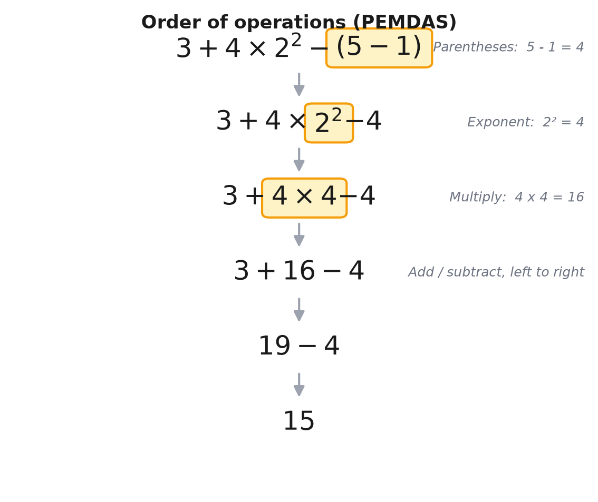

> [!abstract] Prerequisites & where this leads
> **Builds on:** [Number Systems](./number-systems)
> **Leads to:** [Algebraic Structures](./algebraic-structures) · [Functions & Relations](./functions-relations)

An arithmetic expression like $3 + 4 \times 2^2 - (5 - 1)$ (read "three plus four times two squared minus, open paren, five minus one, close paren") is ambiguous until we agree on *which operation to do first*. Do you add $3 + 4$ before multiplying, or multiply first? The two readings give different answers, and only one is correct by convention. The **order of operations** is that convention: a fixed set of priority rules that makes every expression evaluate to exactly one value. It is the grammar of arithmetic. Every later topic, from solving equations to reading a function definition, silently depends on it, which is why it belongs at the very foundation.

This is not a deep theorem; it is an agreement. But it is an agreement mathematicians, calculators, and programming languages all share, so learning it once lets you read any expression unambiguously.

## Why We Need a Convention

Consider $3 + 4 \times 2$. There are two ways to read it:

- Add first: $(3 + 4) \times 2 = 7 \times 2 = 14$.
- Multiply first: $3 + (4 \times 2) = 3 + 8 = 11$.

Both are valid arithmetic, but they disagree. If everyone chose freely, the same written expression would mean different things to different people, and mathematics would stop being a shared language. So we fix a rule: **multiplication is done before addition**. Under that convention, $3 + 4 \times 2 = 11$, and there is no ambiguity.

The full convention extends this idea to all the basic operations, ranking them by priority.

## The Priority Ranking

Evaluate an expression by handling higher-priority operations first. From highest to lowest:

1. **Grouping symbols** (also called brackets): anything inside parentheses $(\ )$, square brackets $[\ ]$, or braces $\{\ \}$, and the implied grouping of a fraction bar or the contents under a radical $\sqrt{\phantom{x}}$. Work from the innermost grouping outward.
2. **Exponents** (also called orders or indices): powers and roots, such as $2^2$ (read "two squared") or $\sqrt{9}$ (read "the square root of nine").
3. **Multiplication and division**, including a "times" written as $\times$, $\cdot$, or juxtaposition like $3x$. These two share one priority level.
4. **Addition and subtraction**. These also share one level.

This ranking is often remembered by an acronym:

- **PEMDAS** (US): **P**arentheses, **E**xponents, **M**ultiplication/**D**ivision, **A**ddition/**S**ubtraction. Sometimes taught as "Please Excuse My Dear Aunt Sally."
- **BODMAS** or **BIDMAS** (UK): **B**rackets, **O**rders (or **I**ndices), **D**ivision/**M**ultiplication, **A**ddition/**S**ubtraction.

They describe the *same* rule. Note that PEMDAS lists M before D and BODMAS lists D before M; this apparent conflict is resolved by the tie-breaker in the next section.

## The Two Tie-Breakers That Everyone Forgets

The acronyms hide two subtleties that cause most real mistakes.

**Multiplication and division have equal priority; evaluate them left to right.** M is not "before" D. When multiplication and division sit side by side, do whichever comes first reading left to right. So

$$
8 \div 2 \times 4 = (8 \div 2) \times 4 = 4 \times 4 = 16,
$$

**not** $8 \div (2 \times 4) = 1$. The "MD" in PEMDAS is a single stage, read left to right, which is exactly why BODMAS can write "DM" instead without changing anything.

**Addition and subtraction have equal priority; evaluate them left to right too.** Subtraction is not done after addition. So

$$
10 - 4 + 3 = (10 - 4) + 3 = 6 + 3 = 9,
$$

**not** $10 - (4 + 3) = 3$. Reading left to right, the subtraction happens first because it appears first.

These two rules are the entire reason "PEMDAS" alone leads people astray: the acronym makes M look higher than D and A higher than S, but within each pair the operations tie and left-to-right breaks the tie.

## Worked Example: Evaluating $3 + 4 \times 2^2 - (5 - 1)$

Apply the ranking one stage at a time. At each step, the sub-expression being simplified is the highest-priority one remaining.

**Step 1: Grouping.** The parentheses $(5 - 1)$ come first: $5 - 1 = 4$.
$$
3 + 4 \times 2^2 - 4
$$

**Step 2: Exponents.** Evaluate $2^2 = 4$.
$$
3 + 4 \times 4 - 4
$$

**Step 3: Multiplication and division (left to right).** The only one here is $4 \times 4 = 16$.
$$
3 + 16 - 4
$$

**Step 4: Addition and subtraction (left to right).** First $3 + 16 = 19$, then $19 - 4 = 15$.
$$
3 + 16 - 4 = 19 - 4 = 15
$$

The expression equals $\boxed{15}$. Had we (wrongly) added $3 + 4$ first, we would have gotten $7 \times 4 - 4 = 24$, a different and incorrect answer.

## More Worked Examples

**Nested grouping, innermost first.** Evaluate $2 \times [3 + (8 - 2 \times 3)]$.

Innermost parentheses first, and inside them multiplication before subtraction: $2 \times 3 = 6$, then $8 - 6 = 2$. Now $2 \times [3 + 2] = 2 \times 5 = 10$.

**The fraction bar groups automatically.** In
$$
\frac{6 + 4}{2 + 3},
$$
the bar acts like parentheses around the top and the bottom: it means $(6 + 4) \div (2 + 3) = 10 \div 5 = 2$, not $6 + (4 \div 2) + 3$. Evaluate the numerator and denominator fully, then divide.

**A radical groups its contents.** $\sqrt{9 + 16} = \sqrt{25} = 5$, not $\sqrt{9} + \sqrt{16} = 3 + 4 = 7$. Everything under the radical is computed before the root is taken.

**Signs and exponents.** $-3^2$ means $-(3^2) = -9$, because the exponent binds tighter than the negation. To square the negative number, you must write $(-3)^2 = 9$. This distinction matters constantly in algebra.

## A Note on Ambiguous Notation

The order of operations resolves *most* expressions, but a few informal notations remain genuinely ambiguous and are best avoided or clarified with parentheses.

**Stacked exponents.** Exponentiation is conventionally evaluated **right to left** (it is "right-associative"), so
$$
2^{3^2} = 2^{(3^2)} = 2^9 = 512, \quad \text{not} \quad (2^3)^2 = 64.
$$
This is the one place the "work left to right" habit does not apply. When in doubt, add parentheses.

**Implied multiplication next to division.** Expressions like $6 \div 2(1+2)$ are notorious precisely because people disagree about whether juxtaposition $2(1+2)$ binds tighter than the $\div$. Strict left-to-right gives $6 \div 2 \times 3 = 9$; the "juxtaposition first" reading gives $6 \div (2 \times 3) = 1$. There is no universal standard here, which is the real lesson: **write $\frac{6}{2(1+2)}$ or $\frac{6}{2}(1+2)$ so your meaning is unambiguous.** Good mathematical writing never relies on a reader guessing.

## Why This Belongs in the Foundations

Once expressions are unambiguous, the [field and order axioms](./algebraic-structures) can be stated cleanly (the distributive law $a(b + c) = ab + ac$ only makes sense once you know the right side means $(ab) + (ac)$), function definitions like $f(x) = 3x^2 - 1$ can be read the one intended way, and every equation you solve rests on a shared reading of both sides. The order of operations is small, but everything is built on top of it.

## Quick Reference

| Priority | Operation | Notes |
|---|---|---|
| 1 (highest) | Grouping: $(\ )$, $[\ ]$, $\{\ \}$, fraction bar, radical | Innermost first |
| 2 | Exponents and roots | Stacked powers: right to left |
| 3 | Multiplication and division | Equal priority; **left to right** |
| 4 (lowest) | Addition and subtraction | Equal priority; **left to right** |
