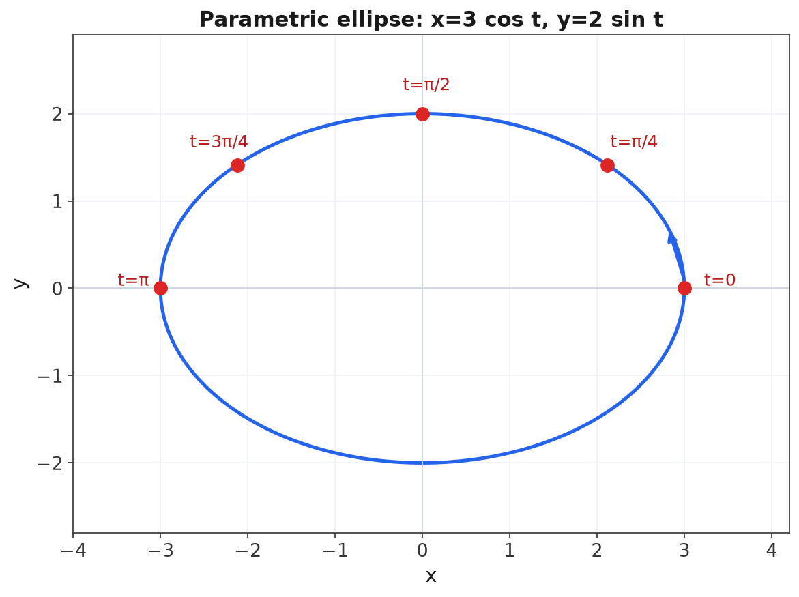
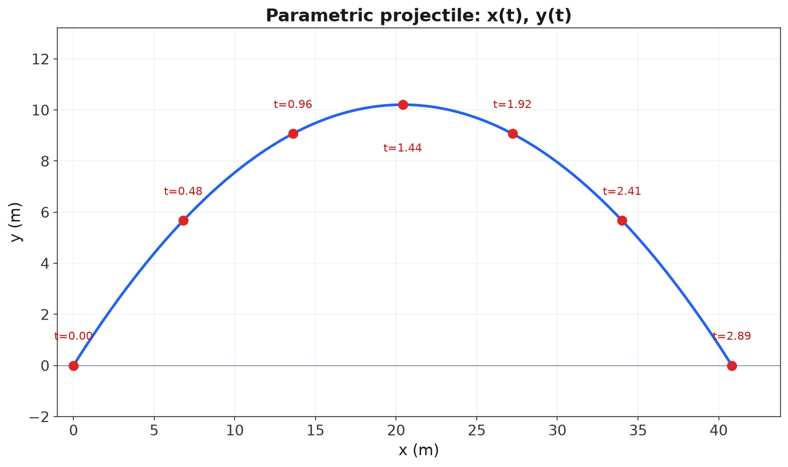
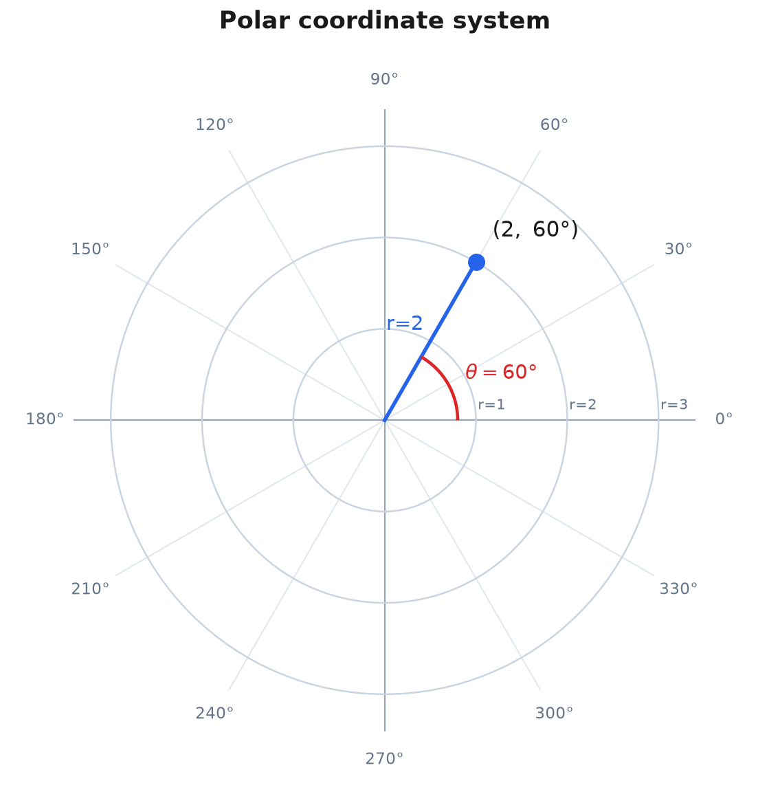
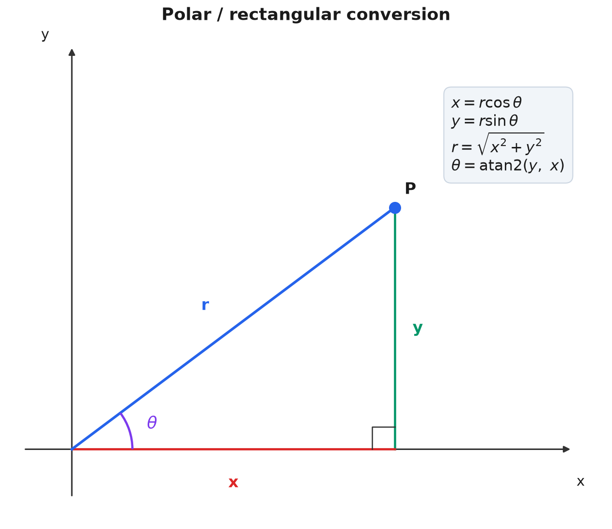
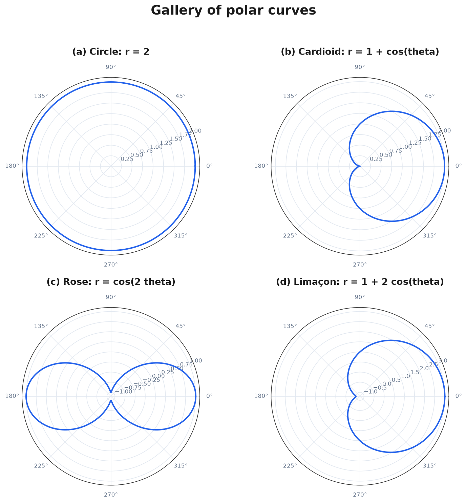

> [!abstract] Prerequisites & where this leads
> **Builds on:** [Functions & Relations](./functions-relations) · [Geometry & Trigonometry](./geometry-trigonometry)
> **Leads to:** [Calculus](./calculus) · [Complex Numbers](./complex-numbers)

A function graph $y = f(x)$ (read "y equals f of x") can only draw curves that pass the vertical line test: one $y$ for each $x$. That rules out most of the interesting shapes in the plane. A full circle fails it (each $x$ has two $y$ values), a spiral fails it, and the looping path of a planet or a projectile that doubles back cannot be a single $y = f(x)$ at all. This page develops two ways to describe *any* curve in the plane, not just function graphs:

- **Parametric equations** describe a curve as the path of a moving point, giving $x$ and $y$ each as a function of a third variable, usually time.
- **Polar coordinates** locate points by *distance and direction* from the origin instead of by horizontal and vertical position, which turns circles, spirals, and flower-like curves into simple equations.

Both are standard precalculus capstones, and both feed directly into [calculus](./calculus) (arc length, areas of polar regions, motion) and into the polar form of [complex numbers](./complex-numbers).

## Part 1: Parametric Equations

### The Idea: A Curve as a Path

Instead of relating $y$ to $x$ directly, introduce a **parameter** $t$ (read "tee", almost always thought of as time) and give *both* coordinates as functions of it:

$$
x = f(t), \qquad y = g(t).
$$

As $t$ runs over its allowed values, the point $(x, y) = (f(t), g(t))$ traces out a curve. You can think of $t$ as a clock: at each instant $t$, the equations tell you where the point is. The curve is the trail it leaves.

**Example (a line).** The equations $x = 1 + 2t$, $y = 3 - t$ for all real $t$ describe a straight line. At $t = 0$ the point is $(1, 3)$; at $t = 1$ it is $(3, 2)$; at $t = 2$ it is $(5, 1)$. The point moves in a fixed direction as $t$ increases.

### Orientation: Parametric Curves Have a Direction

A crucial feature that $y = f(x)$ lacks: a parametric curve is **oriented**. Because $t$ increases, the curve is traced in a definite direction, usually shown with an arrow. The same geometric curve can be parametrized in many ways, with different speeds and directions. This extra information (which way, how fast) is exactly what makes parametric form the natural language for *motion*.

### Eliminating the Parameter

To see the underlying curve as a relation between $x$ and $y$, solve for $t$ in one equation and substitute into the other, or use an identity to cancel $t$.

**Worked example (line).** From $x = 1 + 2t$ we get $t = \frac{x - 1}{2}$. Substitute into $y = 3 - t$:
$$
y = 3 - \frac{x - 1}{2}.
$$
So the path is the line $y = 3 - \frac{x-1}{2}$, confirming the three points above.

**Worked example (ellipse via a trig identity).** Consider
$$
x = 3\cos t, \qquad y = 2\sin t, \qquad t \in [0, 2\pi].
$$
Solve for the trig functions: $\cos t = \frac{x}{3}$ and $\sin t = \frac{y}{2}$. The Pythagorean identity $\cos^2 t + \sin^2 t = 1$ (from [trigonometry](./geometry-trigonometry)) then gives
$$
\left(\frac{x}{3}\right)^2 + \left(\frac{y}{2}\right)^2 = 1,
$$
an ellipse with semi-axes $3$ and $2$. As $t$ goes from $0$ to $2\pi$, the point starts at $(3, 0)$ and sweeps **counterclockwise** around the ellipse once.

Eliminating the parameter recovers the shape but *discards* the orientation and speed, so it loses information. That is why we often keep the parametric form.

### Application: Projectile Motion

Parametric equations are how physics describes motion in a plane. A projectile launched from the origin with speed $v_0$ (read "v-naught") at angle $\alpha$ (read "alpha") above the horizontal has position
$$
x(t) = v_0 \cos(\alpha)\, t, \qquad y(t) = v_0 \sin(\alpha)\, t - \tfrac{1}{2} g t^2,
$$
where $g \approx 9.8 \ \text{m/s}^2$ is gravitational acceleration and $t$ is time in seconds. The horizontal position grows steadily while the vertical position rises and falls, and the trail is a parabola.

**Worked example.** Launch with $v_0 = 20 \ \text{m/s}$ at $\alpha = 45°$, so $\cos 45° = \sin 45° = \frac{\sqrt{2}}{2} \approx 0.7071$ and $v_0 \sin\alpha = v_0 \cos\alpha \approx 14.14 \ \text{m/s}$. Standard results follow from the equations:

- **Time of flight** (when $y$ returns to $0$): $t = \dfrac{2 v_0 \sin\alpha}{g} = \dfrac{2(14.14)}{9.8} \approx 2.89 \ \text{s}$.
- **Range** (horizontal distance): $\dfrac{v_0^2 \sin(2\alpha)}{g} = \dfrac{400 \cdot \sin 90°}{9.8} = \dfrac{400}{9.8} \approx 40.8 \ \text{m}$.
- **Maximum height:** $\dfrac{(v_0 \sin\alpha)^2}{2g} = \dfrac{(14.14)^2}{19.6} = \dfrac{200}{19.6} \approx 10.2 \ \text{m}$.

Notice that a $45°$ launch maximizes range, because $\sin(2\alpha)$ is largest when $2\alpha = 90°$.

## Part 2: Polar Coordinates

### A Different Way to Name a Point

The usual **Cartesian** (rectangular) coordinates $(x, y)$ locate a point by "go right $x$, go up $y$." **Polar coordinates** locate the same point by "face a direction, then walk out a distance":

$$
(r, \theta),
$$

read "r comma theta", where $r$ (read "r", the **radius** or radial distance) is how far the point is from the origin, and $\theta$ (read "theta", the **polar angle**) is the angle the ray to the point makes with the positive $x$-axis, measured counterclockwise. The origin is called the **pole**, and the positive $x$-axis is the **polar axis**.

**Example.** The point $(r, \theta) = (2, 60°)$ sits $2$ units from the pole along the ray pointing $60°$ counterclockwise from the polar axis.

### Polar Coordinates Are Not Unique

Unlike Cartesian coordinates, a single point has *infinitely many* polar names. Two conventions cause this:

- **Adding full turns.** $(r, \theta)$ and $(r, \theta + 360°)$ are the same point, since a full revolution returns to the same direction. So $(2, 60°) = (2, 420°) = (2, -300°)$.
- **Negative radius.** A negative $r$ means "walk *backward* along the ray," i.e. in the opposite direction. So $(-2, 60°)$ is the same point as $(2, 240°)$.

The pole itself is $(0, \theta)$ for *any* angle $\theta$. This non-uniqueness is worth remembering when you solve polar equations: two curves can intersect at a point that carries different $(r, \theta)$ labels on each.

### Converting Between Polar and Rectangular

The link between the two systems is a right triangle: drop a perpendicular from the point to the $x$-axis, and the radius $r$ is the hypotenuse.

**Polar to rectangular** (always straightforward):
$$
x = r\cos\theta, \qquad y = r\sin\theta.
$$

**Rectangular to polar** (mind the quadrant):
$$
r = \sqrt{x^2 + y^2}, \qquad \theta = \operatorname{atan2}(y, x).
$$

Here $r$ comes straight from the Pythagorean theorem. For the angle, the plain formula $\theta = \arctan(y/x)$ only lands in the correct quadrant for points on the right half-plane; the two-argument $\operatorname{atan2}(y, x)$ (read "a-tan-two of y, x") is the standard function that returns the correct angle in all four quadrants, which is why every calculator and programming language provides it. In hand calculation, compute $\arctan(y/x)$ and then add $180°$ if the point is in the second or third quadrant.

**Worked example (polar to rectangular).** Convert $(r, \theta) = (4, \tfrac{2\pi}{3})$, i.e. $\theta = 120°$. Using $\cos 120° = -\frac{1}{2}$ and $\sin 120° = \frac{\sqrt{3}}{2}$:
$$
x = 4 \cdot \left(-\tfrac{1}{2}\right) = -2, \qquad y = 4 \cdot \tfrac{\sqrt{3}}{2} = 2\sqrt{3} \approx 3.46.
$$
So $(4, 120°) = (-2,\ 2\sqrt{3})$ in rectangular form.

**Worked example (rectangular to polar).** Convert $(x, y) = (1, 1)$. Then
$$
r = \sqrt{1^2 + 1^2} = \sqrt{2} \approx 1.414, \qquad \theta = \arctan\!\left(\tfrac{1}{1}\right) = 45° = \tfrac{\pi}{4}.
$$
The point is in the first quadrant, so no adjustment is needed: $(1, 1) = \left(\sqrt{2},\ \tfrac{\pi}{4}\right)$.

### Polar Graphs: Curves as $r = h(\theta)$

A **polar equation** gives $r$ as a function of $\theta$, and its graph is all points $(r, \theta)$ satisfying it as $\theta$ sweeps around. Many curves that are messy in rectangular form are simple in polar form.

**Circles and lines.**
- $r = a$ is a **circle** of radius $a$ centered at the pole (every point is distance $a$ from the origin). This is the single simplest reason polar coordinates exist.
- $\theta = \alpha$ (a constant) is a **line** through the pole at angle $\alpha$.
- $r = 2a\cos\theta$ is a circle of radius $a$ centered at $(a, 0)$ (passing through the pole), and $r = 2a\sin\theta$ is a circle centered at $(0, a)$.

**Cardioids and limaçons.** The family $r = a + b\cos\theta$ (or with $\sin\theta$) gives:
- a **cardioid** (heart shape) when $|a| = |b|$, e.g. $r = 1 + \cos\theta$;
- a **limaçon with an inner loop** when $|b| > |a|$, e.g. $r = 1 + 2\cos\theta$;
- a **dimpled or convex limaçon** when $|b| < |a|$.

**Worked example (cardioid values).** For $r = 1 + \cos\theta$: at $\theta = 0$, $r = 1 + 1 = 2$ (farthest right); at $\theta = \tfrac{\pi}{2}$, $r = 1 + 0 = 1$; at $\theta = \pi$, $r = 1 + (-1) = 0$ (the curve reaches the pole). Plotting these and the symmetric lower half traces the heart.

**Roses.** The curves $r = a\cos(k\theta)$ and $r = a\sin(k\theta)$ are **rose curves** with petals of length $a$. The petal count follows a clean rule:
- if $k$ is **odd**, there are $k$ petals;
- if $k$ is **even**, there are $2k$ petals.

So $r = \cos(3\theta)$ has $3$ petals, while $r = \cos(2\theta)$ has $4$ petals.

**Spirals.** The **Archimedean spiral** $r = a\theta$ grows steadily outward as the angle increases, since the distance from the pole is proportional to the angle turned.

**How to sketch a polar graph by hand.** Build a table of $r$ for key angles ($0, \tfrac{\pi}{6}, \tfrac{\pi}{4}, \tfrac{\pi}{3}, \tfrac{\pi}{2}, \ldots$), plot each $(r, \theta)$, watch for where $r = 0$ (the curve touches the pole) and where $r$ is largest, and use symmetry: a curve with only $\cos\theta$ is symmetric about the polar axis, and one with only $\sin\theta$ is symmetric about the vertical line $\theta = \tfrac{\pi}{2}$.

## Interactive: Trace a Curve

Switch between parametric and polar mode, choose a preset, adjust the parameters, and press play to watch the point trace the curve. The moving dot makes the role of the parameter (the "clock" $t$, or the sweeping angle $\theta$) visible in a way a static graph cannot.

<iframe src="/static/interactive/parametric-polar-plotter.html" width="100%" height="600" style="border:none;"></iframe>

## Connections

**To complex numbers.** The polar form of a complex number, $z = r(\cos\theta + i\sin\theta) = re^{i\theta}$, is exactly polar coordinates applied to the [complex plane](./complex-numbers). Multiplying complex numbers multiplies the $r$ values and adds the $\theta$ values, which is why polar coordinates make complex multiplication so clean.

**To calculus.** Both forms are essential in [calculus](./calculus). For a parametric curve, the slope is $\frac{dy}{dx} = \frac{dy/dt}{dx/dt}$ and arc length integrates $\sqrt{(dx/dt)^2 + (dy/dt)^2}$. In polar coordinates, the area swept by $r = h(\theta)$ is $\frac{1}{2}\int r^2 \, d\theta$. These are the natural settings for motion, orbits, and any problem with rotational symmetry.

## Quick Reference

**Conversions.**

| From | To | Formulas |
|---|---|---|
| Polar $(r, \theta)$ | Rectangular $(x, y)$ | $x = r\cos\theta,\quad y = r\sin\theta$ |
| Rectangular $(x, y)$ | Polar $(r, \theta)$ | $r = \sqrt{x^2 + y^2},\quad \theta = \operatorname{atan2}(y, x)$ |

**Common polar curves.**

| Equation | Curve |
|---|---|
| $r = a$ | Circle of radius $a$ centered at the pole |
| $\theta = \alpha$ | Line through the pole at angle $\alpha$ |
| $r = 2a\cos\theta$ | Circle radius $a$, centered at $(a, 0)$ |
| $r = a + b\cos\theta$, $\lvert a\rvert=\lvert b\rvert$ | Cardioid |
| $r = a + b\cos\theta$, $\lvert b\rvert>\lvert a\rvert$ | Limaçon with inner loop |
| $r = a\cos(k\theta)$ | Rose: $k$ petals if $k$ odd, $2k$ if $k$ even |
| $r = a\theta$ | Archimedean spiral |

**Projectile (launch from origin, speed $v_0$, angle $\alpha$).**

| Quantity | Formula |
|---|---|
| Position | $x = v_0\cos(\alpha)\,t,\quad y = v_0\sin(\alpha)\,t - \tfrac{1}{2}gt^2$ |
| Time of flight | $2v_0\sin(\alpha)/g$ |
| Range | $v_0^2\sin(2\alpha)/g$ |
| Max height | $(v_0\sin\alpha)^2/(2g)$ |
