## What Is a Polynomial?

A **polynomial** is a function built by adding together terms of the form "a constant times $x$ raised to a whole-number power." In plain language, polynomials are sums of power terms, and they are among the simplest and most well-behaved functions in all of mathematics.

### Why Polynomials Matter

Polynomials matter for two key reasons. First, they form a natural hierarchy of complexity: constants, then lines, then parabolas, then cubics, and so on. Each step up in degree adds one more bend to the graph. Second, a deep result in mathematics (the Taylor/Weierstrass theorems) shows that polynomials can approximate any smooth function to any desired accuracy. This means that understanding polynomials gives you a toolkit for understanding nearly everything else.

### Building Up: From Simple to General

The simplest polynomial is a **constant function**, like $f(x) = 5$. Its graph is a flat horizontal line, and its degree is 0.

Add a term with $x$ and you get a **linear function**, like $f(x) = 3x + 1$. Its graph is a straight line, and its degree is 1.

Add a term with $x^2$ and you get a **quadratic function**, like $f(x) = 2x^2 - x + 4$. Its graph is a parabola, and its degree is 2.

The pattern continues: each additional power of $x$ increases the degree by one and allows the graph to change direction one more time. The general polynomial of degree $n$ looks like this:

$$a_n x^n + a_{n-1} x^{n-1} + \cdots + a_1 x + a_0$$

where $a_n, a_{n-1}, \ldots, a_0$ are constants called **coefficients**, and $a_n \neq 0$.

With that foundation, here is the formal definition.

## Formal Definition

**Polynomial Functions:**

$$a_{n}x^{n} + a_{n - 1}x^{n - 1} + \ldots + a_{2}x^{2} + a_{1}x^{1} + a_{0}$$

This can be expressed more concisely by using summation notation:

$$\sum_{k = 0}^{n}{a_{k}x^{k}}$$

-   The domain of a **polynomial** **function** is $(-\infty, \infty)$

-   The exponents on the variable must be **non-negative integers**
    ($0, 1, 2, \ldots$). This is exactly what distinguishes a polynomial
    from a rational function (which allows negative-integer exponents,
    e.g. $x^{-2} = \tfrac{1}{x^2}$) or a radical function (which allows
    fractional exponents, e.g. $x^{1/2} = \sqrt{x}$). So **polynomials
    may not have negative-power terms** such as $x^{-2}$.

-   The coefficients are taken to be **real numbers**. This matters
    later for the Conjugate Zeros Theorem, which relies on the
    coefficients being real.

-   The graphs of **polynomial** **functions** are smooth and continuous
    at all points.

-   The **degree** of the **polynomial** is the highest power appearing
    in the **polynomial**.

-   The roots/zeros/solutions of **polynomial** **functions** are those
    values of ***x*** for which ***P(x) = 0***

-   A **polynomial** of degree ***n*** could have up to ***n-many
    possible roots***, but it could have less.

## Quadratic Functions d=2

**Quadratic Functions:**

### Standard Form of a Quadratic Equation

**Standard Form of a Quadratic Equation**

$$f(x) = ax^{2} + bx + c$$

Where a,b,c are real numbers and $a \neq 0$

A quadratic equation is a **polynomial** equation having degree of 2.

### Vertex Form of a Quadratic Equation

**Vertex Form of a Quadratic Equation**

The vertex form of a quadratic equation allows you to read the
vertex/axis of symmetry directly from the equation.

$$f(x) = a(x - h)^{2} + k$$

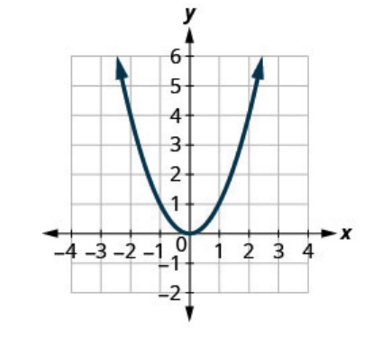

$$f(x) = x^{2}$$

The graph of quadratic function is called a parabola.

Quadratic functions are symmetric around a line called the **axis of
symmetry**.

### Axis of Symmetry

**Axis of Symmetry:** Every parabola has an axis of symmetry which is
the line that divides the graph into two perfect halves.

$$x = \frac{- b}{2a}$$

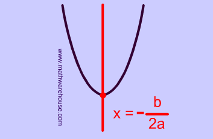

### Methods for Solving Quadratic Equations


#### What does it mean to "solve" a quadratic / polynomial?

Solving a polynomial means finding all the values of the variable that
make the polynomial equal to zero.

These values are called the "**roots**" or "**zeros**" of the
polynomial.

The roots/solutions/zeroes of a polynomial occur at the x-intercepts.

For polynomials of degree five or higher, exact algebraic solutions may
not always be possible (***Abel-Ruffini theorem***
states that there is no general solution in radicals for polynomials of
degree five or higher). In such cases, numerical and graphical methods
are often used.

### Zero Product Property

**Zero Product Property:** The Zero Product Property is crucial for
solving polynomial equations that can be factored. Once a polynomial
equation is factored into a product of binomials, each binomial is set
to zero to find the solutions.

The zero product property states that if two or more factors are
multiplied and the product is zero, then a least one of those factors is
also zero.

If ab = 0, then either a = 0 or b = 0

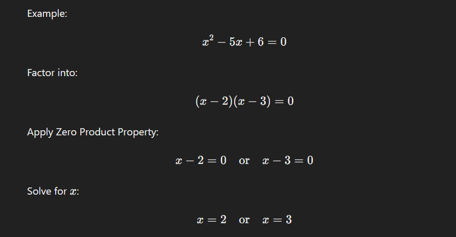

The zero product property can be used to solve polynomial equations of
**any degree** as long as the polynomial can be factored
into a product of simpler polynomials.

### Special Factoring Forms

For factoring that involves dividing polynomials into simpler rational expressions, see [Partial Fraction Decomposition](./partial-fraction-decomposition).

| Special Factoring Form | Expression | Factored Form |
|---|---|---|
| Difference of Squares | $a^{2} - b^{2}$ | $(a - b)(a + b)$ |
| Perfect Square Trinomial (Sum) | $a^{2} + 2ab + b^{2}$ | ${(a + b)}^{2}$ |
| Perfect Square Trinomial (Difference) | $a^{2} - 2ab + b^{2}$ | $(a - b)^{2}$ |
| Sum of Cubes | $a^{3} + b^{3}$ | $(a + b)(a^{2} - ab + b^{2})$ |
| Difference of Cubes | $a^{3} - b^{3}$ | $(a - b)(a^{2} + ab + b^{2})$ |
| Factoring by Grouping | $ax + ay + bx + by$ | $(a + b)(x + y)$ |
| Quadratic Trinomial | $ax^{2} + bx + c$ | $(px + q)(rx + s)$ |
| Factoring out the GCF | $ab + ac$ | $a(b + c)$ |

### Factoring by Grouping

**Factoring by Grouping:** A technique used to factor polynomials with four or more terms by grouping terms with common factors.

**Algorithm:**

1. Group terms in pairs (usually first two and last two)
2. Factor out the GCF from each pair
3. If a common binomial factor appears, factor it out
4. If no common factor emerges, try different groupings

**Example 1:** Factor $x^3 + 3x^2 + 2x + 6$

Group terms: $(x^3 + 3x^2) + (2x + 6)$

Factor each group:
- $x^3 + 3x^2 = x^2(x + 3)$
- $2x + 6 = 2(x + 3)$

Result: $x^2(x + 3) + 2(x + 3)$

Factor out common $(x + 3)$:

$$(x + 3)(x^2 + 2)$$

**Example 2:** Factor $6x^2 - 9x + 4x - 6$

Group: $(6x^2 - 9x) + (4x - 6)$

Factor each group:
- $6x^2 - 9x = 3x(2x - 3)$
- $4x - 6 = 2(2x - 3)$

Result: $3x(2x - 3) + 2(2x - 3)$

Factor out $(2x - 3)$:

$$(2x - 3)(3x + 2)$$

**Example 3:** Factor $xy + 5x + 3y + 15$

Group: $(xy + 5x) + (3y + 15)$

Factor each group:
- $xy + 5x = x(y + 5)$
- $3y + 15 = 3(y + 5)$

Result: $x(y + 5) + 3(y + 5)$

Factor out $(y + 5)$:

$$(y + 5)(x + 3)$$

**Example 4:** When grouping doesn't work immediately

Factor $2x^3 - 3x^2 - 2x + 3$

Try: $(2x^3 - 3x^2) + (-2x + 3)$

- $2x^3 - 3x^2 = x^2(2x - 3)$
- $-2x + 3 = -1(2x - 3)$

Result: $x^2(2x - 3) - 1(2x - 3)$

Factor out $(2x - 3)$:

$$(2x - 3)(x^2 - 1) = (2x - 3)(x - 1)(x + 1)$$

**Note:** Sometimes you need to rearrange terms or factor out a negative to make the common factor visible.

### Square Root Property

**Square Root Property:** When there is no linear term in the equation,
another method of solving a quadratic equation is by using the square
root property.

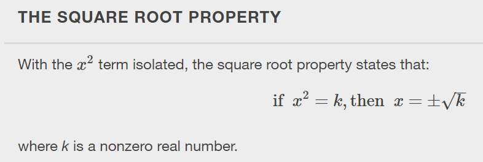

### Completing the Square

**Completing the Square:** A technique for rewriting a quadratic expression in vertex form by adding and subtracting a constant to create a perfect square trinomial. Not all quadratic equations can be factored or solved in their original form using the square root property, so completing the square provides a general method that always works.

**All quadratic equations can be solved using this method.**

**Algorithm:**

Given $ax^2 + bx + c = 0$:

1. If $a \neq 1$, divide every term by $a$
2. Move the constant term to the other side
3. Take half of the coefficient of $x$, square it, and add to both sides
4. Factor the left side as a perfect square
5. Solve using the square root property

**Example 1:** Solve $x^2 + 6x + 2 = 0$

**Step 1:** Move constant: $x^2 + 6x = -2$

**Step 2:** Half of 6 is 3, and $3^2 = 9$. Add 9 to both sides:

$$
x^2 + 6x + 9 = -2 + 9
$$

**Step 3:** Factor left side:

$$
(x + 3)^2 = 7
$$

**Step 4:** Take square root:

$$
x + 3 = \pm\sqrt{7}
$$

$$
x = -3 \pm \sqrt{7}
$$

**Example 2:** Solve $2x^2 - 8x + 3 = 0$

**Step 1:** Divide by 2: $x^2 - 4x + \frac{3}{2} = 0$

**Step 2:** Move constant: $x^2 - 4x = -\frac{3}{2}$

**Step 3:** Half of $-4$ is $-2$, and $(-2)^2 = 4$. Add 4 to both sides:

$$
x^2 - 4x + 4 = -\frac{3}{2} + 4 = \frac{5}{2}
$$

**Step 4:** Factor:

$$
(x - 2)^2 = \frac{5}{2}
$$

**Step 5:** Solve:

$$
x = 2 \pm \sqrt{\frac{5}{2}} = 2 \pm \frac{\sqrt{10}}{2}
$$

**Converting to Vertex Form:**

Completing the square converts $f(x) = ax^2 + bx + c$ to vertex form $f(x) = a(x - h)^2 + k$.

**Example:** Convert $f(x) = 3x^2 - 12x + 7$ to vertex form

Factor out $a$ from the first two terms: $f(x) = 3(x^2 - 4x) + 7$

Complete the square inside: half of $-4$ is $-2$, squared is $4$

$$
f(x) = 3(x^2 - 4x + 4 - 4) + 7 = 3(x^2 - 4x + 4) - 12 + 7
$$

$$
f(x) = 3(x - 2)^2 - 5
$$

Vertex: $(2, -5)$

**Why completing the square matters:**

- Converts quadratics to vertex form for graphing
- Derives the quadratic formula (apply the algorithm to $ax^2 + bx + c = 0$ in general)
- Used in optimization problems
- Foundation for completing the square in higher dimensions (quadratic forms in linear algebra)

The vertex form reveals the maximum or minimum of the parabola. For the general technique of finding maxima and minima of any function, see [Calculus](./calculus).

### Quadratic Formula

**Quadratic Formula:** The fourth method of solving a quadratic equation
is by using the quadratic formula, a formula that will solve all
quadratic equations.

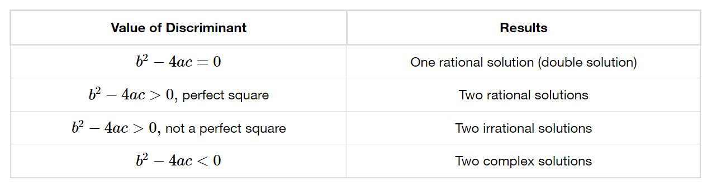

### The Discriminant

The quadratic formula contains the expression $b^2 - 4ac$ under the square root. This expression, called the **discriminant**, determines the nature of the roots without requiring you to solve the entire equation.

**Discriminant:** For a quadratic equation $ax^2 + bx + c = 0$, the discriminant is:

$$
\Delta = b^2 - 4ac
$$

The discriminant tells you three things:

- **$\Delta > 0$:** Two distinct real roots. The parabola crosses the x-axis at two points.
- **$\Delta = 0$:** One repeated real root (a double root). The parabola touches the x-axis at exactly one point (its vertex).
- **$\Delta < 0$:** Two complex conjugate roots. The parabola does not cross the x-axis at all.

**Why this works:** The quadratic formula is $x = \frac{-b \pm \sqrt{b^2 - 4ac}}{2a}$. When $\Delta > 0$, the square root is a real number, producing two different values via $\pm$. When $\Delta = 0$, the square root vanishes and both roots collapse to one value. When $\Delta < 0$, the square root of a negative number produces imaginary parts, yielding a complex conjugate pair.

**Example 1 ($\Delta > 0$, two distinct real roots):** Solve $x^2 - 5x + 6 = 0$

$$
\Delta = (-5)^2 - 4(1)(6) = 25 - 24 = 1 > 0
$$

Two distinct real roots:

$$
x = \frac{5 \pm \sqrt{1}}{2} = \frac{5 \pm 1}{2}
$$

$$
x = 3 \quad \text{or} \quad x = 2
$$

**Example 2 ($\Delta = 0$, one repeated real root):** Solve $x^2 - 6x + 9 = 0$

$$
\Delta = (-6)^2 - 4(1)(9) = 36 - 36 = 0
$$

One repeated root:

$$
x = \frac{6 \pm \sqrt{0}}{2} = \frac{6}{2} = 3
$$

The polynomial factors as $(x - 3)^2 = 0$, confirming the double root.

**Example 3 ($\Delta < 0$, two complex conjugate roots):** Solve $x^2 + 2x + 5 = 0$

$$
\Delta = (2)^2 - 4(1)(5) = 4 - 20 = -16 < 0
$$

Two complex conjugate roots:

$$
x = \frac{-2 \pm \sqrt{-16}}{2} = \frac{-2 \pm 4i}{2} = -1 \pm 2i
$$

The roots are $-1 + 2i$ and $-1 - 2i$, a conjugate pair.

## Cubic Functions d=3

**Cubic Functions**: a cubic function is a function of the form

$$\mathbf{f}\left( \mathbf{x} \right)\mathbf{= a}\mathbf{x}^{\mathbf{3}}\mathbf{+ b}\mathbf{x}^{\mathbf{2}}\mathbf{+ cx + d}$$

A cubic function is a polynomial function of degree 3. So a cubic
function may have a maximum of 3 roots. i.e., it may intersect the
x-axis at a maximum of 3 points.

***Since complex roots always occur in pairs, a cubic function always
has either 1 or 3 real zeros. It cannot have 2 real
zeros.***

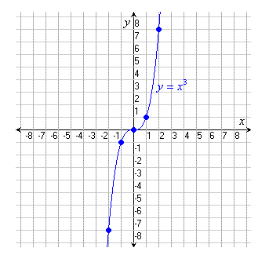

### Domain / Range of Cubic Function

**Domain / Range of Cubic Functions:**

-   The domain of a cubic function is *R*.

-   The range of a cubic function is *R*.

### Y-Intercepts of a Cubic Function

**Y-Intercepts of a Cubic function:**

A cubic function always has exactly one y-intercept.

To find the y-intercept of a cubic function, we just substitute x = 0
and solve for y-value.

### Cardano's Method

**Cardano's Method:** A formula for solving cubic equations of the form $x^3 + px + q = 0$ (called the **depressed cubic**, with no $x^2$ term).

**Reducing to depressed form:** Any cubic $ax^3 + bx^2 + cx + d = 0$ can be reduced to the depressed form by substituting $x = t - \frac{b}{3a}$, which eliminates the $x^2$ term.

**The formula:** For $t^3 + pt + q = 0$:

$$
t = \sqrt[3]{-\frac{q}{2} + \sqrt{\frac{q^2}{4} + \frac{p^3}{27}}} + \sqrt[3]{-\frac{q}{2} - \sqrt{\frac{q^2}{4} + \frac{p^3}{27}}}
$$

**The discriminant** $\Delta = \frac{q^2}{4} + \frac{p^3}{27}$ determines the nature of roots:

- $\Delta > 0$: One real root, two complex conjugate roots
- $\Delta = 0$: All roots real, at least two equal
- $\Delta < 0$: Three distinct real roots (the "casus irreducibilis," where the formula involves complex intermediate values even though all roots are real)

**Example:** Solve $x^3 - 6x - 9 = 0$

Here $p = -6$, $q = -9$.

$\Delta = \frac{81}{4} + \frac{-216}{27} = \frac{81}{4} - 8 = \frac{49}{4} > 0$ (one real root)

$$
x = \sqrt[3]{\frac{9}{2} + \frac{7}{2}} + \sqrt[3]{\frac{9}{2} - \frac{7}{2}} = \sqrt[3]{8} + \sqrt[3]{1} = 2 + 1 = 3
$$

**Verification:** $3^3 - 6(3) - 9 = 27 - 18 - 9 = 0$ confirms the answer.

**Historical note:** Published by Gerolamo Cardano in 1545, though discovered by Scipione del Ferro and Niccolo Tartaglia. This was the first formula to solve a general polynomial of degree higher than 2.

## Polynomial Degree

**Polynomial Degree:** The degree of the polynomial is defined as the
highest power the variable is raised to in the polynomial.

The degree also dictates *how many zeros a polynomial can
have* and *what the end behavior is*.

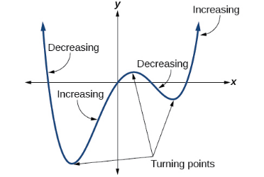

Graph of f(x)= $x^{4} - x^{3} - 4x^{2} + 4x$

This function is a 4th degree polynomial function and has 3 turning
points. The maximum number of turning points of a polynomial function is
always one less than the degree of the function.

## End Behavior

**End Behavior:** A polynomial's end-behavior is completely determined
by its leading term.

**Even power, positive leading coefficient:**

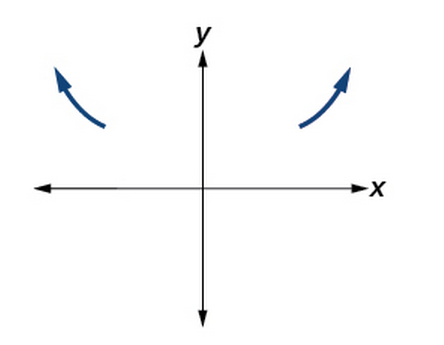

$$\mathbf{x \rightarrow \infty, f}\left( \mathbf{x} \right)\mathbf{\rightarrow \ \infty}$$

$$\mathbf{x \rightarrow - \infty, f}\left( \mathbf{x} \right)\mathbf{\rightarrow \ \infty}$$

**Even power, negative leading coefficient:**

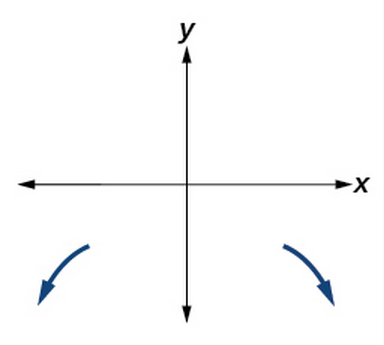

$$\mathbf{x \rightarrow \infty, f}\left( \mathbf{x} \right)\mathbf{\rightarrow \  - \infty}$$

$$\mathbf{x \rightarrow - \infty, f}\left( \mathbf{x} \right)\mathbf{\rightarrow - \infty}$$

**Odd power, positive leading coefficient:**

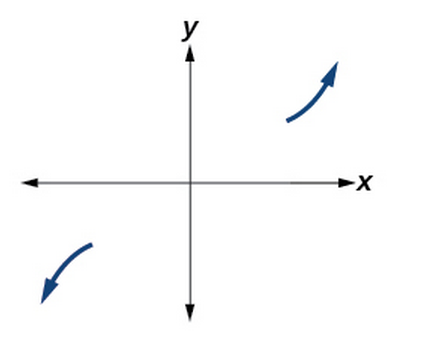

$$\mathbf{x \rightarrow \infty, f}\left( \mathbf{x} \right)\mathbf{\rightarrow \ \infty}$$

$$\mathbf{x \rightarrow - \infty, f}\left( \mathbf{x} \right)\mathbf{\rightarrow - \infty}$$

**Odd power, negative leading coefficient:**

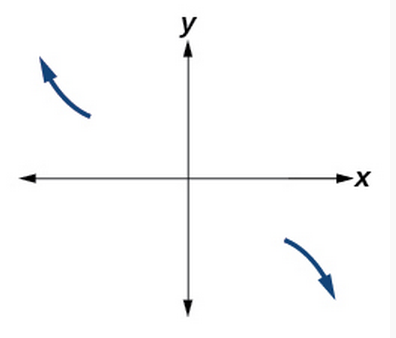

$$\mathbf{x \rightarrow \infty, f}\left( \mathbf{x} \right)\mathbf{\rightarrow \ -\infty}$$

$$\mathbf{x \rightarrow - \infty, f}\left( \mathbf{x} \right)\mathbf{\rightarrow \ \infty}$$

## Factor Multiplicity

**Factor Multiplicity:** The multiplicity of a factor determines how the
graph behaves at the x-intercept.

-   If the multiplicity of a zero is even, the *graph will touch the
    x-axis* at that zero. *(think about*
    $x^{2}$*)*

-   If the multiplicity of a zero is odd, the *graph will cross the
    x-axis* at that zero.

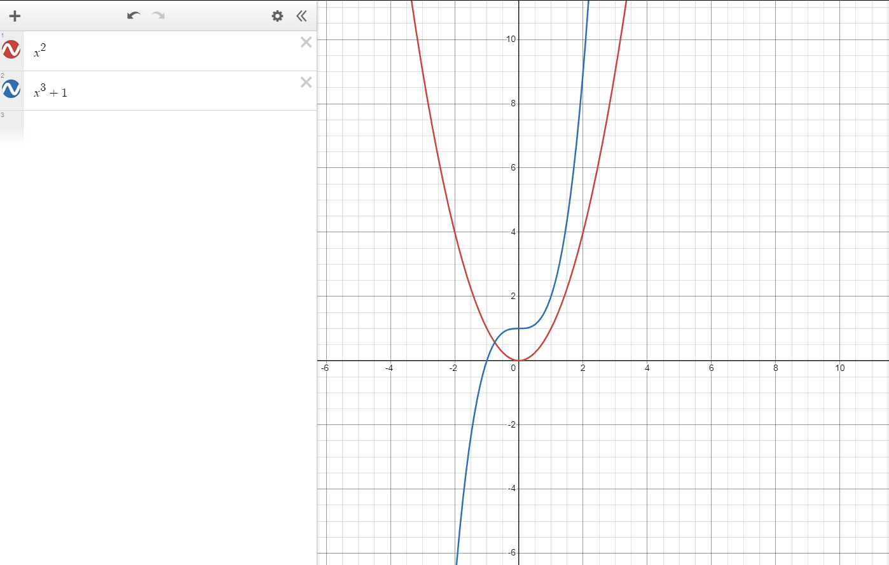

## The Fundamental Theorem of Algebra

**The Fundamental Theorem of Algebra:**

The Fundamental Theorem of Algebra tells us that every polynomial
function with degree $\geq 1$ (equivalently, every non-constant
polynomial) has at least one *complex* zero. This includes degree-1
polynomials, which always have a (possibly complex) root.

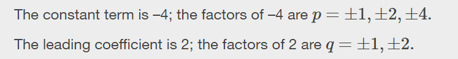

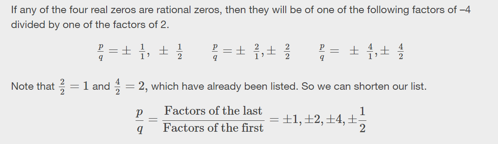

So what about the irrational roots of a polynomial? How do we find those
when the rational roots theorem fails?

For polynomial of degree 2, you can use the quadratic formula.

## Polynomial Long Division

**Polynomial Long Division:**

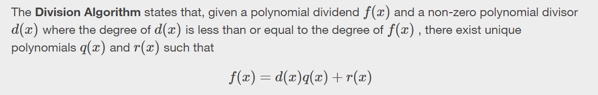

Where:

-   **d(x)** is the divisor, which must be a nonzero polynomial

-   **q(x)** is the quotient

-   **r(x)** is the remainder where r(x) is either equal zero, or has a
    degree less than d(x)

$$\frac{f(x)}{d(x)} = q(x) + \frac{r(x)}{d(x)}$$

If r(x) is 0, then d(x) is a factor of f, so it divides evenly leaving
no remainder.

*Division by any nonzero polynomial is always defined: a nonzero divisor
is the real requirement. If $\deg(d(x)) > \deg(f(x))$, the division still
works out, but the quotient is simply $q(x) = 0$ with remainder $r(x) =
f(x)$ (the dividend). The long-division algorithm produces additional
quotient terms only while the divisor's degree does not exceed that of
the current remainder.*

*Algorithm: Divide, multiply, subtract, repeat as needed.*

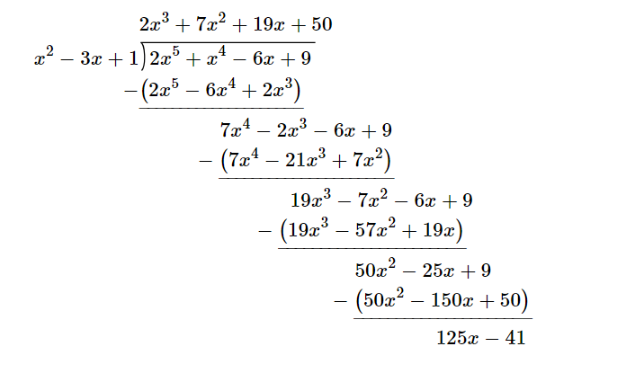

Divisor: The quantity by which another quantity is divided

Dividend: The quantity that is being divided.

## Synthetic Division

**Synthetic Division:** Synthetic division is a shorthand method for dividing a polynomial by a linear factor of the form $(x - c)$.

**When to use synthetic division:**

- **Only when dividing by a linear factor** $(x - c)$ where $c$ is a constant
- If the degree of the denominator is greater than 1, you must use polynomial long division

**Algorithm:**

1. Write the coefficients of the polynomial in descending order of degree
2. If any terms are missing, use 0 as the coefficient
3. Write the value of $c$ (from $x - c$) to the left
4. Bring down the first coefficient
5. Multiply by $c$, add to next coefficient, repeat
6. The last number is the remainder; all others are coefficients of the quotient

**Example:** Divide $2x^3 + 3x^2 - 5x + 4$ by $(x - 2)$

```
  2 |  2   3  -5   4
    |      4  14  18
    ----------------
      2   7   9  22
```

**Result:** Quotient = $2x^2 + 7x + 9$, Remainder = $22$

So: $\frac{2x^3 + 3x^2 - 5x + 4}{x - 2} = 2x^2 + 7x + 9 + \frac{22}{x - 2}$

## Remainder Theorem

When you divide a polynomial $f(x)$ by a linear factor $(x - c)$, you get a quotient $q(x)$ and a remainder $r$:

$$
f(x) = (x - c) \cdot q(x) + r
$$

**Remainder Theorem:** When a polynomial $f(x)$ is divided by $(x - c)$, the remainder is $f(c)$.

**Why it works:** Substituting $x = c$ into the equation above gives $f(c) = (c - c) \cdot q(c) + r = 0 + r = r$. The divisor vanishes, leaving only the remainder.

**Why it matters:** The Remainder Theorem lets you evaluate a polynomial at any point by performing synthetic division instead of direct substitution. For high-degree polynomials with large or fractional inputs, synthetic division can be more systematic and less error-prone than computing each power separately.

**Example:** Find the remainder when $f(x) = 2x^3 - 5x^2 + 3x - 7$ is divided by $(x - 3)$

By the Remainder Theorem, the remainder is $f(3)$:

$$
f(3) = 2(3)^3 - 5(3)^2 + 3(3) - 7 = 54 - 45 + 9 - 7 = 11
$$

**Verification via synthetic division:**

```
  3 |  2  -5   3  -7
    |      6   3  18
    ----------------
      2   1   6  11
```

The remainder is 11, confirming $f(3) = 11$.

## Factor Theorem

The Factor Theorem is a direct consequence of the Remainder Theorem.

**Factor Theorem:** $(x - c)$ is a factor of $f(x)$ if and only if $f(c) = 0$.

**Why it follows from the Remainder Theorem:** If the remainder when dividing $f(x)$ by $(x - c)$ is $f(c)$, then the remainder is zero precisely when $f(c) = 0$. A zero remainder means $(x - c)$ divides $f(x)$ evenly, so $(x - c)$ is a factor.

**Connection to roots:** The Factor Theorem establishes the link between factors and zeros. Finding a root $c$ is the same as finding a factor $(x - c)$, and vice versa.

**Example:** Verify that $(x - 2)$ is a factor of $f(x) = x^3 - 6x^2 + 11x - 6$, then find all remaining factors.

**Step 1:** Check $f(2)$:

$$
f(2) = (2)^3 - 6(2)^2 + 11(2) - 6 = 8 - 24 + 22 - 6 = 0
$$

Since $f(2) = 0$, the Factor Theorem confirms $(x - 2)$ is a factor.

**Step 2:** Divide out $(x - 2)$ using synthetic division:

```
  2 |  1  -6  11  -6
    |      2  -8   6
    ----------------
      1  -4   3   0
```

The quotient is $x^2 - 4x + 3$.

**Step 3:** Factor the quotient:

$$
x^2 - 4x + 3 = (x - 1)(x - 3)
$$

**Result:** $x^3 - 6x^2 + 11x - 6 = (x - 1)(x - 2)(x - 3)$

The zeros are $x = 1, 2, 3$.

## Rational Root Theorem

When a polynomial has integer coefficients, the Rational Root Theorem narrows the search for rational zeros to a finite list of candidates.

**Rational Root Theorem:** If a polynomial $f(x) = a_n x^n + a_{n-1} x^{n-1} + \cdots + a_1 x + a_0$ has integer coefficients and $\frac{p}{q}$ is a rational root (in lowest terms), then:

- $p$ divides the constant term $a_0$
- $q$ divides the leading coefficient $a_n$

**Why it works:** If $\frac{p}{q}$ is a root, then substituting and multiplying through by $q^n$ yields an equation where $p$ must divide the term containing $a_0$ and $q$ must divide the term containing $a_n$.

**How to use it:**

1. List all factors of the constant term $a_0$ (these are the candidates for $p$)
2. List all factors of the leading coefficient $a_n$ (these are the candidates for $q$)
3. Form all possible fractions $\pm \frac{p}{q}$
4. Test each candidate by substitution or synthetic division

**Example:** Find all rational roots of $f(x) = 2x^3 - 3x^2 - 8x + 12$.

**Step 1:** Identify the constant term and leading coefficient.

- Constant term $a_0 = 12$, with factors: $\pm 1, \pm 2, \pm 3, \pm 4, \pm 6, \pm 12$
- Leading coefficient $a_n = 2$, with factors: $\pm 1, \pm 2$

**Step 2:** List all possible rational roots $\frac{p}{q}$:

$$
\pm 1, \pm 2, \pm 3, \pm 4, \pm 6, \pm 12, \pm \frac{1}{2}, \pm \frac{3}{2}
$$

**Step 3:** Test candidates.

Test $x = 2$: $f(2) = 2(8) - 3(4) - 8(2) + 12 = 16 - 12 - 16 + 12 = 0$. Root found.

**Step 4:** Divide out $(x - 2)$ via synthetic division:

```
  2 |  2  -3  -8  12
    |      4   2 -12
    ----------------
      2   1  -6   0
```

Quotient: $2x^2 + x - 6$.

**Step 5:** Factor the quotient:

$$
2x^2 + x - 6 = (2x - 3)(x + 2)
$$

Setting each factor to zero: $x = \frac{3}{2}$ and $x = -2$.

**Result:** $f(x) = 2(x - 2)(x + 2)(x - \frac{3}{2}) = (x - 2)(x + 2)(2x - 3)$

The rational roots are $x = 2, \, x = -2, \, x = \frac{3}{2}$.

**Important note:** The Rational Root Theorem only finds rational roots. If a polynomial has irrational roots (like $\sqrt{2}$) or complex roots (like $3 + i$), this theorem will not find them. In those cases, use the quadratic formula (for degree 2 quotients), numerical methods, or the Conjugate Zeros Theorem.

## Conjugate Zeros Theorem

When a polynomial has real coefficients, its complex zeros always appear in matched pairs.

**Conjugate Zeros Theorem:** If a polynomial $f(x)$ has real coefficients and $a + bi$ is a zero (where $b \neq 0$), then its conjugate $a - bi$ is also a zero.

**Why it works:** If all coefficients are real, then complex values can only satisfy $f(x) = 0$ when their imaginary parts cancel out in pairs. More precisely, for real coefficients, $f(\overline{z}) = \overline{f(z)}$, so $f(z) = 0$ implies $f(\overline{z}) = 0$.

**Consequences:**

- Complex roots of real-coefficient polynomials always come in conjugate pairs
- An odd-degree polynomial with real coefficients must have at least one real root (since complex roots pair off, at least one root is left unpaired and must be real)
- If you know one complex root, you immediately know another

**Example:** Given that $2 + i$ is a zero of $f(x) = x^3 - 7x^2 + 17x - 15$, find all zeros.

**Step 1:** By the Conjugate Zeros Theorem, $2 - i$ is also a zero.

**Step 2:** Form the quadratic factor from the conjugate pair. If $2 + i$ and $2 - i$ are roots, then:

$$
(x - (2 + i))(x - (2 - i)) = ((x - 2) - i)((x - 2) + i)
$$

This is a difference of squares pattern ($A - B)(A + B) = A^2 - B^2$):

$$
= (x - 2)^2 - (i)^2 = (x - 2)^2 + 1 = x^2 - 4x + 5
$$

**Step 3:** Divide $f(x)$ by $x^2 - 4x + 5$ using polynomial long division:

$$
\frac{x^3 - 7x^2 + 17x - 15}{x^2 - 4x + 5} = x - 3
$$

**Step 4:** Set the remaining factor to zero: $x - 3 = 0$, so $x = 3$.

**Result:** The three zeros are $x = 2 + i, \, x = 2 - i, \, x = 3$.

**Verification:** $f(x) = (x - 3)(x^2 - 4x + 5)$. Expanding:

$$
(x - 3)(x^2 - 4x + 5) = x^3 - 4x^2 + 5x - 3x^2 + 12x - 15 = x^3 - 7x^2 + 17x - 15
$$

This matches the original polynomial.

## Writing Polynomials from Zeros

The Factor Theorem works in reverse: if you know the zeros of a polynomial, you can construct the polynomial from them.

**Principle:** If a polynomial of degree $n$ has zeros $r_1, r_2, \ldots, r_n$, then it can be written as:

$$
f(x) = a(x - r_1)(x - r_2) \cdots (x - r_n)
$$

where $a$ is a nonzero constant (the leading coefficient). The zeros alone determine the polynomial up to this constant factor, and one additional condition (such as a known function value) pins down $a$.

**Example:** Find a polynomial of degree 3 with zeros $-1, 2, 3$ and $f(0) = 12$.

**Step 1:** Write the general form using the zeros:

$$
f(x) = a(x - (-1))(x - 2)(x - 3) = a(x + 1)(x - 2)(x - 3)
$$

**Step 2:** Use the condition $f(0) = 12$ to find $a$:

$$
f(0) = a(0 + 1)(0 - 2)(0 - 3) = a(1)(-2)(-3) = 6a
$$

$$
6a = 12 \implies a = 2
$$

**Step 3:** Write the final polynomial:

$$
f(x) = 2(x + 1)(x - 2)(x - 3)
$$

**Step 4 (optional):** Expand to standard form:

$$
f(x) = 2(x + 1)(x^2 - 5x + 6) = 2(x^3 - 5x^2 + 6x + x^2 - 5x + 6)
$$

$$
= 2(x^3 - 4x^2 + x + 6) = 2x^3 - 8x^2 + 2x + 12
$$

**Verification:** $f(0) = 12$, and the zeros are $x = -1, 2, 3$.

**Note on complex zeros:** If the polynomial must have real coefficients and one of the zeros is complex, you must include the conjugate as well. For example, if the zeros are $1$ and $2 + 3i$, the polynomial of minimum degree also has $2 - 3i$ as a zero and has degree 3.

## Descartes Rule of Signs

**Descartes Rule of Signs**: **Descartes' Rule of Signs** is a theorem
that provides a way to determine the possible number of positive and
negative ***real*** roots (zeros) of a polynomial
equation.

It gives an upper bound on the number of positive and negative roots and
helps in identifying potential root structures without solving the
polynomial.

-   The number of positive real zeros is equal to the number of sign
    changes in f(x), minus an even integer.

-   The number of negative real zeros is equal to the number of sign
    changes in f(-x), minus an even integer.

**Worked example:** Consider $f(x) = x^3 - 2x - 5$ (the same cubic used
in the Newton's Method and Bisection examples below). Write the
coefficients in order of descending degree, filling in the missing
$x^2$ term with a zero coefficient: $+1x^3 + 0x^2 - 2x - 5$. We ignore
the zero coefficient and read the signs of the nonzero terms only:
$+, -, -$. There is exactly one sign change (from $+$ to $-$ between the
$x^3$ and $x$ terms). So the number of positive real zeros is $1$ minus
an even integer; since it cannot be negative, there is **exactly one
positive real root**.

For the negative real zeros, evaluate $f(-x) = -x^3 + 2x - 5$, whose
nonzero signs are $-, +, -$. That gives two sign changes, so the number
of negative real roots is $2$ or $0$ (two minus an even integer). This
cubic in fact has one positive real root and a pair of complex conjugate
roots.

Because we also know the maximum number of possible roots (By the
Fundamental Theorem of Algebra), knowing the maximum possible number of
real roots also gives insight into the number of possible imaginary
roots as well.

## Newton's Method (Newton-Raphson Method)

**Newton's Method:** A numerical technique for approximating roots of a function using calculus. Given a function $f(x)$ and its derivative $f'(x)$, Newton's method iteratively refines an initial guess $x_0$ to converge toward a root.

**Formula:**

$$x_{n+1} = x_n - \frac{f(x_n)}{f'(x_n)}$$

**Algorithm:**

1. Choose an initial guess $x_0$ (close to the suspected root)
2. Compute $x_1 = x_0 - \frac{f(x_0)}{f'(x_0)}$
3. Repeat: $x_{n+1} = x_n - \frac{f(x_n)}{f'(x_n)}$
4. Stop when $|x_{n+1} - x_n| < \epsilon$ (desired accuracy) or $|f(x_{n+1})| < \epsilon$

**Geometric Interpretation:**

- At point $(x_n, f(x_n))$, draw the tangent line with slope $f'(x_n)$
- The tangent line intersects the x-axis at $x_{n+1}$
- This $x_{n+1}$ becomes the next approximation
- Repeat until convergence

**Example:** Find a root of $f(x) = x^3 - 2x - 5$ near $x = 2$

**Step 1:** Compute derivative: $f'(x) = 3x^2 - 2$

**Step 2:** Initial guess: $x_0 = 2$

$f(2) = 2^3 - 2(2) - 5 = 8 - 4 - 5 = -1$

$f'(2) = 3(2)^2 - 2 = 12 - 2 = 10$

$x_1 = 2 - \frac{-1}{10} = 2 + 0.1 = 2.1$

**Step 3:** Iterate:

$f(2.1) = (2.1)^3 - 2(2.1) - 5 = 9.261 - 4.2 - 5 = 0.061$

$f'(2.1) = 3(2.1)^2 - 2 = 13.23 - 2 = 11.23$

$x_2 = 2.1 - \frac{0.061}{11.23} \approx 2.1 - 0.0054 \approx 2.0946$

**Step 4:** Continue iterations:

$x_3 \approx 2.09455$ (converged to 5 decimal places)

**Verification:** $f(2.09455) \approx 0.00003$ ✓ (very close to zero)

**Advantages:**

- **Fast convergence:** Quadratic convergence rate (number of correct digits doubles each iteration)
- **Widely applicable:** Works for polynomials and transcendental functions
- **High precision:** Can achieve arbitrary accuracy

**Limitations:**

- **Requires derivative:** Must compute or approximate $f'(x)$
- **Bad initial guess:** May diverge or converge to wrong root
- **Horizontal tangents:** Fails when $f'(x_n) \approx 0$ (division by near-zero)
- **Oscillation:** Can oscillate between values without converging
- **Local minima/maxima:** May get trapped at critical points

**When to use Newton's Method:**

- Function is differentiable
- Good initial guess is available (from graph or other method)
- High precision is needed
- Fast convergence is important

**Example where it fails:** $f(x) = x^{1/3}$ (whose only root is $x = 0$) with $x_0 = 1$

The derivative is $f'(x) = \frac{1}{3}x^{-2/3}$. Substituting into the
Newton iteration:

$$x_{n+1} = x_n - \frac{x_n^{1/3}}{\frac{1}{3}x_n^{-2/3}} = x_n - 3x_n^{1/3}\cdot x_n^{2/3} = x_n - 3x_n = -2x_n$$

So each step gives $x_{n+1} = -2x_n$. Starting from any nonzero $x_0$,
the iterates are $x_0, -2x_0, 4x_0, -8x_0, \ldots$, doubling in
magnitude and flipping sign every step. The method **diverges from any
nonzero starting point**, not merely near $0$, even though the root
$x = 0$ sits right there. This is a case where the shape of the function
(a vertical tangent at the root) defeats Newton's method regardless of
how good the initial guess looks.

## Bisection Method

**Bisection Method:** A simple, robust numerical method for finding roots of continuous functions. It works by repeatedly halving an interval that contains a root.

**Prerequisites:**

- Function $f(x)$ is continuous on interval $[a, b]$
- $f(a)$ and $f(b)$ have opposite signs: $f(a) \cdot f(b) < 0$
- By Intermediate Value Theorem, a root exists in $(a, b)$

**Algorithm:**

1. Start with interval $[a, b]$ where $f(a) \cdot f(b) < 0$
2. Compute midpoint: $c = \frac{a + b}{2}$
3. Evaluate $f(c)$:
   - If $f(c) = 0$ (or $|f(c)| < \epsilon$), then $c$ is the root ✓
   - If $f(a) \cdot f(c) < 0$, root is in $[a, c]$ → set $b = c$
   - If $f(c) \cdot f(b) < 0$, root is in $[c, b]$ → set $a = c$
4. Repeat until interval is sufficiently small: $|b - a| < \epsilon$

**Example:** Find a root of $f(x) = x^3 - 2x - 5$ in $[2, 3]$

**Step 1:** Verify opposite signs:

$f(2) = 2^3 - 2(2) - 5 = 8 - 4 - 5 = -1$ (negative)

$f(3) = 3^3 - 2(3) - 5 = 27 - 6 - 5 = 16$ (positive)

Since $f(2) < 0$ and $f(3) > 0$, a root exists in $[2, 3]$ ✓

**Iteration 1:**

$c_1 = \frac{2 + 3}{2} = 2.5$

$f(2.5) = (2.5)^3 - 2(2.5) - 5 = 15.625 - 5 - 5 = 5.625$ (positive)

Since $f(2) < 0$ and $f(2.5) > 0$, root is in $[2, 2.5]$

New interval: $[2, 2.5]$

**Iteration 2:**

$c_2 = \frac{2 + 2.5}{2} = 2.25$

$f(2.25) = (2.25)^3 - 2(2.25) - 5 = 11.390625 - 4.5 - 5 = 1.890625$ (positive)

Root is in $[2, 2.25]$

**Iteration 3:**

$c_3 = \frac{2 + 2.25}{2} = 2.125$

$f(2.125) = (2.125)^3 - 2(2.125) - 5 \approx 9.595 - 4.25 - 5 = 0.345$ (positive)

Root is in $[2, 2.125]$

**Iteration 4:**

$c_4 = \frac{2 + 2.125}{2} = 2.0625$

$f(2.0625) \approx -0.351$ (negative)

Root is in $[2.0625, 2.125]$

**Iteration 5:**

$c_5 = \frac{2.0625 + 2.125}{2} = 2.09375$

$f(2.09375) \approx -0.008$ (close to zero!)

**Result:** Root is approximately $x \approx 2.094$ (accurate to 3 decimal places after 5 iterations)

**Convergence Rate:**

After $n$ iterations, the error is at most $\frac{b - a}{2^n}$

- Start: Interval width = $3 - 2 = 1$
- After 5 iterations: Width $\approx \frac{1}{2^5} = \frac{1}{32} \approx 0.03125$
- After 10 iterations: Width $\approx \frac{1}{1024} \approx 0.001$ (3 decimal places)
- After 20 iterations: Width $\approx \frac{1}{1048576} \approx 0.000001$ (6 decimal places)

**Advantages:**

- **Always converges:** Guaranteed to find a root if initial conditions are met
- **Simple:** Easy to understand and implement
- **Robust:** No derivatives needed, no risk of divergence
- **Predictable:** Error bound is known in advance

**Limitations:**

- **Slow convergence:** Linear convergence (constant factor reduction per iteration)
- **Requires bracketing:** Must find $a, b$ with opposite signs first
- **Only one root:** Finds only one root per interval
- **Cannot find roots at extrema:** Fails when $f(x)$ touches x-axis tangentially (e.g., $f(x) = x^2$ at $x = 0$)

**Comparison: Bisection vs Newton's Method:**

| Aspect | Bisection | Newton's Method |
|--------|-----------|------------------|
| **Convergence rate** | Linear (slow) | Quadratic (fast) |
| **Guarantees** | Always converges | May diverge |
| **Requirements** | Two points with opposite signs | Derivative + good initial guess |
| **Simplicity** | Very simple | More complex |
| **Speed** | 10-20 iterations for 3-6 decimals | 3-5 iterations for 6+ decimals |
| **Best use** | Rough approximation, guaranteed convergence | High precision, fast convergence |

**Practical Strategy:**

1. Use **Descartes' Rule of Signs** to count possible real roots
2. Use **Rational Root Theorem** to test simple rational candidates
3. Use **Bisection Method** to bracket roots and get rough approximations
4. Switch to **Newton's Method** for fast, high-precision refinement

**Example workflow:** $f(x) = x^3 - 2x - 5$

1. Descartes: 1 positive root (sign change: + → − → −)
2. Rational Root Test: Try ±1, ±5 (none work)
3. Bisection on $[2, 3]$: Rough approximation $x \approx 2.094$
4. Newton from $x_0 = 2.094$: Refine to $x \approx 2.0945514815$

## Binomial Expansion Theorem

**Binomial Expansion Theorem:** The Binomial Expansion theorem (also called the Binomial Theorem) allows you to calculate the expansion of any binomial raised to a positive integer power.

**Formula:**

$$(a + b)^n = \sum_{k=0}^{n} \binom{n}{k} a^{n-k} b^k$$

Where $\binom{n}{k} = \frac{n!}{k!(n-k)!}$ is the binomial coefficient ("n choose k").

**Expanded form:**

$$(a + b)^n = \binom{n}{0}a^n + \binom{n}{1}a^{n-1}b + \binom{n}{2}a^{n-2}b^2 + \cdots + \binom{n}{n-1}ab^{n-1} + \binom{n}{n}b^n$$

**Examples:**

$(a + b)^2 = a^2 + 2ab + b^2$

$(a + b)^3 = a^3 + 3a^2b + 3ab^2 + b^3$

$(a + b)^4 = a^4 + 4a^3b + 6a^2b^2 + 4ab^3 + b^4$

**Pascal's Triangle:** The binomial coefficients form Pascal's Triangle:

```
       1
      1 1
     1 2 1
    1 3 3 1
   1 4 6 4 1
```

Each number is the sum of the two numbers above it.

**Properties:**

- The coefficients are symmetric: $\binom{n}{k} = \binom{n}{n-k}$
- The sum of all coefficients: $(1 + 1)^n = 2^n = \sum_{k=0}^{n} \binom{n}{k}$
- The powers of $a$ decrease from $n$ to $0$, while powers of $b$ increase from $0$ to $n$
- There are always $n + 1$ terms in the expansion

