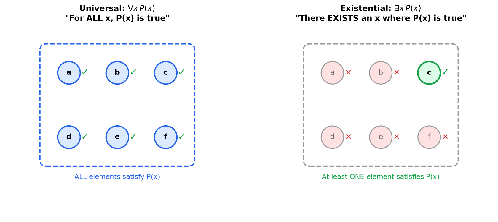

Propositional logic can only express complete statements like "it is raining" as true or false. Predicate logic goes further: it can express "it is raining in city x," where the truth value depends on which city x refers to. This lets us make statements about *all* objects or *some* objects, such as "every even number greater than 2 is the sum of two primes." Predicate logic is the language in which mathematical definitions and theorems are formally written.

**Predicate Logic / first-order logic:** An extension of propositional logic that allows reasoning about objects, their properties, and relationships using variables and quantifiers.

## Terms and the FOL Alphabet

Propositional logic has only one kind of building block, the atomic proposition. First-order logic needs to talk about *objects* and what is true of them, so its alphabet is richer. Before we can write a formula, we need a vocabulary of symbols and a way to name objects.

**The symbols of a first-order language:**

- **Individual constants** name specific objects in the domain. Written $a, b, c, \ldots$ or descriptive names like $0$, $\pi$, $\text{Socrates}$.
- **Variables** stand for unspecified objects and can be quantified. Written $x, y, z, \ldots$
- **Function symbols** take one or more objects and return an object. Each has a fixed **arity** (number of arguments). For example, a binary function symbol $+$ turns two objects into one, and a unary $\text{succ}$ (successor) turns one into another.
- **Predicate (relation) symbols** take one or more objects and return a truth value. A unary predicate like $\text{Prime}(x)$ expresses a property; a binary predicate like $x < y$ expresses a relation. These are exactly the predicates introduced below.

**Terms** are the expressions that name objects. They are built up by the following rules:

1. Every individual constant is a term.
2. Every variable is a term.
3. If $f$ is an $n$-ary function symbol and $t_1, \ldots, t_n$ are terms, then $f(t_1, \ldots, t_n)$ is a term.

So $x$, $0$, $\text{succ}(x)$, and $x + \text{succ}(0)$ are all terms. Terms never have a truth value on their own; they only name objects. A truth value appears only when a predicate is applied to terms, for example $\text{Prime}(x + \text{succ}(0))$. Applying a predicate to terms produces an **atomic formula**, and connectives and quantifiers combine atomic formulas into larger ones.

## Structures and Interpretations (Models)

A first-order formula by itself is just a string of symbols; it has no truth value until we say what the symbols *mean* and what objects exist. That information is packaged in a **structure** (also called an **interpretation** or a **model**).

A structure $\mathcal{M}$ consists of:

1. A non-empty **domain** (or universe) $D$: the set of objects the variables range over.
2. An **interpretation** of each non-logical symbol:
   - each individual constant is assigned a specific element of $D$,
   - each $n$-ary function symbol is assigned an actual function $D^n \to D$,
   - each $n$-ary predicate symbol is assigned an actual relation on $D$ (a subset of $D^n$).

Given a structure, every closed formula becomes either true or false in it. This is what grounds the "Truth value: TRUE/FALSE" claims throughout this page: each such claim is implicitly relative to a chosen domain (usually stated, e.g. $\mathbb{R}$ or $\mathbb{C}$) together with the standard interpretation of the symbols $+$, $<$, $=$, and so on. The same formula can be true in one structure and false in another. For instance, $\exists x\,(x^2 = -1)$ is false when the domain is $\mathbb{R}$ but true when the domain is $\mathbb{C}$, because changing the domain changes which objects are available to witness the existential.

When a structure $\mathcal{M}$ makes a formula $\phi$ true, we say $\mathcal{M}$ is a **model** of $\phi$, written $\mathcal{M} \vDash \phi$.

## Predicates

**Predicate:** A function that takes one or more variables and returns a truth value (true or false).

**Notation:** $P(x)$, $Q(x, y)$, $R(x, y, z)$, etc.

**Examples:**
- $P(x)$ means "x is prime"
- $Q(x, y)$ means "x is greater than y"
- $R(x)$ means "x is an even number"

## Domain of Discourse

**Domain of Discourse (Universe):** The set of all possible values that variables can take.

**Example:**
- If domain is $\mathbb{N}$, then $x$ can be any natural number
- If domain is $\mathbb{R}$, then $x$ can be any real number

## Quantifiers

### Universal Quantifier (∀)

**Symbol:** $\forall$ (read as "for all" or "for every")

**Meaning:** The statement is true for all elements in the domain.

**Notation:** $\forall x P(x)$

**Example 1:** $\forall x (x + 0 = x)$
- Domain: $\mathbb{R}$
- Meaning: "For all real numbers $x$, $x + 0 = x$"
- Truth value: TRUE

**Example 2:** $\forall x (x^2 \geq 0)$
- Domain: $\mathbb{R}$
- Meaning: "For all real numbers $x$, $x^2$ is non-negative"
- Truth value: TRUE

**Example 3:** $\forall x (x > 0)$
- Domain: $\mathbb{R}$
- Meaning: "For all real numbers $x$, $x$ is positive"
- Truth value: FALSE (counterexample: $x = -1$)

### Existential Quantifier (∃)

**Symbol:** $\exists$ (read as "there exists" or "for some")

**Meaning:** The statement is true for at least one element in the domain.

**Notation:** $\exists x P(x)$

**Example 1:** $\exists x (x^2 = 4)$
- Domain: $\mathbb{R}$
- Meaning: "There exists a real number $x$ such that $x^2 = 4$"
- Truth value: TRUE (examples: $x = 2$ or $x = -2$)

**Example 2:** $\exists x (x^2 = -1)$
- Domain: $\mathbb{R}$
- Meaning: "There exists a real number $x$ such that $x^2 = -1$"
- Truth value: FALSE

**Example 3:** $\exists x (x^2 = -1)$
- Domain: $\mathbb{C}$
- Meaning: "There exists a complex number $x$ such that $x^2 = -1$"
- Truth value: TRUE (example: $x = i$)

### Unique Existential Quantifier (∃!)

**Symbol:** $\exists!$ (read as "there exists exactly one")

**Meaning:** The statement is true for exactly one element in the domain.

**Notation:** $\exists! x P(x)$

**Example:** $\exists! x (x + 5 = 7)$
- Domain: $\mathbb{R}$
- Meaning: "There exists exactly one real number $x$ such that $x + 5 = 7$"
- Truth value: TRUE (only $x = 2$)

## Multiple Quantifiers

### Order Matters

**Example 1:** $\forall x \exists y (x < y)$
- Domain: $\mathbb{R}$
- Meaning: "For every real number $x$, there exists a real number $y$ such that $x < y$"
- Truth value: TRUE (for any $x$, we can choose $y = x + 1$)

**Example 2:** $\exists y \forall x (x < y)$
- Domain: $\mathbb{R}$
- Meaning: "There exists a real number $y$ such that for all real numbers $x$, $x < y$"
- Truth value: FALSE (no single $y$ is greater than all real numbers)

### Mixed Quantifiers

**Example:** $\forall x \exists y (x + y = 0)$
- Domain: $\mathbb{R}$
- Meaning: "For every real number $x$, there exists a real number $y$ such that $x + y = 0$"
- Truth value: TRUE (for any $x$, choose $y = -x$)

## Negating Quantified Statements

**Rules:**
- $\neg(\forall x P(x)) \equiv \exists x \neg P(x)$
- $\neg(\exists x P(x)) \equiv \forall x \neg P(x)$

**Example 1:** Negate $\forall x (x > 0)$
- Original: "All $x$ are positive"
- Negation: $\exists x \neg(x > 0) \equiv \exists x (x \leq 0)$
- Result: "There exists an $x$ that is not positive"

**Example 2:** Negate $\exists x (x^2 = 2)$
- Original: "There exists an $x$ such that $x^2 = 2$"
- Negation: $\forall x \neg(x^2 = 2) \equiv \forall x (x^2 \neq 2)$
- Result: "For all $x$, $x^2 \neq 2$"

**Example 3:** Negate $\forall x \exists y (x < y)$
- Apply negation rules from outside in:
  - $\neg(\forall x \exists y (x < y))$
  - $\exists x \neg(\exists y (x < y))$
  - $\exists x \forall y \neg(x < y)$
  - $\exists x \forall y (x \geq y)$
- Result: "There exists an $x$ such that for all $y$, $x \geq y$"

## Bound vs Free Variables

**Bound Variable:** A variable that is controlled by a quantifier.

**Free Variable:** A variable that is not controlled by a quantifier.

**Example 1:** $\forall x (x + y = z)$
- $x$ is bound (controlled by $\forall$)
- $y$ and $z$ are free

**Example 2:** $\exists x \forall y (x < y + z)$
- $x$ and $y$ are bound
- $z$ is free

**Scope of a quantifier:** The **scope** of a quantifier is the sub-formula it governs, that is, the formula immediately following the quantifier (delimited by parentheses). A variable occurrence is **bound** if it falls within the scope of a quantifier using that variable, and **free** otherwise. In $\forall x\,(P(x)) \land Q(x)$, the scope of $\forall x$ is only $P(x)$, so the $x$ in $P(x)$ is bound while the $x$ in $Q(x)$ lies outside the scope and is free. The same variable letter can therefore be bound in one place and free in another within the same formula.

A formula with no free variables is called a **sentence** (or closed formula). Only sentences have a definite truth value in a structure; a formula with free variables is true or false only once we also assign domain elements to those free variables.

**Capture-avoiding substitution ("free for"):** Substituting a term $t$ for a free variable $x$ in a formula, written $\phi[t/x]$, is subtle when $t$ itself contains variables. We say $t$ is **free for** $x$ in $\phi$ if no free variable of $t$ becomes bound (gets "captured") after the substitution. For example, substituting $y$ for $x$ in $\exists y\,(x < y)$ would produce $\exists y\,(y < y)$, silently capturing $y$ and changing the meaning. To substitute safely, first rename the bound $y$ to a fresh variable ($\exists w\,(x < w)$), then substitute to get $\exists w\,(y < w)$. Only capture-avoiding substitutions preserve meaning, which is why quantifier instantiation rules require the substituted term to be free for the variable.

## Common Patterns

### "For all... if..., then..."

**Pattern:** $\forall x (P(x) \to Q(x))$

**Example:** $\forall x (x > 0 \to x^2 > 0)$
- Domain: $\mathbb{R}$
- Meaning: "For all real numbers, if $x$ is positive, then $x^2$ is positive"

### "There exists... such that... and..."

**Pattern:** $\exists x (P(x) \land Q(x))$

**Example:** $\exists x (x > 0 \land x^2 = 4)$
- Domain: $\mathbb{R}$
- Meaning: "There exists a positive real number whose square is 4"
- Truth value: TRUE ($x = 2$)

## Truth Tables for Quantified Statements

When the domain is finite, quantified statements can be expanded:

**Universal Quantifier:**
- $\forall x P(x) \equiv P(a) \land P(b) \land P(c) \land \ldots$
- TRUE only if $P$ is true for ALL elements

**Existential Quantifier:**
- $\exists x P(x) \equiv P(a) \lor P(b) \lor P(c) \lor \ldots$
- TRUE if $P$ is true for AT LEAST ONE element

**Example:** Domain = $\{1, 2, 3\}$, $P(x)$: "$x$ is even"

$\forall x P(x) \equiv P(1) \land P(2) \land P(3) \equiv F \land T \land F \equiv F$

$\exists x P(x) \equiv P(1) \lor P(2) \lor P(3) \equiv F \lor T \lor F \equiv T$

## Logical Equivalences for Quantifiers

### Distribution Over Conjunctions and Disjunctions

**Universal Quantifier with Conjunction:**
$$\forall x (P(x) \land Q(x)) \equiv \forall x P(x) \land \forall x Q(x)$$

**Example:** "All numbers are positive and even" is equivalent to "All numbers are positive AND all numbers are even"

**Universal Quantifier with Disjunction (does NOT distribute):**
$$\forall x (P(x) \lor Q(x)) \not\equiv \forall x P(x) \lor \forall x Q(x)$$

**Counterexample:** 
- Left side: $\forall x (x > 0 \lor x < 0)$ is FALSE (fails at $x = 0$)
- Right side: $\forall x (x > 0) \lor \forall x (x < 0)$ is also FALSE

But they're not equivalent to the relationship that DOES hold:
$$\forall x P(x) \lor \forall x Q(x) \Rightarrow \forall x (P(x) \lor Q(x))$$
(If all are P or all are Q, then each is at least one of them)

**Existential Quantifier with Disjunction:**
$$\exists x (P(x) \lor Q(x)) \equiv \exists x P(x) \lor \exists x Q(x)$$

**Example:** "There exists a number that is positive or even" is equivalent to "There exists a positive number OR there exists an even number"

**Existential Quantifier with Conjunction (does NOT distribute):**
$$\exists x (P(x) \land Q(x)) \not\equiv \exists x P(x) \land \exists x Q(x)$$

**Counterexample:**
- Left side: $\exists x (x = 2 \land x = 3)$ is FALSE (no number is both 2 and 3)
- Right side: $\exists x (x = 2) \land \exists x (x = 3)$ is TRUE (2 exists AND 3 exists)

But the implication holds:
$$\exists x (P(x) \land Q(x)) \Rightarrow \exists x P(x) \land \exists x Q(x)$$
(If something is both P and Q, then something is P and something is Q)

### Summary Table

| Statement | Distributes? | Equivalence |
|-----------|--------------|-------------|
| $\forall x (P(x) \land Q(x))$ | Yes | $\equiv \forall x P(x) \land \forall x Q(x)$ |
| $\forall x (P(x) \lor Q(x))$ | No | $\not\equiv \forall x P(x) \lor \forall x Q(x)$ |
| $\exists x (P(x) \lor Q(x))$ | Yes | $\equiv \exists x P(x) \lor \exists x Q(x)$ |
| $\exists x (P(x) \land Q(x))$ | No | $\not\equiv \exists x P(x) \land \exists x Q(x)$ |

**Mnemonic:** Same quantifier and same connective distribute (∀∧ and ∃∨), opposites don't (∀∨ and ∃∧)

### Quantifier Exchange Rules

**With Negation:**
$$\neg \forall x P(x) \equiv \exists x \neg P(x)$$
$$\neg \exists x P(x) \equiv \forall x \neg P(x)$$

**Example:** "Not everyone is happy" $\equiv$ "Someone is not happy"

### Nested Quantifiers - Swapping Rules

**Same Quantifiers (can swap):**
$$\forall x \forall y P(x, y) \equiv \forall y \forall x P(x, y)$$
$$\exists x \exists y P(x, y) \equiv \exists y \exists x P(x, y)$$

**Example:** $\forall x \forall y (x + y = y + x)$ is the same as $\forall y \forall x (x + y = y + x)$

**Different Quantifiers (order matters - cannot swap in general):**
$$\forall x \exists y P(x, y) \not\equiv \exists y \forall x P(x, y)$$

**Example:**
- $\forall x \exists y (x < y)$ is TRUE (for each number, there's a bigger one)
- $\exists y \forall x (x < y)$ is FALSE (no number is bigger than all numbers)

### Vacuous Truth

**Empty Domain:**
- $\forall x P(x)$ is TRUE when domain is empty (vacuously true)
- $\exists x P(x)$ is FALSE when domain is empty

**Example:** "All unicorns are blue" is vacuously true (there are no unicorns)

### Restricted Quantifiers

**Restricted Universal Quantifier:**
$$\forall x (D(x) \to P(x))$$
"For all $x$ in domain $D$, $P(x)$ holds"

**Example:** $\forall x (x \in \mathbb{N} \to x \geq 0)$
"All natural numbers are non-negative"

**Restricted Existential Quantifier:**
$$\exists x (D(x) \land P(x))$$
"There exists an $x$ in domain $D$ such that $P(x)$ holds"

**Example:** $\exists x (x \in \mathbb{N} \land x^2 = 4)$
"There exists a natural number whose square is 4"

**Important:** Note the connective difference:
- Universal uses implication ($\to$)
- Existential uses conjunction ($\land$)

**Why this matters:**
- $\forall x (x \in \mathbb{N} \land x \geq 0)$ would be FALSE (not every number is a natural number)
- $\exists x (x \in \mathbb{N} \to x \geq 0)$ would be TRUE but meaningless (true even if we pick $x = -5$)

### Equivalences with Restricted Quantifiers

**Negation of Restricted Universal:**
$$\neg \forall x (D(x) \to P(x)) \equiv \exists x (D(x) \land \neg P(x))$$

**Example:** "Not all natural numbers are even" $\equiv$ "Some natural number is not even"

**Negation of Restricted Existential:**
$$\neg \exists x (D(x) \land P(x)) \equiv \forall x (D(x) \to \neg P(x))$$

**Example:** "There is no natural number that is negative" $\equiv$ "All natural numbers are non-negative"

### Common Logical Equivalences

**Quantifier Scope:**
- If $x$ does not appear in $Q$:
  - $\forall x (P(x) \land Q) \equiv (\forall x P(x)) \land Q$
  - $\forall x (P(x) \lor Q) \equiv (\forall x P(x)) \lor Q$
  - $\exists x (P(x) \land Q) \equiv (\exists x P(x)) \land Q$
  - $\exists x (P(x) \lor Q) \equiv (\exists x P(x)) \lor Q$

**Example:** $\forall x (P(x) \land \text{sun is hot}) \equiv (\forall x P(x)) \land \text{sun is hot}$

**Quantifier over Implication:**
- $\forall x (P \to Q(x)) \equiv P \to \forall x Q(x)$ (if $x$ not in $P$)
- $\exists x (P \to Q(x)) \equiv P \to \exists x Q(x)$ (if $x$ not in $P$)
- $\forall x (P(x) \to Q) \equiv (\exists x P(x)) \to Q$ (if $x$ not in $Q$)
- $\exists x (P(x) \to Q) \equiv (\forall x P(x)) \to Q$ (if $x$ not in $Q$)

