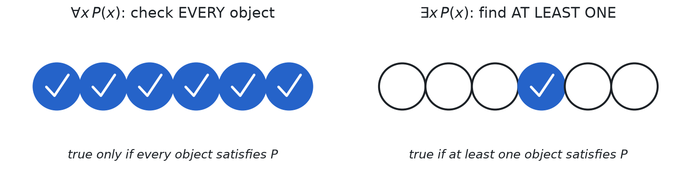
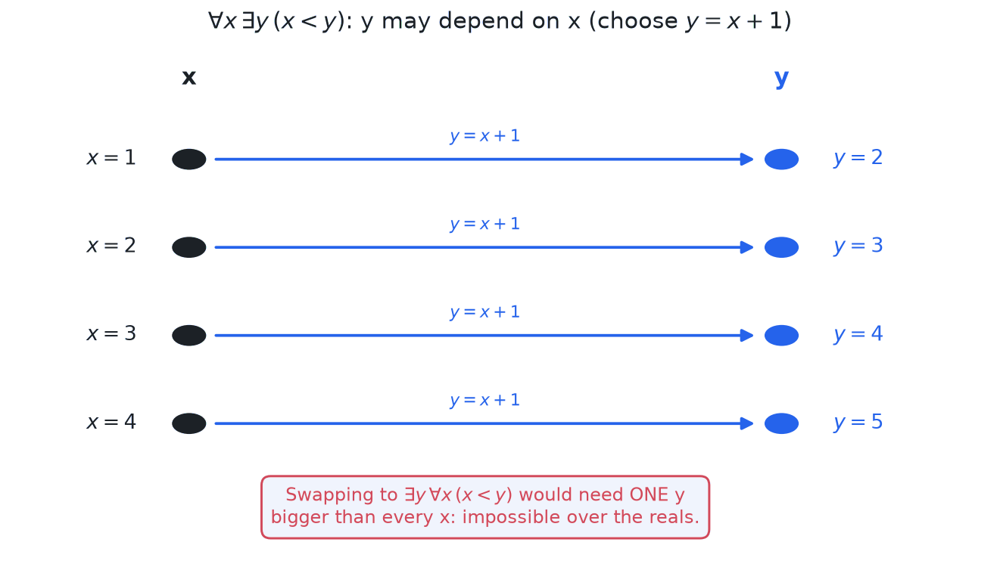
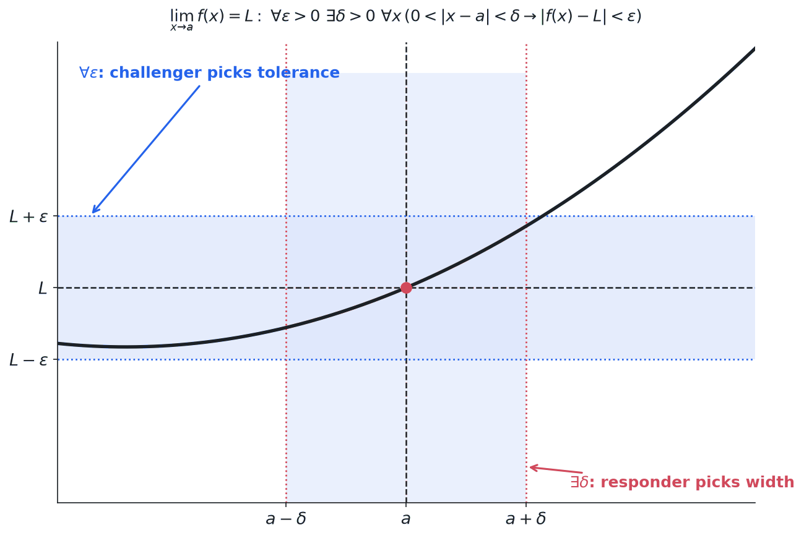

> [!abstract] Prerequisites & where this leads
> **Builds on:** [Propositional Logic](./propositional-logic-zeroth-order-logic) · [Set Theory](./set-theory)
> **Leads to:** [Real Analysis](./real-analysis) · [Measure Theory](./measure-theory)

Propositional logic can only express complete statements like "it is raining" as true or false. Predicate logic goes further: it can express "it is raining in city x," where the truth value depends on which city x refers to. This lets us make statements about *all* objects or *some* objects, such as "every even number greater than 2 is the sum of two primes." Predicate logic is the language in which mathematical definitions and theorems are formally written.

**Predicate Logic / first-order logic:** An extension of propositional logic that allows reasoning about objects, their properties, and relationships using variables and quantifiers.

## Terms and the FOL Alphabet

Propositional logic has only one kind of building block, the atomic proposition. First-order logic needs to talk about *objects* and what is true of them, so its alphabet is richer. Before we can write a formula, we need a vocabulary of symbols and a way to name objects.

**The symbols of a first-order language:**

- **Individual constants** name specific objects in the domain. Written $a, b, c, \ldots$ or descriptive names like $0$, $\pi$, $\text{Socrates}$.
- **Variables** stand for unspecified objects and can be quantified. Written $x, y, z, \ldots$
- **Function symbols** take one or more objects and return an object. Each has a fixed **arity** (number of arguments). For example, a binary function symbol $+$ turns two objects into one, and a unary $\text{succ}$ (successor) turns one into another.
- **Predicate (relation) symbols** take one or more objects and return a truth value. A unary predicate like $\text{Prime}(x)$ expresses a property; a binary predicate like $x < y$ expresses a relation. These are exactly the predicates introduced below.

**Terms** are the expressions that name objects. They are built up by the following rules:

1. Every individual constant is a term.
2. Every variable is a term.
3. If $f$ is an $n$-ary function symbol and $t_1, \ldots, t_n$ are terms, then $f(t_1, \ldots, t_n)$ is a term.

So $x$, $0$, $\text{succ}(x)$, and $x + \text{succ}(0)$ are all terms. Terms never have a truth value on their own; they only name objects. A truth value appears only when a predicate is applied to terms, for example $\text{Prime}(x + \text{succ}(0))$. Applying a predicate to terms produces an **atomic formula**, and connectives and quantifiers combine atomic formulas into larger ones.

## Structures and Interpretations (Models)

A first-order formula by itself is just a string of symbols; it has no truth value until we say what the symbols *mean* and what objects exist. That information is packaged in a **structure** (also called an **interpretation** or a **model**).

A structure $\mathcal{M}$ consists of:

1. A non-empty **domain** (or universe) $D$: the set of objects the variables range over.
2. An **interpretation** of each non-logical symbol:
   - each individual constant is assigned a specific element of $D$,
   - each $n$-ary function symbol is assigned an actual function $D^n \to D$,
   - each $n$-ary predicate symbol is assigned an actual relation on $D$ (a subset of $D^n$).

**In plainer terms.** A formula like $\forall x\, R(c, x)$ is a *template full of blanks*. Before you can call it true or false you have to answer three questions: what pool of objects does $x$ range over? which specific object does the name $c$ point at? and which pairs of objects does the relation $R$ actually hold between? A **structure** answers all of them at once: it hands you a **domain** (the pool of objects), a **specific object for every name**, a **real function for every function symbol**, and a **real yes/no table for every predicate**. Once every blank is filled in, the template stops being a string of symbols and becomes a definite claim about a definite little world, so it is simply true or false.

### A fully worked tiny structure

Abstract definitions sink in faster on a concrete case, so let us build one structure *completely* and then read a few sentences off it purely by looking things up.

**The structure $\mathcal{M}$.**
- **Domain:** $D = \{0, 1, 2\}$, just three objects. (Think of them as three dots. The labels $0, 1, 2$ are only names; nothing about ordinary arithmetic is assumed.)
- **Constant $c$:** interpreted as the object $0$. So everywhere the formula says $c$, read "$0$."
- **Function $s$ (a one-place "successor"):** interpreted as "step to the next dot, wrapping around at the end," so $s(0) = 1$, $s(1) = 2$, and $s(2) = 0$.
- **Predicate $R$ (a two-place relation):** interpreted as "comes strictly before," written out as the explicit list of pairs that *are* in the relation:
$$R = \{(0, 1),\ (0, 2),\ (1, 2)\}.$$

That list *is* the meaning of $R$ here: $R(x, y)$ is true exactly when the pair $(x, y)$ is on it. The whole structure is now nailed down, a pool of three objects plus one named object, one function, and one relation, all concrete.

**Reading sentences off $\mathcal{M}$.** A closed sentence is now decidable by pure mechanical lookup, no cleverness required.

*Sentence 1:* $R\big(c, s(c)\big)$ ("the named object is $R$-before its own successor"). Fill in the blanks: $c$ is $0$, and $s(c) = s(0) = 1$, so the sentence is asking whether $(0, 1) \in R$. It is on the list, so Sentence 1 is **true** in $\mathcal{M}$.

*Sentence 2:* $\forall x\, R\big(x, s(x)\big)$ ("every object is $R$-before its successor"). A "for all" over a three-element domain is just a three-way **and**: check $x = 0, 1, 2$, and *all* must pass.
- $x = 0$: $R(0, s(0)) = R(0, 1)$, and $(0, 1) \in R$. &nbsp;✓
- $x = 1$: $R(1, s(1)) = R(1, 2)$, and $(1, 2) \in R$. &nbsp;✓
- $x = 2$: $R(2, s(2)) = R(2, 0)$, but $(2, 0) \notin R$. &nbsp;✗

One failure is enough to sink a "for all," so Sentence 2 is **false** in $\mathcal{M}$. The culprit is the wrap-around: $s$ sends $2$ back to $0$, and $2$ does not come before $0$. That is the whole personality of a universal quantifier, you must check *every* object, and a single counterexample defeats it.

*Sentence 3:* $\exists x\, \forall y\, \big(R(x, y) \lor x = y\big)$ ("some object is before-or-equal-to everything," i.e. there is a least element). The outer "there exists" is a three-way **or**: it is enough to find *one* $x$ that works. Try $x = 0$, and ask, for every $y$, whether $R(0, y)$ or $0 = y$:
- $y = 0$: $0 = 0$. &nbsp;✓
- $y = 1$: $(0, 1) \in R$. &nbsp;✓
- $y = 2$: $(0, 2) \in R$. &nbsp;✓

All three hold, so $x = 0$ is a witness and Sentence 3 is **true**. (The "$\lor\, x = y$" is doing real work: the strict version $\exists x\, \forall y\, R(x, y)$ would be *false*, because no object comes strictly before itself, so even $x = 0$ fails at $y = 0$.)

**Same formula, different structure.** None of those truth values live in the formula alone, each depended on the interpretation. Keep everything identical but reinterpret the constant $c$ as the object $2$ instead of $0$; call this new structure $\mathcal{M}'$. Now Sentence 1, the *same string* $R(c, s(c))$, asks about $s(2) = 0$, that is, whether $(2, 0) \in R$. It is not, so the very same sentence is **true in $\mathcal{M}$** and **false in $\mathcal{M}'$**, purely because one name was pointed at a different object. A formula's truth value always lives in the *pairing* of formula with structure, never in the formula by itself.

Given a structure, every closed formula becomes either true or false in it. This is what grounds the "Truth value: TRUE/FALSE" claims throughout this page: each such claim is implicitly relative to a chosen domain (usually stated, e.g. $\mathbb{R}$ or $\mathbb{C}$) together with the standard interpretation of the symbols $+$, $<$, $=$, and so on. The same formula can be true in one structure and false in another. For instance, $\exists x\,(x^2 = -1)$ is false when the domain is $\mathbb{R}$ but true when the domain is $\mathbb{C}$, because changing the domain changes which objects are available to witness the existential.

When a structure $\mathcal{M}$ makes a formula $\phi$ true, we say $\mathcal{M}$ is a **model** of $\phi$, written $\mathcal{M} \vDash \phi$ (read "$\mathcal{M}$ models $\phi$", or "$\mathcal{M}$ satisfies $\phi$").

## Predicates

**Predicate:** A function that takes one or more variables and returns a truth value (true or false).

**Notation:** $P(x)$, $Q(x, y)$, $R(x, y, z)$, etc.

**Examples:**
- $P(x)$ means "x is prime"
- $Q(x, y)$ means "x is greater than y"
- $R(x)$ means "x is an even number"

## Equality (First-Order Logic with Identity)

Almost all of mathematics is written in first-order logic *with equality*: the binary predicate $=$ (read "equals") is treated as a built-in logical symbol with a fixed meaning, rather than just another relation you get to interpret freely. Wherever a structure interprets $x = y$, it must mean genuine identity: $x$ and $y$ name the *same* object of the domain. This fixed meaning is pinned down by axioms.

**Reflexivity.** Everything equals itself:
$$
\forall x\,(x = x).
$$

**Substitution (Leibniz's law).** Equal objects are interchangeable in every context. For any predicate $P$ and any function symbol $f$:
$$
\forall x\,\forall y\,\big(x = y \to (P(x) \leftrightarrow P(y))\big), \qquad
\forall x\,\forall y\,\big(x = y \to f(x) = f(y)\big).
$$
That is, if $x = y$, then $x$ has a property exactly when $y$ does, and applying a function to $x$ gives the same result as applying it to $y$. This single schema is what makes "substitute equals for equals," the most-used move in all of algebra, a *logical* rule rather than an assumption.

From reflexivity and substitution, the familiar properties follow as theorems (you do not have to assume them separately):

- **Symmetry:** $\forall x\,\forall y\,(x = y \to y = x)$.
- **Transitivity:** $\forall x\,\forall y\,\forall z\,\big((x = y \wedge y = z) \to x = z\big)$.

Together, symmetry, reflexivity, and transitivity make $=$ an [equivalence relation](./set-theory), and substitution makes it a *congruence* compatible with every function and predicate.

**Defining uniqueness through equality.** Equality is what lets us say "exactly one." The unique existential quantifier $\exists! x\, P(x)$ introduced below is not a new primitive; it abbreviates a formula built from $\exists$, $\forall$, and $=$:
$$
\exists! x\, P(x) \quad\equiv\quad \exists x\,\Big(P(x) \wedge \forall y\,\big(P(y) \to y = x\big)\Big).
$$
In words: something satisfies $P$, and anything satisfying $P$ *is that same thing*. Counting, definite descriptions ("the smallest prime"), and the very notion of a well-defined function all rest on this.

## Domain of Discourse

**Domain of Discourse (Universe):** The set of all possible values that variables can take.

**Example:**
- If domain is $\mathbb{N}$, then $x$ can be any natural number
- If domain is $\mathbb{R}$, then $x$ can be any real number

## Quantifiers

### Universal Quantifier (∀)

**Symbol:** $\forall$ (read as "for all" or "for every")

**Meaning:** The statement is true for all elements in the domain.

**Notation:** $\forall x P(x)$

**Example 1:** $\forall x (x + 0 = x)$
- Domain: $\mathbb{R}$
- Meaning: "For all real numbers $x$, $x + 0 = x$"
- Truth value: TRUE

**Example 2:** $\forall x (x^2 \geq 0)$
- Domain: $\mathbb{R}$
- Meaning: "For all real numbers $x$, $x^2$ is non-negative"
- Truth value: TRUE

**Example 3:** $\forall x (x > 0)$
- Domain: $\mathbb{R}$
- Meaning: "For all real numbers $x$, $x$ is positive"
- Truth value: FALSE (counterexample: $x = -1$)

### Existential Quantifier (∃)

**Symbol:** $\exists$ (read as "there exists" or "for some")

**Meaning:** The statement is true for at least one element in the domain.

**Notation:** $\exists x P(x)$

**Example 1:** $\exists x (x^2 = 4)$
- Domain: $\mathbb{R}$
- Meaning: "There exists a real number $x$ such that $x^2 = 4$"
- Truth value: TRUE (examples: $x = 2$ or $x = -2$)

**Example 2:** $\exists x (x^2 = -1)$
- Domain: $\mathbb{R}$
- Meaning: "There exists a real number $x$ such that $x^2 = -1$"
- Truth value: FALSE

**Example 3:** $\exists x (x^2 = -1)$
- Domain: $\mathbb{C}$
- Meaning: "There exists a complex number $x$ such that $x^2 = -1$"
- Truth value: TRUE (example: $x = i$)

### Unique Existential Quantifier (∃!)

**Symbol:** $\exists!$ (read as "there exists exactly one")

**Meaning:** The statement is true for exactly one element in the domain.

**Notation:** $\exists! x P(x)$

**Example:** $\exists! x (x + 5 = 7)$
- Domain: $\mathbb{R}$
- Meaning: "There exists exactly one real number $x$ such that $x + 5 = 7$"
- Truth value: TRUE (only $x = 2$)

## Multiple Quantifiers

A full quantified formula is read left to right, symbol by symbol: $\forall x\, \exists y\, (x < y)$ reads "for all x, there exists a y such that x is less than y".

### Order Matters

**Example 1:** $\forall x \exists y (x < y)$
- Domain: $\mathbb{R}$
- Meaning: "For every real number $x$, there exists a real number $y$ such that $x < y$"
- Truth value: TRUE (for any $x$, we can choose $y = x + 1$)

**Example 2:** $\exists y \forall x (x < y)$
- Domain: $\mathbb{R}$
- Meaning: "There exists a real number $y$ such that for all real numbers $x$, $x < y$"
- Truth value: FALSE (no single $y$ is greater than all real numbers)

The difference is *dependency*. In $\forall x\, \exists y$, the witness $y$ is chosen **after** $x$ and may depend on it (here $y = x+1$). In $\exists y\, \forall x$, the single $y$ must be fixed **first** and work for every $x$ at once, which is a far stronger, here impossible, demand.

### Mixed Quantifiers

**Example:** $\forall x \exists y (x + y = 0)$
- Domain: $\mathbb{R}$
- Meaning: "For every real number $x$, there exists a real number $y$ such that $x + y = 0$"
- Truth value: TRUE (for any $x$, choose $y = -x$)

## Negating Quantified Statements

**Rules (De Morgan's laws for quantifiers):**
- $\neg(\forall x P(x)) \equiv \exists x \neg P(x)$
- $\neg(\exists x P(x)) \equiv \forall x \neg P(x)$

To negate a quantified statement, flip each quantifier ($\forall \leftrightarrow \exists$) and push the negation inward onto the predicate. In words: "not everything satisfies $P$" means "something fails $P$", and "nothing satisfies $P$" means "everything fails $P$".

These are the quantifier generalization of the propositional [De Morgan's laws](./propositional-logic-zeroth-order-logic) $\neg(P \land Q) \equiv \neg P \lor \neg Q$ and $\neg(P \lor Q) \equiv \neg P \land \neg Q$. Over a finite domain $\{a_1, \ldots, a_n\}$, $\forall x P(x)$ is a conjunction $P(a_1) \land \cdots \land P(a_n)$ and $\exists x P(x)$ is a disjunction $P(a_1) \lor \cdots \lor P(a_n)$, so negating a quantifier is exactly applying De Morgan to that (possibly infinite) conjunction or disjunction.

**Example 1:** Negate $\forall x (x > 0)$
- Original: "All $x$ are positive"
- Negation: $\exists x \neg(x > 0) \equiv \exists x (x \leq 0)$
- Result: "There exists an $x$ that is not positive"

**Example 2:** Negate $\exists x (x^2 = 2)$
- Original: "There exists an $x$ such that $x^2 = 2$"
- Negation: $\forall x \neg(x^2 = 2) \equiv \forall x (x^2 \neq 2)$
- Result: "For all $x$, $x^2 \neq 2$"

**Example 3:** Negate $\forall x \exists y (x < y)$
- Apply negation rules from outside in:
  - $\neg(\forall x \exists y (x < y))$
  - $\exists x \neg(\exists y (x < y))$
  - $\exists x \forall y \neg(x < y)$
  - $\exists x \forall y (x \geq y)$
- Result: "There exists an $x$ such that for all $y$, $x \geq y$"

## Bound vs Free Variables

**Bound Variable:** A variable that is controlled by a quantifier.

**Free Variable:** A variable that is not controlled by a quantifier.

**Example 1:** $\forall x (x + y = z)$
- $x$ is bound (controlled by $\forall$)
- $y$ and $z$ are free

**Example 2:** $\exists x \forall y (x < y + z)$
- $x$ and $y$ are bound
- $z$ is free

**Scope of a quantifier:** The **scope** of a quantifier is the sub-formula it governs, that is, the formula immediately following the quantifier (delimited by parentheses). A variable occurrence is **bound** if it falls within the scope of a quantifier using that variable, and **free** otherwise. In $\forall x\,(P(x)) \land Q(x)$, the scope of $\forall x$ is only $P(x)$, so the $x$ in $P(x)$ is bound while the $x$ in $Q(x)$ lies outside the scope and is free. The same variable letter can therefore be bound in one place and free in another within the same formula.

A formula with no free variables is called a **sentence** (or closed formula). Only sentences have a definite truth value in a structure; a formula with free variables is true or false only once we also assign domain elements to those free variables.

**Capture-avoiding substitution ("free for"):** Substituting a term $t$ for a free variable $x$ in a formula, written $\phi[t/x]$, is subtle when $t$ itself contains variables. We say $t$ is **free for** $x$ in $\phi$ if no free variable of $t$ becomes bound (gets "captured") after the substitution. For example, substituting $y$ for $x$ in $\exists y\,(x < y)$ would produce $\exists y\,(y < y)$, silently capturing $y$ and changing the meaning. To substitute safely, first rename the bound $y$ to a fresh variable ($\exists w\,(x < w)$), then substitute to get $\exists w\,(y < w)$. Only capture-avoiding substitutions preserve meaning, which is why quantifier instantiation rules require the substituted term to be free for the variable.

## Formal Semantics: Satisfaction, Validity, and Entailment

The [Structures and Interpretations](#structures-and-interpretations-models) section said informally that a structure makes each sentence true or false. Making this precise is **Tarski's definition of satisfaction**, the semantic backbone of first-order logic. It is the exact analog of the propositional [Syntax and Semantics](./propositional-logic-zeroth-order-logic) section, but now truth must track the *objects* that variables range over.

**Variable assignments.** Because a formula may have free variables, we cannot evaluate it from a structure alone; we also need to say what its free variables refer to. A **variable assignment** $s$ in a structure $\mathcal{M}$ is a function sending each variable to an element of the domain $D$. Write $s[x \mapsto d]$ for the assignment that agrees with $s$ everywhere except it sends $x$ to $d$.

**The satisfaction relation $\mathcal{M}, s \vDash \phi$** (read "$\mathcal{M}$ with assignment $s$ satisfies $\phi$") is defined by recursion on the shape of $\phi$. Terms first denote objects (a constant denotes its interpretation, a variable denotes $s(x)$, and $f(t_1,\ldots,t_n)$ denotes the interpreted function applied to the denotations of the $t_i$). Then:

- $\mathcal{M}, s \vDash P(t_1, \ldots, t_n)$ iff the denoted objects stand in the interpreted relation $P^{\mathcal{M}}$.
- $\mathcal{M}, s \vDash \neg\phi$ iff **not** $\mathcal{M}, s \vDash \phi$; and $\wedge, \vee, \to, \leftrightarrow$ follow the propositional truth tables.
- $\mathcal{M}, s \vDash \forall x\, \phi$ iff $\mathcal{M}, s[x \mapsto d] \vDash \phi$ for **every** $d \in D$.
- $\mathcal{M}, s \vDash \exists x\, \phi$ iff $\mathcal{M}, s[x \mapsto d] \vDash \phi$ for **some** $d \in D$.

The two quantifier clauses are the heart of it: $\forall$ ranges over *all* ways of reassigning $x$, $\exists$ over *some*. For a **sentence** (no free variables), the assignment $s$ makes no difference, and we recover the clean $\mathcal{M} \vDash \phi$ from before. On a finite domain, these clauses are exactly the finite conjunction/disjunction expansion used below, and they are what the interactive explorer computes.

**The three semantic notions** then mirror propositional logic, but "all interpretations" now means all structures:

- $\phi$ is **valid** (**logically true**) if it is true in *every* structure under every assignment, written $\vDash \phi$. Example: $\forall x\, P(x) \to \exists x\, P(x)$ (over a non-empty domain) is valid.
- $\phi$ is **satisfiable** if it is true in *at least one* structure. Example: $\exists x\, \exists y\, (x \neq y)$ is satisfiable (any two-element domain works) but not valid (it fails on a one-element domain).
- $\Gamma$ **entails** $\phi$, written $\Gamma \vDash \phi$, if every structure-and-assignment satisfying all of $\Gamma$ also satisfies $\phi$. This is the semantic notion of a valid argument.

Validity is the first-order analog of a propositional tautology, satisfiability of consistency, and entailment of logical consequence. What is *provable* by the inference rules below relates to what is *valid* by the metatheorems in the final section.

## Common Patterns

### "For all... if..., then..."

**Pattern:** $\forall x (P(x) \to Q(x))$

**Example:** $\forall x (x > 0 \to x^2 > 0)$
- Domain: $\mathbb{R}$
- Meaning: "For all real numbers, if $x$ is positive, then $x^2$ is positive"

### "There exists... such that... and..."

**Pattern:** $\exists x (P(x) \land Q(x))$

**Example:** $\exists x (x > 0 \land x^2 = 4)$
- Domain: $\mathbb{R}$
- Meaning: "There exists a positive real number whose square is 4"
- Truth value: TRUE ($x = 2$)

## Truth Tables for Quantified Statements

When the domain is finite, quantified statements can be expanded:

**Universal Quantifier:**
- $\forall x P(x) \equiv P(a) \land P(b) \land P(c) \land \ldots$
- TRUE only if $P$ is true for ALL elements

**Existential Quantifier:**
- $\exists x P(x) \equiv P(a) \lor P(b) \lor P(c) \lor \ldots$
- TRUE if $P$ is true for AT LEAST ONE element

**Example:** Domain = $\{1, 2, 3\}$, $P(x)$: "$x$ is even"

$\forall x P(x) \equiv P(1) \land P(2) \land P(3) \equiv F \land T \land F \equiv F$

$\exists x P(x) \equiv P(1) \lor P(2) \lor P(3) \equiv F \lor T \lor F \equiv T$

Build your own finite structure below: choose the domain size, toggle which elements satisfy the predicate $P$, fill in the relation $R$ (or load a preset like "less-than"), and watch each quantified sentence evaluate live. Put $\forall x\, \exists y\, R(x,y)$ next to $\exists y\, \forall x\, R(x,y)$ and see for yourself when quantifier order changes the answer.

<iframe src="/static/interactive/fol-model-explorer.html" width="100%" height="640" style="border:none;"></iframe>

## Logical Equivalences for Quantifiers

### Distribution Over Conjunctions and Disjunctions

**Universal Quantifier with Conjunction:**
$$\forall x (P(x) \land Q(x)) \equiv \forall x P(x) \land \forall x Q(x)$$

**Example:** "All numbers are positive and even" is equivalent to "All numbers are positive AND all numbers are even"

**Universal Quantifier with Disjunction (does NOT distribute):**
$$\forall x (P(x) \lor Q(x)) \not\equiv \forall x P(x) \lor \forall x Q(x)$$

**Counterexample:** 
- Left side: $\forall x (x > 0 \lor x < 0)$ is FALSE (fails at $x = 0$)
- Right side: $\forall x (x > 0) \lor \forall x (x < 0)$ is also FALSE

But they're not equivalent to the relationship that DOES hold:
$$\forall x P(x) \lor \forall x Q(x) \Rightarrow \forall x (P(x) \lor Q(x))$$
(If all are P or all are Q, then each is at least one of them)

**Existential Quantifier with Disjunction:**
$$\exists x (P(x) \lor Q(x)) \equiv \exists x P(x) \lor \exists x Q(x)$$

**Example:** "There exists a number that is positive or even" is equivalent to "There exists a positive number OR there exists an even number"

**Existential Quantifier with Conjunction (does NOT distribute):**
$$\exists x (P(x) \land Q(x)) \not\equiv \exists x P(x) \land \exists x Q(x)$$

**Counterexample:**
- Left side: $\exists x (x = 2 \land x = 3)$ is FALSE (no number is both 2 and 3)
- Right side: $\exists x (x = 2) \land \exists x (x = 3)$ is TRUE (2 exists AND 3 exists)

But the implication holds:
$$\exists x (P(x) \land Q(x)) \Rightarrow \exists x P(x) \land \exists x Q(x)$$
(If something is both P and Q, then something is P and something is Q)

### Summary Table

| Statement | Distributes? | Equivalence |
|-----------|--------------|-------------|
| $\forall x (P(x) \land Q(x))$ | Yes | $\equiv \forall x P(x) \land \forall x Q(x)$ |
| $\forall x (P(x) \lor Q(x))$ | No | $\not\equiv \forall x P(x) \lor \forall x Q(x)$ |
| $\exists x (P(x) \lor Q(x))$ | Yes | $\equiv \exists x P(x) \lor \exists x Q(x)$ |
| $\exists x (P(x) \land Q(x))$ | No | $\not\equiv \exists x P(x) \land \exists x Q(x)$ |

**Mnemonic:** Same quantifier and same connective distribute (∀∧ and ∃∨), opposites don't (∀∨ and ∃∧)

### Quantifier Exchange Rules

**With Negation (De Morgan's laws for quantifiers):**
$$\neg \forall x P(x) \equiv \exists x \neg P(x)$$
$$\neg \exists x P(x) \equiv \forall x \neg P(x)$$

**Example:** "Not everyone is happy" $\equiv$ "Someone is not happy"

### Nested Quantifiers - Swapping Rules

**Same Quantifiers (can swap):**
$$\forall x \forall y P(x, y) \equiv \forall y \forall x P(x, y)$$
$$\exists x \exists y P(x, y) \equiv \exists y \exists x P(x, y)$$

**Example:** $\forall x \forall y (x + y = y + x)$ is the same as $\forall y \forall x (x + y = y + x)$

**Different Quantifiers (order matters - cannot swap in general):**
$$\forall x \exists y P(x, y) \not\equiv \exists y \forall x P(x, y)$$

**Example:**
- $\forall x \exists y (x < y)$ is TRUE (for each number, there's a bigger one)
- $\exists y \forall x (x < y)$ is FALSE (no number is bigger than all numbers)

### Vacuous Truth

**Empty Domain:**
- $\forall x P(x)$ is TRUE when domain is empty (vacuously true)
- $\exists x P(x)$ is FALSE when domain is empty

**Example:** "All unicorns are blue" is vacuously true (there are no unicorns)

### Restricted Quantifiers

**Restricted Universal Quantifier:**
$$\forall x (D(x) \to P(x))$$
"For all $x$ in domain $D$, $P(x)$ holds"

**Example:** $\forall x (x \in \mathbb{N} \to x \geq 0)$
"All natural numbers are non-negative"

**Restricted Existential Quantifier:**
$$\exists x (D(x) \land P(x))$$
"There exists an $x$ in domain $D$ such that $P(x)$ holds"

**Example:** $\exists x (x \in \mathbb{N} \land x^2 = 4)$
"There exists a natural number whose square is 4"

**Important:** Note the connective difference:
- Universal uses implication ($\to$)
- Existential uses conjunction ($\land$)

**Why this matters:**
- $\forall x (x \in \mathbb{N} \land x \geq 0)$ would be FALSE (not every number is a natural number)
- $\exists x (x \in \mathbb{N} \to x \geq 0)$ would be TRUE but meaningless (true even if we pick $x = -5$)

### Equivalences with Restricted Quantifiers

**Negation of Restricted Universal:**
$$\neg \forall x (D(x) \to P(x)) \equiv \exists x (D(x) \land \neg P(x))$$

**Example:** "Not all natural numbers are even" $\equiv$ "Some natural number is not even"

**Negation of Restricted Existential:**
$$\neg \exists x (D(x) \land P(x)) \equiv \forall x (D(x) \to \neg P(x))$$

**Example:** "There is no natural number that is negative" $\equiv$ "All natural numbers are non-negative"

### Common Logical Equivalences

**Quantifier Scope:**
- If $x$ does not appear in $Q$:
  - $\forall x (P(x) \land Q) \equiv (\forall x P(x)) \land Q$
  - $\forall x (P(x) \lor Q) \equiv (\forall x P(x)) \lor Q$
  - $\exists x (P(x) \land Q) \equiv (\exists x P(x)) \land Q$
  - $\exists x (P(x) \lor Q) \equiv (\exists x P(x)) \lor Q$

**Example:** $\forall x (P(x) \land \text{sun is hot}) \equiv (\forall x P(x)) \land \text{sun is hot}$

**Quantifier over Implication:**
- $\forall x (P \to Q(x)) \equiv P \to \forall x Q(x)$ (if $x$ not in $P$)
- $\exists x (P \to Q(x)) \equiv P \to \exists x Q(x)$ (if $x$ not in $P$)
- $\forall x (P(x) \to Q) \equiv (\exists x P(x)) \to Q$ (if $x$ not in $Q$)
- $\exists x (P(x) \to Q) \equiv (\forall x P(x)) \to Q$ (if $x$ not in $Q$)

## Rules of Inference for Quantifiers

The propositional [rules of inference](./propositional-logic-zeroth-order-logic) (modus ponens and friends) handle connectives, but they cannot get inside a quantifier. First-order natural deduction adds exactly four rules: two for *removing* a quantifier (instantiation) and two for *introducing* one (generalization). Each generalization rule carries a **side condition** whose whole job is to block a tempting fallacy. Throughout, $c$ is a term and $\phi[c/x]$ is the capture-avoiding substitution defined above.

**Universal Instantiation (UI).** From $\forall x\, \phi(x)$, infer $\phi(c)$ for any term $c$ (free for $x$).
$$
\frac{\forall x\, \phi(x)}{\phi(c)}
$$
What holds for everything holds for any particular thing. No side condition: this direction is always safe.

**Existential Generalization (EG).** From $\phi(c)$, infer $\exists x\, \phi(x)$.
$$
\frac{\phi(c)}{\exists x\, \phi(x)}
$$
If some specific object has the property, then *something* has it. Also always safe.

**Universal Generalization (UG).** From $\phi(c)$, infer $\forall x\, \phi(x)$ **provided $c$ is arbitrary**: $c$ is a variable (an *eigenvariable*) that does not occur free in any premise or undischarged assumption.
$$
\frac{\phi(c)}{\forall x\, \phi(x)} \quad (c \text{ arbitrary})
$$
This is the formal version of "let $x$ be arbitrary; ... therefore it holds for all $x$." The side condition is essential: if $c$ appeared in a premise, then $c$ was *special*, not arbitrary, and generalizing would be a fallacy (proving something about a chosen number does not prove it for all numbers).

**Existential Instantiation (EI).** From $\exists x\, \phi(x)$, introduce a **fresh** name $c$ (a *witness*) and assume $\phi(c)$, where $c$ is new: it must not occur earlier in the derivation or in the conclusion.
$$
\frac{\exists x\, \phi(x)}{\phi(c)} \quad (c \text{ fresh})
$$
"Something satisfies $\phi$; call one such thing $c$." The freshness condition stops you from conflating this unknown witness with an object you already named.

**Worked derivation (a classic syllogism).** Premises: $\forall x\,(\text{Human}(x) \to \text{Mortal}(x))$ and $\text{Human}(\text{socrates})$. Conclude $\text{Mortal}(\text{socrates})$.

1. $\forall x\,(\text{Human}(x) \to \text{Mortal}(x))$ — premise
2. $\text{Human}(\text{socrates}) \to \text{Mortal}(\text{socrates})$ — UI on 1 (instantiate $x := \text{socrates}$)
3. $\text{Human}(\text{socrates})$ — premise
4. $\text{Mortal}(\text{socrates})$ — modus ponens on 2, 3.

**Worked derivation (using UG).** To show $\forall x\,(P(x) \wedge Q(x)) \vdash \forall x\, P(x)$: take an arbitrary $c$; from $\forall x\,(P(x)\wedge Q(x))$ get $P(c)\wedge Q(c)$ by UI; simplify to $P(c)$; since $c$ was arbitrary, conclude $\forall x\, P(x)$ by UG.

**Why the side conditions matter.** Dropping freshness in EI lets you "prove" absurdities: from $\exists x\,\text{Even}(x)$ and $\exists x\,\text{Odd}(x)$ you must introduce *different* witnesses; naming both $c$ would falsely give $\text{Even}(c)\wedge\text{Odd}(c)$. Dropping arbitrariness in UG lets you generalize a lucky special case to a false universal.

## Proof Techniques with Quantifiers

These rules turn into everyday proof strategy:

- **To prove $\forall x\, P(x)$:** "Let $x$ be arbitrary," prove $P(x)$ using nothing special about $x$, then apply UG. (This is [direct proof](./propositional-logic-zeroth-order-logic) under a universal.)
- **To prove $\exists x\, P(x)$:** exhibit a **witness**, a specific object you can check, then apply EG. (Non-constructive existence proofs instead derive a contradiction from $\forall x\, \neg P(x)$.)
- **To disprove $\forall x\, P(x)$:** give a single **counterexample**, one object with $\neg P(x)$. By the negation rules, $\neg\forall x\, P(x) \equiv \exists x\, \neg P(x)$, so a counterexample *is* a proof of the negation.
- **To prove $\exists! x\, P(x)$:** prove **existence** (a witness $a$ with $P(a)$) and **uniqueness** (assume $P(a)$ and $P(b)$, derive $a = b$), exactly the two conjuncts of the equality definition of $\exists!$.

**Example (prove a universal).** Claim: $\forall n\,(n \text{ is even} \to n^2 \text{ is even})$. Let $n$ be arbitrary and suppose $n$ is even, so $n = 2k$. Then $n^2 = 4k^2 = 2(2k^2)$, which is even. Since $n$ was arbitrary, the universal holds.

**Example (disprove by counterexample).** Claim: $\forall x\,(x^2 > x)$ over $\mathbb{R}$. Counterexample $x = \tfrac{1}{2}$: then $x^2 = \tfrac{1}{4} < \tfrac{1}{2}$. One counterexample settles it; the statement is false.

## Formalizing Mathematics in First-Order Logic

The reason to learn all this: the definitions of analysis, algebra, and number theory *are* first-order sentences, and their logical structure is what makes them precise. The most important case is the limit.

**The $\varepsilon$–$\delta$ definition of a limit** is three nested quantifiers:
$$
\lim_{x \to a} f(x) = L \quad\equiv\quad \forall \varepsilon > 0\ \; \exists \delta > 0\ \; \forall x\,\big(0 < |x - a| < \delta \;\to\; |f(x) - L| < \varepsilon\big).
$$

Read the quantifier order as a game (this is exactly the [real analysis](./real-analysis) picture): a **challenger** names a tolerance $\varepsilon > 0$; a **responder** must produce a width $\delta > 0$; then **every** $x$ within $\delta$ of $a$ must land within $\varepsilon$ of $L$. Because $\exists\delta$ sits *inside* $\forall\varepsilon$, the width $\delta$ is allowed to depend on $\varepsilon$, just as $y$ depended on $x$ earlier.

**Quantifier order distinguishes deep concepts.** Compare pointwise and uniform continuity of $f$ on a set:
$$
\text{pointwise: } \forall \varepsilon\, \forall a\, \exists \delta\, \forall x\,(\ldots) \qquad\text{vs.}\qquad \text{uniform: } \forall \varepsilon\, \exists \delta\, \forall a\, \forall x\,(\ldots).
$$
In the pointwise version $\delta$ may depend on the point $a$; in the uniform version one $\delta$ must work for *all* points at once. That single swap of $\exists\delta$ past $\forall a$ is the entire difference between two theorems, a vivid reminder that quantifier order carries mathematical content.

**More formalizations:**
- **Infinitely many primes:** $\forall n\, \exists p\,\big(p > n \wedge \text{Prime}(p)\big)$ ("beyond every $n$ there is a prime").
- **Boundedness of $f$:** $\exists M\, \forall x\,\big(|f(x)| \le M\big)$; its negation, unboundedness, flips to $\forall M\, \exists x\,\big(|f(x)| > M\big)$.
- **Density of the rationals:** $\forall x\, \forall y\,\big(x < y \to \exists q\,(x < q \wedge q < y)\big)$.
- **Negating a limit** (to prove $\lim \neq L$) flips every quantifier: $\exists \varepsilon > 0\ \forall \delta > 0\ \exists x\,\big(0 < |x-a| < \delta \wedge |f(x) - L| \ge \varepsilon\big)$.

## Prenex Normal Form and Skolemization

**Prenex normal form (PNF).** Every first-order formula is logically equivalent to one in which all quantifiers appear in a single prefix at the front, followed by a quantifier-free **matrix**:
$$
Q_1 x_1\, Q_2 x_2\, \cdots\, Q_n x_n\ \; M(x_1, \ldots, x_n), \qquad Q_i \in \{\forall, \exists\}.
$$
You reach it by renaming bound variables apart (to avoid capture) and then pulling quantifiers outward with the scope equivalences already listed above, for example $\big(\forall x\, P(x)\big) \to Q \equiv \exists x\,\big(P(x) \to Q\big)$ (note the flip: a universal in the antecedent becomes existential when it moves out). PNF is the standard input format for the algorithms below and for automated theorem provers.

**Skolemization.** Once in prenex form, we can eliminate existential quantifiers by naming their witnesses. An existential that sits inside some universals is replaced by a **Skolem function** of exactly those universals:
$$
\forall x\, \exists y\, R(x, y) \quad\rightsquigarrow\quad \forall x\, R\big(x, f(x)\big),
$$
where $f$ is a new **Skolem function** symbol. An existential with no universals in front of it becomes a **Skolem constant** ($\exists y\, \phi \rightsquigarrow \phi[c/y]$). The Skolem function *is* the dependency made explicit: $f(x)$ literally names "the $y$ that works for this $x$," the same dependency the $\forall x\,\exists y$ diagram drew. Skolemization does **not** preserve logical equivalence, but it preserves **satisfiability**, which is all that resolution-based theorem proving needs.

## Metatheory: Soundness, Completeness, and the Limits of FOL

First-order logic has a proof system (the rules above, plus the propositional rules and equality axioms). How does *provability* $\vdash$ relate to *truth in all structures* $\vDash$? The answer is a set of celebrated metatheorems.

- **Soundness:** if $\Gamma \vdash \phi$ then $\Gamma \vDash \phi$. The rules never derive anything invalid.
- **Gödel's Completeness Theorem (1929):** if $\Gamma \vDash \phi$ then $\Gamma \vdash \phi$. *Every* valid first-order sentence has a proof. So, exactly as in propositional logic, $\vdash$ and $\vDash$ coincide. (This is **not** the incompleteness theorem: incompleteness is about a particular *theory*, like arithmetic, failing to *decide* every sentence about its intended model; completeness is about the logic's proof system capturing all *logically valid* inferences. They are compatible.)
- **Compactness:** a set of sentences has a model if and only if every *finite* subset has a model. This has striking consequences, such as the existence of non-standard models of arithmetic containing "infinite" numbers.
- **Löwenheim–Skolem:** if a countable set of first-order sentences has an infinite model, it has infinite models of *every* infinite cardinality. First-order logic cannot pin down the size of an infinite structure, which is why no first-order theory can categorically describe $\mathbb{N}$, $\mathbb{R}$, or the sets.

**The decidability gap.** Propositional validity is **decidable**: a truth table (or the [truth-table generator](./propositional-logic-zeroth-order-logic)) always terminates with a yes/no answer. First-order validity is **not**. By the Church–Turing theorem (1936), no algorithm can decide, for an arbitrary first-order sentence, whether it is valid. It is, however, **semi-decidable**: by completeness, a systematic proof search will eventually find a proof *if one exists*, but may run forever when the sentence is invalid. Certain fragments (monadic predicate logic, and others) are decidable; full first-order logic is the boundary where expressive power meets undecidability.

## First-Order vs Higher-Order Logic

The "first" in first-order names a deliberate restriction: quantifiers range only over **objects** of the domain, never over predicates, functions, or sets of objects. You may write $\forall x\,(\ldots)$ for $x$ an element, but not $\forall P\,(\ldots)$ for $P$ a property.

**Second-order logic** lifts that restriction and allows quantifying over predicates and relations. This buys real expressive power. Mathematical induction becomes a single axiom rather than an infinite schema,
$$
\forall P\,\Big(\big(P(0) \wedge \forall n\,(P(n) \to P(n+1))\big) \to \forall n\, P(n)\Big),
$$
and the least-upper-bound property of $\mathbb{R}$ becomes directly statable. Second-order logic can even characterize $\mathbb{N}$ up to isomorphism, which first-order logic (by Löwenheim–Skolem) cannot.

The catch is exactly the metatheory above: **second-order logic has no sound and complete proof system, and fails compactness.** You cannot have both full expressive power and a complete, effective notion of proof. This trade-off is why mainstream mathematics is founded on *first-order* set theory (ZFC): a first-order theory keeps Gödel completeness and a usable proof system, and recovers the strength of second-order ideas by quantifying over sets *as objects* rather than over predicates. Choosing first-order logic is choosing a complete, well-behaved logic over a maximally expressive one.

