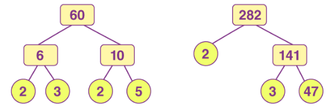

Prime factorization is a core tool in [Number Theory](./number-theory), where it is used to compute GCDs, LCMs, and in modular arithmetic.

## What Are Prime Numbers?

**Prime number:** A whole number greater than 1 that is divisible only by 1 and itself. The first several primes are $2, 3, 5, 7, 11, 13, 17, 19, 23, \ldots$

A number that is not prime (and is greater than 1) is called a **composite number**. For example, $12$ is composite because $12 = 3 \times 4$.

### List of Small Primes

The primes up to 50 are worth memorizing, as they appear constantly when factoring:

$$
2,\; 3,\; 5,\; 7,\; 11,\; 13,\; 17,\; 19,\; 23,\; 29,\; 31,\; 37,\; 41,\; 43,\; 47
$$

Note that $2$ is the only even prime. Every even number greater than 2 is divisible by 2, so it cannot be prime. This makes 2 special in many arguments.

## Why Primes Matter

Prime numbers are the "atoms" of whole numbers. Just as every molecule is built from atoms, every whole number greater than 1 is built from primes. This idea is made precise by the **Fundamental Theorem of Arithmetic**:

> Every integer greater than 1 can be expressed as a product of prime numbers in exactly one way (up to the order of the factors).

In plain language: there is only one way to break a number down into primes. For example:

$$
12 = 2 \times 2 \times 3
$$

You cannot find a different set of primes that multiply to give 12. You might write the factors in a different order ($3 \times 2 \times 2$), but the primes themselves are always $2, 2, 3$.

Another example: $60 = 2 \times 2 \times 3 \times 5$. No matter how you factor 60, you will always end up with two 2s, one 3, and one 5.

This uniqueness is what makes prime factorization useful: it gives every number a unique "fingerprint" that we can use for finding greatest common divisors, simplifying fractions, and many other tasks.

## Definition

**Prime Factorization:** Prime factorization is a process of factoring a
**composite number** in terms of **prime numbers**.

*Every composite number has a unique prime factorization. This is
guaranteed by the Fundamental Theorem of
Arithmetic.*

Because every composite number has a unique prime factorization, there
is only one way to reduce a composite number into a product of primes.

## Canonical Form

When writing prime factorizations, we use **canonical form** (also called standard form): group repeated primes using exponents and list the prime bases in increasing order.

$$
n = p_1^{a_1} \cdot p_2^{a_2} \cdots p_k^{a_k}
$$

where $p_1 < p_2 < \cdots < p_k$ are distinct primes and each $a_i \geq 1$.

**Examples:**

- $12 = 2^2 \cdot 3$
- $60 = 2^2 \cdot 3 \cdot 5$
- $360 = 2^3 \cdot 3^2 \cdot 5$
- $504 = 2^3 \cdot 3^2 \cdot 7$

This notation is compact and makes it easy to read off properties of the number (its divisors, its GCD with another number, etc.).

## Divisibility Rules

Before diving into factorization methods, it helps to have quick tests for whether a number is divisible by small primes. These **divisibility rules** let you test divisibility without performing full division.

**Divisible by 2:** The last digit is even (0, 2, 4, 6, or 8).
*Why:* $10 = 2 \times 5$, so every power of 10 is divisible by 2. Only the ones digit determines the remainder when dividing by 2.

**Divisible by 3:** The sum of the digits is divisible by 3.
*Why:* $10 \equiv 1 \pmod{3}$, so $10^k \equiv 1 \pmod{3}$ for all $k$. A number like $d_n d_{n-1} \ldots d_1 d_0$ has the same remainder mod 3 as $d_n + d_{n-1} + \cdots + d_0$.

**Example:** Is $504$ divisible by 3? Sum of digits: $5 + 0 + 4 = 9$. Since $9$ is divisible by 3, yes.

**Divisible by 4:** The last two digits form a number divisible by 4.
*Why:* $100 = 4 \times 25$, so any multiple of 100 is divisible by 4. Only the last two digits matter.

**Divisible by 5:** The last digit is 0 or 5.
*Why:* $10 = 2 \times 5$, so multiples of 10 are always multiples of 5, and only the last digit determines the remainder mod 5.

**Divisible by 6:** The number is divisible by both 2 and 3.
*Why:* $6 = 2 \times 3$, and since 2 and 3 are coprime, divisibility by 6 is equivalent to divisibility by both.

**Divisible by 8:** The last three digits form a number divisible by 8.
*Why:* $1000 = 8 \times 125$, so any multiple of 1000 is divisible by 8. Only the last three digits matter.

**Divisible by 9:** The sum of the digits is divisible by 9.
*Why:* Same reasoning as the rule for 3, since $10 \equiv 1 \pmod{9}$ as well.

**Example:** Is $504$ divisible by 9? Sum of digits: $5 + 0 + 4 = 9$. Since $9$ is divisible by 9, yes.

**Divisible by 10:** The last digit is 0.
*Why:* This follows directly from our base-10 number system.

**Divisible by 11:** The alternating sum of the digits is divisible by 11 (subtract, add, subtract, add, ... starting from the leftmost digit).
*Why:* $10 \equiv -1 \pmod{11}$, so $10^k \equiv (-1)^k \pmod{11}$. This turns the digit sum into an alternating sum.

**Example:** Is $9163$ divisible by 11? Alternating sum: $9 - 1 + 6 - 3 = 11$. Since $11$ is divisible by 11, yes.

## Factor Tree Method

**Factor tree method of prime factorization:**

To find the prime factorization of the given number using factor tree
method, follow the below steps:

-   **Step 1:** Consider the given number as the root of the tree

-   **Step 2:** Write down the pair of factors as the branches of a tree

-   **Step 3:** Again factorize the composite factors, and write down
    the factors pairs as the branches

-   **Step 4:** Repeat the step, until to find the prime factors of all
    the composite factors

## Trial Division Method

The **trial division method** is a systematic algorithm for finding the prime factorization of any integer $n > 1$.

### Algorithm

1. Start with the smallest prime, $p = 2$.
2. While $p$ divides $n$, record $p$ as a factor and replace $n$ with $n / p$.
3. Move to the next prime ($p = 3$, then $5$, then $7$, ...).
4. Repeat step 2 with the new $p$.
5. Stop when $p > \sqrt{n}$. If $n > 1$ at this point, then $n$ itself is prime and is the last factor.

**Why stop at $\sqrt{n}$?** If $n$ has a factor larger than $\sqrt{n}$, then the corresponding cofactor must be smaller than $\sqrt{n}$, and we would have already found it.

### Worked Example: Prime Factorization of 504

Find the prime factorization of $504$.

**Divide by 2:**

$$
504 \div 2 = 252
$$

$$
252 \div 2 = 126
$$

$$
126 \div 2 = 63
$$

$63$ is odd, so 2 no longer divides. We have extracted $2^3$.

**Divide by 3:**

$$
63 \div 3 = 21
$$

$$
21 \div 3 = 7
$$

$7$ is not divisible by 3. We have extracted $3^2$.

**Check 5:** $7$ is not divisible by 5.

**Check 7:** Since $\sqrt{7} < 7$, and $7 > 1$, we know $7$ is prime. Record it as the final factor.

**Result:**

$$
504 = 2^3 \cdot 3^2 \cdot 7
$$

### Worked Example: Prime Factorization of 360

Find the prime factorization of $360$.

**Divide by 2:** $360 \div 2 = 180$, $180 \div 2 = 90$, $90 \div 2 = 45$. Extracted $2^3$.

**Divide by 3:** $45 \div 3 = 15$, $15 \div 3 = 5$. Extracted $3^2$.

**Divide by 5:** $5 \div 5 = 1$. Extracted $5^1$.

We have reached $1$, so we are done.

**Result:**

$$
360 = 2^3 \cdot 3^2 \cdot 5
$$

## Sieve of Eratosthenes

The **Sieve of Eratosthenes** is an ancient algorithm for finding all prime numbers up to a given limit $n$. Rather than testing each number individually, it works by systematically eliminating composites.

### Algorithm

1. Write down all integers from 2 to $n$.
2. Start with the smallest unmarked number (which is 2). This number is prime.
3. Cross out all multiples of this prime (starting from its square, since smaller multiples have already been crossed out by earlier primes).
4. Move to the next unmarked number. It is prime.
5. Repeat steps 3 and 4 until you have processed all primes up to $\sqrt{n}$.
6. All remaining unmarked numbers are prime.

### Walkthrough: Primes up to 30

Start with the list: 2, 3, 4, 5, 6, 7, 8, 9, 10, 11, 12, 13, 14, 15, 16, 17, 18, 19, 20, 21, 22, 23, 24, 25, 26, 27, 28, 29, 30.

**Step 1 (p = 2):** 2 is prime. Cross out multiples of 2: ~~4~~, ~~6~~, ~~8~~, ~~10~~, ~~12~~, ~~14~~, ~~16~~, ~~18~~, ~~20~~, ~~22~~, ~~24~~, ~~26~~, ~~28~~, ~~30~~.

**Step 2 (p = 3):** 3 is the next unmarked number, so it is prime. Cross out multiples of 3 that remain: ~~9~~, ~~15~~, ~~21~~, ~~27~~.

**Step 3 (p = 5):** 5 is the next unmarked number, so it is prime. Cross out multiples of 5 that remain: ~~25~~.

**Stop:** Since $\sqrt{30} \approx 5.5$, we only need to sieve up to $p = 5$.

**Primes up to 30:** $2, 3, 5, 7, 11, 13, 17, 19, 23, 29$.

### Why It Works

Every composite number $n$ has a prime factor $p \leq \sqrt{n}$. So by the time we have crossed out multiples of all primes up to $\sqrt{n}$, every composite has been eliminated. What remains must be prime.

## GCD via Prime Factorization

The **greatest common divisor (GCD)** of two numbers can be found by comparing their prime factorizations. For each prime that appears in both factorizations, take the **minimum** exponent.

### Formula

If $a = p_1^{a_1} \cdot p_2^{a_2} \cdots p_k^{a_k}$ and $b = p_1^{b_1} \cdot p_2^{b_2} \cdots p_k^{b_k}$ (using exponent 0 for primes that don't appear), then:

$$
\gcd(a, b) = p_1^{\min(a_1, b_1)} \cdot p_2^{\min(a_2, b_2)} \cdots p_k^{\min(a_k, b_k)}
$$

### Why It Works

A common divisor of $a$ and $b$ can use at most the smaller of the two exponents for each prime. The GCD uses exactly the minimum, which gives the largest such divisor.

### Worked Example

Find $\gcd(360, 504)$.

**Factorizations:**

$$
360 = 2^3 \cdot 3^2 \cdot 5^1 \cdot 7^0
$$

$$
504 = 2^3 \cdot 3^2 \cdot 5^0 \cdot 7^1
$$

**Take minimum exponents:**

| Prime | Exponent in 360 | Exponent in 504 | Minimum |
|-------|-----------------|-----------------|---------|
| 2     | 3               | 3               | 3       |
| 3     | 2               | 2               | 2       |
| 5     | 1               | 0               | 0       |
| 7     | 0               | 1               | 0       |

$$
\gcd(360, 504) = 2^3 \cdot 3^2 = 8 \cdot 9 = 72
$$

## LCM via Prime Factorization

The **least common multiple (LCM)** of two numbers is found similarly, but by taking the **maximum** exponent of each prime.

### Formula

$$
\text{lcm}(a, b) = p_1^{\max(a_1, b_1)} \cdot p_2^{\max(a_2, b_2)} \cdots p_k^{\max(a_k, b_k)}
$$

### Why It Works

A common multiple of $a$ and $b$ must include at least the larger of the two exponents for each prime. The LCM uses exactly the maximum, which gives the smallest such multiple.

### Worked Example

Find $\text{lcm}(360, 504)$.

Using the same factorizations as above, take maximum exponents:

| Prime | Exponent in 360 | Exponent in 504 | Maximum |
|-------|-----------------|-----------------|---------|
| 2     | 3               | 3               | 3       |
| 3     | 2               | 2               | 2       |
| 5     | 1               | 0               | 1       |
| 7     | 0               | 1               | 1       |

$$
\text{lcm}(360, 504) = 2^3 \cdot 3^2 \cdot 5 \cdot 7 = 8 \cdot 9 \cdot 5 \cdot 7 = 2520
$$

### The GCD-LCM Identity

For any two positive integers $a$ and $b$:

$$
\gcd(a, b) \cdot \text{lcm}(a, b) = a \cdot b
$$

**Verification with our example:**

$$
72 \cdot 2520 = 181{,}440 = 360 \cdot 504 \;\checkmark
$$

This identity is useful because if you know one of GCD or LCM, you can compute the other without re-factoring.

## Number of Divisors

Prime factorization reveals exactly how many divisors a number has.

### Formula

If $n = p_1^{a_1} \cdot p_2^{a_2} \cdots p_k^{a_k}$, then the number of positive divisors of $n$ is:

$$
\tau(n) = (a_1 + 1)(a_2 + 1) \cdots (a_k + 1)
$$

### Why It Works

Every divisor of $n$ has the form $p_1^{e_1} \cdot p_2^{e_2} \cdots p_k^{e_k}$ where $0 \leq e_i \leq a_i$ for each $i$. There are $a_i + 1$ choices for each exponent $e_i$ (it can be $0, 1, 2, \ldots, a_i$). The total number of combinations is the product of these choices.

### Worked Example

How many divisors does $360 = 2^3 \cdot 3^2 \cdot 5^1$ have?

$$
\tau(360) = (3+1)(2+1)(1+1) = 4 \cdot 3 \cdot 2 = 24
$$

So 360 has 24 positive divisors. We can verify this by listing them:

$1, 2, 3, 4, 5, 6, 8, 9, 10, 12, 15, 18, 20, 24, 30, 36, 40, 45, 60, 72, 90, 120, 180, 360$

That is indeed 24 divisors.

## Sum of Divisors

We can also compute the **sum of all positive divisors** of $n$ using its prime factorization.

### Formula

If $n = p_1^{a_1} \cdot p_2^{a_2} \cdots p_k^{a_k}$, then the sum of divisors is:

$$
\sigma(n) = \frac{p_1^{a_1+1} - 1}{p_1 - 1} \cdot \frac{p_2^{a_2+1} - 1}{p_2 - 1} \cdots \frac{p_k^{a_k+1} - 1}{p_k - 1}
$$

### Why It Works

Each factor $\frac{p^{a+1} - 1}{p - 1}$ equals the geometric series $1 + p + p^2 + \cdots + p^a$. When you multiply these factors together (one for each prime), you get the sum over all possible combinations of exponents, which is exactly the sum of all divisors.

### Worked Example

Find the sum of divisors of $360 = 2^3 \cdot 3^2 \cdot 5^1$.

$$
\sigma(360) = \frac{2^4 - 1}{2 - 1} \cdot \frac{3^3 - 1}{3 - 1} \cdot \frac{5^2 - 1}{5 - 1}
$$

$$
= \frac{15}{1} \cdot \frac{26}{2} \cdot \frac{24}{4} = 15 \cdot 13 \cdot 6 = 1170
$$

So the sum of all 24 positive divisors of 360 is 1170.

## Applications

### Simplifying Fractions

To reduce a fraction to lowest terms, factor both numerator and denominator and cancel shared primes.

**Example:** Simplify $\dfrac{504}{360}$.

$$
\frac{504}{360} = \frac{2^3 \cdot 3^2 \cdot 7}{2^3 \cdot 3^2 \cdot 5} = \frac{7}{5}
$$

The shared factors ($2^3 \cdot 3^2 = 72$) cancel, leaving $\frac{7}{5}$.

### Finding Common Denominators

To add fractions like $\frac{1}{12} + \frac{5}{18}$, find the LCM of the denominators.

$$
12 = 2^2 \cdot 3, \quad 18 = 2 \cdot 3^2
$$

$$
\text{lcm}(12, 18) = 2^2 \cdot 3^2 = 36
$$

$$
\frac{1}{12} + \frac{5}{18} = \frac{3}{36} + \frac{10}{36} = \frac{13}{36}
$$

### Connection to Number Theory

Prime factorization is the foundation of many topics in [Number Theory](./number-theory):

- **Modular arithmetic** uses properties of primes (e.g., Fermat's Little Theorem applies when the modulus is prime)
- **Euler's totient function** $\phi(n)$ counts integers less than $n$ that are coprime to $n$, and its formula depends on the prime factorization of $n$
- **Cryptography** (RSA) relies on the difficulty of factoring large numbers into primes
- **Perfect numbers** are characterized by the equation $\sigma(n) = 2n$, linking back to the sum of divisors formula
