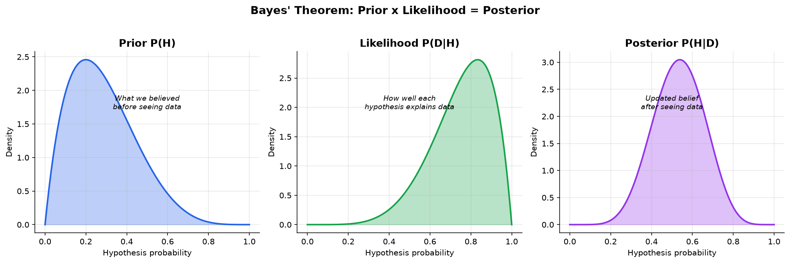
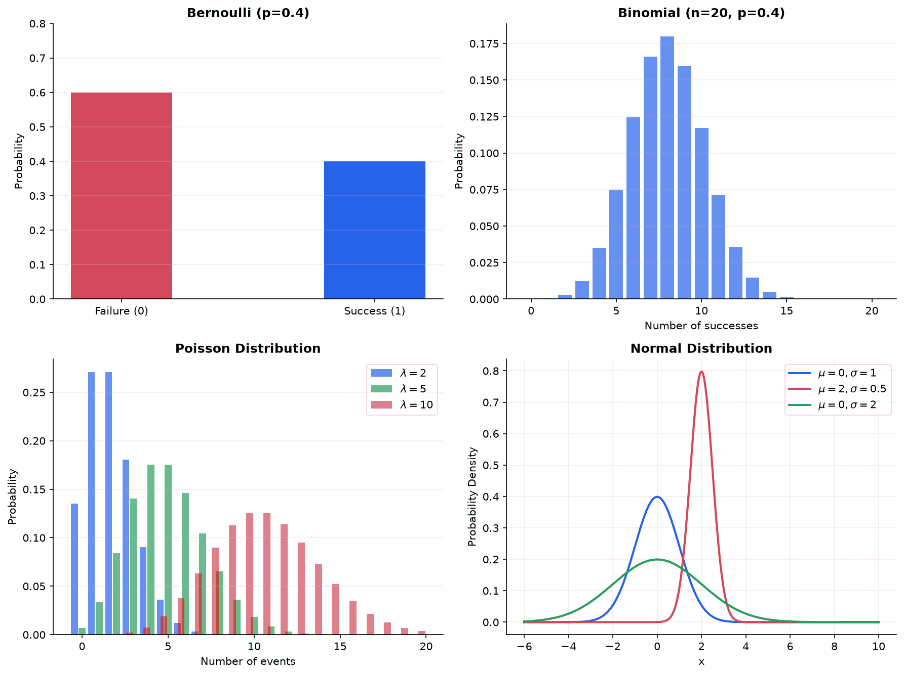
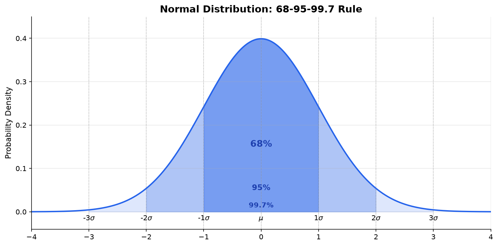

Probability is the mathematical framework for reasoning about uncertainty. It quantifies how likely events are, and provides the foundation for statistics, machine learning, and decision-making under uncertainty. This page builds directly on [combinatorics](./combination) (counting how many ways things can happen) and extends it to measuring how likely they are.

## What Is Probability?

**Probability:** A number between 0 and 1 that measures the likelihood of an event occurring. A probability of 0 means the event is impossible; a probability of 1 means the event is certain.

There are two major interpretations of what probability "means":

**Frequentist interpretation:** Probability is the long-run frequency of an event. If you flip a fair coin infinitely many times, heads comes up 50% of the time, so $P(\text{heads}) = 0.5$. This interpretation only makes sense for repeatable experiments.

**Bayesian interpretation:** Probability is a degree of belief or confidence. You can say "there's a 70% chance it rains tomorrow" even though tomorrow only happens once. This interpretation is more flexible and is the foundation of Bayesian inference in ML.

Both interpretations use the same math. The difference is philosophical, but it matters when you get to statistics and ML, where Bayesian methods (priors, posteriors) and frequentist methods (p-values, confidence intervals) take different approaches to the same problems.

## Sample Spaces, Events, and Outcomes

**Experiment:** Any process that produces an uncertain result. Rolling a die, drawing a card, measuring a patient's blood pressure.

**Outcome:** A single possible result of an experiment. Rolling a 3 is one outcome. Rolling a 5 is another.

**Sample space ($S$ or $\Omega$):** The set of all possible outcomes. For a single die roll:

$$
S = \{1, 2, 3, 4, 5, 6\}
$$

For flipping two coins:

$$
S = \{HH, HT, TH, TT\}
$$

**Event:** A subset of the sample space. "Rolling an even number" is the event $E = \{2, 4, 6\}$. An event occurs if the actual outcome is in the subset.

For equally likely outcomes, the probability of an event is:

$$
P(E) = \frac{|E|}{|S|} = \frac{\text{number of favorable outcomes}}{\text{total number of outcomes}}
$$

This is where [combinatorics](./combination) connects directly: counting $|E|$ and $|S|$ often requires permutations and combinations.

**Example:** What is the probability of drawing 2 aces from a standard 52-card deck (drawing 2 cards)?

- Total ways to draw 2 cards: $\binom{52}{2} = 1326$
- Ways to draw 2 aces: $\binom{4}{2} = 6$
- $P(\text{2 aces}) = \frac{6}{1326} = \frac{1}{221} \approx 0.0045$

## Axioms of Probability (Kolmogorov)

All of probability theory is built on three axioms, proposed by Andrey Kolmogorov in 1933. Every rule, theorem, and formula in probability can be derived from these.

**Axiom 1 (Non-negativity):** For any event $A$, $P(A) \geq 0$. Probabilities are never negative.

**Axiom 2 (Normalization):** $P(S) = 1$. Something in the sample space must happen.

**Axiom 3 (Additivity):** For mutually exclusive events $A$ and $B$ (they cannot both occur):

$$
P(A \cup B) = P(A) + P(B)
$$

From these axioms, you can derive everything else:

- $P(\emptyset) = 0$ (the impossible event has probability 0)
- $P(A^c) = 1 - P(A)$ (the complement rule; $A^c$ means "not $A$")
- For any two events: $P(A \cup B) = P(A) + P(B) - P(A \cap B)$ (inclusion-exclusion)

The complement rule is especially useful. If it is hard to compute $P(A)$ directly, compute $P(A^c)$ and subtract from 1.

**Example:** What is the probability of rolling at least one 6 in four dice rolls?

- $P(\text{at least one 6}) = 1 - P(\text{no 6 in four rolls})$
- $P(\text{no 6 on one roll}) = 5/6$
- $P(\text{no 6 in four rolls}) = (5/6)^4 = 625/1296 \approx 0.482$
- $P(\text{at least one 6}) = 1 - 0.482 = 0.518$

## Conditional Probability and Independence

### Conditional Probability

**Conditional probability:** The probability of event $A$ given that event $B$ has occurred:

$$
P(A|B) = \frac{P(A \cap B)}{P(B)}, \quad P(B) > 0
$$

The intuition: once you know $B$ happened, the sample space shrinks to just the outcomes in $B$. You then ask what fraction of those outcomes also belong to $A$.

**Example:** A bag has 3 red and 2 blue marbles. You draw one marble (without replacement), and it is red. What is the probability the second marble is also red?

- After drawing one red marble, the bag has 2 red and 2 blue marbles (4 total)
- $P(\text{2nd red} | \text{1st red}) = 2/4 = 1/2$

### Independence

**Independent events:** Two events $A$ and $B$ are independent if knowing one occurred gives no information about the other:

$$
P(A|B) = P(A) \quad \text{(equivalently, } P(A \cap B) = P(A) \cdot P(B)\text{)}
$$

Coin flips are independent: knowing the first flip was heads tells you nothing about the second flip. Drawing cards without replacement is not independent: removing a card changes the remaining deck.

**Conditional independence:** Events $A$ and $B$ are **conditionally independent given $C$** if:

$$
P(A \cap B | C) = P(A|C) \cdot P(B|C)
$$

This is different from regular independence. Two events can be dependent overall but independent once you know $C$. For example, two symptoms (cough, fever) might be correlated in the general population, but given that a patient has the flu, knowing they have a cough tells you nothing extra about whether they have a fever.

**Where it shows up in ML:** Conditional independence (not regular independence) is the core assumption of the Naive Bayes classifier. It assumes all features are independent given the class label, which simplifies computation enormously. The assumption is almost always wrong in practice, but the classifier still works surprisingly well.

## Bayes' Theorem

Bayes' theorem is arguably the most important single formula in probability for machine learning. It tells you how to update your beliefs when you see new evidence.

$$
P(A|B) = \frac{P(B|A) \cdot P(A)}{P(B)}
$$

**What each piece means:**

- $P(A|B)$: **Posterior.** The probability of $A$ after observing $B$. This is what you want to know.
- $P(B|A)$: **Likelihood.** How likely you would see evidence $B$ if $A$ were true.
- $P(A)$: **Prior.** Your belief about $A$ before seeing any evidence.
- $P(B)$: **Evidence (marginal likelihood).** The total probability of observing $B$ under all possible hypotheses. This acts as a normalizing constant.

### Worked Example: Medical Testing

A disease affects 1% of the population. A test for the disease is 95% accurate: it correctly identifies 95% of sick people (sensitivity) and correctly identifies 90% of healthy people (specificity). If you test positive, what is the probability you actually have the disease?

**Define events:**

- $D$: you have the disease. $P(D) = 0.01$
- $D^c$: you don't have the disease. $P(D^c) = 0.99$
- $+$: you test positive

**Known:**

- $P(+|D) = 0.95$ (sensitivity)
- $P(+|D^c) = 0.10$ (false positive rate = 1 - specificity)

**Apply Bayes' theorem:**

$$
P(D|+) = \frac{P(+|D) \cdot P(D)}{P(+)}
$$

First, compute $P(+)$ using the law of total probability (see next section):

$$
P(+) = P(+|D) \cdot P(D) + P(+|D^c) \cdot P(D^c) = (0.95)(0.01) + (0.10)(0.99) = 0.0095 + 0.099 = 0.1085
$$

$$
P(D|+) = \frac{(0.95)(0.01)}{0.1085} = \frac{0.0095}{0.1085} \approx 0.0876
$$

**Result:** Even with a positive test, there is only about an 8.8% chance you have the disease. This is counter-intuitive but makes sense: the disease is rare (1%), so most positive tests come from the 99% of healthy people who occasionally test false-positive.

**Why this matters for ML:** Bayesian reasoning is the foundation of Bayesian inference, which powers methods like Bayesian neural networks, Gaussian processes, and spam filtering. The key insight is that prior probability matters. A model that ignores base rates will make bad predictions.

## Law of Total Probability

**Law of total probability:** If events $B_1, B_2, \ldots, B_n$ form a partition of the sample space (they are mutually exclusive and exhaustive), then for any event $A$:

$$
P(A) = \sum_{i=1}^{n} P(A|B_i) \cdot P(B_i)
$$

This lets you compute the probability of $A$ by breaking it into cases. We used this above to compute $P(+)$ by splitting into "has disease" and "doesn't have disease."

**Intuition:** If you do not know $P(A)$ directly, consider all the ways $A$ can happen. In each scenario $B_i$, the probability of $A$ is $P(A|B_i)$, and you weight each scenario by how likely it is, $P(B_i)$.

## Random Variables

**Random variable:** A function that assigns a numerical value to each outcome in the sample space. Instead of talking about events like "rolling a 6," random variables let us do algebra with outcomes.

**Notation:** Capital letters ($X$, $Y$) denote random variables. Lowercase letters ($x$, $y$) denote specific values they can take.

### Discrete Random Variables

A **discrete random variable** takes on a countable number of values (often integers).

**Probability mass function (PMF):** $P(X = x)$ gives the probability that $X$ takes the value $x$. The PMF must satisfy:

- $P(X = x) \geq 0$ for all $x$
- $\sum_x P(X = x) = 1$

**Example:** Let $X$ be the number of heads in 3 coin flips. Then $X$ can take values $\{0, 1, 2, 3\}$:

| $x$ | 0 | 1 | 2 | 3 |
|-----|---|---|---|---|
| $P(X=x)$ | $1/8$ | $3/8$ | $3/8$ | $1/8$ |

### Continuous Random Variables

A **continuous random variable** takes on values in a continuous range (like all real numbers, or all positive reals).

**Probability density function (PDF):** $f(x)$ describes the relative likelihood of $X$ near the value $x$. For continuous variables, the probability of any single exact value is zero. Instead, probabilities are areas under the curve:

$$
P(a \leq X \leq b) = \int_a^b f(x) \, dx
$$

The PDF must satisfy:

- $f(x) \geq 0$ for all $x$
- $\int_{-\infty}^{\infty} f(x) \, dx = 1$

**Cumulative distribution function (CDF):** $F(x) = P(X \leq x)$. The CDF works for both discrete and continuous variables and gives the probability that $X$ is at most $x$.

## Expected Value, Variance, and Standard Deviation

### Expected Value

**Expected value (mean):** The long-run average of a random variable, weighted by probabilities.

For discrete $X$:

$$
E[X] = \sum_x x \cdot P(X = x)
$$

For continuous $X$:

$$
E[X] = \int_{-\infty}^{\infty} x \cdot f(x) \, dx
$$

**Intuition:** If you repeated the experiment many times and averaged all the outcomes, you would get close to $E[X]$.

**Properties of expected value:**

- $E[aX + b] = aE[X] + b$ (linearity)
- $E[X + Y] = E[X] + E[Y]$ (always true, even if $X$ and $Y$ are not independent)
- $E[XY] = E[X] \cdot E[Y]$ (only if $X$ and $Y$ are independent)

**Example:** Expected value of a fair die roll:

$$
E[X] = 1 \cdot \frac{1}{6} + 2 \cdot \frac{1}{6} + 3 \cdot \frac{1}{6} + 4 \cdot \frac{1}{6} + 5 \cdot \frac{1}{6} + 6 \cdot \frac{1}{6} = \frac{21}{6} = 3.5
$$

You can never roll 3.5, but on average, that is what you get.

### Variance and Standard Deviation

**Variance:** Measures how spread out a random variable's values are around the mean:

$$
\text{Var}(X) = E[(X - \mu)^2] = E[X^2] - (E[X])^2
$$

The second form ($E[X^2] - (E[X])^2$) is usually easier to compute. It says: the variance is the "average of the squares minus the square of the average."

**Standard deviation:** $\sigma = \sqrt{\text{Var}(X)}$. It has the same units as $X$, making it easier to interpret than variance.

**Properties of variance:**

- $\text{Var}(aX + b) = a^2 \text{Var}(X)$ (adding a constant does not change spread; scaling by $a$ scales variance by $a^2$)
- $\text{Var}(X + Y) = \text{Var}(X) + \text{Var}(Y)$ (only if $X$ and $Y$ are independent)

## Common Discrete Distributions

### Bernoulli Distribution

**Bernoulli distribution:** Models a single trial with two outcomes: success (1) or failure (0).

$$
P(X = x) = p^x (1-p)^{1-x}, \quad x \in \{0, 1\}
$$

This compact formula just says two things: $P(X = 1) = p$ (success) and $P(X = 0) = 1 - p$ (failure). The exponent notation packs both cases into one expression.

- $E[X] = p$
- $\text{Var}(X) = p(1-p)$

**Example:** Flipping a coin where $P(\text{heads}) = 0.6$ is Bernoulli with $p = 0.6$.

**Where it shows up in ML:** Binary classification outputs. A logistic regression model outputs a probability $p$, and the actual label follows a Bernoulli distribution with that probability.

### Binomial Distribution

**Binomial distribution:** The number of successes in $n$ independent Bernoulli trials.

$$
P(X = k) = \binom{n}{k} p^k (1-p)^{n-k}
$$

Notice the $\binom{n}{k}$ term: this is the combination formula from [combinatorics](./combination). It counts how many ways to choose which $k$ of the $n$ trials are successes.

- $E[X] = np$
- $\text{Var}(X) = np(1-p)$

**Example:** If you flip a fair coin 10 times, what is the probability of getting exactly 7 heads?

$$
P(X = 7) = \binom{10}{7} (0.5)^7 (0.5)^3 = 120 \cdot \frac{1}{1024} \approx 0.117
$$

### Poisson Distribution

**Poisson distribution:** Models the number of events occurring in a fixed interval of time or space, when events happen independently at a constant average rate $\lambda$.

$$
P(X = k) = \frac{\lambda^k e^{-\lambda}}{k!}
$$

- $E[X] = \lambda$
- $\text{Var}(X) = \lambda$ (the mean and variance are equal, which is a distinctive property)

**Example:** If a website gets an average of 5 visitors per minute, the probability of getting exactly 3 visitors in a given minute:

$$
P(X = 3) = \frac{5^3 e^{-5}}{3!} = \frac{125 \cdot 0.00674}{6} \approx 0.140
$$

**Where it shows up:** Modeling rare events: server failures, customer arrivals, mutations in DNA.

### Geometric Distribution

**Geometric distribution:** The number of trials needed to get the first success.

$$
P(X = k) = (1-p)^{k-1} p, \quad k = 1, 2, 3, \ldots
$$

- $E[X] = 1/p$
- $\text{Var}(X) = (1-p)/p^2$

**Example:** If the probability of finding a bug in a code review is 0.3, the expected number of reviews until finding a bug is $1/0.3 \approx 3.33$ reviews.

## Common Continuous Distributions

### Uniform Distribution

**Uniform distribution:** All values in an interval $[a, b]$ are equally likely.

$$
f(x) = \frac{1}{b - a}, \quad a \leq x \leq b
$$

- $E[X] = \frac{a + b}{2}$
- $\text{Var}(X) = \frac{(b-a)^2}{12}$

**Where it shows up in ML:** Random initialization of neural network weights (before more sophisticated methods were developed), random number generation, and as a non-informative prior in Bayesian statistics.

### Exponential Distribution

**Exponential distribution:** Models the time between events in a Poisson process. If events happen at rate $\lambda$, the time between consecutive events follows an exponential distribution.

$$
f(x) = \lambda e^{-\lambda x}, \quad x \geq 0
$$

- $E[X] = 1/\lambda$
- $\text{Var}(X) = 1/\lambda^2$

**Memoryless property:** $P(X > s + t \mid X > s) = P(X > t)$. The probability of waiting an additional time $t$ does not depend on how long you have already waited. This is unique to the exponential distribution among continuous distributions.

### Normal (Gaussian) Distribution

The **normal distribution** is the most important distribution in all of statistics and machine learning.

$$
f(x) = \frac{1}{\sigma\sqrt{2\pi}} \exp\left(-\frac{(x - \mu)^2}{2\sigma^2}\right)
$$

- $\mu$: the mean (center of the bell curve)
- $\sigma$: the standard deviation (controls width)
- $E[X] = \mu$
- $\text{Var}(X) = \sigma^2$

Notation: $X \sim N(\mu, \sigma^2)$ means "$X$ follows a normal distribution with mean $\mu$ and variance $\sigma^2$."

### The 68-95-99.7 Rule

For a normal distribution:

- **68%** of values fall within 1 standard deviation of the mean: $\mu \pm \sigma$
- **95%** of values fall within 2 standard deviations: $\mu \pm 2\sigma$
- **99.7%** of values fall within 3 standard deviations: $\mu \pm 3\sigma$

This means values more than 3 standard deviations from the mean are extremely rare (0.3% of the time).

### Standard Normal and Z-Scores

The **standard normal distribution** is the normal distribution with $\mu = 0$ and $\sigma = 1$, written $Z \sim N(0, 1)$.

Any normal variable $X \sim N(\mu, \sigma^2)$ can be converted to a standard normal using a **Z-score:**

$$
Z = \frac{X - \mu}{\sigma}
$$

**Intuition:** The Z-score tells you how many standard deviations a value is from the mean. A Z-score of 2 means the value is 2 standard deviations above the mean. A Z-score of -1.5 means 1.5 standard deviations below the mean.

**Example:** Exam scores are normally distributed with $\mu = 75$ and $\sigma = 10$. What fraction of students score above 90?

$$
Z = \frac{90 - 75}{10} = 1.5
$$

From standard normal tables (or software): $P(Z > 1.5) \approx 0.0668$. About 6.7% of students score above 90.

### Why the Normal Distribution Appears Everywhere

Three reasons the Gaussian is ubiquitous:

1. **Central Limit Theorem** (see below): averages of many random variables tend toward normal, regardless of the original distribution.
2. **Maximum entropy:** Among all distributions with a given mean and variance, the normal distribution has the maximum entropy (maximum uncertainty). If you only know the mean and variance of something, the normal is the "least biased" assumption.
3. **Mathematical convenience:** The normal distribution is closed under addition (sum of normals is normal) and has nice analytical properties for calculus.

**Where it shows up in ML:** Gaussian noise assumptions in linear regression, Gaussian processes, variational autoencoders, the reparameterization trick, weight initialization, and batch normalization.

## Joint Distributions, Covariance, and Correlation

### Joint Distributions

**Joint distribution:** Describes the probability of two (or more) random variables simultaneously. For discrete variables, the **joint PMF** is $P(X = x, Y = y)$. For continuous variables, the **joint PDF** is $f(x, y)$.

**Marginal distribution:** The distribution of one variable, ignoring the other. Obtained by summing (discrete) or integrating (continuous) over the other variable:

$$
P(X = x) = \sum_y P(X = x, Y = y)
$$

**Example:** Suppose $X$ is the number of hours studied and $Y$ is the exam result (pass/fail). The joint distribution might be:

| | $Y = \text{fail}$ | $Y = \text{pass}$ |
|---|---|---|
| $X = \text{low}$ | 0.20 | 0.10 |
| $X = \text{high}$ | 0.05 | 0.65 |

The marginal distribution of $Y$: $P(Y = \text{fail}) = 0.20 + 0.05 = 0.25$ and $P(Y = \text{pass}) = 0.10 + 0.65 = 0.75$. You get the marginal by summing across the row.

### Covariance

**Covariance:** Measures how two random variables move together:

$$
\text{Cov}(X, Y) = E[(X - \mu_X)(Y - \mu_Y)] = E[XY] - E[X] \cdot E[Y]
$$

- $\text{Cov}(X, Y) > 0$: when $X$ is above its mean, $Y$ tends to be above its mean (they move together)
- $\text{Cov}(X, Y) < 0$: they tend to move in opposite directions
- $\text{Cov}(X, Y) = 0$: no linear relationship (but there could still be a nonlinear one)

If $X$ and $Y$ are independent, then $\text{Cov}(X, Y) = 0$. The converse is not always true: zero covariance does not guarantee independence.

### Correlation

**Correlation (Pearson correlation coefficient):** A normalized version of covariance that always falls between -1 and 1:

$$
\rho(X, Y) = \frac{\text{Cov}(X, Y)}{\sigma_X \cdot \sigma_Y}
$$

- $\rho = 1$: perfect positive linear relationship
- $\rho = -1$: perfect negative linear relationship
- $\rho = 0$: no linear relationship

**Where it shows up in ML:** Feature correlation matters for multicollinearity in regression. The covariance matrix is central to PCA (principal component analysis), which finds the directions of maximum variance in data.

## Law of Large Numbers

**Law of large numbers (LLN):** As the number of independent trials increases, the sample average converges to the expected value.

If $X_1, X_2, \ldots, X_n$ are independent with the same distribution (i.i.d.) and mean $\mu$, then:

$$
\bar{X}_n = \frac{1}{n}\sum_{i=1}^n X_i \to \mu \quad \text{as } n \to \infty
$$

**Intuition:** Flip a coin 10 times and you might get 70% heads. Flip it 10,000 times and you will get very close to 50% heads. The more data you collect, the more the average stabilizes around the true mean.

**Where it shows up:** This is why more training data generally leads to better ML models. It is the theoretical justification for using sample statistics to estimate population parameters.

## Central Limit Theorem

**Central Limit Theorem (CLT):** The sum (or average) of many independent random variables is approximately normally distributed, regardless of the original distribution, as long as the sample size is large enough.

Formally, if $X_1, X_2, \ldots, X_n$ are i.i.d. with mean $\mu$ and variance $\sigma^2$, then:

$$
\frac{\bar{X}_n - \mu}{\sigma / \sqrt{n}} \to N(0, 1) \quad \text{as } n \to \infty
$$

**Intuition:** Take any distribution (uniform, exponential, Poisson, anything). Draw samples of size 30, compute each sample's average, and plot the distribution of those averages. It will look like a bell curve. This works even if the original distribution is heavily skewed.

**Why it matters:**

1. It explains why the normal distribution shows up everywhere: many real-world quantities are the sum of many small, independent effects (height = many genes, measurement error = many small perturbations).
2. It justifies using normal-distribution-based methods (confidence intervals, hypothesis tests) even when the underlying data is not normal, as long as the sample size is large enough.
3. In ML, stochastic gradient descent averages gradients over mini-batches. By the CLT, these averaged gradients are approximately normal, which helps explain why SGD works well in practice.

**How large is "large enough"?** A common rule of thumb is $n \geq 30$, but this depends on how skewed the original distribution is. For symmetric distributions, even $n = 10$ can be sufficient. For heavily skewed distributions, you may need $n > 100$.
