Logic is the study of valid reasoning: given certain facts, what can you conclude? Propositional logic is the simplest form of formal logic. It works with statements (propositions) that are either true or false, and studies how to combine them using connectives like "and," "or," and "not." Propositional logic is the foundation of mathematical proofs, digital circuit design, programming constructs like if/else, and database queries.

**Propositional Logic:** Propositional Logic, is a formal system in
logic that deals with statements or propositions as whole, indivisible
units. In this system, each proposition is considered atomic, meaning it
does not analyze the internal structure or content of the proposition
itself.

The primary focus of 0th-order logic is on how these propositions relate
to one another through logical connectives such as AND (∧), OR (∨), NOT
(¬), and IMPLIES (→). It is a foundational form of logic, where the
truth or falsity of complex statements is determined by the truth values
of their constituent propositions.

Unlike first-order logic, propositional logic does not deal with
non-logical objects, predicates about them, or quantifiers. However, all
the machinery of propositional logic is included in first-order logic
and higher-order logics. In this sense, propositional logic is the
foundation of first-order logic and higher-order logic.

The most thoroughly researched branch of propositional logic is
classical truth-functional propositional logic

## Truth

When studying logic and mathematics, it is important to understand what
truth is and what forms of truth exist.

Philosophers describe truth using several classifications. It is tempting to list them as a flat catalog of "types," but the standard terms actually come in pairs, each drawing a different distinction along a separate **axis**. A single true statement is usually classified on more than one axis at once. The three classical axes are:

- **Modal axis (necessary vs. contingent):** Is the statement true in *all* possible worlds, or only in *some*?
  - **Necessary Truth:** true in every possible world; it could not have been false (e.g. "$2 + 2 = 4$").
  - **Contingent Truth:** true in the actual world but false in some other possible world; it could have been otherwise (e.g. "the Eiffel Tower is in Paris").

- **Epistemic/semantic axis (analytic vs. synthetic):** Does the statement's truth follow from the meanings of its words alone, or does it also depend on how the world is?
  - **Analytic Truth:** true purely by virtue of the meanings of the terms (e.g. "all bachelors are unmarried").
  - **Synthetic Truth:** true partly because of how the world is, not by meaning alone (e.g. "the cat is on the mat").

- **Source-of-knowledge axis (logical/a priori vs. empirical):** How do we come to know it?
  - **Logical Truth:** true solely in virtue of logical form, knowable without observing the world (e.g. "$P \lor \neg P$").
  - **Empirical Truth:** known through observation or experiment (e.g. "water boils at 100°C at sea level").

Because these axes are separate, one statement can be labeled on each: "the Eiffel Tower is in Paris" is contingent, synthetic, and empirical, whereas "$2 + 2 = 4$" is necessary, and (on the traditional view) analytic and logical. The relationships between the axes are themselves philosophically contested (for example, whether every necessary truth is analytic), so these labels should be read as a map of distinctions rather than a settled hierarchy.

In propositional and first-order logic we are concerned only with **logical truths** and **necessary truths**, since logic studies what follows from form alone, independent of contingent empirical facts.

### Logical Truth

**Logical Truth:** Logical truth refers to a statement or proposition
that is true in all possible scenarios, purely based on its logical
structure rather than any specific facts or content about the
world. It is a foundational concept in formal logic,
philosophy, and mathematics, where the focus is on the form of reasoning
rather than empirical content.

Logical truths are often expressed in symbolic language, but they don't
need to be. They can also be expressed using ordinary language.

The reason that symbolic language is preferred in propositional logic is
that symbolic language offers significant advantages when it comes to
making generalized statements. Symbolic language eliminates the
ambiguity of natural language and clearly expresses the truth functional
nature of each logical form expressed.

**Comparison with Other Types of Truths**

**Versus Empirical Truth:** Unlike empirical truths, which are based on
observations or experiences and can vary depending on the state of the
world, logical truths are independent of the actual world. They are true
regardless of any empirical facts.

**Versus Necessary Truth:** *All logical truths are necessary truths*,
but not all necessary truths are logical truths. Necessary truths are
true in all possible worlds, often because of the meanings of the
concepts involved, such as "All bachelors are unmarried."
**Logical truths, on the other hand, are true due to their logical
form.**

**Versus Analytic Truth:** Analytic truths are true by definition or
based on the meanings of words. Logical truths may overlap with analytic
truths, but they are more broadly applicable, as they are not tied to
specific definitions but rather to the logical structure.

### Necessary Truth

**Necessary Truth:** Necessary truth refers to a statement or
proposition that must be true in all possible worlds or under any
conceivable circumstances. Unlike contingent truths, which are true only
under certain conditions, necessary truths hold universally and cannot
be false. They are true by necessity, meaning their truth is not
dependent on specific facts or conditions in the world but on the nature
of the concepts or relationships they describe.

**Necessary Truths encompass both analytic and synthetic truths.**

In the traditional framework, necessary truths are divided into analytic
(true by definition) and synthetic (true by virtue of the way the world
is) truths. **These two categories are often considered exhaustive.**

#### Analytic Necessary Truths

**Analytic Necessary Truths:**

These are truths that are true by definition. Their necessity comes from
the meanings of the terms involved.

Example: "All bachelors are unmarried."

Explanation: This is necessarily true because "bachelor" is defined as
an unmarried man. The truth of the statement is self-evident once you
understand the terms.

#### Synthetic Necessary Truths

**Synthetic Necessary Truths:**

These are truths that are necessarily true but not by virtue of the
meanings of words alone. They often involve empirical or metaphysical
facts.

Example: "Water is H2O."

Explanation: This is a necessary truth because, in any possible world
where water exists, it must be composed of H2O. However, this truth is
not analytic because it is not true by definition; it was discovered
through empirical investigation.

### Analytic Truth

**Analytic Truth:** Analytic truths are inherently true because the
predicate is contained within the subject, making them tautological in
nature.

**Analytic truths** are true by definition. The truth of the statement
is guaranteed by the meanings of the words used.

**Analytic truths** are typically known a priori, meaning they can be
known independently of any experience. You do not need to observe or
investigate the world to know that an analytic truth is true;
understanding the meanings of the words is sufficient.

**Analytic truths** are often tautological, meaning they are statements
that repeat the same idea in different words. Because of this, they are
considered true in a trivial sense.

**Distinction from Synthetic Truth:**

The real crux of the difference between these two types of truths lies
in how we come to know them. With analytic truths, all you
need is a good understanding of the concepts or definitions involved.
You can figure them out just by thinking about the meanings of the
words; no need to step outside and check the world.

But synthetic truths are more tied to reality. They aren't true just
because of the way we define words; they're true because that's the way
things actually are in the world. To know these truths, you have to
engage with the world, gather evidence, and sometimes, even conduct
experiments.

### Synthetic Truth

**Synthetic Truth:** A synthetic truth is a statement whose truth depends on how the world actually is, not on the meanings of its words alone. Where an analytic truth can be verified just by understanding the terms, a synthetic statement adds genuine information about reality, so confirming it requires looking beyond the definitions.

Example: "The cat is on the mat." Understanding the words "cat," "on," and "mat" is not enough to tell whether the statement is true; you have to check the actual situation.

**Contrast with analytic truth:** "All bachelors are unmarried" is analytic, since it is guaranteed by the definition of "bachelor" and needs no observation. "The cat is on the mat" is synthetic, since its truth is settled by the world rather than by meaning.

**Relation to the other axes:** Most synthetic truths we meet are also contingent and empirical (they could have been otherwise, and we learn them by observation). But the two axes are independent: some philosophers hold that there are **synthetic necessary truths**, statements not true by definition yet true in every possible world. The standard example is "Water is H2O," discussed under Necessary Truth below. So "synthetic" tells you *why* a statement is true (it depends on the world, not on meaning), while "necessary" versus "contingent" tells you *whether it could have been false*; a statement can be synthetic on either side of that second question.

### Empirical Truth

**Empirical Truth:** Empirical truth refers to statements or
propositions that are true because they accurately describe the way the
world is, based on observation, experience, or experiment.

**Unlike analytic truths, which are true by definition, or necessary
truths, which hold in all possible worlds, empirical truths are
contingent on the actual state of affairs.**

While empirical truths are vital for understanding the world, they have
their limits. Since they depend on observation and experience, they can
be subject to change as new evidence emerges. What's considered an
empirical truth today might be revised or even overturned tomorrow if
new data suggests otherwise. This is especially true in science, where
empirical truths are often provisional, pending further research.

### Contingent Truth

**Contingent Truth**: Contingent truth refers to a type of truth that is
dependent on the way the world actually is, rather than being true in
all possible worlds or by definition. In other words, a contingent truth
is a statement that could have been false if circumstances were
different. Contingent truths are true in our world, but they are not
necessarily true in every conceivable situation or possible world.

**Characteristics of Contingent Truth:**

1.  **Dependence on Facts:**

    -   Contingent truths are true because of the specific state of
        affairs in the world. They rely on actual facts, events, or
        conditions that could have been different.

    -   Example: "The Eiffel Tower is in Paris" is a contingent truth.
        It is true in the actual world because the Eiffel Tower is
        indeed located in Paris, but it could have been built in a
        different city, making the statement false in that scenario.

2.  **Possibility of Being False:**

    -   Unlike necessary truths, which are true in all possible worlds,
        contingent truths could be false in some possible worlds.

    -   Example: "Water boils at 100°C at sea level" is a contingent
        truth that depends on the specific physical conditions, such as
        atmospheric pressure. If these conditions were different, the
        boiling point of water would also be different.

3.  **Contrast with Necessary Truth:**

    -   Necessary truths are true in all possible worlds, by virtue of
        logic or the nature of the concepts involved (e.g., "2 + 2 =
        4").

    -   Contingent truths, on the other hand, are true in the actual
        world but could be false in other possible worlds. For example,
        "Humans exist" is a contingent truth because, while humans do
        exist in the actual world, it is conceivable that humans might
        not have evolved, making the statement false in some other
        possible world.

4.  **Empirical Nature:**

    -   Many contingent truths are empirical, meaning they are known
        through observation or experience. These truths are discovered
        by examining the world around us, rather than through pure
        reasoning or logical deduction.

    -   Example: "The sky is blue" is an empirical contingent truth.
        It is true under normal daylight conditions due to the way the
        Earth's atmosphere scatters light, but it would not be true at
        night or on a cloudy day.

## Proposition

**Proposition: Propositions** are declarative statements that have a
truth value, which can either be true or false, but not both.

Propositions in propositional logic respect the **bi-valence principle** and the **principle of the excluded middle**. This is why their truth value can assume only 2 values and why each proposition can be assigned only a single value (not both or neither).

Declarative statements make assertions or declare some fact about the
state of affairs of something.

Examples:

-   "The sky is blue."

-   "She is a doctor."

-   "Paris is the capital of France."

-   "The meeting starts at 10 AM."

Propositions are the fundamental units of reasoning and logical
analysis.

They assert facts about the world that could either be true or false.

Propositions can be represented symbolically using letters:

-   "The sky is blue." : **B**

-   "She is a doctor." : **D**

-   "Paris is the capital of France." : **F**

-   "The meeting starts at 10 AM." : **M**

Propositions are sometimes called statements.

Propositions or statements can either be:

-   **Atomic:** Atomic propositions are the simplest form of
    propositions. They do not contain any logical connectives and cannot
    be broken down into simpler propositions. Each atomic proposition is
    a declarative statement that is either true or false.

-   **Compound:** Compound propositions are formed by combining two or
    more atomic propositions using logical connectives. The truth value
    of a compound proposition depends on the truth values of its
    component propositions and the specific logical connectives used.

**Propositional logic is concerned with the *form and structure of
propositions* rather than their content or the actual truth
of their components in the real world.**

### Validity

**Validity:** When we talk about a single proposition being valid, we
usually mean that it is a **tautology**, a statement that is true in
all possible circumstances. This means the proposition cannot be false,
regardless of the truth values of any variables it might contain**.**

### Unsatisfiable

**Unsatisfiable:** If a proposition is unsatisfiable, it means that
there is no possible scenario or interpretation under which the
proposition can be true. In other words, the proposition is false in
every possible situation, regardless of the truth values assigned to its
components.

Unsatisfiability is a key concept in logic and relates to the idea of a
**contradiction**.

### Contingent

**Contingent:** Contingency refers to the status of a proposition that
is neither necessarily true nor necessarily false. A contingent
proposition is one that could be true in some circumstances and false in
others, depending on the particular state of the world or the specific
assignment of truth values to its components.

In a truth table, a contingent proposition will have at least one row
where it is true and at least one row where it is false.

Most statements we encounter in everyday life are contingent. We often
make decisions based on contingent truths, which are context-dependent
and require us to consider the specific conditions at hand.

## Truth Function

**Truth Function**: In logic, a truth function is a function that accepts truth values as input and produces a truth value as output. They play a crucial role in propositional logic by defining how compound statements (or propositions) are constructed from atomic ones.

**Formal Definition:** A truth function $f$ is a function $f: \{T, F\}^n \to \{T, F\}$

Where $n$ is the number of input propositions (arity).

**Examples:**

**Unary Truth Function (n=1):**

| P | ¬P |
|---|-----|
| T | F |
| F | T |

The negation function $f(P) = \neg P$ maps:
- $f(T) = F$
- $f(F) = T$

**Binary Truth Functions (n=2):**

| P | Q | P∧Q | P∨Q | P→Q | P↔Q | P⊕Q |
|---|---|-----|-----|-----|-----|-----|
| T | T | T | T | T | T | F |
| T | F | F | T | F | F | T |
| F | T | F | T | T | F | T |
| F | F | F | F | T | T | F |

Each column defines a different binary truth function.

**Total Number of Truth Functions:**

For $n$ inputs, there are $2^{2^n}$ possible truth functions:
- $n=1$: $2^{2^1} = 4$ unary functions
- $n=2$: $2^{2^2} = 16$ binary functions
- $n=3$: $2^{2^3} = 256$ ternary functions

**Common Binary Functions:**
1. Conjunction (AND): T only when both inputs are T
2. Disjunction (OR): F only when both inputs are F
3. Implication: F only when antecedent is T and consequent is F
4. Biconditional: T when both inputs have same truth value
5. XOR: T when inputs have different truth values
6. NAND: Opposite of AND
7. NOR: Opposite of OR

**Functionally Complete Sets:**

A set of connectives is functionally complete if every truth function can be expressed using only those connectives:
- $\{\neg, \wedge\}$ is functionally complete
- $\{\neg, \vee\}$ is functionally complete
- $\{\to, F\}$ is functionally complete
- $\{\text{NAND}\}$ alone is functionally complete
- $\{\text{NOR}\}$ alone is functionally complete

## Logical / Propositional Constants

Logical / Propositional Constants: In the context of propositional
logic, **contradiction** and **tautology** are often referred to as
logical constants or propositional constants because their truth values
are fixed, regardless of the truth values of any propositions they are
combined with.

### Contradiction

**Contradiction:** A contradiction (also known as a logical falsehood)
is a proposition that is always false.

It is denoted by symbols such as **⊥**(falsum/up-tack) or false (read $\bot$ as "bottom" or "false").

Example: The statement

$P \wedge \neg P$ (It is raining and it is not raining) is a contradiction because
it can never be true.

### Tautology

**Tautology**: A tautology (also known as a logical truth) is a
proposition that is always true. It is denoted by symbols such as
**⊤(verum / down-tack**) or true (read $\top$ as "top" or "true").

Example: The statement

$P \vee \neg P$ (It is raining or it is not raining) is a tautology because it is
always true.

#### Proving that a proposition is a Tautology

There are 2 methods that can be used:

-   Truth table method

-   Simplification / Manipulation of Logical Equivalences

##### Truth table method of proving a Tautology:

To prove a tautology using a truth table, it is required to demonstrate
that the formula is true for every possible combination of assignments
of truth values to the constituent parts of the formula.

For a formula containing n number of variables, it will require a truth
table having $2^{n}$ rows.

If a formula has 3 variables, it will require a truth table with 8 rows.

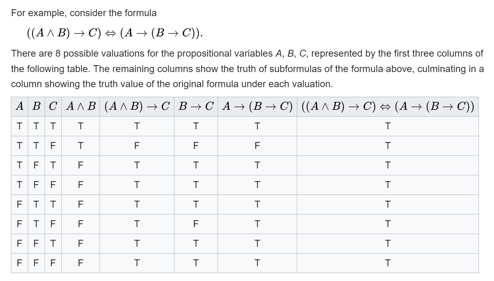

## Compound Proposition / Statement

**Compound Proposition / Statement:** A compound proposition (or
compound statement) is a proposition that is formed by combining one or
more simpler propositions, called atomic propositions, using logical
connectives. The truth value of a compound proposition is determined by
the truth values of its component propositions and the specific logical
connectives used.

## Propositional / Logical Connectives / Operators

**Logical Connectives:** Logical connectives, also known as logical
operators, are symbols or words used to connect propositions (or
statements) to form compound propositions.

They determine the truth value of the compound proposition based on the
truth values of the individual propositions

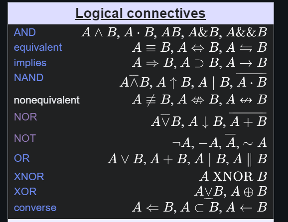

### Unary Logical Connectives / Unary Operators

**Unary Logical Connectives / Unary Operators:** A unary logical
connective (or unary operator) is a logical operator that operates on a
single proposition (or statement) to produce a new
proposition.

In classical logic, the most common unary logical connective is
**negation**.

#### Negation

**Negation:** Negation is a fundamental unary logical connective that
inverts the truth value of a proposition.

In ordinary language, negation is referred to as *'NOT'*.

Symbolically, we express negation with: ¬

Example: If 𝑃 is a proposition, ¬𝑃 denotes its **negation** (read $\neg P$ as "not P").


Properties of Negation:

**Double Negation:** Within a system of classical logic, double
negation, that is, the negation of the negation of a proposition 𝑃, is
logically equivalent to 𝑃.

Expressed in symbolic terms: $\neg\neg P \equiv P$

**Distributivity:** De Morgan's laws provide a way of distributing
negation over conjunction and disjunction.

$$
\neg(P \wedge Q) \equiv (\neg P \vee \neg Q)
$$

$$
\neg(P \vee Q) \equiv (\neg P \wedge \neg Q)
$$

**Negation of Quantifiers:** In first-order logic, there are two
quantifiers, one is the universal quantifier

**∀** (means "for all") and the other is the existential quantifier
**∃** (means "there exists").

The negation of one quantifier is the other quantifier ($\neg\forall x\, P(x) \equiv \exists x\, \neg P(x)$ and $\neg\exists x\, P(x) \equiv \forall x\, \neg P(x)$).

### Properties of Binary Operations

**Properties of Binary Operations**

#### Associative Property / Associativity

Associativity refers to the ability to group operations in any order
without changing the outcome.


**Logical equivalence tells you whether two statements are always true
or always false together. If they are, they are logically equivalent.**

-   **Proposition 𝑃: "Light A is on."**

-   **Proposition 𝑄: "Light B is on."**

If both lights are on (𝑃 is true and 𝑄 is true), then 𝑃 ≡ 𝑄 is true.

If both lights are off (𝑃 is false and 𝑄 is false), then 𝑃 ≡ 𝑄 is true.

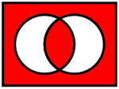

The Venn diagram of A EQ B (red part is true)

#### Conjunction

**Conjunction**: In logic and mathematics ∧ is the truth-functional
operator of conjunction or logical conjunction.

This is also known as 'AND' (read $P \land Q$ as "P and Q").

A logical conjunction is a binary operation, typically the values of two
propositions, that produces a value of true if and only if both of its
operands are true.

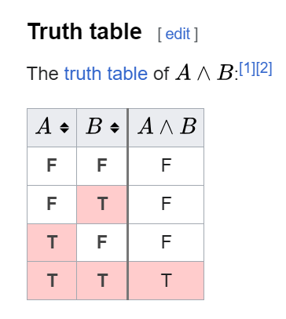

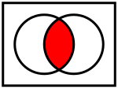 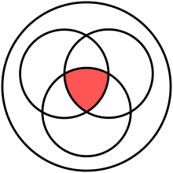

#### Disjunction

**Disjunction:** In logic, disjunction, also known as **logical
disjunction** or **logical or** or **logical addition** or **inclusive
disjunction**, is a logical connective typically notated as ∨ and read
aloud as "or".

In classical logic, disjunction is given a truth functional semantics
according to which a formula 𝜙 ∨ 𝜓 is true unless both are false.

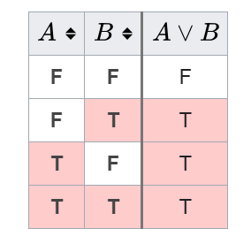

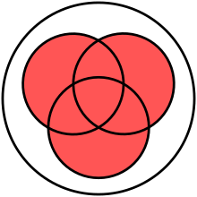

#### Exclusive Disjunction / Exclusive OR

**Exclusive OR:**

Exclusive disjunction essentially means 'either one, but not both nor
none'. In other words, the statement is true if and only if one is true
and the other is false.

It gains the name "exclusive or" because the meaning of "or" is
ambiguous when both operands are true.

***XOR** excludes that case*. Some informal ways of
describing **XOR** are "one or the other but not both", "either one
or the other", and "A or B, but not A and B".

Symbolically, XOR is expressed as: $\oplus$ (read $P \oplus Q$ as "P x-or Q" or "P exclusive-or Q"; also written $\not\equiv$).

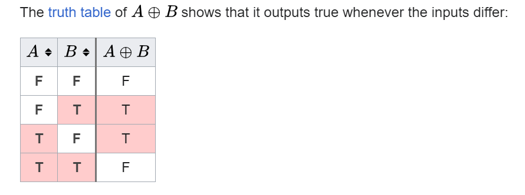

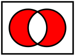

#### Conditional Statement / Material Condition / Material Implication / Hypothetical Proposition

**Conditional Statement / Material condition / Material Implication:**

A conditional statement, also known as an implication, is a fundamental
concept in logic that expresses a relationship between two propositions.
It is often written in the form "if 𝑃, then 𝑄" and is denoted by the
symbol → (read $P \to Q$ as "P implies Q" or "if P, then Q").

The term material implication / material condition is particularly
important because it differentiates the usage of the conditional
statement in logic from how it is normally understood in normal
language.

In a conditional formula A → B

-   The sub formula **A** is referred to as the **antecedent**

-   **B** is called the consequent of the **conditional**.

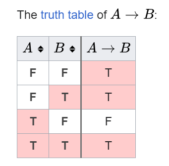

The logical cases where the antecedent A is false and A → B is true, are
called "vacuous truths". Examples are ...

-   ... with **B** false: "If Marie Curie is a sister of Galileo
    Galilei, then Galileo Galilei is a brother of Marie Curie",

-   ... with **B** true: "If Marie Curie is a sister of Galileo
    Galilei, then Marie Curie has a sibling.".

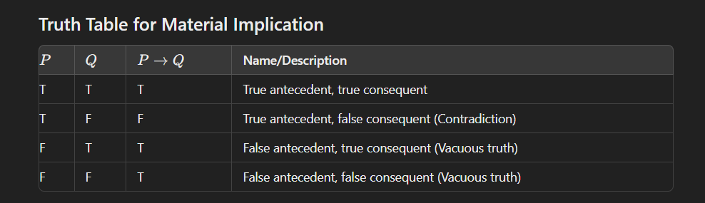

##### Vacuous Truth

**Vacuous Truth:** Vacuous truth refers to a conditional statement
(implication) that is considered true solely because its antecedent (the
"if" part) is false, regardless of the truth value of the consequent
(the "then" part).

A vacuous truth is a conditional or universal statement (a universal
statement that can be converted to a conditional statement) that is
*true because the antecedent cannot be satisfied*.

Examples common to everyday speech include conditional phrases used as
*idioms of improbability* like "when hell freezes over
..." and "when pigs can fly ...", indicating that not before the
given (impossible) condition is met will the speaker accept some
respective (typically false or absurd) proposition.

##### Inverse

**Inverse:** In logic, an inverse is a type of conditional sentence
which is an immediate inference made from another conditional sentence.

Given a conditional sentence of the form $P \to Q$, the inverse refers
to the sentence $\neg P \to \neg Q$

For example, substituting propositions in natural language for logical
variables, the inverse of the following conditional proposition

"If it's raining, then Sam will meet Jack at the movies."

would be

"If it's not raining, then Sam will not meet Jack at the movies."

##### Converse

The converse of a categorical or implicational statement is the result
of reversing its two constituent statements.

For the implication $P \to Q$, the converse is $Q \to P$.

##### Contrapositive

**T**he contrapositive of a statement has its antecedent and consequent
inverted and flipped.

Conditional statement $P \to Q$

In formulas: the contrapositive of $P \to Q$ is $\neg Q \to \neg P$

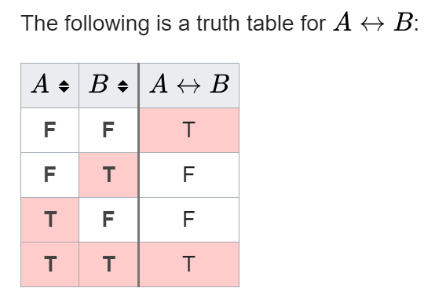

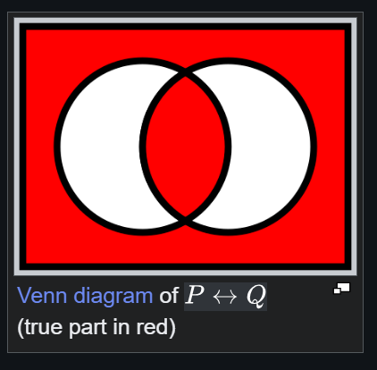

### Connective Precedence

Just like in mathematics, parentheses can be used in compound
expressions to indicate the order in which the operators are to be
evaluated. In the absence of parentheses, the order of evaluation is
determined by precedence rules.

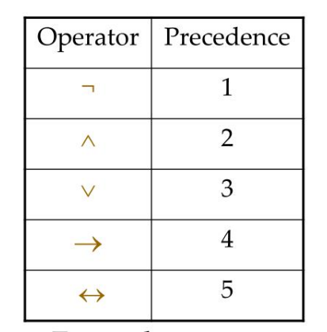

## Logical Equivalences

**Logical Equivalence:** Two propositions $P$ and $Q$ are logically equivalent if they have the same truth value in all possible cases.

**Notation:** $P \equiv Q$ or $P \iff Q$ (read $P \iff Q$ as "P if and only if Q", often shortened to "P iff Q")

### Fundamental Laws

**Identity Laws:**
- $P \wedge T \equiv P$
- $P \vee F \equiv P$

**Domination Laws:**
- $P \vee T \equiv T$
- $P \wedge F \equiv F$

**Idempotent Laws:**
- $P \vee P \equiv P$
- $P \wedge P \equiv P$

**Double Negation:**
- $\neg(\neg P) \equiv P$

**Commutative Laws:**
- $P \vee Q \equiv Q \vee P$
- $P \wedge Q \equiv Q \wedge P$

**Associative Laws:**
- $(P \vee Q) \vee R \equiv P \vee (Q \vee R)$
- $(P \wedge Q) \wedge R \equiv P \wedge (Q \wedge R)$

**Distributive Laws:**
- $P \vee (Q \wedge R) \equiv (P \vee Q) \wedge (P \vee R)$
- $P \wedge (Q \vee R) \equiv (P \wedge Q) \vee (P \wedge R)$

**De Morgan's Laws:**
- $\neg(P \wedge Q) \equiv \neg P \vee \neg Q$
- $\neg(P \vee Q) \equiv \neg P \wedge \neg Q$

**Absorption Laws:**
- $P \vee (P \wedge Q) \equiv P$
- $P \wedge (P \vee Q) \equiv P$

**Negation Laws:**
- $P \vee \neg P \equiv T$ (Law of excluded middle)
- $P \wedge \neg P \equiv F$ (Law of contradiction)

### Conditional Equivalences

**Conditional as Disjunction:**
- $P \to Q \equiv \neg P \vee Q$

**Contrapositive:**
- $P \to Q \equiv \neg Q \to \neg P$

**Conditional in terms of Conjunction:**
- $P \to Q \equiv \neg(P \wedge \neg Q)$ (a conditional is equivalent to negating "P and not Q")

**Conditional from Conjunction:**
- $\neg(P \to Q) \equiv P \wedge \neg Q$ (negation of conditional gives conjunction)

**Biconditional:** (read $P \leftrightarrow Q$ as "P if and only if Q", or "P iff Q")
- $P \leftrightarrow Q \equiv (P \to Q) \wedge (Q \to P)$
- $P \leftrightarrow Q \equiv (P \wedge Q) \vee (\neg P \wedge \neg Q)$
- $P \leftrightarrow Q \equiv \neg(P \oplus Q)$ (biconditional is negation of XOR)

**Example - Proving equivalence:**

Show that $\neg(P \to Q) \equiv P \wedge \neg Q$

$$
\neg(P \to Q) \equiv \neg(\neg P \vee Q) \quad \text{(conditional as disjunction)}
$$

$$
\equiv \neg(\neg P) \wedge \neg Q \quad \text{(De Morgan's law)}
$$

$$
\equiv P \wedge \neg Q \quad \text{(double negation)}
$$

## Tautologies, Contradictions, and Contingencies

**Tautology:** A proposition that is always true, regardless of the truth values of its components.

**Examples:**
- $P \vee \neg P$ (law of excluded middle)
- $(P \to Q) \vee (Q \to P)$
- $P \to P$ (self-implication)

**Contradiction:** A proposition that is always false.

**Examples:**
- $P \wedge \neg P$ (law of contradiction)
- $(P \wedge Q) \wedge \neg P$
- $(P \leftrightarrow Q) \wedge (P \wedge \neg Q)$

**Contingency:** A proposition that is neither a tautology nor a contradiction (sometimes true, sometimes false).

**Examples:**
- $P \wedge Q$
- $P \to Q$
- $(P \vee Q) \wedge R$

**Testing with Truth Tables:**

To determine if a proposition is a tautology, contradiction, or contingency:
1. Construct complete truth table
2. Check final column:
   - All T → Tautology
   - All F → Contradiction
   - Mixed → Contingency

## Normal Forms

### Disjunctive Normal Form (DNF)

**Disjunctive Normal Form:** A proposition is in DNF if it is a disjunction (OR) of conjunctions (AND).

**Form:** $(P_1 \wedge P_2 \wedge \ldots) \vee (Q_1 \wedge Q_2 \wedge \ldots) \vee \ldots$

**Example:**
- $(P \wedge Q) \vee (\neg P \wedge R)$
- $(P \wedge Q \wedge R) \vee (P \wedge \neg Q \wedge \neg R) \vee (\neg P \wedge Q \wedge R)$

**Construction from Truth Table:**

1. Find all rows where the formula is TRUE
2. For each TRUE row, create a conjunction of all variables (negated if FALSE in that row)
3. Take the disjunction of all these conjunctions

**Example:** Convert truth table to DNF for formula F:

| P | Q | F |
|---|---|---|
| T | T | T |
| T | F | F |
| F | T | T |
| F | F | F |

DNF:
- Row 1: $P \wedge Q$
- Row 3: $\neg P \wedge Q$
- Result: $F \equiv (P \wedge Q) \vee (\neg P \wedge Q)$

### Conjunctive Normal Form (CNF)

**Conjunctive Normal Form:** A proposition is in CNF if it is a conjunction (AND) of disjunctions (OR).

**Form:** $(P_1 \vee P_2 \vee \ldots) \wedge (Q_1 \vee Q_2 \vee \ldots) \wedge \ldots$

**Example:**
- $(P \vee Q) \wedge (\neg P \vee R)$
- $(P \vee Q \vee R) \wedge (P \vee \neg Q \vee \neg R) \wedge (\neg P \vee Q \vee R)$

**Construction from Truth Table:**

1. Find all rows where the formula is FALSE
2. For each FALSE row, create a disjunction of all variables (negated if TRUE in that row)
3. Take the conjunction of all these disjunctions

**Example:** Convert same truth table to CNF:

| P | Q | F |
|---|---|---|
| T | T | T |
| T | F | F |
| F | T | T |
| F | F | F |

CNF:
- Row 2: $\neg P \vee Q$ (negate: $P$ and $\neg Q$, so we need $\neg P \vee Q$)
- Row 4: $P \vee Q$ (negate: $\neg P$ and $\neg Q$, so we need $P \vee Q$)
- Result: $F \equiv (\neg P \vee Q) \wedge (P \vee Q)$

**Relationship:** Every proposition can be expressed in both DNF and CNF (though they may look different).

## Syntax and Semantics

So far we have written formulas and reasoned about when they are true. It is worth separating two questions that are easy to blur together: which strings even *count* as formulas (**syntax**), and what it *means* for a formula to be true (**semantics**). Keeping them apart is what lets us later state precisely how symbolic proof relates to truth.

**Well-formed formula (wff):** A well-formed formula is a string that is grammatically legal in the language of propositional logic. The formation rules are:

1. Every atomic proposition (a propositional variable such as $P$, $Q$, $R$) is a wff.
2. If $\phi$ is a wff, then $\neg\phi$ is a wff.
3. If $\phi$ and $\psi$ are wffs, then $(\phi \wedge \psi)$, $(\phi \vee \psi)$, $(\phi \to \psi)$, and $(\phi \leftrightarrow \psi)$ are wffs.
4. Nothing else is a wff.

So $(P \to (Q \vee \neg R))$ is a wff, while a string like $P \to \wedge Q$ is not. Syntax is purely about shape; it says nothing about truth.

**Valuation (interpretation):** Semantics enters when we assign truth values. A **truth valuation** (or **interpretation**) is a function $v$ that assigns each atomic proposition a value in $\{T, F\}$. Given a valuation, the truth value of any compound wff is computed from its parts using the truth tables of the connectives. A truth table is just the display of a wff's value under every possible valuation.

**Semantic entailment ( ⊨ ):** We write

$$
\Gamma \vDash \phi
$$

to mean that $\phi$ is a **semantic consequence** of the set of premises $\Gamma$ (read $\Gamma \vDash \phi$ as "$\Gamma$ models $\phi$", or "$\Gamma$ entails $\phi$"): every valuation that makes all of $\Gamma$ true also makes $\phi$ true. This is a statement about *truth in all interpretations*. When $\Gamma$ is empty, $\vDash \phi$ says $\phi$ is true under every valuation, that is, $\phi$ is a tautology.

**Syntactic derivability ( ⊢ ):** We write

$$
\Gamma \vdash \phi
$$

to mean that $\phi$ can be **derived** from $\Gamma$ by a finite sequence of steps using the rules of inference (introduced below), without ever consulting truth values (read $\Gamma \vdash \phi$ as "$\Gamma$ proves $\phi$", or "$\Gamma$ derives $\phi$"). This is a purely *syntactic*, symbol-pushing notion: it is about what can be written down according to the rules, not about what is true.

**How the two connect (soundness and completeness):** The turnstiles $\vDash$ and $\vdash$ come from opposite directions, one semantic and one syntactic, yet for propositional logic they pick out exactly the same pairs $(\Gamma, \phi)$. Two metatheorems make this precise:

- **Soundness:** if $\Gamma \vdash \phi$, then $\Gamma \vDash \phi$. Anything we can *prove* is genuinely *true* in every model, so the rules never derive a falsehood.
- **Completeness:** if $\Gamma \vDash \phi$, then $\Gamma \vdash \phi$. Anything that is *true* in every model can in fact be *proved*, so the rules are strong enough to capture all valid reasoning.

Together they give $\Gamma \vdash \phi$ if and only if $\Gamma \vDash \phi$, which is why we can move freely between proving arguments and checking them with truth tables. The sections below use $\vdash$ for arguments and rules of inference; this equivalence is what justifies also testing those arguments semantically with truth tables.

## Logical Arguments

**Logical Argument:** A set of propositions consisting of premises and a conclusion.

**Structure:**
```
Premise 1
Premise 2
...
Premise n
―――――――――
Conclusion
```

**Notation:** $P_1, P_2, \ldots, P_n \vdash Q$ (the conclusion $Q$ is derivable from the premises). By soundness and completeness (see Syntax and Semantics above), this holds exactly when $P_1, \ldots, P_n \vDash Q$, that is, when every valuation making all premises true also makes $Q$ true.

### Validity vs Soundness

**Valid Argument:** An argument where IF all premises are true, THEN the conclusion must be true.

**Validity concerns the logical structure, not whether premises are actually true.**

**Example - Valid argument:**
```
Premise 1: All humans are mortal
Premise 2: Socrates is a human
―――――――――――――――――――――――――――――
Conclusion: Socrates is mortal
```

**Example - Invalid argument:**
```
Premise 1: All dogs are animals
Premise 2: All cats are animals
―――――――――――――――――――――――――
Conclusion: All dogs are cats
```

**Sound Argument:** An argument that is:
1. Valid (correct logical structure)
2. All premises are actually true

**Example - Sound argument:** (same as valid example above, since premises are true)

**Example - Valid but unsound:**
```
Premise 1: All birds can fly
Premise 2: Penguins are birds
―――――――――――――――――――――――――
Conclusion: Penguins can fly
```

Valid structure, but Premise 1 is false (penguins, ostriches cannot fly).

**Testing Validity:**

An argument is valid if and only if: $(P_1 \wedge P_2 \wedge \ldots \wedge P_n) \to Q$ is a tautology

## Rules of Inference

**Rules of Inference:** Valid argument forms that allow us to derive conclusions from premises.

### Modus Ponens (Affirming the Antecedent)

**Form:**
```
P → Q
P
―――――
Q
```

**Example:**
```
If it rains, the ground is wet
It is raining
―――――――――――――――――――――――――
The ground is wet
```

### Modus Tollens (Denying the Consequent)

**Form:**
```
P → Q
¬Q
―――――
¬P
```

**Example:**
```
If it rains, the ground is wet
The ground is not wet
―――――――――――――――――――――――――
It is not raining
```

### Hypothetical Syllogism (Chain Rule)

**Form:**
```
P → Q
Q → R
―――――
P → R
```

**Example:**
```
If I study, I pass the exam
If I pass the exam, I graduate
―――――――――――――――――――――――――――
If I study, I graduate
```

### Disjunctive Syllogism

**Form:**
```
P ∨ Q
¬P
―――――
Q
```

**Example:**
```
Either it's raining or it's sunny
It's not raining
―――――――――――――――――――――――――
It's sunny
```

### Addition

**Form:**
```
P
―――――
P ∨ Q
```

**Example:**
```
It's raining
―――――――――――――――――――
It's raining or it's sunny
```

### Simplification

**Form:**
```
P ∧ Q
―――――
P
```

**Example:**
```
It's raining and it's cold
―――――――――――――――――――――――
It's raining
```

### Conjunction

**Form:**
```
P
Q
―――――
P ∧ Q
```

**Example:**
```
It's raining
It's cold
―――――――――――
It's raining and it's cold
```

### Resolution

**Form:**
```
P ∨ Q
¬P ∨ R
――――――
Q ∨ R
```

**Example:**
```
P ∨ Q: Either I study or I fail
¬P ∨ R: Either I don't study or I'm stressed
―――――――――――――――――――――――――――――――――――――
Q ∨ R: Either I fail or I'm stressed
```

### Constructive Dilemma

**Form:**
```
P → Q
R → S
P ∨ R
―――――
Q ∨ S
```

**Example:**
```
If it rains, I take an umbrella
If it snows, I wear a coat
It's raining or snowing
―――――――――――――――――――――――――
I take an umbrella or wear a coat
```

### Destructive Dilemma

**Form:**
```
P → Q
R → S
¬Q ∨ ¬S
――――――
¬P ∨ ¬R
```

## Fallacies (Invalid Arguments)

**Fallacy:** An invalid argument form that appears to be valid.

### Affirming the Consequent (Invalid)

**Form:**
```
P → Q
Q
―――――
P
```

**Why invalid:** Q could be true for other reasons.

**Example:**
```
If it rains, the ground is wet
The ground is wet
―――――――――――――――――――――――
It's raining
```

Invalid: Ground could be wet from sprinklers.

### Denying the Antecedent (Invalid)

**Form:**
```
P → Q
¬P
―――――
¬Q
```

**Why invalid:** Q could still be true even if P is false.

**Example:**
```
If it rains, the ground is wet
It's not raining
―――――――――――――――――――――――
The ground is not wet
```

Invalid: Ground could be wet from other sources.

## Proof Techniques

Mathematical proofs are the foundation of rigorous reasoning in mathematics. A proof is a logical argument that establishes the truth of a statement beyond doubt, using previously established facts, definitions, and logical rules.

**Why proofs matter:** In mathematics, we don't just want to believe something is true—we need to know WHY it's true and be certain it's always true. Proofs provide this certainty and reveal the underlying structure of mathematical relationships.

### What is a Proof?

**Proof:** A finite sequence of logical statements, each following from previous statements or known facts, that establishes the truth of a mathematical statement.

**Key components:**
- **Given/Assumptions:** What we know to be true at the start
- **Goal/Conclusion:** What we want to prove
- **Logical steps:** Each statement follows from previous ones using valid inference rules
- **Justification:** Each step is justified by a definition, axiom, theorem, or logical rule

**What makes a proof valid:**
1. Every step follows logically from previous steps
2. All assumptions are clearly stated
3. No logical gaps or unjustified leaps
4. The conclusion is clearly reached

### Direct Proof

**Direct Proof:** Assume the hypothesis P is true, then use definitions, axioms, and previously proven theorems to logically derive the conclusion Q.

**Structure:**
1. Assume P (the hypothesis)
2. Apply definitions to unpack what P means
3. Use logical steps, algebra, known facts
4. Arrive at Q (the conclusion)

**When to use:** When there's a clear path from hypothesis to conclusion. Most straightforward when P and Q have natural definitions you can work with.

**Template:**
```
Theorem: If P, then Q.
Proof: Assume P.
[Apply definition of P]
[Logical step 1]
[Logical step 2]
...
Therefore Q. ∎
```

**Example: Prove that if n is even, then n² is even.**

Proof:
- Assume n is even (hypothesis)
- By definition of even, n = 2k for some integer k
- Then n² = (2k)² = 4k² = 2(2k²)
- Since 2k² is an integer, n² has the form 2m where m = 2k²
- By definition of even, n² is even (conclusion) ∎

**Why this works:** We unpacked the definition of "even" (n = 2k), performed algebra, and showed the result matches the definition of "even" again.

**Common pitfall:** Students often skip the "by definition" steps and jump to conclusions. Always explicitly state when you're using a definition.

### Proof by Contrapositive

**Contrapositive:** To prove P → Q, instead prove ¬Q → ¬P (the contrapositive).

**Why this works:** P → Q and ¬Q → ¬P are logically equivalent. If one is true, the other must be true.

**When to use:** When the contrapositive is easier to prove than the direct statement. This often happens when:
- Q involves a negative statement ("not divisible", "irrational", "no solution")
- It's easier to reason about what makes Q false than what makes P true

**Template:**
```
Theorem: If P, then Q.
Proof: We prove the contrapositive: If ¬Q, then ¬P.
Assume ¬Q.
[Logical steps]
Therefore ¬P. ∎
```

**Example: Prove that if n² is even, then n is even.**

Direct proof is tricky here. Let's use contrapositive:

Prove instead: If n is not even (i.e., n is odd), then n² is not even (i.e., n² is odd).

Proof:
- Assume n is odd
- By definition, n = 2k + 1 for some integer k
- Then n² = (2k + 1)² = 4k² + 4k + 1 = 2(2k² + 2k) + 1
- Since 2k² + 2k is an integer, n² has the form 2m + 1
- By definition, n² is odd ∎

**Why contrapositive helps:** It's much easier to work with "n is odd" (clear definition: n = 2k + 1) than to work with "n² is even" in the forward direction.

### Proof by Contradiction

**Contradiction:** Assume the opposite of what you want to prove, then show this leads to a logical impossibility (contradiction).

**Structure:**
1. Assume ¬(statement to prove)
2. Use logical steps to derive a contradiction
3. Since the assumption led to impossibility, the assumption must be false
4. Therefore, the original statement is true

**When to use:** When direct proof and contrapositive are unclear. Especially useful for:
- Existence proofs ("there exists no...")
- Proving something is impossible
- Proving irrationality, infinitude, uniqueness

**Template:**
```
Theorem: Statement S.
Proof: Assume for contradiction that ¬S.
[Logical steps]
This contradicts [known fact].
Therefore our assumption was wrong, so S is true. ∎
```

**Example: Prove that √2 is irrational.**

Proof by contradiction:
- Assume √2 is rational (negation of what we want to prove)
- Then √2 = a/b where a, b are integers with no common factors (reduced form)
- Squaring: 2 = a²/b², so a² = 2b²
- This means a² is even, so a is even (by previous theorem)
- Write a = 2k for some integer k
- Then (2k)² = 2b², so 4k² = 2b², so b² = 2k²
- This means b² is even, so b is even
- But if both a and b are even, they have a common factor of 2
- This contradicts our assumption that a/b is in reduced form
- Therefore √2 cannot be rational, so √2 is irrational ∎

**Why contradiction works:** We showed the assumption "√2 is rational" inevitably leads to a false statement, so the assumption itself must be false.

**Common pitfall:** Make sure you actually reach a contradiction (two opposing statements), not just something that "seems weird."

### Proof by Cases

**Proof by Cases:** Break the problem into exhaustive cases, prove the statement for each case separately.

**When to use:** When the domain naturally splits into distinct categories, and it's easier to handle each category separately.

**Structure:**
1. Identify exhaustive cases (they must cover all possibilities)
2. Prove the statement for Case 1
3. Prove the statement for Case 2
4. ... (continue for all cases)
5. Since all cases are covered, the statement is true

**Template:**
```
Theorem: Statement S for all x in domain D.
Proof: We consider cases.
Case 1: [condition]. [Proof for case 1]
Case 2: [condition]. [Proof for case 2]
...
Since all cases cover D, S is true. ∎
```

**Example: Prove that n² - n is even for all integers n.**

Proof by cases:
- Case 1: n is even. Then n = 2k, so n² - n = (2k)² - 2k = 4k² - 2k = 2(2k² - k). Since 2k² - k is an integer, n² - n is even.
- Case 2: n is odd. Then n = 2k + 1, so n² - n = (2k+1)² - (2k+1) = 4k² + 4k + 1 - 2k - 1 = 4k² + 2k = 2(2k² + k). Since 2k² + k is an integer, n² - n is even.
- Since every integer is either even or odd, we've covered all cases. Therefore n² - n is even for all integers n. ∎

**Why cases work:** We've covered all possibilities (even and odd are exhaustive for integers) and proved the statement for each.

### Mathematical Induction

**Mathematical Induction:** A proof technique for statements about natural numbers (or any well-ordered set).

**Principle:** If you can prove:
1. **Base case:** P(1) is true (or P(0), depending on starting point)
2. **Inductive step:** For any k, if P(k) is true, then P(k+1) is true

Then P(n) is true for all n ≥ 1.

**Why induction works - The Domino Analogy:**

Imagine an infinite line of dominos:
- Base case: You knock over the first domino
- Inductive step: You prove that if domino k falls, it knocks over domino k+1
- Conclusion: All dominos will fall

The inductive step shows a domino "chain reaction" - each step follows from the previous.

**Structure:**
1. State what you're proving (P(n) for all n ≥ n₀)
2. **Base case:** Prove P(n₀)
3. **Inductive hypothesis:** Assume P(k) is true for arbitrary k ≥ n₀
4. **Inductive step:** Prove P(k+1) using the assumption P(k)
5. **Conclusion:** By induction, P(n) is true for all n ≥ n₀

**Template:**
```
Theorem: P(n) for all n ≥ 1.
Proof by induction:

Base case: [Verify P(1)]

Inductive step: Assume P(k) for some k ≥ 1 (inductive hypothesis).
We must prove P(k+1).
[Use P(k) to derive P(k+1)]

By mathematical induction, P(n) is true for all n ≥ 1. ∎
```

**Example: Prove that 1 + 2 + 3 + ... + n = n(n+1)/2 for all n ≥ 1.**

Proof by induction:

Base case (n = 1): Left side = 1. Right side = 1(1+1)/2 = 1. Equal. ✓

Inductive step: Assume 1 + 2 + ... + k = k(k+1)/2 for some k ≥ 1.

We must prove: 1 + 2 + ... + k + (k+1) = (k+1)(k+2)/2

Starting from the left side:
1 + 2 + ... + k + (k+1)
= [1 + 2 + ... + k] + (k+1)
= k(k+1)/2 + (k+1)    [by inductive hypothesis - THIS IS CRUCIAL]
= k(k+1)/2 + 2(k+1)/2
= [k(k+1) + 2(k+1)]/2
= [(k+1)(k + 2)]/2
= (k+1)(k+2)/2 ✓

This is exactly what we wanted to show.

By mathematical induction, the formula holds for all n ≥ 1. ∎

**Why induction works here:** We proved it's true for n=1, then showed "if true for k, then true for k+1." This creates an infinite chain: true for 1 → true for 2 → true for 3 → ...

**Critical insight:** The inductive step MUST use the inductive hypothesis (the assumption that P(k) is true). If your proof doesn't use P(k), you're not doing induction—you're just proving P(k+1) directly.

**Common pitfall #1:** Forgetting to use the inductive hypothesis. You must explicitly invoke "by inductive hypothesis, P(k) is true" in your proof.

**Common pitfall #2:** Proving the base case but skipping the inductive step, or vice versa. Both are required.

**Common pitfall #3:** Assuming what you want to prove. The inductive hypothesis assumes P(k), not P(k+1). You must derive P(k+1) from P(k).

### Strong Induction

**Strong Induction:** A variant where the inductive step assumes P(j) is true for ALL j ≤ k (not just j = k).

**When to use:** When proving P(k+1) requires knowing P is true for multiple previous values, not just P(k).

**Structure:**
1. **Base case(s):** Prove P(1), possibly P(2), P(3), etc. as needed
2. **Inductive hypothesis:** Assume P(j) is true for all j with 1 ≤ j ≤ k
3. **Inductive step:** Prove P(k+1) using any or all of P(1), P(2), ..., P(k)
4. **Conclusion:** By strong induction, P(n) holds for all n ≥ 1

**Example: Prove every integer n ≥ 2 can be written as a product of primes.**

Proof by strong induction:

Base case (n = 2): 2 is prime, so it's a product of primes (itself). ✓

Inductive hypothesis: Assume for all integers j with 2 ≤ j ≤ k, j can be written as a product of primes.

Inductive step: Consider k+1.
- Case 1: k+1 is prime. Then k+1 is a product of primes (itself).
- Case 2: k+1 is composite. Then k+1 = ab where 2 ≤ a, b ≤ k.
  By inductive hypothesis, both a and b are products of primes.
  Therefore k+1 = ab is a product of primes. ✓

By strong induction, every integer n ≥ 2 is a product of primes. ∎

**Why strong induction was needed:** When k+1 is composite, we need to use the fact that the statement holds for BOTH a and b (which could be any values ≤ k), not just for k itself.

### Proof Strategy: Choosing the Right Technique

**Decision tree for choosing proof technique:**

1. **Is it about all natural numbers or a recursive structure?**
   → Try induction (regular or strong)

2. **Does the conclusion involve "not" or negation?**
   → Try contrapositive

3. **Is the statement about non-existence or impossibility?**
   → Try contradiction

4. **Does the domain naturally split into categories?**
   → Try proof by cases

5. **Is there a direct path from hypothesis to conclusion?**
   → Try direct proof

**General advice:**
- Start with direct proof if the path seems clear
- If you get stuck, try contrapositive (often easier with negations)
- Contradiction is powerful but can be messy—save it for when others fail
- Induction is specifically for statements parameterized by n ∈ ℕ

### Common Proof Patterns

**Pattern 1: Proving Set Equality (A = B)**

Prove A ⊆ B and B ⊆ A:
1. Let x ∈ A. [Show x ∈ B]
2. Let x ∈ B. [Show x ∈ A]

**Pattern 2: Proving Divisibility**

To prove a | b (a divides b):
- Show b = ka for some integer k

**Pattern 3: Proving Uniqueness**

To prove "there exists a unique x such that P(x)":
1. Existence: Show at least one x exists with P(x)
2. Uniqueness: Assume x₁ and x₂ both satisfy P, show x₁ = x₂

**Pattern 4: Proving Biconditionals (P ↔ Q)**

Prove both directions:
1. P → Q (forward direction)
2. Q → P (backward direction)

### Tips for Writing Proofs

**Do:**
- State definitions explicitly ("By definition of even...")
- Show all steps, don't skip
- Use "Let", "Assume", "Suppose" to introduce variables
- End with ∎ or QED to signal completion
- State which technique you're using ("Proof by contrapositive:", "Proof by induction:")

**Don't:**
- Use vague language ("clearly", "obviously") - prove it instead
- Work backwards from conclusion (except in scratch work)
- Assume what you're trying to prove
- Skip justifications ("by magic", "it's clear that")

**Scratch work vs. Final proof:**
- Scratch work: Explore, make mistakes, work backwards, try different approaches
- Final proof: Clean, forward-moving, every step justified

Remember: A proof should convince a skeptical reader. If there's a gap in logic, the proof is incomplete.

