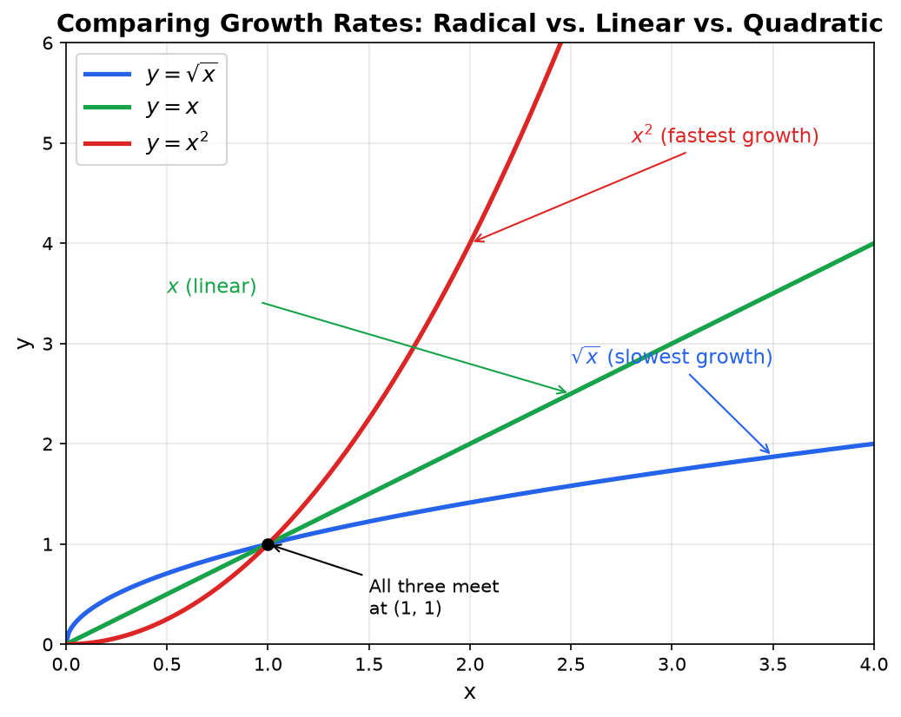
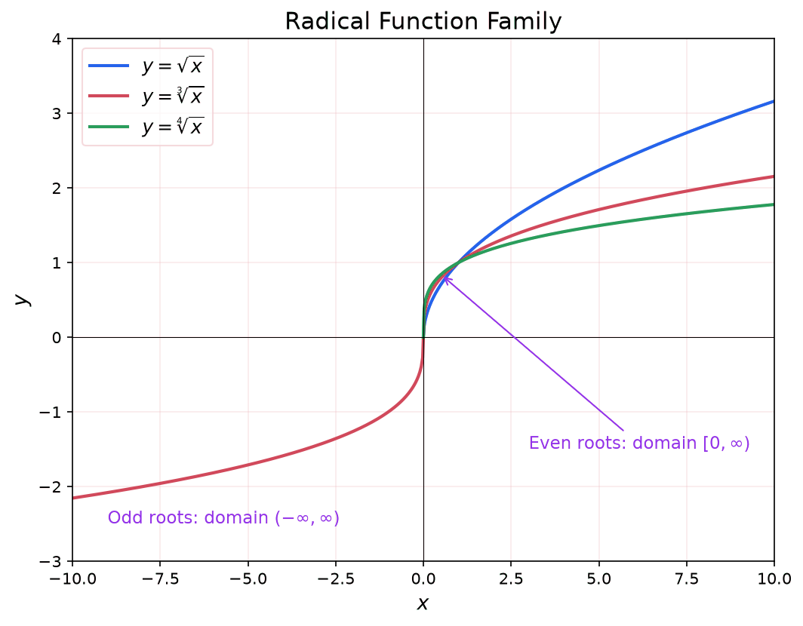

A **radical** (or **root**) is the inverse operation of raising a number to a power. If squaring a number means multiplying it by itself ($3^2 = 9$), then taking the square root reverses that process ($\sqrt{9} = 3$).

> [!abstract] Prerequisites & where this leads
> **Builds on:** [Functions & Relations](./functions-relations) · [Polynomial Functions](./polynomial-functions)
> **Leads to:** [Complex Numbers](./complex-numbers) · [Rational Functions](./rational-functions)

## What Is a Radical?

Radicals undo powers. Squaring sends $3$ to $9$; the square root sends $9$ back to $3$. This section motivates the operation and connects it to fractional exponents before we define radical functions themselves.

### Why We Need Radicals

Radicals arise naturally when we need to solve equations involving powers. For example, if you know that a square has an area of 5 square meters and you want to find the length of its side, you need to solve $x^2 = 5$. The answer is $x = \sqrt{5}$, a number that cannot be written as a simple fraction. Without the radical operation, we would have no way to express this value.

More generally, the $n$-th root answers the question: "What number, raised to the $n$-th power, gives me this value?"

$$\sqrt[n]{a} = b \quad \text{means} \quad b^n = a$$

### Connection to Exponents

**Radicals and fractional exponents are two notations for the same idea.** A square root can be written as a power of $\frac{1}{2}$, a cube root as a power of $\frac{1}{3}$, and so on:

$$\sqrt{x} = x^{1/2}, \qquad \sqrt[3]{x} = x^{1/3}, \qquad \sqrt[n]{x} = x^{1/n}$$

This connection to exponents is important because it lets us apply all the rules of exponents to simplify radical expressions.

With these ideas in place, we can define radical functions precisely.

Radical functions are closely related to [polynomial functions](./polynomial-functions) because solving polynomial equations often produces radical solutions.

## Simplifying Radical Expressions

Before working with radical functions, we need to be comfortable simplifying radical expressions. The key insight is that radicals obey rules inherited from exponent laws, and these rules let us rewrite complicated radicals in simpler form.

### Product Rule for Radicals

**Product Rule:** The radical of a product equals the product of the radicals (when both radicals are defined):

$$\sqrt[n]{ab} = \sqrt[n]{a} \cdot \sqrt[n]{b}$$

This follows directly from exponent rules: $(ab)^{1/n} = a^{1/n} \cdot b^{1/n}$.

### Quotient Rule for Radicals

**Quotient Rule:** The radical of a quotient equals the quotient of the radicals (when the denominator is nonzero):

$$\sqrt[n]{\frac{a}{b}} = \frac{\sqrt[n]{a}}{\sqrt[n]{b}}$$

Again, this is just $(a/b)^{1/n} = a^{1/n} / b^{1/n}$ written in radical notation.

### Simplifying by Extracting Perfect Powers

The most common simplification technique is to factor the radicand (the expression under the radical) so that one factor is a perfect power of the index.

**Strategy:** Look for the largest perfect square (for square roots), perfect cube (for cube roots), or perfect $n$-th power (for $n$-th roots) that divides the radicand. Factor it out using the product rule.

**Example 1:** Simplify $\sqrt{72}$

Factor 72 to find its largest perfect square factor:

$$72 = 36 \cdot 2$$

Apply the product rule:

$$\sqrt{72} = \sqrt{36 \cdot 2} = \sqrt{36} \cdot \sqrt{2} = 6\sqrt{2}$$

**Example 2:** Simplify $\sqrt{200}$

$$200 = 100 \cdot 2$$

$$\sqrt{200} = \sqrt{100} \cdot \sqrt{2} = 10\sqrt{2}$$

**Example 3:** Simplify $\sqrt{48x^5}$ (assume $x \geq 0$)

Factor to extract perfect squares:

$$48x^5 = 16 \cdot 3 \cdot x^4 \cdot x$$

$$\sqrt{48x^5} = \sqrt{16x^4 \cdot 3x} = \sqrt{16x^4} \cdot \sqrt{3x} = 4x^2\sqrt{3x}$$

The idea with variables is the same: $x^4$ is a perfect square because $x^4 = (x^2)^2$.

### Simplifying Higher-Index Radicals

For cube roots, look for perfect cube factors. For fourth roots, look for perfect fourth power factors, and so on.

**Example 4:** Simplify $\sqrt[3]{54}$

$$54 = 27 \cdot 2$$

$$\sqrt[3]{54} = \sqrt[3]{27 \cdot 2} = \sqrt[3]{27} \cdot \sqrt[3]{2} = 3\sqrt[3]{2}$$

**Example 5:** Simplify $\sqrt[3]{40x^7}$

$$40x^7 = 8 \cdot 5 \cdot x^6 \cdot x$$

$$\sqrt[3]{40x^7} = \sqrt[3]{8x^6} \cdot \sqrt[3]{5x} = 2x^2\sqrt[3]{5x}$$

Here $8 = 2^3$ is a perfect cube, and $x^6 = (x^2)^3$ is also a perfect cube.

**Example 6:** Simplify $\sqrt[4]{48}$

$$48 = 16 \cdot 3$$

$$\sqrt[4]{48} = \sqrt[4]{16 \cdot 3} = \sqrt[4]{16} \cdot \sqrt[4]{3} = 2\sqrt[4]{3}$$

### When Is a Radical "Simplified"?

A radical expression is in **simplified form** when:

1. No perfect $n$-th power factors remain under an $n$-th root
2. The index is as small as possible (e.g., $\sqrt[4]{x^2} = \sqrt{x}$ for $x \geq 0$)
3. No radicals appear in the denominator (see [Rationalizing Denominators](#rationalizing-denominators) below)

## Operations with Radical Expressions

### Adding and Subtracting Radicals

**Like radicals** are radical expressions with the same index and the same radicand. You can add or subtract like radicals by combining their coefficients, just as you combine like terms in algebra.

$$a\sqrt[n]{c} + b\sqrt[n]{c} = (a + b)\sqrt[n]{c}$$

**Example 1:** $3\sqrt{2} + 5\sqrt{2} = (3 + 5)\sqrt{2} = 8\sqrt{2}$

**Example 2:** $7\sqrt[3]{5} - 2\sqrt[3]{5} = (7 - 2)\sqrt[3]{5} = 5\sqrt[3]{5}$

You cannot combine radicals with different radicands (e.g., $\sqrt{2} + \sqrt{3}$ cannot be simplified further). However, sometimes terms that look unlike become like terms after simplification.

**Example 3:** Simplify $\sqrt{12} + \sqrt{27}$

Simplify each radical first:

$$\sqrt{12} = \sqrt{4 \cdot 3} = 2\sqrt{3}$$

$$\sqrt{27} = \sqrt{9 \cdot 3} = 3\sqrt{3}$$

Now they are like radicals:

$$2\sqrt{3} + 3\sqrt{3} = 5\sqrt{3}$$

**Example 4:** Simplify $\sqrt{50} - \sqrt{8} + \sqrt{32}$

$$\sqrt{50} = 5\sqrt{2}, \quad \sqrt{8} = 2\sqrt{2}, \quad \sqrt{32} = 4\sqrt{2}$$

$$5\sqrt{2} - 2\sqrt{2} + 4\sqrt{2} = 7\sqrt{2}$$

### Multiplying Radicals

To multiply radicals with the same index, multiply the radicands and then simplify.

$$\sqrt[n]{a} \cdot \sqrt[n]{b} = \sqrt[n]{ab}$$

**Example 5:** $\sqrt{3} \cdot \sqrt{6} = \sqrt{18} = \sqrt{9 \cdot 2} = 3\sqrt{2}$

**Example 6:** $\sqrt[3]{4} \cdot \sqrt[3]{10} = \sqrt[3]{40} = \sqrt[3]{8 \cdot 5} = 2\sqrt[3]{5}$

### Multiplying with Distribution

When one factor contains multiple terms, distribute just as you would with any algebraic expression.

**Example 7:** Expand $\sqrt{2}(3 + \sqrt{5})$

$$\sqrt{2}(3 + \sqrt{5}) = 3\sqrt{2} + \sqrt{2} \cdot \sqrt{5} = 3\sqrt{2} + \sqrt{10}$$

**Example 8:** Expand $\sqrt{3}(2\sqrt{3} - \sqrt{6})$

$$\sqrt{3}(2\sqrt{3} - \sqrt{6}) = 2\sqrt{9} - \sqrt{18} = 2(3) - 3\sqrt{2} = 6 - 3\sqrt{2}$$

### FOIL with Radicals

When multiplying two binomials involving radicals, use the FOIL method (First, Outer, Inner, Last).

**Example 9:** Expand $(2 + \sqrt{3})(1 - \sqrt{3})$

$$= 2(1) + 2(-\sqrt{3}) + \sqrt{3}(1) + \sqrt{3}(-\sqrt{3})$$

$$= 2 - 2\sqrt{3} + \sqrt{3} - 3$$

$$= -1 - \sqrt{3}$$

**Example 10:** Expand $(3 + \sqrt{5})^2$

$$= (3 + \sqrt{5})(3 + \sqrt{5})$$

$$= 9 + 3\sqrt{5} + 3\sqrt{5} + 5$$

$$= 14 + 6\sqrt{5}$$

### Conjugates and the Difference of Squares Pattern

Two expressions of the form $a + \sqrt{b}$ and $a - \sqrt{b}$ are called **conjugates**. Their product eliminates the radical:

$$(a + \sqrt{b})(a - \sqrt{b}) = a^2 - (\sqrt{b})^2 = a^2 - b$$

This pattern is central to rationalizing denominators.

**Example 11:** $(4 + \sqrt{7})(4 - \sqrt{7}) = 16 - 7 = 9$

## Rationalizing Denominators

**Rationalizing the denominator** means rewriting a fraction so that no radicals appear in the denominator.

### Why Rationalize?

Historically, rationalizing was essential because dividing by an irrational number by hand is extremely difficult. With calculators this is no longer a practical concern, but we still rationalize for two reasons:

1. **Standard form.** Having a single conventional form makes it easier to compare and combine expressions.
2. **Simplification.** Rationalizing often reveals structure. For instance, $\frac{6}{\sqrt{3}}$ rationalizes to $2\sqrt{3}$, which is arguably simpler.

### Monomial Denominators

When the denominator is a single radical term, multiply the numerator and denominator by the radical needed to make the radicand a perfect power.

**Example 1:** Rationalize $\frac{5}{\sqrt{3}}$

Multiply by $\frac{\sqrt{3}}{\sqrt{3}}$:

$$\frac{5}{\sqrt{3}} \cdot \frac{\sqrt{3}}{\sqrt{3}} = \frac{5\sqrt{3}}{3}$$

**Example 2:** Rationalize $\frac{2}{3\sqrt{5}}$

$$\frac{2}{3\sqrt{5}} \cdot \frac{\sqrt{5}}{\sqrt{5}} = \frac{2\sqrt{5}}{3 \cdot 5} = \frac{2\sqrt{5}}{15}$$

### Binomial Denominators (Conjugate Method)

When the denominator is a binomial involving a square root, multiply by the conjugate.

**Example 3:** Rationalize $\frac{1}{2 + \sqrt{3}}$

The conjugate of $2 + \sqrt{3}$ is $2 - \sqrt{3}$:

$$\frac{1}{2 + \sqrt{3}} \cdot \frac{2 - \sqrt{3}}{2 - \sqrt{3}} = \frac{2 - \sqrt{3}}{4 - 3} = \frac{2 - \sqrt{3}}{1} = 2 - \sqrt{3}$$

**Example 4:** Rationalize $\frac{3}{\sqrt{5} - \sqrt{2}}$

$$\frac{3}{\sqrt{5} - \sqrt{2}} \cdot \frac{\sqrt{5} + \sqrt{2}}{\sqrt{5} + \sqrt{2}} = \frac{3(\sqrt{5} + \sqrt{2})}{5 - 2} = \frac{3(\sqrt{5} + \sqrt{2})}{3} = \sqrt{5} + \sqrt{2}$$

### Higher-Index Radicals

For cube roots, you need to make the radicand a perfect cube. This means multiplying by whatever cube root factor is needed to complete the cube.

**Example 5:** Rationalize $\frac{1}{\sqrt[3]{2}}$

We need $\sqrt[3]{2} \cdot \sqrt[3]{?} = \sqrt[3]{2^3} = 2$. So we multiply by $\sqrt[3]{4}$:

$$\frac{1}{\sqrt[3]{2}} \cdot \frac{\sqrt[3]{4}}{\sqrt[3]{4}} = \frac{\sqrt[3]{4}}{\sqrt[3]{8}} = \frac{\sqrt[3]{4}}{2}$$

**Example 6:** Rationalize $\frac{5}{\sqrt[3]{9}}$

Since $9 = 3^2$, we need one more factor of 3: multiply by $\frac{\sqrt[3]{3}}{\sqrt[3]{3}}$:

$$\frac{5}{\sqrt[3]{9}} \cdot \frac{\sqrt[3]{3}}{\sqrt[3]{3}} = \frac{5\sqrt[3]{3}}{\sqrt[3]{27}} = \frac{5\sqrt[3]{3}}{3}$$

## Definition

**Radical Functions:** A radical function is a function that contains a variable under a radical symbol (root). The most common are square root and cube root functions.

## General Form

$$f(x) = a\sqrt[n]{bx + c} + d$$

Where:
- **n:** The index of the root (n = 2 for square root, n = 3 for cube root, etc.)
- **a:** Vertical stretch/compression
- **b:** Horizontal stretch/compression
- **c:** Affects horizontal position (the actual shift is $-c/b$, since the radicand is zero when $x = -c/b$)
- **d:** Vertical shift

Note that $c$ is not the horizontal shift by itself. Factoring out $b$ gives $bx + c = b\left(x + \frac{c}{b}\right)$, so the graph shifts by $-c/b$. The equivalent form $f(x) = a\sqrt[n]{b(x - h)} + k$ used later makes this explicit, with $h = -c/b$ being the true horizontal shift.

## Square Root Function

**Square Root Function (parent):** $f(x) = \sqrt{x}$

**Domain:** $[0, \infty)$ (only non-negative numbers, since $\sqrt{x}$ is undefined for $x < 0$ in real numbers)

**Range:** $[0, \infty)$

**Key Points:**
- $(0, 0)$ - starting point
- $(1, 1)$
- $(4, 2)$
- $(9, 3)$

**Graph:** Starts at origin, increases slowly (concave down)

### Domain of Transformed Square Root

For $f(x) = \sqrt{bx + c}$, solve for where the radicand is non-negative:

$$bx + c \geq 0$$

**Example 1:** Find domain of $f(x) = \sqrt{x - 3}$

$x - 3 \geq 0$

$x \geq 3$

Domain: $[3, \infty)$

**Example 2:** Find domain of $f(x) = \sqrt{5 - 2x}$

$5 - 2x \geq 0$

$5 \geq 2x$

$x \leq \frac{5}{2}$

Domain: $(-\infty, \frac{5}{2}]$

### Explore Radical Transformations

Use the widget below to see how the four parameters reshape a radical graph. It plots $y = a\sqrt[n]{b(x - h)} + k$, where you read $a$ as "a" (vertical stretch), $b$ as "b" (horizontal stretch), $h$ as "h" (the horizontal shift, read "aitch"), and $k$ as "k" (the vertical shift). Switch the index $n$ (read "n") between $2$ for the square root and $3$ for the cube root. For the even (square) root the shaded band marks the invalid region where the radicand is negative, so the domain starts at the point $(h, k)$; for the odd (cube) root there is no restriction. The dashed reflection curve shows the inverse relationship to the corresponding power function $y = x^n$.

<iframe src="/static/interactive/radical-explorer.html" width="100%" height="560" style="border:none;"></iframe>

## Cube Root Function

**Cube Root Function (parent):** $f(x) = \sqrt[3]{x}$

**Domain:** $(-\infty, \infty)$ (all real numbers, since cube roots of negative numbers are defined)

**Range:** $(-\infty, \infty)$

**Key Points:**
- $(-8, -2)$
- $(-1, -1)$
- $(0, 0)$
- $(1, 1)$
- $(8, 2)$

**Graph:** Passes through origin, extends in both directions

**Key Difference:** Cube root (and all odd-index roots) accept negative inputs; square root (and all even-index roots) do not.

## nth Root Function

**General nth Root:** $f(x) = \sqrt[n]{x}$

**Domain:**
- **Even n:** $[0, \infty)$ (only non-negative)
- **Odd n:** $(-\infty, \infty)$ (all real numbers)

**Range:**
- **Even n:** $[0, \infty)$
- **Odd n:** $(-\infty, \infty)$

## Solving Radical Equations

**Steps for solving radical equations:**

1. Isolate the radical on one side
2. Raise both sides to the power that eliminates the radical
3. Solve the resulting equation
4. **Check solutions** in original equation (extraneous solutions are common)

**Example 1:** Solve $\sqrt{x + 3} = 5$

Square both sides:
$$x + 3 = 25$$
$$x = 22$$

Check: $\sqrt{22 + 3} = \sqrt{25} = 5$ ✓

**Example 2:** Solve $\sqrt{2x - 1} = x - 2$

Square both sides:
$$2x - 1 = (x - 2)^2$$
$$2x - 1 = x^2 - 4x + 4$$
$$0 = x^2 - 6x + 5$$
$$0 = (x - 5)(x - 1)$$

Potential solutions: $x = 5$ or $x = 1$

Check $x = 5$: $\sqrt{2(5) - 1} = \sqrt{9} = 3$ and $5 - 2 = 3$ ✓

Check $x = 1$: $\sqrt{2(1) - 1} = \sqrt{1} = 1$ and $1 - 2 = -1$ ✗ (extraneous)

Solution: $x = 5$ only

**Example 3:** Solve $\sqrt{x + 1} + \sqrt{x - 4} = 5$

Isolate one radical:
$$\sqrt{x + 1} = 5 - \sqrt{x - 4}$$

Square both sides:
$$x + 1 = 25 - 10\sqrt{x - 4} + (x - 4)$$
$$x + 1 = 21 + x - 10\sqrt{x - 4}$$
$$10\sqrt{x - 4} = 20$$
$$\sqrt{x - 4} = 2$$

Square again:
$$x - 4 = 4$$
$$x = 8$$

Check: $\sqrt{8 + 1} + \sqrt{8 - 4} = \sqrt{9} + \sqrt{4} = 3 + 2 = 5$ ✓

### Why Extraneous Solutions Occur

**Squaring is not a reversible operation.** When we square both sides of an equation, we are applying a function ($x \mapsto x^2$) that is not one-to-one: both $3$ and $-3$ square to $9$. This means the squared equation may have solutions that the original equation does not.

Concretely, the equation $\sqrt{x} = -3$ has no solution (since $\sqrt{x} \geq 0$ by definition). But if we square both sides, we get $x = 9$, which "solves" the squared equation. The value $x = 9$ is extraneous because it was introduced by the squaring step, not present in the original equation.

**Rule:** Any time you raise both sides to an even power, you must check every solution in the original equation. Odd powers (cubing, fifth power, etc.) do not introduce extraneous solutions because odd-power functions are one-to-one.

### Equations with Cube Roots or Higher

For cube root equations, isolate the radical and cube both sides. Since cubing is one-to-one, extraneous solutions do not arise (though checking is still good practice).

**Example 4:** Solve $\sqrt[3]{2x + 1} = 3$

Cube both sides:

$$2x + 1 = 27$$

$$2x = 26$$

$$x = 13$$

Check: $\sqrt[3]{2(13) + 1} = \sqrt[3]{27} = 3$ ✓

**Example 5:** Solve $\sqrt[3]{x - 4} = -2$

Cube both sides:

$$x - 4 = -8$$

$$x = -4$$

Check: $\sqrt[3]{-4 - 4} = \sqrt[3]{-8} = -2$ ✓

Note that unlike square root equations, cube root equations can have negative values on both sides.

### Equations Requiring Squaring Twice

Some equations have two radical terms positioned so that a single squaring does not eliminate all radicals. In these cases, after squaring once, isolate the remaining radical and square again.

**Example 6:** Solve $\sqrt{x + 5} = 1 + \sqrt{x}$

Square both sides:

$$x + 5 = (1 + \sqrt{x})^2 = 1 + 2\sqrt{x} + x$$

Simplify (the $x$ terms cancel):

$$5 = 1 + 2\sqrt{x}$$

$$4 = 2\sqrt{x}$$

$$\sqrt{x} = 2$$

Square again:

$$x = 4$$

Check: $\sqrt{4 + 5} = \sqrt{9} = 3$ and $1 + \sqrt{4} = 1 + 2 = 3$ ✓

**Example 7:** Solve $\sqrt{3x + 1} - \sqrt{x + 4} = 1$

Isolate one radical:

$$\sqrt{3x + 1} = 1 + \sqrt{x + 4}$$

Square both sides:

$$3x + 1 = 1 + 2\sqrt{x + 4} + x + 4$$

$$2x - 4 = 2\sqrt{x + 4}$$

$$x - 2 = \sqrt{x + 4}$$

Square again:

$$x^2 - 4x + 4 = x + 4$$

$$x^2 - 5x = 0$$

$$x(x - 5) = 0$$

Potential solutions: $x = 0$ or $x = 5$

Check $x = 0$: $\sqrt{1} - \sqrt{4} = 1 - 2 = -1 \neq 1$ ✗ (extraneous)

Check $x = 5$: $\sqrt{16} - \sqrt{9} = 4 - 3 = 1$ ✓

Solution: $x = 5$ only. Notice that squaring twice created two opportunities to introduce extraneous solutions, which is why checking is especially important in these problems.

## Rational Exponents

### Connection to Radicals

The bridge between radicals and exponents is the definition:

$$x^{1/n} = \sqrt[n]{x}$$

For a general rational exponent $m/n$ (where $n$ is a positive integer), there are two equivalent readings:

$$x^{m/n} = \sqrt[n]{x^m} = (\sqrt[n]{x})^m$$

The second form (take the root first, then raise to the power) is usually easier to compute because it keeps the numbers smaller.

The connection $\sqrt[n]{x} = x^{1/n}$ means radical functions follow the same rules as [exponential functions](./exponential-functions), just with fractional exponents.

**Examples:**
- $16^{1/2} = \sqrt{16} = 4$
- $8^{1/3} = \sqrt[3]{8} = 2$
- $27^{2/3} = (\sqrt[3]{27})^2 = 3^2 = 9$
- $16^{-1/2} = \frac{1}{\sqrt{16}} = \frac{1}{4}$

### Exponent Rules with Fractional Exponents

Every exponent rule you learned for integer exponents applies unchanged to rational exponents. This is what makes the exponent notation so powerful for simplification.

| Rule | Statement | Example |
|------|-----------|---------|
| Product rule | $x^a \cdot x^b = x^{a+b}$ | $x^{1/2} \cdot x^{1/3} = x^{5/6}$ |
| Quotient rule | $\frac{x^a}{x^b} = x^{a-b}$ | $\frac{x^{3/4}}{x^{1/4}} = x^{1/2}$ |
| Power rule | $(x^a)^b = x^{ab}$ | $(x^{2/3})^3 = x^2$ |
| Power of a product | $(xy)^a = x^a y^a$ | $(xy)^{1/2} = x^{1/2} y^{1/2}$ |
| Negative exponent | $x^{-a} = \frac{1}{x^a}$ | $x^{-1/3} = \frac{1}{x^{1/3}}$ |

### Worked Examples

**Example 1:** Simplify $(8x^6)^{2/3}$

Apply the power of a product rule, then the power rule:

$$(8x^6)^{2/3} = 8^{2/3} \cdot (x^6)^{2/3}$$

For $8^{2/3}$: take the cube root first, then square: $(\sqrt[3]{8})^2 = 2^2 = 4$

For $(x^6)^{2/3}$: multiply exponents: $x^{6 \cdot 2/3} = x^4$

$$(8x^6)^{2/3} = 4x^4$$

**Example 2:** Simplify $\frac{x^{3/4} \cdot x^{1/2}}{x^{1/4}}$

Use the product rule in the numerator, then the quotient rule:

$$\frac{x^{3/4} \cdot x^{1/2}}{x^{1/4}} = \frac{x^{3/4 + 1/2}}{x^{1/4}} = \frac{x^{3/4 + 2/4}}{x^{1/4}} = \frac{x^{5/4}}{x^{1/4}} = x^{5/4 - 1/4} = x^1 = x$$

**Example 3:** Simplify $(16a^8 b^{-4})^{3/4}$

$$(16a^8 b^{-4})^{3/4} = 16^{3/4} \cdot a^{8 \cdot 3/4} \cdot b^{-4 \cdot 3/4}$$

$16^{3/4} = (\sqrt[4]{16})^3 = 2^3 = 8$

$$= 8a^6 b^{-3} = \frac{8a^6}{b^3}$$

**Example 4:** Rewrite $\frac{1}{\sqrt[5]{x^3}}$ using a single rational exponent

$$\frac{1}{\sqrt[5]{x^3}} = \frac{1}{x^{3/5}} = x^{-3/5}$$

### Converting Between Notations

Being able to move fluently between radical and exponent notation is essential. Use whichever form makes the current task easier: radical notation is often clearer for evaluation, while exponent notation is usually better for algebraic manipulation.

| Radical form | Exponent form |
|-------------|---------------|
| $\sqrt{x^3}$ | $x^{3/2}$ |
| $\frac{1}{\sqrt[3]{x}}$ | $x^{-1/3}$ |
| $\sqrt[4]{x^5}$ | $x^{5/4}$ |
| $(\sqrt{x})^3$ | $x^{3/2}$ |
| $\frac{1}{x^2\sqrt{x}}$ | $x^{-5/2}$ |

## Graphs of Radical Functions

Understanding the shape and behavior of radical function graphs builds on the parent functions defined earlier and connects to the broader topic of [graphing functions](./graphing-functions).

### Parent Function: $y = \sqrt{x}$

The square root parent function starts at the origin and increases, but at a decreasing rate (the graph is concave down).

**Key characteristics:**
- **Domain:** $[0, \infty)$
- **Range:** $[0, \infty)$
- **Starting point:** $(0, 0)$
- **Shape:** Begins steep near the origin and gradually flattens
- **End behavior:** As $x \to \infty$, $y \to \infty$ (but slowly)
- **No symmetry:** The function is neither even nor odd (it is only defined for $x \geq 0$)

Reference points: $(0,0)$, $(1,1)$, $(4,2)$, $(9,3)$, $(16,4)$. Notice that to increase $y$ by 1, $x$ must increase by larger and larger amounts.

### Parent Function: $y = \sqrt[3]{x}$

The cube root parent function passes through the origin and extends in both directions.

**Key characteristics:**
- **Domain:** $(-\infty, \infty)$
- **Range:** $(-\infty, \infty)$
- **Passing through:** $(0, 0)$
- **Shape:** S-shaped curve, steep near the origin and flattening in both directions
- **End behavior:** As $x \to \infty$, $y \to \infty$; as $x \to -\infty$, $y \to -\infty$
- **Symmetry:** Odd function ($f(-x) = -f(x)$), so it is symmetric about the origin

Reference points: $(-8,-2)$, $(-1,-1)$, $(0,0)$, $(1,1)$, $(8,2)$.

### Key Difference Between Even and Odd Roots

This is the single most important distinction for graphing:

- **Even-index roots** ($\sqrt{x}$, $\sqrt[4]{x}$, $\sqrt[6]{x}$, ...) have **restricted domains**. They are only defined for $x \geq 0$ (in the real numbers), so their graphs start at a point and extend to the right.
- **Odd-index roots** ($\sqrt[3]{x}$, $\sqrt[5]{x}$, $\sqrt[7]{x}$, ...) have **unrestricted domains**. They accept all real inputs, so their graphs extend in both directions.

The reason is straightforward: an even power of a real number is always non-negative, so an even root of a negative number has no real value. An odd power can be negative, so odd roots of negative numbers are defined.

### Transformations of Radical Functions

The general transformed radical function is:

$$f(x) = a\sqrt[n]{b(x - h)} + k$$

Each parameter controls a specific transformation:

| Parameter | Effect | Example |
|-----------|--------|---------|
| $h$ | Shifts the graph **right** by $h$ (left if $h < 0$) | $\sqrt{x - 3}$ starts at $x = 3$ |
| $k$ | Shifts the graph **up** by $k$ (down if $k < 0$) | $\sqrt{x} + 2$ shifts up 2 |
| $a$ | Vertical stretch ($|a| > 1$) or compression ($0 < |a| < 1$); reflects over $x$-axis if $a < 0$ | $-\sqrt{x}$ opens downward |
| $b$ | Horizontal compression ($|b| > 1$) or stretch ($0 < |b| < 1$); reflects over $y$-axis if $b < 0$ | $\sqrt{-x}$ extends to the left |

**Example 1:** Graph $f(x) = \sqrt{x - 2} + 3$

Start with $y = \sqrt{x}$. Shift right 2 and up 3. The new starting point is $(2, 3)$.

Reference points: $(2, 3)$, $(3, 4)$, $(6, 5)$, $(11, 6)$.

Domain: $[2, \infty)$. Range: $[3, \infty)$.

**Example 2:** Graph $f(x) = -2\sqrt[3]{x + 1}$

Start with $y = \sqrt[3]{x}$. Shift left 1 ($h = -1$), stretch vertically by 2, and reflect over the $x$-axis ($a = -2$).

The inflection point (where the curve changes concavity) moves from $(0,0)$ to $(-1, 0)$.

Reference points: $(-2, 2)$, $(-1, 0)$, $(0, -2)$, $(7, -4)$.

Domain: $(-\infty, \infty)$. Range: $(-\infty, \infty)$.

**Example 3:** Graph $f(x) = \sqrt{-x}$

This reflects $y = \sqrt{x}$ over the $y$-axis. The graph extends to the left instead of the right.

Domain: $(-\infty, 0]$. Range: $[0, \infty)$.

Reference points: $(0, 0)$, $(-1, 1)$, $(-4, 2)$, $(-9, 3)$.

### Finding Domain and Range from the Graph

For any transformed square root function $f(x) = a\sqrt{b(x - h)} + k$:

- The **starting point** is always $(h, k)$
- If $a > 0$ and $b > 0$: domain is $[h, \infty)$ and range is $[k, \infty)$
- If $a < 0$ and $b > 0$: domain is $[h, \infty)$ and range is $(-\infty, k]$
- If $b < 0$: the domain flips direction (extends left from $h$)

For cube root functions, the domain and range are always $(-\infty, \infty)$ regardless of transformations, because no transformation can restrict the inputs or outputs of an odd-index root to a bounded set.

