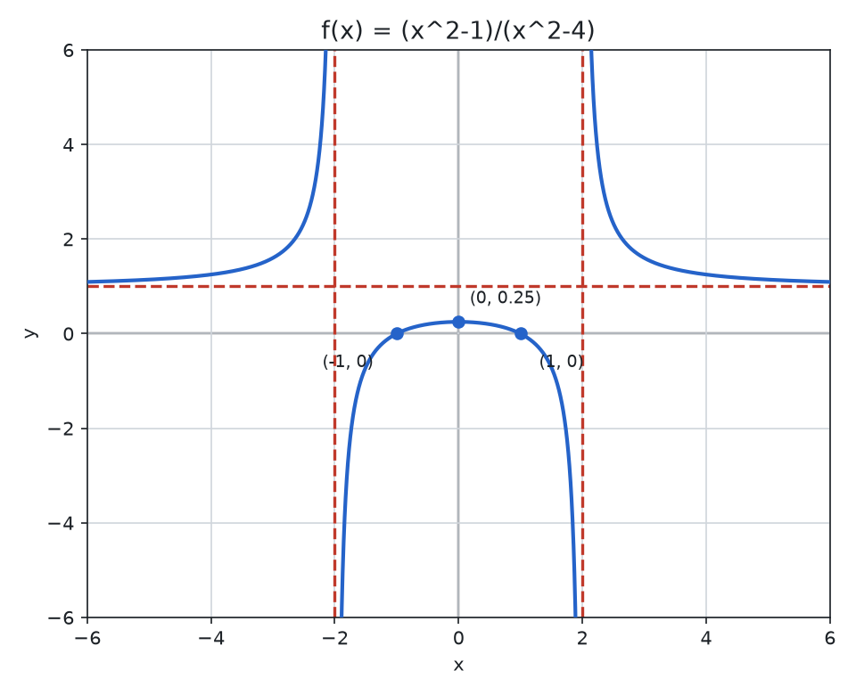
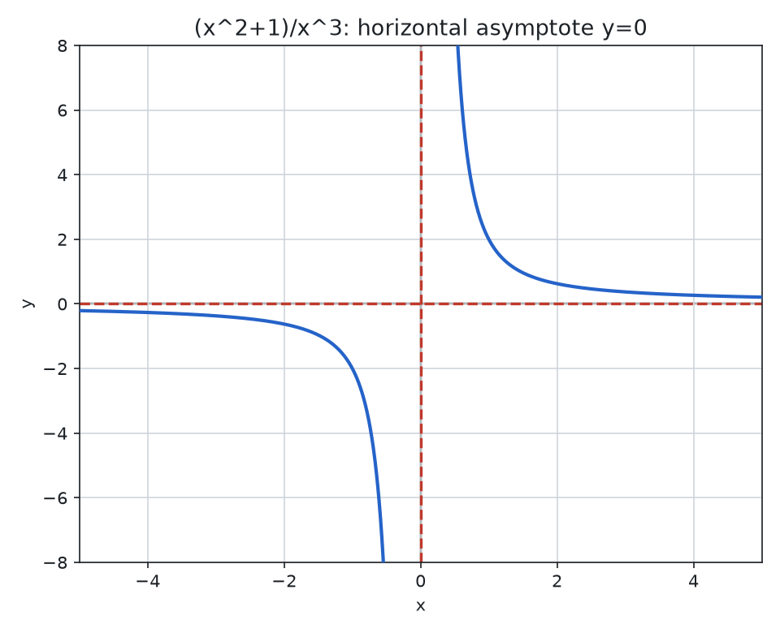
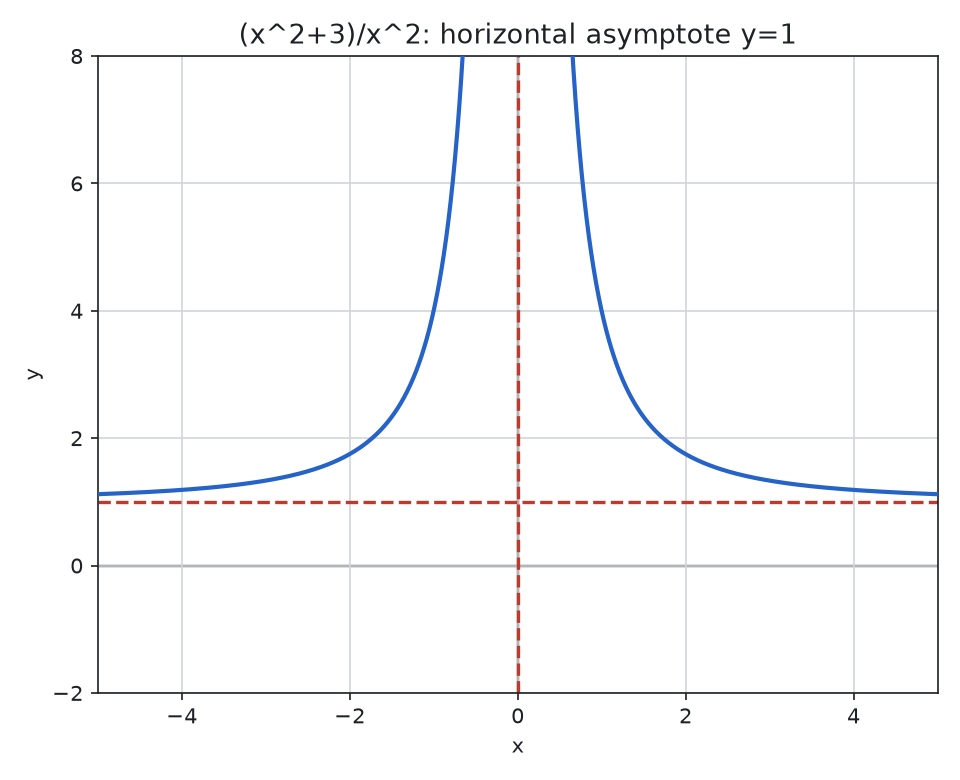
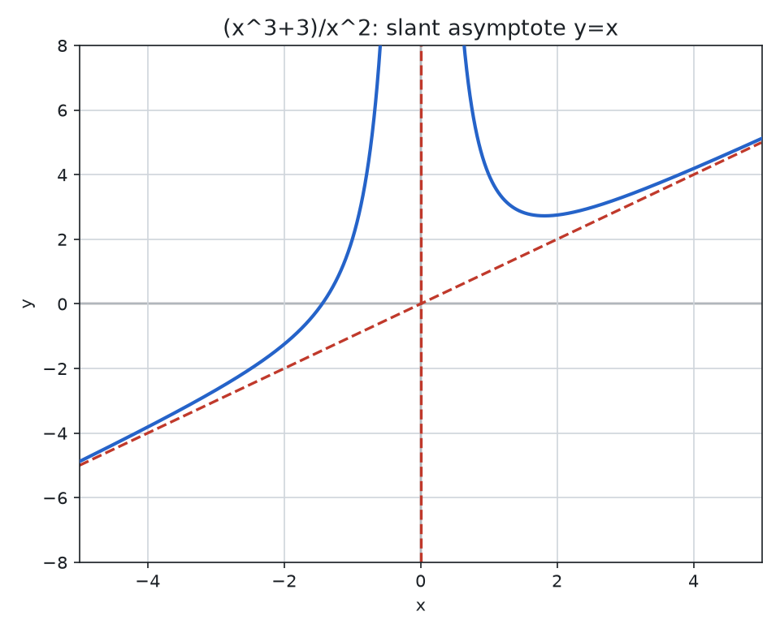
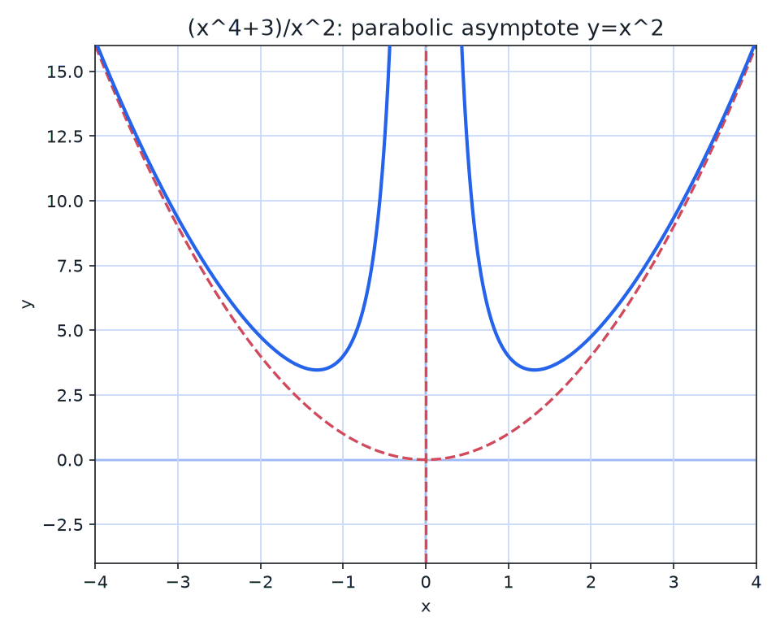
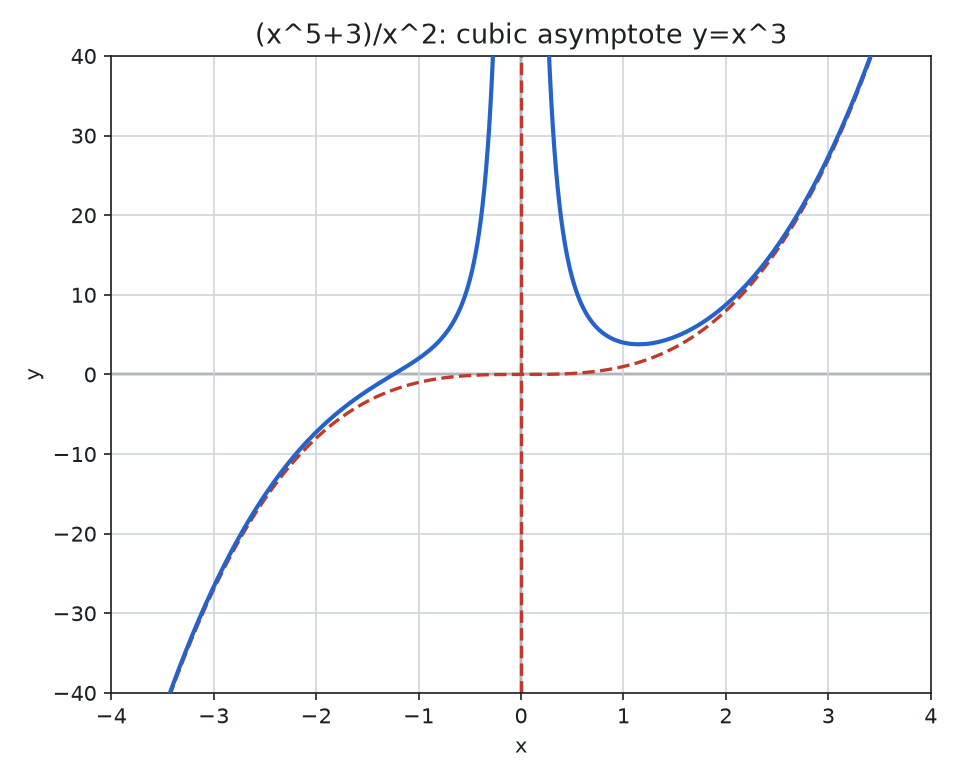

> [!abstract] Prerequisites & where this leads
> **Builds on:** [Polynomial Functions](./polynomial-functions) · [Functions & Relations](./functions-relations)
> **Leads to:** [Calculus](./calculus) · [Partial Fraction Decomposition](./partial-fraction-decomposition)

## What Is a Rational Function?

A **rational function** is what you get when you divide one polynomial by another. Just as a "rational number" is a ratio of two integers (like $\frac{3}{4}$), a rational function is a ratio of two polynomials.

### Why Dividing Polynomials Creates Interesting Behavior

When you divide two polynomials, something new happens that never occurs with polynomials alone: the denominator can equal zero. At those input values, the function is undefined, and the graph exhibits dramatic behavior. It may shoot off toward infinity (creating a **vertical asymptote**) or it may have a "missing point" (called a **hole**). As $x$ grows very large, the function may level off toward a horizontal line (a **horizontal asymptote**) or grow in a linear fashion (a **slant asymptote**). Here are all four behaviors at a glance, each explored in full later on the page:

![Four small preview graphs of the characteristic rational-function behaviors. First, a vertical asymptote: the curve 1/x splits into two branches that shoot up and down along a red dashed vertical line where the denominator is zero. Second, a hole: a straight line with a single open circle marking one missing point. Third, a horizontal asymptote: a curve that dips down and levels back up toward a green dashed horizontal line as x grows large in either direction. Fourth, a slant asymptote: two branches that hug an amber dashed diagonal line as x grows large.](./media/rf-behaviors-preview.png)

### A Concrete Example

Consider the function:

$$f(x) = \frac{1}{x}$$

This is the simplest nontrivial rational function: the constant polynomial $1$ divided by the polynomial $x$. When $x = 0$, the function is undefined. As $x$ approaches $0$ from the right, $f(x)$ grows without bound. As $x$ becomes very large, $f(x)$ shrinks toward $0$. The graph has a vertical asymptote at $x = 0$ and a horizontal asymptote at $y = 0$.

With that intuition, here is the general definition.

A rational function is built from [polynomial functions](./polynomial-functions). Understanding polynomial behavior (roots, degree, leading term) is essential for analyzing rational functions.

## Formal Definition

**Rational Functions:** A rational function is an expression of the form
$\frac{P(x)}{Q(x)}$, where $P(x)$ and $Q(x)$ are polynomials and $Q(x)$ is not the zero polynomial. ($Q$ may still equal zero at isolated points; those points are exactly where the function is undefined.)

$$f(x) =  \frac{a_{n}x^{n} + a_{n - 1}x^{n - 1} + \ldots + a_{1}x^{1}{+ a}_{0}}{b_{m}x^{m} + b_{m - 1}x^{m - 1} + \ldots + b_{1}x^{1}{+ b}_{0}}$$

Here the numerator has degree $n$ and the denominator has degree $m$; these need not be equal.

## Domain

**Domain:** The domain of a rational function is the set of all real
numbers (or complex numbers) for which the function is defined.

Since a rational function is a ratio of two polynomials, it is defined
everywhere except where the denominator is zero.

Those locations where the denominator is zero are responsible for
creating vertical asymptotes in the graph.

**Worked example.** Find the domain of $f(x) = \dfrac{x + 1}{x^2 - x - 6}$. Set the denominator to zero and factor: $x^2 - x - 6 = (x - 3)(x + 2) = 0$, so $x = 3$ or $x = -2$. These two values are excluded, and the domain is all real numbers except $3$ and $-2$: in interval notation, $(-\infty, -2) \cup (-2, 3) \cup (3, \infty)$. Because the numerator $x + 1$ is nonzero at both excluded points, both are genuine vertical asymptotes rather than holes.

## Range

**Range:** The range of a rational function is the set of all possible
y-values (outputs) that the function can produce. To determine the
range, you need to consider the behavior of the function across its
domain, particularly focusing on any asymptotes, critical points, and
intervals where the function is defined.

Here are key steps and considerations for finding the range of a
rational function:

-   Identify the Domain: The first step in finding the range is to
    identify the domain of the function, which is the set of all
    x-values for which the function is defined. Rational functions are
    undefined where their denominators are zero.

-   Find Vertical Asymptotes: Vertical asymptotes occur where the
    denominator of the rational function is zero, but the numerator is
    not zero. These points indicate where the function tends to infinity
    or negative infinity.

-   Determine Horizontal or Oblique Asymptotes: Horizontal or oblique
    asymptotes describe the behavior of the function as x approaches
    positive or negative infinity. They indicate y-values that the
    function approaches but does not necessarily reach.

-   Analyze the Function's Behavior: Consider the function's behavior
    around asymptotes, zeros of the numerator (where the function
    crosses the x-axis), and any other critical points (such as turning
    points) identified through calculus techniques like finding
    derivatives.

-   Combine Findings to Determine the Range: Based on the asymptotic
    behavior, zeros, and critical points, determine which y-values the
    function can take. Note if any values are excluded due to asymptotes
    or other factors.

**Worked example.** Find the range of $f(x) = \dfrac{2x + 1}{x - 3}$. The degrees are equal, so there is a horizontal asymptote at $y = \tfrac{2}{1} = 2$. Is $y = 2$ ever actually attained? Set $\dfrac{2x + 1}{x - 3} = 2$ and solve: $2x + 1 = 2(x - 3) = 2x - 6$, which gives $1 = -6$, a contradiction. No $x$ produces $y = 2$, so $2$ is excluded, and the range is all real numbers except $2$: $(-\infty, 2) \cup (2, \infty)$. The general technique is to solve $y = f(x)$ for $x$ in terms of $y$; any $y$ that makes that impossible is not in the range.

## Proper / Improper Rational Function

**Proper / Improper Rational Function:**

Just as with normal fractions, rational functions also have the concept
of 'proper' and 'improper.'

-   A rational function is considered **improper** if the degree of the
    numerator is greater than or equal to the degree of the denominator.

$$\frac{x^{3} + 1}{x^{2}}$$

*N\>D*

-   A rational function is considered **proper** when the degree of the
    numerator is less than the degree of the denominator.

$$\frac{x^{2} + 1}{x^{5}}$$

*N\<D*

**Handling Improper Rational Functions**

To work with improper rational functions, one common technique is to use
polynomial long division to rewrite the function as a polynomial plus a
proper rational function.

## Operations on Rational Expressions

Before analyzing rational functions graphically, it helps to be fluent in the algebra of rational expressions: simplifying, multiplying, dividing, adding, subtracting, and untangling compound fractions. Every rule is the polynomial version of ordinary fraction arithmetic.

### Simplifying to Lowest Terms

Factor the numerator and denominator completely, then cancel common factors. Cancelling is only valid where the cancelled factor is nonzero, which is exactly why a cancelled factor leaves a **hole** in the graph.

**Example.** Simplify $\dfrac{x^2 - 9}{x^2 - x - 6}$. Factor both:

$$
\frac{x^2 - 9}{x^2 - x - 6} = \frac{(x - 3)(x + 3)}{(x - 3)(x + 2)} = \frac{x + 3}{x + 2}, \quad x \neq 3
$$

The cancelled factor $(x - 3)$ means $x = 3$ is excluded from the domain (a hole at that $x$), even though the simplified form $\tfrac{x+3}{x+2}$ looks defined there.

### Multiplying and Dividing

To **multiply**, factor everything, cancel across the two fractions, then multiply straight across. To **divide**, multiply by the reciprocal of the divisor (flip the second fraction) and proceed as with multiplication.

**Example (multiply).** $\dfrac{x^2 - 1}{x^2 + 2x} \cdot \dfrac{x}{x + 1}$. Factor and cancel:

$$
\frac{(x - 1)(x + 1)}{x(x + 2)} \cdot \frac{x}{x + 1} = \frac{(x - 1)\cancel{(x + 1)}\,\cancel{x}}{\cancel{x}(x + 2)\,\cancel{(x + 1)}} = \frac{x - 1}{x + 2}
$$

**Example (divide).** $\dfrac{x^2 - 1}{x + 2} \div \dfrac{x - 1}{x^2 - 4}$. Flip the divisor and multiply:

$$
\frac{x^2 - 1}{x + 2} \cdot \frac{x^2 - 4}{x - 1} = \frac{(x - 1)(x + 1)}{x + 2} \cdot \frac{(x - 2)(x + 2)}{x - 1} = (x + 1)(x - 2)
$$

### Adding and Subtracting

Rewrite each fraction over the **least common denominator** (LCD), combine the numerators, then simplify. As with numeric fractions, you cannot add numerators until the denominators match.

**Example.** $\dfrac{1}{x} + \dfrac{1}{x + 1}$. The LCD is $x(x + 1)$:

$$
\frac{1}{x} + \frac{1}{x + 1} = \frac{x + 1}{x(x + 1)} + \frac{x}{x(x + 1)} = \frac{(x + 1) + x}{x(x + 1)} = \frac{2x + 1}{x(x + 1)}
$$

### Complex (Compound) Fractions

A **complex fraction** has fractions inside its numerator or denominator. The cleanest method is to multiply the top and bottom by the LCD of all the inner fractions, clearing them in one step.

**Example.** Simplify $\dfrac{\tfrac{1}{x} + \tfrac{1}{y}}{\tfrac{1}{x} - \tfrac{1}{y}}$. Multiply numerator and denominator by $xy$:

$$
\frac{\tfrac{1}{x} + \tfrac{1}{y}}{\tfrac{1}{x} - \tfrac{1}{y}} \cdot \frac{xy}{xy} = \frac{y + x}{y - x}
$$

Every inner fraction clears at once, leaving a single simple fraction.

## Finding x-intercepts

**Finding x-intercepts:** Factor the numerator and solve for the $x$ that make it zero (an $x$-intercept of a rational function occurs where the numerator is zero *and* the denominator is nonzero).

**Worked example.** Find the $x$-intercepts of $f(x) = \dfrac{x^2 - 1}{x^2 - 4}$. Set the numerator to zero: $x^2 - 1 = (x - 1)(x + 1) = 0$, so $x = 1$ or $x = -1$. Both keep the denominator $x^2 - 4$ nonzero ($1 - 4 = -3$ and $1 - 4 = -3$), so the $x$-intercepts are $(1, 0)$ and $(-1, 0)$. (Had a numerator zero coincided with a denominator zero, it would be a hole, not an intercept.)



## Finding y-intercept

**Finding y-intercept:** To find the y-intercept of a rational function,
you need to evaluate the function at *𝑥 = 0*. The y-intercept is the
point where the graph of the function crosses the y-axis, which
corresponds to 𝑥 = 0.

**Worked example.** For $f(x) = \dfrac{x+3}{2x^2 + 9x - 5}$, the y-intercept is $f(0) = \dfrac{0+3}{0 + 0 - 5} = -\dfrac{3}{5}$. (Separately, the denominator factors as $2x^2 + 9x - 5 = (2x - 1)(x + 5)$, so the function is *undefined* at $x = \tfrac{1}{2}$ and $x = -5$, which are excluded from the domain and are candidate vertical asymptotes.)

## Horizontal, Slant, and Polynomial Asymptotes

**Horizontal Asymptote:** A horizontal asymptote of a graph is a
horizontal line y = b, where the graph approaches the line as the input
value increases/decreases without bound.

This section covers all three kinds of end-behavior asymptote at once,
because which kind appears depends entirely on how the degree of the
numerator compares to the degree of the denominator. A horizontal
asymptote occurs only when the numerator's degree is less than or equal
to the denominator's. **When deg(numerator) > deg(denominator) there is
no horizontal asymptote.** In that case the end behavior is governed by
the quotient of polynomial long division: if the degree exceeds the
denominator by exactly 1, the asymptote is a slanted (oblique) line;
if it exceeds by 2 or more, the asymptote is a higher-degree polynomial
curve (curvilinear end behavior).

How do you find the horizontal asymptote?

$$f(x) =  \frac{a_{n}x^{n} + \ldots + a_{0}}{b_{m}x^{m} + \ldots + b_{0}}$$

Where $a_{n}$ and $b_{m}$ are the leading coefficients of the numerator
and denominator polynomials, having degree $n$ and $m$ respectively.

  -----------------------------------------------------------------------
  numerator \<         Horizontal Asymptote is the x-axis
  denominator          
  -------------------- --------------------------------------------------
  numerator =          Horizontal Asymptote is the line y = (leading
  denominator          coeff of numerator)/(leading coeff of denominator)

  numerator \>         Slant / Oblique Asymptote (no horizontal asymptote)
  denominator          
  -----------------------------------------------------------------------



$$f(x) = \ \frac{x^{2} + 1}{x^{3}}$$

This is a proper fraction, where the denominator is greater than the
numerator. This produces a horizontal asymptote at ***y = 0***.

### Numerator = Denominator

When the degrees are equal, the horizontal asymptote is the ratio of the leading coefficients. For $\dfrac{x^2 + 3}{x^2}$ both leading coefficients are $1$, so the asymptote is $y = \tfrac{1}{1} = 1$.



### Numerator \> Denominator (improper fraction)

Numerator \> Denominator



Num\>Denom by 1

*(Because the degree of the numerator exceeds the degree of the
denominator by 1, the graph of the asymptote will be linear: **mx +
b**)*



Num\>Denom by 2

*(Because the degree of the numerator exceeds the degree of the
denominator by 2, the graph of the asymptote will be quadratic:
**x\^2**)*



Num\>Denom by 3

*(Because the degree of the numerator exceeds the degree of the
denominator by 3, the graph of the asymptote will be cubic:
**x\^***3*)*

Use Polynomial Long Division to find the asymptote of a rational
function.

The amount by which the degree of the numerator exceeds the degree of
the denominator determines the type of asymptotic behavior displayed.

-   If numerator \> denominator by degree of 1, the asymptote will be
    linear.

-   If numerator \> denominator by degree of 2, the asymptote will be
    quadratic.

-   If numerator \> denominator by degree of 3, the asymptote will look
    like a polynomial of degree 3

-   If numerator \> denominator by degree of 4, the asymptote will look
    like polynomial of degree 4

#### Procedure for Identifying Horizontal Asymptotes when Deg(Numerator) \> Deg(Denominator)

**Procedure for Identifying Horizontal Asymptotes (Deg(Px) \> Deg(Qx))**

Perform Polynomial Long Division

-   Divide the numerator *𝑃(𝑥)* by the denominator *𝑄(𝑥)* to find the
    quotient.

-   The quotient represents the asymptote. If the quotient is linear, it
    will be an oblique/linear asymptote; if it's of higher degree, it
    will be a polynomial asymptote resembling the equation of the
    polynomial retrieved by long division.

## Hole / Discontinuity / Removable Discontinuity

**Hole / Removable Discontinuity:** A hole occurs in a rational function when there is a common factor between the numerator and the denominator that can be cancelled.


At the point where this factor equals zero, the function is undefined, creating a "hole" in the graph.

**How to identify:**

1. Factor both numerator and denominator completely
2. Find common factors
3. Cancel the common factors
4. The values that make the cancelled factors zero are holes

**Example 1:**

$$f(x) =  \frac{x^{2} - 1}{x^{2} - 2x - 3} = \frac{(x + 1)(x - 1)}{(x + 1)(x - 3)}$$

Factor and cancel:

$$f(x) = \frac{x - 1}{x - 3} \text{ for } x \neq -1$$

- **Hole at $x = -1$** (common factor $(x + 1)$ cancelled)
- **Vertical asymptote at $x = 3$** (denominator zero after cancellation)

**Finding the y-coordinate of the hole:**

Substitute $x = -1$ into the simplified function:

$$y = \frac{-1 - 1}{-1 - 3} = \frac{-2}{-4} = \frac{1}{2}$$

Hole is at $(-1, \frac{1}{2})$

**Example 2:**

$$f(x) = \frac{x^2 - 4}{x - 2} = \frac{(x-2)(x+2)}{x-2}$$

Simplified: $f(x) = x + 2$ for $x \neq 2$

Hole at $(2, 4)$ since $f(2)$ would be $2 + 2 = 4$ if it were defined.

**Hole vs Vertical Asymptote:**

- **Hole:** Common factor cancels, function is undefined but has a finite limit
- **Vertical Asymptote:** Denominator is zero after all cancellations, function approaches $\pm\infty$

**Summary:**

| Feature | Numerator at $x = a$ | Denominator at $x = a$ | Result |
|---------|---------------------|------------------------|--------|
| Hole | Zero | Zero (cancels) | Undefined, finite limit |
| Vertical Asymptote | Non-zero | Zero | Undefined, $f(x) \to \pm\infty$ |
| x-intercept | Zero | Non-zero | $f(a) = 0$ |

## Slant/Oblique Asymptote - Worked Example

**Slant Asymptote:** When the degree of the numerator exceeds the degree of the denominator by exactly 1, the function has a slant (oblique) asymptote with equation y = mx + b.

**Finding Slant Asymptotes:**

Use polynomial long division to divide the numerator by the denominator. The quotient (ignoring the remainder) is the equation of the slant asymptote.

**Example:** Find the slant asymptote of $f(x) = \frac{x^2 + 3x + 2}{x + 1}$

**Step 1:** Check degrees
- Degree of numerator: 2
- Degree of denominator: 1
- Difference: 2 - 1 = 1 ✓ (slant asymptote exists)

**Step 2:** Perform polynomial long division

```
         x + 2
      ___________
x + 1 | x² + 3x + 2
        x² + x        (x · (x+1))
        -------
            2x + 2    (subtract)
            2x + 2    (2 · (x+1))
            -------
                0     (remainder)
```

**Step-by-step:**
1. Divide first term: x² ÷ x = x
2. Multiply: x(x + 1) = x² + x
3. Subtract: (x² + 3x + 2) - (x² + x) = 2x + 2
4. Divide: 2x ÷ x = 2
5. Multiply: 2(x + 1) = 2x + 2
6. Subtract: (2x + 2) - (2x + 2) = 0

**Result:** $f(x) = x + 2 + \frac{0}{x+1} = x + 2$

**Slant asymptote: y = x + 2**

**Example 2 (with non-zero remainder):** $f(x) = \frac{2x^2 - 3x + 1}{x - 2}$

```
         2x + 1
      ___________
x - 2 | 2x² - 3x + 1
        2x² - 4x      (2x · (x-2))
        ---------
              x + 1   (subtract)
              x - 2   (1 · (x-2))
              -----
                  3   (remainder)
```

**Result:** $f(x) = 2x + 1 + \frac{3}{x-2}$

**Slant asymptote: y = 2x + 1**

As x → ±∞, the remainder term $\frac{3}{x-2} \to 0$, so the function approaches the line y = 2x + 1.

**Key Points:**
- Slant asymptote is the quotient from polynomial long division
- Remainder becomes negligible as x → ±∞
- Graph approaches but never touches the asymptote (except possibly at finite points)

## End Behavior

**End Behavior:** Describes what happens to f(x) as x approaches positive infinity (x → +∞) or negative infinity (x → -∞).

For a rigorous treatment of limits and end behavior, see [Calculus](./calculus).

**Three Cases:**

### Case 1: Degree of Numerator < Degree of Denominator

**Example:** $f(x) = \frac{x + 1}{x^2 + 1}$

As x → ±∞, the denominator grows much faster than the numerator:

- As x → +∞: f(x) → 0⁺ (numerator and denominator both positive)
- As x → -∞: f(x) → 0⁻ (numerator negative, denominator positive)

**End behavior:** Approaches horizontal asymptote y = 0, from above on the right and from below on the left.

**General rule:** When deg(P) < deg(Q), horizontal asymptote is y = 0.

### Case 2: Degree of Numerator = Degree of Denominator

**Example:** $f(x) = \frac{3x^2 + 2x + 1}{x^2 - 4}$

As x → ±∞, the highest degree terms dominate:

$$\frac{3x^2 + 2x + 1}{x^2 - 4} \approx \frac{3x^2}{x^2} = 3$$

- As x → +∞: f(x) → 3
- As x → -∞: f(x) → 3

**End behavior:** Approaches horizontal asymptote y = 3 from both directions.

**General rule:** When deg(P) = deg(Q), horizontal asymptote is y = a/b (ratio of leading coefficients).

### Case 3: Degree of Numerator > Degree of Denominator

**Example:** $f(x) = \frac{x^2 - 1}{x + 1}$

After polynomial division: $f(x) = x - 1 + \frac{0}{x+1} = x - 1$

- As x → +∞: f(x) → +∞
- As x → -∞: f(x) → -∞

**End behavior:** Follows slant asymptote y = x - 1.

**General rule:** When deg(P) > deg(Q), no horizontal asymptote. Follow oblique/polynomial asymptote.

**Summary Table:**

| Degree Comparison | End Behavior | Asymptote |
|-------------------|--------------|-----------|
| deg(P) < deg(Q) | f(x) → 0 as x → ±∞ | Horizontal: y = 0 |
| deg(P) = deg(Q) | f(x) → a/b as x → ±∞ | Horizontal: y = a/b |
| deg(P) = deg(Q) + 1 | f(x) → mx + b as x → ±∞ | Slant: y = mx + b |
| deg(P) > deg(Q) + 1 | f(x) → polynomial | Polynomial asymptote |

## Sign Analysis / Interval Testing

**Sign Analysis:** Determines where the function is positive (above x-axis) or negative (below x-axis) by testing intervals between critical points.


**Critical Points:**
1. **Zeros** (where numerator = 0) - function crosses x-axis
2. **Vertical asymptotes** (where denominator = 0) - function undefined
3. **Holes** (where common factors cancel) - function undefined

**Procedure:**

**Step 1:** Find all critical points

**Step 2:** Place critical points on a number line (these divide the line into intervals)

**Step 3:** Choose a test point in each interval

**Step 4:** Evaluate the function at each test point to determine sign

**Step 5:** Function cannot change sign within an interval (only at critical points)

**Example:** Analyze the sign of $f(x) = \frac{(x+2)(x-1)}{(x-3)}$

**Step 1:** Find critical points
- Zeros: x = -2, x = 1 (numerator = 0)
- Vertical asymptote: x = 3 (denominator = 0)

**Step 2:** Number line with critical points

```
    -2         1         3
-----|---------|---------|-----
 I       II       III      IV
```

**Step 3 & 4:** Test each interval

| Interval | Test Point | Sign of (x+2) | Sign of (x-1) | Sign of (x-3) | Sign of f(x) |
|----------|------------|---------------|---------------|---------------|--------------|
| I: x < -2 | x = -3 | - | - | - | - |
| II: -2 < x < 1 | x = 0 | + | - | - | + |
| III: 1 < x < 3 | x = 2 | + | + | - | - |
| IV: x > 3 | x = 4 | + | + | + | + |

**Step 5:** Sign diagram

```
    -2         1         3
-----|---------|---------|-----
  -      +        -        +
(below) (above) (below) (above)
```

**Interpretation:**
- f(x) < 0 (below x-axis): (-∞, -2) ∪ (1, 3)
- f(x) > 0 (above x-axis): (-2, 1) ∪ (3, ∞)
- f(x) = 0 (on x-axis): x = -2, x = 1

**Behavior at vertical asymptote (x = 3):**
- Left side: f(x) → -∞ (negative approaching from left)
- Right side: f(x) → +∞ (positive approaching from right)

**Example 2:** $f(x) = \frac{x^2 - 4}{x^2 - 1} = \frac{(x-2)(x+2)}{(x-1)(x+1)}$

**Critical points:**
- Zeros: x = -2, x = 2
- Vertical asymptotes: x = -1, x = 1

**Number line:**

```
    -2        -1         1         2
-----|---------|---------|---------|-----
  I      II       III      IV       V
```

**Test points:** x = -3, -1.5, 0, 1.5, 3

| Interval | Test x | f(x) sign | Above/Below |
|----------|--------|-----------|-------------|
| I: x < -2 | -3 | + | Above |
| II: -2 < x < -1 | -1.5 | - | Below |
| III: -1 < x < 1 | 0 | + | Above |
| IV: 1 < x < 2 | 1.5 | - | Below |
| V: x > 2 | 3 | + | Above |

## Solving Rational Equations

A **rational equation** sets rational expressions equal. The standard method is to clear denominators, with one essential caveat: multiplying by an expression that can equal zero may introduce **extraneous solutions**, so every candidate must be checked against the original domain.

**Method:**

1. Factor all denominators and record the domain (any value making a denominator zero is excluded).
2. Multiply both sides by the least common denominator (LCD) to clear fractions.
3. Solve the resulting polynomial equation.
4. Discard any solution that is excluded from the domain (extraneous); keep and verify the rest.

**Worked example.** Solve $\dfrac{x}{x-2} + 1 = \dfrac{4}{x-2}$.

Domain: $x \neq 2$. Multiply through by the LCD $(x-2)$:
$$
x + (x - 2) = 4 \;\Longrightarrow\; 2x - 2 = 4 \;\Longrightarrow\; x = 3.
$$
Since $3 \neq 2$, it is in the domain: the solution is $x = 3$.

**Worked example (extraneous solution).** Solve $\dfrac{x}{x-2} = \dfrac{2}{x-2}$.

Domain: $x \neq 2$. Multiplying by $(x-2)$ gives $x = 2$, but $x = 2$ is *excluded* from the domain. It is extraneous, so the equation has **no solution**. This is exactly why step 4 is non-negotiable.

## Solving Rational Inequalities

To solve an inequality such as $\dfrac{x-1}{x+2} \ge 0$, do **not** multiply across by $(x+2)$: its sign is unknown, and multiplying by a negative would flip the inequality. Instead, reuse the [sign analysis](#sign-analysis--interval-testing) machinery.

**Method:**

1. Rearrange so one side is $0$: get a single rational expression $\dfrac{p(x)}{q(x)}$ compared to $0$.
2. Find the critical points: zeros of the numerator and zeros of the denominator (vertical asymptotes and holes).
3. Build a sign chart across the intervals the critical points create.
4. Read off the intervals with the required sign. For $\le$ or $\ge$, **include** numerator zeros (there the expression equals $0$); **always exclude** denominator zeros (there it is undefined).

**Worked example.** Solve $\dfrac{x-1}{x+2} \ge 0$.

Critical points: $x = 1$ (numerator zero, a candidate to include) and $x = -2$ (denominator zero, always excluded). Testing the three intervals:

| Interval | Test $x$ | Sign of $\frac{x-1}{x+2}$ |
|---|:---:|:---:|
| $x < -2$ | $-3$ | $\frac{-}{-} = +$ |
| $-2 < x < 1$ | $0$ | $\frac{-}{+} = -$ |
| $x > 1$ | $2$ | $\frac{+}{+} = +$ |

The expression is $\ge 0$ on the first and third intervals. Including $x = 1$ (where it equals $0$) but excluding $x = -2$ (undefined), the solution is
$$
(-\infty,\, -2) \;\cup\; [\,1,\, \infty).
$$
Note the *open* bracket at $-2$ and the *closed* bracket at $1$: the distinction between "undefined" and "equals zero" is exactly what the endpoints record.

## One-Sided Limits at Discontinuities

**One-Sided Limits:** Describe the behavior of a function as x approaches a discontinuity from the left (-) or right (+).

**Notation:**
- $\lim_{x \to a^-} f(x)$ means "limit as x approaches a from the left"
- $\lim_{x \to a^+} f(x)$ means "limit as x approaches a from the right"

### At Holes (Removable Discontinuities)

**Example:** $f(x) = \frac{x^2 - 1}{x - 1} = \frac{(x+1)(x-1)}{x-1}$

Simplified: $f(x) = x + 1$ for $x \neq 1$

Hole at x = 1.

**Left-hand limit:**
$$\lim_{x \to 1^-} f(x) = \lim_{x \to 1^-} (x+1) = 2$$

**Right-hand limit:**
$$\lim_{x \to 1^+} f(x) = \lim_{x \to 1^+} (x+1) = 2$$

**Two-sided limit:**
$$\lim_{x \to 1} f(x) = 2$$

**Key property of holes:** Both one-sided limits exist and are equal. The limit exists, but f(1) is undefined.

### At Vertical Asymptotes

**Example 1:** $f(x) = \frac{1}{x - 2}$

Vertical asymptote at x = 2.

**Determine signs near x = 2:**

When x < 2 (x = 1.9): Numerator = 1 (positive), Denominator = -0.1 (negative)
→ f(x) is negative, approaching -∞

When x > 2 (x = 2.1): Numerator = 1 (positive), Denominator = 0.1 (positive)
→ f(x) is positive, approaching +∞

**One-sided limits:**
$$\lim_{x \to 2^-} f(x) = -\infty$$
$$\lim_{x \to 2^+} f(x) = +\infty$$

**Graphical behavior:** Function has a vertical asymptote at x = 2 with different signs on each side.

**Example 2:** $f(x) = \frac{1}{(x - 2)^2}$

Vertical asymptote at x = 2.

**Determine signs near x = 2:**

When x < 2 (x = 1.9): Numerator = 1 (positive), Denominator = (-0.1)² = 0.01 (positive)
→ f(x) is positive, approaching +∞

When x > 2 (x = 2.1): Numerator = 1 (positive), Denominator = (0.1)² = 0.01 (positive)
→ f(x) is positive, approaching +∞

**One-sided limits:**
$$\lim_{x \to 2^-} f(x) = +\infty$$
$$\lim_{x \to 2^+} f(x) = +\infty$$

**Graphical behavior:** Function approaches +∞ from both sides (even exponent in denominator).

**General Rule for Vertical Asymptotes:**

For $f(x) = \frac{N(x)}{(x-a)^n}$ where N(a) ≠ 0:

- **Odd exponent n:** Different signs on each side (one approaches +∞, other approaches -∞)
- **Even exponent n:** Same sign on both sides (both approach +∞ or both approach -∞)

**Example 3 (mixed):** $f(x) = \frac{x + 1}{x^2 - 4} = \frac{x+1}{(x-2)(x+2)}$

Vertical asymptotes at x = -2 and x = 2.

**At x = -2:**

Test x = -2.1: $\frac{-2.1+1}{(-2.1-2)(-2.1+2)} = \frac{-1.1}{(-4.1)(-0.1)} = \frac{-1.1}{0.41} < 0$

Test x = -1.9: $\frac{-1.9+1}{(-1.9-2)(-1.9+2)} = \frac{-0.9}{(-3.9)(0.1)} = \frac{-0.9}{-0.39} > 0$

$$\lim_{x \to -2^-} f(x) = -\infty, \quad \lim_{x \to -2^+} f(x) = +\infty$$

**At x = 2:**

Test x = 1.9: $\frac{1.9+1}{(1.9-2)(1.9+2)} = \frac{2.9}{(-0.1)(3.9)} = \frac{2.9}{-0.39} < 0$

Test x = 2.1: $\frac{2.1+1}{(2.1-2)(2.1+2)} = \frac{3.1}{(0.1)(4.1)} = \frac{3.1}{0.41} > 0$

$$\lim_{x \to 2^-} f(x) = -\infty, \quad \lim_{x \to 2^+} f(x) = +\infty$$

## Complete Graphing Example

Before the worked example, explore interactively. Enter the numerator and denominator in **factored form** (by their roots) and the grapher draws the curve and labels every feature exactly: vertical asymptotes, the horizontal/slant/polynomial asymptote, holes (open circles), and intercepts. Because it works from the roots, the features are computed exactly rather than estimated.

<iframe src="/static/interactive/rational-function-grapher.html" width="100%" height="660" style="border:none;"></iframe>

**Problem:** Graph $f(x) = \frac{x^2 - x - 6}{x - 2}$ showing all key features.

**Step 1: Factor**

$$f(x) = \frac{(x-3)(x+2)}{x-2}$$

**Step 2: Domain**

Denominator = 0 when x = 2

Domain: (-∞, 2) ∪ (2, ∞)

**Step 3: Holes**

No common factors between numerator and denominator.

No holes.

**Step 4: Vertical Asymptotes**

Denominator = 0 at x = 2 (and not cancelled)

Vertical asymptote: **x = 2**

**Step 5: Horizontal/Slant Asymptote**

Degree of numerator (2) > degree of denominator (1) by 1

Slant asymptote exists. Use polynomial long division:

```
         x + 1
      ___________
x - 2 | x² - x - 6
        x² - 2x        (x · (x-2))
        --------
             x - 6     (subtract)
             x - 2     (1 · (x-2))
             -----
                -4     (remainder)
```

$$f(x) = x + 1 - \frac{4}{x-2}$$

Slant asymptote: **y = x + 1**

**Step 6: x-intercepts**

Numerator = 0 when (x-3)(x+2) = 0

x = 3 or x = -2

x-intercepts: **(-2, 0)** and **(3, 0)**

**Step 7: y-intercept**

$$f(0) = \frac{0^2 - 0 - 6}{0 - 2} = \frac{-6}{-2} = 3$$

y-intercept: **(0, 3)**

**Step 8: One-sided limits at x = 2**

As x → 2⁻ (x = 1.9):
$$f(1.9) = \frac{(1.9-3)(1.9+2)}{1.9-2} = \frac{(-1.1)(3.9)}{-0.1} = \frac{-4.29}{-0.1} > 0$$

Function → +∞

As x → 2⁺ (x = 2.1):
$$f(2.1) = \frac{(2.1-3)(2.1+2)}{2.1-2} = \frac{(-0.9)(4.1)}{0.1} = \frac{-3.69}{0.1} < 0$$

Function → -∞

**At x = 2:**
$$\lim_{x \to 2^-} f(x) = +\infty, \quad \lim_{x \to 2^+} f(x) = -\infty$$

**Step 9: Sign Analysis**

Critical points: x = -2, x = 2, x = 3

```
    -2         2         3
-----|---------|---------|-----
  I      II       III      IV
```

Test points: x = -3, 0, 2.5, 4

| Interval | Test x | f(x) value | Sign |
|----------|--------|------------|------|
| I: x < -2 | -3 | $\frac{(-6)(−1)}{-5} < 0$ | - |
| II: -2 < x < 2 | 0 | 3 | + |
| III: 2 < x < 3 | 2.5 | $\frac{(-0.5)(4.5)}{0.5} < 0$ | - |
| IV: x > 3 | 4 | $\frac{(1)(6)}{2} > 0$ | + |

**Step 10: Summary of Features**

- **Domain:** (-∞, 2) ∪ (2, ∞)
- **x-intercepts:** (-2, 0), (3, 0)
- **y-intercept:** (0, 3)
- **Vertical asymptote:** x = 2
- **Slant asymptote:** y = x + 1
- **Holes:** None
- **End behavior:** Follows y = x + 1 as x → ±∞

**Step 11: Sketch**

Key graphing points:
1. Plot intercepts: (-2, 0), (3, 0), (0, 3)
2. Draw vertical asymptote x = 2 (dashed line)
3. Draw slant asymptote y = x + 1 (dashed line)
4. Sketch in each interval using sign analysis:
   - Interval I (x < -2): Below x-axis, approaching slant asymptote as x → -∞
   - Interval II (-2 < x < 2): Above x-axis, through (0,3), approaching +∞ as x → 2⁻
   - Interval III (2 < x < 3): Below x-axis, starting from -∞ at x → 2⁺
   - Interval IV (x > 3): Above x-axis, approaching slant asymptote as x → +∞
5. Ensure curve crosses x-axis at x = -2 and x = 3

**Behavior checklist:**
- ✓ Function crosses x-axis at zeros
- ✓ Function approaches vertical asymptote from correct directions
- ✓ Function approaches slant asymptote as x → ±∞
- ✓ Sign analysis matches graphed regions

## Applications of Rational Functions

Rational functions appear naturally in many applied settings. Two common applications are average cost analysis and concentration/dilution problems.

### Average Cost

When a business has a total cost function $C(x)$ for producing $x$ items, the **average cost per item** is:

$$\bar{C}(x) = \frac{C(x)}{x}$$

This is a rational function of $x$.

**Example:** Suppose the total cost of producing $x$ units is $C(x) = 5000 + 20x$, where \$5000 represents fixed costs (rent, equipment) and \$20 is the variable cost per unit.

The average cost per unit is:

$$\bar{C}(x) = \frac{5000 + 20x}{x} = \frac{5000}{x} + 20$$

**Analysis:**
- When $x = 10$: $\bar{C}(10) = 500 + 20 = 520$, i.e. \$520 per unit
- When $x = 100$: $\bar{C}(100) = 50 + 20 = 70$, i.e. \$70 per unit
- When $x = 1000$: $\bar{C}(1000) = 5 + 20 = 25$, i.e. \$25 per unit

As $x \to \infty$, the term $\frac{5000}{x} \to 0$, so $\bar{C}(x) \to 20$. The average cost approaches \$20 (the variable cost per unit) but never reaches it. This is the horizontal asymptote $y = 20$.

**Interpretation:** The fixed costs are spread over more and more units, so each unit bears a smaller share. This is the mathematical basis of "economies of scale."

### Concentration and Dilution

Mixing problems often produce rational functions. When a substance is added to or diluted in a solution, the concentration is typically a ratio of amount of substance to total volume, both of which may be changing.

**Example:** A tank contains 10 liters of water with 3 kg of salt dissolved in it. You begin adding pure water at a rate that increases the volume. After adding $x$ liters of pure water, the concentration of salt (in kg per liter) is:

$$C(x) = \frac{3}{10 + x}$$

**Analysis:**
- Initial concentration ($x = 0$): $C(0) = \frac{3}{10} = 0.3$ kg/L
- After adding 5 liters ($x = 5$): $C(5) = \frac{3}{15} = 0.2$ kg/L
- After adding 20 liters ($x = 20$): $C(20) = \frac{3}{30} = 0.1$ kg/L

As $x \to \infty$, $C(x) \to 0$. The horizontal asymptote is $y = 0$: with enough dilution, the concentration approaches zero but never quite reaches it. There is also a vertical asymptote at $x = -10$, which lies outside the physical domain ($x \geq 0$) but is part of the mathematical structure.

**Example 2:** A chemist has 50 mL of a 30% acid solution and adds $x$ mL of pure acid. The concentration of the resulting solution is:

$$C(x) = \frac{0.30(50) + x}{50 + x} = \frac{15 + x}{50 + x}$$

As $x \to \infty$, $C(x) \to 1$ (100% acid). The horizontal asymptote $y = 1$ makes physical sense: adding more and more pure acid makes the solution approach pure acid.

### Rational Functions in Machine Learning

Ratios of polynomials show up in ML wherever a bounded or saturating response is wanted:

- **Rational (Padé) activations.** Some neural networks use learnable rational activation functions $\dfrac{P(x)}{Q(x)}$ (a ratio of two low-degree polynomials, a **Padé approximant**) in place of fixed nonlinearities like ReLU. The horizontal asymptote controls the saturation value, and the extra parameters let the network learn the activation's shape.
- **Rational approximation.** A Padé approximant often matches a target function far better than a Taylor polynomial of the same total degree, precisely because a denominator lets it capture asymptotes and saturation that a polynomial cannot. This is used to approximate expensive functions (exponentials, special functions) cheaply inside numerical routines.
- **Ratios in training dynamics.** Many diagnostic quantities are ratios: a signal-to-noise ratio, a loss ratio between two runs, or the adaptive step in optimizers like Adam ($\hat m / (\sqrt{\hat v} + \epsilon)$) is a ratio whose limiting behavior is exactly the end-behavior analysis of this page. Reading such a ratio as a rational function tells you what it saturates to as its inputs grow.

