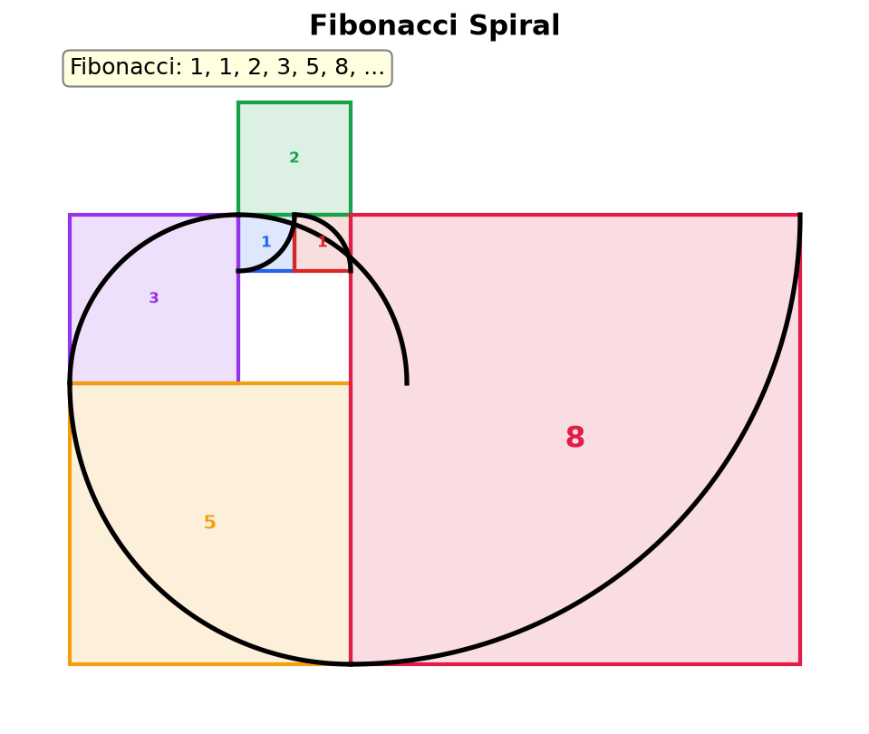
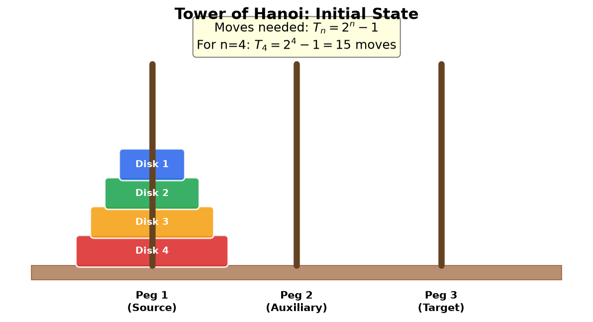

## Why Sequences and Series?

Numbers often follow patterns. Consider these examples:

- $2, 4, 6, 8, 10, \ldots$ (each number is 2 more than the last)
- $1, 2, 4, 8, 16, \ldots$ (each number is double the last)
- $1, 1, 2, 3, 5, 8, \ldots$ (each number is the sum of the two before it)

Recognizing and describing these patterns lets us predict future values, model growth and decay, and solve problems in finance, physics, and computer science.

There are two natural questions we can ask about a list of numbers:

1. **What are the individual terms?** This is a **sequence**: the ordered list itself. For example, the sequence $2, 4, 6, 8, \ldots$ tells us the value at each position.

2. **What is the running total?** This is a **series**: the sum of the terms. For the same numbers, the series $2 + 4 + 6 + 8 = 20$ tells us the accumulated total of the first four terms.

A concrete example: if you save \$100 in January, \$200 in February, \$300 in March, and \$400 in April, then the sequence of monthly savings is $100, 200, 300, 400$ and the series (total saved) is $100 + 200 + 300 + 400 = 1000$.

Studying sequences helps us understand patterns. Studying series helps us compute totals. Together, they also let us reason about infinite processes, such as whether an infinite sum can have a finite value.

## Definitions

**Sequence:** An ordered list of numbers following a pattern or rule. Each number in the sequence is called a **term**. A sequence can be finite or infinite.

**Notation:** A sequence is written as $\{a_n\}$ or $(a_1, a_2, a_3, \ldots)$, where $a_n$ is the **general term** (also called the **nth term formula**) that defines the value at position $n$.

**Series:** The sum of the terms of a sequence. If the sequence is $(a_1, a_2, a_3, \ldots)$, then the corresponding series is $a_1 + a_2 + a_3 + \cdots$.

## Sigma Notation

**Sigma Notation (Summation Notation):** A compact way to express the sum of a sequence of terms using the Greek capital letter sigma ($\Sigma$).

$$
\sum_{k=m}^{n} a_k = a_m + a_{m+1} + a_{m+2} + \cdots + a_n
$$

Where:
- **$k$:** The index of summation (also called the counter variable)
- **$m$:** The lower bound (starting value of $k$)
- **$n$:** The upper bound (ending value of $k$)
- **$a_k$:** The expression being summed

**Examples:**

$$
\sum_{k=1}^{5} k = 1 + 2 + 3 + 4 + 5 = 15
$$

$$
\sum_{k=1}^{4} k^2 = 1 + 4 + 9 + 16 = 30
$$

$$
\sum_{k=0}^{3} 2^k = 1 + 2 + 4 + 8 = 15
$$

**Properties of Sigma Notation:**

**Constant factor:**

$$
\sum_{k=1}^{n} c \cdot a_k = c \sum_{k=1}^{n} a_k
$$

**Sum/Difference:**

$$
\sum_{k=1}^{n} (a_k \pm b_k) = \sum_{k=1}^{n} a_k \pm \sum_{k=1}^{n} b_k
$$

**Constant sum:**

$$
\sum_{k=1}^{n} c = nc
$$

## Arithmetic Sequences

**Arithmetic Sequence:** A sequence where each term is obtained by adding a fixed value, called the **common difference** ($d$), to the previous term.

$$
a_n = a_1 + (n - 1)d
$$

Where:
- **$a_1$:** The first term
- **$d$:** The common difference ($d = a_{n+1} - a_n$ for any consecutive terms)
- **$n$:** The term number

**Identifying:** A sequence is arithmetic if the difference between consecutive terms is constant.

**Example 1:** $2, 5, 8, 11, 14, \ldots$

- Common difference: $d = 5 - 2 = 3$
- General term: $a_n = 2 + (n-1)(3) = 3n - 1$
- 10th term: $a_{10} = 3(10) - 1 = 29$

**Example 2:** $20, 15, 10, 5, 0, -5, \ldots$

- Common difference: $d = 15 - 20 = -5$
- General term: $a_n = 20 + (n-1)(-5) = 25 - 5n$
- 8th term: $a_8 = 25 - 40 = -15$

**Example 3:** Find $d$ and $a_1$ given $a_5 = 17$ and $a_{12} = 45$

From $a_n = a_1 + (n-1)d$:
- $a_5 = a_1 + 4d = 17$
- $a_{12} = a_1 + 11d = 45$

Subtract: $7d = 28$, so $d = 4$

Substitute: $a_1 + 4(4) = 17$, so $a_1 = 1$

General term: $a_n = 1 + (n-1)(4) = 4n - 3$

### Arithmetic Series

**Arithmetic Series:** The sum of the first $n$ terms of an arithmetic sequence.

$$
S_n = \sum_{k=1}^{n} a_k = \frac{n}{2}(a_1 + a_n) = \frac{n}{2}(2a_1 + (n-1)d)
$$

**Intuition:** Pair the first term with the last, the second with the second-to-last, and so on. Each pair sums to $a_1 + a_n$, and there are $n/2$ such pairs.

**Example 1:** Find $\sum_{k=1}^{100} k$ (sum of first 100 natural numbers)

This is an arithmetic sequence with $a_1 = 1$, $a_{100} = 100$, $n = 100$

$$
S_{100} = \frac{100}{2}(1 + 100) = 50 \times 101 = 5050
$$

This is the famous result attributed to Gauss.

**Example 2:** Find the sum $3 + 7 + 11 + 15 + \cdots + 99$

$a_1 = 3$, $d = 4$, $a_n = 99$

Find $n$: $99 = 3 + (n-1)(4)$ gives $n = 25$

$$
S_{25} = \frac{25}{2}(3 + 99) = \frac{25}{2}(102) = 1275
$$

## Geometric Sequences

**Geometric Sequence:** A sequence where each term is obtained by multiplying the previous term by a fixed value, called the **common ratio** ($r$).

$$
a_n = a_1 \cdot r^{n-1}
$$

The formula $a_n = a_1 \cdot r^{n-1}$ is an [exponential function](./exponential-functions) of $n$. Geometric growth IS exponential growth.

Where:
- **$a_1$:** The first term
- **$r$:** The common ratio ($r = \frac{a_{n+1}}{a_n}$ for any consecutive terms, $r \neq 0$)
- **$n$:** The term number

**Identifying:** A sequence is geometric if the ratio between consecutive terms is constant.

**Example 1:** $3, 6, 12, 24, 48, \ldots$

- Common ratio: $r = 6/3 = 2$
- General term: $a_n = 3 \cdot 2^{n-1}$
- 8th term: $a_8 = 3 \cdot 2^7 = 3 \cdot 128 = 384$

**Example 2:** $100, 50, 25, 12.5, \ldots$

- Common ratio: $r = 50/100 = 0.5$
- General term: $a_n = 100 \cdot (0.5)^{n-1}$
- 6th term: $a_6 = 100 \cdot (0.5)^5 = 100 \cdot 0.03125 = 3.125$

**Example 3:** $1, -3, 9, -27, 81, \ldots$

- Common ratio: $r = -3/1 = -3$ (alternating signs)
- General term: $a_n = (-3)^{n-1}$

### Geometric Series (Finite)

**Finite Geometric Series:** The sum of the first $n$ terms of a geometric sequence.

$$
S_n = \sum_{k=1}^{n} a_1 r^{k-1} = a_1 \cdot \frac{1 - r^n}{1 - r} \quad (r \neq 1)
$$

**Derivation:** Multiply $S_n$ by $r$ and subtract:

$$
S_n = a_1 + a_1 r + a_1 r^2 + \cdots + a_1 r^{n-1}
$$

$$
rS_n = a_1 r + a_1 r^2 + \cdots + a_1 r^{n-1} + a_1 r^n
$$

Subtract: $S_n - rS_n = a_1 - a_1 r^n$

$$
S_n(1 - r) = a_1(1 - r^n)
$$

$$
S_n = a_1 \cdot \frac{1 - r^n}{1 - r}
$$

**Example:** Find $\sum_{k=0}^{7} 3 \cdot 2^k$

$a_1 = 3$, $r = 2$, $n = 8$ (indices 0 through 7)

$$
S_8 = 3 \cdot \frac{1 - 2^8}{1 - 2} = 3 \cdot \frac{1 - 256}{-1} = 3 \cdot 255 = 765
$$

### Infinite Geometric Series

**Infinite Geometric Series:** The sum of all terms in a geometric sequence, when it converges.

$$
S_\infty = \sum_{k=0}^{\infty} a_1 r^k = \frac{a_1}{1 - r} \quad \text{when } |r| < 1
$$

**Convergence condition:** The series converges (has a finite sum) only when $|r| < 1$. When $|r| \geq 1$, the series diverges (the sum grows without bound). The concept of a series "approaching" a value is formalized by limits. See [Calculus](./calculus) for the rigorous definition.

**Intuition:** When $|r| < 1$, each successive term gets smaller and smaller, contributing less and less to the total. The terms eventually become negligibly small, so the sum approaches a finite value.

**Example 1:** Find $\sum_{k=0}^{\infty} \left(\frac{1}{2}\right)^k = 1 + \frac{1}{2} + \frac{1}{4} + \frac{1}{8} + \cdots$

$a_1 = 1$, $r = \frac{1}{2}$, and $|r| = \frac{1}{2} < 1$ (converges)

$$
S_\infty = \frac{1}{1 - \frac{1}{2}} = \frac{1}{\frac{1}{2}} = 2
$$

**Example 2:** Express the repeating decimal $0.333\ldots$ as a fraction.

$$
0.333\ldots = \frac{3}{10} + \frac{3}{100} + \frac{3}{1000} + \cdots = \sum_{k=1}^{\infty} 3 \cdot \left(\frac{1}{10}\right)^k
$$

$a_1 = \frac{3}{10}$, $r = \frac{1}{10}$

$$
S_\infty = \frac{3/10}{1 - 1/10} = \frac{3/10}{9/10} = \frac{3}{9} = \frac{1}{3}
$$

**Example 3:** $\sum_{k=0}^{\infty} 2^k = 1 + 2 + 4 + 8 + \cdots$ **diverges** because $|r| = 2 > 1$.

## Common Summation Formulas

These closed-form expressions are useful for evaluating sums without adding term by term.

**Sum of first n natural numbers:**

$$
\sum_{k=1}^{n} k = \frac{n(n+1)}{2}
$$

**Sum of first n squares:**

$$
\sum_{k=1}^{n} k^2 = \frac{n(n+1)(2n+1)}{6}
$$

**Sum of first n cubes:**

$$
\sum_{k=1}^{n} k^3 = \left(\frac{n(n+1)}{2}\right)^2
$$

Note that the sum of cubes equals the square of the sum of the first $n$ natural numbers.

## Recursive vs Explicit Definitions

A sequence can be defined in two ways:

**Explicit (Closed-Form):** Gives $a_n$ directly as a function of $n$.

$$
a_n = 3n + 1 \quad \Rightarrow \quad 4, 7, 10, 13, \ldots
$$

**Recursive:** Defines each term using previous term(s) plus initial condition(s).

$$
a_1 = 4, \quad a_n = a_{n-1} + 3 \quad \Rightarrow \quad 4, 7, 10, 13, \ldots
$$

Both produce the same sequence, but explicit definitions are faster for computing any single term (you can jump directly to $a_{1000}$), while recursive definitions sometimes capture the pattern more naturally.

**Famous Recursive Sequence: Fibonacci**

$$
F_1 = 1, \quad F_2 = 1, \quad F_n = F_{n-1} + F_{n-2}
$$

$$
1, 1, 2, 3, 5, 8, 13, 21, 34, 55, \ldots
$$

Each term is the sum of the two preceding terms. The Fibonacci sequence appears in nature (sunflower seed patterns, tree branching), computer science (algorithm analysis), and the ratio of consecutive terms approaches the golden ratio $\phi = \frac{1 + \sqrt{5}}{2} \approx 1.618$.

## Recurrence Relations

### What Is a Recurrence Relation?

A **recurrence relation** is a formula that defines each term of a sequence using one or more previous terms, together with initial conditions that anchor the sequence.

Compare two ways to describe the same sequence $1, 2, 4, 8, 16, \ldots$:

- **Closed-form (explicit):** $a_n = 2^n$ for $n \geq 0$. You can compute any term directly.
- **Recurrence:** $a_0 = 1$, $a_n = 2a_{n-1}$ for $n \geq 1$. To find $a_n$, you need $a_{n-1}$ first.

Both are valid definitions, but they serve different purposes. Recurrence relations arise naturally when a process builds on its previous state: the number of moves in the Tower of Hanoi, the running time of a recursive algorithm, or the population of a species from one generation to the next. A closed-form solution, when we can find one, lets us compute any term instantly without iterating through all the predecessors.

The central problem in this section is: **given a recurrence relation, find the closed-form solution.**

### Linear Recurrence Relations

A **linear recurrence relation** expresses $a_n$ as a linear combination of previous terms (possibly with an added function of $n$):

$$
a_n = c_1 a_{n-1} + c_2 a_{n-2} + \cdots + c_k a_{n-k} + f(n)
$$

where $c_1, c_2, \ldots, c_k$ are constants and $f(n)$ is some function of $n$.

- If $f(n) = 0$, the recurrence is **homogeneous**.
- If $f(n) \neq 0$, the recurrence is **non-homogeneous**.
- The **order** is the number of previous terms used. First-order uses only $a_{n-1}$; second-order uses $a_{n-1}$ and $a_{n-2}$.

**First-order examples:**

- $a_n = r \cdot a_{n-1}$ (homogeneous): this is a geometric sequence.
- $a_n = a_{n-1} + d$ (non-homogeneous with constant $f(n) = d$): this is an arithmetic sequence.
- $a_n = r \cdot a_{n-1} + d$: arithmetic-geometric recurrence.

**Second-order example:**

- $a_n = c_1 a_{n-1} + c_2 a_{n-2}$: the Fibonacci sequence is the most famous case, with $c_1 = c_2 = 1$.

### Solving First-Order Linear Recurrences

#### Homogeneous Case: $a_n = r \cdot a_{n-1}$

This is straightforward. Unwind the recurrence:

$$
a_n = r \cdot a_{n-1} = r \cdot r \cdot a_{n-2} = r^2 \cdot a_{n-3} = \cdots = r^n \cdot a_0
$$

**Solution:**

$$
a_n = a_0 \cdot r^n
$$

This is simply the geometric sequence formula.

#### Non-Homogeneous Case: $a_n = r \cdot a_{n-1} + d$

The strategy is to find the **general solution** as the sum of two parts:

1. **Homogeneous solution** ($a_n^{(h)}$): the solution to $a_n = r \cdot a_{n-1}$, which is $A \cdot r^n$.
2. **Particular solution** ($a_n^{(p)}$): any single solution to the full recurrence.

For a constant $d$ with $r \neq 1$, guess a constant particular solution $a_n^{(p)} = C$. Substituting:

$$
C = rC + d \implies C(1 - r) = d \implies C = \frac{d}{1 - r}
$$

The **general solution** is:

$$
a_n = A \cdot r^n + \frac{d}{1 - r}
$$

Use the initial condition to find $A$.

#### Worked Example: Tower of Hanoi

The Tower of Hanoi puzzle asks: how many moves $T_n$ are needed to transfer $n$ disks from one peg to another, moving one disk at a time, never placing a larger disk on a smaller one?

The recurrence is:

$$
T_n = 2T_{n-1} + 1, \quad T_1 = 1
$$

Why? To move $n$ disks, you first move the top $n-1$ disks to the spare peg ($T_{n-1}$ moves), move the largest disk ($1$ move), then move the $n-1$ disks onto the largest disk ($T_{n-1}$ moves).

**Solving:** Here $r = 2$ and $d = 1$. The particular solution is:

$$
C = \frac{1}{1 - 2} = -1
$$

General solution: $T_n = A \cdot 2^n - 1$.

Apply the initial condition $T_1 = 1$:

$$
1 = 2A - 1 \implies A = 1
$$

**Solution:**

$$
T_n = 2^n - 1
$$

**Verification:** $T_1 = 2^1 - 1 = 1$. $T_2 = 2^2 - 1 = 3$. $T_3 = 2^3 - 1 = 7$. Check: $T_3 = 2T_2 + 1 = 2(3) + 1 = 7$. $\checkmark$

### Solving Second-Order Linear Recurrences (Characteristic Equation Method)

Consider a homogeneous second-order linear recurrence:

$$
a_n = c_1 a_{n-1} + c_2 a_{n-2}
$$

with initial conditions $a_0$ and $a_1$ given.

Rewrite as:

$$
a_n - c_1 a_{n-1} - c_2 a_{n-2} = 0
$$

**Key idea:** Guess that the solution has the form $a_n = r^n$ for some constant $r$. Substituting:

$$
r^n - c_1 r^{n-1} - c_2 r^{n-2} = 0
$$

Divide by $r^{n-2}$ (assuming $r \neq 0$):

$$
r^2 - c_1 r - c_2 = 0
$$

This is the **characteristic equation**. Its roots determine the form of the solution.

#### Case 1: Two Distinct Roots $r_1 \neq r_2$

The general solution is:

$$
a_n = A \cdot r_1^n + B \cdot r_2^n
$$

Use the two initial conditions to solve for $A$ and $B$.

#### Case 2: Repeated Root $r_1 = r_2 = r$

When the characteristic equation has a repeated root, a single exponential $A \cdot r^n$ is not enough (it gives only one free constant, but we need two to satisfy two initial conditions). The general solution is:

$$
a_n = (A + Bn) \cdot r^n
$$

The factor of $n$ provides the second independent solution.

#### Worked Example: Fibonacci Sequence (Binet's Formula)

The Fibonacci recurrence is:

$$
F_n = F_{n-1} + F_{n-2}, \quad F_0 = 0, \quad F_1 = 1
$$

**Step 1.** Write the characteristic equation:

$$
r^2 - r - 1 = 0
$$

**Step 2.** Solve using the quadratic formula:

$$
r = \frac{1 \pm \sqrt{5}}{2}
$$

The two roots are:

$$
r_1 = \frac{1 + \sqrt{5}}{2} = \phi \approx 1.618 \quad \text{(the golden ratio)}
$$

$$
r_2 = \frac{1 - \sqrt{5}}{2} = \psi \approx -0.618
$$

**Step 3.** General solution:

$$
F_n = A \cdot \phi^n + B \cdot \psi^n
$$

**Step 4.** Apply initial conditions:

From $F_0 = 0$: $A + B = 0$, so $B = -A$.

From $F_1 = 1$: $A\phi + B\psi = 1$, so $A(\phi - \psi) = 1$.

Since $\phi - \psi = \sqrt{5}$:

$$
A = \frac{1}{\sqrt{5}}, \quad B = -\frac{1}{\sqrt{5}}
$$

**Binet's Formula:**

$$
F_n = \frac{\phi^n - \psi^n}{\sqrt{5}} = \frac{1}{\sqrt{5}}\left[\left(\frac{1+\sqrt{5}}{2}\right)^n - \left(\frac{1-\sqrt{5}}{2}\right)^n\right]
$$

This is remarkable: an exact formula for the Fibonacci numbers using irrational numbers, yet it always produces an integer. Since $|\psi| < 1$, the term $\psi^n \to 0$ as $n$ grows, so for large $n$, $F_n \approx \frac{\phi^n}{\sqrt{5}}$. This confirms that Fibonacci numbers grow exponentially at the rate of the golden ratio.

#### Worked Example: Repeated Root

Solve $a_n = 4a_{n-1} - 4a_{n-2}$ with $a_0 = 1$ and $a_1 = 4$.

**Characteristic equation:** $r^2 - 4r + 4 = 0$, which factors as $(r - 2)^2 = 0$.

**Repeated root:** $r = 2$.

**General solution:** $a_n = (A + Bn) \cdot 2^n$.

**Apply initial conditions:**

$a_0 = 1$: $(A + 0) \cdot 1 = 1$, so $A = 1$.

$a_1 = 4$: $(1 + B) \cdot 2 = 4$, so $B = 1$.

**Solution:** $a_n = (1 + n) \cdot 2^n$.

**Verification:** $a_2 = 3 \cdot 4 = 12$. Check: $4a_1 - 4a_0 = 16 - 4 = 12$. $\checkmark$

### Where Recurrence Relations Show Up

- **Algorithm analysis:** The running time of recursive algorithms is naturally described by recurrences. Merge sort satisfies $T(n) = 2T(n/2) + n$, leading to $T(n) = O(n \log n)$. Binary search satisfies $T(n) = T(n/2) + 1$, giving $T(n) = O(\log n)$. See [Asymptotic Notation](./asymptotic-notation) for the notation used to describe these growth rates.
- **Dynamical systems:** Discrete-time models of population growth, epidemics, and ecological competition use recurrence relations (difference equations).
- **Finance:** Compound interest with regular deposits or payments leads to first-order linear recurrences. The balance $B_n = (1+r)B_{n-1} + D$ where $r$ is the interest rate and $D$ is the regular deposit.
- **Combinatorics:** Many counting problems yield recurrences. The number of ways to tile a $2 \times n$ board with dominoes satisfies the Fibonacci recurrence.

## Mathematical Induction

**Mathematical Induction:** A proof technique used to establish that a statement $P(n)$ is true for all natural numbers $n \geq 1$ (or for all integers from some starting point onward).

The idea is simple but powerful. You cannot check infinitely many cases one by one, but you can prove that the truth of one case guarantees the truth of the next. Combined with a single verified starting case, this chain of implications covers every natural number.

### The Two Steps

**Step 1: Base Case.** Verify that the statement is true for the first value, typically $n = 1$.

**Step 2: Inductive Step.** Assume the statement is true for some arbitrary $n = k$ (this assumption is called the **inductive hypothesis**). Then, using that assumption, prove the statement is true for $n = k + 1$.

Once both steps are complete, the conclusion follows: the statement is true for all $n \geq 1$.

### The Domino Analogy

Think of an infinite row of dominoes:

- **Base case:** You knock over the first domino.
- **Inductive step:** You show that if any domino falls, it knocks over the next one.

Together, these guarantee that every domino falls. Neither step alone is sufficient: without the base case, no domino ever starts falling; without the inductive step, only the first domino falls.

### Worked Example 1: Sum of Natural Numbers

**Prove:** $1 + 2 + 3 + \cdots + n = \frac{n(n+1)}{2}$ for all $n \geq 1$.

**Base case ($n = 1$):**

Left side: $1$. Right side: $\frac{1(2)}{2} = 1$. They are equal. $\checkmark$

**Inductive step:** Assume the formula holds for $n = k$, i.e., assume

$$
1 + 2 + 3 + \cdots + k = \frac{k(k+1)}{2}
$$

We must show it holds for $n = k + 1$, i.e., we need

$$
1 + 2 + 3 + \cdots + k + (k+1) = \frac{(k+1)(k+2)}{2}
$$

Start with the left side and use the inductive hypothesis:

$$
\underbrace{1 + 2 + \cdots + k}_{\text{inductive hypothesis}} + (k+1) = \frac{k(k+1)}{2} + (k+1)
$$

$$
= \frac{k(k+1) + 2(k+1)}{2} = \frac{(k+1)(k+2)}{2}
$$

This is exactly the right side for $n = k+1$. $\checkmark$

By induction, the formula holds for all $n \geq 1$. $\blacksquare$

### Worked Example 2: Exponential vs. Linear Growth

**Prove:** $2^n > n$ for all $n \geq 1$.

**Base case ($n = 1$):** $2^1 = 2 > 1$. $\checkmark$

**Inductive step:** Assume $2^k > k$ for some $k \geq 1$. We need to show $2^{k+1} > k + 1$.

$$
2^{k+1} = 2 \cdot 2^k > 2 \cdot k = 2k
$$

(using the inductive hypothesis in the inequality). Now, for $k \geq 1$:

$$
2k = k + k \geq k + 1
$$

Therefore $2^{k+1} > k + 1$. $\checkmark$

By induction, $2^n > n$ for all $n \geq 1$. $\blacksquare$

**Note:** Mathematical induction is one of several important proof techniques. For a broader treatment of proof methods (direct proof, proof by contradiction, contrapositive), see [Proof Techniques](./propositional-logic-zeroth-order-logic).

## Formal Definition of Series Convergence

The infinite geometric series section above showed that some infinite sums have finite values. Here we make this idea precise for any series, not just geometric ones.

**Partial Sum:** The $n$th partial sum of a series is the sum of the first $n$ terms:

$$
S_n = \sum_{k=1}^{n} a_k = a_1 + a_2 + \cdots + a_n
$$

**Convergence:** An infinite series $\sum_{k=1}^{\infty} a_k$ **converges** if the sequence of partial sums $(S_1, S_2, S_3, \ldots)$ approaches a finite limit:

$$
\sum_{k=1}^{\infty} a_k = \lim_{n \to \infty} S_n = L \quad \text{where } L \text{ is finite}
$$

**Divergence:** If $\lim_{n \to \infty} S_n$ does not exist or is infinite, the series **diverges**.

### The $n$th Term Test (Divergence Test)

This is the simplest test and often the first one to apply:

**If $\lim_{n \to \infty} a_n \neq 0$, then $\sum a_n$ diverges.**

The logic: if the terms are not shrinking toward zero, the partial sums cannot stabilize.

**Critical warning:** The converse is NOT true. Having $a_n \to 0$ does not guarantee convergence. The harmonic series (below) is the classic counterexample.

## Harmonic Series

**Harmonic Series:**

$$
\sum_{n=1}^{\infty} \frac{1}{n} = 1 + \frac{1}{2} + \frac{1}{3} + \frac{1}{4} + \cdots
$$

This series **diverges**, even though the terms $\frac{1}{n} \to 0$.

This result is surprising at first. The terms get smaller and smaller, yet their sum grows without bound (albeit very slowly).

### Why It Diverges (Grouping Argument)

Group the terms as follows:

$$
1 + \frac{1}{2} + \underbrace{\frac{1}{3} + \frac{1}{4}}_{\geq 1/2} + \underbrace{\frac{1}{5} + \frac{1}{6} + \frac{1}{7} + \frac{1}{8}}_{\geq 1/2} + \underbrace{\frac{1}{9} + \cdots + \frac{1}{16}}_{\geq 1/2} + \cdots
$$

Each group of $2^k$ terms (from $\frac{1}{2^k + 1}$ through $\frac{1}{2^{k+1}}$) sums to at least $\frac{1}{2}$. Since we can form infinitely many such groups, the total sum exceeds any finite bound.

## Telescoping Series

**Telescoping Series:** A series in which most terms cancel when the partial sum is expanded, leaving only a few terms from the beginning and end.

The standard example:

$$
\sum_{n=1}^{N} \left(\frac{1}{n} - \frac{1}{n+1}\right)
$$

Write out the partial sum:

$$
S_N = \left(\frac{1}{1} - \frac{1}{2}\right) + \left(\frac{1}{2} - \frac{1}{3}\right) + \left(\frac{1}{3} - \frac{1}{4}\right) + \cdots + \left(\frac{1}{N} - \frac{1}{N+1}\right)
$$

Nearly every term appears once with a plus sign and once with a minus sign, so they cancel. What remains is:

$$
S_N = 1 - \frac{1}{N+1}
$$

Taking the limit as $N \to \infty$:

$$
\sum_{n=1}^{\infty} \left(\frac{1}{n} - \frac{1}{n+1}\right) = \lim_{N \to \infty} \left(1 - \frac{1}{N+1}\right) = 1
$$

### Worked Example: Using Partial Fractions

**Problem:** Evaluate $\displaystyle\sum_{n=1}^{\infty} \frac{1}{n(n+1)}$.

**Step 1.** Decompose using partial fractions:

$$
\frac{1}{n(n+1)} = \frac{1}{n} - \frac{1}{n+1}
$$

(Verify: $\frac{1}{n} - \frac{1}{n+1} = \frac{(n+1) - n}{n(n+1)} = \frac{1}{n(n+1)}$. $\checkmark$)

**Step 2.** Recognize the telescoping pattern. From the result above:

$$
\sum_{n=1}^{\infty} \frac{1}{n(n+1)} = \sum_{n=1}^{\infty} \left(\frac{1}{n} - \frac{1}{n+1}\right) = 1
$$

## Convergence Tests Overview

Beyond the geometric series formula and the $n$th term test, several more powerful tests exist for determining whether a series converges. These are covered in depth in a calculus context; here is a brief overview.

### Comparison Test

If $0 \leq a_n \leq b_n$ for all $n$, then:

- If $\sum b_n$ converges, then $\sum a_n$ converges (bounded above by a convergent series).
- If $\sum a_n$ diverges, then $\sum b_n$ diverges (bounded below by a divergent series).

**Intuition:** A series with smaller terms than a convergent series must also converge. A series with larger terms than a divergent series must also diverge.

### Ratio Test

For a series $\sum a_n$ with positive terms, compute:

$$
L = \lim_{n \to \infty} \left|\frac{a_{n+1}}{a_n}\right|
$$

- If $L < 1$, the series converges.
- If $L > 1$ (or $L = \infty$), the series diverges.
- If $L = 1$, the test is inconclusive.

**Intuition:** The ratio test measures whether each term is shrinking fast enough relative to the previous term. It works especially well for series involving factorials or exponentials.

### Integral Test

If $f(x)$ is a positive, continuous, decreasing function for $x \geq 1$ and $a_n = f(n)$, then:

$$
\sum_{n=1}^{\infty} a_n \text{ and } \int_1^{\infty} f(x)\,dx \text{ both converge or both diverge.}
$$

This connects discrete sums to continuous integrals. See [Calculus](./calculus) for improper integrals.

**Note:** These tests, along with the alternating series test, root test, and limit comparison test, are standard topics in a calculus II course. The key takeaway here is that determining convergence of a general series requires tools beyond the geometric series formula.

## Where It Shows Up

- **Computer science:** Algorithm complexity often involves sums (loop iterations, divide-and-conquer recurrences). Geometric series appear in the analysis of algorithms that halve their input at each step (binary search, merge sort).
- **Machine learning:** Learning rate schedules often use geometric decay ($\alpha_t = \alpha_0 \cdot r^t$). Gradient descent convergence analysis uses series.
- **Finance:** Compound interest, annuities, and present value calculations are geometric series applications.
- **Signal processing:** Fourier series decompose signals into sums of sinusoidal components. Digital filters use geometric series for their transfer functions.
- **Physics:** Many physical quantities are modeled as series (Taylor series for approximations, power series solutions to differential equations).
