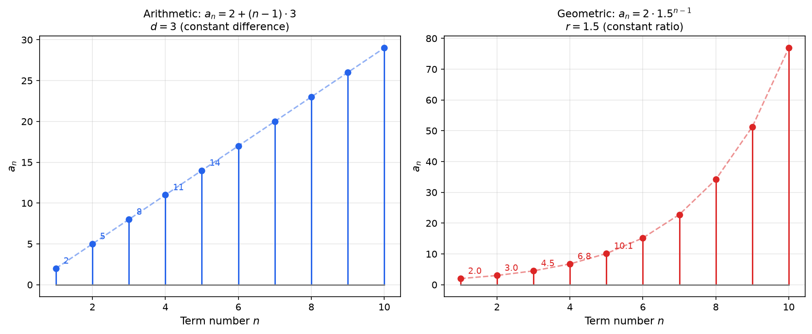
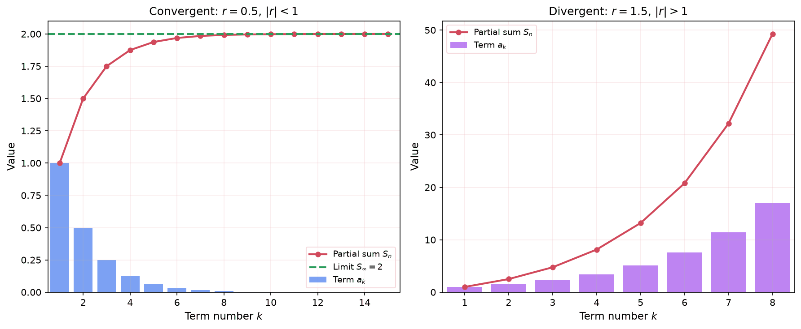

## Why Sequences and Series?

Numbers often follow patterns. Consider these examples:

- $2, 4, 6, 8, 10, \ldots$ (each number is 2 more than the last)
- $1, 2, 4, 8, 16, \ldots$ (each number is double the last)
- $1, 1, 2, 3, 5, 8, \ldots$ (each number is the sum of the two before it)

Recognizing and describing these patterns lets us predict future values, model growth and decay, and solve problems in finance, physics, and computer science.

There are two natural questions we can ask about a list of numbers:

1. **What are the individual terms?** This is a **sequence**: the ordered list itself. For example, the sequence $2, 4, 6, 8, \ldots$ tells us the value at each position.

2. **What is the running total?** This is a **series**: the sum of the terms. For the same numbers, the series $2 + 4 + 6 + 8 = 20$ tells us the accumulated total of the first four terms.

A concrete example: if you save \$100 in January, \$200 in February, \$300 in March, and \$400 in April, then the sequence of monthly savings is $100, 200, 300, 400$ and the series (total saved) is $100 + 200 + 300 + 400 = 1000$.

Studying sequences helps us understand patterns. Studying series helps us compute totals. Together, they also let us reason about infinite processes, such as whether an infinite sum can have a finite value.

## Definitions

**Sequence:** An ordered list of numbers following a pattern or rule. Each number in the sequence is called a **term**. A sequence can be finite or infinite.

**Notation:** A sequence is written as $\{a_n\}$ or $(a_1, a_2, a_3, \ldots)$, where $a_n$ is the **general term** (also called the **nth term formula**) that defines the value at position $n$.

**Series:** The sum of the terms of a sequence. If the sequence is $(a_1, a_2, a_3, \ldots)$, then the corresponding series is $a_1 + a_2 + a_3 + \cdots$.

## Sigma Notation

**Sigma Notation (Summation Notation):** A compact way to express the sum of a sequence of terms using the Greek capital letter sigma ($\Sigma$).

$$
\sum_{k=m}^{n} a_k = a_m + a_{m+1} + a_{m+2} + \cdots + a_n
$$

Where:
- **$k$:** The index of summation (also called the counter variable)
- **$m$:** The lower bound (starting value of $k$)
- **$n$:** The upper bound (ending value of $k$)
- **$a_k$:** The expression being summed

**Examples:**

$$
\sum_{k=1}^{5} k = 1 + 2 + 3 + 4 + 5 = 15
$$

$$
\sum_{k=1}^{4} k^2 = 1 + 4 + 9 + 16 = 30
$$

$$
\sum_{k=0}^{3} 2^k = 1 + 2 + 4 + 8 = 15
$$

**Properties of Sigma Notation:**

**Constant factor:**

$$
\sum_{k=1}^{n} c \cdot a_k = c \sum_{k=1}^{n} a_k
$$

**Sum/Difference:**

$$
\sum_{k=1}^{n} (a_k \pm b_k) = \sum_{k=1}^{n} a_k \pm \sum_{k=1}^{n} b_k
$$

**Constant sum:**

$$
\sum_{k=1}^{n} c = nc
$$

## Arithmetic Sequences

**Arithmetic Sequence:** A sequence where each term is obtained by adding a fixed value, called the **common difference** ($d$), to the previous term.

$$
a_n = a_1 + (n - 1)d
$$

Where:
- **$a_1$:** The first term
- **$d$:** The common difference ($d = a_{n+1} - a_n$ for any consecutive terms)
- **$n$:** The term number

**Identifying:** A sequence is arithmetic if the difference between consecutive terms is constant.

**Example 1:** $2, 5, 8, 11, 14, \ldots$

- Common difference: $d = 5 - 2 = 3$
- General term: $a_n = 2 + (n-1)(3) = 3n - 1$
- 10th term: $a_{10} = 3(10) - 1 = 29$

**Example 2:** $20, 15, 10, 5, 0, -5, \ldots$

- Common difference: $d = 15 - 20 = -5$
- General term: $a_n = 20 + (n-1)(-5) = 25 - 5n$
- 8th term: $a_8 = 25 - 40 = -15$

**Example 3:** Find $d$ and $a_1$ given $a_5 = 17$ and $a_{12} = 45$

From $a_n = a_1 + (n-1)d$:
- $a_5 = a_1 + 4d = 17$
- $a_{12} = a_1 + 11d = 45$

Subtract: $7d = 28$, so $d = 4$

Substitute: $a_1 + 4(4) = 17$, so $a_1 = 1$

General term: $a_n = 1 + (n-1)(4) = 4n - 3$

### Arithmetic Series

**Arithmetic Series:** The sum of the first $n$ terms of an arithmetic sequence.

$$
S_n = \sum_{k=1}^{n} a_k = \frac{n}{2}(a_1 + a_n) = \frac{n}{2}(2a_1 + (n-1)d)
$$

**Intuition:** Pair the first term with the last, the second with the second-to-last, and so on. Each pair sums to $a_1 + a_n$, and there are $n/2$ such pairs.

**Example 1:** Find $\sum_{k=1}^{100} k$ (sum of first 100 natural numbers)

This is an arithmetic sequence with $a_1 = 1$, $a_{100} = 100$, $n = 100$

$$
S_{100} = \frac{100}{2}(1 + 100) = 50 \times 101 = 5050
$$

This is the famous result attributed to Gauss.

**Example 2:** Find the sum $3 + 7 + 11 + 15 + \cdots + 99$

$a_1 = 3$, $d = 4$, $a_n = 99$

Find $n$: $99 = 3 + (n-1)(4)$ gives $n = 25$

$$
S_{25} = \frac{25}{2}(3 + 99) = \frac{25}{2}(102) = 1275
$$

## Geometric Sequences

**Geometric Sequence:** A sequence where each term is obtained by multiplying the previous term by a fixed value, called the **common ratio** ($r$).

$$
a_n = a_1 \cdot r^{n-1}
$$

Where:
- **$a_1$:** The first term
- **$r$:** The common ratio ($r = \frac{a_{n+1}}{a_n}$ for any consecutive terms, $r \neq 0$)
- **$n$:** The term number

**Identifying:** A sequence is geometric if the ratio between consecutive terms is constant.

**Example 1:** $3, 6, 12, 24, 48, \ldots$

- Common ratio: $r = 6/3 = 2$
- General term: $a_n = 3 \cdot 2^{n-1}$
- 8th term: $a_8 = 3 \cdot 2^7 = 3 \cdot 128 = 384$

**Example 2:** $100, 50, 25, 12.5, \ldots$

- Common ratio: $r = 50/100 = 0.5$
- General term: $a_n = 100 \cdot (0.5)^{n-1}$
- 6th term: $a_6 = 100 \cdot (0.5)^5 = 100 \cdot 0.03125 = 3.125$

**Example 3:** $1, -3, 9, -27, 81, \ldots$

- Common ratio: $r = -3/1 = -3$ (alternating signs)
- General term: $a_n = (-3)^{n-1}$

### Geometric Series (Finite)

**Finite Geometric Series:** The sum of the first $n$ terms of a geometric sequence.

$$
S_n = \sum_{k=1}^{n} a_1 r^{k-1} = a_1 \cdot \frac{1 - r^n}{1 - r} \quad (r \neq 1)
$$

**Derivation:** Multiply $S_n$ by $r$ and subtract:

$$
S_n = a_1 + a_1 r + a_1 r^2 + \cdots + a_1 r^{n-1}
$$

$$
rS_n = a_1 r + a_1 r^2 + \cdots + a_1 r^{n-1} + a_1 r^n
$$

Subtract: $S_n - rS_n = a_1 - a_1 r^n$

$$
S_n(1 - r) = a_1(1 - r^n)
$$

$$
S_n = a_1 \cdot \frac{1 - r^n}{1 - r}
$$

**Example:** Find $\sum_{k=0}^{7} 3 \cdot 2^k$

$a_1 = 3$, $r = 2$, $n = 8$ (indices 0 through 7)

$$
S_8 = 3 \cdot \frac{1 - 2^8}{1 - 2} = 3 \cdot \frac{1 - 256}{-1} = 3 \cdot 255 = 765
$$

### Infinite Geometric Series

**Infinite Geometric Series:** The sum of all terms in a geometric sequence, when it converges.

$$
S_\infty = \sum_{k=0}^{\infty} a_1 r^k = \frac{a_1}{1 - r} \quad \text{when } |r| < 1
$$

**Convergence condition:** The series converges (has a finite sum) only when $|r| < 1$. When $|r| \geq 1$, the series diverges (the sum grows without bound).

**Intuition:** When $|r| < 1$, each successive term gets smaller and smaller, contributing less and less to the total. The terms eventually become negligibly small, so the sum approaches a finite value.

**Example 1:** Find $\sum_{k=0}^{\infty} \left(\frac{1}{2}\right)^k = 1 + \frac{1}{2} + \frac{1}{4} + \frac{1}{8} + \cdots$

$a_1 = 1$, $r = \frac{1}{2}$, and $|r| = \frac{1}{2} < 1$ (converges)

$$
S_\infty = \frac{1}{1 - \frac{1}{2}} = \frac{1}{\frac{1}{2}} = 2
$$

**Example 2:** Express the repeating decimal $0.333\ldots$ as a fraction.

$$
0.333\ldots = \frac{3}{10} + \frac{3}{100} + \frac{3}{1000} + \cdots = \sum_{k=1}^{\infty} 3 \cdot \left(\frac{1}{10}\right)^k
$$

$a_1 = \frac{3}{10}$, $r = \frac{1}{10}$

$$
S_\infty = \frac{3/10}{1 - 1/10} = \frac{3/10}{9/10} = \frac{3}{9} = \frac{1}{3}
$$

**Example 3:** $\sum_{k=0}^{\infty} 2^k = 1 + 2 + 4 + 8 + \cdots$ **diverges** because $|r| = 2 > 1$.

## Common Summation Formulas

These closed-form expressions are useful for evaluating sums without adding term by term.

**Sum of first n natural numbers:**

$$
\sum_{k=1}^{n} k = \frac{n(n+1)}{2}
$$

**Sum of first n squares:**

$$
\sum_{k=1}^{n} k^2 = \frac{n(n+1)(2n+1)}{6}
$$

**Sum of first n cubes:**

$$
\sum_{k=1}^{n} k^3 = \left(\frac{n(n+1)}{2}\right)^2
$$

Note that the sum of cubes equals the square of the sum of the first $n$ natural numbers.

## Recursive vs Explicit Definitions

A sequence can be defined in two ways:

**Explicit (Closed-Form):** Gives $a_n$ directly as a function of $n$.

$$
a_n = 3n + 1 \quad \Rightarrow \quad 4, 7, 10, 13, \ldots
$$

**Recursive:** Defines each term using previous term(s) plus initial condition(s).

$$
a_1 = 4, \quad a_n = a_{n-1} + 3 \quad \Rightarrow \quad 4, 7, 10, 13, \ldots
$$

Both produce the same sequence, but explicit definitions are faster for computing any single term (you can jump directly to $a_{1000}$), while recursive definitions sometimes capture the pattern more naturally.

**Famous Recursive Sequence: Fibonacci**

$$
F_1 = 1, \quad F_2 = 1, \quad F_n = F_{n-1} + F_{n-2}
$$

$$
1, 1, 2, 3, 5, 8, 13, 21, 34, 55, \ldots
$$

Each term is the sum of the two preceding terms. The Fibonacci sequence appears in nature (sunflower seed patterns, tree branching), computer science (algorithm analysis), and the ratio of consecutive terms approaches the golden ratio $\phi = \frac{1 + \sqrt{5}}{2} \approx 1.618$.

## Where It Shows Up

- **Computer science:** Algorithm complexity often involves sums (loop iterations, divide-and-conquer recurrences). Geometric series appear in the analysis of algorithms that halve their input at each step (binary search, merge sort).
- **Machine learning:** Learning rate schedules often use geometric decay ($\alpha_t = \alpha_0 \cdot r^t$). Gradient descent convergence analysis uses series.
- **Finance:** Compound interest, annuities, and present value calculations are geometric series applications.
- **Signal processing:** Fourier series decompose signals into sums of sinusoidal components. Digital filters use geometric series for their transfer functions.
- **Physics:** Many physical quantities are modeled as series (Taylor series for approximations, power series solutions to differential equations).
