Sets are the most fundamental building block in all of mathematics: a **set** is simply a collection of distinct objects. We need formal set theory because mathematics requires a precise language for talking about collections, membership, and relationships between groups of objects. Nearly everything else in math, including numbers, functions, sequences, and probability, is built on the concept of a set. Understanding sets first makes every other topic easier to reason about.

**Set Theory:** Set theory is the branch of mathematical logic that
studies Sets, which can be informally described as collections of
objects.

There are 2 primary branches of set theory:

-   **Naïve Set Theory**: Naive set theory is an informal approach to
    set theory that was developed in the late 19th century before the
    formalization of set theory by mathematicians such as Ernst
    **Zermelo** and **Abraham Fraenkel**. The term "naive"
    distinguishes it from more rigorous, formalized versions of set
    theory, like **Zermelo-Fraenkel** set theory (ZF), which are used to
    avoid certain paradoxes that arise in naive set theory.

-   **Axiomatic Set Theory**: To resolve the issues of naive set theory,
    mathematicians developed more rigorous frameworks for set theory.
    The most widely accepted is **Zermelo-Fraenkel** set theory (ZF),
    often extended with the **Axiom of Choice (ZFC).** These systems use
    axioms to carefully define the properties of sets and restrict the
    kinds of sets that can be formed, thereby avoiding the paradoxes
    inherent in naive set theory.

## Set

**Set:** A set is a collection of "*things*." These ***things*** are
called elements of the set.

Elements are normally written with lower case letters and sets are
normally written with upper case letters.

We write $a \in A$ for "a is an element of a set A", and $a \notin A$,
for "a is not an element of a set A".

$\emptyset$ or $\{\}$ denotes the empty set, which contains no element.

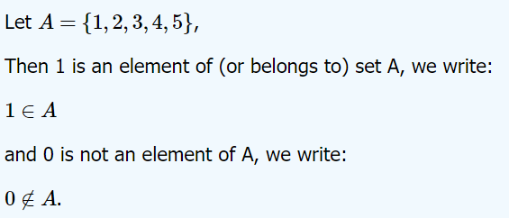

**Set elements are unique.** An element is either in the set or not in
the set. It makes no sense to say that an element is in the set
multiple times. It may be listed multiple times, but this is
extraneous.

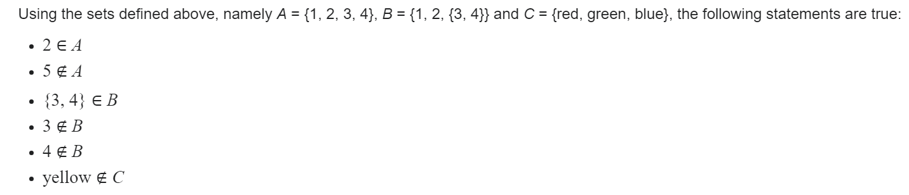

## Roster Notation

Roster notation (also known as **enumeration notation**) involves
explicitly listing out all the elements of the set within curly braces.

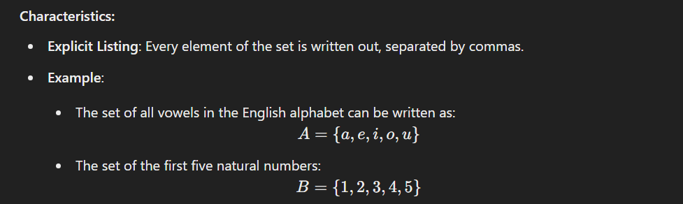

## Set-Builder Notation

**Set-Builder Notation:** Set-builder notation describes the elements of a set by specifying a
property or condition that the elements of the set satisfy, rather than
listing them out.

**General Form:** $\{x \mid P(x)\}$ or $\{x : P(x)\}$

Read as "the set of all x such that P(x) is true"

**Examples:**

- $\{x \mid x > 0\}$ = the set of all positive numbers
- $\{x \in \mathbb{Z} \mid x \text{ is even}\}$ = the set of all even integers
- $\{x^2 \mid x \in \mathbb{N}\}$ = {0, 1, 4, 9, 16, 25, ...} (perfect squares)
- $\{x \in \mathbb{R} \mid x^2 < 4\}$ = $(-2, 2)$ (interval notation)

## Empty Set

The empty set, denoted $\emptyset$ or $\{\}$, is a set
with no members at all.

Although the empty set has no members, it can be a member of other sets.
Thus $\emptyset \neq \{\emptyset\}$

## Subset

**Subset:** A is a subset of B, (denoted $A \subseteq B$), if every element of A is also an element of B.

**Formal Definition:** $A \subseteq B \iff \forall x\, (x \in A \to x \in B)$

If A is not a subset of B, we write $A \not\subseteq B$.

**Examples:**

- $\{1, 2\} \subseteq \{1, 2, 3, 4\}$ (every element of $\{1, 2\}$ is in $\{1, 2, 3, 4\}$)
- $\{a, b\} \subseteq \{a, b, c\}$
- $\emptyset \subseteq A$ for any set $A$ (the empty set is a subset of every set)
- $A \subseteq A$ for any set $A$ (every set is a subset of itself)
- $\{1, 2, 3\} \not\subseteq \{1, 2\}$ (3 is in the first set but not the second)

**Key Property:** Every set is a subset of itself (reflexive property).

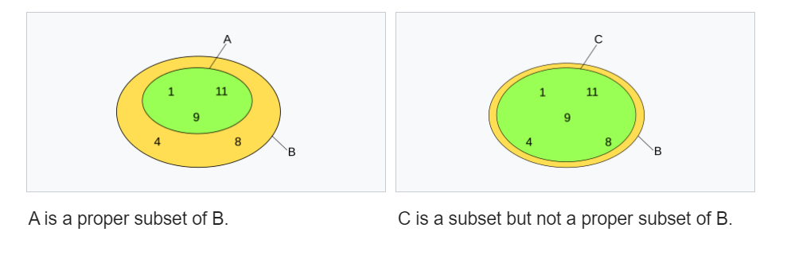

## Set Equality

Two sets are **equal** iff they have the **same members**. Formally
**(Axiom of Extensionality):**

$$
A = B  \Longleftrightarrow  \forall x (x \in A  \Longleftrightarrow  x \in B)
$$

Equivalently (very handy in proofs):

$A = B \iff (A \subseteq B) \land (B \subseteq A)$

**Examples:**

- $\{1, 2, 3\} = \{3, 2, 1\}$ (order doesn't matter)
- $\{1, 2, 2, 3\} = \{1, 2, 3\}$ (duplicates don't matter)
- $\{a, b\} = \{b, a\}$
- $\{1, 2, 3\} \neq \{1, 2\}$ (different elements)
- $\{1, 2\} \neq \{1, 2, 3\}$ (one has an extra element)
- $\emptyset = \{\}$ (two notations for the same empty set)

**Key Properties:**
- Sets with the same elements are equal, regardless of order
- Repetition of elements doesn't affect equality
- For equality, every element of A must be in B, and every element of B must be in A


**How to prove sets** $\mathbf{A = B}\mathbf{ }$**in practice:**

1.  **Show** $A \subseteq B$**:** take an arbitrary $x \in A$, prove
    $x \in B$.

2.  **Show** $B \subseteq A$**:** take an arbitrary $x \in B$, prove
    $x \in A$.\
    Done: by double containment.

**Common proof pattern (template)**

To show $A = B$: let $x$ be arbitrary

-   If $x \in A$, then ... hence $x \in B$

-   If $x \in B$, then ... hence $x \in A$

> Therefore $A = B$


**Example Proof:**

Prove $\{x \in \mathbb{Z} \mid x \text{ is even}\} = \{2n \mid n \in \mathbb{Z}\}$

Let $A = \{x \in \mathbb{Z} \mid x \text{ is even}\}$ and $B = \{2n \mid n \in \mathbb{Z}\}$

**Show $A \subseteq B$:** Let $x \in A$. Then $x$ is even, so $x = 2k$ for some $k \in \mathbb{Z}$. Therefore $x \in B$.

**Show $B \subseteq A$:** Let $x \in B$. Then $x = 2n$ for some $n \in \mathbb{Z}$. By definition, $x$ is even, so $x \in A$.

Therefore A = B.

### Proof Techniques for Sets

The double-containment method above is the most common way to prove set equalities, but there are several standard proof patterns worth knowing.

**Proving $A \subseteq B$:** Take an arbitrary element $x \in A$ and show, using definitions and logical steps, that $x \in B$.

**Proving $A = B$:** Show both $A \subseteq B$ and $B \subseteq A$ (double containment). This is the standard approach for set equalities.

**Proving $A \cap B = C$:** Use double containment. Show every element of $A \cap B$ is in $C$, and every element of $C$ is in $A \cap B$.

**Two styles of proof for set identities:**

1. **Element-chasing:** Start with an arbitrary element of one side, and show it belongs to the other side. This is the most rigorous method.
2. **Algebraic laws:** Use known set identities (commutative, associative, distributive, De Morgan's, etc.) to transform one side into the other. This is shorter but relies on previously established identities.

**Worked Example (Element-Chasing):**

Prove that $A \cap (B \cup C) = (A \cap B) \cup (A \cap C)$ (distributive law).

**Show $A \cap (B \cup C) \subseteq (A \cap B) \cup (A \cap C)$:**

Let $x \in A \cap (B \cup C)$. Then $x \in A$ and $x \in B \cup C$.

Since $x \in B \cup C$, either $x \in B$ or $x \in C$ (or both).

- If $x \in B$: then $x \in A$ and $x \in B$, so $x \in A \cap B$, hence $x \in (A \cap B) \cup (A \cap C)$.
- If $x \in C$: then $x \in A$ and $x \in C$, so $x \in A \cap C$, hence $x \in (A \cap B) \cup (A \cap C)$.

In either case, $x \in (A \cap B) \cup (A \cap C)$. $\checkmark$

**Show $(A \cap B) \cup (A \cap C) \subseteq A \cap (B \cup C)$:**

Let $x \in (A \cap B) \cup (A \cap C)$. Then $x \in A \cap B$ or $x \in A \cap C$.

- If $x \in A \cap B$: then $x \in A$ and $x \in B$. Since $x \in B$, we have $x \in B \cup C$. So $x \in A \cap (B \cup C)$.
- If $x \in A \cap C$: then $x \in A$ and $x \in C$. Since $x \in C$, we have $x \in B \cup C$. So $x \in A \cap (B \cup C)$.

In either case, $x \in A \cap (B \cup C)$. $\checkmark$

By double containment, $A \cap (B \cup C) = (A \cap B) \cup (A \cap C)$. $\blacksquare$

## Pigeonhole Principle (PHP)

If $m$ objects (pigeons) are placed into $n$ containers (holes) with
$m > n$, then at least one container holds **two or more** objects.

**Proof (counting).**\
Assume every container holds at most one object. Then there are at most
$n$ objects total. But $m > n$.

Contradiction. ∎

**Theorem (Generalized PHP).**

Placing $m$ objects into $n$ containers guarantees some container has
at least:

$$
\lceil\frac{m}{n}\rceil
$$

objects.

*Average view.* The average load is $m/n$. Some load is $\geq$the
average, thus $\geq \lceil m/n\rceil$.

## Cardinality

**Cardinality:** Let A be a set. then the number of elements in the set
A is called **cardinality** of the set A, and is denoted by **\|A\|**

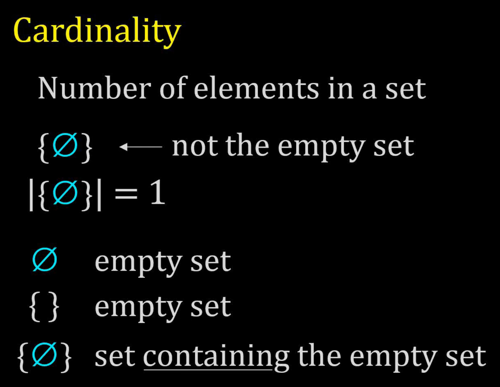

### Finite vs. Infinite Sets

**Core definitions**

**Set equality (Extensionality):**

$$
A = B  \Longleftrightarrow  \forall x\,(x \in A \leftrightarrow x \in B)
$$

**Subset:**

$A \subseteq B  \Longleftrightarrow  \forall x\text{ }(x \in A \Rightarrow x \in B)$.

**Proper subset**:

$$
A \subsetneq B
$$

**Functions and size (cardinality)**

**Injection (one-to-one):**

$f:A \rightarrow B$ with $x \neq y \Rightarrow f(x) \neq f(y)$

**Surjection (onto):**

$$
\forall b \in B,\, \exists a \in A: f(a) = b
$$

**Bijection:**

both injective & surjective; write $A \cong B$ or
$\mid A \mid = \mid B \mid$

**Size comparisons (all sets):**

**Cardinality Ordering:**

- $|A| \leq |B|$ iff there exists an **injection** $A \rightarrow B$
  - Intuition: A is "no larger than" B if we can inject A into B without collisions
  - Example: $|\{1, 2\}| \leq |\{a, b, c\}|$ (we can map $1 \mapsto a$, $2 \mapsto b$)

- $|A| \geq |B|$ iff there exists an **injection** $B \rightarrow A$ (equivalently, a surjection $A \rightarrow B$)
  - Intuition: A is "at least as large as" B
  - Surjection equivalence: If we can map A onto B (covering all of B), then $|A| \geq |B|$

- $|A| = |B|$ iff there exists a **bijection** $A \cong B$
  - Intuition: A and B have the same size (one-to-one correspondence)
  - Notation: $A \cong B$ or $|A| = |B|$

**Schröder-Bernstein Theorem:**

If injections exist both ways ($A \hookrightarrow B$ and $B \hookrightarrow A$), then a bijection exists ($A \cong B$).

**Formal Statement:** If $|A| \leq |B|$ and $|B| \leq |A|$, then $|A| = |B|$.

**Why It's Important:** This theorem allows proving two sets have the same cardinality without explicitly constructing a bijection. You only need to find injections in both directions.

**Example:**

Show that $[0, 1]$ and $[0, 2]$ have the same cardinality.

- Injection $f: [0, 1] \rightarrow [0, 2]$ via $f(x) = 2x$ ✓
- Injection $g: [0, 2] \rightarrow [0, 1]$ via $g(x) = x/2$ ✓
- By Schröder-Bernstein, $|[0, 1]| = |[0, 2]|$

(The explicit bijection is $f(x) = 2x$, but Schröder-Bernstein proves existence without requiring we find it.)

#### Finite Set

**Definition (cardinal):**

A set $S$ is **finite** if $S \cong \{ 0,1,\ldots,n - 1\}$ for some
$n \in \mathbb{N}$; ($\cong$ is bijection symbol)

$\mid S \mid = n$.

#### Infinite Set

**Definition:**

A set $S$ is **infinite** if it is not finite. That is, there is no natural number $n$ such that $S$ can be bijected with $\{0, 1, \ldots, n-1\}$.

Equivalently, a set is infinite if there exists a bijection between the set and a proper subset of itself.

**Examples:**

- $\mathbb{N}$ (natural numbers) is infinite
- $\mathbb{Z}$ (integers) is infinite
- $\mathbb{Q}$ (rational numbers) is infinite
- $\mathbb{R}$ (real numbers) is infinite
- $(0, 1)$ (open interval) is infinite

**Countably Infinite:** An infinite set that can be put in one-to-one correspondence with the natural numbers $\mathbb{N}$.

Examples: $\mathbb{N}$, $\mathbb{Z}$, $\mathbb{Q}$

**Uncountably Infinite:** An infinite set that cannot be put in one-to-one correspondence with the natural numbers.

Example: $\mathbb{R}$ (proven by Cantor's diagonal argument)

These sizes form a strict hierarchy, $|\mathbb{N}| < |\mathbb{R}| < |\mathcal{P}(\mathbb{R})| < \cdots$, developed in full under [Countable vs Uncountable Sets](#hierarchy-of-infinities) below.

## Universal Set

The universal set is a fundamental concept in set theory, which refers
to the set that contains all the objects or elements under consideration
for a particular discussion or problem. In other words, the universal
set is the "superset" of all the sets involved in a specific context.

The universal set, often denoted by 𝑈, is the set that includes every
element that is being considered in a given discussion or problem
domain. All other sets in that context are subsets of the universal set.

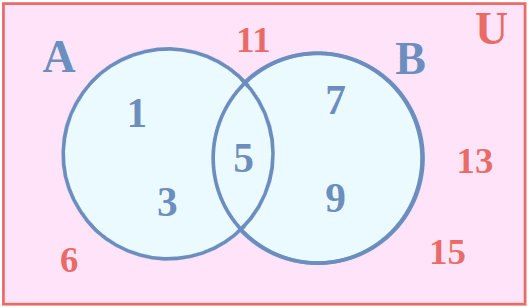

**Special Considerations:**

The Concept of an **Absolute Universal Set**:

In some discussions, the idea of an "absolute" universal
set (containing all possible sets) leads to paradoxes, such as
Russell's Paradox. To avoid these issues, most modern set theories,
like Zermelo-Fraenkel set theory, do not include an absolute universal
set.

**Instead, the universal set is always defined relative to a particular
context or domain of discourse.**

## Set Operations

**Set Operations**

### Set Union

**Set Union:** The union of two sets A and B is the set of elements
which are in **A** or **B** (or both).

$\forall x\, (x \in (A \cup B) \leftrightarrow (x \in A \lor x \in B))$

**Example:** If $A = \{1, 2, 3\}$ and $B = \{3, 4, 5\}$, then $A \cup B = \{1, 2, 3, 4, 5\}$

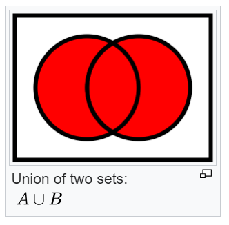

### Set Intersection

**Set Intersection:** The intersection of two sets A and B is the set of elements which are in both **A** and **B**.

$\forall x\, (x \in (A \cap B) \leftrightarrow (x \in A \land x \in B))$

**Example:** If $A = \{1, 2, 3\}$ and $B = \{3, 4, 5\}$, then $A \cap B = \{3\}$

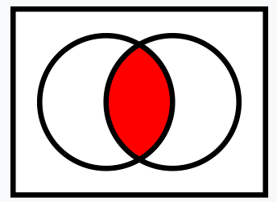

### Set Complement

#### Absolute Complement

**Absolute Complement:** The complement of a set is the set of all
elements from the domain of discourse which are NOT in A.

$\forall x\, (x \in A' \leftrightarrow (x \in U \land x \notin A))$

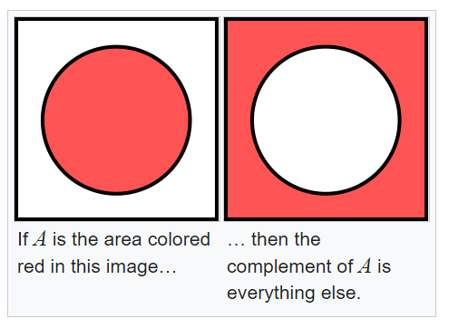

### Symmetric Difference

**Symmetric Difference:** The symmetric difference of sets $A$ and $B$, denoted $A \triangle B$ or $A \oplus B$, is the set of elements in either $A$ or $B$ but not in both.

**Definition:** $A \triangle B = (A \cup B) \setminus (A \cap B) = (A \setminus B) \cup (B \setminus A)$

**Logical form:** $\forall x\, (x \in (A \triangle B) \leftrightarrow (x \in A \oplus x \in B))$

Where $\oplus$ is exclusive OR (XOR).

**Example:** If $A = \{1, 2, 3\}$ and $B = \{3, 4, 5\}$, then:
- $A \triangle B = \{1, 2, 4, 5\}$

**Properties:**
- **Commutative:** $A \triangle B = B \triangle A$
- **Associative:** $(A \triangle B) \triangle C = A \triangle (B \triangle C)$
- **Identity:** $A \triangle \emptyset = A$
- **Self-inverse:** $A \triangle A = \emptyset$
- **Distributive over intersection:** $A \cap (B \triangle C) = (A \cap B) \triangle (A \cap C)$

**Application:** XOR operation in computer science, symmetric encryption

### Set Difference

**Set Difference:** The set difference of $A$ and $B$, written $A \setminus B$ (also written $A - B$), is the set of all elements that belong to $A$ but not to $B$.

$$
A \setminus B = \{x : x \in A \text{ and } x \notin B\}
$$

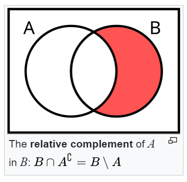

The set difference is not the same as the complement unless $B$ is the universal set. In general, $A \setminus B$ only removes elements of $B$ from $A$, whereas the complement $A'$ (or $A^c$) removes all elements of $A$ from the entire universal set.

**Relationship to complement and intersection:**

$$
A \setminus B = A \cap B^c
$$

This identity says: the elements in $A$ but not in $B$ are exactly the elements in $A$ that also belong to the complement of $B$.

**Properties:**

- $A \setminus A = \emptyset$
- $A \setminus \emptyset = A$
- $\emptyset \setminus A = \emptyset$
- $A \setminus B \neq B \setminus A$ in general (set difference is not commutative)
- $A \setminus (B \cup C) = (A \setminus B) \cap (A \setminus C)$
- $A \setminus (B \cap C) = (A \setminus B) \cup (A \setminus C)$

**Worked Example:**

Let $A = \{1, 2, 3, 4, 5\}$ and $B = \{3, 4, 5, 6, 7\}$.

$$
A \setminus B = \{1, 2\}
$$

$$
B \setminus A = \{6, 7\}
$$

Notice that $A \setminus B \neq B \setminus A$. Also observe that $A \triangle B = (A \setminus B) \cup (B \setminus A) = \{1, 2, 6, 7\}$.

## Russell's Paradox

**Russell's Paradox:** A fundamental paradox in naive set theory discovered by Bertrand Russell in 1901. It demonstrates that unrestricted set comprehension (forming sets from any property) leads to contradiction.

**The Paradox:**

Consider the set R defined as:

$R = \{x \mid x \text{ is a set and } x \notin x\}$

In words: "R is the set of all sets that do not contain themselves as members."

**The Question:** Does R contain itself? Is $R \in R$?

**Case 1:** Suppose $R \in R$ (R contains itself)
- By definition of R, if $R \in R$, then R must satisfy the condition "$x \notin x$"
- This means $R \notin R$ (R does not contain itself)
- **Contradiction:** R both contains and doesn't contain itself

**Case 2:** Suppose $R \notin R$ (R does not contain itself)
- Then R satisfies the condition for membership in R (being a set that doesn't contain itself)
- Therefore $R \in R$ (R must be in R by definition)
- **Contradiction:** R both doesn't contain and does contain itself

**Either way, we get a contradiction.**

**Why It Matters:**

Russell's Paradox exposed a fatal flaw in naive set theory, which allowed forming sets from any property. The paradox shows that not every property defines a valid set.

**Example - The Barber Paradox (Informal Version):**

A barber in a village shaves all and only those men who do not shave themselves. Does the barber shave himself?

- If he shaves himself, then he's someone who shaves himself, so he shouldn't shave himself
- If he doesn't shave himself, then he's someone who doesn't shave himself, so he should shave himself

**Modern Resolution:**

Modern axiomatic set theories (like Zermelo-Fraenkel set theory) avoid Russell's Paradox by:

1. **Restricting set formation:** Not every property defines a set
2. **Axiom of Separation:** You can only form subsets of existing sets, not arbitrary collections
3. **No universal set:** There is no "set of all sets"

**Historical Impact:**

- Led to the development of axiomatic set theory
- Showed that mathematical foundations needed rigorous axiomatization
- Influenced the formalist movement in mathematics

## Power Set

**Power Set:** The power set of a set **A**, denoted $\mathcal{P}(A)$ or $2^A$, is the set of all subsets of **A**, including the empty set and **A** itself.

**Definition:** $\mathcal{P}(A) = \{S \mid S \subseteq A\}$

**Example 1:** If A = {1, 2}, then:

$\mathcal{P}(A) = \{\varnothing, \{1\}, \{2\}, \{1, 2\}\}$

**Example 2:** If A = {a, b, c}, then:

$\mathcal{P}(A) = \{\varnothing, \{a\}, \{b\}, \{c\}, \{a,b\}, \{a,c\}, \{b,c\}, \{a,b,c\}\}$

**Cardinality:** If $|A| = n$, then $|\mathcal{P}(A)| = 2^n$

This is why the power set is sometimes written as $2^A$.

**Examples:**
- $|\mathcal{P}(\varnothing)| = 2^0 = 1$ (only the empty set itself)
- $|\mathcal{P}(\{a\})| = 2^1 = 2$ (empty set and {a})
- $|\mathcal{P}(\{a, b\})| = 2^2 = 4$
- $|\mathcal{P}(\{a, b, c\})| = 2^3 = 8$

## Disjoint Sets

**Disjoint Sets:** Two sets **A** and **B** are disjoint if they have no elements in common.

**Definition:** $A \cap B = \varnothing$

**Example:** {1, 2, 3} and {4, 5, 6} are disjoint.

**Pairwise Disjoint:** A collection of sets $\{A_1, A_2, \ldots, A_n\}$ is pairwise disjoint if every pair of distinct sets in the collection is disjoint.

Formally: $\forall i, j : i \neq j \Rightarrow A_i \cap A_j = \varnothing$

**Example:** {1, 2}, {3, 4}, {5, 6} are pairwise disjoint.

## Partition of a Set

**Partition:** A partition of a set **A** is a collection of non-empty, pairwise disjoint subsets of **A** whose union is **A**.

**Definition:** A collection $\{A_1, A_2, \ldots, A_n\}$ is a partition of **A** if:

1. Each $A_i$ is non-empty: $A_i \neq \varnothing$
2. The sets are pairwise disjoint: $A_i \cap A_j = \varnothing$ for $i \neq j$
3. Their union is **A**: $A_1 \cup A_2 \cup \cdots \cup A_n = A$

**Example:** The sets {1, 2}, {3, 4}, {5, 6} form a partition of {1, 2, 3, 4, 5, 6}.

**Connection to Equivalence Relations:**

Every equivalence relation on a set **A** induces a partition of **A** (the equivalence classes), and every partition of **A** induces an equivalence relation on **A**.

## Countable vs Uncountable Sets

**Countable Set:** A set is countable if its elements can be put in one-to-one correspondence with the natural numbers $\mathbb{N} = \{0, 1, 2, 3, \ldots\}$, or if it is finite.

**Definition (Formal):** A set S is countable if there exists an injection $f: S \to \mathbb{N}$, or equivalently, if there exists a surjection $g: \mathbb{N} \to S$.

**Two Types of Countable:**

1. **Finite:** Sets with a specific number of elements (can be counted to completion)
2. **Countably Infinite:** Infinite sets that can be put in one-to-one correspondence with $\mathbb{N}$

**Examples of Countably Infinite Sets:**

**Natural Numbers** $\mathbb{N}$: $\{0, 1, 2, 3, \ldots\}$
- Trivially countable (the definition uses $\mathbb{N}$ itself)

**Integers** $\mathbb{Z}$: $\{\ldots, -2, -1, 0, 1, 2, \ldots\}$
- Bijection: $0 \mapsto 0,\; 1 \mapsto -1,\; 2 \mapsto 1,\; 3 \mapsto -2,\; 4 \mapsto 2, \ldots$
- Pattern: $f(2n) = n,\; f(2n+1) = -(n+1)$

**Even Numbers:** $\{0, 2, 4, 6, \ldots\}$
- Bijection: $n \mapsto 2n$

**Rational Numbers** $\mathbb{Q}$: All fractions $p/q$ where $p, q \in \mathbb{Z}$ and $q \neq 0$
- Surprising but true! Can be listed using Cantor's diagonal enumeration
- List all fractions in a grid and traverse diagonally, skipping duplicates

**Algebraic Numbers:** Solutions to polynomial equations with integer coefficients
- Countable because polynomials can be enumerated

**Why $\mathbb{Q}$ is Countable (Cantor's Enumeration):**

List all positive rationals in a grid:

```
1/1  1/2  1/3  1/4  1/5  ...
2/1  2/2  2/3  2/4  2/5  ...
3/1  3/2  3/3  3/4  3/5  ...
4/1  4/2  4/3  4/4  4/5  ...
...
```

Traverse diagonally: 1/1, 2/1, 1/2, 1/3, 2/2, 3/1, 4/1, 3/2, 2/3, 1/4, ...

Skipping duplicates (like 2/2 = 1/1) gives a bijection $\mathbb{N} \to \mathbb{Q}^+$ with the **positive** rationals, so $\mathbb{Q}^+$ is countable. To extend this to all of $\mathbb{Q}$, interleave $0$ and the negatives: list $0$ first, then alternate each positive rational with its negative ($q_1, -q_1, q_2, -q_2, \ldots$). This produces a bijection $\mathbb{N} \to \mathbb{Q}$, proving all of $\mathbb{Q}$ is countable.

**Uncountable Set:** A set that is not countable. It cannot be put in one-to-one correspondence with $\mathbb{N}$.

**Examples of Uncountable Sets:**

**Real Numbers** $\mathbb{R}$: All points on the number line
- Proven uncountable by Cantor's diagonal argument (see below)
- Even the interval (0, 1) is uncountable

**Irrational Numbers:** $\mathbb{R} \setminus \mathbb{Q}$
- Since $\mathbb{R}$ is uncountable and $\mathbb{Q}$ is countable, the irrationals must be uncountable

**Transcendental Numbers:** Real numbers that are not algebraic (like π, e)
- Uncountable (most real numbers are transcendental)

**Power Set of $\mathbb{N}$:** $\mathcal{P}(\mathbb{N})$ = all subsets of $\mathbb{N}$
- Uncountable by Cantor's theorem

**Real Interval [0, 1]:** All real numbers between 0 and 1 inclusive
- Same cardinality as all of $\mathbb{R}$ (bijection exists)

**Cantor's Diagonal Argument (Proof that $\mathbb{R}$ is Uncountable):**

**Theorem:** The real numbers in the interval (0, 1) are uncountable.

**Proof (by contradiction):**

1. Assume (0, 1) is countable
2. Then we can list all real numbers in (0, 1) as r₁, r₂, r₃, ... in decimal form:

```
r₁ = 0.a₁₁ a₁₂ a₁₃ a₁₄ ...
r₂ = 0.a₂₁ a₂₂ a₂₃ a₂₄ ...
r₃ = 0.a₃₁ a₃₂ a₃₃ a₃₄ ...
r₄ = 0.a₄₁ a₄₂ a₄₃ a₄₄ ...
...
```

3. Construct a new number d = 0.d₁d₂d₃d₄... where:
   - d₁ ≠ a₁₁ (differs from r₁ in the 1st decimal place)
   - d₂ ≠ a₂₂ (differs from r₂ in the 2nd decimal place)
   - d₃ ≠ a₃₃ (differs from r₃ in the 3rd decimal place)
   - dₙ ≠ aₙₙ (differs from rₙ in the nth decimal place)

4. The number d is in (0, 1) but differs from every rₙ in at least one decimal place
5. Therefore d is not in our "complete" list
6. **Contradiction:** Our list was supposed to contain all real numbers in (0, 1)
7. Therefore (0, 1) cannot be countable

### Hierarchy of Infinities

Not all infinities are equal. There is a strict hierarchy:

$|\mathbb{N}| = |\mathbb{Z}| = |\mathbb{Q}| < |\mathbb{R}| < |\mathcal{P}(\mathbb{R})| < |\mathcal{P}(\mathcal{P}(\mathbb{R}))| < \cdots$

Where:
- $|\mathbb{N}|$ is denoted $\aleph_0$ (aleph-null), the smallest infinite cardinality
- $|\mathbb{R}|$ is denoted $\mathfrak{c}$ (the cardinality of the continuum)
- Each power set has strictly greater cardinality than the original set

**Key Properties:**

1. **Closure:** The union of countably many countable sets is countable
2. **Cartesian Product:** $\mathbb{N} \times \mathbb{N}$ is countable (can be enumerated diagonally)
3. **Subsets:** Any subset of a countable set is countable
4. **Complements:** If A is countable and B is uncountable, then B - A is uncountable

**Why This Matters:**

- Shows there are different "sizes" of infinity
- Establishes that most real numbers are transcendental (algebraic numbers are countable, reals are uncountable)
- Foundational for measure theory, probability, and real analysis
- Demonstrates limits of enumeration and computation

## Cantor's Theorem

**Cantor's Theorem:** For any set $A$, the power set $\mathcal{P}(A)$ has strictly greater cardinality than $A$ itself.

**Statement:** $|A| < |\mathcal{P}(A)|$ for all sets $A$.

**Why It's Fundamental:**

Cantor's theorem proves there is no "largest" infinity. Starting from any infinite set, you can always construct a larger one by taking its power set:

$|\mathbb{N}| < |\mathcal{P}(\mathbb{N})| < |\mathcal{P}(\mathcal{P}(\mathbb{N}))| < |\mathcal{P}(\mathcal{P}(\mathcal{P}(\mathbb{N})))| < \cdots$

This creates an infinite hierarchy of infinities, each strictly larger than the previous.

**Proof (by contradiction):**

We'll prove no bijection $f: A \to \mathcal{P}(A)$ can exist.

**Step 1:** Assume $f: A \to \mathcal{P}(A)$ is a bijection (onto and one-to-one)

**Step 2:** Define the "diagonal" set D:

$D = \{x \in A \mid x \notin f(x)\}$

In words: D contains all elements of A that are not members of their own image under f.

**Step 3:** Since f is onto (surjective), D must be in the range of f. So there exists some $d \in A$ such that $f(d) = D$.

**Step 4:** Ask: Is $d \in D$?

**Case 1:** Suppose $d \in D$
- By definition of D, this means $d \notin f(d)$
- But $f(d) = D$
- So $d \notin D$
- **Contradiction**

**Case 2:** Suppose $d \notin D$
- Then $d$ does not satisfy the condition for membership in D
- So it's not true that $d \notin f(d)$
- Therefore $d \in f(d)$
- But $f(d) = D$
- So $d \in D$
- **Contradiction**

**Step 5:** Either way we get a contradiction. Therefore our assumption that f is a bijection must be false.

**Conclusion:** No bijection $A \to \mathcal{P}(A)$ exists, so $|A| < |\mathcal{P}(A)|$. $\blacksquare$

**Why the Diagonal Method Works:**

The set $D$ is constructed to "diagonalize" against $f$: for every element $a \in A$, $D$ differs from $f(a)$ on the membership of $a$ itself. This ensures $D$ cannot equal $f(a)$ for any $a$.

This is the same technique used in Cantor's diagonal argument for uncountability of $\mathbb{R}$.

**Applications:**

1. **Infinite Hierarchy:** Proves there are infinitely many sizes of infinity
2. **Uncomputability:** Related to the halting problem (diagonalization shows some functions are uncomputable)
3. **Foundations:** Shows naive set theory leads to Russell's paradox (the "set of all sets" would violate Cantor's theorem)

**Example (Finite Case):**

Let A = {1, 2}
- |A| = 2
- $\mathcal{P}(A) = \{\emptyset, \{1\}, \{2\}, \{1,2\}\}$
- $|\mathcal{P}(A)| = 4 = 2^2$

Indeed, $2 < 4$, confirming $|A| < |\mathcal{P}(A)|$.

**General Formula (Finite Sets):**

If $|A| = n$, then $|\mathcal{P}(A)| = 2^n$.

For infinite sets, this generalizes: if $|A| = \kappa$, then $|\mathcal{P}(A)| = 2^\kappa$ (using cardinal exponentiation).

## Axiom of Choice and Zorn's Lemma

**Axiom of Choice (AC):** Given any collection of non-empty sets, there exists a function that selects exactly one element from each set. Formally, if $\{A_i\}_{i \in I}$ is a family of non-empty sets, then there exists a function $f: I \to \bigcup_{i \in I} A_i$ such that $f(i) \in A_i$ for every $i \in I$.

This sounds obvious for finite collections (just pick one from each), but for infinite collections there is no constructive procedure that guarantees a choice. The Axiom of Choice is independent of the other axioms of Zermelo-Fraenkel set theory (ZF): it can be neither proved nor disproved from them. When ZF is combined with AC, the resulting system is called ZFC.

**Why AC is controversial:** It implies the existence of objects that cannot be explicitly constructed. Two notable consequences:

- **Non-measurable sets:** There exist subsets of $\mathbb{R}$ that cannot be assigned a consistent "length" (Lebesgue measure). These sets exist only because of AC.
- **Banach-Tarski Paradox:** A solid ball in $\mathbb{R}^3$ can be decomposed into finitely many pieces and reassembled (using only rotations and translations) into two balls identical to the original. The "pieces" are non-measurable sets whose existence requires AC.

**Zorn's Lemma:** If every chain (totally ordered subset) in a partially ordered set $P$ has an upper bound in $P$, then $P$ has at least one maximal element.

Zorn's Lemma is equivalent to the Axiom of Choice: assuming either one, you can prove the other. It is often easier to apply in practice than AC itself.

**Where these show up:**

- Every vector space has a basis (requires AC/Zorn's Lemma for infinite-dimensional spaces)
- Every ring with unity has a maximal ideal (Zorn's Lemma)
- Tychonoff's theorem: any product of compact spaces is compact (equivalent to AC)

## Set Operation Properties

### Commutative Laws

$$
A \cup B = B \cup A
$$
$$
A \cap B = B \cap A
$$

### Associative Laws

$$
A \cup (B \cup C) = (A \cup B) \cup C
$$
$$
A \cap (B \cap C) = (A \cap B) \cap C
$$

### Distributive Laws

$$
A \cup (B \cap C) = (A \cup B) \cap (A \cup C)
$$
$$
A \cap (B \cup C) = (A \cap B) \cup (A \cap C)
$$

### Identity Laws

$$
A \cup \varnothing = A
$$
$$
A \cap U = A
$$

Where $U$ is the universal set.

### Complement Laws

$$
A \cup A' = U
$$
$$
A \cap A' = \varnothing
$$
$$
(A')' = A
$$

### De Morgan's Laws

**De Morgan's Laws** relate complements to unions and intersections:

$$
(A \cup B)' = A' \cap B'
$$

The complement of a union is the intersection of the complements.

$$
(A \cap B)' = A' \cup B'
$$

The complement of an intersection is the union of the complements.

**Generalized De Morgan's Laws:** For any collection of sets:

$$
\left(\bigcup_{i} A_i\right)' = \bigcap_{i} A_i'
$$

$$
\left(\bigcap_{i} A_i\right)' = \bigcup_{i} A_i'
$$

**Example:** If $A = \{1, 2, 3\}$ and $B = \{3, 4, 5\}$ with universal set $U = \{1, 2, 3, 4, 5, 6\}$:

- $A \cup B = \{1, 2, 3, 4, 5\}$
- $(A \cup B)' = \{6\}$
- $A' = \{4, 5, 6\}$
- $B' = \{1, 2, 6\}$
- $A' \cap B' = \{6\}$ ✓

### Absorption Laws

$$
A \cup (A \cap B) = A
$$
$$
A \cap (A \cup B) = A
$$

### Domination Laws

$$
A \cup U = U
$$
$$
A \cap \varnothing = \varnothing
$$

### Idempotent Laws

$$
A \cup A = A
$$
$$
A \cap A = A
$$

## Indexed Families of Sets

When working with more than two sets, we often need notation for unions and intersections of many sets at once. An **indexed family** of sets is a collection $\{A_i\}_{i \in I}$, where $I$ is an index set and each $i \in I$ labels a set $A_i$.

For finitely many sets, we write $A_1, A_2, \ldots, A_n$. For infinitely many, we might use $\{A_n\}_{n=1}^{\infty}$ or $\{A_i\}_{i \in I}$ for an arbitrary index set $I$.

**Generalized Union:**

$$
\bigcup_{i \in I} A_i = \{x : x \in A_i \text{ for some } i \in I\}
$$

An element belongs to the generalized union if it belongs to at least one of the sets in the family.

**Generalized Intersection:**

$$
\bigcap_{i \in I} A_i = \{x : x \in A_i \text{ for all } i \in I\}
$$

An element belongs to the generalized intersection if it belongs to every set in the family.

**Example:** Let $A_n = [0, 1/n]$ for $n = 1, 2, 3, \ldots$

- $A_1 = [0, 1]$, $A_2 = [0, 1/2]$, $A_3 = [0, 1/3]$, and so on.
- $\bigcup_{n=1}^{\infty} A_n = [0, 1]$ (the largest interval in the family)
- $\bigcap_{n=1}^{\infty} A_n = \{0\}$ (the only point in every interval, since for any $x > 0$ there exists $n$ large enough that $x > 1/n$)

**Generalized De Morgan's Laws:**

$$
\left(\bigcup_{i \in I} A_i\right)^c = \bigcap_{i \in I} A_i^c
$$

$$
\left(\bigcap_{i \in I} A_i\right)^c = \bigcup_{i \in I} A_i^c
$$

In words: the complement of a union is the intersection of complements, and vice versa. These generalize the two-set De Morgan's laws to arbitrarily many sets.

## Ordered Pairs (Kuratowski's definition)

**Ordered Pair:** An ordered pair with **first coordinate** *a* and **second coordinate** *b*, usually denoted by **(a, b)**, is a mathematical object where **order matters**.

**Notation:** (a, b) or ⟨a, b⟩

**Key Property:** Two ordered pairs are equal if and only if their corresponding coordinates are equal:

$$
(a, b) = (c, d) \Longleftrightarrow a = c \text{ and } b = d
$$

**Why We Need a Formal Definition:**

Unlike sets, where {a, b} = {b, a} (order doesn't matter), ordered pairs must distinguish (a, b) from (b, a).

The naive approach using sets fails:
- {a, b} = {b, a}, so this doesn't capture order
- We need a set-theoretic construction that preserves order

**Kuratowski's Definition:**

The ordered pair (a, b) is formally defined as the set:

$$
(a, b) := \{\{a\}, \{a, b\}\}
$$

**Why This Definition Works:**

This construction encodes the order by:
1. First coordinate appears in a singleton: {a}
2. Both coordinates appear together: {a, b}
3. The singleton {a} uniquely identifies the first coordinate


**Proof That Kuratowski's Definition Works:**

We need to prove: $\{\{a\}, \{a, b\}\} = \{\{c\}, \{c, d\}\} \Longleftrightarrow a = c \text{ and } b = d$

**Forward direction (⇒):**

Assume $\{\{a\}, \{a, b\}\} = \{\{c\}, \{c, d\}\}$

Since sets are equal, their elements must match. The singleton {a} must equal either {c} or {c, d}.

**Case 1:** If {a} = {c}, then a = c ✓

Now the remaining elements must match: {a, b} = {c, d} = {a, d}, so b = d ✓

**Case 2:** If {a} = {c, d}, then c = d (the set is a singleton), so c = d = a

Then {a, b} must equal {c} = {a}, so b = a. Thus a = b = c = d ✓

In both cases, we get a = c and b = d.

**Backward direction (⇐):**

If a = c and b = d, then $\{\{a\}, \{a, b\}\} = \{\{c\}, \{c, d\}\}$ by direct substitution ✓

**Special Case (a = b):**

When a = b, the ordered pair becomes:
$$
(a, a) = \{\{a\}, \{a, a\}\} = \{\{a\}, \{a\}\} = \{\{a\}\}
$$

The proof still works: if $\{\{a\}\} = \{\{c\}, \{c, d\}\}$, then {c} = {c, d}, so c = d = a.

### Cartesian Product

**Cartesian Product:** The Cartesian product of two sets $A$ and $B$, written $A \times B$, is the set of all ordered pairs where the first element belongs to $A$ and the second belongs to $B$.

$$
A \times B = \{(a, b) : a \in A,\, b \in B\}
$$

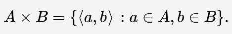

**Worked Example:**

Let $A = \{1, 2\}$ and $B = \{a, b\}$. Then:

$$
A \times B = \{(1, a),\, (1, b),\, (2, a),\, (2, b)\}
$$

$$
B \times A = \{(a, 1),\, (a, 2),\, (b, 1),\, (b, 2)\}
$$

Notice that $A \times B \neq B \times A$ in general, because the ordered pairs differ. The Cartesian product is not commutative.

**Cardinality:** $|A \times B| = |A| \cdot |B|$

Each element of $A$ can be paired with each element of $B$, giving $|A| \cdot |B|$ ordered pairs total. In the example above, $|A \times B| = 2 \cdot 2 = 4$.

**Properties:**

- $A \times \emptyset = \emptyset$ and $\emptyset \times A = \emptyset$
- $A \times (B \cup C) = (A \times B) \cup (A \times C)$ (distributes over union)
- $A \times (B \cap C) = (A \times B) \cap (A \times C)$ (distributes over intersection)
- $A \times B \neq B \times A$ in general (not commutative)

**Connection to the Cartesian Plane:**

The familiar coordinate plane $\mathbb{R}^2$ is precisely $\mathbb{R} \times \mathbb{R}$: the set of all ordered pairs $(x, y)$ where $x, y \in \mathbb{R}$. More generally, $\mathbb{R}^n = \underbrace{\mathbb{R} \times \mathbb{R} \times \cdots \times \mathbb{R}}_{n \text{ times}}$.

**Connection to Relations and Functions:**

A **relation** from $A$ to $B$ is any subset $R \subseteq A \times B$. A **function** $f: A \to B$ is a special kind of relation where each element of $A$ is paired with exactly one element of $B$. See [Functions & Relations](./functions-relations) for more.

A table can be created by taking the Cartesian product of a set of rows
and a set of columns. If the Cartesian product **rows** $\times$ **columns**
is taken, the cells of the table contain ordered pairs of the form (row
value, column value).

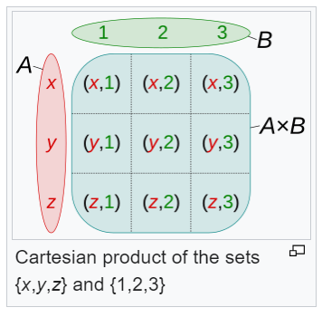


