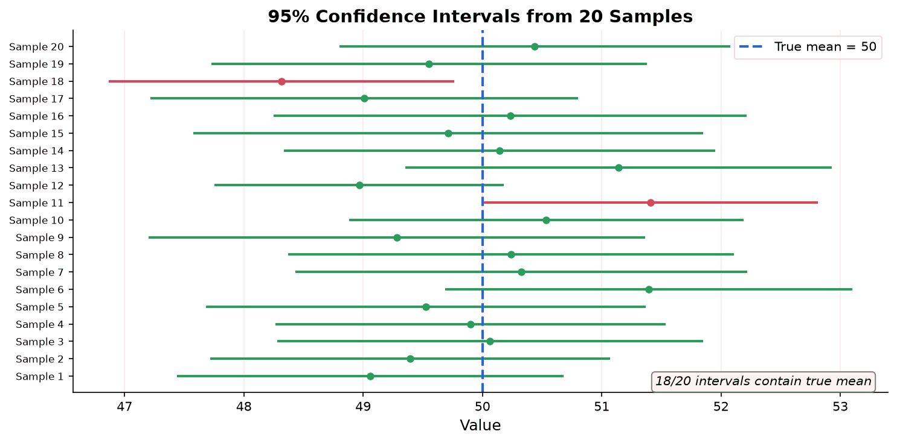
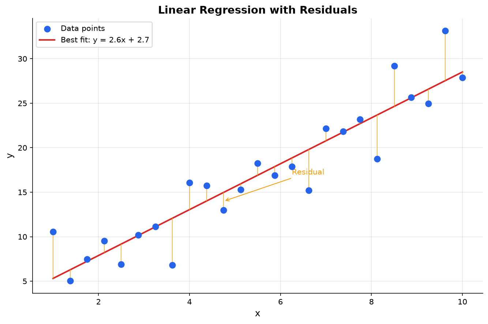
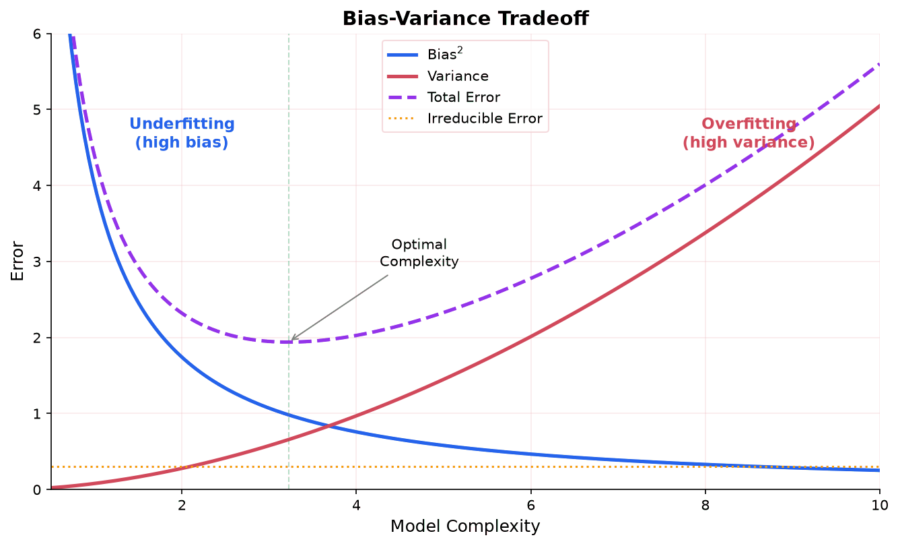

Statistics is the science of collecting, analyzing, and drawing conclusions from data. It builds on [probability theory](./probability) and provides the tools for making decisions under uncertainty.

## What Is Data?

Before doing statistics, we need to be precise about what we are working with.

**Data:** A collection of observations or measurements. Each individual observation is called a **data point**. A collection of data points is a **dataset**.

**Variable:** A characteristic being measured or observed. Height, color, exam score, temperature. Each data point records a value for one or more variables.

**Observation (case, record):** A single entity being measured. One person, one transaction, one experiment. An observation may have values for multiple variables (a person has a height, a weight, an age, etc.).

### Types of Variables

Variables come in two fundamental types, and the type determines which statistical methods apply.

**Quantitative (numerical) variables:** Values are numbers that represent quantities. You can do arithmetic with them (add, subtract, average).

- **Discrete:** Countable values with gaps between them. Number of children (0, 1, 2, 3...), number of errors in code, number of heads in 10 flips. You cannot have 2.7 children.
- **Continuous:** Values on a continuous scale with no gaps. Height, temperature, time, weight. Between any two values, there are infinitely many other possible values.

**Qualitative (categorical) variables:** Values are labels or categories. You cannot meaningfully add or average them.

- **Nominal:** Categories with no natural order. Color (red, blue, green), blood type (A, B, AB, O), country. There is no sense in which "red > blue."
- **Ordinal:** Categories with a meaningful order, but the gaps between categories are not necessarily equal. Education level (high school, bachelor's, master's, PhD), customer satisfaction (poor, fair, good, excellent), letter grades (A, B, C, D, F).

### Scales of Measurement

This is a more formal way of classifying variables. Each level adds more structure.

**Nominal scale:** Categories only. You can check if two values are equal or different, but nothing else. Examples: gender, zip code, species.

- Operations: $=$ and $\neq$ only
- Meaningful statistics: mode, frequency counts

**Ordinal scale:** Categories with a ranking. You know that A > B, but not by how much. The difference between "good" and "excellent" might not be the same as between "poor" and "fair." Examples: rankings (1st, 2nd, 3rd), Likert scales (1-5 ratings), socioeconomic status.

- Operations: $=$, $\neq$, $<$, $>$
- Meaningful statistics: mode, median, percentiles
- NOT meaningful: mean (because gaps between ranks are not equal)

**Interval scale:** Numerical values where differences are meaningful, but there is no true zero point. The difference between 20°C and 30°C is the same as between 30°C and 40°C, but 40°C is not "twice as hot" as 20°C (because 0°C is not the absence of temperature). Examples: temperature in Celsius/Fahrenheit, calendar years, IQ scores.

- Operations: $=$, $\neq$, $<$, $>$, $+$, $-$
- Meaningful statistics: mean, standard deviation
- NOT meaningful: ratios ("twice as much")

**Ratio scale:** Like interval, but with a true zero point that means "none." 0 kg means no mass. 0 meters means no distance. Ratios are meaningful: 10 kg is twice as heavy as 5 kg. Examples: height, weight, distance, time duration, income, counts.

- Operations: all arithmetic ($=$, $\neq$, $<$, $>$, $+$, $-$, $\times$, $\div$)
- Meaningful statistics: all (mean, SD, ratios, geometric mean)

| Scale | Example | Can rank? | Can subtract? | Can divide? |
|---|---|---|---|---|
| Nominal | Blood type | No | No | No |
| Ordinal | Movie rating (1-5 stars) | Yes | No | No |
| Interval | Temperature (°C) | Yes | Yes | No |
| Ratio | Weight (kg) | Yes | Yes | Yes |

**Why this matters:** The scale of your data determines which operations are valid. Computing the mean of zip codes is nonsensical (nominal data). Computing the mean of star ratings is debatable (ordinal data, gaps might not be equal). Computing the mean of heights is perfectly fine (ratio data). Using the wrong statistic for a data type is a common error.

### Cardinal vs Ordinal Numbers

**Cardinal numbers** answer "how many?" They represent quantity: 3 apples, 47 students, 1,000,000 data points. You can do arithmetic with them.

**Ordinal numbers** answer "in what position?" They represent rank or order: 1st place, 2nd place, 3rd place. You know the order but not the gaps. The difference between 1st and 2nd place in a race might be 0.01 seconds; the difference between 2nd and 3rd might be 15 seconds. The ordinal numbers (1st, 2nd, 3rd) hide this information.

In statistics, this distinction appears constantly. Ranked data (ordinal) requires different methods than measured data (cardinal/interval/ratio). Median and percentiles work on ordinal data. Mean and standard deviation require at least interval data.

## The Fundamental Problem

You want to know something about the world: What is the average height of adults in a country? Does this drug work? Will users click on button A or button B more often?

You cannot measure everyone or observe every outcome. Instead, you observe a small piece of the world (a **sample**) and try to draw conclusions about the whole thing (the **population**).

This creates an immediate problem: your sample might not be representative. You might, by chance, have picked unusually tall people, or the drug might have appeared to work only because the test group happened to be healthier. Statistics is the set of tools for reasoning carefully about this gap between what you observed and what is actually true.

Everything on this page flows from this one problem. Descriptive statistics summarize what you observed. Inferential statistics quantify how much you can trust those summaries to reflect the population.

## Populations and Samples

These two concepts must be clear before anything else.

**Population:** The complete set of all individuals, items, or outcomes you care about. All adults in a country. All possible coin flips. All future users of your product. The population is usually too large (or infinite) to observe entirely.

**Parameter:** A number that describes the population. The population mean $\mu$, the population variance $\sigma^2$. Parameters are fixed, real numbers. They exist whether or not you know them. You almost never know them exactly.

**Sample:** A subset of the population that you actually observe. You measure 200 people's heights, or flip a coin 100 times, or track 1000 users for a week.

**Statistic:** A number computed from a sample. The sample mean $\bar{x}$, the sample variance $s^2$. Statistics are numbers you can actually calculate, but they change depending on which sample you happen to draw.

| | Population | Sample |
|---|---|---|
| What it is | Everything you want to know about | The piece you actually observe |
| Size | $N$ (often huge or infinite) | $n$ (what you can afford to measure) |
| Mean | $\mu$ (unknown, fixed) | $\bar{x}$ (known, varies by sample) |
| Variance | $\sigma^2$ (unknown, fixed) | $s^2$ (known, varies by sample) |
| Standard deviation | $\sigma$ | $s$ |

The central question of statistics: **how well does a statistic estimate the corresponding parameter?** If your sample mean is 72, how close is that to the true population mean? Can you put bounds on how far off you might be? That is what the rest of this page builds toward.

### How Samples Are Collected

The way you collect a sample determines whether your conclusions are valid. A bad sample can give completely misleading results, no matter how sophisticated your analysis.

**Simple random sample (SRS):** Every member of the population has an equal chance of being selected. This is the gold standard. Drawing names from a hat, using a random number generator to select rows from a database.

**Stratified sampling:** Divide the population into subgroups (strata) based on a characteristic (age group, region, income bracket), then take a random sample from each stratum. This ensures representation from every subgroup.

**Systematic sampling:** Select every $k$th item from an ordered list. For example, survey every 10th customer. Simple to implement, but can be biased if there is a periodic pattern in the list.

**Convenience sampling:** Sample whoever is easiest to reach. Surveying your friends, using your company's users as "the population." This is the most common method in practice and the most prone to bias.

**Selection bias:** When the sampling method systematically excludes part of the population. Surveying people at a gym about exercise habits will overrepresent active people. This is the single biggest threat to statistical validity.

**Where it shows up in ML:** Training data is almost always a convenience sample. If your training data does not represent the population you want your model to work on, the model will fail in deployment. This is the root cause of most "AI bias" problems.

## Descriptive Statistics

Before making inferences, you need to summarize what you observed. Descriptive statistics reduce a dataset to a few numbers that capture its key features.

### The Problem: What Is "Typical"?

You have a dataset: exam scores, salaries, measurements, etc. You want a single number that represents the "center" of the data. But "center" is not obvious. Consider these five salaries (in thousands): 40, 45, 50, 55, 310.

The average is 100. But four of the five people earn less than half the average, because one high earner pulls it up. Different measures of center handle this differently.

### Measures of Central Tendency

**Mean (arithmetic average):** Add up all values and divide by the count:

$$
\bar{x} = \frac{1}{n}\sum_{i=1}^n x_i
$$

For the salaries above: $\bar{x} = (40 + 45 + 50 + 55 + 310)/5 = 100$. The mean uses every data point, which makes it informative but also sensitive to outliers.

**Median:** Sort the data and take the middle value. If $n$ is even, average the two middle values. For the salaries: the sorted data is 40, 45, **50**, 55, 310, so the median is 50. The median ignores how extreme the outliers are; it only cares about position.

**Mode:** The most frequently occurring value. A dataset can have multiple modes or no mode. The mode is the only measure of center that works for categorical data (like "red, blue, green").

**When to use which:** For symmetric data, the mean and median are close and either works. For skewed data (income, housing prices, website visit durations), the median better represents the "typical" value because it is not pulled by the tail. This is why news reports use "median household income" rather than "mean household income."

### The Problem: How Spread Out Is the Data?

Two datasets can have the same mean but look completely different. Consider:
- Dataset A: 49, 50, 50, 51 (mean = 50)
- Dataset B: 10, 30, 70, 90 (mean = 50)

You need a number that captures how spread out the data is.

### Measures of Spread

**Range:** $\text{max} - \text{min}$. For Dataset A: $51 - 49 = 2$. For Dataset B: $90 - 10 = 80$. Simple, but it depends entirely on the two most extreme values.

**Interquartile range (IQR):** $Q_3 - Q_1$, where $Q_1$ is the 25th percentile and $Q_3$ is the 75th percentile. The IQR captures the middle 50% of data and ignores outliers entirely.

**Variance:** The average squared distance from the mean. The idea: measure how far each data point is from the center, square those distances (so negative and positive deviations do not cancel), and average them.

For a population:

$$
\sigma^2 = \frac{1}{N}\sum_{i=1}^N (x_i - \mu)^2
$$

For a sample:

$$
s^2 = \frac{1}{n-1}\sum_{i=1}^n (x_i - \bar{x})^2
$$

**Why $n-1$ instead of $n$?** This is called **Bessel's correction**. The intuition: when you compute the sample variance, you use $\bar{x}$ (the sample mean) instead of $\mu$ (the true mean). The sample mean is calculated from the same data, so it is always closer to the data points than $\mu$ might be. This makes the squared distances smaller on average, so dividing by $n$ would systematically underestimate the true variance. Dividing by $n-1$ corrects for this, making $s^2$ an **unbiased estimator** of $\sigma^2$.

The concept of an "unbiased estimator" comes up repeatedly in statistics. It means that if you repeated the sampling process many times, the average of all your estimates would equal the true parameter.

**Standard deviation:** $s = \sqrt{s^2}$. The standard deviation has the same units as the data (dollars, meters, seconds), making it more interpretable than variance (which has squared units).

**Example:** Dataset: 4, 7, 13, 16.

$\bar{x} = (4 + 7 + 13 + 16)/4 = 10$

Deviations from mean: $-6, -3, 3, 6$

Squared deviations: $36, 9, 9, 36$

$s^2 = (36 + 9 + 9 + 36)/(4-1) = 90/3 = 30$

$s = \sqrt{30} \approx 5.48$

## Sampling Distributions and Standard Error

**Sampling distribution:** If you drew many samples of size $n$ from a population and computed the sample mean $\bar{x}$ each time, the distribution of those sample means is the sampling distribution of $\bar{x}$.

By the [Central Limit Theorem](./probability#central-limit-theorem), this sampling distribution is approximately normal with:

- Mean: $\mu_{\bar{x}} = \mu$ (the sample mean is centered on the true mean)
- Standard deviation: $\sigma_{\bar{x}} = \frac{\sigma}{\sqrt{n}}$

**Standard error (SE):** The standard deviation of a sampling distribution. For the sample mean:

$$
SE = \frac{\sigma}{\sqrt{n}}
$$

When $\sigma$ is unknown (which is almost always), we estimate it with the sample standard deviation $s$:

$$
SE \approx \frac{s}{\sqrt{n}}
$$

**Intuition:** The standard error tells you how much your sample mean would vary if you repeated the sampling. Larger samples give smaller standard errors, meaning more precise estimates. Notice the $\sqrt{n}$ in the denominator: to cut the standard error in half, you need four times as much data.

### The t-Distribution

When you estimate the standard error using the sample standard deviation $s$ instead of the (unknown) population standard deviation $\sigma$, the resulting standardized statistic does not follow a standard normal distribution. It follows a **t-distribution**, which was discovered by William Gosset (publishing under the pseudonym "Student") in 1908.

**What it is:** The t-distribution looks like the standard normal distribution (bell-shaped, symmetric, centered at zero) but has **heavier tails**. This means extreme values are more probable under the t-distribution than under the normal. The heavier tails reflect the additional uncertainty introduced by estimating $\sigma$ with $s$.

**Degrees of freedom ($\nu$):** The shape of the t-distribution is controlled by a single parameter called degrees of freedom, typically $\nu = n - 1$ for a one-sample problem. The degrees of freedom count how many independent pieces of information go into estimating the variability.

- When $\nu$ is small (say 3 or 4), the t-distribution has noticeably heavier tails than the normal. Critical values are larger, so confidence intervals are wider and hypothesis tests are less likely to reject.
- As $\nu$ increases, the t-distribution approaches the standard normal. By $\nu = 30$, the two are quite close. By $\nu = 120$, they are nearly indistinguishable.
- At $\nu = \infty$, the t-distribution is exactly the standard normal.

**Why it exists:** The Z-score $Z = \frac{\bar{x} - \mu}{\sigma/\sqrt{n}}$ follows a standard normal distribution. But when you replace $\sigma$ with $s$, the quantity $t = \frac{\bar{x} - \mu}{s/\sqrt{n}}$ does not follow a standard normal. The denominator $s/\sqrt{n}$ is itself a random variable (it changes from sample to sample), which introduces extra variability. The t-distribution accounts for this. With small samples, $s$ can be a poor estimate of $\sigma$, so the t-distribution's heavier tails provide wider intervals that reflect this uncertainty.

**When to use t vs. z:**

| Situation | Distribution | In practice |
|---|---|---|
| $\sigma$ known | Standard normal ($z$) | Almost never happens |
| $\sigma$ unknown, large $n$ | Either (they are nearly the same) | Use $t$ to be safe |
| $\sigma$ unknown, small $n$ | Must use $t$ | Common situation |

**Practical rule:** Use the t-distribution whenever $\sigma$ is unknown, regardless of sample size. There is no cost to using $t$ when $n$ is large (it gives essentially the same answer as $z$), and it is necessary when $n$ is small.

## Point Estimation and Interval Estimation

### Point Estimation

**Point estimate:** A single value used to estimate a population parameter. The sample mean $\bar{x}$ is a point estimate of $\mu$. A point estimate is your best single guess but gives no sense of how reliable it is.

**Desirable properties of estimators:**

- **Unbiased:** On average, the estimator hits the true parameter. $E[\hat{\theta}] = \theta$.
- **Consistent:** As sample size grows, the estimator converges to the true value.
- **Efficient:** Among unbiased estimators, it has the smallest variance.

### Confidence Intervals

**Confidence interval (CI):** A range of values that is likely to contain the true population parameter. A 95% confidence interval means: if you repeated this process many times, about 95% of the intervals you construct would contain the true parameter.

For the mean (when $n$ is large or population is normal):

$$
\bar{x} \pm z^* \cdot \frac{s}{\sqrt{n}}
$$

where $z^*$ is the critical value from the standard normal distribution (1.96 for 95%, 2.576 for 99%).

**Common misinterpretation:** A 95% CI does NOT mean "there is a 95% probability the true mean is in this interval." The true mean is either in the interval or it is not. The 95% refers to the long-run success rate of the procedure.

**Example (large sample, z-interval):** A sample of 100 exam scores has $\bar{x} = 72$ and $s = 15$. Construct a 95% confidence interval for the population mean.

$$
72 \pm 1.96 \cdot \frac{15}{\sqrt{100}} = 72 \pm 1.96 \cdot 1.5 = 72 \pm 2.94
$$

The 95% CI is $(69.06, 74.94)$.

### t-Intervals

When the sample size is small and $\sigma$ is unknown (the typical situation), use the t-distribution instead of the z-distribution. The formula replaces $z^*$ with $t^*$:

$$
\bar{x} \pm t^* \cdot \frac{s}{\sqrt{n}}
$$

where $t^*$ is the critical value from the t-distribution with $\nu = n - 1$ degrees of freedom at the desired confidence level.

**How to find $t^*$:** Look up the value in a t-table using the row for $\nu = n - 1$ degrees of freedom and the column for the desired confidence level. For example, with $\nu = 14$ and 95% confidence, $t^* = 2.145$. Statistical software computes this directly.

Common $t^*$ values (95% confidence):

| df ($\nu$) | $t^*$ |
|---|---|
| 5 | 2.571 |
| 10 | 2.228 |
| 14 | 2.145 |
| 20 | 2.086 |
| 30 | 2.042 |
| $\infty$ | 1.960 |

Notice how $t^*$ decreases toward 1.960 (the z-value) as degrees of freedom increase.

**Worked example:** A sample of $n = 15$ light bulbs has a mean lifetime of $\bar{x} = 68$ hours and a sample standard deviation of $s = 12$ hours. Construct a 95% confidence interval for the population mean lifetime.

Step 1: Degrees of freedom: $\nu = 15 - 1 = 14$.

Step 2: Find $t^*$ for 95% confidence with 14 df: $t^* = 2.145$.

Step 3: Compute the margin of error:

$$
t^* \cdot \frac{s}{\sqrt{n}} = 2.145 \cdot \frac{12}{\sqrt{15}} = 2.145 \cdot 3.098 = 6.645
$$

Step 4: Construct the interval:

$$
68 \pm 6.645 = (61.355, 74.645)
$$

We are 95% confident that the population mean lifetime is between 61.4 and 74.6 hours. Notice this interval is wider than what a z-interval would give ($68 \pm 1.96 \cdot 3.098 = 68 \pm 6.07$), reflecting the extra uncertainty from using $s$ instead of $\sigma$ with a small sample.

### Confidence Interval for a Proportion

When estimating a population proportion $p$ (e.g., the fraction of voters who support a candidate), the point estimate is the sample proportion $\hat{p} = x/n$, where $x$ is the number of successes in $n$ trials.

The standard error of $\hat{p}$ is:

$$
SE(\hat{p}) = \sqrt{\frac{\hat{p}(1 - \hat{p})}{n}}
$$

The confidence interval uses the normal approximation (valid when $n\hat{p} \geq 10$ and $n(1-\hat{p}) \geq 10$):

$$
\hat{p} \pm z^* \sqrt{\frac{\hat{p}(1-\hat{p})}{n}}
$$

**Worked example:** In a survey of 400 customers, 260 say they are satisfied with a product. Construct a 95% CI for the true proportion of satisfied customers.

$\hat{p} = 260/400 = 0.65$

Check conditions: $n\hat{p} = 260 \geq 10$ and $n(1-\hat{p}) = 140 \geq 10$. Both satisfied.

$$
SE = \sqrt{\frac{0.65 \times 0.35}{400}} = \sqrt{\frac{0.2275}{400}} = \sqrt{0.000569} = 0.0239
$$

$$
0.65 \pm 1.96 \times 0.0239 = 0.65 \pm 0.047
$$

The 95% CI is $(0.603, 0.697)$. We are 95% confident that the true proportion of satisfied customers is between 60.3% and 69.7%.

**Where it shows up in ML:** Confidence intervals for model performance metrics (accuracy, AUC) help you determine whether one model is genuinely better than another, or if the difference is within sampling noise.

## Maximum Likelihood Estimation (MLE)

**Maximum Likelihood Estimation (MLE):** A method for estimating model parameters by finding the parameter values that make the observed data most probable.

**The core idea:** Given data $x_1, x_2, \ldots, x_n$, the **likelihood function** is the probability of observing that data as a function of the parameter $\theta$:

$$
L(\theta) = \prod_{i=1}^n P(x_i | \theta)
$$

The MLE is the value $\hat{\theta}$ that maximizes $L(\theta)$. In practice, we maximize the **log-likelihood** instead (because products become sums, which are easier to work with):

$$
\ell(\theta) = \sum_{i=1}^n \log P(x_i | \theta)
$$

### Worked Example: MLE for a Coin

You flip a coin 10 times and get 7 heads. What is the MLE of $p$ (the probability of heads)?

Each flip follows a Bernoulli distribution, so:

$$
L(p) = \prod_{i=1}^{10} p^{x_i}(1-p)^{1-x_i} = p^7(1-p)^3
$$

Take the log:

$$
\ell(p) = 7\log(p) + 3\log(1-p)
$$

Take the derivative and set it to zero:

$$
\frac{d\ell}{dp} = \frac{7}{p} - \frac{3}{1-p} = 0
$$

$$
7(1-p) = 3p \implies 7 = 10p \implies \hat{p} = 0.7
$$

The MLE is $\hat{p} = 0.7$, which is simply the fraction of heads. This makes intuitive sense: the value of $p$ that makes 7 out of 10 heads most likely is exactly 7/10.

### Worked Example: MLE for Normal Distribution

Given data $x_1, \ldots, x_n$ from a normal distribution, find the MLE for $\mu$ and $\sigma^2$.

The log-likelihood is:

$$
\ell(\mu, \sigma^2) = -\frac{n}{2}\log(2\pi) - \frac{n}{2}\log(\sigma^2) - \frac{1}{2\sigma^2}\sum_{i=1}^n (x_i - \mu)^2
$$

Taking derivatives and setting to zero:

$$
\hat{\mu}_{MLE} = \frac{1}{n}\sum_{i=1}^n x_i = \bar{x}
$$

$$
\hat{\sigma}^2_{MLE} = \frac{1}{n}\sum_{i=1}^n (x_i - \bar{x})^2
$$

The MLE for the mean is just the sample mean. The MLE for the variance uses $n$ (not $n-1$), which makes it slightly biased: it underestimates the true variance by a factor of $(n-1)/n$. This bias shrinks toward zero as $n$ grows, so MLE is still consistent (converges to the true value with enough data). This is a known limitation of MLE.

**Where it shows up in ML:** MLE is the foundation of many ML training procedures. Logistic regression finds parameters by maximizing the log-likelihood of the observed labels. Training a neural network with cross-entropy loss is equivalent to MLE. Minimizing cross-entropy loss = maximizing log-likelihood.

**Connection to optimization:** Finding the MLE requires solving an optimization problem (maximizing the log-likelihood). For simple distributions, you can solve analytically (as above). For complex models, you use gradient ascent.

## MAP Estimation

**Maximum a Posteriori (MAP) estimation:** Like MLE, but incorporates a prior belief about the parameters.

$$
\hat{\theta}_{MAP} = \arg\max_\theta P(\theta | \text{data}) = \arg\max_\theta \left[ \log P(\text{data} | \theta) + \log P(\theta) \right]
$$

By [Bayes' theorem](./probability#bayes-theorem): the posterior is proportional to the likelihood times the prior. MLE uses only the likelihood; MAP adds the prior.

**MLE vs. MAP:**

| | MLE | MAP |
|---|-----|-----|
| Formula | $\arg\max L(\theta)$ | $\arg\max L(\theta) \cdot P(\theta)$ |
| Prior | None (or equivalently, uniform prior) | Requires specifying a prior |
| With lots of data | MAP and MLE converge | MAP and MLE converge |
| With little data | Can overfit | Prior acts as regularization |

**Connection to regularization:** If you use a Gaussian prior $P(\theta) \sim N(0, \sigma^2)$, the MAP estimate is equivalent to L2 regularization (ridge regression). The prior penalizes large parameter values, pulling them toward zero. If you use a Laplace prior, you get L1 regularization (lasso). This is one of the deepest connections between Bayesian statistics and ML.

**Where it shows up in ML:** Ridge regression is MAP estimation with a Gaussian prior. Understanding this connection helps explain why regularization works: it is not just a trick to prevent overfitting, it is a principled way to incorporate prior beliefs about parameter values.

## Hypothesis Testing

**Hypothesis testing:** A formal procedure for deciding whether data provides enough evidence to reject a claim about a population.

### The Framework

1. **Null hypothesis ($H_0$):** The default claim, usually "no effect" or "no difference." Example: "the coin is fair" ($p = 0.5$).
2. **Alternative hypothesis ($H_1$ or $H_a$):** What you believe might be true instead. Example: "the coin is biased" ($p \neq 0.5$).
3. **Test statistic:** A number computed from data that measures how far the observed result is from what $H_0$ predicts.
4. **p-value:** The probability of observing a test statistic as extreme as (or more extreme than) what you actually saw, assuming $H_0$ is true.
5. **Decision:** If the p-value is below a threshold $\alpha$ (typically 0.05), reject $H_0$.

### Type I and Type II Errors

| | $H_0$ is true | $H_0$ is false |
|---|---|---|
| Reject $H_0$ | **Type I error** (false positive) | Correct (true positive) |
| Fail to reject $H_0$ | Correct (true negative) | **Type II error** (false negative) |

- $\alpha$ = probability of Type I error (significance level, usually 0.05)
- $\beta$ = probability of Type II error
- **Power** = $1 - \beta$ = probability of correctly detecting a real effect

**The tradeoff:** Lowering $\alpha$ (being more strict about rejecting $H_0$) reduces Type I errors but increases Type II errors. You catch fewer false alarms, but you also miss more real effects.

### Example: Testing Whether a Coin Is Fair

You flip a coin 100 times and get 60 heads. Is the coin fair?

**Setup:** $H_0: p = 0.5$, $H_1: p \neq 0.5$

Under $H_0$, the number of heads follows a binomial distribution with $n = 100$, $p = 0.5$. By the CLT, this is approximately normal with mean $np = 50$ and standard deviation $\sqrt{np(1-p)} = 5$.

**Test statistic (Z-score):**

$$
Z = \frac{60 - 50}{5} = 2.0
$$

**p-value:** $P(|Z| \geq 2.0) \approx 0.046$

Since $0.046 < 0.05$, we reject $H_0$. The data provides statistically significant evidence that the coin is biased.

**Important caveat:** Statistical significance does not mean practical significance. With a large enough sample, you can detect arbitrarily tiny effects that are meaningless in practice. Always consider effect size alongside p-values.

### Effect Size

**Effect size** measures the magnitude of a difference or relationship, independent of sample size. A p-value tells you whether an effect exists; the effect size tells you how big it is.

**Why it matters:** With a large enough sample, even a trivially small difference becomes statistically significant. A study of 100,000 people might find that a drug lowers blood pressure by 0.1 mmHg with $p < 0.001$. Statistically significant, but clinically meaningless. Conversely, a small study might fail to detect a large, important effect simply because $n$ was too small. Effect size separates "real" from "important."

**Cohen's d:** The most common effect size for comparing two group means. It expresses the difference in means in units of pooled standard deviation:

$$
d = \frac{\bar{x}_1 - \bar{x}_2}{s_p}
$$

where $s_p$ is the pooled standard deviation:

$$
s_p = \sqrt{\frac{(n_1 - 1)s_1^2 + (n_2 - 1)s_2^2}{n_1 + n_2 - 2}}
$$

**Cohen's guidelines for interpreting $d$:**

| $|d|$ | Interpretation |
|---|---|
| 0.2 | Small effect |
| 0.5 | Medium effect |
| 0.8 | Large effect |

A Cohen's $d$ of 0.5 means the two group means differ by half a standard deviation. These benchmarks are rough guidelines, not rigid thresholds. In some fields, $d = 0.2$ is a meaningful effect; in others, $d = 0.8$ is routine.

**$R^2$ as effect size in regression:** The coefficient of determination $R^2$ is itself an effect size: it tells you what proportion of the variance in the outcome is explained by the predictors. Cohen's guidelines: $R^2 = 0.02$ (small), $R^2 = 0.13$ (medium), $R^2 = 0.26$ (large).

**Best practice:** Always report effect size alongside p-values. A complete result looks like: "Students who used the new method scored significantly higher ($t(28) = 2.45$, $p = 0.021$, $d = 0.91$)." The p-value says the difference is unlikely to be zero; the effect size says the difference is large.

**Research connection:** Statistical testing is central to mechanistic interpretability. Causal ablation (removing specific attention heads and measuring performance degradation) is essentially a controlled experiment with a null hypothesis ("this head contributes nothing"). Effect sizes matter: a head whose removal causes +420% degradation is a strong causal finding, while +1.4% for P0 sink removal confirms they are safely removable. Multiple comparisons correction becomes important when testing hundreds of heads simultaneously.

### Power Analysis

**Statistical power** is the probability of correctly rejecting a false null hypothesis. In other words, if there really is an effect, power is the probability that your study will detect it.

$$
\text{Power} = 1 - \beta
$$

where $\beta$ is the probability of a Type II error (failing to detect a real effect).

**Why power matters:** An underpowered study is nearly useless. If your power is only 0.20, there is an 80% chance you will miss a real effect. You invest time and resources, collect data, and conclude "no significant effect," when the effect was there all along but your study was too small to see it.

**Four factors determine power (change any one, and power changes):**

1. **Sample size ($n$):** Larger samples give more power. This is the factor researchers most often control.
2. **Effect size:** Larger effects are easier to detect. A drug that cuts recovery time in half is easier to detect than one that cuts it by 5%.
3. **Significance level ($\alpha$):** A more lenient $\alpha$ (e.g., 0.10 instead of 0.05) gives more power but also more false positives.
4. **Variability ($\sigma$):** Less noisy data gives more power. You can sometimes reduce variability through better measurement or by using a within-subjects design.

**Sample size determination:** Before collecting data, you can use a power analysis to determine how many subjects you need. You specify:

- The desired power (typically 0.80 or 0.90)
- The significance level (typically $\alpha = 0.05$)
- The minimum effect size you want to detect

For a one-sample t-test with $\alpha = 0.05$, power $= 0.80$, and Cohen's $d = 0.5$ (medium effect), the required sample size is approximately $n = 34$. This comes from solving:

$$
n \approx \left(\frac{z_{1-\alpha/2} + z_{1-\beta}}{d}\right)^2 = \left(\frac{1.96 + 0.84}{0.5}\right)^2 = \left(\frac{2.80}{0.5}\right)^2 = 31.4
$$

(The exact calculation uses the noncentral t-distribution and gives $n \approx 34$.)

**Worked example:** A researcher wants to detect a mean difference of 5 points on a test where the standard deviation is 10 (so $d = 5/10 = 0.5$). Using $\alpha = 0.05$ and desired power of 0.80, the required sample size is approximately $n = 34$ per group for a two-sample test (about 64 total). If the researcher can only recruit 20 per group, the power drops to about 0.34, meaning there is only a 34% chance of detecting the effect even if it exists.

### One-Sample t-Test

**When to use:** You want to test whether a population mean equals a specific hypothesized value $\mu_0$, and the population standard deviation is unknown.

**Test statistic:**

$$
t = \frac{\bar{x} - \mu_0}{s/\sqrt{n}}
$$

This follows a t-distribution with $\nu = n - 1$ degrees of freedom under $H_0$.

**One-tailed vs. two-tailed tests:**

- **Two-tailed** ($H_1: \mu \neq \mu_0$): Reject if $|t| > t^*_{\alpha/2}$. Use when you want to detect a difference in either direction.
- **Left-tailed** ($H_1: \mu < \mu_0$): Reject if $t < -t^*_{\alpha}$. Use when you only care about detecting a decrease.
- **Right-tailed** ($H_1: \mu > \mu_0$): Reject if $t > t^*_{\alpha}$. Use when you only care about detecting an increase.

**Worked example:** A manufacturer claims that batteries last an average of 500 hours. A consumer group tests 20 batteries and finds $\bar{x} = 485$ hours with $s = 40$ hours. Test the claim at $\alpha = 0.05$.

$H_0: \mu = 500$ (the claim is correct)

$H_1: \mu < 500$ (the batteries last less than claimed; one-tailed)

$$
t = \frac{485 - 500}{40/\sqrt{20}} = \frac{-15}{8.944} = -1.677
$$

Degrees of freedom: $\nu = 19$. The critical value for a one-tailed test at $\alpha = 0.05$ with 19 df is $t^* = 1.729$.

Since $|{-1.677}| = 1.677 < 1.729$, we fail to reject $H_0$. There is not enough evidence at the 5% level to conclude that the batteries last less than 500 hours.

Note: the p-value is approximately 0.055, just above 0.05. This illustrates that the 0.05 threshold is a convention, not a law. The evidence against the claim is suggestive but not conclusive by the standard criterion.

### Two-Sample t-Test

**When to use:** You want to compare the means of two independent groups.

**Setup:** Group 1 has $n_1$ observations with mean $\bar{x}_1$ and standard deviation $s_1$. Group 2 has $n_2$ observations with mean $\bar{x}_2$ and standard deviation $s_2$.

$H_0: \mu_1 = \mu_2$ (no difference between groups)

$H_1: \mu_1 \neq \mu_2$ (the groups differ)

**Pooled t-test** (when you can assume equal variances $\sigma_1^2 = \sigma_2^2$):

$$
t = \frac{\bar{x}_1 - \bar{x}_2}{s_p\sqrt{\frac{1}{n_1} + \frac{1}{n_2}}}
$$

where $s_p = \sqrt{\frac{(n_1-1)s_1^2 + (n_2-1)s_2^2}{n_1+n_2-2}}$ is the pooled standard deviation, with $\nu = n_1 + n_2 - 2$ degrees of freedom.

**Welch's t-test** (when variances may be unequal; this is the safer default):

$$
t = \frac{\bar{x}_1 - \bar{x}_2}{\sqrt{\frac{s_1^2}{n_1} + \frac{s_2^2}{n_2}}}
$$

The degrees of freedom are approximated by the Welch-Satterthwaite formula:

$$
\nu \approx \frac{\left(\frac{s_1^2}{n_1} + \frac{s_2^2}{n_2}\right)^2}{\frac{(s_1^2/n_1)^2}{n_1-1} + \frac{(s_2^2/n_2)^2}{n_2-1}}
$$

**Worked example:** Do students who study with music score differently than those who study in silence?

| | Music ($n_1 = 25$) | Silence ($n_2 = 25$) |
|---|---|---|
| Mean | $\bar{x}_1 = 74$ | $\bar{x}_2 = 79$ |
| SD | $s_1 = 10$ | $s_2 = 12$ |

Using Welch's t-test:

$$
t = \frac{74 - 79}{\sqrt{\frac{100}{25} + \frac{144}{25}}} = \frac{-5}{\sqrt{4 + 5.76}} = \frac{-5}{\sqrt{9.76}} = \frac{-5}{3.124} = -1.601
$$

The Welch-Satterthwaite degrees of freedom: $\nu \approx 46.4$, so we use $\nu = 46$.

The critical value for a two-tailed test at $\alpha = 0.05$ with 46 df is approximately $t^* = 2.013$. Since $|{-1.601}| < 2.013$, we fail to reject $H_0$. There is not enough evidence to conclude that music affects test scores.

Effect size: $d = \frac{74 - 79}{s_p} = \frac{-5}{11.05} \approx -0.45$, a small-to-medium effect. A larger sample might detect this difference.

### Paired t-Test

**When to use:** You have two measurements on the same subjects (before and after a treatment, left and right hand, two test versions taken by the same students). The key feature is that the observations are not independent; they come in natural pairs.

**Procedure:** Compute the difference $d_i = x_{i,\text{after}} - x_{i,\text{before}}$ for each pair. Then perform a one-sample t-test on the differences, testing $H_0: \mu_d = 0$ (the treatment has no effect).

$$
t = \frac{\bar{d}}{s_d/\sqrt{n}}
$$

where $\bar{d}$ is the mean of the differences, $s_d$ is the standard deviation of the differences, and $n$ is the number of pairs.

**Worked example:** A company tests whether a training program improves employee performance scores. Ten employees are tested before and after the program.

| Employee | Before | After | Difference ($d_i$) |
|---|---|---|---|
| 1 | 78 | 84 | 6 |
| 2 | 65 | 68 | 3 |
| 3 | 90 | 93 | 3 |
| 4 | 72 | 80 | 8 |
| 5 | 55 | 62 | 7 |
| 6 | 83 | 85 | 2 |
| 7 | 60 | 67 | 7 |
| 8 | 74 | 78 | 4 |
| 9 | 69 | 75 | 6 |
| 10 | 81 | 82 | 1 |

$\bar{d} = (6+3+3+8+7+2+7+4+6+1)/10 = 4.7$

$s_d = \sqrt{\frac{\sum(d_i - \bar{d})^2}{n-1}} = \sqrt{\frac{(1.3^2+1.7^2+1.7^2+3.3^2+2.3^2+2.7^2+2.3^2+0.7^2+1.3^2+3.7^2)}{9}}$

$$
= \sqrt{\frac{1.69+2.89+2.89+10.89+5.29+7.29+5.29+0.49+1.69+13.69}{9}} = \sqrt{\frac{52.10}{9}} = \sqrt{5.789} = 2.406
$$

$$
t = \frac{4.7}{2.406/\sqrt{10}} = \frac{4.7}{0.761} = 6.175
$$

With $\nu = 9$ degrees of freedom, the critical value for a one-tailed test ($H_1: \mu_d > 0$) at $\alpha = 0.05$ is $t^* = 1.833$. Since $6.175 \gg 1.833$, we reject $H_0$. The training program significantly improved scores ($t(9) = 6.18$, $p < 0.001$, $d = 4.7/2.406 = 1.95$, a very large effect).

### Chi-Squared Goodness-of-Fit Test

**When to use:** You want to test whether observed frequency counts match a set of expected frequencies. This is used for categorical data, not means.

**Test statistic:**

$$
\chi^2 = \sum_{i=1}^k \frac{(O_i - E_i)^2}{E_i}
$$

where $O_i$ is the observed count in category $i$, $E_i$ is the expected count, and $k$ is the number of categories. Under $H_0$, this follows a chi-squared distribution with $\nu = k - 1$ degrees of freedom.

**Worked example:** You roll a die 120 times and want to test whether it is fair ($H_0$: each face has probability $1/6$).

| Face | Observed ($O_i$) | Expected ($E_i = 120/6 = 20$) | $(O_i - E_i)^2/E_i$ |
|---|---|---|---|
| 1 | 25 | 20 | 1.25 |
| 2 | 17 | 20 | 0.45 |
| 3 | 15 | 20 | 1.25 |
| 4 | 23 | 20 | 0.45 |
| 5 | 24 | 20 | 0.80 |
| 6 | 16 | 20 | 0.80 |

$$
\chi^2 = 1.25 + 0.45 + 1.25 + 0.45 + 0.80 + 0.80 = 5.00
$$

Degrees of freedom: $\nu = 6 - 1 = 5$. The critical value for $\alpha = 0.05$ with 5 df is $\chi^2_{0.05} = 11.07$.

Since $5.00 < 11.07$, we fail to reject $H_0$. The data is consistent with a fair die.

**Assumption:** Each expected count $E_i$ should be at least 5 for the chi-squared approximation to be reliable. If some expected counts are too small, combine categories.

### Chi-Squared Test of Independence

**When to use:** You have two categorical variables measured on the same subjects and want to test whether they are independent (unrelated) or associated.

**Setup:** Arrange the data in a contingency table with $r$ rows and $c$ columns. The expected count for cell $(i, j)$ under independence is:

$$
E_{ij} = \frac{R_i \cdot C_j}{n}
$$

where $R_i$ is the row total, $C_j$ is the column total, and $n$ is the grand total.

**Test statistic:**

$$
\chi^2 = \sum_{i=1}^r \sum_{j=1}^c \frac{(O_{ij} - E_{ij})^2}{E_{ij}}
$$

with $\nu = (r-1)(c-1)$ degrees of freedom.

**Worked example:** Is there an association between exercise frequency and stress level?

| | Low Stress | High Stress | Total |
|---|---|---|---|
| Exercises regularly | 40 | 10 | 50 |
| Does not exercise | 20 | 30 | 50 |
| Total | 60 | 40 | 100 |

Expected counts under independence:

$$
E_{11} = \frac{50 \times 60}{100} = 30, \quad E_{12} = \frac{50 \times 40}{100} = 20
$$

$$
E_{21} = \frac{50 \times 60}{100} = 30, \quad E_{22} = \frac{50 \times 40}{100} = 20
$$

$$
\chi^2 = \frac{(40-30)^2}{30} + \frac{(10-20)^2}{20} + \frac{(20-30)^2}{30} + \frac{(30-20)^2}{20}
$$

$$
= \frac{100}{30} + \frac{100}{20} + \frac{100}{30} + \frac{100}{20} = 3.33 + 5.00 + 3.33 + 5.00 = 16.67
$$

Degrees of freedom: $(2-1)(2-1) = 1$. The critical value at $\alpha = 0.05$ with 1 df is $\chi^2_{0.05} = 3.841$.

Since $16.67 \gg 3.841$, we reject $H_0$. There is a statistically significant association between exercise and stress level. The data suggests that regular exercisers tend to report lower stress.

**Where it shows up in ML:** A/B testing uses hypothesis testing to determine if a new feature improves a metric. Statistical tests help determine if one model is significantly better than another, or if the difference is just noise. Chi-squared tests are used in feature selection to test whether a categorical feature is associated with the target variable.

## ANOVA (Analysis of Variance)

**ANOVA** (Analysis of Variance) is a method for comparing the means of three or more groups simultaneously. It tests whether at least one group mean differs from the others.

### Why Not Just Do Multiple t-Tests?

If you have three groups (A, B, C), you might consider doing three pairwise t-tests: A vs. B, A vs. C, B vs. C. The problem is the **multiple comparisons problem**.

Each test has a 5% chance of a Type I error ($\alpha = 0.05$). With three tests, the probability of at least one false positive is:

$$
1 - (1 - 0.05)^3 = 1 - 0.857 = 0.143
$$

That is a 14.3% chance of a false positive, not 5%. With 10 groups (45 pairwise comparisons), the probability rises to:

$$
1 - (0.95)^{45} \approx 0.90
$$

A 90% chance of at least one false positive. ANOVA solves this by performing a single test that controls the overall Type I error rate at $\alpha$.

### One-Way ANOVA

**Setup:** You have $k$ groups. Group $i$ has $n_i$ observations with mean $\bar{x}_i$. The grand mean (mean of all observations) is $\bar{x}$.

$H_0: \mu_1 = \mu_2 = \cdots = \mu_k$ (all group means are equal)

$H_1$: At least one group mean is different

**The key insight:** ANOVA decomposes the total variability in the data into two parts:

1. **Between-group variability (SSB):** How much the group means differ from the grand mean. If the groups truly have different means, this will be large.

$$
SSB = \sum_{i=1}^k n_i(\bar{x}_i - \bar{x})^2
$$

2. **Within-group variability (SSW):** How much individual observations vary within their own groups. This is the "background noise."

$$
SSW = \sum_{i=1}^k \sum_{j=1}^{n_i} (x_{ij} - \bar{x}_i)^2
$$

3. **Total variability:** $SST = SSB + SSW$

$$
SST = \sum_{i=1}^k \sum_{j=1}^{n_i} (x_{ij} - \bar{x})^2
$$

**Mean squares:** Divide each sum of squares by its degrees of freedom:

$$
MSB = \frac{SSB}{k - 1}, \quad MSW = \frac{SSW}{n - k}
$$

where $n = n_1 + n_2 + \cdots + n_k$ is the total number of observations.

**F-statistic:**

$$
F = \frac{MSB}{MSW}
$$

Under $H_0$, this follows an F-distribution with $k - 1$ and $n - k$ degrees of freedom. Large values of $F$ indicate that the between-group variability is much larger than the within-group variability, which is evidence against equal means.

**Worked example:** Three teaching methods are compared. Test scores:

| Method A | Method B | Method C |
|---|---|---|
| 85 | 90 | 70 |
| 78 | 88 | 75 |
| 82 | 92 | 68 |
| 80 | 85 | 72 |
| 75 | 95 | 65 |

Group means: $\bar{x}_A = 80$, $\bar{x}_B = 90$, $\bar{x}_C = 70$

Grand mean: $\bar{x} = (80 + 90 + 70)/3 = 80$ (since groups are equal-sized, this is the mean of the group means)

$SSB = 5(80-80)^2 + 5(90-80)^2 + 5(70-80)^2 = 0 + 500 + 500 = 1000$

$SSW$: For each group, sum the squared deviations from the group mean.

Method A: $(85-80)^2 + (78-80)^2 + (82-80)^2 + (80-80)^2 + (75-80)^2 = 25+4+4+0+25 = 58$

Method B: $(90-90)^2 + (88-90)^2 + (92-90)^2 + (85-90)^2 + (95-90)^2 = 0+4+4+25+25 = 58$

Method C: $(70-70)^2 + (75-70)^2 + (68-70)^2 + (72-70)^2 + (65-70)^2 = 0+25+4+4+25 = 58$

$SSW = 58 + 58 + 58 = 174$

| Source | SS | df | MS | F |
|---|---|---|---|---|
| Between | 1000 | $3-1=2$ | 500 | $500/14.5 = 34.48$ |
| Within | 174 | $15-3=12$ | 14.5 | |
| Total | 1174 | 14 | | |

The critical value for $F(2, 12)$ at $\alpha = 0.05$ is approximately 3.89. Since $34.48 \gg 3.89$, we reject $H_0$. At least one teaching method produces significantly different scores ($F(2,12) = 34.48$, $p < 0.001$).

### Post-Hoc Tests

ANOVA tells you that at least one group is different, but not which one(s). Post-hoc (after the fact) tests make pairwise comparisons while controlling the overall Type I error rate.

**Tukey's Honest Significant Difference (HSD):** Compares all pairs of group means. It uses a "studentized range" distribution to set the critical value so that the family-wise error rate stays at $\alpha$. This is the most common post-hoc test.

**Bonferroni correction:** Divide $\alpha$ by the number of comparisons. With 3 groups (3 comparisons), use $\alpha/3 = 0.0167$ for each pairwise test. Simple but conservative (it has less power than Tukey's HSD).

**In the example above:** A post-hoc test would reveal that Method B is significantly better than Method C ($90 - 70 = 20$ point difference), Method B is significantly better than Method A ($90 - 80 = 10$), and Method A is significantly better than Method C ($80 - 70 = 10$).

## Linear Regression

**Linear regression:** Fits a straight line to data by minimizing the sum of squared residuals. It is the simplest and most important predictive model, and understanding it deeply is essential for ML.

### The Model

For a single feature:

$$
y = \beta_0 + \beta_1 x + \epsilon
$$

- $\beta_0$: intercept (predicted $y$ when $x = 0$)
- $\beta_1$: slope (how much $y$ changes per unit change in $x$)
- $\epsilon$: error term, assumed to follow $N(0, \sigma^2)$

For multiple features: $y = X\beta + \epsilon$, where $X$ is the design matrix and $\beta$ is the parameter vector. This connects directly to [linear algebra](./linear-algebra-foundations): regression is solving an overdetermined system $X\beta \approx y$.

### Ordinary Least Squares (OLS)

**Objective:** Minimize the sum of squared residuals:

$$
\text{RSS} = \sum_{i=1}^n (y_i - \hat{y}_i)^2 = \sum_{i=1}^n (y_i - \beta_0 - \beta_1 x_i)^2
$$

**Residual:** The difference between the observed value and the predicted value: $e_i = y_i - \hat{y}_i$.

**Solution (from linear algebra):** The OLS solution minimizes $\|y - X\beta\|^2$ and has the closed-form solution:

$$
\hat{\beta} = (X^T X)^{-1} X^T y
$$

This is the **normal equation**. It was derived in [Linear Algebra Foundations](./linear-algebra-foundations) from the projection formula: when $Ax = b$ has no exact solution, the best approximation projects $b$ onto the column space of $A$. The normal equation is that projection. The matrix $X^T X$ must be invertible, which fails when features are perfectly correlated (multicollinearity).

**Connection to MLE:** If the errors $\epsilon$ are normally distributed, the OLS solution is also the MLE. Minimizing squared error is equivalent to maximizing the Gaussian log-likelihood.

### $R^2$: How Good Is the Fit?

**Coefficient of determination ($R^2$):** The proportion of variance in $y$ that is explained by the model:

$$
R^2 = 1 - \frac{\text{RSS}}{\text{TSS}} = 1 - \frac{\sum(y_i - \hat{y}_i)^2}{\sum(y_i - \bar{y})^2}
$$

- $R^2 = 1$: the model explains all variance (perfect fit)
- $R^2 = 0$: the model explains no more variance than simply predicting the mean
- $R^2$ can be negative for models that are worse than predicting the mean

**Adjusted $R^2$:** Penalizes adding more features. Regular $R^2$ always increases when you add features (even useless ones). Adjusted $R^2$ accounts for the number of predictors and only increases if the new feature genuinely improves the model:

$$
R^2_{adj} = 1 - \frac{(1 - R^2)(n - 1)}{n - p - 1}
$$

where $p$ is the number of predictors. When you add a useless predictor, $(1 - R^2)$ barely changes but the denominator shrinks, so $R^2_{adj}$ decreases. This makes adjusted $R^2$ a better criterion for model comparison when you have different numbers of predictors.

### Multiple Linear Regression

When there are multiple predictor variables, the model extends naturally:

$$
y = \beta_0 + \beta_1 x_1 + \beta_2 x_2 + \cdots + \beta_p x_p + \epsilon
$$

In matrix form, this is $y = X\beta + \epsilon$, where $X$ is the $n \times (p+1)$ design matrix (with a column of ones for the intercept), $\beta$ is the $(p+1) \times 1$ parameter vector, and $y$ is the $n \times 1$ response vector.

**The OLS solution** carries over from the simple case:

$$
\hat{\beta} = (X^TX)^{-1}X^Ty
$$

**Interpreting coefficients:** Each coefficient $\beta_j$ represents the expected change in $y$ for a one-unit increase in $x_j$, holding all other predictors constant. This "holding all else constant" interpretation is crucial and is what distinguishes multiple regression from running several simple regressions separately.

**Worked example:** Suppose you model house price (in thousands) as a function of square footage ($x_1$) and number of bedrooms ($x_2$), and obtain $\hat{\beta}_0 = 50$, $\hat{\beta}_1 = 0.12$, $\hat{\beta}_2 = 15$. Then the predicted price is:

$$
\hat{y} = 50 + 0.12 x_1 + 15 x_2
$$

The coefficient $0.12$ means that each additional square foot adds \$120 to the predicted price, holding the number of bedrooms constant. The coefficient $15$ means each additional bedroom adds \$15,000, holding square footage constant.

#### Inference on Coefficients

Each estimated coefficient $\hat{\beta}_j$ has a standard error $SE(\hat{\beta}_j)$ that measures how precisely it is estimated. The standard errors come from the diagonal of the covariance matrix:

$$
\text{Cov}(\hat{\beta}) = \hat{\sigma}^2 (X^TX)^{-1}
$$

where $\hat{\sigma}^2 = \frac{RSS}{n - p - 1}$ is the estimated error variance (the residual mean square).

**t-test for individual coefficients:** To test whether predictor $x_j$ contributes to the model (i.e., $H_0: \beta_j = 0$), compute:

$$
t = \frac{\hat{\beta}_j}{SE(\hat{\beta}_j)}
$$

This follows a t-distribution with $n - p - 1$ degrees of freedom. If the p-value is small (below $\alpha$), we reject $H_0$ and conclude that $x_j$ is a statistically significant predictor, given the other predictors in the model.

**Confidence interval for $\beta_j$:**

$$
\hat{\beta}_j \pm t^*_{n-p-1} \cdot SE(\hat{\beta}_j)
$$

**F-test for overall significance:** Tests whether the model as a whole explains a significant amount of variance, i.e., $H_0: \beta_1 = \beta_2 = \cdots = \beta_p = 0$ (all predictors are useless). The test statistic is:

$$
F = \frac{(TSS - RSS)/p}{RSS/(n - p - 1)} = \frac{R^2/p}{(1 - R^2)/(n - p - 1)}
$$

This follows an F-distribution with $p$ and $n - p - 1$ degrees of freedom. A significant F-test means at least one predictor is useful; it does not tell you which one(s).

### Regression Diagnostics

The validity of regression inference depends on four key assumptions. When these assumptions are violated, the coefficient estimates may be biased, the standard errors may be wrong, and the p-values and confidence intervals may be unreliable.

#### Assumptions of Linear Regression

1. **Linearity:** The relationship between predictors and response is linear. If the true relationship is curved, a linear model will systematically miss the pattern.
2. **Independence:** The errors $\epsilon_i$ are independent of each other. This is violated when data has a time or spatial component (autocorrelation).
3. **Homoscedasticity (constant variance):** The variance of the errors is the same for all values of the predictors. If the spread of residuals increases with $\hat{y}$ (a "fan" or "megaphone" shape), this is violated (heteroscedasticity).
4. **Normality of residuals:** The errors follow a normal distribution. This matters most for small samples and for the validity of t-tests and F-tests on the coefficients.

#### Residual Plots

Plot the residuals $e_i = y_i - \hat{y}_i$ against the fitted values $\hat{y}_i$. What you want to see is a random cloud of points centered at zero with no pattern.

**What patterns indicate:**

- **A curve (U-shape or inverted U):** The linearity assumption is violated. Consider adding polynomial terms or using a nonlinear model.
- **A fan shape (wider spread on one side):** Heteroscedasticity. Consider a log transformation of $y$, or use weighted least squares.
- **Clusters or streaks:** Possible grouping structure in the data. Consider adding a categorical predictor or using mixed models.

#### Q-Q Plots for Normality

A quantile-quantile (Q-Q) plot compares the quantiles of the residuals to the quantiles of a standard normal distribution. If residuals are normally distributed, the points fall along a straight diagonal line. Deviations from the line indicate non-normality: S-shaped curves suggest skewness, and heavy tails show up as points curving away at the ends.

#### Leverage and Influential Points

**Leverage:** A data point has high leverage if its predictor values are far from the center of the predictor space. High-leverage points have a large influence on the fitted regression line because they "pull" the line toward them. Leverage is measured by the diagonal elements $h_{ii}$ of the hat matrix $H = X(X^TX)^{-1}X^T$. A point with $h_{ii} > 2(p+1)/n$ is considered high-leverage.

**Influential points:** A point is influential if removing it substantially changes the regression results. A point can have high leverage without being influential (if it falls right on the regression line) or can be influential without extreme leverage.

**Cook's distance** combines leverage and residual size into a single measure of influence:

$$
D_i = \frac{e_i^2}{p \cdot MSE} \cdot \frac{h_{ii}}{(1 - h_{ii})^2}
$$

where $e_i$ is the residual and $MSE$ is the mean squared error. A common rule of thumb: $D_i > 1$ (or $D_i > 4/n$) indicates an influential observation that warrants investigation.

#### Multicollinearity

**Multicollinearity** occurs when two or more predictors are highly correlated with each other. It does not bias the coefficient estimates, but it inflates their standard errors, making it hard to determine which predictors are significant.

**Variance Inflation Factor (VIF):** For predictor $x_j$, regress $x_j$ on all other predictors and compute $R_j^2$. Then:

$$
VIF_j = \frac{1}{1 - R_j^2}
$$

If $R_j^2 = 0$ (predictor $j$ is uncorrelated with the others), $VIF_j = 1$. If $R_j^2 = 0.9$ (90% of predictor $j$'s variance is explained by the others), $VIF_j = 10$. A common guideline: $VIF > 10$ signals a serious multicollinearity problem, and $VIF > 5$ warrants attention.

**What to do about multicollinearity:** Remove one of the correlated predictors, combine them (e.g., use a composite score or principal component), or use regularization (ridge regression), which is specifically designed to handle correlated predictors.

#### What to Do About Violations

| Violation | Diagnostic | Remedies |
|---|---|---|
| Non-linearity | Residual plot shows curve | Add polynomial terms, use transformations ($\log$, $\sqrt{}$) |
| Heteroscedasticity | Fan-shaped residual plot | Transform $y$ (log is common), weighted least squares |
| Non-normality | Q-Q plot deviates from line | Transform $y$, use bootstrap CIs, or use robust methods |
| Influential points | Cook's distance > 1 | Investigate the points; remove only with justification |
| Multicollinearity | VIF > 10 | Remove or combine predictors, use ridge regression |

## Bias-Variance Tradeoff

The **bias-variance tradeoff** is the central tension in machine learning. Every model's prediction error can be decomposed into three components:

$$
E[(\hat{y} - y)^2] = \text{Bias}^2 + \text{Variance} + \text{Irreducible Error}
$$

**Bias:** How far off the model's average prediction is from the true value. High bias means the model is too simple to capture the underlying pattern. A linear model fit to curved data has high bias.

**Variance:** How much the model's predictions change when trained on different data. High variance means the model is too sensitive to the specific training data. A high-degree polynomial that wiggles through every training point has high variance.

**Irreducible error:** Noise inherent in the data that no model can eliminate.

**The tradeoff:** As model complexity increases:

- Bias decreases (the model can capture more patterns)
- Variance increases (the model becomes more sensitive to training data)
- Total error first decreases, then increases

The optimal model balances these two forces. This is why you cannot just "add more parameters" to improve a model indefinitely.

| | Simple model | Complex model |
|---|---|---|
| Bias | High | Low |
| Variance | Low | High |
| Risk | Underfitting | Overfitting |
| Example | Linear regression on curved data | 100-degree polynomial on 20 points |

## Overfitting and Underfitting

**Overfitting:** The model learns the training data too well, including its noise and quirks. It performs great on training data but poorly on new data. Signs: large gap between training accuracy and test accuracy.

**Underfitting:** The model is too simple to capture the underlying pattern. It performs poorly on both training and test data. Signs: high error on training data.

**Remedies for overfitting:**

- Get more training data
- Reduce model complexity (fewer features, lower polynomial degree)
- Regularization (L1/L2 penalties, which connect to MAP estimation above)
- Dropout (in neural networks)
- Early stopping

**Remedies for underfitting:**

- Use a more complex model
- Add more features
- Reduce regularization
- Train longer

## Cross-Validation

**Cross-validation:** A method for estimating how well a model will perform on unseen data, without needing a separate test set.

### k-Fold Cross-Validation

1. Split the data into $k$ equal-sized folds (commonly $k = 5$ or $k = 10$)
2. For each fold $i$:
   - Train the model on all folds except fold $i$
   - Evaluate on fold $i$
3. Average the $k$ evaluation scores

$$
\text{CV Score} = \frac{1}{k}\sum_{i=1}^k \text{Score}_i
$$

**Why not just use a train/test split?** A single split is noisy. You might get lucky or unlucky with which data points end up in the test set. Cross-validation uses all the data for both training and testing (just not at the same time), giving a more reliable estimate.

### Leave-One-Out Cross-Validation (LOOCV)

The extreme case where $k = n$ (each fold is a single data point). Gives a nearly unbiased estimate but is computationally expensive for large datasets.

### Stratified Cross-Validation

For classification problems, each fold maintains the same class proportions as the full dataset. This prevents folds where a minority class is entirely absent.

**Where it shows up in ML:** Cross-validation is the standard method for:

- **Model selection:** Comparing different model types (linear vs. polynomial vs. random forest)
- **Hyperparameter tuning:** Choosing the best learning rate, regularization strength, tree depth, etc.
- **Performance reporting:** Giving a reliable estimate of how well a model generalizes

The reason cross-validation matters so deeply: it is the practical answer to the bias-variance tradeoff. You cannot directly measure bias and variance on real data, but cross-validation lets you detect their effects by measuring generalization performance.

## Bootstrapping

**Bootstrapping** is a resampling technique that lets you estimate the sampling distribution of almost any statistic without relying on theoretical formulas or distributional assumptions.

### The Core Idea

When you have a sample of size $n$, you treat that sample as if it were the population. You then draw many new samples from it (with replacement), compute your statistic on each resampled dataset, and use the distribution of those computed statistics to make inferences.

**Why "with replacement"?** Each bootstrap sample must be the same size as the original sample. If you sampled without replacement, you would just get the original dataset every time. With replacement, each bootstrap sample is a slightly different version of the original: some data points appear multiple times, others not at all. This variation is what generates the distribution.

### The Procedure

1. Start with your original sample of size $n$
2. Draw a bootstrap sample: select $n$ observations from the original sample with replacement
3. Compute the statistic of interest (mean, median, regression coefficient, etc.) on the bootstrap sample
4. Repeat steps 2-3 a total of $B$ times (typically $B = 1{,}000$ to $10{,}000$)
5. The collection of $B$ bootstrapped statistics approximates the sampling distribution

### Bootstrap Confidence Intervals

The simplest bootstrap confidence interval uses the percentiles of the bootstrapped distribution directly.

**Percentile method:** For a 95% confidence interval, take the 2.5th and 97.5th percentiles of the $B$ bootstrapped statistics.

**Worked example:** Suppose you have a sample of 12 delivery times (in minutes): 22, 25, 27, 28, 30, 31, 33, 35, 38, 40, 42, 55. The sample median is 32. You want a 95% CI for the population median.

You draw $B = 10{,}000$ bootstrap samples (each of size 12, with replacement), compute the median of each, and sort the 10,000 medians. The 250th smallest value (2.5th percentile) is 28 and the 9,750th smallest value (97.5th percentile) is 40.

The 95% bootstrap CI for the median is $(28, 40)$.

### Why Bootstrapping Matters

**No distributional assumptions:** For the mean, the CLT gives you a theoretical sampling distribution (normal). But what about the sampling distribution of the median? The trimmed mean? The ratio of two variances? For many statistics, there is no clean formula. Bootstrapping handles them all with the same procedure.

**Nonparametric:** Bootstrapping does not assume the data came from any particular distribution. This makes it robust when the normality assumption is questionable.

**Limitations:** Bootstrapping relies on the original sample being reasonably representative of the population. If your sample is small and unrepresentative, resampling from it will not fix the problem. Bootstrapping also struggles with statistics that are highly sensitive to rare extreme values, because those values may appear zero or multiple times across bootstrap samples.

### Where It Shows Up in ML

**Bootstrap aggregating (bagging):** Train multiple models on different bootstrap samples of the training data, then average their predictions. This reduces variance. Random forests extend bagging by also randomizing feature selection at each split.

**Out-of-bag (OOB) estimation:** In each bootstrap sample, roughly 37% of the original data points are left out (they were never selected). These "out-of-bag" points can be used as a free validation set, giving a performance estimate without needing a separate test set.

## Summary: Connecting Statistics to ML

The concepts on this page form the statistical foundation of machine learning:

| Statistical concept | ML application |
|---|---|
| MLE | Training logistic regression, neural networks (cross-entropy loss) |
| MAP estimation | Ridge regression (L2), lasso (L1) |
| Bias-variance tradeoff | Model selection, regularization decisions |
| Hypothesis testing | A/B testing, model comparison |
| Linear regression | The simplest supervised learning model |
| Cross-validation | Hyperparameter tuning, model evaluation |
| Confidence intervals | Uncertainty quantification for predictions |
| Sampling distributions | Understanding why more data helps |

The next topics in the roadmap (optimization and information theory) build directly on these foundations. MLE requires optimization to find parameter values. Distributions connect to information theory through entropy and KL divergence. Cross-entropy loss (the standard loss for classification) is a concept from information theory applied through the lens of MLE.
