> [!abstract] Prerequisites & where this leads <!-- slt-nav -->
> **Builds on:** [Probability](./probability) · [Functions & Relations](./functions-relations)
> **Leads to:** [Bayesian Inference](./bayesian-inference)


Statistics is the science of collecting, analyzing, and drawing conclusions from data. It builds on [probability theory](./probability) and provides the tools for making decisions under uncertainty.

## What Is Data?

Before doing statistics, we need to be precise about what we are working with.

**Data:** A collection of observations or measurements. Each individual observation is called a **data point**. A collection of data points is a **dataset**.

**Variable:** A characteristic being measured or observed. Height, color, exam score, temperature. Each data point records a value for one or more variables.

**Observation (case, record):** A single entity being measured. One person, one transaction, one experiment. An observation may have values for multiple variables (a person has a height, a weight, an age, etc.).

### Types of Variables


Variables come in two fundamental types, and the type determines which statistical methods apply.

**Quantitative (numerical) variables:** Values are numbers that represent quantities. You can do arithmetic with them (add, subtract, average).

- **Discrete:** Countable values with gaps between them. Number of children (0, 1, 2, 3...), number of errors in code, number of heads in 10 flips. You cannot have 2.7 children.
- **Continuous:** Values on a continuous scale with no gaps. Height, temperature, time, weight. Between any two values, there are infinitely many other possible values.

**Qualitative (categorical) variables:** Values are labels or categories. You cannot meaningfully add or average them.

- **Nominal:** Categories with no natural order. Color (red, blue, green), blood type (A, B, AB, O), country. There is no sense in which "red > blue."
- **Ordinal:** Categories with a meaningful order, but the gaps between categories are not necessarily equal. Education level (high school, bachelor's, master's, PhD), customer satisfaction (poor, fair, good, excellent), letter grades (A, B, C, D, F).

### Scales of Measurement


This is a more formal way of classifying variables. Each level adds more structure.

**Nominal scale:** Categories only. You can check if two values are equal or different, but nothing else. Examples: gender, zip code, species.

- Operations: $=$ and $\neq$ only
- Meaningful statistics: mode, frequency counts

**Ordinal scale:** Categories with a ranking. You know that A > B, but not by how much. The difference between "good" and "excellent" might not be the same as between "poor" and "fair." Examples: rankings (1st, 2nd, 3rd), Likert scales (1-5 ratings), socioeconomic status.

- Operations: $=$, $\neq$, $<$, $>$
- Meaningful statistics: mode, median, percentiles
- NOT meaningful: mean (because gaps between ranks are not equal)

**Interval scale:** Numerical values where differences are meaningful, but there is no true zero point. The difference between 20°C and 30°C is the same as between 30°C and 40°C, but 40°C is not "twice as hot" as 20°C (because 0°C is not the absence of temperature). Examples: temperature in Celsius/Fahrenheit, calendar years, IQ scores.

- Operations: $=$, $\neq$, $<$, $>$, $+$, $-$
- Meaningful statistics: mean, standard deviation
- NOT meaningful: ratios ("twice as much")

**Ratio scale:** Like interval, but with a true zero point that means "none." 0 kg means no mass. 0 meters means no distance. Ratios are meaningful: 10 kg is twice as heavy as 5 kg. Examples: height, weight, distance, time duration, income, counts.

- Operations: all arithmetic ($=$, $\neq$, $<$, $>$, $+$, $-$, $\times$, $\div$)
- Meaningful statistics: all (mean, SD, ratios, geometric mean)

| Scale | Example | Can rank? | Can subtract? | Can divide? |
|---|---|---|---|---|
| Nominal | Blood type | No | No | No |
| Ordinal | Movie rating (1-5 stars) | Yes | No | No |
| Interval | Temperature (°C) | Yes | Yes | No |
| Ratio | Weight (kg) | Yes | Yes | Yes |

**Why this matters:** The scale of your data determines which operations are valid. Computing the mean of zip codes is nonsensical (nominal data). Computing the mean of star ratings is debatable (ordinal data, gaps might not be equal). Computing the mean of heights is perfectly fine (ratio data). Using the wrong statistic for a data type is a common error.

### Cardinal vs Ordinal Numbers

**Cardinal numbers** answer "how many?" They represent quantity: 3 apples, 47 students, 1,000,000 data points. You can do arithmetic with them.

**Ordinal numbers** answer "in what position?" They represent rank or order: 1st place, 2nd place, 3rd place. You know the order but not the gaps. The difference between 1st and 2nd place in a race might be 0.01 seconds; the difference between 2nd and 3rd might be 15 seconds. The ordinal numbers (1st, 2nd, 3rd) hide this information.

In statistics, this distinction appears constantly. Ranked data (ordinal) requires different methods than measured data (cardinal/interval/ratio). Median and percentiles work on ordinal data. Mean and standard deviation require at least interval data.

## The Fundamental Problem

You want to know something about the world: What is the average height of adults in a country? Does this drug work? Will users click on button A or button B more often?

You cannot measure everyone or observe every outcome. Instead, you observe a small piece of the world (a **sample**) and try to draw conclusions about the whole thing (the **population**).

This creates an immediate problem: your sample might not be representative. You might, by chance, have picked unusually tall people, or the drug might have appeared to work only because the test group happened to be healthier. Statistics is the set of tools for reasoning carefully about this gap between what you observed and what is actually true.

Everything on this page flows from this one problem. Descriptive statistics summarize what you observed. Inferential statistics quantify how much you can trust those summaries to reflect the population.

## Populations and Samples


These two concepts must be clear before anything else.

**Population:** The complete set of all individuals, items, or outcomes you care about. All adults in a country. All possible coin flips. All future users of your product. The population is usually too large (or infinite) to observe entirely.

**Parameter:** A number that describes the population. The population mean $\mu$, the population variance $\sigma^2$. Parameters are fixed, real numbers. They exist whether or not you know them. You almost never know them exactly.

**Sample:** A subset of the population that you actually observe. You measure 200 people's heights, or flip a coin 100 times, or track 1000 users for a week.

**Statistic:** A number computed from a sample. The sample mean $\bar{x}$, the sample variance $s^2$. Statistics are numbers you can actually calculate, but they change depending on which sample you happen to draw.

| | Population | Sample |
|---|---|---|
| What it is | Everything you want to know about | The piece you actually observe |
| Size | $N$ (often huge or infinite) | $n$ (what you can afford to measure) |
| Mean | $\mu$ (unknown, fixed) | $\bar{x}$ (known, varies by sample) |
| Variance | $\sigma^2$ (unknown, fixed) | $s^2$ (known, varies by sample) |
| Standard deviation | $\sigma$ | $s$ |

The central question of statistics: **how well does a statistic estimate the corresponding parameter?** If your sample mean is 72, how close is that to the true population mean? Can you put bounds on how far off you might be? That is what the rest of this page builds toward.

### How Samples Are Collected


The way you collect a sample determines whether your conclusions are valid. A bad sample can give completely misleading results, no matter how sophisticated your analysis.

**Simple random sample (SRS):** Every member of the population has an equal chance of being selected. This is the gold standard. Drawing names from a hat, using a random number generator to select rows from a database.

**Stratified sampling:** Divide the population into subgroups (strata) based on a characteristic (age group, region, income bracket), then take a random sample from each stratum. This ensures representation from every subgroup.

**Systematic sampling:** Select every $k$th item from an ordered list. For example, survey every 10th customer. Simple to implement, but can be biased if there is a periodic pattern in the list.

**Convenience sampling:** Sample whoever is easiest to reach. Surveying your friends, using your company's users as "the population." This is the most common method in practice and the most prone to bias.

**Selection bias:** When the sampling method systematically excludes part of the population. Surveying people at a gym about exercise habits will overrepresent active people. This is the single biggest threat to statistical validity.

**Where it shows up in ML:** Training data is almost always a convenience sample. If your training data does not represent the population you want your model to work on, the model will fail in deployment. This is the root cause of most "AI bias" problems.

## Producing Data and Experimental Design

Everything a statistical analysis can tell you is limited by how the data were produced. A [section above](#how-samples-are-collected) covered how to *select* units from a population (simple random, stratified, systematic, and convenience sampling, and the selection bias that arises when the sample is not representative). This section covers the other half of producing data: what you *do* to the units once you have them, and why the design of that intervention determines whether you can make a causal claim at all.

### Observational studies vs designed experiments

There are two broad ways to produce data about a relationship between variables.

In an **observational study**, you measure the units as they already are, without intervening. You record who happens to smoke and who does not, then compare their rates of lung disease. You watch which users happen to see a new feature and compare their engagement. The word to hold onto is *happens*: the researcher does not assign the condition, so the groups being compared may differ in many ways besides the one under study.

In an **experiment**, the researcher deliberately imposes a condition on each unit (for example, randomly deciding which patients receive a drug and which receive a sugar pill) and then observes the response. The researcher *creates* the difference between the groups rather than finding it.

This distinction is the whole reason the two kinds of study support different conclusions. An observational study can establish that two variables are **associated** (they move together), but it cannot by itself establish that one **causes** the other, because any observed difference in outcomes might be due to a pre-existing difference between the groups rather than to the variable of interest. A **randomized experiment** is the most reliable way to establish causation, because randomly assigning units to conditions makes the groups equivalent on average with respect to *every* characteristic, known and unknown, before the treatment is applied. If the groups start out interchangeable and then differ in their response, the treatment is the only systematic explanation left standing. (Causal claims can sometimes be drawn from observational data as well, but only under strong additional assumptions, for example that every relevant confounder has been measured and adjusted for; randomization is what lets an experiment avoid relying on such assumptions.)

> **Where it shows up in ML.** An A/B test is a randomized experiment: users are randomly assigned to variant A or B, so any difference in the response metric (click-through, retention, conversion) can be attributed to the variant. This is why "we shipped feature X and engagement went up" (observational, before/after) is far weaker evidence than an A/B test: in the before/after comparison, seasonality, a marketing push, or a concurrent release could be responsible.

### The Vocabulary of Experiments

A precise vocabulary keeps experimental reasoning clear.

- **Experimental unit:** the smallest entity to which a condition is applied. When the units are people, they are called **subjects** (or **participants**).
- **Treatment:** a specific condition applied to a unit. If a unit receives drug B at a dose of 50 mg, that particular combination is one treatment.
- **Factor:** an explanatory variable that the experimenter manipulates. "Drug type" and "dose" are two factors.
- **Level:** one of the possible values a factor can take. The factor "dose" might have levels 0 mg, 50 mg, and 100 mg.
- **Treatment as a combination of levels:** when there is more than one factor, a treatment is a combination of one level from each factor. With drug type (2 levels) and dose (3 levels), there are $2 \times 3 = 6$ treatments.
- **Response variable:** the outcome the experiment measures (blood pressure after four weeks, whether the user clicked).
- **Control group:** a group that receives a baseline condition (no treatment, the current standard, or a placebo) so that the treated groups have something to be compared against. Without a control group, you cannot tell whether the response was caused by the treatment or would have happened anyway.

### The Three Principles of Experimental Design

Good experiments rest on three principles. Each one neutralizes a specific way that a naive comparison can mislead you.

**Control.** Hold the other conditions of the experiment as constant as possible across groups, and include a control group as a baseline. The purpose of control is to prevent outside variables from differing systematically between the treatment groups, so that they cannot masquerade as an effect of the treatment.

**Randomization.** Assign units to treatment groups by a chance mechanism rather than by choice or convenience. Randomization is what makes the groups comparable on average across *all* characteristics, including ones you never thought to measure. Control handles the variables you know about; randomization handles the ones you do not. This is the single feature that separates an experiment capable of establishing causation from one that is not.

**Replication.** Apply each treatment to many units, not just one. A response measured on a single unit could be a fluke of that unit. Replication lets individual variation average out, so a real treatment effect can be distinguished from ordinary noise, and it lets you estimate how large that noise is. (Replication, many units within one study, is distinct from *reproducibility*, the independent repetition of the whole study by others.)

### Blocking and Randomized Block Designs

Randomization makes groups equal *on average*, but with a modest number of units, chance can still leave the groups noticeably unbalanced on a variable you know matters. **Blocking** addresses this. A **block** is a group of units that are similar with respect to some variable expected to affect the response. The design randomizes treatments *separately within each block*.

Suppose you are testing a training method and you know that beginners and experts respond very differently. Rather than randomizing across everyone and hoping the experts split evenly, you form two blocks (beginners and experts) and randomly assign treatments within each block. This is a **randomized block design**. Because each treatment now appears in a balanced way among beginners and among experts, the beginner-versus-expert variation is prevented from inflating the noise, and the treatment comparison becomes sharper.

The guiding slogan is **"block what you can, randomize what you cannot."** For nuisance variables you can identify and measure (skill level, age group, hardware type), remove their influence by blocking. For all the variables you cannot identify, fall back on randomization to balance them on average.

> **Where it shows up in ML.** Paired or stratified evaluation is blocking. If you compare two models on a benchmark, evaluating both on the *same* set of examples (a paired design) blocks out example-to-example difficulty: each example serves as its own block.

### Blinding, Placebo, and the Placebo Effect

Subjects (and the people measuring them) can respond to their *expectations*, not just to the treatment. The **placebo effect** is a real, measurable response produced by the mere expectation of treatment: patients given an inert pill, a **placebo**, often improve simply because they believe they are being treated. If the treatment group knows it is being treated and the control group knows it is not, part of any observed difference could be expectation rather than the treatment itself.

**Blinding** removes this by hiding who is in which group.

- In a **single-blind** experiment, the subjects do not know which treatment they received, but the researchers do.
- In a **double-blind** experiment, neither the subjects nor the people administering the treatment and measuring the response know who is in which group until the data are collected. Double-blinding also guards against experimenters unconsciously nudging results.

A placebo is what makes single-blinding possible on the subject side: the control group must receive something indistinguishable from the treatment, or blinding is impossible.

### Confounding Variables

A **confounding variable** (also called a **lurking variable** when it was not measured or anticipated) is a variable that is associated with both the explanatory variable and the response variable, so that its effect on the response cannot be separated from the effect of the variable you care about. When a confounder is present, an observed association between two variables might be entirely, or partly, due to the confounder rather than to a direct relationship.

Concrete example. A town's data show that months with higher ice-cream sales also have more drownings, a strong positive association. It would be absurd to conclude that ice cream causes drowning. The lurking variable is **temperature (or season)**: hot months drive up ice-cream sales *and* send more people swimming, which raises drownings. Temperature is associated with both variables, so it confounds the association between them.

This is exactly the danger a randomized experiment avoids. If you could randomly assign ice-cream consumption, the hot and cold months would be balanced across the assigned groups, and the spurious link would vanish. In an observational study you cannot do that, which is why confounding is the central reason observational associations do not imply causation.

> **Where it shows up in ML.** Confounding lives in observational training data. A model trained to predict disease from chest X-rays may learn to key off a scanner-specific marker because sicker patients happened to be imaged on a particular machine: the scanner confounds the association between image and diagnosis. Spurious correlations and shortcut learning are confounding by another name.

### Simpson's Paradox


Confounding can be dramatic enough to *reverse* an association. **Simpson's paradox** is the phenomenon in which a trend that appears in each subgroup of the data reverses when the subgroups are combined. It happens when a lurking variable is unevenly distributed across the groups being compared.

Consider two treatments, A and B, for kidney stones. Patients also differ in whether their stones are **small** or **large**, and large stones are harder to cure. Here are the success counts (successes out of patients treated), broken out by stone size.

| Stone size | Treatment A | Treatment B |
|---|---|---|
| Small stones | 81 / 87 | 234 / 270 |
| Large stones | 192 / 263 | 55 / 80 |
| **Combined** | **273 / 350** | **289 / 350** |

Within the small-stone group, $\tfrac{81}{87} \approx 0.931$ for A versus $\tfrac{234}{270} \approx 0.867$ for B: A does better. Within the large-stone group, $\tfrac{192}{263} \approx 0.730$ for A versus $\tfrac{55}{80} = 0.688$ for B: A does better again. So A wins in *both* subgroups. Now combine them:

$$
\text{A: } \frac{81+192}{87+263} = \frac{273}{350} = 0.780, \qquad \text{B: } \frac{234+55}{270+80} = \frac{289}{350} \approx 0.826.
$$

Combined, B wins. The association has reversed. The lurking variable is **stone size**, distributed very unevenly: Treatment A was given mostly to the hard cases ($263$ of its $350$ patients had large stones), while Treatment B was given mostly to the easy cases (only $80$ of $350$). A's combined rate is dragged down because it is an average dominated by difficult patients. The fair comparison is *within* each stone-size group, where A is better. Had patients been *randomly* assigned, stone size would have been balanced and the reversal could not have arisen.

> **Where it shows up in ML.** Aggregate metrics can hide subgroup reversals. A classifier with higher overall accuracy than a baseline can be *worse* on every demographic subgroup if the subgroups are unevenly sized across the two systems' evaluation sets. This is why disaggregated evaluation (reporting metrics per subgroup) is a standard fairness practice.

## Descriptive Statistics

Before making inferences, you need to summarize what you observed. Descriptive statistics reduce a dataset to a few numbers that capture its key features.

### The Problem: What Is "Typical"?

You have a dataset: exam scores, salaries, measurements, etc. You want a single number that represents the "center" of the data. But "center" is not obvious. Consider these five salaries (in thousands): 40, 45, 50, 55, 310.

The average is 100. But four of the five people earn less than half the average, because one high earner pulls it up. Different measures of center handle this differently.

### Measures of Central Tendency

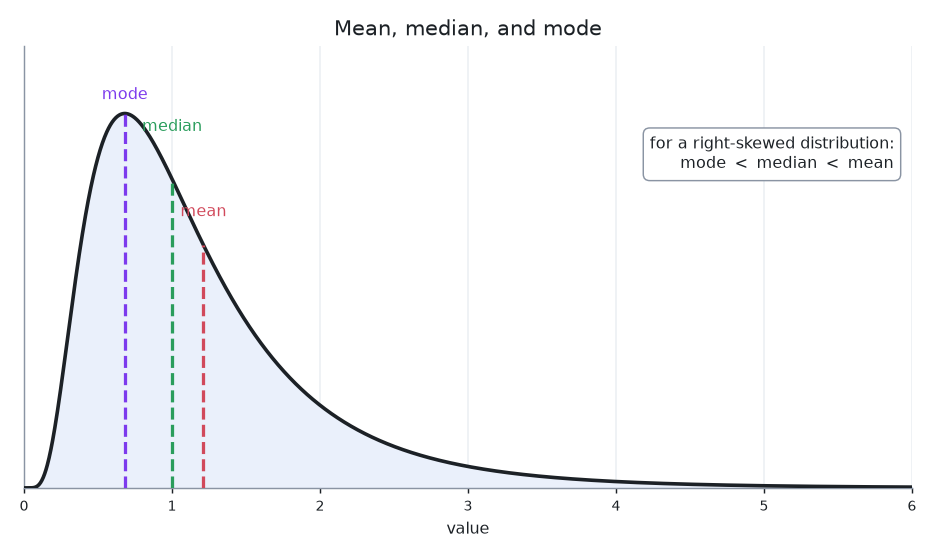

**Mean (arithmetic average):** Add up all values and divide by the count:

$$
\bar{x} = \frac{1}{n}\sum_{i=1}^n x_i
$$

For the salaries above: $\bar{x} = (40 + 45 + 50 + 55 + 310)/5 = 100$. The mean uses every data point, which makes it informative but also sensitive to outliers.

**Median:** Sort the data and take the middle value. If $n$ is even, average the two middle values. For the salaries: the sorted data is 40, 45, **50**, 55, 310, so the median is 50. The median ignores how extreme the outliers are; it only cares about position.

**Mode:** The most frequently occurring value. A dataset can have multiple modes or no mode. The mode is the only measure of center that works for categorical data (like "red, blue, green").

**When to use which:** For symmetric data, the mean and median are close and either works. For skewed data (income, housing prices, website visit durations), the median better represents the "typical" value because it is not pulled by the tail. This is why news reports use "median household income" rather than "mean household income."

### The Problem: How Spread Out Is the Data?

Two datasets can have the same mean but look completely different. Consider:
- Dataset A: 49, 50, 50, 51 (mean = 50)
- Dataset B: 10, 30, 70, 90 (mean = 50)

You need a number that captures how spread out the data is.

### Measures of Spread

These are also called **measures of dispersion** or **measures of variability**, the standard counterpart to the measures of central tendency above. Central tendency answers *where* the data sits; dispersion answers *how spread out* it is around that center. The two together are the basic numerical summary of any dataset.


**Range:** $\text{max} - \text{min}$. For Dataset A: $51 - 49 = 2$. For Dataset B: $90 - 10 = 80$. Simple, but it depends entirely on the two most extreme values.

**Interquartile range (IQR):** $Q_3 - Q_1$, where $Q_1$ is the 25th percentile and $Q_3$ is the 75th percentile. The IQR captures the middle 50% of data and ignores outliers entirely.

**Variance:** The average squared distance from the mean. The idea: measure how far each data point is from the center, square those distances (so negative and positive deviations do not cancel), and average them.

For a population:

$$
\sigma^2 = \frac{1}{N}\sum_{i=1}^N (x_i - \mu)^2
$$

For a sample:

$$
s^2 = \frac{1}{n-1}\sum_{i=1}^n (x_i - \bar{x})^2
$$

**Why $n-1$ instead of $n$?** This is called **Bessel's correction**. The intuition: when you compute the sample variance, you use $\bar{x}$ (the sample mean) instead of $\mu$ (the true mean). The sample mean is calculated from the same data, so it is always closer to the data points than $\mu$ might be. This makes the squared distances smaller on average, so dividing by $n$ would systematically underestimate the true variance. Dividing by $n-1$ corrects for this, making $s^2$ an **unbiased estimator** of $\sigma^2$.

The concept of an "unbiased estimator" comes up repeatedly in statistics. It means that if you repeated the sampling process many times, the average of all your estimates would equal the true parameter.

**Standard deviation:** $s = \sqrt{s^2}$. The standard deviation has the same units as the data (dollars, meters, seconds), making it more interpretable than variance (which has squared units).

In plain terms, the standard deviation is roughly the **typical distance of a data point from the mean**, the average spread of the data around its center. It is not *exactly* the average distance: because we squared the deviations before averaging and then took the square root, $s$ is the **root-mean-square** distance, which weights large deviations more heavily. (The literal average distance is the *mean absolute deviation*; for the dataset below it is $\frac{6 + 3 + 3 + 6}{4} = 4.5$, a bit smaller than $s \approx 5.48$, precisely because squaring inflates the influence of the two points sitting $6$ away.) So reading $s \approx 5.48$ off the example below says: the four values sit, on average, about $5.5$ units from their mean of $10$.

**Example:** Dataset: 4, 7, 13, 16.

$\bar{x} = (4 + 7 + 13 + 16)/4 = 10$

Deviations from mean: $-6, -3, 3, 6$

Squared deviations: $36, 9, 9, 36$

$s^2 = (36 + 9 + 9 + 36)/(4-1) = 90/3 = 30$

$s = \sqrt{30} \approx 5.48$

![A number line from 0 to 20 showing the four data points 4, 7, 13, 16 as dots, with the mean marked by a vertical line at 10. From the mean, a colored arrow runs to each point labeled with its deviation: minus 6 to the point at 4 and minus 3 to the point at 7 (in red, below the mean), and plus 3 to 13 and plus 6 to 16 (in green, above the mean). A shaded band spans mean minus s to mean plus s, from about 4.52 to 15.48, with a double-headed arrow marking its half-width s approximately 5.48. The title reads: standard deviation is approximately the typical distance of a point from the mean.](./media/stats-standard-deviation.png)

The picture makes the "typical distance" reading concrete: the shaded band is one standard deviation wide on each side of the mean, and its half-width $s \approx 5.48$ sits between the small deviations ($\pm 3$) and the large ones ($\pm 6$), a single number summarizing how far the points typically stray from the center.

## Data Visualization

Visualization is how you explore data before doing any analysis. A chart can reveal patterns, outliers, and distributions that summary statistics miss entirely. Numbers compress data into a few values; plots show you the full picture.

The classic demonstration of this is **Anscombe's quartet**: four datasets with nearly identical means, variances, correlations, and regression lines that look completely different when plotted. The lesson is simple: always plot your data. Summary statistics alone can be deeply misleading.

### Histogram

A histogram divides continuous data into equal-width **bins** and shows the frequency (or density) of observations in each bin. It is the most common way to visualize the **shape of a distribution**.

**What it shows:** The overall shape of the data's distribution: symmetric, skewed left or right, bimodal (two peaks), uniform, or bell-shaped.

**When to use it:** Whenever you have a single quantitative variable and want to understand how values are distributed.

**How to read it:**

- The x-axis represents the range of data values, divided into bins
- The y-axis shows the count (or density) of observations falling in each bin
- Taller bars mean more data points in that range
- Look for: the center (where most data clusters), the spread (how wide the distribution is), the shape (symmetric vs. skewed), and any gaps or outliers

**Bin width matters.** Too few bins hides the shape of the distribution, making everything look uniform. Too many bins creates noise, turning smooth distributions into jagged spikes. There is no single correct bin width; the goal is to reveal the underlying pattern without adding artifacts. Common rules of thumb include Sturges' rule ($k = 1 + \log_2 n$) and the Freedman-Diaconis rule (bin width $= 2 \cdot IQR \cdot n^{-1/3}$).

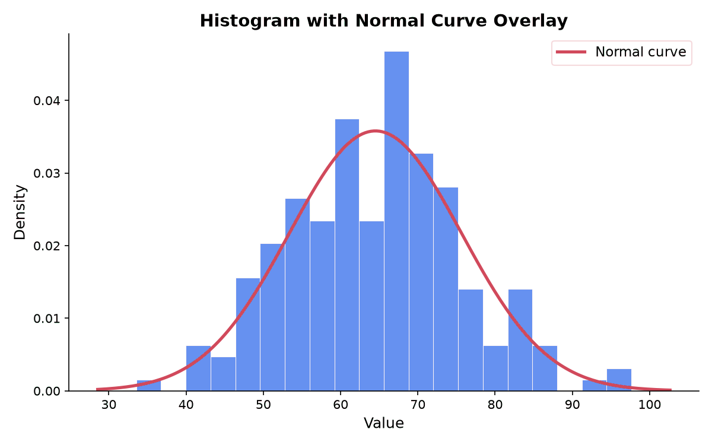

### Box Plot (Box and Whisker)

A box plot displays the **five-number summary** of a dataset in a single figure: minimum, first quartile ($Q_1$), median, third quartile ($Q_3$), and maximum.

**What it shows:** The center, spread, and skewness of a distribution, plus any outliers.

**When to use it:** When comparing distributions across groups. Box plots are compact, so you can place several side by side.

**How to read it:**

- The **box** spans from $Q_1$ to $Q_3$, covering the interquartile range (IQR), which contains the middle 50% of the data
- The **line inside the box** is the median
- The **whiskers** extend from the box to the most extreme data points within $1.5 \times IQR$ of the box edges. Specifically, the lower whisker reaches to the smallest value $\geq Q_1 - 1.5 \cdot IQR$, and the upper whisker reaches to the largest value $\leq Q_3 + 1.5 \cdot IQR$
- **Dots beyond the whiskers** are potential outliers
- If the median line is not centered in the box, the distribution is skewed

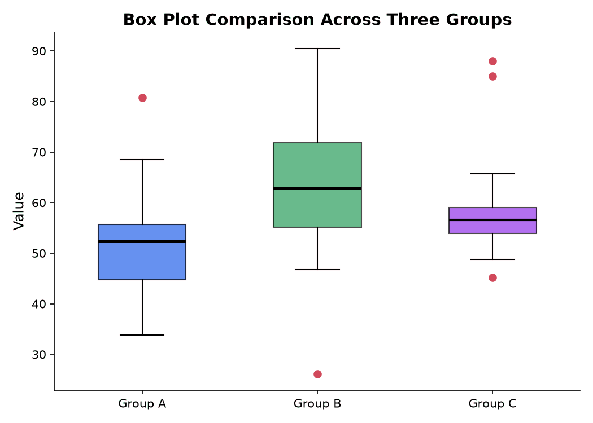

### Scatter Plot

A scatter plot shows the relationship between two quantitative variables by plotting each observation as a point at its $(x, y)$ coordinates.

**What it shows:** The direction (positive or negative), form (linear or nonlinear), and strength of association between two variables. It also reveals outliers and clusters.

**When to use it:** Whenever you want to explore the relationship between two quantitative variables before fitting a model.

**How to read it:**

- Each point represents one observation
- An upward trend (left to right) indicates positive association: as $x$ increases, $y$ tends to increase
- A downward trend indicates negative association
- Points tightly clustered around a line indicate strong linear association; a diffuse cloud indicates weak association
- Look for nonlinear patterns (curves), clusters (subgroups), and isolated points (outliers that may be influential)

The **correlation coefficient** $r$ quantifies linear association ($r = 1$ is perfect positive, $r = -1$ is perfect negative, $r = 0$ is no linear relationship). A best-fit line (from linear regression) summarizes the linear trend.

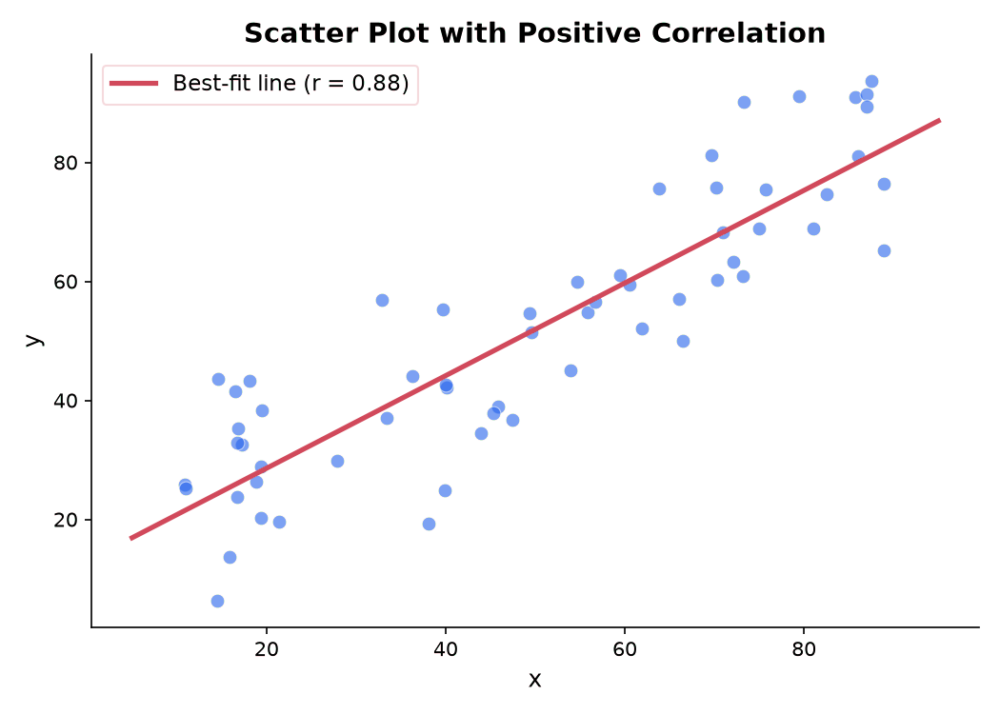

### Bar Chart

A bar chart shows frequencies or values for **categorical data**. Each category gets its own bar, and the height of the bar represents the count or measured value.

**What it shows:** How a quantitative value (count, proportion, measurement) varies across discrete categories.

**When to use it:** For categorical (qualitative) data, or when comparing values across distinct groups.

**Bar chart vs. histogram:** These are frequently confused. A histogram shows the distribution of one continuous variable (bins are ranges of values, bars touch). A bar chart shows values for discrete categories (bars are separated by gaps). Using the wrong one misrepresents the data.

| Feature | Histogram | Bar Chart |
|---|---|---|
| Data type | Continuous (quantitative) | Categorical (qualitative) |
| Bars | Touch (bins are adjacent ranges) | Separated by gaps |
| x-axis | Numerical scale | Category labels |
| Order | Determined by data values | Can be arranged in any order |

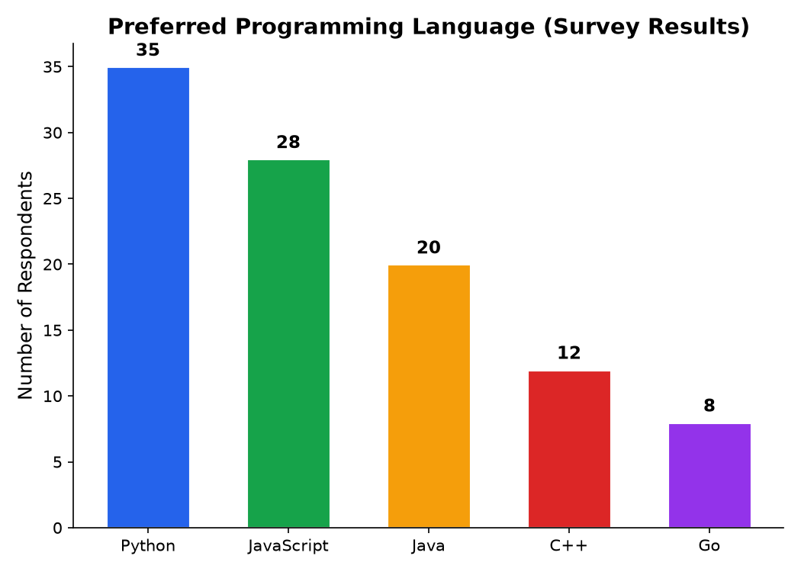

### Pie Chart

A pie chart shows **proportions of a whole**. The full circle represents 100% of the data, and each slice represents one category's share.

**When it is acceptable:** Showing 2 to 4 categories as parts of a whole, especially when one category dominates and you want to emphasize that.

**Why it is often criticized:** Humans are poor at comparing angles and areas. When a pie chart has 6 or more slices, it becomes very difficult to judge which slices are larger. A bar chart displaying the same proportions is almost always easier to read and compare. For this reason, many statisticians and data visualization experts recommend avoiding pie charts in favor of bar charts.

### Stem-and-Leaf Plot

A stem-and-leaf plot is a text-based display that retains the actual data values while showing the shape of the distribution. Each data value is split into a **stem** (the leading digit or digits) and a **leaf** (the trailing digit).

**When to use it:** For small to moderate datasets (roughly $n < 50$) when you want to see both the distribution shape and the individual values.

**Example:** The following dataset contains 20 exam scores:

$$
47, 52, 55, 58, 61, 63, 65, 67, 68, 70, 72, 73, 75, 78, 79, 81, 83, 85, 91, 95
$$

The stem-and-leaf plot:

```
Stem | Leaf
  4  | 7
  5  | 2 5 8
  6  | 1 3 5 7 8
  7  | 0 2 3 5 8 9
  8  | 1 3 5
  9  | 1 5
```

Reading the first row: the stem is 4 and the leaf is 7, so the value is 47. The third row (stem 6) has leaves 1, 3, 5, 7, 8, representing the values 61, 63, 65, 67, 68. You can see the distribution is roughly symmetric with most scores in the 60s and 70s.

### Dot Plot

A dot plot places one dot for each data point on a number line. When multiple observations share the same value, the dots stack vertically.

**What it shows:** Individual data values and how they cluster along a number line.

**When to use it:** For small datasets (roughly $n < 30$) where you want to see every data point. Dot plots are especially useful for discrete data with repeated values.

**How to read it:** Look for where dots cluster (the center), how far they spread, and any gaps or isolated dots (potential outliers). A dot plot is essentially a histogram where every bin is exactly one value wide and every observation is individually visible.

### Q-Q Plot (Quantile-Quantile)

A Q-Q plot compares the distribution of your data to a theoretical distribution (most commonly the normal distribution). It plots the quantiles of your sample data against the quantiles you would expect if the data came from the theoretical distribution.

**What it shows:** Whether your data follows a particular distribution. For a normal Q-Q plot, it tells you whether your data is approximately normal.

**When to use it:** Before using any statistical method that assumes normality (t-tests, ANOVA, linear regression). Q-Q plots are a core part of regression diagnostics for checking whether residuals are normally distributed.

**How to read it:**

- If the data matches the theoretical distribution, the points fall on or near the $y = x$ reference line
- Points curving upward at both ends indicate **heavy tails** (more extreme values than the normal distribution predicts)
- Points curving downward at both ends indicate **light tails**
- An S-shaped pattern indicates **skewness**
- A few points deviating at the tails while the center is linear suggests the data is approximately normal with some outliers

**Connection to regression diagnostics:** After fitting a linear regression, you plot the residuals on a Q-Q plot to check the normality assumption. If the points deviate substantially from the line, the p-values and confidence intervals from the regression may not be reliable.

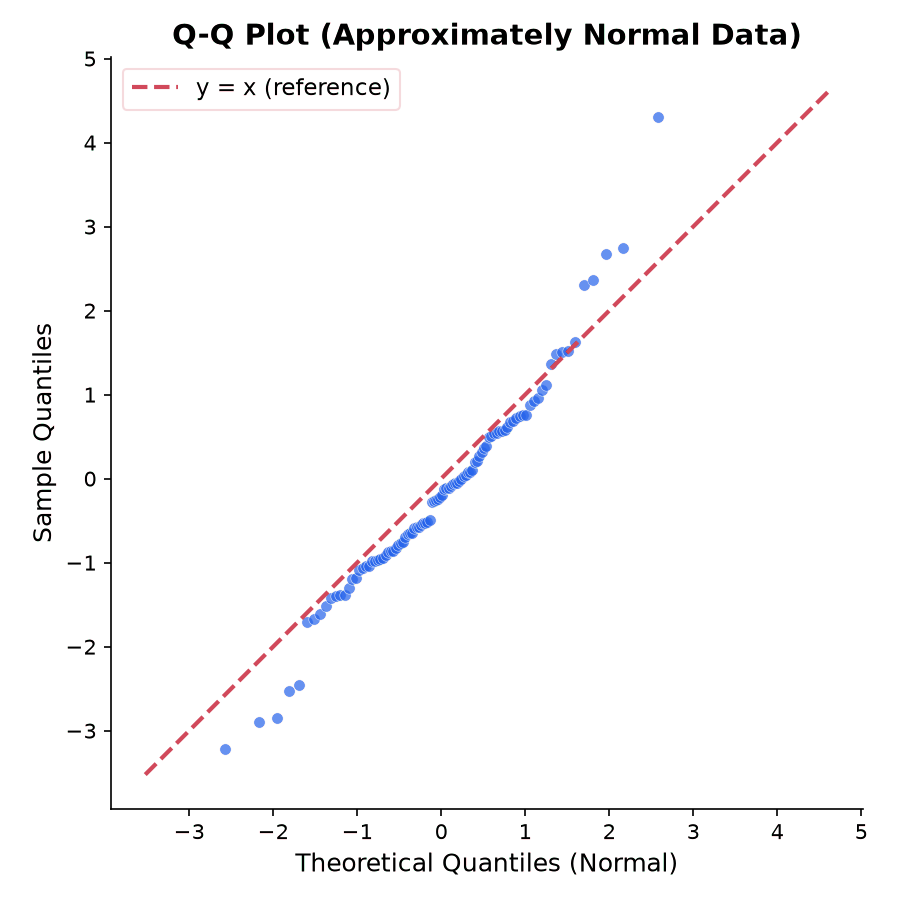

### Heat Map

A heat map is a color-coded matrix where the value in each cell is represented by a color. It turns a table of numbers into a visual pattern.

**What it shows:** Patterns, clusters, and outliers in two-dimensional data. The eye detects color gradients much faster than it can scan a table of numbers.

**Common uses:**

- **Correlation matrices:** Visualize pairwise correlations among many variables at once. Strong positive correlations appear in one color, strong negative in another, and near-zero correlations in a neutral color.
- **Confusion matrices:** In classification, show how predictions map to actual classes.
- **Gene expression data:** Rows are genes, columns are samples, colors represent expression levels.

**How to read it:** Look for blocks of similar color (groups of correlated variables), rows or columns that stand out (variables that behave differently), and the diagonal (which in a correlation matrix is always 1.0).

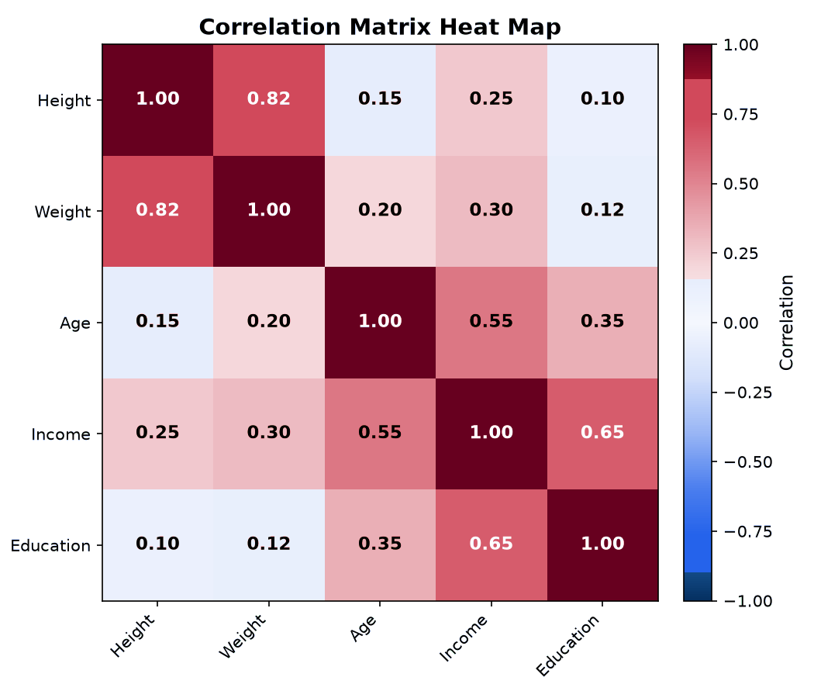

### Violin Plot

A violin plot combines a box plot with a **kernel density estimation** (KDE), which is a smoothed version of a histogram. The "violin" shape shows the full distribution of the data, not just the quartiles.

**What it shows:** The distribution shape, including whether the data is multimodal (has multiple peaks). A box plot hides multimodality; a violin plot reveals it.

**When to use it:** When comparing distributions across groups, especially when the distributions might have different shapes (not just different centers or spreads). If one group's data is bimodal and another's is unimodal, a violin plot makes this immediately visible while box plots would look similar.

### Anscombe's Quartet

Anscombe's quartet is a collection of four datasets constructed by statistician Francis Anscombe in 1973. All four datasets have nearly identical summary statistics:

- Mean of $x$: $\bar{x} = 9.0$
- Mean of $y$: $\bar{y} \approx 7.50$
- Standard deviation of $x$: $s_x \approx 3.32$
- Standard deviation of $y$: $s_y \approx 2.03$
- Correlation: $r \approx 0.816$
- Regression line: $y \approx 3.0 + 0.5x$

Yet the four scatter plots look completely different:

1. **Dataset I:** A straightforward linear relationship. The regression line is a good summary.
2. **Dataset II:** A clear nonlinear (parabolic) pattern. The linear regression line misses the shape entirely.
3. **Dataset III:** A near-perfect linear relationship with one extreme outlier that pulls the regression line.
4. **Dataset IV:** Nearly all $x$-values are the same, with a single high-leverage point determining the entire regression. Without that one point, there would be no relationship at all.

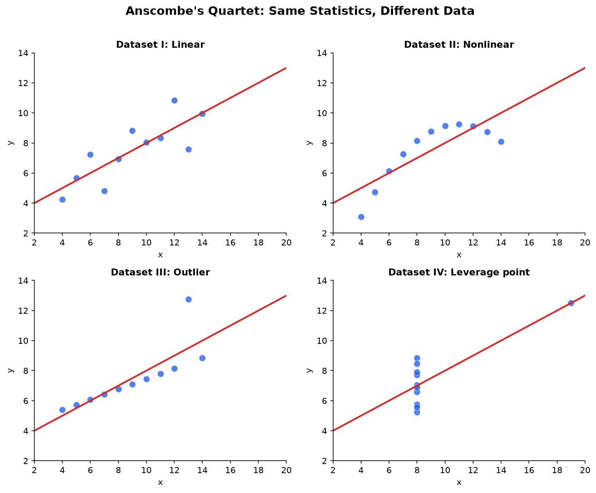

**The lesson:** Summary statistics and regression fits can be identical for datasets that have fundamentally different structures. Always visualize your data. A scatter plot takes seconds to produce and can prevent you from fitting a linear model to nonlinear data, missing outliers that distort your analysis, or drawing conclusions driven by a single influential point.

## Sampling Distributions and Standard Error

**Sampling distribution:** If you drew many samples of size $n$ from a population and computed the sample mean $\bar{x}$ each time, the distribution of those sample means is the sampling distribution of $\bar{x}$.

By the [Central Limit Theorem](./probability#central-limit-theorem), this sampling distribution is approximately normal with:

- Mean: $\mu_{\bar{x}} = \mu$ (the sample mean is centered on the true mean)
- Standard deviation: $\sigma_{\bar{x}} = \frac{\sigma}{\sqrt{n}}$

See the Central Limit Theorem happen below: pick a deliberately non-normal source (skewed, bimodal, a coin flip), draw many sample means, and watch their histogram become bell-shaped and tighten like $1/\sqrt{n}$, tracking the overlaid normal.

<iframe src="/static/interactive/stats-clt-sampler.html" width="100%" height="660" style="border:none;"></iframe>

**Standard error (SE):** The standard deviation of a sampling distribution. For the sample mean:

$$
SE = \frac{\sigma}{\sqrt{n}}
$$

When $\sigma$ is unknown (which is almost always), we estimate it with the sample standard deviation $s$:

$$
SE \approx \frac{s}{\sqrt{n}}
$$

**Intuition:** The standard error tells you how much your sample mean would vary if you repeated the sampling. Larger samples give smaller standard errors, meaning more precise estimates. Notice the $\sqrt{n}$ in the denominator: to cut the standard error in half, you need four times as much data.

### The t-Distribution

When you estimate the standard error using the sample standard deviation $s$ instead of the (unknown) population standard deviation $\sigma$, the resulting standardized statistic does not follow a standard normal distribution. It follows a **t-distribution**, which was discovered by William Gosset (publishing under the pseudonym "Student") in 1908.

**What it is:** The t-distribution looks like the standard normal distribution (bell-shaped, symmetric, centered at zero) but has **heavier tails**. This means extreme values are more probable under the t-distribution than under the normal. The heavier tails reflect the additional uncertainty introduced by estimating $\sigma$ with $s$.

**Degrees of freedom ($\nu$):** The shape of the t-distribution is controlled by a single parameter called degrees of freedom, typically $\nu = n - 1$ for a one-sample problem. The degrees of freedom count how many independent pieces of information go into estimating the variability.

- When $\nu$ is small (say 3 or 4), the t-distribution has noticeably heavier tails than the normal. Critical values are larger, so confidence intervals are wider and hypothesis tests are less likely to reject.
- As $\nu$ increases, the t-distribution approaches the standard normal. By $\nu = 30$, the two are quite close. By $\nu = 120$, they are nearly indistinguishable.
- At $\nu = \infty$, the t-distribution is exactly the standard normal.

**Why it exists:** The Z-score $Z = \frac{\bar{x} - \mu}{\sigma/\sqrt{n}}$ follows a standard normal distribution. But when you replace $\sigma$ with $s$, the quantity $t = \frac{\bar{x} - \mu}{s/\sqrt{n}}$ does not follow a standard normal. The denominator $s/\sqrt{n}$ is itself a random variable (it changes from sample to sample), which introduces extra variability. The t-distribution accounts for this. With small samples, $s$ can be a poor estimate of $\sigma$, so the t-distribution's heavier tails provide wider intervals that reflect this uncertainty.

**When to use t vs. z:**

| Situation | Distribution | In practice |
|---|---|---|
| $\sigma$ known | Standard normal ($z$) | Almost never happens |
| $\sigma$ unknown, large $n$ | Either (they are nearly the same) | Use $t$ to be safe |
| $\sigma$ unknown, small $n$ | Must use $t$ | Common situation |

**Practical rule:** Use the t-distribution whenever $\sigma$ is unknown, regardless of sample size. There is no cost to using $t$ when $n$ is large (it gives essentially the same answer as $z$), and it is necessary when $n$ is small.

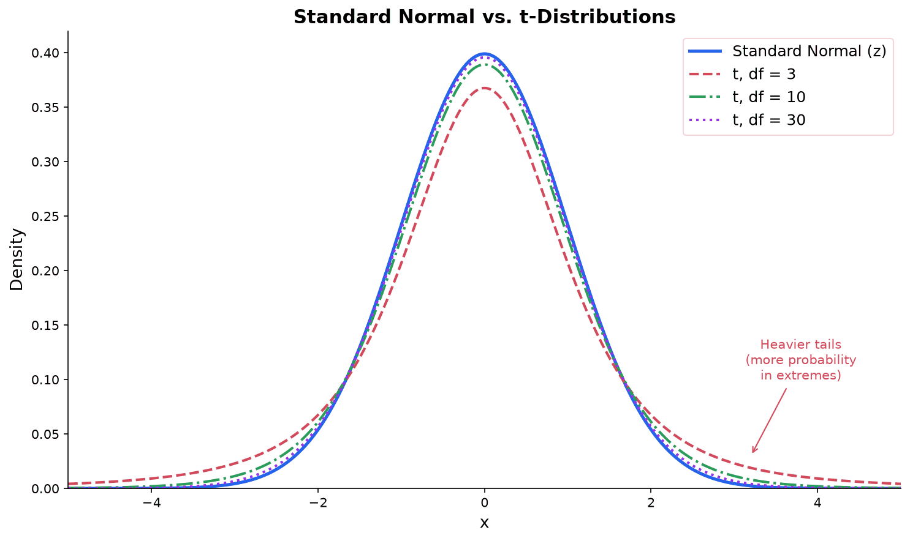

## Point Estimation and Interval Estimation

### Point Estimation


**Point estimate:** A single value used to estimate a population parameter. The sample mean $\bar{x}$ is a point estimate of $\mu$. A point estimate is your best single guess but gives no sense of how reliable it is.

**Desirable properties of estimators:**

- **Unbiased:** On average, the estimator hits the true parameter. $E[\hat{\theta}] = \theta$.
- **Consistent:** As sample size grows, the estimator converges to the true value.
- **Efficient:** Among unbiased estimators, it has the smallest variance.

#### Fisher Information and the Cramér-Rao Bound

The efficiency property raises a natural question: how small *can* the variance of an unbiased estimator be? The answer is governed by the **Fisher information**, which measures how much information a single observation carries about an unknown parameter.

For a model with density $P(x \mid \theta)$, the Fisher information (from one observation) is the expected squared derivative of the log-likelihood with respect to the parameter (the derivative $\partial_\theta \log P(x \mid \theta)$ is called the *score*):

$$
I(\theta) = \mathbb{E}\!\left[\left(\frac{\partial}{\partial \theta} \log P(X \mid \theta)\right)^2\right] = -\,\mathbb{E}\!\left[\frac{\partial^2}{\partial \theta^2} \log P(X \mid \theta)\right]
$$

The two expressions are equal under mild regularity conditions. Intuitively, $I(\theta)$ is large when the log-likelihood is sharply peaked (the data pin down $\theta$ tightly) and small when it is flat (the data are nearly uninformative). For $n$ independent observations the information adds: the total is $n\,I(\theta)$.

**The Cramér-Rao lower bound (CRLB):** For any unbiased estimator $\hat{\theta}$ of $\theta$ based on $n$ observations,

$$
\operatorname{Var}(\hat{\theta}) \geq \frac{1}{n\,I(\theta)}.
$$

No unbiased estimator can do better than $1/(n I(\theta))$; more information means a smaller achievable variance. This is the precise meaning of "efficient": an estimator is **efficient** when it attains the Cramér-Rao bound, i.e. its variance equals $1/(n I(\theta))$. An unbiased estimator that has the smallest possible variance among *all* unbiased estimators is called the **uniformly minimum-variance unbiased estimator (UMVUE)**; if it also meets the CRLB it is efficient in the finite-sample sense.

**Finite-sample vs. asymptotic efficiency:** These two notions are worth separating. *Finite-sample efficiency* (the UMVUE / Cramér-Rao sense) asks whether an estimator attains the minimum variance for every fixed $n$. *Asymptotic efficiency* is a weaker, large-$n$ statement: it asks only that the variance approach the Cramér-Rao bound as $n \to \infty$. The MLE is generally *asymptotically* efficient (its variance approaches $1/(n I(\theta))$ for large $n$) even when it is biased or not the UMVUE at any finite sample size. This distinction is why, for small samples, a UMVUE can beat the MLE, while for large samples the MLE is essentially optimal.

#### Sufficiency and the Factorization Theorem

The Cramér-Rao thread asked *how well* a single estimator can do. A companion question is more structural: which functions of the data actually carry the information about $\theta$, and which parts of the sample are just noise we can discard? A statistic that captures everything relevant is called **sufficient**, and the answer connects directly back to the UMVUE.

**Intuition.** A statistic $T(X)$ (any function of the sample $X = (X_1, \dots, X_n)$) is **sufficient** for $\theta$ if, once you know the value of $T$, the rest of the data tells you nothing more about $\theta$. For example, if you flip a coin $n$ times to learn its bias, the *number* of heads seems to be all that matters; the specific order in which they landed feels irrelevant. Sufficiency makes that intuition precise.

**Formal definition.** $T(X)$ is sufficient for $\theta$ if the conditional distribution of the sample $X$ given $T(X) = t$ does not depend on $\theta$. Because that conditional distribution is $\theta$-free, whatever information the data held about $\theta$ has been fully absorbed into $T$.

**The Neyman-Fisher factorization theorem.** Checking the definition directly requires computing a conditional distribution, which is awkward. The factorization theorem replaces it with a purely algebraic test: $T(X)$ is sufficient for $\theta$ if and only if the likelihood factors as

$$
p(x \mid \theta) = g\big(T(x), \theta\big)\, h(x),
$$

where $g$ depends on the data only through $T(x)$ and $h(x)$ does not depend on $\theta$ at all. In words: if $\theta$ touches the data only through the combination $T(x)$, then $T$ is sufficient.

**Worked example (Bernoulli $p$).** Let $X_1, \dots, X_n$ be independent $\text{Bernoulli}(p)$, so each $x_i \in \{0,1\}$ with pmf $p(x_i \mid p) = p^{x_i}(1-p)^{1-x_i}$. The joint pmf is the product:

$$
p(x \mid p) = \prod_{i=1}^{n} p^{x_i}(1-p)^{1-x_i} = p^{\,t}\,(1-p)^{\,n - t},
$$

where $t = \sum_{i=1}^n x_i$ is the total number of successes (the exponents add because $\sum_i x_i = t$ and $\sum_i (1 - x_i) = n - t$). This already has the factorization form with $g(t, p) = p^{\,t}(1-p)^{\,n-t}$ and $h(x) = 1$. The data enter only through $t$, so $T(X) = \sum_i X_i$ is sufficient for $p$. Concretely, once we know that $t = 3$ of $n = 10$ flips were heads, every arrangement of those 3 heads is equally likely (there are $\binom{10}{3} = 120$, each with conditional probability $1/120$), and that $1/120$ does not involve $p$. The same argument gives $\sum_i X_i$ as sufficient for the Poisson rate $\lambda$.

**Minimal sufficiency.** A sufficient statistic is **minimal sufficient** if it is a function of every other sufficient statistic, i.e. it compresses the data as far as possible without losing information. For the Bernoulli model, $\sum_i X_i$ is minimal sufficient.

**The Rao-Blackwell theorem.** Sufficiency is not just descriptive; it is a tool for *improving* estimators. Let $\hat{\theta}$ be any unbiased estimator of $\theta$, and let $T$ be sufficient. Define the **Rao-Blackwellized** estimator $\tilde{\theta} = \mathbb{E}[\hat{\theta} \mid T]$. Because $T$ is sufficient, this is a genuine statistic (it does not depend on the unknown $\theta$), and it is still unbiased ($\mathbb{E}[\tilde{\theta}] = \theta$ by the law of total expectation) with variance no larger ($\operatorname{Var}(\tilde{\theta}) \leq \operatorname{Var}(\hat{\theta})$ by the law of total variance). Conditioning on a sufficient statistic can only help, never hurt: it averages away the noise in the discarded part of the data.

**Connection to the UMVUE (Lehmann-Scheffé).** Rao-Blackwell says the best unbiased estimators must be functions of a sufficient statistic, so the hunt for the UMVUE can be restricted to functions of $T$. If $T$ is moreover **complete** (a technical condition ruling out any nonzero unbiased estimator of $0$ built from $T$), there is only *one* unbiased function of $T$, and the **Lehmann-Scheffé theorem** concludes it is *the* UMVUE. For the Bernoulli model this recovers the familiar result that $\bar{X} = T/n$ is the UMVUE for $p$, an estimator that also attains the Cramér-Rao bound and is therefore efficient in the finite-sample sense.

### Confidence Intervals

**Confidence interval (CI):** A range of values that is likely to contain the true population parameter. A 95% confidence interval means: if you repeated this process many times, about 95% of the intervals you construct would contain the true parameter.

For the mean (when $n$ is large or population is normal):

$$
\bar{x} \pm z^* \cdot \frac{s}{\sqrt{n}}
$$

where $z^*$ is the critical value from the standard normal distribution (1.96 for 95%, 2.576 for 99%).


**Common misinterpretation:** A 95% CI does NOT mean "there is a 95% probability the true mean is in this interval." The true mean is either in the interval or it is not. The 95% refers to the long-run success rate of the procedure.

**Example (large sample, z-interval):** A sample of 100 exam scores has $\bar{x} = 72$ and $s = 15$. Construct a 95% confidence interval for the population mean.

$$
72 \pm 1.96 \cdot \frac{15}{\sqrt{100}} = 72 \pm 1.96 \cdot 1.5 = 72 \pm 2.94
$$

The 95% CI is $(69.06, 74.94)$.

### t-Intervals

When the sample size is small and $\sigma$ is unknown (the typical situation), use the t-distribution instead of the z-distribution. The formula replaces $z^*$ with $t^*$:

$$
\bar{x} \pm t^* \cdot \frac{s}{\sqrt{n}}
$$

where $t^*$ is the critical value from the t-distribution with $\nu = n - 1$ degrees of freedom at the desired confidence level.

**How to find $t^*$:** Look up the value in a t-table using the row for $\nu = n - 1$ degrees of freedom and the column for the desired confidence level. For example, with $\nu = 14$ and 95% confidence, $t^* = 2.145$. Statistical software computes this directly.

Common $t^*$ values (95% confidence):

| df ($\nu$) | $t^*$ |
|---|---|
| 5 | 2.571 |
| 10 | 2.228 |
| 14 | 2.145 |
| 20 | 2.086 |
| 30 | 2.042 |
| $\infty$ | 1.960 |

Notice how $t^*$ decreases toward 1.960 (the z-value) as degrees of freedom increase.

**Worked example:** A sample of $n = 15$ light bulbs has a mean lifetime of $\bar{x} = 68$ hours and a sample standard deviation of $s = 12$ hours. Construct a 95% confidence interval for the population mean lifetime.

Step 1: Degrees of freedom: $\nu = 15 - 1 = 14$.

Step 2: Find $t^*$ for 95% confidence with 14 df: $t^* = 2.145$.

Step 3: Compute the margin of error:

$$
t^* \cdot \frac{s}{\sqrt{n}} = 2.145 \cdot \frac{12}{\sqrt{15}} = 2.145 \cdot 3.098 = 6.645
$$

Step 4: Construct the interval:

$$
68 \pm 6.645 = (61.355, 74.645)
$$

We are 95% confident that the population mean lifetime is between 61.4 and 74.6 hours. Notice this interval is wider than what a z-interval would give ($68 \pm 1.96 \cdot 3.098 = 68 \pm 6.07$), reflecting the extra uncertainty from using $s$ instead of $\sigma$ with a small sample.

### Confidence Interval for a Proportion

When estimating a population proportion $p$ (e.g., the fraction of voters who support a candidate), the point estimate is the sample proportion $\hat{p} = x/n$, where $x$ is the number of successes in $n$ trials.

The standard error of $\hat{p}$ is:

$$
SE(\hat{p}) = \sqrt{\frac{\hat{p}(1 - \hat{p})}{n}}
$$

The confidence interval uses the normal approximation (valid when $n\hat{p} \geq 10$ and $n(1-\hat{p}) \geq 10$):

$$
\hat{p} \pm z^* \sqrt{\frac{\hat{p}(1-\hat{p})}{n}}
$$

**Worked example:** In a survey of 400 customers, 260 say they are satisfied with a product. Construct a 95% CI for the true proportion of satisfied customers.

$\hat{p} = 260/400 = 0.65$

Check conditions: $n\hat{p} = 260 \geq 10$ and $n(1-\hat{p}) = 140 \geq 10$. Both satisfied.

$$
SE = \sqrt{\frac{0.65 \times 0.35}{400}} = \sqrt{\frac{0.2275}{400}} = \sqrt{0.000569} = 0.0239
$$

$$
0.65 \pm 1.96 \times 0.0239 = 0.65 \pm 0.047
$$

The 95% CI is $(0.603, 0.697)$. We are 95% confident that the true proportion of satisfied customers is between 60.3% and 69.7%.

**Where it shows up in ML:** Confidence intervals for model performance metrics (accuracy, AUC) help you determine whether one model is genuinely better than another, or if the difference is within sampling noise.

### Prediction Intervals

A **prediction interval (PI)** is a range that is likely to contain a single new observation from the population. This is fundamentally different from a confidence interval.

**The key distinction:**

- **Confidence interval:** Estimates where the population mean lies. It answers: "Where does the average fall?"
- **Prediction interval:** Estimates where an individual new data point will fall. It answers: "Where will the next observation land?"

**Why the prediction interval is always wider:** A confidence interval only accounts for uncertainty in estimating the mean. A prediction interval must account for two sources of uncertainty: (1) the estimation uncertainty (we do not know the true mean exactly) and (2) the individual variability (even if we knew the mean perfectly, individual observations scatter around it). Because individual observations are more variable than averages, prediction intervals are always wider than confidence intervals.

**Formula for a prediction interval (one-sample):**

$$
\bar{x} \pm t^* \cdot s\sqrt{1 + \frac{1}{n}}
$$

Compare this to the confidence interval formula $\bar{x} \pm t^* \cdot s/\sqrt{n}$. The prediction interval has the extra "$1 +$" under the square root, which adds the individual observation variance $s^2$ to the estimation variance $s^2/n$.

**Worked example:** A factory produces bolts with a sample mean length of $\bar{x} = 10.2$ cm ($s = 0.4$ cm, $n = 25$). Construct a 95% prediction interval for the length of the next bolt produced.

Step 1: Degrees of freedom: $\nu = 25 - 1 = 24$, so $t^* = 2.064$.

Step 2: Compute the margin of error:

$$
t^* \cdot s\sqrt{1 + \frac{1}{n}} = 2.064 \times 0.4 \times \sqrt{1 + \frac{1}{25}} = 0.826 \times \sqrt{1.04} = 0.826 \times 1.020 = 0.842
$$

Step 3: Construct the interval:

$$
10.2 \pm 0.842 = (9.358, 11.042)
$$

For comparison, the 95% confidence interval for the mean is:

$$
10.2 \pm 2.064 \times \frac{0.4}{\sqrt{25}} = 10.2 \pm 0.165 = (10.035, 10.365)
$$

The prediction interval $(9.36, 11.04)$ is much wider than the confidence interval $(10.04, 10.37)$, because predicting where a single bolt will fall is far less precise than estimating the average bolt length.

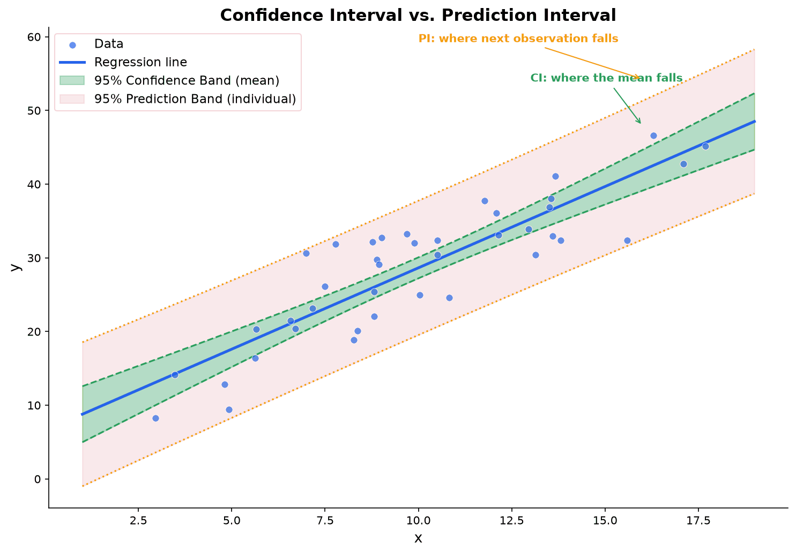

**Where it shows up:** In regression, the prediction interval around a regression line is always wider than the confidence band. The confidence band tells you where the true regression line might be; the prediction band tells you where new data points might fall. Any time you use a model to make predictions about individual cases (not averages), you should report prediction intervals.

## Maximum Likelihood Estimation (MLE)

**Maximum Likelihood Estimation (MLE):** A method for estimating model parameters by finding the parameter values that make the observed data most probable.

**The core idea:** Given data $x_1, x_2, \ldots, x_n$, the **likelihood function** is the probability of observing that data as a function of the parameter $\theta$:

$$
L(\theta) = \prod_{i=1}^n P(x_i | \theta)
$$

The MLE is the value $\hat{\theta}$ that maximizes $L(\theta)$. In practice, we maximize the **log-likelihood** instead (because products become sums, which are easier to work with):

$$
\ell(\theta) = \sum_{i=1}^n \log P(x_i | \theta)
$$

### Worked Example: MLE for a Coin

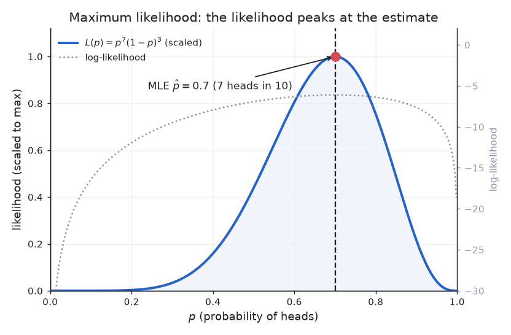

You flip a coin 10 times and get 7 heads. What is the MLE of $p$ (the probability of heads)?

Each flip follows a Bernoulli distribution, so:

$$
L(p) = \prod_{i=1}^{10} p^{x_i}(1-p)^{1-x_i} = p^7(1-p)^3
$$

Take the log:

$$
\ell(p) = 7\log(p) + 3\log(1-p)
$$

Take the derivative and set it to zero:

$$
\frac{d\ell}{dp} = \frac{7}{p} - \frac{3}{1-p} = 0
$$

$$
7(1-p) = 3p \implies 7 = 10p \implies \hat{p} = 0.7
$$

The MLE is $\hat{p} = 0.7$, which is simply the fraction of heads. This makes intuitive sense: the value of $p$ that makes 7 out of 10 heads most likely is exactly 7/10.

### Worked Example: MLE for Normal Distribution

Given data $x_1, \ldots, x_n$ from a normal distribution, find the MLE for $\mu$ and $\sigma^2$.

The log-likelihood is:

$$
\ell(\mu, \sigma^2) = -\frac{n}{2}\log(2\pi) - \frac{n}{2}\log(\sigma^2) - \frac{1}{2\sigma^2}\sum_{i=1}^n (x_i - \mu)^2
$$

Taking derivatives and setting to zero:

$$
\hat{\mu}_{MLE} = \frac{1}{n}\sum_{i=1}^n x_i = \bar{x}
$$

$$
\hat{\sigma}^2_{MLE} = \frac{1}{n}\sum_{i=1}^n (x_i - \bar{x})^2
$$

The MLE for the mean is just the sample mean. The MLE for the variance uses $n$ (not $n-1$), which makes it slightly biased: it underestimates the true variance by a factor of $(n-1)/n$. This bias is negligible for large $n$ (for example, $(n-1)/n = 0.99$ when $n = 100$), but it is substantial for small $n$ (a 20% underestimate when $n = 5$). This bias shrinks toward zero as $n$ grows, so MLE is still consistent (converges to the true value with enough data). This is a known limitation of MLE.

**Where it shows up in ML:** MLE is the foundation of many ML training procedures. Logistic regression finds parameters by maximizing the log-likelihood of the observed labels. Training a neural network with cross-entropy loss is equivalent to MLE. Minimizing cross-entropy loss = maximizing log-likelihood.

**Connection to optimization:** Finding the MLE requires solving an optimization problem (maximizing the log-likelihood). For simple distributions, you can solve analytically (as above). For complex models, you use gradient ascent.

## Method of Moments Estimation

**Method of Moments (MoM):** An estimation technique that works by setting sample moments equal to their theoretical (population) counterparts and solving for the unknown parameters.

### The Idea

Every distribution has moments that depend on its parameters. The first population moment is the mean $E[X]$, the second raw moment is $E[X^2]$, and so on. The method of moments replaces each population moment with the corresponding sample moment and solves the resulting equations.

**First moment equation:**

$$
\bar{X} = E[X]
$$

**Second moment equation:**

$$
\frac{1}{n}\sum_{i=1}^n X_i^2 = E[X^2]
$$

If the distribution has $k$ unknown parameters, you set up $k$ moment equations (using the first $k$ moments) and solve the system.

### Worked Example: Uniform Distribution on $[0, \theta]$

Suppose you have data from a uniform distribution on $[0, \theta]$ and you want to estimate $\theta$.

For a uniform distribution on $[0, \theta]$:

$$
E[X] = \frac{\theta}{2}
$$

Set the first sample moment equal to the first population moment:

$$
\bar{X} = \frac{\theta}{2}
$$

Solve for $\theta$:

$$
\hat{\theta}_{MoM} = 2\bar{X}
$$

**Numerical example:** You observe 5 data points: 1.2, 0.8, 1.5, 0.3, 1.1. The sample mean is $\bar{X} = (1.2 + 0.8 + 1.5 + 0.3 + 1.1)/5 = 0.98$. The method of moments estimate is $\hat{\theta}_{MoM} = 2(0.98) = 1.96$.

Note that the largest observation is 1.5, and we are estimating $\theta = 1.96$, which is well above the data. This is reasonable: a uniform distribution on $[0, 1.96]$ would produce data in this range.

For comparison, the MLE for this problem is $\hat{\theta}_{MLE} = \max(X_1, \ldots, X_n) = 1.5$, which is always less than or equal to the true $\theta$. The MLE is biased downward here, while $2\bar{X}$ is unbiased for $\theta$ in this specific uniform$[0, \theta]$ model (this is a property of this particular setup, not a general virtue of MoM; MoM estimators are frequently biased). One catch of the MoM estimate: because $2\bar{X}$ ignores the largest observation, it can fall below $\max(x_i)$, which is impossible for the true $\theta$ (every observation must lie in $[0, \theta]$). In that case the "estimate" is logically inconsistent with the data, whereas the MLE never is.

### MoM vs. MLE

| | Method of Moments | MLE |
|---|---|---|
| Approach | Match sample moments to population moments | Maximize likelihood of observed data |
| Computation | Usually simple algebra | May require numerical optimization |
| Efficiency | Often less efficient (higher variance) | Achieves the lowest possible variance asymptotically |
| Uniqueness | Solution may not be unique | Under regularity conditions, unique |
| When to use | Quick estimates, starting points for iterative MLE, when likelihood is hard to compute | When you want the best possible estimate and can handle the computation |

**In practice:** MoM estimates are often used as starting values for iterative MLE algorithms. They are quick to compute and usually in the right neighborhood, which helps the optimizer converge.

## MAP Estimation


**Maximum a Posteriori (MAP) estimation:** Like MLE, but incorporates a prior belief about the parameters.

$$
\hat{\theta}_{MAP} = \arg\max_\theta P(\theta | \text{data}) = \arg\max_\theta \left[ \log P(\text{data} | \theta) + \log P(\theta) \right]
$$

By [Bayes' theorem](./probability#bayes-theorem): the posterior is proportional to the likelihood times the prior. MLE uses only the likelihood; MAP adds the prior.

**MLE vs. MAP:**

| | MLE | MAP |
|---|-----|-----|
| Formula | $\arg\max L(\theta)$ | $\arg\max L(\theta) \cdot P(\theta)$ |
| Prior | None (or equivalently, uniform prior) | Requires specifying a prior |
| With lots of data | MAP and MLE converge | MAP and MLE converge |
| With little data | Can overfit | Prior acts as regularization |

**Connection to regularization:** If you use a Gaussian prior $P(\theta) \sim N(0, \sigma^2)$, the MAP estimate is equivalent to L2 regularization (ridge regression). The prior penalizes large parameter values, pulling them toward zero. If you use a Laplace prior, you get L1 regularization (lasso). This is one of the deepest connections between Bayesian statistics and ML.

**Where it shows up in ML:** Ridge regression is MAP estimation with a Gaussian prior. Understanding this connection helps explain why regularization works: it is not just a trick to prevent overfitting, it is a principled way to incorporate prior beliefs about parameter values.

## Hypothesis Testing

**Hypothesis testing:** A formal procedure for deciding whether data provides enough evidence to reject a claim about a population.

### The Framework

1. **Null hypothesis ($H_0$):** The default claim, usually "no effect" or "no difference." Example: "the coin is fair" ($p = 0.5$).
2. **Alternative hypothesis ($H_1$ or $H_a$):** What you believe might be true instead. Example: "the coin is biased" ($p \neq 0.5$).
3. **Test statistic:** A number computed from data that measures how far the observed result is from what $H_0$ predicts.
4. **p-value:** The probability of observing a test statistic as extreme as (or more extreme than) what you actually saw, assuming $H_0$ is true.
5. **Decision:** If the p-value is below a threshold $\alpha$ (typically 0.05), reject $H_0$.

### Type I and Type II Errors

| | $H_0$ is true | $H_0$ is false |
|---|---|---|
| Reject $H_0$ | **Type I error** (false positive) | Correct (true positive) |
| Fail to reject $H_0$ | Correct (true negative) | **Type II error** (false negative) |

- $\alpha$ = probability of Type I error (significance level, usually 0.05)
- $\beta$ = probability of Type II error
- **Power** = $1 - \beta$ = probability of correctly detecting a real effect

**The tradeoff:** Lowering $\alpha$ (being more strict about rejecting $H_0$) reduces Type I errors but increases Type II errors. You catch fewer false alarms, but you also miss more real effects.


The picture shows why the errors trade off. Sliding the critical value left shrinks $\beta$ (more power) but grows $\alpha$; sliding it right does the reverse. The only way to shrink both at once is to separate the two curves, which means a larger sample or a bigger effect.

### Example: Testing Whether a Coin Is Fair

You flip a coin 100 times and get 60 heads. Is the coin fair?

**Setup:** $H_0: p = 0.5$, $H_1: p \neq 0.5$

Under $H_0$, the number of heads follows a binomial distribution with $n = 100$, $p = 0.5$. By the CLT, this is approximately normal with mean $np = 50$ and standard deviation $\sqrt{np(1-p)} = 5$.

**Test statistic (Z-score):**

$$
Z = \frac{60 - 50}{5} = 2.0
$$

**p-value:** $P(|Z| \geq 2.0) \approx 0.046$

Since $0.046 < 0.05$, we reject $H_0$. The data provides statistically significant evidence that the coin is biased.

**Important caveat:** Statistical significance does not mean practical significance. With a large enough sample, you can detect arbitrarily tiny effects that are meaningless in practice. Always consider effect size alongside p-values.

### One-Tailed vs. Two-Tailed Tests

The alternative hypothesis determines whether you perform a one-tailed or two-tailed test, and this choice affects both the rejection region and the p-value.

**Two-tailed test:** $H_1: \mu \neq \mu_0$. You are looking for a difference in either direction. The rejection region is split between both tails of the distribution, with $\alpha/2$ in each tail. Use this when you have no prior reason to expect the effect to go in a particular direction.

**One-tailed test (right-tailed):** $H_1: \mu > \mu_0$. You are specifically testing whether the parameter is larger than the hypothesized value. The entire rejection region ($\alpha$) is in the right tail.

**One-tailed test (left-tailed):** $H_1: \mu < \mu_0$. You are specifically testing whether the parameter is smaller. The entire rejection region is in the left tail.

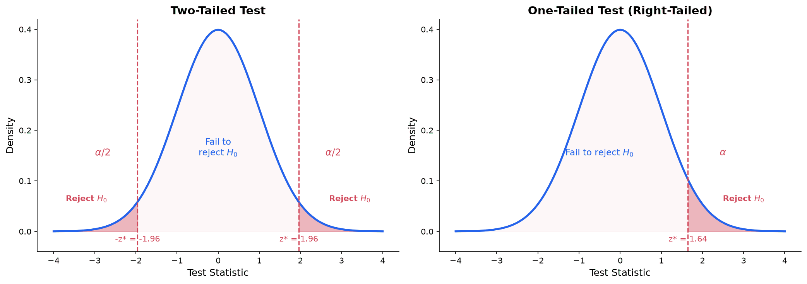

**How p-values differ:** For the same test statistic, the one-tailed p-value is exactly half the two-tailed p-value, but only when the null distribution is symmetric and the observed effect falls in the hypothesized direction. If a two-tailed test gives $p = 0.08$ (not significant at $\alpha = 0.05$), a one-tailed test in the correct direction gives $p = 0.04$ (significant). If instead the effect points the wrong way (opposite the one-tailed alternative), the one-tailed p-value is $1 - \tfrac{1}{2}p_{\text{two}}$, which exceeds $0.5$. This is not a trick to get significance; it reflects a genuinely different question.

**When to use which:**

| Test type | When to use | Example |
|---|---|---|
| Two-tailed | No strong prior expectation of direction | "Does this drug change blood pressure?" |
| One-tailed | Strong prior reason to test one direction only | "Does this drug lower blood pressure?" (based on its mechanism of action) |

**The critical rule:** You must choose one-tailed vs. two-tailed before looking at the data. Choosing a one-tailed test after seeing which direction the data points is a form of p-hacking and inflates the false positive rate.

**Power advantage of one-tailed tests:** Because the entire $\alpha$ is concentrated in one tail, one-tailed tests have more power to detect effects in the hypothesized direction. The tradeoff is that they have zero power to detect effects in the opposite direction. If you are wrong about the direction, a one-tailed test will never reject $H_0$ no matter how strong the effect.

### Effect Size

**Effect size** measures the magnitude of a difference or relationship, independent of sample size. A p-value tells you whether an effect exists; the effect size tells you how big it is.

**Why it matters:** With a large enough sample, even a trivially small difference becomes statistically significant. A study of 100,000 people might find that a drug lowers blood pressure by 0.1 mmHg with $p < 0.001$. Statistically significant, but clinically meaningless. Conversely, a small study might fail to detect a large, important effect simply because $n$ was too small. Effect size separates "real" from "important."

**Cohen's d:** The most common effect size for comparing two group means. It expresses the difference in means in units of pooled standard deviation:

$$
d = \frac{\bar{x}_1 - \bar{x}_2}{s_p}
$$

where $s_p$ is the pooled standard deviation:

$$
s_p = \sqrt{\frac{(n_1 - 1)s_1^2 + (n_2 - 1)s_2^2}{n_1 + n_2 - 2}}
$$

**Cohen's guidelines for interpreting $d$:**

| $|d|$ | Interpretation |
|---|---|
| 0.2 | Small effect |
| 0.5 | Medium effect |
| 0.8 | Large effect |

A Cohen's $d$ of 0.5 means the two group means differ by half a standard deviation. These benchmarks are rough guidelines, not rigid thresholds. In some fields, $d = 0.2$ is a meaningful effect; in others, $d = 0.8$ is routine.

**$R^2$ as effect size in regression:** The coefficient of determination $R^2$ is itself an effect size: it tells you what proportion of the variance in the outcome is explained by the predictors. Cohen's guidelines: $R^2 = 0.02$ (small), $R^2 = 0.13$ (medium), $R^2 = 0.26$ (large). These are the $R^2$ values corresponding to Cohen's benchmarks for $f^2 = R^2 / (1 - R^2)$, namely $f^2 = 0.02, 0.15, 0.35$; Cohen defined the thresholds on $f^2$ rather than on $R^2$ directly.

**Best practice:** Always report effect size alongside p-values. A complete result looks like: "Students who used the new method scored significantly higher ($t(28) = 2.45$, $p = 0.021$, $d = 0.91$)." The p-value says the difference is unlikely to be zero; the effect size says the difference is large.

**Research connection:** Statistical testing is central to mechanistic interpretability. Causal ablation (removing specific attention heads and measuring performance degradation) is essentially a controlled experiment with a null hypothesis ("this head contributes nothing"). Effect sizes matter: a head whose removal causes +420% degradation is a strong causal finding, while +1.4% for P0 sink removal confirms they are safely removable. Multiple comparisons correction becomes important when testing hundreds of heads simultaneously.

### Power Analysis

**Statistical power** is the probability of correctly rejecting a false null hypothesis. In other words, if there really is an effect, power is the probability that your study will detect it.

$$
\text{Power} = 1 - \beta
$$

where $\beta$ is the probability of a Type II error (failing to detect a real effect).

**Why power matters:** An underpowered study is nearly useless. If your power is only 0.20, there is an 80% chance you will miss a real effect. You invest time and resources, collect data, and conclude "no significant effect," when the effect was there all along but your study was too small to see it.

**Four factors determine power (change any one, and power changes):**

1. **Sample size ($n$):** Larger samples give more power. This is the factor researchers most often control.
2. **Effect size:** Larger effects are easier to detect. A drug that cuts recovery time in half is easier to detect than one that cuts it by 5%.
3. **Significance level ($\alpha$):** A more lenient $\alpha$ (e.g., 0.10 instead of 0.05) gives more power but also more false positives.
4. **Variability ($\sigma$):** Less noisy data gives more power. You can sometimes reduce variability through better measurement or by using a within-subjects design.

**Sample size determination:** Before collecting data, you can use a power analysis to determine how many subjects you need. You specify:

- The desired power (typically 0.80 or 0.90)
- The significance level (typically $\alpha = 0.05$)
- The minimum effect size you want to detect

For a one-sample t-test with $\alpha = 0.05$, power $= 0.80$, and Cohen's $d = 0.5$ (medium effect), the required sample size is approximately $n = 34$. This comes from solving:

$$
n \approx \left(\frac{z_{1-\alpha/2} + z_{1-\beta}}{d}\right)^2 = \left(\frac{1.96 + 0.84}{0.5}\right)^2 = \left(\frac{2.80}{0.5}\right)^2 = 31.4
$$

(The exact calculation uses the noncentral t-distribution and gives $n \approx 34$.)

**Worked example:** A researcher wants to detect a mean difference of 5 points on a test where the standard deviation is 10 (so $d = 5/10 = 0.5$). Using $\alpha = 0.05$ and desired power of 0.80, the required sample size is approximately $n = 34$ per group for a two-sample test (about 64 total). If the researcher can only recruit 20 per group, the power drops to about 0.34, meaning there is only a 34% chance of detecting the effect even if it exists.

### One-Sample t-Test

**When to use:** You want to test whether a population mean equals a specific hypothesized value $\mu_0$, and the population standard deviation is unknown.

**Test statistic:**

$$
t = \frac{\bar{x} - \mu_0}{s/\sqrt{n}}
$$

This follows a t-distribution with $\nu = n - 1$ degrees of freedom under $H_0$.

**One-tailed vs. two-tailed tests:**

- **Two-tailed** ($H_1: \mu \neq \mu_0$): Reject if $|t| > t^*_{\alpha/2}$. Use when you want to detect a difference in either direction.
- **Left-tailed** ($H_1: \mu < \mu_0$): Reject if $t < -t^*_{\alpha}$. Use when you only care about detecting a decrease.
- **Right-tailed** ($H_1: \mu > \mu_0$): Reject if $t > t^*_{\alpha}$. Use when you only care about detecting an increase.

**Worked example:** A manufacturer claims that batteries last an average of 500 hours. A consumer group tests 20 batteries and finds $\bar{x} = 485$ hours with $s = 40$ hours. Test the claim at $\alpha = 0.05$.

$H_0: \mu = 500$ (the claim is correct)

$H_1: \mu < 500$ (the batteries last less than claimed; one-tailed)

$$
t = \frac{485 - 500}{40/\sqrt{20}} = \frac{-15}{8.944} = -1.677
$$

Degrees of freedom: $\nu = 19$. The critical value for a one-tailed test at $\alpha = 0.05$ with 19 df is $t^* = 1.729$.

Since $|{-1.677}| = 1.677 < 1.729$, we fail to reject $H_0$. There is not enough evidence at the 5% level to conclude that the batteries last less than 500 hours.

Note: the p-value is approximately 0.055, just above 0.05. This illustrates that the 0.05 threshold is a convention, not a law. The evidence against the claim is suggestive but not conclusive by the standard criterion.

### Two-Sample t-Test

**When to use:** You want to compare the means of two independent groups.

**Setup:** Group 1 has $n_1$ observations with mean $\bar{x}_1$ and standard deviation $s_1$. Group 2 has $n_2$ observations with mean $\bar{x}_2$ and standard deviation $s_2$.

$H_0: \mu_1 = \mu_2$ (no difference between groups)

$H_1: \mu_1 \neq \mu_2$ (the groups differ)

**Pooled t-test** (when you can assume equal variances $\sigma_1^2 = \sigma_2^2$):

$$
t = \frac{\bar{x}_1 - \bar{x}_2}{s_p\sqrt{\frac{1}{n_1} + \frac{1}{n_2}}}
$$

where $s_p = \sqrt{\frac{(n_1-1)s_1^2 + (n_2-1)s_2^2}{n_1+n_2-2}}$ is the pooled standard deviation, with $\nu = n_1 + n_2 - 2$ degrees of freedom.

**Welch's t-test** (when variances may be unequal; this is the safer default):

$$
t = \frac{\bar{x}_1 - \bar{x}_2}{\sqrt{\frac{s_1^2}{n_1} + \frac{s_2^2}{n_2}}}
$$

The degrees of freedom are approximated by the Welch-Satterthwaite formula:

$$
\nu \approx \frac{\left(\frac{s_1^2}{n_1} + \frac{s_2^2}{n_2}\right)^2}{\frac{(s_1^2/n_1)^2}{n_1-1} + \frac{(s_2^2/n_2)^2}{n_2-1}}
$$

**Worked example:** Do students who study with music score differently than those who study in silence?

| | Music ($n_1 = 25$) | Silence ($n_2 = 25$) |
|---|---|---|
| Mean | $\bar{x}_1 = 74$ | $\bar{x}_2 = 79$ |
| SD | $s_1 = 10$ | $s_2 = 12$ |

Using Welch's t-test:

$$
t = \frac{74 - 79}{\sqrt{\frac{100}{25} + \frac{144}{25}}} = \frac{-5}{\sqrt{4 + 5.76}} = \frac{-5}{\sqrt{9.76}} = \frac{-5}{3.124} = -1.601
$$

The Welch-Satterthwaite degrees of freedom: $\nu \approx 46.4$, so we use $\nu = 46$.

The critical value for a two-tailed test at $\alpha = 0.05$ with 46 df is approximately $t^* = 2.013$. Since $|{-1.601}| < 2.013$, we fail to reject $H_0$. There is not enough evidence to conclude that music affects test scores.

Effect size: $d = \frac{74 - 79}{s_p} = \frac{-5}{11.05} \approx -0.45$, a small-to-medium effect. A larger sample might detect this difference.

**Confidence interval for the difference of means.** The same ingredients give an interval for $\mu_1 - \mu_2$, which reports the plausible size of the difference rather than just testing whether it is zero:

$$
(\bar{x}_1 - \bar{x}_2) \pm t^* \sqrt{\frac{s_1^2}{n_1} + \frac{s_2^2}{n_2}}
$$

(using the Welch standard error and degrees of freedom; the pooled version replaces the root with $s_p\sqrt{1/n_1 + 1/n_2}$). For the example above, $\bar{x}_1 - \bar{x}_2 = -5$, the standard error is $\sqrt{9.76} = 3.124$, and with $\nu = 46$, $t^* = 2.013$, so the 95% CI is $-5 \pm 2.013 \times 3.124 = -5 \pm 6.29 = (-11.29,\ 1.29)$. The interval contains $0$, which is the interval-based counterpart of failing to reject $H_0$.

### Paired t-Test

**When to use:** You have two measurements on the same subjects (before and after a treatment, left and right hand, two test versions taken by the same students). The key feature is that the observations are not independent; they come in natural pairs.

**Procedure:** Compute the difference $d_i = x_{i,\text{after}} - x_{i,\text{before}}$ for each pair. Then perform a one-sample t-test on the differences, testing $H_0: \mu_d = 0$ (the treatment has no effect).

$$
t = \frac{\bar{d}}{s_d/\sqrt{n}}
$$

where $\bar{d}$ is the mean of the differences, $s_d$ is the standard deviation of the differences, and $n$ is the number of pairs.

**Worked example:** A company tests whether a training program improves employee performance scores. Ten employees are tested before and after the program.

| Employee | Before | After | Difference ($d_i$) |
|---|---|---|---|
| 1 | 78 | 84 | 6 |
| 2 | 65 | 68 | 3 |
| 3 | 90 | 93 | 3 |
| 4 | 72 | 80 | 8 |
| 5 | 55 | 62 | 7 |
| 6 | 83 | 85 | 2 |
| 7 | 60 | 67 | 7 |
| 8 | 74 | 78 | 4 |
| 9 | 69 | 75 | 6 |
| 10 | 81 | 82 | 1 |

$\bar{d} = (6+3+3+8+7+2+7+4+6+1)/10 = 4.7$

$s_d = \sqrt{\frac{\sum(d_i - \bar{d})^2}{n-1}} = \sqrt{\frac{(1.3^2+1.7^2+1.7^2+3.3^2+2.3^2+2.7^2+2.3^2+0.7^2+1.3^2+3.7^2)}{9}}$

$$
= \sqrt{\frac{1.69+2.89+2.89+10.89+5.29+7.29+5.29+0.49+1.69+13.69}{9}} = \sqrt{\frac{52.10}{9}} = \sqrt{5.789} = 2.406
$$

$$
t = \frac{4.7}{2.406/\sqrt{10}} = \frac{4.7}{0.761} = 6.175
$$

With $\nu = 9$ degrees of freedom, the critical value for a one-tailed test ($H_1: \mu_d > 0$) at $\alpha = 0.05$ is $t^* = 1.833$. Since $6.175 \gg 1.833$, we reject $H_0$. The training program significantly improved scores ($t(9) = 6.18$, $p < 0.001$, $d = 4.7/2.406 = 1.95$, a very large effect).

### Tests for Proportions

So far the tests in this chapter (t-tests, ANOVA) have compared *means* of numeric variables. Often the quantity of interest is instead a *proportion*: the fraction of a population in some category, such as the share of users who click a button or the accuracy of a classifier (the proportion of predictions that are correct). We already built the [confidence interval for a single proportion](#confidence-interval-for-a-proportion) above; this section develops the corresponding *hypothesis tests* and the two-sample comparison.

The setup throughout is a **Bernoulli** experiment: $n$ independent trials, each a "success" (probability $p$) or "failure" (probability $1 - p$). We count $x$ successes and form $\hat{p} = x/n$. Because $\hat{p}$ is an average of $n$ independent 0/1 outcomes, the Central Limit Theorem makes its sampling distribution approximately normal for large $n$, which is what makes a $z$-test appropriate.

#### One-Proportion z-Test

**When to use:** You want to test whether a population proportion equals a specific hypothesized value $p_0$.

$$
H_0: p = p_0 \qquad H_1: p \neq p_0 \ \ (\text{or one-sided})
$$

**Test statistic:**

$$
z = \frac{\hat{p} - p_0}{\sqrt{\dfrac{p_0(1 - p_0)}{n}}}
$$

Under $H_0$ this is approximately standard normal. Note the denominator uses $p_0$, the *hypothesized* value, not the observed $\hat{p}$: a hypothesis test computes the null distribution, and *if $H_0$ were true* the true standard deviation of $\hat{p}$ is $\sqrt{p_0(1 - p_0)/n}$. (This differs from the confidence interval, which makes no such assumption and uses $\hat{p}$.) The normal approximation is trustworthy when $n p_0 \geq 10$ and $n(1 - p_0) \geq 10$.

**Worked example:** A coin is spun 200 times and lands heads 115 times. Test at $\alpha = 0.05$ whether it is fair. $H_0: p = 0.5$ versus $H_1: p \neq 0.5$ (two-tailed). Here $\hat{p} = 115/200 = 0.575$, and conditions hold ($n p_0 = 100 \geq 10$). The standard error under the null is

$$
SE = \sqrt{\frac{0.5 \times 0.5}{200}} = \sqrt{0.00125} = 0.03536,
$$

so

$$
z = \frac{0.575 - 0.5}{0.03536} = 2.121, \qquad p\text{-value} = 2 \times P(Z > 2.121) = 2 \times 0.0169 = 0.034.
$$

Since $0.034 < 0.05$, we reject $H_0$: there is significant evidence the coin is not fair.

#### Two-Proportion z-Test

**When to use:** You want to compare the proportions of two independent groups, for example the conversion rate of a control page versus a redesign.

$$
H_0: p_1 = p_2 \qquad H_1: p_1 \neq p_2
$$

Under $H_0$ the two groups share a common true proportion, best estimated by pooling both samples into the **pooled proportion**

$$
\hat{p} = \frac{x_1 + x_2}{n_1 + n_2}.
$$

**Test statistic:**

$$
z = \frac{\hat{p}_1 - \hat{p}_2}{\sqrt{\hat{p}(1 - \hat{p})\left(\dfrac{1}{n_1} + \dfrac{1}{n_2}\right)}}
$$

The pooled $\hat{p}$ appears in the standard error (because the test assumes $H_0$ is true, and under $H_0$ there is a single proportion), while the numerator is the observed difference.

**Worked example (an A/B test):** A control checkout page converts $x_1 = 80$ of $n_1 = 1000$ visitors; a redesigned page converts $x_2 = 112$ of $n_2 = 1000$. Test at $\alpha = 0.05$. The sample proportions are $\hat{p}_1 = 0.080$ and $\hat{p}_2 = 0.112$; the pooled proportion is $\hat{p} = 192/2000 = 0.096$. Then

$$
SE = \sqrt{0.096 \times 0.904 \times \left(\tfrac{1}{1000} + \tfrac{1}{1000}\right)} = \sqrt{0.00017357} = 0.01317,
$$

$$
z = \frac{0.112 - 0.080}{0.01317} = 2.429, \qquad p\text{-value} = 2 \times P(Z > 2.429) = 0.015.
$$

Since $0.015 < 0.05$, we reject $H_0$: the redesign has a significantly different (higher) conversion rate.

#### Confidence Interval for a Difference of Proportions

The test asks "is there a difference?"; a confidence interval asks "how big?". For $p_1 - p_2$:

$$
(\hat{p}_1 - \hat{p}_2) \pm z^* \sqrt{\frac{\hat{p}_1(1 - \hat{p}_1)}{n_1} + \frac{\hat{p}_2(1 - \hat{p}_2)}{n_2}}
$$

Note the interval uses the *separate, unpooled* proportions: a CI does not assume $p_1 = p_2$, so there is no shared value to pool toward. Using the A/B data above for $p_2 - p_1$, the point estimate is $0.112 - 0.080 = 0.032$ and

$$
SE = \sqrt{\frac{0.112 \times 0.888}{1000} + \frac{0.080 \times 0.920}{1000}} = \sqrt{0.00017306} = 0.01316,
$$

$$
0.032 \pm 1.96 \times 0.01316 = 0.032 \pm 0.0258 = (0.0062,\ 0.0578).
$$

We are 95% confident the redesign increases conversion by between about 0.6 and 5.8 percentage points. The interval excludes 0, consistent with rejecting $H_0$ above.

**Where it shows up in ML:** This is the statistical backbone of **A/B testing**. Conversion rates, click-through rates, and "fraction of sessions with an error" are all proportions, and deciding whether a new model or UI variant genuinely moved such a metric is a two-proportion comparison. The confidence interval is often more useful than the test alone, because shipping decisions depend on the *magnitude* of the lift. (For paired predictions on the *same* examples, McNemar's test is more powerful.)

### Chi-Squared Goodness-of-Fit Test

**When to use:** You want to test whether observed frequency counts match a set of expected frequencies. This is used for categorical data, not means.

**Test statistic:**

$$
\chi^2 = \sum_{i=1}^k \frac{(O_i - E_i)^2}{E_i}
$$

where $O_i$ is the observed count in category $i$, $E_i$ is the expected count, and $k$ is the number of categories. Under $H_0$, this follows a chi-squared distribution with $\nu = k - 1$ degrees of freedom.

**Worked example:** You roll a die 120 times and want to test whether it is fair ($H_0$: each face has probability $1/6$).

| Face | Observed ($O_i$) | Expected ($E_i = 120/6 = 20$) | $(O_i - E_i)^2/E_i$ |
|---|---|---|---|
| 1 | 25 | 20 | 1.25 |
| 2 | 17 | 20 | 0.45 |
| 3 | 15 | 20 | 1.25 |
| 4 | 23 | 20 | 0.45 |
| 5 | 24 | 20 | 0.80 |
| 6 | 16 | 20 | 0.80 |

$$
\chi^2 = 1.25 + 0.45 + 1.25 + 0.45 + 0.80 + 0.80 = 5.00
$$

Degrees of freedom: $\nu = 6 - 1 = 5$. The critical value for $\alpha = 0.05$ with 5 df is $\chi^2_{0.05} = 11.07$.

Since $5.00 < 11.07$, we fail to reject $H_0$. The data is consistent with a fair die.

**Assumption:** Each expected count $E_i$ should be at least 5 for the chi-squared approximation to be reliable. If some expected counts are too small, combine categories.

### Chi-Squared Test of Independence

**When to use:** You have two categorical variables measured on the same subjects and want to test whether they are independent (unrelated) or associated.

**Setup:** Arrange the data in a contingency table with $r$ rows and $c$ columns. The expected count for cell $(i, j)$ under independence is:

$$
E_{ij} = \frac{R_i \cdot C_j}{n}
$$

where $R_i$ is the row total, $C_j$ is the column total, and $n$ is the grand total.

**Test statistic:**

$$
\chi^2 = \sum_{i=1}^r \sum_{j=1}^c \frac{(O_{ij} - E_{ij})^2}{E_{ij}}
$$

with $\nu = (r-1)(c-1)$ degrees of freedom.

**Worked example:** Is there an association between exercise frequency and stress level?

| | Low Stress | High Stress | Total |
|---|---|---|---|
| Exercises regularly | 40 | 10 | 50 |
| Does not exercise | 20 | 30 | 50 |
| Total | 60 | 40 | 100 |

Expected counts under independence:

$$
E_{11} = \frac{50 \times 60}{100} = 30, \quad E_{12} = \frac{50 \times 40}{100} = 20
$$

$$
E_{21} = \frac{50 \times 60}{100} = 30, \quad E_{22} = \frac{50 \times 40}{100} = 20
$$

$$
\chi^2 = \frac{(40-30)^2}{30} + \frac{(10-20)^2}{20} + \frac{(20-30)^2}{30} + \frac{(30-20)^2}{20}
$$

$$
= \frac{100}{30} + \frac{100}{20} + \frac{100}{30} + \frac{100}{20} = 3.33 + 5.00 + 3.33 + 5.00 = 16.67
$$

Degrees of freedom: $(2-1)(2-1) = 1$. The critical value at $\alpha = 0.05$ with 1 df is $\chi^2_{0.05} = 3.841$.

Since $16.67 \gg 3.841$, we reject $H_0$. There is a statistically significant association between exercise and stress level. The data suggests that regular exercisers tend to report lower stress.

**Where it shows up in ML:** A/B testing uses hypothesis testing to determine if a new feature improves a metric. Statistical tests help determine if one model is significantly better than another, or if the difference is just noise. Chi-squared tests are used in feature selection to test whether a categorical feature is associated with the target variable.

### Measures of Association: Odds Ratio and Relative Risk

The [chi-squared test of independence](#chi-squared-test-of-independence) answers a yes-or-no question: **are** two categorical variables associated? It does not say **how strongly**. For a $2 \times 2$ table (two groups, an outcome that either happens or does not), the **relative risk** and the **odds ratio** quantify the strength and direction of the association with a single number.

**The generic $2 \times 2$ table.** Label the cell counts:

| | Outcome present | Outcome absent |
|---|---|---|
| **Group 1** | $a$ | $b$ |
| **Group 2** | $c$ | $d$ |

**Relative risk (RR).** The *risk* (probability) of the outcome is $a/(a+b)$ for group 1 and $c/(c+d)$ for group 2. Their ratio is

$$
\text{RR} = \frac{a/(a+b)}{c/(c+d)}.
$$

An RR of $2$ means the outcome is twice as likely in group 1 as in group 2.

**Odds ratio (OR).** The *odds* of the outcome are $a/b$ in group 1 and $c/d$ in group 2. Their ratio is

$$
\text{OR} = \frac{a/b}{c/d} = \frac{ad}{bc}.
$$

The last form (the "cross-product ratio") is the quickest way to compute it by hand.

**Interpretation.** For both measures, a value of $1$ means **no association**; greater than $1$ indicates a positive association (group 1 has the higher risk or odds), and less than $1$ indicates a protective effect.

**When each is appropriate.** Relative risk is more directly interpretable ("twice as likely"), but it can only be estimated when the outcome probabilities are meaningful, as in a **cohort (prospective) study** that follows subjects forward from exposure to outcome. In a **case-control (retrospective) study**, subjects are selected *by their outcome*, so the sampling distorts $a+b$ and $c+d$ and the risks are not valid estimates. The odds ratio is invariant to this kind of sampling and can still be estimated, which is why case-control studies report odds ratios. When the outcome is rare, the odds ratio also closely approximates the relative risk.

**Worked example.** Reusing the exercise-and-stress data from the [chi-squared test of independence](#chi-squared-test-of-independence), treat "high stress" as the outcome:

| | High stress | Low stress | Total |
|---|---|---|---|
| **Does not exercise** (group 1) | 30 | 20 | 50 |
| **Exercises regularly** (group 2) | 10 | 40 | 50 |

So $a = 30$, $b = 20$, $c = 10$, $d = 40$. The risk of high stress is $30/50 = 0.60$ for non-exercisers and $10/50 = 0.20$ for exercisers, so

$$
\text{RR} = \frac{0.60}{0.20} = 3.0.
$$

The odds are $30/20 = 1.5$ and $10/40 = 0.25$, so

$$
\text{OR} = \frac{1.5}{0.25} = 6.0, \qquad \text{equivalently} \qquad \frac{ad}{bc} = \frac{30 \times 40}{20 \times 10} = 6.0.
$$

Both exceed $1$, quantifying the positive association the chi-squared test flagged: not exercising triples the *risk* and sextuples the *odds* of high stress. The odds ratio is larger than the relative risk here because the outcome is common (not rare), so the two are not expected to coincide.

### Goodness-of-Fit Beyond Chi-Squared

The chi-squared test checks whether observed counts match expected counts across categories. But sometimes you want to test whether continuous data follows a specific distribution (normal, exponential, uniform, etc.). Two tests handle this.

#### Kolmogorov-Smirnov (KS) Test

**What it does:** Compares the empirical cumulative distribution function (ECDF) of your data to the CDF of a theoretical distribution. The test statistic is the maximum vertical distance between the two CDFs:

$$
D = \max_x |F_n(x) - F_0(x)|
$$

where $F_n(x)$ is the empirical CDF (the proportion of data points $\leq x$) and $F_0(x)$ is the theoretical CDF.

**When to use:** Testing whether data follows any specified continuous distribution (not just normal). The KS test is general-purpose.

**Limitation:** The KS test is most sensitive to differences near the center of the distribution and less sensitive to differences in the tails. It also loses validity if you estimate the distribution parameters from the same data you are testing (use the Lilliefors variant in that case).

#### Shapiro-Wilk Test

**What it does:** Specifically tests whether data comes from a normal distribution. It is considered the most powerful normality test for small to moderate sample sizes ($n < 5000$).

**When to use:** Before using any statistical method that assumes normality (t-tests, ANOVA, linear regression). If the Shapiro-Wilk test rejects normality, consider using nonparametric alternatives or transforming the data.

**Interpretation:** $H_0$ is that the data is normally distributed. A small p-value (e.g., $p < 0.05$) means the data departs significantly from normality. A large p-value means the data is consistent with normality (but does not prove it).

#### Which Test to Use

| Test | Best for | Limitation |
|---|---|---|
| Chi-squared goodness-of-fit | Categorical data or binned counts | Requires choosing bins; loses information |
| Kolmogorov-Smirnov | Testing against any continuous distribution | Less sensitive in tails; must specify distribution in advance |
| Shapiro-Wilk | Testing normality specifically | Only tests normality; limited to moderate $n$ |

**Practical workflow:** Before running a t-test or ANOVA, check normality with a Q-Q plot (visual) and the Shapiro-Wilk test (formal). If normality is violated, either transform the data or switch to a nonparametric test.

## Inference for Variances

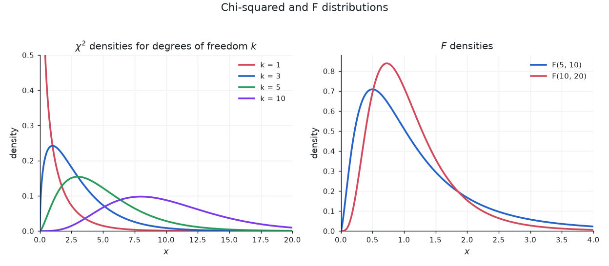

So far our inference has been about *centers*: the mean of a population, the difference between two means. But sometimes the *spread itself* is the quantity of interest. A machine that fills cereal boxes might hit the correct average weight while varying so wildly that some boxes are nearly empty; the customer cares about the consistency, which is a statement about the variance. Two portfolios might share the same expected return while one is far more volatile. Quality control is very often a claim that a process variance stays below a tolerance. The tools for such claims are two new reference distributions: the chi-squared distribution (for a single variance) and the F-distribution (for comparing two variances).

### The Chi-Squared Distribution in This Context

Draw a sample of size $n$ from a normal population with variance $\sigma^2$ and compute the sample variance $s^2$. The key distributional fact is that

$$
\frac{(n-1)s^2}{\sigma^2} \sim \chi^2_{n-1},
$$

a [chi-squared distribution](./probability#chi-squared-distribution) with $n - 1$ degrees of freedom (one is used up estimating $\bar{x}$, exactly as with the $t$-distribution). Two features matter. First, it lives on $[0, \infty)$: a sum of squares is never negative. Second, it is **right-skewed**, so unlike the symmetric normal, a two-sided procedure needs **two separate critical values**, a lower one $\chi^2_{n-1,\,\alpha/2}$ and an upper one $\chi^2_{n-1,\,1-\alpha/2}$ (here $\chi^2_{k,\,p}$ is the $p$-quantile, the value below which a fraction $p$ of the distribution lies).

### The F-Distribution

To compare *two* variances we need a distribution for their ratio. The **F-distribution** is the distribution of a ratio of two independent chi-squared variables, each divided by its own degrees of freedom. If $U_1 \sim \chi^2_{d_1}$ and $U_2 \sim \chi^2_{d_2}$ are independent,

$$
F = \frac{U_1/d_1}{U_2/d_2} \sim F_{d_1,\,d_2},
$$

with **numerator degrees of freedom** $d_1$ and **denominator degrees of freedom** $d_2$ (the order matters; $F_{d_1,d_2}$ is generally not $F_{d_2,d_1}$). Because it is built from non-negative chi-squared variables, the F-distribution is supported on $[0, \infty)$ and is **right-skewed**. Its asymmetry gives a useful identity for lower-tail critical values:

$$
F_{d_1,\,d_2,\,1-\alpha} = \frac{1}{F_{d_2,\,d_1,\,\alpha}}.
$$

(For instance $F_{20,15,\,0.975} \approx 2.756$, so $1/2.756 \approx 0.363 = F_{15,20,\,0.025}$.) The F-distribution is also the reference distribution for the **ANOVA** F-statistic and the **overall F-test** in regression, both of which appear elsewhere on this page: in every case the idea is to form a ratio of two variance-like quantities and ask whether it is farther from $1$ than chance alone would explain.

### Confidence Interval for a Single Variance

Starting from the pivot $\dfrac{(n-1)s^2}{\sigma^2} \sim \chi^2_{n-1}$ and trapping it between the two critical values, then solving for $\sigma^2$ (inverting flips the inequalities, so the *upper* critical value lands in the *lower* endpoint), the $100(1-\alpha)\%$ confidence interval is

$$
\left(\frac{(n-1)s^2}{\chi^2_{n-1,\,1-\alpha/2}},\ \frac{(n-1)s^2}{\chi^2_{n-1,\,\alpha/2}}\right).
$$

**Worked example.** From $n = 20$ fills we compute $s^2 = 4.2$ (in mL$^2$) and want a 95% CI for $\sigma^2$, assuming normal fill volumes. With $\alpha/2 = 0.025$ and $n - 1 = 19$ df, $\chi^2_{19,\,0.025} = 8.907$ and $\chi^2_{19,\,0.975} = 32.852$, and $(n-1)s^2 = 19 \times 4.2 = 79.8$. So

$$
\text{lower} = \frac{79.8}{32.852} = 2.429, \qquad \text{upper} = \frac{79.8}{8.907} = 8.960,
$$

giving the 95% CI $(2.429,\ 8.960)$ mL$^2$. The interval is not centered on $s^2 = 4.2$; it stretches farther right, reflecting the chi-squared skew. For a CI on $\sigma$, take square roots: $(\sqrt{2.429},\ \sqrt{8.960}) = (1.559,\ 2.993)$ mL.

### F-Test for Equality of Two Variances

For two independent normal samples, to test $H_0: \sigma_1^2 = \sigma_2^2$ against $H_1: \sigma_1^2 \neq \sigma_2^2$, the population variances cancel under $H_0$ and

$$
F = \frac{s_1^2}{s_2^2} \sim F_{n_1 - 1,\,n_2 - 1}.
$$

Values near $1$ support $H_0$; values far from $1$ are evidence against it. Reject at level $\alpha$ if $F > F_{n_1-1,\,n_2-1,\,1-\alpha/2}$ or $F < F_{n_1-1,\,n_2-1,\,\alpha/2}$.

**Worked example.** Strategy 1 has $n_1 = 16$ daily returns with $s_1^2 = 42.5$; strategy 2 has $n_2 = 21$ with $s_2^2 = 10.2$. Test at $\alpha = 0.05$. Then

$$
F = \frac{42.5}{10.2} = 4.167,
$$

compared against $F_{15,\,20}$. The two-sided critical values are $F_{15,20,\,0.975} = 2.573$ and $F_{15,20,\,0.025} = 0.363$. Since $4.167 > 2.573$ (equivalently, a two-sided p-value of about $0.0036$), we reject $H_0$: the two strategies have significantly different return variances, with strategy 1 the more volatile.

**Caveat: the F-test is fragile.** The F-test for variances is notoriously **sensitive to departures from normality**: heavier tails or skew can make it reject far more often than its stated $\alpha$ even when the variances are equal. When normality is in doubt, prefer a robust alternative such as **Levene's test** (or its median-centered Brown-Forsythe variant).

## ANOVA (Analysis of Variance)

**ANOVA** (Analysis of Variance) is a method for comparing the means of three or more groups simultaneously. It tests whether at least one group mean differs from the others.

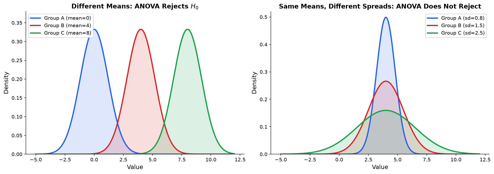

### Why Not Just Do Multiple t-Tests?

If you have three groups (A, B, C), you might consider doing three pairwise t-tests: A vs. B, A vs. C, B vs. C. The problem is the **multiple comparisons problem**.

Each test has a 5% chance of a Type I error ($\alpha = 0.05$). With three tests, the probability of at least one false positive is:

$$
1 - (1 - 0.05)^3 = 1 - 0.857 = 0.143
$$

That is a 14.3% chance of a false positive, not 5%. With 10 groups (45 pairwise comparisons), the probability rises to:

$$
1 - (0.95)^{45} \approx 0.90
$$

A 90% chance of at least one false positive. ANOVA solves this by performing a single test that controls the overall Type I error rate at $\alpha$.

### One-Way ANOVA

**Setup:** You have $k$ groups. Group $i$ has $n_i$ observations with mean $\bar{x}_i$. The grand mean (mean of all observations) is $\bar{x}$.

$H_0: \mu_1 = \mu_2 = \cdots = \mu_k$ (all group means are equal)

$H_1$: At least one group mean is different

**The key insight:** ANOVA decomposes the total variability in the data into two parts:

1. **Between-group variability (SSB):** How much the group means differ from the grand mean. If the groups truly have different means, this will be large.

$$
SSB = \sum_{i=1}^k n_i(\bar{x}_i - \bar{x})^2
$$

2. **Within-group variability (SSW):** How much individual observations vary within their own groups. This is the "background noise."

$$
SSW = \sum_{i=1}^k \sum_{j=1}^{n_i} (x_{ij} - \bar{x}_i)^2
$$

3. **Total variability:** $SST = SSB + SSW$

$$
SST = \sum_{i=1}^k \sum_{j=1}^{n_i} (x_{ij} - \bar{x})^2
$$

**Mean squares:** Divide each sum of squares by its degrees of freedom:

$$
MSB = \frac{SSB}{k - 1}, \quad MSW = \frac{SSW}{n - k}
$$

where $n = n_1 + n_2 + \cdots + n_k$ is the total number of observations.

**F-statistic:**

$$
F = \frac{MSB}{MSW}
$$

Under $H_0$, this follows an F-distribution with $k - 1$ and $n - k$ degrees of freedom. Large values of $F$ indicate that the between-group variability is much larger than the within-group variability, which is evidence against equal means.

**Worked example:** Three teaching methods are compared. Test scores:

| Method A | Method B | Method C |
|---|---|---|
| 85 | 90 | 70 |
| 78 | 88 | 75 |
| 82 | 92 | 68 |
| 80 | 85 | 72 |
| 75 | 95 | 65 |

Group means: $\bar{x}_A = 80$, $\bar{x}_B = 90$, $\bar{x}_C = 70$

Grand mean: $\bar{x} = (80 + 90 + 70)/3 = 80$ (since groups are equal-sized, this is the mean of the group means)

$SSB = 5(80-80)^2 + 5(90-80)^2 + 5(70-80)^2 = 0 + 500 + 500 = 1000$

$SSW$: For each group, sum the squared deviations from the group mean.

Method A: $(85-80)^2 + (78-80)^2 + (82-80)^2 + (80-80)^2 + (75-80)^2 = 25+4+4+0+25 = 58$

Method B: $(90-90)^2 + (88-90)^2 + (92-90)^2 + (85-90)^2 + (95-90)^2 = 0+4+4+25+25 = 58$

Method C: $(70-70)^2 + (75-70)^2 + (68-70)^2 + (72-70)^2 + (65-70)^2 = 0+25+4+4+25 = 58$

$SSW = 58 + 58 + 58 = 174$

| Source | SS | df | MS | F |
|---|---|---|---|---|
| Between | 1000 | $3-1=2$ | 500 | $500/14.5 = 34.48$ |
| Within | 174 | $15-3=12$ | 14.5 | |
| Total | 1174 | 14 | | |

The critical value for $F(2, 12)$ at $\alpha = 0.05$ is approximately 3.89. Since $34.48 \gg 3.89$, we reject $H_0$. At least one teaching method produces significantly different scores ($F(2,12) = 34.48$, $p < 0.001$).

### Post-Hoc Tests

ANOVA tells you that at least one group is different, but not which one(s). Post-hoc (after the fact) tests make pairwise comparisons while controlling the overall Type I error rate.

**Tukey's Honest Significant Difference (HSD):** Compares all pairs of group means. It uses a "studentized range" distribution to set the critical value so that the family-wise error rate stays at $\alpha$. This is the most common post-hoc test.

**Bonferroni correction:** Divide $\alpha$ by the number of comparisons. With 3 groups (3 comparisons), use $\alpha/3 = 0.0167$ for each pairwise test. Simple but conservative (it has less power than Tukey's HSD).

**In the example above:** A Tukey HSD would test each of the three pairwise gaps against the studentized-range critical value (using $MSW = 14.5$ and $n = 5$ per group). The $20$-point B-C gap ($90 - 70$) is large relative to that threshold and would be clearly significant. The two $10$-point gaps (B vs. A at $90 - 80$, and A vs. C at $80 - 70$) are borderline: with this within-group spread they sit near the critical value, so whether they reach significance depends on the exact cutoff rather than being a foregone conclusion.

### Two-Way ANOVA

One-way ANOVA compares group means across a single factor. Often each observation is classified by **two** factors at once, and we want to know how each factor, and their combination, influences the response. **Two-way ANOVA** handles this.

**Setup:** Factor $A$ has $a$ levels and factor $B$ has $b$ levels. Crossing them gives $a \times b$ cells. Write $\bar{x}_{i\cdot}$ for the mean at level $i$ of $A$, $\bar{x}_{\cdot j}$ for the mean at level $j$ of $B$, $\bar{x}_{ij}$ for the cell mean, and $\bar{x}$ for the grand mean.

**Partitioning the variability.** Just as one-way ANOVA split $SST$ into between and within, two-way ANOVA splits it into four pieces:

$$
SST = SS_A + SS_B + SS_{AB} + SSE
$$

- **Main effect of $A$** ($SS_A$): how the $A$-level means deviate from the grand mean, ignoring $B$.
- **Main effect of $B$** ($SS_B$): likewise for $B$.
- **Interaction** ($SS_{AB}$): variability in the cell means left over after both main effects are accounted for, capturing the extent to which the combined effect of $A$ and $B$ is not simply the sum of their separate effects.
- **Error** ($SSE$): variability of observations around their own cell mean, the background noise (analogous to $SSW$).

**Three F-tests.** Divide each sum of squares by its degrees of freedom and form an F-ratio against $MSE = SSE / (n - ab)$:

$$
F_A = \frac{MS_A}{MSE}, \qquad F_B = \frac{MS_B}{MSE}, \qquad F_{AB} = \frac{MS_{AB}}{MSE}
$$

where $MS_A = SS_A/(a-1)$, $MS_B = SS_B/(b-1)$, and $MS_{AB} = SS_{AB}/[(a-1)(b-1)]$. Each $F$ is compared to an F-distribution with the corresponding numerator df and $n - ab$ denominator df.

**What an interaction means.** An interaction is present when the effect of one factor **depends on the level of the other**. Cross a treatment factor (drug vs. placebo) with an age factor (young vs. old) and record mean recovery scores:

| | Young | Old |
|---|---|---|
| **Placebo** | 50 | 50 |
| **Drug** | 70 | 52 |

For **young** patients the drug raises the score by $70 - 50 = 20$; for **old** patients by only $52 - 50 = 2$. The drug's effect is not a single number; it *depends on age*, so there is an interaction. (If the drug added $20$ points in both groups, the cell means would be $50, 50, 70, 70$ and there would be no interaction, only two main effects.) On an **interaction plot** (cell means with age on the horizontal axis, one line per treatment), no interaction shows as **parallel** lines; here the placebo line is flat while the drug line falls steeply, so the non-parallel lines are the visual signature of the interaction, and a significant $F_{AB}$ is its formal counterpart.

### Multiple Testing Correction

**The problem:** When you perform many hypothesis tests simultaneously, the probability of at least one false positive grows rapidly, even if every null hypothesis is true. If you run 20 independent tests at $\alpha = 0.05$, the expected number of false positives is $20 \times 0.05 = 1$. The probability of at least one false positive is:

$$
1 - (1 - 0.05)^{20} = 1 - 0.358 = 0.642
$$

That is a 64.2% chance of at least one spurious "discovery." This is the multiple comparisons problem, and it shows up whenever you test many hypotheses at once.

#### Bonferroni Correction

The simplest fix: divide your significance level by the number of tests.

$$
\alpha_{\text{adjusted}} = \frac{\alpha}{m}
$$

where $m$ is the number of tests. If you are running 20 tests at $\alpha = 0.05$, use $\alpha_{\text{adjusted}} = 0.05/20 = 0.0025$ for each individual test.

**Why it works:** By the union bound, the probability of at least one false positive is at most $m \times \alpha_{\text{adjusted}} = m \times (\alpha/m) = \alpha$. This controls the **family-wise error rate (FWER)**: the probability of making even one Type I error across all tests.

**The tradeoff:** Bonferroni is conservative. As $m$ grows, the adjusted threshold becomes very stringent, and you lose power to detect real effects. With 1000 tests, you need $p < 0.00005$ to declare significance, which means you will miss many genuine effects.

#### False Discovery Rate (Benjamini-Hochberg)

A less conservative alternative that controls the **false discovery rate (FDR)**: the expected proportion of false positives among all rejected hypotheses.

**The procedure (Benjamini-Hochberg):**

1. Compute p-values for all $m$ tests
2. Sort the p-values from smallest to largest: $p_{(1)} \leq p_{(2)} \leq \cdots \leq p_{(m)}$
3. Find the largest $k$ such that $p_{(k)} \leq \frac{k}{m} \cdot \alpha$
4. Reject all hypotheses with $p_{(i)} \leq p_{(k)}$ (i.e., reject the $k$ smallest p-values)

**Example:** You run $m = 5$ tests and get sorted p-values: 0.001, 0.013, 0.029, 0.052, 0.210. With $\alpha = 0.05$:

| Rank ($k$) | $p_{(k)}$ | $\frac{k}{m} \cdot \alpha$ | $p_{(k)} \leq \frac{k}{m} \cdot \alpha$? |
|---|---|---|---|
| 1 | 0.001 | 0.010 | Yes |
| 2 | 0.013 | 0.020 | Yes |
| 3 | 0.029 | 0.030 | Yes |
| 4 | 0.052 | 0.040 | No |
| 5 | 0.210 | 0.050 | No |

The largest $k$ where the condition holds is $k = 3$. Reject the first 3 hypotheses. With Bonferroni ($\alpha/5 = 0.01$), you would only reject the first one.

#### Bonferroni vs. Benjamini-Hochberg

| | Bonferroni | Benjamini-Hochberg |
|---|---|---|
| Controls | Family-wise error rate (FWER) | False discovery rate (FDR) |
| Strictness | Very conservative | Less conservative |
| Power | Lower (misses more real effects) | Higher (finds more real effects) |
| Best for | High-stakes decisions (one false positive is costly) | Exploratory analysis (some false positives are tolerable) |

**Where it shows up:** Genome-wide association studies test millions of genetic variants simultaneously. A/B testing platforms run many experiments at once. In mechanistic interpretability, testing whether each of hundreds of attention heads contributes to a task requires multiple testing correction. Benjamini-Hochberg is the standard in genomics and increasingly in ML research; Bonferroni is used when the cost of a false positive is very high.

## Nonparametric Tests

Standard tests like the t-test and ANOVA assume that data is normally distributed (or that samples are large enough for the CLT to apply). When these assumptions fail, **nonparametric tests** provide alternatives that make fewer assumptions about the underlying distribution. They work with ranks instead of raw values, which makes them robust to outliers and applicable to ordinal data.

### When to Use Nonparametric Tests

- The data is clearly non-normal (skewed, heavy-tailed, or multimodal) and the sample is too small for the CLT
- The data is ordinal (ranked categories like "poor, fair, good, excellent")
- There are extreme outliers that would distort parametric tests
- The sample size is very small (e.g., $n < 15$) and you cannot verify normality

**The tradeoff:** Nonparametric tests are more broadly applicable, but they have less statistical power than their parametric counterparts when the parametric assumptions actually hold. If your data is truly normal, a t-test will detect effects that a nonparametric test might miss.

### Sign Test

The **sign test** is the simplest nonparametric test of all. It applies to a single sample (testing whether the population median equals some value $m_0$) or to paired data, and it assumes almost nothing: not normality, not even symmetry.

**How it works.** For paired data, compute the difference within each pair (for a one-sample median test, subtract $m_0$ from each observation). Then:

1. **Discard** any difference that is exactly zero, reducing the sample to $n$ nonzero differences.
2. **Count** the number of positive differences, $S$.
3. Under $H_0$, each nonzero difference is positive or negative with probability $\tfrac{1}{2}$, so $S \sim \text{Binomial}(n, \tfrac{1}{2})$.
4. The p-value is a binomial tail probability; for a two-sided test, take the more extreme of $S$ and $n - S$ and double the corresponding tail.

**Relationship to the Wilcoxon signed-rank test.** The sign test uses only the **sign** of each difference, throwing away its magnitude. The [Wilcoxon signed-rank test](#wilcoxon-signed-rank-test) additionally ranks the differences by size, so it uses more information and is **more powerful** when the differences are symmetric. The sign test's advantage is that it needs no symmetry assumption and works even when only the direction of each difference is known.

**Worked example.** Ten judges each compare two recipes; recipe X is preferred by $8$, recipe Y by $2$, no ties, so $n = 10$ and $S = 8$. Test $H_0$ (equal split) two-sided. Under $H_0$, $S \sim \text{Binomial}(10, 0.5)$, and

$$
P(S \ge 8) = \frac{\binom{10}{8} + \binom{10}{9} + \binom{10}{10}}{2^{10}} = \frac{45 + 10 + 1}{1024} = \frac{56}{1024} \approx 0.0547.
$$

The two-sided p-value is $2 \times 0.0547 \approx 0.109$. Since $0.109 > 0.05$, we do **not** reject $H_0$: with only ten judges, an $8$-to-$2$ split is not strong enough to conclude a genuine preference (a $9$-to-$1$ split would have crossed the threshold).

### Wilcoxon Signed-Rank Test

**Nonparametric alternative to:** the paired t-test.

**When to use:** You have paired observations (before/after, matched subjects) and you want to test whether the median difference is zero, without assuming the differences are normally distributed.

**How it works:** Compute the differences $d_i$ for each pair. Ignore any zero differences. Rank the absolute values of the remaining differences from smallest to largest. Assign each rank the sign of its corresponding difference. Sum the positive ranks ($W^+$) and negative ranks ($W^-$) separately. Under $H_0$, positive and negative ranks should be roughly balanced. A very large or very small $W^+$ indicates a systematic shift.

### Mann-Whitney U Test

**Nonparametric alternative to:** the two-sample t-test.

**When to use:** You want to compare two independent groups but cannot assume normality. Also called the Wilcoxon rank-sum test.

**How it works:** Combine all observations from both groups and rank them from smallest to largest. Sum the ranks for each group separately. If the two groups come from the same distribution, their rank sums should be proportional to their sample sizes. A disproportionate rank sum indicates that one group tends to have larger values.

**Interpretation:** The Mann-Whitney U test is often described as testing whether one group tends to produce larger values than the other. More precisely, it tests whether a randomly selected observation from Group 1 is equally likely to be larger or smaller than a randomly selected observation from Group 2.

### Kruskal-Wallis Test

**Nonparametric alternative to:** one-way ANOVA.

**When to use:** You want to compare three or more independent groups but cannot assume normality.

**How it works:** Rank all observations across all groups, then compare the mean ranks of each group. The test statistic is based on the variance of the group rank means. Like ANOVA, a significant result tells you that at least one group differs; it does not tell you which one(s). Follow up with pairwise Mann-Whitney tests (with multiple testing correction) to identify specific differences.

### Spearman Rank Correlation

**Nonparametric alternative to:** Pearson correlation.

**When to use:** You want to measure the association between two variables but the relationship may not be linear, or the data contains outliers, or the variables are ordinal.

**How it works:** Replace each variable's values with their ranks, then compute the Pearson correlation on the ranks. Spearman's $\rho$ (rho) measures the strength of any monotonic relationship (not just linear). If one variable consistently increases as the other increases (even if not linearly), Spearman's $\rho$ will be close to $\pm 1$.

$$
\rho_s = 1 - \frac{6\sum d_i^2}{n(n^2 - 1)}
$$

where $d_i$ is the difference between the ranks of paired observations, and $n$ is the number of pairs. This shortcut formula assumes no tied ranks.

### Summary of Nonparametric Alternatives

| Parametric test | Nonparametric alternative | Data type |
|---|---|---|
| Paired t-test | Wilcoxon signed-rank | Paired, continuous or ordinal |
| Two-sample t-test | Mann-Whitney U | Two independent groups |
| One-way ANOVA | Kruskal-Wallis | Three+ independent groups |
| Pearson correlation | Spearman rank correlation | Two continuous or ordinal variables |

## Correlation

Once we have plotted two quantitative variables against each other, the natural next question is quantitative: *how strongly*, and *in what direction*, are they associated? Before fitting a line through the cloud (the next section), we want a single number summarizing the **strength** and **direction** of the *linear* association. That number is the correlation coefficient.

### The Pearson Correlation Coefficient

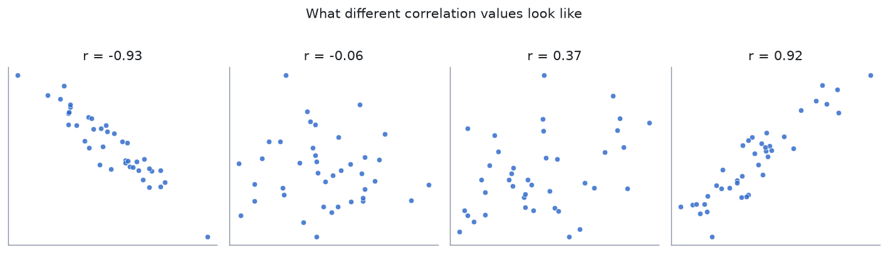

The **Pearson correlation coefficient**, written $r$, measures the strength and direction of the linear relationship between two quantitative variables $x$ and $y$:

$$
r = \frac{\sum_i (x_i - \bar{x})(y_i - \bar{y})}{\sqrt{\sum_i (x_i - \bar{x})^2}\,\sqrt{\sum_i (y_i - \bar{y})^2}} = \frac{\operatorname{cov}(x, y)}{s_x\, s_y}.
$$

The numerator accumulates a *positive* contribution when a point is above (or below) average on both variables, and a *negative* one when it is above on one and below the other, so it measures whether the variables move together. The denominator rescales by each variable's spread, which makes $r$ **unitless** and (by the Cauchy-Schwarz inequality) confines it to $[-1, 1]$. Equivalently, $r$ is the average product of the standardized ($z$-score) values of $x$ and $y$.

### Worked Example

Consider five paired observations:

| $x_i$ | $y_i$ |
|-------|-------|
| 1 | 2 |
| 2 | 1 |
| 3 | 4 |
| 4 | 3 |
| 5 | 7 |

The means are $\bar{x} = 15/5 = 3$ and $\bar{y} = 17/5 = 3.4$. Tabulating deviations $d_x = x_i - \bar{x}$, $d_y = y_i - \bar{y}$:

| $d_x$ | $d_y$ | $d_x d_y$ | $d_x^2$ | $d_y^2$ |
|-------|-------|-----------|---------|---------|
| $-2$ | $-1.4$ | $2.8$ | $4$ | $1.96$ |
| $-1$ | $-2.4$ | $2.4$ | $1$ | $5.76$ |
| $0$ | $0.6$ | $0.0$ | $0$ | $0.36$ |
| $1$ | $-0.4$ | $-0.4$ | $1$ | $0.16$ |
| $2$ | $3.6$ | $7.2$ | $4$ | $12.96$ |

Summing: $\sum d_x d_y = 12.0$, $\sum d_x^2 = 10$, $\sum d_y^2 = 21.2$. Therefore

$$
r = \frac{12.0}{\sqrt{10}\,\sqrt{21.2}} = \frac{12.0}{\sqrt{212}} = \frac{12.0}{14.560} \approx 0.824,
$$

a fairly strong positive linear association. (Note $r^2 \approx 0.679$; we return to this below.)

### Properties of $r$

- **Bounded:** $-1 \leq r \leq 1$.
- **Sign gives direction:** $r > 0$ means the variables increase together; $r < 0$ means one decreases as the other increases; $r = 0$ means no *linear* trend.
- **Magnitude gives strength:** values near $\pm 1$ mean points falling almost exactly on a line; $r = \pm 1$ occurs precisely when they are perfectly collinear.
- **Unitless and shift/scale invariant:** converting temperature from Celsius to Fahrenheit leaves $r$ unchanged.
- **Symmetric:** $r(x, y) = r(y, x)$; there is no predictor/response distinction.
- **Linear association only.** A value $r \approx 0$ does *not* mean the variables are unrelated, only that there is no *linear* relationship. For $y = x^2$ at $x = -2, -1, 0, 1, 2$ the relationship is perfectly deterministic, yet by symmetry $r = 0$. Always look at the scatter plot too (recall **Anscombe's quartet** above).
- **Sensitive to outliers.** A single extreme point can inflate or deflate $r$ dramatically. For skewed, ordinal, or outlier-prone data, prefer the rank-based [Spearman rank correlation](#spearman-rank-correlation), which measures *monotonic* (not just linear) association.

### Correlation Is Not Causation

A large $|r|$ says two variables move together; it says nothing about *why*. The association may arise because a **confounder** drives both. Across days of the year, ice cream sales and drowning deaths are strongly positively correlated, but ice cream does not cause drowning: both are driven by **temperature**. As discussed under [experimental design](#producing-data-and-experimental-design), only a randomized experiment breaks the link between a treatment and its confounders; observational correlation, however strong, cannot substitute for it.

### Relationship to Regression

Correlation and simple linear regression are two views of the same quantity, which is why this section precedes the next.

- **Coefficient of determination.** For simple linear regression, $r^2 = R^2$, the fraction of the variance in $y$ explained by the fitted line. In the example, $r^2 \approx 0.679$, so about $68\%$ of the variation in $y$ is explained by its linear relationship with $x$.
- **Slope.** The least-squares slope is a rescaled correlation: $\hat{\beta}_1 = r \cdot s_y / s_x$. In the example, $s_x = \sqrt{10/4} \approx 1.581$ and $s_y = \sqrt{21.2/4} \approx 2.302$, giving $\hat{\beta}_1 = 0.824 \times (2.302/1.581) = 1.2$, which matches the direct computation $\sum d_x d_y / \sum d_x^2 = 12.0/10 = 1.2$.

### Inference for the Population Correlation $\rho$

The sample $r$ estimates the unknown **population correlation** $\rho$. To test $H_0: \rho = 0$ against $H_a: \rho \neq 0$ (assuming $(x, y)$ are bivariate normal), the test statistic is

$$
t = \frac{r\sqrt{n - 2}}{\sqrt{1 - r^2}},
$$

which follows a $t$-distribution with $n - 2$ degrees of freedom under $H_0$. Using $r \approx 0.824$ and $n = 5$ ($n - 2 = 3$ df):

$$
t = \frac{0.824\sqrt{3}}{\sqrt{1 - 0.679}} = \frac{0.824 \times 1.732}{\sqrt{0.321}} = \frac{1.427}{0.567} \approx 2.52.
$$

The two-sided critical value is $t_{0.025,\,3} \approx 3.182$. Since $|t| \approx 2.52 < 3.182$, we **fail to reject** $H_0$: with only five points, an $r$ of $0.82$ is not strong enough to rule out chance. Correlation *strength* (the value of $r$) and *significance* (whether $\rho \neq 0$) are distinct questions, and both depend on the sample size.

## Linear Regression

**Linear regression:** Fits a straight line to data by minimizing the sum of squared residuals. It is the simplest and most important predictive model, and understanding it deeply is essential for ML.

Drag the points below to feel how least squares works: the line minimizes the total squared vertical residual, and the slope, intercept, correlation $r$, and $R^2$ update live. Drag one point far out in $x$ to see how a high-leverage outlier swings the fit.

<iframe src="/static/interactive/stats-regression-explorer.html" width="100%" height="660" style="border:none;"></iframe>

### The Model

For a single feature:

$$
y = \beta_0 + \beta_1 x + \epsilon
$$

- $\beta_0$: intercept (predicted $y$ when $x = 0$)
- $\beta_1$: slope (how much $y$ changes per unit change in $x$)
- $\epsilon$: error term, assumed to follow $N(0, \sigma^2)$

For multiple features: $y = X\beta + \epsilon$, where $X$ is the design matrix and $\beta$ is the parameter vector. This connects directly to [linear algebra](./linear-algebra-foundations): regression is solving an overdetermined system $X\beta \approx y$.

### Ordinary Least Squares (OLS)

**Objective:** Minimize the sum of squared residuals:

$$
\text{RSS} = \sum_{i=1}^n (y_i - \hat{y}_i)^2 = \sum_{i=1}^n (y_i - \beta_0 - \beta_1 x_i)^2
$$

**Residual:** The difference between the observed value and the predicted value: $e_i = y_i - \hat{y}_i$.


**Solution (from linear algebra):** The OLS solution minimizes $\|y - X\beta\|^2$ and has the closed-form solution:

$$
\hat{\beta} = (X^T X)^{-1} X^T y
$$

This is the **normal equation**. It was derived in [Linear Algebra Foundations](./linear-algebra-foundations) from the projection formula: when $Ax = b$ has no exact solution, the best approximation projects $b$ onto the column space of $A$. The normal equation is that projection. The matrix $X^T X$ must be invertible, which fails when features are perfectly correlated (multicollinearity).

**Connection to MLE:** If the errors $\epsilon$ are normally distributed, the OLS solution is also the MLE. Minimizing squared error is equivalent to maximizing the Gaussian log-likelihood.

### $R^2$: How Good Is the Fit?

**Coefficient of determination ($R^2$):** The proportion of variance in $y$ that is explained by the model:

$$
R^2 = 1 - \frac{\text{RSS}}{\text{TSS}} = 1 - \frac{\sum(y_i - \hat{y}_i)^2}{\sum(y_i - \bar{y})^2}
$$

- $R^2 = 1$: the model explains all variance (perfect fit)
- $R^2 = 0$: the model explains no more variance than simply predicting the mean
- $R^2$ can be negative for models that are worse than predicting the mean

**Adjusted $R^2$:** Penalizes adding more features. Regular $R^2$ always increases when you add features (even useless ones). Adjusted $R^2$ accounts for the number of predictors and only increases if the new feature genuinely improves the model:

$$
R^2_{adj} = 1 - \frac{(1 - R^2)(n - 1)}{n - p - 1}
$$

where $p$ is the number of predictors. When you add a useless predictor, $(1 - R^2)$ barely changes but the denominator shrinks, so $R^2_{adj}$ decreases. This makes adjusted $R^2$ a better criterion for model comparison when you have different numbers of predictors.

### Multiple Linear Regression

When there are multiple predictor variables, the model extends naturally:

$$
y = \beta_0 + \beta_1 x_1 + \beta_2 x_2 + \cdots + \beta_p x_p + \epsilon
$$

In matrix form, this is $y = X\beta + \epsilon$, where $X$ is the $n \times (p+1)$ design matrix (with a column of ones for the intercept), $\beta$ is the $(p+1) \times 1$ parameter vector, and $y$ is the $n \times 1$ response vector.

**The OLS solution** carries over from the simple case:

$$
\hat{\beta} = (X^TX)^{-1}X^Ty
$$

**Interpreting coefficients:** Each coefficient $\beta_j$ represents the expected change in $y$ for a one-unit increase in $x_j$, holding all other predictors constant. This "holding all else constant" interpretation is crucial and is what distinguishes multiple regression from running several simple regressions separately.

**Worked example:** Suppose you model house price (in thousands) as a function of square footage ($x_1$) and number of bedrooms ($x_2$), and obtain $\hat{\beta}_0 = 50$, $\hat{\beta}_1 = 0.12$, $\hat{\beta}_2 = 15$. Then the predicted price is:

$$
\hat{y} = 50 + 0.12 x_1 + 15 x_2
$$

The coefficient $0.12$ means that each additional square foot adds \$120 to the predicted price, holding the number of bedrooms constant. The coefficient $15$ means each additional bedroom adds \$15,000, holding square footage constant.

#### Inference on Coefficients

Each estimated coefficient $\hat{\beta}_j$ has a standard error $SE(\hat{\beta}_j)$ that measures how precisely it is estimated. The standard errors come from the diagonal of the covariance matrix:

$$
\text{Cov}(\hat{\beta}) = \hat{\sigma}^2 (X^TX)^{-1}
$$

where $\hat{\sigma}^2 = \frac{RSS}{n - p - 1}$ is the estimated error variance (the residual mean square).

**t-test for individual coefficients:** To test whether predictor $x_j$ contributes to the model (i.e., $H_0: \beta_j = 0$), compute:

$$
t = \frac{\hat{\beta}_j}{SE(\hat{\beta}_j)}
$$

This follows a t-distribution with $n - p - 1$ degrees of freedom. If the p-value is small (below $\alpha$), we reject $H_0$ and conclude that $x_j$ is a statistically significant predictor, given the other predictors in the model.

**Confidence interval for $\beta_j$:**

$$
\hat{\beta}_j \pm t^*_{n-p-1} \cdot SE(\hat{\beta}_j)
$$

**F-test for overall significance:** Tests whether the model as a whole explains a significant amount of variance, i.e., $H_0: \beta_1 = \beta_2 = \cdots = \beta_p = 0$ (all predictors are useless). The test statistic is:

$$
F = \frac{(TSS - RSS)/p}{RSS/(n - p - 1)} = \frac{R^2/p}{(1 - R^2)/(n - p - 1)}
$$

This follows an F-distribution with $p$ and $n - p - 1$ degrees of freedom. A significant F-test means at least one predictor is useful; it does not tell you which one(s).

### Polynomial and Quadratic Regression

Real relationships are often curved, and a straight line will systematically miss the pattern (the linearity assumption discussed in the next section). The fix is surprisingly simple: add powers of the predictor as extra columns.

**Quadratic regression** fits

$$
y = \beta_0 + \beta_1 x + \beta_2 x^2 + \epsilon.
$$

The crucial observation is that **this is still linear regression.** The word "linear" refers to linearity in the coefficients $\beta$, not in $x$. If you treat $x$ and $x^2$ as two separate predictors $x_1 = x$ and $x_2 = x^2$, quadratic regression is exactly the multiple regression above, with design matrix

$$
X = \begin{bmatrix} 1 & x_1 & x_1^2 \\ 1 & x_2 & x_2^2 \\ \vdots & \vdots & \vdots \\ 1 & x_n & x_n^2 \end{bmatrix},
$$

and the same OLS solution $\hat{\beta} = (X^TX)^{-1}X^Ty$. Nothing new is needed; you just build the extra column. More generally, **polynomial regression** of degree $d$ adds $x, x^2, \dots, x^d$ and fits a degree-$d$ curve, still by ordinary least squares.


**Worked example.** The four points $(-1, 2), (0, 1), (1, 2), (2, 5)$ lie exactly on the parabola $y = x^2 + 1$. The best straight line through them is $\hat{y} = 2 + x$, which explains only $R^2 = 1 - \tfrac{4}{9} \approx 0.56$ of the variance, and its residuals are $+1, -1, -1, +1$: a U-shaped pattern that signals the curvature the line is missing. Fitting a quadratic recovers $\hat{\beta} = (1, 0, 1)$ exactly, with zero residuals and $R^2 = 1$.

**The overfitting trap.** Since a higher degree always fits the training data at least as well, why not use a large degree? Because a polynomial of degree $n - 1$ passes exactly through any $n$ points ($R^2 = 1$) but oscillates wildly between them and predicts terribly on new data. This is the [bias-variance tradeoff](#bias-variance-tradeoff) in miniature: too low a degree underfits (high bias), too high a degree overfits (high variance). Choose the degree by [cross-validation](#cross-validation), not by maximizing training $R^2$.

**Connection to ML.** Quadratic and polynomial regression are the simplest example of a **basis expansion**: you transform the input through fixed feature functions (here $x \mapsto (x, x^2, \dots)$) and then fit a linear model in that richer feature space. Kernel methods and the hidden layers of neural networks generalize the same idea, replacing the fixed polynomial features with similarity functions or learned features. The model stays linear in its parameters; the expressiveness comes from the features.

### Regression Diagnostics

The validity of regression inference depends on four key assumptions. When these assumptions are violated, the coefficient estimates may be biased, the standard errors may be wrong, and the p-values and confidence intervals may be unreliable.

#### Assumptions of Linear Regression

1. **Linearity:** The relationship between predictors and response is linear. If the true relationship is curved, a linear model will systematically miss the pattern.
2. **Independence:** The errors $\epsilon_i$ are independent of each other. This is violated when data has a time or spatial component (autocorrelation).
3. **Homoscedasticity (constant variance):** The variance of the errors is the same for all values of the predictors. If the spread of residuals increases with $\hat{y}$ (a "fan" or "megaphone" shape), this is violated (heteroscedasticity).
4. **Normality of residuals:** The errors follow a normal distribution. This matters most for small samples and for the validity of t-tests and F-tests on the coefficients.

#### Residual Plots

Plot the residuals $e_i = y_i - \hat{y}_i$ against the fitted values $\hat{y}_i$. What you want to see is a random cloud of points centered at zero with no pattern.

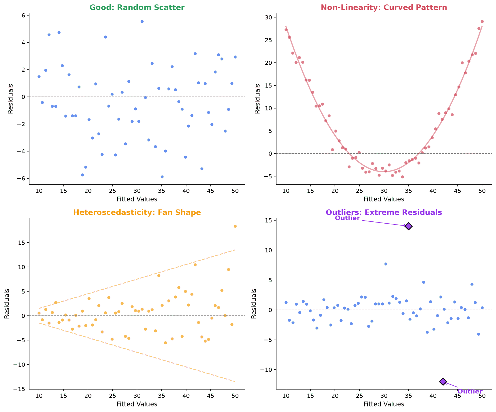

**What patterns indicate:**

- **A curve (U-shape or inverted U):** The linearity assumption is violated. Consider adding polynomial terms or using a nonlinear model.
- **A fan shape (wider spread on one side):** Heteroscedasticity. Consider a log transformation of $y$, or use weighted least squares.
- **Clusters or streaks:** Possible grouping structure in the data. Consider adding a categorical predictor or using mixed models.

#### Q-Q Plots for Normality

A quantile-quantile (Q-Q) plot compares the quantiles of the residuals to the quantiles of a standard normal distribution. If residuals are normally distributed, the points fall along a straight diagonal line. Deviations from the line indicate non-normality: S-shaped curves suggest skewness, and heavy tails show up as points curving away at the ends.

#### Leverage and Influential Points

**Leverage:** A data point has high leverage if its predictor values are far from the center of the predictor space. High-leverage points have a large influence on the fitted regression line because they "pull" the line toward them. Leverage is measured by the diagonal elements $h_{ii}$ of the hat matrix $H = X(X^TX)^{-1}X^T$. A point with $h_{ii} > 2(p+1)/n$ is considered high-leverage.

**Influential points:** A point is influential if removing it substantially changes the regression results. A point can have high leverage without being influential (if it falls right on the regression line) or can be influential without extreme leverage.

**Cook's distance** combines leverage and residual size into a single measure of influence:

$$
D_i = \frac{e_i^2}{p \cdot MSE} \cdot \frac{h_{ii}}{(1 - h_{ii})^2}
$$

where $e_i$ is the residual and $MSE$ is the mean squared error. A common rule of thumb: $D_i > 1$ (or $D_i > 4/n$) indicates an influential observation that warrants investigation.

#### Multicollinearity

**Multicollinearity** occurs when two or more predictors are highly correlated with each other. It does not bias the coefficient estimates, but it inflates their standard errors, making it hard to determine which predictors are significant.

**Variance Inflation Factor (VIF):** For predictor $x_j$, regress $x_j$ on all other predictors and compute $R_j^2$. Then:

$$
VIF_j = \frac{1}{1 - R_j^2}
$$

If $R_j^2 = 0$ (predictor $j$ is uncorrelated with the others), $VIF_j = 1$. If $R_j^2 = 0.9$ (90% of predictor $j$'s variance is explained by the others), $VIF_j = 10$. A common guideline: $VIF > 10$ signals a serious multicollinearity problem, and $VIF > 5$ warrants attention.

**What to do about multicollinearity:** Remove one of the correlated predictors, combine them (e.g., use a composite score or principal component), or use regularization (ridge regression), which is specifically designed to handle correlated predictors.

#### What to Do About Violations

| Violation | Diagnostic | Remedies |
|---|---|---|
| Non-linearity | Residual plot shows curve | Add polynomial terms, use transformations ($\log$, $\sqrt{}$) |
| Heteroscedasticity | Fan-shaped residual plot | Transform $y$ (log is common), weighted least squares |
| Non-normality | Q-Q plot deviates from line | Transform $y$, use bootstrap CIs, or use robust methods |
| Influential points | Cook's distance > 1 | Investigate the points; remove only with justification |
| Multicollinearity | VIF > 10 | Remove or combine predictors, use ridge regression |

## Logistic Regression and Generalized Linear Models

[Linear regression](#linear-regression) predicts a continuous outcome by fitting a straight line. But many questions have a **binary outcome**: did the patient survive (1) or not (0), was the email clicked, is the tumor malignant? Here the response $y$ takes only the values $0$ and $1$, and what we want to predict is not the value but the *probability* $p = P(y = 1 \mid x)$.

### Why a Straight Line Is the Wrong Tool

Fitting $y = \beta_0 + \beta_1 x + \epsilon$ to $0/1$ data fails in two ways. First, a line is unbounded, so for extreme $x$ it returns predictions like $\hat{y} = 1.4$ or $-0.3$, which cannot be probabilities. Second, OLS assumes normal, constant-variance errors, but a $0/1$ outcome is Bernoulli with variance $p(1-p)$ that depends on $x$ and vanishes as $p$ approaches $0$ or $1$. We need a model whose output is always a valid probability and whose likelihood respects the Bernoulli data.

### The Logistic (Sigmoid) Function

The building block is the **logistic function**, or **sigmoid**:

$$
\sigma(z) = \frac{1}{1 + e^{-z}}.
$$

It squashes any real $z$ into $(0, 1)$: as $z \to +\infty$, $\sigma(z) \to 1$; as $z \to -\infty$, $\sigma(z) \to 0$; and $\sigma(0) = 0.5$. The S-shaped curve is steepest at the center and flattens at both ends, exactly the behavior we want for a probability.

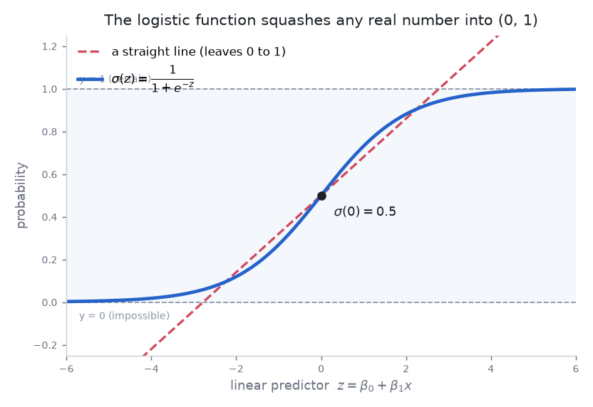

### The Model and the Log-Odds

Logistic regression feeds a linear predictor through the sigmoid: $p = \sigma(\beta_0 + \beta_1 x)$. To see what the coefficients mean, invert the sigmoid. The **odds** of an event with probability $p$ are $\dfrac{p}{1-p}$ (if $p = 0.8$ the odds are $0.8/0.2 = 4$, "4-to-1"). Taking logs gives the **log-odds**, or **logit**, which ranges over all of $\mathbb{R}$. Applying the logit to the model shows that **the log-odds are linear in $x$**:

$$
\log \frac{p}{1 - p} = \beta_0 + \beta_1 x.
$$

This is the defining equation: we fit an ordinary linear model not to the outcome but to its log-odds. That is why logistic regression is a *linear* model despite its curved probability output.

### Interpreting the Coefficients

- **On the log-odds scale:** a one-unit increase in $x$ adds $\beta_1$ to the log-odds.
- **On the odds scale:** exponentiating turns addition into multiplication, so a one-unit increase in $x$ multiplies the odds by $e^{\beta_1}$. The quantity $e^{\beta_1}$ is an **odds ratio** (the same quantity from the [odds-ratio](#measures-of-association-odds-ratio-and-relative-risk) discussion above), now arising as a fitted coefficient. An odds ratio of $1$ ($\beta_1 = 0$) means no effect; greater than $1$ means the event becomes more likely.

**Worked interpretation.** Model the probability a loan is repaid as a function of income (in units of \$10{,}000), fitting $\hat{\beta}_0 = -2.0$, $\hat{\beta}_1 = 0.7$. Each additional \$10{,}000 multiplies the odds of repayment by $e^{0.7} \approx 2.01$, so the odds roughly double per unit. Tracing predictions: at $x = 2$ the log-odds are $-0.6$, odds $e^{-0.6} \approx 0.549$, probability $\sigma(-0.6) \approx 0.354$; at $x = 3$ the log-odds are $0.1$, odds $e^{0.1} \approx 1.105$, probability $\sigma(0.1) \approx 0.525$. The odds ratio $1.105/0.549 \approx 2.01$ matches $e^{0.7}$, while the *probability* jumped by about $0.17$ over this step. Near the tails of the curve the same unit step in $x$ moves the probability far less: the effect on probability is not constant, but the effect on the odds always is.

### Fitting by Maximum Likelihood

Unlike OLS, logistic regression has **no closed-form solution**; there is no analogue of the normal equations. Instead we fit by [maximum likelihood](#maximum-likelihood-estimation-mle). Each observation is Bernoulli with $p_i = \sigma(\beta_0 + \beta_1 x_i)$, so the log-likelihood is

$$
\ell(\beta) = \sum_{i=1}^{n} \big[\, y_i \log p_i + (1 - y_i)\log(1 - p_i) \,\big].
$$

This is **concave** in $\beta$, with no spurious local maxima, so gradient-based [optimization](./optimization) (gradient ascent, or Newton-type methods such as iteratively reweighted least squares) reliably converges. (The maximum is attained at a unique finite $\hat\beta$ as long as the classes are not perfectly separable; under complete separation the likelihood keeps increasing as the coefficients grow without bound, and a penalty or prior is added to keep them finite.) Crucially, **maximizing this Bernoulli log-likelihood is exactly minimizing the binary cross-entropy loss** (they differ only by a sign), which links to [information theory](./information-theory#cross-entropy) and to how classifiers are trained throughout ML: a neural network with a sigmoid output and cross-entropy loss is performing maximum-likelihood logistic regression on top of learned features.

### Generalized Linear Models (GLMs)

Linear and logistic regression are two instances of one framework, the **generalized linear model**, with three components:

1. **A response distribution** from the **exponential family** (normal, Bernoulli, Poisson, gamma, ...), specifying how the variance depends on the mean.
2. **A linear predictor** $\eta = X\beta$, the same linear combination of features as ordinary regression.
3. **A link function** $g$, connecting the mean $\mu = E[y]$ to the linear predictor via $g(\mu) = \eta$. The link lets a linear predictor drive a bounded or non-linear response.

| Model | Link function $g$ | Response distribution | Typical outcome |
|---|---|---|---|
| Linear regression | Identity: $g(\mu) = \mu$ | Normal | Continuous |
| Logistic regression | Logit: $g(\mu) = \log\dfrac{\mu}{1-\mu}$ | Bernoulli | Binary (0/1) |
| Poisson regression | Log: $g(\mu) = \log \mu$ | Poisson | Counts $(0, 1, 2, \ldots)$ |

Seen this way, [linear regression](#linear-regression) is a GLM with the identity link and a normal response; logistic regression is the logit link with a Bernoulli response; and **Poisson regression** (log link, Poisson response) is the standard tool for count outcomes, such as visits per hour or claims per policy, where values are non-negative integers and the variance grows with the mean. The framework unifies all of these under one fitting procedure (maximum likelihood) and one interpretive language (coefficients act on the scale set by the link function).

## Bias-Variance Tradeoff

Slide the polynomial degree below to see the tradeoff before the algebra: a low-degree fit underfits (high bias), a high-degree fit chases the noise (high variance), and the test error is U-shaped even as training error keeps falling.

<iframe src="/static/interactive/bias-variance-explorer.html" width="100%" height="600" style="border:none;"></iframe>

The **bias-variance tradeoff** is the central tension in machine learning. Fix an input $x$, and suppose the true relationship is $y = f(x) + \varepsilon$ where the noise $\varepsilon$ has mean $0$ and variance $\sigma^2$. Let $\hat{f}(x)$ be the model's prediction at $x$, treated as random because it depends on the training set drawn at random. Taking the expectation over both the random training set (which determines $\hat{f}$) and the noise in a fresh target $y$ at $x$, the expected squared prediction error decomposes into three components:

$$
\mathbb{E}\!\left[(\hat{f}(x) - y)^2\right] = \underbrace{\left(\mathbb{E}[\hat{f}(x)] - f(x)\right)^2}_{\text{Bias}^2} + \underbrace{\operatorname{Var}(\hat{f}(x))}_{\text{Variance}} + \underbrace{\sigma^2}_{\text{Irreducible Error}}
$$

Here the irreducible error is exactly the noise variance $\sigma^2$: it is present in the fresh target $y$ regardless of the model, so no estimator can drive it below $\sigma^2$.


**Bias:** How far off the model's average prediction is from the true value. High bias means the model is too simple to capture the underlying pattern. A linear model fit to curved data has high bias.

**Variance:** How much the model's predictions change when trained on different data. High variance means the model is too sensitive to the specific training data. A high-degree polynomial that wiggles through every training point has high variance.

**Irreducible error:** Noise inherent in the data that no model can eliminate.

**The tradeoff:** As model complexity increases:

- Bias decreases (the model can capture more patterns)
- Variance increases (the model becomes more sensitive to training data)
- Total error first decreases, then increases

The optimal model balances these two forces. This is why you cannot just "add more parameters" to improve a model indefinitely.

| | Simple model | Complex model |
|---|---|---|
| Bias | High | Low |
| Variance | Low | High |
| Risk | Underfitting | Overfitting |
| Example | Linear regression on curved data | 100-degree polynomial on 20 points |

## Overfitting and Underfitting

**Overfitting:** The model learns the training data too well, including its noise and quirks. It performs great on training data but poorly on new data. Signs: large gap between training accuracy and test accuracy.

**Underfitting:** The model is too simple to capture the underlying pattern. It performs poorly on both training and test data. Signs: high error on training data.

**Remedies for overfitting:**

- Get more training data
- Reduce model complexity (fewer features, lower polynomial degree)
- Regularization (L1/L2 penalties, which connect to MAP estimation above)
- Dropout (in neural networks)
- Early stopping

**Remedies for underfitting:**

- Use a more complex model
- Add more features
- Reduce regularization
- Train longer

## Cross-Validation

**Cross-validation:** A method for estimating how well a model will perform on unseen data, without needing a separate test set.

### k-Fold Cross-Validation


1. Split the data into $k$ equal-sized folds (commonly $k = 5$ or $k = 10$)
2. For each fold $i$:
   - Train the model on all folds except fold $i$
   - Evaluate on fold $i$
3. Average the $k$ evaluation scores

$$
\text{CV Score} = \frac{1}{k}\sum_{i=1}^k \text{Score}_i
$$

**Why not just use a train/test split?** A single split is noisy. You might get lucky or unlucky with which data points end up in the test set. Cross-validation uses all the data for both training and testing (just not at the same time), giving a more reliable estimate.

### Leave-One-Out Cross-Validation (LOOCV)

The extreme case where $k = n$ (each fold is a single data point). Gives a nearly unbiased estimate but is computationally expensive for large datasets.

### Stratified Cross-Validation

For classification problems, each fold maintains the same class proportions as the full dataset. This prevents folds where a minority class is entirely absent.

**Where it shows up in ML:** Cross-validation is the standard method for:

- **Model selection:** Comparing different model types (linear vs. polynomial vs. random forest)
- **Hyperparameter tuning:** Choosing the best learning rate, regularization strength, tree depth, etc.
- **Performance reporting:** Giving a reliable estimate of how well a model generalizes

The reason cross-validation matters so deeply: it is the practical answer to the bias-variance tradeoff. You cannot directly measure bias and variance on real data, but cross-validation lets you detect their effects by measuring generalization performance.

## Bootstrapping


**Bootstrapping** is a resampling technique that lets you estimate the sampling distribution of almost any statistic without relying on theoretical formulas or distributional assumptions.

### The Core Idea

When you have a sample of size $n$, you treat that sample as if it were the population. You then draw many new samples from it (with replacement), compute your statistic on each resampled dataset, and use the distribution of those computed statistics to make inferences.

**Why "with replacement"?** Each bootstrap sample must be the same size as the original sample. If you sampled without replacement, you would just get the original dataset every time. With replacement, each bootstrap sample is a slightly different version of the original: some data points appear multiple times, others not at all. This variation is what generates the distribution.

### The Procedure

1. Start with your original sample of size $n$
2. Draw a bootstrap sample: select $n$ observations from the original sample with replacement
3. Compute the statistic of interest (mean, median, regression coefficient, etc.) on the bootstrap sample
4. Repeat steps 2-3 a total of $B$ times (typically $B = 1{,}000$ to $10{,}000$)
5. The collection of $B$ bootstrapped statistics approximates the sampling distribution

### Bootstrap Confidence Intervals

The simplest bootstrap confidence interval uses the percentiles of the bootstrapped distribution directly.

**Percentile method:** For a 95% confidence interval, take the 2.5th and 97.5th percentiles of the $B$ bootstrapped statistics.

**Worked example:** Suppose you have a sample of 12 delivery times (in minutes): 22, 25, 27, 28, 30, 31, 33, 35, 38, 40, 42, 55. The sample median is 32. You want a 95% CI for the population median.

You draw $B = 10{,}000$ bootstrap samples (each of size 12, with replacement), compute the median of each, and sort the 10,000 medians. The 250th smallest value (2.5th percentile) is 28 and the 9,750th smallest value (97.5th percentile) is 40.

The 95% bootstrap CI for the median is $(28, 40)$.

### Why Bootstrapping Matters

**No distributional assumptions:** For the mean, the CLT gives you a theoretical sampling distribution (normal). But what about the sampling distribution of the median? The trimmed mean? The ratio of two variances? For many statistics, there is no clean formula. Bootstrapping handles them all with the same procedure.

**Nonparametric:** Bootstrapping does not assume the data came from any particular distribution. This makes it robust when the normality assumption is questionable.

**Limitations:** Bootstrapping relies on the original sample being reasonably representative of the population. If your sample is small and unrepresentative, resampling from it will not fix the problem. Bootstrapping also struggles with statistics that are highly sensitive to rare extreme values, because those values may appear zero or multiple times across bootstrap samples.

### Where It Shows Up in ML

**Bootstrap aggregating (bagging):** Train multiple models on different bootstrap samples of the training data, then average their predictions. This reduces variance. Random forests extend bagging by also randomizing feature selection at each split.

**Out-of-bag (OOB) estimation:** In each bootstrap sample, roughly 37% of the original data points are left out (they were never selected). These "out-of-bag" points can be used as a free validation set, giving a performance estimate without needing a separate test set.

## Summary: Connecting Statistics to ML

The concepts on this page form the statistical foundation of machine learning:

| Statistical concept | ML application |
|---|---|
| MLE | Training logistic regression, neural networks (cross-entropy loss) |
| MAP estimation | Ridge regression (L2), lasso (L1) |
| Bias-variance tradeoff | Model selection, regularization decisions |
| Hypothesis testing | A/B testing, model comparison |
| Linear regression | The simplest supervised learning model |
| Cross-validation | Hyperparameter tuning, model evaluation |
| Confidence intervals | Uncertainty quantification for predictions |
| Sampling distributions | Understanding why more data helps |

The next topics in the roadmap (optimization and information theory) build directly on these foundations. MLE requires optimization to find parameter values. Distributions connect to information theory through entropy and KL divergence. Cross-entropy loss (the standard loss for classification) is a concept from information theory applied through the lens of MLE.
