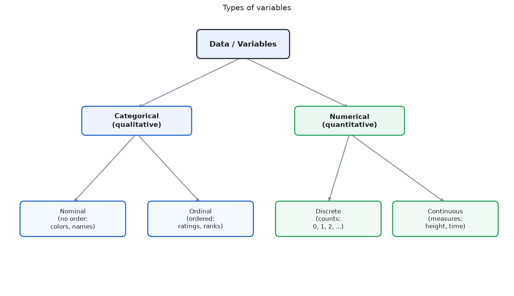
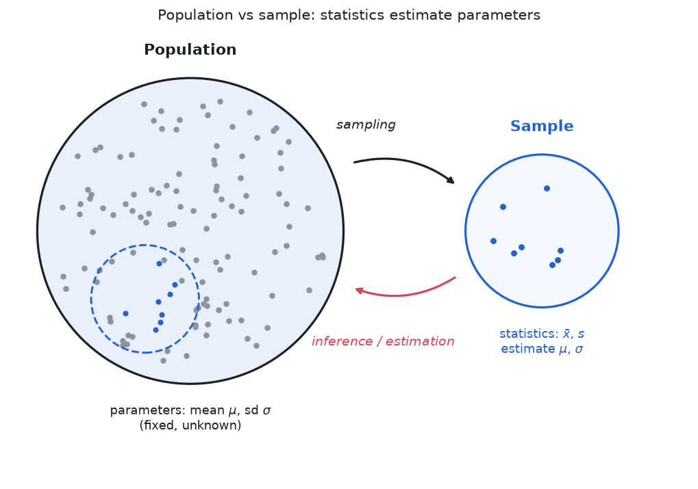
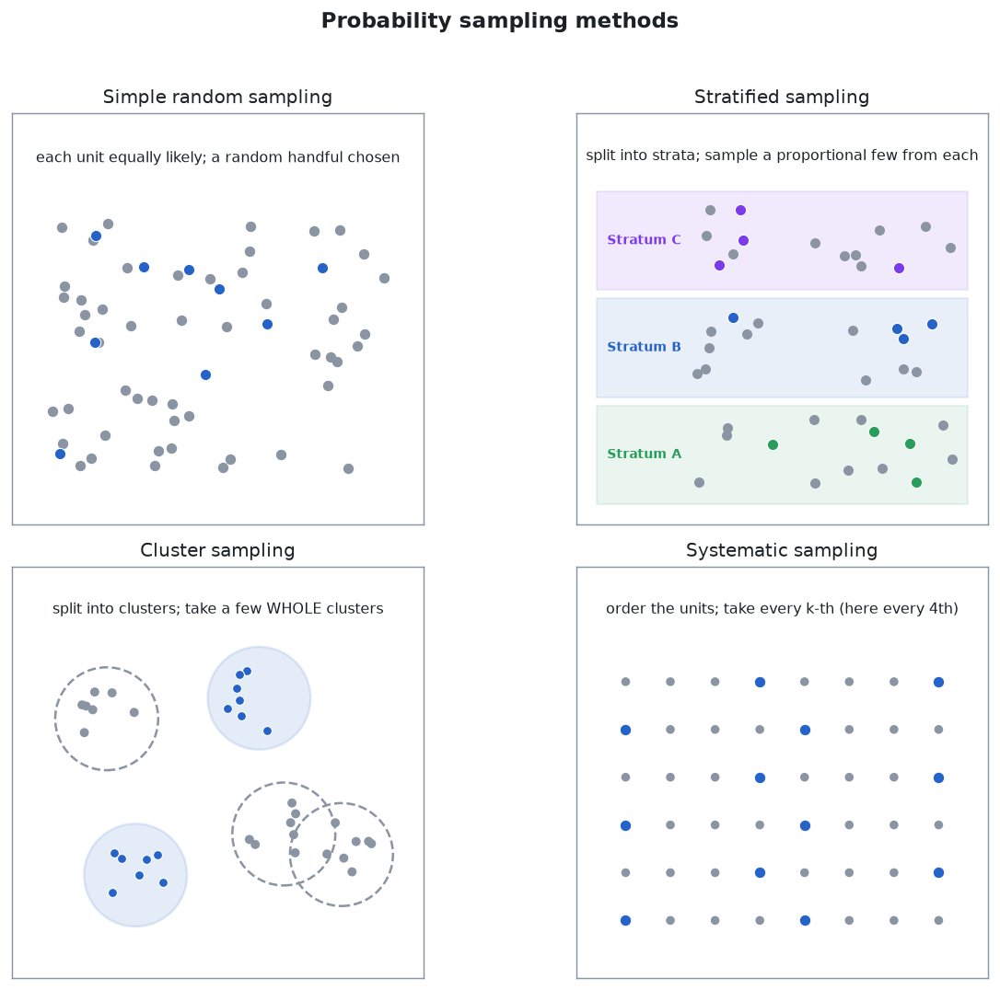

> [!abstract] Prerequisites & where this leads <!-- slt-nav -->
> **Builds on:** [Probability](./probability) · [Functions & Relations](./functions-relations)
> **Leads to:** [Descriptive Statistics](./descriptive-statistics) · [Inferential Statistics](./inferential-statistics) · [Statistical Learning](./statistical-learning)

Statistics is the science of collecting, analyzing, and drawing conclusions from data. It builds on [probability theory](./probability) and provides the tools for making decisions under uncertainty.

Statistics has two classical halves, plus a modern third, and this site gives each its own page:

- **[Descriptive Statistics](./descriptive-statistics)** — summarizing the data you already have: measures of center and spread, and the visualizations that reveal shape and outliers.
- **[Inferential Statistics](./inferential-statistics)** — generalizing from a *sample* to the *population* it came from: sampling distributions, estimation (confidence intervals, maximum likelihood), hypothesis testing, ANOVA, and nonparametric methods. Its two engines are estimation and hypothesis testing.
- **[Statistical Learning](./statistical-learning)** — prediction and generalization: correlation and regression, logistic and generalized linear models, the bias-variance tradeoff, cross-validation, and bootstrapping.

The foundational vocabulary below, data types, populations versus samples, and how *good* data is produced, underlies all three.

## What Is Data?

Before doing statistics, we need to be precise about what we are working with.

**Data:** A collection of observations or measurements. Each individual observation is called a **data point**. A collection of data points is a **dataset**.

**Variable:** A characteristic being measured or observed. Height, color, exam score, temperature. Each data point records a value for one or more variables.

**Observation (case, record):** A single entity being measured. One person, one transaction, one experiment. An observation may have values for multiple variables (a person has a height, a weight, an age, etc.).

### Types of Variables

Variables come in two fundamental types, and the type determines which statistical methods apply.

**Quantitative (numerical) variables:** Values are numbers that represent quantities. You can do arithmetic with them (add, subtract, average).

- **Discrete:** Countable values with gaps between them. Number of children (0, 1, 2, 3...), number of errors in code, number of heads in 10 flips. You cannot have 2.7 children.
- **Continuous:** Values on a continuous scale with no gaps. Height, temperature, time, weight. Between any two values, there are infinitely many other possible values.

**Qualitative (categorical) variables:** Values are labels or categories. You cannot meaningfully add or average them.

- **Nominal:** Categories with no natural order. Color (red, blue, green), blood type (A, B, AB, O), country. There is no sense in which "red > blue."
- **Ordinal:** Categories with a meaningful order, but the gaps between categories are not necessarily equal. Education level (high school, bachelor's, master's, PhD), customer satisfaction (poor, fair, good, excellent), letter grades (A, B, C, D, F).

### Scales of Measurement

This is a more formal way of classifying variables. Each level adds more structure.

**Nominal scale:** Categories only. You can check if two values are equal or different, but nothing else. Examples: gender, zip code, species.

- Operations: $=$ and $\neq$ only
- Meaningful statistics: mode, frequency counts

**Ordinal scale:** Categories with a ranking. You know that A > B, but not by how much. The difference between "good" and "excellent" might not be the same as between "poor" and "fair." Examples: rankings (1st, 2nd, 3rd), Likert scales (1-5 ratings), socioeconomic status.

- Operations: $=$, $\neq$, $<$, $>$
- Meaningful statistics: mode, median, percentiles
- NOT meaningful: mean (because gaps between ranks are not equal)

**Interval scale:** Numerical values where differences are meaningful, but there is no true zero point. The difference between 20°C and 30°C is the same as between 30°C and 40°C, but 40°C is not "twice as hot" as 20°C (because 0°C is not the absence of temperature). Examples: temperature in Celsius/Fahrenheit, calendar years, IQ scores.

- Operations: $=$, $\neq$, $<$, $>$, $+$, $-$
- Meaningful statistics: mean, standard deviation
- NOT meaningful: ratios ("twice as much")

**Ratio scale:** Like interval, but with a true zero point that means "none." 0 kg means no mass. 0 meters means no distance. Ratios are meaningful: 10 kg is twice as heavy as 5 kg. Examples: height, weight, distance, time duration, income, counts.

- Operations: all arithmetic ($=$, $\neq$, $<$, $>$, $+$, $-$, $\times$, $\div$)
- Meaningful statistics: all (mean, SD, ratios, geometric mean)

| Scale | Example | Can rank? | Can subtract? | Can divide? |
|---|---|---|---|---|
| Nominal | Blood type | No | No | No |
| Ordinal | Movie rating (1-5 stars) | Yes | No | No |
| Interval | Temperature (°C) | Yes | Yes | No |
| Ratio | Weight (kg) | Yes | Yes | Yes |

**Why this matters:** The scale of your data determines which operations are valid. Computing the mean of zip codes is nonsensical (nominal data). Computing the mean of star ratings is debatable (ordinal data, gaps might not be equal). Computing the mean of heights is perfectly fine (ratio data). Using the wrong statistic for a data type is a common error.

### Cardinal vs Ordinal Numbers

**Cardinal numbers** answer "how many?" They represent quantity: 3 apples, 47 students, 1,000,000 data points. You can do arithmetic with them.

**Ordinal numbers** answer "in what position?" They represent rank or order: 1st place, 2nd place, 3rd place. You know the order but not the gaps. The difference between 1st and 2nd place in a race might be 0.01 seconds; the difference between 2nd and 3rd might be 15 seconds. The ordinal numbers (1st, 2nd, 3rd) hide this information.

In statistics, this distinction appears constantly. Ranked data (ordinal) requires different methods than measured data (cardinal/interval/ratio). Median and percentiles work on ordinal data. Mean and standard deviation require at least interval data.

## The Fundamental Problem

You want to know something about the world: What is the average height of adults in a country? Does this drug work? Will users click on button A or button B more often?

You cannot measure everyone or observe every outcome. Instead, you observe a small piece of the world (a **sample**) and try to draw conclusions about the whole thing (the **population**).

This creates an immediate problem: your sample might not be representative. You might, by chance, have picked unusually tall people, or the drug might have appeared to work only because the test group happened to be healthier. Statistics is the set of tools for reasoning carefully about this gap between what you observed and what is actually true.

Everything on this page flows from this one problem. Descriptive statistics summarize what you observed. Inferential statistics quantify how much you can trust those summaries to reflect the population.

## Populations and Samples

These two concepts must be clear before anything else.

**Population:** The complete set of all individuals, items, or outcomes you care about. All adults in a country. All possible coin flips. All future users of your product. The population is usually too large (or infinite) to observe entirely.

**Parameter:** A number that describes the population. The population mean $\mu$, the population variance $\sigma^2$. Parameters are fixed, real numbers. They exist whether or not you know them. You almost never know them exactly.

**Sample:** A subset of the population that you actually observe. You measure 200 people's heights, or flip a coin 100 times, or track 1000 users for a week.

**Statistic:** A number computed from a sample. The sample mean $\bar{x}$, the sample variance $s^2$. Statistics are numbers you can actually calculate, but they change depending on which sample you happen to draw.

| | Population | Sample |
|---|---|---|
| What it is | Everything you want to know about | The piece you actually observe |
| Size | $N$ (often huge or infinite) | $n$ (what you can afford to measure) |
| Mean | $\mu$ (unknown, fixed) | $\bar{x}$ (known, varies by sample) |
| Variance | $\sigma^2$ (unknown, fixed) | $s^2$ (known, varies by sample) |
| Standard deviation | $\sigma$ | $s$ |

The central question of statistics: **how well does a statistic estimate the corresponding parameter?** If your sample mean is 72, how close is that to the true population mean? Can you put bounds on how far off you might be? That is what the rest of this page builds toward.

### How Samples Are Collected

The way you collect a sample determines whether your conclusions are valid. A bad sample can give completely misleading results, no matter how sophisticated your analysis.

**Simple random sample (SRS):** Every member of the population has an equal chance of being selected. This is the gold standard. Drawing names from a hat, using a random number generator to select rows from a database.

**Stratified sampling:** Divide the population into subgroups (strata) based on a characteristic (age group, region, income bracket), then take a random sample from each stratum. This ensures representation from every subgroup.

**Systematic sampling:** Select every $k$th item from an ordered list. For example, survey every 10th customer. Simple to implement, but can be biased if there is a periodic pattern in the list.

**Cluster sampling:** Divide the population into groups (clusters), usually along lines that already exist (city blocks, schools, shipping crates), then randomly choose *whole clusters* and measure everyone inside the chosen ones. It is cheaper than an SRS spread across the whole population, but it only works well when each cluster is itself a small-scale mirror of the population. Note the contrast with stratified sampling: stratified samples *from every* group, while cluster samples *all of a few* groups.

**Convenience sampling:** Sample whoever is easiest to reach. Surveying your friends, using your company's users as "the population." This is the most common method in practice and the most prone to bias.

**Selection bias:** When the sampling method systematically excludes part of the population. Surveying people at a gym about exercise habits will overrepresent active people. This is the single biggest threat to statistical validity.

**Worked example (drawing each method).** Take a concrete population of $N = 20$ units, labeled $1$ through $20$ in order, and suppose we want a sample of size $n = 5$ from each method. Watching *which units* each one selects makes the differences vivid.

- **Simple random sample.** A random number generator picks five labels with no pattern, say $\{3, 7, 11, 14, 19\}$. Every unit had the same $5/20 = 1/4$ chance of being chosen, and no structure is imposed.
- **Stratified.** Suppose the $20$ units split into three regions: North $= \{1..8\}$, Central $= \{9..16\}$, South $= \{17..20\}$ (sizes $8, 8, 4$). Proportional allocation gives each stratum its population share of the five slots: North $\frac{8}{20}\times 5 = 2$, Central $\frac{8}{20}\times 5 = 2$, South $\frac{4}{20}\times 5 = 1$ (which sums to $5$). Then draw at random *within* each region, e.g. $\{2, 6\}$ from North, $\{10, 13\}$ from Central, $\{18\}$ from South. Every region is guaranteed representation in proportion to its size.
- **Systematic.** With $n = 5$ from $N = 20$, the step is $k = \frac{20}{5} = 4$. Pick a random start in $\{1, 2, 3, 4\}$, say $2$, then take every $4$th unit: $\{2, 6, 10, 14, 18\}$. Easy to run, but if the list had a period-$4$ pattern this would lock onto it.
- **Cluster.** Group the units into four clusters of five consecutive labels: $\{1..5\}, \{6..10\}, \{11..15\}, \{16..20\}$. Randomly choose *one whole cluster*, say the third, and take all of it: $\{11, 12, 13, 14, 15\}$. Only one random draw was needed, but the sample is a single contiguous block, so it is representative only if the clusters are internally as varied as the whole population.
- **Convenience.** Take whoever is easiest, e.g. the first five to reply, $\{1, 2, 3, 4, 5\}$. Note this is entirely inside the North region, so it systematically misses Central and South: a textbook case of the selection bias above.

Compare the five samples: only the SRS and the stratified draw are guaranteed to be free of systematic distortion, the stratified one additionally guaranteeing balance across regions.

**Where it shows up in ML:** Training data is almost always a convenience sample. If your training data does not represent the population you want your model to work on, the model will fail in deployment. This is the root cause of most "AI bias" problems.

## Producing Data and Experimental Design

Everything a statistical analysis can tell you is limited by how the data were produced. A [section above](#how-samples-are-collected) covered how to *select* units from a population (simple random, stratified, systematic, and convenience sampling, and the selection bias that arises when the sample is not representative). This section covers the other half of producing data: what you *do* to the units once you have them, and why the design of that intervention determines whether you can make a causal claim at all.

### Observational studies vs designed experiments

There are two broad ways to produce data about a relationship between variables.

In an **observational study**, you measure the units as they already are, without intervening. You record who happens to smoke and who does not, then compare their rates of lung disease. You watch which users happen to see a new feature and compare their engagement. The word to hold onto is *happens*: the researcher does not assign the condition, so the groups being compared may differ in many ways besides the one under study.

In an **experiment**, the researcher deliberately imposes a condition on each unit (for example, randomly deciding which patients receive a drug and which receive a sugar pill) and then observes the response. The researcher *creates* the difference between the groups rather than finding it.

This distinction is the whole reason the two kinds of study support different conclusions. An observational study can establish that two variables are **associated** (they move together), but it cannot by itself establish that one **causes** the other, because any observed difference in outcomes might be due to a pre-existing difference between the groups rather than to the variable of interest. A **randomized experiment** is the most reliable way to establish causation, because randomly assigning units to conditions makes the groups equivalent on average with respect to *every* characteristic, known and unknown, before the treatment is applied. If the groups start out interchangeable and then differ in their response, the treatment is the only systematic explanation left standing. (Causal claims can sometimes be drawn from observational data as well, but only under strong additional assumptions, for example that every relevant confounder has been measured and adjusted for; randomization is what lets an experiment avoid relying on such assumptions.)

> **Where it shows up in ML.** An A/B test is a randomized experiment: users are randomly assigned to variant A or B, so any difference in the response metric (click-through, retention, conversion) can be attributed to the variant. This is why "we shipped feature X and engagement went up" (observational, before/after) is far weaker evidence than an A/B test: in the before/after comparison, seasonality, a marketing push, or a concurrent release could be responsible.

### The Vocabulary of Experiments

A precise vocabulary keeps experimental reasoning clear.

- **Experimental unit:** the smallest entity to which a condition is applied. When the units are people, they are called **subjects** (or **participants**).
- **Treatment:** a specific condition applied to a unit. If a unit receives drug B at a dose of 50 mg, that particular combination is one treatment.
- **Factor:** an explanatory variable that the experimenter manipulates. "Drug type" and "dose" are two factors.
- **Level:** one of the possible values a factor can take. The factor "dose" might have levels 0 mg, 50 mg, and 100 mg.
- **Treatment as a combination of levels:** when there is more than one factor, a treatment is a combination of one level from each factor. With drug type (2 levels) and dose (3 levels), there are $2 \times 3 = 6$ treatments.
- **Response variable:** the outcome the experiment measures (blood pressure after four weeks, whether the user clicked).
- **Control group:** a group that receives a baseline condition (no treatment, the current standard, or a placebo) so that the treated groups have something to be compared against. Without a control group, you cannot tell whether the response was caused by the treatment or would have happened anyway.

### The Three Principles of Experimental Design

Good experiments rest on three principles. Each one neutralizes a specific way that a naive comparison can mislead you.

**Control.** Hold the other conditions of the experiment as constant as possible across groups, and include a control group as a baseline. The purpose of control is to prevent outside variables from differing systematically between the treatment groups, so that they cannot masquerade as an effect of the treatment.

**Randomization.** Assign units to treatment groups by a chance mechanism rather than by choice or convenience. Randomization is what makes the groups comparable on average across *all* characteristics, including ones you never thought to measure. Control handles the variables you know about; randomization handles the ones you do not. This is the single feature that separates an experiment capable of establishing causation from one that is not.

**Replication.** Apply each treatment to many units, not just one. A response measured on a single unit could be a fluke of that unit. Replication lets individual variation average out, so a real treatment effect can be distinguished from ordinary noise, and it lets you estimate how large that noise is. (Replication, many units within one study, is distinct from *reproducibility*, the independent repetition of the whole study by others.)

### Blocking and Randomized Block Designs

Randomization makes groups equal *on average*, but with a modest number of units, chance can still leave the groups noticeably unbalanced on a variable you know matters. **Blocking** addresses this. A **block** is a group of units that are similar with respect to some variable expected to affect the response. The design randomizes treatments *separately within each block*.

Suppose you are testing a training method and you know that beginners and experts respond very differently. Rather than randomizing across everyone and hoping the experts split evenly, you form two blocks (beginners and experts) and randomly assign treatments within each block. This is a **randomized block design**. Because each treatment now appears in a balanced way among beginners and among experts, the beginner-versus-expert variation is prevented from inflating the noise, and the treatment comparison becomes sharper.

The guiding slogan is **"block what you can, randomize what you cannot."** For nuisance variables you can identify and measure (skill level, age group, hardware type), remove their influence by blocking. For all the variables you cannot identify, fall back on randomization to balance them on average.

> **Where it shows up in ML.** Paired or stratified evaluation is blocking. If you compare two models on a benchmark, evaluating both on the *same* set of examples (a paired design) blocks out example-to-example difficulty: each example serves as its own block.

### Blinding, Placebo, and the Placebo Effect

Subjects (and the people measuring them) can respond to their *expectations*, not just to the treatment. The **placebo effect** is a real, measurable response produced by the mere expectation of treatment: patients given an inert pill, a **placebo**, often improve simply because they believe they are being treated. If the treatment group knows it is being treated and the control group knows it is not, part of any observed difference could be expectation rather than the treatment itself.

**Blinding** removes this by hiding who is in which group.

- In a **single-blind** experiment, the subjects do not know which treatment they received, but the researchers do.
- In a **double-blind** experiment, neither the subjects nor the people administering the treatment and measuring the response know who is in which group until the data are collected. Double-blinding also guards against experimenters unconsciously nudging results.

A placebo is what makes single-blinding possible on the subject side: the control group must receive something indistinguishable from the treatment, or blinding is impossible.

### Confounding Variables

A **confounding variable** (also called a **lurking variable** when it was not measured or anticipated) is a variable that is associated with both the explanatory variable and the response variable, so that its effect on the response cannot be separated from the effect of the variable you care about. When a confounder is present, an observed association between two variables might be entirely, or partly, due to the confounder rather than to a direct relationship.

Concrete example. A town's data show that months with higher ice-cream sales also have more drownings, a strong positive association. It would be absurd to conclude that ice cream causes drowning. The lurking variable is **temperature (or season)**: hot months drive up ice-cream sales *and* send more people swimming, which raises drownings. Temperature is associated with both variables, so it confounds the association between them.

This is exactly the danger a randomized experiment avoids. If you could randomly assign ice-cream consumption, the hot and cold months would be balanced across the assigned groups, and the spurious link would vanish. In an observational study you cannot do that, which is why confounding is the central reason observational associations do not imply causation.

> **Where it shows up in ML.** Confounding lives in observational training data. A model trained to predict disease from chest X-rays may learn to key off a scanner-specific marker because sicker patients happened to be imaged on a particular machine: the scanner confounds the association between image and diagnosis. Spurious correlations and shortcut learning are confounding by another name.

### Simpson's Paradox

Confounding can be dramatic enough to *reverse* an association. **Simpson's paradox** is the phenomenon in which a trend that appears in each subgroup of the data reverses when the subgroups are combined. It happens when a lurking variable is unevenly distributed across the groups being compared.

Consider two treatments, A and B, for kidney stones. Patients also differ in whether their stones are **small** or **large**, and large stones are harder to cure. Here are the success counts (successes out of patients treated), broken out by stone size.

| Stone size | Treatment A | Treatment B |
|---|---|---|
| Small stones | 81 / 87 | 234 / 270 |
| Large stones | 192 / 263 | 55 / 80 |
| **Combined** | **273 / 350** | **289 / 350** |

Within the small-stone group, $\tfrac{81}{87} \approx 0.931$ for A versus $\tfrac{234}{270} \approx 0.867$ for B: A does better. Within the large-stone group, $\tfrac{192}{263} \approx 0.730$ for A versus $\tfrac{55}{80} = 0.688$ for B: A does better again. So A wins in *both* subgroups. Now combine them:

$$
\text{A: } \frac{81+192}{87+263} = \frac{273}{350} = 0.780, \qquad \text{B: } \frac{234+55}{270+80} = \frac{289}{350} \approx 0.826.
$$

Combined, B wins. The association has reversed. The lurking variable is **stone size**, distributed very unevenly: Treatment A was given mostly to the hard cases ($263$ of its $350$ patients had large stones), while Treatment B was given mostly to the easy cases (only $80$ of $350$). A's combined rate is dragged down because it is an average dominated by difficult patients. The fair comparison is *within* each stone-size group, where A is better. Had patients been *randomly* assigned, stone size would have been balanced and the reversal could not have arisen.

> **Where it shows up in ML.** Aggregate metrics can hide subgroup reversals. A classifier with higher overall accuracy than a baseline can be *worse* on every demographic subgroup if the subgroups are unevenly sized across the two systems' evaluation sets. This is why disaggregated evaluation (reporting metrics per subgroup) is a standard fairness practice.

