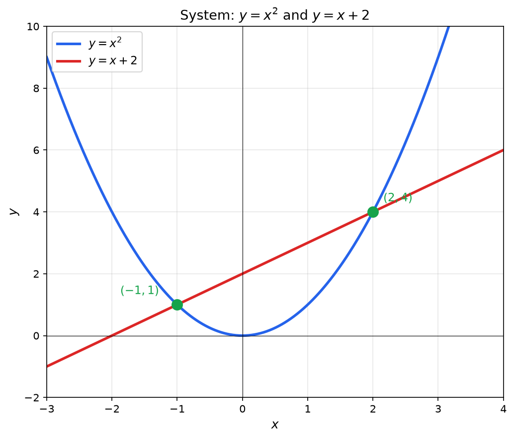

**System of Equations:** A set of two or more equations that share the same variables. A **solution** to the system is a set of values that satisfies all equations simultaneously.

For linear systems, see [Systems of Linear Equations](./systems-of-linear-equations). This page covers general solving techniques and nonlinear systems.

> [!abstract] Prerequisites & where this leads
> **Builds on:** [Linear Functions](./linear-functions) · [Graphing Functions](./graphing-functions)
> **Leads to:** [Systems of Linear Equations](./systems-of-linear-equations) · [Matrices](./matrices)

## Solving Methods for Two-Variable Systems

The substitution and elimination methods below are the same techniques introduced in [Systems of Linear Equations](./systems-of-linear-equations), here applied to nonlinear systems. The mechanics carry over unchanged; the difference is that eliminating a variable can now leave a quadratic, quartic, or transcendental equation rather than a single linear one.

### Substitution Method

**Substitution Method:** Solve one equation for one variable, then substitute that expression into the other equation.

**Algorithm:**

1. Solve one equation for one variable (choose the simplest)
2. Substitute that expression into the other equation
3. Solve the resulting single-variable equation
4. Substitute back to find the other variable
5. Check the solution in both original equations

**Example:** Solve the system

$$
\begin{cases}
y = x^2 - 3 \\
y = 2x + 1
\end{cases}
$$

**Step 1:** Both equations are solved for $y$, so set them equal:

$$
x^2 - 3 = 2x + 1
$$

**Step 2:** Rearrange:

$$
x^2 - 2x - 4 = 0
$$

**Step 3:** Apply the quadratic formula:

$$
x = \frac{2 \pm \sqrt{4 + 16}}{2} = \frac{2 \pm \sqrt{20}}{2} = 1 \pm \sqrt{5}
$$

**Step 4:** Find corresponding $y$ values:

For $x = 1 + \sqrt{5}$: $y = 2(1 + \sqrt{5}) + 1 = 3 + 2\sqrt{5}$

For $x = 1 - \sqrt{5}$: $y = 2(1 - \sqrt{5}) + 1 = 3 - 2\sqrt{5}$

**Solutions:** $(1 + \sqrt{5},\; 3 + 2\sqrt{5})$ and $(1 - \sqrt{5},\; 3 - 2\sqrt{5})$

### Elimination Method

**Elimination Method:** Add or subtract equations (possibly after multiplying by constants) to eliminate one variable.

**Example:** Solve the system

$$
\begin{cases}
x^2 + y^2 = 25 \\
x^2 - y = 5
\end{cases}
$$

**Step 1:** From the second equation: $y = x^2 - 5$

**Step 2:** Substitute into the first equation:

$$
x^2 + (x^2 - 5)^2 = 25
$$

$$
x^2 + x^4 - 10x^2 + 25 = 25
$$

$$
x^4 - 9x^2 = 0
$$

$$
x^2(x^2 - 9) = 0
$$

$$
x = 0, \quad x = 3, \quad x = -3
$$

**Step 3:** Find $y$ for each:

- $x = 0$: $y = 0 - 5 = -5$
- $x = 3$: $y = 9 - 5 = 4$
- $x = -3$: $y = 9 - 5 = 4$

**Solutions:** $(0, -5)$, $(3, 4)$, $(-3, 4)$

**Verification for $(3, 4)$:** $3^2 + 4^2 = 9 + 16 = 25$ and $3^2 - 4 = 5$ both check out.

## Systems of Nonlinear Equations

**Nonlinear System:** A system where at least one equation is not linear. These systems can have zero, one, or multiple solutions, and the number of solutions depends on how the curves intersect.

### Parabola and Line

The intersection of a parabola and a line produces 0, 1, or 2 solutions.

**Example:** Where does $y = x^2$ intersect $y = x + 2$?

$$
x^2 = x + 2
$$

$$
x^2 - x - 2 = 0
$$

$$
(x - 2)(x + 1) = 0
$$

$x = 2$ gives $y = 4$; $x = -1$ gives $y = 1$

**Solutions:** $(2, 4)$ and $(-1, 1)$

The quadratic $x^2 - x - 2 = 0$ has discriminant $b^2 - 4ac = (-1)^2 - 4(1)(-2) = 1 + 8 = 9 > 0$, which is exactly why there are two intersection points (see the [discriminant test](#number-of-solutions) below).

### Two Conics

Systems involving circles, ellipses, parabolas, and hyperbolas can produce up to 4 intersection points.

**Example:** Find the intersections of the circle $x^2 + y^2 = 10$ and the hyperbola $xy = 3$.

From $xy = 3$: $y = \frac{3}{x}$

Substitute:

$$
x^2 + \frac{9}{x^2} = 10
$$

Multiply by $x^2$:

$$
x^4 + 9 = 10x^2
$$

$$
x^4 - 10x^2 + 9 = 0
$$

$$
(x^2 - 1)(x^2 - 9) = 0
$$

$x^2 = 1$ or $x^2 = 9$, giving $x = \pm 1$ or $x = \pm 3$

Find $y = 3/x$ for each:

**Solutions:** $(1, 3)$, $(-1, -3)$, $(3, 1)$, $(-3, -1)$

**Verification for $(1, 3)$:** $1^2 + 3^2 = 1 + 9 = 10$ and $1 \cdot 3 = 3$, both equations satisfied. The four points are the maximum a circle and hyperbola can share, matching the degree-4 equation we solved.

### Exponential and Linear

**Example:** Solve $2^x = x + 3$

This cannot be solved algebraically in closed form. Use numerical methods:

- Test $x = 0$: $2^0 = 1$ and $0 + 3 = 3$. Since $1 < 3$, the exponential is below the line.
- Test $x = 2$: $2^2 = 4$ and $2 + 3 = 5$. Still below.
- Test $x = 3$: $2^3 = 8$ and $3 + 3 = 6$. Now above.

By the Intermediate Value Theorem, a solution exists between $x = 2$ and $x = 3$.

Also test negative values:
- Test $x = -2$: $2^{-2} = 0.25$ and $-2 + 3 = 1$. Below.
- Test $x = -3$: $2^{-3} = 0.125$ and $-3 + 3 = 0$. Above.

A second solution exists between $x = -3$ and $x = -2$.

Use bisection or Newton's method to refine: $x \approx 2.445$ and $x \approx -2.862$. (Check the first: $2^{2.445} \approx 5.445$ and $2.445 + 3 = 5.445$, so the two sides match.)

## Number of Solutions

The number of solutions to a nonlinear system depends on the geometry of the curves.

| System Type | Maximum Solutions | How to Determine |
|-------------|-------------------|------------------|
| Line and parabola | 2 | Discriminant of resulting quadratic |
| Line and circle | 2 | Discriminant of resulting quadratic |
| Two circles | 2 | Relative positions and radii |
| Circle and parabola | 4 | Degree of resulting polynomial |
| Two parabolas | 4 | Degree of resulting polynomial |
| Exponential and polynomial | Varies | Graphical or numerical analysis |

**Discriminant test:** When a nonlinear system reduces to a quadratic equation $ax^2 + bx + c = 0$:

- $b^2 - 4ac > 0$: Two real solutions (curves intersect twice)
- $b^2 - 4ac = 0$: One real solution (curves are tangent)
- $b^2 - 4ac < 0$: No real solutions (curves do not intersect)

**Worked example (finding the tangent line).** For which value of $c$ is the line $y = 2x + c$ tangent to the parabola $y = x^2$? Setting them equal gives $x^2 = 2x + c$, i.e. $x^2 - 2x - c = 0$, a quadratic with $a = 1$, $b = -2$, and constant term $-c$. Its discriminant is

$$
b^2 - 4ac = (-2)^2 - 4(1)(-c) = 4 + 4c
$$

Tangency requires the discriminant to be exactly zero: $4 + 4c = 0$, so $c = -1$. The line $y = 2x - 1$ then meets the parabola where $x^2 - 2x + 1 = (x-1)^2 = 0$, a double root at $x = 1$, touching at the single point $(1, 1)$. For $c > -1$ the discriminant is positive and the line cuts the parabola twice (e.g. $c = 3$ gives $4 + 12 = 16 > 0$); for $c < -1$ it is negative and they never meet (e.g. $c = -2$ gives $4 - 8 = -4 < 0$). The discriminant thus turns "how many intersection points?" into a single sign check.

### Interactive: Two-Line System Explorer

The simplest case of the "number of solutions" question is a system of two **lines**. Each equation $a x + b y = c$ (read "$a$ times $x$ plus $b$ times $y$ equals $c$") graphs as a straight line, and the solution of the system is the point where the two lines cross. There are exactly three outcomes:

- **One solution:** the lines cross at a single point (an *independent, consistent* system).
- **No solution:** the lines are parallel but distinct, so they never meet (an *inconsistent* system).
- **Infinitely many solutions:** the two equations describe the *same* line, so every point on it works (a *dependent* system).

Set the six coefficients below and watch the classification change. The widget solves the system by **Cramer's rule**, using the determinant $D = a_1 b_2 - a_2 b_1$ (read "$D$ equals $a$-one $b$-two minus $a$-two $b$-one"): when $D \neq 0$ there is exactly one solution, and when $D = 0$ the lines are either parallel or identical.

<iframe src="/static/interactive/sys-eq-solver.html" width="100%" height="580" style="border:none;"></iframe>

## Where It Shows Up

- **Machine learning:** Finding where loss functions reach critical points involves solving systems of nonlinear equations (setting partial derivatives to zero). Support vector machines solve quadratic optimization problems.
- **Computer graphics:** Ray tracing computes intersections of rays with geometric surfaces (spheres, cylinders, planes), which produces nonlinear systems.
- **Engineering:** Circuit analysis with nonlinear components (diodes, transistors) requires solving nonlinear systems. Structural analysis involves equilibrium equations that may be nonlinear.
- **Optimization:** Lagrange multipliers produce systems of nonlinear equations combining the objective function and constraints.
