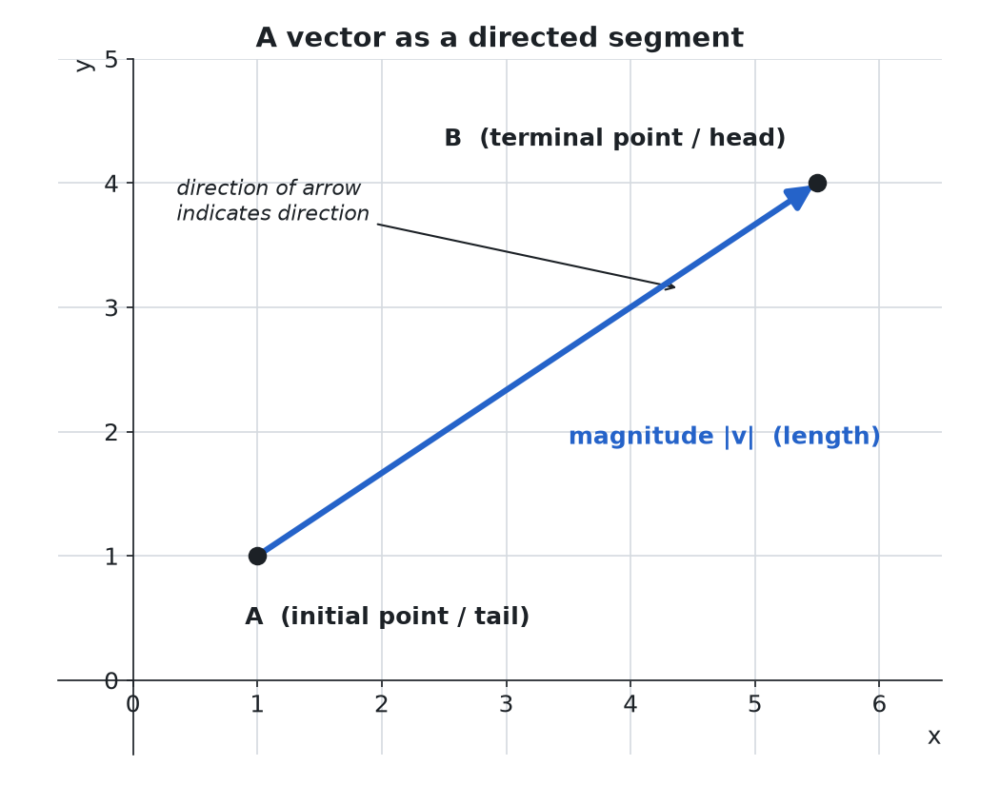
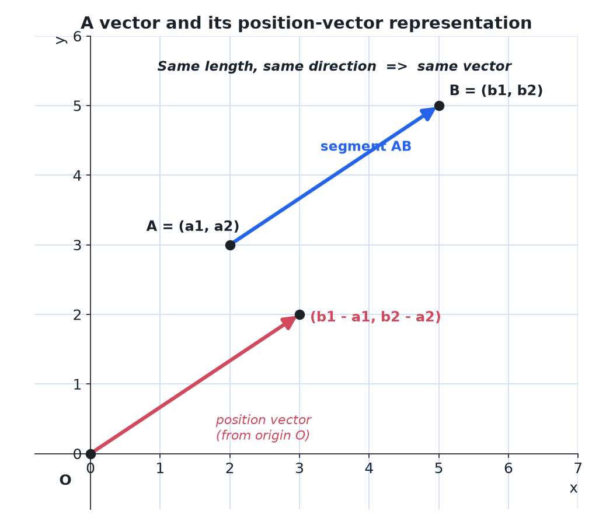

> [!abstract] Prerequisites & where this leads
> **Builds on:** [Geometry & Trigonometry](./geometry-trigonometry) · [Number Systems](./number-systems)
> **Leads to:** [Linear Algebra Foundations](./linear-algebra-foundations) · [Multivariable Calculus](./multivariable-calculus)

## Why Numbers Alone Are Not Enough

If someone tells you "the airport is 5 miles away," you still cannot get there: you need to know *which direction*. "5 miles northeast" gives you everything you need. The same is true for wind speed ("20 mph from the northwest"), forces ("10 newtons to the right"), and velocity ("60 km/h due south"). In each case, a single number (the magnitude) is incomplete without a direction.

A plain number that has size but no direction is called a **scalar**. Temperature, mass, and speed are scalars. A **vector** bundles a magnitude and a direction into one object. Displacement, velocity, force, and acceleration are vectors.

**The key insight:** a vector packages both "how much" and "which way" into a single mathematical object, and the rules for adding and scaling vectors mirror the way these quantities combine in the physical world. Two forces acting on a box produce a single net force; adding the two force vectors gives you that result.

> **Scope note:** This page covers vectors as geometric objects and the operations you can perform on them (addition, scaling, dot product, cross product). For the deeper algebraic theory (vector spaces, linear independence, span, basis), see [Linear Algebra Foundations](./linear-algebra-foundations).

---

**Vector:** A vector is a geometric object that has **magnitude
(length/size)** and **direction**.

It has an **initial point**, where it begins, and a **terminal point**,
where it ends.

Geometrically, we can picture a vector as a directed line segment, whose
length is the magnitude of the vector and with an arrow indicating the
direction.

## Writing Vectors

**Writing Vectors:**

-   **Boldface notation:** **v**, **u**, **w**

-   **Arrow notation:** $\vec{v}$, $\vec{u}$, $\vec{w}$

-   **Directional notation:** If starting at point $A$ and moving toward point $B$, we write $\vec{AB}$ to represent the vector

-   **Component notation:** Given an initial point $(0,0)$ and terminal point $(a,b)$, a vector may be represented as $\langle a, b \rangle$

    -   The symbol $\langle a, b \rangle$ has special significance. It is called the **standard position**. A vector in standard position has initial point $(0,0)$ and terminal point $(a,b)$

## Position Vector

**Position Vector:** A position vector is a vector that represents the
position of a point in space relative to a reference origin. It is also
called a location vector or radius vector.

The position vector is typically defined with respect to the origin of
the coordinate system. The origin is the point where all the coordinates
are zero.

The position vector will "point" from the origin of the coordinate
system to the terminal point.

There are several advantages to converting vectors into position vectors:

- Because the tail is fixed at the origin, a position vector is uniquely determined by the coordinates of its head alone. There is no separate initial point to track.
- This makes the algebra coordinate-wise: adding two position vectors adds their coordinates, and scaling one scales its coordinates.
- It sets up a clean point-to-vector correspondence: every point $(a, b)$ in the plane matches exactly one position vector $\langle a, b \rangle$, so geometry (points) and algebra (vectors) become interchangeable.

### Calculate the Position Vector

To find the position vector of a point, subtract the coordinates of the tail from the coordinates of the head. For a vector $\vec{AB}$ with initial point $A = (a_1, a_2)$ and terminal point $B = (b_1, b_2)$:

$$
\vec{AB} = \langle b_1 - a_1,\; b_2 - a_2 \rangle
$$

The result is the equivalent vector drawn from the origin, so its head lies at $(b_1 - a_1,\; b_2 - a_2)$. When the tail is already the origin, the head's coordinates are the position vector directly.

## Unit Vector

**Unit Vector:** Similarly to the unit circle, a unit vector has a
magnitude of 1.

A vector can be scaled "off" the unit vector.

Because scalars only change the magnitude of a vector and not the
direction, the vector will still be oriented in the same direction after
having been scaled.

A unit vector is similar to a position vector, except it has the
additional restriction that the magnitude must be 1.

### Unit Vector vs Position Vector

Both a unit vector and a position vector can be pictured with their tail at the origin, so they are easy to confuse. The difference is what each one carries:

- A **position vector** records both magnitude and direction. Its head sits at the actual coordinates of the point it represents, so its length can be anything.
- A **unit vector** records direction only. It is normalized to length 1, discarding the magnitude.

In short, a position vector answers "where is the point," while a unit vector answers "which way does it point." Dividing a position vector by its own magnitude produces the unit vector in the same direction.

## Magnitude

**Magnitude:** The magnitude of a vector is depicted by two vertical bars surrounding the vector: $\|\mathbf{a}\|$ or $|\mathbf{a}|$

**Vector magnitude** is calculated using the distance formula:

$$
\|\mathbf{a}\| = \sqrt{x^2 + y^2}
$$

**For 3D vectors:**

$$
\|\mathbf{a}\| = \sqrt{x^2 + y^2 + z^2}
$$

## Scalar

**Scalars:** A scalar is just a number, having size/magnitude only.
Remember, vectors have magnitude and direction. Scalars lack direction
and only have magnitude.

Scalars are often used to "scale" vectors by a constant factor.

## Vector Operations

### Vector Addition

**Vector Addition:** Add corresponding components.

For vectors $\mathbf{u} = \langle u_1, u_2 \rangle$ and $\mathbf{v} = \langle v_1, v_2 \rangle$:

$$
\mathbf{u} + \mathbf{v} = \langle u_1 + v_1, u_2 + v_2 \rangle
$$

**Geometric Interpretation:** Place tail of **v** at head of **u**, or use parallelogram rule.

**Example 1:** $\langle 3, 4 \rangle + \langle 1, 2 \rangle = \langle 4, 6 \rangle$

**Example 2:** $\langle -2, 5 \rangle + \langle 3, -1 \rangle = \langle 1, 4 \rangle$

**Properties:**
- **Commutative:** $\mathbf{u} + \mathbf{v} = \mathbf{v} + \mathbf{u}$
- **Associative:** $(\mathbf{u} + \mathbf{v}) + \mathbf{w} = \mathbf{u} + (\mathbf{v} + \mathbf{w})$
- **Identity:** $\mathbf{u} + \mathbf{0} = \mathbf{u}$

### Vector Subtraction

**Vector Subtraction:** Subtract corresponding components.

$$
\mathbf{u} - \mathbf{v} = \langle u_1 - v_1, u_2 - v_2 \rangle
$$

**Geometric Interpretation:** Vector from head of **v** to head of **u**.

**Example:** $\langle 5, 7 \rangle - \langle 2, 3 \rangle = \langle 3, 4 \rangle$

### Scalar Multiplication

**Scalar Multiplication:** Multiply each component by the scalar.

$$
c\mathbf{v} = c\langle v_1, v_2 \rangle = \langle cv_1, cv_2 \rangle
$$

**Effect:**
- Changes magnitude by factor $|c|$
- Reverses direction if $c < 0$
- Does not change direction if $c > 0$

**Example 1:** $3\langle 2, -1 \rangle = \langle 6, -3 \rangle$

**Example 2:** $-2\langle 1, 4 \rangle = \langle -2, -8 \rangle$

**Properties:**
- $c(\mathbf{u} + \mathbf{v}) = c\mathbf{u} + c\mathbf{v}$
- $(c + d)\mathbf{v} = c\mathbf{v} + d\mathbf{v}$
- $c(d\mathbf{v}) = (cd)\mathbf{v}$
- $1\mathbf{v} = \mathbf{v}$

### Magnitude (Length)

**Magnitude:** The length of vector $\mathbf{v} = \langle v_1, v_2 \rangle$:

$$
|\mathbf{v}| = \sqrt{v_1^2 + v_2^2}
$$

**3D:** For $\mathbf{v} = \langle v_1, v_2, v_3 \rangle$:

$$
|\mathbf{v}| = \sqrt{v_1^2 + v_2^2 + v_3^2}
$$

**Examples:**

1. $|\langle 3, 4 \rangle| = \sqrt{9 + 16} = 5$
2. $|\langle -2, 5 \rangle| = \sqrt{4 + 25} = \sqrt{29}$
3. $|\langle 1, 2, 2 \rangle| = \sqrt{1 + 4 + 4} = 3$

### Unit Vector

**Unit Vector:** A vector with magnitude 1.

To find unit vector in direction of **v**:

$$
\hat{\mathbf{v}} = \frac{\mathbf{v}}{|\mathbf{v}|}
$$

**Example:** Find unit vector for $\mathbf{v} = \langle 3, 4 \rangle$

$|\mathbf{v}| = 5$

$\hat{\mathbf{v}} = \frac{1}{5}\langle 3, 4 \rangle = \langle \frac{3}{5}, \frac{4}{5} \rangle$

Check: $|\hat{\mathbf{v}}| = \sqrt{\left(\frac{3}{5}\right)^2 + \left(\frac{4}{5}\right)^2} = \sqrt{\frac{9}{25} + \frac{16}{25}} = 1$ ✓

### Dot Product (Scalar Product)

**Meaning first:** The dot product measures how much two vectors align, since $\mathbf{a} \cdot \mathbf{b} = |\mathbf{a}||\mathbf{b}|\cos\theta$. It is positive when the vectors point in similar directions, zero when they are perpendicular, and negative when they point in opposing directions.

Drag the two vectors below to build intuition for all the operations at once: sum, difference, dot product, the angle between them, the projection of one onto the other, and the 2D cross product (the signed area of the parallelogram they span).

<iframe src="/static/interactive/vector-playground.html" width="100%" height="640" style="border:none;"></iframe>

**Dot Product:** For $\mathbf{u} = \langle u_1, u_2 \rangle$ and $\mathbf{v} = \langle v_1, v_2 \rangle$:

$$
\mathbf{u} \cdot \mathbf{v} = u_1 v_1 + u_2 v_2
$$

**Result is a scalar, not a vector.**

**Geometric Form:**

$$
\mathbf{u} \cdot \mathbf{v} = |\mathbf{u}||\mathbf{v}|\cos(\theta)
$$

Where $\theta$ is the angle between the vectors.

**Example 1:** $\langle 2, 3 \rangle \cdot \langle 4, -1 \rangle = 2(4) + 3(-1) = 8 - 3 = 5$

**Example 2:** $\langle 1, 0 \rangle \cdot \langle 0, 1 \rangle = 0$ (perpendicular vectors)

**Properties:**
- **Commutative:** $\mathbf{u} \cdot \mathbf{v} = \mathbf{v} \cdot \mathbf{u}$
- **Distributive:** $\mathbf{u} \cdot (\mathbf{v} + \mathbf{w}) = \mathbf{u} \cdot \mathbf{v} + \mathbf{u} \cdot \mathbf{w}$
- $\mathbf{v} \cdot \mathbf{v} = |\mathbf{v}|^2$

**Finding Angle Between Vectors:**

$$
\cos(\theta) = \frac{\mathbf{u} \cdot \mathbf{v}}{|\mathbf{u}||\mathbf{v}|}
$$

**Example:** Find angle between $\mathbf{u} = \langle 1, 0 \rangle$ and $\mathbf{v} = \langle 1, 1 \rangle$

$\cos(\theta) = \frac{1}{\sqrt{1} \times \sqrt{2}} = \frac{1}{\sqrt{2}}$

$\theta = 45° = \frac{\pi}{4}$

**Orthogonality (Perpendicular Vectors):**

Two vectors are **orthogonal** (perpendicular) if and only if:

$$
\mathbf{u} \cdot \mathbf{v} = 0
$$

### Cross Product (Vector Product)

**Cross Product:** For 3D vectors $\mathbf{u} = \langle u_1, u_2, u_3 \rangle$ and $\mathbf{v} = \langle v_1, v_2, v_3 \rangle$:

$$
\mathbf{u} \times \mathbf{v} = \langle u_2 v_3 - u_3 v_2,\; u_3 v_1 - u_1 v_3,\; u_1 v_2 - u_2 v_1 \rangle
$$

**Result is a vector perpendicular to both u and v.**

**Determinant Form:** Uses determinant with unit vectors $\mathbf{i}$, $\mathbf{j}$, $\mathbf{k}$ in first row

**Magnitude:**

$$
|\mathbf{u} \times \mathbf{v}| = |\mathbf{u}||\mathbf{v}|\sin(\theta)
$$

Where $\theta$ is the angle between vectors.

**Example:** $\langle 1, 0, 0 \rangle \times \langle 0, 1, 0 \rangle$

$= \langle 0(0) - 0(1),\; 0(0) - 1(0),\; 1(1) - 0(0) \rangle = \langle 0, 0, 1 \rangle$

**Properties:**
- **NOT commutative:** $\mathbf{u} \times \mathbf{v} = -(\mathbf{v} \times \mathbf{u})$ (anti-commutative)
- **Distributive:** $\mathbf{u} \times (\mathbf{v} + \mathbf{w}) = \mathbf{u} \times \mathbf{v} + \mathbf{u} \times \mathbf{w}$
- $\mathbf{v} \times \mathbf{v} = \mathbf{0}$ (parallel vectors have zero cross product)
- **Right-hand rule:** Direction given by right-hand rule

**Applications:**
- Finding normal vector to plane
- Computing area of parallelogram: $|\mathbf{u} \times \mathbf{v}|$
- Torque in physics

### Projection

**Vector Projection:** The projection of **u** onto **v** is:

$$
\text{proj}_{\mathbf{v}}(\mathbf{u}) = \frac{\mathbf{u} \cdot \mathbf{v}}{|\mathbf{v}|^2} \mathbf{v}
$$

**Scalar Projection (Component):**

$$
\text{comp}_{\mathbf{v}}(\mathbf{u}) = \frac{\mathbf{u} \cdot \mathbf{v}}{|\mathbf{v}|}
$$

**Example:** Project $\mathbf{u} = \langle 3, 4 \rangle$ onto $\mathbf{v} = \langle 1, 0 \rangle$

$\text{proj}_{\mathbf{v}}(\mathbf{u}) = \frac{3(1) + 4(0)}{1^2 + 0^2} \langle 1, 0 \rangle = 3\langle 1, 0 \rangle = \langle 3, 0 \rangle$
